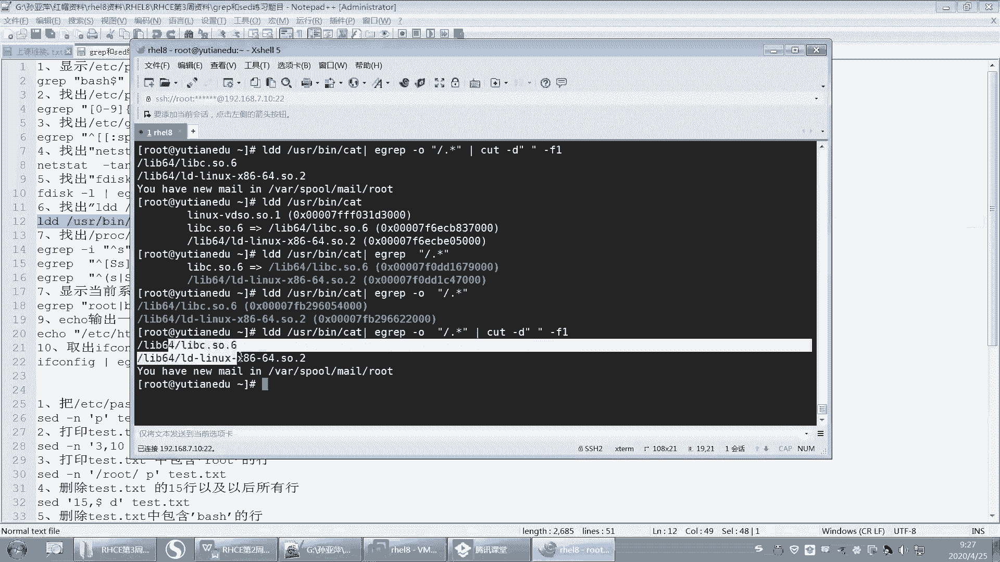
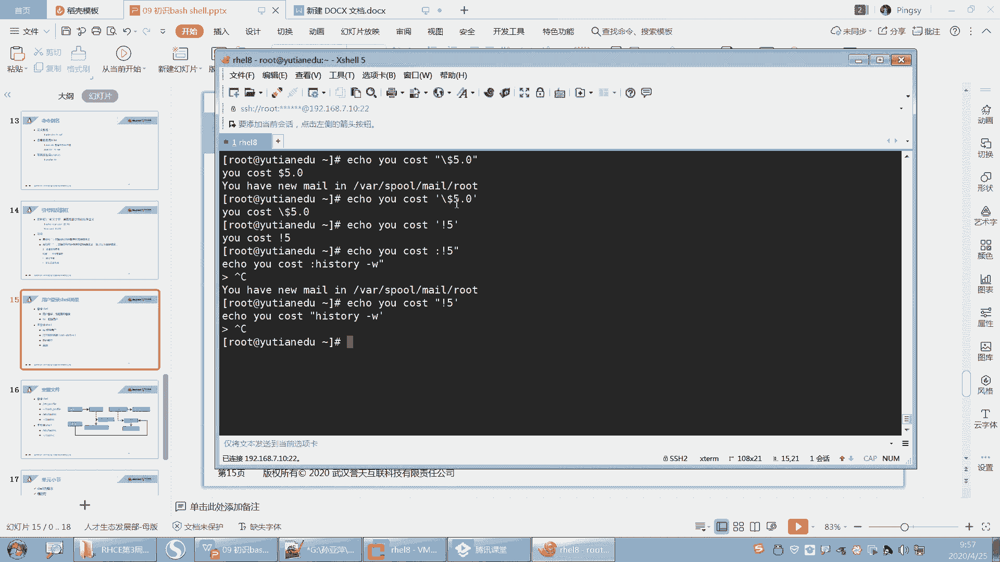
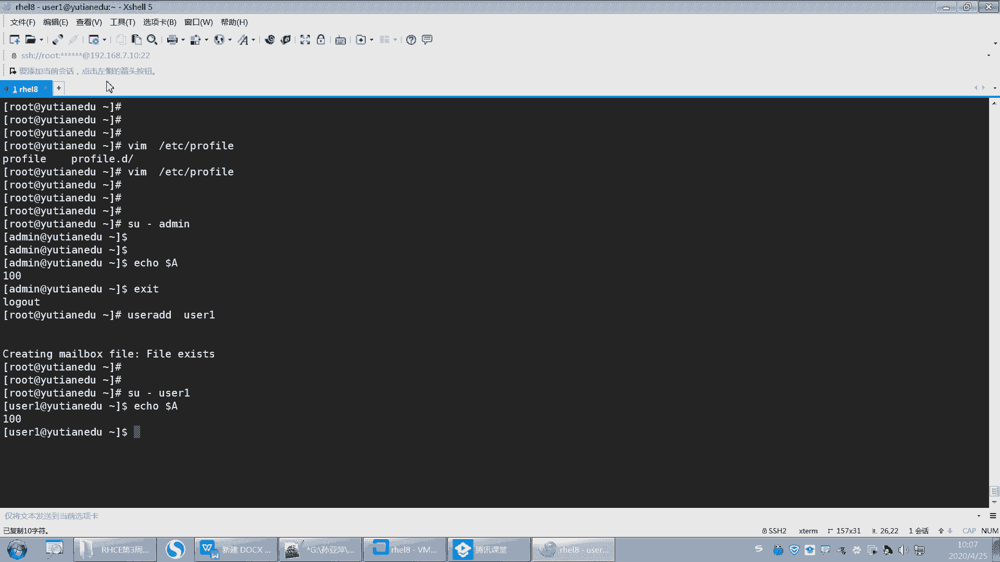
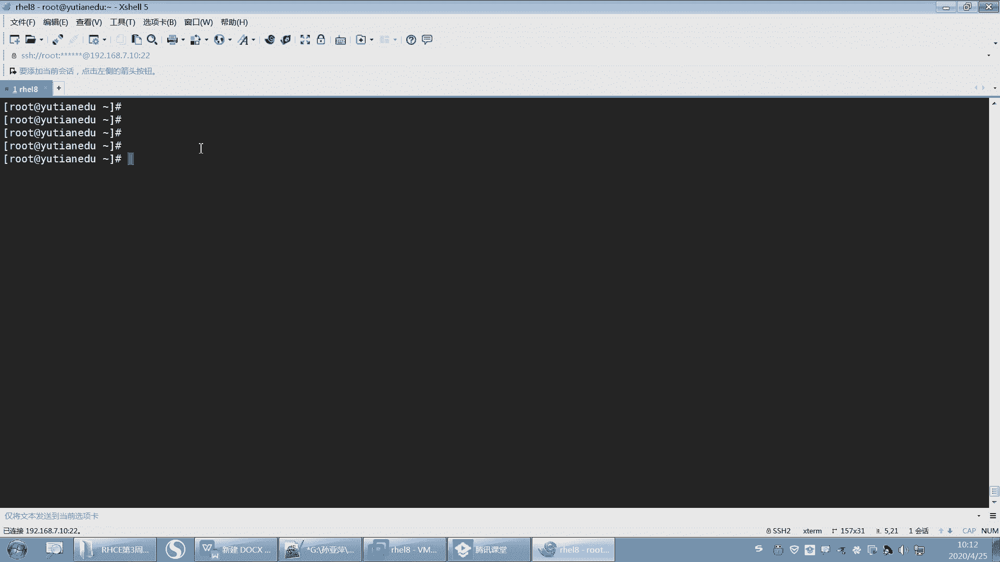

# 【誉天孙老师主讲】Linux入门／红帽认证／RHCE 8／RHEL 8.0／Linux基础视频 - P13：bash shell补充 - 誉天孙老师 - BV1Dr4y1A7jz

我们先把上周的作业给大家看一下啊。

后来教的同学我没来得及改，所以。嗯。看一下自己哪个地方有问题啊啊，包括之前改过的同学也要看一下啊，因为。

呃，有一些。我没有指出来，因为这个可能是题目理解，看我是怎么去理解这个题目的。包括如果你跟我理解有偏差，对吧？你是怎么做的，做的正不正确啊。

好。嗯，第一个创建一个目录。这个data是吧。好，这个没什么问题啊。第二个创建用户，三个用户，三个用户要求user一的加呃加目录在data目录上，该用户的描述信息为test user。呃。

us2的UID是2000是吧，us3的是这个he去登录的啊。

那第一个呢其实最大的问题就是这个shar对不这个这个加木录对吧？加木路说是在贝塔目录下面，其实这个我也没没说清楚啊。

呃，比如说你创建你一般情况下会做第一题，创建一个目录data，对吧？然后这个目录已经存在了。我看一下啊。我把这个以前的东西清一下。好。嗯，Uer一的加目落在data这个下面。

那当然也有同学直接这样去指的对吧？呃，如果你直接杠D的话。呃，这个就会有一定的问题。就相当于挖了个坑在这里是吧？Test the user。有仔衣。就这个地方啊，如果你指了的话。

那么data就会成为user一的加目录。当然这位同学还是在这个data下面指个user一，对吧？这个user一呢事先是不需要创建的。它会自动帮你去创建这个user一目录。那创建出来之后呢。

这个目录的权限。就是700，而且拥有人用组都是U则E。那换作是这个这样这种方法去做的话，就会导致我们的用户的加目录在data下。那data是我刚刚创建的对吧？刚刚创建。那创建好之后。

这个目录它是拥有人用组都是root，而且权限是755。所以优子一对这个目录没有写权限啊，才会导致最后又会报错了。比如说你这样去创建，创建好之后，那你创建的时候就会报错。首先加目录已经存在了。

所以杠低指定加目录的时候，加目录可以不用存在啊，而且是不需要存在。对吧然后什么时候报了一些错。那你再切到U级的话，到后面。嗯。虽然进来了，对吧？没什么问题，但是。嗯。

你看有一些这个我们说加木下面会有一些这个这个什么这一些文件，但是是没有的对吧？而且你对你加盟应该是没有写权限的。好，这个是这道题啊，ts used的话这个我就不说了。然后USID指定的话，杠U。

然后us add杠SSB no log in对吧？有的3。A11钢机。那755对吧？好。这个杠D指的再说一遍啊，这个杠D指的是password里面的啊。

它只会去修改这个password里面那个呃加目录那一栏那一栏。好，第三题，创建组GID为3000。Group a。将这三个组加入到ITIT组里面。啊，这个怎么加进去看你啊，这个这个你没问题。

然后要求IT组内的所有成员都可以在IT目录下面创建文件和删除文件。那就需要对这个目录要有写权限了，对吧？啊，目前为止我们学到的只能是什么组，我要是这个目录的组，并且。组需要对他有权限。

所以你要首先第一步要设置它的组为ID组。然后把再把这个组的这个这个权限加上，对吧？RWX啊。这样的话，这个组内所有的成员都可以对这个目录有写权限了。好，这个下面有自行测试。Uer3登不进去。

因为它是非登录需要。知道吧？free登录 share。哦，不是说非登录 share啊，它是这个SB no log in这个 sharere是吧？这个he要是没有办法登录的。呃，那既然没办法登录。

为什么要创建这个用户？将来我们有很多的用户都是无法登录的啊，就是它仅仅是无法登录这个操系统呃，但是呢他可以去用这个系统上的资源，对吧？这个user3啊。啊。

然后第六题给IT组更名为cloud组group mode，刚刚这个没什么问题啊。大家在更名的时候，比如说老师我也可以去到group当中去把这个栏位改成cloud，对吧？但是这种方法不太好。

因为你这样改的话，可能会有一些其他地方没有改。比如说我们加入的组组名有没有有没有可能没有改，对吧？所以最好的方法就是用命行去改。group mode这样的话，把所有跟这个IT组相关的全部会改成clo组。

这个地方要注意啊。好，新建组用户ID user1ID user2将呃ID user一的加入移动到这个data下面，ID users是吧？这个的话嗯。说移动到加目入移动到这个艾 users是吧？

这个应该写成改成IT user对吧？好，这个移动的话嗯，首先啊你的加入要变成什么date ID users是吧？ID user一的加木了要变成它吧。然后为什么要说移动呢？是因为。这个下面还有一些什么？

加入下面还有一些文件，所以你在做这一题的时候，要注意在这块加杠MD啊，而可直接指D直接指D的话。嗯嗯。这地方如果你直接指D的话，那么就会将password里面那个改成它，对吧？啊，改成它之后呢。

你再切到这个IDU字一字的时候，又会报错了。是这样吧。因为有一些变量没有改过来，变量在那个什么一些有一些隐藏文件，所以你要加个M啊，加个MM就会改成它之后。然后又会把加盟下面的文件移到什么，移到这个。

新的这个账目下面啊。

嗯。嗯，看一下啊。啊，比如说我们创建了一个用户use add。IT user IT。U则一是吧。好，然后这个时候呢，它需要把这个user mode修改一下项目杠。如果你直接杠D的话。会怎么样？

data下面的。I T users。然后IT userE是吧。这样也可以改，就改的话呢，它只会变成了这个。

这个里面是吧，这嗯。这地方是改了对吧？然后你切到这个。ITU则一。No。他就会报错了，不能切过去。还在这里，对吧？他想进入到这个部分下面，但切不过去，因为你还要复制，还要杠MD啊，要把一些这个。

移过去这样移过去啊。好，你再来一遍user dial。杠R。I T users。好，然后再来啊加一个M的时候。呃，哦，优先优先创建是吧。IT user一。然后再来。这应该没问题了。ITU。No。

这个它没问题的啊，所以大家要注意，因为这个下面会有一些这样的文件，你要加一个M把它移过来，你手动移或者是怎么移都可以啊。好，第九题，这个没什么问题，改用人权嗯，用人用组权限。嗯。第十题哦。

还有一点啊呃说到第十题给cloud组设置临时的登录口令。这个临时的登录口令呢。它是给用户啊，给组设置密码，对吧？给主设置密码。我们上课讲到一个命令叫G passwordsword。

G passwordword后面加一个组名。嗯。上课讲过了啊，但是还是有同学犯这样的错误，他是这样改的，use the mode或者是us the a。这样杠P是吧，这样就指定了。

当时是不是说过这个杠P指定的这个用户名，对吧指定的这个密码是无法登录的啊，所以这个不是登录密码。是加密过后制的密加密过后的密码啊，所以大家不要去这样去指啊。

给用户修改密码还是呃password给主修改密码叫Gpasword。非常注意啊。好，第十一题，在time保幕下创建这个文件夹，并并创建时指定文件夹权限为764。创建的时候，我们可以加杠P呃。

同时指令文件夹权限是764。杠M是你看你慢你卖这个MKDR啊，它里面会有个选项叫杠M，它可以去怎么样？它可以指定这个用户的权限啊，这个这个目录的权限764。所以你可以一步搞定啊，当然你分开也可以。好。

第二呢呃第十二题创建这个文件夹，要求递归文件的用人为user一用组为user2。好，那我这个地方这个地方其实呃有个坑是吧？嗯，首先啊。创建这个目录的时候。

我们最终其实创建的目录是technology这个目录，对吧？那这个呢是什么？是它的一个副呃副目录，其实前面都是它的路径。所以在你给它修改，比如说你再给它修改这个。好，这样我把它创建出来啊。好。

你杠加一个杠P把它创建出来了，对吧？那你以后再去引用这个目录的时候，比如说你引用这个目录。然后给他把拥有人改成user一。好，因用组我们改觉addmin好吧。啊，那如果你这样去改的话。

那么它改的目录是最后一层目录，注意啊，是最后一个tenology这个目录的拥有人和拥有组。那。你要递归的话。是不是往它往下递轨呀，那它下面递轨对吧？但是刚好这一题呢是因为这个目录下面它没有文件和目录。

所以有同学就疑惑了，就是哎呀是不是把它有同学写到这儿，比如说这个同学他就写到什么，他就写到cents，对吧？那如果你写到sto递归的话。

那么ss拥有权限就会变成了us子拥有人和拥组变成us userer2。那同时technology也会变。因为它是从stos这一层开始递归的，当是这一层的目录权限也会改。所以大家要注意这个地方啊。

你引用的是这个目录。那么它改的是最后一级目录。一定要注意啊，那如果你修修改是它往下递归，那么这个目录跟这个目录都会改。好，这个是大家注意的地方啊，递归。好，第十三题。所以这道题其实我指定的是这个啊。

是这个目录的，往下递归，你直接在这个地方加上这个目录就可以了。然后杠2虽然目录下面没有文件，也没有目录，那没关系，不管它啊。啊，十三题group一组指定ID为2100，创建这个文件夹。

要求权限为要求设置tab group一的文件夹，用有组为group一是吧？这个只是设置一个组，这个没什么好说的啊。好，然后这个十4题U子级的加木创建这个好，这个加木是之前的嗯改了是吧？没关系啊，这个你。

呃，你自己改一下题目，或者是自己做一下也可以啊。好，要求指定你看指定文件夹权限为递归指定，对吧？所以你看我指的是homeusU这个就没问题啊，600。好，因为有可能user一的这个目录。

最后一级目录下面是有文件和目录的，所以递归的话就往这一层目录往下递归啊。第十五题，在tamp文件夹上创建这个。cap demo我就讲，并且复制它的权限是吧？好，这个上课没有讲，呃。

有同学是直接把这个什么创建这个文件夹啊，它是把这个文件夹复制成demo这个文件夹，对吧？你复制它的权限，我其实不管你怎么去把权限复制过来，但是你不要复制文件夹吧。😊，对不对？

你不要把它文件夹把这个user与文件夹复制给demo，这不行啊。啊，这其实里面有一个选项叫杠杠reference的选项，你可以去man这个呃change mode里面啊。

它会有一个更高reference的选项。当然你说我要是我自己改成600，行不行，也可以啊。好，它是参考这个权限，然后把权限复制给demo，就这个选项叫杠杠reference。啊，有同学已经找到了是吧？

就参考它的选，参考它的权限给demo。啊，第十六题。将password按着UID的大小进行排序，降序要降序啊，结果保存在这个。root password点 baker这个文件里面是吧？好。

st我们来看一下啊，我们说要按照UID的大小进行排序。那么UID在第几列，我们说是在第123第三列，对吧？第在第三列第三列要按呃第三列，那你要指定分割符啊，就是杠T冒号指定分割符杠K3第三列123。

对吧？好，然后这个R呢是指降序，因为默认是升序啊。默认是从小到大，对吧？好，那你就要加杠R，还有一个是N，这个N这个选项呢。呃，指的是我可以把它当做这个数值的大小进行排序。嗯，否则就当自符串牌了。

能理解吧？否则就当字符串排了啊。所以有可能如果当字符串排100有可能还小于2。就这样子啊，它是按照第一个字符上，偶是一，第二个字符上是2这样排是吧？所以你要按照字符串的二应该在什么？二在100的前面啊。

所以要当数值排的话，2在100的前面啊，所以加个杠N啊，这两个选项进行合并了，对吧？这个因为没关系，这个两个它没有接参数。但是这两个选项不能合并，因为杠T后面有个参数，杠K后面有个参数。

当然这个参数是可以这空格可空开的。有同学说老师不空开好像也可以对吧？是的，就是你这个地方你空开也行，不空开也行，这个是可以，因为它可以识别，这是个短选项，后面加一个后面这个短选项的这个字母的。

后面就是它的选就是它的参数啊，所以这个地方可以不仅不用加空格。啊，但是这两个的话。这两个合并的话，它是两个选项啊，那这是两个选项，OK吧。选项进行合并。所以不要弄混了啊。嗯。啊。

这个我就不演示这个上这是我上课做过的，这个同学做的很好，你知道吗？你把这个。那个做这个这个这个是OK的啊。好，然后第十七题定一个别名copy，要求当所有用户执行copy的时候执行的是CP杠2这个是吧？

好，后面呢这个时间我是标了个备注啊，要求是备份当天的时间，对吧？那么这个时间呢，就是今天备份我写是19号，那我明天备份可能20号，那今天25号了，对吧？所以你今天备份就25号，所以这个时间上课我也讲过。

它应该是动态的，它是一个应该会有一个什么来生成一个时间，生成到那些时间，对吧？好，这个地方用data呢用data这个地方呢后面这个是我们学过的吧。这是之前我们第一周的时候就学过这个时间怎么去改。

改成这个格式。好，还有的同学把data这个地方做成了一个变量。他是这样做的啊他是这样做的。呃，或者是data这样做了个变量是吧？然后用do了data去引用这个变量。呃，然后还把这个变量给。呃。

变成环境变量了，也就是说它export了。嗯，export这样，我看有同学这样做啊，但是我觉得这样不好，嗯，不太好，虽然也能实现。但是呢你这绕了几大圈啊。

其实没必要完全这个命令它就可以让我们怎么样呃让我们去实现啊，因为你定义成变量，再引用变量，引用变量有可能会有一些风险，也不是就是有可能会引用不到啊。

或者所以在后面你们尽量像这个变量也是我们自己定义的对吧？嗯，有同学可能之前学过，所以他也做成功了啊，应该是有两个同学，两个同学都都这样做的，就定义了个变量。呃，其实这题没必要去定义变量啊，虽然也能实现。

好，然后这个地方就这样做啊这个。爱丽丝。copy这是别名，等于后面是你要执行的这个内容。啊，执行copy时候就执行就后面这个对吧？😡，这个没有什么疑问了吧。有作业有疑问，大家可以提出来啊。嗯嗯嗯。哦。

第十八题同学说也不会做是吧？😡，第十八题上课也讲过了。第十八题啊，查找ETC下所有文件内容包含pass。字符串的文件。呃，并且显示这个字符上在哪个文件的哪一行。

上课我是不是讲过gragra会有一个什么gra会有一个选项叫杠R的选项。对不对？他可以去根据。根据一个字符串去查找这个字符串在文件的哪个在哪个文件里面。比如说我是我这道题是查找什么pass这个字符串。

对吧？好，后面你可以接个什么，可以接一个目录，它的意思是查找ETC目录下面。所有的文件当中，哪个文件是带有pass的？如果哪个文件带有pass，它就会打印出来。也就是说这么多文件都是带有pass的。

看到没有？那这个文件的这个地方是带有pass的是吧？啊，有同学想各种办法，有fin的，反正反正范的反正也可以实现，是吧？其实就一条命令杠2。就可以搞定了。我不会做啊，这个上上课没听，而且你没有看笔记。

其实。大家我那个PPT上面已经写的很详细了，你只要上课听过了呃，并且上课稍微做了一下笔记。然后下课你根本没有从没必要从头到尾把视频看一遍，只需要把我的PPT拿出来，把你的笔记拿出来。

然后就可以做就可以把所有的题目都做了。其实有个别做不出来也很正常。嗯，然后再不行，你百度一下是吧，最后实现了不也行吗？对吧？只要你能有本事做出来就行啊。啊呃，OK这个就是grave杠R啊gra杠R。

然后我要显示在哪一行，所以加了个杠N。那加杠RN是吧，然后pass。好，这个就是十八题啊，十八题。嗯。好，下面我们看一下正则表示这个地方啊，很多同学都没有做。嗯，这个下次不搞这么难了啊。

要不然同学直接放弃了是吧？我看好多学同学直接放弃了，做不出来，搞不出来。🤧嗯。好，呃，其实你把能做的你就做上去就可以了。我看一下他做的情况。嗯，就是没做的，你可以再下去再去看一下。

或者上课到时候再听一下。好，我们先看一下这位同学做的啊，呃，他基本上是每一道题都做了的，看到吗？而且实现了这些答案，我没有给他们，真的没有给他们啊，就是没有给你们任何人。但是你看。

他全部都完基本上都完成了，而且不止他一位同学呃，前面叫同学基本上都完成了，而且完成的非常好。你看。然后呢基本上按照我的要求都完成了。应该这种是吧，每一道题都做了。呃，且不说他跟我的题目对吧？

可能有的时候会有一点差距，但是也没关系，但是它基本上是吧，你只要做了，你基本上每一个这个这个什么这个呃。这个正则表式里面哪个怎么用？其实你只要做完这这些题的话。

你平时的graSED的功能基本上都能完成了，绝大多数都是可以实现的了啊。但关键你就不做嘛，嗯就没时间嘛。哦，你今你这周没时间，我相信你以后永远都没有时间。

那都实现了，看到没有？所以做的非常好啊。而且上课基本上我都讲过了，但是你不做没办法啊。好嗯，那来看一下啊。我给大家总结了这个答案啊呃，你可以按照我做，当然你也可以按照你说老师我的方法比你更好也可以。

因为我的也不是一定说是最好的，你看一下我怎么做的，对吧？别人怎么做的啊，待会我下课的时候，我把这个雷浩的同学把这个发给大家，大家可以看一下他怎么做的。啊，第一道题显示ETCpa文件里bu结尾的行。

这个以什么什么结尾，我们说就多了符号，以什么时么开头用间号，对吧？这个没什么好说的啊。然后第二个是找出pasword当中文件有三位或者4位的数。就是password里面有一个数值是三位或者4位的，是吧？

啊，首先你要准备一个数值啊，那一个数字是不是就是0到9，这个是中括号括起来，0到9代表一个数字啊，这个数字出现了多少次呢？三次或4次，就小括号括起来，3逗号4。嗯，就可以实现了。那3逗号4。

而且为什么用egra？因为这个括号后面这个这个括号是扩展扩展征则，所以用的是egra。如果你用group的话。那你就要加一个什么，加一个杠大E这样子啊，加一个杠大EOK吧。好。

你可以去查一下吗。我到时候这个也发给大家，你可以再去。测一下。No。

对吧三位或者4位的数字都找出来了啊。啊，第三题找出ETCg up呃，to点CFG文件中，至少以至少一个空白字符开头。也就是说呃它要有空白字符开头，并且后面又跟了空半空呃非空白字符。为什么加这个呢？

因为空行不算呢？对吧我们不算空行啊。啊，那至少一个空白字符开头至少一个嘛，那一个的话是用什么用什么呀？这个是空白字符，对吧？😡，看到没有？这个是这个间号在中括号的外面代表是以什么什么开头。

然后这个是什么？这个是这个space，这是一个是一个这个这个空白字符啊，那这么空白字符出现了什么？1到多次，因为加号代表是1到多次啊，然后后面呢这个指的是什么？后面又有一个非非空白。

因为中呃间号在中括号的里面，所以它指的是除了什么什么以外，那就是说除了空白以外的字符。OK吧。好，第四题我没有给大家出啊，这个我就算了。第五题这个同学说老师没有是吧？没关系啊。

你只要把这个正子表式写出来就可以了。因为有时候装磁盘的时候，我们选的不一样啊。啊，中括括起来的表这个一个字符对吧？S或H，然后后面是A到Z啊，A到Z。这个比较简单吧。然后找出这个啊。

这个有同学说老师没做出来是吧？嗯，好，它是找出ALDUSR并ca这个命令中结果命令结果中文件的路径是吧？好，我给大家看一下我做的啊。最后要实现什么样的效果？

好，你可以看一下啊，我们先。现在是不是实现了这个命令执行的结果是这个对吧？其实我要找出的是这个路径和这个路径看到吗？那这个路径跟这个路径啊啊，那么这两个路径怎么找到呢？

我们可以用匹配group e group杠O啊，E group的话，我们可以这样啊。呃，如果是一 group匹配的话，我们不加杠窝的话，看一下。他就会把后面这个你看这个是斜杠嘛，点是不是任意字符啊。

然后心是指它前面这个出现了任意次嘛，其实这中间就是。任意个字符，任意多个随意的任何一个字符。那么以斜杠开头对吧？斜杠开头，那么后面匹配到了。好，后来加个杠窝杠窝指的是什么？杠窝指的是它只匹配。哎。

匹配到了这个地方就显示，其他都不显示了，这些就不显示，只显示这个就是杠窝的意思。好，然后路径的话，我们可以用什么用空格呀，这种分隔符，然后把那最后一个是不是路径，那后面这个不路径嘛，不是路径吧，对吧？

所以把它给过滤掉，O吧，就这样子。所以这个是这道题啊，就把它给过滤掉了啊。

好，路径截取出来了。啊，第七题，pro memory inform文件当中要求以大小写S开头的行，至少用三种方式实现啊，这个有同学也做出来了啊，以什么呃，这个忽略大小写，然后这个是一个以什么什么开头。

对吧？这个是一个做一个整体，然后S或者是小S或者大S这三种方式都可以啊。啊，这是扩展政则里面的是吧？啊，第七题，这个是什么或什么或什么，这个就扩展正则嘛。用竖杠隔开，这个没什么说了啊。

看PPT如果还不知道的话啊。第九题，输出一个绝对路径，要求用egroup，这个也不用说了吧，这个就是典型斜杠，就是直接把ETC截取出来。那呃里面包含一个斜杠，还包含一个斜杠，这个两个斜杠中间是么？

中间有任意个任意一个字符。然后这个杠窝指的是直匹配这个。啊，把这个提取出来就可以了，只直接显示ETC那我说提取出ETC对吧？我说例如。它的话就提取出ETCOK吧。好，然后取出一ifconIPV4地址啊。

这个呢呃有同学做了。

老师这个IPV4地址是吧？呃，IPV4地址的话。我们知道IPV4地址是在这个地方。是样吧，是不是在这个叫annet是吧？哦，那那你结的时候，那你就要结是么？andnet但innet这个地方又有什么？

又有这个。呃，有个6是吧，这是IV6地址啊。所以你要加一个。杠W就可以实现吧。你看杠W是不是就可以实现呀？啊，然后你这个就随意了，这个应该会了吧，这个就可以多种方式去实现了。比如说AWK啊。

或者用我们学过的，我说上课讲过了一个cut啊，或者讲一个TR是吧？首先因为有多个空格，所以我们可以把这个多个空格变成一个空格。那这样的话，我将来就可以怎么样就可以去以空格为分格符啊。呃。

以空格为分割服务。呃，D是吧。然后是第几列啊？哦，那就是第三列。

对吧那这样是不是就出来了？啊，或者用AWK来实现也可以啊。有同学用AWKAWK呢就是第几列，就是第一列第二列对吧？AWK这样的。

呃，AWK然后。嗯。嗯，print是吧。do了2。好，这样啊就是第二列，不是你多了二，就是第二列。你你想打，比如说打一第一列，那就多了一。多了二多了一降，而且可以改变它的任意顺序，看到没有？啊。

然后它默认是以空格为分隔符的啊，会打印出来这样。

啊呃，这个是grave部分的SED的话，前面其实有很多都我都不说了啊，这都讲过了，上课期也讲过了。然后第三行的第三行的第十行。是吧。然后这个是匹配一个正则表达式，这个正则表式里面可以是字串嘛。

也可以是正则表达式来表示，是吧？然后删除test呃，15行以及后面所有的行，15加15到doll了是15到最后一行是吧？所以dollar符号就是最后一行D就是删除的意思。啊。

然后这个teacher插替换就比较简单了吧。S将原来的这个root替换成TOOR并打印出替换的行是吧？然后P打印。好，第七题是将这个替换成这个，那这个也没什么，这个也很简单。因为这个里面有个斜杠。

所以你可以把原来这个替查找替换的这个斜杠换成。艾特符号或者换成任何一个字符都可以。比如井号啊。感叹号啊对吧？都可以啊。那你不想换的话，那你就把这个给加一个反斜杠，前面这样子。去掉它的特殊含义。

加个反斜杠啊。好，然后第八题。呃，5到10行所有的数字匹配数字嘛，那就是这个数字是不是就这样匹配啊？1到多个吧，对吧？数字，那你数字至少要存在一个吧，所以就是加嘛。然后这政则这是扩展政则。

所以要加杠R杠R看到没有？5到第十行S就是替换，它要替换数字替换成空就删掉了。然后即是这一行的每一个查找到的这个匹配到的词啊。都替换。啊，然后P打印。好，删除删除这个地方啊。

他说删除test这个所有特殊字符是吧？其实除了我们正常的数字大小写以外，其实其他的基本上都是特殊字符。所以你就把这些都排除掉就行了。对不对？0到9A到Z大A到点大Z。然后加是1到多个字符，然后替换成空。

这个就啊加正这是扩展政则是吧？因为加号嘛，加号是指扩展政策里面的，所以加个杠R。哦，然后这个是在20行前面。加入AAU是吧。啊，哦，这个是题目的问题啊，这个有同学是在20行的行首加入AA哦，这个是哦。

我这样写的话，就是在20行的上面一行加上AA，因为这个是指。插入是吧，插入，然后A的话是追加，就在下面一行。查呃加入是吧？然后这个是嗯嗯。这是在上面一行插入啊。好，这个上课也讲过了吧。

将第一列都加上一个井号是吧？这个代表是最开头啊，然后都换成井号啊。然后这个也讲过了上课。是不是上上课也讲过了，对吧？将test每行的第一个字符删除嘛？第一这点就代表第一个点代表一个字符，对吧？任意字符。

啊，将这个任意字符替换成空没了，对吧，就就就删掉了。🤧好，第十三题我讲一下啊。呃，第十三题。

我们来看一下啊。现在还是要求password的所有单词进行统计测频，并输出格式为一行每一个单词，一行一行一个单词是吧？好，并且要求是这种格式root2这样。啊，首先我们是要进行排序，对吧？呃。

那排序的呃，不不进统计持频。同期持频的话，我里面有很多很多特殊字符。比如说我们呃像这个封号解封号。分号它是B个风格符啊，然后前面后面都可以是一个组呃词品，是一个单词，对吧？

而且这个反斜杠是不是也是反斜杠前面，后面是不是也可以是一个次屏，所以你可以将这个反斜杠将来去掉，或者是以它为风割，把它替换成这个换行符。啊，然后这个这个冒号也要替换成换行符啊。

而且数字的话我数字你排不排这个都行，反正你把数字也可以去掉，就只排那个单词嘛，字串对吧？呃，数字去掉的话，去掉也好去，就杠R我就把它去掉了。嗯，那你就可以去掉SED吗？うんうん。杠R，然后查找替换S。

然后中括号。0到9。然后是加号对吧？然后出现，然后替换成空，然后记这样子。啊，这是把数字的去掉了。数字去掉之后，你还要把什么？你还要把空呃这个这个符号，比如说这个。这是一个冒号是吧，把它替换成换行符。

换行符是反斜杠N啊，这个是换行符。这个是换行符的意思啊。啊，然后再来你还有一个斜杠吧。呃，斜杠是吧，斜杠那就是呃这样的斜杠啊。这样的斜杠，然后也替换成换行符。呃。对吧然后这种就是空行了啊。

空行了就不管它行。啊，然后你再进行一个排序。Thought。那排序因为排序的话，它会将什么相同的数排在一起。然后排完之后。你就可以怎么样？我们有个统计视频叫叫unicor。杠C是吧。

是不是unor杠C啊，unicor是指将相邻的。呃，因为已经排过序了，所以将相邻的这个数呃进行排呃，统计有几行相同的。就有几行相同的。好，那么这边他就会将把它的相同的行就出现相同的行就出现。

因为一行就是一个单词，所以出现这个这个词名出现42次。啊，那我们可以改变它的顺序。比如说呃可这个是空格，空格出现了211，你可以把它过滤掉，这个也可以把它过滤掉。好，我们就不管它了啊。

然后还要最后一步是把它打印出来是吧？打印出来的时候，我们是单词在前，那个在后面，那就是杠F。杠A哦，不用指定了是吧，默认是空格。啊，单引号引起来print。打印。第几行呢，先打印第二行。

然后先打印第二列，然后再打印什么？第一列回去了。OK这个就是实现了啊，前面是单词，后面是词频。对，后面是磁平啊。OK吧。

看大家还有什么问题吗？没做作业的同学，估计我现在再讲一遍，你也不知道，因为我不可能再从头到尾跟你讲一遍这个怎么实现那给你演个例子。因为上在上周我讲课的时候，我就已经给大家演示过了。哦，这个。

我现在这样讲，你只能做过了，你才能听懂。没做过的话，我估计估计还是不知道我在讲什么。上周的没有没有把它给。补起来啊，O吗？这个地方。看大家还有什么问题吗？所以作业一定要做啊，因为我其实那天非常生气嗯。

当然也是为了大家考虑啊，因为我不希望大家任何一个人落下太多了。如果你不做的话，你就真的就是你越拉越多越来越多。这是一个恶性循环，不太好。嗯。好了，那我们。哦，我们继续上课了啊，这个我没有给大家改。

因为大家做的方法方式都不一样，而且你用的一些这个我还要去验证，所以我没有给大家改，我只把前面给大家改了。不过这个地方你可以去参考其他同学做的，或者是参考我做的都可以。只要你实现了就没什么问题。

而且要尽量用简单的方法去实现啊，不要搞太复杂了，越简单越好啊，越简单实现你的目这个这个这个这个功能是最好的啊，最好的方法。好，因为上周的话我们呃这个share这块其实没怎么讲，嗯没没讲完吧，嗯。

作业不好布置，所以我就布置了一个别名呃，但是我们。其实这周如果两天都上的话，我把谢尔会把谢尔所有内容都上了，这样的话作业还脚本都好布置，但是又上一天，所以很麻烦啊。呃，等今天上完的话。

我们先布置一点作业，然后回去大家先做着，做着的话到下次再一天是吧，然后再一起交上来啊。好，这个等我下课的时候再给大家说一下。好，我们来看一下上一周的这个上一周的内容啊。

上一周的我们是讲到了share but share，对吧？来回顾一下，大家记不记得啊。大家都很忙，我很能理解啊，我理解大家可以很忙，但是这个要把握好安排好自己的时间啊，我没办法替大家做主。

所以大家尽量呃。安排好自己的时间，学习，还有工作的时间。好。嗯，bu share我们讲过he是什么，对吧？回顾一下啊，hear是什么，然后bu share又是什么呢？对吧？我们这里有一张图。

可以可很清晰的看到这个here。你只要记住一句话就可以了。share呢是连接我们的这个应用程序或者命令啊，你敲了一些命令，那么它的一个桥梁，对吧？我们要用内核去识别到，我们敲个命令是什么意思。

那么这个时候我们需要通过share来去传递啊，那不同的share我们可以传递不同。比如说我们同样也是输入，比如说我们可以上下键啊，table键啊，或者是敲个命令。

那最后你通过不同的share解析出来的解析出来的这个含义是不一样的那我们经常会用的一个share叫把 sharere。嗯，这个是bush sharear啊。

所以我们最流行的hearlin当中最流行的hear就bu气。所以大家学会bush就可以了。好。嗯，以及我们回顾一下bubsh的一些功能，对吧？啊，我们学了通配符务。其实这个呃我们在正则表示里面也可以用。

像这种在正则表达式里面也可以用，也是可以用的啊啊，但是我当时没有说，不过有同学也问也用了。这个也是在正治表示里面，也可以用跟这个通配通配符的用法是一模一样的啊。好，之前我们讲过通配符，还有正则表示。

它们的区别在于通配符主要是用来通配文件名的啊，就是文件名，它是什么呢？它是share的功能，它是把 share的功能。注意。通配符是bu share的功能。也就是说。如果你换了一个he。

那么星号可能就不是星号了呃，星号可能就不是说它匹配0到多个字符了，问号可能就不是匹配单个字符了，对吧？但是我们的这个。呃，正则表达式。正则表示一般是匹配字符串的，是不是匹配文本内容的。

正则表示几乎在所有的语言当中几乎都是通用的，几乎都是通用的啊。这点要记住。所以在我们去处理文本的时候，我们一般用正则表示，注意啊区分啊，处理文本的时候，就是正则表示匹配文件名的时候，我们用的是彭佩符哦。

可吧？好。呃，以及我们还学了什么命令的扩展符号，波浪波浪号啊，加目录，对吧？还有这个多了加小括号，是指调用命令执行的结果回顾一下啊，把你的笔记拿出来。调二用命令执行的结果，然后还有反撇号跟它是一样的啊。

啊，然后还有大括号是依次匹配，括号里面内容，还有点点一连续的连续的这个部分是吧？连续的数字数值或者是连续的字符串，我们可以用点点来连接起来。呃，然后我们就学了变量。好。

我们现在来回顾一下我们学过的变量啊。因为接下来我们还是会继续讲变量。啊，我们上周应该是讲了两个两种变量是吧？两种变量啊，第一个就是本地变量。本地变量特点在于它只在当前shaar中有效。

而环境变量呢是在当前shaar和子shaar中有效的变量，叫环境变量。那么子线可以继成什么？如果一个变量是环境变量的话，那么子线就可以继承这个环境变量了啊，就是你切换到子线，我们怎么切的时候。

我们用当时是用bush这样子去切到一个子 share里面是吧？加个子线里面啊。😊，啊，这样会继承叫环境变量啊，叫环境变量。好，我们怎么去查看本地变量，怎么去查看所有的黄金变量，怎么取消这个取消变量啊。

这个不分环金变量和本地变量啊。啊，取消变量。啊，set查看本地变量ENV查看环境变量，取消变量有unet啊用unet嗯。好嗯。那我们去定义它的时候，我们直接就变量领值是吧？是是变量等值啊。

而且我们在说变量等于值的时候，变量名怎么去取是吧？最好大写呃，是以字母和下划线开头大写写区分啊，最好是大写OK吧，然后最好是大写啊。啊，然后引用变量的方式有两种，一个是do了加变量名。

一个是door加大括号。这两种方式有什么区别？上课的时候是不是也讲过了，大家记得吗？大家都清醒吗？把你的这个笔记本啊、笔呀、纸啊，或者是这个这个这这这呃都拿出来啊，然后开上课然后开始记笔记。

打起精神来啊。让自己兴奋一点啊。好。呃，对，就是说他们两个的区别在于是吧？有些时候我们没法去区分呃，那这个时候我们最好去用do加大括号，其实因用大括号是绝对没有问题的。

但是有些时候我们在这个do加变量名后面会加一些字符串，那这些字符串我们没办法去把它区分开来。所以这个时候我们用大括号把它括起来啊，但这种是绝对不会有问题的啊。好，然后还有这个呃黄金变量。

黄金变量就没什么好说，只是叫他把export一下是吧？export一下。好，那么以上我们讲的两种变量啊。呃，在系统当中其实用的比较多。我们其实系统当中比较多的是有其实既有本级变量，也有环境变量都有啊。

都有啊，就看应用场景。比如说环境变量比较适合于什么，适合于子需要要继承的那这种的话就子需要继承的。啊都基本上啊其实基本上系统当中很多都是这个呃环境变量。那你说本地变量是不是就没有用呢？呃，不是的啊。

接下来我们后面会学一些脚本，其实本地变量用的也比较多，也非常多。所以他们两个不是说哪个好，哪个不好。还有各自的应用应用这个场景啊。啊，然后这是我们系统用于看的一些看的是吧？查看的一些环境变量。

你可以去查用ENV啊啊，这个是我们可以修改的一些环境变量。啊，还有别名啊，怎么去定义，对吧？这个就不用说了啊。好呃，下面我们来看一下关于这个引号和反斜杠啊。嗯，这有一些特殊符号。

我们这张其实就学了各种各样的特殊符号了。那还有一个特殊符号叫啊反斜杠。反斜杠其实我们在正则表示里面其实就已经遇到过了，它指的是屏蔽它后面呃这个后面字符的特殊含义。

好，我们刚刚讲了一个，你看我刚刚是不是讲了一个呃。讲了一个什么？嗯，我当时讲了一个例子，叫。😔，哦，就这个你看啊。嗯，你看这个我们是不是空格呀，对不对？这个地方是空格为风格符，但是在指的时候呢。

嗯我们可以怎么指呢？我可以把这个双引号给去掉，我可以用反斜杠是吧？但是这样反斜杠的话指的是将后面这个空格的特殊含义给去掉。因为空格在命令行当中是有它是分格符。空格在命令行中是分格符。

但是现在我只想把它怎么样当做是一个空格来处理，当一个空格字符串来处理啊，那这个时候这个反斜杠就可以将它后面这个空格的特殊含义给去掉了。那但是这样的话就会出现问题了。因为这个时候你要怎么样呃。

你要将这个空格这个再空一格啊，它只去掉它后面这一个呃这个空格的特殊含义。但是它后面的后面这个这个空格就去不掉。那这个空格呢依然是分格符啊？O那所以这种方式也可以看到没有？这种方式是不是也可以。

所以这个反斜杠指的是去掉，它后面这个特殊呃这个这个呃这个。😊，它的一个特殊含义是吧？好。😊，那这个用法跟这里是一样一模一样啊一模一样。比如说我们想输出呃eco啊。啊嗯比如说你看这个地方有个例子啊。

他说是你呃eco你花了多少钱是吧？好，you cost。你花了5美元。啊，你花了。哦，我就答一好啊。啊，你花了5美元。好，那我们之前讲过。do符号它是有特殊含义的。因为多了符号指的是调样变量。

是不是调用变量啊，后面接个就接了一个变量是吧，它把后面当变量名处理了。OK那遇到这种情况。那多了，我他又不是个他又没有定义这个变量，是这样吧？所以这个时候就会有空。

所以当我们sha当中有一个变量没有定义的时候，它就默认为空啊，默认为空。好，那这样OK再往看啊，那我想让它原样输出，对吧？就输出多了符号，所以我就选加一个加一个反反向杠。在前面加一个反斜杠啊。

它就原样输出，看到没有？要do了原样输出啊。好，所以反斜杠你就要记住一个，它可以去除任何字符的特殊含义。啊，包括比如说我想显示什么，我想想显示呃，比如说我可以显示。这种是不是也是啊do了 data是吧？

😡，呃，但是这个好像不行啊嗯。你这个有几个你要去掉几个嘞这个。啊，你看。你看这个啊，你把它去掉了。你把这个多了符号的弹去掉了，它后面就没办法识别了，所以我就加了三个反斜杠。加了三个反斜杠。

他把多了符号也去掉，因为多了加小括号是调要命令执行的，调用命令执行的结果。所以你有几个特殊字符就要加几个什么，加几个反斜杠。那在这里看到没有？do了啊，就原样输出啊原样输出。好，为什么？

在我们在命令行当中，我们上周也讲过，如果遇到多了符号，如果遇到多少加小括号，它就会执行它的含义，对吧？我不想让它执行这个含义，那我就用什么，你把它去掉它的特殊含义。那么去掉用反斜杠，还有一种方式啊。

去掉可以用单引号。啊，对等一下啊。啊，用单引号也可以去掉，看到吗？用单引号也可以将这个里面单引号内所有的特殊字符的特殊含义给去掉，看到吗？啊，所以你在这个括引号里面有多少个特殊字符。

你只要加个单引号引起来，它就全部原样输出。啊，那它没有解释吧，这个多了加小框没有解释是吧？将来原样输出了啊。好了，那这就是单引号。好，那同学说老师我单引号双引号尽量分不清楚，对吧？

那这个时候我就给大家解释一下啊，如果你用双引号的话。😡，那么你看。它有没有去掉多了加小括号的特殊含义呢？并没有他是不是。怎么样不知一下小括号是不是执行了呀？这个命令是不是执行了呀？

所以你这个加加个加个双引号还没有起到什么效果，对吧？并没有起到什么效果啊，所以双引号是去不掉多了，加小括号的特殊含义的，能理解吗？双引号是去不掉，但单引号可以去掉啊，反斜杠也可以去掉。

只不过反斜杠比较麻烦，有几个特殊字符就要就要加几个反斜杠，所以我们习惯用用什么用单引号。好，那么还有哪些地方双引号是去不掉的呢？我们来总结了一下啊，看这里啊。😊。

好，单引号可以去掉引号内所有字符的特殊含义。这个是单引号啊。双引号呢可以去掉引号内所有字符的特殊含义。除了以下四种情况去不掉啊，第一种情况就是多了号多了号是变量引用符，变量引用符啊。

也就是说如果你在这个地方加上一个双引号。

它能不能去掉呢？去不掉，看到没有？去不掉多了的特殊含义啊嗯多了是指变量调换变量值是吧，是不是空啊？好，但是你用单引号就可以。单然也好。OK吧，这是不是很清楚了，是吧？

好，然后其次。呃，多了加小框也去不掉，对吧？呃，多少加小框也去不掉，就这个符号啊，就是再加一个加多了加。😊，呃，多少加小括号和。哎，这个符号去不掉啊。啊，这个是双引号去不掉的。还有一就是。呃。

转译字符去不掉。呃，转译字符去不掉是什么意思呢？就是。嗯，你可以看这儿啊，比如说。

转移字符本身是不是？也是什么转译字符本身啊，它应该也是一个特殊符号，是吧？好，那如果我这样去加的话，那么请问这个地方它会输出多少呢？我知道前面加个反斜杠是吧？😊，那这个地方它会怎么输出啊？呃。

加个双引呃，外面叫双引号，然后加个反斜杠。输出5。0输出5。0吗？dollar5。0O非常棒啊。对doll了5。0啊do了5。0。因为首先双引号是去不掉这些含这些这些什么这些符号的特殊含义的对吧？

所以我们就里面该怎么样就是怎么样加不加无所谓。所以那do反斜杠就去掉do了的特殊含义了，那么就原样输出，那就是多了5。0。但是如果你加了单引号，那就不一样了。😊，他们全部怎么样，原样输出看到没有？

加单引号啊，所以啊这个反斜杠也是有特殊含义的。哎，反斜杠也是有特殊含义的啊。

好。那这个反斜杠，那双引号是去不掉反斜杠的特殊含义的。去不掉啊。但单引号可以去掉，那do了呃，不还有感叹号，唉，感叹号啊，讲之前也讲过了啊，它是指调用历史记录，调用历史记录啊，你比如说我们家感叹号呃。

感叹号5吧。

啊，那你加单引号是不是就输出输出什么输出感叹号5。但是如果你加双引号的话。加双引行跟没加是一样的。嗯。嗯，加说以后你看。是吧跟梅加是一样的哦，这是我之前执行过的一个命令。好。

所以就是第五个第五个历史记录是吧？第五条历史记录啊，多少加5。

好，这个是。呃，这个这个他这个符号这个符号啊。好，然后没问题吧。呃，单引号跟双引号区分开了没有啊？单引号跟双引号，那说老师什么时候用单引号，什么时用双引号？其实啊单引号用的场景。😊，呃，比较特殊嗯。

单引号用的场景比较特殊啊，就是在一些特殊的符号特殊的情况下会用单引号。什么情况下呢？第一个啊。我们想让这个单引号内所有字符都是原样输出的话，我们用单引号，就是我们刚刚那个alice是吧？

爱ice呃就是那个别名的时候，我们用单引号。😊，那双引号用的是最多的，其实双引号用的是比较多的啊。呃，双引号用的比较多，因为双引号它是去不掉这些含这些特殊含义的。呃，但是这些我们往往是想让它执行的对吧？

并不想让原样输出，而想让它执行的。所以我们用双银行用的比也比较多，这不过这个也也不能说哪个多哪个少吧，就只是说应用场景不一样啊。好。这个是引号和反斜杠啊。好，再来啊。

嗯。呃，下面呢。这样吧嗯。

啊。O啊。下面我们来给他讲一下关于继续还是变量啊，还是变量。

嗯，我们之前讲的变量回顾一下啊，我们讲本地变量和环境变量。但是这两种变量OK有一个不好的地方是。这两个变量当你定义变量的这个hear。关闭了，那么这个变量就消失了，这个变量就消失了啊。好，什么意思呢？

比如说啊我现在。开启了，你看这样是不是开启了一个share啊？那是不是有两个here，这个hear跟这个he，对吧？好，那么这个需要里面我第一个变量。定一个变量啊，还或者将export又怎么样呢？对吧？

啊，将变量环境变量又怎么样呢？但是这个时候如果当我这个share退出了，比如说把它退出了ESE退出了，那么这个。A。A是不是就没有了呀，对吧？就没有了。所以定义变量的那个 share关了，它就没有了。

哎，就没有了。但是有些时候我们的变量你会发现它会永久存在。比如说像PS one呢这个这个提示符啊，或者是我们的pass变量啊，你发现它永远都在，对吧？它怎么回事呢？它在哪定义的呢？

所以如果你想让一些变量永久生效的话，唉，我们就需要把它写在我们的什么写在我们的文件里面，写在我们的文件里面，OK吧。好，今天我们先选第一个文件啊，第这个文件呢叫profile。

这个文件叫profile啊，叫ATTC下面的profile。我们就会发现这个文件里面很多的都是都是一些这个变量啊。你看像这种大写字母。它是个变量对吧？啊，是代字母带字母的这个字符串一般都是变量啊。

而且还加在export了，看到没有？😊，这些变量都export了。对，这是我们系统经常会用到的一些系统变量。比如说pass变量。啊，所以说如果我想去定一个变量。哎，想去定一个变量啊。想去定一个变量A。

好，那么第一个变量A等于100。那么这个时候。你看我定义在文件里面了哟。我把保存下来了是吧，保存下来了啊。😊，好，看好啊。那么这个时候这个A有吗？大觉这个A有没有啊，我定义在文件里面了，对吧？

那按理来说，这个A是不是应该要A就会生效了，对不对？好，但是反而没有生效。对这个变量它是没这个这个这个变量它是没有生效的啊。那么没有生效的话，我们想让它生效，你必须怎么样？因为这个文件你经写上来了。

我们说变量是。😡，在内存当中的一段地址空间，然后给他个地址空间付一个值，对吧？那么它既然写在文件里面了，我们只是写在磁盘上了，但是并没有加载到内存当中。所以我们需要把这个文件重新读一遍，读到内存里面啊。

读一遍，读到内存里面啊。好，怎么让它读到内存里面呢？我们有一个命令叫sourcece。ss可以将这个文件重新的读一遍。好，s一下它是将这个文件重新读一遍啊，然后读到内存当中。

那么这个时候我们再来看这个A就有了，看到没有？哎，A就有了啊。那么请问这个变量，这个A变量。它是什么变量呢？他是本地变量还是？这个A变量是本地变量还是环境变量呢？这个A定义在这个地方。

是本地变量还是环境变量啊？呃，这该是环境变量是吧？啊呃，如果是环境面的话，你你你可能是应该有之前有学过的，是吧？好，那么呃定义它是一个环境变量是吧？啊，不对啊，它不是一个环境变量，它只是一个本地变量。

呃，环境变量条件是什么呀？是是不是需要把它给了export一下。这样是不是就变成环金变量了？😡，环境变量有什么特点？再说一遍啊，环境变量的特点是它的子穴是不是可以读到？它的子序儿可以读到啊。好。

我来说一下，有很多同学。😊，他其实知道source指的是什么，source指的是将这个ATDC profile读到内存当中，对吧？但是它可能不太理解，你看啊。还是不太理解sourcece的含义啊。

我再说一遍，你们可以记一下啊，source加一个文件名，它可以将这个文件的内容读到内存当中，在哪个地方生效呢？在当前sha生效O吧，记住啊，sourcece是将这个文件读一遍。

在当前这个sha里面生效了。注意。是不是在这个需里面生效了呀？好，那假如说我bush一下呢？😊，来A有没有啊？没有了，我切换到子序里面，A是不是就没有了呀？说明我刚刚source了一下。

是不是只在它所在的这个sha生效了。但是在子 share里面是没有生效的。为什么没有生效呢？是因为你那个A是一个本地变量，本地变量不能继承到子 share里面。😡，OK吗？这个能不能听懂？

这是上周讲过的啊，只不过是我们现在换了一个换了一个什么，换了一个这个文件啊，换成一个文件了。啊，这这个地方能不能理解？好，我退出去了。然后这个地这个地方你再来看是不是就有了呀？其实我source了一下。

是不是相当于我在当前sha直接A等于100这样子啊，OK吧。啊。是不是这样啊？好，那为什么子需要里面没有呢？是因为什么？是因为我没有将它export啊，没有将它export。对。

所以如果我想让它仔细里面生效，那就export a好，你看为什么。这个里面。他们都是不是都export了呀？因为这个文件里面我们通常放的都是环境变量。所以刚刚有同学说哦，环境变量。

因为他可能知道哦profi里面经常放的环环境变量，对吧？但并不是说你把这个变量放到这个文件里面，它就是环境变量，你要叫它什么export exportport好保存。好，保存之后。

我们再来sourcece一下啊。sourcece。啊，s一下之后，这个时候它那个A是不是就变成环境变量了呀？那么在当前shaar生效了嘛，在当前shaar里面是不是就是就是一个环境变量啊？

那这个时候我们来bu一下export dollar，这个时候是不是就有了，没问题吧。😊，啊，有没有问题啊？这个地方就有了啊，就是因为我将它export了，在这个sha的子 share里面。

哎bush里面bush一下子 share里面它是有的啊。什么叫子 share，记不记得啊？那我是在这个线里面定义的对吧？然后在这这个线ar里面source的，然后切到这个hear里面一执行又有了，对吧？

因为A继承到了子线里面啊，A继承到了子线里面。😡，啊，外卖同学有没有问题啊？能不能听懂？这地方一定要听懂啊，呃听不懂的话，继续不下去了啊。唉。绝大多数同学处于挂机状态。大家把自己的名字改成中文啊。

这个中文有什么见不得人吗？好。O。好，这是我们第一个文件啊，叫ETC profile。😊，交易TC profile啊。2。O。那么这个文件它是一个全局全局的配置文件。注意你看啊，现在如果我切倒的命。

你看啊我切到addmin，那么我切到dmin的时候，它能不能读到A这个变量呢？同样是不是可以读到啊？啊，然后我切到，比如说我us and userE。好，切到。😔，呃，切到U子一。好，柚子一有没有呢？

注意一则一也有，对吧？所以你定义的这个变量啊。所有的用户都可以读到，注意所有的用户都可以读到，这个叫全局环境变量，叫全局。注意啊叫全局环境变量。所以我们有一句话叫。

啊，叫一个全局环境变量啊，这个我的PPT上没有啊。啊，是定义在。ETC profile里面ETC profile里面啊。一般情况下，我们定义在ETC profile里面啊。对。

我们定义在ETC profilefi里面的环金变量，我们叫全球环金变量。所有用户所有用户。都可以都可以继承啊。对，所有用户登进去都可以什么？都可以读到这个里面的变量。所有的用户登进去都可以读到这个变量。

但是前提是你要用SU杠注意。SU杠切换用户啊。因为在SU杠的时候，它会读到这个文件。嗯，大家都发现我为什么SU杠切到这个用户的时候，没有source这个文件，反而都有这个值呢？

是因为你在SU杠那一瞬间它读了这个文件，因为相当于这个用户是不是登录了一次，他就会读到这个文件啊，这个所有的用户都可以读到。好，这个先不用管它。好吧，后面会大家总结哪些读到，哪些读到啊。

好，然后再来啊。呃，那这个叫全局的环境变量，对吧？全局的环境变量啊，那我如果说我us一或者admin都不想等于100。因为就是说。

其他用户都等于100，但是呢我不想等于100，我的命不想等于100。这个时候你就可以切到的命。😡，在admin的加目录下面。在addmin加目下面有一个文件叫跟它很类似的文件。

叫点bush profile。点bush profile啊，你打开这个点bush profile。呃。哎，点。点80。profi打开这个文件啊。啊，这个文件呢。它指的是用户的用户的一个文件。

因为在用户的加目录下面，对吧？所以如果我定一个A等于200的话，我等于200，你们都等于100，对吧？好，那么同样这个文件也是这样啊，比如说A等于100，是本地变量export一下就变成环境变量。

这个我就不演示了，我就不export了啊，就直接A等于100了，所以讲它变量环境变量就export a呀，这是不是一样的呀，对吧？好，那就export吧。我去掉啊好，保存。好。

那么这个时候我们说A还是等于100，对吧？因为这个文件一样还没有生效啊，那怎么办呢？s一下。好，sourcece一下sourcece一下这个文件啊，它就生效了。到了A。啊，就等于200了，对不对？

等于200了啊。好了，那这个时候呢，如果我切到userE。哎，user一是不是一样还是等于100呀？因为在user一的加目录下面也是不是也有一个这样的点bush profile啊。

那这个点bu profile里没有没有定义，那么就读的什么，读的全局的啊。没问题吧，是不是读了全局的呀？哦。读的全局的啊读的全局的。好了，那这个叫用户环境变量，我们定义在哪里啊？

哎，用户环境变量。一般定义在什么？定义在加目录下面，这个用户的加目录啊。嗯，好，第义在这个用户的加墨下面有个点bush profile。里面的什么环境变量，一般我们注意啊。

你说那我能不能在这里定义本地变量呢？当然也可以了啊，但是我们不建议因为本地变量有本地变量定义的地方，呃，环境变量最好都定义在就是profile。你就记住哦，它是定义环境变量的那你最好将export一下。

对吧？好的环境变量叫用户环境变量啊。哎，只只有什么。该用户可以继承。就只有这个用户可以继承，但是其他的用户是继承不了的啊，其他用户读不到，好吧。这个叫用户环境变量。

好，那也就是说其实啊我们这些变量其实都是定义在文件里面的。啊。优先级谁最高？你说呢？刚刚我不就已经测了吗？全局是不是有个A呀？全局有个A，加目录下面有一个呃全局有个A等于10，加目下面有A等于200。

你说写的高？对吧这个地方是不是用户的维先？嗯。啊，这个是用户为先啊，用户为先。OK吧好，呃，那也就是说我们把变量定义在这些文件里面，只要读到了这些文件，我们就可以让这个变量生效了，对不对？

就让这个变量给生效了啊。所以如果你想让这些变量，哎，它永远都都在那儿，对吧？不会消失，那你就怎么样定义在文件里面，然后读到读一下这个文件就生效了，对读一下这个文件就会生效了啊。

那你说老师那不是每次都要读这个文件很麻烦吗？好，不慌，慢慢解释啊。😊，啊，你说定义在这里是吧？每次都要读每次都要读才能生效，那这个对吧？就很麻烦。

所以我们后面会有一些叫登录 share和非登 share的一些呃。😊，这个这个这个设置啊，以免我每次都要去读一下它才能生效，是吧？

好。呃，那这就是我讲的第四个变量啊，本地变量环境变量用户环境变量和呃全局环境变量和用户环境变量啊，用户环境变量记好了吗？下面呢我们要讲两两种surear。两种sh啊，注意这段是有点柔一点绕大家认真听啊。

你不认真听，记记力不集中的话，这个讲过就嗯讲过就就讲过就没听懂啊。好。看啊，你不要走神啊。好，下面呢我们来看一下。登录线和非登录信。啊，为什么会讲这两个he儿呢？啊，就是我刚刚说的问题。

因为我我每次啊都去读一下这个文件层的生效，那这样不是很麻烦吗？对吧？好，那下面我们用这个方法来解决它啊。😊，什么叫登录线呢？嗯，登录shift啊。我给大家总结了几种情况是登录线。一般这两种情况下。

你先不管登录线能做什么，你就记住这两种情况下登录线。😡，好，什么登录信，当用户登录的时候，包括图形登录。也就是说呃，你们在登录的时候，比如系统开机了，开机之后，那我在这个地方输入呃，这是不是图形登录。

对吧？输入用户每个密码，那这种这是一种sha，这叫登录信，OK吧，这叫登录信啊。好，还有一种字符界面，字符界面的话直接就是什么？直接就这种情况下。

嗯，这种情况下输入用户一个密码，这种也是什么？也是登录线啊，也是登录线，反正就是登录了，就是登录线。啊，包括字符界面和图形界面啊。

好，那么还有一种情况下是登录here。这种情况下SU杠注意SU杠是登录here啊。

SU杠式登录线，注意记住好啊，记好啊。SU杠式登录线。那SU是什么呢？那反过来SU就是非登录 share。SU是非登录线啊，所以非登录线呢我也给大家总结了几种情况啊。啊，什么是非登录shaar呢？好。

第一种情况啊第一种情况，这下面是非登陆穴啊。

嗯，有的经常分不清，然后这样。对吧这是一种登录。好，还有一种登录叫sme，他说老师这样也登过来了呀。😊，你发现这样登过来怎么样啊？加木都没有变的。那这个加木路是不是就是它的一个变量啊，变量决定的。

那变量都没有变过来啊，所以这两种线是不一样的，这种线要跟这种线要是不一样的啊。所以我们建议哪种推荐哪种呢？推荐这种SU杠minSU杠min啊。好，先记住。😊，这个呢下面这个叫非登录share。

非登录here啊。好。那么这两个的区别在于，注意SU杠addmin我之前会经常会举个例子啊，呃这个呢是。完完全全的变成这样一个人，就是说你本来是root，对吧？

然后你变身嘛啊完完全全的变成了一个addmin。啊，就是你从一个人变成妖怪是吧，或者变成一个神仙啊。啊，那就变身嘛好，那么第二种情况是你是不是要切换呢？你从root变成addmin，对吧？

那第二种情况就是你你变呢，你变到一半怎么样，你只变身一半，也就是说你。😡，是一半addmin，还有一半的什么root的身份。哎，就是你人嘛，你变成妖，对吧？那你变成人妖啊。😡，啊，人变成神仙。

那就什么东西啊，不知道。😡，所以这两种是有区别的啊，这个是完完整整的变成这个人。而这种情况是你还留有root的一些属性，能不能理解？嗯，这两种好。

啊，等于说什么属性呢？我们后面讲啊。好。

那还有一种叫非登录线。注意啊，看在这里啊，就是说我在这儿不是经常会这root。这样子是吧，然后登录了啊，注意哦我在这样登录的时候，是不是登录信啊？😡，我在登录的时候是登录系啊。

然后登进来了登进来啊没登进来是吧？😊，等一下啊。好，大家登进来之后，我在地方是不是打开一个终端啊，我打开终端。😊，这个终端是不是开启了一个share啊？😡，那么这个here叫什么here呢？

叫非等物he。能理解吗？叫非登录share。因为我在这儿其实并没有登录，只是打开一个终端，这个终端叫非登录share啊，记好啊，第二种情况。

啊，将来我们学脚本的时候我们学脚本的时候啊，我们。那个here叫非登录here。叫非登录 share，还有其他的很多很多情况都是非登录 share。那你怎么去区分，你只需要去区分它是登录线吗？不是。

基本上就是非登录信。登录信就两种情况吧，一个是用户登录和保护图形，对吧？然是SU杠。那么下面这4种呢呃基本上都是非登录 share啊，非登录信。好，那么登录here跟非登录he behere我们说了。

登录here是完完整整这个变成这个人，呃，就是辨身人。我刚刚举那个例子能理解吗？就完完整整的变成这个人了。

你看啊我如果在这注销一下，对吧？换一个用户登录，那是不是完完整整变成另外一个人啊，对不对？或者我在这儿SU杠。😡，这样是不是完完整整的变成一个admin了呀？

我我这个需是不是就是就是admin share，对吧？😡，好。

那下面这种情况呢？😡，你说我说过它带有什么，带有你的fish share的一些，就是可能带有一些这个这个这个前一个用户的一些属性啊。好，那具体是什么区别？在于变量的区别。其实就是变量的区别。

就是变量的区别啊。好，那么我们刚刚讲了四呃两个文件，一个是DTC上面profile，还有一个是点bush profilefi，对吧？好，现在我们再加两个文件啊，再加两个文件。好，加两个文件。这样吧。😔。

啊，这不是有你看啊这四个文件把它列出来啊，再加两个文件，一个文件是ETC下面的。霸喜而C。还有。加目录下面的点82C。加这四个文件啊。好。而登登录线呢，它只能读到这两个文件。好，再说一遍啊。

登录 share。在你执行登录线的时候，它会读到这四个文件。因为这四个文件通常是我们在放变量的，嗯，通常我们变量都会放在这四个文件里面。而非登录he呢是读不到这两个文件的，是读不到这两个文件的。

看好没有？是读不到这两个文件的啊，呃，它只能读到什么，只能读到ETC下面的把小RC和什么呃加目录下面的把斜RC。

好，下面我举个例子啊，举个例子。嗯嗯。嗯，我先把之前的那个哦算了，我重新定一个变量啊。或者把之前的这个先给删了啊。我们重新来好吧，重新来啊。看好啊。我先把之前的环境清一下啊，把这个删了。好。

我们把在隔壁打开一个在隔壁打开一个here啊。好，你看我这样打开一个here，这个here叫什么？这个here是不是叫非登录here啊，是不是叫非登录here，对不对？😊，好，把这个关掉啊。好。

然后再打家看一个OK好，像这样清空了啊，然后A是没有了，然后反正都没有了嘛，呃，切到addmin。然后。是不也没有对吧？好，先清空了啊。好，现在我定一个定一个变量。😊，注意我现在全部定义的本地变量啊。

叫A等于100。😊，好，待会儿要回答我先这地方先不用记啊。嗯，待会儿要回答我的问题啊。😊，好，然后是这个我第一个的min吧，我在的命的加入下面。Profi。哦，点b profile。好。

在addmin加目下面点第一个B等于200。B等于200啊，然后在。ETC8小C。霸2C下面第一个C等于300。好，然后。在aldmin加目录下面。点把小C下面第一个D等于400。好。

也就是说我在这四个文件里面依次定义了A。

啊，定义了B。呃，定义了C。呃，定义了D是这样吧，OK吧。啊，在这个文件定义A这个文件定一B这个文件定义C这个文件D一D好，下面来开始回答我的问题啊。😊。

注意，现在我们SU杠注意哦。SU杠这样吧，我再创建一个用户啊，叫U2。呃，悠着三吧。好，切到Uer3啊。嗯，或者。嗯。慢慢来吧，好，祈祷的命。看好啊，祈祷的命。好，请问A有没有啊？A好。A有没有啊。

这样吧，我祈祷的命之后，大家只需要回答哪几个有，你写ABCD就可以了啊。啊。我如果切到A的话，我切到的min的话，那ABCD哪个有呢？ABCD哪个有呢？

有同学说必有是吧？我祈祷的命。啊。你思考一下，我切到的命。那么这个波浪号我是在addmin啊，这个波浪号我是admin吧啊admin就这样是吧？是这样吧。有D啊。这个都没有吗？这个没有吗？这个没有吗？

😮，O。很好啊，ABCD啊ABCDO都有好A。

A是不是有啊，B是不是有啊，然后是C是不是有啊，D是不是都有啊，为什么都有啊？首先第一个。

addmin，这是不是全局的呀？

这是不是全局的，而且关键是我这是什么，我这是登录谢尔啊，我这是不是登录谢尔啊，那登录谢尔，所以这四个文件是不是都可以读到四个文件都可以读到，你说有没有？😡。

肯定有啊。而且。这个用户的这个用户的是不是admin啊，我就缺他addmin嘛。😡，嗯，addmin我在admin加目中是不是定义的这个B呀？addmin加目中定义的D啊，CBC都有啊。

又又它有还有什么，又是登录线O吧。好，那再来啊。😊。

退出来退出来了哟。退出来之后，你看我SU杠那一瞬间是不会读4个文件呀？SU杠那一瞬间会读4个文件啊。好。OK那我现在退出来了哟，推出来之后我们再来啊切到。😊，我看切到谁啊。好，去到U子柚子3。啊。

请告诉我Uer3。哪个有？

Uer3，我记到user3哪个有啊？还是ABCD啊。okAC对AC啊AC因为user3这个跟user3没有关吧，这个跟user3没有关吧。因为这是admin嘛。

所以user3可以读到这个跟这个注意我都是登录线，所以我考虑是这个这行，所以AC有啊，AC有对O。

好，A。B。Sa。D好了，OK吧。好，那再退出来S注意哦，退出来了哦，SU amin。

非登录here，请告诉我哪个有。是不是这个呀？是不是这个CABCD啊，没有ABCD了啊。没有AB了，AB是登录he，我现在是非登录sure哎。

我现在是非登录信儿啊，所以A有没有呢？没有B有没有呢？没有。好，C。有吧，D是不是有啊？啊，C有D有啊，因为C是全局的，全局的D是用户的，用户，刚好是min好。SUU3，请告诉我哪个有。

SUU的3请告诉我哪个有。ううん。好，很好啊，C对吧？是不是只有C有啊，现在能理解了吗？现在能不能理解这四个文件了呀？😊。

那。啊，没有是什么意思？没有理解。那C是不是有了，C是300对吧？C300，其他都没有啊，其他都没有。因为首先我是什么非登录 share，那非登录 share只能读到什么两个文件对吧？只能读到两个文件。

那么这个文件是不是任何用户都可以读到，所以C一定会有注意C一定会有。那么这个呢波浪号加点是不是只有呃的命有啊，其他用户都没有啊，us3是不是也没有。

对吧user3也没有啊，所以其实很好判断。很好判断，你只要看你是登录线还是非登录线。登录一下四个文件可以读到那四个文件首先。😊，那个那个那个那个那那个变量是定义在我的什么？反正A跟C肯定会有对吧？

在登录里面，X肯定会有。那看B跟D有没有要看什么，是不是要看它是不是我的加目录啊，是不是在我的加目下定义的，对不对？啊，那这个就是登录嘛。如果是非登录的话，怎么办？非登录share的话，那我就怎么样。

我们就看这两个，那就看这个是不是一定会读到，那这么这个能不能读到，是要看是不是在我加目下面定义的。如果不是那就读不到啊，其实很好很好区别啊，很好区别。😊。

好，那你看我这样啊，我每次怎么样啊，我我这里我看我在当前这个hear里面是不是都没有啊？😡，你要我到当前这个 share里面是不是什么都没有啊，什么都没有什么都没有，对吧？

因为我当前这个 share是没有读没有读到这四个文件的那你说老师啊，那你这样每次要读到这四个文件呃，是不是都要切换一个用户才可以读啊，哎，确实是这样那。😡，对吧你要切到一个用户。

是不是才可以读到那四个文件，是不是这样啊？啊，那你这不是很麻烦吗？那怎么办呢？我跟你说啊。😊，那我每次都要是读一下那个文件才能那个那个呀。你重启了之后，注意你重启之后，你重启是什么事儿啊？

你重启之后登录进来，是不是叫登录信？所以当你重启之后。你当你登录那一瞬间，你四个文件都读到了啊，当然你这个你要看什么，只要看是哪个用户了，就会你会读到四个文件。😡，啊。

那你再开启hear是不是就非登录hear？嗯，开启share就非登录share对吧？好，那我在开启share的时候，非登录share。那么这个非登录share会读到哪两个文件呢？

是不是会读到这两个文件呀？😊。

所以在开启he里面。在开启的 share里面会读到这两个文件，对吧？那么这个文件跟这个文件是不是读不到，这两个文件是不是读不到？就是你重启之后K吧？开启一个打开一个终端，是不是只有读到这两个文件啊。

这两个文件是不是读不到啊？那意思就是说我这样打开一个终端，那打开这样一个终端。那这个终端里面这个终端是没有办法去继承这两个文件里面的变量啊。😊。

那我怎么让他去继承啊？😡。

我那为什么我我这个地方我打开这个终端，这个pass频量我确实继承了呢？😡，啊。这个是由什么来做到的呀？😡，这个变量明明定义在profi里面呀。那我这样打开一个终端，怎么就读到了呢？怎么就会有这个变量呢？

😡，啊，怎么会有的呀？我再打开这个终端有没有读到ETC profile啊？😡，没有吧啊，不是因为它是全局的，是因为它是什么？是因为他是。环境变量噻。我这个开启个here。

这个here是不是相当于一个子here啊？😊，其实我们所有的surear都是子 share。😡，嗯，你终端开启那个shift。他是富信儿，你有了富泻儿，是不是才会有这样子信儿啊？对。

是因为子虚而继承了啊。那就我开这个终端什么呀，是不是都是因为ETC profileETC profile。😊，是不是定义的环境变量啊？对吧你在登录的时候，这个文件是不是就读到了呀？

那你后面再开启其他的share的时候，那么这些share是不是会继承这里面的环境变量啊？😡，是不会继承呢？能理解我说的意思吗？所以为什么我开启终端的时候，其实并没有读到ETC profile。

但是它也有那个pass频量啊，是因为怎么样？是因为pas频量继成了，它的子序里面都可以有。😡，哦，OK吧。嗯。而且我bush一下，注意，其实我在bush的时候，这个它就是一个非动 share。

在这个非灯芯里面，为什么也有什么？也有pass变量啊，因为它怎么样继沉了。对，这样依次往它继沉了啊。

好了吧，这四个这个能不能理解了，可以理解了吧。这两个是不是登录shaar的时候啊，呃就所有share都可以读到，对吧？呃，这两个是什么？登录hear的时候才可以读到啊，登录here才可以读到。😊，好。

有有一点点复杂啊。其实呃这个为什么给大他家讲这个呢？就是因为将来你定定义变量的时候，一般我们都定义在哪个地方啊？比如说你要定义环金变量了。😊。

如果是全局的对吧？是不是定义在ETC profile里面啊？啊，如果是如果是什么？如果是用户的那就定义在什么点b什么profi里面啊，是不是这样啊？啊，那么你像我们啊定义别名，别名其实也是一种变量。

只不过这个别名比较特殊。一般你像我们别名它会定义在哪里呢？它会定义在呃，你看你的加目下面啊。在你的夹目下面。诶。在你的加目录下面会有一个点buRC的，你看这里是不是会有别名啊，对吧？别名啊。

我们考试就一道这样的题目，还要求你定一个别名。就像我刚刚呃刚刚给大家出题那个那个作业里面有一道题，我说定一个别名。好，但是我要求如果说所有的用户都可以读到。一般我们别名啊。

如果是用户的就定义在这个文件里面。如果是全局的就定义在ATTCbu2C里面啊。😊，嗯，也就寄存在ETC小2C里面啊。O吧，就定义在这个地方。呃，定义在这个文件里面都是都是OK的。所以。呃。

因为如果你定义在ETC profile里面的话。嗯，那么有些时候他的信有的信读到的。嗯，能理解吧，因为那个变量啊。不那个那个那个别名啊，你怎么让别名变成环境变量呢？所以这个变变不了啊。

所以呢呃我们一定把定义在这个pro呃把小C里面，这个所有用户都可以读到。如果是某个用户都读到，就加目下面的点把小C。嗯嗯，好。

所以你只要记住定义全局的别名在ETCbRC定义用户的别名在点bu记住就好了啊。

啊。嗯，好了，我们来看一下这张图啊，我给大家画了，我给大家画了一张图。在这里看到没有？嗯，然后这里有个登录sha尔可以读到这四个文件，对吧？然后非登录sha尔是读到这两个文件。

而且他们之间是读是有顺序的。嗯，你你知道为什么刚刚那个用户的变量比那个呀。这怎么少了一个？嗯，用户的变量为什么比那个呃用户的环境变量，为什么比全局的环境变量要要那个要。这个怎么搞？啊，看这里啊。

你如果你是登录he的时候，它有个顺序，就是你登录he会读到什么ETC呃ETC profile，然后再读到是不是加目下面的点呃，加目点 profile。所以如果你在这地方定一个A等于什么？

你看如果你定一个A等于100。😊，嗯，那么这个地方也定一个A等于200。那你说它最后的值等于哪一个呀？最后值是不是肯定等于A等于200呀？因为这个是不是相当于覆盖了呀？这个没问题吧。

因为是先读的这个再读的这个啊，然后再开始操作bu对吧？而且读到这个呃波浪号下面的点bu为什么会读到这两个文件，是因为这样这样这样这样是连过来的。啊，它有个读读取顺序，这样读取顺序啊。

所以才会有这样的优先级。嗯，然后读这个文件就会读到这个文件跟这个文件是吧？然后非登录C呢，它就直接读到什么加目下面点把小C，而且这两个是先读这个再读这个，所以这两个就反过来了，还先读加目下面点把小C。

然后再读什么ETC下面的点把小C。所以当你去定义。😊，呃，这个。这个这个点8小2C和ETC下面8小2C的时候，你就要你就要注意了，他们两个不一定定义在加目下面的就优先级高。

不一定定义在这个下面就优先级低。所以这个要看读取顺序的啊，要看这个读取顺序。OK吧。啊。这张图怎么偏了？好，那。这个没什么问题了吧。没什么问题，我们就挂了啊，然后你们以后就这四个以后变量放在哪个地方。

应该没问题了吧。好。呃，这就是我们这张内容啊，后来给他把这个呃这个。几种hear是吧，定义在哪个文件里面，这几个文件给大家讲了，后面就要用了啊，后面就要去用一下了，好吧，正好这章讲完了。

我们下课休息一下。呃，下面呃下节课我们就。等会儿就开始下一章了啊。好。嗯，下课休息啊。

