# 【誉天孙老师主讲】Linux入门／红帽认证／RHCE 8／RHEL 8.0／Linux基础视频 - P1：课前说明 - 誉天孙老师 - BV1Dr4y1A7jz

呃。这个这个马赛克的话，它嗯可能是因为网不好什么之类的，它就显示不掉。对，然后我把它放在一边去，好吧。嗯，我没我没办法去掉它这个。好，那我们开始上课啊。嗯，在开始上课之前呢。

我还是来做一个这个这样的自我介绍啊。嗯，首先是玉天的介绍，玉天介绍我就不多说了，因为这个大家应该也之前报了班的话，应该也是听过的。嗯，然后我们各个校区呃，我们各个校区都是有招人的。

就是说咱们学生可能呃不全是湖北的对吧？可能是北京的广东的浙江的潼南的这边都都有可能有呃学生，那到时候嗯关于考试的话，你们可以自己去选。比如说我在湖北考，在武汉考的话，那么在武汉考的好处是什么呢？

就是说我们每次结班了就会考考试。接班了嗯，就会安排考试。那在其他的校区呢呃如果去考试的话，呃，要听这个当地的这个教务的安排，他们给大家安排考场。这个大家也可以去联系这个肖老师自己要主动一点啊。

跟肖老师去联系一下。你说我要在我想在哪里哪里考，什么时间可以考。嗯，有哪个考场呃，现在开放，对吧？等等啊，这些大家可以去联系我们教务老师嗯，可以直接找小老师啊。所以我们呃咱班同学呢我看了一下，呃。

加上重拼的应该有100多人啊，呃也是第一个鸿猫8。0的这个班。呃，我们也是比较有缘分来聚在这个地方。嗯，所以我刚刚一直在群里给大家在去说，大家改备注，改备注啊，为什么呢？因为我发现啊，从我上一个呃。

因为我我们去上这个腾讯腾讯的课堂。腾讯课堂第一次是上个班，上个班是第一次，全部都是在腾讯课堂上。呃，我发现我上完这个班之后，嗯，绝大多数同学，我都不知道谁是谁，也不知道叫什么，我就我就只能记住那么几个。

所以呃我我在后面啊，大家进来聊天或者怎么样，我都会去检查啊。嗯，这个一定要去把自己的备注改成自己的名字。这里有三个同学啊，Yb同学我可以直接去逐的，看到没有？那直接去逐啊，看看不到你的名字。

我就直接去逐掉了。还有这里还有拼音的名字进来了，这些我都可以直接去除掉啊。啊，ip同学把它改过来，然后腾讯课堂的同学呢改的话就在那个呃下课去找一下啊，在网页那个备注上面，还有APP都可以改。

这个大家相信大家。对，相信大家可以做得到的啊。O。好，所以我希望啊不仅仅是我来认识大家，而是大家相会也要认识。嗯，这个班结束了之后，对吧？你谁都不认识你，你偷偷的来学，你这有什么好偷偷的来学呢？对吧？

这就光明正大的来学习啊，对光明正大的交朋友。对，所以呢我们要正大光明一些啊。😡，好，嗯，下面呢是我一个这样的自我介绍啊。呃，我我叫孙亚萍啊。呃，相信已经有一部分同学已经知道我叫什么了，对吧？

已经对我比较熟悉了。还有一部分同学可能之前也是没有接触过，第一次可能第一次上我的课。嗯，那这是我之前获到一些证书。嗯，这个证书不能说明什么。但是呃它主要显示我现在呢可以现在从事我们一天两个方向的啊。

主要是两个方向，一个是红帽的呃，红帽方向的。嗯，然后现在这个C一班呢一直是我来我我在带呃，以及大数据方向的话，但如果有需求的话，也可以跟我这边联系啊。嗯，我可以呃如果我解决不了。

我可以去联系相关的老师来帮大家去解决这个问题。好。嗯。呃，今天呢我们差不多9点半了，对吧？我们今天呢嗯主要是先相互认识一下，呃，也没办法自我介绍了，我只能自己自己介绍了。

但大家大家呢相互之间可能也没办法去认识，大家可以去读以后聊天呢嗯。😊，改自己的名字啊，对吧？这样就认识了啊啊，我们今天上午主要是要把这个大家这个情况介绍清楚啊。比如说我们学这个linux系统。

我们学的是什么，对吧？以及我们考这个鸿包认证嗯的一些基本介绍。嗯，因为学过就是很多同学可能报名了可能还不太清楚嗯这个认证是怎么回事，lin系统是怎么回事，对吧？好，剩下有时间的话，我们把这个系统装起来。

大家可以现在如果还没有就是呃把那个tation装好的同学把那个 stationation装好，就是那个昨天发到群里那个软件装好就可以了。SO的话，当然很大6点几个G这个嗯你们提前要去下好啊。

所以有的同学上午跟我一起把系统装好把系统装好啊，呃，因为很多同学呃后面连系统都不还不会装。😊，这个我就唉有点那个了啊。好，OK。嗯，那么我们来看一下啊。我们lininux是什么啊？linux是什么？呃。

linux呢它是一个呀。好，这样吧。我们我先提一下我的要求啊，我在这里。我先提一下我的上课要求啊。🤧好。嗯。我在这里方给大家写了几点要求。呃，希望大家都能够去遵守啊，希望大家可以去遵守啊。

第一个呢就是要空杯心态啊，空杯心态。因为我这个把它放在第一个了。对我把它放在了第一点，为什么呢？因为咱们班嗯有很多同学是有一点点基础的。就是之前我学过Linux，但是呢他觉得哎呀这个。

简这个简单的哦不去练，对吧？呃，那个哎呀瞧不上啊，这个瞧不上。😮，那你的你来这里来学习，对吧？你就要抱着你之前哎，我完全没有学过的心态，否则你就会眼高手低。最终你可能比那些什么呀？

他之前没有基础的人还没有他们学的好，所以一定一定要把自己的心态放低啊，我们一切从零开始啊，一切从零开始，其实我们从这里我们班有很多从零开始的。那个从零真的就是真的是从零啊，不仅仅是从零。

而且还是从负的开始，为什么是从负的？因为他是转行过来的，很多学呃有有一些学员是转行过来的。比如说呃我们班以前有很多那种还有搞健身的，还有学那个什么财务的。呃，还有学什么编导专业，就搞搞就就导演导演对吧？

做导演那种，还有呃反正很很多，真的很多，还学什么其他的。和那什么。对，还学文学的文艺的反正非常多。对。所以呢嗯这些学同学啊，你们也不要灰心啊也不要灰心。嗯，其实这个我们说实说实在的啊。

我们lininux这门课它并不是一个基础课程了，其实它真的不是一个基础课程。为什么这么说呢？它其实是建立在很多的基础之上，为什么要建立到很多很多基础之上呢？比如说啊嗯我。

我去呃就是你可能要具备相应的计算机基础知识。计算机。基础知识啊。然，还有一些要具备硬件知识。呃，硬件知识还有一些呃算法知识或者是数据库知识等等啊，可能都要去具备。呃。

特别是硬件知识跟计算机基础知识这两个啊呃，我后面会发一些相关，可能呃发一些相关的资料，大家可以去看一下。其实就是大学的一些书本，你们如果没有学过计算机的啊，一定要去补补充一下计算机基础知识。

所以如果你在这个学习当中，尽管只有2到3个月的基础时间，但是如果你真的认认真去学习，认真去扩展了的话，那么你这个几个月的收获将是非常大的。所以我希望大家即使你不懂没关系啊，你可能我上课的地方听懂。

因为我没有接触过，对吧？但是我们也不可能把计算机基础知识给大家讲一遍，所以一定要回去补充，补充完了回来再来看，再来看我们的视频，再来去做题，不懂的再去问我们今天特地找了一个老师呃，杨峰老师啊和我一起。

起来帮助大家去学习。所以大家根本不用担心啊，只要你肯去学，我们就愿意去帮助大家。所以你一定要。相信自己啊相信自己。因为有很多同学他学到一半，他就学崩溃了。他说老师太难了，我真的学不下去了。我说不可以。

你要坚持。😡，可能我现在做不出来，对吧？因为我的心态可能崩了，那可能唉改天我去吃一顿好的，对吧？休息一下，放松一下，第二天思路就清晰了，对吧？呃这个东西吧你理顺了，你就学会了。

所以他是慢慢的要给自己去增加信心啊。所以刚开始大家一定要抱着一个空杯的心态啊，空杯心态，然后从零开始，一定一定要这样啊，包括重听的同学也是这样，既然你来重听了，对吧？那我也可能要学到更好的知识。

可能之前重听同学我只学过一遍，但是这一遍往往是不够的，能理解吗？你学一遍其实是不够，你可能要学个两遍三遍，对吧？啊，既然你来学了，那你就认真去学，认真再去把它从头到尾梳理一遍，这样的话。

你会有不同的认识，要温故而知心啊，温故而知新。好，你再去补充一下相关的知识点啊。啊，那么第二点呢就是保证出勤啊。我的这个。嗯，这个。嗯。这个两个上课就是。不方便啊。啊，第二个就是保证出行。嗯。

这个出勤的话，我特地给大家强调，你可以重听，你可以去回去看录播。但是你知道人他是有惰性的。人一旦中断了之后，他很难再去找到那种感觉，然后回归到我每周来上课的那种状态。所以一定一定要记住我今天说的话。

每周能来上课就来上课，不要因为说我今天要去陪女朋友，我第二我呃这一天要去什么坐火车去哪个地方玩，对吧？那你如果三天两头三天什么什么什么什么打呃那个晒网是吧？什么来着那句话。所以你一旦中断了之后。

你很难再回归到这个这个这个这个这个上面。所以大家一定要，而且你们要相互之间啊，三天打印，两天晒网，谢谢谢谢。啊，所以。你们一定要坚持啊，要坚持你不坚持的后果是你要学习的时间会更长。

比如说这个班你跟到一半没有跟下去，你下个班再怎么样，再来跟的话，你又要从头开始。这个是说实在，因为我带了这么多学生。一个班从头到尾每天都在学习跟完的，他这个班跟完就去学下一个知识点了。

去学另外的技术去了。但是有一些学生他特别舍得我，对他就觉得啊老师你的声音好听，对吧？我就想跟着你，结果他跟了我好几个班。对，跟了我好几个班，跟了我将近快一年了是吧？我说你是真的舍不得我呀。😡，嗯。

所以你花费的时间是。更长的啊，所以你要忍痛割爱，对吧？学完这个班意，赶紧去找唉，别的老师去学，真的有跟一年真的有嗯，他就是。不停的反复的跟着，就是我我我过段时间他又回来，又前年或者是什么年又回来。

要又要跟着上班，又要跟着上课。啊，所以呢大家一定一定要啊。😊，No。好像就是说的VX是吧？😊，hu。对，所以你你就一次性坚持到底，学完就好了。对，学完就好了啊。嗯大家一定要坚持是不是淘涛同学啊。

你这个坚持你这个时间有点太长了，淘涛同学我批评啊，就是从去年的是从去年还是什么时候开始跟的啊，一直跟到我今年，对吧？我就知道你舍不得我，所以天天。😊，O。所以大家一定要保证去出勤啊，保证出勤呃。

每个每周呃都来上课啊，每周都来上课。嗯，如果你们不来上课，第一，你们自己的损失，第二，我的心情也很失落，因为我呢感觉自己唉没把你们带好，对吧？没让你们跟着我去上课啊，所以我自己心情也很失落。OK。好。

然后保证出勤。第三，课堂笔记啊。嗯，对大家的这个要求是要做课堂笔记，所以呃微信号可以去微信群里去找我啊。嗯你认识我的名字，你就可以找到我课堂笔记所有人的嗯这个。嗯。

所有人的这个这个这个课堂笔记都要有呃呃提两点要求啊，要么是电子版的。要么是纸质版的。电子版和纸质版，你二选一OK吧？电子版的好处是它可以永久保存啊，可以随时翻出来看。我建议大家去用电子版。

但是老师呃我我就喜欢用纸质版的对吧？可以，你可以用去用纸质版的。嗯，这个也可以啊，因为之前有同学他就是喜欢用写，对，基本就喜欢写写下来嘛，对吧？啊，这个你自己去选好不好？你自己去选啊。

所以后面的话我会随时去抽查大家的这个笔记，对，随时去抽查大家的笔记啊，一定要有。而且上课的话，我会给大家去做这样的呃，今年啊这个班我准备改变呃策略了啊，因为我对大家太好呃，反而是害了你们啊。

你们就那个但是我会做好我自己的工作，我我们会有PPT我们会有实验手册。但是大家上课最好能去随时去做笔记，我会给大家时间去做。所以大这个大家不用担心，okK吧。啊，你自己去选择一个有的有有道云笔记啊。

或者是玩 note呀，或者是这些都可以啊，画思维导图，用chman都可以。我们之前有个同学画了一个思维导图，把三本书画了一个思维导图，呃，非常棒。然后他就把这个关系全部理顺了，这个需要大家自己去做。

我们没办法帮大家做啊。好，然后课堂笔记一定要有所有的同学啊都要去准备。OK吧。呃，你今天没有，那你嗯今天晚上买或者是一定要买嗯，下周绝对要有啊。好。呃，再就是第四点，要做要做这个课后作业啊，课后作业呃。

课后作业。嗯，是这样的。我不是小学老师，我也不是那个幼儿园的呃初中高中老师啊，我布置这个作业，你自己想做就做，不想做就算了，我不勉强大家，我还是那句话啊，我把话说在前面。😡，呃。

你不要觉得是我偏天逼着你去做的啊，我没有逼着你啊，愿意做的同学就去做，不愿意做就算了。啊，我没有逼着你啊，你不做的你不做的后果是什么啊？第一，如果你不做作业的话，你的你就跟不上进度。

你基本上是跟不上进度的，能理解吗？😡，啊，我们这周学了之后，你光听没有用，听完之后。左耳朵听，右耳朵就就就就就出去了啊。😡，就相当于没有学相当于没有学啊，所以比呃这个作业一定要做啊，作业一定要做。

而且要按时交作业啊。嗯，大家不要去偷懒，每次就到有些同每次就到那个上课的前一天或者上课的那个晚上，然后呃给我发作业。呃，当然你可以给我发，你没有时间做，对吧？嗯，但是我希望你能提前一点，因为这样的话。

我有时间去帮大家看呃，我跟杨峰老师可以帮大家去看。如果你交太晚，我就可能没有时间顾不上你了，因为我我们也有其他的事情，我不是天天天围绕着你转，对吧？呃，这个发邮件这个这个这个要求，我明天布置作业的时候。

我会给大家说啊，怎么去交这个作业，OK吧？呃，所以我希望能够我们我们我跟杨峰老师一起来协助大家啊，把这个课后作业做好。嗯，大家尽量都去练，多去实践。就是下面这句话啊，叫理论加实践。

呃比较注重理论来注重理论呃，理论可以指导实践，对吧？你如果只有实践，那你可以完全不用去报这个班，你可以直接去上网上去搜索一些那个呃一些步骤去操作一下就行了。呃，理论不清楚的呃，我给大家解释。

如果还是不清楚，或者缺欠缺一些的话，去补相关的知识点，补相关的知识点，补什么，你们要去找啊，我跟大家去做一个指引，你们要去会会去找。啊，所以就是这个理论加这个实践。

然后后面呢最后就是啊跟大家说的这个嗯实名的这个信息啊。呃，今天呢很多很多这个同学都把这个腾讯课堂的这个呃已经实名了，非常棒啊。呃，我就喜欢这样的学生啊，呃要说那种呃天天让你改改备注的。

他就是死活就不应改。对，死活就不。哦，sorry，写错了啊，腾讯课堂。好，Y上面也要实名啊，Y B上面也要实名，OK吧。还是那句话啊，不要偷偷的学，要光明正大的学啊。还有QQ跟微信，最好也要实名。

QQ跟微信，因为这是我们聊天的一个工具。嗯，之前有个同学一直用昵称，我到现在为止我都不知道他叫什么。哦，真的到现在为止不知道他叫什么，跟了我学习了很久啊，嗯他叫什么名字，我不知道。嗯，可能肖老师知道。

反正我是不知道，而且同学之间也不知道他叫什么。从老伟学到完学完之后。哦，我跟你说实名有什么好处啊，实名有什么好处？第一呢，大家以后啊都在一个圈子里。你你确实是在一个圈子里啊，你在一个圈子里。

你以后要去找工作。比如说啊呃找工作，你可能就是呃。呃，比如说啊嗯或者是以后碰到了，对吧？那么唉我们之前我好像知道你的名字哦，对吧？你的名字唉，你是不是那个我们2020年4月11号那个班的呀啊。

是不是那个那那几个月那个班的呀，对吧？对我们是一起学过HA一的呀，对吧？啊，曾经同这些同也没有同窗过啊，同窗过呀，没有同桌过是吧？啊，所以这种对大家都是有益处的，并不是害处啊，你这个你要清楚呃。

有很多同学其实他都很实名，他都很很自觉。但是有些同学从头到尾都是一个什么备注那个看着很头疼啊，很头疼，你是有多见不得人啊，对，也是有多见不得人。

所以呢大家一定要把自己的微信跟QQ腾讯课堂 Webex全部实名，以后要是被我看到了啊，我会一直。艾特你啊，所以艾到你这个不好意思啊啊，除非你说老师我就不来上课，我就不我就不那个怎么样，对吧？

那我也管不了你了，那没办法啊。OK所以呃希望我们能够相互配合啊，如果你们不配合我，那就我也会不开心，对吧？然后我们我们之后的这个日子也不好过啊。OK嗯，所以你看你对吧？

你你们之间都会找到这个你们都是以后都是一个圈子里人，都会相互帮忙的啊，相互帮助的，谁也分不开谁，对谁也离不开谁，对吧？说不定以后对吧？一个工作介绍过去哇这个。这就是什么？这就是这个嗯你的圈子啊。

人际关系。呃，在做技术这一行，其实人际也是非常重要的。嗯，你技术再好，你没有这个人际关系，对吧？你搞不好那你可能将来对吧？你有没有更多的机会啊啊，这个我就不多废话了啊。

我花了大概这么长时间来跟大家说这个，因为我不想再在后后面不停的给大家去重复重复重复。嗯，不想再去说这些废话了啊，因为我们后面时间很宝贵，所以大家要自觉啊要自觉，OK吧。好，呃。

这个是我们这个C一的学习方法啊，跟大家稍微呃做了一个几样的介绍。嗯，希望我们后面能够合作愉快啊。好嗯，另外呢我再跟大家说一下啊。大家来学习的话呃，有部分同学是需要考证的。嗯，需需要考证的。

我需要把这个考证的这个第一节课会给大家说啊，就是第一节课我会给大家每次都介绍一下这个考证。另外呃在上课中中途我就不会说了，直到最后一次集训，我才会给大家说这个考试这个需求啊，所以中间你也不需要去问我了。

嗯，然后我也不会上课说的啊。啊呃，我们报名的我们是HHC一是这个中级课程，我们叫虹帽认证工程师。嗯，红贸认证工程师啊，然后呢，他还有一个带一个初级课程叫HCSAHCSA啊，叫鸿帽系统管理员。

鸿贸系统管理员啊。嗯，你报了HCE其实就包含了HCAC。所以我们是从HCS开始上课，然后到HC1啊，到HCE啊，那我们HCS和HCE都学什么呢？HCSA啊，它里面大家会拿到两本教材，一个是124。

它叫H124。和1个RH呃134这两本教材啊，嗯我们注意我们现在是8啊，红帽八。这两本教材呢就是这个是就是两本初级的教材，对，两本初级的教材啊呃主要是第一本书主要是些什么呃。

就这这里啊呃什么用户啊权限呀呃管理呀、基本操作呀、基本命令的操作使用啊，网络配置啊等等啊。第二本书主要是关于磁盘哪管理呀、安全啊存储啊等等啊，就些排错呀、故障排错呀等等，都是在第二本书，第二本书里面。

所以你第一本书，第二本书太重要了，非常重要啊。你不要忽略，觉得哎呀我上来直接就学呃这个初级不重视，对吧？初级没学好，我跟你说，在后面你要干别的事情，你这个嗯你要去再去学习其他的，这个你就学不好的啊。

基础没打牢。所以前面的课程非常重要啊，不要看它简单啊，但是它也不简单，入门还是有点难的啊。好，这是我们这个HCAC要学的内容。HCE要学什么呢？HC有一本书叫H294。呃R294。呃。

H294跟洪帽7呃呃，这是最区别最大的地方啊。呃，红帽七呢第三本书是R取254。嗯，是这本书R区叫红帽嘛，我红帽所有的基础课程都是什么RH开头的，是个编号，是个编号啊。嗯，然后这个R去叫红帽。

2254是红帽7的课程，叫254。那红帽八叫什么呢？红帽家教红帽八叫294，呃，254主要是学各种服务呃服务的搭建。比如说之前有同学学过呃，问过就三把什么NIS啊，还有什么HDDP啊。

就是一些这样的服务的配置啊。嗯，然后但是红奥八改版了改版了啊，呃改成了这个294，294主要是选安ible。叫自动化运维自动化运维啊呃30ax我们可能不会重点去讲。

但是像这种HTP常用的服务我们还是会讲嗯，可能还是会讲啊，但是不会讲那么深入，因为时间可能有限。但是如果时间长的话，我会给大家补充一下这样的知识点啊。啊。

那么294学习安智able这个安智able叫什么？叫自动化运维啊？对，自动化运维。呃，我们294学自动化语言，所以294的考试就是我们考试也是考两门，一个是HCS，一个是HCE这两门啊。

那RRTCE呢就全部就考安anible，全部考anible用anible来去实现啊。DNs跟d估计讲不了了啊，嗯看时间好吧，嗯，这是红包期的内容。啊，那么呃安智伯它是怎么它是怎么考的呢？

它就是它一台有有一台机器，这台机器呢嗯所有的命令都在这台机器上面。然后它嗯可以控制其他的N多台机器，对吧？然后嗯考试就在这一台机器上面做。然后把其他的机器呢就是到时候你在这个上面去实现。

然后其他的机器上面去部署一些服务啊等等，都可以用的。安宝来去实验啊，大概是这样子啊，啊HHCSA它要考两门嘛，一个是两门都要考啊，就两门都要考啊，你考了HCSA再考HCE这个一般是上午考。

这个一般是下午考，对，就会考一天这样子啊考一天。哦，满分都是300分嘛，满分都是300分，你要考210分，210分过对，210分过啊，考过一门拿一个证书，对，都是实验，都是实操，没有理论啊，也没有面试。

都是实操。啊，呃大概是这样子，呃，这是我们的考试啊，这是我们的考试。嗯。其他的话。看大家这块还有什么问题吗？这个基本上就是我们考试，考试的话，你一般两门都是我们这边两门都是一起考的，没有分开考。

就是说你说我只想考HCS我们不提供这样的啊，我们两个都是一起考的啊，你HCSA你说我没考过，对吧？你说呃另外哈还有这个重考。比如说有同学说老师我七考过了是吧？然后我来考8，嗯，只需要考HCE就可以了。

不需要考HCAC呃，你要只考8的话，那八就要考HCSA和HC两个都要考，两个都要考，而且两门都要通过才可以拿到HCE的证书。有一门挂了，比如说我们HCI挂了，HCE的证书是拿不到的。

但是HCE的成绩可以保留。也就是说你下次再把它重考一遍。他们就可以拿到HCE的证书了啊，就是这个意思啊。好吧，所以而且考试费也不便宜啊，这个反正我觉得呃我觉得是不便宜。大家觉得3000多3000多吧。

好像。3400块钱是吧？上午是1000多，下午是2000多。对，上午1000多，下午2000多啊。呃，所以1000多就够吃几个大餐了，是吧？所以大家要既然决定考，就好好学啊。呃，HCHCA是吧？

HCA呢是呃红帽认证架构师。嗯，叫红帽认证架构师啊，A呢叫架构的意思啊，架构师。那嗯鸿帽认证架构师呢它是这样的。嗯，红帽呢它出了一系列的课程。对，出了一系列的课程，它那个课程有很多十多门。

十多门课程啊啊关于HCA的呃，但是他考试如果你想拿到HCA的证书，你只需要考五门就可以了。我门。就是你考通过其中的任何五门。你就可以拿到HCA的证书了啊，比如说我们玉天挑选的5门。

比如说啊你报玉天跟报其他的这个机构，他可能那五门课程是不一样的。呃，那我们一天的五门课程呢呃就是呃是是哪五门来着？呃，什么虚拟化的对吧？对，虚拟化的还有云的opent的是吧？虚拟化就是KBM嘛，对吧？

嗯，然后还有云的，还有什么调优的，性能调优的。呃，还有这个嗯还有什么，还有一些open shift的呀，反正大概是五门这样子。嗯哦，对，还有分布式存储存储分布式存储。嗯。

还有我们好像有个安ible的高级运维，就高级运维。当然还有一个open shift的就是容器的。嗯，还可以送，还就我们还送多口跟Kpa。K8S嘛，对吧？我们是这个是送的。所以呃我们如果一天开了。

比如说开了6门课程，对吧？或者开了7门课程这样子，那大家都可以来去学习。也就是说嗯你可以选择其中五门考，但是你都是可以学习的啊，就是学习都是可以学习的。但是你你就说你可以选五门考。你说老师我就想考七门。

可不可以，就想考全部考了，可以，你可以考，对，那么你每考一门呢，它就有一个证书。就是说。啊，你考个虚拟化，就有虚拟化的证书，你考个云，你就有个云的证书。你考个性能调优，就有个性能调优的证书。

也就是说它每门都有一个证书。对，就是你考了五门就拿可以拿到几其5门，就可以拿到一个HCA的证书。对你再加一门，你就是HCA1级，再加一门就是HC2级。对，就是你可以。对吧一直往上加。呃。

所以这个你最终拿不到HCA的证书也没关系，就其中拿到其中的什么呃几个证书，这也是有价值的啊，对，也是有价值的啊，这就是我们HCA对啊，不是最高没有上线，你把它所有的课程。对你把所有的课程都学完呃。

没有上线啊没有上线。嗯。对，没有上线，它的课程是没有上线的，就是你有多少有多少就学嗯，你能学你能去就有多少你能考多少啊，但是你考五门就可以拿到1个H区CA的证书了啊，就这样子。看有什么考试费，当然。

你考一门就要交一门的这个就是你考一门就要交一门的这个这个这个呃钱。嗯，考一门就交一门的钱啊，就这个样子。考五门就交五门的钱，考六门就交六门的钱，你可以一门一门的教这个也嗯这个看你自己好吧。嗯。

一门一门线多少钱啊？因为我我不我不记得，我记不太清了，这个你可以跟你的那个咨询老师问一下。我估计应该是3000块钱左右吧。

对你可以找你的这个肖老师或者是咨询老师问一下这个他们知道价钱应该是大概是3000左右，大概啊我只是说大概嗯。好吧，嗯，看大家还这个还有什么问题吗？哦，证书有效期对吧？呃，CA是没有有效期的。

CA是没有有效期的啊，就是H且CA是没有有效期的那HC一是有有效期的。而且C的有效期是是是是两年还是三年？嗯。就是你HC因为你考了HC1才能拿到HHCA的证书。对，就是你你考了HC1才能拿到HC的证书。

那你说老师我不考HCE能不能去考H呃CA呢？可以去考，但是拿不到HC的证书，就是HC的证书是拿不到的。嗯，所以你的HC没有过有效期，那HC如果过期了，那么HC自动就就过期了。所以如果你过期了的话。

你只需要把HCE重新拷一下，你的证书就自动续了。HC证书就自动续了。嗯，就这个意思。嗯，能理解吧？对，就是CA不需要重考。你如果就说考，就是嗯C就是C1过期了，那你就把C一重考一下。CA不需要重考啊。

因为CA重考代价太大了，这个五门五门啊。对你就是没有考C1，我可以考CA，但是我拿不到CA的证书，但是证书我这种每一门的证书我是可以拿到的，就这个意思。好吧。啊，大家如果还有什么问题可以私下问啊。

或者问一下这个肖老师啊，问一下肖老师，我们上课就不多说了啊。好，这是关于考试部分啊，考试部分中途我就不再说了。直到最后一节课，我现给大家讲这个关于考试部分的内容，好吧，那这就过了啊。

所以大概就是这样一个呢这样一个呃金字塔的形状啊，每一门课需要每一个就是认证，它需要就是达到什么样的这个。标准最达什么样标准。好了吧，都明白了吧。嗯，那我们就继续啊，我们开始正式上课了啊。嗯，那么。呃。

上课之前呢还要再跟大家说一件事情啊，嗯就是这个以后大家学完之后呃，找工作的事情，找工作的事情啊，因为这个我有我觉得有必要呃说在前面说在前面啊。嗯，学完呃之后再说，感觉效果不是很好。嗯。

大家看到我之前发了一张涂丹老师，那个还有各个老师那个联系方式，大家呃收收到了吗？嗯，联系方式一定要去加啊，比如说涂丹老师的就是关于就业的。因为咱们有很多这个呃有很多是学生呃，要面临找工作。

这是我最近找我们涂丹老师要的一些这个求职需求嗯，求职需求，所以是有求职需求的。大家如果想要去换工作的话，嗯，跟涂丹老师去，因为他这边的信息要肯定比我多这边多。因为他呃毕竟做了很多年这个。嗯。

毕竟做了很多年，这个这个这个我们就是按顺序上的啊，就按顺序上的，就是先上HCAC就按顺序嘛。HCCHC就这样按顺序上。嗯。最后就像恩志博吧。这个对吧中初级就是这个。嗯。你大纲你可以拿着看一下。

嗯没有大纲的，可以找那个肖老师要一下啊，就按照个顺序上，OK吧。你们就看那个大纲就可以了，我们我就是按照那个顺序上的。🤧好。呃，大家一定要去加一下，因为他可能会不定时的去发一些这样的这个招聘信息。嗯。

这个有这个这个你们可以关注一下。嗯，你们有时候找我，可能我这边的信息也不是很全。嗯，然后找肖老师要啊找肖老师要呃，肖老师是我们的生活管理员，是吧？嗯，可以找他要啊。啊，所以嗯。另外就是大家相互可以。

比如说啊你们你中间有公司想要去招人的话，你可以你这边不方便发的话，你可以发给我，可以发给我。然后我来帮大家去找。因为呃这个帮大家去去问啊，这个我可以做。所以如果你们这边有招聘需求的话，也可以发给我。

我也可以发给就业老师呃，我也可以去帮大家去问一下。呃，这个相互之间，我们就就就渠道就打通了啊，所以我们就呃一起来合合作啊，一起来合作做这件事情。好，这就是我们这个就关于就业的啊，关于就业的。嗯。

另外的话大家就是这边我有一张图，关于就业的这个工资水平嗯。有很多同学就是就是眼高手低啊，就是他觉得就我学完之后，我学完就CE我就能达到一个什么样的水平。其实不是这样的啊，因为你你刚开始进去的话。

你可能还是要从基础做起，所以你要能耐耐住，就是就是要嗯有耐心啊。呃，我们之前有个学员，我我给大家举个例子啊，今前有个学员。呃，他是学了HC他是好好好多年以前了吧，嗯，去学了HCE然。

学他就是我们HCE的学员。后来他去了呃，深圳还是去了哪个地方。然后最后呢，后来他的他的那个专就是他的那个嗯他的那个什么。他的学历也不是很高，他也就可能就是一个那种呃专科或者什么样。呃。

但是后来他就出出去出去闯。所以大家如果学运维，学IT运维系统方向的话，最好还是出去，对，出去到呃一线城市去做一线城市工资会高一些，而且机会会更多一些，不要窝在武汉这个地方。

或者窝在小城市里面没有什么前途的啊，所以一定要出去，嗯，然后有机会就进一些大大型的公司，比如说像腾讯啊、百度啊这些大型的互联网公司，嗯，一定一定就是有机会一定要进去。嗯，你的身价。

那就不是翻一番两番了啊。对，你在那里面，无论你做什么，反正先进去再说，对吧？啊，然后呃你出来之后对吧？或者是你干了多长时间，那你再去跳槽的话，你的身价就会就会又会翻番。对你就是不停的再去呃跳槽，然后对。

然后跳槽对吧？然后去身价翻番。其实我们最终是通过跳槽来去增加自己的身价，对吧？就跳槽这件事情也不是很大不了的，我们一般就是说呃一几年的吧，就是几年可能跳一次3到5年，对吧？跳一次槽，其实很正常的。嗯。

所以呃自己的公司感觉没有发展前途可以去跳，可以去跳啊，呃，这个不用犹豫，对，只要有好机会就可以去跳，而且要方向找准，就是大家要有这个感知，这个发展潮流的这个趋势啊，就是比如说现在什么火，比如说大数据火。

对吧？那你就去做大数据相关的运维。呃，云计算火，那你就去做云计算相关的运维。那什么什么火，你就去做什么什么方向的运维。因为运维的话。它不是纯运维，对吧？你就光光运维就就完了。

对你就你要要结合某一个方向啊，对，结合某一个方向。所以另外对大家再提点要求啊，除了把这个RGCE的基础知识补完以后，还需要再学一下python和shaar脚本。嗯。

就是嗯重点就是python share脚本你可以做了解，然后去学习，但是这必须要懂，就shaar脚本必须要懂。呃，然后pathon的话要去学习，就是说对大家的要求啊，要把python这一块。

就是因为它是我们。在运维当中呃，用到了一个很重要的工具，嗯，很重要的工具啊，就是这个pathon，大家想办法要去学一下啊，要学一下。嗯，无论你自学也好还是怎么办也好。对，是的。

所以呃大家从今天开始就要有信心啊。就是呃如果你觉得老师我怎么还是没有长进呢，那就是你自己因学习规划没有做好。第二呢就是说。你的方向没有找对，嗯，你总窝在自己的这个角落里，没有把自己的眼界放宽啊，对。

一定要出去闯，才有出息，嗯，才会有出路啊，没办法我们。我们既然走到这一步了，对吧？我们不能再重头来一遍，我们只能什么为了明天而去奋斗，做好今天。对，做好今天啊。嗯，对，今天说了很多废话啊。

我我不知道大家能不能听去，但是我就硬着头皮在这里跟大家说了啊，因为这个对大家非常重要，你们无论你们爱不爱听。因为年龄是这样的啊，嗯，其实你想去做也可以做，就是说超过35岁，你去跳槽的话，其实不太好好跳。

但是你说我继续在这个岗位去去做的话，其实也是可以做的。嗯，也没人赶你，对吧？那就看你自己。对，看你自己。我们班好像也有一些30多岁了，有对吧？他也在学习HCE是吧，是谁名字我就不提了。

这学有还有40多岁来学的，40多岁。快50岁了来学的，真的有有的。嗯，我我带过。对。嗯，所以。就是另外还有一点跟大家说啊。呃，你们在跳槽的时候。不要去跳的太就是又跳专业，又跳公司，不要这样又跳行业。

跳公司，不要这样啊去跳。就是你运维跳运维。这样的话跳好呃，要方就是转过去要要要要那个一些，就是要好一些。别人才会要你。比如说你运维去跳开发呃，因愿意跳管理，那这种就不太好跳，对，不太好跳。

而且在公司内部如果转岗的话，其实方便比较转岗。这个到时候我结课的时候会给大家再讲一下关于这个就业方面怎么去呃方向在哪个地方啊，这个等我们结课的时候，我再给大家说啊。好吧。啊，这个呃这个我是调查过的。

这个我问过，嗯，如果你是在呃做大数，因为现在比较火，是大数据运维，对吧？嗯，在深圳的话那边嗯平均的话呃，这个你做的稍微好一点的啊，是在六七十万左右。对，是677十万。这还算是中等的对，算是中等的。

但是武汉就比较低了。呃，在北京的话也是也是很高的。但是那个北京我之前认识的，他不是做大数据运维的，他可能做其他方向，可能工资要稍微低一点点，得低一点点。嗯，所以大家要有信心啊有信心。好，这个是偏低的啊。

就是平均嘛，你就算上什么呃二线三线的这种城市啊。好。那么我们。来看一下啊。我们既然选择了linux来学习HCE是吧？嗯，因为呃你像陈静静同学对吧？他是学云计算的。嗯，后来又学了，也想学一下这个HCE。

那么我们为什么要去学HC1就是说为什么要去学linux是吧？那肯定是对大家有帮助的啊，以及linux是什么？ux呢它是一个什么？它是一个。呃，我们知道它是一个操作系统，对吧？它一个OS操作系统。嗯。

学操系统的话，它其实是位于硬件之上。比如说你是一个硬件工程师，一般我们之前也有硬件工程，专门做硬件的，就只懂硬件，就懂一些什么天天搬服务器是吧？真的搬砖的那种啊，搬砖。嗯。

那硬件他他要他要去怎么样转再去转行的话，他可能要学系统。对，当然你学了硬件的话，你可能是对学系统肯定是有好处的对吧？你可以理解的比别人更深刻一些。啊，但是硬件的话，这个工资确实不高。对。

除非你是做架构的那种是吧？嗯，做开发的那种啊，硬件开发。啊，然么我们就是一个什么操作系统，那我们就是什么系统工程师啊，系统工程师啊。啊，那么系统工程师再往上走就是什么应用程序应用程序。

那么应用程序呢它就是一些什么？它就是一些做。比如说你可以呃你可以做开发呀，对吧？当然你有了系统的这个知识，知识的话啊，对系统的知识比较呃基础很扎实的话，那你做上层应用，其实对你来说也是有好处的。嗯。

对对对你来说也是有好处的啊。所以呃我们处于中间这个层面，这个而且非常重要的啊。我们现在大家知道我们所所有的呃服务器现在都是上linux了。呃，你个人的家用电脑可能还是windows。

但是现在呃windows也不好混啊，也不好混呃，现在国内外打贸易站，对吧？那么最终呃。那种你像windows的话，这个还说不好，对不对？嗯，那国内的服务器的话，我们只讲服务器啊，只讲服务器。呃。

一般现在都要是国产化，对吧？国产化的话就是国产的话，linux你要会，还有国产的数据库，国产的数据库啊，呃你要会对吧？现在不是流行那个现在不是以前有叉86架格的，是吧？呃，现在还有arm架构的。对。

还有arm架构的呃，这两这个一个是叉86架构的，它其实就是那种呃。呃，就是CPU的指令级不一样，对吧？但是现在呢呃服务器很多就用Ear架构的，所以你学这个是绝对没有错的啊，对，绝对没有错的。嗯。

嗯嗯绝对不会说学完之后。呃，我后悔了对吧？或者说是白学了啊，绝对不会这样子啊。所以这是一种趋势。以后嗯个人的电脑啊可能都要能用linux个人电脑。都用lininux，你知道红帽吧呃。

现在是有种什么趋势吗？红帽八出来的时候啊。8。0刚出来的时候嗯。就是红帽他们就是他就是定义啊嗯就是说将来。图形界面是吧。就是现在越来越多的去用图形界面，但是啊图形界面的话点点点的话。

那么还是没有命令行效率高。所以命令行是一定要去学的。但是为什么大家要现在去做这个图形界面呢？因为啊linux的入门比较难，就是入门起点要高一些，但是windows的入门它要低一点。

因为windows它是图形界面，你点没有人教你是不是也可以去点。但是如果是命令行的话，那你是不是很难去呃，不教你是不是根本没办法去下手，对吧？好，但是红宝八呢？就是不仅仅是红宝吧，还是其他的系统啊。

都是面向图形化了，开始。为什么呢？它去让什么小白也可以操作使用。😡，对，让我们的小白也可以去很快速的入门什么使用。lininux对，降低这个门槛，降低这个门槛。当然这些小白它是可能啊它就是一个使用者。

他可能还是没有办法用命令行，对吧？但是是不是降低了他使用lininux的门槛。它可以去用图形界面去点去实现。对，所以这是一种趋势啊，这是一种趋势。将来可能我们的电脑。说不定有可能将来都是lininux。

而且现在lininux图形化做的非常棒。😡，对，图形化，像比如说很多版本乌班图啊或者是斐多啊这些版本，他们都什么都图形化做的非常炫，而且比windows做的还炫。我之前有个学生。

他他都没有windows，他就是装的linux对，就是装linux。然后很多应用程序也是可以装的啊，也是可以装的啊。所以你早学早有好处啊，对，还是早有好处的啊。但命令行还是王道呃。

图形界面不是我们最终目的啊，它只是降低了我们的这个操作的这个难度啊啊，当然命令最终还是要通过命令行。对，最终还是要通过命令行要去操作啊。好，所以它是一种趋势了啊。

将来说不定有可能我们都就会替代这个windows了，是吧？对，很多游戏是不支持的，但是这个要慢慢来。因为它本来最终的最早的定位，它就不是什么，它就不是呃就是玩游戏的，它就是跑各种服务的对吧？嗯。

现在乌班图好像有很多游戏都可以用了，因为它对显卡支持度要高一些。对，要搞一些啊，它定位是不一样。对。好，这就是lininux为什么要去学啊？那么现在所有的linux能做什么？所有的这个呃架构。

大型的架构都会用lininux。比如说我刚刚给大家说大数据运维，对吧？那大数据平台也是搭在linux之上的那如果你将来有机会接触了。比如说呃转到大数据部门，那你就趁早转，对，趁着转。

还有现在的云计算也比较火，对吧？它会需要它需要你去用lininux，那你用linux云计算运维的话，当然你说我在那些图形界面做好的云公有云上面图形界面点的话，那你可能呃不需要知道底层。

但是如果出现问题了，你还是去到底层对吧？去解决这个问题啊，所以最终你还是要会linux。还有一些物联网设备，还有一些应用程序人工智能物联网设备的话，你像网络方面。

好像也有很多人就是现在学网络的人也来学习这个linux是吧？因为他们很多就是一个。嵌入式的lininux，它是一个嵌入式的lininux啊，呃其实都是由lininux修改。

就是之后的一个呃小的操作系统啊，小的操作系统。比如说你录那个呃。那个网络设备是吧，只做转发呀等等，转发数据包啊，对对？啊，防火墙硬件防火墙只做防火墙呃，这个一个功能，对吧？它其实都是lininux。

就是呃就是二次开发，然后去去去玩去去实现的啊。还有现在我们这个国内的这个鲲鹏，今年华为大力在推是吧？那鲲鹏生态，它就是服务器，那用的都是什么，用的都是linux啊，对linux。所以。这就是我们这个。

linux的一些用途。然后这个这个呃这有一张这个这一个网址，大家可以去看一下。这个网址呢它可以去看我们大型的架构底层用的都是什么操作系统。以及他比如说你上面web服务用的是什么，用的是什么呃这个。呃。

软件它都可以去查到的，这个大家可以去看一下。嗯，就说明这个linux对吧？是一种。

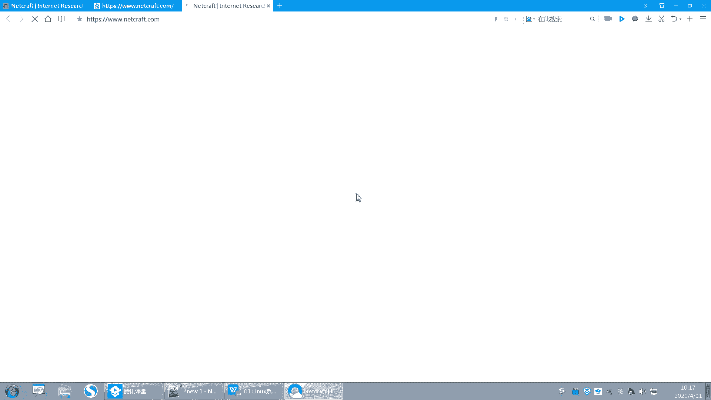

未来的也不是未来现在将来的趋势是吧？好，这个单子可以自己去查一下，你可以搜索一下嘛。来具体你搜一个网站，比如说搜百度这个网站。

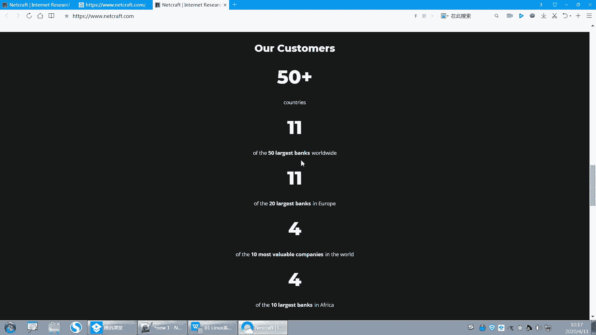

他可以去找啊这个。你们可以去搜一下啊。嗯，他可以看到底层的OS，就底层的操系统用的是什么？那还有网络对吧？网络信息还有地址的信息，SSL证书信息。呃。

这边下面啊这有一个呢这边操作系统OS用的都是linux，对大型的并发场景用的都是linux啊。好吧，这就是为什么我们要去学习linux啊。好，这样的话以后你跟别人说，别人说你学的是什么呀，对吧？

你这个学完之后能出来做什么呀，那你就可以告诉别人啊。😡，好了，呃，我们介绍就说到这儿啊，说到这儿。下面呢我们先啊我们上午的任务先把这个系统装好，然后呃下午我们再去讲一些概念。

然后入门的一些这个呃基本操作使用啊，我们先把操作系统准备好啊。啊，我这里已经准备了一个，我看一下啊，大家的温末都装好了吗？

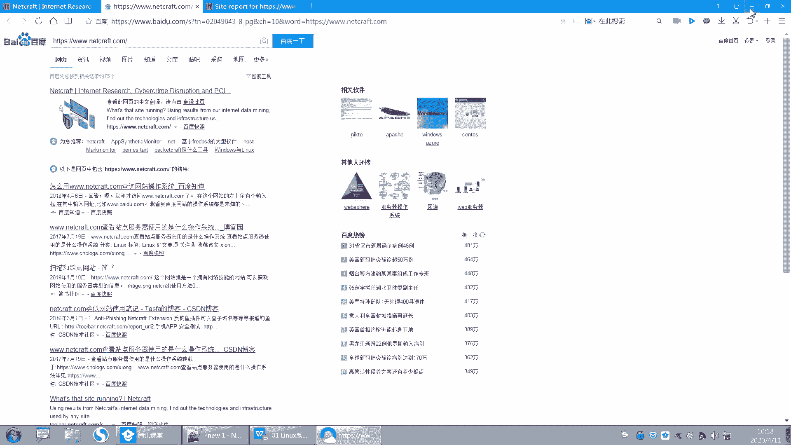

啊，装系统嘛，对吧？大家装过系统没有啊啊，装过系统的敲一，没有装过系统的敲二来，我看一下。无论是什么系统啊，windows也算好不好？😡，嗯。哦，还有二的是吧？哦，二的同学就是是没有是没有装过的，是吧？

哦，还真有啊还真有是吧？哦，你们都用什么装啊？你们一般绝大多数都是用什么，都是用U盘装的吧。啊，对，绝大多数都是用U盘装的啊。然后还有。还有用什么？还有用光盘是吧？光盘。呃，光盘光盘也有，还有还有什么？

还有一种叫网络。网络安装。VM自行安装。嗯，你那个你那个应该是它那个模板已经部署好了，就是部部署好的模板一键部署吧，是这个吧。啊啊，那么装系统一般就是从U盘装光盘网络安装啊。啊。

嗯那么光盘呢其实是最早用的比较多，早早些时候都是用光盘，对，都是用光盘去装。那光盘的话，你需要在那个呃主板上有一个那个呃就装，就是放光盘的地方，对吧？放光盘的地方啊啊，但是现在一般服务器很少去有。

但是我们如果啊你的服务器是带那个卡，那个卡就BMC卡是吧？呃，他就可以去远程去连连连接一个光盘。对，连接一个光盘，然后去装，就是远程装，就远程给服务器是吗？给服务器去装系统。

就是你服务器买回来之后远程连上去。因为你的服务器买回来之后，它就会有一个那个它会有1个IP地址，你可以去连。呃，连上去之后，然后去呃把你的光盘连在这个服务器上面。这个是在云计算里面会教大家怎么去装。

就用光盘，最直接就是光盘插在那个主板上，对吧？啊，这这是一种啊。啊，那么其实呃他们本质上都是从光盘装的，本质上都是从光盘装的啊。你的U盘也是光盘做的吧，对不对？网络装，你也是光盘里面的文件，对吧？

也是光盘里面的啊，所以本质都是从光盘里面装啊，只不过第一个比较直接对吧？直接连光盘啊，第二呢是U盘装U盘的话，一般就是但是你需要把U盘做成个启动盘，从U盘启动，从U盘去装啊哦，第三呢是从网络装网络的话。

它就需要用到一些其他的技术啊，比如说呃PRE的是吧？嗯P叉E的这个。嗯。这技术从网络上，就是所以你在你在你的系统在你的这个呃。就是主板的bels里面啊就bels里面。它可以去选择从哪里启动。

就如从光盘启动，从U盘启动，从网络启动，对吧？所以这是几种常见的安装方式啊。好，我们先不搞那么复杂，可能有同学都不知道你在说什么是吧？我也没装过系统啊，咱也不知道啊，是吧？好呃。

那今天呢我们就用光盘装啊，慢慢来好吧，慢慢来啊。呃，今天我们给大家准备了一个光盘。光盘呢大家去下载一下啊，这个光盘呃，有点大，是将近7个G了，将近7个G啊。呃，呢就这个光盘，这个是8。0的光盘。

我们用的是这个啊，那8。0的这个光盘6。9个G，但是6。9个G，你去下载下来啊，保存下来。呃，我这里也有很多，其实我的我的这个。嗯，我可以给大家分享，就是从红帽5678都有是吧？都有这个这个这个光盘啊。

呃大家去下载，因为这个是红帽的光盘，你去网上去下载的话，呃，很难找到下载途径。呃，而且现在去红贸官网去下载的话，它。呃，需要账号才去才能去下载。一般的账号还没有权限，嗯，所以他获取的话就很难去下。

所以我们还是给大家提供了啊，大家直接去下载这个大家应该都有了吧。好嗯，然后还有一个需要一个虚拟机软件。还需要一个虚拟机软件啊。这个虚拟机软件呢我们用的是we model。文墨是这家公司。

他提供了一个worktation版本。呃，worktation啊。呃，TION是吧。呃，它提供了一个we more work stationation。

就这个软件就这个软件啊呃我的我的这个PC机上装的是这个。哦，对你现在要lessense是吧，那肯定是要，因为它是收费软件，它是收费的啊。哪它是收费软件，所以你要去购买。嗯，但是现在我们有破解吧。

我给大家的序列号在那个昨天发群里了，大家可以去下载。呃，也你们自己去我我已经给大家提供了啊，你可以用我的或者你自己你最好你用我的好吧，或者是你如果要license的话，你去网上找一个找一个那个序列号。

把它加在呃序列号就可以了，就不要去用一些其他的那种乱去下啊，出问题了的，样途用出问题了啊。好，现在版本呢一般是最高版本是15版本的对，15版本的15版本的话就是其实1214都可以用。

就是说老师我装的是12版本的，14版本的能不能用可以用啊。呃，最高就15版本可能功能呃兼容性什么的要好一些。15啊呃，因为我的笔记本的原因，所以我PCB卷因，我装的是12版本的。嗯。

对我装的是12版本的。然后你们去装15的，好吧，你们都去装15的啊。好，然后这是一个叫we organization station的软件，就是将来装虚拟机。因为我不可能把我的PC机装成linux是吧？

所以我用这个软件，它可以上面装很多虚拟机。它可以装很多虚拟机啊。那我装了这个地方装了两个，对它可以装很多虚拟机啊，这个我们比较方便做实验，做实验用啊，做实验用。好，然后你还可以用visual box。

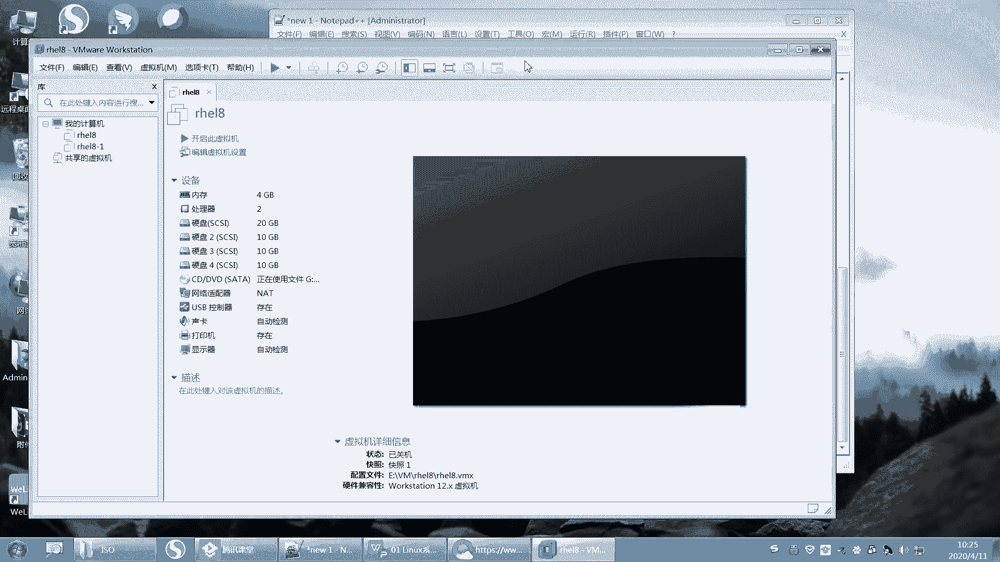

呃。viial box是吧，这个也可以用啊，对，也可以用。这个是oracle公司的。呃，ac公司就是开源的一个开源的一个产品，它是不收费的，它是不收费的啊。所以一般有很多他们做实验的时候。

他们喜欢用wa box。因为wa box它是不涉及到就是版权问题啊，可以随便去用，因为它本来就是开源的嘛，所以咱们愿意去用这个wa box啊，那这种的话可能涉及到版权问题，有时候你去写实验手册。

或者是要发布出来，可能呃就会有就是有一些就是有一些版权啊，所以你可以用wa box这两个你自己去选好吧，我用的是，嗯，大家都用这个好吧，都用这个啊，你说老师我就想用wa box，我不勉强啊，你只要会用。

你也可以用这个工具呢，它有点有一点点的啊，你就是你操作起来有点可能没那么方便嗯。好，这是两款软件啊，两款虚拟机软件。好了，有了这两款软件之后，你就可以去装系统了，就可以装系统了啊。好呃。

这样的话我用我看看我这个远程还能不能用啊，这样吧，我们下课休息一下，回来我们去转装，好吧。我们先下课休息一下啊，是这样的，我们的休息时间是这样安排的啊。

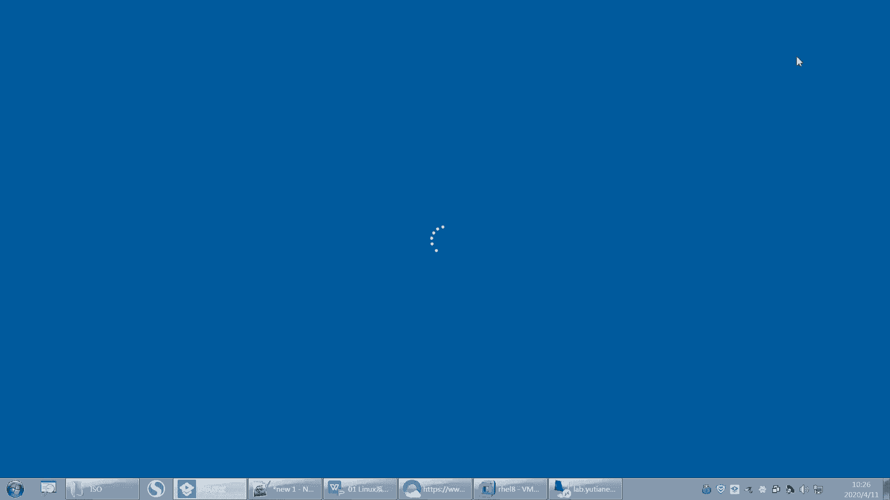

嗯，我们的休息时间是这样安排的啊，呃，这个我们每个老师的休息时间可能不太一样。就包括我可能上课啊，我们上午比如说我们上午是9点，我跟大家说清楚啊，因为之前出现过一个事件。

就是有个学生嗯他呢他要求我必须立刻，不是也不是必须立刻，就是必须要在10点半下课，必须要在就是12点12点钟整下课，就是拖一分钟都不行。嗯，就是。然后刚刚好在10点半这个时候要下课，所以我很头痛啊。

为什么呢？因为我有时候讲着讲着，我没看时间，或者是讲着讲着就差那么一点点没讲完了是吧？我想讲完，所以就呃就就就就这个时间没有把控好，呃，他就非要下课啊，我就没办法。啊，然后这是我们上午的上课时间。

我大概会在10点半左右休息，就是说会在10点半左右休息。一般我们远程现在远程啊，我们大概休息20分钟，大家可以多休息一会儿。嗯，就休息要休息20分钟的样子啊。嗯，然后嗯下午呢下午是这样的。

下午是14点啊，14点14点到17点。嗯，就是这个时间我尽量在5点钟呃，到的时候就下课。啊，如果有一点点没讲完，我会拖一点点糖啊。这个提前跟大家说一下，如果你们觉得时间上有问题的话，可以跟我私聊。

OK吧。时间上有问题可以跟我私聊啊。好哦，那下午呢就会在15点。呃，15点30个左右啊，就是大概就是这个时间去休息。当然我不能控制，刚刚好在这个时间啊，所以大家听我安排，我们中间只休息一次啊。对。

中间只休息一次。呃，所以大家在休息的时候就去上厕所，呃，你不要一半就上厕所呀，就是拉肚子呀怎么什么之类的，一堆回来就不知道贴到哪里去了啊。所以你自己把控好，好吧，我。对，就是大家早上早一点起来。

不要刚刚好9点，我9点钟准时开始啊，我不会等大家任何人的。嗯，对，9点钟准时开始啊。好吧。OK那今天我们上午先休息20分钟啊。好，20分钟之后回来啊。

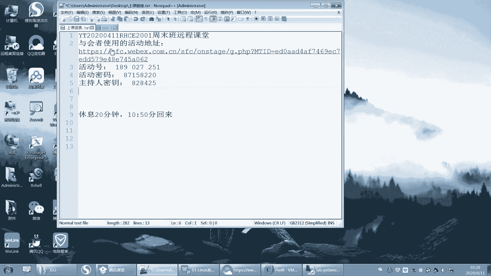

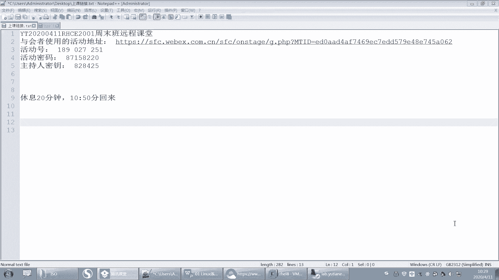

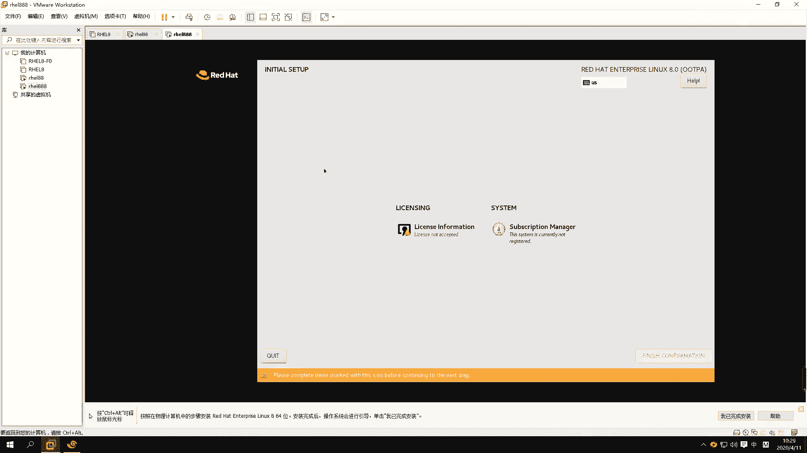

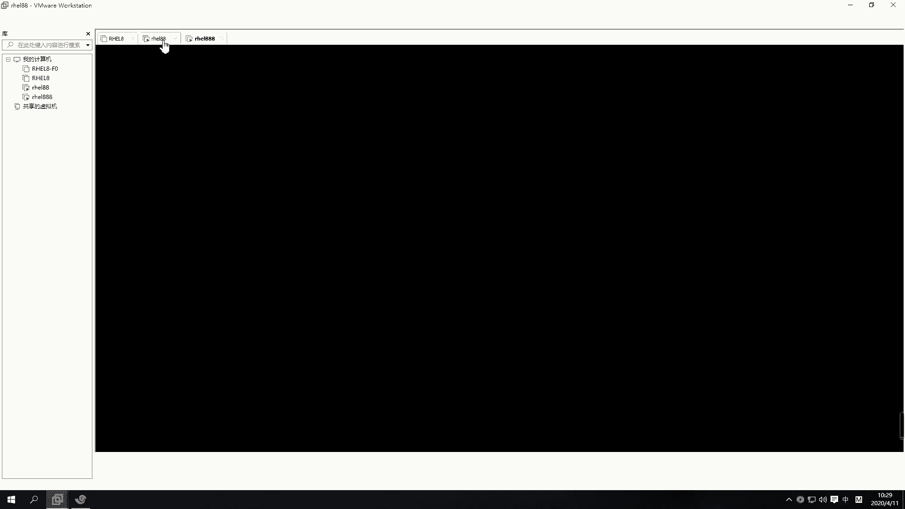

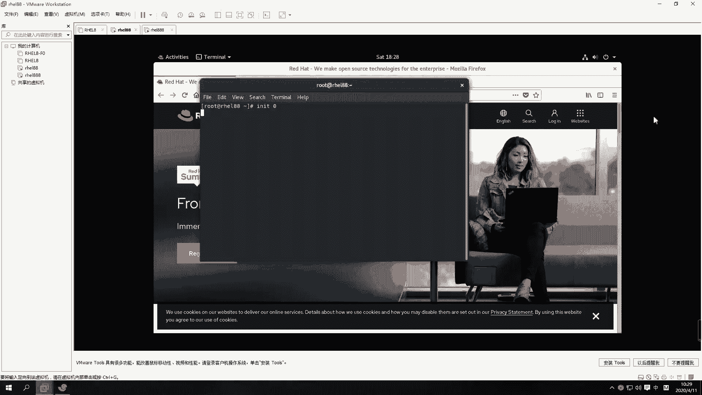

呃，我的这个温陌在群里面，微信群我昨天发了一下，我我待会儿再发一下吧，好吧。

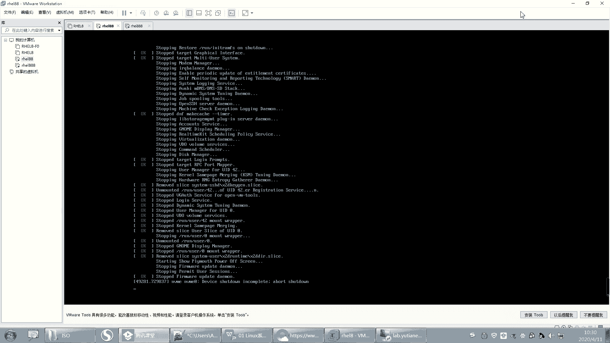

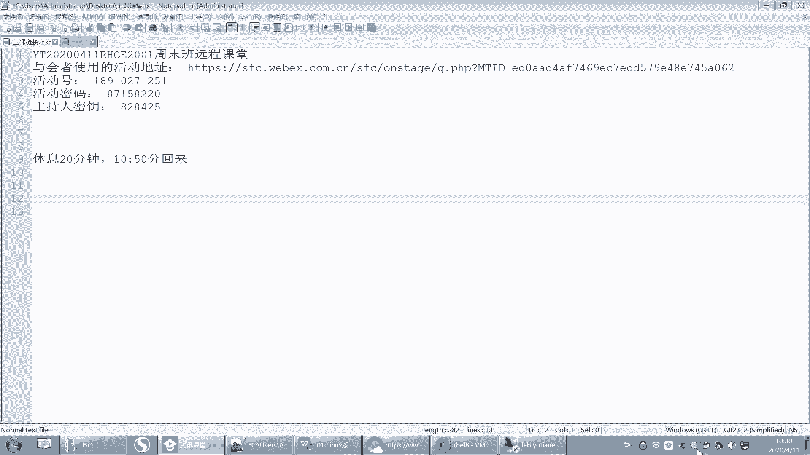