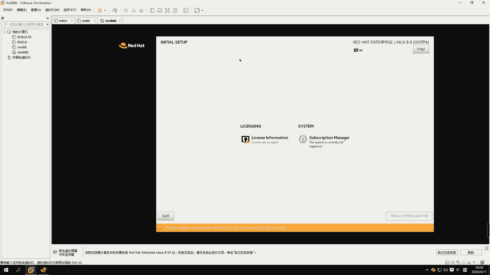
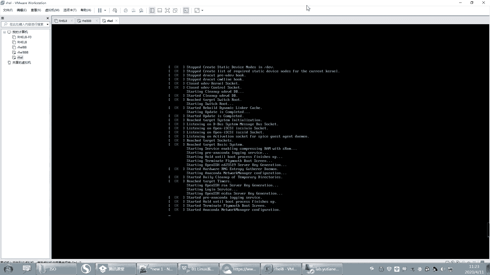
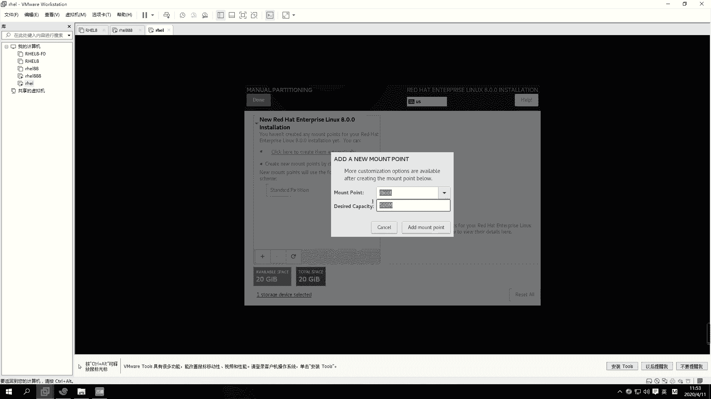

# 【誉天孙老师主讲】Linux入门／红帽认证／RHCE 8／RHEL 8.0／Linux基础视频 - P2：rhel8.0系统安装 - 誉天孙老师 - BV1Dr4y1A7jz

OK那我们今天开始啊，我们先从把系统装起来啊。嗯，前两天有一个学生嗯，然后找我。

哦，找我干什么呢？他问我装系统，装系统怎么装是吧？然后呢。我说你现在连装系统都不会了吗？他说长时间没有装忘记了。嗯，好，所以今天这门课啊，今天这个装系统大家一定要学会啊，很多同学。😊，他没跟着学。

那系统不会装，我很苦恼啊。这个。肯定是我哪个地方教的有问题啊。

嗯。好，呃，下面呢我们准备好了win more这个虚拟机软件。然后呢，我们需要去给它装系统，但是装系统之前呢，我们还需要做一件事情啊。比如说我想去装系统，但是这个系统呢需要装在硬件之上，对吧？

它需要有一个。比如说你你给笔记本装电脑，你不是给给笔记笔记本装装装装系统，你需要有个笔记本呢，那你的笔记本需要有什么呢？需要有硬件，对不对？啊，硬件包括你的CPU啊，内存呢。还有硬盘啊。还有还有等等啊。

还有这些硬件啊，当然还有一些其他的这个等等啊等等。好，那么有了这些之后。有了硬件之后，我们才能在这个硬件之上装一个系统。对叫装一个系统啊，叫操作系统。我们叫OS是吧？叫操作系统。操作系统它是一个什么呢？

它其实是一个软件。它是一个软件啊，那么有了这个操作系统，我们就可以。在这个系统之上再去装一下其他的什么应用程序。所以它相当于给我提供了一个什么，我去控制什么这个硬件的一个接入口，就是这个操系统。

你可以通过点鼠标啊、输入啊、键盘呢，是不是可以怎么样通过这个操系统来传达信息给我们的硬件，对吧？比如说我要写数据啊，啊，写到硬盘里面，对不对？好，那么我们下面装系统，但是装系统之前我们说要准备这个。

对吧？所以我们在这个虚拟机里面啊，在这个里面我们先要买一个什么买一个笔记本，这个笔记本需要具备CPU内存硬盘等等这些硬件之后我们再来去装系统啊，之后再去装系统。所以这一步刚开始的时候不要去装系统啊。

先把硬件准备好再去装啊。好，跟我一起来啊，跟我一起来，大家把这个有的同学把we station打开啊。win你打开啊，如果你的笔记本是第一次装系统。有可能你装就装不好，后面系统也打不开，对吧？

你需要去你的bis里面，这个待会儿你遇到了再说，好吧，一般情况下都开开了，把那个虚拟化打开。一般现在的这个嗯现在这个笔记本它都虚拟bis里面虚拟化都是打开了。bis是个什么东西呢？

bis是这个你的一个主板上的一个已经装好的一个小的系统。就是你主板上自带的一个小的系统叫bels。这个小的系统里面可以做一些呃基本的配置。好，这个待会儿再说，好吧，你遇到了说老师我怎么装不了系统啊。

对吧？我怎么就嗯不能像你这样，那你就看一下提示它是否提示说你的bellls里面要开启虚拟化啊，这个怎么开，我就上课不教大家，大家自己去百度啊。根据你的笔记本型号。呃，大家要有这个能力啊。

你不能什么都要依靠别人，对吧？别人一步一步来告诉你，你要会去用一些工具。当然谷歌用不了是吧？你就能用百不百度啊或者其他的这个一些搜索呃这个这个。方法去解决这个问题啊。好嗯。

OK啊，打开这个软件啊打开这个软件，然后左边点新建看好啊，我这个地方我都要给他说半天啊。你要新建一个虚拟机，看到没有？是不是新建是想买新新的电脑，对吧？这里有个打开。

这个打开呢是这个打开是将来你装好了一个。装好了一个虚拟机，那么你这个虚拟机呃，好，这个待会儿再说啊，打开啊，那这个地方我给大家设置一下啊，就是你的虚拟机将来装在哪个地方。你看我想设置我的虚拟机。

将来因为我虚拟机装好之后，有可能就它是以文件的形式存在的。因为windows上面是不是都是存的文件呀，那我的虚拟机就放在这儿了，看到没有？就是我之前已经装好的虚拟机，那这个是不是对应它这个就对应它。

对吧？这个就对应它。好。那你比如说你这些虚拟机对吧？你比如说我把它叉叉掉了。

呃，那我想去再打开它，那我就可以打开先打开，然后找到是吗？这是我已经装好的虚拟机啊。然后这里这个VM看到没有？然后找到这个VMX的文件打开它。好，那它是不是就在这儿了，对吧？还有添加进来了啊。

当然这个是前提已经装好了，那没有装怎么办？没有装的话，你就只能新建啊，新建。好，那我新建的虚拟机放在哪个位置呢？我可以有一个这地方有个首选项，看到没有？那以免你后面每次都要改这个路径啊。

你把这个首选项打开。你这个虚拟机的位置默认是不是在这里，就是每次都要装在这个地方，对吧？我每次都要去修改很麻烦，怎么办？把它改一下。那改成你的这个G盘，这个VM这里。确定看到吗？啊，就说那确定啊。

那将来你的虚拟机那就在这里首选项。然后在这里把它改到这个地方，那每次你的虚拟机都会装在这个地方，好吧，都会放在这个路径下面啊，这个路径你最好放在1个SSD上面。呃，放在1个SSD上面啊。

另外我跟大家说一下啊，你们的笔记本要求现在啊。嗯，你们的笔记本的话，你们自己的笔记本啊嗯配置的话嗯这个需要跟大家提前说一下啊，就是我们现在在学习嘛，对吧？你在学习阶段，你需要准备一个。

性能稍微要好一些的啊。性能好一些，也不要你很好，对吧？那性能怎么怎么才是好呢？你的CPU啊，你的CPU你需要是I5，至少I5以上的啊，就你的CPU至少要I5以上的，就I5。呃，可以，但是我这个PC机。

我是S3的，也好像也可以跑起来，但最好是I5以上的啊。嗯，最近几年买的都可以。然后呢，你的内存只这两个有要求啊，内存的话。嗯，内存的话现在12至少要12G以上吧。不过我们红帽7。0的话呃，12G。

但是我们后面有一个环境，这个环境到时候考试练习要用，就是你考试练习要去用的一个环境。这个环境呢它需要的内存。至少要8G。嗯，那你要跑的顺利的话。那你需要16G的话，应该就比较顺利了。对。

王家良是这个意思啊，就是如果你还你你把它放在云里面，那他不能再开虚拟化了，所以嗯就不能放在云里面啊。然后这个是16G，就是你16G是可以的，是可以可以带起来的。对，16G啊，如果你8G的话。

你可以再去买一个内存条，然后。对，买一个内存条。嗯，买一个内存条啊，好吧，就是尽量把它扩一下。现在内存应该不贵吧，现在内存应该不贵，20G完全够了啊。我的笔记本电脑以前16G呃，是完全够的。

不过后来我就加了8G，就20G还好。嗯，这个大家尽量准备这个为什么呢？你说老师说我这个没有钱呀，买不起呀，对吧？嗯，是这样的啊。有很多同学他电脑真的就是差，就是性能太差了。

然后每次做作业的时候呢啊又卡呀，然后又又又出问题呀，搞了半天，别人作业都做完了，他还他还在搞去，他还在搞这个呃还在卡着呢，对还在卡着呢啊。所以大家这个既然你如果你是学生啊，嗯，你可以去兼个职啊，是吧？

但是现在兼职有点困难，是吧？😊，嗯，就是反正尽量准备好，否则你这个起点就比别人低了是吧？啊，那工作同学，你这个对你来说应该还好吧。对，工作同学，反正你就准备一台比较，你既然学选择学习了这一行，对吧？

你既然选择进入这一行，你这个吃饭的家伙是吗？你得你得这个到位啊，你否则这个做不下去的啊，吃饭家伙都不到位。你这个你你怎么你怎么学的好，对不对？好，所以尽量满足这个配置。好吧。

你说老师我12G可不可以可以啊，就12G也行，你说我8G加个4G。既你能加两个内存条就加大一点，好不好？加大一点啊，因为我们那个环境确实。对，环境确实是有点大啊，越来越到后面越大，越到后面越大啊。好。

这个是对大家要求。另外你硬盘的话，最好准备个SD。就是硬盘，你你把虚拟机都放在SD上面。嗯，这样的话你的性能虚拟机跑起来就会更流畅一些。更流畅一些啊，就是这个对大家的这个笔记本的要求，好吧。

嗯。好了，那么你这个地方就放在你的SSD上面啊。好，现在我们现在我要新建一个虚拟机啊，新建一个虚拟机。好，那打开这个地方新建训拟机。好，这里有两个，一个是典型，一个是自定义。呃。

默认你们应该是在典型这里。典型的话，它后面的步骤比较少。比如说你选几个步骤就没了是吧？我们都选自定义啊，都选自定义，这是我们后面可以自己做设置，自己去做设置啊，选自定义。好，下一步啊下一步这个地方呢。

我们我们选硬件的兼容性。就是你看我们如果选低版本的话，它的可能不支持它B版本有可能不支持是吧？那低版本可能不支持啊啊，你选高版，就是默认什么版本就什么版本就可以了。就默认让它默认就可以了啊。好。

不要去动它。另外这个地方每个人都要注意啊，这个之前有同学嗯，他是默认是在这个位置的，看到没有？它默认是在这里这个选项啊，他说安装你的光盘，我说现在不要去装系统，不要去装啊。不要去装。

否则它就会自动帮你去这一步步装了啊，不要去选这个选择稍后装系统。现在我们还没有装系统，只是怎么样去准备我们嗯硬件的一些设备啊，对准备硬件的设备嗯。嗯。啊，然后这个地方选择稍后第三个，再相当于变第三个啊。

啊，另外呢这个地方呃选择linux啊，选择linux，我们装linux是吧？你还可以装windows嘛，选linux。啊，现在lininux的话，这个地方会出现乌斑图，对吧？其实你可以去选择对应的版本。

呃，比如说我们呃这个地方有个已经有红帽八了是吧？我们用的是这个光盘，用为这是这个版本啊，叫红帽企业版linux864，就这个啊，我们选择这个我们装的是这个版本。但是先选先选后面我来解释这是什么意思啊。

哦。没有8，你就选7，好吧，因为你没有8，你就选七，选七也可以装成功的。嗯，就是说你说老师我装个我选个七可不可以能不能装，可以装，OK吧，它是可以装的啊，因为只有15好像才有8呃。

那个低版本是没有这个8的。呃，也可以装，好吧，可能后面就有一点点区别啊，其他没什么区别，是可以装成功的。呃，这个的话嗯。这个就是你选八跟选七。

它唯一的区别就是它后面的这个呃它给你的默认设置跟这个硬件的兼容性可能会有一点不一样。不过一个虚拟机都可以用，好吧，都可以用啊。好，但是你不是说我选你说选个无斑图，这最好不要这样子啊，就是对应是什么版本。

就选什么版本，你装什么版本就选什么版本就可以了啊。好，没有八的就选7好吧，下一步啊。然后这个地方你看我是不是刚刚把位置一下子改了啊，改成G盘了是吧？它就会默认在这个下面。

是不是呢就会生成就是生成一个路径，就是你的虚拟机像会就装在这个地方。好，那这个名字太长了，我把改一下啊，我就改了个RHEL。那它下面这个名字就自动改，这样的话我们不用每次都去选择了，看到没有？

不用每次都去选了啊。好，那放在这儿OK吧，你装好就在这儿了啊。好，然后下一步。好，这个地方呢我们选择处理器和你的每个处理器的内核的数量。呃，处理器的这个数量的话，你就选1个CPU就可以了。1个CPU呃。

一盒其实也够了。或者你觉得你的。你就2个CPU1盒也可以是吧？你2个CPU两盒就随便选，就是你也不用选，就两个最多两个就够了，好吧，那1乘以22乘以1都行，好不好？好。

下面因为上面啊这个是选CPU的数量，几个CPU，然后下面是选核，每个CPU有几核，对吧？有几盒啊。啊，那你就选一也行，他们两个是最后是相乘的结果，这个相乘的结果呢是不可以大于一个数值的。

就是说不可能无限制的去。比如说我这个地方选那6848对吧？那么就超过了什么，超过我们处理器内核总和总数量就超了。虽然它是模拟的，但是你也不可能去不能去超过它那个数量啊，那个数量是16，看到没有？

16是吧？好，这个呢是这样的啊。这个是怎么来的呢？其实这个最终这个内核处理器的内核总数是2，那么这个内核总数叫VCPU叫VCPU啊，就是。

呃，大家知道。就VCPU这个大家自己去做笔记啊。啊，VCPU就是虚拟CPU嘛。那这个虚拟CPU怎么来的呢？它是根据你的物理级的这个物理级。比如说你物理机是一个物理机是1个CPU是吧？😡，呃，1个CPU。

然后你是两核不是或者四核是吧？呃，四盒呃，假如说你每一盒对应一个线程。是这样子啊。每盒对一个县程。每个核对应一个线程的话，那么最后就是几个呀，就是就可以模拟4个VCPU就这个地方最多可以选4个。

但是说你每个盒对应两个线程，那就是2乘以4是8个，就是模拟8个VCPU呃，所以它是最终跟你的线程数量是有关的啊。啊，那么这个。CPU和和线程是什么关系呢？好，我来解释一下啊。呃。

CPU呢大家知道它是一个呃用来计算的对吧？呃，它里面有计算器、控制器、存储器等等啊，这个大家要去把这个CPU的构造稍微再去了解计算机基础里面有啊。啊，那么1个CPU其实在同一时刻同一时刻啊。

那么他在同一时刻呢，它是只能怎么样。他只能做一件事情，就是说这个人呢他在就你把他当做一个大脑，对吧？那个大脑在同一时刻，他只能计算一个，只能计算一个任务。对，同一时刻计算一个任务啊。那么。

如果我想去计算多个任务，因为我的实验任务比较多，我们现在都叫多任务嘛，你看我这又开又开浏览器啊，又开这个这个这个各种应用程序，对吧？那肯定是多任务嘛。那如果我想去实现多个任务怎么办呢？我就要怎么样。

我去加CPU啊。加CPU对不对？大家知道CPU它是有它大它很大对吧？它在主板上，它是它相对来说它比较大。嗯，那你的主板呢又不可能说我不停的去加CPU是吧？你主板就那么大，你的你的笔记本。主板越来越小。

对吧？嗯，越来越薄，所以你的CPU不能掉太多。错所以CPU数量是有限的。那么这个时候人怎么办呢？CPU又不能加太多，所以这个时候就会出现一个叫1个CPU又会有核的概念。核数。何秀啊。

那么这个核呢跟CPU是什么关系呢？呃，核其实啊它就是一，比如说呃1个CPU。两呃四盒吧。1个CPU4核，那么相当于这1个CPU里面其实相当于就是4个CPU了。只不过。大小还是1个CPU对吧？

里面呢装了4个脑袋，就是人有4个脑袋，对吧？一个身体，四个脑袋啊，那么这个时候每一盒呢就在同一时间就可以计算一个任务。那这个时候同一时间是不是可以计算4个任务？对不对？可以计算四个任务啊。

这就是合数出现。对合数的出现啊。好，那么这就是和，那它那它到底有什么区别呢？11个CPU4核跟4个CPU它的区别还是有的啊。因为他们是因为知道CPU里面是有缓存的。缓存嘛存数据的对吧？嗯。

那CPU他们是有一级、2级、3级缓存这样子。那嗯他们如果有三级缓存，他们核之间就会共享缓存。共享缓存啊就区别就是这个其他的就还好啊，这就是CPU跟核之间的关系啊。这个大家要去了解一下啊。

这个嗯CPU的构造。啊，那么现后来又出现个线程，对吧？又出现线程，那么有了核之后，有了核之后啊，又有线程。那么和呢注意啊，和在同一时间确实只能计算一个任务。但是我们CPU有什么有一些分片原理。

他就可以去把就单位时间，它把它切分，把时间进行切分，这个说又说多了啊，它就可以去模拟模拟什么模拟线程，就是其实就是同可以看作这个单位时间内可以做两个事情。对，两件事情。当然这个线程不是真正的和啊。

县程不是真正的和。所以它就根据什么线程最终大家可以去搜索一下啊。嗯线程最终就是它其实是这样子的。嗯，我画一下这个图啊。哎哎哎。啊，这是1个CPU嘛，对吧？然后下面不是有盒吗，对不对？

然后河是不是又分县城啊？对不对？我们核跟CPU之间是不是共享缓存啊？那么核这个核其实这个线程是虚拟的，虚拟的啊，这个线程是虚拟出来的。呃，所以呢呃我们根据线程，那一个核可能会有两个线程呢，对吧？

那这样的话呃，你看我这样一分，呃，这一个CPU最后可以模拟几个VCPU啊。那么就可以模拟是吧？4个VCPU这样子啊。好，这是4个VCPU好吧。

哦，OK那这个地方就不能超过，就比如说就不能超过4。当然这个要根据你的物理机实际情况啊。好，再往下啊再往下选择内存。内存的话，你这个虚拟机啊呃如果就是一个单单的就一个虚拟机的话，你给2G就够了。

其实1个G。好像也可以运行是吧，你就给两个G吧，给两个G啊呃，当然你给它什么32个G，他也不一不一定能用到那么多啊，你可以就默认就行了啊。好，然后再往下面这个是选择网络啊，这个网络的话。

你就默认随便选一个就行了。现在呢暂时用不到什么，用不到这个网络啊，用不到网络。到时候我们学网络的时候，你再去选。再去选啊，就你选一个，比如说你不选的话，它将来就没有，相当于是不是选那个网卡。

它就没有网卡啊。那你就默认随便里面选一个就行了。我大概介绍一下这三个是什么区别啊。嗯，第一个呢是桥接模式，就是你选择第一个跟第二个的话，它就可以上网。啊，第一个跟第二个这两个虚拟机都是可以上网的。

如果你选第三个虚拟机就不能上网，就虚拟机不能连外网。嗯，不能连外网啊，就是不能上百度这样的。当然你选第一个你的物理技能上网，它也能它也可以上网。选第二个物理技能上网，它也可以上网，是这个意思啊。好。

这个不做过不做过多解释啊。这个后面我们学网络的时候，我再来讲这三个模式之间的区别。好，我们就选紧主机了，好不好？就选紧主机啊，你随便选，你你默认也行，好吧，就这样啊。好，下一步啊下一步。呃。

这个是我们这个磁盘的控制器的类型，磁盘控制器的类型。这个控制器类型呢你就推荐就行了啊，就磁盘嗯控制器类型啊，推荐就可以了啊。好，下面呢是选磁盘的类型。呃，选磁盘的类型啊。

就是如果你是呃比如说你是15版本的win末15版本的就会新出现一个叫NVME的。呃，如果你是十0呃，就是1214版本的，它只有上面这三个，没有下面这一个。呃，这个呢你像这种IDE磁盘。

就是比较古老的那种磁盘类型。嗯。现在一般很少去用啊，性能会差一些是吧？还有现在比较常用，就是scars盘sta盘啊这种类型的磁盘用的比较多，你可以选这个也可以。

还有这个叫NVME的NVME是模拟的那个SSD模拟那个SSD啊，所以你推荐也行，好吧，你选scars盘也行，我们以前我们以前都是选scars盘的。嗯，你选s我们先选scars吧，好不好？

先选scars啊。呃，当然这个可能会性能好一点，但是随便没关系啊，随便选哪个默认推荐都推荐，或者你选这个这两个都行，好不好？好，然后下一步啊下一步。好，这个地方呢选择是不是要添加磁盘了呀，对吧？

那磁盘类型都选好了。那我们开始你是创建虚拟的虚拟磁盘呢啊，还是使用现有的虚拟磁盘呢？哦，还是使用物理磁盘呢，对吧？啊，你看啊我们每次你像这种，你把你的虚拟机打开啊，把这个地方，你这这这是我之前装好的。

你装好之后，他们这个有一些文件，有一个以VMDK结尾的文件。这些文件就是磁盘文件，看到没有？就VMDK结尾的，为什么会有这么多，他把这个把这个一个就分成多个文件分别存了啊？看到没有？啊。

像这种文件就是磁盘文件，对不对？那么这个磁盘文件它也可以给别人用，就是你你这个磁盘对吧？呃，你可以给另外一台虚拟机来来去使用。那如果你想去用已经存在的虚拟磁盘，那就选这个，看到没有？那选第二个。

你去找到你的磁盘，那可以这样去选。啊，那你现在没有已经安装好的是吧？你或者你不需要用之前已经存在的，你需要创建一个新的虚拟磁盘，你就选第一个选第一个啊。啊，第三个呢是使用你的物理磁盘。

当然使用物理磁盘的话，它性能要比上面这两个都要好一些。呃，但是我们只是做一下实验，对吧？就是没必要选物理磁盘了啊，你就选第一个就可以了，选创建新的虚拟磁盘，这是它三个的作用啊。好，呃，那下一步啊。

然后磁盘的大小。磁盘的大小啊磁盘大小呢这个地方是20G对吧？默认20G20G的话，如果你不做什么的话，20G也够了。嗯，这个上面你不存一些大的文件或者不做什么事情的话，20G也够了啊。

所以我们这个地方就默认选20G就默认就可以了啊。好，那么这个选了20G，是不是我的磁盘上就会少20G的空间呢？不是这样的啊，就是你的磁盘，你看我这个磁盘。嗯，我这个。这个还有挺多的是吧？

那我呃我选了20G，它是按需分配的啊，就是说你选20G它能用多少呢？一般装好这个系统之后，大概用个像红宝八呀，估计要用的更多一些，六七个G啊，七八个G啊，对吧？以前都是3到5个G啊这样子。

所以20G也够了。啊，那你用实G，它就给他就给实际的空间，用20G就给最多是给20G空间啊。好，如果你想把这20G立即分配的话，那么就把这个勾勾上啊。立即分配所有的磁盘空间。那么你勾一勾上。

你的这个上面就会立即少什么，立即少20G的空间啊，那这个勾与不勾有什么区别呢？勾上的话，它性能会好一些，就是你的这个虚拟机的数据在磁盘当中，它是一块连续的区域。嗯，就是在此这个要跟磁盘原理有关了啊。

不勾的话就是用着用就分用就分。但磁盘数据可能比较分散，分散的话它性能就会差一些。这个我们将来会讲那个磁盘原理啊。呃，讲磁盘原理，所以就是就是你就这有空间多的话，你就勾，不多的话。

你就这样直接不用勾就行了啊。好，这个是将你的磁盘存储成一个文件还是多个文件，这个你嗯默认就行了。这个你有强迫症，你就选一个对就多个是吧？嗯，但是他说你看如果你拆分成多个文件。

就像这种它是拆分成多个文件了，那它性能就会差一些，性能就会差一些。嗯。对吧。啊，然后你选一个也行，好不好？但是这个地方你如果太大了的话，你选一个的话，它可能不允许它就要拆分就要拆分啊。好。

然后下一步下一步啊。下一步呢是这个呃磁盘，最终磁盘名字叫什么？叫HELVMDK是吧？好，下一步完成。到目前为止，我们把硬件已经准备好了，还没有装系统。对，硬件已经准备好了啊啊。

就是HEL你看是不是具备了内存处理器。硬盘对吧？这里都有了啊。网卡也有了。好，那么有了之后呢，我们开始连我们的SO连我们的光盘那连我们的光盘啊。

呃，那我们不是用什么装啊？我们是用这个U盘，不是用光盘装，对吧？啊，那我们光盘在哪个位置呢？啊，你点这个地方连啊，那点一下这个CDDVD点一下。

呃，点或者是点这里设置那右键右键设置，或者是点这里编辑虚拟机设置都可以啊。好，然后这个地方你可以选，你看啊这地方有CDDVD那这里有个叫使用ISO。文件对吧？选上它。好。

把你的那个比较大的那个文件ISO文件，你把它选上来啊，我在这里放着呢。我放到这个地方啊，你把它选上。看到没有？选上啊。好，打开。OK吧。这样的话就选上了，就是连到你的SO上面了啊。好，如果有些同学啊。

他他他第一次连的时候，第二次又连是吧？好，他每次开机的时候，这个地方有个中括号，这个不是这个这个有个括号，有个方方框，有个方框啊，这个方框的呃，如果可以选的话，我这个地方是灰的，选不了是吧？

如果你这个地方可以选，请你把这个勾勾上。嗯，把这个勾勾上，听到没有？如果你不勾的话，将来就连不到你这个SO上面啊。如果你是灰的，你就不用选灰色的，你就不用选啊。好，确定。好，开机。

开机啊。

啊，如果你是第一次装，它默认就会从你的光盘启动了。默认就会从你的光盘启动了啊。好，这边下面倒计时60秒是吧？你你看你的光标在这里。好，这是一个菜单。第一个菜单叫安装安装这个鸿贸企业版linux8。

0是吧？第二个是测试这个介指并安装。测试的话需要时间比较长。对，需要时间比较长啊。然后第三个呢就是呃troub shooting，就是你将来系统要出故障了，那么你就选第三个okK吧，我们选哪个呢？

我们选第一个就可以了啊，你就不用测了，好吧，不用测了啊。好，把你的鼠标点进去，你这里有个小手，看到没有？鼠标点进去啊，上下键这样移动。点上下键移动啊啊，你的光标到第一个了是吧？到第一个了啊。

然后回车就可以了。好吧，你的鼠标怎么出来呢？摁着你的鼠标啊，摁着你的cttrol加alt键。ctrorl键加alt键啊，这个如果没有装过的同学啊，controrl键加alt键就出来了。

然后点进去就进去了，OK吧，你点进去才能这样去选啊，唉，点进去才能去选好。然后第一个安装啊回车。好，它就开始装了啊。跟上了吗？

你1二版本的也可以也可以装。我就是我这个外面就是12版本的，我外面这个就是12版本的，这个没问题。

好，然后等一下啊。嗯，可以更新一下，你像功能多一些。

好了，下面我们来看一下啊嗯。在哦看到这儿呢，我现想起来一个事情啊，就是大家这个呃在学习的时候，这个英文的水平啊英文水平。

呃，不要解压S文件不要解压不要解压啊。哦，就放在那儿就行了。呃，英文的话这个大家嗯。没办法去逃避他啊。呃，红多同学英文水平确实。确实很。怎么说呢？很很难看是吧？对，这个那我们这个我们我之前跟大家说啊。

我说这个。不需要勾嗯。

说这个英文水平不停能不能学呀，对吧？其实你学用RGCE啊，我们RGCE可以赠送什么？可以赠送计算机英语啊。

对，可以赠送计算机英语。啊，所以。呃，大家在学完HHC1基本上啊呃你的英语水平是可以提高一个档次的。但是呢有些同学他。他他遇到问题呢，他他很逃避，对吧？他逃避，他就是不想去看这个英文。嗯。

他就宁愿反正当不认识。对，所以嗯你一定要怎么样，一定要主动一点，然后不不认识就去查。甚至有同学连这个单词都不认识，welcome to对吧？welcome to不认识，这个也正常，对吧？你第一次接触。

可能呃，计算机英语，因果你之前不是学计算机的，可能很难受啊。所以这个问题一定要去克服。呃，在这儿呢我建议大家以后就不要选中文的了啊，全部都是英文啊，包括我上课的系统也都是英文的啊。

所以大家以后全部英文相见啊。嗯，不要再是中文了啊。啊，呃，一定要去查弄个有道词典是吧，或者是。嗯，就是想办法，你要就把它查出来啊。好，然后他说这个地方呢呃什么语言是吧？

what language would you like to呃，你选择在这个安装过程instalulation process这个安装过程，instalulation安装过程当中，你选什么语言？

也就是说这是你在安装过程中选的语言啊，那具体操系统将来是什么语言，还需要在后面选。对，还需要在后面去选啊。好，这地方有个english，我们就默认就行了啊。你不要选中文就选英文啊，好吧，就选英文啊。

没办法逃避的啊，而且我们计算机英语的话应该还好吧。

嗯，学过的同学应该是学过的同学应该觉得计算机英语嗯，它不像我们之前学的英语是吧？呃，之前的英语的话，你你要怎么样？你要去学语法呀，还要去学这个口发音啊，还听力啊等等是吧？你很头大。但是在这个地方。

我们计算机英语你只需要认识单词就可以了。认识单词啊单词嘛，你学几次，嗯查几次就认识了嘛，对吧？你这个有什么不认，你把单词认识了，你这句话基本上就能看懂，基本上就能看懂了啊，加上你那么零碎的是吧？

一点语法知识啊，你小你初中高中应该学过英语吧，这加起来应该可以哈，应该是可以应付的，好吧。对，应该是可以应付的啊。

好，这个就是这个英语这个啊。O啊，在这个地方啊，我们有一个安装概览instalulation summary。好，大家不s有问题的下课再解决啊，先看这里啊。哦。

installlation安装概览summary就概览嘛，对吧？呃，location就是你的什么定位啊什么之类的，是吧？呃，locization是吧？好，这个是跟你键盘上，你可以点开，那分别点开它啊。

你第一个叫keyboard，叫keyboard，叫叫什么呃，keyboard就是我们这个键盘布局啊，键盘布局我们现在用的就是。这个呃美式键盘是吧，我们就默认就行了啊，默认就行了。语言的话，你把它点进来。

languagesupport语言啊语言语言这边我们问的是英语，把这个勾勾上，这个勾是不允许去掉的，你发现没？对吧？你去掉的话，它里面绝大多数的英英语啊。啊，然后还有这边你可以选择中文。

比如说你可以把这个。中文。你可以把勾上，对吧？你看。你勾上嘛，你勾上也可以也可以勾啊，就它可以支持中文。但是呢它里面。绝大多数还是英文，只有部分是就是。很少很少一部分才是中文啊。

所以这个大家嗯你还是我们这个里面还是选选英文，你把这个包勾上，你把这个勾上也没关系啊，也没关系。好，那我就不勾了，好吧好。我就不装了啊。啊，那你说我现在是英文，我将来想去切到中文。

你需要把中文的那个安装包装上才可以支持中文啊。因为我这个地方我没勾。我没勾啊那。我在勾上的话，意思是说把中文的安装包就勾呃，那个装上这个意思啊。好，具体选什么语言，到时候开机之后还会让你去让我去选择。

好了，那就是这个语言啊语言。然后下面这个是这个。日日日期是吧。日期啊。啊，这里我们选择这个地方啊，我们选可以去你可以点一下，大概在这个位置我们是选择。A下上海。就是亚洲、上海啊。

我们计算机的时间一般很少听说这个这个北京时间是吧？一般是上海时间，还有新疆、乌鲁木齐时间、重庆时间等等这些时间啊。所以这个是我们的时间时间啊，大家可以选一下。OK吧啊。

这里其实你看他他画了一些这个时区是吧？这个大家应该知道吧。嗯，时区呀。我们其实这个时间啊，而且下面我看一下啊。

这个。好，你们聊天记录我看不到的时候，你们你你就待会我再看啊，因为有时候点来点去就看不到了。好，然后这个时间呢，你就嗯这是一个本地时间，对本地时间。然后右面有个网络时间，就是如果你将来系统不准了是吧？

系统时间不准了，它就会向网络时间同步。不过这个呢我们先不用管它啊，将来我们装好系统之后，我们可以去设置它。去设置它啊。好，这个就是我们的这个时间啊，时间选一下，好吧，选一下时取。选一下就你点不到的话。

你就在这选，在这选，找是找一下ok。啊，选了时区之后，你说我怎么选了时区之后，我就知道我的时间是多少了呢？啊，注意啊，我们这个时嗯你们学有学地理吧，应该有学地理吧。我们地理上有分是吗？

是将全球分成了多少个时区啊，知不知道啊？这个跟地理就没什么关系了是吧？对，分了24个时区啊，因为一天是24小时，每一个小时呢就是每一个时区就是一个代表一个小时。那中国是在哪个时区啊，知不知道？嗯。

东八区啊，对，中国是在东八区啊。嗯因为我们最早的时候，它这边有一个本出，它有一个那个本本出自五线是吧？我记得是在英国好像是经过穿过英国，有一个本，比如是有个本出自五五线。

然后我们往东数的话就是属八个时区，就是呃这个时期，然后这边数的话，就是西西级区，对吧？西级区啊。

哎，每隔一个时区就相当一个小时呃，相差一个小时啊。呃，我们后面会有个时间叫UTC时间，UTC时间呃，这个UTC时间啊跟我们相差一般是相差8个小时的。就说我们这个我们这个时间，比如说你是上海时间。

这个时间就应该是什么？应该是本地时间啊，那么UTC时间跟我们这个时间相差什么？相差8个小时。UTC时间是世界统一协调时间啊，所以它是在什么？在这个位置在那个本初字五线那个附近啊，叫格林威治时间，对吧？

大概是在那附近啊。以前是在那个位置，后来说时间有点不准，就在那附近啊，穿过英国一个小镇叫格林威治啊，那个时间是比如说那个时间是零点，那我们就是8点早上8点是吧？我们比较要快8个小时啊。

有些时候我们要去选择UTC时间，而不是本地时间，这个要看我们的服务器是不是跨国的，一般跨国的话都要用UTC时间统一协调时间啊，否则如果大家都用本地时间。那么比如说那个那个美国用本地时间。

我们也用本地时间是吧？那么这个时间这个每次用时间，我们就是传输数据的时候，如果时间作为一个参参数的话，你们可能时间不一致。对，还就会导致可能会失败，还不到啊等等。所以这个是UTC时间啊。

后面我们讲时间的时候还会再说到啊。嗯。对，好，这个要去了解一下啊。

OK确认啊。然后右边这个是安装员，看这儿啊，这有个安装员，这个安装员自动检测到了我们那个什么我们那个。哎呀，我为什么要点这个？好。这个是我们那个安装员啊，它自动检测到我的什么ISO了。我手欠了。

点这个鬼。

这边还等着吧。他应该是不是在检测呀？好，你看下面这个地方有个叫under the network，这个就可以从网络安装。就是你的安装安装员可以在网络当中，你可以把网络的地址写在这个地方。看到没有？

那下面这个是吧，就是它可以从网络安装啊。像我们之前我们在教室里面的时候，我们就让大家从网络安装，就那个安装员在就是在网络里面啊，在这个通过网络的形式去安装。好，其实就是你的ISO文件在网络当中啊。啊。

这个就默认就行了。然后下面这个是选择什么？选择我们安装的这个软件。其实这句话是什么。它是软件选择啊，就是在这个地方你可以选择你在装的时候。装什么样的软件，但是你不能一个个一个个去选择是吧？

它就给你归归个类。比如说啊这个第一个叫servver with GI，还有个叫一般是这两个用的比较多，一个叫minim install，minim叫最小化安装，它可以实现bas function是吧？

就是个实现一个最基本的功能，那么这个最小化安装的，它安装出来只有部分的什么？它只它就是呃软件包安的比较少。然后装出来也比较快，那个系统比较小，对吧？嗯，但是它很多那个功能都没有实现，很多包都没有装。

如果你想快速安装的话，你就选第三个，但是装完这个之后是只有字符界面，没有同一界面的，没有同一界面啊。好，所以我如果我们第一次学习的话，我们还是安装带有图形界面的。

带有图形界面就是这个第一个叫servver with GOIG的G的话，就是这个啊G就是graph graphic叫。叫什么？叫图形的啊图形的U呢就是user，叫用户。I就是interface接口。

叫图形用户接口，所以叫GUI啊GUI对。

对，就这个一要知道啊，就GU我们经常会看到这个GUI呀和CMD是吧？😊，呃，CLI是吧。呃，这个是图形的，这个是命令行的呃，命令行叫comd line嘛。这最基本单词要知道啊。呃。

common line嘛CL是吧？对com on line interfaceGUI就是图形用户接口啊，图形用户接口。好。

所以装这个就是图形，那右边这个要不要勾啊，这个都不需要勾，听到没有？都不需要勾啊。好，你看比如说它是要实现我什么文件ser是吧？或者什么实现FTB那你把这个勾勾上，它就会额外去安装一些软件包。

去实现这个功能。那这个不需要勾呃，如果你想去实现的话，将来我们直接在后面装好系统之后再去安装也可以啊。呃，如果你在勾勾上了，将来装包装系统的时候就非常慢，它装的包就很多啊，你就不要勾了。

O默认就第一个就可以了啊。好，确认。嗯。好，右边这个地方右边这个地方叫sstem，叫系统，那么叫安装instalulation destinationest，这个看不见了啊。叫安装目的地呃。

installation叫安装destination叫目的地d啊，点开进去就是说现在要分区了，现在要分区了啊，那知道分区吧，你们装过windows的，应该都知道是吧？它会一个分区，你把系统盘。

哪个C盘给多大，D盘给多大，对吧？啊，要不要分区啊。啊。然后我们选上这个啊，我们把那如果你有多块盘，你可以选择其中一个盘，把勾勾上，然后它就可以装在这个盘上20G20G。好。

然后这个存储配置那个下面这个有个那下面如果你还要呃去，比如说你再添加新的磁盘，这地方有会添加新的磁盘。好，那下面呢是做分区配置，那分区你可以直接这样就过了，它它就自动安装了，自动安装了。好。

那我们呢选择手动装，选择后面这个啊叫customer。呃，oautomatic叫自动的customer，是我们手动装啊，手动装好吧，你们选择第二个手动装上啊。哦，你点一下这个d完成，点一下再点一下。

就是你点一下，有时候不行，你就点两下。如果动了，你就不要点两下了啊。好，那么这个地方我们开始分区，呃，这里有个加号减号，加号是加加一个分区就去掉一个分区是吧？好，那这个地方是这个分区的类型。

这个分区的类型呢，这个地方默认是逻辑卷，对吧？我们就先不要选逻辑卷啊，逻辑卷的话我们后面会讲。嗯，你先不要选逻辑卷，它默认就是逻辑卷啊，你要选标准分区，你说老师什么是标准分区，不管它你就先选就行了啊。

对，先选就行了，选个标准分区standard partition啊。standard partition标准分区。好，然后这边点上加号，加上添加一个新的分区就行个加号啊。好，呃。

我们在这个地方添加一个什么叫mountpoint是吧？叫挂载点好，叫挂载点。好，这个地方我跟大家稍微简单的先说一下啊，这个跟文件系统结构有关了。跟文件系统结构有关了啊，后面我们会单独会有一门讲。

会有一张是讲文件系统的。但是在这个地方我有个分区，所以跟大家把这个文件系统结构稍微简单的过一下。

呃，先听一下啊。大概听大概听一下就行了啊。啊，你说的是分区吗？好，呃，现在如果说我有一块磁盘啊，我有一块磁盘。这个磁盘呢我比如说我分了几个区啊，比如说我分。我这个地方分几个区啊呃分一个区呃。

分两个区分三个区啊，其实我这个磁盘不分区是不是也可以，对吧？你呃装windows的同学大家都知道啊，你不分区就一块就一块盘，作为系统盘，作为那个C盘也可以，那你分完之后，比如说这个是windows的。

那就是C盘嘛，是不是C盘啊，然后这就是D盘嘛，对吧？这就是E盘，还有F盘，对吧？那么C盘呢，这个上面一个分区，这个上面一定会格式化文件系统格式化了，就是有个分区要格式化。嗯，那格式化有什么用呢？

大家一般听到格式化，就是一般就就是觉得哎呀把数据搞没了是吧？好，你先不管格式化是什么，你就知道有了格式化，格式化了之后，它就可以存文件了。呃，格式化之后它就可以存文件了啊。好，所以要想存文件。

它都要进行格式化啊，都要进行格式化啊。同样D盘想要存文件都要进行格式化啊。好，那么这个C呢我们先看一下windows的啊，我们对比来看一下。因为大家对windows比较熟了嘛，C盘这个C呢它就是驱动号。

这个C代表驱动号。驱动号啊驱动号。呃，呃，你们在C盘这个这个这个在那个windows在分区的时候，它会选择驱动号，你可以自己去选选C啊、D啊、E呀、F啊，对吧？这个叫驱动号啊，D叫驱动号啊。好。

那么你看啊这个地方呢。这是不是有几个驱动号？这个是其实这个本地磁盘，这个地方叫什么？叫券标，它就还有个起名字叫卷标，你个最标可以修改的吧，对不对？这个卷标是可以修改的啊。嗯，重命名看它可以选修改。

但是这个驱动号一般选完之后就不能变了，就驱动号啊。啊，那么整个这个图标呢，这个图标你看啊这个图标这个图标叫什么呢？叫盘符，我们给大它起个名字叫盘符啊。哦，叫盘浮。好。

那么如果我有一个U盘插入到这个PC机上面，它没有给我分配盘符，就是没有这个图标。那我是不是就没有办法去访问到这个。这个盘里面的什么数据是这样吧？大家知道你U盘如果识别不到，对吧？没有给它分配盘符。

它就是它就无法进到这个里面去访问数据。所以我们在这个什么，我们在这个windows当中，我们是通过盘符来进入到什么，通过盘符，然后进入分区。存什么存数据的是这样吧。哎，通过盘符，然后进入分区去存数据啊。

好，那么这个是我们把这些概念先了解清楚啊啊，这个是我们windows的。哦。再来啊。下面我们再说一下windows的目录结构是什么样子啊windows目录结构其实也比较清楚啊。

你像如果我进入到呃我进入到D盘，对吧？我就可以在这儿进，你看啊，我进入到某一个目录下面，那么这个目录是不是会有个路径，看到没有？会有个路径在这里有D呀，D什么什么什么是吧？好，然前面这个是就呃。

那中间这个斜杠就是这个目录是这个目录的副目录是吧，他们两个就是父子关系嘛，那它就是子目录，它就是副目录，这个没问题吧。好，那我进入到D盘的任何一个，比如说进入到D盘的任何一个，比如说目录下面。

是不是都是从D开始，这个路径是不是从从D开始，对吧？啊，所以我们的这个目录结构是什么样？大概是这样子啊，比如说是C盘开始。C盘开始对吧？是这样，它是反斜杠啊，就反斜杠。嗯。好，那么从C开始。

下面这个C到下面就会有一个什么，就会有一些目录。C盘下面是不是就会有一些目录啊，是吧？比如说你看这个C盘下面。是不是有这些目录啊，对不对？好，那这些目录下面是不是还有可能会有目录啊，我这样去画啊啊。

这个目录下面还还有目录，这个目录下面还有目录，然后目录下面是不是还有目录，目录下面还有目录。对，这个应该大家比较好理解啊。啊，那这样的话我们就会看到这个C盘的目录结构，它大概是一个什么呀？😊。

它大概是一个这样的。就像一个树一样，像一个树啊。什么叫树啊？树是不是有根有枝对吧？有叶子，但是这个树呢它是个倒数倒数的啊。倒数状。是不是倒数状啊？反过来了跟在什么，跟在上面。

然后树枝跟树叶是不是在下面呀，这树枝树叶是不是都是目录跟什么文件，对不对？目录跟文件就组成了树枝跟树叶啊，组成了树枝跟树叶。好，那么这是C盘的目录结构，同理可得D盘呢，是不是也是什么？第一盘。

D盘D盘是不是也是一个倒处状的呀？D盘也是一个倒数状的啊，啊同理E盘也是个倒数状。那么C盘跟D盘的目录结构会不会有交叉呢？就是这个哎呀E呀指到什么，指到别的地方了，他们两个按理来说是不会有交叉的。

能不能理解？当然这个有一种可能性就是那个叫快捷方式是吧？是快捷方式啊。我们先不考虑那个啊啊快递快捷方式是比较特殊的一个文件。啊，那么。也就是说，C盘的目录结构跟D盘是不会有交叉部分的对，就是D盘。

对不对？这就是D盘啊。好，那同样一盘也是这样，CDE的目录结构是分开的。好，那我们说windows的目录结构就什么多根倒竖状结构叫多根。倒竖状结构是吧？好，那么每一根树它都会有对应的什么？

都会有对应的分区。那它都会有对应的分区。那么这根树的数据都是不是放在什么？放在C盘上，第二根树放在D盘上，第三根树放在E盘上。这这样说我能大家能听懂吗？这样说大家能听懂吗？好嗯。嗯。

实际过程中逻辑卷这个看场景，看应用场景，逻辑卷跟分区它都会有自己的优缺点。哦，分不分呃，如果你觉得分区对你来说没什么，你就不分也行，你不用手动分也可以，好吧。嗯，好，我慢慢来慢慢来啊，不要慌啊。啊。

然后这个是这个windows的啊，那我现在把windows讲完之后，你再来看这个linux，你会这个非常清楚啊。linux呢跟windows的目录结构它区别还是很大的。比如说现在呢呃我们有一块盘，对吧？

这块盘呢分不分区呢，我们我们待会再说啊啊，windows的目录呃linux的目录结构，它只有一棵树，叫一棵单根单根。单根啊。倒树状。就一个就一棵树，那这棵树的根叫什么呢？就叫根，就叫斜杠。这叫斜杠啊。

这就是根，好吧，就根啊。啊，这是一个目录，OK吧？这是个目录啊啊，目录下面会有什么？会有子目录。目录下面会有子目录啊。啊，子目录下面，比如说我这个有一个目录叫它的路径是是这样写的，比如说叫home。啊。

还有一个叫什么boot。比如说啊还有叫什么，会有一些目录，叫ETC目录啊。啊，当然还有其他的点点点非常多啊，非常多目录，这个就不写了。好，那在这个目录下面还会有一些子目录。唉。

子目录下面还有子目录等等啊。啊，这下面呃还有子目录是吧？比如说这个是home下面的。我就随便画几个啊。home下面的data。好不好？OK啊，这就是它的一个路径啊，这是它一个路径，好吧好。

路径从什么从斜杠开始。那后面这个斜杠呢，前面这个斜杠指的是根目录啊，这个是根目录。是根目录啊根。啊，后面这个斜杠是指什么？是这个是home是父目录是吧？data是不是子目录啊，叫父子关系对吧？

父子关系啊，所以这个跟这个斜杠跟这个斜杠是不一样的啊，只有第一个斜杠是跟，后面都是指分隔符，后面是分隔符啊，这是linux好吧，linux。好，这是一个单根倒数状的。那么我们这个根放哪儿呢？

我们这个根的数据放在哪里呢？对吧？它总得放在一个什么上面吧，好，它就放在什么，放在分区上啊啊，放在分区上啊，那放哪个分区上呢？所以我们给它分一个分区啊，分一个分区。好，那么分的这个分区呢。

我们需要那这个分区怎么样啊？它分完之后分区嘛，分区是不是要格式化呀？格式化是不是就可以存文件了，这是两部曲，对吧？呃，分区格式化存文件，那么我怎么去存呢？我怎么去访问这个分区呢？

我们windows是通过什么？windows是不是通过盘符。是这样吧，windows是不是通过盘符啊，一定要记住啊，通过盘符，那linux通过什么？linux通过挂载点。lininux通过挂载点。

实际上就是目录。它实际上就是一个目录。所以我需要怎么样啊？我要想去使用这个分区的话，往里面存数据，我必须给他一个目录。对，给他一个目录啊，就是将它跟一个目录对接起来。那我给它对接哪个目录呢？

你必须要对接的目录就是根。啊，就是这个根目录啊，因为根所有的文件是不是都放在根里面啊，那根总得有为置放吧，所以你必须要分一个分区给根，然后把这个分区跟根目录跟根目录这个斜杠，然后对接起来。

我们把这个对接的过程叫什么叫挂载。啊，叫挂载啊，叫对接起来。好，那这样的话，我这个根是不是就可以存文件了呀，对吧？那么home呀，boot呀，ETC是不是都在根下面呀。

那么它们自然而然的是不是都存在第一个分区上了，这是第一个分区。对，自然而然都存在第一个分区上面啊。好，这是分了一个分区。那如果说我还有还有一个再分一个分区呢，比如说我还再分一个第二个分区啊。

那么在分第二个分区的时候。第二个分区，那么第二个分区我也想去用第二个分区的空间。我第二个分区首先什么要分区要格式化，对吧？好，分区格式化完之后，我怎么去使用第二个分区呢？

同样我需要给它找一个目录跟它对接起来，比如找一个bo目录。找一个目录跟它对接起来啊，找一个bo目录。啊，那么将来这个bo目录，你往bo的目录里面去存文件。比如说这里存了一个叫呃bo下面的。

bo下面的fill是吧？那么这个bo下面的fe就会放在哪里啊，就会放在第二个分区上了。就放在第二个分区上了，OK吧。当然前提这个bo同目录要事先要存在，一定要存在啊。如果它有一个不存在的目录，那不行啊。

也就是说什么意思呢？我现在我再画一个分区，对不对？再画一个分区，那我想把它放在哪里呢？😡，叫data。或者叫test，随便叫啊。再再跟下面创建一个目录，叫test，我自己创建嘛，对吧？

我可以自己去创建呀。好，那么创建个test，我把这个test跟第三个是么，跟第三个分区对接起来。那么将来你往test里面去存文件。存文件就存在第三个分区上了。我这样说，大家能听懂吗？啊。

这就是我们linux的文件系统结构。对，linux的文件系统结构。那这个本来它是个目录。boot是个目录，test是个目录，但是它一旦给它挂载了一个分区了，那挂载了一个分区。

那么这个目录就会变成一个东西叫挂载点。它就会变成挂载点。OK吧，嗯，这就是挂载点的由来啊，挂载点的由来。所以你看在这个地方，我们让选的并不是说选分区，对吧？我没让选样选的是什么？是不是选择挂载点呢。

叫mountpoint，叫挂载点。

好，那么这个挂载点我们选什么？比如说我选一个boot。哎，选一个bo啊啊，bo我这个目录呢比较特殊啊，这个目录因为它是放这个呃放启动所需要的文件。所以这个目录啊呃你你给200兆其实就够了。呃。

但是你觉得太少了，你500兆也行，好吧，那也就是说我将来会给bo同目录是挂载一个分区啊，这个分区的大小是不是就是500兆啊，那。

是不是就是这个那boot目录给它分一个分区，这个分区是500兆，然后挂载在了什么boot目录上，对不对？好。

那就是第一个分区分好了，那这是第一个分区啊，第一个分区挂载在了bo，它只显示它只显示什么？显示这个这个这个呃呃挂载点啊，挂载点好，再添加一个分区。好，比如说添加一个home分区，我给它两个G。

这个是放呃加目录的一些文件的。好吧。好，两个添加就添加一个好，再来一个，你先分哪个后分哪个都无所谓啊。啊，你不要这个你这个分区大小，你不要分太多了。比如说bot，你分了什么10个G啊，没必要啊。

你500兆就够了，你分太多浪费空间啊。home的话看情况，一般2个G3个G啊这样子。好吧，那么最重要就是根，我所有的分区都可以不用分，我就必须要分根。因为所有的文件默认都在根下面。

所有的文件默认都在根下面啊，所以根一定是要分的那根给多大好，我学就开始问了啊，很同学给了两个G。我请你给两个G，你这够吗？你不够吧，跟下面是不是还有很多其他的文件啊，就像你的C盘，你给少了。😡。

你们所有默认的文件是不是都放在C盘下面，刚开始的时候是不是都放在C下C盘下面。如果你给太少了，那你系统的文件是没地方放。😡，它会慢慢就满了，对吧？所以我们根呢给多大呢？呃。

你最好啊就是你你至少要给10个G吧，这是最少的呀。

当然你说给8个G能不能装也可以装呃，但是不能太小了，5个G现在估计不行，6个G也不行。因为现在红帽八越来越大呃，越越来越大了。装装装完之后，它系统文件越来越大，所以一般啊你不要太抠了啊，就你20个G嘛。

你总共是20个G，给了两给出去两个G了，那你就给个多一点，比如说还剩16个G，你就给16个G。哦。也可以吧，你给17个G也行，对吧？所以稍微给多一点。嗯，而且这种分区你分下来，它是很不没有办法扩展的。

所以你你说哎呀都小了再扩一点不行啊，逻辑卷才可以扩，这个扩不了，这个扩不了啊。啊，要给大一点，我看有没学分的时候，如果你分太小系统装不成功的啊，它装都装不了，无法安装啊。这所有的分区。

比如说你都可以不要那这所有都可以不要，你就用这一个就行了。那给他20G分一个根，你说老师我分不清楚，分不明白呀，装不了系统啊。就把所有的空间给根就可以了。因为所有的文件都会放在根下面。

这个分区还有没有不懂的？我我就分两个，好吧，给你看一下啊。啊，如果你不要手动分，让后自动分。这个还是那句话呀，要不要分呢？不分就放在根下面嘛，分了你就单独什么这个分跟不分有什么区别呀？😡。

这个分跟不分不的分了跟不分有什么区别呀？你分了的话，这个bot下面最多能放多少多大的文件啊，是不是放500兆啊？😡，OK吧。哦，我挖目录对吧？万目录，那这个万目录说要不要分，对吧？你不分的话。

是不是放在根下面，那根有多少剩余空间，它就可以用多少吗？😡，是不是用根的空间，你往里面存文件，是不是放用的根的空间，OK吧。那么你把布得单独分出来了，你给不得分了500兆。😡，不。

什么叫弹性的这个这很好理解吗？你给基盘。你G盘多大啊，你G盘是多大？你你G盘好，比如说啊你默认文件是不是放在C盘下，对吧？就相当于哇是不是放在C盘下。那么哇现在C盘只剩多少空间了，只剩2。7G了。

那你哇最多是不是只能用2。7G的呀？😡，这。这不是什么弹性的，这这就。嗯，就这个意思啊。嗯，OK吧。啊，你单独分出来了什么单独分了bo是吧，给了500兆，那你往bot下面放，只放了10兆文件。😡。

那你bot是不是只剩剩下490兆啊，那这就剩余的嘛，它最多是不是只能放500兆往bot目录下面去放。所以这就是分出来跟不分出来的区别啊。😡，对，是这个意思啊。好。

这个相当于就是什么windows的盘符嘛，这个部分目录相当于它实它是挂载点。我们通过挂载点来访问什么来访问这个分区，来访问分区的空间啊，占用分区的空间。好，所有一切没有分出来的，都占根空间好。

都占空根空间，好不好？

好，你们想尝试分一下，那我就分一下就行了。500兆。对。好，那我就分这三个，好吧，你们看情况你们看情况去分啊。然后还有一个很特殊的，它不是挂载点，看到没有？它叫swepe。

叫swipe啊呃这个swipe呢我来说一下啊呃还有一个空间，比如说我分了一个swepe分区，这个swipe分区干什么用呢？

呃，32部分机叫交换分区，叫交换分区啊。它叫交换分区，那么这个交换分区呢，它其实是磁盘的一部分空间，它可以格它也可以格式化，对吧？那它有什么用呢？我们是这样的啊。

我们呃这边有CPU和内存就要结合其CPU跟内存了啊，然后我们的比如说内存呢，你一般有时候内存不够用了。比如说你内存只有4个G是吧？哦。你内存不够用了，那我想放更多的数据，因为我们的数据啊。

它其实都在什么？我们想去访问一个文件，比如说我访问一个。呃，fi这个文件，我要去加载这个文件或者访问1个QQQQ对吧？应用程序。那么在这个程序想加载的话，CPU是不是要去给他一个指令，说来打开QQ对吧？

然后QQCPU就会去什么？它就会去内存里面去找看有没有QQ的数据。但是这个时候QQ还没有启动，所以它的数据不在内存里面，它这个时候就要去怎么样就要去磁盘当中去找这个QQ的数据。

把这个QQ的数据怎么样加载到内存当中，唉，加载到内存当中啊，那把数据加载到内存当中，好，那么由于内存呢有可能会不足，对吧？那我想要去使用更多的空间怎么办？我就可能要使用交换分区了。对，使用交换分区。好。

这个我可能跟大家说的不是太清楚啊。好，我就这么说吧，我把这个说完，我们下课啊。剩下的我们下午再装。呃，这个交换器后面我们还会讲。好，这就是。呃，CPU磁盘跟内存的关系啊。啊。

CPU呢它其实也有也是有缓存的，但是它缓存比较小啊，内存呢。呃，也是纯数据的是吧？磁盘呢磁盘最便宜嘛，速度最慢，对吧？啊，磁盘是比较便宜的。啊，但是速度也比较慢。🤧好。对，就是虚拟内存，就是虚拟内存啊。

但是我觉得windows那虚拟内存解释的不是很清楚，我觉得还是叫交换分区比较好。交换分区。好，现在假如说啊你现在呢有一个有一个有戏，比如说啊我举个简单例子吧。你现在呢要去打开一个文件，开始做作业是吧？

开始做作业了啊。哦，你做作业呢，打开word，然后打开你的什么虚拟机软件呀等等。那这些软这些软件的数据都会加载到内存当中。加载到内存当中啊，那然后你的数据就在这里了。好，那你加在内存当中。

这个时候你就你本来是要写作业的是吧？好，加在内存当中，然后其实你还有虚拟机文件呀等等，都加载到内存当中了。那么你这些。虚拟机本来它就会占占内存，对吧？是不是很占内存呢？啊。

那么CPU想要去使用计算这些数据，它必须要加载到内存当中才可以对，加载到内存当中才可以去使用这个数据。好，但是这个时候呢，因为啊我们的内存太小了，所以有些时候我们需要做加一个交换分区，对吧？

那这个交换区分区什么时候会用到呢？好。这时候。内存里面已经有一部分使用，但是可用空间只有一个G了，可用空间只有一个G了啊。但这个时候呢你又觉得做作业很烦，对吧？想去打游戏，对，想去打游戏啊。

那你的游戏的数据是不是在这里，游戏的数据是不是在这个磁盘上？比如说打个。什么。什么什么什么游戏啊。啊，这个游戏的数据在磁盘上，对吧？那你需要把这个游戏的数据是是加载到内存当中啊？

但是内存里面的数据是不是又不够用啊，只有一个G了，有可能你需要游戏需要更多的什么，要需要更多的游有更多的更多的这个内存啊，比如说你需要呃这个5个G对吧？或者4个G3个G这样子啊。好假如说你需要三个G。

但是我内存已经没有3个G了。好，这个时候内存就会他就想他就看我有没有swipe分区叫交换分区，对，有没有交换分区。如果有的话，它就会考虑什么呀？好，你打开游戏了，那这些虚拟机的数据和文件的数据。

它暂时是没有被访问到的，所以它就会将这个数据什么？将这一部分暂时怎么样。😊，哎，他会暂时没有访问到的。访问到的数据啊存放在什么？存放在swipe分区中。swipe中swipe里面啊。

也就是说这部分数据它会暂时的被放在什么swipe里面，对，放暂时的放在swipe里面啊。好，那么这样的话，我们讯我的内存就可以空出来了，是吧？然后给什么给我们的游戏来去使用啊，游戏的数据来使用。

但是这个时候你玩游戏对吧？你玩了半天。一个也一个也没打死是吧，就被别人打死了。啊，玩了半天，一局没赢。你这个时候伤心啊，还是做作业，有成就感是吧？好，这个时候呢你就把游戏那。呃。

你又你又你又去打开虚拟机是吧？啊，又去查看文件啊，又去做做作业啊，把游戏给关了是吧？然后这个时候你又去访问文件和虚拟机的数据。那这个时候它的数据是不是在swipe里面。

那swipe里面是不能直接去访问的，所以它需要怎么样，再把swipe里面的数据再去调回到内存当中。对，再调回到内存当中，然后再去使用OK吗？再让CPU去访问这个数据去计算它。啊，这就是swipe工具。

它其实就是什么？它暂时存放暂存我们。什么暂存内存当中没有访问到的数据。对，暂时存放内存当中没有访问到的数据，它是不可以直接拿来用的。OK吧，它是不可以直接拿来用的啊。

所以它其实并没有加快我们的数据访问啊，并没有加快数据访问，只是暂时存一下啊。因为你这个文件跟虚拟机没有怎么样，没有关掉，如果你关掉，它就可以释放内存，但是你没有关掉啊，没有关掉它没地方放。

你又不能把把它清空是吧？所以还只有什么放在swipe里面。如果你没有swipe，那有可能你这个游戏就运行不了。对，有可能就运行不了啊。好吧，这就是这个spe啊。

好，那这个swipe的话，我你分的话，swipe你现在不需要分，好吧，你们都不需要分O吧，你分个它不是画载点，因为我们不需要通过目录去访问。对，不需要通过目录去访问啊。好。然后那就这样了，OK好吧。

点一下。啊，接受呢接受点一下。它就格式化了。好，下面的话我们到下午再装，好吧，我们到下午再装啊，现在没有时间了，我们下午讲一下再装。嗯。当然当然你说呢？当没有了，数据全部清空了啊。

关机之后。好，我们下午的话。😔，呃，红红帽现在一般是叉S默认的都是叉S。默认都是查杯斯啊。好，下午我们两点钟回来啊。下午我们两点钟回来，好吧，两点钟不要迟不要迟到啊，中午吃点饭，然后睡个觉休息一下。

下午才有精神。好，上午我们就先到这儿吧。

