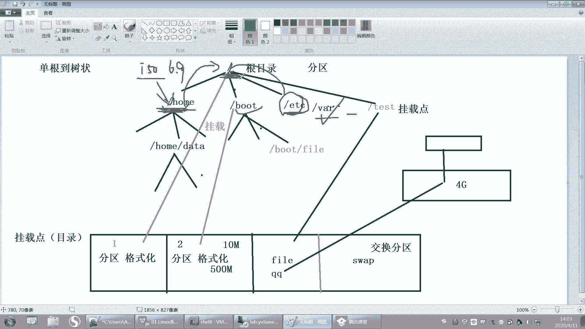
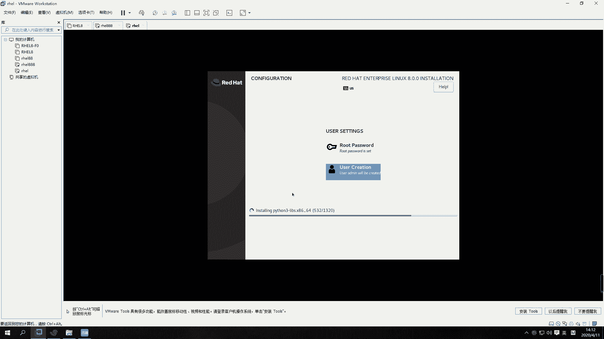
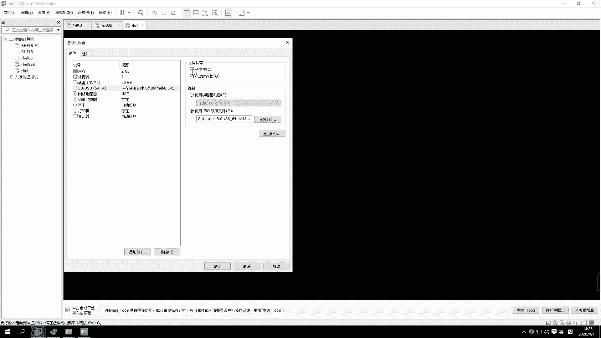

# 【誉天孙老师主讲】Linux入门／红帽认证／RHCE 8／RHEL 8.0／Linux基础视频 - P3：Linux发展史和版本介绍 - 誉天孙老师 - BV1Dr4y1A7jz

好了，那我们开始上课啊。我刚刚有同学还在问那个分多大的问题是吧？其实你。你想一下啊，就是你如果只分一个根的话。这个根给多大给给大概十几个G，反正20G差不多就够了，肯定是够了的。呃，基本上是够了的啊。

但是将来你要想去在。放一些业务的数据的话嗯。嗯，你就要去再添加新的磁盘，然后往里面去存数据。这是系统文件。其实这个相当于类似就是你的C盘嘛，对吧？C盘，你想你C盘给多大呢，对吧？嗯。

其实我们这个地方像不这个分区啊，这个分区的话，它比较特殊，它是启动。呃，所以这个的话也没有说呃严格要给多大，你给一个G也行，那给多了也比较浪费，对吧？所以200兆基本上就够了。其他的话这个看自己情况。

一般home我们也不会说给太大。嗯，home也不会也也不也也不会给他的啊，就像还有一些分区，比如说老师，你说老师我能不能把这个ETC目录单独分出来，对吧？嗯，你刚刚我们在分的时候。

其实是没有看到什么ETC的，他只看到什么，只看到一些，比如说。呃，只看到这个了是吧？然后这个是可以看到了，这个也可以分出来。嗯，还有还还有swipe什么的，但ETC这些目录，当然还有其他的目录。

它都没有显示说能能不能分出来。这些目录是不可以分出来的，它不可以跟有一些目录啊是不可以跟根分开的，就是说必须在跟下面。必须在根下面啊，不能放在别的分区上面。这是有它的启动。

它的这个呃就是系统在启动的时候，跟这个启动是有关的啊，所以这些跟系统目录是放在一起的。必须放在一起啊。好，这个可能要到时候你学了一些更深入的这个理论知识之后，才能理解它为什么是这样做的啊。啊呃。

其他的话就是不分区，就不得分区，你不能你给呃200兆左右给多了就浪费了，其他没什么特殊要求，其他没有什么特殊要求啊，就是这个根根你要给大一点嗯，能能你把所有的盘剩剩余的空间都给它就可以了，就可以了啊。

不要给太小了，同学给三个G啊，那三个G怎么够呢？完全不够。有的同学他还有什么给什么兆级别的搞不清楚了，是吧？没没填的时候填那个单位填出问题了，然后就没有装上。其他就没有什么特殊要求啊。

那分不分出来肯定是有区别的呀。你想一下啊。如果我这个父母父母不分出来的话。你往home里面存数据，一般home就是个人的私人文件，对吧？万一有个人往里面放一个很大的视频。

比如说放了或者你放了1个SO往的加目下面放1个SO，这一下子就是什么，是不是6点几个G啊，有6。9个G，那你把你的你你如果不单独分出来，home是不是直接加根空间啊，那你把根的空间是不是都都都占满了呀。

对吧？那导致其他的这个目录是不是没有空间去呃，是去放文件了啊。😊，那单独分出来就是你往ho，那它就不会什么这样跟空间啊，这就是分出来跟不分出来的区别啊。

好。呃，再往下面啊往下面走分区呢我们已经分完了啊，下面这个地方有个KK dumpK dump啊。这Kd是什么呢？Kd叫 kernelel dump kernelel dumpKd它指的是KK嘛。

K指的是这个。

嗯。Clonel kernel的意思啊。其叫内核备份机制。叫内核备份机制。看什么直播。看什么直播内核备份机制啊，就是说呃它会预留。比如说你看这里如果你开启这个Kdm的话，它就会预留160兆的这个呃空间。

然后你可以在这个你可以手动修改这个大小呢，手动修改大小。好，那么这160兆空间呢用来干什么呢？它是用来去。对，是的，是这个意思啊。嗯，类似于那个黑匣子啊，它其实就是去监测。

你存就运就是存放你整个系统的运行状态的。嗯，那这边160兆谁也不能去占用它啊，当你的内核崩溃，其实内核崩溃也就像windows蓝屏一样类似啊。呃，windows蓝屏对吧？

内核加上lininux内核崩溃其实很少见的，但是windows还是比较多，对吧？windows比较多啊。啊，那么如果你内核崩溃了，对吧？他就会去把这个内存里面的数据，然后生成一个文件。

将来你可以对这个文件进行一个分析。为什么我当时内核会崩溃，对吧？这个我记得是。我记得有有一些软件，比如说360这样的软件，它就会有分析。比如说你上次windows蓝屏了。

它就会分分析出说为什么上次蓝屏由于什么原因蓝屏，对吧？嗯，所以就是大概这个意思啊。那你如果只是做实验。那个内存又不够用，你把它关掉就行了啊，把这个inable这个勾关掉。应able代表开启的意思啊。好。

这K dump。另外右面这个呢右边这个叫network是吧？和。网络和主机名。好，你可以点开看一下，这个地方有一个主机名，这个主机名你可以去改一下。比如说我们改成这个。嗯。你可以随便，你改不改都行啊。

这个地方。改不改都行，还有这个网络，那这就不改了吧，好吧，反正现在也用不到。嗯，就不不用改了，就放在这行吧，放在这儿吧。好，然后在下面这个叫安全的策略，什么security策略是吧？

这个安全的策略呢嗯是这样的，就是他给这提供了两种安全的嗯支线，就是第一种这个标准呢，这个标准是那个呃关于在金融行业的一个标准，就是支付行支付行业的一个标准。第二个是一个政府政府呃行业的标准。

它不同标准呢，就是它里面一些嗯安全的策略是不一样的。嗯，默认配置不一样的啊，但是我们这个地方没有选，你看。我们是没有选的呢no profile selected是吧？没有选的话，就是它默认的标准。

就是linux本身默认的标准。如果你想选的话，你就把这个下面勾勾上。但是目前我们都不要选，都不用去选它啊。都不要去选它，听到没有？啊，然后就让让它是默认的标准就可以了啊。好，然后这个是安全的策略啊。

然后下面这个是。呃，叫系统的目的purpose对吧？系统的意图就是系统是做什么用的呀？啊，第一个是在什么角色呀，这个是什么服务的级别，对吧？然后这个是什么用处，这个都不用选。嗯，为什么呢？其实你选上。

比如说我是一个红帽的servver版是吧，worktation版，还有什么computer node，就是计算节点什么之类的。嗯，你只是做一个标记，就是这个系统将来是做什么的，但你做不做标记。

将来也是一样的用对，一样用。所以这我们一般都不就不用管它就不选noorspec嗯not是吧？spec是吧？spec就是不不指定啊不指定。😊，哦，这个也不用选，OK吧。好了，确定啊。好。

那这所有的我都点了一遍嗯，当然你们自己也去点一遍啊。啊，然后下面有个安装不in。嗯，一般有些时候你们安装的时候，这个地方是灰色，就点不了。一般情况下啊。原因就是。要么你这个安装员有问题，要么就是你的。

啊，这个这个这个这个什么分区根有问题啊，就是分的不对。还有没有有的是红色会标记一些什么感叹号啊，就说明这个地方是有问题的啊，你要重新修改一下，这样的话才没问题才可以安装，点一下。好，安装的时候。

这边有一个用户的设置，root密码，root密码，你点进去给他一个root密码叫rehead，随便你叫什么哈。但是这个地方你你是就是第一次这第二次确认是吧，confirm吗？确认再次输入。

我输入的是redhead这个地方大家密码啊，如果密码你一定要自己去记住啊，我一般的密码，我们环境的密码一般都是叫rehead，你也可以跟我一样，好吧，或者你叫1233456都可以啊。但是呢你设置完之后。

你密码忘记了。嗯，你问我我也不知道啊，而且。我也没有办法帮你去找回这个密码了，所以一定要记住啊，记不住就重装系统，好吧，记不住重装系统啊。好，点两下呢点一下，它会说你密码有太弱了，是吧？对。

什么密码太弱了呢？他说你再点一下。嗯，你想自己破也可以自己破，那破不出来就重装，好吧。现在解决这个密码的问题，唯一方法就是重装系统啊，你问我密码，我也不知道。好。OK下面这个你要创建一个新的用户啊。

因为你现在不创建，待会儿也提示你去创建啊，然后你点进去。啊，这个用户的名字叫什么？比如说叫admin，随便啊。好，呃，密码呢也随便设一个。啊，然后点一下。啊，他说你再点一下是吧。

那下面呢嗯anyway我再点一下啊，点一下。好，那这样的话，用户addmin就会创建了。那么这个root呢是我们的这个系统的一个管理员，叫root，它默认就有这个用户啊，默认就是用用户啊。

那除了这个用户以外，还有一个新的用户叫addmin，我们系统是不想对吧？他不想让你去用这个root用户去登录，不想用让你去用管理员去登录。哎，所以这个地方要设置。当然如果你是最小化安装。

这个用户可以不用设置。对，最小化安装这个用户，普通用户可以不用设设一个入何密码就可以了。好，因为我是图形界面啊，所以我呢我就要去设置一下。你密码卡在密码呢。好，大家可以看这里啊。

这个地方在安装后面你看installation，对吧？哦，因此。inststore installst什么东西呢？后面是一个软件包的名字，它现在装包，看到没有？其实我们装系统，无非就是在装一些软件包。

嗯，然后再做一些基本的配置，根据你的选择，做一些基本的配置。后面这个是装了3000，一共要装1320个包，前面前面是已经装了191个包。好，如果这个地方你呢你的这个。嗯，一般默认就是GUI吧。

s with GUI是吧？s with GUI的话，它就是1320个包，就这样子，你看看跟我是不是一样的。如果不一样，你要么就少选或者多选或者选错了。12个是吧？好，也行，没问题啊。1322个也可以。

好，等一会儿啊等一会儿。呃，这个还是比较快的啊。嗯。都都都都跟上了没有？

没上了是吧？好嗯好嗯。一定要一定要跟上啊，然后大家的小本本都都都都有了吗？记笔记的东西都有了没有啊？自己准备一个啊。

啊，稍等一下啊，呃，这个让他先装好吧，我这边有一个装到一半的，这个装好了，就是你你哎呀。呃，你你右边这个装装装好，安装好之后，所有的包安装好之后，在右下角就会有有有一个叫reboot，叫重启。对。

叫重启。然后你点一下那个reboot，然后重启完之后就会成我这个样子了。

嗯，成左边这个这个字呢这个虚拟机的样子，重启之后啊重启之后。

这边装好之后，右面会右下角会有一个叫reboot reboot的图标，你点一下，因为现在比较慢，所以我就先继续往往后面讲啊。

好，然后reboot之后呢，这边有个license，呃，重启之后，它就会看到这个地方有个license。这license其实也就是一些嗯条条框框给你再告知一下，对吧？嗯，然后你就知晓一下就可以了。嗯。

当然你想去看也可以看，反正看不懂是吧？你点一下我接受就可以了啊。好。然后右边这个叫呃scor，对吧？manager。嗯，这个叫订阅管理器。嗯，前面叫订阅，这个单词叫订阅的意思啊。

就是以前我们呃会去买一些那个报，就是买一些那些书，对吧？嗯，那个叫订阅啊，就是你们那个订阅号，你们微信有用过英文的吧，是吧？那个订阅号就是叫个s呃subscription。嗯。就是这个订阅的意思啊。

那这个订阅是干嘛呢？就是你点进去可以看一下，如果你买了红帽的服务，就是你你这个系统本来是红帽官方发布的是吧？你用它的系统，将来你这个系统出问题了，啊你又去买花钱买了它的服务。

买了售后就买了售后的意思啊买了售后服务之后，你就可以把你的信息填一下啊，填在这个地方可以订阅。但是你现在说我没有买，后面再去订阅，可不可以也可以啊，没有买就算了，就就就这样就可以了。

他说你这个系统是没有注册的，看到没有？因为你的系统将来可能会提示说你的系统没有注册，什么意思呢？就说明你的系统怎么样是没有购买这个服务的，像sinto啊。

就是大家可能用过sinto那个它就不会什么不会出现这个提示。因为它那个是完全免费的，不没有涉及到服务一说啊就是。这个版本的待会儿我会介绍嗯这个这个版本。好。然后下面完成配置，在右下角啊右下角完成配置。

不算是盗版，这个是可以免费给你用的，只不过是你出现问题了。你出现问题了，他不会给你解决这个问题，你用也可以用能理解吗？用是可以用的啊，这个不算是盗版OK吧。不像有的那个你像windows，对吧？

你必须要买了是不是才能用，是这个意思吧？那我不买是不是也可以用？

嗯好，完成配置啊。对，这没有盗版，你什么盗版一说啊。

好了，那这边我已经进来了啊，已经进来了。然后大家可以看一下，这个地方有一个小人是吧？然后这就是我创建那个普通用户叫admin这个用户，你可以点一下这个图标，然后输入密码就可以进去了。呃。

当然你输入密码进去之后，是就是以这个用户进去的，对不对？那大家呢嗯大家就是后面在进的时候就用root来进root用户来进啊。用root用户来进就可以了。嗯，目前我们先用root好不好？嗯，好。

然后root用户怎么点呢？下面有个叫notote list，它有一些用户没有列出来，你可以点一下notote list未列出。如果是中文叫未列出，点一下，然后这个有个用户名。看清楚这是用户名啊。

有同学在这输密码。啊，用户名叫root。好回车，然后密码是rehead。然后登录右下角登录就可以了。addmin进去了，那你就退出来的话，你就右上角有个logout注销。那这个地方有一个。

你看这里有一个那点一下。你看log in as in as log in as another user是吧，用另外一个用户登录。嗯，这样就可以了，好吧。好，这样的话我就进来了啊，就进来了。嗯。

因为现在如果你不用root，就root进的话呃。

就是很多事情你都没有权限。所以我们刚开始学习，我们先用root吧。到后面你熟悉了或者工作了就不要用root了，root权限太大了啊。好，那么这边的话就进来了，进来之后呢，我可以看到一个欢迎的界面是吧？

那在这是不是让你选选语言啊？如果你之前选了中文，那你就可以选chinese是吧？如果你没有装中文，那你就只能选英文了。我没有装，所以默认就是拿英文进来啊，每一个新的用户登进来都会提示你。然后下一步。

这是干嘛的呀？哦，选择键盘布局是吧，就默认就行了，默认就行了啊。好，然后这是什么这个你这个隐隐私定位是吧，这个随便你关上也行，开启也行，随便啊，然我就把关上了啊。哦，priivice嘛隐私嘛，对吧？哦。

然后下一步。不要用root工作千万不要用root啊，你可以你可以用普通用户提全，但是千万都不要用roroot。呃，这个风险很高，好吧，你们管理肯定不行嗯。然后连接你的这个什么什么东西。

不管它sip跳过就可以了。好，然后开启。这边系统我就装好了。这是这不是浏览器啊，你就把它关掉就行了。这是一个教你怎么用的是吧？反正我也没看过，你可以看一下，把它关掉就行了。

好，这就是我们红猫八的这个呃桌面是不是很炫酷？还可以吧。

你们你们我这有点慢呢，你们好了吗？高级黑是吧。呀，你们挺快呀。

ううん。啊，我还是比较喜欢这个界面，你可以你可以去改一下它的背景。这里右键呢change background。

改一下这个背景是吧？呃，我们这个呃红帽八的图标都这个就扒出来之后图标都变了，看到没有？以前是一个嗯以前是一个这个这个红帽，下面有一个人脸是吧？有一个人脸。然后呃后来呢红帽内部就把那个图标改了。

把那个logo改了，然后把那个人脸脸给去掉了是吧？就没脸了，是不是？嗯，所以他当时是说这个这这这个脸呢就是一个像一个神秘人物一样，对吧？让人感觉到就是很神秘的感觉，但是也不知道是干什么的。

所以就把它给去掉了。😊，嗯，就不要脸了。对。好，然后这边的话背景你们自己去改好吧，我看到有个同学哇改的那个炫酷啊，我我是没改过。

嗯，这个还在装是吧？那你们就等一等吧，你等一等装一下就行了。

呃，那个其他同学还有没有什么问题？关于装系统这块没有过一会儿如果没有的话，我们就过了啊。

唉，那个我问一下啊，在远程的那个we back的同学。是之前都是重听的，我看绝大部分都是重听的。有没有新声啊？YY同学有没有新，就是新声就第一次来听的。哦，你是第一次是吧，不知道他怎么他们怎么再分的啊。

孙乐创是第一次吗？分区那个操作哪里不懂？分区那个操作。

哪个操作？

分区那里我就选了一个挂载点嘛，然后给这个挂载点多大，就这样啊。有什么不懂的吗？是这个不懂还是怎么不懂？嗯。从哪儿选啊？啊，我。等一下啊。我这里有一个。有一个实验手册，我可以看一下啊。这里有一张实验手册。

如果没有。没有装成功的同学可以看一下这个啊。你就把这个点进去啊，license点进去，然后同意一下就可以了。你就你装软件，人后说你同不同意啊，你不同意就不要装了吧。嗯。ほ慢。这边有啊这边。好。

那在这里啊。是这里吧。你你不是选到这个地方吗？然后点进去之后，你选这个手动装啊，customer普通的这个是自动的。要选这个。然后选进去之后，把这个地方改成标准分区。那本来是逻辑院的吧，改了标准分区。

然后那写个加号。嗯，swib这地方给了两句是吧？然后分了三个分区嘛。一个是根，一个是 bootot，一个是swipe。嗯，就这样，你可以看一下这个待会儿我发到群里啊。嗯，好。啊，还有什么问题吗？

嗯嗯。好，那你就会你装好这边就是reboot就行以了。那reboot。点一下。就就这样就装系统就装好了。如果你装失败了，就重新来一次就行了，重新来一次启动嘛。

那这个地方你看如果你第二次再装的时候，这个地方这个勾就可以选了。看到没有？你一定要把这个勾给勾上。如果你再装系统的话，这个地方。那你是不是把这个地方你要重新。那就重新装一遍，好吧，把这个勾再勾上啊。

有连接。因为每次有同学这个勾，他们他第一次装装失败了，然后又重新装了一遍。装了一遍之后，呃，它这个地方勾没勾上，就连不到那个SO上面。

好吧，把这个再统一一下。嗯。然后这样就行了。好，那我们系统就装到这儿吧。

按照这个实验手册是可以装出来的啊。好了呃，没有问题，我们就继续了啊。我要不道进去下，密码不是软 high吗？😔，我的妈呀，这个密码是你自己设的，不是我设的，我我不知道你的密码是多少哎。好嗯。啊。

密码是多少，你要看自己怎么设的啊。嗯。好了，那大家先听我来讲啊，嗯你们那边系统没装好的，下去晚上。晚上再去装一下啊，我们先上课，好吧。上课啊。好。嗯。我们下面来看一下概念啊。

因为后面我们会讲一下linux的一些起源呢，发展史啊等等这些这个必须要去做一些稍作，要要有了解。然后呃那在这之前，我们先来介绍一下开源软件啊。嗯，我们今天上午讲的这个linux，它是一个开源的。

开源的linux啊。它是一个开源的软件，它是个操作系统，它也是个软件，而且它是个开源的软件，对吧？那么开源的软件。开源什么叫开源呢？开源就是指。软件的软源代码可以共享给所有的人去使用啊。

就是所有人都可以拿到这个软件的源代码。怎么还在讨论？密码不知道的重装啊。要么就试一下这个问题没有什么好说的了啊。うんうん。不装ts没关系啊，不用不用装，你装不装都无所谓。现在你这个。我一般都没装。

一般装的话就会有一些高级的功能嘛，但是这个我也无所谓。好吧，我们在微末里面这个无所谓啊，有需要的时候，我们再把它装一下，没需要我们就不装了，好吧。好，现在装可能大家也不会，没关系啊，慢慢来。好。

看这里啊。嗯，开业软件呢它是指我们源代码可以共享给所有的人。我们的源代码呢就是我们的这个软件呢。嗯，他都是由这个。嗯，各种语言写出来的对吧？比如说我们常见的语言，C元啊，C加加呀、Java呀。

还有现在还有很多流行的语言，什么构语言呢，对吧？嗯，很多这样的语言啊。😊，嗯，然后写的一些嗯对，写出来的一个软件。那么其实我们像普通拿到这种软件啊，比如说我们这种。你像我们windows里面有很多软件。

比如说啊。呃，像这种软件，然后这种软件是吧，什么这种软件，那这是windows里面的那些软件，这些软件其实都是必免的。这些软件基本上就windows里面的软件啊，基本上都是闭源的。也就什么叫B源。

就是你可以用这个软件。但是呢你没有办法看到这个软件的源代码。也就是说它如果是用C语写的，你看不到C语言的代源代码哟，就它一行那个程序员在什么一行一行写出来那个源代码是看不到的。啊，那开源呢它是指什么？

它就会将源代码给贡献出来。那你想一下这得需要什么样的境界是吧？嗯，才可以把这个源代码给共享出来啊，就是我你创造了什么？你发明创造了，然后给大家都都去使用，哎，而且还告诉人家什么秘方，对吧？对。

还告诉人家怎么这个过程是怎么怎么弄出来的啊，得辛辛苦苦写出来的。所以到目前为止，我们呃在开源界啊能发展到目前为止是多么不容易，对吧？大家都有这样的都要有这样的精神，对。

都要有这样的开源精神才能一步步发展到现在啊，那么在我们一些就是自由软件，有些自由软件，就开源软件啊，有一些基金会，有一些就是组织的组织的就是基金会啊，他们定义了就是你有四个自由。

就是在开源的使用开源软件的时候，你有四大自由，就是你能做什么，对吧？你拿到这些开源的代码，你能做什么。好，第一个呢就是你可以以任何的目的去运行这个软件。以任何目的去进行这软软软件啊。

比如说你拿到Lux是吧？这linux它是一个开源的，那么这个开源的软件你可以怎么样啊？好，因为要等一下啊。嗯。画笔。好嗯。二笔。啊，你可以去以任何的目的去任何目的哦去运行这个软件。当然你的目的可以。

不那么纯洁对吧？比如说你要干坏事对吧？或者是做好事，做坏事，攻击别人，这个都是允许的。啊，无论你做什么都可以啊。好，第二呢这是第一个第二个第二个就是允许学习和修改软件的源代码。你可以去学习它可以。

因为你都可以看到了嘛，对吧？你也可以去修改它，你可以把这个原代码拿来之后，是你写的不行啊，我来给你修改一下，可不可以呢？当然也可以了，对吧？好，那么修改完之后呢。我能不能把它重新发布出来呀？可以。第三。

你可以去重新去发布这个软件，就是说这是你写的。当然有没有人用，有没有人看还是另外一回事，对不对？你写的好呃，那别人可以可以去借鉴你写的不好，那别人可能不用，对吧？别人可能不用啊，所以呢这是第三个。

你可以重新去发布这个软件啊，然后第四呢，你可以干什么呢？你可以去发布开发这个软件的一些衍生版本。就是说呃什么叫衍生版本呢？我们这是个linux是吧？它是一个操系统。那么我拿到lininux源代码之后。

我可不可以拿来做别的事情，就是将来它不是做操作系统。呃，去把它其中部分代码拿出来，然后做放在别的软件里面可不可以呢？也可以也是可以的。就是它可以做创建创作创造一些衍生版本啊，就是不做操系统。

做别的事情也是可以的啊。所以这就是在自由软件的里面，你可以做的四件事情，要1234。但是一般你去用别人的源代码，你需要标注你需要标注是么？你你这个这个这个出处是哪里？这个是对别人是什么尊重啊。嗯。

你要去尊重别人的知识产权啊，所以要去标注一下啊。好，这是开源软件，那么开源软件它有什么优点呢？对吧？为什么大家现在都要用去用这个开源的软件啊？嗯。

现在很多公司他们在做嗯比如说啊他们要去像国内呃一个linux是吧？但是linux是一个开源的开源的操作系统，那么这个开源的操作系统，嗯。

开源之后那国内想去做一款自己的国内的这个操作系统国产的操作系统是吧？那他是要自己去写一个操作系统吗？当然不太可能也不太现实，对吧？嗯，然后这个开发成本也比较高，所以呢他就什么用它的源代码。

然后进行二次开发，对，进行二次开发，然后作为自己的什么？哎，就是自己的为国产的是吧？因其实国产现在有很多的很多的linux啊，就是国产的呃linux，对不对？呃，像华为就有自己的欧。

还有国内的什么麒麟啊、深度啊。嗯，红旗什么反正很多国内的啊。好。所以大家去愿意去用啊好，那它到底有什么优点呢？我们可以看一下。哎。好，这边呢我们列了几个这样的优点啊，我们可以大概看一下啊呃。

低风险低风险啊，就是如果你是用一些闭源的软件，那么这个B源软件它一旦没有人去维维护的话，比如它是A公司做的对吧？它是A公司做的这个B眼软件，你用它的话，你用它的软件，这个软件公司倒闭了是吧？公司倒闭了。

那你的这个软件有可能就用不了了，你就可能要去选择别用别的软件，对吧？这是有风险的啊，然后那一般开源的软件呢，开源的开源的软件有开源的社区来维护。它是由社区来维护，不是哪一家公司来维护的啊。

它是有个社区的，呃，很多公司都会加入这些社区呃，他共同去维护这个呃这个开源的产品。所以一般社区很少有倒闭的倒闭的可能嗯这个这种问题啊，所以一般大家愿意愿意去用啊，因为它风险比较低。然后第二呢。

它成本也是比较低的啊，这个成本低大家可能就是我刚刚说的，大家如果想去做二次开发的话，呃，想去做开发自己的产品，你没必要说我自己再开发一个新的产品，对吧？嗯，真的没必要啊，你就去用那些开源的就可以了。

把开源的拿过来做一次二次开发，对吧？做二次开发啊，然后就可以节约你的成本，节约成本啊。啊，奥后第三呢就品质也比较高，就是它的这个嗯推动推动啊，就是有众多的人来去推动它，这个写字不好写。

就是有这个由整个社区来维护，对吧？那么它的生命周期，它的这个呃周期版本周期可能是比较短，就是说短可能呃。就是。就这个发展起来呃也是比较快的啊。比如说你有一些bug，刚刚开发出来的时候有bug。

那bug修复的也是比较及时。对，因为用的人多嘛，然后维护的人多呃，bug修复及时。嗯，等等啊，由社区来维护而研吧。啊，最后呢就是你用这些开源的开源的产品，当然更安全一些，对吧？因为开源的嘛。

你这些源代码都可以拿到。如果别人在这个开源的产品上去植入一些后门呢嗯嗯这个别人一看就能看到啊，一看就能看到啊，所以大家愿意去用这样一个一个开源的产品啊，开源产品，无论是个人使用者而言。

还是对于开发者而言啊，对于企业而言，他都允许愿意去用这个开源软件嗯，开源软件。好。那么我们知道什么是开源的软件了之后，我们下面来看一下关于lininux的一个发展史啊。嗯，你要想知道lininux。

对吧linux它本身它的一些工具呀，或者说嗯它的各个版本，你必须要知道它是怎么发展过来的。唉，为什么现在我们linux它叫什么？叫一类unux。嗯，叫类类有那个骚系统，对吧？为什么这样去叫啊。

要这样去叫，那它跟unix到之间到底是什么关系，对不对？你这个要知道啊。好，那么在说这个呃linux之前，我们肯定要提到的一款操作系统叫叫unux操作系统啊，unux操作系统。呃，这个un操系统呢。呃。

是其实在很就是。嗯，因为那个词是哪一年，哪一年就是。发布使用的知不知道啊？unix啊。50年代。50年代嘛。有没有同学知道啊？七八十年代是吧？嗯，很好，70年代比较接近了啊。对，70年代初呃。

为什么会记住这个时间呢？嗯，你们对，很棒啊，它就是1970年1月1号，71970年1月1号，因为其实是1969年，1969年的时候就已经发布，就已经就是已经开发出来了，是吧？对。

然后到1970年1月1号有一个时间点，因为这个时间点很特殊。呃，我们计算机的元年就是这一年，知道吧？唉，计算机的元年就是1970年1月1号啊，后面你们会经常会看到这个时间，时间的开始，就是从这一年开始。

从这一天开始的啊，从这一天开始的，这个是unix诞生的时间，对，unix诞生的时间啊，那么unix嗯是怎么出现的呢？unix又是怎么出现的呢？大家在当时应该有听说过啊。

有两有一家公司叫AT andT是吧？呃，AT andT。哎，这个公司大家应该听过。嗯，美国的一家公司对吧？然后这个公司它旗下它下面有一个对有一个贝尔实验室。这个贝尔实验室哎，这个这个大家肯定听过吧。

经常会受到这个实验室是吧？对。很厉害啊，这个贝尔实验室有很多工作者，研究工作者啊，呃当时是有一个研究工作者，嗯，好像是。假期在家休息吧，还是怎么样，对吧？嗯，说是说是老婆出去玩了，还是怎么样。

他自己家没事儿是吧？他想去玩一个游戏，叫星际什么星际太空，还是什么星际反正么什么游戏的。嗯，反正就是玩一个游戏，对，就是玩窝里玩游戏啊。😊，呃。

玩游戏呢它没有就是没有好的操系统去运行它这个游戏它就它呢就。自己写了一个，当然在这之前还有其他的一些操作系统啊。他自己写了一个unix，就当时就是这个unix写出写了一个unix。

然后把它的游戏运行在这个unis上面。运行在这个unux上面啊，然后回来呢，他他们就放假回来之后，他就把这个呃游戏给他同事看，对吧？说你看我这个游戏怎么样，对不对？好，当时他这个游戏是人家没相中是吧？

但是人家这个操作系统相中了，有看中了他这个操作系统他说这个这个厉害啊，对吧？呃，但是其实当时呢。美国这个公司对吧？他其实并没有重视这个操系统。他当时只是觉得哎呀这个操系统没有太去重视它的重要性，对吧？

所以当时就是把这个这个呢其实也是当时是开源的，就是它是开源免费。就是说你用这个工具，对吧？用这个呃操系统，你我免费给你用，而且我还教你怎么用，对吧？源代码什么都可以拿到，对，就是当时最早的时候啊。

就unix是这样子的，那当时人们也有这样的这个境界是吧？可能是他也没有重视它啊，这个也正是由于后面他重视了它他知道它他知道了它的利益所在，所以后面unix慢慢就会成为商业化一个产品，就慢慢就开始避园了。

对，就是大家可能就用不用不太能用得起它了。嗯，所以这就导致unix后来就就就就很多人就就有点就是。后来就发展发展出很多很多的小版本是吧？嗯，很多的小版本，这个其他的这个unix版本啊。😊。

那关键这个unix，它后来还有一个问题，就是它跟硬件是要兼容的，就是说你拿一个unix过来，它需要在特定的。比如说你惠普的服务器或者是什么其他的这个呃服务器，它上面都它都要去修改源代码才能运行的。嗯。

他说跟硬件要兼容才可以，否则运行不了，就像我们普通这种笔记本，你装过unix嘛，你装没有装过呀，对吧？装不了啊，所以慢慢慢慢的后来发展。嗯，这个unix就成为一个商业化的产品了。

商业化产品刚开始是免费给大家用，对吧？又开源，但是后面啊就不是这样子了啊，就不是这样。好，那么那这是unix啊，那就说到unix呢要说到另外一个人，这个人叫什么呢？是rid Richard啊。就这个人。

这个人大家可能都没有听过他啊，呃，不过你要知道，因为他非常厉害。😡，嗯，他非常非常厉害啊。呃，这个Rcha storeman呢，他呃你可能听过linux的创始人叫雷纳斯，对吧？嗯。

但是你没有听过这个人叫riacheltman哦，这个人当时他其实是这个他是做什么呢？他在一个开发小组里面，他是为这个unux写什么东西呢？写一些应用程序的，就开发一些应用程序。大家知道有了操系统之后。

你就要在下面去开发，就基于什么？基于这个操系统去开发一些应用程序。它本身就是一个研究，它就是一个。开发者啊就是个开发者，就写应用程序的。那么当时他写这个应用程序呢。为ux。

但是后来慢慢unix不是转为商业化的产品了，对吧？unix慢慢转为商业化产品了。那么在他当时那个小组当中，他那个小组的人基本上有的人就是依然还是怎么样为unix服务，对为unix去写。

因为他们觉得嗯可能其他人不知道怎么想。他但但是他自己呢觉得什么？他自己觉得我写的这些东西用在这个上面，那这个给别人去用的时候又要去收费，又要去一堆这个版权问题，对吧？别人都用不起了，那他认为是什么？

他要有开源的精神，要贡献开源。就是这个人最早的时候，他就觉得。我这些东西开发出来，就应该给别人免费去用。对，给别人去开源，就可以拿它的源代码，而且教他去使用。对他当时这个境界还是比较高的啊。

所以他当时就不与他们为伍，对吧？就觉得呃我不需要再跟你们一起了。对，不要再跟你们一起做这些事情了啊，但是他他也很难受，为什么呢？你不用unix，你用什么？当时的操作系统只有一个可选的对。

就这个unix啊。😡，哦，那后来呢他呢嗯他自己啊。它组织了一项运动，叫兼U运动，叫兼U运动啊。那这个兼U的组织这个这个名字呢其实就叫什么GNU is not。呃，unix你看啊那GNU对。

就组成了一个叫GNU计划，叫GNU计划啊，就是发起了一项运动计划。呃，那么这个项运动跟计划呢其实就是来倡导什么，倡导开源啊，倡导开源啊，就他认为。我们的这些。软件都应该开源，对。

都应该开源给到大家去去使用它啊。好，那么呃但是他也没办法，对吧？因为unix确实当时只有这一款这个操作系统可以使用啊，直到什么时候呢？直叫直到1991年的时候啊。这是一个转折点，我们linux诞生了。

对。呃，1991年的时候，linux诞生了啊，所以linux它是1个90后，对吧？它是个91年的啊，它91年，那现在为止它可能就只只只有什么？只有30可能3030岁，对吧？还是比较年轻的啊。

还是比较年轻的。🤧好。那么linux当时是怎么开发出来的呢？它就有一个人叫什么叫雷纳斯，对吧？就这个是这个人吧。呃，就这个人啊叫雷纳斯托瓦斯，嗯，这个人呢呃现在还活还活着啊。

就是现在还在为这个linux在做贡献。对，呃，不过他听说这个人的脾气非常古怪，对吧？哦，非常古怪的一个就是那个啊然后当时他是一个在校生啊，在校生就是好像是个研究生吧，嗯，他当时呢有一个什么呢？

他有一个unix。它有一台unix，当时有unux其实已经很不得了了啊。对，就已经很不得了了。然后它呢根据这个unux的架构。就是unix的架构。比如说嗯就是就是嗯这个unix的组成，对吧呃。

然后去自己写了一套呃linux。那么当时这个linux呢虽然说是参考了unix，但是请注意它里面没有一行代码是抄袭unix的。也就是说它只是参考了它的架构，但并不是什么。

并不是代码抄袭了unix能理解吗？所以unux跟linux，它们之间其实是没有什么关系的，只不过它叫一类unix，对吧？它只是类似unix，但是它不是unix衍生版本。对，不是unix衍生版本啊。

因为没有一行代码是抄袭什么unix的。啊，那么linux当时开发出来的时候。它还用不了，为什么？因为它是开发出来的时候，它是一个内核。它是一个内核啊，什么叫内核呢？

内核叫 kernelnal唉叫 kernelnal啊，我们内核是一个操作系统的心脏核心部分啊。对，它是一个核，就是就相当于什么？就我们操作系统的心脏一样，没有了是吧人嘛？没有操没有人的心脏一样，对吧？

人没有心脏，那就没有办法泵血了是吧？你就活不了了啊，没有内核那。😡，就。免谈对吧？免谈啊，所以这个内核呢它是用来做什么？它是用来控制。硬件的。对，它是用来控制硬件的。就是说我们要去往里面写数据。

那要通过内核来去写到硬盘当中，要去调度CPU要通过内核去调度，要去调度磁盘，要通过内核去调度，OK吗？调度网卡要通过内核去调度，所以都要通过内核内核跟硬件就是交互。好，但是问题是有了内核。

我能不能去人为的干预呢？人为去干预是吗？我就是人为去想去什么。😡，人为干预想去往里面，比如说我想去控制它，我想人为能不能给我一个接入口，就是比如说我点鼠标啊，我说我敲命令啊，对吧？

那能不能呃给我提供这样一个入口，让我去控制我的什么硬件啊，没有对，只有内核是无法去控制它的。它虽然可以控制硬件，但是人为没有办法去干预它。😡，好，那么需要有什么才能去人为去干干预它呢？哎。

就是这个操作系统。需要有操作系统才可以去干预它啊。对，需要有操作系统。其实说白了就是我们所说的OS。那你说老师操作系统不就包含内核吗？是这样的啊，是当时他是我给大家画张图，大家就知道了啊。

我们要弄清楚啊，就是他们之间的关系是什么。呃，如果说。好，如果说我们中间是硬件。当然，没有硬件是不可不可能的，是吧？啊，那么这部分呢就是我们的内核。嗯，就是部分就是内核啊，那外面呢就是操作系统。哎。

外面就是操作系统啊，但是呢我们现在啊我们现在所说的操作系统是包含是这两部分的。那我们这个这个外层外层操作系统跟那个 kernelel组合在一起，才是我们现在所说的什么操作系统。😡。

所以我们现在已经把它概念就是已经已经混合在一起了啊。所以现在我们所说操作系统其实是包含什么？包含内核和外部的这个操作系统。这个操作系统是什么呢？这个操作系统其实就是所谓的什么应用程序儿啊。

就是一些应用程序。就是一些应用程序，就是这个应用程序可以给你提供一个入口。唉，你可以呃去操作它就是提供这样一个。比如说可以提供一个图形界面呢，我可以点点点，可以提供一个命令行，我可以去输入命令，对不对？

那这就是应用程序啊，包括我们后面会学的一些命令等等，都是属于这一层啊，那都是属于外面这一层，OK吧。啊，那么有说内核还没有办法用，对不对？啊，而且呢当时啊。雷纳斯把这个内核给什么贡献出来了。

也就是说他把它给开源了，哎，把它给开源了。那么开源之后呢，网上就有很多黑客嘛，对吧？那大家对它都比较感兴趣。因为这个当时呃也是轰动世界的一件事情是吧？嗯，能有这样一款内核出现，而且开源。

那是大家多少人都很兴奋，对吧？所以当时内核刚开始写出来的时候，其实非常小的那个内核很小很小，后来呢呃大家逐逐渐的去完善它，完善完之后呢，到1991年的时候，呃，就是那1。0的内核就发布了1。

0版本的versionin。呃，1。0V就发布了啊就发布了。好，直到现在我们这个内核已经到我昨天看了一下，也是5。6。呃，V了就是5。6点几5。6点几版本了啊，就是光内核啊，光内核已经是5。6点几。

我们所说的什么红帽八是吧，什么红帽七，那这种是什么操作系统版本是操作系统版本啊。好。这个就是内核，而且我可以大家去看一下。我们内核。源代码都是可以去拿到的。你们可以去访问一个网站。

这个网站呢叫3W点 kernell点ORG。嗯。对我们红帽八的内核版本是4。10。14。18是吧？呃，是4。18吧。哦，4。18是吧。🤧嗯，好。然后这里有个3W点colp点进去看一下。

然后这个linux，然后 kernel。然后这是V1。0版本的，就是呢。呃，这个是它最早的这个内核1。0的。当时这个版本你看它得有多大呀，是不是只有一个兆啊，一兆左右估计解压缩出来估计有个不到10兆吧。

嗯，不到10兆，这就是源代码，你可以把它下下来解压缩看一下。再加缩看一下啊，然后这都是一些补丁包补丁包啊。好，然后呢呃现在是什么版本了呀？现在是5点。嗯，现最新的是无链机的，这是变更日志啊。

那现在是无连机版本了，看到没有？而且现在大概有多大的呀？100兆左右了，100兆左右解压缩出来估计有将近快一个G，相信一个G的内就光内核呀，光那个代码就一个G的。呃，这个就比较大了啊。

这还不包括操系统啊，还不包括外层的操系统吧，光内核就有100呃100兆压缩之后100兆左右。嗯，那这就是内核，你想去看它的源代码，你说来，我也修改一下是吧？我将来也想加入到开元社区里面。呃，呃。

现在这个呃雷雷雷纳斯还在这个就是在为lin的内核发展做贡献。对他还在这个社区里面，为linux内核发展啊，做贡献啊。我们红贸八用的是4。18的内核是吧，你可以去找一下。嗯，这就是大家可以自己去看一下啊。

好。那我们再回来啊，刚说到哪儿了？好，那么我们来看一下啊。那这个呢呃就差操系统了是吧？那操系统谁有呢？GNU组织有啊，对不对？好，那么我们这又回到了GNU组织了啊。

那GNU呢不是由这个什么reachsman就是发起了一项运动吗，对不对？那么他当时是为谁呀，是不是为unux写应用程序的，对不对？是不是为unux写应用程序的呀？那刚好怎么样啊？Glinux。

它可以兼容unux的一些应用程序，它开放了它开放了一些接口。所以一般如果当时是unux上面那些程序，它可以移植到我们的linux上面linux上面。它可以移植到我们的lin上面了啊。

所以很多leaings上面的应用程序都它都写了一个什么unix。对，什么什么unix，而且嗯还会有可能会带什么兼U什么什么东西。对GNU什么什么啊，还GNU比如GCC有一款编译编译软件叫GCC是吧？呃。

这个是GNU组织开发出来的嗯，GCC。所以将来你在linux上面会看到很多这种什么兼优什么什么东西，然后unux什么什么东西，对吧？这应该知道了它们之间的关系了啊。呃，它是之前unix在用。

然后后来移植到了linux上面，它还可以用还可以用。后来richard store就专注于在linux上面是开发什么开发应用程序啊啊，而且一直到现在为止，linux都是开源的开源的操序，对，开源操序。

所以就是现在为什么大家都去用这个linux。😊，对，都去用这个lea啊，因为它是无国界的，就是像这种这种东西，它就没有说哪一个国家开发出来的是吧？它是社区社区哪个国家的人都有。

它不是属于哪一个国家的组织。嗯，所以这种如果是各个国家出现一些呃矛盾呢，对吧？那么不会影响到。那你像windows的话，它就有可能。就有可能是吧？只是说有可能啊会影响到我们去使用它啊。好，嗯。

那这个就是我们的什么，这个就是我们的GU和linux之间的渊源啊。GU和linux之间。好，你把这个大概捋顺一下以后应该就稍微清晰一点啊。呃，linuxlinux的logo是什么，知道吧？

看我们这个PPT上是吧？呃，这PPT市场对mix logo就是这个小企鹅，嗯，就是一个小企鹅啊。哦，坐着的小企鹅，这linux的一个logo ，linux的logo啊，linux的logo。好。呃。

那我们再看一下下面啊。嗯。那么我们来看一下。现在我有了什么，我有了这个什么有了硬件啊，有了有了内核，有了操系统应用程序，最后组成了一个什么组合组成了一个操作系统啊，组成了一个操作系统。

那么我们一般做对这个操作系统做二次开发的时候，我们会拿内核，那把内核拿过来呃，甚至还可以把别人的操系统拿过来，我进行修改，对吧？然后做成自己的什么这样的一个发行版本。对，这个叫发行版。呃。

像我们我们这个就RHEL嘛，就是其中一个类型的发行版。对，就是其中虹贸公司拿过来嗯修改的，然后做了一个发行版啊，发行版，但是这个发行版非常非常多。对，非常非常多，它最终都是基于什么？这个内核开发的啊。

基于这个内核开发的，所以他们都是一家人，对，他们都是一家人，呃，他们最终都是由这个内核，他们内核都是一样的，只不过内核版本可能不一样，对吧？但是你你你只要找到跟他同一个内核版本，那他们就是一家人。好。

那么我们就可以在这个应用程序或者在内核你也可以修改，都可以修改。这两个都可以修改啊。好，最后做出自己的发行版本。那么红帽呢是其中一家公司，红帽很早就开始做这种这样的发行版本了啊。

它大概是在1994年的时候，嗯，这个人就是红贸公司的人啊，在linux内核内核呃系统内核技术之上，对吧？然后做了很多这样的呃集成了很多这个源代码。呃，像我们linux上面这些操作系统应用程序啊。

一般都是也开也是开源的，就应用程序这种软件，它一般也是开源的嗯，一般也是开源的啊。好，那么最后呢就发布了红帽的系统。呃，红帽最早的版本叫什么呢？红帽最早的版本啊叫这个东西。叫什么redhead。

123456789就是最后好像。最高版本是叫redhead9。redhead9啊就是最高版本，就是最早红猫的版本啊，它就叫redhead什么什么什么？😡，好，再后来呢他没有再去继续这样叫了。

因为他改变了自己的方向。他想做服务器版本server版服务器版本。所以他后来分了两分了两个方向，一个就是server版。server版叫什么？叫HEL。对，叫鸿猫企业版。呃。

当然还有其他红猫有自己的版本，其他自己的版本啊，待会儿我会来给大家介绍，这是其中一个版本啊，其中一个版本。嗯。好，你看大概就是这样子啊。嗯，这个这个应该没有没什么问题吧。我一直在给大家说，自己说嗨了。

不知道你们听听没听清楚我在说什么啊。😊，好。所以红帽现在也是什么呃，开源行业和linux的一个领头。这个呃带头公司吧，对吧？带头公司啊。好，那么下面我们来看一下关于linux的一些发行版本啊。

linux的发行版本首先是红帽的发行版本。红帽旗下有三个版本，红帽旗下有三个版本啊，一个叫红帽企业版lininux。还有一个叫呃fidora。百多ra啊。还有这个叫centS三个我都来介绍一下。

必须都知道啊。第一个就是我们今天用的这个今天我们装的这个系统，这个系统叫虹贸企业版linux。啊，它叫企业版。那么它一定有个功，它它的特点就是什么？应用程序和功能稳定稳定啊，我们要的是什么？

我们要的就是稳定对吧？要就是稳定啊。啊，嗯而且它更新的比较慢，因为它功能更新的话，它需要测试一些功能，所以呃可能更新的要慢一些。一般红帽的话44年左右。4年左右有个新的版本，像我们去年是去年的时候。

红帽八呃出来是吧？而1414年的时候是红帽七，红帽七想一下经过多少年，大概4年左右4年左右啊，更新一个新的版本。嗯，更新一个大的版本啊，就是7到8下一次再到9，可能要又要4年左右以后，对吧？嗯。

4年左右以后啊。好，然后它呢它的一个特点就是它有专业的技术支持服务。当然这个服务我们说过了，你是要付费的。是要付费的啊，就是你不交钱，人家不管你。呃，你可以免费用，你想怎么用就怎么用，但是你要怎么样。

嗯，你要出现问题了，那我不给你解决，你交钱我才给你解决。而且这个服务的费用不低，对，不低啊，所以国内有很多他用不起啊，对吧？那他怎么办呢？那只能用一些其他的版本是吧？那待会儿我会介绍啊。好。

但是绝大多数都是根据他来呃开发出来的嗯。啊，呃都去基本上都是用它比较知名的啊，就这个红包企业版in。好，第二个叫斐dora斐doa啊，斐dora的这个版本它是面向于嗯。面向什么呢？面向桌面版的。

它其实面向个人和桌面的。为什么要面向个人跟桌面呢？因为这个呢不是面向企业的啊，你看它没有带企业吧，不是面向企业的啊。😡，啊，面向面向个人跟桌面的话，桌面的话就是说它图形界面很很很炫。图形界面很炫。

大家可以去到它fra的官网去看一下啊。嗯，它呃图形界面跟windows有了一拼。对，windows那个图形界面呃相当于是比较炫的是吧？但是它呢可能有嗯跟它有的一拼啊，有了一拼。好，那这是斐多ra。

它是个人使用的，不是企业当中，企业不会去用它，为什么不用它呢？因为它的功能。功能太新了，不稳定。功能太新了，不稳定，应用比较多。嗯，如果因为这个是红贸旗下的啊。

所以如果你想知道红贸企业版的将来有什么新的功能和特性，你可以去用一下这个斐dora。这个斐dora就是他之前会在这斐dora上进行测试。对进行测试。然后大家如果用的话，用出问题了，会反馈bug。

然后去修复bug反馈修复反馈修复，然后最终得到一个稳定的版本用在我们这个鸿贸企业版上面。哦，OK吧，这是他们之间的关系啊，他们之间的关系。啊，不会直接放在鸿贸企业板上面的啊，因为这个我承担不起这个风险。

别人在用的时候啊，我怎么敢去用呢，对吧？啊，而且这个功能它是它这个斐多ra呢，还是由社区支持的。也就是说你用斐多尔出现问题，你说我装个斐多ra哎，崩了是吧？你怎么丢了呀，我不管不管呢？我不管。

红帽也不管，对吧？不是我不管啊，是红帽不管。😡，因为红帽这个本来就是社区版本的，它不提供红帽的官方支持。我就免费给你用还不错了，是吧？你出问题了，你还怪我是吧？啊，他不提供的红帽官方支持。

那你说我用出问题怎么办？你只能去社区提交问题，社区提交，当然别人看到了可能会回复你对吧？嗯，一般都比较热心啊，他们还是会回复的。嗯，当然你要能看得懂是吧？要跟别人这个英文这个跟别人交流啊。啊。

还是针对个人的啊针对个人的，你自己在这个你的笔记本装个斐dora是可以的啊。好，这个是斐多ra跟红帽之间的渊源。那么还有一个叫centize，那跟这个红帽企业本的渊源就更大了啊。嗯。这。哦。

centinS呢呃CENTOS是吧？哦，那么这个操作系统呢呃最早的时候它不是红贸旗下的，它是有一个社区来做的，就是stoS的这个社区呃，因为这个C嘛，C这就知道这个C是什么意思吧？

C就是community community啊就是。会平吗？呃，community叫社区的，所以它是个社区版的草系统ENT就是什么enterprise。哎，叫undererpriOS就是操系统嘛，对吧？

所以它是社区版的企业版的操系统。社区企业版的操系统。好，那么它跟火贸之间是什么关系呢？它跟红贸之间，那红贸企业版之间啊，那关系老大了是吧？它其实就类似于说白了就是红贸企业版的复制品是吧？对。

跟它一模一样，它其实就是将红贸企业版的这个代码拿过来之后进行二次再次编译。呃，得到一个版本。而且这个版本呢，这个社区也比较厉害。他们呢就是红帽每出一个新的版本，那这个s度s就跟他出一模一样的版本。

你是7。1，我也是现一，你是7。2，我7。2，你8。0，我也8。0。你看8。0的这个红帽企业版刚出来没多久，圣度S是不是就出来了，对吧？圣度S就出来了啊，圣度S的8。0也出来了，对吧？现在8。

1出来没有没看啊，你可以看一下。😡，嗯，反正红猫企业版8。1是出来了。😊，好，那么。这个这个社区呢对吧？这个对于洪帽来而言啊，这个威胁性还是比较大的啊，对于洪帽而言呃，威胁性也是比较大。

所以他当时就害怕呀，有个人天天在屁屁股后头跟着你，对吧？你是不是也很怵，对吧？你说万一哪一天把我给怎么怎么怎么怎么样了，是吧？我还害怕。好，所以当时红帽算了。😊，你呢？就把你收了算了是吧？哦。

就把它给收够了啊。对，就把这个社区版的这个stoS给收购了。啊，收购了之后呢，它并没有改变stos的这个工作模式，就没有改他的业务模式，没有改变啊，就是还是他还是做以前的事情，就是说哎我是什么呀？

我是什么版本，那你就怎么样，你就你就跟着我出一样的版本。啊，它这个是还是原来的运作模式。对，还是原来的运作模式啊。所以你现在会看到他们之间对吧？版本基本上就是同步的，几乎是同步的。

他们之间唯一的区别就是logo可能不一样。还有一个区别就是红贸企业版，它有服务。就说他有这个服务是吧，卖服务嘛，那这个版本呢就无所谓没有所谓服务。一说。也就是说你用sin度S的话，出现问题了。

我没有人负责。对，没有人负责啊。所以那这就需要什么，需要我们运维人员啊。对，出现问题了之后，我们再去维护它啊，进行维护。你没办法呀，你用snoS就只能出现这样的问题。因为你又没有交钱，对吧？

你要想交钱买服务的话，你就用这个版本对，用这个版本啊。うんうん。嗯啊当然这个有社区可以可可能给你这个这个不是不过啊不过红贸企业版每出一个补丁或嗯这个补丁包的话，那这个它也很它厉害在哪个地方？

就是你出个补丁包，我都能给你是吧？我都能跟你一样的对我的补丁包都跟你一样。呃，所以这它厉害的地方啊，这是它厉害的地方O。呃，那这个我们公司可能会培养一批自己的这个运维人员来去维护这个系统。对。

用stoS的人啊，而且现在用sintoS不会涉及到版权什么服务之类的。所以大家有些企业都愿意愿意去用这个sintoS啊，愿意去用这个stoS，也就是服务买不起啊。怎么办呢？对吧？只能用这个了啊。啊，呃。

这是红帽旗下的三个啊红帽旗下的三个版本。嗯嗯。所以你你学了红帽企业版，你用stoS，那简直就是一模一样的对，就是一模一样的啊。好，linux还有一些其他的发行版，这个我就不多介绍了啊。呃。

有一些什么deb啊、susy啊、wo版图啊呃特别多是吧？嗯，这是以前红帽的这个logo啊。嗯，苏usy呢是这个你看变色龙这个是吧？还有嗯。还有什么？还有乌班图，乌班图，其实它它也嗯用的比较多。

现在很多个人版企业版也都在用，企业里面也在用乌班图。而且乌班图呢，它上面可以它好像现现在就是支持打，就是玩一些游戏吧，应用程序还多一些。对，有一些应用程序就可以直接装在物班图上面。嗯。

好像现在现在好像可以装，我觉得新的版本好像可以装QQ了吧。我没试过啊，说是之前说好像。嗯，可以可以装QQ。之前好像有出过QQ forlinux1。0是吧？嗯，就是1。0版本，但是后来没有再出了。

因为没必要，但也没有用手机、移动终端都比较发达了啊。嗯，就出个。对，现在好像说是又要出了是吧？而且乌斑图的话，你比如说你做这个多媒多媒体，就是3D渲染，呃，它对显卡支持度比较高。

所以呃一般像那种嗯人脸识别啊，或者是那种对图像啊采集等等处理呃要求比较高的，因为用这个乌斑图对用这个乌斑图。嗯，甚至有些公司全部装到弯图，嗯，还有苏usy这种商业版本比较出名的。嗯。

这些大家可以自己去看一下啊，去看一下。好。嗯，那最终呢我们这么多版本对吧？我们还是选择了红帽呃，红帽还是要给大家稍微介绍一下这家公司啊。呃，红帽这个大家应该都听过了吧，是吧？它叫redhead。

就就rehead，其实就是红帽。嗯。哪个国产的没了？呃，国内还有什么，国内是不是还有。国内还有这个。好，我给大家看一下，我我嗯。有一张图。嗯。下，国内也有很多这个版版本吧。深度是吧，麒麟。欧拉欧。

忘了你这个家伙。这里有一些发行版。嗯。你看一下啊这个。这张图呢。这是这是它相当于列的比较全了啊，反正我是已经看头晕了，我就搞不清楚，这是这版本太多了呢。啊，我们大概有几大家族的几大家族的这个呃版本啊。

呃第一个叫debdeb家族的deb家族的呃，susy就是debd家族的。你像苏usy。哦，说错了，乌斑图啊，是乌斑图吧。嗯找不到了，反正好多。嗯，然后还有下面这个呃乌班图是属于迪b家族的。

然后下面这个是susy比较出名的是吧？susy，还有什么卡里是吧？这个这是几大家族的几大家族的。嗯，还有还有什么卡里是做那个渗透用的，做安全渗透用的是吧？所以你看现在有好多学网络的同学呃，他想去做安全。

做渗透，他就要去学linux。对他就要去学这个linux，看到没有？嗯。就是卡里有个版本叫卡里是吧？用这个。哦，然后这是呃还有一个家族，就是红帽家族的。呃，红帽下面是它的发行年限这样子。

红帽是1994年是吧？1994年的时候发布的。然后这边你看有红贸企业版，红贸企业版，然后还有oracle的，看到没有？

oracle的这个oracle公司的这个oracle lioracle嗯这个跟它几乎是一样的。所以你会用这个红贸企业版，你也会用oracle的好吧，然后还有stoS看到没有？sintoS。呃。

还有华为的这个欧拉OS，华为的欧拉OS。也是基于红帽这个家族，红帽这个家族。所以你用华为的那个欧拉OS，你只要会这个你也会用红帽的那那个华为那个还有国内很多的就是产品，反正基本上都是大同小异。

只要你会一个会一个就行了。嗯，其他的都就就。都是相通的啊都是相通的。就一些工具可能有它有点不太一样，是吧？啊，这就是红帽，为什么要去学红帽啊？而且红帽的整个认证体系它是比较全的。

没有哪一个版本有这么全的认证体系啊，认证体系啊，所以呃。而且红帽在整个开元界它的领军地位，大家应该是知道的。还有一句话叫呃红帽开元界的领导者是吧？是不是叫开源界的领导者啊？嗯，对开元界的领导者地位啊。

领导者。开元界的标，而且红帽是做纯纯软件的。呃，纯软件的公司啊呃但是很不幸是吧，被收购了是吧，是这样吧。呃，很不幸最后被收购了。呃，被别人看上了是吧？被IBM公司给看上了。嗯。

这个去年的就是之前当时被收购的时候，人们都很担心啊，就说嗯这个新闻就是。这个新闻是比较大的一个新闻啊，然后被上被，当时被收购人们就担心说那红帽，我去学红帽，这个这个还有没有必要学，对吧？

就学了还有没有出路啊，这这这对吧？大家有担心啊，但是目前为止是没有受到任何影响的，而且。嗯，他的这个。发展会越来越好。因为为什么IBM会去收购红帽这家公司？嗯，这个大家可以去想一下啊。

你想下IBM它是做什么，它基本上是做。他他的产品一般都是必，它就必然的嘛。😡，对吧它产品就是这个闭源的，它从什么，它从硬件它好，它好在哪儿？它从硬件到什么软件全是自己的。有自己CPU有自己的服务器。

有自己的什么操系统，有自己的都有。对它的兼容性。因为自己家公司做的嘛，兼容性肯定是什么要好一些嘛，而且稳定对吧？像这大型机小型机。但是现在的什么现在是什么时代呀？现在是就什么开源对吧？那开源嘛。

大家现在都用一些开源的产品。你想如果IBM说来，我把某一个软件给开源了，现实吗？不现实，这件事情是不太现实，那我怎么办？那我怎么才能怎么样？呃才能跟得上什么？

现在的潮流呢嗯算了跟不上就怎么样收购你算了是吧？好，要把红帽给收购了。😊，呃，现在去做呃，因为红呃像大家现在开始做云嘛，对吧？呃，做云，你像IBM也有自己的云，但是它的云呢它。怎么说呢？

他现在是想做云云，就是做云的老大是吧？呃，他就结合什么红猫的云啊，ABM的云做混混合云啊等等。对，所以有钱还是跟这个这个对吧？想去收购谁就去收购谁，还把红帽都给收购了，是吧？😊，嗯，而且现在IBM公司。

他们所有的这个呃员工都要去学红帽，而且考红帽的认证。对，考红帽认证。之前我们有一批就是这样子，有一批学员就是全部是IBM公司的就武汉IBM。呃，他们全部要去考那个那个那个那个CA的。

有一门叫open shift的吧。然全部好上去要去考。对，要去考。所以他给他给红帽带来的市场会更大啊会更大。嗯，这个嗯就是红帽。目前为止，我们为什么要去选择红猫啊？所以我们选择其中一个。

其他的5式基本上就自同了啊。好呃，下面呢我们有一句话啊。呃，我们la当中我们有一些基本的准则啊，基本准则。呃，我们给大家说比较经典的几句话啊。第一个你只要记记住这句话。叫一切接文件。呃。

C里面open shift的学吗？学啊嗯你们报了CA的就会学。好，叫一切接文件，包括硬件。对，包括硬件啊，那么。我们所有的。lin当中，所有的都是以文件的形式存在的啊。呃。

比如说一个进程呢就比较抽象的一个以文件形式存在，对吧？包括一个硬件，比如说我像鼠标啊、键盘哪，还有磁盘哪、显卡呀等等等，所有的啊它都是文件。所以所以你只要这句话，一切接文件。对，一切接文件啊。好。

第二呢，我们linux当中啊。它的一些应用程序都是小而功能单一的应用程序。link当中的应用程序。比如说啊我们呃我有一个，比如说我有一个看的。看的工具是吧，那看的工具它就只能看。😡，就只能看是吧。

他能不做什么，其他呢他能不能写呢啊，不能写。对他可能啊比如AL他就只能看嘛，你说写怎么写啊，没办法写。😡，哦，那这相比于windows当中的一些，比如说QQ这种应用程序，它就是什么呀？它功能太多了。

比如说一QQ又可以本来是聊天的是吧，结果现在变成干啥的呀，变成什么嗯嗯。变成一些什么工具啊，邮箱啊。呃，玩游戏啊，干嘛干嘛什么偷菜呀，对吧？抢车位呀。啊，有很多这样的功能是吧？

还有什么QQ空间啊哦传文件啊，对吧？😊，哦，哎，说到这个QQ，我还没加咱们群啊嗯。好，然后它都是一些这种小而精巧的应用程序。那QQ呢不windows的工具呢，它就是大而宽对吧？大而宽泛的这些啊功能太多。

但是它不专一，不专一的话，它可能就性能没有专一那种好。比如像像一些远程工具，对吧？QQ是不是可以远程，但是QQ远程的话，它是不是很慢呢？它会很卡，对不对？那我们就会有一些单独这种做什么？只做远程的啊。

那性能肯定会好一些。对，性能可能会好一些啊。那lins当中我们都是什么都是这种工具啊？😊，都是这种工具。OK吧？好，下面呢那如果说我想去实现一个复杂的任务怎么办呢？那我就可以将多个程序组合在一起。

一起来去执行这个复杂的任务啊，这个就会我们去都会去使用一些工具，然后把它联合在一起啊好去执行啊比如后面我们先写脚本呢，对吧？把所有的这个就是这个任务，这个都放在程序都放在一起，对吧？一下子执行了啊。好。

然后还有什么跟用户操作界界面无关，就是你在哪个哪个界面去操作它，它有很多操作界面。对，有很多操作界面啊，你在哪操作都一样的。我们待会儿会给大家嗯，下一章就会讲到啊这个操作界面。好。

最后呢就是说这个文本呃文本文件啊呃都是以文本文件的形式保持配置数据。就是呃比如说啊你像我们想去修改一些配置数据，比如说我修改IP地址啊。

我就可以打开一个类似这种windows里面的一一个什么一个这样的编辑器，然后往里面去写，比如说写上IP地址，等于什么什么什么对吧？这样去写。所以我们待会我们以后去修改配置的时候，都会通过什么。

都会通过文件来去修改。那你说老是windows难道不是通过文件吗？那windows还真不知道是通过什什么东西。你像你windows的IP地址，你你是通过文件修改的吗？😡，但是那个IP地址放在哪呢？

你你找不找到啊，你不一定能找到是吧？😡，嗯，但是windowslin都是基本上都是透明的那lin基本上都是透明的啊好，就放在这个文本文件里面，然让我们随时去修改这些配置的数据啊，配置数据。好。

那这张呢我们就到这儿啊，我们这张都学的什么啊？呃，我们把系统装好了，对吧？还没装好的，今天晚上回去吧装好啊，装好，明天我们就要去操作了。对，就要去操作了啊。你明天你装好，你还能跟得上，还可以操作一下。

然后我们要知道什么开源软件，开源软件的什么叫开源软件对吧？为什么要用开源的，嗯，将来我们能不能也加入这个开源社区啊？嗯，当然也可以是吧？如果你们足够厉害啊，我跟你说，在开元界混的这群人。

那是非常厉害的啊，非常厉害。如果你们有对吧？能够加入进去啊，那个你像国内有很多公司大型的公司啊，他都会有一些这个人员在这个开源社区里面工作，专门派一些人在开源社区里面工作，而且像国内的这些呃开源社区啊。

或者是有一些还有一些自由软件软件基金会是吧？像linux这个有个linux基金会，大家知道吧？😊，lins还有lins基金会啊。然后有很多国内企业就要加入到这个基金会里面，还要充会员，就会员等级越高。

就钱越多，充的越多是吧？你会员等级越高嗯，那为什么他们要去花钱买这个会员是吧？嗯，当然这你如果对吧？知道了将来这个这个linux的发展方向，那对你们公司企业发展而言是不是就会更好。否则你就。😡。

就是你不知道将来未来的方向在哪个地方，对吧？你就每你就每天就是毫无方向。对你不知道将来可能往哪个方向去导。因为这个这个互联网这个时代，你将来你都不知道你将来可能会被谁谁打败，对吧？呃。

然后就是linux一个起源，还有各个发行版本，还有linux的一基本原则。啊，我们基本上今天我们就做一下安装啊介绍啊啊这是嗯先做一个了解啊。好了，那我们今第一章啊就到这儿，好吧，就到这儿啊。嗯呃。

我不是我的水平还不太不够高啊。啊，我希望咱们班能够对吧？能够加进去啊。😊。

