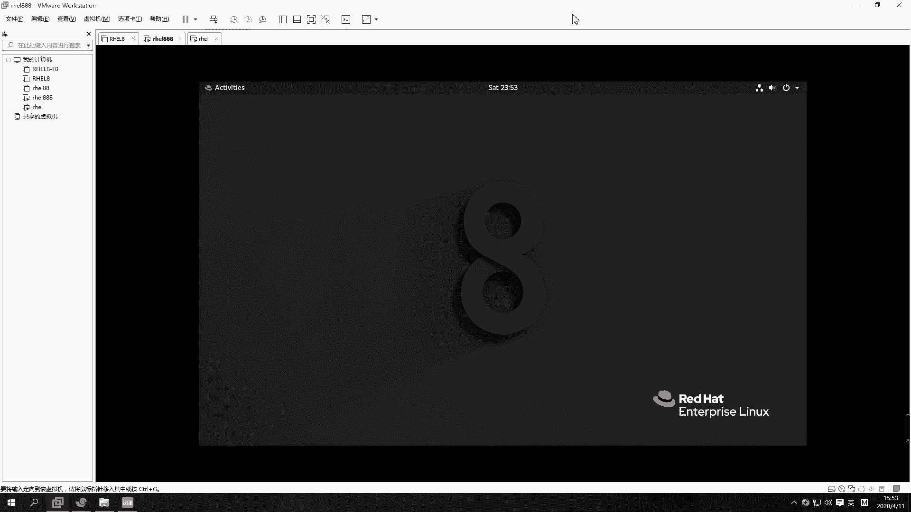

# 【誉天孙老师主讲】Linux入门／红帽认证／RHCE 8／RHEL 8.0／Linux基础视频 - P4：Linux基本使用方法 - 誉天孙老师 - BV1Dr4y1A7jz

好。呃。刚刚有同学刚刚肖老师找我要这个有同学。😊，找肖老师要计算机英语资料是吧？😊，我刚刚说的那个赠送计算机英语。是。你不懂我的隐晦意思吗？😊，啊。还成老师计算机英语资料在哪是吧？😊，嗯。

这个没有资料啊，就是说呃是在学习的过程当中呢，呃陪跟大家一起啊。然后对这个学习这个英语啊，就是说嗯我会给大家解释。对会给大家解释这个呃英语单词，还有一些基本的这个呃看把排错呀。

呃所以你要对这些单词要有敏感，就是你看见它以后，你要能。嗯，要能认识他啊对，要能认识他啊，这是我的目的啊，这叫计算机英语啊。😊，嗯哎，笑死我了。😊，八级呀八级没有考啊，我英语专业才考专八吧。

我是考了6级，我们我们非英语专业的应该是不会考这个考专八的吧。大家要最好把这个46呃4级哦这个四嗯。这个这四级的话一定要考过，好吧，这个有的有的公司它有硬性要求的，如果你们还来得及的话啊，呃。

最好还是要把这个英语英语四级考过了，就还是在校生的啊。在校生的同学还来得及把英语四级考过了啊，因为这个他有的公司它有硬性指标的。你必须要过4级。嗯，如果。如果那个的话就算了，好吧，社会人士考不了啊。

修为人是考不了这个英语四级。在校的话就还是珍惜啊，还是珍惜这个学习的时间。嗯。嗯，有那个好像成就是。有一有一个那个那叫什么？这个不太清楚，那个没考过。好嗯，不说了啊，我们上课。

下面呢我们来看一下第二章啊，第二张呢这个是linux的基本的使用。我们要先去会用一下，就操作界面要熟悉一下啊。好，呃，这张呢我们会去学习一下关于怎么去登录这个linux操作系统。呃。

还有怎么去呃还有这个控制台是吧？有几个控制台呃，怎么去启动一些图形，呃，你要会去简单的执行一些linux的命令啊。呃还有最后你要去会去编辑文件啊，编辑文件啊，最后呢我们稍微做对root的root用户呃。

做一个基本的了解。好吧。呃呃，下面呢我们来看一下啊，关于等会去登录操系统。呃，我们linux提供了两种登录方式，两种登录方式啊。第一个呢是图形图形登录，就是第一个第一个这种方式啊，就图形登录。呃。

这个这张图可能放的不太正确，应该是那个登录界面啊，就是这个图形的。嗯，第二个呢就是这种字符界面的，看到没有？字符界面的啊。好，我们来看一下啊。

呃，图形界面呢就是这样子。如果你选择了sver with GUIGUI的啊，就是GUI那就是带图形的。那么带图形的话，嗯，它这个地方就会有进来之后就会看到这样一个登录界面啊，登录界面好。

你可以怎么样在这输入输入呢？那就是这样的是吧？然后在这输入一个。Root。嗯，然后再输入密码这样子啊，就你输入用户名跟密码就进来了，就这样子好吧，进不来就密码输错了啊。有同学他有一个小键盘，你知道吧？

我我这个真的呃，有的同学他他的笔记本是有小键盘的。他在输密码的时候，他用的是小键盘上面去输密码。嗯，然后导致他怎么都进不去，他说老是密码不知道啊，他是问我，我说我也不知道啊。😡，那要不我帮你破一个吧。

那我我在你身边，我可以帮你破，对吧？那我现在不在你身边，我没办法帮你破啊。所以你这个要注意输密码的时候，千万不要你最好不要用小键板，有时候你摁出来，没摁出来，你搞不搞不清楚的啊。好，这是通过图形界面。

图形界面去登录啊，还有一种登录方式就是这样子的。嗯。Yeah。

我不动。外部没有吧。

啊，就还有一种界面是这样的界面啊。还有一种是这样的界面。好，然后这样的界面的话就是嗯看一看这个是红贸企业版8。0的，是吧？然后这个是我们的操系统版本啊，下面是内核版本。嗯。哦，这个好像有。

他说激活web的conl，对吧？web的登录方式哦，就开启这个，你是应该是stoS8了吧那。对。他这个web console。嗯，通过web这个这个web去登录是吧？好。

然后下面这个就是输入这个呃用户名，输入用户名啊，root。好，然后再输入密码。这样的话就登录进来了，对，登录进来了啊。呃，然后你们呢就是在这个地方要记住啊，在这是log in这个地方是输入什么。

输入用户名，password的输入密码啊，有同学在这个这个地方输入密码，在这输入用户名，反正搞来搞去也没输对啊，不要弄错了。而且这个地方你输入密码是看不到的啊，就是其实你已经输进去了，对吧？

但是你看不到你输的这个内容，嗯，它没有回显，没有回显啊，然后这个就可以直观的给你一个什么给你一个这样的命密行。给你一个这样的命令行啊。

好吧。OK好，这是两种登录方式啊。但是现在就第三种了是吧，web界面啊。这个我要研究一下web team怎么登呢，还没还没研究过。啊，那么这个图形界面呢并不是所有的这个呃系统都会有图形界面的啊。呃。

你需要它由什么来支撑呢？它里面有一个叫X window的X window的啊，就是是这样的啊，就是在这个你看这这张图啊，这张图这个操系统这一层面需要安装很多的应用程序，很多的应用程序。

那里面有一个叫X window的。呃，叫X window的啊一个一个图形协议框架。嗯，这个它可以提供什么？提供这个我们的图形，就上面可以跑图形，就上面你只要跑图形。

你就是要装这个什么X windowX window啊。那么这个图形上面呢啊它会提供一些，比如说有了这个图形之后，光有这个还不行，你还要装一些图形工具啊，这个图形工具呢。

包括比如说啊还有什么有这个有两种有两种啊，一个是这个gome，就是我们接下来会学到的这个gome。它这个桌面工具叫gorm，呃，还有一个比较常用的叫KDE的KDE的。这两种是比较常用的桌面。对。

第一个叫gor呃，第二个叫KDE。我们红帽企业版的话用的是gor，这种工具都是开源的桌面工具，就是这个你看到的这个界面。

No。这个界面它就是什么？它就是gor工具啊，gor桌面。gor这个工具提供的一个桌面啊，那你可以在这点对吧？右键等等啊，这gor工具。

啊，所以你要想实行，比如说你之前没有装图形界面，那你就首先要装X window，要后再装一个什么gome这个桌面工具才能或者装KDE才能实现中出现图形啊实现图形。好嗯。这个是这个图形控制台啊。

图形控制台好，这是虚拟控制台，对吧？那图形控制台跟虚拟控制台之间呢，它可以怎么样？哎，你不慌啊不慌啊。

啊，他嗯还没到那呢啊。然后通讯控台跟虚拟控台呢，它可以进行进行切换，对吧？比如说啊你我刚刚在这个这个地方是吧，是不是在这儿啊？

嗯，在这个地方呢，它呃有一个这个字符界面，就是就是字符界面啊，我们可以怎么样啊？执行呃第一个命令，我们今天选第一个命令叫starX。这也叫star X，它可以怎么样？它可以开启一个图形那。

你执行一下star X啊，不过一般这种开图形的话，它很耗什么？它很耗这个。很耗性能的啊。嗯嗯。嗯，现在直引s达雷不行了吗？嗯。好，待会儿它就会开启一个图形啊，开启一个图形。

好。呃，其实那个star那个star的话呃，刚刚执行的什么，是叫star X是吧？那个star那个X呢指的就是这个X window的意思把它开起来对开起来啊啊。

你要想执行star X能够开启这个图形的话，那么你一定要怎么样？要装X window和这个桌面工具才可以开起来啊，才以开起来。

好，那么我们这个图形控制台跟虚拟控制台之间呢，它总共有几个呢？我们一共啊提供了几个虚拟控制台跟图形控制台呢？呃，我们红帽八跟七是一样的，七是几个，它就是几个。呃。

红帽八提供了5个虚拟控制台和一个图形控制台。5个虚拟控台和一个图形控台啊，一第一个图形控台就是我默认进去的这个。

那我默认进去是其实是这个看到没有？默认是不是这个啊？那我每次进去的时候，它都是这个图形控制台，对吧？图形控制台啊，然后我也可以切到什么，切到这个虚拟控制台。

比如说呢是不是切了一个虚拟控制台，对吧？啊，这就是虚拟控制台。虚拟控制，其实说白了就是什么，就是字符界面啊，字符界面。那它们之间是怎么切换的呢？你可以摁着这个cttrorlalt加F1。😊。

control all F1啊，然后conttrol all F2controll F一直123456这样子去切换。嗯，一般就cttroll F一就是那个图形控制台。

图形控制台就cttrol order F1。然后conttrolal加F2到F6，就是5个虚拟控制台。对，5个虚拟控制台啊。好，你可以在虚拟控制台上执行startyle X运行图形。但前提是什么？

你需要装途形界面才可以startyle X啊。好，那是这样的啊嗯。我们这个地方呢，比如说啊我现在这个操作系统是吧，上面是不是有很多很多的控制台呀？那有一个、2个、3个、4个、5个。6个是吧？好。

第一个呢就是我们的什么图形控制台，图形的啊。啊，其他的都是什么字符界面，都是这个虚拟控制台，虚拟控制台。好，那我们在这个控制台之间进行切换。比如说我在这个控制台之间，这个控制台对吧？呃。

这个空台切到这个空台，我们摁什么呀？是不是按ctrolal加F2，cttrolal加F3contlal加F4F5F6是不是这样去切换呢，对不对？啊，那么我们刚刚是不是切到一个虚拟控制台。

在这个虚拟控制台上，然后执行了一个什么star X。对我在这个虚拟控制台执行了一个star x啊，那我在这执行一个star x，是不是就跳到第一个图形控制台呢？是不是就跳到第一个图形的界面呢？注意啊。

不是不是啊。好。它并没有进入到第一个控台，要想进入到第一个控台，一定要用controrl al加F一才可以进入。那我star X是什么意思呢？star X是指的是什么呢？

指的是你在这个控制台上在这个控制台上开启了图形的应用程序。对开启了图形的应用程序。所以你直引star X是没有切换控制台的，能不能理解是没有切换控制台，切换控制台。

只能通过contrl al加F1F2F3F4F5F6这样子去切换啊，这样切换。好，那么我们sex前提是不是要这个操作系统上面要装什么？X window吧，是不是X window啊嗯才能执行s啊。好。

你们可以去试一下啊，怎么进行切换。

cttrolal加F6是吧，嗯输入密码。

呃，我们红帽手好像是红帽红帽六的时候，它只能开一个图形，红帽七可以开，就是你你有几个你就可以开几个。红帽八，就是你有几个，你就可以开几个。不过你图形开的多的话，它一般它就是就是怎么说呢？

它带很难带起来啊，嗯。呃，是这样的，你的conttrol键跟old键。FOF2那个键有可能它是那个声音，好吧。你要把它换成那个F2那个键。就是你们的键盘上。你们这你们键盘有时候摁F2，那不是声音键吗。

或者什么什么其他的亮度啊，那些键是吧？那不是那个你要换一下，切一下，你把它改一下。😡，才能摁出来，否则摁不出来的啊。

嗯。嗯。你们自己去研究一下，好吧，看摁哪个键。好。嗯。

那这个就是在不同的控制台之间进行切换啊。那么什么叫控制台呢？其实控制台说白了，它就是一个操作界面。控制台啊，它就是一个操作界面。但实际上我们现在所说的控制台已经不是以前那个控制台了。我们现在的控制台呢。

我们以前啊最早的时候说控制台，什么叫控制台，什么控制台就是什么？就是你的键盘啊，有鼠标啊，还有显示器啊，对吧？那这一整套，我们叫一个控制台，叫一个控制台啊，但是现在我们所说的控制台都是虚拟控制台。

其实说白了它去就你就一个什么？你就一个鼠标键盘显示器，对吧？但是你是不是可以切这种把它模拟出很多虚拟的控制台，对不对？虚拟的控制台啊，所以我们叫控制台啊，控制台啊，那么这几个控制台呢。

为什么要做这么多控制台，123456，对吧？哦，一般我们图形界面啊，比如说你装了图形界面。我装道图界面，我可不可以不开图形界面的？当然可以不用开图形界面啊。因为开图形界面的话。

图形处理它需要消耗更多的这个资源。对图形处理啊，所以我们效率要高的话，一般都很少开图形，很少很少开图形啊。像我平时如果没有什么特殊需求。我一般都不开图形。嗯，而且消耗的内存还会少一点，还会少一点啊。啊。

那么嗯。啊，那么如果第一个图形控制台卡卡住了，对吧？第一个图形控制台卡住了，或者第二个也卡住了，那么你就可以有更多的控制台。比如说你可以切到第什么切到第三个控制台呀，啊，切到第三个控制台。

然后切到第四个控制台，对吧？他们各个控制台之间是相互独立的，相互独立的啊，就是这个控制台崩了，没关系，不影响第二个这个也崩了没关系，不影响第三个对吧？就就是崩了之后我还有几个总共有6个嘛。

因为怎么能6个都崩了吧，对吧？所以它就给为什么要给这么多的控制台啊，给这么控制台，就是防止我们的什么某一个界面某一个控制台崩呃崩崩溃之后，我们可以用其他的控制台来去呃去操作啊，因为你在哪个控制。

然后操作其实都一样的嘛，因为它跟这个用户的操作界面是没有关系的，对不对？没有关系的啊，啊，这就是我们提供一些控制台。但是一般我们很少说这个除非你真的说这个控制台卡住了，你就要在这个控制台里面去操作是吧？

才会去切控制台啊，否则一般很少会去切控制台的，一。

那我们就是有网络的话，我们就远程登录了，远程登录了啊。好，很少碰到说控台卡住的成绩，就这种情形啊，不过以防万一嘛，他给我们提供了，我们就知道就行了啊。

好，这个是图形界面跟字母界面之间进行切换啊，进行切换。好，那么下面我们来看一下关于gorm工具的一些这个使用呃一些这个简单的使用啊。嗯，我们来看一下，我们先切到同界面啊。

嗯。我去吧点。这个设置一下。😔。

没有。

啊，然后这就是一个黑色的这个这样的一个图形界面啊，呃，图形界面。然后在这边呢，我们可以比如说我要去敲命令，对吧？我们在那个字符界面直接给你一个命令行，直接给你一个命令行。但是我们在图形界面。

我们怎么去敲命令，对吧？你就可以点这个地方，这个有个小红帽，那我们所有的啊就是你包括你将来用红包把考试的话，它桌面上什么都没有，什么都没有啊。你需要点这里。

嗯，这地方有个浏览器，对吧？那火狐浏览器就这个。

我把这个机器关一。

感觉还是会很慢，这图形就会跑很慢。好，然后下面有个terminal，看到没有？有一个终端，你就是打开点一下点一下啊呃，红帽器实右键就会右键叫在终端中打开是吧？那这个没有，这个就在这里啊。

那点一下terminal，点一下啊。

然后就会出来这样一个黑色的界面，看到没有？一个黑色的框框，对吧？啊，这个黑色的框框上你就可以那它给你一个提示，一个提示符，你可以在这敲命令呢。呃，在这在这敲对吧？就可以敲命令了啊，好吧。好。

那这个黑色这个界面呢你也是可以改的。我我大概点了一下啊，因为我也不是太熟，因为我这个嗯图形界面用的比较少，然后你可以点这个preferenceprefer它可以去修改的。比如说。我大概找了几个。

他他可以修改。他这里有个呃透明度，看到没有？他可以看这个透明度啊，这有个透明度。嗯。那看到没有？它这个透明度是吧？你这重启了吗？你重启试一下。control加油器什么都什么都不是，没有。啊。

然后还有还有一些啊，比如说我想把这个改成白色的。那你就可以呃在这里改。那这里有个主题嗯，light就是亮色的，看到？亮色的是白色的，但是你要把这个透明度调回来，要么然都透明的。这个我就不跟大家点了啊。

你们自己感兴趣就去点一下。嗯，我很少去研究这个。我看有的同学研究哇研究的这个对吧，很炫酷啊。把这个关掉。你再切一下，要不你就重启一下试一下啊。好，那这就是一个这样的呃框框啊，框框。好。

那么现在我们可以在这敲命令，对吧？那它这地方有个提示符。那如果说我们在这个敲一个命令，那这个嗯这个这个这个框如果被占用了，对吧？那如果被占用的话，那么。我们就要去敲其他的命令，执行其他的任务。

我们可以打开多个窗口啊，你可以打开多个嘛呢。嗯就可以打开多个。大家如果卡的话，你把内存多给一点啊。

给太少了就。

有的时候他。它运行起来，它图形本来就本来就是比较卡。那我这有。我这前之前很顺利的呀。不能打开多饿吗？New window。唉，这里可以打开呢。这样可以打开。那你我再点这个terminal。

然后这里边new window，它就可以打开多个，看到没有？嗯。打开多个。你们最还是多给一点内存吧，要不然它开机关机就比较慢。嗯，这个红包娃这个图形。嗯。多给一点。嗯，多给一点啊。好。

那么这个多个窗口你就可以多可以去敲，但是它这样很乱，对不对？很乱啊，那你就把它给呃这样啊，我们想去把这个窗口给关了的话，我们可以点这个叉叉，对吧？但是呢我们如果你什么这个地方什么事情都没有做啊。

但是最好这样吧，不要养成习惯了啊，不要去点这个叉叉，你可以就EXIT这样退出来。EXIT这样退出来。对，这样去退出来啊啊，就第二个命令EXIT这就退退完了就退出来了，然后重新打开一个。好。

然后它可以打开标签页的new table这个。TAB就是标签页的意思啊，new table是吧？标签页你可以打开一下，然后右边就出现两个标签页并排在放啊，就打开标签页。当然我们也可以用那个命令。

就是用那个快捷键去打开标签页啊嗯。啊，你c摁一下control shift加T，ctl shift加T，它就可以打开那个标签页。那control shift加T就可以打开多个标签页。

看到吗？然后那这个标签页你可以在标签页之间进行切换。比如说contlalF1F2F3F4啊，al1234。好，是这样的啊。

那你创建新的标签页，就是通过control。control shift加T就可以创建一个标签页了。然后你在标签页之间进行切换，你就记这个吧，这个也可以切换。

我比较喜欢用这个叫alt123456这样去切换。呃，就是后面方便大家以后你考试，你只你考试的时候，你只有这个界面，看到没有？你考试的时候就在这个上面去敲啊，那个上面去敲，你可以按住al1234这样。

这样在标签页之间进行切换。

嗯，ctrl Al1234在标签页之间进行切换了啊。

好吧。然后呢呃标签页你想关掉的话，就ESIT嘛，就这样把它关掉就可以了。大家不要去点。

不要去点右上角这个叉叉啊，这里也不要去点它，你点这里的话，你把所有的这个标签是不是都关掉了？如果有一个。

任务在这个地方运行，在这个界面上运行，一你这样关的话，有可能会把那个任务给异常中断了。所以大家不要养成习惯点这个叉叉啊。嗯有的同学对，不是说大家啊其他的。他喜欢点他他就没事儿。

他就喜欢点叉叉但就是那点这里是吧？不行，点这里就不乱点啊不行，再点点这里再不行，点关机是吧？所以你不要去看到叉叉就点它，你看这里不有吗？右键是吧？你要温柔一点，不要那么暴力啊，不要动不动就点这个叉叉。

看见叉叉就想点。😊，这里有关机嘛，然后。重启对不对？还有一个挂起，这个挂起的话，你点一下，它就把你当前的状态给保存下来了。这个。感觉这个服务器不行啊，还不如用我自己的电脑。

哦，用自己电脑上。

感觉我自己的还快一点。

嗯，所以大家不要去点这个叉叉啊，点这个叉叉了。嗯，养成习惯啊养成习惯好吧。好，那么这个嗯这个比如说你嫌字太小了，嫌字太小了，你可以怎么样啊？

你可以controlshift加放大conttrol shift看到没有？contrl shift加放大这样放大，然后ctrorl减放小啊，是这两个标签啊，大家可以记一下。

就是第一个是这个controrl。呃，我这边没有写是吧？好，再加上啊嗯control。加shift。加加号，这个是加号啊，加一个加号，然后它是什么放大。大家自己记一下，好吧，PPT到时候发给大家讲啊。

好，然后在conttrol shift。啊，没有shift的啊，就加减号就缩小。缩小。嗯，这让ctrorl减缩小啊，这个是放大好吧，放大。呃。

OK吧，就是你字太小了，你就要放大一点。如果你眼神好，你就缩小一点。OK大家可以改字体，但是字体的话，你你自己改一下吧，那大小是吧？这个没有改过，你可以自己去改一下啊。好，然后我们这个复制的话。

怎么复制呢？就比如说你这个界面上怎么复制啊，我们这个里面你可以这样，右键可以选中选中这个。呃，选中这个右键复制，看见没有？copy。paste是吧。嗯，没copy paste这样去选。这你总会吧。

对吧那copy，然后paste这样去选。这样这样去选啊。好，当然这个地方也有control什么，ctrol C，我们有windows controltrol C对吧？那你control C没有用啊。

conttrol C是中断的意思。不要在这使用control C，contrl C是中断的意思啊。啊，不要去使用crl C大家平时把我说的我说到的这些东西啊，你记一下好不好？嗯，你你你最好记一下啊。

可能PPT上没有了，你就记一下。啊，那ctl C是中断的话，那我想复制怎么办呢？也可以啊，你就可以把它选上，比如说选上啊，然后contrl shift C。

然后ctrorl shift的为这样去复制啊contrl shift的为ctl shift的为这样去复制，看到没有？嗯，ctrol shift为这样去复制啊，就复制跟粘贴啊，复制跟粘贴实在不行。

你就右键这样去选。啊，当然这个功能只是这个桌面工具才提供的啊。你比如说你在这种情况下。

呃，你你你在这种情况下，你就没有办法去选你的鼠你的鼠标都用不了，鼠标都用不了啊。那在这个控台上啊，不过以后我们学了一些远程连接工具之后，那你就不用担心了，是吧？

好，反正在这个里面我们是这样子的啊。好，这是复制啊。啊，复制粘贴。那如果想清屏，比如说这个内容太多了，我们想去清屏的话。我们就问controrl L这样去清屏，看到没有？control L。

cttrol L去清屏。control也要清屏啊，或者是clear。哎。clear这样去清屏。嗯，会吗？会了吗？

嗯，clear是清屏就这些啊。这个标签页什么滚动这些我都很少用，所以这个你不用记，这个也不用记，其他的你记一下，这个是经常用的嗯。就是在这个桌面工具上才能在这个桌面工具上用的啊。

如果你换一个桌面工具或换一个工具那个连接工具的话，操作界面呃有可能就不是这个了啊，好吧。好，这个就是我们这个这个呃桌面工具的使用方法啊。

我觉得我用自己的吧，这个远程的话，我先把它关掉。好。这个黑色的大家能看见吗？应应该还好吧。我放大一点。O。黑色的啊。好了，这就是你桌面上怎么具体的使用啊。还有右边的我话我就可以教大家点一下啊。

比如说嗯你这边会有一个这个你看可以点这个这个是相当于设置嘛，对吧？设置。你就可以点一下设置。然后如果你想比如说我想去这个是背景是吧？然后就是蓝牙什么通知啊什么之类的语言啊、区域啊这些这就不多说了啊。

然后右边这个地方有一个这个。

有一个这个是吧，这个是关机吧，右边这个是关机，然后这个是锁锁上锁屏，这个你们自己去点，好吧，我就不我就不带大家说了，因为这个毕竟不重要。嗯，然后你就就就点一点，然后这你就。就是这。😔，就wifi什么。

你就就就最好你不用点了，不用管它，好吧，不管它啊。

好，那么然后我们再来看一下啊，我们先学习一些简单的命令，好不好？好，学习一些简单的命令啊，我们这边要给它列了一些命令，我们先敲一敲，好吧。

嗯。首先我想比如说啊我想去显示一下我们的时间，好吧，我先显示一个时间啊，那这个时间呢我们可以这样用date。我们有个命令叫data，它可以去显示时间。

然后这个这个时间呢就是我们的什么这个什么2020年是吧？然后四点。这个时间也不知道显示的什么时间啊。这星期六是吧，4月11号4点19分是吧？4点19分30秒30秒啊，这是我的时间，还可以显示什么？

还可以显示日历呀那。CAL这个命令它可以显示日历啊，日历啊。嗯，然后4月是吧，aprl4月4月4月11号就是一些简单的命令啊。嗯，还有什么？嗯，好，我们再来看一下啊。如果我想去显示我当前是哪个用户啊。

其实我在这前面就可以看到，这个前面就有个提示符。好，前面有个提示符啊，那么这个提示符前面这个地方呢，这个指的是当前用户是谁，你是谁？你当前是哪个用户？好吧，然后后面这个地方是我的主机名。

这个主机名是我在什么时候改的时候我在装系统的时候，里面有一个设置主机名，那个地方我改了。但是我当时教大家装的时候，我没有改是吧？那很长一串什么叫local host什么什么一串。你改了就会变成这个样子。

否则你这个地方就叫叫什么叫local host。😡，没有改的话，就是叫local host啊，好吧，是我的主机名。啊，然后后面这个波浪号呢，就是我当前的路径，我当前在哪个位置，这个我后面也在解释啊。

这是什么意思？好，前面有个提示符，这个提示符是井号。这个井号呢一般是指我当前呃一般是root的话，我这地就会显示井号。呃，显示井号，如果是普通用户的话，就会显示这个其他的用户啊。如果是其他的用户。

除了root以外，就会显示多了符号，就这个符号。待会儿我们会看到啊。好，那么我除了通过这个来看我是谁以外，我还可以通过什么来看呢？我还可以通过IDIDID啊这个命令ID就是就是那个身份。

你你你知道那个单词叫identify。你身份。那个你知道那个ID吗？就是什么什么ID是吧？😡，啊，就要学英语啊，就那个唯一标识号，对吧？就这个有个命令叫什么叫ID啊，它可以显示我当前是谁。对。

就是我的身份证是那个ID嘛，其实对就是对身份证信息嘛，就是呃唯一身份标识。嗯，身份证就是1个ID。嗯，这个就可以显示我是谁嘛，那当前用户是谁，那当前用户是root，你就看这个就可以了啊。

那这个地方第一个啊就是root，我是root啊。好，而且我还可以看什么，我还可以用ID去看我系统当中有没有这个用户。比如说我想看系统当中有张三这个用户吗？你看。ID你就可以接一个用户名，后面要有空格啊。

这个ID的后面加上一个空格，然后再后面加上一个用户名，就可以呃显示这个用户存在吗？啊，不是显示这个用户的信息。如果他报错说，那我们学到第一个报错啊，第一个报错。第一个显示是吧。嗯。

他说张三呢no such user没有此用户，对不对？没有此用户啊，说明这个系统当中没有张三，那系统中有没有admin呢？呃，有如果有的话，它就会显示什么？显示这样的信息啊，显示这样的信息啊。

比如说哎admin对不对？admin啊就显示有啊。好，所以ID这个是可以查看我当前用户是谁，当前是谁，以及还可以看系统当中有没有某一个用户啊，我可不可以ID自己啊，也可以嘛，对吧？

也可以ID自己对IDroot哎ID rootot也可以啊。嗯嗯。张三就是我们的哈lo。这个。好吧。OK啊，这个就是显示哪个用户啊，显示那个用户存不存在。那如果显示这个用户存在的话。

我就可以切换到这个用户。好，那一般正常像我们windows切换用户的话，我们是怎么切啊？我们是一般呃先退出注销。哦，对吧？然后一呀这个还关机是吧？哦，这个是关机，然后这个地方是把你看我可以注销。

相当于注销是吧？然后在这个地方一。好，你看an log in another user是吧？然后你可以在这输入addmin。嗯。然后再输入rehead。这样的话是不是用通过另外一个用户来去登录，对吧？

那你看。这多用户的操作系统嘛，我们linux是一个多用户操作系统，它可以同时多个用户去登录啊。嗯，这个这个红帽红帽趴真的它不会显示这个界面上不会显示谁谁，对吧？你可以在这点嘛。你看我当年是谁呀？哎。

当年是不是admin啊？

好，我这个用户登进来又会让我去选这些东西。

好，不管他啊。把关掉。第一次登录这用户都会这样。好，你就会看到这个用户呢，前面就是我是admin，对吧？然后这里也会显示呢我的min嗯你ID看一下我是不是就是admin啊。好。

然后这个地方你看是不是普通其他的用户叫多了呀？好，我们这个系统当中只有一个管理员，只有一个管理员啊，这个管理员叫root，除了这个root以外，其他的都是什么，其他都是普通用户，哎，其他都是普通用户。

所以普通用户前面这个提示符就会是多了符号。多了符号啊，只有root才是什么井号，记住啊，只有root才是井号。好，那么这个地方如果我想去切到。比如说我现在想去切到root，对吧？那。😊。

我还可以ID rootot吗？我想其他ro的，那我又要什么，又要去把它们什么重新登录一下，不需要啊，我们list可以在线切换用户，在线切换用户啊，不需要去来回什么这样。这样去切啊。

不需要这样来回去呃重新登录。好，怎么办呢？我可以切到什么SUSU啊，有个命令叫SU空格杠空格。加上root注意啊，严格的要有空格啊，反正你空几格，我不管，反正你要有空格SUSUS空格杠空格。对嗯。

switch user是吧？切换用户啊，对，很好啊。好，你这样对，大家去记命的时候啊，就是有些确实说命令太长了，我我没办法去记是吧？你可以去记它那个它这个单词，就是你你看ID我教你是吧。

是不记那个identify对吧？你说老师identify都不知道怎么写是吧？😊，哦，嗯SU呢就switch user是switch切换嘛，user就用户，对不对？啊，空格杠这个你先这样去写，好吧。

这什么意思呢？我们后面会教大家啊，但是这个杠呢一定不要掉了，OK吧，大家切换用户的时候千万不要掉了啊，然后再空格，后面接上什么，后面接上这个用户名啊。😊，好，然后再回车。他会让我去输入密码。

root密码。啊，哎，看我当前是不是变成了什么root了，对，当前就变成root了啊，所以它就什么？它是这个呃它可以在线切换啊，在线切换会了吗？是不是很简单，对吧？好，然后再来啊。

你看我root想去切的命可不可以呢？哎，你看。😊，分分钟这样切过来了。对，分分钟哎嗯秒秒钟是吧，SU空格杠addmin。啊，那么切到dmin这地方又会显示addmin，对又会显示addmin。

而且你发现我们在用root来切addmin的时候，根本不需要怎么去输入密码，根本不需要输入root密，不不需要输入addmin密码。你会发现这个时候就已经显示出谁的权限更大了。你看root的权限。

他切其他用户的时候，根本不需要密码。但是我们发现如果你是什么addmin切root是不是就需要密码？啊，就需要密码，对吧？所以啊注意root用户切任何用户时都不需要密码。好，那你说老师我现在变了的命了。

对吧？我想去回到root，那怎么办呢？我是不是要这样啊，哎，不需要啊，你可以这样，你可以这样EXIT退出来，又回到了是么？呃，root对，又回到root了啊。好，那么。你说老师我能不能就这样切呀？😡。

可以，但是我不建议大家这样反复的去切啊，因为有时候你切来切去，切来切去之后，你切的方式不对，是吧？姿势不对是吧？哦，方式不对啊，说错了。😡，啊，切的方式不对，有可能会最后切你的用户该有的权限，没有。

所以不建议大家怎么样去反复的去切换这个用户啊啊，那你怎么办呢？你说老师我就退出来嘛，对吧？你退出来重新切一个，比如说切一个这样吧，我再创建一个用户啊。我们再创建个用户。

这个用户这个命令可以创建一个新的用户，叫user ausered空格。注意啊。你看我要不加空格，这是不是一起的呀，你这样一起敲，我系统怎么识别出？😡，这是个命令啊，这是个用户名啊，对吧？

没办法去识别出来啊，所以要空格，你空几格，我管你对吧？不管啊。好，那这样的话就又创建一个用户叫userE啊IDuserE这个用户就存在了。看到了吗？好，那我就可以切到什么user一了呀。对不对？

你看而且迁旧的也需不需要密码呀，不需要密码。嗯，不需要密码啊。好，你发现为什么不需要密码呢？你发现U子一有没有密码呀？我把它创建出来之后，我都没有给它设置密码，对吧？😡，那所以你没有设置密码。

我入的能不能切过去呢？能啊，你看我是不是切过来了呀？好，那你这样啊。😡，你切到普通用户角的命。注意啊，我每次都退出来了啊，我没有反复这样去切，大家也养成良好的习惯啊，不要反复的去切入。我之前有碰到过。

有像这样。😡，哇，切啊切。呃。呃，什么切切了一堆啊，后来说老师我怎么这个再切住它啊，就切来切去切来切去啊。😡，啊，一直往后面切。啊，切到最后，他发现他执行一个东西，他发现没有权限。😡，好。

后来我说那怎么会没有权，该有权限root呀，root怎都没有权限呀。😡，好，后来我一去看。哇，我这样退啊，退了半天，你知道吗？我退了半天才退出来。😡，我就我说的我这到哪去了是吧？对，就退退退退退。😡。

好像这一推推没了是吧？哦，所以。不要反复的去切切这个用户啊，一定要退出来，或者重新打开一个窗口啊，打开一个窗口这样子啊养成习惯了，好吧，养成习惯了啊。

啊，那这样不就OK了吗？你切换一下出来就行，退出来再重新切啊。😡，好，那么我切到addmin的话，比如说呃addmin我去切user一啊，你看好啊，addmin去切user一。嗯，好。

你看啊这样是切普通用户，这次是不是普通用户去切普通用户啊？注意啊，只要你是普通普通用户，比如说啊切到其他任何用户，他都需要去输入密码。看好啊，那你前面是个普通用户，对吧？你去切到任何用户。

你都需要去输入这个密码才可以输入密码才可以啊。那这个时候user一有没有密码。我们可以知道柚子鱼其实我刚刚在敲的时候。我并没有给优子一去设置密码，我只是执行了一个什么。😡。

我执行了一个这个命令叫user。好，我是切到root执行的是吧？普通用户没有办法执行，U the add啊，我是这样的us the。ad user则E是吧？啊，那这样的话就创建个用户。

那这样创建出来的用户它是没有密码的。所以你在这时候我输入什么密码，什么密码都不对，所以你随便输都没有办法去登录到这个用户。所以注意啊，一旦一个用户他没有设置密码，这个用户是无法去登录的。😡，啊。

无法去登录的啊。但是你说老师我root切us子一是不是就登录了呀？那是另外一回事啊。如果你让这个us子一自己去登录的话，它能登吗？就相当于你在那你注销一下，重新登录，在那个地方登录。

请问你输入密码是什么？因为每个用户登录进来都需要输入密码。嗯，所以是这个用户就没有登不进去啊，登不进去好，登不进去就会这样去报错。那你一回车。

这个命令叫呃叫authisticationauistic often是吧？authentation这个叫认证叫认证啊，前面这个单词叫认证的意思好吧，好，faure叫失败，认证失败啊，就是你密码输错了。

啊，要么就是用户不可用了，对吧？就认证失败，因为输入密码就验证嘛，验证你是不是就得移啊？啊，你你你要不是U子一，你就密码输错了是吧，就认证失败啊，认证失败。好，那么。我这个时候要登录UZE怎么办？

我是不是需要给它设置一个密码才可以来设置一下密码啊。好，我们在右边这个窗口来执行，好吧。我们在哪执行都可以啊。注意啊，要切到root用户啊，普通用户是没有办法给别人修改命令的啊。

要切到root的用户听到没有？现在你所有执行的命令都要用root用户来去执行，好吧，用root用户来去执行啊。啊，给别人修改密码。好，我现在这样吧，我修改密码的命令叫password。呃。

叫修改这个这命令的这个修改密码的这个命令叫password。注意你英文单词学的好对吧？有一个命令叫password，是不是有个单词叫password，这个单词叫叫是不是叫命令啊，不是就语文伦次了啊。

这个单词是不是叫密码呀，对吧？这个单词叫密码，这个单词里面有没有OR啊，是没有OR的啊，所以它这个修改密码的命密叫password，叫PASSWD。好，我们可以直接回车哟。好，你可以直接回车。

如果你直接回车的话，那么就是chaning password for user routeot，就是给root来修改密码。给root来修改密码啊。啊，那么让你输入新的密码啊，那我输入新的密码。

我输入123。好，你看我输入123就回去了。注意你这个地方这个密码是不会显示的啊，它不会显示出来，它没有回显。😡，而且你输入几位，它也不会显示出来，这样的为了安全，对吧？啊，它会报错报错啊，看好。

就经常会有这样的输出啊。哎呀，这个很很难受啊，每次有同学看到说老师我他只要看到下面有输出，他就认为是报错，他就会认为是错了啊。不是的啊，你要看清楚人家是人家讲的是什么。😡。

这个是指bad password。你的密码有问题对吧？坏密码是吧？这个反正这个密码就不符合要求啊，然后这个password呢 is shelter in是吧？就是是少于什么8个字符，这个是。😡，对。

这个是8个字符字符的意思啊，嗯，corctor字符的意思啊，也就是说你少入8个字符，就会显示这样有一段输出，对吧？因为我刚刚输的123123。对，123啊啊，你这个你翻译的翻译是有境界的啊呃那个。

那那个那怎么说来着？我们当时学计算机英语的时候，我们老师还给我们教我们翻译是吧？然后什么呃。😊，什么那三个字叫什么来着？反正你这种翻译就是坏密码是吧？这个这个翻译就比较直白了。你要就是要是信哦，对啊。

叫信雅达对，叫信雅达啊。啊，信达雅是吧？啊，突然想起来啊，信达雅对这翻译的最高境界啊。好，然后。然后这边就是密码少于8个字符，然后将你哎recap是不是再次啊？是不是再次输入新的密码，对吧？

再次输入新的密码啊，那么这个密码你再输入，那说明什么，说明你这个密码是不是让你去确认呢？那我这个密码是不是生效了呀？所以123再输入一次回车密码就修改成功了。对，密码就修改成功了啊。好。

那么你看所有的认证tos，这个是叫什么？这叫认证的tostotos叫什么叫口令的意思啊？什么叫口令呢？就是你的密码不就是口令吗？大家每次去输入的时候，输入密码那个地方是不是就有的地方会显示口令嘛？

口令你知不知道啊？英语单词知道了中文，不知道什么意思啊，就口令要认识啊这些单词。

慢慢要积累啊，从现在开始就要积累了啊，就所有的认证tokens口令update要更新嘛，成功了，对吧？就你就更新成功了嘛，对吧？输出有看不懂，这是不是失败了呀，对吧？这个就闹笑话了啊。😡，好。

所以你看只要直接回车，是不是给自己修改密码呀？哎，给自己修改密码，给root修改密码啊。好，那我普通用户可不可以直接回车？那你看啊，password唉，回车看好。😊。

那我普通用户也可以执行password，对吧？然后他他说给谁修改密码呀，是不是给呃我的命呢？啊，那么他但是你看它区别在于什么？这个地方直接是让输入新的密码，但是这里他让我输入什么当前密码，对当前密码啊。

啊，co就是当前的密码。当前密码是什么？他密码好像re high了吧，所以你普通用户要给自己修改密码，一定要怎么样？一定要输入当前密码。你要知道你要证明你是admin，因为普通用户权限比较小。

你要想给自己修改密码，要知道你当前密码是多少，大家密码都修改过吧，这个不用我多解释了啊。😡，好，那么再次输入新的密码，比如说我输入一个嗯。123好，你看我这地方也是输入123哇，就直接什么。

直接报错是吧，直接退出了，我记得红帽七它会它还会让你再次重新输入。哎，这个直直接就退出了是吧？啊，你看bad password这个小于8个字符。然后他如说这个认证的口令操作失败，这个是要操作的意思。

这个单词叫操作er就错误嘛，操作错误操作失败是吧？😡，好，那直接退出了。我记得他们以前好像是他直接让我再次输入一次，再次次输入这个新的密码。好，所以你这个密码不符合要求啊。密码不符合要求。

所以他要严格遵循八个字符务。哎，可以了啊，我输入了8个字符。好，这样才修改成功。看到没有？就是普通用户修改密码跟root用户给自己修改密码，那是不一样的啊。好。

OK那这个时候addmin他自己把自己的密码给忘了，我刚刚修改密码，这个忘了怎么办？我想给自己修改密码，完了，我不记得自己的密码了是吧？好，这个时候你就能去求助谁呀，求助这个root了。哎。

root你root帮我修改一下密码呀，我密码忘记了是吧？好，那为什么让root去修改呢？你来看一下啊。😡，root给别人修改密码，就可以在后面加上一个这个用户名，就是password加addmin。

password加的命啊好，今天我们一定要会去修改密码啊。嗯，今天你要会切换用户呃，这个这个修改密码，这个要会啊。啊，password空格addmin，那么就给addmin修改密码。

而且你给addmin修改密码需不需要输入addmin当前密码，这个地方是不需要的，因为它没有写current password对吧？好，直接输入新的密码。随便数，你随便啊。那成功了，就这样就成功了。啊。

两次输入密俩要一致啊，如果不一致，它会报错的。你看啊，如果不一致，你敲一个。那他说这个密码怎么样啊？这个密码do not match不匹配啊。对，不匹配密码不匹配。操作失败是吧？那操作失败了啊。好嗯。

这个红帽吧这个。它这个跟红包器业确实不一样啊，它这个它直接退出，以前都是它会提示让你再次输入，再次输入是吧，它不会直接退出的，现在就直接直接退出了。这单词这个这我也不认识啊，查一下呗，你不认识就查一下。

我也并不是所有单词都认识了。你就去查，一定要去查啊，这样的话你才会慢慢去积累它。好吧，慢慢去积累，积累多了就认识了。嗯，这就是。嗯，就是计算机英语，其实没什么没什么这个捷径啊，就查看记就行了啊。好。

那么这是修改密码啊，修改密码会了吗？会了吧。好，那普通用户能不能给别人修改密码呢？哎呀，你这个。小帮手是吧？呃，初步的是吧，pre最先的预制的初步的。啊，初步的开始的预备的是吧？好。很棒啊。

要去要去查啊。好，然后这个地方呢，你普通用户能不能给别人修改密码，对吧？哎，我想给user一修改密码，可不可以呢？不可以看了吗？他直接退出了，他说只有root才可以指定一个用户名。对。

只有root才可以指定一个用户名啊。普通用户是不能给别人修改密码的。嗯，好，我们所说的言论啊，就是我们所总结的说，哎呀，普通用户不能给别人修改密码。那这句话仅仅在于什么？你学到目前为止。你只能认为什么。

他不能给别人修改密码。但是如果我们越往后面学，我们可以什么呀？将来哎我的命这个权限太低了，我能不能给他提全，就让他能给别人修改密码呀，是不是也可以，对吧？所以我们的这个言论啊结果结论只在当时可能有效。

但是我们会随着我们慢慢学习，我们更加深入之后，我们就知道哦，还有可些其他的特殊情况，对吧？怎么让他才能给别人修改密码，所以目前为止，我们普通用户是不能给别人修改密码的。一定要记住啊。

普通用户是不能给别人修改密码，只有root，你看他说只有root才可以。你看那我这样可不可以注意大家认为这样可以吗？😡，就我passadmin直接接上admin。😡，不要接其他用户，就借自己的用户名。

😡，对吧我不去不去接别人的用户名啊，就接自己的用户名，这样可不可以能？😡，F122F2都是图形是吧？嗯嗯。这个这个怎么老是跑到后面也看不见呢。啊，你这样也不可以啊，你就算接自己的名字也是不可以的。

因为他不会判断说你这个名字接的是谁，对吧？他只会看后面有没有接东西，只要你接的东西，我就报错，我就不让你修改。啊，所以普通用户一旦要给自己修改密码，千万后面不能接，直接回车。对，直接回车就行啊。

不要去接这个用户名，对，直接回车好不好啊，你只要接了，他就认为。你要给别人修改密码，他就直接报错。对，直接报错啊。好了，这是修改密码啊，修改密码会了吗？然后我们刚刚学了几个呀。呃，笔记拿出来记一下啊。

刚刚学了几个。呃，第1个ID是显示什么？显示我们用户的信息，对吧？对，显示用户的信息啊，然后这个我们学了一个user add创建用户。因为这个你们用户如果太少，没法测的话，你就创建一个用户，好吧。

🤧嗯嗯。呃，创建一个用户啊。在终端里面输入什么可以切到字符界面是吧？这个我们后面再学，好吧，min你有点长。啊，然后就创建用户，然后切换用户呢是SU空格，加上用户名，就切换用户这样去切啊。

然后password了修改密码。啊，你刚刚我刚刚在操作的时候，你可以记下来啊，我这只是写了一个简单的简单的这个命令的解释，并没有把那个嗯就就是怎么去修改的写下来啊。需要你们自己去记，好吧。好了。嗯。

下面这个嗯是这个这个这上面我们学过了是吧，学会了吧。会不会改密码了，回去要会改啊。好了，下面我们再来学习一下这个叫BI编辑区的啊。

嗯，我给大家介绍几个关于V就是编编辑器的一个工具啊。呃呃ad user是吧，好像也可以用吧ad。嗯，Uer呃也可以，不过我用的我就一般用UZ app。嗯。好，然后再来看一下啊，我们下面所想去编辑文件。

对，编辑文件的话怎么去编辑啊呃。好。这样啊我们有个LS这个命令可以查看这个目录下面有哪些文件。那目录下面哪些文件，你发现这个你看我们每次进来的时候，你像啊看好哦。你看我进来时候是不是个桌面呀，对不对？

好，这样吧。我。我这样吧，我先还是。先不要切啊先不要切，慢慢来。我还是切root吧啊。那如果用的方便一些。有啊root密码是多少啊？嗯，好。OK好，进来了啊进来了嗯。😊，看看这里啊。你把它关掉。

我们每次进到这个桌面上，那桌面上这个桌面相当于什么？注意相当于你windows的桌面。

看好了，相当于你windows的桌面。

，啊，你看我这是不是windows的桌面呀，但是我这个桌面上是不是有很多很多这样的文件，对不对？有很多这样的文件啊，那么我在这个桌面上，我一定会在某一个目录里面，这个大家能理解吗？

这个大家能不能理解我说意思，就是我在这个桌面上我一定会在系统的某一个目录下面。😊，我一定会在系统的某一个目录下面。这个能不能理解？那我在哪儿呢？我在哪儿啊？我是不是在C盘？呃，用户。呃。嗯。

叫admin是吧？然后这个桌面看到没有那。

好，你看我这个桌面上，我一般是在这里，你看我在这个路径是不是在这里啊，我在这个C盘useradmin什么desstop，对吧？是不是在这里okK吧，这就我桌面啊。😊，好，这是我桌面啊。好。

那么你看这里啊。我在这儿打开，那打开一个终端。

啊，注意啊，我我在这个桌面上我一定会在某一个目录下面，你看我在这个终端上是不是打开了，我我在这个地方打开了一个什么打开了一个这个终端。那么这个终端呢，它也我这个那这个这个提示符这里。

它一定会在某一个路目录下面，就是说你无论你在哪，一定会在系统的某一个目录下面，你无论你无论是在哪地方打开，那我在这里对吧？我在这儿是不是也在某一个目录下面呀，对不对？那是不是在这某一个目录下面，对不对？

所以我打开这个终端呢，它也会在某一个目录下面，这个桌面呢它就是在桌面上，对吧？好，这个桌面是在哪，你知道吗？桌面是在这里。😊。

那这里有个叫dessktop。嗯，好，那我现在这个终端在哪里呢？终端就在我自己的加目录下面，就是root的加，一般在加下面都有什么？root的这个个人的私人目录下面一般都有什么？

呃，一般都有什么呃，你看一下啊，比如说用户呃，这里是不是这里啊，这是不是用户的这个加呀，用户的一些，比如说有桌面，有下载，有我的音乐，什么我的图片呀，我的视频是吧？好，你看这个地方就有几个目录，这文件。

这下载这音乐这图片这是模板什么什么图片是这样吧，这有个桌面，所以我可以怎么样啊，我一看到嗯，我LS一看。

L是看吗？是看哪个目，这个目录下面有哪些文件。那么我一看就是看我当前是的目录下面有哪些文件。那有这些文件看到没有？好。OK这就是待会我们后面会讲这个目录啊，还有LS这些命令都会会在后面讲。好。

这个地方你就做简单了解就可以了啊。也就是说你要知道你一定会在某一个目录下面，我在执执行LS是看目录的内容，那我看的是哪个目录呢？默认就是看当前目录，当当前是在哪儿呢？当前是在这里。

那我们有个命令叫PWD对PWD对它可以看我当前在哪在这里哦，我在这个目录下面对吧？好，我要S看是不是看了这个目录下面的文件呀？啊，就这这O。好，那么下面我想去往下面创建一个文件，创建一个文件啊。好。

我可以给大家提供几个这样的这个工具啊。第一个工具是我们很古老很古老的一个工具，叫nano。对，非常古老的一个工具叫nano啊。这个工具呢你可以直接回车，这个回车相当于我在这个地方打开是吗？呃。

打开一个就是嗯比如说你你装了WPS。将于打打开WPS是一样的。好，你看。它是个应用程序哦，呃，nano是个编辑器哦，回车好，我就可以进来之后，我就可以在这里面去输入一些。啊，比如说ABC。

啊吧hello是吧。ABC张三儿。呃，我的 mean随便说啊。啊，那么输完之后，我想把它保存下来怎么办啊？保存下来的话，下面有提示就会问你啊这个退出啊，这里有个退出这个间号呢，这个间号指的是什么？

指的是这个cttrol键啊。就是这个间号指的是ctrol键，好吧，ctrol键啊，就你后面如果碰到的话，那间号，一般情况下都是指conttrol键。所以你摁想退出的话，就按ctrol加Xctrol加X。

看到没有？嗯，你按一下ctrl加X就会以去到这个地方。好，他问你要不要保存，那你想退出的话，你要保存吗？好，yes要保存no就不保存，就controrl C就是取消对吧？取消啊啊，我要保存就yes。

按一下Y就到这个地方了。好，那这个地方呢我需要保存的时候，是不是要选择一个文件名保存呢？你保存完之后，这个文件叫什么呢？好，比如说我叫fill一嗯。哎，fill一这样子啊，那唉取个文件名叫fill一好。

回车。这个文件就写好了。好，你再来看LS1看A是不是写在这个地方啊，叫fi一啊。好，你还可以用nano呢nano fill一接上这个文件。加样这个文件是不是就回车就可以看到这个内容呀。

然后直接对它进行修改，对不对？好，这个工具比较古老的啊，我觉得对这个工具不太。😮，呀呀，你看很难用，就是怎么说呢？嗯。对，默认是保存在当前。因为我刚刚只是输了一个，我输了一个fell一，对吧？

就是个文件名，那放在哪儿，我又没说没有说放在哪儿，那它就放在当前目录下面去了。好。这个后面我们讲路径的时候会讲到啊。好，那么这个那就很早了啊，这个工具用用的很少。

不过我们现在你用这个工具感觉你一步一步要看它提示才能退出来是吧？好，那下面呢我们来看一下，如果我想去呃就是还有一个工具啊，叫VIM呃，不过大家可能用的叫VI编辑器，对不对？叫VI编辑器，呃。

有的里面它是VI，有的是VIM这两个工具都可以，只不过VIM的功能要比VI的功能更强大一些。😊，哦，就是它的功能更高级一些，对吧？好，如果你你装到系统里面没有VIM，那你就只能用VI了，好不好？

你只能用VI啊啊，那么用VI那这个地方我有VI有。😡，呃，我有VIM啊。好，VIM后面接我直接给可打开啊，回车。😊，那就是吗？相当于是不是把这个应用程序直接打开了呀？啊。

那么他说VIM是VI的inpro加强版升级版，对吧？升级版啊，这会有一些提示什么的。好，这个这个这个VIM编器啊，大家用刚开始入门的时候可能会有一点困难。呃，为什么呢？因为它有点复杂。

就是你不能直接往里面写，你这样写写不进去，对吧？啊，写进去了是吧？哦，那你这样写，你刚进来的时候写写不进去的啊，你瞎摁瞎摁，当然也可以写进去，但是你不知道是怎么回事，怎么写进去的，是吧？😡，啊。

你进来的时候是写不进去的啊。好，你要想写怎么办？😡，你就要摁一下I才可以写摁一下I。那先摁一下I，你的左下角就会变入insearch插入。嗯，一旦左下角变成了insert的时候，你才可以去往里面写。

看到没有？对，hello world。这样往里面去写，然后滋滋的这样去敲是吧？这样去敲啊。好，这就是这个VI那我想退出怎么办呢？你说退出千万不要去点这个叉叉，听到没有？点这个叉叉，你所做的这个输入内容。

它就它就损坏了，这个文件就损坏了。好不好？好，所以你要怎么样？保存保存的话，记住啊，保存啊，你们要记一下啊。想退出保存的话，摁一下ESC左上角的ESC这个键摁一下啊，摁一下左上角键盘上的ESC摁一下。

左下角这个insert就不变了，就不见了。好，按到这种情况下，然后再来摁一下冒号。摁一下冒号，然后W就是保存Q就是退出。好，我们先摁一下W啊。好，你看你摁W的时候，它就会说什么。😡，你的保存的话。

我们知道用word来保存的话，你直接打开word，你想保存它，它是不是会让你去输入你保存的文件名是什么，对吧？所以我要这样啊冒号W，然后写上一个fell2。哎，你看我保存的文件名叫fell2。好。

然后再来回车，这样的话是不是就保存了。😡，好，保存好之后，非2就写成功了呀，就保存下来了。但是我并没有退出。那我想退出怎么办呢？我就冒号Q。退出。好，那我写的文件放哪里了，是不是在这里叫fi2啊。

叫fi2。啊，刚刚我搞复杂了啊，刚刚VIM你直接敲也是可以打开编辑器的，只不过你需要保存文件名，然后嗯叫什么都要去写，对吧？你也可以这样，直接VIM后后面加上一个什么呀？😊，fill直接加上fill。

比如说我再次编辑这个文件，我就直接加上这个文件的文件名就可以了。好。等一下啊，如果你直接比如说我写个新的文件，就fill3。对这个文件事件是不存在的，你可以直接加上这个文件的文件名哦，VMfi3回车。

好，进来之后，你看。进来之后你是没有办法进行写的，你写不进去，你看我摁了写不进去，对吧？好，那你要怎么办呢？摁一下I。😡，就是你的键盘上的I这个键。对吧I小I啊，A一下I，然后左下角就会变入插入模式。

插入模式啊，然后再来写上。嗯，你就写往那边写。好，这个时候我想保存怎么办对吧？保存啊好，保存摁一下ESA。摁一下ESA啊摁一下ESA，然后怎么办？想要退出怎么办？哦，摁一下冒号对吧？W是保存。

因为你现在还没有保存嘛，那你我能不能直接Q啊，你QQ不了啊。😡，那你QQ的话，他就会什么？他说你你没有保存哪。😡，你想一下你的word，你没有保存，你想退出，你怎么退？😡。

对吧你没有保存说我想退出，它是不是会提示你说。😡，要不要保存呢，对吧？所以你要先保存怎么样再退出啊。

好，那先保存怎么办？你你你你不知道你在哪儿，对吧？你使劲摁E。😡，AEESC然后摁一下冒号。嗯，摁一下C按一下冒号，然后先W保存了是吧？然后Q你也可以一起WQ就保存退出，你要分开来也行。

先W保存冒号Q退出，这样是不是也可以，对吧？好，再次来打开这个文件啊，摁一下I然后来回移动对吧？想保存退出ESC冒号WQ能不能QW啊，不行，QW是向先退出后保存，我一定要什么WQW是保存Q是退出好。

回收唉，你看。所以这个工具啊，你刚开始用的时候，它确实很麻烦，你搞来搞去，你也搞不明白先按什么摁ESA还是摁什么，你只要掌握一个原则，你只要想退出了，怎么办？摁ESA摁一下，你摁多少下都行，你一下不够。

你多摁几下好吧，然后摁冒号。😡，好，你说我什么都没做，我想退出我要不要摁W呢？😡，嗯，最好不要对你就直接退就行了。摁一下Q，对按一下Q这样退出了。好吧。好，再进来啊。再进来。好，看好啊，再进来。

然后进来摁下I对吧？你你写了，你写进去了。好，你说老师我不想保存，我想直接退出怎么办？好，开始点叉叉是吧，不要点啊，不要点叉叉，然后怎么办？EA冒号Q我想退出嘛？但是我退不出去，对吧？为什么呢？

因为我写了内容进去，我要先保存才能退出，但是我又不想保存。😡，写个Q感叹号就可以了。感叹号代表强制退出不保存。强制退出不保存啊好回车，这样的话就没有保存下来。记住了吗？好，再说一遍，大家记一下笔记啊。

自己记啊。

啊，VM对吧？重点要学这个啊，重点要学这个，因为这个是我们后面经常要用的一个工具。刚开始你用的时候很麻烦，没关系，后面你用习惯了，你就觉得你非常喜欢它，你非常喜欢用它啊。😊，啊，后面可以直接接上文件名。

打开一个新的文件，然后你摁一下什么I。I叫什么插入你要插入了。对。好，然后你再怎么样，想退出，你写完之后退出就ESA摁一下ESA，然后摁一下冒号。嗯，然后摁下W保存Q退出啊。

WQ保存退出Q感叹号强制退出，不保存记啊，记一下，好吧。自己拿笔记本出来记一下啊。这个一定要会用啊一定要会用。明天我会问大家的啊。明天我提问啊。shift了加冒号。哦，对，是shiftiveve了。

对冒号。我的妈。你这个你这样摁，你们摁冒号，你肯定是shift不的加冒号呀。😡，你毛。嗯。好，这个你先先不搞这么复杂啊。先不搞这么复杂，然后先不搞这么复，先把这个最简单的掌握了。我们后面会单独找一张。

我会给他讲BI编辑器的高级使用方法。嗯，你先把这个就把这个记住就行了，就满足你现在基本当前的需求，好吧，对，基本当前的需求就可以了。嗯。嗯。哎呀，开始秀了是吧？嗯。啊，你晚上晚上回去。

晚上可以把这个回去练一下，好吧，重点是这个VIM啊，还有password这几个命令回去练一下，好吧？今天已经5点多了，明天我们继续啊，明天我们我说一下明天讲什么啊，明天我们呃会讲剩下内容讲了。

讲完之后呃，运行帮助和文件系统呃，基本操作，我们明天要讲了嗯。就是明天。的任务啊你些任务。嗯，我没有感冒啊。我可能讲时间长了，我这我这个嗓子就会有点哑。就这样子。嗯，没有感冒。我很坚强。🤧。嗯，好。呃。

行，那大家今天晚上呃给大家布置一点点小小的任务啊，其实完成了呃，完成的同学就不用做了，就是系统要装好啊。明天你可以跟我一起练，明天我要布置一些小小的作业，大家可以上课做一下。一。系统要装好啊。

你敲不出来了。你的系统OS要装好，好吧，嗯，装好之后这样啊，你们打一个快照会不会打快照啊？

会不会打快照啊，就你这样关机，你可以哦关机怎么关机关机，你我教你啊，怎么关机命令好像关机啊，INIE是吧，或者是INIT0。呃，或者是pll off，对，pll off好多关机的命令是吧？

还有什么sut down。呃，杠H当然这个就算了，你就你就学这个吧，power off跟INIT0好吧，就是这两个就关机对关机啊。嗯，都就power off是吧。嗯。好，关机。

好呃，关机了之后呢，你打个快照好吧，呃，你为什么打快照呢？就你你打快，你不打快照的话，万一把系统搞崩了，你还重装系统。当然你说呃你现在多装几遍系统，当然我也同意是吧？你也可以多练几下。

但是没必要那么麻烦了啊，想装就装一遍。

然后万一坏了对吧？你就这边打快照会打吧。你看这里有个快照迅急快照啊，你看我之前打好，你看拍摄快照。你看拍摄快照看到没有？啊，拍摄快照。具有。基本空间不足了。哦，算了吧，你就拍摄快照，然后拍好之后。

地方就会有一个快照一呃，那你拍快照有什么用呢？等下次你就可以恢复到这个快照，那恢复到快照点一下，他就问你你要恢复快照吗？对吧？你说是，那就恢复到你拍快照，你的那一瞬间虚拟机的状态。

对拍快照那一瞬间虚拟机的状态啊，就是就拍快照了就可以恢复了啊，这是这个虚拟机的好处，否则你装个物理机将来还没有快照。怎么卡住了？好吧，回去拍个快照啊，然后再剩下的不熟悉的同学，可能刚入门的同学啊。

你把今天讲的几个命令再去。

呃，熟悉一下，就这张几个命令再去熟悉一下。然后那个界面再去熟悉一下这样子啊。呃，让样你熟悉一下，好吧。好，这今天的任务啊，今天的任务。OK呃，今天你不想做不想做就算了，明天我们统一布置任务，呃。

下一周你就有任务了啊，就有任务了。好，今天我们就到这了啊，远生同学，我们下课了啊，5。5点多。嗯，我我现在尽量不拖堂尽量不拖堂啊。O。那大家晚上好好休息啊。

