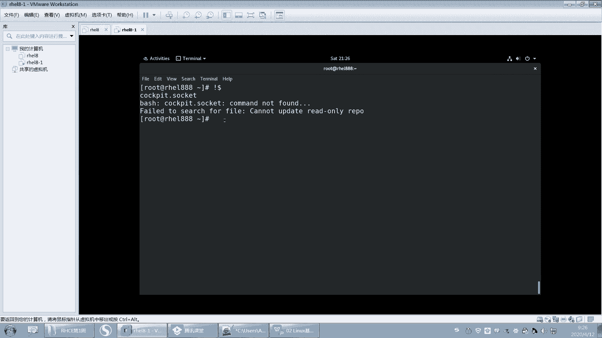
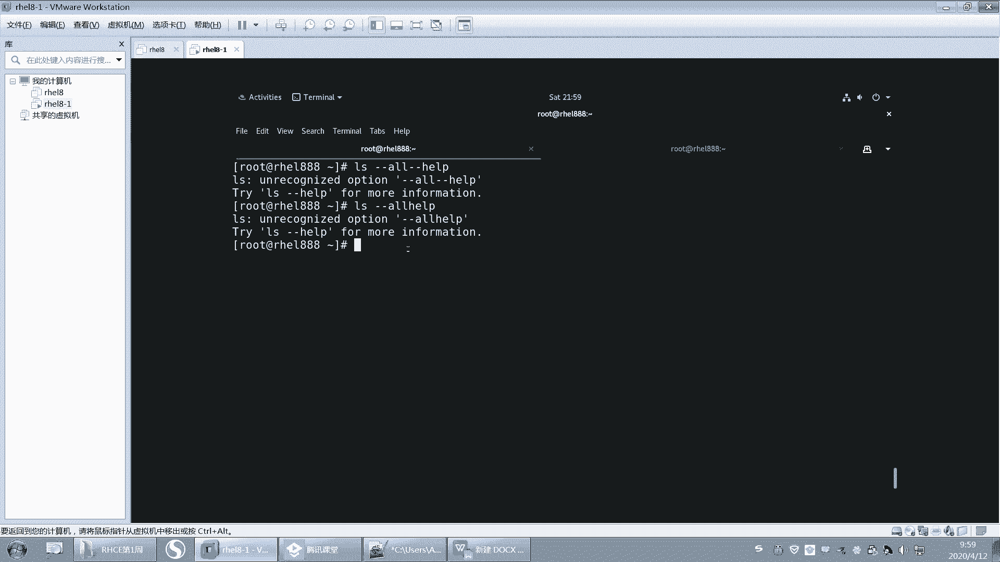

# 【誉天孙老师主讲】Linux入门／红帽认证／RHCE 8／RHEL 8.0／Linux基础视频 - P5：运行命令和获取帮助 - 誉天孙老师 - BV1Dr4y1A7jz

好了，嗯，我们昨天把这个系统装好了，回去还有没有没有装好的呀？昨天我们学了什么把系统安装啊，系统安装好啊，然后呢我们学了一些简单的命令啊，昨天学了哪些命令，我们再回忆一下啊。嗯，我们昨天学了一个。

首先学是star X，对吧？这个命令可以去切换我们的这个字符界面到同一界面star X。然后还学到了一些嗯常用的命令。比如说ID呀显示这个用户信息，显示用户存不存在。还有什么还有呃SU对吧？SU杠。

加用户名，它可以去切换用户切换用户。然后第二个呢就是password，它可以去修改密码。啊，以及我们还简单的选了一个us a，对吧？它是创建用户的啊。

这个我们后面会仔细给大家讲这个这个用这个命令的使用啊。还有昨天我们还学到了什么？嗯。我不记得了，你们记得吗？哦，data哦data CL。哦，PWD对吧？嗯，LLLS简单的说了一下，然后关机。

NIT0和power off关机。啊，其实学了还挺多的啊啊VIM。哦，对，VI变器VIM哦，ban昨天也说了一下啊，这个用的比较少，你知道有这个工具就可以了。呃，VIM昨天我们说这个VIM这个工具啊。

它我们后面会经常会用，所以这个必须要会啊，这个回去大家自己练一下，如何进去NI对吧？退出ESA冒号WQ退出保存退出W保存Q退出。啊嗯其实我们还有一个工具叫GVM，我不知道大家听过没有啊。

这是一个图形界面的呃。怎么说呢？它是一个能记呢就是graphic对吧？图形界面的一个呃。这个在windows里面好像也可以用，你可以装一个在windows里面去搜索GVM。

它就相当于就是windows跟VM一样的啊，就是后面你用习惯了就可以去在windows里面去使用，就知道有这个就行了。

啊，这个地方好像是没有的，看一下啊。

GVM是吧。哦，这里没有没有这个。好，这边你看这个地边就报错了啊啊，当我们去修去去去执行一个命令的时候啊，那么这边就是说command not found，对吧？这个命令没有找到啊。

也就是说这个命令是不存在的啊，那么跟它相似的命令，这个是相似的命令是什么？是VM啊。

哦，有可能敲错了，对吧？有可能这个命令没有装啊。好，然后嗯这个是我们昨天大概学的一些命令啊，回去大家一定。每周啊每周都要把这个这周内容复习好，大家把基础打牢啊。好，那么我们接着昨天的内容继续啊。

我昨天看到有群里有同学用那个web界面去登录是吧？我试了一下，是可以登录的啊，到时候我们往后面学的时候，我再教大家怎么去登啊。你先会用这两种方式去登就可以了。然后他们怎么进行进行切换啊。

这个其实用的说实话是比较少，没有那么用的没有那么多，你就知道知道就可以了啊，万一说是有一个控制台卡住了，对吧？嗯，特别是什么时候会用到这种场景呢？就是当你。的你装了一个linux是一个物理机。

那么这个物理机当前终端这个控制台卡住了，对吧？那你可以切换到另外一个终端来去执行。而且这个时候我们没有远程工具的时候啊，就会用到这种。来切换的控制台的这种方式。好。

以及如何在gorometmin这个工具上去使用一些快捷方式，对吧？如何去复制啊、粘贴呀，这个大家要会用啊啊，就是我们后面你可以提高你的这个这个效率的啊。好，还昨天学了一些命令嗯，简单的命令。好，呃。

昨天其实我们在修改密码的时候，这个地方就已经体会到了啊。我们这个嗯好，我就问大家一下啊，前面这个提示符的话，这个地方对不对？呃，如果说是这个root用户，前面就是井号。如果是普通用户前面就是多了符号。

这个大家记住啊。好，那么如果我们用普通用户去修改密码和用root用户来修改密码，他们是有区别的，对不对？所以从我们昨天的实验当中，我们可以看到root用户的权限其实是比较高的。而且我们在登录的时候。

我们建议说大家最好不要什么啊，不要用root用户去登录，但是我们昨天就是用的root用户去登录。呃，因为后面你的实验啊，也包括大家以后也是刚开始我们学习的时候啊，你还是用root去登录登录啊，呃。

因为很多如果你没有用root去登录的话，很多权限都是没有的。呃，所以你要先入门入门之后呢，呃再用这个普通用户去执行。包括昨天有同学说了，公司有很多都用的root。

户对吧？这是一种很危险的操作啊，所以大家尽量不要用root工作当工作当中啊，因为咱们有些同学已经是在职了，他可能学了就要用。嗯，所以你工作当中你千万不要用root。好，万一误操作了，对吧？

你就得这这还没入门呢，就要跑路了，是吧？

嗯，好。呃，root呢这个地方我们对它有个简单的介绍啊。呃，root是我们系统管理员，又称超级用户，呃，叫superus是吧？那么这个root用户呢，我们系统当中只有一个管理员账号。

那么这个账号就是root只有一个管理员账号啊，其他所有的账号都是普通用户都是普通用户啊，这个要记清楚，那么root呢为什么不要用root去登录。因为root用户几乎拥有完整控制系统的权限。

它几乎可以完整的去控制这个系统。嗯，这个权限啊。甚至要比这个windows的这个管理员的权限还要高，能理解吗？对。高到什么程度呢？对吧？它可以几乎怎么样啊哎拥有它既然有完整去控制系统的权限。

那么它就会怎么样去破坏这个系统的能力，就完全去破坏这个系统，就是自己把自己搞刮了是吧？这是哎就是他有这样的能力去把自己自杀，对吧？啊，所以非特殊情况下，不要用root去登录啊，一定再三警告大家。

前段时间我记得我在上上个班的时候，嗯，就出过一个事件嘛。呃，好像是就是误操作了是吧？那都是由于什么？由于我们的开始应该是使用root权限了，对用root去执行的一些命令，导致数据丢失啊。

然后业务就挂掉了，数据丢失了。啊，所以大家千万不要用入的工作当中啊，实验环境的话，我们先如果实在是入门。🤧对。入门的话，那我们就用root。好。而且大家做实验的时候再说一下。

大家做实验的时候不要去连到什么，连到你的生产环境上去做。之前有个同学就是这样的，他有一次做实验呢，他他是远程连的，他连过去了之后，他发现他连错了，他本来连自己的虚拟机上面做，结果连到什么。

连到他的这个呃这个生产环境上去做了啊。结果就误操作了。对，因为他又觉得这个反正就是我的这个虚拟局嘛，对吧？反正还有快照啊，删了无所谓，然后就还有快照，但结果还不小心连错了。嗯，连错了之后。

最后嗯那个系统就挂掉了，挂掉了之后呢嗯。😡。

后来他那个系统是测试的一个系统，因为刚刚装好没多久，所以呃还好影响没有那么大啊，所以这个就是随时都有可能发生的啊。我们从今天哎就是从明天呃从昨天啊，从昨天开始得开始学习linux，那么你们身上的责任对。

就很重大啊，就是重要很重要的一责任的啊，所以你们每执行的一步操作，对，都关系着，对吧？你们你自己的这个未来的发展和公司的发展，对吧？所以呢呃你们以后就要谨慎啊，不要觉得我已经对它怎么样。

就包括我平时有时候做实验的时候，我可能已经觉得自己比较熟了，但是有时候敲快了，或者没注意，也有可能误误操作，对，所以大家平时千万千万要注意啊。当然如果我说我没有root权限，我就用root执行的对吧？

如果没有root，我是普通用户，我可能误操作了，没有权限啊，这个就可能给我带来。嘛就就就带来一个一些障碍了啊，所以呢呃尽量还是用普通用户啊。这个话说在前面啊，以后出问题了，不用呃。

不要找我说老师让我用用root去登录的是吧？那我完了啊这个这个。😊，好，这是root啊，我们慢慢在学习过程当中，慢慢去体会它的这个呃这个权限有多高啊，有多重要，好吧。

OK下面呢我们再来学习一下关于呃去提高我们这个执行命令的一些效率的一些这个工具啊。首先第一个就是那个table键table键的使用啊。啊，就table键呢它可以它的作用。第一个是就是补齐。

它就是补齐的作用。嗯，因为我们的命令啊呃太多太多了，包括对吧？你比如说昨天昨天我们学了一个命令，叫passwordpassword对吧？啊，那么这个password有点长，我可能记不住，对吧？

它具体怎么敲，我也记不住，没关系啊，你可以怎么样啊，你可以去用table键去补齐这个命令，你可以敲一个，比如说P。

呃，敲一个P对吧？然后PASS后面不记得是ORD了，还是什么WD对吧？你就可以tableable键那你看table键这样是不是就可以出来了，对吧？table一下要会用去这个table键啊。

就从现在开始你就可以开始用了。嗯，因为所命令太多太多了啊，你常用的命令也就那么几十个，常用的命令，我呃应该是不到100，就经常经常用的命令，应该是不到100个啊，所以嗯那种不常用的。

你就tableable键对table键啊，好，那么这个是table一种情况，你table一下摁一下就出来了。但是还有一种情况是。😊，呃，比如说你你又table一下，它没出来，对吧？

但是你再table一下，它就会出来什么呀？出来多个，看到没有？哎，出来3个对吧？那么你一看哦，以PAS开头的命令有3个，所以你一看哦后面是S这个命令是吧？然后你应该认识它吧，对吧？

刷一个S敲一个S再table它就出来了啊，就这样子的啊，所以一下没出来。有两种可能性啊，就是你table一下没出来，有两种可能性。第一个是以这个PA开头的命令有多个嗯，有多个。第二个是你敲错了。

能理解吧？你敲错了，你再怎么table它也不会出来的啊。啊。另外还就是老师有同学说老师可以不用记了，对吧？啊，哇就这这个这个不用记了，我就上来tableable这不行啊。好，那就记一个吧，太多了。

我就PAS都懒得记是吧？然后就记一个P，然后他就开始tableable键table一下。😡，然后你再table一下怎么样啊？😡，有164个可能性，就是以P开头的命令有164个哟。然后你要不要显示啊。

Y你显示你去找这是不是太多了呀？呃，但也不要懒懒到这种程度啊，所以还是要稍微记一下啊，如果实在是不记得了，对吧？那我再对。😡，没有，这个是一样的啊。然后你再来tableable啊no。你稍微多记一点啊。

稍微多记一点点，好吧。OK吧，这个大家去记这个命令啊，记这个命令。呃，最最呃就是对于入门者刚入门的同学而言啊，他最容易出现错误，是敲错。他那个单词啊都拼不明白，就敲来敲去PAS反正就是啊就是容易敲错啊。

好，然后第二个。呃，除了可以补齐命令以外，我们还可以补齐什么呢？还可以补齐这个嗯比如说。哎，还可以补齐这个参数，对吧？还可以补齐参数。比如说啊我password给谁修改密码呢？啊。

另外你你table的时候，它后面会自动帮你空一格，看到没有？就是命令结束完之后，这个会自动帮你去空一格。而且你的命令这个地方后面接一些参数的时候，比如接一些呃用户名的时候，这地方一定会有空格啊。

一定会有空格啊。😡，好，后面你再tableable的话。啊，能给谁对吧这个地方还可以table是吧？都可以table那参数有的时候也可以table啊。好，那么如果说我想给我的命修改密码。

那我就需个AD啊AD对吧？然后tableable。所以我告诉你啊，千万就不要说你就敲个A，你这样记得太少了啊，稍微多记一点，然后这样的话啊，tableable这样那的命这样就出来了。对。

这个就是补齐这个参数啊，补齐参数。当然你不要指望说我所有的参数都可以补齐啊，它有些参数是补不齐的。但是呢它的路径都可以补齐。比如说我想我们昨天说LS昨天是看什么，当前目录下面内容，对吧？那如果说我想看。

比如说。我想看ETC目录下面的。哎，目录下面的内容，那我就可以怎么样啊，哎，我就可以那table键那table一般目录这种路径都是可以补齐的，看到没有？啊，如果你敲两次对吧？才出来。

那说明有多个以network开头的这个呃路径啊，然后再table它就出来了。看到没有啊？如果你一次性全部tableable出来了，那说明什么？说明只有一种可能性啊，只有一种可能性啊。啊，OK吧。

这个叫table啊，一般路径都是可以table的啊，就这种路径。但是后面这种参数呢不一定所有参数都可以tableable出来。这个要看情况啊。好，如果你是最小化安装的话，注意。如果你是最小化安装。

比如说昨天你选了是那个字符界面安装，安装的包只有几百个，不到1000多个是吧？没有图形界面，那么你就不能用什么？那不能用tableable键，就table不了，O吧？不能用tableable键啊。

因为它需要有个包来支持O吧？所以大家刚开始的时候全部装成图形界面啊，先装成图形界面啊。O。

好，这个是table键啊，补齐什么，补齐这个命令和补齐参数啊，补齐参数。好，然后嗯这个大家经常回去用啊。嗯，第二个呢可以帮助我们快速去执行命令的提高呃执行命令的效率的，有个叫历史记录的啊。

好，他是怎么回事呢？比如说啊我现在想要去嗯。我执行过的一个命令。😡，我想看我所有执行过的命令，对吧？那我就用history。看到吗？有。我有个history可以查看我之前执行过的命令，那执行过的命令。

然后前面呢会有一个编号一，对吧？这是我执行的第一条命令。啊，这是查看历史记录啊，查看历史记录。好，同学们那个你们把自己的笔记随时准备好，O吧？就是把自己的这个你电子笔记，嗯，电子笔记啊。

还有这个纸质的笔记随时准备啊，随时准备着。然后呃我说的时候我可能有时候没注意，让他没没没没有那个说记笔记，对吧？但是你要有这个意识啊，你要因为呃记笔记还有一个好处。呃，防止你睡着了。对。

因为很多同学他就躺在那儿躺在那儿去，我估计现在绝对有人是躺在那儿听课的。因为在家里嘛，对吧？在家里上班啊，或者是有可能。对，或者是在家里今天休息，对，绝对是有人躺在那儿拿个手机，然后去在那看的。嗯。

那这样的话你就容易睡着，过一会儿你就睡着了啊。所以同学们一定要把自己的这个笔记，到时候我要抽查的啊。我说那个谁谁谁对吧，把你的笔记拿出来啊，我来看一下啊，你要随时能拿得出来，OK吧。😊。

要不然你就丢人了啊。好。一定要随时啊。嗯，OK所以这个是我们的历史记录啊，历史记录呃，清历史记录，我们后面再说啊。OK呃，那么我想只想显示，比如说我只想显示这个history1。嗯。

那history后面加一个数字，那么就是显示最近的什么十条记录，显示最近的1条记录啊呃加个history，加个数字，OK吧。好，那么呃那这个历史记录有什么用呢？😡，对，有什么用呢？我们可以看一下啊。

如果我执行过的一个命令，我还想再次去执行它，对吧？我可能要去再敲一遍。对我可能要去再去敲一下什么，敲一遍这个命令，比如说这个命令有点长，对吧？敲一遍，我哎呀不想敲了，那这个时候你怎么样。

你可以去调用历史记录啊，这时候我可以去调用它，那我怎么去调它呢？注意啊，前面有个数字，对不对？前面有个58号这个数字啊，那么我可以怎么样？我可以去调用它，加个感叹号，加一个什么58，看到没有？

感叹号调用历史记录啊，哎，感叹号叫调用历史记录啊，加上一个数字回车。啊，就执行了这条命令。对，执行了这条命令啊，就是。这种方式比较简单，对吧？但是这个数字的这种方式。嗯。是不是有点难记，对吧？

因为你还要去看看它在哪一条，对不对？看他在哪一条。呃，当然还有一种啊嗯还有一种这个方式去调用这个历史记录。比如说啊。这是通过数字的方式，对吧？还有一种感叹号，比如说SYS。啊。感叹号加SYS啊啊。

那么感叹号加SYS的话，就可以怎么去调用我们以SYS开头的一条命令，以SYS开头的一条命令啊。但是如果说我现在去执行的话。你看它是不是调用这条命令了那。😡，感叹号SYS对吧？好，我们可以再来看一下啊。

刚刚呢我是在怎么样？我是不是在这个地方执行了一个这个命令，对吧？把这个命令重复执行了一下。那这条命令其实是我调用58号是不是执行的，对不对？好，然后呢我可以怎么样？我可以去感叹号SYS。但是大家想一下。

我们整个历史记录当中是不是有很多是以SYS开头的，对不对？那么他调用的是哪个呢？对它调用的是最近的这一个注意啊，它调用的是最近的这个。OK吧，离你最近的这条命令啊，但这条命令呢其实有些时候是不太保险的。

为什么呢？因为有些时候你可能不太记得了，对吧？你可能不太记得的时候，我最后一条命令是执行的是哪一条命令，万一是一条什么这个这个呃就是可能导致系统无操作的命令，对吧？

所以这个这个命令有些时候就看你自己好吧，你觉得你能记住了，那你就用，那你记不住，那你就不要用，好吧，它是执行最近一条SYS开头的这个历史记录啊，历史记录。好，那说老师他有些时候不太准确，对吧？

那怎么办呢？能不能去准确的去找到最近执行的一条命令呢？啊，也可以啊。我们可以去摁ctrorl加R。就是cttrol键加R键R就是这个R键嘛。ctrorl加R是搜索历史记录，搜索历史记录啊。

那么你在搜的时候，你呃你可以去搜里面任何一个关键词。比如说啊你像这三个对吧？这三个命令它们之间怎么去区分呢？他们都是以SYS开头的对吧？那么区分是不是从这儿可以开始区分啊？对不对？

然后这个是不是有个杠杠道啊？这里是不是可以区分好，这个是tats，对吧？这个是tats加个S，所以你可以输入STS，你看。它就会输入STA，它就会找到什么。唉，最近一条，但是其实是这条对吧？

那找到最近的一条里面有STA这个什么关键词的。一条命令，这个能不能理解？就是你只要输入这条，只要输入一个关键词，它就会去找离你最近的一条命令当中有STA开头的。好，一看找到这个，对吧？你过目一下。

你看一下啊，是不是你想要的这个命令，如果是的话，直接回车就可以了。就可以执行了。看懂了吗？因为有些时候你的这个命令，这个后面的参数特别特别多啊，特别特别多。那这个时候你再去敲一遍，可能怎么样。

可能就是就很麻烦，对吧？那你就可以通通过这种搜索的方式啊，只要你记住它其中的一个跟其他命令不同点，就可以去把它搜索出来啊，搜索出来。这个会用了吗？这个能不能听懂啊，搜索历史记录。呃，你们先呃先记住。

好吧。

就是这些命令你先记住，因为你老说老师我现在这个命令也不会敲几个，对吧？那我怎么去这个呃，对，怎么去使用呢？没关系啊，你只要先把这个你的什么，先把你的笔记给记好，OK吧。

把笔记给你记好啊，然后后来再去翻以前的笔记，然后遇到了我就用遇到了就用，这样的话就可以提高你的工作效率啊，提高你撬命的效率。啊，这就是搜索cttrol加R啊，然后比如说enable对吧？哎。

我敲个enable啊，我多敲了一个那个啊。cttrol加R唉 enableable。这样的话就可以对调到最后一个一。有EN啊有EN的啊。好吧。O。啊，如果你这条命令觉得你说我不想敲了，对吧？嗯。

怎么办呢？你就你有些时候你就cl C吧。😡，呃，ctrl C就是中断的意思。但是如果有一个任务正在执行，你就不要ctrl C了。嗯，这个这个我们遇到了再说，好吧，嗯，就是能ctl C就中断。

就不想执行了，就ctl C中断啊，中断。好吧。うんうん。哦，呃，然后呢还有什么？有同学刚刚说到是吧，上下降，那这种就是最简单的。你想上下降这样去翻历史记录呃，也可以。

因为但是我们的历史记录有可能会有什么呃几百条对吧？甚至上千条，那你去翻的话就就就太多了。所以这个看你自己的情况，好吧，你这样去搜索，反正就有很多方式，你愿意去用哪一种就用去哪一种就可以了啊。

好，这个是我们的历史记录啊，我们刚刚讲这个是吧？然后这个是调用第N条历史记录，感叹号加str加一个关键词，加一个字符串，就是以最近一条以str开头的命令，还有一个就是感叹号多了符号。

这个是调用最后一条命令是吧？这个用的比较少，感叹号多了符号。

啊，就调用最后一条。调用最后一条历史呃，最后一条命令。这最后一条命令啊，感叹号多了符号。

啊，然后上下键去翻，对吧？上下键去翻查找这个历史记录。嗯，这个有些时候用的比较多啊，然后还有cttrol加R去搜索历史记录。对，搜索历史记录啊。嗯。

好，那么还有一种呢，就有些时候啊我们想去调用历史记录，但是我们。并不想去怎么样啊，比如说啊这我想执行这样一条命令。好，我执行了这样一条命令之后，有些时候我想去调用这个历史记录。

但是我并不想去调用全部的这个命令，全部的这个这个这这一行命令，对吧？我就可以去调用其中的某一个参数。比如说我想去一般啊，像后面这个比较长的参数，我想去调用它，哎，我可以我可以用什么。

我可以用这个这个比如说我可以用EA点。看到吗？ESC点。对，ESC点这样去调用最后一条。历史就最上一条命的最后一个参数。唉，E要E点了啊。E呃，然后加一个点就可以去调用上一条命的最后一个参数。

这个参数有时候一般比较长。OK吧。或者是比如说嗯。你看啊我后面接了几个参数，对吧？你看我这个地方是不是接了几个参数啊，那么我不管你后面这个参数是什么东西，反正我就要调用你EA点EA点E点。

这个我们也是比较常用的。对，也是比较常用的。好像摁alt点也可以吧。嗯，alt点也可以altal就是那个ALT这个键。al加点记好了吗？al加点和ESC加点。ESA加点都是什么呀？

都是调用上一条命的最后一个参数啊。

调用上一条命令最后一个参数，好吧。记下来了吗？嗯。好，如果大家就是这样吧，我们嗯我们这个因为大家都是远程上课嘛。嗯，然后如果大家就是觉得这个这个知识点我听懂了，对吧？

或者是嗯我刚刚问的你你们刚刚问的问题，我解释清楚了，或者怎么怎么样啊，呃，笔记记好了没有？然后你们要么就对送朵花，对吧？要么就敲个一，要么就敲个666，要么就敲个，反正就就是你给我示意一下就可以了啊。

让我知道大家还在啊，要不然我就啊对我总有一个人演独角戏的感觉啊。好，你们自己你自己想想敲什么就敲什么啊。这个是谁呀？邵阳。是邵阳吗？你这个把名字改一下，下次进来啊，要不然我都不确定是不是你。

你你问的什么问题啊？删除历史记录先不慌啊。嗯。你问的哪个问题啊，这个吗？哪里你再发一遍，我不知道是哪一个了。

啊，我可以啊，old加点嘛？那old加点，我就按着old加点可以啊。EA加点都可以。ESA加点ESA加点。嗯。有的系统没有history，没有history。没有黑色这个命令吗？你说没有黑色这个命令吗？

啊。没有你这个你这个。也不能上下翻案。你确定你用的是linux吗？呃，是这样的啊。对，黑色跟用户相关的啊嗯。你们就是说是呃你们觉得就所有的参数能不能都调用都调用出来，对吧？呃，是这样的。

这个要看这个命令是否支持了。呃，有些时候这个要看版本。而且有比如说你红猫六的系统跟红猫七红猫八，那这些系统有可能有有一些它就无法去就是呃table键无法去调用。呃，或者说是什么。

或者说这个命令本身它就不支持，或者是等等。就是。对，所以呃不要去指望说所有的参数都能去调用出来啊嗯。啊，当然他说你说这个命ing对吧？他后面后面的参数，比如说你看啊啊这个命令啊，它后面的参数。

你看etable它是不是都可以出来呀，那你就感谢他，对吧？你就啊你这个这个我们可以就很方便去使用。但是他有的参数它就是不能出来，怎么样，你怎么你怎么怎么样自己去敲了啊啊，就这个样子，就这个意思啊。😊。

好，当然我们后面会做的，他们做的越来越人性化，对吧？让你去快速的能够去执行命令。嗯，大家知道unix吗？unix哦，昨天说到了一个系统，对吧？这个系统呢呃它就不能这样上下翻，能理解吗？

它就不能这样去上下翻。🤧嗯。呃，我们这个这个要说远了啊，这个后面我们会说到我们用的是这个hear呃，我们用的这个。算了，不说了，好吧，你说说远了吧，说蒙了啊。有的系统像unix，它就不能上下翻。

它也不能左右翻知？比如说啊。呃。你比如说敲错了，哎，这个单词敲错了，对吧？字母敲错了，还可以左右这样去翻呃，unix就翻不了，就有的系统上就翻不了，这个要看它用的是什么配置。嗯。那然后上下翻也翻不了。

那上下翻也翻不了，一翻就会出现一些那个呃乱码这个样子。好。

对，是的啊，是这个意思。这个这个要看可以修改啊，可以。还有啊大家最后就是呃就是说嗯是这样的啊，大家后面在问问题的时候，一定要把来龙去脉说清楚。比如说我举个例子啊，现在张勇同学遇到的问题是。我不能上下翻。

我不能tableable键，我不能怎么怎么样，对吧？首先你要看你要能说清楚，第一你的系统是版本是什么。啊，如果你还能清楚你要知道你当前用的surear是什么。😡，呃，以及你之前做过什么操。

就是可能你不知道做过什么操作，对吧？对于起码的这个这个这个背景，你要向我描述一下，要不然我们也是猜，对吧？我们也是说可能是什么情况，还有同学问问题是他直接把一个问题丢给我。

然后问我老师这有可能是什么原因导致的对吧？这个原因那太多了。对你要把前后来龙去脉去说清楚，这样的话，我们才能去根据你的这个实际情况来去分析一下到底有可能是什么原因，对不对？所以大家问问题呃会会问啊，嗯。

就是我为什么要你你要去修改一个配置，你为什么要去修改这个配置，对吧？你出于什么目的去修改，有没有必要去修改。那这些都要都要说对，都要说啊，否则我们就就就就很难去对话下去了啊。嗯。

嗯，不是说大家的意思啊，就是就是说我们。对，不用管他啊，不用管是什么，我们后面会说啊。😊，啊，这是这一章内容啊，我们这章呃到现在就基本上结束了。呃，这张其实怎么说呢？你可能就是暂时还用不到，对吧？

但是呢我们嗯就是后面在用的时候，我们我会给大家再继续去呃解释啊，只是在这个时候我们先给大家提一下，也有这个东西，后面我在用的时候，你就知得哦，之前好像学过，对吧？对，有个印象啊。好。

OK这张我们大概学了登录操作系统啊，怎么去使用一些图形工具，对吧？怎么去点大家图形工具可以自己去自由发挥去点点点啊。你在实验环境里面，你大胆一点啊，没关系，搞崩了坏照还原，对吧？就怕什么呢？

好，然后root的本质root用户。他权限很高，对吧？还有一些简单的命令。怎么去执行tableable键使用历史记录调用，这两个非常重要啊，这个会帮助我们去呃加快我们这个呃这个命令的执行效率啊。啊。

这是第二张，我们linux的这个基本使用。下面我们来看一下第三章内容啊。好，第三章呢我们呃。对，第三章我们讲的是运行命令和如何去获取帮助啊，这张特别特别重要啊特别特别重要。呃。

放在第三章呢也是之前给大家讲一下，因为这张会讲命密的运行语法是什么样的。呃，命令的运行语法，因为我们可能用windows用习惯了，对吧？可能一下子接触这个命令行有点不太适应啊，你不关没关系啊。

你可以慢慢去适应。O吧。呃，学过网络的同学应该也不陌生了，对吧？啊，接触过list的也可能也不陌生了，就怕之前一点都没有接触过，对，都没超过，那就有点有一点困难啊啊，然后这张呢我们也会去学如何去。

如果命令嗯，就是说命令执行不了，对吧？那我怎么去这个这个查询相关的一些帮助啊，我上课用到的资料都会发给大家的啊，大家不用慌，好吧。好。呃，这张我们的学习目标啊，第一呢我们要去在提示符下去执行命令。

提示符下去执行什么是提示符啊？提示符就是这个啊，就给你一个提示符，然后你要会在这里敲敲敲敲敲命令，对吧？

好，第二呢，你要会去掌握这个命令的语法是什么样的。我们昨天学了一些简单的这个命令，那我是告诉大家，我这个命令怎么执行，对吧？那以后如果你碰到了，你怎么去执行，好吧。

然后第三呢就是使用过一些要学习使用一些简单的命令啊，我们这个会教大家一些命令的语法的使用啊，这个命令怎么去敲，然后通过系统，还有系统内部的一些帮助资源，以及如何去学会使用这个红帽的一个在线文档。

因为我们学的是红帽的系统。大家如果用红帽的系统的话，你要会去查它的产品文档啊，查产品文档。嗯。学过网络的同学肯定学linins可有是有帮助的啊。嗯，因为学网络同学他也经常敲命令嘛，对吧？

所以对敲命令而言，这个他是呃有有那么一些感觉的。好，下面我们来看一下命令的语法啊。呃，me的语法规则，我们这个地方给大家总结了一下这个这个这个下面这一条啊。呃。

command option arguments对命令选项还有参数啊，命令选项还有参数。好，下面我们来看一下啊。嗯。发过来啊。第三章啊，这个地方我就给大家简单的做一下笔记，我不会做那么全啊。

你一定要记住自己要去做啊。呃，命令的语法。啊，我们就用三个。单词来描述啊，命令选项还有参数啊。命令选项还有参数，命令就是command选项就是option啊，参数就是arguments。

参数就是左边这个arguments啊，这参数好吧，好，那么命令你看啊，它是永远是放在最前面的，对不对？就是一个命令啊，它永远是放在最前面的。比如说我们现在想去执行一个命令啊。

我们昨天执行的这种呃password呀，这种是不是就是命令，对不对？这种就是命令啊，它就放在最前面好，那我随便这样去执行，你看啊，随便这样去执行，那我放在最前面的这一段字符串，对吧？

我一回车想要去执行它的话，它就会报什么？

他就会报什么命令找不到，说明这个命令什么是不存在的啊，OK吧？命令不存在。所以他每次比如说我敲了很多个，对吧？这样去敲了很多个，那么它怎么去识别我到底哪一个是命令呢？啊。

一定是注意一定是第一个才是命令啊，第一个才是命令。然后后面的呢都是一些其他的参数啊，或者有可能是选项啊等等啊。好，现在如果我执行的话，它是不是只会报，你看DFHG这个。这个字符串是命令找不到，对吧？

他并没有说什么并没有说这个这个这个这个这个这个找不到吧，他只是说这个单词找这个单词命令找不到，所以它是将什么？将这个整个一行命令行当中所有的参数只把第一个什么？第一个当做是我们我们的命令啊当做是么命令。

好，那这个就是命令啊，命令。所以你你有时候敲错了，它就会报命令，找不到，一定要看清楚啊。好，那么后面还会有一些这个选项，对吧？还有参数。其实命令呢你怎么去描述它呢？命令就是你想做什么。

就是做什么对吧？你要做什么呢？比如说我要修改修改密码，修改密码的命令是什么呢？对吧？password哎，password我想去看那看的命令是什么呢？LS对吧？我想去呃ID显示一下用户信息。

那我就呃显示用户信息的命密是什么呢？是ID这就是命令，就是你要做什么啊，对你要做什么。😡，好，那么后面这个注意啊，命令和选项中间后面这个选项啊，它是有什么？它是有个空格的那至于中间你空几格的话无所谓。

你中间随便空，只要你要空格，但是不能不空格，听到没有？不能不空格啊。好，选项我也可以去加一个选项啊。好，这个时候我们来去举一个例子啊，比如说我们用LS来去举例。

LS来去举例啊，LS是一个命令，它只要能够执行，它就不会报什么命令，找不到。它如果不是命令，就会报命令找不到啊。啊，LOS执行了，可以看到一些结果，对吧？看到一些结果啊，这就是我们的什么文件和目录。

大家可以看一下，这个会带有颜色的这种这种颜色的是吧？这种啊反正白色还是什么颜色，反正就是这个这个颜色的是吧？啊，它是这个文件，对，文件啊，大概去区分一下啊。

这个呢这个带有颜色的这个反正也不知道什么的颜色，蓝色还是什么颜色。嗯，既然看颜色都看看看。看着觉得我眼睛有毛病了啊啊，这个这个就是蓝色，对吧？对，蓝色啊，蓝色的话它就是什么样啊？它就是一个目录。对。

它是个目录啊，大概这样去区分一下，好不好？OK好，那现在呢我想去看，但是我看呢，我只能看到文件名跟什么跟目录，但是我想去这样看，对吧？那想去这样去看，或者是怎么样啊，想看这个文件的怎么样。

一些详细的信息，看到没有？那后面有什么时间哪类型啊，大小啊，对吧？好，那么我就可以去加一个什么呢？加一个选项加一个选项了啊，注意要空格那空格啊，这样空格你空几格无所谓，好吧好？后面这个选项呢。

我们要用一个杠来去表示杠要杠啊，加上一个杠表示我要去执行，加上一个选项了啊，后面是选项好，对，有一个L，比如说L。😊。

我们可以用L啊，杠L对，杠LL呢这是列出详细信息的意思啊。那么这个字母如果作为选项的话。它叫短选项，就是一个字母作为选项，叫短选项啊，叫短选项。好，那这样我看到的结果是不是就跟这个是不一样的。哎。

这个就是只有文件名，对吧？但是这个呢就会有一些文件的详细信息，后面就是文件名，对，文件的详细信息，后面就是文件名啊，那么这个选项还可以怎么还可以怎么加呢？我们还有其他的选项啊，比如说L4看对吧？

我们还有杠A对杠A啊。啊，杠A呢你会发现它执行的结果里面就会有带有这种什么呃一点开头的文件。那LS是不是没有一点开头的文件啊？那LS杠A就会查看到什么？一点开头的文件。那么这种一点开头的文件呢。

我们叫做隐藏文件，叫隐藏文件啊。好，那我么为什么LS看不到呢？因为这种隐藏文件一般情况来说，它是一些比较重要的文件，对吧？啊，中要文件隐藏起来。但是我们可以通过一种方一一些方式加选项的方式啊。

然后去查看到这些隐藏文件。好，所以你可以发现怎么样啊？如果你加不同的选项，最后显示的结果是不是不一样的对吧？好，所以我们称为这个选项啊。

它是修饰，我我是这样总结的啊，修饰。命令的行为。对修饰命令的行为啊啊呃怎么说呢？就比如说啊你你们家现在呃，比如说我们有很多。哦。语法中的副词是吧？这个我也不知道怎么去形容它啊啊，你就像这个什么嗯。

我举个例子啊，比如说我们的。😊，哎，原来我们俩在教室里面上课，我就经常举电风扇的例子啊。呃，就你用其他例子也可以，好吧，呃，或者是你家的电视机，反正都是我们当做什么？哎，当做电风扇是一个命令。

它可以扇风，对吧？它可以做什么，它可以扇风，打开电风扇，但是删的时候我们可以怎么样？我们可以让它怎么样摇头啊，还可以换挡啊，那什么摇头换挡啊，这些是不是就是类似于是它的什么，是它的一些选项。

它可以怎么样啊，它可以去改变这个命令的一些行为，或者修饰命的行为，怎么怎么扇风对吧？呃，摇头扇还是怎么样，还是一档二档三档风去删，对吧？所以这个就是选项啊，选项，那同样它是不是都是看呢L你再怎么加选项。

对不对？它依然是什么呀？依然是看它不会变成写了吧？对它不会变成写了啊。😊，对，就是命令的功能嘛。😡，啊，命令的功能啊。就像你家的那个做饭的那个电饭煲一样，对吧？它可以做饭啊，它还可以做。一会儿别说饿了。

啊，所以就是修饰命运的行为啊，就是个选项。好吧，那我怎么知道它是个选项呢？是不是加个杠啊，哎，加个杠，然后后面加一个字母，哎，然后还有杠L，对不对？

好，那么我们再来看啊。L。还有一些选项啊。那杠L跟杠A这两个我怎么去？比如说我又想看什么，我像又想去看这个文件的隐藏文件，又想看隐藏文件，又想看它的什么详细信息都想看。啊。

所以这个时候我就需要去联合将这两个什么唉，将这两个参数唉。啊，将这两个参将来这两个选项是不是一起使用啊，对，一起使用啊，那怎么将它两个一起使用呢？那比如说杠L杠AOK如果去这样执行的话，OK看这里啊。

啊，我们看一下啊，这样的话就会本么样就会报错，看到没有就会报错了啊啊。哎，别说了啊，一会儿跟我说饿了，我是我肚子该叫了啊。好，LS杠L杠A啊杠A，那么这个就会报错了。看一下报错啊。

无效的选项invald无效的选项杠 by杠是吧？这个选项是无效的。注意啊，所以如果你想加多个选项，注意啊，它们之间要有空格，要有空格啊。这个地方要有空格，看到没有？一定要空格隔开啊。你空几格没有要求啊。

回车这样才可以执行成功。看到没有？LS杠L杠A啊，杠L杠A。这就是多个选项联合在一起使用啊，一起的使用。好了吧，好，那大家来看一下啊，我大概给大家看一下这个里面的一些呃这个这个详细信息里面的一些内容啊。

好，我们可以看到这个地方我们能认识的啊。😊，呃，这个地方有一个数字，这个数字呢是指这个文件的大小，文件的大小啊，那么这个大小呢单位默认是字节，就是单位默认是字节啊。后面这个这个呢是一个时间，对吧？

就相当于什么？相当于这里嘛。

呃，这就是大小嘛，对吧？啊，这边是有个时间呢，修改时间，这个确实也是修改时间啊，这是这个文件上一次修改的时间看到没有？这个文件上一次修改时间啊，好，嗯。

如果你想去看这个文件的什么这个文件的这个这个这个大小，但这个大小我还要去换算，它等于这个地方等于4K，对吧？但是如果它很大的话，我就没办法去这样去就去计算了，脑子计算不过来，对吧？好。

所以那我就可以加一些选项来去改变这个显示的行为啊。😊。

好，那我加个什么选项呢？比如说LS嗯。杠L对吧？然后杠H哎，加一个杠H加两个选项，杠H啊。好，那这个地方是不是就会变成什么？就会变成1。5K，然后没有换算单位的呢，依然单位还是字节看到吗？

依然单位还是字节啊，那这样我就不是实现两个选项之间的什么之间的一个这个这个呃联合，对吧？啊，那我反过来LS什么LS杠H杠L可不可以呢？反过来是不是也可以执行？那这样反过来是不是也可以执行啊，对吧？

所以先后目前为止它没有什么区别啊好，那么我能不能只示H呢？你只是H怎么样啊，是没有用啊，你光加个H，这个地方没有用。所以你看有一些选项，它们之间是有关系的，就是你你只有显示详细信息的时候。

才能怎么样查看这个呃这个这个这个大小换算单位进行换算啊。好。OK那我们刚刚讲了什么呢？😡，我们讲了什么，怎么将多个选项唉进行联合使用，对吧？好，我们现在有3个，我们刚刚学习了三个啊，一个是什么？

一个是LH杠A对LHA这三个选项啊。那这三个选项的位置呢，你对于LS来说，前后顺序没有什么区别，就随便放啊，随便放好，但是如果我这个选项比较多的话，比如说我还可以加什么杠呃杠I呀，什么杠呃嗯呃。杠R啊。

反正很多很多的选项对吧？那么这些选项如果我都想去加的话，那这样是不是觉得很复杂呀，很乱，对吧？很多很多啊都要敲一个杠。好，这个时候我们可以将这些选项进行合并。将这些选项进行合并啊。L杠LH怎么样？呃。

A对LHA那这个执行结果跟什么跟杠L杠H杠A的结果是一样的啊。对你只要进行合并，你只需要加一个杠就可以了。注意啊。为什么我加一个杠的时候，他就知道我后面是什么是三个选项呢？注意我们说一个杠是短选项。

那么短选项就会认为，只要杠的后面是一个字母，就会做一个选项，所以它会区分出什么？L是一个选项。H是个选项，A是个选项，那么就有三个选项。这个能不能听懂？对，就有三个选项啊三个选项。好，O。

所以你只要写个杠，它就会什么，它就会识别出后面哦，这头单个字母作为选项的啊，单个字母作为选项。同理可得。如果你只写两个，它就会认为两个选项写一个就一个选项，对吧？好，这就是选项啊，短选项的使用啊。

短选项的使用。然后你可以怎么样来进行一个合并记记记笔记啊，合并然后杠ALH那目前为止这三个顺序你可以随便放对，顺序可以。

注意哦，只是目前为止这个顺序可以直随便放。如果以后遇到了呃有一些命令，这个顺序是有特殊要求的啊。所以对于LS而言，目前为止它是怎么样，它是可以这样随意，就是你H放前面也可以啊，对吧？A放前面也行啊。

都可以啊，没有什么影响，好吧。好，这个就是进行合并啊合并。嗯，另外这是什么？我们刚刚说这是短选项，对吧？单选项我们需要怎么去调用？我们需要一个杠短。选。啊，短选项是吧？这个短选项啊。好。

还有一种选项还有一种选项啊叫长选项。还有一种选项叫长选项啊长选项啊，长选项是什么意思呢？哎。

好，比如说我LS。G杠。就两个杠就是长选项啊啊杠杠2。啊，我加一个单词叫or回车。这个跟什么跟杠A的结果是一样的，你会发现啊，跟杠A的结果是一样的，但是区别在于我这个地方用的是字母作为选项。

这个地方我用的是什么？是单词作为选项，所以如果你一旦是单词作为选项的话，那么请注意怎么样啊？前面要加杠杠，你想一下，如果你是杠ALL它是不是会认为这个地方接了三个短选项，对吧？

所以如果你是单词作为选项的话，那么前面一定要加两个杠，这样是不是也可以直引成功，为什么指引成功了？因为它怎么样？它是不是将你把这个or看成了三个短选项了，因为前面是一个杠啊，啊，那长选项的话。

就是怎么样？就是两个杠，看到没有？啊，好，还有一些长选项，比如说呃杠杠help呀等等啊，这些它都有一些常选项。好，那有同学问老师，你说你这个又是长选项，又是短选项，对吧？那我到底用长选项还是短选项呢？

这个你可以自己去选择啊。你说老师那明明有短选项杠A，我干嘛还有杠杠or，对吧？那对你而言，那我肯定用杠A呀，我干嘛去用杠杠or呢，效果都是一样的对吧？但是前两天有同学告诉我啊，有一个学生他嗯。

他去他去执行，他经常过就是他很有很有意思啊，然后他经常会去呃他学习这个例子嘛。目前好像他在一直在学习当中，然后他就就写一些呃为什么博客呀，或者是写一些笔记啊，他都会给我们分享，看一下。

他说这个这是我写的，你帮我看看怎么怎么样，对吧？然后有的时候我也会分享给学生嗯给给给大家看啊，然后他就说老师我发现我执行命令的时候，我喜欢用长选项为什么呢？呃，他说长选项啊，呃，好记，因为他是一个单词。

你像我每次去记什么？LOS杠A我是不是要知道杠A大概是什么意思，我才知道哦什么呀哦，他是word这个单词，对吧？所以我知道哦他是显示所有的所有的文件，包括这样隐藏文件，但是对于你不熟悉的命令而言。

你熟悉的，你可能用杠A对吧？对，对你不熟悉的命令，你是不是更喜欢用这种唉这种什么呀。😊，看见这个选项就知道哦，是什么意思，对不对？刚刚help怎么样啊，是不是救命啊？哎，他可以帮助去理解他救命对吧？

那我就帮助啊，是帮助也是救命的意思啊。😡，对，它就就是长选项跟短选项有各自的优缺点。对，有各自的优缺点啊。嗯，这种方便我们去记忆，对，方便去记忆，方便去使用啊，一看就可以看出来，对吧？好。

这就是长选项和短选项自己去选择，好吧，你想用哪个就用哪个啊。

🤧好。长选项喽，高杠O。然后什么杠杠help等等这些啊。那么长选项之间是否能进行合并呢？我们来看一下啊。

嗯，LS杠杠O杠杠hel这种这种选项，如果你你想一下啊，有时候选项它也是分的，它不是说所有的选项放在一起，它都能什么嗯，这个这个选项是显示所有的文件对吧？但是这个选项呢。

它是显示这个命令的什么一些帮助信息，待会我们会学习的。这个杠杠help啊，它显示的什么一堆这个哇好多是吧？这是不是这个命令的一些帮助的信息啊，那么你将这两个选项放在一起，它有什么意义吗？

你想一下它是不是有可能没有什么意义啊，对吧？这个是显示所有的文件，这个是显示它的帮助，这个LS命令的帮助信息，那我这样显它虽然显示成功了。嗯，但是他们两个放在一起，实际上是没有什么意义的对。

实际上是没有什么意义的啊。好，那这个是可以加多个多个什么多个长选项。但是如果你想把这两个选项进行之间进行合并的话，那我们之间是怎么合并的，那这样肯定不行，对吧？

他说那unreized叫未识别的未识别的啊，recnze叫识别吧，辨别是吧？按就是未识别的嘛？选项对吧？他说识别不了这个选项没有这个选项啊，那如果说你把杠杠去掉的话，那么它就会又会说报未识别选项。

因为没有一个长选项叫all help。对，没有一个长选项叫all help啊，所以这就是长选项，长选项不能进行合并啊，它可以多个连用，但是它不可以进行合并。注意啊。因为你合并之后，我怎么去区分。

这是一个单词啊，我怎么区分这是一个单词啊，对吧？我没有那么聪明啊，我不知道这个all是个单词，hap是个单词，OK吧，所以大家在用的时候一定要注意啊一定要注意。😡。

好，这地方OK吗？这个是选项怎么去使用？选项怎么去使用啊？好，那我们继续啊。最后呢我们就会有一个参数。参数啊，那么这个参数是指的什么？参数指的是具体的某个对象。我这样总结啊，具体的某个对象好。

呃，我们一直在看对吧？那看什么东西呢？LS对吧？LS看LS杠L如果我直接LS杠L去看的话，那么是看到所有的文件呃，所有的文件包括目录，这这都看到了，对吧？那我杠A的话，我可能怎么样，要看所有的文件。

包括隐藏文件，对，包括隐藏文件啊，那我想看某一个，比如说我只想看其中某一个文件，那我可以加一个什么。加一个参数，对我只想看其中某一个文件就加一个参数，这个叫参数。那我怎么知道它是参数呢？因为你没有加杠。

能理解吧。你要加个杠。他怎么样？他可能认为你是选项了，所以你没有加杠啊，那就什么？它就是参数啊，对不对？好，就是参数啊，就是怎么区分选项和参数，命令很好区分。第一个就是命令，哎。

选项就是带杠的或者带杠杠的那参数呢？一般啊你说参数是不是一定放到最后呢？不一定啊，这个不一定啊啊怎么区分参数，那就是没有加杠啊，对吧？他就把它当参数去使用了啊。好，那么这个就是参数。

就具体的某一个一般是指的啊。比如说你像我password。user一对吧？那么这个用户名是不是就是个参数啊，它是具体的某一个对象嘛，是文件还也好，是目录也好，是用户名也好，是不是都是某个对象，对。

都是某个对象，这个叫参数。好，请大家把就是你跟你平时想到的那种什么命令啊，选项啊，参数不要弄混了啊。我们这个地方所说的命令选项跟参数，命令就是要做什么选项就是这个这个选项，参数就是具体的某个对象，对。

具体某个对象啊，这个叫参数，好，我可以去看什么，我可以去看其中任何一个文件，我只要加这个参数。当然我有些时候还可以加多个参数。比如说唉我加了两个参数，看到没有？这地方加了一个参数，又加了一个参数，对吧？

加两个参数，但是参数可以有多个参数与参数之间注意要有空格，参数与参数之间要有空格啊，就是你这个之间你肯定你要把这个空格给去掉了。

他就会认为怎么样啊，这是一个参数，看到没有？这是一个参数，它就会报错，说没有此文件和目录。因为LS后面接的参数一般都是看什么看文件，看目录啊，所以你接的这个文件不存在，它就报错了，因为它无法区分。

这是两个文件，所以在我们linux当中啊，空格是一个特殊字符，空格是一个比较特殊的字符，它是用来区分什么呀？命令和选项之间用空格选项跟选项之间也有可能用空格，对吧？选项与参数之间是不是也有空格呀。

参数与参数之间也有空格能理解吗？参数与参数之间也有空格啊，所以空格一定不要忘记了啊，空格一定要不要忘记了。啊，他没有那么聪明，不像我们人，对吧？一看这两个两个，但是他有空格来去区分啊。

好，记住记住一句话啊，你们写一下啊，命令和选项选项和选项选项和参数参数与参数都是什么样啊，都是中间要用空格隔开啊，你自己记一下啊。命令与选项选项与选项，选项与参数，参数与参数，记住标重点。

是中间用空格隔开，中间空格隔开啊。🤧嗯。记好啊。好。那我们可以有多个选项，可以有多个参数，能不能有多个命令呢？大家觉得能不能有啊？

多个命令可不可以？就是我在这哇执行两个命令。哎，执行个pas呃执行一个什么呢？LOS再执行个password，这是这是不是两个命令啊，对吧？啊，那这两个命令想要一起执行的话，那你这样肯定会报错呀。

因为怎么样啊？它永远识别第一个是命令，对吧？然后第二个呢就是参数。对，第二个就是参数，那没有这个参数就报错了啊。好，所以命令不能有两个命令在这一个在这一行当中啊，那如我就想执行两个命令怎么办呢？好。

我们后面会学习一些连接符号，连接符号来去连接两个命令啊，但是在目前为止，大家不能执行两个命令啊，不能同时执行两个命令。对他把后面这个当参数了，对，当参数了啊。好。

那我们从这么多案例当中去发现啊，发现什么呢？发现命令选项跟参数必须要有的就是哪个必须要有的是哪个是哪部分啊？必须要有的是哪部分？嗯，对。必须必须要有的是命令啊必须要有的是命令，对你总得知道我要做什么吧。

对吧？对，命令是第一个啊，选项和参数可加可不加，也就是说不加选项能不能执行，不加参数能不能执行是可以的对吧？我们发现LS这不也执行。哎呦。

L这不也执行了吗？对吧？好，只加参数可不可以也可以，只加选项可不可以，当然也是可以的，所以命令是必须的啊，但是。

我说的是。那能不能达到你的效果呢？能不能达到你想要的效果呢？对吧？你要想达到你想要的效果，你必须要加参数和命令啊，嗯，对吧？那至于这个命令能不能执行，只为执行的话。

那必须要有的是命令参数呢和选项呃不一定要有啊不一定要有。但是对于有的命令而言，参数跟选项可能必须要加这个看具体的某个命令啊，好吧，OK。好，这个就是我们的命运的语法啊命运的语法。😊，好。

那我们来看一下啊，嗯，我们书上写的那项与项之间要用空格隔开，这句话很重要啊，要用空格隔开。啊，option呢是修饰一个命令的行为，还是选项单个字母作为选项。

有这个这个好单个单词作为选项有什么有杠杠这种啊好，参数呢就是一个文件名目录名或者是具体的某个对象，这个叫参数啊，那刚刚这个地方我们说如果你想执行多个命令。我们这现在我就教大家啊，怎么去执行。

比如说我们之前学过一个命令叫叫叫叫叫。

叫贝塔。学过吧，还有一个叫CAL学过吧，这两个啊，一个是显示日期的，一个是显示什么显示这个日历的啊，日历的。好，那么这个日期跟日历我同时都想显示怎么办？我怎么了dataCL这样肯定这样肯定不行，对吧？

好，我同时都样显示，我们可以用中间加一个。嗯什么知道吧，分号。哎，中间加一个分号就可以了啊。看好啊，回球。那中间加一个分号，它就会先帮我去执行data。

然后再帮我去执行什么CALCAL这个这个这个这个执行的结果好吧啊，那么这两个命令呢，我先执行CAL再执行data，它是不是先显示CAL再显示data，它就是先后关系嘛。

就是先执行哪个后执行哪个但是这两个命令之间有没有关系呢？注意啊，这两个命令之间是没有任何关系的？没有任何关系。比如说啊我前面执行一个错的。😡，后面执行一个对的对吧？嗯，前面执行一个错的。

后面执行一个对的回车。那错的怎么样啊，说命密没有找到，那对的呢，是不是后面也执行了呀？看到没有？所以这两个之间是没有任何关系的，你执行错了还是对了，跟我执行执不执行或者执行对了还是错了，没有关系。

没有关系啊，一定要注意，好吧，嗯，这就是分号啊，分号。啊，封号隔开的两个命之间没有任何的逻辑关系。对。也没有逻辑关系，也没有因果关系，什么都没有。记记住啊，封号好吧，记住这个啊。

封号。用封号隔开的两个命令啊，中间没有任何的关系啊。记好了吧。有没有在记啊？来拍张照片，我看看你们记的笔记。没有照片是吧？哎呀，很棒啊。哦，我之前有有的有的同学做的笔记非常棒。

我觉得他都可以拿到做模板了。可惜我当时我没收留一份，应该收藏一份。你看这个同学大家可以展示一下自己的这个。给别人做一下借鉴啊，别人有同学不知道怎么去做笔记。好。不。那么我们之前学的这些命令啊。

我们学的不论是LS啊。

呃，还是date呀，还是CAL啊，还是password呀，对吧？那么这些命令都是由我对孙老师是吧？然后给大家告诉大家说怎么去用啊，唉，怎么去使用啊，啊，怎么去使用这个选项啊，怎么是使用这个命令呀。

后面参数应该接什么啊，对吧？好，那么如果让你自己碰到一个命令呢？对吧？你怎么去查你怎么去看这个命令的语法是什么样子的，我怎么知道它有这些选项，我知道它有哪些短选项，有哪些长选项，后面参数应该接什么。

对吧？所以接下来我们就要去怎么学习一下这些命令之间啊，命令怎么去寻求帮助啊，寻求帮助。

好，那这地方有一句话啊，我们要记住对，怎么去获取帮助？呃，不要尝试去记住一切。呃，之前有很多同学，他他有他非常苦恼，不是一个两个啊，都跟我说。老师我这个脑子啊就是记不下来，这所有的秘密太多太多了。

我我太我太难了，对吧？我根本记不住，怎么办呢？你说我这还能学下去吗？我要崩溃了是吧？我说别呀别崩溃啊。他说老师，你怎么都全都记下来啊，你怎么那个练的这么熟啊？我说我要是记不下来，对吧？

我们白白敲这么多遍，对吧？就给大家上课，就你看我一年上上多少个班，然后我就敲几次啊，对吧？所以这个东西就是熟能生巧，对，这是第一点啊。啊，第二呢，你不可能去记住所有的命令的。😡，你这也不现实，对吧？

所以你要会去找帮助，对，记了大概之后去找帮助，这个是非常重要的一个技能。好，这是其中一个，这是我待会儿给大家讲的。另外一个最后一点。就是什么笔记。最后一点就是笔记啊。笔记太重要了。

我不是说你上HHC一这个要去完成我的任务笔记，而是说你学完之后，你可能这比如说你4月份学学到6月份，7月份考完了，正常也考过了。好，okK是否你符合符合了，是否你永远都记住了，不是这样的。

因为你过一年之后或过一段时间的时候，你又回望了，那我你会回想去当初我HHC1，对吧？上了什么内容，你的脑子是想不起来的。对你只有去翻译以前的笔记啊，哦，这些我上过哎，这些我知道对吧？我忘记了。

回去看一下。😡，对不对？这是不是就是你学过的东西，你你只有什么记下来，对，记下来啊。😡，回去去查。而且比如说一些重要的步骤，比如说将来你搭一个服务啊，搭1个HTTP对吧？那搭1个HTP服务。

如果你的步骤对吧？你是不是把笔记做好，记录下来，哪些配置标注注释注释上那么这个时候你以后再用到的时候，你是不是就没有你不用去百度了呀，要不然你总要去怎么样去百度，而且百度的结果不一定是好的。

不一定是正确的对吧？这都是你的经验积累，这都是你之前做过的事情，把它记录下来，这个以后你再去翻非常非常的重要，对我们来说听到了吗？对给大家经验啊。😊，好，一定要去做这样一件事情啊，一定要去做笔记。

一定要去整理自己的笔记。

好。

OK所以这有一句话说，你不可能去记住一切东西的。因为你要不停的怎么样去接收新的知识，对，接受新的知识啊，你也不能记记你你脑容量也没有这么大，对吧？嗯。意议。啊。

OK下面我们来看一下这个我们系统当中自带的啊，有一些不同级别的一些帮助资源。对不同级别帮助资源。那么我们怎么去使用它啊？首先第一个我们要学一下一个叫word is啊，what is。

好呃。好了，那么下面啊嗯。我们我先教大家第一个啊，第一个其实我们执行的命令第一个帮助啊，我们执行这个password或者执行LS这些命令。那这些命令是怎么判断它存在还是不存在呢？OK吧啊。

我们可以去查这个命令，其实命令都是文件。命令都是文件。那这个命令到底是哪个文件呢？我们可以去查啊，这样查叫which。好，看这里啊，同学们看这里啊。对，只有写才不会犯困。对，是这样子的啊。

要不然就容易睡着了，像我声音这么好听，对吧？当催眠曲了。好，那么LS啊这个命令那。它是哪个文件呢？它是这个文件，看到没有？它是不是USR并LS啊，对吧？它是不是这个文件看到没有？那这个路径好。

那你看一下password啊。😡，那password这个命令是哪个文件呢？是不是这个文件啊？看到了吗？啊，那我随便敲一个哦，这个命令不存在，为什么不存在啊？你查一下呀，which啊，查一下。😡，有吗？

没有看到没有？没有这个文件。在这下面没有这个文件，好吧，好，那至于他怎么去找到这个文件的，注意啊，这个后面我会讲啊，你先知道就行了，你就知道什么which这个命令可以去查看后面这个命令怎么样啊。

它是哪个文件？对，是哪个文件，为什么报命令找不到，是因为这个文件根本不存在，对，找不到它，找不到它执行不了，对就报命令找不到啊，所以这就是命令O吧。这是第一个大家记一下啊。

which是后面接命令可以去查命令是哪个文件，对，命令是哪个文件。如果这个文件不存在，那么就会报命令找不到，记下来了吗？如果这个文件不存在，那就会报命令找不到啊，这个叫which which啊。

第一个帮助哦，第一个帮助啊，这我PPT上没写啊。

呃， which。还是查找是吧，查找命令是哪个文件啊。呃，如果查找不到这个这个这个这个是哪个文件，那么就说明什么，说明这个命令根本不存在，根本不存在。如果查到了，那么这个命令就存在啊就存在。好。

这就是为什么命令有时候为什么不存在呀？就这个原因啊。😡。

啊，第一个这第一个。第二个。我想去看一下这个命令，那password对吧？我告诉大家说它是修改密码，那么它为什么是他他你告诉我修改密码，对吧？那我想知道那你新新比如说CD啊，那CD是什么意思啊，对吧？

那我不告诉你怎么知道呢？好，可以去简单的去查一下啊。😡，用 what what what。What is。用what is来查啊。嗯。唉，这个查不了啊。等一下啊。等一下啊。分开呀，没有啊。

他他这个命令是这样的，which what。what is它是一个命，看到没有？没有分开啊。呃，word有没有呢？word是没有这个命令的啊。等一下啊。好，现在有了啊嗯。你的命令刚刚就报这个错啊。

你们查能不能查到啊，是报这个错是吧？😡，nothing什么什么合适的是吧？啊，你们报这个错，为什么会报这个错呢？因为这个命令啊，你刚开始用的时候是嗯。你刚开你比如说这个系统刚装了，刚装装好之后。

这个命令是用不了的那什么时候能用呢？你第二天就可以用了，你放一天把这个系统放一天，第二天开机就可以用了。对，开机就为什么是这样呢？因为这个它需要它需要这个更新数据库啊，那你你想立即去使用它怎么办？

你去执行这个命叫mandy B，好吧。大家去执行这个命令叫manD B啊，这个后面会大家解释啊，这什么意，为什么会会出现这样的一个状况啊，你先去执行好吧，先去执行才能有what is这个命令的使用啊。

🤧嗯。对，放一天是吧？😊，嗯，对你放一天，你第二天就好了。对啊，为什么我这个我这个系统装好了，为什么？因为我之前是恢恢复快照了，我我装好之后立即就恢复快照了，所以嗯它就还没有放到一天。对。

还没有放到一天啊，就你放一天啊，第二天就可以查了。好，如果你想立即查的话，你就manDB这样去查。好吧。😊，嗯，对他要自己熟悉一下是吧啊。😊，OK这个是what is啊。

what is呢还可以查看什么这个命令的一个简短的描述。嗯，它是用来更新数据库的啊，更新那个数据库的。呃，manDB啊manDB刚刚他upDB好像不行，你要。呃。

执行面D别up低件up updateDP好像是那个locate的那个好像是loccate的吧。是不记反了？是长那个loK的那个。locate那个命令的时候，用的是阿布利BB吧。嗯。啊，我可能也记反了。

就是manDB啊，你有记住man帮助嘛，对吧？好，然后what is L啊，这个是查看这个密的一个简短描述。那么LS呢是干嘛呢？它是列出目录的内容，列出目录的内容啊，看到没有？它是不是简短的描述啊。

然后我们可以看一下password。啊啊，当然这个pas错有点多是吧？好，我们看这个啊，看这个它有多有多个，待会儿我讲讲讲那个后面那个慢帮助的时候，会给大家说这是什么意思啊？啊，那么看这个啊。

这个是更新啊，但然第一个你也可以看嘛，这是不文件呃，密码文件对吧？pa做的文件哦，有可能它还是个文件，对吧？然后这个呢是更新怎么呀？更新用户的哦，这个是昨天学过的是么？叫认证的tokens，对吧？

就是就更新用户的认证嗯口令，就是更新用户的什么密码，更新用户的密码啊。啊，这是这个呃what is啊好what is date呀，你都可以去查呀。啊，what is CAL啊。嗯。

what is data就是打印和设置系统的时间、日期和时间，对吧？然后CL呢就是显示呃，canada Canada就是日历的，也就是那个日历那个单词叫canada。呃，缩写CL对，又认识一个单词。

对吧？kindada就是那个日历那个单词啊。这个英语没过关的啊，这就不认识的这个这个这些单词不认识的啊，就是那个初中小学啊，你们应该是小学就学过英语吧。小学没过关的啊，小学初中肯定没学英语，没好好学的。

这小学初中英语啊。我估计高中应该都学过吧。嗯。高中的时候英语单词比这个要难的多了啊。啊，那这个是我们的这个what is啊，what is它其实作用就是简单的描述一下。对，简单的描述一下啊。

好。我的一直能你。哦，你厉害嗯，可以啊。嗯，哼。好，这是第一个啊这是第一个what is好吗？😊，啊，你可以看一下这边啊嗯这个word is呢它是显示这个命令的简短描述。

但是呢它是基于数据库的查询定时更新。对它是定时更新的啊，就有可能今天你新装了一个命令。那这个命令呢可能用word就查不到，它需要什么，第二天就查到了。但是没关系。

我们可以让它立即查到么是不是执行man db手动更新数据库，手动更新数据库，它是基于数据库的查询啊，对，它是基它不是实时的查询，它是基于数据库的查询。你用manb可以什么哎可以去这个更新这个数据库啊。

那安装后不能立马使用啊。好，然后这是一个例子啊一个例子，这个不是我们的重点啊，你知道就行了。哦。嗯，可以可以，但是更新数据库的时候，大家为什么你看为什么说放一天就好了，因为它会在凌晨的时候更新。

一般数据库这种更新的话，它不会说让你在大白天的更新。因为大白天你的业务一般都会比较忙。能理解吗？就是你的比如说你在处理业务CPU内存等等就比较忙。那你更新数据库，你看我刚刚更新是不是更新了半天呀，对吧？

呃，没开机不会更新，它这开机之后就会更新了。开机之后你放一天，开机之后就会更新，没开机不会更新啊。没开机，它怎么更新啊？嗯，你看我更新更更新了半天，对吧？那这个是耗资源的啊，这个会靠耗资源。

所以不要在你的系统繁忙的时候去更新。一般在。没有呃，不没有人使用的什么？夜夜夜黑风高的晚上，对吧？你去更新它好吧。

嗯。好嗯。要不休息一会儿吧。对，因为这个word is这个命令说实话它不怎么重要，你不怎么重要，你有没有必要去更新它呢？为什么就一天更新一次呢？那重要的是不是就是很短的时间内才会更新。

那不重要的是不是一天更新或者是一个星期更新或者是一个月更新，对吧？所以就是。😡，嗯，这个就看他具体的业务情况，好吧。O我们休息一下吧，休息一下，我们再回来啊。😊，休息一下这。到了哦。

这20这20分钟内容很丰富啊。好。嗯嗯嗯。O。我们刚刚讲的这个what is是吧？好，下面我们来看一下第二个这个帮助啊，帮助资源。哦，第三个了是吧，你第一个是which。好，第一个是which。

第二个是what is。然后第三个是这个叫什么？哦，杠杠hap对吧？好。うんうん。好，第三个是杠杠help，我们来看一下杠杠help。刚刚其实我们已经用了这个是吧，已经用了这个呃这个帮助了。

O。好嗯。我们来看一个啊。我们看一个LS刚刚hab是吧？这是我们刚刚学过的是吧？好，回去了。往上翻往上翻啊。嗯，往上翻。好，那么我们来看一下杠LS杠杠hab执行结果是什么？

第一个第一行useage这个是指用法语法用法语法啊。好，它的语法是什么呢？LOSS后面是空格，看到没有？你你严格要看清楚啊，这个参数这个语法，它中间有的有空格，有空格就一定要有空格。

所以LS命令的后面就是选项option看到没有？选项option啊，就叫选项好，中括号括起来，我们把它用中括号括起来的选项。呃呃，记啊。记啊呃语法规则当中，如果有中括号，那么这个中括号指的是可选项。

也就是说这个命令可以不用加选项就可以执行。可以不用加名选项就可以执行啊。好，后面如果有3个点点点，三个点点点代表的是。可以有多个选项，就是可以加多个选项，就这个地方可以有多个对多个啊，就是杠A啊。

杠L啊，杠H啊，对吧？好，这个是选项，选项后面也有空格，后面就是参数。这个参数呢它指明了用什么fi就是文件。因为我们LS后面要么就接文件，要么就接目录，对吧？接文件或者是目录啊。

然后这个地方有个中括号括起来了，说明什么，说明它是一个可选项，就是可以接，可以接也可以不用接后面这个三个点同样也是指什么可以接多个这个这个文件，对吧？其实这地方就是参数了啊，就是参数。好。

这这个语法比较简单了，是吧？😊，嗯，然后这还有一些什么list什么什么一些描述信息描述信息啊。好，你再往下看。这个地方是什么？是不是就是选项啊，有哪些选项啊？好，你看它的官方解释杠A是什么意思啊？

杠A逗号杠杠沃指的是这两个选项指的是同一个意思。就是你用这个跟用这个两个是一样的效果啊。啊，它指的是do not ignore什么entry starting with点是吧？它指的是什么？

不要去忽略entr条目项目，就是我们展现出来的某这些记录，对吧？呃，不要去忽略一点开头的这些什么这些呃这些记录信息啊。就是包括嘛就包括点是正常情况下，我们ALS去执行的时候，是忽略了什么？

忽略了隐藏文件，忽略一点开头的文件了啊。哦，还有什么杠大A呀，杠大A说什么，他说不要去列出这个点和点点是吧？嗯，点和点点。因为我们在列的时候我们在列的时候会列出什么？哦，列的时候会列出点和点点，对吧？

这也是这两个也是个目录啊，这个点呢就是嗯当前目录，这点点是上一层目录就是。就是两个目录啊，你看是不是蓝色的呀，对吧？蓝色的啊。好，然后这里有很多呀，有很多选项，我们往下看一下啊，还有什么。😊。

B呀大B呀，小C大C小D大D是吧？还有一个杠H，我们刚刚执行的杠H是什么意思啊？呃，杠H呢它是指什么？它是指hume呃你用这个human readable也可以达到杠H的效果。它指的是就什么？

它翻译过来叫人类可读的对吧？啊呃，它的意思是说，如果显示这个文件的大小，是自己，我们就读不了了是吧？不是我们人类可以读的啊啊，那么它就其实说白了就是什么换算单位的意思啊。

换算成我们比较好识别的这个单位啊，超过了K呃超过了呃超过了K就换算了K，超过成了兆就换算成兆，超过G就换算成G啊。好，那么他说什么？他说with字杠L和杠S或者杠S这两个选项，对吧？

其实你杠H的基础之上需要加这两个选项，这个或这个都可以啊，然后打印什么，打印类似于大小是一K兆G等等，好吧。这是他的一些你们要会去看这些这里面的这个这个这个选项是什么意思啊，要会看。好，然后再往上翻。

还有什么？还有还有R啊，还有呃size啊。对吧只显示大小杠S就是只显示大小是吧？然后还有L啊，对吧？嗯，L就每一行就是一个文件，那pro pro就是每一行嘛，列出一个文件对吧？列出详细信息等等啊。啊。

这就是杠杠hap啊杠杠hap啊，它的大概大概的内容啊，下面还有一些其他的信息。好，那么我们再来看一个好不好？我们看一个呃。看1个CP吧，好吧，这个还没学吧。I刚刚学过的是吧？那CP的话，我们来看一下啊。

CP杠刚ha。好，往上翻。啊，CP我们还没有学，但是它是什么意思呢？我们其实可以用什么？可以用这个呃what is呃，what is来看一下CP是做什么用的。然后在CP杠杠hap。

然后看查看一下它的语法规则。它的用法呢有3个1233个啊好，第一个语法规则，我们先可以看一下啊，我们先不管什么意思啊，CP命令空格后面是可选项，可选项有三个点点点，三个点代表是有多个可选项啊。

然后这里有一个中括号括起来，一个选项叫杠大T杠大T这个选项呢它是什么？它是可选的，就是可以加可以不用加OK吧，可以加可以不用干不用加啊。啊，那么后面就有两个参数，看到没有？有两个相参数。

一个source，一个dest，一个sourcece，一个dest啊。那么这个参数呢嗯它是什么？一般是指这个语，像sce嘛，你你我们中文翻译过来叫sce叫圆，对吧？这个叫目标对吧？原言跟目标。

其实我们在这个就是什么？就是我们在复制的时候呀，要接两个参数，一个是要复制的文件，一个是复制到哪个地方去啊，这个是复制。啊，以及我们CP后面。对来呃，就是对，就是你要复制谁，就像你。

就像你就这个我们在windows里面复制是先复制再粘贴，对吧？但是在linux当中，它是一条命令搞定的一条命令搞定啊，它不是说啊我先复制，然后再跑到某某一个地方去粘贴，对吧？它是一次性复制谁。

复制到哪个地方就完了。好，那这个呢你看啊。这个下面这个我们可以看一下它什么区别呢？这个s后面是不是加了三个点点点啊，说明什么说明这个圆可以有什么样啊，可以有多个呀，这个圆是不是可以有多个呀？

你可以你去可以一次性复制多个文件，对吧？后面是个directory。对，后面是个directory，是个目录，这个这个单词叫目录，单词叫目录，对，那么这个目录呢呃只有一个对吧？

就是你你目录后面没有点点点吧，没有点点点说明什么，说明我们只能接一个目的地，只能接一个目的地，就将多个文件可以复制到一个目录下面，但是不能怎么样，不能将一个文件复制到多个目录下面啊。好。

这就是第二个语法规则。好，第三个呢，你看一下CP，然后加什么叫option点点可选项，然后加了一个选项叫杠T，这个杠T没有加中括号吧。说说明什么？如果你用这个这个语法规则的话。

那么这个杠T一定要加一定要加啊？好，后面是directy，directory是不是就目录啊，目录是不是放在前面了，看到没有？目录放在了前面啊。也就是说把圆跟木的位置是不是调换了一下。调换了对吧？

本来是圆在前面目标在后面，但是这个地方什么把这个目标放在前面，圆在后面了。所以后面这些圆指的是什么？你要复制的文件，这个是你要复制到哪个地方去，OK吧，这就是呢它的一个对一个语法。嗯，哦好。

你是这么解释也可以啊。啊，你看这个是默认是不是有个杠大T啊，这个默认的杠大T它没有加，没有加，其实就是圆在前，目标在后。那么加上一个小T就是指的什么？就是目标在前，圆在后啊，就是这个意思啊。好，呃。

就是CP那再来看一会喽，再看一个啊，然后看个data好吧，data刚刚hap。啊，看一下这个啊，这个待会儿我会出题目啊，在这儿大家认真听啊。哦，dta刚刚ha。那这个就有又有点复杂喽，又有点复杂了。

是吧？好。用法是data加option。这个是可选项，这个不用说了是吧？然后后面呢是一个中括号括起来的，这个中括号括起来呢，它是一个可选可选的东西，不然但是不知道是什么东西，对吧？反正就是可选的。

然后前面加了一个加号，然后后面加了一个format format知道什么意思吗？啊，要认识啊。啊呃，这个fmed指的是格式。呃，你们知道格式化那个单词吗？格式化。哦，对对对，格式化就是这个单词。呃。

英文的格式化就是这个单词，然后它也是格式，就是格式嘛，它有很多意思嘛。呃，格式格式吗？什么叫格式啊？就是你看啊我这样data这样一显示这个格式是什么？这格式是不是就是什么呃星期六啊，4月11号啊。

几时几分几秒啊，呃，哪一年啊，对吧？哪一年它是这样的格式，但是我们中国人看起来不习惯，对我们习惯什么？看2020年对吧？然后4月12号等等这样的格式，对吧？4月12啊，或者是这种斜杠。

4月12我们是不是喜欢看这种格式，对吧？啊，所以这个叫格式的意思啊，那么。这句话的意思就是它可以怎么样？它可以加这个formmat去改变它的格式。你可以往下看，那你怎么知道是改变格式啊，你往下翻嘛。

那这边有个 format，还有一个什么还有个解释啊，它是来控制这个输出的。得控制你的就是输出的格式啊。嗯，这下面就会有一些解释，对吧？有一些解释啊。呃，比如说你想比如说你想显示。嗯。

我们找一个随便找一个啊。嗯，比如说我想写示年，你看用年有什么解释，是不是百分号Y呀，所以你可以这样写，对大概大概就是这样啊呃一。好d，然后什么。嗯，加是不是加呀，对吧？后面是不是fmet？

那formmed的话就是加百分号Y那formed可以是什么？可以是这个百分号Y嘛。那这样的话是不是显示年O吧？我就举一个例子啊，就这个意思。好，就form嗯。好，再往下面这个啊，这第一个这第一个啊。

它可以控制这个输出，对吧？好，然后再往下呢，这个是data杠U杠UUTC杠杠univeveral是吧？啊，这是有三个选项。好，记住啊。这三个选项中括括起来，说明这个选项是可选的，就可以加，可以不用加。

那么这个三个选项用中用竖杠隔开，说明这三个选项之间是或者的关系。记记啊记中括是可选项，对吧？点点点是多个，那么竖杠指的是么？竖杠指的是或or就是all的意思啊。

or就是或者或者或者用杠U或者杠杠UTC或者杠杠univers。那你说杠U杠UTC杠univers什么意思往下翻，这里有它会有，它应该会有解释，看到没有？嗯，他打印这个或设置这个时间是吧？

用UDC时间就是coordinate universal time，就是世界统一协调时间。统一协调的嘛，世界的时间对吧？啊，世界同一天的时间啊。好，这是UTC事件。啊，也就是说。它可以打印时间。

看到没有？它可以打印时间，也可以怎么样设置时间也可以设置时间啊。好，那么如果加上杠U就是打印和设置什么UTC时间对UTC时间啊。啊，那么后面这个是什么呢？现在还是要设置时间，对吧？

那么设置时间可以怎么样可以去加，那设置什么样的时间呢？时间格式是什么样子呢？在后面给你标记出来了，看到没有？就后面这个中括号，这个中括号嵌套中括号看到吗？中括号嵌套中括号啊啊，我们可以大致去看一下。嗯。

这个MM啊，比如说我这样去设置啊。data我去个data啊。嗯。嗯，data，然后后面不是杠U什么什么，我可以不用加，对吧？然后后面呢我们可以去加一些时间格式，那时间的格式是MMDDHHMMMM好。

那有人能告诉我说MMDDHHMM是什么意思吗？啊，在这里我们没有解释，没有解释MMDDHHMM是什么意思，对吧？但是不慌啊，待会我会建大家去看啊，这个地方怎么显示的内容比较少。

就刚刚ha显示内容比较少啊。😊，好。那么我先告诉大家啊，这个是指你这个是月天MM就是月嘛，为什么是两个MM呢？是因为那个时间是什么？时间是呃这个月，就是比如说今年是今天是4月份，对吧？那就写04对。

04的意思啊，那你写一个4可不可以不可以啊，就写一个4不行？天也是一样，比如说4月1号，那你就写0401OK吗？就0401啊，这样去写，同理这是小时分钟，看到没有？小时分钟啊。O吧？唉，小时分钟啊。

然后小时跟分钟是不是也是两位？然后CCYY呢CCYY指的是CCYY是指的年年。比如说2020年啊，不2019年啊，那么CC呢指的是前两位2020，然后YY指的是后两位19O吧，CCYY。

然后SS呢指的是苗。秒两位啊就是60秒50秒那么40秒，前面是不是加个点，是不是加点之后，你才会怎么样才会表示是秒的意思啊。好，下面我开始来出题喽。嗯看好啊。呃，0401对吧？20。嗯，好，就这样。呃。

记住了吗？刚刚请告诉我，这个是。这个时间前面这几位数字指的是什么？请问04指的是什么？04看好啊。我写的是什么？我写的是040120这样子。呃，告诉我0呃。等一下等一下等一下等一下啊，还没写完。

还没写完啊。😊，嗯。嗯，12。06。1206。2。19吧。好，这个吧。好，大家知道为什么我刚刚说040120不对吗？我刚刚出了这么个题是吧？040120不对是吧？怎么回事儿啊？

知不知道有没有同学能告诉我？20小时没有。哦，对，很好很好很棒啊，至少要有几位呀。不是6位吧，至少要量是吧？至少要有。8位对，至少要8位啊。就是你看啊后面这个整体用中括号括起来，对吧？

那么你要么有这个整体，要么没有这个整体。对，就是要么你有这个整体，要么没有。那么你既然写了。😡，从哪里开始是不是从这儿开始，那你从这儿开始吗？从哪开始，那你从这儿开始啊。😡，是吧这是不是有先后顺序的呀？

MMDDHH对吧？嗯。哦，嗯，叫你数啊，12345678是吧？好，所以这个地方最好是不是有至少至少要有8位才可以。OK吧，对，至少至少要有8位才可以啊。所以我在这写，刚刚写的是不对的啊。

就0040120就不行。所以现在我加到了1234567890好加10位啊。好，10位的话，前面前面123456。呀我也数不清楚。啊，前面8位的话okK你可以区分吧，前面8位是不是就这8位啊。

MMDDHHMM对吧？没问题吧。啊，那谁能告诉我最后这这个19。是哪两位？你告诉我19是哪两位？嗯。只需要说19就可以了。嗯，前面的时间不用说，就说19。就说19是CCYY还是SS。好，有同学说是SS。

有同学说是CC有同学是YY是吧？哦，CC的没有人说，有如说YY啊S好YY的绝大多数啊啊YY的胜利哦。好OK看这儿啊，昨天不是讲过了吗？SS肯定要肯定不对呀，为什么呀没有点呀？没有点对吧？所以SS不对啊。

好，排除了一个啊好，那么CC跟YY是取决于哪一个呢？你要看呢这个中括号是不是在YY的里面。这个中国号CC这个中国号是不是在YY的里面？所以如果这4个。只有两位的话，一定是什么？一定是YY。

如果是CC的话，那么YY一定要存在。也就是说CC是YY的可选项，看到没有？CC是YY的可选项。要想有有了YY之后才会有什么才会有CCOK吧。啊，这个就是CC跟YY这个好像没有同学弄混啊。好，来。

我再加两位20。请告诉我。请告诉我1920指的是什么？20指的是什么？我又加个20呢，1920。嗯。好，一致一致通过是吧？好，很好啊，对它就是指的什么？指的是。这个现在这个19是不是变成了呀。

变成了CC了呀？然后20是不是变成YY了，因为这个两个都有了，对吧？这两个都有了，都有之后看什么，是不是看顺序啊，看谁在前谁在后嘛，对不对？看谁在前啊，它在前，它在后，所以CC是19YY是20。对。

然后点S，所以这个格式看懂了吗？那中括号签到中括号这种方式啊，啊，记好哟，待会儿我去要大家去用的啊，不要现在回说，待会一会忘记了啊。好，这个就是我们的data杠杠hap对，杠杠hap。好。

那么其实我们已经可以在data这个地方看到了我们的部分的语法规则，知道吗？是部分的语法规则呀，然后还有部分的选项，对吧？那部分的选项，但是这个这个这个刚刚hap啊，它有个有时候有的不好的地方。

就是你看啊我每次呀我每次什么，我每次都要去这样来回翻，对吧？要来回翻，而且有些时候。

啊，有的时候还是怎么样？我们在这种情况下，比如说对吧？我们要执行这个呃比如说data杠杠have。好，你看你来回翻是不是翻不了，对吧？来回翻翻不了。好，这是其中可能两个因素不太好用。最重要的因素是什么？

最重要的是刚刚ha呢它其实啊。

对，刚刚ha其实它内容是比较少，不多，就是只有部分的部分的内容。对，只有部分的内容啊。所以呃鉴于它的什么它的这个内容较少，然后使用起来不太方便。嗯，就是在字符界面下使用起来不太方便啊，然后来回这样去翻。

对吧？有时候还翻不了，所以呢我们就出现了唉。后面这个啊。

好，这个你们去看一下，好吧，这个我大我稍微给大家解释一下吧，中括号代表是什么可选的。然后这个大写的这个参数，那大写的参数或者是中这个这个这个那这个间号的表示变量是吧？然后点点点代表是一个列表。

其实列表就是多个吧，可以有多个对吧？但是多个之间用空格隔开啊。然后这个是代表或的意思，就是X或Y或Z。date啊哦，date date date。然后杠ABC啊，我我但是我不我不会把data。

我不会把data敲成呃data。但是有同学会把data呃敲成data，是这个意思。哦，对。啊，然后这个杠ABC代表是杠A或杠B的这一组合，对吧？这个应该可以看懂吧。嗯，好。

这个就是这个杠杠hab的使用啊。好，往后哎我们就出现了这个东西啊，这个叫慢帮助。这个放在后面去。

好，那我们来看一下啊。呃，我们真正要学会的今天啊，重点啊就是这个man。对，就是之前上节课同学们说的这个男人和女人是吧？啊，为什么只能男人不能女人呢？好，所以告诉我man是什么意思啊。学过的同学。哦。

白是什么意思啊？没有学过的，不知道是吧？对它是一个单词叫manu。嗯，叫man啊，这个单词拼错了啊，对，然后man you啊，它叫手册手册，就手册，你知道吧？就手册拿一个本本，然后再翻翻翻翻翻翻翻。

对吧？是不是方便去翻啊，对，方便去翻，然后所以呢这个叫手册的意思啊，手册取前面三个叫man嘛，叫man啊，所以为什么说不懂的时候就man一下对吧？man一下男人一下啊啊，男人不行，女人女人也没有是吧？

好，那么man怎么去用呢？我们来看一下啊，你不会什么，你就man什么就可以了，对吧？比如说man LS就后面接上命令就可以了。man LS我们可以man命令，后面可以接个命令啊，man LS回去了。😊。

好，这边就进来了，我来带大家游览一遍啊，游览一遍，看好啊，我上下键这样再翻好，上下键这样翻，我先教他怎么去用这个，你看它是不是相当于是一页一页的呀？😊，那一页还可以翻页，你空格键还可以这样翻页。

那我教大家翻啊。好，现在你想去回到这个这个曼邦助的这个手册的第一页，第一页你就可以按一下小G。好，其实自己可以记一下啊，慢帮助的使用方法。慢帮助的使用方法小G。是回到第一页。对，回到第一页啊，然后大G。

大G是回到最后一页。大G就是按的shift加G嘛，就这个不用我说了吧，shift加G是最后一页啊。嗯嗯。好，你还可以问空格键往下翻页，上下键，这个我就不说了吧，上下键翻。

然后空格键回车键这样去翻上下翻啊。好，然后还有什么？还可以搜索关键词是吧？你可以搜索关键词啊。好，现在你在这个界面上输入一个斜杠，左下角就会出现一个斜杠。那左下角就会写出一个项，你说一说关关键词。

比如说搜一个呃list。回车，那他就会把这个list给标什么呃，标高亮。对，把这个list标高亮啊，然后你可以摁小N。小N在关键词之间向下移动。大N在关键词之间向上移动，记住了吗？好，那。输入一个斜杠。

搜索搜索fill。好，回车那它就变高亮了是吧？高亮，然后摁着小N在关键词之间向下移动，加G啊，大N在关键词之间向上移动，小N大N啊，我自认为我的普通话应该还可以吧，大家应该能听懂啊。

听不清楚我说什么可以可以可以提出来啊。好，小N跟大N啊，如果你想取消高亮，你可以这样输入，随便输随便输，这样就取消高亮了那。输入一个不存在的回车，就这样就取消高亮了。O吧，就把那个高亮给取消掉啊。

啊，摁Q退出来。对QQ退出啊。所以就这个呢。呃，空格键可以向下滚动一个屏幕，其实就是翻页翻页的意思啊。就向下翻页嘛，这个改一下。嗯，然后page up page down就是向上翻页。

向下翻页上上箭头下箭头空格键向上向下这样就滚动滚动啊。哦，这个是回车键啊，写错了。回车键。好，然后小G大G回到开头末尾，然后这是搜索关键词呃，小N大N是在关键词之间向上向上查找。

Q呢就是退出Q就是退出啊，你用的时候就是man，后面加上什么，加上你要执行的命令就可以了。

那man这样加执行的命令就可以了啊。可以吧。好。那我们再来说一下我们这个里面大概有哪些内容啊。嗯，首先要做一个解释，对吧？use a command它是一个。呃，取消高亮，没什么就随便说。啊。

用户的命令啊，名字呢这个地方是名字对吧？名字是列出目录的内容。哎，这个list呃这个LS是做什么用的是吧？列出目录内容啊，然后这个单词叫语法，是语法单词啊。

就是我们会用刚刚刚刚ha里面是us age是吧？哎呦，敲错了，USAGE没有F啊。啊，这个单词也是语法的意思啊，那跟这个之前是一样的对吧？好，再往下翻再往下翻啊，你看description是描述描述啊。

它这个描述信息在这里，对不对？啊，然后下面呢这个地方是什么？是也是也是一些描述信息是吧？好，那再往下呢就是参数选不是选项选项选项啊，选项的解释。好，这里好多选项。

它大概就是按照ABCDEFG这样这样去分的，这样去往下。嗯，这个选项是不是多？会多一些是吧？好，然后下面还有一些什么说明，你可以看一下。下面有一些说明啊。好，还有一些什么退出状态，这个后面再说啊。

还有这个什么作者是你看谁呀？richardman就是我们昨天学过的是吧，他写了他写的AOSO。嗯，然后还有它的一个这个版权印刷是吧，是符合什么什么GNU的GNU组织的。它的版权copyright。

在这里。它的licenseGPR准则符合这个准则是吧？它是个开源的工具啊，开源的工具。好，这个是大概就是我们这个一些分布啊，就是每每一部分，它相当于就是不归了个类啊，它更就是更嗯就是分小节了是吧？

这一小节这个小节做什么，这个小节做什么？好，这个地方我也给大家写了啊，大家可以看一下。

名字是指的什么？名称，还有说明，然后这个是它的语法格式格式说明是吧？然后就讲描述描述信息option就是选项exam好，这个exam的话就是案例是吗？事例，对吧？就是有一些这个呃命令啊。

你不知道怎么去执行。它会给你自己去写一些呃，就是这个事例，你可以照着去写，得照着去写，然后还有文件就是相关的文件，还有一些变量，对吧？还有一些什么C also好，这个我也带大家看一下啊。

比如说嗯。呃，我们去卖一个。不要问啊。呃，或者是卖一个卖一个什么东西嘞？For disk。我们后面会用到的一个命令是吧？分分区的一个命令。好，你往下翻往下翻啊，你前面都一样的嘛。

你看是不是都有这个小节是吧，这里都有。好，然后这个标题嗯往下翻往下翻。啊，有还有device是吗？还有大小，这都会有解释，它可能绝大多数都是有这个的。啊，还有一些文件啊有有一些命令它会特殊，比较特殊。

它会有有一些单独的标题是吧？好，然后往下翻翻翻翻翻翻。好，这是一些变量，看到没有？environment变量，然后往下翻好，这地方有OC also看到吗？

C also就是呃有些时候我们去查一个命令的时候，跟它相关的一些命令。我们可以在C also里面看到。相关这个还不太明显，这只有几个是吧？我给你看这个啊。叫faair world。你往下翻。

你看这是不是很多。啊，那这里是不是有很多很多的跟它相关的一些。嗯，命令对相关的一些帮助，相关的一些呢。对不对？很多啊，所以大家可以去查一下关于Cal，因为命令记不住嘛，那跟它相关的一些命令有哪些呢？

你就可以在这看在这个地方看啊。哦，他应该还有。嗯，还有一些案例也有。比如说我看data有没有啊。有没有examp？嗯。啊，你看data是不是有你看显示显示日期的时候，是不是有一些粒子，对吧？会在这显示。

比如说设置时区呀，对吧？那它就会在这显示出来，你可以去看好吧，你要会去用这些工具啊嗯。嗯，案例。这都是自带的，这是说我们linux系统自带的自带的一些工具。好，这个这个会不会用啊？虽然没怎么讲里面内容。

但你慢慢后面接触了之后，你就知道怎么去查，要经常去用啊，经常去用。🤧嗯。嗯。好，那这就是慢帮助啊慢帮助。好，下面呢我们来看一下啊，在这个最前面最前面这个地方。嗯，这个其实跟go have是不是类似的。

只是说它它更规范一些，对吧？像个手册一样，可以来回这样去翻呃，来回去翻很方便，还有查询啊等等。好，这里有一个叫data，你看这个da旁边中括号小括号里面是不是有个一对吧？有个一。而且我们在后面的时候。

我们会看到C also里面哦，刚刚刚大家看到那个C also里面有个什么？你看这个C里面这个这个命令的后面是不是会有什么，会有一些会一个小括号里面写个一，对吧？那这个是什么意思呢？

那这个这个呢这个一啊好，这个是指慢帮助的章节，慢帮助的章节啊。

好，man章节。什么叫man章节呢？注意啊，呃，我们刚刚一直在man什么？man命令，对吧？是这样吗？是man命令啊，但其实啊后面这个man可以接的不是命令，对，可以接的不是命令。

而且有可能man后面还有可能是一个什么，还有可能是一些其他的，比如说可以man文件呢，可以man其他的是吧？好，所以它分了很多章节，很多章节啊。好，它有哪些章节呢？我们先来看一下啊。呃。

哪些章节这里有是吧？但是我可以大家去看一下系统当中的解释啊。

man man，你可去manman慢一下man是吧？好，manman回车好，往下翻往下翻翻翻，好看这里。😊，其实我们慢帮助一一共有9个章节。

123456789这9个章节你不需要都记住它9个章节是做什么的，你只需要记几个重要的就可以了啊。好，这个我们可以大概看一下啊。第一个章节主要是。这个可执行的程序和什么什么命令对吧？

可执行excutablepro就是可执行的程序啊。所以第一个章节一般情况下都是什么？都是命令，都是命令啊，就是卖一些命令可执行的命令。好，第二个呢就是主要什么？主要是系统的一些调用库。

由内核提供的一些函数是吧？functionctions函数提供的由内核提供的是吧？啊，第三个是一个一些也是一些系统的库文件。哦，这就比较少很少用啊。然后还有第四个是一些特殊，他会去卖一些特殊的文件是吧？

呃，比如说将来会在DEV下面这个目录下面会有一些特殊的文件。这个我们后面会遇到啊，这一般是一些呃特殊文件。比如说我们的磁盘哪。嗯，这种。呃，就是磁盘型呃，这个什么磁盘啊、键盘啊、鼠标啊等等。

这些都会在DEV这些特殊的设备上面啊，在DEV下面。好，还有第五呢就是文件的格式和什么惯例传统是吧？好，就是说如果我们将来去写一个编辑一个配置文件，那么这个配置文件它的格式是什么？我们可以去man。

第五个章节对，查看第五个章节啊。还有什么？还有一些图就就就是一些么。呃，曼七是吧。这个翻子叫什么瓦啊什么之类的是吧嗯。啊，这些慢一些特殊的这个一些有一些符号吧，好像是。也这个也很少去用。

一般都是他提示我卖什么我就卖什么。好，第八个呢一般就是什么？嗯。混杂的各种各样的是吧？嗯，各种其他混杂的东西都在这儿是吧，是这个意思吧？哦，第八个就是这个系统的，你看系统的管理员命令，系统管理员命令啊。

然后经常什么只是root，只有root才可以执行的。所以你看第一个跟第八个的区别在于啊，对，通常只是是吧？啊，第一个跟第八个的区别在于什么？第八个这个命令只有root一般情况下只有root才可以执行。

对，只有柱才可以执行的命令。第八个啊。然后第九个呢就是关于内核的。对，关于内核的。好，那这么多你记哪几个，你记三个就可以了，你记三个重要的就可以了啊，就这三个。

第一个章节，第五个章节和第八个章节就可以了。第一第五第八好，我教大家怎么去用啊。

我教你怎么去用。呃，我们有一个命令叫password。这个命令呢。这个命令啊它不仅是个命令，它还是个文件，有一个文件也叫password。看到没有？有一个文件也叫pasword。

所以如果我想去man一个man passwordword的时候，看你看进来啊，man password回车，那么在这个地方是不是就是第一说明它是第几个章节呢？是第一个章节。

一般第一个章节就是man命令对，慢命令啊，好，那如果我现在需要去慢第五个章节，对吧？我想man这个文件那么前前面就加一个5man五password。那这个地方就变成什么变成5，那么这里就是什么？

就是man文件，man文件啊？好，那你说我想去慢man8，有没有8呢？呃，当然没有，他说没有是吧？没有第八个章节，所以你要记住啊，并不是所有的这个命令，它都有什么1到9个章节，能理解吧？

它不是所有的命令都有1到9个章节的啊，一般绝大多数情况下就是第一个章节对吧？第五个章节，第八个章节，对吧？这种比较常用的，还有有的就是只有第七个章节，有的只有第五个章节，对吧？好，那我如果去卖的时候。

我后面不加。那默认是曼迪几个章节呢？啊，默认慢的是。嗯，这个要看什么，要看它有哪几个章节啊。比如说有一个命令只有15这两个章节，那么你这样去卖，什么都不加，默认卖的是第一个章节。好。

如果有一个它只有什么58，对吧？那么你去卖。它默认慢的是第五个章节，也就是说从第一个有的章节开始慢取。那如果你要慢指定的章节，那么就需要在这什么这个中间地方加一个数字章节，然后去慢O这样说能听懂吗？

就卖哪一个章节，你就去怎么样，你就去加个数字就可以了。啊，如果没有加，那就是什么卖他默认的第一个章节啊，默认的第一个章节啊。这是慢帮助的章节。慢帮助的章节啊。

嗯，然后第八个呢一般是系统管理员的对吧？那系统管理员的话就是这样的啊，你看比如说我们。我不知道曼菲尔沃是不是哦。嗯，看这个命令。哎，这个是第一个是吧？嗯，for this呢。哦，你看这个命令是不是就是。

第八个章节啊，那我这什么都没加，说明什么？说明这个命令只有第八个章节。😡，只有第八个讲节，所以你一下也慢是不慢第八个讲解。嗯就曼巴嘛，曼巴对吧？好，这就是man帮助的这个章节怎么去使用啊？

以后我再来问大家的时候，我说。

呃，如果要去慢一个文件的格式，慢级，对吧？慢五你要知道啊，man5其实一个一般第一个跟第八个就不用慢，它自己就出来了。一般这个命令要么就是普通用户都可以执行，要么就是什么？只有ro的用户才可以执行啊。

所以一般很少有冲突，那用的比较多的呢，就是这个5第5个啊，第5个。好，嗯，这个是我们这个常用的慢帮助章节啊。

好，我们来再看一下啊。嗯，那我想看这个卖帮助到底有哪些章节啊？😮，我们也可以这样去查啊，man杠K，比如说password。好，前面加个杠KK是什么意思呢？K是指K wordK word就是那个叫嗯。

关键词对吧？keyword嘛。关键词啊。嗯，对关键字关键词是吧？啊。嗯。有没有同学不知道啊，有我经常因为我们经常会说一些这个。英语是吧？我怕大家有的同学。他的英语水平不行，然后就一说跟不上了啊。

不知道说什么是吧，也不好意思也不好意思提出来。啊，我尽量嗯都说清楚啊。好KK word，然后回车。好，那么你会看一下啊，它这个查询呢，其实它是一个模糊查询，它它就是说它查的没有那么精确。哦。

你看在这个地方这个命令这个命令啊，这个命令里面是不是带有一个password呀？带有一个password对吧？嗯，就是有这个有这个它是个关键词嘛，就这个就是个字符串。

其实然后这个劝举password是更改组的密码批量的是吧？嗯，in batch batch批量模式嘛。more就是模式，然后这个是更改什么？这个是更改密码，这个应批量模式，对吧？然后还有这个。

然后这个里面是并没有带password，但是在这里是不是有个password的单词，它也会给你去查找出来。嗯。然后这个呢第三个这第三个是吧，第三个章节，这第这个这个括号里面是不是第三个章节啊。

然后这个是第一个章节，对吧？嗯，对他他只要带有这个，那大家知道这个是这个关键词，这个地方是怎么来的吗？知不知道啊？这个地方这个描述是怎么来的，知不知道啊？它其实是word is显示的。

就是what is吗？你看what is这边。这个描述信息就这个。看到没有？就 what的意思。就what is查出来的。所以这个man杠K是基于what is的查询结果。

来查的那只要这一行当中有什么有password，他就给你查出来。对，就给你查出来啊。

好吧。嗯。

好，这个就是这个章节怎么用啊。好，下次我问你，我说要去查一个与LS相关的对吧？LS这个关键词相关的一些慢帮助章节有哪些？那你就什么man。杠K标S这样，但这个就比较多了。那你说但我这这这么多怎么看。

对吧？那你后面就用一些过滤工具把它过滤出来啊，啊可以用用一些过滤工具。嗯。慢命令某个章节有什么用？你刚刚吃饭去了啊。

刚刚说完刚刚说完卖卖哪个章节有什么用啊？来给我解释一下。第一个章节是做什么的？啊，对。李小虎同学来帮我解释一下第一个章节是做什么的？人呢？😔，谁能解释一下呀。第一个章节是做什么的？嗯。

吓得李小虎同学不敢出现了，嗯，不敢说话了，是吧？为什么要卖他那个章节啊？huhu。为什么要卖他那？为什么要卖那个张杰啊？😡，哦，为什么要办这一个章节，对吧？为什么要慢第一个章节啊？

第一个章节是不是命令的语法呀，对不对？命令的语法，那为什么要慢第五个章节啊？😡，唉，为什么要慢第五个章节？因为五怎么样啊？因为五这个是文件的格式，就是将来我们想去修改一个文件。

这个文件它里面每一个栏位是什么意思，对吧？那我那我不知道怎么办，我是不是可以去man舞对，man舞嘛？还有一些参数的解释。对。就是去卖我就这个意思啊。嗯。好。

OK这个是man啊呃man呢它的所有的这个手册啊，它都是我们还记得我们第一章学的什么叫呃一切接文件，对吧？那么这个文件其实man帮助它也是文件。其实你在man的时候，它是打开某一个文件。那这些文件在哪。

在这个下面啊，在这个USR share man，就是后面我们学了怎么去操作文件系统的时候，你可以看一下USR share man下面。

你看就man一啊，man2啊，man三啊，man什么慢慢慢这么多是吧？好多，其实有很多我们用的其实也就那么几个嗯。啊，那就是慢，它所有的端man一，你进慢一进去看一下。那这是不是都是一些。

这这是红色的是吧？一般红色就是压缩包，它其实你慢它的时候，它就默认怎么样，他把这个。我看有没有LS啊。呃，有呢嗯这个就是UL是不是就M一，它是个压缩包嘛，它每次卖的时候，他就把这个压缩包给解压缩出来了。

就这个意思嗯。好吧，这个后面这个不清楚就算了啊，不管它。后面我们学了文件系统之后就知道学了什么压缩包就知道了啊。

啊，这个是我们的这个man man手册啊，man手册。好，那么除了这个man以外呢，呃man就是你其他都不会，你就要会man，好吧，你就会卖就行了啊。啊，那么还有一个呃还有一个这个帮助啊，叫info。

对info大家应该听过吧。info是吧？但是info的话，我相信绝大多数同学对它就都听过man，但是info可能听的比较少，对吧？info也可以。比如info L那你就可以这样去搜索。

但是info呢我跟大家说一下info跟 man的区别是什么啊。

你这样看看到没有？这里有个10。1，然后LS是不是列出目录的内容，对吧？好，你往下翻翻翻翻翻翻翻翻。好，翻着翻着翻着就10。1。1哦，往下翻10。1。2。然后再翻。10。1。3就说不定是吧。啊。

说明就有10。1。3。然后他他每他是做成什么，它做成小级，那为什么从十开始？其实你在慢的时候，你慢着慢着啊，往上翻啊，你看它10。1。3。😡，是是排序这个输出，对输出进行排序。

它就是根据功能来对这个内容怎么样啊进行一个就是归纳。那它根据它的功能来的。而且你看10。1是不是LS对吧？10。1。1是也是LS10。1。210。1。3都是LS那么10。2是哪个小节呢。

就换成就可能换成另外一个命令了。所以你翻着翻着翻着翻着，你就不知道自己翻哪去了。嗯。能理解吧？所以它内容非常非常多，他是把所有的注意啊，它是把所有的命令。都做成一个像什么呢？做成一个一本书一样。

就做成一本书。然后你第一小节、第二小节、第三小节、第四小节，所以你迈进去的时候，你看到的是它的小节。😡，嗯，所以你翻着翻着对吧？就有可能翻不见了。呃，那它有什么好处呢？对吧？嗯。

它的好处是啊它的内容更详细了。它的内容更详细了啊，你看它根据它的什么，根据它的这个呃意图目标是吧？然后你看这个格式的这个这个这个什么这个叫时间戳是吧？格式化时间戳。实验出呃。反正功能特别多。

而内容特别多。好，你往下。一般这个动慢其实就够了。你用的比较少。好，这个是infer啊，那我直接infer进去，就是这样。那你看啊，不过这个infer呢还有个高级版本，还有个高级版本啊，叫什么呢？

叫Pinfer。这个Pinfer比infer看着要舒服，而且它它会高亮。你看啊，你直接你后面什么都不加哟，什么都不加，直接Pinfer进去回去了，它就是所有的。所有的看见没有？

这个是这是一些命令归档的一些命令。然后你往下翻，你还可以点哦，你看你还可以点这鼠标还可以点，看见没有？那你鼠标点点到这儿，它就它就在这个地方告亮，你回车就进去了。对一回收就进到那个里面去了。好，然后。

再出来，然后往下翻，你看你的往下翻的话，它是不是这个链在各个链接之间进行移动，然后移动到。比如说你你要你要找，比如说你你翻前面啊。按这个CPIO或者放到他这里，放到他这里啊，然后回去。

然后又进到这个里面了，这就是什么他的一些什么这个语法规则，然后往下往翻往下翻。啊，我要翻，然后这里是不是分类了，看到没有？介绍，然后什么tutus什么这个这个这个。然后你再回车。你再回去。

可能我不知道翻哪里去了。

好，这个用法我给大家总结了一下啊，因为我用的也不是太熟。那就是NB呃，摁D什么显示主目录是吧？NU显示什么副节点呀，上下箭头这样滚动啊，呃，你要想用你就用，好吧，你要觉得不麻烦，你习惯了，你就用。

我就我还是比较喜欢用manman一般足够就可以满足我们的什么日常的查询了。呃，你想用P音付呃，也可以。你用in付还不如用P音付。因为P音付它更。

它更好，它比那个音付要更好用一些。好，比如说啊我们查一个P in for data。啊，这样的话就进来了。你看它这个呀怎么就是。就跟麦一样啊。对用的跟跟man一样，对吧？

那这个不会去得打打开就是man吧。

我感觉这个是不是就是麦打开的？

P音符。这个好像就是man吧。是吧。拼音付这样才打开，它是这个。对，这个。这个我其实用的比较少，你知道就行了，有这个东西就行了啊。好呃，那继续啊。

这个是我们在线就是内置的一些文档啊，还有将来你还会遇到一些文档，就是后来你会装一些包，就是你会装一个包，装好之后，它就会在什么？在这个里面就会生成一些文档。就是可能现在没有，但是装包之后就可能有了啊。

这以后这以后的啊，就是后面再说，好吧，遇到再说。好，最后最重要的一个就是。比较重要的很重要的一个就是这个在线文档。好，今天呢我带大家来浏览一下我们这个红帽的这个红帽的官方文官方呃官方网站。好吧。

你们红后面以后要我要要会去用啊。嗯。看这里啊。红帽的官方网站叫3W点rehead点com。就就官方网站啊嗯。3W点rehead。就是这个网站，这他的官方网站。嗯，然后它官方网站里面有一些就是文档。

就是下载的一些文件呀，资料啊，对吧？是在另外一个网站，这个网站叫access点。Acess。点rehead点com，我把这个记住就行了。呃，这个网站以后你们要去访问的，为什么呢？

因为将来你们考完考试的时候。你的成绩和成绩单都在这个网站，你去注册一个都在这个网站上要去呃。要去下载的。

就在这个上面。啊，这个是它的一个参考文档啊，你往下翻往下翻往下翻翻翻翻翻这里啊，最下角有一个快速链接是吧？你可点这个叫product product documentation。

就叫产品文档，知道什么叫产品文档吗？点一下。

鸿贸企业版linux，这就是它的一个产品，它有还哪有它有哪些产品呢？它有很多产品，看到没有？这是我们的操系统。操系统这个产品对吧？那基于这个产品之上的一些什么一些呃产品文档，比如说我们怎么去安装系统啊。

这里面都有你点进去啊，这是这是什么？这是关于虚拟化的是吧？这是关于什么？这是关于这个云的，还有这个open shift的容器的。还有关于存储的，你都可以点那safe glass集群的。这边都有。啊。

只不过这个里面是英文的，没办法。你就你只能凑合着看啊。好，点进去这个关于红帽操系统的。好，然后这边呢你看啊我们现在是8。2的better版本是不是出来了？这个8。2的be版本传了出来了是吧？好。

然后点8。88888。好，那么八呢这边啊会有一些。呃，呀这我看给大家能不能改成中文啊。要不要改中文啊？不用了吧。啊，就这样吧哦，这边这边有个中英文呢，这个有个简体中文，你改一下吧。没有没有嗯。好。

你看一下啊，这个中文。好，然后这边是那这边是发行。你看这个有的翻译了，有的没翻译是吧？就是说你看8。0出来之后，它会有一些说明。你们想看8。0有什么新的这个特性，对吧？你就可以去这里面看啊。

可以去去看啊，然后8。1跟8。0就8。1发布了之后，8。1跟8。0的区别是什么？这个也是可以去在这个这个叫发行诸暨发行说明，对吧？他这个翻译的不好。机器翻译看哦什机器翻译是吧，那这都是机器翻译版本。

所以他人为他一般很少有人会去做翻译这样的事情，因为翻译的不好。他可能会被你骂是吧？你就翻译的什么鬼东西，那那别人也不愿意去做这个事情。😡，好，那么这里有个比如说啊升级到红帽八是吧？

那比如说你是红包七或者是么升级，升级到红包八怎么做？那这里有你可以下载文档。这边这里有个这里有什么有HE下面格式的是吧？有单页的，有多页的。嗯，还有什么PDF的。这是个什么格式，搞不清楚。好。

然后你可以去这样啊，我们找一个我们。我记得7版本好像有的还都是中文的，这个80版本他估计都还没有翻译。哎，你看昨天有同学不是说那个呃web界面怎么登录吗？

这里边有那管理系统用红包解版web console是吧？就是web界面嘛，web控web控制台怎么用的去下载，可以去看，好吧。然后还有桌面环境的怎么用？然后还有这就好多。还有关于什么关于安全的是吧？

还有关于存储的，比如说你管理文件。管理文件设备还有管理逻辑卷的，备逻辑卷吗？LBALV是吧？还有什么词万多路径，还ggrasser集群的那这里都有，还有虚拟化的那。好，我们下载一个看一下，好吧。呃。

比如说我管一个逻辑卷子，好吧，点一下啊，点进去，或者你直接点右面这个点PDF点一下。

好，这边就会有一个。那。这里都可以都可以点，然后你去把它下载下来，下载的话就在右上角又可以下载呢，这里有个下载。

呃，现在的桌面上保存。这个是免费的，不用登录，直接去下载就可以了。那这里都有。最小化安装默认不支持web登录。对你最小安装连图形界面呃连然后好像不支持。嗯，是这样的啊，你们刚开始的时候是这样的。

你们刚开始的时候，其实说实话不建议大家去看这个。因为看了这个呢，一看不懂，第二，打击自信心，对吧？看着看着不想看了，别再到时候HCE不想学了就完了啊。好，所以呢刚开始你们这个怎么办呢？对。

你们刚开始就不用去看，这个是在后来你有了一定基础之后，你工作了，对吧？然后你想去你你觉得你有一定的这个这个水平了，然后你再去看这些。因为一般啊你注意啊，一般你现在的困难遇到的困难。

通过一些。百度啊或者通过什么文档，其实都是可以解决的。通过一些书籍都是可以解决的。那如果有一些其他都解决不了了，那这个时候你是不是才去看产品文档，就所有人都解决不了，那怎么办？去看产品文档，对吧？

所以在那个时候你才需要去看到产品文档啊，所以一般情况下，你也蛮很少用到啊，所以当你有一定的基础之后，你就再去看这个产品的，而不是说我现在给你看，只是说有这个东西，但是不一定你要你要去看，理解吧？

知要有就可以了啊。哎，你你有可能会成为一个什么你们公司的一个什么查找资料的小能手，对吧？😡，嗯。嗯嗯嗯好吧。呃，这是这个大家要知道这个地方有这样一个资源啊啊，包括不仅仅是红帽友任何的。嗯。对。

任何的这个产品它都会有产品文档，否则别人不知道怎么去对照去写是吧？所以要会看产品文档啊，只不过这是英文的嗯。O。呃，干嘛干嘛干嘛？呃，国外的产品楼产品文档。嗯，还好吧还好。😔，嗯。对。

就是你你你可以成为一个什么样的人呢？有些时候你就会你就把一些你你你你会什么你会查找资料吗？我跟你说会查找资料，这个人会查找资料这个人。你说非常厉害，有些人你让他去查，他都查不明白，他也不知道在哪去查。

对，但是呢呃有些人就非常厉害。他就会他就各种渠道把资料给你找过来，这种人就非常厉害对，非常厉害了啊。好，那么剩下还有10分钟左右啊，下面来布置两个小小的题目，来们做一下啊。嗯。

经常布置的两个题目给大家做一下啊。看一下大家今天学的怎么样啊。

呃，不难不难啊，这样呢我想去显示。

显示什么呢？我刚刚还记得吗？刚刚说我在这个地方会出题目的，还记不记得？Data。这个时间对吧？我感觉这个时间好像跟我这个系统也不太一样。呃，大家这样，如果你的时间不一致的话，把你的时间改成改一下啊。

改成。把你的时间改一下啊，改成什么呢？

嗯，改成。22020年。4月呃4月11号早上9点钟，好吧，这是我们昨天开班的时间。好吧啊，改成这个时间啊，就改成这个时间。好，这是第一点啊，改觉这个时间。第二。这个时间改完之后。需要显示出来。

就是你把这个时间显示给我看，显示的格式就是它。就是首先就是改成改成这个时间啊。对，把你的系统时间改成这个，然后你改改完之后啊，你不是可以用data去看吗？但是data看这个时间是不是感觉看不清看不清晰。

对吧？好，那第二呢你要怎么样，你要在显示这个时间的时候，这个时间的格式是这个样子的。OK10分钟给大家做，好吧。哦，先开始啊，我题目要求已经呃已经过来了啊，命令就用哪个就用da塔。

就用data啊就可以实现了。就用data好吧，现在开始做啊，做完之后发给我看一下。OKOK吗？嗯，好，现在大家做一下啊。要去吃饭了啊，这不是走了一个人呢，谁呀？我都还没去吃饭。而。

你的你的你的系统是中文的啊。你的这个显示出来本来就是这样的吗？你这个一显示就是这样子的。我不我不要这个，我就要英文的，要这样显示，而且不能就这样显示的。你这个不是这样显示的吧。你这个不是这样。

你你这个是空格呀，你中间是空格嘞。你还带有年月啊什么的呀。Mh。哦，你把引号引起来啊，就是引号引起来，好吧。引号引起来，就是后面那个。白猫F跟白帽T用引号引起来，用双引号或单引号都可以。对。呃。

Y同学可以发群里，或者是单独发给我都可以啊。嗯，很好啊，这题有很多种方法去做啊，就是你们呃不要看别人怎么做的就怎么做，你可以自己去查。嗯，很嗯可以，很好。哦，这个这个就显示这个吧，就显示那个啊，不用。

就这样就这样可以吧。嗯。就不搞很难，就就04好吧。嗯，呃，对，很好，雷浩也很好。嗯。Contl C， C C。Ctrorl C可序。嗯。做了都都很好嗯。嗯。可以。做完的同学可以下可以下课了。

我我们下午再讲，好吧，下午再讲。那先做。嗯，很好。可以。

嗯。嗯。嗯，很好。好好，可以可以。好，那大家先去吃饭吧，先去吃饭吧，中午休息一下，下午我们再继续啊。

