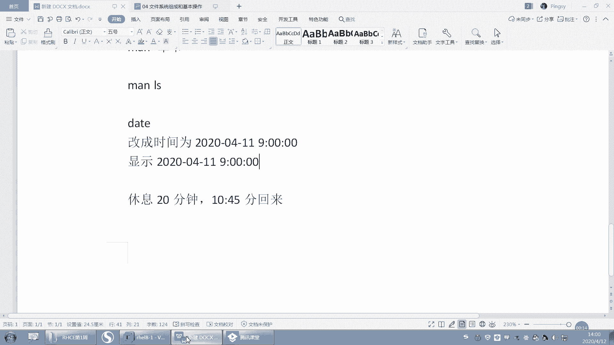
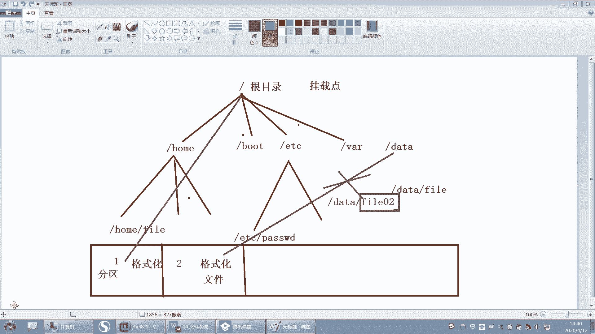
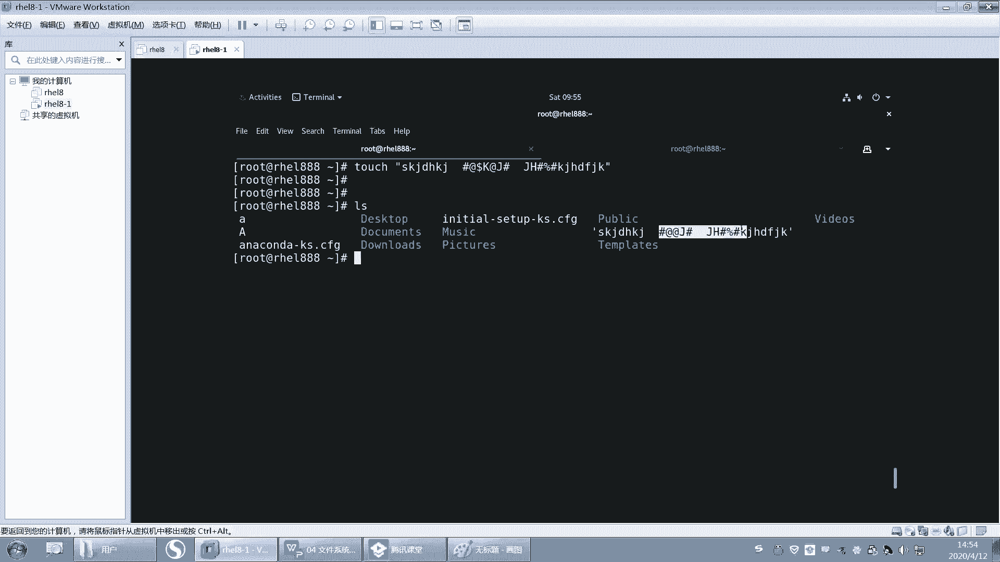
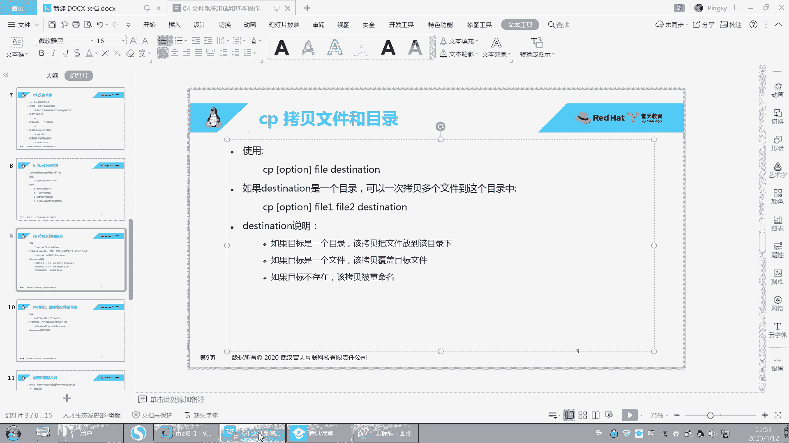
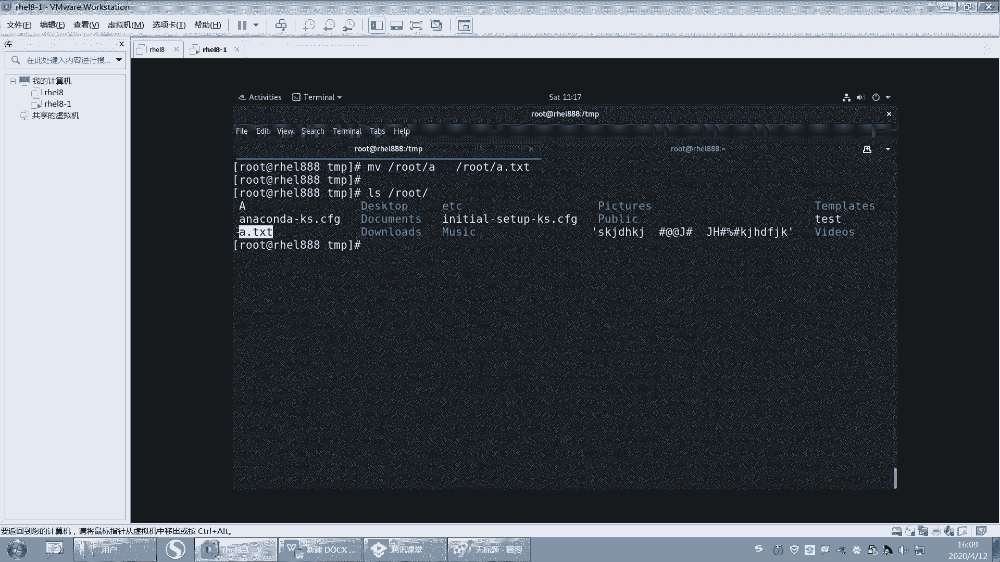
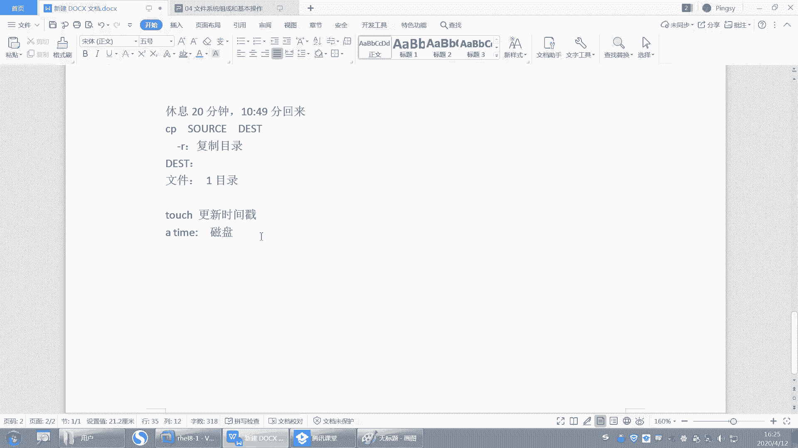
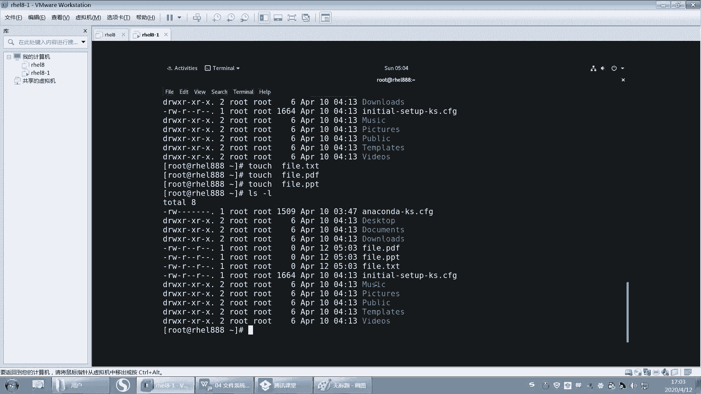

# 【誉天孙老师主讲】Linux入门／红帽认证／RHCE 8／RHEL 8.0／Linux基础视频 - P6：文件系统组成和基本操作 - 誉天孙老师 - BV1Dr4y1A7jz

我们是要修改时间，对吧？然后显示这个显示时间，格式是这个。呃，应该是绝大多数同学都做出来了啊。

好，我们来看一下啊。呃，我现在的时间是。2020年这个。4月12号的2。2点钟啊，那如果改成时间的话，我们就给以一个dta。两改改的方式有两种，一个是杠S。你可以把这个直接写2020。可以这样去改啊。

比如说嗯。4月11号的9点。00。9点是吧。分两OK。好，这样的话时间就变成了这个这个时间点，看到了吗？好，那么呃还有一种方式就是data。这个这个好像可以不用加S哦。直接写上呃呃这个月呀，月几月几号。

对吧？4月。11号。嗯，几十几分对吧？9。00哦，9090900。还有什么年月是吧，2020。如果是2020年年月，其实可以不用写。不用写的话，就是这样子，对吧？秒的话就是00。描不写就是00。好。

这种方式也是可以的。呃，也是可以改到9这个9点钟啊，就这这两种方式data杠S设置设置时间啊，S呢是设置的意思啊，set设置时间的意思。呃，如果是这种方式，它可以不用加S。嗯。好。那这我怎么知道呢？

我是从这个info里面查到的啊，info大家可以也可以去查一下。这个有一个嗯，你们可以找一下啊，它里面有一个设置时间的这个标题。你可以去看一下。在那个man里面好像是没有的。man里面。

那你们没有说明是吧？哦这这里有好多案例，有好多例子，你可以去找你看这里有个设置时间，看到吗？如果你用这种方式MMDDHHMM这种方式去设计的话，那么他要注意哦，那注意是吧？注意呃。

这个刚刚da杠刚杠刚set就是杠刚s其实就杠S嘛，这个选项可以不必用，对吧？嗯，如果你用上面这种格式的话，这个选项就可以不用加了。啊，当然如果你加杠U的话，我们之前说那个语法当中有个杠U杠U的话。

就是说它是指定这个UTC时间啊，而不是什么本地时间。啊，我们这个地方是本地时间啊，什么叫本地时间啊？本地时间就是。啊，门里面也有是吧？本地时间就是这个这个我说MMDDS那个那个没那个麦里面没有啊。

infer里面有。🤧嗯。好，那么嗯。这个大家应该会设了啊。第二个呢，我们来看一下啊，它的时间显示怎么去显示。嗯。哦，这里有是吧，还说显示这个当前的时间用给 in的格式或者是设置时间是吧？你说是这吗？好。

嗯。我看一下啊。在这里。其实说的不是很清楚，其这个。哦，这里有啊，你看啊往上翻。比如说杠S。我不是设置时间吗？对吧？你可以去找呀。这有杠S吗？杠杠s是不是两个是一样的呀，后面就是加一个字符串，对吧？

那么这个字符串呢呃用描述的字符串，这个字符串可以是什么？在最下面有。在这儿啊那这个呃data的字符串，刚刚data in string是吧？它是可以是这样子，对吧？也可以是这样子。对。

这个就是第一种方式啊。好嗯。然后我们要去显示这个时间呢，它是以呃年月日1分秒这种方式去显示。那我们要去卖一下data里面。呃，这个主要是这个地方是吧，就是这个吧，格式的输出控制格式输出啊。啊。

你可以去找一下那就mat。呃，我们之前找的同学找到的同学啊，就是年的话，现写是年年就是这个大Y嘛。嗯，你可以看你看好啊，小T跟大T小U大U什么小V什么小S大S那是不一样的啊。嗯。好，比如说小大Y是吧。

是不是年呢？那小Y呢就是什么？就是年的后两位看到吗？年的后两位啊。哦，还有什么？比如说这个。嗯。这里有we是吧，星期几你也可以写成星期几嘛？那星期几的话，那这个百分号小W就是这个零是星期天是吧？

还有百分号大。呃，大W这个是什么？这个也是星期，但是这个星期指的是年的。第几个星期就是一年有五十几个星期吧，对吧？而且是星期天作为这个星期的第一天啊，星期天作为星期第一天啊。好，然后还有一个啊。

你看有同学用摆放号大T，摆放号大T是格式，是不是就是摆放号HMS对吧？就是十分秒唉，十0分秒，所以用百放号大T来代替十分秒也可以。还有中间有的有一个什么？有一个空格，对吧？我们说十分秒。

就这个地方有个空格，这个空格我怎么去显示它呢？我们可以直接加空格，也可以加这个百分号T连接。百分号T是个table键，一般table键就是四个字符啊，差不多，对吧？

好，还有这个用百分号SS呢就是什么？呃，百分号大S是什么？是秒second秒0到60秒。然后小S呢小S是指也是指秒。但是这个小S你会看到它是从自从什么什么以来，对吧？sins是自从什么什么以来啊。

那就是1970年1月1号0时0分0秒，从这这个时间开始算计，到现在经过多少秒，所以你可以用data加百分号小S。指的是从1970年1月1号到现在经过多少秒啊，就这个好吧。好，其他的我就不带大家找了啊。

你可以自己去翻译一下。嗯。这个是24小时制的是吧？还有这个第几季度等等。都有。这是分钟对吧？呃，这是月O。这是哪一天，这一年哪一天。这小时12小时制的这个是什么？24小时制的。嗯。

白帽带F就是什么年月日。好，这个。这个大D，你看刚有同学的大D是吧？大D后面是不是有斜杠啊，然后这个是月日年嘛，年在后面显示了。然后这个是月的哪一天，其实就是几号嘛，对吧？几号呢。呃，约的哪一天就几号？

还可以显示星期几呢？这个是全称星期january1月JN1月缩写sunday星期几是吧？嗯，1月、2月、3月、4月这这单词都要知道啊。好，那我们就来看一下data加百分号，对吧？呃。

我们找到年是百分号Y。好，百分Y，然后就加一个百分号是么？百分号M。啊，以及百分号B这三个找到了，对吧？哦，那年月日显示出来之后，这个这个杠是我自己加的啊。这个杠看到没有？就是我自己加的。

它会显示它会自动就是显示出来。好，然后呢后面你想显示什么就写就就加什么，但是这个不能乱加啊。好，那么空格的话就是十分秒，1分秒我同学也找出来的，百分号大H啊。百分号大M啊。是什么百分号大S是吧？

但是这里有同学就报错了，因为是这样的啊。我们今天早上刚学过语法的时候，说过这个空格它是有特殊含义的。

嗯，但其实我们在这个地方我的题目的要求，这个地方空格是不是就是要显示空格呀？但是这个地方它把这个空格怎么样啊？它没有显示出来，为什么呢？因为这个空格作为了参数与参数之间的一个分格符，能理解吗？

参数与参数的分格符。所以这个空格我们需要去特殊处理它，让它就是以空格的形式显示显示啊，那这个地方我们有处理方法有几种啊，比如说你用双引号引起来，你就用这个什么你就用这个哎你就用双引号。

那把这引起来也是可以的，看到了吗？

No。就双引号这个双引号呢，我们会让它以原样输出。这个后面我我们会学啊或者双引号或者单引号都可以，或者说是么你你你全部就这样。就这样全部引起来也可以啊，对，全部引起来也可以，好不好啊。

它扩在这个这个这个这这个空格在这个空这个引号的里面啊，只要在这个里面就可以了啊。啊，或者是单引号也行。嗯，有可学用单引号也可以是吧？还有一种方式啊，我们后面也会学到了。呃，这个大家学语言的应该都知道。

里面会有一个反斜杠。反斜杠就是去掉。对。去掉这个呃空格的特殊含义，对吧？空格是分开项与项参数与参数的一个特殊字符，让它以原样输出，那么就加一个反斜杠。对吧就这样也可以啊，所以这几种方式都是可以去实现的。

ok吧。嗯嗯。嗯，好。嗯，行，那还有同学这样是吧，data加百分号呃，引号引起来是吧？加百分号F啊，百分号T啊，这个也可以，因为百分号F就是什么，就是这一串啊，百分号T就是后面这一串啊。

所以也可以实现我们的最后的这个结果啊，所以我们在做这道题，我们在做题的时候啊，我们lin当中就是说你怎么去实现呃，我其实不在乎，对吧？我不在乎你怎么去实现。但是最后我要达到我想要的结果啊。OK吧。

这个点只要大家能实现就可以啊，方法不止一种啊。好了，这道题就说到这儿了。那我们就呃这章我们就结束了啊。呃，这张我们就学我看看学了什么啊。😊。

嗯，我们其实主要是学了呃命令的语法，对吧？上面这个啊命的语法一定一定要记住啊，你每次去敲命令的时候，嗯，就是一定要去严格遵守它的语法规则啊，空格怎么去处理，对吧？空格是什么含义啊啊。

这个地方你们去加一个啊嗯，在这地方加一个命令语法，这个地方加一个哈空格说明一下说明是吧？空空格在这个我们命令行当中，它是有特殊含义的对吧？它是隔开什么什么什么什么与什么什么之间的一个什么，对吧？

你想要显示这个空格，就想显示空格，那你就要用特殊处理它，用引号啊，对吧？这种方式，单引号、双引号啊这种方式去让它去显示出来，OK吧。好，那这是命令的语法。语法规则当中，选项要特别注视啊。

当长选项短选项啊，以及我们后面要学的一些帮助资源，which what is对吧？which查看命令是哪个文件，what is查看什么？命令的简短描述。

刚刚have呢其实是一个什么一个它其实就是什么一个命令的。啊，命令的一个选项而已啊，这个选项比较特殊，它是来显示什么这个命令的语法规则的啊，显示命令的语法规则。然后再往后呢我们。

我们学了manman帮助man帮助啊，man帮助重点啊，重点对我们又学了in for对吧？in for那们你们也可以尝试去用一下。有些时候man好像不是很清楚的话，比如说例子。

我看info里面例子就很多，你可以去找一下。呃，infer里面的例子要比man里面的例子我看的要多一些啊，而且更详细一些。呃，如果你觉得我能看懂，你就去看一下，好吧。啊。

那么如果现在面临的问题是啊大家最大的困扰是man帮助看不懂，因为是英文的。呃，因为是英文的对吧？呃，现在也没办法，因为让你硬着头皮去看，确实也看不懂。嗯，你怎么办呢？呃。

我记得网上有一些那种中文中英文的那种中文的是吧？中文的帮助手册吧。好像有。有个中文的，嗯，但是我建议你是这样的啊。你看了中文之后，你两边对照着看，你不要说我呀有了中文之后，我再也不用看英文了是吧。

不是这样啊。一定要对照两边，对照着看。嗯，本来你看英文的看不懂，对吧？你一看中文哦，是这个解释，这个单词是这个意思哦，这以后就就这么去解释。那将来你再去看英文的话，你就可以怎么样，你就可以抛开什么？

中文了。对，这是一个过渡啊，不是说我要依赖英中中文，本来已不是要依赖中文了啊，要还最终还是要英文的，这个是帮助你过渡到英文这个这个这个。😊，这个呃阅读能力啊。好吧。嗯，不要逃避啊不要逃避。

硬着头皮学下来两三个月啊，大家这个英文选题啊，还有各个方面都会有所提升的啊。好。嗯，那我们。看下一张啊。嗯。啊，第四章啊第四章我们呃第四章我们会讲这个关于文件系统的这个组成和基本操作。

对文件文件系统的一个基本操作。比如说将来我们要学会一下怎么去复制文件呀，怎么去看文件呀，怎么去嗯创建文件夹呀、删除文件夹、删除文件呀等等啊，这些本基本的操作以及文件系统的组成。

我们在第一节呃第一节课的时候，昨天讲的那个嗯讲了一下文件系统组成是吧？如果还不是很清楚的话，我们今天还会再给大家讲啊，嗯今天讲完之后应该会非常清楚了啊。好，然后这章内容啊。

首先你要会去描述我们文件系统的组成，它是怎么组成的，它的结构是什么样子的对吧？它跟windows有什么有什么一样的地方，有什么不区别？嗯，因为windows我们比较熟悉了啊。

嗯其实在我们的lins当中啊，我们是有点它是有点抽象的，其实是有点抽象的。不像windows那么直接，对吧？直接点开就点你点，就这样很直接。好，然后还要学会去复制移动删除文件啊，以及创建文件。

创建文件夹，删除文件，删除文件夹。啊，最后还要我们去了解一下时间戳的概念，什么是时间戳啊，这个很重要的一个时间。好。然后我们下面再来看一下这张图啊。嗯。这张图呢。你把它放大啊。啊，文件系统的组成。啊。

我们昨天描述的是啊文件。我换一个颜色。啊，文件呢和目录构成单根的倒数状结构。这个回想一下，昨天是不是说过了，对吧？呃，我们windows。是多根啊啊多根，但是我们lin呢还是单根啊，单根只有一个根。

这是一个目录结构。注意啊，这是一个目录结构，它不能反映出它跟分区是什么关系，不能啊。不像windows，它就是C盘，就一个目录结构，就是C盘。D盘就是一个D盘，E盘就是一个E盘，对吧？

但是我从这个目录结构当中，我无法去看出我这个分区跟这个目录到底是什么关系，看不出来，对吧？啊，我们只看现在只看目录结构啊，那么文件系统是从根开始的，就是从这个这个根这个斜杠开始。

这个斜杠开始叫根啊叫根好。这个大家要区分一下啊呃区分几个概念就是。嗯。首先。斜杠。这个啊这是不是要跟目录？跟目录对吧？它是一个目录，是个这个斜杠叫跟啊叫跟啊，我们还有系统当中有一个用户叫root。

这个root呢它是中文翻译过来也叫跟。对，中文翻译过来也叫根啊，所以这两个有没有关系呢？没有关系啊，根是目录，这个是目录，这个是用户。明。注意啊，这个是用户名，所以他们两个是没有关系的。OK吧啊。

当然目录当中还有一个叫bo的bo有没有关系呢？他们也没有关系啊。bo呢它是一个目录，是跟下面的一个目录。这个目录呢比较特殊，它是启动的时候。会用到的啊。就是启动时需要的文件都放在什么？哎放在该目录下啊。

启动的时候啊，需要的些文件都放在这个上。也就是说，如果不得下面的文件丢失了，那系统是不是起不来了？嗯。这么说大家应该能听清楚啊，boot它是一个特殊的目录啊，启动的时候会读这个目录下面的文件。好。

这是几个区分的地方啊，要区分开，它们都叫ro都叫root是吧？都叫跟，那它根是目录啊，还是用户名啊，还是什么bo呀，对吧？好。再回来看这张图啊。嗯，你看文件系统从根开始从根开始就是从这个斜杠开始。

大家表示为一个斜杠，对吧？表示为一个斜杠啊，然后在我们这个目录结构当中，我们的目录和文件的命名大小写是区分的，大小写是区分的啊。好。呃，为什么说大家血区分呢？因为在我们的这个。

windows当中大游戏区不区分啊，有没有同学知道？windows当中这个目录文件这个大小写区不区分啊？Hello。睡醒了没有？嗯，对。对，在windows当中，这个大写也是不区分的啊。

对你创建一个呃创建一个大写的A和创建一个小写的A这个文件哎，对，文件名都叫A，不管你是大写还是小写，我同样都认为你是同一个文件啊。比如说我再创建一个叫小写的VM。他就为什么他就会报错，他说。同名了对吧？

同名了啊，但是呢在我们les当中啊，大写是大写，小写是小写。他是不他是区分的啊。小写。大写对吧？这两个文件那这两个文件大写小写是不是是两个不同的文件，对吧？好，这是要注意的啊。

然后在我们的这个目录结构当中，我们的斜杠并不是都是根，对吧？呃，后面这个斜杠呢指的是什么？指的是我们这个嗯。分隔服务啊，副目录与子目录之间的分隔服务。副目录与子目录之间的分格服务。这个图画的还是有点。

嗯，你往后面学，你才能很清楚它什么意思，还有这种虚线是吧？你先不要管它啊，先不要管它，你就知道它是一个什么单根倒数状的结构的目录啊。好，我再画一遍啊，待会我会提问啊。嗯，斜杠。跟跟目录是吧？跟目录。好。

然后呢往下走往下走往下走。往下走，我大概画一下啊。哦，就这样吧。然后这边写一个嗯。这边写一个，这是昨天我们画过的图啊。bot对吧？然后这个搞1个ETC。搞一个哇。好，再写一个对。好吧。O。呃。

像这些目录啊，比如说home目录不的目录E目录外目录，这些目录都是系统怎么样啊？系统已经就是你只要装好系统，它就会自动生成的一些目录，自动生成的一些目录啊，就本身就已经存在的一些目录啊。好。

像data这个目录，它本身其实是不存在的对吧？我们将来可以在它可以去创建它，这个是我们可以去创建的啊。好，那在home下面呢，我们还有可以有一些目有一些目录和文件。比如说有一个fi。好。

ETC下面有ETC是吗？ETCpas等等啊，这些文件啊文件。好，这样的话就形成一个倒数状的倒数状的结构啊，倒数状的结构。啊，叫单根倒数状。那么我们昨天讲了一个叫东西叫挂载点，对吧？叫挂载点叫挂载点啊啊。

那么我们一定要给什么？一定要给这个根给一个分区，给他一个分区，否则的话根是不是没有地方放。你想一下啊，你把home给分区了，根没有给分区，请问根放哪里，对吧？根是不是没地方放。

所以我们最终第一个要给的分区就是这个根分区啊，就是根分区回忆一下啊，昨天昨天讲过的。好，那我把这根分区呢第一个分区啊，第一个分区。第一个分区我们给到根，不过你在分的时候，你在装系统的时候啊。

你你第一个给谁其实无所谓啊，其实无所谓啊，先分谁后分谁都无所谓啊。好。O这个是给根了。好，那么给更了之后，我们所有的文件跟下面所有的文件和目录怎么样都是在存放在第一个分区上啊。好，有同学老师说。

那分区跟文件系统都有什么关系呢？注意啊。分区的话其实应该啊分区应该比较好理解。分区实际是就是这样一块盘怎么样啊，分成几个逻辑的区域就分开嘛，对吧？分开。那么如果我分成两个两个区域的话，比如说分两个区。

那么这两个区域是不是可以不同，可以进行各自的格式化，是吧？可以在第一个分区上格式化，也可以在第二个分区上格式化。那么只要格式化了之后，在这个格式化这个分区上就可以去存什么样文件了。

因为它有一个文件系统了啊，有一个文件系统了。好，那么。第二个注意啊第二个分区，如果我我想去访问他，对吧？我想去往里面存文件，我必须给他一个挂载点，就是让他跟一个目录去对接。那昨天有同学问到啊。

他说现在啊我要给他一个挂载点，但前提是这个挂载点，我们说挂载点本质上是不是目录啊，那我要给它挂载点的话，那这个目录是不是首先要存在。所以注意啊，我这个时候就会创建一个目录叫data。

创建一个目录叫data啊，那么这个data呢下面有一个文件。注意啊，这个data下面有个文件叫。Data file。比如说有一个文件叫data file啊，那么这个data file。

在data创建出来的时候，data file也创建出来了，对吧？那么这个fi呢，请问是放在哪个分区上面啊，放在哪个分区啊，目前为止。目前的话我是放在哪个分区啊？第几个一。2。放在哪个分区上？这个文件。

好，注意啊，我我这样指这个文件。这个文件具体指的是不是fill，注意啊，是fill啊。那前面这个前面这个路径注意前面这个路径是什么？这个路径就前面这一段是它的一个路径啊。

后面真正指的文件是不是指fall这个文件，我写这个我写这个我写的这个datafi真正的是不是指这个文件而已。那前面这段指的是在什么？是它的路径OK吧？对好，O现在还没有挂载啊。

我那我这个文件呢就放在第一个分区上了，也就是说现在这个文件在第一个分区上，对吧？第一个分区上，这个没有问题吧。😊，好，那现在我想怎么样给它挂载一个分区了。好，那这个时候呢。我偏偏给他挂载在什么？

data上。对，就让第二个分区。挂载在什么呀？data上，这样的话。我以后再去访问什么？再去访问这个dta的时候。那么。就是什么？是不是访问的第二个分区啊，那么我data上面就写一个文件啊。

比如说我再写一个第二第第二次啊，再写一个文件叫data这个fi02。那么这个文件就会放在什么呀？这个文件就会放在第二个分区上了，能理解吗？这个文件就会放在第二个分区上了啊。好，问题来了啊。对。

第二个上面请问。非要去哪里了？非要在哪？没有。这个文件。去哪里了？他在哪儿还在不在？还能不能访问到他？好，第一个问题在哪？在哪儿？这个文件请问在哪？在哪儿呢？还在。

请问是在第一个分区还是在第二个分区上啊？嗯。YY是同学。陈飞翔。哦，对，OK。は。所以它现在是在哪个分区上啊，是不是还在第一个分区上啊？他还在这里哦还在这里啊还在这里。好，那能不能访问到呢？访问不到了。

对，访问不到了啊，因为你的入口被挡住了，你的入口现在是data变成访问第二个分区了啊，能理解吗？就是你在访问data的时候，是不是访问到第二个分区上了？但是这个文件是不是还在什么？第一个分区上。那。

这个fill这个文件还在第一个分区上，所以它就访问不到了，它并不是说没有了，也不是删了，对吧？也没有移动过去，还在这儿。那我怎么才能访问到它呢？只有一种方法，那就是怎么样把它给卸载下来，能理解吗？

就是把它把这个第二个分区和data之间关系怎么样去掉，就是卸载卸载，没有这一层关系了。那这个文件怎么才会暴露出来，对，才会暴露出来，才会去访问这个文件所以我们再去给它分区的时候，给它目录的时候。

那么这个目录怎么样啊？嗯嗯。这个目录一定要是一个空目录才可以啊。就是你说不是空的也可以。但是如果不是空的，下面这个文件是不是就放不到了？嗯，最好是个空的对吧？最好是个空的啊。好。能不能理解我说的意思？

就是这个data注意啊和文件这就就在挂载跟挂载前，挂载后，它是不是都在那儿啊？对吧是不是都在这个地方？但是你挂载了之后，你给它挂载分区了之后，那么你再去访问这个目录。

它是不是就变成了访问到第二个分区上面去了？它直接什么对接到第二个分区上了，它不能通过什么样不能再访问到以前那个文件了，就就是。😡，呃，这个怎么说呢？能够能够意会能够意会吗？就把以前那条路封死了是吧？

直接又开了开开了一个门，这个门直接通向什么？哎，对，此路不通，直接通向第二个分区了。对，直接通向第二个分区了啊。那么你去修改data，其实修改是什么？第二个分区对，OK吗？你去修改data啊。

其实修改是第二个分区啊，除非你把它卸载下来。😊，卸载下来，那么。第二个分区就防不到了，防问不到之后怎么样，它就。再去访问以前那个fill那个文件了啊。目录注意目录没有分过去，能不能理解？😡。

目录不是分过去了，就是你去再去访问这个目录的时候，这个目录表现的。比如说啊这个目录的一些权限，其实都是第二个文件系统的权限了。它只是变成一个什么挂载点了，对，就变成一个入口了。对，关上了这个门，对吧？

关上了以前的门，然后打开这扇门，然后让它通往是吗？第二个。不是说目录分过去了啊，它只是成为一个入口，成为一个入口，能不能理解啊，潘崇旺。这样能不能理解这个文件系统的它们之间的关系了？嗯。好呃，不慌啊。

现在你目前只需要了解到什么，了解到它成为挂载点之后，它就访问到第二个分区了。如果我们还想进一步，我帮你去验证它到底是什么，它跟这个到底什么关系，对吧？我们在分区的时候，我会给大家讲。在分区的时候。

我给大家讲这个目录，唉，成为挂载了之后，对吧？那挂载完之后挂载分区之后，那么它又表现的是是什么样的性质呢？对吧？表现的是谁是谁的表现呢？其实他只要挂载了这个挂载了分区之后。

它这个目录表现的形式都是第二个第二个分区。第二个文件系统的第二个文系统的性质。OK吧，好O所以我们整个文件系统它的组成啊。就是由分区对吧？或者说分区吧就分区吧，分区和目录对接。啊，分区跟目录对接啊。

无论你这个我可以挂很多个分区啊，我可以在这个目录下面是不是有很多很多个分区啊，对不对？很多很多个分区啊。好，那么它的目录结构注意它永远都是从根开始。也就是说我访问这个。

只要是这个能挂载上去的这些那文件对吧？它都是从根开始的。也就是说我从根开始都可以访问到什么，都可以访问到这个文件。无论你这个文件是在哪个分区上。能不能理解？就是无论你这个文件是在哪个分区上啊。

比如说ETC。呃，下面的data。好，fill，你这样能不能看出你你能不能看出来你这个文件在哪个分区上啊，你这样是看不到的对吧？但是我永远都可以通过这样一个路径去访问到它对，从那从根开始。

然后某一个目录下面的某一个东西，某一个下面的某一个文件，下面的某一个目录下面的什么某一个文件等等啊。好，文件系统。这次OK了吗？因为上次还有同学问我啊，说他们到底是什么关系嗯。还有没有问题？没问题。

我就过了啊。好，不慌啊，慢慢体会它，慢慢体会它啊。所以对，所以就是之前有同学说我就删根嘛，嗯然就是把这个根下面所有的文件都删掉。听清楚啊，把跟下面所有的文件都删掉。哦，好，那么我问大家一个问题啊，注意。

😊，问大家一个问题啊。我突然想起来一个感觉还比较好玩的一个问题啊。🤧好。现在呢。我把它给卸载了，注意哦。我把它给卸载了，对不对？那我把它给卸载了这个fill2这个文件还在不在第二个分区上啊，还在不在？

请问。还在不在啊？对，在对吧？在只是我暂时访不到它了，哎，不在了。在啊我只是把它卸载了。但是这个文件是不是还在这儿？对，就是没有入口进来了，对吧？就是没有办法进来了，但是我还怎么样还在那呢？就像你U盘。

你拔下来之后哦，没有盘符了，我往U盘里面写一个数据，然后没有盘符了，那个文件就不见了。不是吧，你只是说没有这个盘符，没有办法进去了，对吧？是这样吧？没有办法进去了OK。😡，好。那么再来。

我现在呢把它卸载注哦，卸载了。卸载之后呢，我想把根下面所有的文件都删掉，请问能把这个fi2删掉吗？😊，哎呀。能不能删掉啊？可以呀。可以呀。就是说我现在卸载了哟，卸载了，我把根下面所有的文件全部都删掉。

请问fa2能不能删掉啊？😡，再给大家一次机会，能不能删掉啊？对，删不掉了，你访问都访问不到了，请问你怎么去翻删到它呀？啊，O吧，你访问都访不了，怎么删掉它？😊，嗯。对，就这个意思啊。OK吧。

那请问这个能删掉吗？这有点抽象啊。这个文件能不能删掉啊？可以啊。因为你可以访问到它呀，它是不是在根下面呀？就这个意思啊。好，我再举个例子啊，我现在又。又创建一个目录，叫test目录。然后呢。

我又把这个test，把这个第二个分区挂载在了test目录上。我把第二个分区挂载在了test目录上面啊，注意啊。啊，我再把根下面所有的文件都删掉。请问这个这个f2fa2的路径是什么？fa2的路径是什么？

😊，B2的路径该怎么写？B2有点为难大家了啊。😊，啊，请把fi2的路径写出来，能不能写会不会写啊？这个确实有点为难大家了啊。😊，啊，我看有没有同学写对啊，张这个张这个字儿怎么念啊？😊，王佳良同学不对啊。

孟丽康同学是对的啊。对，还跟data有没有关系啊？你加data的同学还跟data还写错了啊，data看到没有？data啊，还dta有没有关系啊，它只是一个入口而已，跟它完全没有关系，听到吗？

跟它完全没有关系啊。😡，是有点抽象啊，所以test它如果将来这个这个分区挂载在这个目录上面，那么它就是什么？它就是这样写的，就是test下面的F202。对，就是这样的啊。好。

那么我再去把根下面所有的文件都删掉，那它是不是就可以匹配到了呀？就可以把这个文件是不是它是不是在根下面啊，对吧？它是在根下面嘛，它只不过是在test下面test删了，那它不就删了吗？对不对？嗯。

所以它这个文件就会删掉啊，就删掉。好。他就是跟下面的某一个文件了。呃，这个没把家弄晕吧。呃，那个潘从旺同学还在吗？晕了没有？张张这个张什么同学？还在吗？这个没办法实操啊，因为实操的话就太多了。

你就把这个概念先了解一下就可以了。实操要分区格式化呀就麻烦了，好吧。就是入口不一样了。对，入口不一样了啊。嗯嗯。啊，其实这个是有点难，因为它毕竟跟windows是不一样的对，跟windows不一样。

它很抽有点抽象啊有点抽象。嗯嗯。好，不慌啊不慌。嗯，如果还不清楚的同学，你目前了解到哪个地方呢？了解到我们分区跟目录之间的关系就可以了，好吧。好，下面我教大一些实操的啊，后面好吧，实操复制文件呀等等。

好了，这个地方过了啊，不说了。😊。

好，下面我们来个介绍一下关于linkux的一些这个重要的目录啊重要目录。嗯，这个我再说一遍啊。这个地方是有点难呃，为难大家了啊嗯。嗯。这个难呢到后面我们慢慢会一步一步的揭晓它。

你目前只需要知道目录和分区之间嗯，你挂载了才能访问分区，就这样就可以了，OK吧。啊，不要再去纠结了啊。好，下面我们来介绍一下关于linkux的一些重要目录啊。嗯，第一个root目录。root目录啊。

那么这个root目录呢，它是一个超级用户root的加目录。什么叫加目录啊？昨天说过了吧，什么叫加目录啊？

我们windows的加目录在哪里啊？在这里吧，用户。嗯嗯嗯。windows管理员，这是他加目录啊，在这里对吧？看到没有？在C下面的users amin，这是管理员的对吧？

如果你windows再创建一个用户，它就会在这个地方是么，是不是又显示一个，比如说你创建一个张三，它就会有张三，对吧？好，那么我们下面来看一下这个目录。

这个目录呢是只有root加，root的加在这里啊，因为它在哪里呢？它在这个地方在跟下面的root。好嗯。O。你看怎么颜色变不来了。好，第二个，那普通用户的家在哪里呢？

普通用户的家在home下面us the name啊。好，我们来进去看一下啊。

好，PWD看一下我在哪，我是不是在home下面，在这里LS你看一下，这是不是有个admin啊，有个addmin目录，看到吗？什么颜色，我怎么知道是目录蓝色，你就看蓝色就行了，目录对吧？好。

那我再创建一个用户，比如说叫user一。那么这个地方是不是会多一个呀？多一个什么多一个目录，这个目录就是什么？就是这个用户的加目录，中户的加目录啊。

所以所有普通用户的加目录都在home下面以用户名命名的。

目录就是我们普通用户的加目录，普通用户的加目录啊。好，这个是普通用户的加目。第一个是入的用户的加目，他们是分开的啊。好，以后再说加目录的时候。嗯，问答家的时候一定要清楚啊。嗯。好。

下面这个我来给大家解释一下啊，这个有点。好，像USR这个目录，这个目录呢它下面会安装一些软件，还有一些重要的，还有一些呃就是你将来会安装一软一些软件，还有一些重要的文件都会放在USR下面。嗯。

我举我举几个重要的子目录来说一下啊。啊，前面这两个一个叫USRB这个目录。USRb这个目录啊，这个目录呢是用户的命令所在的目录，还记不记得我们之前怎么去查找啊，怎么去查找一个文一个命令是哪个文件呢？

一个命令，这个是哪个文件？今天上午学的。

whichch是吧，是which吧，对，which啊。啊，whichL看到吗？whichL这个文件这个文件是不是在USRB下面啊？有一个文件叫LS，对不对？啊。

我们可以去到这个USRB下面看一下这里是不是有好多好多的这个文件，这些文件都是命ing，都是命令，看到吗？都是命ing，可能我们不太认识，对吧？但是他们都是命ing啊。

好，那么也就是说USRB下面是不是放的用户的命令啊？这个没问题吧。啊，然后第二个呢就是USRSBSBS呢就多了一个SS指的是什么？S指系统的意思。系统管理员执行的命令叫S啊，USRSBSB啊。

那么SB呢，我们也可以进去看一下啊，我们找一个S病的好不好？

呃，看这个看for this。嗯嗯嗯。啊，你看这里这个命令是一个分区的命令for disk。这个命令呢，它是不是在USRSS并SB下面，是不是for disk有个文件叫fordi这个文件呃。

这个文件就是我们系统管理员，对吧？执行的命令对，系统管理员执行的命令。不是分区呢不是每个人都可以分都可以分的啊。好，那这个就是SB，而且SB下面呢，你也可以进去看一下嘛。USRSB。好。

这下面也有很多是吧？也有很多命令啊有很多命令，那这这都是命令都是命令。好，那这是两个啊，一个是B，一个是SB好吧。然后第三个呢，一个叫USRloc。

这个local呢就是我们之前会自带一些命令，对吧？那将来如果你想去安装一下第三方的软件，比如说安装一个。自己安装一个自定义的软件是吧？我们一般情况下都会放在USlo下面。嗯。

然后嗯一些配置啊都会放在这个下面，就是第三方的自定义安装目录，自定义软件安装目录啊，就在这里。好，你说能不能不在这里也可以，你可以自定义自己想去就是默认的啊，默认就在USRloc下面。好。

然后还有1个ETC目录。ETC目录呢这个是配置的配置文件，系统的配置文件所在的目录。这个目录。

嗯，就像比如说你我我去修改一下。呃，比如说啊我去修改一下主机名啊，我的主机名目前叫什么，是不是叫HEL888是吧？那主机名怎么修改呢？我们还记不记得前面有一句话呀？叫一切配置的数据。

都可以通过文本文件来去修改，对吧？配置的数据。所以你看ETC下面我们有一个hosse name。你看这个里面是不是写的我的主机名，对不对？那我只要把这个文件内容修改一下，我的主机名就变了啊。

就是可以修改的一些配置的，就是一些配置文件，配置文件就在ETC下面。嗯，ETC下面。好，还有比如说你修改IP地址啊，IP地址等等。

都会在什么ETC下面，所以就ETC就是配置的一些数据啊，配置文件。好，这个我们后面会经常访问到。比如说你用户账号信息啊、密码信息啊，都在这个ETC下面。呃。

还有一些哇呃哇这个目录这个目录呢嗯比如说举个例子啊，比如说我们的系统的日志呃，日志不知道是什么东西是吧？好，比如说我去装一个网站网站服务，大家知道网站吧。呃，去配置一个网站，对吧？那么这个网站的网页。

比如说啊你你你这个网站。

你像比如说我在这儿访问。嗯，你看我去访问火狐浏览器的时候，它不是网页内容吗？那网页的内容它就一般情况下会放在哇这个里面。

对，one到哇这个里面啊。好，后面我们会用到的。嗯。啊，那么那我去配这个什么配这个呃呃这个网站的时候，一些配置的数据它会放在什么？放在ETC下面。但是网页的一些数据。它就会放在什么？Y下面啊。

放在Y下面。好，下面这个就是tamp系统的临时文件目录。呃，临时文件呢这个tamp目录啊呃临时文件呃，其实我们有些时候就tamp就是在我系统运行当中产生的一些临时文件，对吧？这个临时文件嗯。

它会定期的去清理，就系统临时文件。这个不是我们那个不是垃圾桶啊，不是不是那个回收站，好吧，它不是回收站啊，这个tamp目录。TMP就是temporary那个。呃，什么临时的那个单词是吧？好。

这是一些目录啊，还有还有啊还有就是这个目录，这个目录。这个目录呢给大家解释过它是什么呀？系统启动过程中所需要的一些文件。嗯。系统启动过程中所需要的一些文件啊，就在boott下面。啊，还有第一V啊。

包括一些特殊文件。比如说硬件。都在D一V下面啊，一件硬件设备都在D一V下面啊。好，还有两个目录叫pro和s这两个目录。这两个目录呢它反映的是当前系统运行状态。就是说啊我们其他所有的。

比如说这些目录上面的这些目录，对吧？它们所占有的空间都是来自于硬盘。都是来自于硬盘啊。好，那么这两个目录呢，他们所占的空间是来自于内存，就是它们两个比较特殊。对，是来自于内存啊，占的空间是内存的。

所以他们反映的是我系统运行的状态，内存里面的数据。内存里面的数据，而不是磁盘里面的数据啊。好。那你说老师这么多的目录，我怎么能记得住呢？对吧？😡，呃，你用不用记呢？你不用记。呃。

当然我们目最终啊需要把这所有的目录都知道每个目录是做什么的，但目前为止你也记不下来，对吧？你慢慢学习，你自然而然的就记住了。啊，黄子维陈乔都记住了没有啊？嗯。我又问一个目录说干什么的呀，你知道吗？

知不知道啊？😡，哦，记住了，你是不是有没有有没有刻意去记他，没有去刻意去记他，对吧？就自然而然就记住了，就因为经常用嘛，用着用了就就记住了啊。😡，好，你就大概先对它有个了解就可以了啊。好，呃。

下面有一句说明啊，这个说明的话。嗯，先不用管它了，我们后面再说，好吧。它其实意思就是说这个B目录这学过的同学可以听一下啊。呃，B目录跟USRB这两个其实是软链接的关系，就链接文件嘛。

SB跟USSB是链接文件。就是改版了，就是从红帽漆跟或更其实红帽漆也是这样。呃，更呃八版本也是这样，但六版本的话就不是的，六版本不是的啊。它是一个链接文件，我怎么给你看它这个链接文件啊，你可以这样看。

因为有同学老是问，他说这两个木到底什么关系，对吧？😡，LS杠1B。你看这个B目录其实是什么呀？是是链接到USRB的那这是个链接。就是有说我访问这个的话，就是访问的是这个目录吧。

这个相当于windows的快捷方式。对，就相当于windows的快捷方式啊，包括SB也是这样。SBSB也是这样子啊，那这个目录是不是链接到这里？对吧它就链接文件啊。

好，这这句话说的就这个意思。就这个意思啊，然后以及li labelbel就是连接到什么US的label，然后label64就连接到US和label64。嗯，然后跟下面的目录是什么？

USR下面对应的一个软链接啊，就是一个快捷方式啊，快捷方式。所以跟你访问什么？你访问这个ELB。

对吧跟你LUSRSSUSRB是不一样的，这两个是一样的啊。这这个能不能听懂这个U这个病，你访问这个跟访问这个是不一样的，它们两个是一样的啊。😡，这是快捷方式吗？快捷方式走你知道是什么吧。😡，嗯嗯。

没看到花，也不知道懂了没有。

哎。哦，好嗯。好呃，那继续啊。下面是文件名跟目录，这个取值，我就稍微说一下吧。呃，文件名呢是不可以超过255个字符的。就是如果你超过2555个字符的话，它就不允许不允许啊，不允许创建了。就文件名呃。

所有的字符都是有效的。就是我们再去命名一些文件名跟目录名的时候，要注意。

嗯，你可以去文件名，可以随便叫是吧？就是说你。嗯，叫一个个啦或者是。特殊字符也行，这样特殊字符对吧？这些都可以看到吗？对，这都可以啊。然后你看。这是不是一个文件？对吧。这个文件呢。

它里面包含很多特殊字符是吧？所以这些特殊作文是不是都可以作为文件名，都可以作为文件名啊，但是唯独只有一个。

只有一个啊斜杠是不可以作为文件名的。因为斜杠它有两个含义，一个是根，一个是。分隔符分隔符啊，注意啊。好，然后在起名字的时候呢，最好不要去起一些什么就稀奇古怪的这些名字啊，这你看的是什么东西啊？

看不清楚是吧，最要不要去乱取名字啊，曲一些有意义的名字。呃，比如说fi点7S7啊。是吧虽然这个也不是很有意义啊。

好。还有名字和大小写要区敏感，就是大要写区分敏感就是区分的意思嘛，区分大有写啊。好，那下面我们来看一下关于路径啊，这个路径呢，对于就是那个潘崇旺同学是吧？啊，这种小白是吧？他就容易呃容易迷糊。

就有易容易晕掉。就是啊一会儿这个路径，一会儿那个路径啊。

好，嗯，那这样吧，我看一下啊。

我么给大家举个例子。好，大家记一下啊，可以记一下，我们有两个两种类型的路径，两种类型的路径啊。呃，这样我用LS啊，LS后面我们可以接路径，因为LS后面是看什么？

呃，他是看这个ETCA对吧？哦。网络大佬是吧？好，这个嗯可以帮我们去普及一下网络知识啊，然后给我们发点资料什么的。嗯，我很欢迎。好，那后面可以接上一个路径，那么这个路径呢嗯它是。相对路径呢还是绝对路径。

对吧？这个要怎么去看前面要看啊，相对绝对路径呢，第一个是什么？第一个是绝对路径，对吧？第一个叫以根开头的路径，是绝对路径。大家去记一下啊，在你的笔记本上写上绝对路径有什么特点啊。第一，以根开头的路径。

嗯，我虽然把PPT给大家，但是我相信我把PPT给大家，绝大多数省人是不会去看PPT的。

嗯，你还是记一下，好吧，你根开头的文件，你根开头路径都是相绝对路径啊，绝对路径。好，那也就是说我可以这样去访问喽。啊，比如说后面有一个很长的这样一个路径啊，这个就是什么？这个就是绝对路径啊。

就是绝对路径。好，绝对路径的第一点特点就是以刚开始的路径就是绝对路径。第二，绝对路径，它可以在任何位置去访问到这个绝对路径。比如说我现在我们我现在啊。你看啊我现在这个地方是不是有个根呢。

这是不是有个根呢？这个根是指我当前是在哪个目录下面啊？好，我现在我在根下面，我这样是不是也可以执行，那这个命令是不是也可以执行。好，现在我呢我去到temp目录下面。那我这条命令是不是也可以执行，OK吧？

所以就是说你跟你当前，那我当前在tab下面，跟我当前在什么在跟下面还是在哪个位置，我是不是都可以去执行这样一条命令，这就是绝对路径，OK吧，这就是绝对路径啊，好。呃，那什么是相对路径呢？好。

相对路径是这样的啊，比如说。LSETC。那么后面这也是个路径，但是这个路径呢并没有是根开头的是吧？那我怎么知道是是不是跟开头的呀，是不是这个地方啊，这个地方有个斜杠啊，这个斜杠是不是跟后面都是分隔符。

对吧？对，后面就是根后面是分隔符嘛，对吧？所以那你看这个地方这个路径它没有怎么样，它没有以根开头，所以它就是相对路径。这样去区分啊，这样是最好区分的方法。好，那再加一个啊。好。

那这样后面是不是也是一个相对路径，它不是以根怎么样，不是以根开头的路径。好，那么这条命令看好哦，我现在换一个，我去到什么，我去到t下面，我再来执行这条命令，能不能执行啊？那我换了一个目录。

那我现在在t下面了。我现在换了一个目录啊，我去到另外一个目录，然后我再来执行这条命令就怎么样啊，哎，就有可能会执行不了。对，有可能会执行不了。所以这就是相对路径跟绝对路径的区别。

绝对路径跟你当前在哪个位置是没有关系的。但是相对路径。在使用的时候，一定会跟你当前位置有关。好，那这个是什么意思呢？我这样去访问是什么意思呢？😡，好，访问的是什么？唉，那我们说绝对路径是以根开始。

那相对路径请告诉我是从哪里开始，相对路径是从哪里开始啊？哎，对，相对路径是从当前目录。所以我把这个路径写完整啊，它就是这样的tamp看好啊，因为我在t下面嘛，然后就是temp下面的。呃。

呃ETC下面的什么s confi，它是不是这样一个这样一个路径啊，对不对？那相对于当前路径，当前是在tempamp下面后面接了一个相对路径啊，相对路径啊，但是这个目录并没有并不不存不存在，那不存在。

所以它报错了，它没有此文件和目录，能理解吗？这个就是相对路径，所以在用相对路径的时候，千万要注意啊，相对路径它不是在任何位置都可以访问的。啊，那能访问的前提是什么？

前提是当前目录下面需要有1个ETC目录。ETC下面需要有一个ss confi的目录或者文件。对，这样的话才可以去访问到它能理解吗？对，这样才就去访问它啊，这个就是相对路径啊相对路径。

好，记好啊，绝对路径是以根开头，也就是位置的全路径。从根开始，任何位置都可以去引用它都可以去引用这个路径啊。那相对路径呢它是不以斜线开头是吧？也就是说不以根开头，这个斜线是根啊，不以根开头。

当前什么工作目录的相对位置，也就是你当前的位置的相对位置是吧？好，那在特定的位置才可以去引用，这个是相对路径啊相对路径。好，嗯，我举一个就是生活当中的一个例子吧。嗯比如说啊。

我现在要去我去哪里啊？我现在我不知道要去哪儿啊。哦，我去欢乐谷吧，好吧。我去欢乐谷，okK吧，我实在想不到要去哪儿了啊。😊，哦，我要去欢乐谷好，请问我去的是哪个欢乐谷，你知道吗？

你知不知道我要去哪个欢乐谷啊？😡，好，这么说吧。😀呵呵呵。😊，东四环啊，对，这么说吧，呃，你觉得什么时候会用什么绝对路径和什么时候会用这种相对路径呢？😊，是不是一定觉得路径就就好用呢？相对径不好用呢。

对吧？啊，就好比是现在我在ETC。比如说我在ETC下面对吧？啊，我在这个路对下面。对，好，就像我跟你们说，对吧？我跟你们说，我说我要去欢乐谷，你们为什么不知道？因为。怎么样？你们跟我不在同一个位置呀。

所以我如果告诉你，我说我要去我要去怎么样？我要去这个这个欢乐谷，那我肯定要是不是要说清楚是在呃从地球开始，比如说宇就是从地球开始啊，那地球上的中国，中国的武中国这个这个中国哪个省啊，湖北省武汉市，对吧？

那么这就是一个什么？这就是一个绝对路径啊，那相对路径什么？相我什么时候会用相对路径呢？我是不是跟我旁边的人呢，我跟我旁边的人在聊天的时候，对吧？我说我要去欢乐谷。😊，然后那如果你跟他说。

我要去中国呃地球中国、湖北、武汉的欢乐谷，那么他会觉得怎么样？他说你怎么这么多废话，你直接用相对路径，这个用这个直接说去欢乐谷不就行了吗？我肯定知道你是去武汉的欢乐谷啊，你怎么能去别的省的欢乐欢乐谷。

明明武汉就有，对吧？所以啊。那我已经也就是说我已经在这个目录下面了，对不对？那我还去我还用这样去引用EDC呃，对sfi呃network。那这样的话是不是很麻烦，对吧？这样是不是很麻烦呀。

所以我就直接怎么样啊，哎，直接用network script。😡，这样就可以放盗了。OK吧，哎，这样用相对路径就可以保问到了啊，所以就是也不是说相对路径毫无用处，对吧？还有有自己的用处。

就是你已经在这个目录下面了。我就不需要去什么加这么一长串的这个觉对路径了，只需要接上什么后面这个路径就可以了。好吧嗯。啊，这个例子可能不太恰当啊，但是你们应该都能懂吧。好，这是相对路径啊。

那么你看啊有些时候你就换位置了嘛，比如说你换到别的位置，然后你上下去翻，那这这样的话相对路径是不是又不好用了？对吧那上下去翻这种相对路径是不是又不好用，所以就看情况，看你自己好吧。

你觉得这个什么时候用什么就就也没有绝对说好跟坏，对吧？🤧好。但是尽量要用绝对入镜啊，尽量尽量好吧。嗯。

没问题了吧，相对路径和绝对路径。好，下面我们用一个命令来去演示一下啊。呃，PWD学过了是吧，显示当前的工作目录。好，我们用一个命令叫CD，我们学一个命令叫CD啊CD啊，CD是什么意思呀？

我们学过的是哎呃which查一下是吧？它所有的帮助，whichCD是USR并且面的CD好，what isCD。

好，what isCD这个CD什么CD的意思是叫呃什么干嘛？😮，改变工作目录对吧？CD叫change directory。OK很棒啊，咱班有几个英语翻译啊，这个我以后我就省。😊，唉，不错啊。

我只要我这一秒钟说啊CD你就立马把那们翻译过来啊。😡，这个。这个我得付你钱啊。嗯，你这比那个还厉害呢，是吧？我这边拿上说你们那边就出来了，这个翻译就出来了，是吧？😊，这个。但是考试的时候对吧？

那请你得请你吃顿饭是吧？好，然后嗯。这个是CD啊，就是changedirecty，改变工作目录，改变工作目录啊，我可以CDt。好，那么我CDt后面这个t呢就是一个绝对路径，对不对？就是一个绝对路径。

所以你只要知道一个。觉对入径你在哪都可以去怎么样去引用这个觉对入径啊。好，CDETC。CDETC等等等。好，那么在CD confis confi这种就是什么？这种就是相对路径啊，就是相对路径。

这个没问题了，我就不多说了啊。好，再来啊再来CD还有什么呢？😊，啊，我现在是在这个目录下面，对不对？我可以CD1点点。之前说的点点是什么意思？还有人记得吗？😊，还有没有人记得？快快快快告诉我。

看看看我演示的啊。好，请问谁的上一级目录？上一级目录是谁的上一级目录？对，当前目录的上一级目录很棒啊。当前目录的上一级目录，你可以看到这个地方呢，我每次CD点点的时候，我的路径就会变成什么？

是不是少一层啊，我在CD点点就变成了ETC再CD点点就抱现了根再点点点点没了，到头了到根了。得到根了啊，所以点点指的是当前目录。好，但是我们还有一个叫点。叫点吧。对吧点告诉我是什么意思啊？还记不记得？

对啊，点是根。点不是根啊，点是当前目录。不是点是当前目录，我已经在跟下面了，跟你看我在t下面。😊，我在t下面CD。点我是不是还在这儿啊？我没变到根吧，我还在这儿啊。所以点是当前目录没有变吗？

还是在我这个下面。那你说点有什么用啊啊，后面会有用啊，先知道它就是当前目录就可以了啊。嗯，你这个。嗯。然后LS杠A的时候，你看。这是不是有个点啊？点是指当前目录，点点是上一层目录，对吧？嗯。

有什么用是吧？那你就。等待下次揭晓啊。好，那么就ZD点点啊，那还有啊，比如说我现在呀呃。在在在在哪里呢？我不知道我在哪里了。啊，反正我现在就也不知道自己在哪里，对吧？然后我就想去哪儿呢？我想回家是吧？

回家，你知道家在哪吗？好，快速告诉我root的加的目录在哪里，root加的目录在哪里啊？😊，root加目录在哪里？哦，rootO好，所以现在我想我想去回到自己的家目。对啊，还有说跟的。

我想去回到自己的家目路啊，对，回到自己家目路O呃，郭长贺同学说CD波浪号CDroot是吧？好，我都不需要，我直接CD回车。也有。No。对吧你无你无论在哪嘛？比如说在tab下面PWDCD回车。看到没有？

我是不是就回到自己的家目录下面了？对，直接CD回车就可以了。那你无论在哪。CD回车。所以你看无论你在哪个地方，只要想回家就可以回家。就是类似于什么王者荣耀玩过吧，一键回城玩过吧。

没回过的都都应该是没玩过的啊哦，我回过啊，逃跑的时候用是吧？对。😊，嗯，所以呃所以这个地方就是一键回家是吧？OK好，CD啊，还当然还有个同学说还有CD波浪号是吧？好，这个波浪号呃，它也是这样的啊。好。

这样吧，我给大家讲一下波浪号啊，大家看一下这个地方有个波浪号。😊，你看我每次去访问我写访问其他目录的时候，前面是不是显示的当哎，请问告诉我这个地方写的是相对路径还是绝对路径啊，这个地方。

这个地方是相对路径还是绝对路径啊？对，这是个相对路径啊，所以我进入到ETC下面的时候，这个地方也是相对路径。OK吧？好，但是我每次回到家的时候。😊，这个波浪号。对。

这个波浪只不过显示波浪波浪号本来应该是显示的root，对吧？但是显示的是波浪号，因为波浪号呢指的就是用户的加目录。一个用户的加目录。拨浪号码。好，所以我可以用什么？我可以用这个这个。呃。

我可以用CD波浪号是不是回家了，那这样是不是就回家了，对吧？但是呢哎呀我今天这个心情不太好是吧？我不想回家，我想回别人家是吧？我想去别人家能理解吗？我想去你家是吧？好，那我想去别人家怎么办呢？

我就可以怎么样CD我想去谁家呢？我想去。😊，呃。addmin加好不好？想去addmin加，请告诉我addmin加的绝对路径是什么？告诉我，快点敲出来啊。

addmin的绝对路径addmin加的绝对路径在哪里？😡，addmin的加R在哪里？要敲完整敲完全啊。好，很棒啊好，对，就在这里看是不是啊？我要去admin家去波浪号admin。

对波浪号addmin大家记得很好，刚刚讲过的啊，所以现在我在home下面的addmin。对我就去到什么addmin家了。😊，看了吗？嗯，所以这个地方是一个特殊的用法，后面接上用户名。

比如说我想去优子一的家，那我就怎么呀接上优子一。对吧那我就去到右侧一的角了啊，就是区别人讲对吧？区别人讲啊。好，嗯，再来告诉我啊，现在我想去这样去访问波浪号。U子一。嗯。下面点的点。嗯。D8啊。好。

那把这个路径的绝对路径敲出来，绝对路径敲出来这个路径的绝对路径。嗯。调出来了吗？好，敲完之后敲这个。好，敲这个敲完之后敲这个这个路径的这个绝对路径，你只要敲出来，基本上这个波浪号就没什么问题了啊。好。

同理。同理，如果是这个地方，对吧？如果是这个我起祷的命，那么这个波浪号对我的命来说，是不是就是at的命的加入？没问题吧。这个也没问题啊，没问题吧。嗯，波浪号会用了吗？这个地方对吧？这就是admin加。

所以这个这个地方的绝对路径应该是什么？应该是home。addmin下面的点80。2C2C。哎，这个这个地方有没有问题啊？没问题的，敲送花，没问题的敲6。被燕子贤同学一紧然敲个敲了个一是吧？😊，嗯，好。

O。好了，这个不多说了啊。好，还有CD还有一个用法啊，还有一个用法，就是说比如说我要这样呃。嗯，我现在呢本来是在这个目录下面啊，本来是这个目录下面，但是呢我呢嗯就这样回车回到自己的家目录下面了。

那我又想回到这个目录下面，我是不是又要去敲一遍，是不是这样又要去敲一遍，对吧？就是说我又想回到这个目录下面，我又又去敲一遍，所以这时候不用不用那么麻烦，直接CD空格杠。CD空格杠看到吗？就回到什么。

就回到我上一次的工作目录。对，返回上一次。但是你能不能返回上上次或上上上次不可以，只能返回一次。比如说CD。杠就返回到加木了，CD杠就又返回返回去了，就来回跳来跳去跳来跳去啊，就是CD杠。记住啊。

这是比较常用的。啊，比较常用的一些啊，在这里。

好，刚刚学了几个啊，一个是绝对路径相对路径，还有CD点点回到当前目录的上一层目录。呃，CD杠回到上一个工作目录。呃，CD波浪号CD就回到呃当前用户的主目录是吧？一个波浪号就是当前用户。

的加目录主目录就是加目录的意思啊。对，主目录就是加目录的意思啊，然后CD呃某一个用户波浪号波浪号某一个用户就某一个用户的加目录。嗯。会了吧CD啊CD就就这些用法嘛，没没什么其他用法了。好，呃。

下面我们再来学习一个命令啊，再来学一个命令。这个命令叫LS这个命令不是讲过了吗？呃，讲过了还要再讲一遍啊，之前没有讲的太。

太仔细啊。好，LS啊。啊，G开始记啊LS这个命令是显示什么目录的内容。就是查看目录和文件，查看目录和文件啊。好，我们来一个一个一个来看一下它的一个选项啊。杠L选项这个之前讲过啊，呃。

杠L这个选项指的是什么？查看这个文件的这个详细信息，对吧？好，开始记了啊，这样子啊。呃，不知道能不能复制出来。

好，我们开始记啊，第一个这个地方。这个地方第一个这个地方杠这个杠这个杠啊杠指的是文件。我PPT里面没有啊，你们自己记啊。😊，杠指的是文件的类，这个文第一个就是指的文件的类型。杠指的是文件。

这这个地方指的是文件类型啊，杠指的是文件。那么D呢指的是目录。D指的是目录啊。好，然后L呢指的是链接文件。就是链接文件啊。好吧，嗯，先目前先记着几个吧，还有还有很多其他的。好，这样吧。

你先把这个记了就行。B。就是快设备，就是就是说白了就是磁盘。磁盘文件这些就是B就是B。还有C就是字符。字符设备是吧？好，就这啊。记着5个记着5个啊，就是我将来有一块磁盘，你看啊。😊。

我给大家看一下啊，LS杠LDV下面的SDA。你看这个文件是不是B开头啊？😡，B呢叫博lock，叫快，叫快设备。我们。唉，这个快呢是指这个单词翻译过来的，叫block，叫快设备。呃。

所以这种能够存数据的这种设备，我们叫快设备。呃，能够存数据的这些设备，我们要存叫快设备啊。好，这个下面还有很多嗯。啊，你看这个下面还有这种以C开头的，看到没有？以C开头的。这种就是字符型的设备。

像这种就是我们的终端，就叫TTVI是吧？嗯，这个我们后面遇到了再说吧。好吧，现在一时半会儿解释不清楚。就既是字符型的设备。字符型的设备啊，比如说像我们的控制台，我们说呢控制台那种设备就是字符型。

它只只是起到一个显示的作用。像我们的鼠标这种都是字符型的设备，它存不了数据，存不了数据，还有键盘这种它都是字符性的设备啊。

好，然后。呃，目录不用说了吧，链接文件就是快捷方式嘛。😡。

是吧。好，你看。呃，你再看啊LSLS杠LB。这个文件是比以L开头的。是不是就是链接文件链接文件啊。然后再就是什么，再就没有了。这就是D嘛，D就是目录。因为你有时候去用颜色去区分，对吧？

万一有的没有颜色呢？对吧万一有的他那个文件它没有全部是这一个颜色，那你就没办法去区分了。万一我是色盲的是吧？我都不说大家了啊，说我我看不清楚颜色呢，分不清楚是吧？😡，那我怎么去区分呢？通过前面这个。哎。

通过前面这个来去区分啊。好吧嗯。

好，再往后啊再往后。后面自己记啊，我就不写了，这个地方到这个地方是指权限，权限就写两个字就可以了。权限啊。权限。第一个栏位是文件类型，后面从这儿到这儿加上这个点是指权限。权限啊。好，后面这个一记了吗？

后面这个一啊。这个一呢。啊，这个一要分开说啊，如果是文件的话，这个一指的是这个文件的链接数。你就记就行了，不管它啊，我先解释不了。嗯，如果对于文健而言。这个数字指的是什么？指的是链接数。

就也就是说比如说这方是二，那这个文件呢它就可以被删两次，就删一次唉。死不了是吧？好，再删一次，这就死掉了，就删掉了啊，就是这个文件的链接数嗯。好，三那就有三条命是吧？三条命啊。啊，如果是目录的话。

那这个位置指的是什么呢？好，我们来看一下啊。

如果是目录的话，你发现这个地方至少都是二，看到吗？至少都是2。那么这个二代表的是什么？代表是这个目录下面有多少子目录。代表这个目录下面有多少个子目录啊。好，你可以进入到thattop下面。看一下。

这有没有目录啊？没有，为什么呢？因为它隐藏起来了，一个是点，一个是点点。所以在每一个目录下面，它都会有两个隐藏的目录，一个叫点，一个叫点点。所以目录这个地方至少都是2。至少都是2啊。好。

这个地方我假如我再创建一个创建一个目录叫data。啊，我我先创建一个啊。然后你再回来看。没有。你再过来看这个destop，这个地方是变成三了呀。😡，是是变成三了，因为destop下面多了一个目录了。

看到没有？多了一个目录了啊。所以它指的是什么？指的是目录下面有多少个子目录。OK吧，那三个子目录啊三个子目录。

记好啊。好，就目录下面有多个子目录，这个是这个三的作用啊。好，再往后第一个这个地方指的是文件的拥有人，文件的拥有人文件的拥有人啊。这是文件的拥用组。拥有人拥用组我们下一周会讲啊。拥有组。

我做的笔记比较丑啊，你们自己去做，好吧。用人拥祖。好，这个地方这个这个数字指的是文件的大小。这个地方这个这个地方指的是文件的大小。好，这个地方这个时间指的是文件最后一次修改时间。文件最后一次修改的时间。

这个地方这个时间。再后面不用说了吧，就是文件名。记完了吗？记完了。记完了给我示意一下啊。好。哎呀，妈。哎呀，妈呀。你不能换行线吗？嗯嗯。我我只是没有我只是想笑而已。嗯。好。

好，那么我们继续啊继续。这LS杠L啊LS杠L好，杠A都记下来了吧，杠A。杠A是这个呃。就隐藏文件是吧，隐藏文件啊。

好，嗯，这个地方有一个杠R，看到没有？有一个杠R啊，杠R是什么意思呢？就是我们这样去看的话，是不是只能看当前目录下面有哪些文件。但是有些时候呢，我们这个目录下面是不是还有目录，还有文件。

所以我就可以加一个杠R。这样这样去看看吗？那LS杠R首先这个有个点，点是不是指当前目录啊？那当前目录下面是不是有这些文件？对不对？好，那么。这个地方有一个点desstop，是不是也可以看一下这个目录啊。

这个目录下面有哪些文件呢？是不是有date啊？看到没有？有data啊。好，他还把data又看了一下，data下面有没有文件呢，没有空的，所以它会一层一层的往下看，就一级一级一层一层的往下看啊。

我们给这个一层一层往下，这个叫什么呢？叫递归。

呃，递地地递归会不会啊？叫递归。就递归查看所有目录递归啊。以后再说递归的话，就是一层一层一层往下看。对。一层一层往下看啊。你可以这样，你可以就是你把这个框框缩小一点嘛，然后左边看，然后右边记笔记这样子。

嗯。

啊，然后还有一种啊，比如说。呃，下面我来问一下大家啊，嗯我想去看。这个文件的权限。请问我怎么看我想看这个文件的详细信息吧。我想去看这个文件的详细信息怎么看啊？嗯。我想去看这个文件的详细信息是怎么看啊？

😊，还cat刚学过的。是不这样看？对，就这样看对吧？LS杠L。LS杠LOK很棒啊，这样就可以看到这个文件的详细信息了。😊，好，那我想看ETC的。我想看ETC这个目录的详细信息，请问怎么看？

我想看这个目录的详细信息，请问怎么看？哦，LSETC是吧？好，有同学说LS杠LETC。那你看我这样一回车就看的什么？还有。唉，这样一看是不是就是看这个目录下面所有的文件和目录。所以你看啊。

如果你接的是文件，就看这个文件本身。如果你接的是目录，那么就看这个目录下面所有的文件和目录，这个没问题吧。好，那么然后再再来啊，我想只看只看ETC看ETC对吧？那我就可以给啊看它的上一层目录啊。

看根看根就可以看到这个什么看到ETC了。😊，看到没有啊，所以后面接目录的话，是看这个目录下面有多少，看目录下面的文件和目录啊。OK吧。好，那我再来啊。我只想看这一个目录对吧？怎么看，那就是LS杠LD。

加一个D，就是指看目录本身的意思啊，看目录本身的意思。好吧，加一个D，所以D是指查看目录本身嗯。所以你看目录的权限的话，就通过什么加个D加个D啊，不加D的话就会显示什么就会去看这个目录下面的文件和目录。

我这样说够清楚了啊。

好。就刚刚哎呀这个。没了吧，可以过了吧，就这就这么两个命令讲了半天啊。嗯。好，下面我们还有一些命令，我们待会儿讲吧。我们今天下午就把这个文件系统讲完就可以了。我们嗯前面我们慢一点。宁愿慢一点。

把基础打好。OK我们下课休息一下吧，休息一下回来啊。你们去下课可以操作一下。五一我是这样的，我们这边。嗯，讲完肯定有作业的，你们放心好了啊。嗯，五一的话，我们是国家节假日，就是国家的这个节假日的话。嗯。

都是正常休息的。就比如说。51是12345休息，对吧？那我们在休呃他休息的这个规定时间休息，我们也休息。国家法定节假日我们都是要休息的。

我我把这个背景改成黑色的感觉。

黑色跟白色哪个看着。更舒服一些。我改成亮色的。你觉白色跟黑色哪个舒服一下？黑色。用黑色数复一件是吧？那我就黑色吧，反正我我是无所谓。

好，那就黑色。好，我怕黑色，有时候你们看不清。嗯嗯。好嗯。就是喜欢。神秘的感觉是吧？好，嗯，我们来看一下关于这个复制复制文呃复制啊，就复制文件的这个。

复制文件啊。嗯，这个复制呢。是。啊，这个。这个写错了啊。怎么写成这个样子？Opttion啊optionions。Otion啊。好。呃，回来啊嗯。呃，CP我们来man一下，好不好？man一下啊。

man一下CP。

好，这个我们早上man过了吧，我就不用再解释了吧。啊所以。复制的话，后面可以加选项，还可以加什么，还可以加这个圆和目标，对吧？我们来复制一个啊。嗯，复置这样吧，我把tamp下面清空一下啊。好。

复制CP后直接在time下面吧。复制CPETCpassword是吧？然后注意前面这是一个绝对路径，对吧？然后最后复制的文件名字叫password，然后复制到。好，比如说你复制到t目录下面。

那么这个tamp。嗯。就是我现在是不是在参谋下面，对吧？那么这个时候你可以用点，哎，这不是我们之前学过点吗？因为点也是个目录呀，点是不是当前目录，所以就是把password这个文件复制到当前目录下面。

啊，你可以用点表示，这个就可以用到点嘛，对吧？好。那我们就不用先不用点啊，先用这个t，这样看的清楚一些啊。好，CPpassword啊复制到temple下面回车，这样的话那就复制过来了，就叫复制啊。

是不是很简单，对吧？嗯，所以它是一步完成的。好，你还可以怎么样CP呃profi，比如说。嗯，再复制复制一个啊EDC。呃group啊，复到t下面好，这样的话我是不是接了多个呀，多个这个参数，对吧？

那哪个是原始，哪个是目标呢？我们去看man的时候是sourcece，前面或后面有三个点点点。所以你要是source可以有多个，但是目标只能有一个，也就是说只有这两个文件复制到目录下面。

复制到一个目录下面啊，而不能复制到多个目录下面。好，这样就复制多个文件了，看到吗嗯？好，那么下面我来说几种情况啊，说几种情况嗯。我们针对这个嗯。针对这个目标啊针对这个目标，我们来说一下啊。

目标的这种情况。

就这个啊在这里。就是你看复制文件到目标是吧？那这个目标呢有几种情况啊，有几种情况。好，如果目标是一个目录，注意如果目标是一个目录，那么这个文件就会复复制到该目录下面。

这就是我刚刚怎么样啊。刚刚演示的这个吧，这个是不是不用我多说了。如果目标是一个目录，那么就会复制到这个目录下面。

这是第一种情况。第二种情况。如果目标是一个文件，那么该文件就会覆盖目标文件。好，那这样啊，我复制1个ATTC。

下面的。嗯，这样吧我删这个文件啊。好，CP啊CPETC下面的group，然后复制到t下面的pasword。那么如果这个时候这个文件是存在，这个文件是不是存在呀？刚刚复制的对吧？好，如果将一个文件复制呃。

目标是一个已存在的文件的话，那么就会覆盖这个文件回撤。他就会问你over right要不要覆盖这个文件。好。你如果no，那就不复制。啊，如果yes就复制了。对吧就复制了啊。好，那这个时候请问。😊。

最后复制的这个文件。叫什么呢？你看它是不是叫password呀？好，那么这个pass word是原来那个pasword还是还是group啊？啊。这个password是原来那个pasword吗？😡。

这个pass word已经怎么样？对它已经不是原来那个pas5的，它是什么？它其实是group。对它其实是group，但是group呢。是不是复制过来之后改名字了呀，对吧？其实这句话的意思是什么？

指的是啊，如果后面是一个文件，不管它存不存在，那么这个文件。就会复制过来，并且改名成password的。对吧，但是改名的时候，我们改成password，因为password这个文件已经存在了。

所以他就会问你要不要覆盖这个文件，其实就是把以前这个文件给删了。对，把以前这个文件给删了。嗯。复制的文件名跟这个文件名同名了是吧？跟文件夹同名吗。没有这回事啊。跟文件夹同名这有什么关系吗？😡。

我们现在考你只要考虑有三种情况，第一种情况就目录嘛，是不是目录啊，你后面是目录，就复制到这个目录下面，就跟它同不同名有有没有关系啊，没有关系啊。😡，好，第二种情况就是这个文件存不存在。

对吧如果这个文件存在。😡，那么就会覆盖这个文件。第三种情况就是。对吧。这个文件第三种情况就是这个文件啊，怎么样啊？这个文件存不存在啊？这文件不存在，只有password对吧？所以如果不存在。

直接复制过来怎么样改名成pass，改名成fill。改名成fa啊，就这个意思。O吧，你不需要判断它重不重名，这个不需要，你只需要判断目标，它是一个目录啊。😡，还是一个文件呢，是个目录。直接复制到目录下面。

目录跟目录跟目录下面的文件同名了，这有关系吗？没有关系啊。😡，好，第二，如果目录是一个已存在的文件，那么就会覆盖这个文件。懂吗？第三，如果目录如果目标哦说错了啊，如果目标是一个不存在的文件。

那么直接改名过来叫这个文件，对，改名成叫堂。这三种情况有没有问题？啊，方明你这个问题解决了没有？你们要给点力啊。当然不能了。嗯，等一下啊。啊，你的意思是说哦。

这个文件有一个目录叫这个什么什么呃password，目录叫这个password是吧？然后你复制的原文件也叫password，那这样的话是复制不过来的啊，不能存在同名的。对，不能存在同名的啊。嗯。好。

好，这是三种情况啊，目标的三种情况记好哦。123啊。好，那么这三种情况呢，我们其实是针对什么？针对是当你复制文件的时候，是这样子，对吧？好，我快速的把这个地方如果是复制目录的哈啊。

我们说如果复制目录的话，比如说复制EPC到参阳模像。

好，这样的话是复制不了的，因为它需要加一个什么，需要加一个杠R。杠R是一个选项，当你要复制目录的时候，需要加一个杠R呃，就杠R一般叫递归是吧？就是当你复制目录的时候，需要加杠R才能复制目录啊。好。

这样的话就复制过来了，叫ETC叫ETC啊。好，所以针对第一种情况，如果复制目录的话，目标是一个已存在的哦，不目标是一个目录，是不是直接复制过来啊？这跟我们复制文件的时候是不是一样的情况。对吧。好。

第二种情况，CP杠2。ETC。复制过来，t叫pasword。好。是一个已存在的文件。这样能不能复制呢？给你复制过来是吧，它要覆盖它能不能覆盖，不能，因为它怎么样？他说你不能overr一个非目录。

也就是说目标是一个已存在的文件，能不能复制，不能复制。😡，不能复制过来啊。这样是不可以不可以覆盖的，只有文件覆盖文件没有目录覆盖目录的啊，不不是没有目录覆盖这个这个这个文件的啊。好，第三种情况。

改过来叫对头。这个文件是不存在。贝塔不存在对吧？不存在怎么办？😡，改名。不存在就改名改名成data。ETC改名成da塔，对吧？这个就是。复制目录的时候跟复制文件的区别啊。啊，区分了吗？会了吗？

就复制跟目录跟复制文件的这个。目标的三种情况啊要区分一下，区别就在于第二种情况，复制目录的时候是无法覆盖目标文件的。

是无法覆盖目标文件的啊。好。这个是复制啊复制。

好，那个什么相对路径，绝对路径我就不演示了吧，你们自己嗯就是用引用相对路径啊还是绝对路径啊，这些都不需要我说了啊。有什么CP好，我演示一个啊CPETC下面的group啊。

然后后面加上一个后面一个叫嗯test呃test啊。这样的话后面是不是相对路径啊，对不对？那这个相对路径也就是说从当前目录下面有没有有没有test的呀？没有的话，是不是直接改名称test呀？

那是不是改名成t呀，这就是相对路径嘛，对吧？这个不用我说了吧，就相对路径跟绝对路径啊，注意一定要怎么样？一定要注意。虽然我刚才给大家讲相对路径和绝对路径的时候，你感觉听得很清楚，但是呢。嗯。嗯。

你在用的时候你一定要注意啊一要注意。好，那么这个是CP啊，这个是CP等一下啊。好，然后我们来看一下关于MV啊MV。

啊，MV呢呃CP是复制拷贝文件跟目录，对吧？你们记下来了吗？记下来没有？好，你简单这样记一下啊。呃。CP啊。CP就是复制嘛，对吧？你写一下的语法，它其实就是原嘛。😊，呃，跟目标就这样写。

然后杠R呢就是复制。目录对吧？不讲就就复置目录要加杠R。然后呢，目标呢目标有四种情况，对吧？四种情况。嗯，四种情况。那四种情况如果是文件的话，对吧？那呃第一种情况，如果目标是一个目录，对吧？

直接复制过来。对，那第二种情况，如果目标是一个什么呃，一个什么就就这样去记啊，就分开这样去记。嗯。以后你们呃再这样这种的话就不用去记，呃，有些时候就不用记了，或者记也可以，就是嗯卷记下来吧。好吧。

因为刚开始刚刚入门嘛，你要慢慢的去尽量我们去选择正确的方法。因为呃刚开始入门。如果你困难重重的话，你很容易放弃了啊，所以尽量不要给自己去知造一些障碍，把正确的记记录下来啊，记录下来。

好。第二种情况叫MVMV呢第二个命令叫MV啊，MV叫移动。呃，MV呢其实就叫mo。move的意思对吧？移动好，那么MV这样子啊，我移动一个。MV password移动到root下面，哎。

我可以去因是不是也可以用波浪号啊，波浪号是不是我加木啊，这样也可以啊啊，或者是这样写，是不是也可以，不就是绝对路径嘛。对不对？好，移过去，那移过去之后，是不是就这里就没有了？这个地方是就没有了。

没有这个这个password是吧？那它在哪里呢？在root下面。在root下面啊，在这里嗯。日下面有个pasword，这个叫移动，移动跟复制的区别就是。呃，移动呢就移过去之后，目原文件会被删掉。

原文件会被删掉啊，当是复制不会复制原文件还在，原文件还在啊。啊，那么复移动的话，那是移动文件，移动目录呢？移动目录叫MVETCA对吧？一样的啊。好，另外还要跟大家说一下啊，这个后面有有目录的时候。

你每次一推我，我这个斜杠就出来了，是吧？呃，这样啊，你们目前为止的话，这个斜杠加不加，其实无所谓。反正能加不加无所谓，好吧，你加也行不加也行。O。不过嗯。有的时候加跟不加是有区别的啊。

后面我们遇到了会给大家讲。嗯，平时如果你觉你加了不操作了，你就快照恢复，好吧。或者人你踩坑了，你记记一下啊，记一下。好。嗯，然后再来啊移动到moote下。是移动到root下，这样的话root。

下面的ETC就来了，对吧？所以移动目录的话不需要加任何选项，不像CPCP需要加杠号R是吧？嗯，然后移动目录不需要加移动目录不需要加啊。好，那么下面我们目录移动移动的时候也会有什么，也会有三种情况。

OK吧？移动的时候也会有三种情况啊。😊，好，第一个。我们移动如果目标是一个什么，你不要乱移啊，你不要把ETC给我移走了啊，我移动的是t下面的ETC啊，你不要把各个跟下面的ETC给我移走了，你移移走了。

我跟你说，你这系统就起不来了。😡，你不要乱移啊，所以快照打好，移错了，快照回复啊，快照回复。好，然后如果对吧你也可以这样。呃，一到这个。呃，root下面这样也可以，对吧？就一多个也行。

那目标就是一个目录，对吧？好，这是第一种情况，目标是个目录啊，那目标是一个已存在的文件呢，我们看一下啊。呃，我MV个什么东西嘞？嗯，这样吧，touch个fi。好。

MV rootot下面的password移过来叫fill。嗯，移动root下面的password，移动到当前目录下面叫fill，这个是不是已存在的文件？好，移动过来是不是就会覆盖，这跟CP是不一样的呀。

OK吧，跟CP是不是一样的呀？没有。啊，移动过来是不是改名叫fill，跟CP一模一样。跟CP1模一样啊。好，这是第二种情况。然后再来MV。root下面的。呃，root下面的fill呃移过来叫什么呢？

叫叫叫叫test。呃，或者叫非点TIT好吧，那这个文件是不是不存在？😊，这个文件不存在，是不是叫重命名啊？😡，okK吧，这个文件不存在，是不是会重命名？这个CP第三种情况，目标的三第三种情况是不一样的。

啊，看到没有？就fi要点TST啊。好，那这就是MVMV是不是很简单哎呦。安V很简单啊。好。会了吧。啊，然后呢嗯它跟那个是一样的啊，你移动目录也是一样的，对于目录而言，也是跟CP是一样的。

区别就在于语言文件在不在了啊，区别就在语言文件在不在了啊。那MV呢还有一个作用。还有一个作用啊，它可以重命名。什么叫重命名啊？看这儿。哎，嗯大家很好啊，知道送花的比较主动啊，就喜欢主动的人。好，MV。

我要把这个da塔。重命名一下好不好？把data重命名一下啊，那么你直接接上这个data。然后去接上一个。test好吧。回去了，那这个是不是叫重命名？啊，这是要重命名啊。

那我如果要重命名root下面的这个。A，我把这个root下面的A这个文件重命名一下。如果我这样写了。写个。A点。Baker。好，请问。这个是重命名吗？这个是重命名吗？这是不是？这是不是什么秘密啊？

这是不是聪命密啊，这不是重命名吧，这是不是移走了呀，移走了，是不是改名成ABC啊？😡，对，这不叫求命名，所以一定要加上什么绝对路径路径不要忘记了啊，你把移走了，亲对吧？把移走了啊。

所以要ABC这样子或者A点baer。OK吧，就这样子啊，哦A点test。啊，然后它才在还在root下面，你你重命名不是移走啊，所以MV有两个作用。对，它在相同的目录下面。所以后面你要接路径的话。

如果这个是绝对路径引用的，那么最好前面后面也要有绝对路径，如果你相对路径，你就要注意了，你有可能会把它移走。千万不要这样啊，你会把移走。好，那么这个A就变成了什么？A点TST对，变成A点TST啊。

所以注意哦。

嗯，这里啊。这个我好像没有写是吧？那你记一下呗。它是移动和重命名是吧？移动和重命名啊，那么重命名的时候，目呃这个这个那个文件。就是不能被移走啊，这个叫什么命名？啊。

MV用法跟什么跟CP是类似的那目标的几种情况跟CP是一样的。嗯，它不需要加杠R啊，复制不需要加复制目录，不需要加杠R。呃，实在不懂，你就卖一下。

对吧你看这个语法是不是跟CPE1模一样啊？OK吧，是不一模一样。那mo就移动嘛，renameve就重重命名嘛。对不对？好，相信大家这个能力应该是有的啊。嗯。好好好。

记好了吗？都记好了没有？我没有叹气啊嗯。深吸一口气。讲的我要断气了，不是叹气。下午上课有点困是吧？嗯，这个怎么办呢？要不你站起来。差一会儿。😊，嗯。嗯，MV约不需要用参数改名字，移动文件和目录段。

就移动文件的时候，移动文件目录的时候不需要加那个参数。好，另外再跟大家说一下啊嗯。

我给大家讲一个讲一个知识啊，讲一个知识点。就是在复制的时候会遇到有一个问题就是。我找一个。找一个文件。嗯。好，大家看这里啊。呃，我跟你说啊，讲简单的内容呢呃一般不会困，讲难的内容才容易困，懂吗？

讲简单内容困了，是因为你觉得这个太简单了，我这这个这哎算了，不想听，这事你困了，讲难的内容听跟不上就容易困，是这样的吧。我说的有道理吧。好，那看这里啊。大家困了，就肯定是我的问题啊，就是只要怪我这个。

我这个真的我我我这是很惭愧啊，为什么呢？因为我没有办法做到像左老师，对吧？啊，像杨本老师讲课的时候那么的有激情啊。😊，我这个。对，就是我我就是声音实在是喊不大了，就是也没办法就是那个。嗯，就是嗯。

喊喊不了那么大声，很难一直保持非常亢奋的那种状态。声音就是我声音不太好不太那个嗯。嗯。hu。啊，你们如果有什么好的方法就是就是。就是不容易睡着的话。你们就。就是方法可以告诉我一下，好吧。嗯。

我尽量满足大家。嗯。好。嗯，我们看这个地方啊，这地方有一个文件，这个文件的类型是L，看到没有？这个文件是LL开头的啊L开头的，那么它是一个链接文件，对吧？链接文件好，那么现在我在复制这个文件的时候。

我们会有一个问题啊，比如说复制defat。好，那么这个文件会链接到哪个哪个地方呢？另到 label system D唉链接到这个文件看到了吗？链接到这里，就这个文件会链接到这个地方，链接到这个地方啊。

好，那么链到这个地方，如果我要复制这个文件的话，大家觉得我复制的是这个文件呢，还是复制的是这个文件呢？嗯。嗯，有些人说前面这个是吧？好，注意我这段题的是deult点tgged的是吧？

然后是复制这个文件了，这个文件。啊，因为这个文件不是链接到这个文件嘛，对不对？所以我在复制的时候，我复制到tab下面。那对你就复制的是这个文件呢，还是这个文件呢，对吧？😊，🤧好。

怎么去判断是前面这个文件还是后面这个文件？😡，我复制完之后，那你总得判断出来吧，难道是通过文件名来判断吗？这个文件是链接文件，后面这个文件是什么？后面这个文件。😡，好，我们看一下好不好？

后面这个文件是不是链接文件？你看后面这个文件不是链接文件吧，是不是是不是一个普通文件呀？所以我复制过去之后，它到底是原文是default data呢，还是这个文件呢，是不是只要看文件的类型就可以了。

对吧？所以啊我们来复制一下default。哎，我试说。好，复制tab下面啊好，复制过去了哟。啊，这里有个叫deerult target是吧，看一下它的文件类型是什么呀。是杠啊，说明是哪个文件啊？

说明是前面这个文件还是后面这个文件。嗯，对因为它是它是后面这个文件啊，它是后面这个文件。对，所以。呃，我们在复制的时候，它其实并不是复制的原文件吧。不是复制的链接文件吧，如果是链接文件。

在这地方应该是L吧，是不是L啊？所以你想复制链接文件怎么办呢？也很简单啊。😊，CP杠P。CP杠P。好，这个。他有一个这样吧，我先把这个文件给删掉啊。好，因为它是不同类型的文件，所以它就报错了。看这里啊。

然后CP杠P回车。呃呃哦，sorry sorry sorry sorry sorry我复制这个路径用错了啊，CP杠P。好，这样的啊，长度径用错了。好吧，好，这样子啊，然后再来看一下。诶。还是A呀。

看一下啊。这个还。不行吗？😔，哦，这样才行是吧？这CP杠A啊。好。那CP杠A可以啊，CP杠A可以好，那杠A是什么意思呢？那为什么杠P是这个不行呢？对吧？我们可以去man一下啊。好。

你看这个地是是不是就是复制的链接文件，然后还是链接到这里，对吧？还是链接到这个地方啊。好，因为这个地方我需要给大家出一道题，你们回去自己去试，好不好？😊，啊，你们自己去看一下杠A是什么意思啊。

杠A是指杠什么DR杠杠什么什么保留所有是吧？那么那保留所有是什么呢？D呢是指目就是目录啊目录。好，你看杠D呢就是什么哦，杠D是什么？R是复制目录是吧？D呢D是。links链接对链接文件。好。

还有一个杠P。还杠P啊好杠P呢，你看这这在这个地方啊啊杠P呢是保留什么？保留这个modode mode是权限ownership，用人有组时间戳对时间戳等等这些信息啊，就杠P。好，因为在复制的时候。

在复制的时候啊，比如说我们进入到addmin加目录取。呃，addmin加目录啊。哎。好，这边文件的拥有人跟应用组是不是admin啊？OK吧addmin啊，那我们在复制的时候，比如说复制点bush。啊。

这个你们自己去试吧，我就上课不给大家演示了啊，自己去试啊。复制过去之后，我想保留这个文件的这个拥有人跟应用组怎么做怎么做，好吧，你们自己去做作业实现啊，我就我全部给大家讲了啊，你们要有要会去测。

好呃，我已经说说的差不多了啊说的差不多了。OK下面我们再来看一下啊，关于一些创呃复制啊，移动啊都会了。我们看一下关于创建文件和删除文件啊，创建文件和删除文件。

好，创建文件呢就这样。Touch。fi1啊fill01就创建文件叫touch。touch嘛touch就是那个触触摸的是吧？触摸的意思，touch。呃，fi01touch fell01啊。

那这个文件创建出来了。那么这个文件呢它是一个空文件，看到吗？这是零，大小是0，所以touch是指创建一个空文件，创建一个空文件，OK吧。好，就这么简单，就是touch嘛。嗯。好。

那么touch除了创建文件以外，还有另外一个作用，开始记啊touch。

是更新时间戳。就我PPT上没有啊，自己记啊。动等touch。好，第一个就是创建文件嘛，这个比较简单，我就不多说了啊，这个更新怎么样啊？时间戳。啊，更新这个时间戳。那时间戳是什么呢？怎么看时间戳呢？

好。我们有一个 mini叫t。State fell。好，看这儿啊。呃，sate后面加一个文件名。那么就可以看这个文件的详细信息了，对吧？好，在后面这个地方有三个时间，看到这里吗？有三个时间。

这三个时间呢一个是excise time，一个是modify time，一个是呃change time。我们分别把它叫做A timeM time和C time。好。记第一个啊a time。

A time我们叫access time啊，指的是文件最后一次被访问的时间。记吗？记下来啊。文件最后一次被访问的时间at time。

文件最后一次被访问的就是文件这个文件，你看一眼，唉，它这个什么呀，这个时间就会变了。它最后一次看什么时候看呢？是这个什么呃，4月11号这个时间看的是吧？所以我可以打开它看一眼。比如说看一下fill好。

什么都没干，退出去了，注意哦，不要WQW下面你写了啊，我只是要看就Q退出就行了。

看好了，Q退出，不要WQ啊，W就保存了。好，再来看。这个时间。哎。哦，我这个时间哦跟这个是对的吧，那11点31是不是变了？变成11点31了，对吧？好，那么就是看一下唉这个文件的时间戳就会变了。

叫at time，就时间最后一次被访问的时间就是at time啊，那这个at time有什么用呢？它是记录你文件，只要被访问了，它就会什么，它就会更新就会更新啊，那么这个时间更新有什么用，为什么要记录。

第一记录它的用处是什么啊？如果一个文件对你来说很重要，那么你防止别人看了，对吧？那么这个时候你可以把这个文件的at time记录一下。下次你再去看attime的时候，如果变了，说明这个文件怎么样。

被别人看过了。就这个意思被别人阅读过了。OK这就是A time。好，它的作用啊。好，那他他有时候啊需要把它关了，就不需要这个attime。因为你想一下这个文件如果是一个网页文件。

就是你就是怎么样供别人来访问的。那么。你这个attime是会频繁的。你比如说你的访问量比较大的话，比如像那种微博微博是吧？呃。就是今年比较火的一些新闻，对吧？那么他们这些新闻会被经常被人访问。那。嗯。

我觉得啊。就这个这个这个娱乐圈的是吧一些呃这个这个重大事件。我觉得他们这个太恐怖了是吧？就只要只要只要是有哪一个。明星结婚啦，离婚啦，分手啦，谈恋爱了是吧？还有我们呢他们你们之类的是吧？然后就唉。

他就新闻那个那个访问量特别特别大啊特别特别大。好，那么访问那个新闻呢。如果记录at time的话，它会频繁的去更新更新更新更新访问次更新一次，访问次更新一次。对吧好，当时其实微博啊，当时嗯你访问的话。

它服务器的压力比较大是吧？好，本身压力就很大了。呃，当时微博好像声声声称说是呃它可以支撑什么两个。两个明星啊呃呃结婚离婚是吧？对，两个明星。啊，对，一个以前一个嘛，一个到第二个的话就崩了，受不了了是吧？

那现在可以至少接受两个以上是吧？两个对，所以这个服务器压力抗压能力增加了啊。😊，啊。O。那么服务器的压力已经很大了。你这个attime还频繁的去更新。😡。

那么更新最后这个时间会写到哪里去，它会写到什么磁盘上面呀？它会写到这个磁盘上面，对吧？那磁盘也是有寿命的呀。你想一下，磁盘也是一个耗材呀。如果你的磁盘不停的去更新更新更新更新的话，那么它的寿命会降低。

而且寿命降低了之后，你那个生命周期是不是变寿命变就变短了，对吧？那你就要频繁的去换是么？换磁盘，那换磁盘的话，你成本就会增加呀。

对吧所以有些时候把这个AT time关掉是有好处的啊。对他可以去买呃，不去更新。对，不去更新。在这种情况下可以不要去更新了啊。好吧嗯。O。这个是有明显的作用的啊明显作用的。好。

下面这个叫modify time。好，modify time叫什么呢？记啊，modify time。

M time。M time呢是指什么文件最后文件内容。最后一次。修改的时间。文件内后文件内容最后注意哦，是内容最后一次修改的时间啊。那这个时候如果我打开这个文件叫fill，对吧？

然后我开始嘚写了一堆是吧？然后EC冒号WQ保存了。

那么你再来看。这个时间是不是就变了，变成当前这个时间了？就变成11点36，对吧？这个是只要你文件内容变了。它就会变。注意啊，文件内容变了就会变。好，那么这个是这个文件内容啊。

那你说我就没有文件内容没有变，我就怎么样，我就WQ，我就保存。😡，那这个时候你发现什么呀？它也变了，我记得内容候没有变啊。😡，文件内容没有变。但是我WQ出来了，时间之后会不会变啊，也会变。

M time也会变啊，注意。M time也会变，所以没事儿，不要WQ没有修改，不要WQ，因为这会影响它的时间戳，它不会去判断你真的内容修改了，而是根据什么，你只要保存了一次，只要保存了。

他的时间戳就会变。呃，时间戳就会变啊，就会是M time文件内容最后一次被修改时间。好，那么请告诉我这个这个有什么用呢？有没同学知道啊，这个M time有什么用啊？😡，嗯。防止别人修改文件。

这个你防不了啊。有看有没有被篡改是吧？😊，看有没有动你文件。嗯，啊，好好，OKOK啊，当然你时间变了，肯定就是别人会看到你这个文这个内容有没有被修改是吧？啊，这个啊呃在我们做增量备份的时候。

会用到增量备份。😊。

有没有想起来增量备份？嗯，对不对？好，这个在我们存储里面做备份的时候会有用处。大家用过那种备份软件吗？有没有用过呀？你买一个西部数据的那个呃西部数据的那个移动硬盘。呃，包括现在百度网盘好像也有。

百度网盘也可以吧。你就是百度网盘可以去链接你的某个目录，然后去看一下你的目录有没有更新。更新的话就帮你去呃去去去怎么样，去去备份，用过没有啊？hello，用过没有啊？没有是吧。不不。

这个跟你学没学过lininux没关系啊，这跟你学过学没学过lininux没有关系。这个是我们日常的一些工具。对，就是那个西部数据好像自带一个备份软件。😊，就是你想一下啊。对，就是我们的自动备份嘛，对吧？

😡，这个跟技术没有关系，只是说你有没有平时有没有用过这种这种啊，没关系没关系，没用过就算了啊。我其实也我就用过几次。好。嗯，别哭别哭啊，你这个把你整哭了的。好，然后我们来看一下啊。我们的。

就是企业当中的数据啊，企业当中的数据。那么企业当中数据是不是经常要进行备份，这个是好语文的，包括我们自己现在的数据是不是也要备份。我们现在数据虽然不多，对吧？但是好歹那也是数据啊，那也是重要的数据。

对吧？我们也要去备份它。好，那我们自己的数据可能比较小啊，当然你的数据可能几百G这个样子，就算比较多的了，是吧？好，你要去备份它的话，比如说你要去备份。那你怎么背呢？你怎么去备份这个数据啊？

你是不是copy一下呀，我们所说的备份是不是就是copy复制吗？😡，复制是不是叫要备份啊？对吧。啊，复制啊把复制过来呀，复制到另外一个地方啊，就备份了嘛，对吧？啊，这个是我们的数据列啊。好。

但是你想一下，如果你的数据你们你们去备份过，不知道也不知道有没有备份过啊。比如说你备份1个500G的词，500G的这个数据，它备份需要多长时间？呃就是移动硬盘它备备需要多长时间？

我估计是需要是需要一段时间的，我估计两个小时得有有没有啊。这个要看你的磁盘的速率了啊。嗯，这个你备份的这个速度速率。哦，它500G其实都需要一段时间才可以备份完的那你企业账中的数据肯定不是G级别的呀。

你肯定在网上什么TB级T级别啊。甚至还是什么？还有PB级别啊。上上上那个呃前段时间不是说naSA把这个多少P级别的是吧，你你你你算过没有啊，P级别的。嗯，数据。然后传到那个什么亚马逊语音上面去了，是吧？

这个数数据量很大的，还有ZB级别啊，还有EB级别啊，对吧？他们之间都相差1024。对，相差1024啊，所以我们的企业当中的数据其实都可以达到什么？PB级别甚至ZB级别。对，你如果你要去备份的话。

其实是很难的。这种备份其实是很难的啊。你你这种全部备份一次，你怎么样叫全备呀？是不是叫全倍？全。备啊叫全备，全部复制一遍，叫全备。好，这边刚复制完那边怎么样，嗯，这这边又产生新的数据了，又要备份，对吧？

全备好，所以全备呢优点是什么？优点？可以保份保存保存一份完整的数据，对吧？对，这个数据可以完整的备份一次，每次全备，每次选备就有一份一份一份完整的数据。但是有缺点是时间长。哦，占空间大对，时间长。

占用空间多，每次备份每次备份是不是都要什么500G的，每次都要500G啊，甚至更多，对吧？好，这是全备。嗯，然后呢。那全备的话有这个缺点是吧？那我们就什么做增量备份了。那增量嘛，比如说增量怎么增量呢？

周一先做个全备。周一先做个前备，周一嘛，周一的先先做前备。然后周二周二的话，你的数据，比如说数据呃周一是一个G是吧？周二是2G，那么周二只需要备份是么？只需要备份那份那部分增长的数据。

就是说你只需要备份什么呀，这一部分数据。但是周二的备份是不是要在周一的基础之上去备份？周二备份的是不是在周一的基础上，周三在周二的基础上，周周周四在周一的周周周三的基础之上。好，那这样的备份优点是什么？

快只需要备份什么？只需要备份我增加的那部分数据。对吧缺点是什么？😡，缺点缺点是什么呀？只要你有一部一个备份数据丢失了。就有一个数据丢失了，那么就有可能导致什么后面的备份都没有用了，都没有用了啊。

那只能这个全被，这个没坏，那只能回到什么周一的数据。哎，只能回到周一的数据啊。好。那么这样备份那每次增量就也不太好，所以我们就是一周做一次全备，就下周一唉再做个全备。是这样吧。好，就是这样备份策略。

这个呃大概是这样子啊。好，那么这个增量的，我们在考虑这个增量这部分，我们怎么去判断它增量呢？对吧怎么去判断唉，它就是去去增加的那部分数据呢，就像一个文件一样，这个文件。

他如果没有修改，我下次在备份的时候，是不是就不不需要去备份它了？😡，那他修改了我要不备份啊，修改了，我肯定是不是要要去备份呀？😡，对不对？所以一旦修改之后，那你说at time变了要不要背呢？

at time背了，其实我不不需要去背。那M它们变了，我要背，那肯定要背呀，对吧？肯定是要背的。😡，啊，所以这个地方我们你要知道啊，虽然你现在没就是没办法用到它，但是你要知道它们增量，其实各种备份原理。

其实原理都是一样的。

对，原理都是一样的。就看它有没有一些高级功能是吧，怎么去实现的等等啊，用什么技术去实现的。嗯，好吧。

然后这个是M time啊，记好啊，文件内容最后一次被修改时间。第三。第三叫劝拒他。叫C time。

好，s time呢记一下啊，s time。C time是文件状态发生变化的。呃，就是文件状态最后一次变化的时间。什么叫状态呀？嗯嗯。好，状态就是一般啊这个我们在这个。嗯，有个专业数叫原数据对吧？

但是现在就是其实就是文件的属性。什么叫文件的属性啊？我觉得大小啊。变了呀。文件的这个这个这个呃什么。权限变了呀。文件的又人又组变了呀。这是不是叫文件的这个什么？😡，对，是的啊。

就是描述这个文件的一些相关的信息。呃，我们叫C time叫叫叫属性，叫属性啊。嗯，等等，好吧，点点点。嗯。好，这叫文件状态，对吧？好，你看现在。

看好哦。我现在呢。把这个文件的，你看这个文件的时间说，现在是11点36分，对吧？我把这个文件的用人改一下。我可以把应用人先改一下啊。你先不管什么改的。然后再来看。变了没有，是不是变了？

我什么都没有没有动它的内容哦，我只是把这个文件什么。😡，又有人改了，又有人现在变成了是吧？幼儿园现在变成了admin了。对，这个时候它的状态就发生变化了，状态发生变化了，C time就变了。

但是A time跟M time有没有变啊，没有变。哎，没有变，我没有看过这个文件内容，也没有修改文件内容。所以这个叫C time文件状态发生变化了啊。好。记下来了吗？记下来没有？

那么这两个之间有什么区别呢？M time的C time，你发现只要你M time变了。😡，所以它明定会变。因为你修改内容了。它一定会发生变化，注意啊，M time变了，C time一定会变。

但是Ctime变了，M time不一定会变。C time变了，Mtime不一定会变。记住啊。C time变了，M time不一定会变。M time变了，C time一定会变。对，就这个意思嗯。好。

那么touch跟这是什么关系呢？我们state是不是查看文件啊？查看文件的时间戳是吧？好，请告诉我LS杠L。S杠L那个时间是指M time A time还是C time啊？

知不知道啊？

LS杠也要看到那个时间是哪个time啊？其他同学呢hello hello起来了，刚紧睡你睡着了起来了啊。只有这个。这个这个这个。嗯，孟令康同学一直醒着是吧？你觉得睡觉这个问题。我这怎么解决呢？

要不给你们唱首歌吧。嗯。啊。唉，我看你们都醒了。行了就算了吧。OKAS杠1。😊，嗯，L杠也要查看的是什么？查看是文件这个M time啊对M timeO吧。😊，嗯。它是文件最这个最后一次修改的时间啊。

嗯嗯，好。嗯。哦，做笔记没时间理我是吧？😊，哦，好好好OK。😊，嗯。O。嗯嗯。

嗯。唉，我下面讲什么啊？😊，好，继续啊，那我想更新时间戳呢，更新时间呢就用touch来更新fill。然后state。嗯，那这个时间戳是不是更新了，更新到当前这个时间了。好呃，我们我下面会布置一些作业。

大家回去做啊，你慢一下touch慢一下touch好吧，你们自己去慢。呃，这个是什么？这个是改变文件的时间戳。然后嗯。怎么去改变对吧？比如说我只想修改M time，那就杠M，我只想修改这个。呃。

这个什么C time啊，不不是 a time就杠A，还有我还可以修。比如说我touch是不是呃直接修改到当前的时间了，这个时间戳对吧？好，那我为什么要更新时间戳呢？如果有一个文件非常重要。

但是只有备份只备份了一次，你是不是很担心啊？所以这个时候你可以怎么样啊把备份多次，那怎么把备背上呢，你可以更新一下文件的时间戳，对，更新一下文件的时间戳叫touch啊，好，自嗯这个大家自己去慢一下啊。

你不会慢呢就百度，你不会想办法把它慢出来。好，到时候更据题目要求去改变这个文件的时间戳就可以了啊？对，我们可以手动去更新啊，然后让他去备份。对，让他去备份啊。因为有些文件你比较重要的文件。

你备份一次的话，你是还是很担心，万一丢了就没有了，就一个备份。所以你要备份多次，那你就更新一下文件的时间出后，就下次就会备上。嗯。

嗯。好。再来啊。对，其实我们嗯我们系统的话跟存储关系很很密切。对，关系很密切啊。所以我们有些时候也会讲到呃关于磁盘呢存储的一些原理嗯。

OK吧。你们学完lininux的人再去学存储跟你计算。或者是大数据，对吧？这个呃都是有非常大的优势。嗯，我不是说吹牛，对吧？就觉得自己特厉害，但是这个是事实，这个是事实啊，你们可以去找。

其他的这个学生去问嗯。好。嗯，那再往下啊。

好，下面我们来看一下。这个RM啊RM。呃，RM呢是删除文件，对吧？是删除文件啊。

删除文件吗？可。啊，删除文件很简单，比如说fill回车要不要删啊，你删的时候，他会问你对吧？要不要删？😡，我说Y要删，那N就不删，对吧？Y就删掉了，所以它会提示你一下。它会提示一下这个fill要不要删。

对吧？就RM嘛，RM叫remove。RM叫remove啊。好，呃，那我删除目录的话，比如说我删除目录叫RM呃test。你这样删除目录呢呃删不了，对吧？所以现出目录需要加什么杠A呃杠R。对。

删除目录需要加杠R啊。哦，回车。那么这句话是什么意思啊？他说要进入，看到没有啊？其实删除目录的本质是什么？😡，删除目录的本质是删除文件，去到这个目录下面，把文件删掉。好吧，然后他就进入这个目录进入吗？

进入啊yes。啊，要是进入这个目录吗？哎呦要。啊，以。哦，你看这一行是不是就删除开删文件了呀？他先删的是什么？是不是这个目录下面的这个文件啊，所以它第一步删除文删除目录的本质是先进入到目录下面。

然后再把这个文件怎么样给删了，再把这个文件给删了啊。然后hy这样啊，比如说你不删那。你就过下一个呃N呃YNYNY呃呃。你这样一直弄下去，对吧？我估计要翘多少下呢？呃。

这个这个好像是我之前复制的ETCETC下面都少文件的，大概有几千个文件。😊，几千个文件啊，所以你要摁多少下呢？比如说200个文件呢就是乘以2，你还摁回车吗？还摁Y回车就4000是吧？好，那这样的话。

你这个。从早上开始是吧，上个目录，然后上到下班哦，好下班哦，我今天做了好多事情呀，我手都摁断了，是吧？😊，好。开个玩笑啊。啊，所以删除目录的话。对，删除目录的话啊，我们还是呃如果因为它会提示嘛。

我不想让它提示怎么办？RM杠RF对吧？终于来了，RM杠RF。啊呃R呢是删除目录，F呢是强制删除，就不要去提示我。对，不要提示我啊，直接删掉false强制删除OK回车。好，这个时候test就没有了。

就删掉了啊，O吧，删掉了啊。嗯嗯嗯。所以删除文件删除目录的本质其实是什么呀？就是去删除这个文目录下面的文件啊，目录下面的文件。

好，这三个记住啊。呃，这个RM注意啊，呃我们在用了这么多的。

这个文件这个这个这个操作的命令CP啊MV啊，还有RM啊。是不是都会提示你啊，它是不是都会提示你要不要删啊？😡，但是注意啊。这些操作都非常危险。都非常危险，比如CPP还好，对吧？MV也比较危险吧。

RM那更别提了，很危险，对吧？所以它都会提示你，但是呢你注意啊，我们用的是鸿贸企业版lininux哦。😡，哎，鸿贸企业版8。0，如果你换一个系统的话。你比如说你用其他的这个版本的系统。

那它会不会提示你呢？注意不一定。它不一定会提示你啊。所以万一你删就删了，哎，怎么没有提示我呀，对吧？你还等着人家提示，结果人家没有提示你。😡，没有提示你啊，所以这个时候怎么办？

一定要注意了啊一定要注意了。好，其实本质上RM这个命令它也不会提示的。因为RM是哪个命令呢？不是RM是哪个文件呢？是不是USR并下面的RM啊。好，你用这个命令来删，你用它来。

你可以直接接上这个文件的绝对路径。😡，然后你看我删一个文件啊，比如说。删一个default。好，删这个文件，可以直接用这个路径呢，可以用这个文件的这个路径去引用这个命令呢，然后加上这个文件名回车。

提示你了没有啊？没有提示，对吧？它怎么没有提示啊，怎么我执行RM的时候就提示我呀。好，注意。😡，RM你在执行的时候，其实它是一个什么它是一个别名。对，是一个别名。

它其实给你加上一个什么加上了一个杠I的选项。杠I是有交互过程的。就是我跟你之间，你要问一下我，对吧？你要问一下我交互嘛，对吧？你直接交互。所以你在删的时候，比如说如果你接的是什么，你接的是加一个杠I。

Fil。01对。这样的话是不是会提示你，所以它就相当于RM就等于什么RM等于RM杠M嘛。😡，这个RM是原来本身这个RM是这个路径。然后这个呢是我们的别名，理解吗？好。

这个别名并不是所有的系统都会给你帮你去做这个别名。注意这个别名是指我红贸企业版，他帮我做的。那你换一个系统，它有可能注意是有可能没有帮我去怎么样帮我去做。而且CP其实也很危险，为什么？

因为CP它会遇到同名的文件会覆盖，是这样吧？默认覆默认覆盖时候是不是加杠I的选项啊，你看嘛，which。😡，CP它是不是加杠A了，然后whichH。MV是不是加杠癌了，是不是都会提示我？

对吧都会去提示我啊，所以一定一定要注意啊。啊，那你说老师怎么办呀？万一人家没有帮我去没有帮我去加杠癌，那我每次执行RM不是要很谨慎吗？别人又不会提示我，对吧？啊，怎么办？以后教你怎么去做啊。

怎么去做这个别名啊，怎么去做这个别名。😡，好呃，更恐怖的是，哎，做个别名LS等于RM是吧？好哦，对，老的同学说老师RM杠RF斜杠行别回到我们今天今天说这个问题啊，从山库到跑路，对吧？😊，嗯。

今天学完就会就就可以跑了啊。好，早上还记不记得我们早上讲过，我说把根下面所有的文件。嗯。好，看这里啊，如果我想把这个文件RM把这个下面的文件清空，我可以用一个命令叫RM杠RF新。

那星号就会匹配这上面所有的文件。回去了，这样的话是不是就空了，对吧？星号嘛，所以那如果执行这样的一个命令的话，是不是就会将跟下面所有的文件都会匹配到。能不能理解跟下面所有的文件都可以匹配到。

那么跟下面所有文件都会删掉啊。好。那么我们之前讲了一个什么data嘛，我说创建一个data目录，假如说啊创建一个data目录，然后我给这个data目录挂载了一个什么，唉，挂载了一个这个这个这个嗯分区。

挂载一个分区啊，然后我还往这个data下面注意要挂载一个分区，我还往这个data下面怎么样啊啊，创建了一个文件。😊，呃，创建了一个文件啊，叫fill。那请问我在RM杠RMRF。呃，2F新的时候。

会不会匹标这个会不会匹标这个文件呢？这个跟我挂没挂在分区有没有？😡，这个你看啊看好了啊，现在这个da下面有个文件叫fill，对吧？那我这样一去匹配，能不能匹配这个文件啊？😊，不能。不会吧。嗯嗯。

不会匹配是吧？怎么不会匹配呢？😡，肯定会匹配呀。da上面有没有玩件，有对有fi啊。对吧商目全部匹配。所以。现在你这个fi，我管你是在哪个分区啊？😡，我管你是在哪个分区下面。怎么样啊？你只要是在根下面。

注意哦，你只要是在根下面，在不在根下面啊？再跟下面吧，这个路径是不是可以用星号匹配啊？对，全部删掉。全部删掉啊。就这个意思。看有没有快照啊。呃，快照快照是有的啊。

好，那今天我们就。看一下啊。

嗯，应该差不多了，我可以删一把了啊，删一把赶紧就跑吧。好，反正这个还好，刚装的系统啊，快照也有。M杠F啊呃。嗯。这个。有没有人有有有吧，我记得最近。呃，杨峰最近好像之前有很多案例是这样吧。

他不知道是不是伤根哦，我就我就不说我遇到的我是嗯我朋友他同事对，是这个是真实的事件。我朋友他同事。然后他是他在执行的时候。嗯，每年都反正很多这样的事情，他在执行的时候，他好像不想不不小心把一个东西删了。

不过那个好像是挂载了一个磁盘。😮，一般这样的数据是比较重要的那这样的数据是比较重要的，OK吧。他真的把他删了，他是误操作了。这个不是说那个不可能的事情，真的有。😡，呃呃，不是杨哥的同事啊。嗯。

刚好那个那个服务器刚测刚上市没多久吧。好。你说老师，你把这个你说删了吗？你说RM杠RF斜杠C删掉之后。😡，系统挂了有没有关系呢？系统挂了有没有关系啊？😮，系统挂了没有关系。对，系统关了没有关系。

关键是什么？😡，关键是什么呀？关键是什么？我的数据。对，关键是我的数业务的数据在这里。对，关键是我业务数据在这里，我系统恢复了又怎么样？有可能我恢复了我的系统，我数据丢了，还是一样找不回来。

所以你系统崩了，其实没关系，我服务我可以重建。说实话，但是更重要是什么？更重要的是数据，更重要的是数据啊。所以大家以后啊。😡，你只要走上这条道路。你就可能会面临着这样的问题。如果有一哪一天跑路了。

你就不要说在玉天上过课了，好吧。😊，嗯。OK那你也不要说是我教的了啊。😊，嗯。哦，提前给大家说一声说一声啊嗯嗯。😊，对，其实修系统的还是有可能的。但是数据恢复，除非你有备份，你备份，你备份的话。

你备份的周期比较频呃频繁。那你丢的数据少一些。但是你备份的周期比较那个的话，呃，你呃比较间隔时间比较长，那你丢的数据比较多，丢的数据就比就比较多啊。好，那我们试一下啊，之前也是这样，也也也是这样删。

他其实有些时候你知道他是你你以为他傻吗？你以为他就是星吗？你以为他知道他就哦斜杠星就把文件都删掉了。他其实不是这样的呀，它有些时候是什么原因导致的呢？它是有些时候是它中间有可能会匹配一些变量啊。

或者是特殊字符啊，它在匹配的时候不小心怎么样啊，匹配到了根下面的文件。😊，所以特别是那种写脚本哇，那脚本老厉害了啊。😡，这以么正常这样去执行的人几乎没有吧，对吧？除非像我这样的嗯。😡，呃，几乎没有。

所以大家一定要注意啊。你不要觉得一些好的一些脚本，一些命令，一定要测试测试再测试，对吧？不要让这个地方有可能它是一个什么，比如说一个是个变量，结果这个变量为空了，那么就是不是是不是就匹配到根了呀，对吧？

那这样的话。😡，跟这没什么区别了，但是你这样删好像删不掉，对吧？因为他做了保护的，他做了保护的啊，那做了保护的，还需要加这个才能删掉啊，但是这个新呃这个就可以删了那。好，但是你删的时候，你看。这个地方。

对，这个地方就说报不能移除，对吧？好，我发现删半天还没有删掉啊，怎么样长住C扛住C哦。😡，啊，结束了哎没结束。Yeah see see。嗯嗯。呀怎么没有ctl C啊，C不掉了。哦。

你看这儿啊这个地方是pro，对吧？这里报错了，为什么这里删不掉呢？因为这个地方是内存里面的数据，还记得吗？我们讲的时候，pro跟smo加面是内存里面数据，内存里面数据是没有权限去删的。😡。

但其实已经删掉的文件，你加的什么R杠R会提示你吗？它不会提示。😡，对他不会提示你啊，OK吧，他不会提示你。好，不会提示，你就删掉了呀，没提示就删掉了呀。那这个怎么，系统就挂了，挂了啊，啊。

这个我就ctrl C不标了啊，这怎么。算了，重启吧。试一下啊。看来没有重启。哎，我我这个嗯。这个是因为我没有装Qs，好像。就是这样重启也重启不了。无法这样发送指令，是因为我没有装tes。嗯。嗯。

IIT0与NIT0就命令都没有了，看到没有？命运都没有留。Reboot。命令也没有了。

我跟你说，呃都不安全啊，对，都不安全。所以。隔壁有个控制台，这跟控制台有关系吗？嗯，做什么都是有风险的。只要你谨慎操作，其实。案例还是个别嘛，对吧？只要你喝酒不上岗，上岗不喝酒，对吧？好，关机啊。

网络也很那个网络如果是网络瘫痪，也很严重的。嗯，因为业务就停掉了嘛，你的损失也很大。

好吧。OK哦，这个是RM啊RM。所以大家嗯就是做IT这一行还是要谨慎一些啊，嗯不要太。太那个了，太粗心大意了啊。好，后面还有两个命令，我们讲完啊讲完。

嗯，还有什么创建文件，我们讲过了吧。😮，还有创建什么创建目录。就叫data是吧，就创建目录，这个没什么好说的啊。好，比如说我想创建一个目录，叫data下面的test下面的。data下面的data是吧。

句一直叫data也可以嘛。但是这样创建的话，就创建失败。嗯，你看创建失败对吧？啊，为什么呢？是因为我在创建这个目录的时候，他最终会认为我创建的是这个目录，能理解吗？他最终认为我创建的是这个模。

最后一层这个前面都是什么？前面都是它的这个路径，前面都是它的路径啊。啊，那么创建这个目录的时候，前面这个路径。怎么样不存在，所以就报错了。对，不存在，所以就报错了啊。好，那这个地方怎么办？

我们加一个参数就可以了，加一个杠杠什么杠P吧。啊，对，杠P对你还可以加1个5V，可以看一下它的过程，看到没有？V是查看详细信息回撤。他怎么样先帮你创建这个，再帮你创建这个，再帮你创建这个是吧？

你看一层一层的帮你去创建。😊，嗯。啊，最终是创建这个。对吧。嗯。删了之后，我跟你说啊，一般删系统的话，呃，删了之后你怎么恢复对吧？我们说系统一切系统就是文件，我们是我们就就以这个原理，就系统一切接文件。

你只能说进就业模式，然后通过一些其他的方式把一些文件给就是复制过来，然后让系统恢复。嗯，让系统回复能理解吧？嗯，但是业务的数据除非你有备份，一般很难恢复。但是如果就是说你去删掉一个文件。

那比如说你删掉一个文件。嗯，这个文件我们有一些开源的工具，好像是可以恢复的。但是这个时候你一定要如果文件丢失了，那这个时候千万不要去动系统啊，不要去动它，也不要关机，也不要干嘛，反正呃还是有可能会恢复。

只要你删的不太多。有一些工具可以帮我们去恢复，但是系统不是不不在啊，系统不自带这种工具，OK吧。我们的意思本身它是不自带的。这个要看，比如说你家来装一个其他的这个呃呃组件。

比如说我像像我们经常用hado的时候，hidtopop里面它防止误操作，它就删的时候，它每次都会将那个文件移到那个垃圾桶里面去。然后你误删了，黑以把它恢复过来，但是我们这个地方是没有的。

这里面是没有的啊。啊，这个是创建目录啊，杠P是递归的去创建目录啊，不是其实P不是不是说递归的意思，P是指parent，它是指副目录。parent咋写来着？你去问一下。他去杠P嘛，parents是吧。

parents啊啊parents。他说就如果父目录怎么样啊存在就不会报错。如果父目录不存在，那就怎么样去创建。对，去创建啊，就这个意思，parents啊。好吧。呃，我我们作业当中。

如果你有的就是可能需求跟你上课我没讲过，你就要去慢去啊，就要去慢。好，然后我们删除目录录，删除目录啊。删除目录刚刚我们讲过了吧。删除目录我们讲过了是吧？好，那这个空目录怎么删呢？还有个叫RMDIR。

它是专门删除空目录的那。删除空目录的。但是一旦怎么样啊？一旦这个空目下面有文件。嗯。那这个时候比如说test下面是不是有一个文件，有一个目录叫fill，那你再闪RMDRRtest。它就删不掉。

那看到没有？就删不掉。所以这个命令只能删除一个空目录。好吧，那种空目录你可以用它，那真正删除目录还要用什么？还要用RM杠R。R是删除目录，F是删除什么t这样子。O吧。对，其实这个比较少用。

这个还是用的比较多，我这个一般都很少用，一般空目录很少有空的是吧？好，删除。

好。O。呃，最后一个命令啊最后一个命令讲完下课啊。

呃，最后一个命令是什么呢？我们系我们另当中啊。呃，有个特点，就是说我们的文件呢。我们的文件后面会有个后缀名，就是比如说我创建一个文件叫。我创建一个文件叫fi点CIT对吧？

那我创建一个文件叫非要点PDF我创建一个文件叫非要点PPT。😡，好，那么这三个文件实际上文件类型是一模一样的。虽然后缀名不一样，但是文件类型是一样的。因为我们lin当中啊。

这个后缀名实际上是没有什么含义的。唉，没有什么含义的啊，但是在windows当中，你点PDF结尾的文件，是不是要PDF打开呀？你点PPT结尾的文件啊，PDPPT打开对吧？就文本文件对吧？是这样吧啊。

在lin当中没有没有啊没有这样一说。😊，好，那么嗯。有些时候我们想去看一个文件，呃，万一你从windows里面复制一个文件过来，对吧？复制一个文件过来，还是PDPDF那你可能有一些工特殊的工具把它打开。

但是你怎么看呢？你难道根据它的后缀名来判断吗？你没办法根据后缀名来判断呀。

所以这个时候我们提供了一个工具。提供了一个工具啊。这个工具呢叫fill。叫fill。好呃，你可以这样。

哎，我看这样能不能复制文件进来呀？我没有装ts，我不知道能不能复制唉。

我看一下啊。

呃，把这个复制一下。重明一下个PPT。没张确实。这咋复制啊，它就就复制不了啊。就复制不了是吧？

他这个好像。这复制不了。没装tes，那算了吧。

好，那么我可以用fi来去看啊，看它到底是一个什么样的类型的文件。回去了。那他这个空的是吧，他什么都没写。是个空的。好，那这样吧，我们来看一个看一个目录，好吧。它显示个目录啊，我们再这样吧。

我们去看一个嗯我看一个这个啊。嗯。System。你都可以用fi要去看嘛。而且如果它是PDF，它可以显示它是真正的1个PDF如果是PPTX如果你下课就是你们后面做作业的时候，能把它拖进来的话。

你就用它来看，好吧，以及它是什么样的压缩文件，它也可以看，都可以看。比如fi。呃，defage。它是不是一个链接文件啊，看到没有？symic叫链接文件符号链接。还有比如说我们之前看到压缩文件在哪里。

在这里在USS share。a man是吧。man这里，然后有个man一man一这里。好，像那种红色的都是什么压缩文件。那什么类型的压缩文件呢？Fil。呃，写1个OS tree点1啊这个。嗯。

看到没有那。你看加上这个文件就可以写着它是一个GZ部格式的压缩文件。看到没有？就是如果你用这个windows里面复制的文件，复制过来之后，到这个里面，它也是可以看的。fill也是可以看的啊。

所以以后我们看文件类型，我们就用fill来去看你看文件的后缀没用的啊，文件的后缀不代表什么。可以吧。文件的后缀不代表什么？我还可以把它改成什么啊可以改成什么以点什么GZ结尾那那它就是压缩包了吗？

不一定啊，对吧？😡，好，这就是我们的这个命令啊命令这个fill这个命令啊。

呃，哦，它显示什么哦，很好啊，这地方显示了一个什么呃，它这个。呃，word是吧啊，word你看这个都可以显示的，这是可以显示的啊。好嗯。这张我们就差不多了啊，我们这张大概讲了什么啊，文件系统的结构。

文件系统的结构一定要清楚啊，以及我们后来其实也没说什么，就讲了一些各个命令怎么用的啊，各个命令怎么用的。好，我说一下这个。

嗯。嗯。这个。我们的这个课后作业做作业啊。

嗯。我想一下啊。嗯。大家嗯。作业怎么交呢？嗯，好，我来说一下作业怎么写啊。我等会儿呢，我今天最迟明天啊，然后我会发一份作业到群里，到群里面啊。然后发一份作业，比如说我命名叫HCEHCE啊。

什么什么什么对吧？然后写个姓名。那么你们就以这种格式去命名啊，就是什么什么什么姓名，谁谁谁，对吧？把这个名字改成你自己的名字，千万不要忘记改名字啊，改名字没改，就你自己没交啊。呃，大家在发的时候啊。嗯。

你们统一发我QQ邮箱。因为你们发微信的时候，有时候我手机收到了。呃，这个。就发来发去，我有时候没看到没下载啊，就就就就很难去收。所以同一QQ邮箱啊，QQ邮箱是134。我们好像没加群里是吧？

这是我的QQ邮箱，13482434692的QQ点comM。对，这是我的私人邮箱啊，这是我的QQ号。你们可以加我QQ号，我觉得QQ传文件比较方便一些，所以统一发我邮箱里面啊。嗯。好，然后作业要求作业要求。

好。最要求是什么呢？这个我要重点说一下啊，因为同学交作业不规范啊。好，作业要求呢，比如说啊我让你创建一个文件。那么你需要怎么办呢？你需要把你的文你的这个命令截图。命令截需要截图啊。啊。

命令截图完之后就是命令执行完之后要有什么验证。OK吧，要有验证啊啊，最好你还能标记出来啊，因为我们之前有很多很多的同学。他呢。嗯。对他就把这个这个这个他做的非常棒。

到时候你们你们做出来肯定会有做的非常好的学生啊，同学，然后我可以把它发出来给大家看一下。呃，验证就标记，比如标上啊，这个呃如果你能做到什么呃选项步骤，这个是最好的。因为呃这个你自己看好吧。

有时间你就做一下，有时间你就弄一下，没时间你就截命令截图验证就可以了。啊，如果自己没有做出来，就是你没有做出来，你写个说明好不好？你让我火眼金睛去看是吧？我每次都火眼金睛看啊，你其实你没有做出来。

但是你又骗我是吧？😡，之前还有同学把别人的作业拿过来直接交了。我说你是当我是中学生小学老师还是幼儿园老师啊？还是初中老师、高中老师是吧，就没必要啊。好，说明一下你这个地方没做出来，我知道就行了。好吧。

那下次我在上课的时候会重点去讲。对，这就是你要说明一下，就不是不是说说明什么，说明这题，比如说你没做出来，对吧？你随便敲一下那个命令放在那儿，实际上你是没有做出来的。但是我这样一看是不是看的很清楚。😡。

对我就看看的很清楚啊。哦，就是方便你我他是吧？好，还有什么呢？嗯。啊，命令截图截图啊，然后验证啊标记一下，所以说明一下啊。嗯，其他的话。其他就其他就应该没有什么。然后作业最好在周四以前。

周四以前啊交过来。交上来啊。我这出作业我太难了。hu。我尽量好吧。啊，周四以前呃就是交上来啊。就你不要这个搞到周五晚上大半夜，还有能给我交，周六交，这个我就没时间看了，好吧。嗯。嗯，这周四以前交交作业。

还有其他什么？其他还有什么？嗯，这个就是要练就是要练啊。嗯，其他的话看大家有什么问题吗？呃，PPT的资料我都会发群里的啊。因为资料都发群里，还有我跟大家说一下啊。多少多少算多呀，我的妈呀。😡，好嗯。

大家后面啊最好。怎么说呢？他不要缺课啊，因为你缺课的话，我很难受。因为每次讲了，我我在上课的时候，我能尽量把自己讲的东西都给他讲了。但是呢嗯。你们如果不上课的话，这个不上课那个不上课。

然后都来问我之前讲过的，说了一大堆讲过的那我再给你讲一遍，我真的不知道该怎么一句话，两句话讲不清楚啊啊，让你怎么办呢？你要你实在落课了，你就把上一节课的视频补一下，上一节课的视频把它补一下啊。

然后然后再看一下有什么问题。然后如果是没听懂还是怎么样，你可以问这个没问题啊。嗯。然后你就用word吧，我我会发word，我会发word，你就把word复制上去就可以了。呃，作业的话没有那么多啊。

我想作业我头脑袋也疼。嗯，如果你实在是想去做作业的话，你可以把我们的书上那个练习题也先拿出来做一下。我尽量给大家多布置一点，好吧，我尽量啊。嗯。其他看看同学们还有什么问题吗？

下周我们下周大概上什么内容呢？我们下周要上用嗯。上午。用户啊组啊权限啊。呃，还有管道啊。管道是吧。啊，重立项啊。还有一些工具的使用，就是文本文本处理工具啊。嗯。就是这些。

其实一周一周下来内容还是蛮多的啊这等等这些。这些内容。嗯。这是下周下周啊。嗯嗯。嗯。记下来没有QQ邮箱。嗯。想一下啊，还有什么还有什么。好好。O O。到时候我把PPT打包放群里，大家去自己去下载啊。

其他就没有什么问题了。如果有问题的话，我在群里再跟大家说，好吧。

嗯，加个群再大家发发好吧。

OK吧。行了，那我们这周就到这儿吧。嗯，第一周大家辛苦了，这是个开头啊。这只是一个开始。后面坚持啊一定要坚持，这周能看到大家，下周不知道还能看到大家看到多少人啊，呃这周大概是70人左右是吧？

那下周的话多少人你就不知道了啊。大家尽来尽量都来上课，OK吧。嗯。对，大家记嗯。哦，可以可以溜了可以溜了，嗯，可以下课了。😊。

