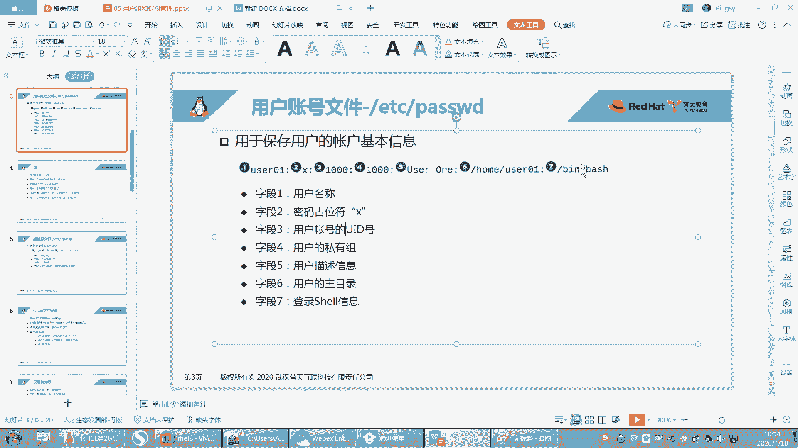
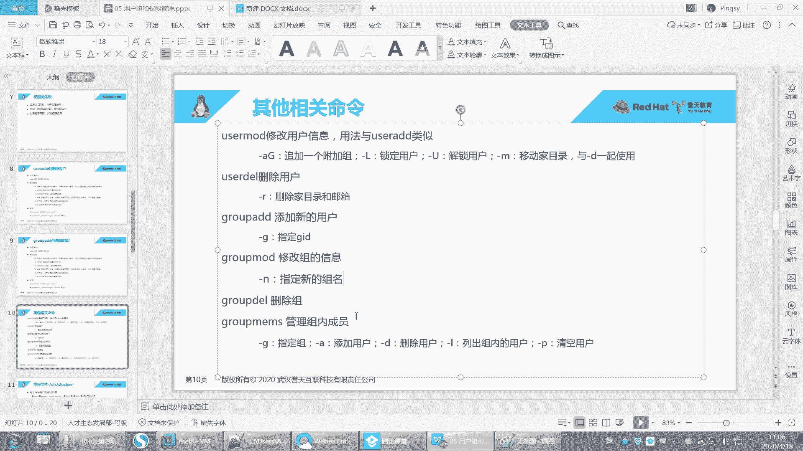
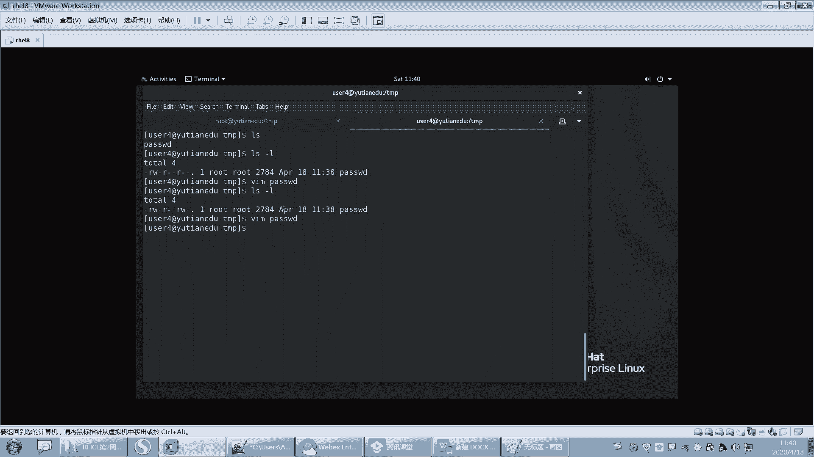
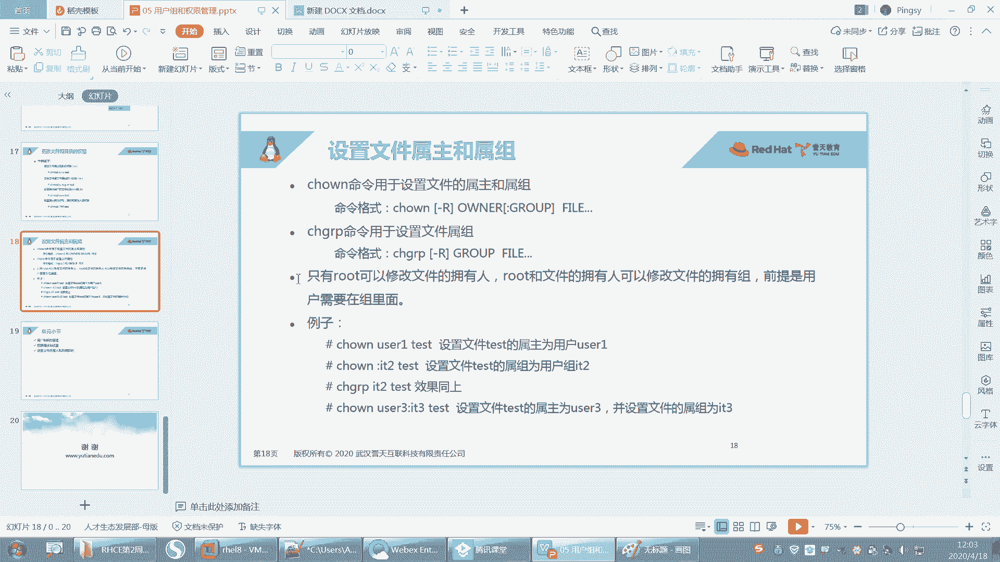

# 【誉天孙老师主讲】Linux入门／红帽认证／RHCE 8／RHEL 8.0／Linux基础视频 - P7：用户组和权限 - 誉天孙老师 - BV1Dr4y1A7jz

看一下上周作业啊，我上周的嗯我数了一下，大概我收到的作业有将近60，应该是60份。呃，所以大家第一周完成的还是很不错的啊。呃，希望大家后面能够继续保持。然后后面昨天晚上发给我的，我就没有来得及看了。

大家尽量就是尽量早一点啊。好，我们来看一下上周作业啊。呃，绝大多数同学其实完成的都很好。呃，还有个别少数同学，他这个呃基础可能不是很扎实啊，所以大家还是要注意啊。呃，就是说要多练呃，我题目可能还好。

也不算多，也不算少，不过基本上够大家练了。呃，如果你觉得还不够的话，你可以自己去嗯找一些相关的网上的题目啊去做一下。好，我们来看一下第一题啊。创建一个用户啊，这个用户的身份哦。

用用户用root身份给user一修改密码rehead啊。然后这个一般都没什么问题，用root来给大家修改的话，我们直接输入新的密码就可以了啊。在这个地方好，然后还有的同学在这个地方呢。

他其实是报错了的啊，他没有看出来，所以一定要把这个单词开会啊。第二，切到root呃切到Uer一用户给自己修改一个密码，密码是任意的。啊，那你需要切到什么you则一，然后执行password。

那么你需要在这个地方。呃，输入当前的密码，然后再输入新的密码。那这个地方可能就是报错的，看到吗？这就是报错的啊，所以下面这个才是正确的。OK重新输入一次啊，因为密码不符合要求。好。

然后第三个的话就是这个VI编辑器的使用啊，这个就没没什么好说了。啊，第四题查找啊查找系统当中所有与pasword的关键词相关的慢帮助章节。这题其实是呃怎么样呢？

它是呃所有与pass word的关键词相关的慢帮助章节是吧？呃，其实这个地方啊我们呃这题的目的其实也不是说考导大家，就是大家大家知道有哪些章节，慢帮助怎么用的。

有的同学他用不同的方法去做的啊，比如说呃有这样做的，有用what is做的。呃，what is password？那么这样查出来的话，就是什么呀？就是这个里面是带有password这个关键词的对吧？

这个方法也可以啊，呃，这个也是可以的呢。这个就是它第五章节第一章节或者用man杠K呃杠K password。这个也行，这个的话就是你的描述信息里面有pass word，他也给你打印出来了。嗯。

还有的同学是用杠大K杠大K的话，你有一点点问题啊，我们这地方是杠小K，所以没有查出来，后来同学问我的同学后来看了呃，别的同学有好像是大K吧。你就小K好吧，大K好像每一个都打开看了一眼。

然后退出退出退出退出这样子。

好，这是这个啊，就是。然后第五个这个要牢记啊，这个我出了一个这个嗯。不是操作题是吧？然后因为这个非常重要啊，特别是第五个章节。第六个创建目录，这个目录的路径有同学弄错了，目录的路径。嗯。

其他都没什么问题，其他都很好。然后复制将ETC目录拷贝到data，并且重命名为config啊。呃，从现在开始，大家要养成仔就是仔细看题啊。嗯，可能是我的这个题目出的有歧义，对吧？或者是你理解的嗯。

跟我出题的。这个嗯想的不一样，所以有同学把这个ETC拷过去了之后。对吧，然后把这个data命名成config了，所以导致后面的路径都是错的啊。所以大家要看清楚，包括大家考试也是这样。

如果前后之间是有关关联的，那么一定要注意了啊。好，这个复制我就不多说了吧。保留权限的话，其实这个地方权限你复制它也不会改变，对吧？嗯，你就加杠P啊，或者知道杠P或者杠A什么意思，看一下那个帮助啊。

这个是就让大去看一下。还有这个这个路径错的，我没有跟大家说啊，因为可能他题目看错了或者是理解错误，这个我就没有提出来，我就没有给大家把这个问题揪出来。这个其实应该是你语文过关的话，能看清楚了。

这题就能做对啊。然后还有这个啊。这个你看这个题目，它就是什么呀？它就是有问题的啊。你看config下的shareow文件更名为password，这个是肯定是你的语文有问题吧。那MV是吧，就是这个地方啊。

然后这个重命名你这里啊password，你看这地方有问题啊。😊，然后嗯还有后面头同学不带路径的。这个地方是不带路径的啊，那这里它直接加了一个pasword，所以这个地方不带路径也是错的。

因为我们需要重命名，并不是要把它怎么样把它给这个这个呃移走啊。上课的时候是不是说过了？如果你要比如说我说要把data下面的。呃，这个ETC重命名对吧？那你如果是这样写的话，重命名为config。

那这样的话是不是就有问题了，对吧？把有可能把它移走了啊，所以重命名的时候千万不要移走，特别是系统的一些文件的时候，系统目录的时候啊，千万不要把别人移走了啊。这个路径主要是路径的问题。

然后第十题的话就是ETCM录下面所有的文件的时间戳更新。啊，这个的话呃是这样的。嗯，这个新号呢上课其实我只是提了一下。哦，我说是星号匹配的是所有文件，对吧？所以如果你是这样写ETC。斜杠星。

那么这个代表是ETC下面所有的文件啊，不包括ETC本身啊。那如果你是这样的话，你有可你就把什么ETC这个目录它的这个。嗯，时间戳更新了啊，所以你要加个星号。这个星号今天我们会给大家讲。

因为这个是我们的通配符，其中一个通配符啊，它其实指的是匹配0到多个字符的意思啊。啊，就包括你上根对吧？我们举个例子，是不是上根呢，上根的时候是不是说到这个呃这个这个新对不对？

这个新代表是这个根下面所有的文件啊。但是不包括根本身OK吧。啊，新不包括目录下目录的是吧，那可能这个要递归了，他可能是不是要有有没有递归修改的？看一下目录里面的目录是吧，目录子目录里面的文件是吧？好。

然后创建一个空文件。嗯，对，这个我们可以通过其他的方法。比如说后面我们学了find之后，有同学用的是fd，对吧？把所有的文件都找出来，然后touch这个也很好啊。不过目前为止我们只学了星号。

所以你用星号去做也可以啊。但是后面你慢慢学了之后，你就会发现，其实每一步操作，它不同操作之间肯定是有区别的。有的是有区别的啊。好，然后在这个tab下面创建一个空键叫test。

通过文本编辑器来验证时间戳的更改。通过文本编辑器是吧？好，这个你就是VI看一下呃，有同学说老师VI为为什么我修改之后呃，at time没有变，对吧？呃，是因为这个嗯你保存退出之后，at time呢。

它是它有时候不是实它不是实时更新的，就是at time默认它不是实时更新的。所以你呃如果你保存了后面时间没有没有更新的话，可能过一段时间再更更再更新这样子啊。所以就是at time。呃。

就是有同学保存的时候，对吧？没有attime没有更新新啊。好，这个用VI验证一下就可以了。看哪种情况下，A time会变是吧？然后M time我说M time变了，C time是一定会变的。

这个一定要注意啊，M time变了，C time一定会变OK。好，清空tamp目录R杠Ftamp斜杠新。有同学把tamp目录给删了啊，还有同学把ETC目录也删了，就就差删根了啊。

把这个tamp目录直接给删掉了，就是它是这样删的。嗯。注意啊，你清空一个目录，我觉得我说的应该比较清楚的。我不是说删除这个目录，对吧？清空这个目录。😡，那应该把目录，比如说把回收站清空。

那你把回收站呃清空一下，你不是把回收站给删了，对吧？所以这个你删的话，你会把这个目录给删掉，能理解吧？不要去这样去删啊，这样会把这个目录给删掉了。你要这样怎么样加一个星号。

这样去匹配tab下面所有的文件。😡。

OK吧。啊，然后给data目录改名为HCE呃，这个没问题啊。这个有同学没有加这个斜杠，后面这个HCE这个根没有加啊，一定要一定要记住。你的每一步操作其实都很危险啊，特别是重命名的呀，删除的呀，复制的呀。

其实复制也很危险。😡，复制如果遇到同名的文件，对吧？它就会直接呃有的会直接覆盖。如果你呃强制对吧？强制默，而且CP默认它是什么呀？默认它是直接覆盖，不会提示的啊。啊，第十四题创建一个这样的目录结构。呃。

这个杠P我们指的是什么？指的是如果这个副目录不存在，那么就将它的副目录一并创建出来。其实我们最终创建的目录应该是这样子的，对不对？创建是F这个文件夹。但是我们其中的什么？这上面这几层中间是不存在的。

所以你要加一个杠PP就是parent副目录副目录啊把副目录一并创建出来，然后再怎么样，就要加个F。所以你看这边就可以怎么样ABCD这样子啊啊，有同学是一步一步创建的呃，创建A创建B创建C创建D呃。

这样的话你就不用这么麻烦了，直接加杠P就行了啊。好。就搞了两个平台。我有时候看不到大家聊天这个。嗯，我我待会儿再看啊。嗯，好。然后这个第十五题将jeep下面所有的文件嗯拷贝到过来，保证权限不变是吧？

其实加杠A就行了啊，复制的时候。嗯，目录的话就杠R对吧？目录加杠R啊。啊，这个十六题查看时间之后，并尝试用哈哈奇修改A timeMM time呃，有的同学是直接杠A。

这个是修改到当前时间呃杠M修改到当前时间，或者也有同学修改到某一个特定的时间是吧？加杠T，它可以修改到某个特定的时间。嗯，这样子。啊，这个我你们怎么做的，我就没我都没有说大家有问题啊。

因为这个也没有确切说我要修改at time到什么时间是吧嗯。好，然后第十七题的话，这个这个没有把文件拖上来是吧？没关系，后面我们学了网络之后，把网络配好之后，我们再用其他的工具把它拖上来啊。好，这个是。

嗯，我们上周的作业，另外我还需要再给大家呃提那么一点点需求啊。嗯，周作业的话，大家尽量在周四的时候。对，周四嗯。之前这样交上来啊，就是说你不要拖到周五周五晚上，这样的话我可能也没有时间。

因为我不可能坐在这里等着你把作业交上来，我就给你看，交上来就给你看啊，因为我可能会统一在某一个时间，然后去批改作业这样子啊，因为作业很多呃。呃，你看我这周收到了60份作业啊，我每一份都会去都会去看。呃。

所以大家有什么问题的话，我应该都是知道他做了做了情况。嗯，这样就交作业的时间啊，然后大家统一都交QQ邮箱。因为呃我上次把微信的就落下了，然后。我的QQ邮箱就在我Q我在QQ群里面，QQ邮箱就直接那个嘛。

我是在QQ群里面，你直在QQ群里面找我就行了。然后我是忘了，因为我知道微信上面交了，后来我就忙忙忙就忘记了。其实我也保存了，就是后来忘了直接去到那个QQ邮箱里面去那个了。嗯。

但是嗯然后这个是交作业时间啊，然后还是希望大家能够坚持去做啊。因为自种我其实嗯我也在坚持做这样一件事情。嗯，包括其他哦我不知道其他老师怎么做啊，就是这从我带这个C班。嗯，然后我觉得我给大家布置作业了。

我应该帮大家去看。因为如果我不去看的话，你可能你自己就不就不知道自己错在哪里，对吧？或者是呃做了这也没人帮我看，我我我我感觉我自己感觉啊，也不是哪个人说老板强迫我说让我去改作业，或者必须给我的什么任务。

让去改。其实我也可以不用改，我就看一下，我我我我随便怎么处理，我都可以，但是我是我自己选择要帮他去改作业。所以我希望大家也能够去坚持，包括我自动带HC班之后，我也在坚持做这样一，我做了几年了。😡。

对我也我平时上除了上课以外，我也要去做其他的事情。我不是说除了上课，我就没事做了。😡，哦，我们也有很多事情去做，大家也是这样，大家工作对吧？上课也有很多事情去做。所以我希望大家你们坚持两三个月就过了。

对吧？但是我一直是要坚持好几年，对，以后还还要去坚持，所以我希望大家也能够去坚持把作业给完成啊，就是不要觉得就我忙啊，其实大家都忙，有很多工作了的同学。他工作很忙，但是他他的作业完成的非常好嗯。

但是反而有一些学生，对吧？他实践其实是很。是很多的，但是他没有去坚持去完成。所以大家一定一定要坚持啊，而且你坚持做下来之后，你整个班结束了，你才会有一些收获。就是因为提因为这个东西就实践。你听再多。

你不练就跟没上过是一样的，就跟没学过是一样的。所以大家一定要坚持去做这个作业啊，然后我坚持批改，大家坚持做好吧，我们都一起来坚持啊。我们一起把这个事情做好啊。

张杰的话。😔，哪个啊就这个吗？你这样去查一下就好了，这就是哪个章节嘛，前面是它这个只不过是这个是个关键词，对吧？它不是一个它不是一个它不它不是它是一个字符串，其实它不是关键。

它就是那就是这里面含有这个字符串的。

嗯哪一天？我刚刚讲的时候，你怎么没有说？哪一题啊，这题啊这题吗？这个有什么好说的这个。这第一个章节就是用户的命令嘛。

那一般第一个章节，你看这种第一个章节的这种是不就是都是命令，对吧？第八个章节也是命令嘛。然后还有你看第五个章节，这个地方应该是什么？它是一个什么？它应该是一个文件等等之类的。文件的格式书写方法呢。

它是三把的一个加密的文件。它一般都是个文件，就这样啊，这用的比较多的3个。

三个这个这个这个三个帮助嘛，每个帮助每个章节是做什么的？就第一个章节就是命令，第8个章节，系统管理员命令只有root可以执行的对吧？然后这个是指文件的格式啊。对，括号里面的是章节的意思啊。

好，那我们。不说了啊，我们就开始这周的内容了啊。呃，这周呢大家呃也也不用觉得这个作业没得做了啊。我我这周呢特地嗯给大家准备了很多练习题，呃，大概有几十道题这样子。所以大家这周上完课就有的练了啊。

嗯。啊，你像我每次给大家出题，对吧？我还要去想，还要去能够实现的，大家能做到的对吧？嗯嗯，好。嗯，我们大概回顾一下啊，上周我们嗯讲了哪些内容。其实上周内容其实不多的，只是一个入门，对吧？嗯。

有很同学其实有基础的，然后觉得呃进度有点慢，不过大家不用慌啊，后面慢慢慢慢我们就呃这个这个要一步步来啊，不要那个不要慌。嗯，上周我们其实主要学了系统的安装，对吧？系统安装还有什么，还有基本的命令的使用。

啊，基本命令的使用啊，然后还有一些帮助。帮助的章节对吧？呃，帮助就是帮助命令呃命令语法帮助资源命令语法呃，然后还有就是我们的文件系统。呃，大概是这些内容啊呃系统安装目前还是有同学还是有点问题。

你多装几遍啊。然后基本命令的使用呢其实在帮助语法里面，我们后来又复习了语法当中最重要的命令选项参数这些啊。这些一定一定要注意，我目前为止还没有发现哪一个同学哦，有一个同学。

他把这个呃选项跟参呃这个呃杠跟选项之间加了一个空格啊，这个可能误操操错了或者怎么样。中间是没有空格的啊，你空开了，他们两个就分开了啊，就不是一起的了，还有中间没有空格啊啊，命令选项参数等等啊，呃。

基本上是没有同学把这个语法弄错了啊，所以一定要注意这它的语法已经帮助怎么去查，一定要看看帮助啊，看帮助。然后最后是我们学的文件系统，文件系统里面我们讲了一些比较重要的。

其实我觉得非常非常重要的一个东西叫路径，就是这个路径相对路径跟绝对路径啊。因为这个我们不像windows里面我去点，对吧？但是linux当中，你引用任何的文件，注意，我们再去引用文件和目录的时候。

我们都要去用什么，都要去用路径，前面都要去加它路径啊，啊，比如说我们有一个文件叫ETC那么我引用这个那其实这个根是不是也是它的路径，对吧？这是它绝对路径啊，那其实我真正匹配的那个目录文件是ETC对吧？

是ETC本身啊，所以然后你对这个文件或目录进行操作的时候。一定一定要注意它的路径，否则你就有可能把你的这个系统的文件移动了呀，删除了呀，或者是无操作了啊。啊，千万千万要注意啊，平时你做实验怎么来都行。

但是你你你去做实验的这个环境，不要去到生产环境去做啊，一定要有自己的实验环境虚拟机来做啊。好，以及这个呃什么哦路径是吧？路径非常重点重点啊，然后以及里面我们呃CP啊MV啊，其实这些都简单。

只要你把路径搞清楚了，这些都没有什么问题的啊，包括RM啊。嗯，LS啊、CD呀对吧？PWD啊。嗯，还有MKDIR呀啊以及他们的一些这个选项啊，这是我们上周内容啊。好，这周呢我们开始学权限部分了啊。啊。

第五章呢就是用户组，还有权限。嗯，从这一张开始，我们开始接触到用户了，用户是什么概念，怎么管理用户组是什么概念，对吧？怎么去管理组以及我们文件的权限是如何的，怎么去查看怎么去修改，怎么去设置权限啊。啊。

这张就是我们呢这是我们的内容啊。呃，理解lind系统的安全模式，它是怎么去做的？这个安全。每一个权限是意思是什么，对吧？比如读啊、写啊、执行啊，呃，它分别对文件还有目录都是呃都是什么区别，对吧？

以及管理我们的用户和组啊，以及阅读和理解文件的权限和设置文件权限啊，这是我们这种内容。好，下面我们来看一下呃这个用户啊。嗯，其实我们linux呢。我们lininux当中啊。嗯，非常重要的。

我们叫多用户的操作系统，对吧？呃，多用户操作系统其实嗯这个windows它它也可以怎么样，它也可以多用户嘛，它也可以用多个用户去登录去使用。其实也可以啊，但是这个我们在lin当中其实体现的尤为就是突出。

对吧？啊，多用户的操系统。那用户的概念大家已经不陌生了啊，我们登录任何的这个APP对吧？或者是系统啊，我们都需要怎么样，都需要用到用户啊，就需要用到用户啊，那么用户呢有一个东西叫用户名。用户有一个对吧？

就是有一个东西是吧？叫用户名啊，这个用户名它是一个字符串啊，比如说一般我们就是user呃user一对吧？这就是用户的用户名啊啊，包入管理员名权限，就管理员对吧？

administrator或者是我们的root用户，这种都是叫他的这个呃用户名啊，用户名啊，那么呃。唉，我们登录系统的时候需要用到什么啊？用户名是不是跟密码呀？😡，啊，用户名跟密码。

比如说密码是rehead，那么用户跟用户名跟密码的区别是什么？我们用户名呢通常是指你的身份。😡，你是谁对吧？你以什么身份来去访问你是user一，那你就是youer一的身份。你是root。

就是root的身份，对吧？就标明你是谁，其实标明就是什么？就是你是谁。😡，就花 are you是吧？啊，那么第二个密码呢，密码其实跟用户用户名跟密码其实是分开的对吧？我知道了你是谁，那么啊你说你是谁。

你是user一，你说你是root对吧？那你怎么证明你是，你怎么证明你是root呢？那么这个时候我们就需要什么就需要密码啊，哎你输入了user的密码，我可以证明你是user对吧？你输入的root密码。

我可以证明你是你是root身份啊，所以用户名密码啊，呃，当然有的呃有的好像是这个登录身份，它统一，比如指纹呢，对吧？这种还有红膜解锁呀，还有人脸识别。那这种其实用户名跟密码就是什么。

它已经就是从为一体了啊，但是我们绝大多数的这个呃登录信息还是离不开用户名跟密码啊啊，今年我们先学用户啊，先学用户密码，我们后面再说啊，啊，用户呢这个是用户名，那我们每一个用户呢都会有一个唯一标识号。

叫UID。叫用户唯一标识号，用户ID嘛，对吧？就身份证那个叫ID啊，那么这个ID呢唯一标识了什么？唯一标识某一个用户。啊，那么在我们系统当中呢，我们这个用户名是给谁看的呢？用户名注意是给我们使用者。

使用者来看的啊。我们使用者是通过什么是通过user一，哎，比如说登录系统，通过root来登录系统。但是系统来识别这个用户的时候，它通过的是UID来识别的。系统识别用户通过UID来识别啊。

那么UID为多少呢？一般情况下，我们root的UID都是0root的 uID都是0啊啊也就是说你看到哦rootUID为几啊？0D为0啊，那么普通用户说只有除了root以外。

我们其他的用户都是普通用户对吧？啊，那么一呢我们的这个用户U一的UID呢一般情况下是从1000开始啊，就从红帽机开始，我们的UID都是从1000开始了，红包六好像500开始啊，不过这个是可以修改的啊。

所以我们系统当中的第一个普通用户它的UID呢是1000啊，UID是1000啊，那么那这样的话，系统为什么不能去识别这个什么这个这个这个用户名呢？为什么要非要去识别这个UID对吧？其实一方面呢是由于什么？

由于我们的系统对数字的话其实是比较敏感的对吧？它其实识别字符串难度比较高啊，第二呢。怎么样啊，我们系统当中啊，比如说有没有可能我拿一个问题啊，有没有可能有一个用户呢叫root。它的UID为0对吧？呃。

就先举举的简单例子吧啊，有一个用户叫addmin，他的UID为1000。然后还有一个用户叫张三。啊，他的UID也为100，大家觉得可不可能呢？大家觉得这种情况。可能吗？不可能，对不对？哦。

同学说不可能啊。好，也就是说大家认为的是我们的用户名跟什么跟这个UID是一一对应的关系，是这样吧？唉，用户名跟UID之间啊，它是一一对应的。对用户名跟UID一一对应的。

那么这个信息呢放在我们的其中某一个文件当中。这个文件呢其实我们已经比较熟了啊，就是这个文件叫ATC password啊呃，目前为止，你们先这样认为好吧，就是用户名跟UID是一一对应的对吧？

但其实我刚刚问大家那个问题啊，其实是可能的，也就说两个可能他们之间呃存在他们的UID是一样的，这个到时候我们呃学了这个这个用户管理之后，你就可以去看他的帮帮助里面啊，其实是有一个选项的。

我们学了之后再说，好吧啊。OK再来啊。😊，也就是说，其实admin呢，我们人来识别什么？addmin它就对应的是1000。那张三假如说他也是1000，对吧？那我识别张三，我用张三登录数候。

那我最终是不是也是1000啊，那这两个人。😡，他们之间是同一个人吗？其实我可以认为什么呀？他们是同一个人，因为他们的什么，他们的UID是一样的，他们的UID都是1000O吧，都是1000。啊。好。

这个例子可能大家觉得呃这个有点反常，对吧？就不太可能啊，跟我们之前学的但其实是可以存在的啊。好，那字母说吧，现在呢唉我将这个什么将这个用户。😡，呃，比如说。嗯。好，算了，这个我到后面再说吧，可能。

就就就就举这个例子好吧啊，当两个用户呢，他的UID如果是一样的话，那么他其实是指同一个用户啊。好，这个就是通过什么？通过这个UID来识别啊，通过UID来识别，其实跟用户名没有什么关系。

我最终系统就识别你的UID是多少，你是多少，对吧？UID怎么怎么样啊。好，后面我们经常会用到这个UID的啊。好，那系统的这个用户名跟UID之间放在password里面。

那下面我们来看一下这个password啊。

okK我们打开这个password文件啊。好，这个就是我们的什么，这就是我们的password文件里面存放的全部都是什么，全部都是用户的信。注意是用户的信息啊。然后在这个里面我们每一行看好啊。

每一行它都是一个用户，比如说第一行就是root，第二行是bin，第三行是demon是吧？然后最后一行你看是不是usermin啊，对吧？这是这两普通用户啊，所以一行为一个用户，那么。

第一个地方为什么为用户名？那第二个位置为什么？第三个位置是什么？第四个位置是什么，对吧？所以我可能不太清楚每一个位置栏位指的是什么含义。

所以这个时候我有可能就要去慢什么去查帮帮助帮助这个什么这个password它里面这个文件的格式是什么样子的，所以我们就要去慢什么？man五怎么样啊？password，这就是呢如果你慢。

如果我直接去慢的话，是不是慢的第一个第一个章节啊，第一个章节是不是命令怎么去用啊，对不对？还不懂的同学啊，所以如果我要去慢的话，我就要去慢第五个章节，如果默认慢的话，就慢到第一个章节去了啊。

因为password有两个章节，一个是一章节，一个是5章节啊。😡，好，那么你要指定的这张节就要去man，那就manpassword，这个时候漫出来的才是什么才是这个文件。啊，这里写的是密码文件，对吧？

但其实现在它已经呃密码没有放在这个文件里面啊，这是以前它密码确实是放在那里面，但是现在不是了啊，所以这个它虽然写的密码文件，但是它不是不是这个呃放的密码啊，你看这里描描述写了嘛？这个文件呢。

它是一个文本文件，那他去描述什么。😡。

呃，描述这个用户登录账号，那否这个系统，对吧？也就是在这个系统中登录账号的一些信息，其实就有账号信息啊，账号信息。往下翻往下翻，你看这里啊，那它是每一行each line对吧？

每一行都是描述一个啊sing user嘛一个单独的用户啊，那么他们之间用coon separate是吧？这个叫就什么这是封号是吧？分号的意思啊，就7个分号嘛隔开的。然后呢那name是吧？

第一个是名字密码，第二个写的是密码UIDGID什么什么directy什么here是吧，什么之类的。😊，啊，那么每一个栏位的呢这个栏位是如下是吧？每一个栏位都有解释啊，比如说第一个栏位name。

它有这个用户的登录名。呃，怎么样，还不应该包含什么呃，capital应该是大写的意思吧。呃，对，这个之前我们好像呃用户名区不区分大小写呀，这个问一下大家。😮，这个用户名区不区分，大要写大家知道吗？

知不知道啊？啊。好了。不区分是吧，还是不知道啊。OK呃，其实大家在用这个大小写的时候啊，要注意它是不区分大小写的。呃，所以呃。大家统一用小写。统一用小写啊。好吧。就是你如果写一个大写的addmin。呃。

它是识别不出来的，就是你最后发的话，他会发给那个小写的的命。对，不区分啊不区分OK吧。所以大家在创建用的时候，不要用大写啊，要用小写OK吧，这capital应该是大写的意思吧，首字母呃，应该是大写啊。

letter字符嘛。你查一下好吧，我是这样呃，我我没记错，好该这样。好，然后第二个X对吧？什么意思？然后UID什么意思？GID什么意思啊等等这些。うん。你创建是可以创建成功，但是你在用这个用户的时候。

不能用大写。创建是可以创建成功的。好，那么嗯。我们man里面啊其实已经有说明了，对吧？但是这个我来给大家解释吧。好吧，我来给大家解释啊，每一个栏位什么意思啊？好，大家把笔记拿出来记一下啊。呃。

password文件的格式描述啊。啊呃，第一个栏位指的是用户名啊。

第一个栏位指的是用户名，其实用户名就是就是什么？就是我们系统登录的时候那个名字啊，这个不用多说了吧，就是登录的名字，登录系统的那个名字啊，叫用户名，好吧，用户名啊。

好，把这个栏拿过来啊。

好，第二个栏位啊第二个栏位这个X。X这个栏位啊，它虽然写的是密码，但是密码现在已经不在这个文件里面了。密码在另外一个文件里面啊，在ETCsha里面。在这个文件。呃，在这个文件里面啊。

这个是放的是密码信息，这个放的是什么用户信息啊。那么这个X指的是什么意思呢？这个X指的是登录该用户时。登录该用户时啊。呃，需要。密码哎，登录该用户的时候是需要密码的啊。哎其实我。我看一下啊。

我这个地方其实都有说是吧？这个我有我有做笔记啊。好，再给再写一遍。啊，X代表登录这个用户的时候，需要密码，我来给它验证一下啊。😡。

嗯，因为很多同学容易搞混，他说老师那个X指的是有密码还是没密码，还是什么意思是吧？还以为有X呢，就是有密码，没X是没密码是吧？好，创建一个用户啊，叫us2。好，那么这个用户创建出来之后。

你再来看这个地方是不是有个X。也就是说这个用户默认它创建出来，这个地方就是X，对吧？好，那么这个时候呢，我们切到user一啊，比如说切到user一，我们来登录一下这个user2啊。

注意不要用root来去切啊，你用root来切到user2，它就直接怎么样，直接登录过去了啊，不需要密码呀。好，所以这个时候我们用user一的身份来切到uer2。😊，啊，然后输入密码密码是什么呢？

密码没有密码，我没有设置密码啊，这个地方我是没有设置密码，所以当一个用户。😡，如果没有给他设置密码的话，它是无法进行登录的啊。你这边随便数，你输什么都不对，输什么都不对啊，因为你没有设置密码，对吧？

还有一点提醒一下大家啊，大家在做作业的时候，在切换用户的时候，他他这样切OK吧。😡，他也这样骑。不要偷懒啊，我就觉得有的他就是哎不加杠好像也能切呀，对吧？😡，不要偷懒，中间要加个杠，听到没有？

中间加个杠啊，因为现在我也没办法给你解释清楚加杠不加杠的区别，但是加杠一定不会有什么问题。你不加杠的话，可能就会出问题啊。所以大家一定要记住，要加个杠切换用户的时候啊。好。

然后现在我来切U子2没有切不过去，对吧？因为如果这个用户没有设置密码，他就无法登录。好，那为什么没有设置密码就无法登录呢？是因为什么？在这个password里面，这个X栏位它有一个X栏位。

比如说我把这个X栏位给去掉。😡，看好哦，把这个X栏位给去掉啊。然后我们再来切到右侧一。对吧然后再来切到右子2。咦。等一下啊。你不会红帽八遍了吧。这个谁？就红包漆是这样子哦。us2。密码。这好不行啊。

这个把X去掉也不行了，是吧？那这个X两为默认好像。😊，所有的用户都需要用密码，即使把X两V去掉，好像也是这样啊。哦，这个我还之前没有测，因为我以为它不会有变化的啊。所以这个X栏位之前学的学过的同学。

这个要注意啊，这个X栏位呢把去掉了，好你们也可以测一下啊，我去掉之后还是需要密码，对吧？登录界面的话。登录界面。看一下啊。我试一下啊。嗯。洪茂漆是这样子的，因为我每次去洪茂区的时候都可以成功。这个不行。

对吧？这好像也不行，都需要密码。

嗯嗯。

登录界面试一下啊。登录界面应该。

应该也不行。呃，登录界面的话是这样的。你看啊，如果你从其他用户登录，对吧？呃，这个用户如果没有密码的话，你这个地方。它都不会显示这个用户的用户名，看到没有？看到吗？好，我先测一下啊，rootus一。

你的密码说什么嘞？😡，不行啊，在那个地方不行，在这里肯定不行的。😡，好，等一下啊。再来我给U者一设置一个密码。啊，嗯你这个用户给他设置密码了之后，你再来锁定一下，你看一下啊。

那这个柚子一它就会出现在这个地方。其实我们嗯。当这个图形界面还有这这就是这一点，其实这一点也不太好。呃，当这个用户有密码的时候，这个地方就会列在这个地方。就是如果这个用户没有密码，他就他就不会列在这里。

比如user2，它就没有列在这个地方。😡，对吧。

我看一下我的PPT啊。嗯，这是他官方的官方说密码占位符是吧，官方解释他也没说清楚OK。好吧，那个这个X我下去再看一下到底有什么用啊。在这个地方，你如果你是红帽七的系统，这个就是这个意思啊。

红帽八的话还要再测一下。

嗯。应该不行啊。😔，没转嗯。不行，还是需要密码还是需要密码啊。那还是需要密码，那这个X没什么用了，现在。这个X没什么用了，有跟它有它跟没它没什么区别了啊。好，就这个X蓝位啊，但是红帽七的系统。

这个X蓝位是有有意义的啊。就像我刚大家给大家说的。

如果你是红包七的系统，那么有了X，你就登录这个用户是需要密码的。把X去掉，登录这个用户就不需要密码了，OK吧。嗯。好，然后这个大家自己记一下啊，标注一下。默认密码默认密码这个不清楚。我没。这个。

不清楚啊。好，然后下面下面啊这个地方呃第三个栏位123啊，1001这个栏位这个栏位呢是我们用户的UID。用户的UID啊，那么这个栏位你看这个栏位啊，就用户的GID。好，这个UID呢。

我们刚刚说的它是什么用户的唯一标识，对吧？用户的唯一标识号啊。那么GID呢就是组的ID。那么这个组呢，每一个用户在被创建出来的时候都必须要属于一个组啊。所以组的ID待会儿我们来讲啊。

我们就先把用户的讲完，然后再来讲组再讲组啊，这是这个组的ID，他们之间其实没有绝对的关系啊。比如说UID为1001，那组ID一定是1001吗？不一定啊不一定好吧。啊。

后面这个栏位啊后面这个栏位这个空格这个栏位啊呃它是空的是吧？这个是指用户的。描述信息。这个地方是指用户的描述信息啊，那么这个描述信息有什么用呢？

我再测一下啊，看这个描述信息啊啊，这个user一这个地方我写上一个testus。😡，它是一个测试的用户啊，看好哦test user好，保存。

下面我们再注销一下啊。

好，你看这里它就会变成了test user，其实这是这个用户的描述信息。它这个地方并不是指用户的真实的用户名，而是那个描述信息啊，就是那个第几个栏位啊，第第那个GID后面那个栏位啊。

就是test user这个跟红毛器是一样的啊，没什么区别。好，所以那为什么要把那个地方直接怎么样改成描述信息呢？因为你在登录图形界面，它其实嗯说实话，你在工作当中图形界面其实比较少用的对吧？

还是用那种嗯字符界面，对吧？但是图形界面它不好地方，就是它会把所有的用户名都会列在那个界面上，那这样的话，别人一看就可以看到这个用这个系统当中有哪些用户了，对吧？所以这个时候你把它改成t user之后。

它只会显示什么，只会显示描述信息，而不是真实的用户名啊，这样的话，防止别人知道我系统当中所有的用户名了。😊，OK这是用户的描述信息啊。好，下面这个地方。这个栏位啊是指用户的加目录。

这个栏位是指用户的加目录啊，用户的加目录。什么叫用户的加目录呢？呃，这个我在第一天的时候上课也跟大家说过吧，就是。嗯，你看啊。

我们每次。切到一个用户的时候。我就会默认怎么样啊，进入到这个用户的加目录下面，看到了吗？以home下面的user一进入到这个home下面的user一啊，或者是我切到user2。😡，我就进入到什么啊。

我就进入到home下面U子2，这就是这个用户的加目录，用户的加目录啊。好，这个用户加目录默认会在home下面以用户名命名的一个什么一个目录作为这个用户的加目录啊。

当然这个地方我也可以自己去指定指定这个加目录在哪里。😡。

好，再往后面啊再往后面，这个是登录he。这个是登录he尔啊，这加木哦。这个加目录再说一嘴啊，嗯加目录里面其实是有很多文件的。比如说啊LS杠A，你可以看到很多隐藏文件，对吧？呃。

这些隐藏的文件大家不要去动它，就放在这，不要去动它啊，这些隐藏文件，我们默认呢呃这些隐藏文件就是针对这个用户所设置的一些文件啊。比如说它是一些个性化的。

呃，个性，比如说一些变量啊啊都会放在这些。加目录下面啊都会放在加目录下面，每个用户下面都有啊，每个用户下面都有。啊，你也可以往自己用户下面存一些自己的私人文件，对吧？

那别人是无法进入到你的加目录下面的啊，就别人只能进自己的。😡。

加木路，但是进不了别人的加木路。啊，最后一个就是登录here。登录hear呢是指这个hear呢，我们后面会讲我们接下来就会讲这个什么叫surear啊。

嗯，谢尔呢其实大家就可以这样认为呃，我每次怎么样啊？我每次登录到一个用户的时候，他就会给我分配一个here，看到没有？😡，那分配一个here，这个here就是在这里可以敲命令行，就给我一个提示符。

让我去在这地方敲命令行，这就是一个here，就是一个here，O吧。😊。

啊，这个具体什么东西，我们后面会讲啊，谢。啊，这个就是我们pass word里面每一个栏位的含义啊，每一个栏位的含义。好，那么这个地方再来啊。

其实我想创这个用户很简单。这样啊，你看我直接。把这一行啊，那我把这一行复制一下。啊，你看我复制到下面一行，对吧？这地方就是有把它改一下，比如说我可以改吗？😊，改成3。改成3。改成三是吧。然后这样改成3。

好，那你看这个地方我就创建了一个新的用户叫user3了啊，保存。好，那么这个用户其实就已经存在了，我不需要做任何其他的这个修改。那我们来看一下，我怎么证明这个用户存在呢？我们之前学过一个命令叫ID对吧？

比如说ID userer一，唉，存在了ID userer2存在了ID userer什么3，那user3看到没有也存在了，只不过。只要显示这个就代表这个用户已经存在了啊啊，他的UID是么？

1003GID是1003，还有什么组1003是吧？啊，那这个用户其实我就可以怎么样切过去了嘛？比如说切到U的3。我就可以切切过去了是吧？但是他说没有这个用户切不过去那，但是这地方看是不是我已经过来了。

看到吗？那。我ID一看我是谁呀？我是youer。其实这个用户就已经存在了，我就可以登录了，对吧？只不过这里报错了，说没有办法切换到这个用户。😡，home下面user3。

因为这个目录目前为止我没有把它创建出来，所以你要进入到这个用户的加目录是不是会报错呀？但是为什么我会知道home下面user3是我的加目录呢？

因为我在什么sword里面定义了home下面us是我的什么加目录，所以我每次切换到这个用户的时候，它就会进入到这个目录，但是这个目录又不存在怎么样啊，然后就报错了，而且还报了一个错什么错。

还报了一个什么找不到什么名字符group ID1003是吧？啊，这个是因为什么这个组目前也不存在，哎，其实组1003必须要存在才可以，就像user一的组是1001对吧？user二的组1002。

那么这些都是存在的，但是组这个是不存在，所以它也报错了。但是我只要证明的是什么这个用户存在就可以了，这就是user好吧，所以这就是什么sword的作用啊。😡，这就是pass word的它的作用啊。

它就是。😡，证明这个系统当中有什么这个用户就可以了，就这样就通过这些信息，我就可以把这个用户创建出来了，是不是很简单，对吧？那我复制一行就可以放创建一个用户了啊。至于这些后面存不存在，那跟我没关系。

我是不是还给他分配了一个什么sha啊，所以为什么我能切换到这个用户，是因为我给他分配了一个叫b叫b这个share啊。好，所以才会给我一个命令行啊，我切到这个用户才会给我一个命令行。O好。

password文件就讲完了啊？😡，这个这个地方有没有听不懂的，这地方有没有什么问题的呀？这个pass word文件。😡。

好。OK这个地上改一下啊，从1000开始，用户账号通常UYD从1000开始啊，那个500是是红猫六的，红猫六的是500啊。啊，这个是账号信息啊，然后我给大家把这个地方写在这里了。你如果没记下来。

你就看我PPT就可以了啊。呃，再来啊呃我们刚刚讲了什么，我们刚刚讲了这个呃password文件，对吧？讲了用户啊，讲了用户。下面呢我们来看一下组，看一下组啊，看一下组啊，我们每一个用户呢注意啊。

看这里必须要属于一个组，其实这个呃大家可以理解成什么呢？就是说我们人呢我们人本身注意啊。呃，记记好这个例子啊，因为后面还会再再再再再提到我们人其实就是一个用户。那么我的祖是我的家庭，能理解吗？呃。

当然这个孙猴子不算啊，他是从石头缝里蹦出来，还没有爹娘，是吧？😡，所以你的家庭就是类似于就是你的组，那你个人就是一个用户，那你就是这个家庭党组的什么？就是一员嘛，就这个意思啊。

所以我们用户必须要属于一个组，他在出生的那一瞬间，他必须要属一个组，对吧？就必须要属一个组啊，你看我刚刚他没有他组我虽然给他分配了，但是这个组他说这个组不存在是吧？

所以你这个组是不是也要事先要存在才可以啊。那我待会儿就去把这个组给创建出来就可以了。对，把这个组创建出来就可以了啊。😡。

好，那么我们每一个组呢也会被也会被分配一个独特的组呃组ID叫GID叫group IDD叫group ID啊。那么组的信息保存在什么？group当中，唉，组的信息保存在group当中啊。这个没研究过啊。

每一个用户都有自己的一个私有组。对，私有组啊，这个私有组我先给大也给大家解释一下啊。啊，记好我刚刚举的例子啊，就是你的亲生爸妈是不是只有一个对吧？你的原生家庭是不是只有一个，这个叫你的私有组，OK吧。

这个叫你的私有组，因为很多同学搞不清楚啊？那么将来有可能你还会去认什么，认干爸干妈，对吧？能不能理解？那么你认的这个干爸干妈。😡，他们那个组就是什么？就是你的附加组OK吧。😡，那么你的。

你认的是那一个家庭，对吧？可能他有你可以认很多个嘛，比如说这个这个。😡，这个怎么形容呢？你可以任很多个家庭呃，作为自己的这个干爸干嘛，对吧？所以你可以有很多的什么附加组。

但是你的每一个用户只有一个什么呀私有组。记好啊，每一个用户只有一个私有组，但是你可以有很多这个这个附加组，对你可以有很多干爸，你可以有很多干妈，对吧？对，好。😊，呃，另外那么要组有什么用呢？

同一个组当中的所有用户啊能够共享属于这个组的文件。也就是说这个组有什么权限，你就有什么权限？这个组用有什么样的文件，你这个组内的用户就用什么样的文件啊，就有什么样文件好，我可以画张图给大家描述一下啊。

待会描述一下组用户跟组之间的关系啊，用户个组之间关系。好，在这之前我们先把这个group文件来看一下啊。

打开这个group啊。啊，打开这个EPC下面的group这个文件，打开它啊，好回去了。这个里面呢是不是也有什么也是一行一个用户啊，不一行一个组啊，一行一个组啊。

你发现这个用户这个组名跟用户名是不是一样的呀？也就是有一个组叫root，有一个用户也叫什么root，对吧？但是嗯有同学就会问的啊，嗯。😊，用呼叫root。那这个用户就是管理员，那组叫root。

那这个组组是不是就是就是管理组是吧？就是就是很厉害的，有权限比较高的一个组呢，注意啊。😡，用户是用户组是组，所有的组。默认情况下都是普通的组，然后你把组就是一个普通组。OK吧，组就是一个普通组啊。

我root再怎么大的权限，对吧？跟我这个组没有关系。我虽然在rootroot用户在root组里面，但是root组。😡，还是一个普通的组啊普通的组。啊，我们去到最下面，我们来看一下啊。

那在这个addmin组对吧？那这三个组是怎么回事呢？怎么就把这三个组创建出来呢？其实我们在创建这个用户的时候。😡，默认就会把这个组给创建出来了。那我怎么创建的，我什么时候创建了是吧？

是在你执行user a的时候，注意在我们执行usered的时候，其实它做了很多事情。第一，帮我在password里面，对吧？哎，起码在我帮我把password里面是不是创建了一行啊，哎。

在group当中是不是创建了一个组啊，对吧？而且还有很多啊，比如说还把我加目录给创建出来了呀。哎，home加目录是不是创建出来等等，它做了很多事情，所以一条命令其实做了很多。

包括我刚刚在password里面复制了一行。😡，对，创建了一行。好，那么这个组就是我在执行user at的时候自动创建的对吧？好，其实我们可以怎么样，我们可以手动创建，我们可以手动创建。

刚刚啊我们有一个用户叫user3，它好像没有组是吧？它虽然有组哦，1003，但是1003的这个组存不存在呢？我们去找一下啊。好，你看这一行为一个组，对吧？那么第一列为组名。第二列这个X。呃。

默认情况下啊，之前红包七也是指登录这个组需不需要密码。呃，其实说组也可以登录啊，对，组也可以登录，注意啊，组也是可以登录的组也可以怎么样设置密码，对，组也可以设置密码啊。

所以X但是红包八这个我不太确定了啊，还要测还要测一下啊。啊，这个1001呢是这个组的ID是这个组的ID啊，user一的组好。OK那么现在我是不是插1个1003的什么，插1个1003的组啊，看到没有？

插1个1003的组啊，所以呢这个时候我需要把这个1003的组给创建出来，来，我们来把它创建出来啊。好，那么这个地方我组名必须要就user3吗？不是的啊，组名叫什么无所谓，我随便Uer3333333。

随便随便叫什么，想叫什么叫什么，对吧？啊，比如说user33。😡，好，那么这个。GI力为多少呢？我们说呃给什么给user3添加一个组嘛，所以你GID肯定为什么1003呢？😡，对吧哎，1003啊。

所以这个是组名，哎，这个是GID后面这个地方啊，那后面其实它是也是有东西的。这个冒号的后面待会我就让你看到啊，这个冒号的后面指的是如果有其他的用户加入到这个组。如果有其他的用户加入到这个组里面啊。

他就会在这个地方显示出来。在这个冒号的后面啊。好，待会儿我们去加一下啊。好了，现在保存。保存了啊，然后再来看一下IDus3。看到没有？现在还是不是有组了呀，而且组名是不是也出来了？刚刚我ID的时候。

它是不是这地方只有1个GID啊，连那个组的名字是不是都没有，对吧？那现在是不是有了？😡，那哎GID100319933啊，这是它的一个组。对吧这是它组啊，O吧。这就是用户跟组之间的关系啊，注意。

用户跟组是通过一个东西连接起来的。就是这两个文件其实是通过一个一个属性连接起来啊，那就是GID。那就是通过GID来连接起来的啊。

password当中那个GID这个用户的GID和group当中GID对应起来，那么就是它这个组就是它的组啊。🤧用户的权限优于组的权限是吧？呃，这个我们后面讲权限的时候再说，好吧，默认情况下是这样子。😊。

嗯。就是一个用户呃，他的权限。先匹配嘛嗯先匹配嗯。好，group还有没有问题，我手动给大家把这个group和用户创建出来了啊，对组跟用户创建出来了。

应该清楚组跟用户是什么关系的吧。🤧好。那这个是组的啊，这是组的几个栏位，我也给大家解释了。最后一个栏位，待会儿说啊，这个是该组是什么user一user2user3的附加组。

也就是user一加入到这个group01这个组了。那么group01听好啊，user一加入到这个组了。那么这个组就是user一的什么唉。

附加组user一呃user01就是group01的什么唉成员那那你01进来作为什么group01的成员，也就是说group01有三个成员，一个是010203哎，010203啊。好，这就是组啊，这就是组。

OK吧。嗯。再来啊。这样吧，我们先我们先不讲权限，我们先把这个关于用户跟组的这个呃创建管理，我们先来说一下，好吧好，先来说一下啊。

好，嗯，下面我们来看一下如何去创建一个用户，如何去创建组啊，创建用户和创建组。刚刚我是手动去编辑的对吧？呃，如果我说如果啊你对这个组和用户他们之间的关系。非常清楚，非常明白对吧？你可以用手动编辑。呃。

去编辑这个文件。但是呢如果你不是很清楚，最好最好不要去手动去编辑它。因为你编辑的话，你改一个位置，你可能你手动去编辑这一个位置，对吧？那你接下来可能要去改很多位置才能让它一致，否则他们的信息就会不一致。

嗯，因为很多地方，比如说home你在在这改了，那别的地方没有改，那就有可能导致这个用户的信息不一致啊。所以大家要注意啊，我们先用命令行改，好吧，先用命令行改啊，你非常熟悉了之后，你再手动编辑也可以。

好吧，我们说了linux当中一些些文件。所有的配置文件都在文本文件那里面都可以去修改，对吧？手动去修改的啊。😊，好呃，创建用户的命令叫user add。对user add啊，user4这样子是吧？

这个用户就创建出来了，很简单对吧？很简单啊。然后在创建user4的同时，我们怎么样啊，它首先在password里面。这一行是不是加了一行对吧？而且你看给我分配了一个什么分配了1个UID啊。

分配了1个GID好，那么这个UID跟GID是怎么分配的呢？我们说它是从1000开始。比如说我们第一个普通用户是从1000开始，然后依次怎么样，依次增大。比如说第二个用户的UID就是11001。

第三个用户的就是10021003。那我自己创建将来指定呃，我说下一个应该是1005了，对吧？我就不让他1005，对吧？那也可以，你想指定多少就指定多少。

但是默认情况下是依次从这个最大的注意最大的UID里面加一最大的UID里面加一是这样子啊。😊，好，那么组呢？对吧1004这个组它是怎么给我创建出来的呢？好，它其实创建组的时候，它是这样的，它是它是。

去到group当中啊。它是去到group当中，其实它也是找什么group当中那个最大的那个GID，然后加一作为这个组的什么组的GID啊，那么这个组的6536啊，最大的是6536，但是默认是6万6万啊。

6万。嗯。默认是6万啊。呃，这里有。我看一下啊。那这个UID max是6万是吧，你看1000嘛，这里有设置嘛，然后GID的话，这是1000，最大是6万嘛。但是这个我说过是不是可以改？对吧是不是可以改？

好，然后看这儿啊，那么这个组的组名我怎么去命名呢？这个组名其实默认的情况下跟用户名是一样的啊，就默认情况下跟用户名是一样的。啊，但是可不可以一样不一样呢？当然可以不一样了，对吧？组名没什么关系。

主要是这个什么主要是这个GID要呃跟那个password里面要对应起来啊，GID跟pasword里面对应起来。好，这是这个呃用户跟组国执行这一条命令啊。好，下面我们来看一下，如果我想去修改它的一些属性。

比如说我想在创建的时候，就指定它的UID呃，GID啊呃等等去指定它就是password里面这7个栏位，对吧？我都可以去指定它啊，都可以去指定它啊，比如说我们先指1个UID啊。

比如说我指个UID就会2000。哎，就让这个UID为2000啊为2000。好，下面呢user呃。右则5OK吧，回去了。好，现在我把这个用户给创建出来了啊，我们ID看一下us。好。嗯。

那我问大家一个问题啊，我为什么ID这个user5它就可以出来呢？请问ID是读了哪个文件呀？😡，ID显示的信息是读的哪个文件啊？还记得吗？刚刚说过的。ID1个用户ID1个用户，对吧？

然后他是读的哪个文件啊啊，对他读的是password这个文件，读的是password这个文件啊。对他只要你ID什么东西，他就读这个文件啊，所以你ID出来了，说明这个文件里面有有这个用户OK好。

那么这个用户的UID是么？2000用户名为什么？us5GID是2000用户名有usZ5。你发现GID怎么样啊？GID它默认情况下，它会跟什么跟UID一致哦。对吧是不是默认情况下会跟UID是一致的呀。嗯。

看到没有？😊，那对不对？好，那那假如说这个这个这个2000对吧？被占用了，它重新它被占这个GID被占用了之后。😡，他也会另外再去找一个，比如说2001啊，哎，作为这个用户的什么GID。

它默认就是这个2000呢，它会默认跟什么UUID是一致，就是默认跟它一致。但如果实在是2000，如果被另外一个组给占用了，对吧？那它就会比如说两就会变成2001。😡，哎，这样啊变成2001OK吧。好。

那现在啊看一下UID是2000了是吧？所以我们来验证一下啊，如果再创建一个UZ6。😊，啊，那柚6子6的是吗？它的是不是2001呀？唉，你看其实我们在user4的时候，应该是10多少了？

其实中间有很多是不是都没有用啊？😡，就是在这个地方下，中间呃1004跟202000之间是不是有很多的UID都没有用，对吧？那为什呢怎么就2千0一去了呢？😡，啊，那就跑了2001。

我说过它是不是在最大的上面去加一啊？😡，在最大的上面去加一啊，那但是为什么说我在最大上面去加一，这个是有原因的啊，有原因的。呃，因为我举个例子啊。如果说我把这个用户给删了。

比如说啊我把这个user4这个用户给删掉了。那么user4这个用户删掉之后，有没有可能user4会遗留下一些文件？那这些文件。😡，他的。它就属于什么1004，因为us的4已经不存在了呀。

它就会属于1004这个UID。所以他为了防止什么？他觉得这个2000和1004之间怎么样？有可能会有一些用户是之前已经创建过了，所以他默认怎么样不会在某个之间去创建。

因为如果你创建的用户是这个地方是1005的话，那么有没有可能？其中之前有个1005的用户，其之前存在，但是后来被删了。但是那个1005呢，他留了一些文件，留下来了。那么你再创建个用户是1005。😡。

那么之前的文件就自动属于这个用户了。我这么说，大家可能有点就是有点模糊啊，你可以这样看。比如说啊。你看这个地方我们之前讲这就属于文件的拥有人呢，这个是文件的拥有人。那这个文件的拥有人。

这个地方是要1user一，对吧？那假如说你把这个文件怎么样，把这个用户删了，那这个文件没有删，那这个地方它就会变，它就不会显示user一了，它就会显示1001。😡，对它就会显示1001。

那将来你最爱创这个用户是1001的用户，那么这个文件就自动属于新的用户了。😡，对，就自动属于新的用户了。嗯，所以它刚创建出来，就继承了很多什么文件啊，所以我们在分配这个UID的时候。

它就会默认认为怎么样？这中间的这些这个UID默认之前已经被分配过了。😡，呃，他就会在最高的上面去加以，他认为他他后面的是没有被分配过的。😡，啊，这就是为什么要在最高的下面去加一啊，高上面去加一。

待会儿我给大家验证一下啊，验证一下。😡，好，呃，这个是UID同样GID它默认跟它一样，对吧？但是如果你单独创建一个组，比如说我就要创建一个组叫group add。😡，好。

单独创建个组叫group add group，比如说group0啊，group一好吧。😊，然后创建一个组。那你看组是不是也是这样的呀，组也是在最大的上面，什么，是不是加一啊，去组也是一样的呀。

你用那个文件这个文件是不是有拥人呢，是不是也有用组啊？那这个组没了，是不是也一样的道理，对吧？也是一样的道理，组被删了。😡，好。OK这就是组啊组。那组呢我可以因为中间的都没有备用，对吧？

我可以指定它属于哪个组啊，比如说group app指定它的GID呃，指定的时候杠G好吧。杠G啊，然后比如说1006。然后group2。好，那么这个组哎它就是106，这是我可以指指定的啊，我可以指定的。

好吧，好，再来啊。这样啊。嗯，我创建一个这个。用户。是2001呃2004。然后2020吧。创建一个组，我在创建这个用户的时候，指定组哦，注意哦，你看这个group a是不是有杠机啊。

us a是不是有个杠机啊？那么这个杠机是不是都是指定GID啊？是的，但是注意啊，这只是说他用这个方便一些，刚好都是这巧合，对吧？刚好都是杠基。

这个要看这个这个这个作者是怎么去给它指定这个选项怎么写的哪些选项啊，所以不一定所有的杠机都是什么，不一定所有命令的杠机都是指定GID啊，所以一定要注意啊，只不过是刚好。😊。

U add指定组的时候也是这样啊。好，那1呃2020啊，2指个组叫。1008好吧。OK大家觉得这样我能我创建出来，可以创建成功吗？这样我创建可不可以创建成成功啊？😡，呃，创建个U子吧吧。

这样可不可以创建成功啊？😡，大家觉得我这样可不可以创建成功？没事猜一下嘛。我说可以说可以是吧？啊，我也不知道，我试一下啊。😊，好，回去了。怎么样啊？啊，us a杠U2020唉，失败了对吧？

是不是失败了呀？好，我不失不失败，不管它，我就验证一下就知道了呢。没有这个用户，说明这个用户没有被创建出来，什么问题啊？怎么样啊？主不存在。注意如果你手动去指一个组的话。

那么这个组必须要事先被创建出来才可以。注意啊，就你手动去指定这个组，必须组要创建出来。如果组没有创建出来的话，它就会报错，就会报错。所以是命令行它就会提示你。啊，会提示你啊，所以组一个用户必须要什么组。

这个组必须要存在。好，那你说我没有指令组，怎么反而还成功了呢，对吧？你不指令组，你创建是可以成功的啊，因为它会自动帮你去创建这个组，它先创建组的，先创建的组又创建的用户啊，OK吧。

你这样你回去了就可以成功。😡，好，所以我要先怎么样，我先先去创建怎么样，先创建一个组叫IT1，比如说IT1杠G呃，11008啊，然后再怎么样嗯。等一下啊。啊，最好这样啊。

你可以I个杠G1008ITE是吧？好，这样组创建出来了，然后再执行这条命令。然后杠G好，你杠G的时候，你可以指定IT1或者是1008都可以，就指定组的名字，或者是指定组的ID都可以去创建出来回车啊。好。

这个系统怎么老是卡呀？😔，好。然后这样就可以了啊，就创建成功了。O吧，这就是用户跟组啊，用户跟组，所以组必须要存在。所以我们发现。如果是人为去干预它，对吧？组跟什么组跟UID跟GID其实没有什么关系。

对不对？UID跟GID是没有什么关系的啊。那大我说大小没有什么关系啊。看到吗？这个用户是2020，然后GID是1008。好吧，嗯，好，那继继续啊，我们再创建一个用户，我可以去怎么样呃指定UID我指过了。

GID也指过了就不指了。然后杠还有什么杠S可以指定它的登录here好，杠C先来啊杠C可以指定它的是呃比如说它是一个hello是吧，就是描述信息啊，hellous好，描述信息杠C就是那个描述信息嘛。😊。

嗯，哪个单位啊？这个栏位是吧，是不是这个描述信息，这个栏位啊，然后我home我也可以指嘛，然后be我也都可以指啊。好，我一次性把它全指了啊。😡。

啊，指个描述信息杠C杠C指定描述信息啊，然后杠呃杠D指定加目录。比如说我想加目录叫home下面的呃随便指啊，叫个。啊，我想创建的用户名叫user。111吧，那我就use，我可不我随便指嘛。

我可不可以叫use11，我随便我随便叫嘛，我想指哪里就指哪里。但是一般情况下就指ho目，对吧？你如果指ETC行不行？当然也可以是吧？😡，啊，那你随便指O。啊。

这个用户注意这个地方这个目录有没有被创建出来呢？我现在没有把它给创建出来，也就是说这个user一是不存在的。😡，那我直接这样指会不会报错呢？注意啊，我就不跟大家演示了，直接指就不会报错，不会报错。

而且不需要你去手动创建。听到没有？不需要你去手动创建啊，你反而自己手动创建的还会出现各种权限错误，所以不需要指就不需要去自首先创建出来，自动去指指出来的这个目录，它的权限全都是OK的对，全都没有问题啊。

好，再指一个啊叫SB呃，比如说指一个B就是默认的对吧？你可以指一个，比如说。这一个SB。No log个 in。啊，那可以指一个这个这个hear啊，这个hear是另外一个种shar啊，另外一种hear。

好，后面我们全部指了哟，回去了。哪里报错了？看一下啊。嗯，Use the add杠 C common。哦，这个地方哦这个地方是吧，这个地方啊，然后你看这地方中间是不是有空格呀？

我们说空格之间是不是会有怎么样，它是一个空格，它是一个特殊字符是吧？所以我们要要要把它怎么样引起来啊。😊，好。这样就成功了，OK吧。好，然后我们来看一下啊。打开。password。你看。

这是不是约的111呃自动分配的对吧？然后这个是描述信息，这个是我的加目录，这个是我指定的登录 share。哎，对，指定的登录 share啊。好，全部都要绘纸啊，全部都要绘制。好像这个登录线的话。

看能不能登录啊。你看。呃，如果你给这个用户指定一个叫SB no log in的登录he，它就你切过去就切不过去，看到没有？那你就切不过去，看到吗？他说怎么有没有分配，就是不分配，登录here不分配啊。

就切不过去。好，那我现在想让他登录，我想把这个地方给改一下，你手动去改。😡，手动去改也可以，但是我想用命令行改，我想用命令行改啊。好，这个时候use the mode。

然啊user add是添加user mode修改，修改用户的信息啊。好，其实这些你要不要去你根本根本不用记，你看啊，我在抽这个用这个用户的语法，其实很简单。😊，us add中间看好哦。

你看啊是不是一个选项对应一个参数，一个选项对应一个参数，我没有乱指吧，我不会指杠C指定这个，然后杠D指定这个吧，我是不是指的你看啊。杠C这个选项是不是跟了一个参数，杠D这个选项跟一个参数。

杠S这个选项跟一个参数啊。😊，对吧所以选项跟参数之间是成对出现的，成对出现的这样子啊，那看到没有？成对出现的啊，那你说我杠CDS能不能合并啊，你怎么合并？你是不是合并不了杠C，那你是杠CD。

你你你这个参数放哪？😡，比如说啊我这个意思。us userer add是吧？然后你杠CD好，你参数放哪？你那说hello，然后user。😊，哦，它自动识别说哦，第一个参数是它的。

第二个参数是它的不可能啊，这样识别不到的。所以一定要怎么样？一定要如果我说的是，如果这个参这个选项后面有参数的话，你必须要紧接着这个选项。注意啊，紧接着这个选项。当然还有一种情况是可以合并的。比如说啊。

😡，我前面是一个C，是个D啊。这个C呢。这个C它后面可以不接参数，能理解吧？就是这个C啊，它有的时候这个选项，比如说像LS，它后面是不是可以不用接某个特定的参数，对吧？随便接哪一哪些选项都可以。

所以这个C如果不接选不接参数的话，那么它这样可以合并，但是D是不是要接参数啊，那你后面就接一个杠D的参数，对不对？😡，好，那如果。按照这种情况来说的话。那如果D要接参数，C不接参数，那我DC可不可以啊？

C不接参数，D要接参数，那DC这样合并行不行啊？😡，这样合并就不可以。注意啊。它会识别什么啊？你这个参数是杠C的。所以如果你是这个参数是杠D的那这样就不能合并，你就什么杠CD能理解我说的意思吗？

能能不能理解我说的意思？😡，好，这个大家可能有有点有点混乱啊，这样。好，你看这个这个是不是D的参数啊，这个是不是D的参数，对吧？那C不带参数，那这样合并是可以的。但是如果你是DC的话，这样就不行。

因为你要紧接着这个参数要紧接着这个参数，后这个选项后面因为它不是C的什么？不是C的参数O不OK好，待会儿我就举个例子给大家看啊。😡，待会我就举个例子给大家看，好吧。好，先说到这儿啊，先说到这儿。

待会儿我给大家指定好吧，给大家演示啊。😊，好，那下面我想把这个给改了，把它改成并。binanbsh可以登录的he啊。好，user a啊，不你就不要use a了啊，因为us a是添加叫user mode。

然后杠S binanbsh。OK吧啊，然后已有子111这样的话就改了，而且修改的这个参数，修改这个修改这个命令，它杠S也是指定登录需要O回去了。好，改过来了哟，我试一下111回去了，可以登录吧。

是不是改过来了就可以登录了。O这个就是修改。好吧。好，以此类推啊，比如说我修改加目录，就杠D，我修改这个这个这个这个这个什么这个就杠C对吧？那你说老师我怎么知道是杠C杠D啊？好man吗？man。😊。

user modeO吧。啊，你看杠C，它是不是跟us add选项是类似的对吧？杠D是指定加目录，但是你要看这句话哟，下面有句话啊，你自己你去翻译一下好不好？😊，啊。

当然还可以指定这个是它的一些密码的信息啊。嗯，还你是不是还你GID都可以修改哟。哦，大还觉得UID能不能修改啊，那GID都可以修改，它就它有个杠G的选项嘛，它GID都是组ID都可以修改。

但是这个组注意指的是私有组啊指的是私有组。😡，好。我们待会儿要给这个用户添加一个附加组，杠大G是添加附加组。记好哦，待会要用的啊。好，还可以指定什么？呃，你看杠O哟，你看我我我之前问大家。

我说能不能两个用户同1个UID。你看非唯一，当你用了这个什么，当你用了杠O这个选项，你就可以什么呃修改这个用户的ID to一个非唯一的值。也就是说这个值可能已经被占用了。对，就用杠O。有可能用，对吧？

啊，杠P什么指定密码是吗？这个不要这样指啊。😡，这个后面这个选项我会讲。嗯，还有杠S。share啊，你看UID都可以修改。用户的UID都可以修改因新的那新的数字嘛，作为这个用户的UID。

所以你你看到有个选项，你大概怎么猜到哦，好像可以改，对吧？那至于能不能改，你还要去测。😡，你还去测啊。啊，那我们来改一个好吧，改1个UID试试啊，use the mode。杠U呃。嗯，改个这个吧。

它的UID是多少啊？他UID我看一下啊。I user11。把，2020那改成2022，好吧，那就是us the mode。我就举一些例子啊，大家剩下的大家自己去改啊。😊，杠U2022user。呃。

111OK好，那这样看UID都改了，看到没有？GID没变就UID都可以改哦，GID也可以改，都可以改，好吧。好，我们再来啊呃再说一个没有讲过的啊。呃，现在这个现在啊我们来看一下组。呃。

这些应该比较好理解吧，不会就是修改参数嘛，用哪个选项来修改是吧？好，呃，现在呢我就针对这个IT1这个组吧，好不好？我想把user一user2啊这些用户啊呃加入到IT1这个组里面。

也就是说我把user一加入到这个组里面，那么user一是不是多了一个组啊，user2加进来是不是us一user2多了个组啊？嗯。啊，不不，这是组这是组名字啊，我我说错了，我不应该指这里是吧？好。

来现在加啊。😊，注意哦，现在。U则一有几个组，现U则一只有一个组叫U则一，对吧？好，我现在给他多加一个组啊。😡，好，那么user一是这个组是是user一组是user一用户的私有组，对吧？我们这讲私有组。

私有组只有一个对吧？那user我现在是不是要修改它信息啊，所以我就要用user mode来去修改user mode啊。好，指定什么杠小G是指定私有组，但是我不需要修改它的私有组，我需要给它再添加一个组。

所以杠大G。杠大G啊啊杠大GITE嘛，我说你可以指定它它的什么指定它的GID也可以指定它的什么它的这个组的ID。都可以指啊好，然后user。1U子一是吧，回收。好，它就多了一个组，怎么看呢？

你看这边是不是多了一个组1008的组啊。😊，是不是多了1个1008的组，对不对？😡，啊，那你可以怎么样啊？你可以打开这个group看一下。那在这个地方是不是多了一这个组里面是不是多了一个成员？😡，O吧。

这个组里面是多了一个成员啊，对不对？好，再来哟。😊，我再给user一再添加一个附加组啊。我想给他添加一个这个嗯。group不一吧，好吧。再给大家添加一个附加组，看好啊，再给大家添加一个附加组回车。😊。

好，再来你看这儿。这是不是多了一个UZ一？😡，但是ITE这个地方是不是就没有了？那。IT这里是不是就没有了？😡，这地方空了呀，哎，怎么附我实际上什么多一个附加组，结果这个地方就没有了是吧？

所以杠大G是给它设置附加组。😡，而不是添加一个附加组。如果想添加一个附加组，我们需要加一个选项叫A。好，这两个选项我合并了，我是A小AA小A大G对吧？我也可以怎么样呃，我也可以试大G小A。

那大G小A可不可以？大G小A这样。按照我们刚刚讲的对吧？这样就不可以，为什么呢？因为A后面我们这个这个参数是不是大G的参数是不是大G的指定组的对吧？所以你这样子怎么样，就报错了。

他说你看他是不是认为这个A是这个大G的参数了，对不对？所以那它说组不存在嘛，所以你要怎么样啊，你要把这两个位置给换一下啊，A大G，因为A是指追加的意思，A后面没有具体的参数，不是没有具体的参数啊。

A是指append居加。它没有具体的参数，所以大G是有具体参数的那你要把A放前面，大G放后面啊，然后再这样合并。OK吧，这样的话你看。嗯。Yeah。这个怎么鬼？user modeuser一哦。哦。

这地方改成ITE啊。IT1好。OK这样是不是就呢？就有两个了，那这叫追加啊，叫追加。好吧。OK这个如果你在创建的时候，对吧？也要指定附加组，那你就杠大G直接指定就行了，就就就OK吧。这个我就不说了吧。

呃，如果你想实现什么样的功能，那你就。去man对应的命令，有没有这个参数就可以了啊。呃，不是说删除就不加A，它是设置新的附加组。但是之前的附加组全部都要去掉。对，之前的附加组全部都要被去除掉，对。

去除掉了，好吧。所以你要追加一个附加组，它是多了一个之前的就会保留。如果你不加A的话，之前就会全部被删掉，这就是附加组。😡。

嗯，OK吧。啊，有没有附加组跟46组分不清楚的？私有组跟附加组有没有这两个分分不清楚的？什么是私有组？什么是附加组？有分不清楚的是吧？哦，好。嗯。我之前举个例子嘛。我觉得那例子挺挺挺什么呃。挺合适的。

对吧？你干嘛干嘛那个。ふふ。O。好，这里啊。比如说啊现在有个我我这是一个组，好吧，这个圆圈就是一个组，私有组可以换。对我刚刚是不是改过了？好，柚子一。祖。这是个组吧。这里面是不是有个用户叫优子怡啊？

又这一用户啊。好，他们两个是什么关系？他们俩是不是亲生关系啊，对吧？啊，当然这个我是不是亲身关系，这个要看什么，唉，要看这个这个这个。😡，还跟着还真可以换，刚刚不是换了吗？

user mode杠Uuser mode杠G。啊，那他们两个之间对吧？他们两个之间啊就是这这这这个是呃是私有组的关系，对吧？呃，为什么呢？因为这个是我我用户的GID。是不是等于这个组的加IDOK吧。

他们两个，那user一组是不是就Uer一用户的私有组？这个有没有问题啊？是不又这一组的4有组，这个没问题吧。😡，嗯。啊，同理。由这二组。是不是也有一个儿子啊，叫U子2啊。这是不是一个组啊？

是不是有个useruser2啊，假设我们说用户名跟组名是一样的啊，这样的话我们好区分一些。好，那有一天呢。怎么样啊？user一这个用户啊，他想加入到user2这个组。他想加入到这个组里面，对吧？那么。

这个地方是不是多了一个用户叫U子一啊？😡，对不对？那user一。是不是Uer二组的亲生的呀？不是吧，我们说不要轻生的是吧？那么user一这个用户只是user2的一个U二组的一个成员了。

他就是作为成为这个组的一个成员了。😊，对不对？那么user二组就是user一用户的什么？附加组优子二组就是优子一用户的附加组嗯。不是这个地方不是改GID啊，它只是加入这个组，它还属不属于UZ一这个组啊。

😡，他还属于这个UZE这个组吗？😡，对呀，它还属于这个组嘛，我只是说让他加入到这个存，加入到UZR这个组里面，对吧？多了一个附加组。但是如果你你你你加的时候，你改的时候是杠G改。😡。

是不是就是把原来的私有组就改了。但是如果你杠大G。😡，是不是就添加一个附加组，但是原来的个私有组还在。😡，对吧。对。是这个意思啊。不是改私有组，我这是加入加入一个附加组，这就是附加组跟什么？

我这个里面是不是可以有很多呀？比如说user3呢呃user4啊，是不是有很多？😡，对吧这个这个里面是不是可以有很多的用户啊？对不对？可以有很多的用户啊，那么这些134都是这个组的是么？都是这个组的成员。

唉，这个组是这三个用户的附加组哎。就这样啊。OK吧。那我这个Uer一这个组是不是还U用是不是还得加再加一个组啊？😡，可以。啊了。张建。可以。好像是可以的。嗯。多个用户可以把同一个组当私有组，可以。

可以啊。用户的私有组必须要有附加组可以有也可以没有。对，是的啊。嗯，就是按理来说，一个用户对吧？这这这个这个这个这个U子一就张建同学说两个用户能不能有一个私有组是吧？属于同一个私有组，可以可以。

你可以试一下，你只要在创建这个用户的时候指定对吧？指定一下呃。指定一下这个杠G这个杠G后面是ITE这个ITE已经是其他的这个用户的私有组了。那你看行不行，对吧？你试一下就知道。O。

好，这是可以的啊嗯。

嗯，OK这个是用户和组的。用户和组是吧？呃，在这里呢我也特地给大家都写出来了，看到没有？你笔记没记好呢，我都给大家做好了啊，你可以回去再补充一下，把你的笔记补充一下。嗯，上课我这PPT里面没有的。

你们就要自己去记啊。PPT里面没有你们就要自己去记啊。😡，好，我们先休息一会儿，回来一下，我把剩下补充的一些这个命令没有讲到的，我再跟大家说一下。我们先休息一下吧，好不好？嗯。好，你休息一下啊。好了。

那我们回来了啊。

嗯。

嗯。

好，我们刚刚讲了，其实讲了用户还有组是吧，怎么修创建用户创建组，修改用户修改组。然后这个地方我呢呃把选项放在这儿，但是有很多例子呢，大家可以自己去记一下啊。然后我就就列两个例子不多。

大家嗯回去再根据你的这个麦帮助，还有根据我这个选项的描述来相互对照着看一下。然后组的话。呃，组的话这些参数我也给大家测过是吧？这个U啊G啊C呀。然后创建这行再创建组。

然后还有一些其他的其他的这个相关的命令，比如说user mode修改用户信息，对吧？啊，用法与这个user add类似的啊，然后追加一个附加组杠AG看到没有？后面你要接主的名字啊。啊，你还可以锁定用户。

那更大L可以锁定一个用户。什么叫锁定一个用户呢？比如说。

嗯。哦嗯。摁错了。啊，锁定一个用户啊，比如说user mode就不想让这个用户登录了，让大Luser一是吧？这样的话就锁定这个用户了。比如说你还切到Uer一，那你这样切不行啊。

还是要用普通用户去切过去啊，然后切到user一。然后这样就登不进去了啊，这个用户就被锁定了。然后你要解锁。解锁你就可以杠。解锁是刚什来着。哦杠大U是吧。这样解锁。切到柚子一，哎，柚子2有没有密码呀？

我刚刚没有给U2设置密码是吧？好，这个你自己测一下去吧，呃，就是解锁，还有呃锁定，还有解锁啊。

我就不测了，好吧。然后还有移动加目，这个到时候我会出一道题啊，这个你要看好呃，修改加目的时候要注意哪些啊？啊，第二个就是删除用户啊，这个我来跟大家说一下，删除用户。

嗯，创建用户我们已经会了是吧？然后删除用户呢就us thedell。us theele来删除这个用户啊，我发现这还可以tableable键呢，这用户名都tableable出来了是吧，那。好。

那我删除一个用户叫user一。签了啊。不求。啊，这个柚子柚子一用户删掉了，我们来看一下啊，首先去到发索里面。Uer一看一下有没有了，Uer一没有了是吧？好，然后组呢组还在不在呢？我们来看一下。足。

有没有组是不是就没有了？对吧Uer一组也被删掉了，user一用户也被删掉了。好，那我们还知道有哪些是不是有还有用Uer一的加目录啊，对不对？啊，us一的加目你发现怎么样了？没有删掉。

us子一的加目是没有删掉的啊。然后我们来看一下。嗯。user一的加目这个地方是没有删掉了，没有删掉之后，你就发现怎么样？呃，本来这个地方这个用户的拥有人和拥有组，这里这里本来显示的是吧。

是不是用户名跟组名啊，但是你把这个用户给删掉之后，这个地方是不是变成了UID和GID了，对不对？呃，因为你再写Uer一系统已经没有这个用户了。但是这个时候这个加目录留下来了。

那留下来总得这地方显示个什么东西，对吧？所以显示的就是那个用户之前的UID和GID好，那么如果是这样的话啊，假如说我又创建了一个用户叫Uer一。那这个user一还是这个是原来这个user一吗？😡。

这个时候啊注意。这个user一还是不是原来这个userE？它就不一定了啊，只能说不一定啊，呃，为什么说不一定呢？因为要看这个user一是不是原来个Uer一，要看什么。

要看你新创建的这个userE的UID是否等于1001，能理解吗？是否等于1001。如果等于1001，那么。怎么样啊？那这个这个这个这个新的用户就会继承这个文件了，就会成为这个文件的什么没有人了。啊。

如果不是的话，比如说你看我现在创建我不指定吗？啊，新的user一多少？2023看到没有？新的柚子一2023啊，它是不是原来那个U子一啊，不是啊，所以你再来看。这个地方是不是还是显示1111001。

还是显示的1001啊。看到没有？然后还会出现一系列的麻烦。那一系列的麻烦啊，你看啊我切到这个UU子一好，就会报错。看到没有？就报错。他说他无法切换到这个用户权限拒绝啊。

permission叫权限deny叫拒绝的意思。好，怎么切到这个嗯什么权限拒绝了呢？啊，其实。就是因为啊。我本来是不是要进入到自己的加目，我加目在哪？user一的加目录在哪？我们可以看什么？

可以看这个pasword里面啊，你看它是不是要进入到home下面user一啊。但是home下面Uer移这个目录目前是不是我当前Uer机的目录？已经不是了，因为它是什么2003，而这个user一是什么？

是上一个用户留下来的，他的拥有人，他的什么，他是UID是1001，你对他是没有权限的，你不能进入到别人的什么加目。所以这个时候。用户名虽然是同一个用户名，但是UID不一样。啊。

这就UID用UID来进行区分的啊，注意啊。好，那你再用这个用户就会一系列的报错。除非你把这个什么，除非你把这个user一的拥有人改成现在的user一拥有组改成现在user一的组。才才OK啊。好。

这就是删除目录的时候，为什么会把之前的。文件留下来呢，是于你在删的时候没有删干净。没有删干净啊，user de杠Ruser2，你看好啊，我把user2删掉，加杠R杠R是删除什么？注意还会删两个东西。

删删两个东西啊。第一个就是这个用户的加目录，加目录在这里，在user2在这个地方，对吧？还会删什么呢？还会删除这个用户的邮箱。这个用户的邮箱啊，那时候邮箱文件在哪？待会儿带你去看啊，好，删了哟。好。

下在就后你再来看有没有UZ2了。没有usZR了，对吧？userR这个用户被删掉了。好，邮箱在哪里？邮箱在was ball下面mail。看这里。啊，user一的邮箱为什么留下来了？是因为怎么呀？

这是他的邮箱文件啊，就是到时候呃这个用户收邮件的时候，他的邮件都放在这个文件里面。啊，这是自默认就已经有的啊。好。那这个用户的，你看这个地方是变成1001，为什么？是因为这个拥有人没有了是吧？

拥有人被删掉了。10没有一个用户的UID是1001，所以显示的是之前遗留下来那个呃之前那个用户的UID啊。好，U子2的邮箱没有了，不见了，是因为我加了什么杠R。所以大家在今天学了用户组的时候。

你们在删用户处理用户的时候会出现各种各样的错误，会出现各种各样的问题。所以一定一定要清楚啊。好，大家把可以把这个杠L记一下啊。啊，指的是删除加目录和邮箱好，那你说老师我每次怎么样？那这样的话。

我柚子一是没有权限去访问我这个这个文件了，对吧？因为它是之前的，那怎么办呢？那你说我手动，我就是忘记什么呀，我就是忘记删了。比如说啊。我user there，我就是忘记删了，对吧？然后杠呃没有加杠R。

就user4。不就删了嘛，就忘了怎么办呢？怎么办？那你再创建一个用户叫Uer4，是不是就会报错了，对吧？就会出现各种问题。因为你在创建这个用户的时候。他就怎么样啊？他就会。创建加目录。

但是加目录是不是之前的加目录，还运为会创建邮箱，邮箱是不是之前的邮箱那之前的邮箱都没有被删掉，因为你没有加杠R，所以这个时候就办了，只能怎么样手动去删。手动去删啊删删掉，这样的话就不会报错了啊。

那手动把它删掉，然后进入到这个one。Ball。啊，s下面mail下面啊，然后手动把这个文件给删掉就可以了。us4。好，这样就没有什么问题了。你再创建user4。OK就不会报任何错误啊。会了吗？嗯。

再遇到这个问题怎么去解决啊？啊，邮箱在哪里记下来啊，加目录在哪里记下来，以免你们后面。碰到了对吧？重复的去创建，删除一个用户，你就会出现这样的问题啊。好，此时我在创我在什么。

我在这个再切过去就不会报任何错误了，看到没有？

好了呃，那这是删除用户啊。然后这个。呃，这group add这个这个讲过了是吧？哦，这个这个就讲过了，然后groom mode唉组的名字也可以修改哟。呃，组的名字也可以修改啊，这个我就不不演示了啊。

作业里面布置啊，因为我不可能把所有的选项给它讲完。好，下面我们再来看一下，我们会删除用户了，我们还要会删除组。

我们还要会去删除组啊，看好哦嗯删一个组呢。😊，这样吧，我们看一下有哪些组啊。好，先有这些组是吧，这些组。O。啊，我要删其中一个组，比如说我要删group。呃，group。呃，一则一组。

你这样删我删不删掉呢？没有。你看啊我我group there去删除这个user一组，它就报错，因为它不能去移除一个主组。of ofuser一是吧？

也就是说这个user一组是这个user一用户的primary叫主要的，其实就是主组，其实就是私有组。哎，primary就是私有组啊私有组的意思。啊，因为这个组里面是不是有一个什么有一个用户叫UZ一。

而且这个用户呢。他这个组是这个用户的什么私有组，那你删了这个什么组之后，这个用户他就没有私有组了。所以其实不允许删的。如果里面有一个用嗯，有一个用户是他的私呃那个呃有一个用户在这个组里面是吧？

而且这个组是这个用户的私有组，那么这个组就删不标。😡，就删不掉啊。好，那我可以删什么组呢？比如说我删1个ITE组。啊，也删不掉哦，group一组。哎，你看group一，我是不是就可以删掉了？

因为group一呢这个组里面没有任何用户，它不是任何用户的什么？呃，呃，不是哪一个用户的私有组，所以他可以删他可以删啊。OK。啊，那我再出一个题目，考一考大家啊，group bad。

group add还是group一，好不好？然后我想把这个IT加入到谷一里面。就ITE这个用户，我不知道有没有ITE这个用户。IDuser一啊，把user一加入到group一里面啊。

或者把user二加入到股数里面。好来加啊。嗯，63。哦，us3us3吧啊，user mode。us呃user mode是吧。

然后杠大GI呃group一注意group一里面是没有group一不是任何用户的这个私有组啊。那我只是单独去创建这个谷主一，对吧？它里面没是现在没有任何用户啊，然后我又给他指了一个什么一个成员。

这个成员叫er3。也就是说user3呢怎么样啊，是在这个组里面了。看到没有？在这个组里面啊。好，那么请问现在这个组我能把它删掉吗？大家觉得我能不能把它删掉？其是这样，我叫删呃group一。哎，这样是吧。

有同学说可以，有同学说不行，对吧？好，我刚我们刚刚试的是我删除这个组就删不掉。因为这个组里面有私有，他是别人的私有组，对吧？好，但是我不确定这个能不能删掉，我们删一下试试啊。好，删掉了没有啊？删掉了吧。

删掉了吧。所以怎么样啊，我这个组解散了，对不对？因为你的这个user3是不是有自己的私有组啊，那我这个组解散，你还不让我解散了。因为我我不是任何组的是吗？我不是任何用户的，说错了啊。

我不是任何用户的私有组。对，这个是可以解散的。但是我一旦是某一个用户的私有组了，那么就不能去删。😡，OK吧，因为我删了会对这个用户有有有影响。嗯，对，就这个意思啊。好，会上会会删了吧。

你说我们怎么删标啊，对吧？那就这个原因啊。😊。

嗯，好。呃，这是删除组的时候啊啊我们还有一个专门管理组成员的一个秘密叫group members，就管理这个组内的成员。啊，看好啊。

呃，我把这个组再创建出来啊。好。呃，现在有个组叫group一group一啊，然后我们用group。😊，呃，就专门管这个组的group members。你啊group members。

然后杠呃杠呃G指定哪个组指定指定user一呃指定group一这个组杠L可以列出这个组内有哪些成员，对吧？好，现在是没有是吧？那加呗，给加一个啊。Group members。然后杠G。group一好。

杠A呃杠U啊，杠A还杠U啊。

杠A吧。添加用户杠D删除用户杠L列出组内用户是吧？

好，杠A添加个us userer3。呃，回去这样U3就加进来了。然后还有比如说U4啊。er5啊，好吧，就加进来了。好，那么这个时候我们列一下这个用这个组里面是不是有三个用户？그래。

这个组里面就有三个用户了是吧？三个成员了啊，那就删除一个，嗯应该也会删吧。杠Duser5。这样是不是就删掉了，对吧？然后清空这个组，那你就。呃，把这个。杠P呃杠P。杠G股1杠P。清空。这样的话。

这个组里面就没有什么就没有呃成员了啊。哦，好，谢谢。我刚刚本来穿多了，有点热，讲课有点热，然后我就脱掉了。You。好，然后这个地方就是这个group members啊，这个命来管理组内的成员的啊。

组内成员的。

呃，好像还有一个管组内成员的叫G password吧，好像是这。我我记得好像。😔，那看到没有？🤧是吧然后添加删除。然后他可以指定。呃。这个组内的这个一系列的用户是吧？设置一个什么什么list似的列表。

组的成员是吧，这个也是管组内成员的啊。他也可以管。嗯，对好呃，Gpassword是给组设置密码的一个命令。就是你看啊嗯Gpassword。然后usergroup吧。Gby。你看给组也可以设置密码。

你看主线有密码了是吧？嗯，呢G password错的给主设置密码。然主现在有密码了的话。我们怎么用这个组呢？切到user一。好，换一个切到U23。唉，怎么都坏了？啊，去到优则4。然后我想看啊。

我当前我当前是哪个组啊，我当前是不是2004这个组啊，然后我的UID是2024，GID是2024。然后我想登录一个新的组，那我就new。第二批。乳机。嗯，那这里有个叫newGIP的，看到没有？

newGRP然后group一。回车输入密码。好，这样我就进来了，看到吗？我就你看我登录这个组哦，然后ID看一下。营养路组都变了，它临时就是临时登录这个组，看到没有？它就改变了我的什么。😡。

成我我的GID都变了是吧，就把我的GID都变了，就临时登录这个组，临时登录这个组啊。啊，这叫newGIPPPT上没写啊，那自己记一下，就是给阻设密码叫G password的。注意啊。

给阻设密码叫鸡 passwordword。然后登录组叫newGRP登录组叫newGRP啊。啊，如果组内有一个成员的私有组是不宾，那么能清空，我说清空之后成员能清不掉。如果私有组清不掉啊。

只有成员才可以清掉。嗯。你清掉的话，他就没有那个用户就没有私U组啊。OK吧。啊，就像我这样说的话，呃，如果你是group嗯group members是吧？然后你杠G。就是就是临时成为这个组。

其实有什么用呢？好像就是呃这个你想临时加入到这个组里面，就是说呃因为组会有组的权限嘛，如果你就别人不想让你一直待在这个组里面。那也不想把你加进来，对吧？只是临时让你去加入。

那你就可以给可以让他临时加进来。然后。因为你加进来之后，你发现你的GID都变了。看到没有？对吧它只是临时的，你你进来之后，那你就有这个组织权限了，就这样就这个登录组。你看U的4。

对吧你看它列不出那个user4组里面，就列不出user4这个用户嘛，所以他管理的并不是这个什么，它管理的它不包括user4啊。可以把前前一同学。它不包括有的是。嗯。嗯，好。

O呃，那这个就是我们关于用户组的一些相关的命令啊，相关的命令和使用方法。好，下面我们呃密码的话。🤧密码的话，我先放在后面讲，因为这个PPT我当时做的时候，呃，我就在这一并做了，所以密码我想放在后面再讲。

好吧，密码先不慌啊。好，下面我们来讲一下权限部分啊。下面来讲一下权限部分啊。好，刚好哦。呃，linux文件安全这个就涉及到安全了。我们把用户分组基本的讲完之后，我们看一下文文件。

其实我们lininux它安全对吧？它安全体现在什么地方，它是怎么去实现这个安全的？

那一般就是通过什么？其实所谓的安全就是说别人透过别人通过一些其他的方式。然后去访问到你这个系统的里面的某一些文件。某一些信息是这样吧，所以那如果你进来的时候，你。你访问这个文件，你对它没有权限。

那么这个时候我是不是就可以阻挡你不让你访问，对不对？所以我们下面就要慢慢的去了解我们的文件的权限是如何去做的。它怎么去实现的？它每一个权限指的是什么意思，对吧？这就是接下来我们的这个呃这个这个。

呃，内容啊好，我们先了解最基本的啊哎最基本的这个权限慢慢再深入。啊，我们来看一下啊。我们稳健我们其实说白了，最后都归结于什么？在稳健的稳健的权限上啊，归结于在稳健的权限上。好。

每一个文件呢都有1个UID和1个GID这个毫无疑问。我们之前在看文件的时候，在这儿是不是就可以看到文件的UID和GID也就是这个文件的用有人和这个文件的拥有组。

这个组我可以改，对吧？拥有人我也可以改，拥有组我都可以改。

好，那么。Yeah。再来啊。第二句话叫任何进程运行时都带有一个UID和1个或多个的GID。好，这句话有一点抽象，我来给大家演示一下啊。什么叫进程，大家能能能明能能清楚什么叫进程吗？

就是你看啊呃比如说我这里有个任务管理器是吧？不知道大家在装的装的时候，装系统或者用这个系统的时候，呃，比如说我这上有个嗯我有个这个note pad的一个这个软件，对吧？那我想往里面去写数据。

或者是往里面去创建一个文件，那我这个文件创建在哪个地方，那我需要对那个地方是不是要有权限才可以。

也需要对这东方要有权限啊。那我这个这个这个进程。怎么有了进程？它是有权限的，有进程是没有权限的呢，这要看什么这个进程它的。😡，看到没有？这边有个拥有人。有个用户名，这个用户名其实就是这个进权的一个。

其实说白了在我们历史当中就叫UID哎，就是它的拥有人，就进程也有拥有人的拥有人呢。好，这这是我们windows里面好，我们看一下lininux里面啊。😊，PS我们有个命令叫PSAOX就是我们后面要学的。

好，我们来看这边啊，这里有好多进程是吧？这样吧，我。好，我打开一个文件。我打开一个文件啊。我打开一个pasword的文件。好，我打开这个pas软件，那么这个VIM这个它就是一个应用程序。

它就是个应用程序。你用它的时候，它就会开启一个进程。就会开启。因为这个VM呃，这个我这么说，大家能听懂吗？就是比如说我QQ对吧？它是一个应用程序，那我QQ我是不是要把它加载到内存当中。

把它的程序它本来在硬盘当中，是不是要加载到内存当中。那么这个时候它就会成为一个进程，在内存当中就是一段运行的代码。同样我用VM那VIM的它的它的代码在哪里呢？是不是在本来在硬盘当中。

但这个时候我用它的时候，它是会加载到内存当中，这就是VM的进程。那我执行的VM。😡，那VIM它的代码就会加载到内内存当中形成一个进程。

形成一个进程进程就是我刚给大家看的在windows里面这个地方我运行了这个应用程序，它就会形成一个进程，OK吧。好。那么我运行了VIM，它就是个进程。😡，那么他要访问的是哪个文件呢？

它访问的是这个文件OK吧。好，那我运行它了，那竞权人怎么看呢？在这边啊，我们可以用PSAX这个。可能有同学接触过啊，然后我们来过滤一下，这个还没学，没关系啊，我们先看一下结果。这边有个进程看到吗？

这个进程啊，这个进程的拥有人是你看我我进进程的这个名字是不是叫VMETCpaword。那么这个进程的拥有人是不是叫root？进程的拥有人叫root。也就是说这个进程它携带了1个UID的信息。OK吧。

这个进程是不是携带了1个UID的进信息？那么这个进程通常它的UID是多少呢？注意通常是谁来运行这个进程，那么它的UID就是多少？比如说我是我这边是谁来运行的，我这边是不是root？😡，嗯。

我这边是不是root来运行的，所以这个进程的用这个这个用人是不是root。好，那么换一个用户，比如说啊。我切到U子一。这在有的是。好，那么我用user4的身份来去打开这个文件，又运行了一个进程。

那么这个时候我们再来看一下这个进程的拥有人就变成谁了，是不是变成user4了。对不对？所以这个进程的。拥有人一般取决于谁来运行这个进程。啊，所以UID是不是继承这个用户的UID也就是个用户的UID好吧。

好，这是第一句话啊。第二句话，那么这个进程除了有UID信息，还会有GID的信息，还会有GID的信息。它GID是多少呢？GID要看什么？要看这个用户的GID是多少。

这个用户的GID一则是用户GID是不是2024，对不对？好，那我们再回来看这句话，任何一个进程在运行的时候就会带1个UID和1个GID好。UID我可以理解GID我也可以理解，但是有多个GID我怎么理解？

有多个GID的信息。这个地方是什么？我们刚刚学过的一个用户可以怎么样，可以数个属于多个组。注意一个用户可以属于多个对附加组。所以为什么附加组也有意义？因为你带上了什么附加组的信息。

那么附加组可能有什么权限，你就有什么权限，那就有可能是这样子的啊，所以一个进程有一个到多个的GID标示符，OK吧。好。那么有了进程，有了文件，其实我们最终都是通过进程来访问文件的。

都是通过进程来访问文件的啊。那也就是说现在。

🤧嗯。我这个用户。我这个用户us则4来访问执行这条命令的时候。呃，这个禁止的UID是吗？UID是user4。唉，UID是Euser4GID也是user4，对吧？好，那么这个文件的。

注意这个文件的拥有人是谁呢？拥有人是不是root，拥有组是不是root，对吧？好，下面我们来开始啊，从这儿然后开始匹配了，开始匹配它的权限了啊。好，下面我们来看啊。

所以我们用户再来访问这个文件的时候，有三种访问类别。有三种访问类别啊。进程的权限和应用程序本身的。啊，进程的权限和应用程序。本身什么意思？进程应用程序文件本身这个文件是吧？啊。

这个文件要看这个用户对这个应用程序文件有没有权限去执行它。对我们先不考虑应用程序本身的权限。好吧，我们现在也就是说你看有同学说老师，我有的是万一没有权限去运行这个5VM应用程序，是吧，是不是有可能对吧？

这个。啊，也有可能会有关系，跟应用程序本身有可能会设置。就是说我这个应用程序本来设置的是什么？嗯，这个我没办法给你解释啊这个。先不管它，好吧，我们先不管应用程序本身的权限，好不好？😊，好。呃。

我们来看一下啊，这个VM。😊，用户调用应用和应用户文件是两个东西吧。对对对对对，是的，就是你进程跟访问文件和用户来调用应用程序，这是两这是不同的这是要分开，对吧？它其实是两步，其实是两步。

所以我告诉我刚刚为什么说。

通常怎么样啊，这个应用程序通常它的UID是什么？是谁来运行这个用户。当然有可能。我说有可能啊有可能root来的运行，但是这个进程的UID有可能是user usererE，这个说不定这个是不一定的啊。

这个是要看设置，好吧，这个要看设置啊。所以通常情况下，取决于哪个用户来执行这个进程。

好。O看。好，现在这个文件啊现在这个用户来访问这个文件有三种访问类别。首先第一种第一种我要看。这个这个。呃，这个叫什么？呃，这个文件。

这个地方跟它的什么UID那这个进程的UID跟这个文件的UID是否一一对应的？好，你看是不是对应的U则4是不是是不是这个文件的应用人呢？U的4是不是这个文件佣人的？啊，不是不是吧，不是这个文件拥有人。

对吧？好，那我们看一下是它的文件用人的话，我们这种情况下来访问是不是。那。我这种情况下来去访问这个文件，是不是就是文件的用人？这个VM对吧？携带的是不是UID就root。root好。

先听我说可能有点绕啊。好，你先把这个了了解清楚，后来给你家总结一下。好，那么这个进程携带UI是不是UID是rootGID也是root好，那么这个进程的UID是这个文件的什么拥有人吗？是不是是的吧。

看到没有？那root rootot是的吧，所以这个UID跟它匹配上了吧好，匹配上了就怎么样呢？也就是说匹配上了，那么这里在访问这个文件的时候，你这个用户有什么权限呢？是拥有人的权限。

拥有人是什么权限就是什么权限。OK吧，用人是什么权限就是什么权限啊。好，那此时你看组是不是也匹配了，先匹配用人，先匹配用人啊，先看他是不是他的用人。😡，是的话就匹配上了。好，再看有组。唉。

这个镜止的这个GID跟它的组匹不匹不匹配啊。😡，匹配了是不是也匹配啊，那到底是拥有人的权限，那到底是拥有人的身份来访问呢，还是拥有组的身份来访问的呢？😡，注意啊，它有个优先优先级。

先匹配拥有人再匹配拥有组。所以当拥有人匹配上了，那就是拥有人的拥有人的身份。好，拥有人没有匹配上，再看拥有组是不是对应的。那么又有阻势的。那么就怎么样就匹配上了。哎，好，这是第二种情况，对吧？好。

第三种情况，我既不是他的用人，就像这种情况。那。😡，是不是这个既不是它的用人，哎，组也不对应。那us则4。这个地方来访问的时候是什么身份呢？就是叫其他人的身份。好，我这地方说有点复杂了啊，听我再说一遍。

听我再说一遍啊，怎么去匹配身份。看好啊，你只需要你不需要管进城的拥有人拥有组了。好吧，现在你不管它进城的拥有人拥有组是谁了，你只需要管你是谁，你当前是谁。你当前是谁？你当前是不是root，你的组是不是。

😡，这个什么组是什么零呃，UID也是0组也是0。好，你来访问谁，你来访问ETC passwordword。啊，你来访问ETC password。好，来，你来访问这个那你这个用户来访问这个文件的时候。

我用VIM来访问，对吧？用VIM来访问啊。好，那我访问这个文件的时候，我我是什么身份来访问的呢？我只需要看什么？我这个用户是这个文件的拥有人吗？是不是啊？是的，我是这个文件用人。

那么我就是以文件用用人的身份来访问的。那我是这个文件的拥有组吗？😡，是不是啊，我也是，但是怎么样，我第一遍第一遍匹配就结束了。因为我先匹配什么，拥有人。拥有人不是了再匹配拥有组。

那我就是以拥有组的身份来搞的。最后一种情况就是什么？就是我既不是他的佣人，也跟他的组也匹配不上。那么这个时候就是其他人的权限。也就是我们说所说的有者似这种情况。🤧这样是不是就很好理解理解了一点。

那这样是不是就很好理解一点呢？呃，再来再来去LS杠L1ETC发错了。但是你说老师，你为什么要跟我讲刚刚那个呀？😡，其实刚刚那个是本质上是通过进程的权限来匹配的。但是如果我每次让你去看哦，进程用人是谁。

文件的用人是谁？你是不是感觉很麻烦是吧？所以不用看了，先不看进程了，看什么，看你用户是谁。你当前是哪个用户。我当前是us则4，我来访问这个文件。我是这个文件的用有人吗？也就是说usode4打开的进程。

用人是不是都用都是user4啊？😡，组是不是都是us组是不是都是us斯的组？😡，所以我还要不要看进程，我不需要看进程了，都是优则4。😡，OK吧，但是我说过啊，现在。绝大多数是这样。

但是也有少数部分不是这样，我们后面慢慢学就会体会到啊。好。也就是说，有可能我Uode4打开，但是这个进程的拥有人不是Uode4，有可能是这种情况。😡，好，但是我们先不考虑那种情况，我们先考虑一般情况啊。

usode4来访问这个文件，我看是不是它用人，不是是不是他用组，不是，那就是什么其他人这个地方会了吗？会匹配身份了吗？为什么要匹配身份呢？注意为什么要匹配身份呢？因为什么呀？

因为不同的身份有不同的怎么样权限，用人的用人的身份有任用人的权限，拥有组的身份有拥有组的权限，其他人的身份有其他人的权限。所以我要去首先弄清楚我是什么身份。😡，再去看我有什么样这个身份有什么样的权限。

好吧，O嗯。好，说半天啊，三种访问类别哎，运行的。其实这个地方你看它是不是运行的进程跟文件有着同同样的UID这是不是我刚刚来解释的运行的进程。

第一种情况不满足运行的进程跟文件有了相同的GID这是不是第二种情况，我是它的应用组。第三种就是既不是它的用人，又不是它的应用组，就是什么其他人对，就是其他人啊好。下面看优先级权限的优先级匹配。

如果UID匹配上了，那么用户的权限也就是用人的权限。匹配有用人的权限，否则就是组的权限都不匹配都不匹配，那就是其他人的权限，对吧？就是其他人的权限啊。好，那用人用组和其他人到底有什么样的权限呢？

我这个PPT的顺序我。我把它改一下啊。嗯。这样把那个权限放后面。好。再往后看啊，那么权限怎么去看，对吧？右人什么权限，右左什么权限，其他人什么权限，我这边给大家列了一个啊，好，来听我讲啊。

一定不要去忽视啊，就是有些时候你如果本质上不了解什么情况，也可能只是浮在表面上，对吧？还是搞不清楚啊，所以一定要从本质上了解它它这个权限到底是怎么回事，要会去看的啊。好。那么在这个地方看这里啊。

看到这里没有？我们直前讲前面这个栏位指的是这个文件的类型，对吧？你是文件还是目录？还是。链接文件还有什么什么其他的啊，后面这个地方这9个栏位，加上这个点，我们说是权限。但这个点呢我们先不学。

我们先看这9个栏位啊，这9个栏位。好，这9个栏位呢分别是三个三个一组，三个三个一组，三个三个一组。那么第一组就是拥有人的权限。第二组是拥有组的权限，第三组是其他人的权限，okK吧，是不是很简单？

所以业务人有什么权限呀？有这个权限是吧？哦，有有有这个权限啊，优组有这个权限，呃，其他人有这个权限。也就是说root用户有RW权限。😊，哎，root组有R权限。唉，其他人有R权限，对吧？好。

这样OK这样可以区分啊。

好。那么接下来我们要了解的是。这个我这也给大家写了，看到没有？好，那么拥有人。这三个栏位这三个地方这三个栏位啊，本来就是RWX这三个栏位。如果这个栏位是杠，说明这个地方这个相应的这个栏位。

那比如说这个地方就是X，它这个地方就没有，就没有X权限。那优组的就是只有R权限，没有W和X权限，同理其他人也是这样，这样会看吧。好，所以你看我们这个地方啊，这字符表示是这样子是吧？

权限呢我们又是读写执行，读写执行啊，读写执行读写执行，对吧？好，下面是数字，我们数字待会儿说啊，我们先看这个。好，我们知道文件的右人的权限了，用左权限和其他人的权限了。那至于读写执行分别代表什么意思。

我们来看一下这个读写执行啊。好，下面你们需要自己去记一下。我可能这个地方呃，我也写了呃，你你你我我在。

测的时候你可以做一下标注，好吧。好，下面我要讲的是啊。

我们要分开两部分，第一个是文件的读写执行。第二个是目录的读写执行，你说还不一样啊，对它就是不一样。它就是不一样的啊，对文件的读写执行和目录的读写执行它是不一样的。其实文件的比较好理解。

就是目录有一点难理解是吧？好，不过没关系，文件的读。其实很好理解，就是查看某些内容。其实我都不用演示，大家都应该能知道，对吧？就能不能看这个文件内容啊？😡。

好，下面我来给大家看一个啊，我现在我切到柚子4。我现在要去访问一个文件。这个文件呢是ETC下面的shadow。好，哎，你看啊。注意我现在来访问这个文件，请问我是以什么身份来访问的？啊。

我是以什么身份来访问的呀？好。我当然知道我是优的斯的身份了，对吧？我是以诱有人用组和其他人，对吧？对，是其他人的身份来访问。那其他人是什么权限呀？😡，现在有没有权限啊？其他是没有任何权限，看到没有？

在这个地方。三个3个一栏位嘛，对吧？其他人是没有任何权限的，就是读写执行的权限都没有都没有啊。所以你看我如果对他没有任何权限，我打开它看一下能看到吗？是不是什么都看不到。对吧所以这就是你没有R权限。

就看不到文件内容，这个okK吧，这个其实很好理解啊。

好，这个R选就是查看文件内容。第二个W权限。修改文件内容。

对，修改文件内容好，大家还是不要去动这个文件了，因为这个文件比较重要，它是一个密码文件啊。嗯，这样吧，我来弄几个文件啊。给大家测一下好不。这个信息怎么感觉红帽吧就很卡呀？要不能空格下。啊。

复制一个文件过来啊。是的有就是。进的看下。好，现在你看啊我是U德斯的身份，那我来访问这个文件，我是其他人的权限，我有R权限，对吧？好，我打开这个文件，你看。好，你看我打开这个文件是不是看到内容了呀？

但是你看。右左下角有一个什么叫read only，看到没有？叫read only，就是说它是只读的，能不能修改啊？你看我去修改一下。我想保存，你看是不是保存保存不上，保存是不是保存不上，对吧？

这就没有办法保存啊。好，所以因为我对他没有什么没有写权限，所以没有办法保存。对，没有办法保存。但是我可以给他一个什么写权限。比如说我先给他一个写权限啊。好，再来看现在我对这个文件是不是有写权限了。

那我再进去看。我左下角就不会报错了吧，其实你看左下角你就知道我能不能写，没有说read only了，我再去写它对吧？这样你看。保存是不是保存了，对不对？好，这就是写权限嘛，其实这都比较好理解吧。

啊，这个不说了啊，不多说X权限。X权限是什么呢？是执行权限，是否可以执行该文件？好，因为这个要涉及到这个当然执行可执行文件了啊。好，这样我我给大家这样说吧嗯。

嗯，我们后面会学脚本是吧，但是还没学。好，你看我们看LS啊。LS它是个应用程序，OK吧。L它是个应用程序，那么这个应用程序对应的是哪个文件呢？对应的是USRBL这个之前讲过了。好。

那么这个文件放在这里可不可以执行？你看我这一回车就执行了，这叫执行，直接接上这个文件的文件路径，绝对路径，我就可以执行这个文件了。这个叫执行权限。所以将来如果我们自己去。因为它就是一个应用程序。

看应用程序就是那个呃大家就那个点什么set upESE那种文件，它只有执行权限的。啊，好，他为什么能执行呢？😡，这个叫一回车为什么能执行呢？是因为什么呀？它有执行权限，它的执行权限在哪里呢？是在这里。

看到没有？那这里有个X权限。如果你把这个文件的X权限都去掉了，那么它就不带有执行权限了。也就是说你看我我普通用户，我是不是也能执行LS啊？对吧普通用户也能执行LS普通用户也能执行什么呀？

USRB下面的LS。为什么呢？是因为怎么样啊？是因为这个文件。其他人位上是不是也有执行权限？如果你把这个X去掉了。那么我就不能执行这个文件了。唉，这个是我们后面学脚本的时候会涉及到啊。

所以这个不多说了啊，嗯这个我们到时候去学脚本其实很好理解很好理解。如果他没有执行权，他就会报错，报权限拒绝的错误，你就不能这样去执行它啊，不能这样去执行这个文件。好，这个后面再说吧。

OK这就是文件的读写执行啊。好，下面来看一下目录的读。

写执行。好，我来给大家一个个测啊。我我我测完之后，我后面再问同学们，我估计还是有人会答不上来啊，可能会答不上来。我创建一个目录叫对。嗯。嗯。嗯。那么说如果就算某个病毒文件已经进入了in4系统。

但是没有获得。对，是这个意思啊。嗯，好，然后那么这个时候啊。这个文件那这是个目录，对吧？这个目录呢我们待会儿用这个user4的身份来测吧。就是看。约的40。好，那么U子四对它有独何执行的权限，对吧？

我们先把它独和执行的权全部去掉啊。好，现在看。他现在是没有任何权限的，对不对啊，我们现来进入到dta。我们说进进去，我看能不能进去啊，进不进去啊。😡，报错了，看到没有？权限拒绝进不去进不去啊。好。

能不能看呢？我想看看一下这个目录下面。能不能看呢？看不了，对吧？那看也看不了啊，因为对目录的操作，大家想一下，对目录的操作无非就是进入这个目录。看这个目录里面内容。

并且在这个目录下面创建一个文件叫fill，创建在目录下面创建文件。对吧或者是删除这个目录下面的文件。所以你对目录的操作无非就是这些无非就是这些啊。好，那我们测了都不行，因为没有任何权限，对吧？好。

我们来一个个再加上啊。😡，O加X吧哦，我加R吧，好吧，对塔。好，现在我对他有读权限了。那我对它有读权限，那看一下读能做什么呢？来一步步测啊。😡，CD data。能进来吗？能进来吗？进不来对吧？搞错了。

所以读不能让他进来。看一下。唉，好像没有报错了耶，但是这个下面什么都没有是吧？好，我们来创建一个文件啊。呃，这条下面的。好，再来看。诶。看到没有？报错了吧，但是看到没有看到了吧，但是报错了对吧？

包括全句，但是我看到了哈，为什么会报错呢？因为你看它的详细信息。就会报错，只能看到文件名。详细信息就看不了，看前面全是问号，看到没有？所以你对这个目录其实还是有一些权限没有的。只能看这个文件名。

看不了什么详细信息好，这就是什么R权限，能不能创建文件呀，更更不用说了是吧？你创建。😡，怎么可能有权限呢？创建也没有权限。好，再来啊，我们把R权限去掉。把R权限去掉。然后加上X选限。好。

现在我对它只有X权限哟，只有X权限啊。好，只有X权限能做什么呢？进入到这个目录。进来了，看到没有？说明什么？我只需要对这个目录有X权限，我就可以进来。就可以进来，能不能看呢？报错了吧，因为没有读权限。

能不能看详细信息呢？更别说了，看不了，能不能创建文件呢？也创建不了，所以怎么样啊？有了X权限，我就只能进来，什么都做不了。对，什么都做不了。所以你会发现。😡，我们对目录一般都会有R跟X权限。

所以你看我们来测一下R跟X权限组合在一起能做什么事情啊？啊，进入这个目录进来了吧，能不能看呢能看能不能看详细信息啊，能看能不能创建文件啊？😮，啊，创新不了。所以。我们对一个目录。

一般情况下有R跟X权限才会有意义才会有意义吗？你才能进入到这个目录，然后并且查看这个目录内容，并呃对没了是吧，就就只能这样。

对，所以对于目录的权限要记一下啊，目录R权限仅仅就仅仅是啊只能查看目录里面。文件的名文件名。哎，文件名，然后X权限呢，我们测了它是什么能进入目录。对吧然后我们RR选限跟X文件放在一起。

我们就可以什么又进入这个目录，又查看目录里面的文件，还可以查看什么呀？详细信息。对，详细信息啊，你你就写RX能做什么，对吧？😊，啊，RX能做什么，能做什么，你这样自己写啊，自己写。好，W权限。W权限啊。

好，W圈能做什么呢？我先写啊。如果你对一个目录有W权限，注意啊，嗯有了R跟X权限，W权才有意义啊。你如果没有你R权限X权限的话，你又进不去，这RW权限没什么意义了。好，有了W权限呢。

你就可以怎么样在目录。下面创建文件。或者怎么样删除文件。对，在目录下面创建文件和删除文件和删除文件啊。

好，那现在我能创建文件吗？你看啊我刚刚测了不能是吧，我能删除文件吗？删不掉，没有权限，看到没有？删不掉，没有权限啊。好，来给它加上R。呃，O加W。好，现在看好啊。我U着四对它是不是有RWX权限了？

RWX选都有了，对吧？那我可以进入目录啊，我可以看哪，我可以创建文件呢。第呀。创建文件了是吧？好，成功了吧。好，我删除文件。不这样删咯，我新号是不是删除这两个文件啊？那请问这两个文件哪个能被我删掉呢？

嗯。哪个能被我删掉啊？这个第一个还是第二个。第一个能删掉还是第二个能删掉，还是两个都能删掉，还是两个都删不掉。😊，都能是吧？有同学说都能，有同学说fill杠1。好。这地方我们来删一下啊删一下。嗯。

回去了。删掉了吧，是不都删掉了？都没了是不都没了，对吧？

好，所以你看。我刚刚这个地方没有界没有没有限没有修饰词，对吧？我说你只要对这个目录有达W权限，你就可以在这个目录下面创建文件。和将这个目录下面的文件删掉，不管这个文件的用人是不是因为有同学考虑到是么？

哎要这个文件的这个这个这个不是我的呀，我怎么也能删掉啊，唉，这就是W权限。

对，W选就可以删掉。但是呃这个是目前为止是这样子啊，如果再碰到其他的权限，我可以做限制，这不是我的文件，我就删不掉。对，这就是我们后面要学的一些高级权限啊。好，但是我们知道现在的话。

你对一个目录要RWX权限，那么你能进入到这个目录，查看目录内容，删除这个目录下面所有的文件，并且创建文件，对吧？会了吗？这就是RWX。

好。听懂了吗？这个听懂了吗？啊Y同学这这个没声音了。🤧好。嗯，OK。这个我我在这列了一些文件类型啊，给大家标了一下，这个你看一下就行。好吧，你就目前就知道这三个就行了。下面两个我们后面会学的啊。

OK这个是文件的权限啊，文件的权限。呃，下面呢我们来看一下啊，这在这儿我也给大家呃列了怎么去修改这个权限呃，文件和目录的权限啊。呃。这样吧，我看一下啊，我看过我看看这个PPT耶，我怎没有写哦，写了哎。

嗯。我没有写文件，用人就说。好好，我们来学一下怎么去修改，好不好？来学一下怎么去修改啊。😊，刘那张PPT怎么没了？哦，在这里啊。我先学这个吧，好吧，我们对目录的权限啊，对目录的权限注意啊。

我们对一个目录或者是文件的权限。我们其实在匹配的时候，我们是经过两步才匹配成功的。经过两步才匹配成功的啊。第一步，我来访问这个文件了，其实LS是不是也是一种应用程序，对吧？

我在执行LS这一瞬间是不是也加载了LS的应用程序，也会生成一些什么啊进程。只不过我执行完这个进程就结束了是吧？还短暂的很快就结束了。所以我在访问的时候也会涉及到什么权限的问题。好。

那么我来访问这个文任何文件和目录的时候，😊，怎么样，它都会呃呃匹配一定的权限。那这个权限最终是什么？要取决于两步啊？第一步匹配身份。匹配身份啊，我是这个文件的用有人呢，拥组啊，还是其他人呢？这是匹配。

这是这是第一步，对吧？匹配身份。第二，匹配拥用人的权拥有人的话，那拥用人什么权限啊？拥用人是不是RWX权限。所以我们在修改权限这个过程当中，我们要会两个啊。

第一个要会修改这个文件的拥有人和拥组要会修改这个对应身份的权限，对应身份的权限啊。好，第一，我们先学修改拥有人拥用组啊。呃，修改文件的用人和优组的话。嗯，我们最好用root来做啊。

普通用户有的时候是没有权限的，普通用户是没有权限的啊，来看一下修改这个文件的用人，嗯，修改这个吧，好吧，叫change on。change own啊change own叫changeown嘛。

就CH叫changeowner叫拥有人是吧？好，又修改成user4呃password。这样的话就修改了，很简单。这个文件应用人就变成user4了。文件应用人就变成user4了啊。

文件应用组我也可以修改叫change GRPchange GRP啊，比如说拥用组修改成user5，它是我的。好，唉，你看拥有人拥有组分别被我修改了这个GRP修改组的这个迁期owner修改拥有人的，好吧。

好，那我一并想去修改拥有人拥组呢，那我就可以这样叫change on。悠人user一悠悠组冒号，悠悠组user2password。你看我用这个千就on一步完成，前面是拥有人，后面是拥有组加文件名回车。

好，他说你看啊报错了。怎么样啊？他说这个组不存在无效的组，也就是user2这个组是不存在的那我看一下啊user二不存在，user3啊，us3也不存在Uer4吧。好，这样就成成功了啊，就是组不存在。

你也没有办法去修改啊，你不要硬塞给人家，没有人家这个组不存在啊。😡，好，那么user一userus4修改好了，那就比较简单是吧？而且change on还可以只修改拥有组。

就是说你不用记这个什么change GRP了，就记一个change on就行了。好，怎么修改呢？如果是组的话，前面要带个冒号，你说冒号。You呃 rootot。派错的回去了这样子那。

加个冒号就知道哦是修改组，哎，修改应用人就不需要加冒号了，就是change Ochange O啊，changeGRP就直接修改组，不需要加冒号，直接修改组，okK吧。好，再来啊。呃。下面创建个文件。叫。

不要。没 data。还能跟上吧。呃，这个。觉得快了可以说啊。好，然后这个地方LS杠Lda这个文件里面是不是有个文件叫fill，对吧？好，我修改data的应用人啊。Change on user E。

然后是data。哦，这样的话。主这个文目录的用人变了，又Z一。那么目录下面这个da塔呢？是不是还是文件的拥有人，还是root，对吧？也就是说只改变了这一层目录，目录里面的文件和目录都没有变。对。

文件对这这个这个这个是没有变的是吧？如果你想一并去修改这个下面的文件。对，这个时候就要去加递归啊，叫change on。杠大R注意哦，有时候杠小R杠大R啊，我们修改一个嗯。这个you则4吧，好吧，对塔。

好，这个叫递归修改，把这个目录下面所有文件的拥有人啊，不优组都改成 user4回车。No。改了吧，然后data本身是不是也改了？对它本身也改了啊，O吧，这个没问题没有，这个没问题吧。

这就比较简单了。就就这个。OK吧，那命令格式就这个呃，这个是迁GRP的命令格式是吧？好。还有一句话，大家加上啊，这个PD我没写，还有一句话加上啊。

好，看这里，刚刚我们说我你最好用root去修改，是不是用root去修改啊？那如果我用普通用户去修改呢？嗯，这边这个好吧。嗯。这样吧，我把这个文件的应用人也改一下。Change。你你看我这样去修改。

我用user4的身份去修改这个文件的是么？这个文件文件的拥有人，大家觉得能修改成功吗？你这一看对吧？你这个修改别人的文件的拥有人，你肯你肯定修改不了是吧？但是我想把它的拥有人。😡，改成。好，再来看。

这样的话，我是不是这个文件的拥有人了，对吧？我现在是这个文件的拥有人呢，我再去修改这个文件的什么？😡，用人就是我是他用人，我要修改他用人为其他人是吧？😡，大家觉得可以修改吗？就是这样你有 the。

一 feel。我就这样去修改。我是这个文件的拥有人，对吧？我想把这个文件的拥有人改成user一好，这样去修改它啊。就我问的问题里面都有坑是吧？你们要慎就要慎重回答是吧？啊，不过没关系啊，随便怎么回答啊。

😊，你觉得可以就可以，你觉得不可以就不行。😡，啊，但是你觉得的不一定，你是对的是吧？好，看这儿啊。😊，有没有修改呢？没有修改，看到没有？好，其实你用呃我们用这个。生活常识来想一下啊。

就是现在这个东西啊它是我的。但是呢我想把塞给别人，塞给谁呢？塞给柚子一要么要塞呢？😡，肯定不让塞呀，对吧？你让给user一肯定不让给呀。如果能这样给的话，我把我的文件都给你是吧？😡，这样子这样不可以啊。

所以我不可以改这个文件的拥有人，那到底谁可以改这个文件的拥有人呢？只有root。权限哦，对。

大家把这个记下来啊。有一句话。有一句话叫只有root。才可以修改文件应用人。哎，我把这个。你们写了吧，只有root才可以修改修改文件应用人。😡，好吧，那谁可以修改这个文件的应用组呢？

谁可以修改这个文件的应用组呢？这个组可不可以修改呢？🤧。对，有什么呃root和文件的拥有人。可以。修改。文件的拥有。没有组好，我们来测一下啊，root和文件的拥有人可以修改为拥有组是吧？

啊，这是我写在这儿的。那现在我是这个文件的拥有人吧，我想修改还拥有组。欠举我us呃冒号group一吧。我不知道有没有这个组啊。嗯，看报的是看报的是这个组不存在，还是说这个呃这个这个这个权限拒绝是吧？好。

回去了。可不可以啊？嗯，哎，group不一组有吗？😮，但是报的什么？是不是不允许操作呀？所以你能不能改这个文件的拥有组啊，好像目前为止改不了哦。是不改不了？对吧那我这句话是不是有问题？

这句话有问题啊，所以后面有句话，还有一个前提啊，前提是。

需要怎么才能改呢？好，这样子啊就可以改了。我把这个user4加入到加入到group一这个组里面看哦，叫user mode。杠大G。group一us4。加了吧，加进去了吧。打开group。哦。

加加进去了是吧？好，看能不能改啊。这个这个。限级on，然后再就把这个再执行一遍呗，回车。好，退出来重新登录一下啊。嗯，t date。好，再来改一下啊。改不了打脸了是吧？好，改了吧。

刚刚可能没有读到那个组啊。好，改了吧。

所以前提是什么？前提是这个用户要在这个组里面。对。是的，加上这句话啊。前提是什么？前提是。呃，用户。需要在是吧？组里面啊。好吧，这个我演示了，你们自己去体会一下啊。嗯。好，下面我举一些例子放在这儿嗯。

O。哦，还还没说完，我们下面在这个还有很多权限啊嗯。

对，所以这个因为你是root来执行的话，这个你你你root的权限太高了，它你就算没有权限，它root好像也能执行，是吧？但是我们作为一个普通用户的角色来看，因为我们将来肯定要普通用户。

那你就很多权限都是没有的，很多权限都是没有的啊，所以你一定要记记好啊，记好。好，那我们今天上午先到这儿吧。嗯，大家中午好好休息一下啊，下下午。这个精神要精神要提起来啊。嗯你可以准备点零食是吧？放在旁边。

这个饿了吃一口是吧？能体那个这个呃精神能够好一点。

🤧嗯嗯。好吧，那个呃。只要不要吃那种太响的，就是那个吧唧吧唧，你都看听不到我在说什么是吧？😡，其种。算了，不说了，别吃了。啊，掐自你一下O。

好，嗯那没事了，大家可以下课了啊。😊。