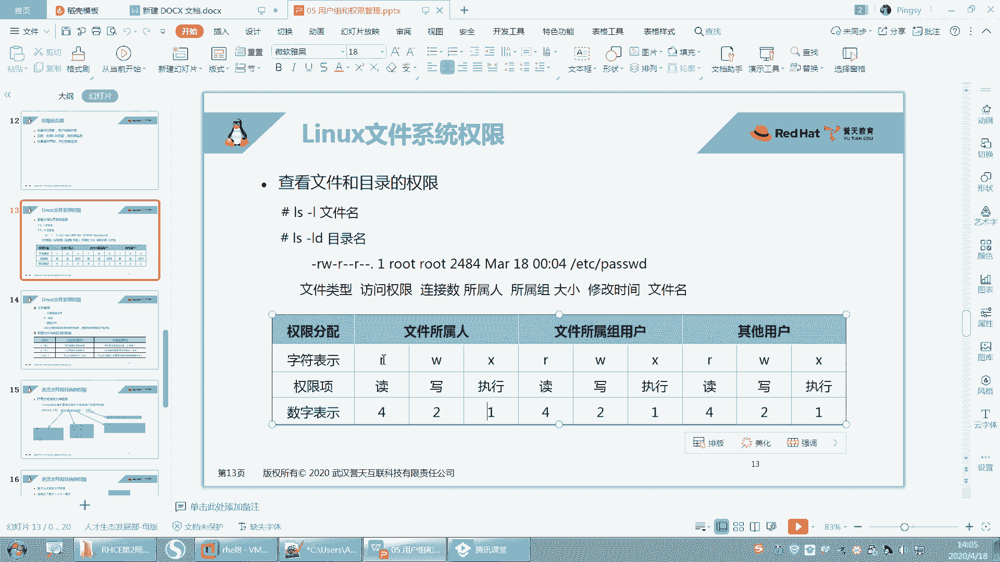
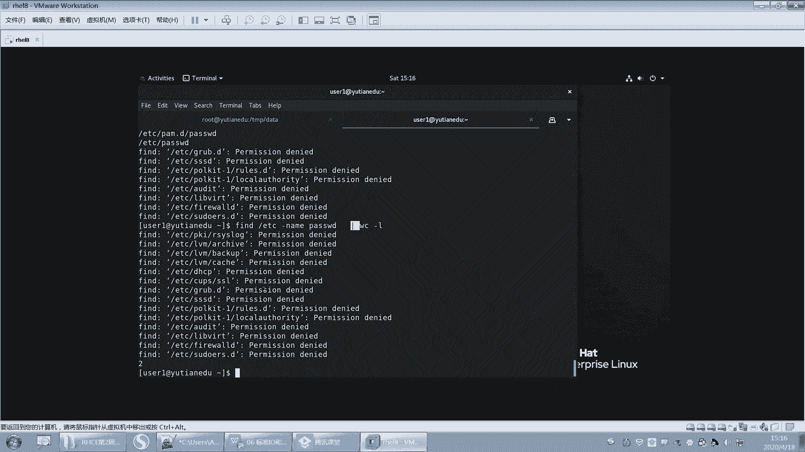
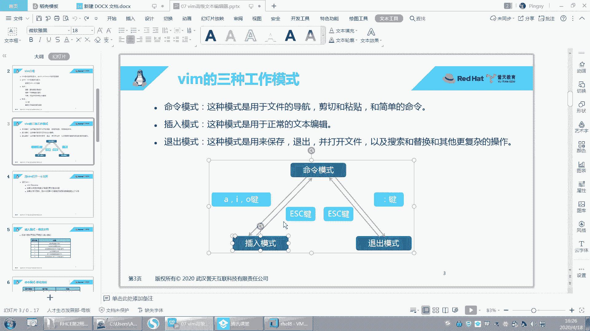
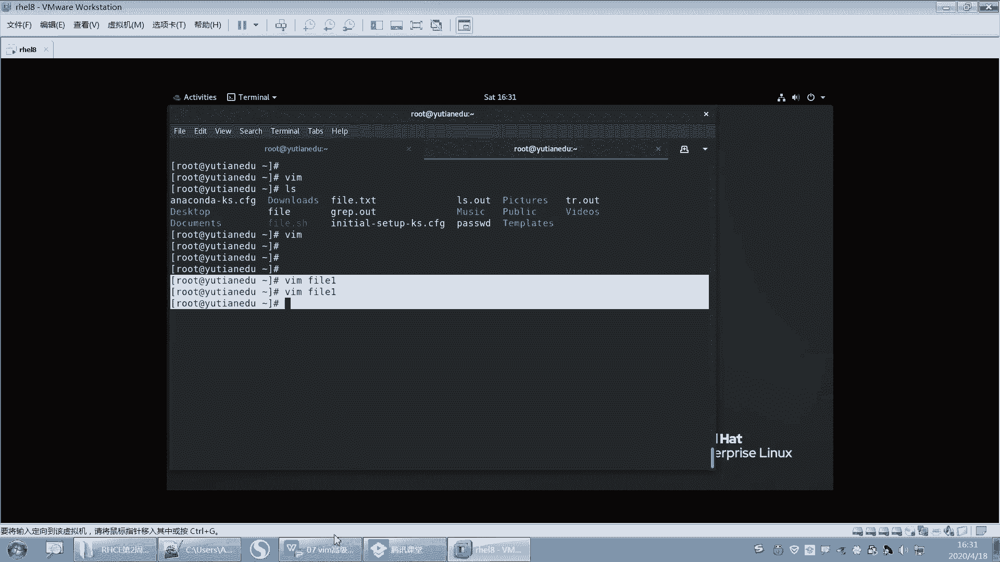
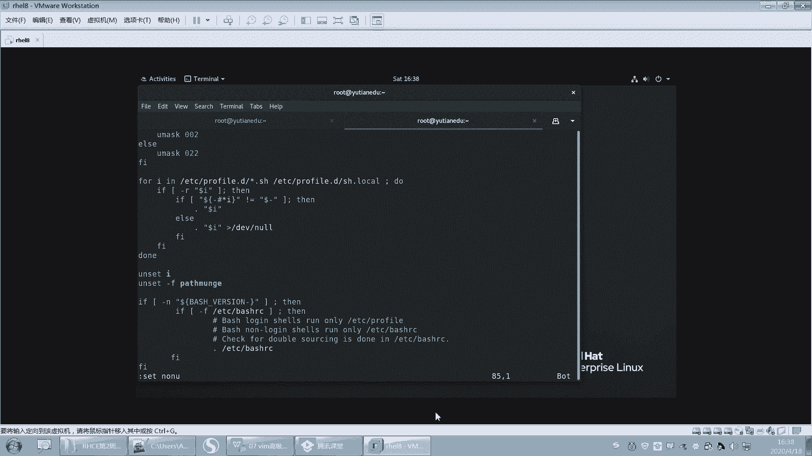
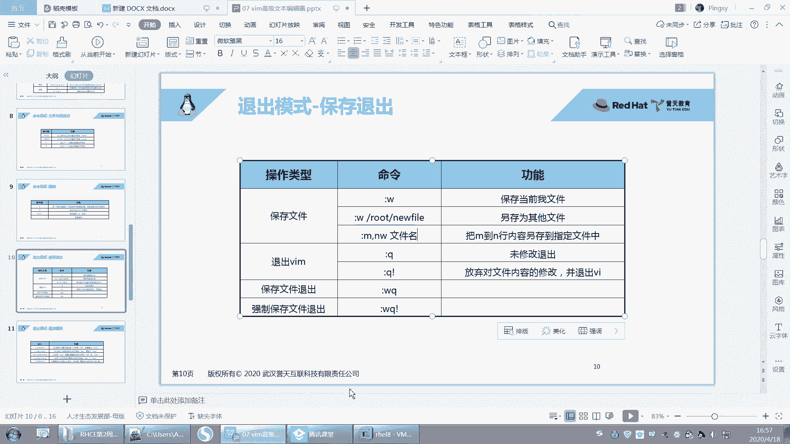

# 【誉天孙老师主讲】Linux入门／红帽认证／RHCE 8／RHEL 8.0／Linux基础视频 - P8：IO重定向管道和vim的高级使用1 - 誉天孙老师 - BV1Dr4y1A7jz

嗯。好，上课啊。嗯，今天上午我们把这个用户组还有权限部分讲完了，我们接着啊接着上午的来。呃，上我们讲到了这个文件的权限和目录的权限RWX和目录的RWX啊。好嗯，还而且还讲修改文件的。佣人和庸祖。

这个比较简单了。呃，用人和拥有组是吧？好，然后呃再来啊，接下来呢我们要去修改对应身份的这个权限了啊。呃，修改对应身份的权限呢就比较简单了。我们可以去用另外一个命令。叫change。

change mode change mode啊这个命令。呃，用于更改文件。对于某类用户的操作权限是吧？好，我们这个地方呢嗯你看啊。呃，我们用chanchange mode杠大R。

这个大R呢其实其实也是指递归的意思，就跟我们修改那个文件应用人应用组是一样的。然后后面是一个文件的这个呃权具体的权限是吧？然后再后面呢是这个对象，某个对象就是参数，就是我们文件。啊，这地方有三个单词。

那叫who what which对吧？啊，我们可以那我们不是要修改权限吗？但是你具体是不是要去修改哪一部分的权限？我们有三部分嘛，用人用组和其他人对吧？啊，三部分的权限。

所以我们用ho第一个表示给谁修改U代表用人哎，既代表组O代表其他人。你也可以用A代表所有人啊，对吧？啊，然后再就是什么？再就是what你要做什么呢？你要是增加权限呢，还是减少权限呢。

还是等于具体的某个权限呢？对不对？啊，那你是对应的是什么权限呢？是R啊，还是W啊，还是X啊，好吧，那我们来试一下啊。

呃。现在呢我们来看一下这个password啊，我们想让它的这个拥有人的位置要有呃或者是组应该组没有W权限是吧？我们想让组有W权限啊，那么就chan mode。GG代表组对吧？G代表组就是ho嘛，对吧？

然后你是加上对不对？加上某个权限，然后加上WW就是写权限，然后呃password。好，这个就比较简单了啊，或者是我们可以怎么样，我们也可以比如说拥有人和不或者是组合，其他人都去掉W权限。

那就是GO它可以组合减去Wpaword。哎，这样去去掉某个权限，OK吧。呃，还可以怎么样，还可以O等于，比如说O等于R杠X password。这样也可以用等于的方式啊。呃，这个不能这样写哦。

它它应该是等一啊R。X。哦，这样它不能写个杠啊，它杠好像设置不了，还要RX啊，就是没有写W，它就没有W权限，只有RX权限。好，你还可以这样，比如说应用人。呃，加上X权限逗号逗号中间逗号拥有组。

加上W权限，这样子写也可以。那它就一次性操作两个拥有人怎么怎么样，拥有组怎么怎么样，对吧？中间用逗号隔开啊。嗯，逗号隔开。啊，还可以这样呃，所有的全部去掉。对吧X权限，那就是A减Xpa。嗯，就是A嘛。

就代表呃UGO代表所有对吧？啊，减去X。啊，会了吗？就随意你你随意去组合啊，随意去组合。好，这个也比较简单啊。好。嗯。

呃，杠R就不说了吧，就递归啊递归修改针对目录的。呃，如果想要目录里面的文件也一并修改，那么就加杠R啊，杠R。好，然后我们再回来看一下啊，我们我们写这个权限里面。

我们用的是R呃RWX来表示这个字符来表示读写句形是吧？但是我们还可以用什么呀？用数字来表示，看到吗？用数字来表示4呢就是R选项。啊，二呢就是W一呢就是X权限啊，也就X权限。

所以我们可以用数字的方式来去给它这个设置权限啊。嗯。这个地方啊拥用人比如说你用用人有RWX权限，那么就将拥用人的三个权限加起来，就是4加2加1啊，就是7，对吧？那拥有人就是7，你你给拥用人7的权限。

那么拥用人就有读写执行的权限。

呃，我们可以给他所有的权限，它是777是吧？他是我的。那mod77，这个是用人的位置，拥组的位置，其他人的位置。嗯。然后又有人7的权限，那就是RWX对吧？还可以把它改成，比如说改成644。对吧。嗯。啊。

644，那就是呢就是这个这个。嗯，644，你这样去算嘛，对吧？或者改成755等等啊，这个你们自己去改好吧，比如755。Da塔。这个就是你小学数学。呃，过关了呃，基本上就能算出来啊，7以内的加减法啊。

你这个权限弄错了，你小学这个7以内的要重重新用手指头掰一下啊，要不然算不明白的啊。好。呃，这75对吧？75所以一般情况下，你看嗯我们来举个例子啊，我们今天上午不是讲了那个。讲了什么讲这个权限部分，对吧？

讲这个呃不是讲权限，讲用户跟主部分。然后呢，我们当时是怎么样啊？嗯，看一下，我们当时有一个用户叫user一。然后这个用户呢，他加目录是home下面的user一。对不对？

然后我们说切到这个home下面的U呃，切到 userer一的时候，就会进入到这个home下面的 userer移，对不对？那这个目录存不存在呢？我们看一下啊。这个目录是不是存在的？但是这个目录怎么样啊？

我们进去的时候被拒绝了。你看啊。我切到U则一的时候被拒绝了，你看它的权限是多少啊，我们可以用数字来表示的话，那就是700，对不对？700啊。那么我如果用U则一的身份来进入到这个目录的话，那。

我需要对这个目录有什么权限才能进来。OK快回快速的回答我啊。我需要对这个目录需要有什么权限才能进到这个目录里面来呢？😡，就是SUuser一这样进去，对吧？我是不报错，我需要有什么权限呢？

对我需要有X权限。对我需要有X群才可以进来。但是。我们用户腰者一。对，这个目录是什么权限呀？没有任何权限，看到没有？因为它是其他人的权限，怎么看？哎，user一是什么？userE是2003。

它的拥用人是2003。对吧。他既不是他的佣人，也不是他的拥有组，那就是其他人嘛。其他人什么权限呢？没有任何权限。所以啊为什么你不能进入到别人的加目录？是因为你对别人的加目录是没有权限的。

我们所有加目录默认权限都是700的。😡，所有嗯用户的加目录权限默认都是700OK吧，这就是他没有进入的权限啊。好。

呃，这个。应该也没什么问题吧，这个也不难啊也不难。好，这是权限部分的修改啊，权限部分修改。

好，那我再给大家出一道题啊。什么root都没有什么root没有。😡，你就要你你说这没有root是吧，是这意思吧？😡，你说root对其他用户没有权限是吧？入的你挡得住吗？啊，我就问你入的能不能入啊？

OK好，我就想说啥的，被你给打断了。嗯嗯。嗯。好，来这样啊。啊，你看这儿啊，我现在如果我这样去改啊，比如说改成我们不是呃比如说改成666呃，这样是不是改666，那么拥有人拥有组，其他人是不是都是66。

对吧？好，那如果。我有些时候少写了一个6，就写个66。嗯，写个66啊，然后我这样修改了，看是不是也成功了呀，对吧？好，大家来猜一下，用三位数字来告诉我，请问password现在权限是多少？

pass这个文件的权限现在是多少？我现在你可以猜啊，对你可以随便猜。呃，有时是66660660是吧？好，还有没有其他意见？可以猜嘛，随便。没有其他意见了。哦，有些是066是吧？😊，还有吗？

好像也没有什么。就要么就是066，要么就是660是吧？啊，一比1平哦哦这边还有一个啊006。2比3是吧，还606哦，这就出来第三个是吧，1比2比3好。😊，Okay。这个地方啊。哪个对了呢？066对。

是066啊。还有664的哦，664是考虑到这个地方是吧？啊，所以啊如果你少写了一位，那么它是在前面自动补0，也就是说它是066OK吧。在前面自动补零啊前面自动补零。OK吧。好，没问题。

那你那你要写一个6，那是不是006对吧？006就这样子啊。好吧。啊，那为什么会这样呢？其实啊我们的权限是由四位组成的，四位数字应该说比如说啊呃7777对吧？假如说啊它是应该由四位组成的那我平时写的时候。

我是不是写的777啊？我其实第一位并没有写，对吧？因为第一位我们后面会学到有一位权限，特殊的权限在第一位上面，所以第一位没有写，默认就补0。也就是说它是这样的0777O吧？所以我们每次设置权限的时候啊。

自动将第一位怎么样啊，你写了三位，666，其实前面是带了一个0的，但是它不会在后面补零，注意啊，它不是66。60不是这样，ok吧？在前面补灵啊，在前面补灵。好，我写两位的话，那前面就是00对吧？

0066对，0066啊。好啊，那我们现在只学了三位吧，只学了三位，对吧？第一位就是呃其实就后面三位嘛，然后这一位就拥人就拥组。啊，这这这是拥拥有组，这个是其他人，对吧？最后一位是其他人啊，记好啊。好。

第一位我们后面选好吧，嗯，O这个就是这个权限啊。如果你们后面少写了，对吧？你应该知道啊，它是前面不灵啊，前面不灵。

嗯。好了，那我们权限这部分大概就嗯。大概就到这儿了啊。然后那这两种方式就是说你数字的方式跟这个呃嗯跟这个用字符来表示RWX和这个数字来表示两哪种方法，对吧？更方便一些？

其实如果说啊你说我就知道这个文件的权限，我就想给它改成644，那么就是644，这样的话是不是方便一些，对不对？

啊，你知道这个文件的具体权限了，你就方便一些呃，全部的权限啊，644。但是如果说我只想把这个文件的优组加上一个W权限，那如果你还用数字的方式去。去算的话，对吧？呃，7月内的加减法我如果算错了。😡。

那么这个时候你的权限你还要反正就是多一步嘛，你还算。😡，所以。这两种方法不是说哪个就数字就简单，它也不一定啊，就是看情况。对不对？看情况，那这样的话就G加W就完成了嘛，那其他的权限是不要需求改了。

我只是说如果将它的拥有人去掉X权限，那如果你还要算的话，那就就太麻烦了。OK吗？听懂了吗？就这两种方式啊。😡，自己看情况用哪一种，不要说我习惯用数字，我就经常去用数字。因为数字的方法。

你还要把三位都写全，每一位是不是都要算出来，你少写了一位。他并不代表说默认这一位不修改，而是默认天0没有权限。OK吧，默人天里没有权限啊，所以。两种方法都有自己各自的优势啊，你。

随便就是说你觉得哪种方法呃，就是这个方便就用哪一种啊，不容易出错。就哪一种。我们最终在lininux里面啊，我们要求你可以达到你的目的，以任何方式去达到，呃，但是越简便越好。

也就是说我可以通过一步就能完成，对吧？那我干嘛要去弄两步，因为你的步骤步骤越多算的越多。你最后出错的可能性越大，而且我不要求你是怎么去完成的，只要你完成就可以。

好吧嗯。OK那我们这张就讲完了啊，嗯权限我们这我们这张我们再来回顾一下啊，这张都讲了什么？😊，嗯。

回顾一下啊，花个几分钟时间回顾一下。我们今天讲了两个文件，一个文件是password的文件。对吧然后这个文件里面每一行代表一个用户。呃，每那每一个用户呢，每一个栏位是指什么含义？我们也讲了，对吧？啊。

然后用户名这个X我们现在还没有测出来是什么含义啊，这个还要下去研究一下这个X位。啊，UIDGID对吧？描述位加目录，还有登录sha登录share啊。那么这么说这个里面每一个栏位其实我可以去手动去修改它。

比如说啊我一天布置个题目，我说你要把这个文件的。加目路修改成。呃，user下面的home下面，user下面的user44，对吧？那你这样修改行不行啊？你这样修改不行？听到没有？你如果修改了这个地方。

那么相对应的在home下面，你是不是要创建一个文件叫user44，创建一个目录叫us则44，并且us则44这个文件的拥有人拥有组是不是都要是us则4，而且它权限是不是要是700，所以你看是不是很麻烦。

对不对？所以这个地方你干怎么样，你最好你如果不嫌麻烦，而且你比较清楚的话，你在这里修改，你你不要给在这里修改完之后，其他地方就不要就那个真正的home下面加目录就不动了，那不行啊，那就前后不一致了。😡。

OK吧，所以如果你要修改某一个位置，最好用什么用命令行去修改。最好用命令行去修改，对吧？但是命令行user mode，你也要去找对应的这个选项和参数啊，然后让它修改成功，OK吧。好，然后又学了一个文件。

叫group。这个文件是组的信息，呃，每行是一个组，啊，组名X位对吧？然后还有这个GID后面是它的成员，唉，是他的成员啊，那么user4就是这个group一的一个成员。

group一就是user4的什么附加组啊，这边注意啊，在这个里面我们只可能看到用户和附成员跟附加组之间的关系。主组的信息不会在password里面看到啊，不会在group里面看到说错了啊。

就是私有组和组组的信息只会在password里面看到，而在group里面是看不到的。group里面只能看什么，只能看附加组和成员的信息啊。也就是说你看我user一对应的这个这个这个是谁的私有组啊。

我怎么知道我不知道对吧？从这里看不出来啊，从哪里看呢？从我们这个password里面去看啊，password，而且pasword里面那个栏位，这个地方是不是就是私有组对不对？私有组哦，不是就这里啊。

写错了，这里是私有组啊，然后你再去到group里面找对应的2000那个那个组名是谁，找对应的那个组名是谁啊。好，这是两个文件对吧？两个文件。然后我们还学习了一些命令，比如说创建用户的命令。

修改用户的命令，对吧？他们两个的参数基本上都差不多的啊呃，但是你也不要想，当然说。感觉哦这个对吧？然后这个所有的参数都是一样的，而且还有同学这样感觉啊，之前这个是之前做做作业的时候出现的一些错误。呃。

我我让他怎么样呢？创建个用户，并且给这个给这个用户修改密码，然后修改密码的命令，我们之前是不是学过叫pass word user一这样去修改，对不对？这是我们之前学的命令。然后后来呢呃他呢很聪明。

然后在man里面呢找到了一个找到了一个这个这个。😊，找到了一个选项，哇，他老高兴了是吧？他说能不能在创建用户的时候，把命密把这个密码一并给指定了呢？好，他找到了一个参数啊，找到一个选项叫什么呢？叫P。

看到没有？什么叫P呀，哎哇password呀。😊，看到没有？我说那这不就简单了吗？对吧？来us add就这样杠P啊，user mode里面好像也有这个杠P好，然后rehead嗯us。呃，11呃10好吧。

好，哇，你说还要password干嘛呀，对吧？还修改密码干嘛，这样一步印不就完成了吗？结果他就不管了，对吧？密码设置完之后好，我开始切到切到user10啊。好，其到U的时，我输入readhead密码。

我没输错啊，我可以再输一次嗯，登不上去，不可能登上去的，注意啊，不可能登上去的。😡，因为你只看到了第一句话。呃，你只看到了第一句话叫password是加密的密码。能理解吗？它是加密的密码。好。

但是下面有句话呢，note注意哦，他说这个选项不推荐。因为如果这个密码用在的呃这个这个呃会会什么这个这个密码会怎么样啊，会被呃visible就可见的是吧？被用户看到。怎么怎么样，他说你应该什么呃。

保证这个密码尊重什么它的密码策略是吧？其实说白了啊，它其实是这个地方，你设置的是这里。因为我们的密码rehead，按理来说，在系统当中存在，它肯定不是以reha这个字符串存在的。

它是一段乱码呃加密的字符串存在的。那么其实你指定的是这个地方。看到了吗？那人家的有密码的都是这一串，而你呢是这一串。对你是这一串，人家是这一串。对不对？我同样都是rehead。

所以你说这个对应的是哪个密码，我不知道，所以这个不是设置密码的啊，注意啊。其实你用了这个。密码rehead的话呃，基本上你是没有办法登录这个系统的，user时是登不进来的啊。好，然后再来啊呃我们还选。

哎，刚刚学哦user关于用户的对吧？user modeus add。好，还有关于组的group。group add group mode哎，group mode没有讲，对不对？

group mode没有讲。😡，呃，你自己去做好吧，自己去修改，我就不讲了，因为不能把所有的名都讲完了啊。啊，还有什么哦，删除用户用。user dialll对吧？删除用户user dialll。

然后删除用户的时候要注意加目录要不要加杠R，删除目录，删除邮箱，对吧？啊，然后删除组呢用group there，删除组的时候，什么组才能被删掉，对吧？啊，如果这个组是别人的私有组就删不掉啊。

如果这个组里面有成员，那可以删掉，对吧？好，还有还有group members。啊，管理组内成员的等等啊，这一系列的对吧？如果你还想知道他还有跟哪一些命令有关啊，对吧？跟这个这个用户组相关的命令怎么办？

去man一下us add翻到最下面看这里。是不是有一些跟它相关的一些。命令啊。看到没有？你看group a谁能创建组啊，它是不是8呀？第八个章节这个这个地方是不是八是不是指第八个章节。

是不是只有一般情况下只有ro的才可以执行，对吧？呃，group de也是8嘛，group mode8，然后对对对对8。嗯那user mode，user dial，对吧？啊，这就是跟它相关的一些命令啊。

基本上就在这里。啊，你去man嘛，mmo相关的的都在这是吧？啊，都差不多的，因为它都是都是跟用户跟组相关的啊。好了吧嗯。OK那我们这个就到这儿了啊，权限部分。

权限部分就到这了啊。密码我们后面后面我还会再讲那个权限的时候，再给大家讲密码，讲密码，好吧。嗯。

最终。等一下吧。嗯。

好，我们学下一章啊。

好，呃，我们下一章内容呢是关于这个IO和管道的啊，就是呃之前有同学听过的什么重定向啊呃，管道啊，IO啊，对吧？这个就慢慢慢慢的接触到一些高级的这个操作部分了啊。啊，呃。

这张我们需要了解什么是IO什么是IO，然后以及IO从定向到文件，对吧？从定向，还有管道连接服啊，管道连接服。好。呃，IO的话大家应该也不陌生啊，不陌应该不陌生，对吧？IO嘛I。呃，O对吧？你这样写啊。

然后它是指这个输入和输出啊。哦，IO呃是指输入和输出啊输入和输出。好，那么我们的IO呢呃分有几种类型的IO啊，几种类型的IO。呃，这样我先给大家演示啊。

比如说我现在执行了一个命令。我执行了一个命令啊，那么这个命令呢是在我我在键盘里面是不是输入了LS。那这个键盘是不是可以作为一个输入设备？对不对？键盘其实可以做一个输入设备，然后我一回车就执行了。

执行完之后它就会有输出。那么这个输出就显示在我当前终端上了，呃，默认就是我们的屏幕嘛，显示出来对吧？显示在我们终端上给我们看到，那这个呢就是输出，对吧？这个就是输出啊啊，我在这敲这些敲。

其实这也是算是输入，对吧？也算是输入啊。好，那就是输出了。其实呃我们输入输出都是相对而言的啊，都是相对。我在这个呢给这个提示符里面输入，对吧？还在提示符这边这边呃终端上给我输出，其实包括磁盘呃。

还是还是文件啊，都有输入输出，对磁盘有写磁盘，对吧？读磁盘，对吧？这有输入输出，所以处处都是输入，都是输出啊。好，那么我们这个地方其实就相对于在这个地方呃在个在这个命令呃输出到终端。这个地方相对而言啊。

我们讲的是这个IO对，这个输入和输入输出啊。

好，那我们输入输出包括几种。啊，包括几种啊，第一个叫标准输入。你看啊这个输入这个输入呢一般是从键盘上输入，对吧？那我在敲键盘，敲键盘，键盘就有个输入设备。其实我们的鼠标也是一种输入设备。

比如说我鼠标在点还是点对吧？这是不是也是一种输入设备？对不对？啊，我也可以用键盘来替代。啊，还有就输出嘛，输出呢就是我刚刚给大家演示的那个输出啊，默认是我们的显示器，就是屏幕嘛，终端嘛。

这种类似终端屏幕啊啊这种是输出。当然输出的话，它有两种输出有两种啊，一种是正确的输出，一种是错误的输出。那什么是错误的输出，待会儿我给大家演示啊。所以我们输入输出一般有三种呃。

就是呃这个这个输入输出和错误输出啊，错误输出。好，那么大家可以看到这几个单词啊呃一个叫STDL这几个单词要认识啊，因为你看到这几个单词的时候，你应该知道呃。

它代表是输入对STD呢代表standard就是标准的EIN叫input叫输入啊，这个叫standard output对吧？啊，标准输出啊，standard的标准错误输出这个叫arrowarrow啊。

要认识啊，要认识。

呃，比如说你看我给大家看一个我们password啊。呃，在password当中。在pas当中有一个嗯。有一个选项叫杠杠。哎哎哎。嗯，看在哪里。哦，有个选项在这在这里呢叫杠杠 thing是吧？

这个选项是不是就是标准输入，对吧？有标准输入啊，这个我们后面会学到呃，他说这个读密码的时候，读新的密码，对吧？然后从标准输入，看到没有？从标准输入里面啊，这个标准输入可以是一个pile。

就是我们管道就是我们后面要学到一个管道的管道符啊，管道符好，所以这些单词要认识啊，在有一些地方它会以这个单词缩写显示出来啊，显示出来。

好，那么我们再给这个呃这个这个。呃，标准输入输出输呃，这个Qll输出的时候，它有一个标识符务，就是一个描述服务。呃，一般错正确的就是输入的话，我们用零表示输出用一输错误输出用用2是吧，这是什么意思呢？

待会儿我我给大家演示一下啊。好，你看你看下面有张图。你看下面有一张图啊。呃，我觉得这张图还是蛮清楚的。你看这边这是键盘。对吧然后这个键盘输入的东西，它这样标是否有个零，所以输入一般都是0。那这边输入。

然后作为这个输入作为一个进程来执行对吧？来执行啊，执行了一个进程。然后呢输出的话呢呃一呢就是这个正确的输出，然后输出到屏幕。那错误的输出可能也输出到屏幕，对吧？那就是2这样出来。

当然还有很多其他的标识符这个文件描述符，比如3456是吧。那这个就是我们可能要写入文件读入文件等等，用的一些其他的标识符。但是我们先掌握前面三个就可以了啊，就012。好。

估计还是有同学不知道我们在说什么啊，好，下面我们来开始演示啊。

嗯。找个找个什么例找个例子啊给大家。

嗯。好，这样啊现在呢呃我执行了一个命令，对吧？这个命令有输出，对吧？有输出。好，那这个输出呢我们一次性就看完了，对吧？我们想把它保存下来，因为我们默认输出是不是输出到当当前终端。

当前当前屏幕对吧？当前屏幕，但是我把它这个输出给怎么样保存在一个文件里面。这个时候我们就需要用到一个东西叫重定向。

哎，叫重定向，就是说现在我我输出本来是什么？本来是这个屏幕。但是我想把这个输出怎么样，把它改变一下输出的方输出到输出的地方。呢，比如说输出我们想把这个输出怎么样，改改成一个文件那哎变成输出到文件啊。

所以我们用一个重定向符号LS重定向符号叫大于号，重定向符号叫大于号啊，然后输出到文件。比如说LS out。

啊，后面接了一个文件，这个文件事线不存在，然后回撤。好，当前终端就不会有任何输出了，当前终端不会有任何输出。那输出去哪里呢？去到这个LS点out这个文件里面了啊啊输出的这个叫重定向，叫输出重定向。

叫重定向啊。好，打开这个LS。点2次。那这就是什么啊？这就是我LS点out的结果。L点out的结果啊。好，这个OK吧。嗯。好，这个文件事件不存在，他是不是先帮我去创建这个文件？😡。

然后再去把这个结果输出到这个文件里面。对，所以文件可以不存在。好，那现在如果我想去。呃，这样啊，我再把这个结果怎么样呢嗯。我再再执行一遍，那么这个文件是不是就已经存在了？那按理来说。

在这个文件里面已经有一遍输出的结果，那我再输出一次，是不是应该有两次输出结果？好，那我们来看一下它会不会有两次啊。在这个里面依然还是只有一次，那是不是只有一次啊，一次输出对吧？所以。这个输出。

它会将这个文件如果这个文件存在，你们可以记一下啊，输出重定向大于号，输出重定向大于号。如果这个文件是空呃，这个这个文件不存在，那么就将这个文件创建出来，并把输出重定向的文件里面，对吧？这是第一种情况。

第二种情况是。如果这个文件存在。那么就将这个文件的内容，以前内容全部覆盖嗯，全部覆盖OK吧，这是不是就很危险？对吧就很危险啊。好。呃，之前有同学问我说老师那怎么清历史记录，对吧？是这样吧。嗯。

我们的历史记录在一个文件里面叫点bush historyory，看到没有？那。点bush historyory，然后点bush。呃， historytory。是这样吧，那这是我之前执行过的一些命令。

都在这个里面，对不对？啊，所以你看我我如果执行一个嗯，好，在这个我们再学一个命令啊，叫E口。嗯，叫eco啊，eco就是呃ecohello就显示hello，就是eco就是将后面的内容。呃。

输出到当前终端对吧？那eal什么就显示什么。好，那么我可以eco。我想怎么样啊？我想清空这个历史记录，那么我是不是要进去，然后一行一行的这样去把它删掉啊，对吧？所以那你如果这个文件很大，一个G。

你删的话就很麻烦，所以一招搞定一口。hello是吧。然后到点bsh historyistory。好，那么这样的话，我是不是先将这个文件以前内容全部清空，然后将这个什么hello写到这个里面。好。

我想清空，不想写hello也可以，所以你可以怎么样，前面什么都不讲。一口空。因为一颗空就显示空，那一颗空就显示空什么呢？就显示个空，看到没有？

所以你一颗空到什么到这个点bush historyistory回车唉。加一个重定项啊。啊，然后你再打开这个文件，这个文件是不是就空了，你看就把历史记录全部清略，全部清掉了，把历史记录呢全部清掉了，对吧？

你怕别人看到清，无论这个文件有多大，你就可以将这个文件无论它有多大，一并全部清空。对，一并全部清空啊。好，你觉得这个。这个这个穷定量符号太厉害了，对吧？呃，正是因为它很厉害，所以它的杀伤力也是很大的。

能理解吗？😡，你想一下啊，如果这个文件是一个很重要的文件。你执行了什么，不小心执行了重定向符号，那么你就将会将这个文件之前的内容全部覆盖掉。这个是呃这个有一个事也也也有一个事情也反正也发生过吧。

但是可能损失不是很大。呃，是因为之前有一个同学他他是他在我上我的班，然后他说老师这个秘密特别危险啊，我有一次就差点吃吃了他的亏，对吧？呃，因为他误操作了，有一次其实我有时候上课的时候啊。

不小心敲的时候也可能误操作啊，不小心我本来是要重定向这个文件了把它清空了，结果一下子不小心敲另外一个文件了，然后把那个文件一下子全部清空了。完了就这个时候你就你就要哭了是吧？如果这个文件有备份。

OK你可以恢复。如果这个文件没有备份，那么配置全部清空。对，没有回没有没没有没有任何备份，没有办法恢复。对，没有办法进行恢复啊，所以大家要一定要慎用这条命令，听到没有？啊。

它只是在特定你要清空这个文件的时候才会用。如果不是要清空这个文件，那不要用重定向符号，听到了吗？不要用重定向符号啊。好，那么这个文件这个这个重定项符号很危险，对吧？好，那我能不能去保留之前的文件呢？

能不能保留之前的，对不对？哦，这个文件里面已经有什么有一些内容了，我想去保留之前的不要去覆盖，所以我就加一个什么。这样子。L点out。啊，LS然后将输入结果叫加两个大于号，两个大于号。

然后接上这个文件名回车，这样的话就叫什么叫追加，叫追加啊。你看这是不是有两遍记录，那之前内容就会被保留，之前内容就会被保留啊，好吧。好了，这个叫输出重定向。嗯，这个叫追加符号，两个大于号是追加符号啊。

呃，那这这这这个跟这个是吧，这个跟这个啊。

OK吧。好了，那下面再来啊。大家下午的精神是不是有点不太好？我这边讲的老嗨了，不知道你们那边听的嗨不嗨。嗯。好。嗯。因为我看不到大家这个这个这个这个状态啊。呃，大家这个。远程同学对吧？然后坐好。

然后抬头挺胸对吧？然后坐直嗯，然后这个最好拿电脑，不要拿手机啊，手机这个太小了。然后还要。嗯，手机太小，然后也不要躺在床上。要做起来啊。对你你就就写日就写笔记，就把我讲的，你就写下来。呃。

这样的话你就其实不太容易犯困的。如果你不写呃，你就容易犯困，而且容易睡着。对，就很好啊，就要写笔记啊。O。好呃，我们这样吧，我学我们学习一个命令啊。嗯。userll杠啊，把这个user仪给删了。😔。

删了啊。习惯性用U着E来测。好，你看删的时候，你看你看啊我正好给大家看一下啊，呃，删的时候是不是很明显？😊，us杠R删这个用户的时候好，他想去删谁，他想去删。你看删除这个邮箱。

但是这个这个这个邮箱文件是我们上午做测试的时候，这个邮箱是之前用留下来了，所以他不是us的，所以他删的时候是以的身份来删的对吧？所以删不掉好，然后第二又删加木录删加木录也删不掉。因为加木录是谁呀？

加目录是这个之前的那个1001的是吧？所以都删不掉。那怎么办？手动把它删掉。啊，手动把它删掉啊，然后RM杠RF3啊wa bowl。没有。呃，一有这一。OK这样就OK了，手动把它删掉啊。好。

如果其实删掉的话，就不会报错了，他就不会报那样的错了。好，现在我们切到user一啊，切到user一，我们学一个命令叫fd啊，叫fd。呃，fd的这个命令还没有学。后面我们单会单独会讲啊。

我现在先简单的看一下。😊，犯案的这条命令这句话啊看好啊呃。呃，这句话的意思是指f是查找文件，查找文件啊，然后ETC呢是查找哪呃查找哪个目录下面的文件。呃，查找ETC目录下面的文件。

那我在查找的时候是以什么？方式去查找，查找的是是以名字来查的。杠 name ofpasword就是这个文件的文件名叫password。好，当然我们也可以根据大小来查，根据什么其他的权限来查啊。好。

这个一个杠。呃，其实我们之前刚学过是吧，一个杠代表的是短选项，但是这个是个单词作为选项，我反而用了一个杠啊，因为这条命令呃很早就有了，在unix那时候就已经用了。呃，所以当时的命令呢。

它有很多古老的命令啊，它没有严格的遵循这个短选项长选项。所以你在后面会碰到有一些命令，它没有严格的用杠杠加长长一个单词作为选项。所以要注意啊，包括我们后面要学PS，其实它它不加杠，它也能它也能执行。嗯。

就不加杠，它也是选项。所以这个就只要碰到特殊对叫特殊对待啊。好，那现在呢我们去查找ETC下面名字叫password的文件名。好，那这条命令呢，如果作为一个root用户来执行，我们来看一下。

是不是可以查到两个结果，一个文件是他一个文件是他。但是作为一个普通用户来查，我回车就会怎么样报错。那查到这两个这是不是就报错了呀，对不对？报了一些权限拒绝啊。好。

那么现在呢我想把这个结果给重定向到一个文件里面，那我就怎么样大于号f。翻点 out。好，那么你看啊，我重定向之后，当前终端按理来说应该不会有任何输出了。但是是不是还有输出？对吧还会有一些输出。

那这个文件里面。什么东西写进来了呢？两条正确的结果写进来了。两条正确的结果写进来了。呃，错误的结果像这种报错的结果没有写进来。所以这条命令。这个大于号指的是将正确的输出重定向。

而错误的输出依旧保留在当前终端显示出来。对，依旧保留在当前终端显示出来。好。那这个时候如果我们的需求是。我只想看正确的结果，错误的结果不想看，那我是不是要把错误的结果给重定向了。

然后把正确的结果输出到终端。😡，对吧这是我我想达到达到的这个目的啊。好，只看正确的结果，不要看错误的，把错误的给重定向到文件里面。好，哎，我们之前讲的是。正确的我们用几来表示啊，正确的用用用一来表示。

对吧？那个stand out啊，错误的用二来表示，对吧？那刚刚你怎么没有用一啊，其实在我这个地方我用应该是个有个一的，但是我们没有用一，因为默认就是一。

能理解吧？默认这个地方就是一啊，一就是正确的，一就是正确的啊。好，所以如果我想让二，也就是错误的输出重定项，那么我就再这样哎，就加个二大于号，二大于号回车。啊，那么正确的就会输出到当前终端。

错误的呢就会重定向到fd error这个文件里面啊，fd error这个文件里面我们可以打开看一下啊。看到没有？这就是错误的，对不对？好，那么我们按照上午来说的，为什么会报错呀？怎么就报错了。

怎么我就没有权限。😡，去因为这个命令它是去到这个目录下面去查。😡，但是怎么就报错了呢？大家猜一下是什么原因导致报错了呀。啊。这个我们应该应该可以猜到的啊嗯。好，有同学说进不去目录是吧？看到没有？对。

没有X权限。而且。你光有唉呃这个这个X权限还不够，还得要R权限吧，你是不是得能看到啊？对不对？所以你光有R权，你进不去，这是一个方面，对吧？你光有这个这个这个呃呃X权限看不到也不行。

所以你对它没有什么RWRX权限，对，没有RX权限啊。好，很好，很棒啊。O。呃，所以就报错了。对，所以就报错了啊，就这是报错了原因对吧？报错了原因啊。好，那么这个就叫错误的输出重定向。唉。

我们的输出正确的呢就标识为一，对吧？错误的就标识为2。那么写个二大于号呢，就是把错误的重定向到文件里面啊，错误的重定向到这个文件里面啊。好，同理可得，如果我再执行一遍。

那么在这个文件里面同样的它只有几遍记录呢，只有一遍。所以这个命令这个二大于号，只要是大于号它都是会覆盖之前的内容它都会覆盖之前的内容，所以其实错误的输出的话，这个看情况好吧，看你需不需要把它保留啊。

它需不需要把它保留啊。啊，那么如果你想追加，那你就二怎么样啊，你跟他学嘛，大于号大于号和车这是不是就是追加了。那这就追加，就两遍记录，对吧？就两遍记录叫追加啊。好。嗯，我们再来啊。

我想把正确的输出到一个文件，把错误的输出到另外一个文件。那我就可以这样做fd ETC杠 name。他是我的。好，正确的呢就是大于号，对吧？然后叫find out。好。

错误的呢就是二大于号叫finarrow。好，那这样的话，正确的输出到这个文件，错误的输出到这个文件。那当前终端就不会有任何输出了，因为正确的错误都全都输出了呀，当前终端就不会有任何输出了啊。好。呃。

那如果我想我什么都不想看。😡，我只想去。我不想看结果，不管错误的还是正确的，我都不想看，对吧？我就把它保存到一个文件里面，那你可以这样。😡，全部输出。全部输出啊，就是and。大于号。and是这个单词。

and大于号叫find all。啊，这个叫全部输出，不管你是正确的还是错误的。全部输出到这个文件里面，那正确的错误全部在里面啊，这个叫end end啊。同理你再执行一遍，怎么样会覆盖之前的内容。

会覆盖之前的内容啊。然后你要怎么样啊，你要呃这个叫追加，哎，这个叫追加啊，这个叫追加。好吧，三个以此类推啊以此类推都是这样子的。嗯。OK吧。

好，我们来看一下啊。啊，12我们都学了是吧，1二都学了，我们输入后面再学啊。呃，那这个是重定向输出重定向对吧？这个是错误的输出重定向啊。然后这个呃好，这里有几个例子啊，这个这个是不是讲过了。

这个啊看下面这个啊，这个是刚刚讲过了吧，这个是and大于号，大于号加文件是重定向错呃正确的和错误的到一个文件里面。呃，它也等同于。哦，等同于这个东西是吧？所以我们还要看这个东西是是个什么东西啊。呃。

就是一个我看后面有没有写啊。我还没写好，我来解释一下啊。

嗯，你你有时候会看到有一个符号叫这个。呃，叫。叫什么呢？叫。2大于号and。

一是2月号大1号按例1吧。

哦，是的啊。叫二大于号and一这个符号。啊，你看啊这个二大于号and一，它是指将错误的当正确的输出。OK再说一遍啊，你们拿笔记啊啊，我这个PPT好像没有做注释是吧？啊。

二大于号N一指的是将错误的输出重并呃，作为正确的输出，就是将错误的作为正确的输出。

我看我这张图，你看这里有一张图。等一下等一下等一下等一下，我点错了，好像。还能听到我声音吗？哎。我怎么点到摄像头去了。还好没有摄像头，咱们就开开开了。我这是怎么回去啊？哦，看不到了，我点退出了。

我不小心点到摄像头这里了。哦，在这里在这里。啊，我刚刚不小心点到这儿了哦，这哦，摄像头在这里是吧？我还得我之前还没注意哦。😊，这里是播放视频，这里是PPT也是PPT。好。还好没有摄像头，这面就露馅了。

mh。因因因为我的电脑没有摄像头。啊，等我的等我的电脑拿回来之后。嗯。到时候我再买个。哪个嗯把把那个化妆品拿回来之后化个妆啊，然后再咱们再来那个一下啊。😊，真的，我用的是台式机，因为我回来的时候。

连我电脑都没拿回来，然后导致我现在一直没有回武汉。我电脑还在武汉。然后我还是借着借着我们亲戚家的这个这个这个电脑再给大家上课。等咱们咱们这个我看好多老师都露脸了，是吧？关键你我露脸，你们没办法露脸呢。

我让你们看只看我，我看不到你们。😡，嗯。好，上课啊。呃，这样吧，到时候我们呃我们我们来一个。嗯，我们可以约一下啊，然后这个咱们结课的时候。结课的时候好吧。我们可以来讲啊，或者是。这个。V link。

V link。还有什么？还有这个。😊，还有一个什么？还有这个还有抖音是吧？哦，抖音旁你们也不能漏哦，那就是视频V link可以微 link可以。😊，我跟你说，好多好多人就说机摄像头。

但也没看到摄像头是谁，不是也没没没收到摄像头。😊，嗯，OK好，废话不说了啊，废话不说了。😊，好。呃，这个是这个是曾老师。对，这个是曾老师啊，你看这颜值杠杠的。嗯。颜值很高啊。好。呃。

这边啊这边看这儿啊看这儿。你们这这个发出来就看美女去了，不听我讲课了。看这儿啊。啊，你看啊这个这个这个二大于号N的一就是将这个什么错误的输出呢，唉从作为正确的输出，然后这个地方它就会从一这地方输出出来。

所以就就就会这作为这个正确的输出啊，输出到文件里面了。对，作为错误的叙据啊。我都被他被你们弄混搞。😔，等一下啊，我喝口水试喝口水啊。😊，嗯。🤧。啊，亲收回来收回来啊。😊，呃，上课上课上课啊。呃，呃。

看到看到时候吧，看到时候我这个嗯。这个。就结课的时候对吧？然后这个状态怎么样啊？如果状态还可以的话，咱们就来个视频，好吧，咱们也见一面啊，毕竟。呃，这个班上一个班应该是有之前有见过一面一面呃。

这个班好像一面都没见过是吧？是这样吧，一面都没见过，还是要见一面的啊。好，那你到时候你那你就别进来啊。好，那么这个是二大于号N的一啊，那么我们来看一下这个地方啊。因为网上有很多这个符号。

有同学搞不清楚它二大于号N一是什么意思。😡。

啊。fend，然后。ETC。一嗯。然后杠 name。这如花是你们云聚散老师啊。啊，password。OK然后我们如果从定向到find out是吧？啊，从新上翻到out啊。

那么这个时候我们只会正确的输出到这个find out里面。那如果说我们想把错误的也一并输出到这个find out里面呢，我们就加一个二大于号。and一。而且这个位置。

呃，位置不能就是说。你的位置不能反着放啊。就他要放在后面看到吗？就文件在这儿，你不能把二大于号按在一放前面好放前面也不行，放前面好像不是不可以的啊。😡。

你要注意啊，把二代于号2。一放后面然，这样的话，那么正确的就会输出到哎，就这个错误的就会输入到finend out里面。好，我们打开翻套的看一下。我怀疑你们来上课的就是。垂涎曾老师的颜值来上课的是吧？

嗯。好。

啊，同理这个地方也是一样的啊，就可以加这个这个呃这个这个大于号大于号，这个是大于号，对吧？一个是重定项，一个是追加，一个是覆盖，一个是追加啊。OK吧，这个这个没问题吧。这个没问题了吧。好吧。啊。

下面我们来看一下这个啊，下面还有这个这个是我之前我给大家写的一个例子，是我上课演示这个例子啊，这个大家就回去照着做一下就行了，好吧。ETC。好，下面我们再来讲一个设备文件啊，讲一个设备文件。

嗯。好，因为有些时候呀。呃，我们并不想。大家。呃，回来好吧，心回来，孙老师在给大家上课，大家就不要提其他老师了啊，要不然我会吃醋吃醋的呀。😊，嗯，你看还是小虎同学这个。有眼色是吧？😊，好。

要不然这下午就就就就就。嗯，就上不下去了，我上不下去了，已经。好。嗯，现在呢我们刚刚是把错误的输出给怎么样？给重定向到这个错误的输出重定向一个文件里面是吧？其实所有错误的话，我们没必要去保留下。

保留下来啊，就是直接丢了算了，对吧？丢了算了，也不想看到也不想看到。所以这个时候我们会把会去会会去这样写啊，然后finend ETC password。然后。下面呢我们要加一个这个二的。

因为错误的不想要嘛，是吧？错你正确的还是要输出，所以二大于号叫DVn。DV none啊，好看这里。f查找ETC下面名字叫password这个文件呃。

2代于号就是错误的重定向到一个文件里面叫DVn里面回去。好，那这样的话，我是不是只看到正确的错误的，我不想看对吧？错误的我是不想看的啊。好，那在这个地方呢呃这个DVn是什么？😡，它是一个稳件。

而且是在DV下面。看到了吗？这是不是在D一V下面有一个文件叫n啊？这个文件是一个什么类型的文件呢？它是一个C，它是一个字符文件，字符文件啊。呃，字符类型的文件。我们除了字符类型的文件，还有什么？

还有我们的不是DVSDA。这个文件它是一个快设备，叫B，是B开头的。这个文件是C开头的是吧？那么这个文件是我们的磁盘文件，叫DVSDA是我们的磁盘文件啊。那这是我们的什么？它是一个空设备。

这个设备大家可以把它当做是一个什么，当做是一个。可以接收任何的。输出的也就是说你们可以把任何的输出丢到这个设备里面，而且这个设备它不它不会去占空间，也就是说它不会占空间。😡，他就像一个。

对它就像一个黑洞一样，对吧？它也不是回收站，而且它不会保留下来。对它不会保留下来，它直接就。😡，你你把什么东西，只要是输出的东西都丢到这里。😡，嗯，它一并接收对，一并接收啊，okK吧。

叫DVn这个文件记好啊，它经常会在我们的这个脚本当中会用到。好，我举个例子啊，它为什么会用到这个这个脚脚本里面会用到啊？啊呃，假如说我现在我现在去拼一个东西，比如说拼一下3W点百度点com。很貔貅是吧？

好。哎呀。哦，拼不通是吧？嗯。好今这个网络有问题。哦。就被我。算了，他修改不了。算了，好吧，算了，不平他了。我看一下我的IP地址啊，怎么变成这个地址了？你给我修改。哦。等一下啊。好，先拼通了吧。

先拼通了啊，那你看。像拼拼3W点百度点com是不是拼铜了，对吧？好，那我想去判断一个主机，我去拼一个主机。呃，拼不拼得通，我们怎么去看，对不对？我们是不是看这个输出，看这里对吧？有没有这个这个TTL值。

还有这个time这个这个值是不是看到这里啊，对吧？啊，如果拼不通的话，比如说这样呃，就这个pin啊，随便拼一个啊。嗯，111点呃，那个172172。25点。254。100好吧，好，拼不通的话。

它可能就会显示什么主机不可达，或者是。😡，甚至是没有输出，而且卡来这个地方你说通啊还是不同了，对吧？有时候你是无法判断的。你看这个地方我们的判断哦，确实是同了，对吧？好。😡，其实在脚本当中。

如果你把这句话写到一个脚本当中，我们后面会学脚本。对，会学脚本啊，那么到底拼通了还是没拼通啊？我们其实根本不需要我们人为去判断，我们不需要去看什么，不需要去看这个内容，对吧？不需要看输出的结果。

那不看不看怎么办呢？不看就把它怎么样啊，给重进项目。它给丢了好，后面加一个呃and。DV now。就是说你把这个输出全部丢到第一位那里面，不要。而且你你在写脚本的时候好，拼的话，我们拼几个包呢。

我们拼两个包结束，好吧。啊，而且你放在脚本当中，你一看哇，你一执行脚本这个好多一堆输出，对吧？那你怎么样？你你这一堆输出我只不想看，不想看这一堆输出。因为这个你我我只想让这个脚本显示它该显示的东西。

对吧？我想让它显示什么就显示什么，所以不想看内容全部丢掉，全部丢掉，丢到第一位里面好，那到底拼没拼拼通呢，我又没办法去判断，对吧？所以这个时候我们后面脚脚本的时候哈，会讲到一个叫一个一个命令执行完之后。

它会有个退出码，会有一个退出码啊，怎么去看这个退出码呢？可以用eal dollar问号。😡，去查看叫一口多了问号，多了问号是指的上一条命令，上一条命令。他的。

执行的退出码就是每一条命令之后都会有个退出码。零呢多了问号指的是这条命令的退出码是多少？😡，显示是零显示是零，那么零代表是成功零代表是成功啊。好，拼一个失败的拼一个失败的。刚刚这个是拼失败了，对吧？

我们拼两个包结束啊。好，拼两个包结束。好，第一位呢好，他拼是他拼成功了还是失败了呢？对吧？我们啊这个拼两个包还不行。我给他一个超时时间，好吧。给一个超时时间，给个。超时间是大W吧。还有小W。

这个单位默认是什么来着？好，就结束了，看到没有？结束了啊，可能这个地方单位10秒钟啊，就结束了。好，那拼成功了没有呢？看一下一口多了问号。怎么样是不是非零啊，是不是一呀，对吧？那我将来可以写个if语句。

哎，写个判断语句，判断说它怎么样啊，它成功了还是失败了呀。哎，然后怎么样，然后再去判断这条命令呃，是是零啊还是非零啊，然后再去判断这条命令是指定成功了，还是失败了。所以这个这个dV none啊，要记住。

它后面会经常用到啊，会经常用到这DV none啊。啊，提前给大家讲了一点点这个内容，后面我会给大家仔细讲这个退出码，还有这个脚本怎么去写啊。

嗯，好啦，那就记住了，这个叫d倍n啊，好吧，第位n啊叫叫叫这个呃一个特殊的字符文件。好，这就我们输入输呃输出是吧，只讲输出吧，只讲了错误输出和正确输出，好，怎么去重定项，怎么重呃重定项符号，错误重定项。

正确重定项全部重定项。2大于号and一都记好了吧。好。再来啊呃，我们下面要学一下管道了。

对，下面要学习下管道了啊。嗯，这样子啊。嗯。我们之前还记得吗？我们之前学过一个叫data的命令，对吧？然后还学了1个CAL。我们当时讲说要两想让在一条在这一个命令行当中。呃，去执行两个命令。

我们中间是用分号来隔开的，用分号来隔开，对吧？那么就先执行第一个再执行第二个，对不对？那这是一种连接方式。我们之前讲的一种连接方式。那么。这两个命令之间呢是没有任何的逻辑关系。就是我们之前说的对吧？

那今天呢我们就要学一个学一个符号，这个符号呢就是用来连接两个命令的，而且这两个命令之间会有一定的怎么样啊？哎，关系对，会有一定关系。这个叫管道辅管道符啊。好，管道辅怎么用呢？

管道嘛英文单词叫pple。呃，英文单词叫pile啊，叫pile，就是就就是那个地下管道管道那个管道是吧？就是。排水的那个管道是吧，就就就那就那个嘛，对吧？就那个排ble啊，叫呃呃叫叫这个好。

那么我们可以用这样啊comd。你们可以写一下啊，comment一。哦，然后呢，管道。然后commond2。呃，然后管道commode3。啊，点点点，其实我可以怎么样，我可以加多个。

我可以一直这样去加下去。只要怎么样，只要你有还有东西可以加是吧？那这是什么意思呢？好，这个指的是啊command一执行的结果作为command2的输入。commond2执行的结果作为comm3的输入。

好，我举个例子啊。

嗯。我们刚刚不是。这样去查了吗？对吧？这样去查杠name，然后password。好，这样去查会有两个结果，会有两个结果啊。那么这个结果呢，我想统计一下它的行数，我们后面会学一个命令叫WC。呃。

不是上厕所，那WC啊叫what count。AL呢是指列出行有几行啊，回去。好，这地方就是2，看到没有？对，就是2。好，那么这个地方这个管道符起到一个什么作用？本来我是可以这样统计的，比如WC杠L。

比如说啊统计一下这个文件里面。哎，有多少行啊？哦，这个文件里面有多少行啊，有53行，对吧？那这个这句话的意思是。这个WC杠1。他所给这个命令输入的一些这个我这个内容是不是来自于password。

来自于文件，对吧？那文件的内容是不是给到这个WC杠L去处理。但是呢我们怎么样啊，在这个地方我们是将什么将第一个命令的执行结果，也就是这两行将这个内容作为什么WC杠L的输入，让它来处理，统计一下行数。对。

统计一下行数啊。好，那你其实我像我我我这样去，我是不是可以再继续WC杠L啊，这样是不是只有一啊？那它这个WC杠LL统计的是什么呢？统计的是不是这个地方的输出有几行，能理解吗？

那统计的这个地方的输出有几行，这个二是不是只有一行啊，所以最后是不是只有一，那你再加是不是可以一直加呀，那你再加没有什么意义的嘛？因为这个一永远是一，永远是一，所以这个管道符我可以一直这样加下去。

只要后面的这个命令可以接收来自于前面这条命的输出。也就是说这条命令的输出可以作为下一条命令的输入，那么这样就可以一直管道下去，对一直管道下去。所以。这条命令这个管道符号，我们linux当中啊。

正是因为有了这个管道符，所以我们的这个什么。呃，我们的这个命令才可以各种以各种各样的方式，然后把它融合在一起去处理。好，你比如说啊。嗯。我看看举个什么例子啊，给大家用管道服是吧？好。呃。

我我我我就我就随便举一个吧哈，你看一下就行了。你你看不懂看不懂就算了啊。这个后面会讲嗯。好，我现在要做什么呢？呃。啊，要做一个杠F。嗯。请1234。5。好。然后看这里啊。我先把它给行给截取出来。好。

看这儿啊看这儿。嗯。你看啊。呃，我想去截什么呢？我想去截，你看啊DF杠H就是我们后面要学一个命令叫DF杠H它可以查根的使用百分比在这里看到没有？根的使用百分比是26%，26%啊。好，那这个地方是根嘛。

这是根空间啊，然后这是我对应的分区啊，分区的名字叫DVSDA1对吧？好，那么这是根好，那么我想截这个数字叫26%哎，想截这个数字叫26%啊。好，那我我用这样一条命令把它截出来了，看到没有？哇，截出来了。

26%。看到吗？然后你可以你看啊，我第一步先做什么，我第一步怎么样，先把这一行给截出来。那么第一行先截截出来之后，然后再去截什么，再竖着截嘛，是不是要竖着截啊，那我用下面这两个。啊，实现了怎么样。

竖着把它截出来。所以你看啊我要把它截出来这个事情。最终这个结果是不是说我可能没有办法用一个工具让它去实现，但是我可以通过什么通过很多个工具，然后结合在一起，然后通过管道连接起来。然后怎么样。

最后得到我想要的结果，而且我还可以再继续怎么样加管道。😡，只要输出嘛，我还可以做我想做的事情，我还可以把这个26解出来，我可以把这个二解出来，我可以把6解出来，我把百分号解出来，怎么解都可以。😊，啊。

OK吧，所以这就是管道的作用啊，正是因为有了管道。但是你想要，如果没有管道的话，那么这个是这个linux里面你怎么去玩玩转它？好，截一遍来先把这个输出输出到文件里面，然后再用这个命令。

然后去把这个行截取出来，然后再重叠一下到文件里面，然后再用这个命令怎么样呃，再去做进一步的处理，再去重叠到文件里面，再用这个文件里那你就你就太累了吧，对吧？所以怎么样，一步搞定。对，一步搞定啊。

这就管道啊，所以他一定要会去用这个管道，这就用是管道。我们的我们的我们的这个命令才可以就是多种多样的去把它结合在一起啊，结合在一起。😊，好，我们后面把这些这些这些我都会讲啊。

这个这个什么这些命令都会讲啊，都会讲。只要你学会之后，这条命令就看能看懂了，好吧。😊，好，这个是管道斧啊管道斧。可能因为我们现在学的东西不多啊，因为命令不多，所以呃要玩出什么花样，这个有点难是吧？

好，这里我举几个例子好不好？举几个例子啊。😊，呃，这地方有一个有一个一张图，呃，这张图其实还是呃比较清晰的啊，但是有一句话。

是这样的。切到U则一又有个坑啊，又有个问题就是。啊，什么意思？可以理解为fin的就是这这个这这。哦，对，是。呃，是的，是这个意思啊。呃，神野同学嗯对嗯。好。

fendETC呃下面的杠name password。好，那么你看啊现在呢我想怎么样，我想对这个输出进行一下这个嗯进行这样一个统计有多少行，对吧？想统计有多少行啊，那么。这样我统计的话会有几行呢？嗯。

我有几行呢叫数是吧？1234699好，不用数回车直接回车了。唉，几行呢只有两行，看到没有？这个地方是不是只有两行啊，那前面这些是不是都没有统计啊？是不是直接输出到终端了，而且只输出了这个2对吧？

只输这个2，那说明什么呀？说明WC杠L有没有统计这些内容啊，只统计了什么，是不是只统计了这两行正确的输出。OK吧，它只统计了这两行正确的输出啊，它没有统计这些错误的输出。所以我们可以得出一个结论啊。

叫什么呢？啊好，这个结论下的有点早是吧？😡，好，你可以再去测啊，错误的输出。是不可以通过管道的。因为你想一下，如果它通过管道了，一定会被WC杠1统计，是这样吗？那没有统计是为什么呢？

是因为根本没有通过管道，这个输出根本就没有到达什么，没有到达这个WC杠L，没有让WC杠L统过统计。其实我不嫌它输出的是什么，对吧？你输出错误的，我也给你统计，正确的我也给你统计，但是没有通过管道。

所以没有统计啊，记住有句话哟，叫错误的输出，怎么样，不可以通过管道，不能通过管道，OK吧。😡。

好。但是我现在就想让他通过管道，对吧？怎么办？怎么办让他就通过管道啊。😡，有没有同学能帮我实现？到目前为止，我已经讲过了怎么实现呢？怎么让他就通过管道啊？呃，好好很好啊，很棒，大家都听了啊。

大家都听了是吧，怎么样啊？😊，错误的是不是从这儿出来了呀？😡，那让他怎么样啊，作为正确的。😡，从这儿出来是不是就可以通过管道，你看管道哇，真的画了一个管道哎。😡，是不是换了个管道啊？你看。

这图还是蛮形象的哦，是吧？所以。二大于号and一O。

而且二大于号N一是在哪个地方呢？嗯。ETC杠 name。在哪里啊，是不是放在后面放在后面，对吧？哦，怕错了哦，就直接二大于号。and呃呃 and一是吧，然后再来怎么样？WC杠摇回去。统计了吧，对吧？

16行啊。啊，都统计了。如果没有统计的话，没有经过管道，在这一部分没有没有没有它统计，它就会输出了，它就会输出了啊，O吧。2大于号N的12大于号N的1啊。哦，我是说你哪个地方这个敲的感觉有点不对劲儿啊。

好，这就是二大于号N的一的作用啊。

啊，错误的输出不能通过管道。但是如果让它作为正确的输出，它就可以通过管道了啊啊通过管道了。呃。这就是管道啊。好，下面有几个例子，我们来看一下啊。嗯，我们lesss后面也会学呃。

比如说我们之前学到的这个呃这个。

啊，比如说的data刚刚ha对吧？我们说这个命令啊太长了，要上下翻上下翻，对吧？那我就可以通过管道，然后将这个结果丢给另外一个命令，让它分页去显示，这是我们后面要学一个命令啊。

就分页去显示这样你一页一的查看，而且可以上下这样去翻，对吧？这是不是就就是管道的唉管道的作用，对吧？管道的作用啊，嗯，就是一个命令的结果丢给另外一个命令来执行啊，这是管道啊。

好，还有呃我们还可以去发一封邮件啊，这个邮件呢我们给大家讲一下啊。

嗯，比如说。我要去。哦，不好意思啊，这个这个邮件好像他这个工具还没有装，那就算了吧，到时候装了再说吧，好吧。

呃，这个命令好像没有装红帽七是装的，红帽八这个这个这个没有装是吧？好，没有装就算了吧，这个就不看了啊。呃，还有就是嗯比如说你可以eco什么，对吧？eco什么东西，然后。呃，这个是打印机吧。

这就是你连了个打印机，有打印机的命令叫IPR，不知道现在有没有了啊，IPR。

哎，还真有还有是吧，证明还是有的IPR。

他是说就是呃eal test free你就交交给打印机，然后呃打印机会把这个内容打印出来，然后这个是指定打印机的名字啊，就是管道的作用，好吧，将内容丢给这个命令的输入。啊，这边的输出输入好吧。

哦，还有我我再举个例子啊，是这个例这个例子是有问题的，好吧。嗯，我之前有有布置一些作业，是这样，我是这样布置的。我说要创建一个目录，叫data下面的。当然sintoS哦，比如说HE好吧。好。

然后创建完这个目录之后，并且要给这个目录呃去修改这个。权限好，我我写几种啊，大家觉得哪个对的答错的啊。change O755吧嗯，77吧。然后data下面的HEL好，这是一种啊。好，然后第二种。

MKDRd下面的HEL。呃，管管道服千就问。77data下面的HHEL。哦，好，这这是第二种是吧？呃，当然还有第三种可能就大家就没有学过了啊。呃，HEL啊，然后and符号。

这个是我们后面要学的一个and符号，然后迁就on。呃，七7就对他讲这样子啊。啊，需要。反正我我反正很多同学就是大概做就是这三种呃，他就不要分开，他就是其实你分开做这样是不是也是对的，对吧？

先先创建目录再再修改权限。啊，那这你第三种看不懂就算了。好吧，那前两种你觉得哪个是正确的，哪个是错误的。好，就说呃哪个正确，哪个是错误的吧。第一个对不对啊？第一个可不可以？第一个可不可以？啊。

一是正确的是吧？那第二个呢第二个是什么鬼啊？第二个。这是什么东西啊？你看一下啊，左边是创建目录，右边是修改权限，他们两个有关系吗？没有任何关系，而且左边这个管道左边的这个命令输出的结果有结果吗？

你结果传递给第二个了吗？😡，我。好像还有同学哇，他真的成功了真的成功了。对，真的成功了，但是不能这样用，听到没有？不能这样用啊，它是空的，不能这样用。就是你不是说所有的命令。

他们两个都可以用管道来连接起来。而且你这样用有意义吗？没有意义啊。对吧。没有意义啊，所以管道不能乱用啊，你不能说任何注意，不是任何的命令都可以接受来自于管道的输入。😡，能能能记记住啊，不是后面。😡。

如果这个千就问这个命令是吧，它不能接收来自于管道的输入，那么这句话就是错的，这个就错的，不能执行。不能执行啊，所以要注意啊，不是这样用的，就是还果真不止一个两个同学这样去做啊，我不知道为什么这样去弄啊。

没有意义，好吧。好，下面我教大家来去用一个啊。呃。这个这个这个。他还真成功了是吧？哇。嗯，你看是成功了没有啊？没成功哎。哦哦，sos sorry啊，这边改成迁就O了是吧？哦，成功了的。哦。

你千金帽子是吧，写错了啊。😮，啊，那成功了是吧嗯。哦。这个我们这个好算了，我翻篇吧。好翻篇啊。好，那下面啊我们想去修改密码。啊，修改密码啊。ふ。啊，修改密码呢，我们这样回车是不是这样看不到啊。

是不是看不到这个密码，对吧？所以我们在想啊唉。你你你们之间还有交互，你看不修改密修改密码，还有交互，对吧？还要来回敲两遍，所以很麻烦怎么办？我们就怎么样？

我们就呃给他这个这个能不能说哎password这个能不能通过一条命令搞定啊，而且不要交互啊，对吧？所以这个时候我们想能不能通过管道的形式把这个密码传递给什么password呀，对吧？能通过管道的形式啊。

😊，好，那这个时候我们就去卖呀。啊，刚刚慢过了啊。对，刚刚我们是卖过一个参数嘛？啊，卖过一个选项是吧？这个选项叫杠杠sing杠杠s啊，你再回来阅读一下。好，你看啊。

还有这个选项啊是用自于用的indicateate是吧？呃，暗就是显示还是暗示什么还是怎么样呃，password读新的密码从哪里从标准输入，但这个标准输入可以是什么？可以是管道哦。

其实说白了管道也是一种输入，也是一种标准输入。管道也是一种标准输入哦。对，管道也是一种标准输入啊。好了，那么这个时候我就可以怎么样。你看啊那密码怎么传递给他呢？你看啊eal我可以这样啊。

eal redhead，然后管道password。你要给谁修改密码是吧？你要你需不要指定给谁修改密码呀，那这样还不行。😡，因为你要告诉他。😡，你的密码来自于标准输入。所以。怎么样加一个杠杠s。OK吧。

加一个杠杠t啊。好。前面会显示rehead这个rehead结果呢会作为password的输入，而且这个密码是不是来自于你看我怎么知道是来自于管输入了那个密码来自于管道啊，是不是我加了一个杠杠s。

有同学不加杠杠。然后给谁修改密码呀，给root修改密码，这样O。这样是不是就成功了？对吧一条命令搞定，而且有同学还在疑问说能不能这样re ahead。他做的为什么要加个依扣啊？😡，这样行不行啊？

啊他说d ahead嘛，你干嘛加个eal呢？这不多词一举嘛？对吧？还加个ealeal什么什么什么什么，我加个eal是吧？😡，好，你这样会怎么样啊，会报错吧。😡，对rehead不是命令啊。

那左边应该是个命令啊，你左边的命令是什么呢？rehead吗？rehead不是个命令，所以报错怎么样？这个命令不存在，那这个命令不存在，所以你要让左边的一个输出是不是是rehead就可以了嘛？

左边的是输出是rehead。😡，这样的话这个输出是不是可以作为什么paword的输入了？对，就这个左边的输出就是一堆报错啊，就是一堆报错，就这个样子啊。这已经报错了。嗯，已经报错了啊。好。呃。呃。

这个就是你你别看这些小问题啊，有同学很纠结，因为他不懂啊，就很纠结。他说你你加个E扣干什么是吧？咱一口做什么。好了，那这个就是管道啊，管道的作用是吧？好，下面还有一个符号叫大于号哦，不是叫叫叫大括呃。

小括号啊，小括号呃，这个小括号有什么用呢？嗯来看一下啊。

嗯，小括号，比如说da塔。还有这个例子啊，CAL。呃，这个小括号假如说我这样呃大于号，然后到C呃到呃Fll好，我我这样的话啊，如果中间用分号。用分号来隔开的话。左边这个命令和右边这个命令是吧？😡。

那这样的话，请问当前还会有输出吗？哦，全部好不好？我们全部吧。其实全部全部都一样的，都是正确的。那就当当前终端还会不会有输出呢？唉，当前终端它是怎么样啊，它会有输出哦。对不对？输出的什么呀？

输出的是不是da呀？😡，因为我们这个分号啊。它将怎么样，是不是以分号为分分分界线，左边是左左边是一条，左边是命令，右边也是对吧？所以。如果你想让。这个地方完全全部输出的话，那就像个小括号。

一起作为一个整体小括号作为一个整体。那么这个时候怎么样就全部输出到fill里面了。哎，全部设置到fi里面了啊。啊，那这个。这个就就就没什么啊，这个就是这个小括号的作用，小括号的作用啊。

好，这就合并输出嘛，合并输出的意思啊，将多个应用程序输入到标准输出。好，这是分号跟这个这个分号跟管道的之间的这个关系啊。你后面会经常用到管道的。🤧嗯。这个。这个要看这个命令的。呃，他的解释啊。

要看这个命令的解释，好吧，一般这个命都会有解释的。OK吧。回来了啊。回来了啊。

嗯，我看了这嗯这么多命令啊，一般呃什么样的命令能接受来自于管道的这个。管道的输入是吧？一般文本处理的文本处理的这种都可以，基本上都可以。就是文本处理处理文本内容的一般都可以接受来自于管道的。

其他就不一定了。比如说CP啊，可不可以，那不行。RM啊也不行。嗯，像这种都不行。呃。大概是这样。除非这个命令有特殊说明，就像password。这种password这种它有特殊说明说它可以来自于管道。

那它加选项是可以来自于管道，否则一般一般的命令啊。因为我们管道它对于处理什么，处理文本。是有必要的对吧？我们在处理文本的时候，我们可以要通过通过管管道，然后呃将多个命令对这个文本内容进行处理，对吧？

处理处理多次之后，然后得来一个结果。所以一般。处理文本的文件这个这个命令都可以。你像WC啊，我们WC对吧？这种它是同计文本的，对不对？我们后面还会学什么gra啊。呃。salt呀等等这些命令NS啊。猫呀。

这些都可以。啊，就是处理文本的一般都可以。O。好，嗯，下面呢我们来看一下啊。

继续。呃，我们有一个还有一个这个啊，这个根本不是很重要。但是呢呃既然有的话，我们就跟大家说一下啊，这个叫三通管道叫T是吧？好，我们先来看一下还有什么用啊。

我记得之前执行过一个命令是这条命令是吧？比如说这条命令啊，511这条命令。好，那么这条命令呢，如果它管道用的比较多是吧？那一管道管道管道管道用了三个管道。那么如果我一执行耶错误了，你们有可能做过错误了。

对吧？不是我想要的结果。那到底是哪个环节出现了问题呢？是这个环节还这个环节这个环节，那是不是要一个个试啊？然我第一个啊执行一遍，第二个执行一遍，第三个执行一遍，或者是我第一个怎么样啊。

能不能说把它保存到一个文件里面啊呃，第二个也保存到一个文件里面啊，第三个也保存到一个文件里面，对吧？最后得到个结果。这样的话我就可以分别去看第一个第二个、第三个执行的结果。😊，好。但是这种。比较麻烦。

但是还有一个问题就是如果你将这个结果保存到文件里面了，或者将这个结果保存到文件里面，那看会发生什么事情啊。好，保存到文件怎么保存呢？我们无非就用重定向嘛，对吧？😡，呃，用重定项符号。好。

假如说我们用一个。从定向符号啊从定向到这个。grave点 out。好，那么我用了重定项之后。在后面的话，我们看一下啊，在后面就没有任何输出了，对吧？没有26%了。好，我们来看一下grave里面啊。

gra里面是不是就这个这一行保存内容是吧？啊，那么我们发现如果一旦这个内容保存到重定向了，它还会不会通过管道呢？注意啊，如果一旦重定向了，它就不会再通过管道了。那么TR它没有接触到任何输入。

所以在后面没有任何输出。所以你一定要记住。管道跟重定向之间，它们不能同时存在。也就是说你通过了重定向，重立向了就不能通过管道了，能理解吗？好，那怎么办呢？我想达到这个什么，又要保存到文件里面。

又想让它通过管道。所以这个时候我们就可以用第三，就用我们我们现在要学这个命令叫T。叫T啊，好，怎么用了呢？管道。T后面接上一个gra点out。啊，group点 out。好，TR也想保存吗？对吧？

那你就加一个管道T。呃，TR点out。No。TR点O。对吧好，最后要不要保存，最后你可以重定向了嘛，因为最后没有管道了是吧？最后你可以重定向到什么cut点out是吧？呃。

或者你补充一下也可以把它保存一下。呃，就直接输出输出到当前终端也可以看是不是输出了，对吧？同时呢生成了什么gra点out。TR点out，而且TR点outt里面呢。是不是有这一行？

然后graip连out里面是吧？是不是有这一行对吧？这就叫三通管道，三通管道，既它其实就类似于是重定向的作用，类似于重定向的作用啊，只不过它可以重定向，把这个输出先重定向到文件里面。

然后这个内容呢还可以通过管道。对，还可以通过管道啊，就是这地方这张图。那你可以看这张图啊，本来我们管道就是这样一个就是直一个横杠，但是它多出了一条是吧？叫三通管道，然后它的输出。那左边这个输出。

通过管道之后啊，通过管道可以T是吧？T输出到这个输出到输到终端也可以输出到这个文件里面也可以，对吧？然后再怎么样作为下一个进程的输入啊，作为下一个进程的输入啊。

啊，这个他有什么用呢？呃，就这么用的，它用法是这样用的，呃，主要是用在什么？呃，这个用于比较复杂的管道连接的时候，中间用它来去连接，对吧？然后把把那个每一个管每一个管道的输出输出到一个文件里面。

然后怎么样把它记录下来，然后回去查看结果等等啊，就这个样。呃，但是平常嗯用的比较少，但是知道就行了。好吧，有这个有这个东西啊，有这个T这个这个这个用法。嗯，好，这个是这个T的用法啊，T的用法叫三通管道。

好，下面我们再来看一下啊，我们之前学了这个。一般我们是现在都在学什么，都在学输出，对吧？呃，唯一学了一个输入，就是标准输入，就是管道呃，可以作为标准输入。好，下面来看一下输入啊输入。

呃，一般我们输入是来自于哪？一般我们的输入啊，它是来自于呃，比如说你看啊我刚刚不是讲WC吗，对吧？啊，你看我们这个输入可以来自于文件，是不是可以来自于文件啊？啊，也可以来自于我手动去输嘛。

我不知道这个WC杠51可不可以这样。好像唉也可以，这个不知道怎么结束啊哦，这样可以结束，看到没有？你看啊我现在是不是要统计，但是统计什么没告诉他，对吧？😡，它就会等待你输入okK吧，等待你输入。

那我的输入是不是来自于键盘，看到没有？来自于键盘这样敲，对吧？好，结束怎么办？contrl D结束好，几行呢？统计了123456是不是六行啊？啊，那我演示的这一种是不是。输入来自于键盘OK吧。

输入来自于键盘啊，那么这种呢输入是不是来自于文件？对吧这种输入可以来自于文件好，输入还可以来自于什么，还可以来自于管道嘛，是不是管管道啊，那这样。😊，这样是不是可以来自于管道，对吧？啊。

这都是这都是的啊，这都是好，下面我们再来看一下啊这个输入嗯。

我们有一种叫输入重定向。输入重定向啊，因为这个呢命令它很它很特殊，它怎么样啊，它也不是说特殊吧，它就直接可以借，它本来就是接文件的对吧？它可以来接文件。但是你看啊如果我们。

这样啊。我们就有个例子。呃，这个例子叫TR，它是转换的意思。好，TR这个命令呢，你看我们来用一下啊TR。

把大写转换成小写。好。它指的是将一种类型的字符转换成另外一种类型的字符。那A到Z指的是大写，小A到小Z指的是小写。好，那我这样回车的话，是不是等待我输入ok吧？等待我的输入啊？好，那我写个大写喽，回车。

是变成小写，我写个大写啊，是不是写小写，我写个大写啊，它是变成小写，对吧？它就它就会帮我怎么样帮我去这样做这样的转换啊，那我的输入同样是来自于键盘，对吧？😊，好。那我想让他输入来自于什么？来自于稳健。

可不可以，对吧？我们。😡，让它来自于文件啊。好，来自于文件，这个呢我们不就不能直接接这个文件了啊，它怎么办呢？还得用一个叫输入重立项。也就是说输入本来来自于键盘，但是我这个首项输入来自于什么？

来自于文件，就叫输入重立项。输入重立项啊。好，比如说点b选C。一个隐藏文件啊。好，我们让输入是来自于什么？来自于这个文件啊，那么这个输入作为什么？作为TR的输入对吧？那作为TR的输入啊，跑回去了。好。

这个文件里面呢其实本来是应该有大写的，我们可以打开看一下啊。呃，起码这个U是大写吧，对吧？S是大写。但但是我们在这个地方。的输出有没有大写呢？没有对，这个地方是没有大写的啊，全部转换成了小写。

所以这个叫输入重定项，OK吧。这个用的比较少，为什么呢？因为我们通常这条命令呢，我们都会用另外一条命令来替代了。这条命令是我们后面要学的叫。这个。我们一般用它来代替了是吧？用这个catch。呃。

cat是我们后面要学的一个命令，叫呃cat的话就是直接你看cat。点8小2C我们每次看文件就是我我每次都要VIM进去是吧？但这次不用了，直接cat这个文件，就可以直接打印到当前终端。好。

那么这个有输出了，这个命令是不是有输出了？那么有了输出之后，我是不是可以通过管道，因为管道也是一种什么，是不是也是一种输入啊，也是TR的一种输入，对吧？那通过管道嘛，所以你你建这种方式建的比较少。

那这种方式你用的比较少，是因为呃我们通常就用这个来代替了。那用这个ca什么什么，通过管道来代替了啊，但是这个要知道，好吧，这个标准输入要知道啊，好，那虽然这个小于号用的比较少。

但是我们有一个符号用的还是比较多的。唉，这个符号叫两个小于号。嗯，叫两个小于号，那一个小于号叫输入，那两个小于号叫什么东西啊？啊，猜一下两个小于号叫什么？我们之前一个大于号是什么？一个大于号是输出。

对吧？两个大于号叫追加追加呃，然后现在是一个小于号，是输入两个小于号呢。两个小于号呢指的是多行输入。

啊，这个。这个就是我刚刚举的例子啊，大家可以这样看一下。呃，两个小于号啊叫多行。发送多行导输入。好，哎呀，这个地方。😔，看一下啊，这个mail又不能发邮件，我用什么来给它测呢？嗯。

用什么来给大凑想一下啊。多行输入。😔，我看这个我没试过啊，我看这个行不行。A我刚刚用的是这个例子是吧？嗯。这个可不可以多行输入啊ABC。好像也可以是吧？嗯。刚刚我们是什么？刚刚我们是一行一个输出。

一行一个输出是吧？那我看一下这个行不行啊。嗯。好，我试一下啊，写个大雪的对对对。好，但是你看什么时候结束呢？怎么办？遇到ABC就结束。ABC回去了呀，可以是吧？你看。你看啊看这里。刚刚我们是什么？

刚刚我们是。一个输一个输入就一个输出，一个输入，一个输出是吧？但是我现在不想让一个输入一个输出，我想什么？我想它。😡，多行再输出。那给它传递多行对吧？传递多行啊，那传递多行的时候，我用两个小于号。

两个小于号表示啊有两个小于号表示。好，那么两个小于号后面接了1个ABC唉，其实你不接ABC也可以。但是为什么要接ABC呢？唉，如果你不接ABC你下面所有的内容都会被大写转换成小写。

那么接了ABC代表示它会有个结束符，就是到哪个地方截止到碰到这个ABC就截止，后面这个随便写随便写啊，我我们一般是写一一呃这个这个你看啊我们一般是写这个。一般是这样写是吧。

写EOFEOF叫N of file。呃，end of of file是吧？end of file啊，这是文件的结尾啊，代表是文件的结尾啊，呃，这个随便写好吧，嗯，要写要写啊。好。

那这个地方在脚本当中会经常用到在脚本当中会经常用到啊。好，我。😊，这个脚本还没学是吧？嗯。脚本没学怎么办嘞？好，我我要不我给大家演示一下吧。好吧，没学就算了啊，我给他演示一下，看一下效看一下结。

看一下效果啊。啊，我我们其实脚本说白了啊，就是往一个文件里面堆命令就是样。呃，往一个文件里面去堆命令，就就这样啊，没别的没别的啊。好，我我在里面我把命令全部对到这个里面。😡，好嗯，假如说啊。

我们想去修改一个文件，而且往一个文件里面去写。😡，呃，写很多好。你往一个文件里面去写很多行，你在命行你怎么写，你是不是这样写？😡，一al比如说写个hello，然后重定向到文文这个追加到文件，对吧？好。

然后先写个word。呃，word。然后这一到文件，就是你写多行嘛，你是不是可有可能会这样写？😡，对吧但是你想一下，你写脚本，你是不是也可以这样写？😡，你脚本就这样写嘛，ic hello啊。

到这个呃呃root写个绝对路径啊。写个绝择路径啊。Root。呃，然后eal word。呃，到是吧，root下面的。啊，fi这样，但你可以这样去写，一直下去，但是这样子是不是写的很low，对吧？

而且很多行你怎么写？😡，好，那这个时候我们就可以用多行输入啊，多行输入。好，这个还没学是吧？catch不管它先用了再说。好，cat rootot它是一个特殊的用法啊。两个小于号EOF。哦，cad。

这个写个重立项，好吧，这个是追加吧，是不是追加呀？好，那看一下这句话啊，看一下这一行。这个这一行指的是。cat什么东西，然后从追加到这个root下面的fill，对吧？😡，好，那么这个是多航输入。

这个是遇到UF就结束。好，然后后面呢写上比如说ABC呃，刘达好，EOF结束。好了，那么开的什么东西呢？开的这一堆东西，然后到这个文件里面。😡，么cat这一堆可能大家很难理解是来，为为什么用ca是吧？

你就ca这一堆东西。😡，到这个地方啊。好。遇到ABC就结束，这个比较适合一写脚本。呃，就是比如说啊你将来我们要配样么仓库，比如说你要配个亚么仓库，就是我们要装包啊，配一个亚么仓库是吧？大家应该听过啊。

没有听过也没关系啊，你配个亚么仓库，你每次怎么样啊，每次都要手动去配，那你怎么办？而且还有比如说我要修改IP地址啊，每次都要去修改。那如果每次都一样的话，你要做同样的操作吗？

这个时候干脆怎么样写一个脚本，把命令全部对到这个里面。啊，那你往写亚3公交文文件里面去写追加一些内容，对吧？那这个时候你就可以通过这种方式，你这个随便写中间你就这个文件想怎么写就怎么写。

然后最后这一行跟最后一行固定就可以了。好，那我下面如果再写的话，这些内容是不会追加到这个文件里面的。这就是多行输入的作用。这个会经常用到啊。这样吧，我们试一下好不好？我们试一下啊，你看啊。

看会不会最终写到这个文件里面，上面我是不是先写的这个这个叫hello和word是吧？然后最后又写把这这三行，这四行写到这个文件里面了。好，呃，这样这个文件本来要执行的对吧？我是不是给他一个执行权限。

我们是要执行它嘛，对吧？给他一个执行权限。好，那用人就有执行权限了呀。我这不是刚好我们上午学的吗？我要要执行这个文件，是不是要给他一个执行权限？😡，啊，那么怎么执行它呢？

是不是用root下面fi去执行啊，这样去执行呢？直接回车就执行了，回去。好，那我们验证一下最后我的这个文件到底有没有写进去啊。打开这个文件看一下。你看我真对写进去了。写了个hello。

这是我之前写的是吧？好，脚本里面是写个hello，写了个word，然后把ABC这四行是不是都都添加进来了？😊，对，都添加进来了。OK吧。那这四行都添加进来了，所以这个就是什么多行输入的作用。

它可以用来编辑什么？也可以用来编辑文件，多行编辑文件啊，多行编辑文件。救助作用。就是这个作用啊，就来编多行去。一次性多行编辑啊。一个文件的多行就这样。呃，用法其实呃就这么就这么简，就这么简单啊。

这个不知道我说大家有没有听懂啊，就是你可能现在没不会写，对吧？没关系，你只要知道这个两个小于号是干什么的，它就是在下面它可以加入多行，然后遇到这个后面就是结束符号，遇到UF就结束了。

下面内容就如果还有就不要再。不要再写到这个文件里面。前面你就固定去用这个用法就可以了。这个是追加的意思。哦，cat是看一下什么什么内容。看一下这个内容。呃。这个听懂了没有啊？这个。

这个这个地方能不能听懂啊，这个两个两个小于号。我再说一遍啊。这两个小于号用用在什么地方？它就是用在我们在编辑一个文件的时候。编辑一个文件的时候，我想去输入多行，其实输入一行。

你看我直接e口是不是同一项就可以了呀。但是如果我要输入多行，我说要一口一口要写很多行啊。😡，但是有了这个小于号之后，我们就可以怎么样啊，我们就可以。把多行一次都放在这个地方，你想写多少就写多少。啊。

那么这下面的内容都会被追加到这个文件里面，为什么是追加？因为这个地方我写的是小于小啊呃这个大于大于。如果我写一个大于，是不是就是重一项就覆盖了，写两个是不是就是追加？好。

那么既然下面的内容都会被追加到这个文件里面。那如果这个脚本下面还有内容呢，比如说eco。对对对对，是吧呃，随便这个下面我随便写的啊。啊，反正是不是命令也无所谓，你随便写一段字符串。啊，如果没有这个UF。

你可以不写，也可以执行通。但是如果你不写的话，下面所有的内容都会被追加到这个文件里面。所以你一定要给他一个结束符号啊，对吧？遇到什么就结束了呀，遇到EOF就结束，也就是说好像读读读读读读到哦。

读到EOF了，知道哦这个结束了。就中间这个内容就追加到这个文件里面。我这么说大家能听懂吗？就下面就不下面就是其他的了。嗯。啊，这这能不能听懂？其小于两个小于号就是多行输入，就给他多行完那。写到文件里面。

我目前为止，反正我见到最多的用法就是这样，我嗯没有见过其他的用法了。如果大家如果大家见过的话，可以分享一下。我是我是目前就只见过这种用法，这种小于号的。OK吧。好，没关系啊。不脚本里面用的很多。

脚本里面用的很多。😡，OK吧，脚本里面用的很还是很多的啊。嗯。一般用在脚本里面写脚本的时候。其实我就已经写了个脚，其实脚本没什么高大上的。😡，就是把一堆命令放在文件里面，然后一起执行。

记是叫脚本给他一个执行权限。就脚本了，这个后面我会给大家总结脚本怎么写，以及脚本，还有一些其他的语法，我也会给大家讲，在后面单独会给大家找找一个时间给大家讲的啊。

嗯，好啦，那这个就是这个这个命令好像没有是吧？没有的话就算了，没有，就就就红包期，这个命令是默认就是有的。脚本语法跟命令没有什么区别，基本上是一样的。你在你在脚本其实说白了啊呃你把你放在脚本里面的命令。

在命令行里面也是可以执行的。你在命令行里面执行的命令放在脚本里面也可以执行。嗯。其实执行脚本就是执行命令嘛。好了。呃。那这张就讲完了。这张其实。呃，内容不多是吧，内容不多啊。好。

我们大概的花2分钟时间回顾一下啊回顾一下。嗯。看这里啊。好，这张我们学了什么？我们学了。IO。管道。其实说白了就是这两个。对吧I有管道。好，IO呢我们有三种类型的IO啊，第一种叫标准输入。标准输入啊。

第二个叫标准输出。对，标准输出。第二个叫错误输出。第三个叫第三个叫错误输出啊。啊，他们所对应的这个描述这个这个这个要记住STDLN是吧？STD是么？STD out这个要记住啊。呃。

还有这个STSTDarrow。呃，这三个标准输入输出错误输出。然后我们输入的话，默认是什么？默认是键盘。我们默认是从键盘输入的是吧？默认是键盘啊，其实鼠标也是一种输入是吧？点一点嘛啊。

然后呢我们可以用输入呢，我们可以用这个这个小于号。小于号。这个输入对吧？这个一般是后面接的是文件。就接的是文件就小于号嘛，就是输入来自于文件是吧？还有一种呢我们叫多行输入。那后面接的就是一个。

叫多行输入，这个用在脚本里面用的比较多。就就我刚刚给大家讲的叫多行输入，这个是标准输入啊。但是标准输入还有一种我们讲讲嗯。键盘一种这种这种还有一种是吧？是我们刚刚讲的什么？叫管道啊。是不是叫管道啊。

这是不是还有一种？也就是说我们学了4种。今天我们学了四种输入啊，四种都可以作为输入键盘文件多行输入，还有这个管道，管道也可以作为一种输入，是吧？好，标准输出呢。我们默认是什么默认是屏幕啊。哎。

默认是中端，默认是屏幕啊，那么输出呢我们有有什么？哎有大于号，这个是正确的输出，还有追加对吧？追加，这个是正确的追加。后面呢你可以接什么，可以接文件呢，也可以接设备啊，注意哦。

它不仅仅可以是DV now，它还可以是别的。比如说还可以是。其他的一些设备文件叫设备文件啊，可以是文件，也可以是设备文件。OK这个叫输输出输出啊。啊，还有一种错误的输出，我们叫什么？呃。

是默认也是屏幕啊，默认也是屏幕。然后我们可以二大于号，就二大于号，就是错误输出。错误的追加呢叫二大于号大于号对吧？追加，同样这个也是一样的，对不对？这就是这这这是错误的啊。好，正确跟错，我们还学了两种。

一个是什么？一个是2呃N的符号，N的符号大于对吧？还有N的符号大于大于这个是全部追加，全部重立项，全全部重定项覆盖，然后全部追加是吧？还有一个二大于号N的一。这个是把错误的。当正确的输出。

因为我们说二它标识着是错误的输出是吧？然后正确的我们标识为一啊，输出输入呢我们标识为0就012嘛，对吧？012，所以二大于后N等一就是将二转换成一对吧？叫二变成一就把错误的这种作为正确的。好，那这个是。

就我们的呃这个。呃，管道呃，不IO是吧？其实也把重定项也说了一下。呃，也把重新项也说了一下啊。好，然后再来呢我们就讲了管道啊，管道就是这个竖杠。管道呢其实就是连接什么多个命令，它就连接多个命令的。呃。

连接多个命令的啊，那管道呢要注意。跟什么呃，注意跟这个。这个符号的什么他们两个之间会有冲突，就有的时候如果通过了重立，又或重定向了，就不能通过管道了，对吧？就重定向之后就不能通过管道了啊。

之间的呃的关系啊，他们两个之间关系要弄清楚。重定向了就不能通过管道了。另外还有一种是。错误的输出。不可以通过通通过管道就要记住啊。错误的输出是不可以通过管道的，但是我们可以将它变成正确的。

用个什么2大于号N1。对，这样子啊就会就可就可以通过管道了。啊，就可以通过管道了啊，这个是管道，然后管道的话就是呃。其他没什么好说的是吧？我大概是这样子。对，这就是我们今天下午讲内容，内容其实不是很多。

主要你要你要理解。OK吧。嗯。啊，权限这一块。你怎么。😔，还在这里啊。哦，还有一个是吧，还有一个T命令是吧，三通管道。T。哦，T命令是吧。这个就是用来解决呃哦用来解决这个的。那用来解决这个的是吧？

就管道呃，注意跟它之间关系是吧？然后有什么重立向了，就不能通过管道。但是我们可以怎么样？用T命令，既可以重定向，又可以通过管道。T命令既可以通重定向，又可以通过管道。好吧，这是我们还有没有别的。

还没漏掉别的。OK那就TR是吧？R这个命令。哦，这是个命令是吧？哦，后面再说好吧，后面还会单独讲单独讲。嗯嗯。好呃，剩下我们还有点时间啊。呃我们把这个讲一下，把这个。TR就是translate。

对转换的意思。translate转换的意思啊。我我我特地给大家总结了一下关于VM的一些高级的使用方法。在这一章我会给大家讲，因为之前还是有同学已经用过了是吧？但是呢我我这一张也给大家举了一些例子。

比较常用的VM快速使用方法，呃，也给大家总结一下VM到底怎么用的，好吧，大家认真听啊，认真听，好吧。嗯，好，那接下来啊我们来学习一下VIM的高级使用方法。我们不再用以前的是么啊，不也不是说不再用以前的。

我们不再局限于以前的摁一下I呀啊，就是摁一下冒号WQ啊啊，就保存了，对吧？😊，我们对吧我们要去扩展它的用法啊，因为这样的话可以帮助大家快速去怎么样快速提高我们的文本编辑的效率啊。好，呃。

那在开始之前我们来看一下我们这一章要选的内容啊，VIM的工作模式，三种工作模式啊，以及三种工作模式之间相互切换。哦，还有在mini模式下推出模式下等等可视化模式怎么去用。

因为如果你不了解这个VIM各种工作模式，你切换来切换去，最后你自己就懵了。你都不知道自己在哪儿，你也不知道该在哪个下面用什么东西。所以一定要清楚VM它这种工作模式，在什么样的工作模式下能做什么事情。

这个是必须要区分区分开来的啊，那也不慌啊，我给大家总结了，好吧。哦，OK看VM啊，VM是VI的高级版本哦，VI的高级升级版啊升级版。呃，如果你的你是最小化安张，我不知道有没有VM好像没有。哦。

最小方状好像没有，因为这个包它没有装，它来自于这个VM enhanceh这个包由这个包来提供的啊。那VIM是如果你只有VI的话，呃，VI它的有一些。公有一些这个。就比如说高级功能可能就没有呃。

所以我还是建议大家把这个VM装上装上啊。就是如果你最小化没有怎么办？装上它就可以用了啊。好，还有1个VM的这个图形版本在GVM就这个这个图形版本的话这个。这个我没装过。

不过在windows里面我装过在list里面我没装过windows里面也有这个叫GVM的，你们可以去下载去去去用一下。这个我就不得不带大家去下载了啊。windows里面也有呃。

list当中也有list有这个保提供能，是吧？啊，那VM的优点是什么呢？VM优点啊，就刚开始的时候你可能用的不习惯，对吧？但是呢你用习惯了之后，它会提高你的这个这个速度呃，简单是吧？

但是我觉得它不简单是吧？呃，不简单，他他说的简单是不依赖于鼠标和图形是吧？哦，但呃，但你学会了，你就觉得它还好，它功能特别多。对，功能特别多啊，你只能会只是会它其中的一些皮毛是吧？啊。

它可用在这个各种类unic里面都可以用都可以用啊。好，缺点呢就是呃刚开始你入门确实很难。因为你刚开始都不是，因为啊这个VM用起来啊，很多同学他就。就是把那个文件不知道弄弄成什么样子了，是吧？

保也保存不了啊，退也退退不出来呀啊，这最后都求救了是吧？算了，关机吧，关机重启一下，哎，文件坏了是吧？😊，啊，就就就这样子啊，然后他需要你就快速的操作啊，快速操作。好，废话不多说，我们下面看一下啊。呃。

VRM的三种工作模式啊，这三种。这三种啊。嗯，我特地来画个图啊。呃，第一种模式叫min令模式。第二种叫插入模式，第三种叫退出模式。最简单的是插入模式。插入模式非常简单，为什么呢？因为在这在插入模式里面。

没有过多的命令，就直接插入嘛，你就进去敲就行了，编辑文本对吧？

啊，这个是我们比较能理解的。好，看好啊。现在我们我这样吧。我直接打开这个文件，好吧。好，打开这个文件啊，那我进来之后。现在能不能编辑呢？我们说不能编辑，对吧？我们需要摁一下I。左下角呢。

就是inser插入模式了，那是我就开始输入啊。我就那输入嘛，你你你你输入你还不会吗？这是最简单没什么窍门，对吧？就敲这叫编辑模式，这叫编辑模式啊。OK吧？好，A加ES我们就什么哦。

这是我们之前学WQ就退出了。😊，啊，那冒号这是这也是另外一种模式了。好，再来啊，你看啊我刚进来的时候，注意你看我刚进来的时候。是不能插入。那这种模式叫什么呢？叫命令模式。😡。

这种模式叫命令模式呢叫命令模式。那在命令模式下能做什么呢？你可以去在命令模式下做，可以做很多很多的事情。比如说我可以快速去启动光标，我可以去复制粘贴剪切，对吧？都是在命令模式下做的。

比是在命令模式下做的啊。😡，好，那编辑插入模式跟命令模式对吧？那如果我想你看啊。

我摁一下I是不是变成了什么插入模式，对吧？我想回到命令模式怎么办呢？摁一下ES就回到。😡。

命令模式了呢。你看啊你从插入模式回到命令模式，你就摁一下EA键就可以回到这个命令模式了。如果你从命令模式想要进入到这个插入模式，你可以摁什么呀？可以摁呃，什么I，我们之前学的是I，对吧？

但是还有很多其他的，比如说A呀、O啊，对吧？还可以都可以摁啊。好，然后再来一种。就是退出模式。退出模式呢。你怎么进入到退出模式呢？好，这个退出模式啊，有很多地方，比如说网上它可能叫做什么EX模式。

有的叫什么，反正叫很多的，就是叫法不一样。我在这个地方我习惯性叫他退出模式。OK吧，就是我的课堂上，我给来叫退出模式啊。如果你换了别的啊，你不用管它叫什么。

你就知道什么样能进入到这个模式能做什么事情就可以了。好，怎么进入到退出模式呢？摁一下什么冒号键那冒号键看到没有？左下角冒号键这个一闪一闪的这个地方就你在就你就在退出模式了，你可以做什么呢？

你可以打保保存呢，你可以Q啊，你可以WQ啊，反正对吧？这就是退出模式啊，退出模式也可以做很多很多事情。对，比如说我想显示行号啊，那我就怎么样，就这样在退出模式下做O吧，所以一定要了清楚三种模式啊。😡。

好，那在这个模式下，我又想回到什么命令模式，那我就摁一下ES，你摁一下EC就行了。哎，那摁一下EAC就行了啊。啊，你就摁一下ES呢，反正你你只要想回到mini模式，你就摁E就你摁一下，你感觉没感觉是吧？

再摁一下都行，好吧，就回到这个。呃，这个这个这个命令模式了，你就可以你删除啊，对吧？然后剪切呀等等，都可以，OK吧。好，这三种模式怎么进入，没问题吧，三种模式怎么进入啊。

啊，再说一遍啊，命令模式想要进入插入模式，摁什么I呀，对吧？这些键，然后想回到命令模式，只要你想回到命令模式，来摁EA好，命令模式回到退出模式，摁冒号键。按冒号键OK吧，那退出模式能做什么？

你看它可以保存退出呃，还可以打开文件，还可以搜索替换。那在退都是在退出模式下做的。好，我们一个个来啊一个个来。呃。好。呃，这个地方我是刚开始啊，我们用VIM打开一个文件。那这个呢之前也讲过了。

我再说一遍啊。

呃，你看啊我们VIM如果你不打开文件，什么都不接。😮，这样是不是可以打开一个VI变辑器，摁一下I就开始插入，对吧？好，你想保存ESA冒号W保存成什么文件，保存成root下面的fill点TSE。那。

你是不是可以？保存成什么名字啊，这个之前讲过了吧。那保存成什么什么名字，对吧？如果你不加绝对路径，就是保存到你当前这个路径下面的一个文件。不加路径的话啊，前面不加绝对路径。

就是这个fi点TT就在你加目下面。好，那这样保存啦，退出啊，Q退出啊。那这样的话，fi点TIT是不是就被创建出来了呀？对不对？好。这个其实啊叫另存为，就是这个W呃fi点切器，这个叫另存为，叫另存为嘛。

就存为是么，对吧？好，然后再来啊，如果这个文件已经。呃，这个文件不存在啊，比如说我打开一个fell一这个文件不存在吧。好，怎么知道不存在呢？你只要看左下角有个new file，就知道它是不存在的。好。

摁一下I。😡，插入插入入对吧？好，那么这个文件在你保存的那一瞬间。😡，它就被创建出来了，看到没有？写进去了。在你保存那一瞬间就写进去了，然后你还可以怎么样退出。这个是当后面这个文件不存在的时候。

编辑它保存这个文件就创建出来了。好，当这个文件存在的时候，打开它开始编辑是吧？啊，那这就是我们之前学的WQ保存好，这是VM刚开始打开一个文件的时候要注意的地方啊。好。

然后再来我们看一下插入模式怎么进啊，我们刚刚是不是讲了一个I呀，对吧？那插入模式修改文件怎么进去啊？那在命令模式下摁以下这些键就可以进入插入模式。进入插入模式啊，好，NI就在光标的左边插入。

啊，其实你看啊。哎，你看我的光标是不是在这个这个地方啊？在这个D这个地方是吧，我摁一下I。😡，它就会在光标的左边，比如说摁呃输入一个A，是不是在光标的左边。输入啊。OK吧，没问题吧。😊，好，再来啊。

好，看光标啊，看我的光标，我还可以摁什么。我还可以摁A，看到没有？摁小A呀，A是不是在光标的右边插入？

那你看啊我现在光标是不是在S上，那我摁一下小A，它就往后跳一格，你看到没有那。😡，你再来一遍啊，摁一下小A，那它就往后跳一个，然后你就在它的后面也是插入。这样子啊就小AOK吧。好，还有吗？

呃，还有这个or是吧，or是我比较常用的，我用的比较多，就是I跟or啊，这个or呢是指啊你看啊。

我现在呢不是要去我想去去下一行插入一行。那一般情况下我是这样做的，摁一下I，然后挪挪挪挪到最后，然后回车是不是这样对吧？但是没必要，这太复杂了。你的光标是不是在这一行，你摁一下小窝。😡，看到没有。

它就在下面插入一行。按一下小O在下面插入一行，你开始输入输入输入这样子。啊，这是小窝好吧。好，再来啊。好。那我摁大窝会怎么样呢？摁大窝，你看它是在光标上面一行插入一行。好。

摁一下大窝是不是在光标的上面插入一行。对吧开始开始输入就大窝啊大O。好，然后还有什么啊？呃，还有大A是吧，那大A呃在末尾插入一行是吧？好，再来还有大什么大A在行行首插入一行。

这个我其实都没有刻意去记它啊，你。

就是。你看这个大A大I是吧，是不是在行首插入文本是吧？这个大A是在一行的结尾插入文本。大窝是在上一个，你记哪个呢？你就记个I跟窝就行了。呃，至于这个在行首行尾，我一般有的时候我记不住。

我就这样我摁一下end键。

end键你会摁吧，home键end键你总会摁吧。那home键end键你记不住，你就home键按键嘛。那第一行我看那同学在挪挪挪挪挪挪半天是吧？😊，那后你home键按键叫N嘛，对吧？所有里面都可以摁的啊。

好，就就这个这个没什么好说的吧。这个比较简单啊。好，这个是怎么进入到插入模式？怎么进入到插入模式啊，当然进入到插入模式的方法不止一种啊，不止还还不还不止还有别的还有别的啊。好，我就说这么多，往下看啊。

我给大家总结了好多呀。啊，你就你这个不用记笔记了，嗯，你就看我这儿，你就看我操作就行了，我都给大家写好了。都给他写好了，好吧。啊，然后操作键下面啊呃进入编辑模式，这个我就就就说这么多。

下面主要是min令模式啊，看好啊，现在是在min令模式啊，怎么回到min令模式？

EC呀对吧？是不是简单？好。嗯。这样吧，我去。嗯嗯。嗯。我挑几行啊。我放到这个文件。呃，打开pa好，我用这个文件来做演示，好吧。我用这个文辑来做演示，OK吧。

好，然后看这儿啊呃光标移动光标啊移动光标嗯。上下左右键我就不用说了吧，上下左右键就是移动光标嘛。

然后翻页我这个我还不足一页呀。那就。profill好吧。好，我来这个移啊，你让我移动光标，我上下左右键去移动，对吧？好，我想回到这个。😡，呃。我回到什么？回到最后一行，去到最后一行跟第一行哈。

去到最后一行，你摁一下大G。就最后一行了，如果你回到第一行，就GG。呃，就就就gme over是吧？

就第一行跟最后一行嘛，对吧？那大致看这里啊，我我先讲这里是吧？😊。

啊，那如果你想去到，比如说你想去到这个第十行怎么去，对吧？那你就是摁下十大G就去到第十行了，看到没有？哦，我怎么是主要第十行，你可以你可以把行号打印出来，比如说s。好，你看我现在再继第十行啊啊。

第二十行20。好，等一下啊。20大G那。你就去到20行，两个小G就第一行。两个小句第一行大G就最后一行，反正G大G嘛，就是去到某一个特定的行。

OK吧，就这三个啊就这三个。嗯。一G就是第一行是吧啊，一G就是第一行啊，显示行号就是我先跟大家说一下吧，显示行号这样显示叫sNU。😊，呃，就是在退这是不是在退出模式下执行的。你只要看到这个地方有个冒号。

你就应该知道它是在退出模式下执行的sad NU。sadno NU就是取消行号取消行号啊，比如说有学这样。

我现在有行号了呀，我就把它怎么样复制一下，然后来复制，然后我我我复复制啊，我去到这地方，我粘贴的时候会把行号也复制下来呢。😊，会呀，看到没有？是不是也复制下来了啊，那是不是都复制下来了。

所以你要取消行号的话，你就。冒浩sno N U。这样就把行号取消了。好吧，行号取消了啊，你现在只需要看我操作，好吧，你看我怎么操作的啊。

啊，那么还有一些啊我就跟大家简单介绍一下吧。呃，因为这种。就你看p置 up page置 down是吧，翻页嘛，上下翻页这个不用说了，所有的几乎都有是吧？然后它还有一个什么cttrol F。

这个cttrol B，我从来没有记过，这个我就写在这了，你想记就记，不想记算了，好吧，不用记，不用记啊。好，然后还有一个就是。你看啊，如果你想转到杭首，哎，这个啊你看啊。

就是我现在我在这里我在这个地方啊。

我想去到杭首，就去到第一个第一个字符这个地方。那我是不是按home键？这是第一种方法，还可以摁什么呢？它还可以按零键哦，零哦，零0也可以去。好，还有一个。叫将间号。什么叫间号呢？

就这个键就是你那个键盘上那个六上面那个数字叫间号嘛，就是这个。

你摁着三个键都可以转到行首。对，都可以转到行的第一个字符。好，你记住啊，这个间号跟多了符号后面我们要学习的。所以你这个地方你呃你你就是现在记不住，后面也会记住的啊。

间号指的是这个行的第一第一个最前面多了符号是指的这个行最后面。😊，结尾就是开头就是结尾，所以你摁多了符号也可以回到这个行的末尾，摁end键也可以。end键也可以啊。好，这在行一行内快速移动。OK吧。

好。你想去哪一行，其实就可以快速的去移动了啊。

好，然后再来啊再来呃，这是移动光标。下面呢我们来看一下复制。粘贴啊，就两个一样的删一。哦，看一下复制剪切和粘贴啊，这段我也总结了一些，很实用的啊，看好哦。呃。

看这啊。我先来演示啊。呀我不能把这个文件给删了啊。我就这个吧。好呃，我现在想去复制呃，想去复制的话啊，我可以摁，你看啊，我想复制第一行。😊，复制第一行哦，注意是是在命令模式下摁的啊。😡。

如果你在插入模式下，你摁你你摁什么，这些都它都怎么样，它就是原样输出了啊。😡，啊，第一行YY。P就复制了。你啊我P我我这个光标呃去到最后一行，对吧？P它是不是在这个你的光标的下面插入啊，对吧？

这叫复制嘛，不是就叫粘贴。复制怎么复制呢？再来一遍啊，我想复制两行，那就2YY2YYYY，你知道啥意思吧？就复制啊，我也不知道啥意思。OK然后P你看就复制两行，看到没有？😊。

OK吧你去到你看你还可以复制多次，比如在这个上面再来P那就复制多次，这个叫YY呃，NYY就复制N行，好吧，NYY就复制N行啊。好，这个是YY啊复制。😊，好，还有一个叫滴滴。叫滴滴啊。

那滴滴呢你看啊滴滴唉删了，第一行删掉了，对吧？啊，滴滴呢它其实只指剪切的意思。减切啊，比如说。好，我剪切了，我是不是要粘贴呀，粘贴嘛，那P。😡，是不是粘贴了？对吧。啊，那如果你一直滴滴不粘贴。

那就是删除了。那或者是你你看啊2呃2滴滴就删除两行。呃，2DD就删除两行这样子啊，就是NDD删除两行。OK吧NDD删除两行啊。好，这个是删除这个是删除啊。啊，还有什么？还有比如说还有CC我们YY了是吧？

YY复制DB剪切P。呃，粘贴还有CC你看啊CC是干什么的？😊，你看这一行我在这一行哦CC。😊，那这一行就被删了，而且怎么样变成插入模式了。看到了吗？那CC嘛CC其实叫替替换，把这行给替换了。

把这行给替换掉了啊，嘟走你看。😊，就可以输入了，对不对？好，这是CC啊CC。

好，OK吧，这几个讲完了吧。😊，好，还有这两个啊这个呃。😊，这两个你自己去测一下吧，这个它是什么呃，第一家间号就是删除光标之前所有的字符。D多了就删除光标之后所有的字符。呃。

DW是删除当前光标处的到词尾的时候字符是吧？

这好多呀，我就演示一个啊，看好啊。😊，比如说啊你看啊第一。间号就是你光标前面的是不是都删掉。好，再来啊第一多了符号，因为多了符号是指最后对吧？好，那你摁多了符号，就你看当前光标后面是不是都删掉了？😊。

那这是D嘛。D的意思啊。好，还有一个删除这个删除叫什么？叫X。比如说我只想删除一个字符，那你看。😡，XXXXX那。X啊就是X嘛。就X它可以删除一个字符。OK吧，你看。XXXX对吧？就这样啊。

你可以摁多次可以摁多次啊。

好，但是这唯一就是有一个这个CC啊，这个CC的话，你其他的你删的话，你摁dell也可以，对dell也是删除dell也是删除光标处的单个字符啊。CC如果你删了，它会进入什么替换该行并什么？呃，还有病。

进入插入模式啊。哦，我觉得这张是比较实用的这些像滴滴啊、X啊经常用。哦，DDX这种经常用啊。像这种山什么磁尾词头词尾的这种，我一般就用X摁多下了，就是也懒得记。这个你看自己好吧。好了呃。

复制是不是也讲过了？😊，啊，当然有了，不慌啊。这个欢喜同学把备注改一下啊。好，再来一个啊，教你一个绝招啊，你看这个你你可能在其他地方看不到啊。

好呃，看好啊。我现在呢。呃。你看啊。我现在是123456开90是吧？我想把这个第四行和第五行。然后复制到第十行的下面，就或者复制到第九行的下面是吧？啊，其实你用2BD也可以实现。

不过我们用另外一种方法来实现啊，看好哦。冒号。好，第几行啊，第四行还有第几行啊，到第五行4逗号5对吧？啊，然后你是不是要复制呀，那就copy喽。好，复制到哪一行下面呢？比如说复制到第九行下面。

那么就敲个9回车。看到了吗？那。嗯。这行跟这行呢。是不是我复制的这两行？然后复制到第九行下面。对吧？好，这个是复制啊，记好哟，你说绝招啊，我特意给大家总结了，这之前都没讲过的啊。😊，好，再来。

既然可以复制，还可以移动。来把第四行跟第六行移动到第九行下面。好，怎么移呢？看好啊，冒号注意哦，它是在什么，是不是在退出模式下。退出模式下啊，然后第四行到第六行4。逗号6。对吧你连续的好是逗号6嘛。

移动叫什么啊，什么MV啊，第九行哦，下面回车。😡。

等一下啊。

哦，叫M是吧？他没有MV，就是。4逗号6M第九行回去了那。是不是移过去了？就移到下面去了嘛。再来啊。冒号4对吧？第四行吧，你可以这样指移第四行嘛，就4。M9。你看是不是移到这里来了？其他就往上挪了嘛。

那这样移动嘛。😡，这是不是这样移动啊？会了吗？嗯，连续的行就是四逗号几几几到第几行下面就99就移到第九行下面。

就这两个呢。嗯，一个是复制，一个是移动啊，复制跟移动啊。这个还是比较实用的唉，这个复制跟这个移动是吧？呃，然后粘贴嘛，粘贴这个。嗯。这个粘贴的话，我看一下啊，粘接光标度之前。好，这个是一个小P。

一个大P啊，就是我们刚刚是学的小P是吧？这个是大P，哎，这个是大P啊。这看不出来是吧，就小皮大批的。那我标注一下吧，就大写啊。大写皮啊啊，你看啊我复制的话，比如说。

我YY是吧，我复制，你看我的光标，我复制的第七行吧，YY嘛啊，然后我我想移动到这个第十行，我想插入到它下面是不是摁小P啊，我想插入到这行的上面，我是不是摁大P那。就小P大P嘛。

小P就是在光标的下面一行呃，大P就是在光标的下面呃，大P就是光光标的上面，对吧？或者是前面后面等等啊。

好，就是复制会了吗？致啊。好，这个我们目前为止啊呃你发现呃这滴滴啊、YY啊、CC啊这些是吧，是不是都是对行进行操作呀？是不是对行进行操作。所以目前为止我们这个地方只是对行进行操作啊。

但是说老师我想对字符串进行操作，对某一个特定的块进行操作怎么办？是吧？后面教大家啊。好，你先把这个学会了啊。好，复制剪切粘贴没问题吧。好，再来啊。啊，下面呢我们来在命令模式下啊进行一个查找文件查找啊。

呃，这有两个两种查找方式，这个查找就比较简单了。这个你之前man会这里也会啊啊，在左下角输入一个斜杠，看到没有？左下角输入一个斜杠啊，就是你目前要操作是吧？你你怎么办呢？因为有些时候有的同学这样。

他这个地方是这样子的是吧？反正下面有的什么样的都有，怎么办？你使劲按ESC就行了，你多摁几次，然后再开始怎么样？

输入斜杠，然后查找user回车。没有是吧，查找并回车呢就查出来了。这是查找啊。好，然后你可以摁小N在这个光标向下进行移动，看到没有？那个那这个关键词是不是开始移动啊？好。

摁大N是不是在关键词之间向上移动啊，对吧？这个之前就说过了啊，就就不多说了啊，好吧。

啊，这个是。呃，文查找这个关键词啊，查找关键词。好呃，刚刚同学说问了有没有撤销啊，有啊，在这里啊，对吧？

好，在这个地方啊。好来，你看我刚刚每次操作的时候都都摁一下撤销。好，你看这个地方啊，这个B是不是被标高亮了，这是我刚刚查找关键词是吧？好说老师我想退出啊，我想退出之后这个。😊，这个是不是就没有了呀？啊。

你错了是吧？还还有对，而且特别是当你不小心摁了一个A呀，对吧？全屏都是A，然后你退出之后再进来又是A。而且你打开别的文件，我看是不是啊。你打开别的文件。发现全是AO，你看这个A全被搞亮了是吧？

所以你就很头痛啊，怎么办呢？😡，好，打开它。好，去掉光标。呃，没有别的什么方法啊，就是摁下斜杠嘟嘟嘟哒随便找一个不存在的，ok就去掉光标了，就这样子啊，就这么简单。😊，OK吧，就会了吗？就是输一个斜杠。

随便输入一个不存在的，找不到这个字符算字符出来，它就自动光标，这个就被取消了。嗯，因为我我没找到别的可以取消光标的这个的可能有可能是我没没没没有用过啊。😊。

🤧好吧。好，那么有同学说了撤销怎么撤销？你看我滴滴这一行删掉了，对吧？我想撤销怎么办呢？很简单，摁U以后我每次都摁U。

摁一下小U。摁一下小U就可以撤销啊，比如说你呃比如说啊滴滴滴滴滴滴滴太多了是吧，你就一直摁UUUUUUU就这样撤销。一直按嘛，按呦呦呦呦U是吧？这样就撤销了啊。好。你看啊。我现在呢。我插入一行，对吧？

好。然后呢，我现在插入完之后啊，我后悔了，我说不应该插入算了U。😡，是不是就取消了，对吧？好，你取消了之后呢，你发现哇我怎么能取消呢？对吧？我就完了，刚刚写的是对的是吧，怎么办？怎么恢复呀？😡。

能不能恢复啊，对，怎么恢复呀？可以恢复啊，ctl加R回来了。😊，看到没有？对吧本来写的。这个这个这个的写对了是吧，然后以为写错了，好，撤销了一撤销。😊，叫再按一个cttrol加R，就是取消撤销会了吗？

那。就这个叫cttrol件儿取消撤销。但是只能取消一次哦，只能取消一次吧。

好，你看我再来啊。嗯。滴滴。滴滴是吧？好，然后你你滴滴这个这个这个要取消是吧？UU好，取消两次。那ctrol加Rctrol加R哎呀，它可以取消两次，它可以什么撤销两次唉。就是说这个地方。

就这个地方啊，它撤不撤销嘛，撤销完之后就就这个键就这个呢。😡，这个这个这个说白你是不点这个键是吧，这是不是撤销啊，这不是要取消撤销啊？😡，没问题吧。啊，就是U跟cttrol加R啊。

U跟ctrol加R好吧。嗯，好，还有一个大忧啊，就是你想撤销的时候，比如说啊。

你看啊我在这一行我是不是删了呀？😡，对吧我又取到这行把它删了。看到没有？那我只想撤销这一行的是吧，或者只想撤销这一行的，你可以摁一下是吧？😡，你可以摁一下这个。大优。也还不行。他只能这样哦。

就撤撤销这一行的，就是你的光标处这一行的光标处这一行的啊。

就大有，你就是你能撤销光标处所在的行。那别的行可能就撤别不了，只能撤销你光标所在的行啊。

还有个点是吧？点的话，你看比如说啊。你要我摁滴滴是吧，我就一直摁滴滴滴滴滴滴，但是我不想摁滴滴了，我摁一点。😡，它也可以滴滴下去，它可以重复你是吧？上一次的操作唉，就点点嘛，我本来摁DD对吧？

摁摁累了算了。我就滴了几次之后，不想滴了，我就摁点，然后呦呦呦呦U哎。Yeah yeah oh sorryor。我在这摁去啊，我在这儿。😊，呦呦呦呦呦就回来了。OK吧。好，大U这一行你看啊，我删了之后。

如果你U一次是不是也恢复一个是吧？那大U就把这一行都恢复了。啊，就是就这个意思。啊，这个听懂了吗？

这个听懂了没有啊？这个撤销的。这个没问题吧，这个跟这个是对的是吧？啊，这两个就是他们之间就是。是撤销跟取消撤销。那这个U呢就是你光标处当前这一行，如果有多个。

需要撤销了那你摁一次大U这一行都可以撤销了啊，都可以撤销都可以撤销啊。呃。人呢？没有再记笔记吧，现在我没没让他记笔记啊。🤧嗯嗯。这都是精华呀，我都给大家什么都给大家这个这个找了一些比较实用的。😡。

我多累呀，我写这个PPT啊。哦。嗯。再讲一个啊。下面还有我唉下面还有还有一些呀，这个到明天讲。嗯，我现在给大家总结了有一些比较常用的一些快捷键。啊，还有保存的啊保存的。呃，其实只要你word里面有的。

基本上这个VM基本上都有基本上都有啊。好，保存呃，来看一下啊，我们之前学保存的时候，其实学过了，比如说。

呃，W是保存Q退出是吧？好，我们再来学一个啊。看我要现在我。把这行给把这个不是编辑了嘛，对吧？把这个编辑了。然后编辑之后呢，我又想保留原文件，我又想把我的文件保存成另外一个文件，就叫另存为吧。

就叫用过吗？是不是另存为，我把这个文件修改了是吧？我想把另存成为另外一个文件，那原文件是不是还会保存原文件还会保持原样不动是吧？

好。那我就可以这样叫ESA冒号保存嘛，是不是叫W啊？这个叫另存为。哦，t下面的什么？呃，password呀。诶。哦，文件已经存在了是吧？好，然后再来呃，t下面的pass word点BIK啊。呃。

点BIK啊，就叫另存为，就是修改什么修存储另外一个文件啊，W啊W前面要W回车OK那。你看你是不是就变成这个文件了？就变成这个文件了，是吧？好，那这个文件就可以退出了，然后打开att下面的。呃。

他我点 BK。好，你看这就是我刚刚保存的那个文件，要另存为嘛。叫另存为啊。好，再来啊。再来我可以保存的时候，我可以选择性的去保存。

什么叫选择性的保存呢？我可以怎么样？我可以写MNW到文件名，就是把这个当选的M到N行保存到文件里面，呃，其他的不保存，就这样。

好，比如说这两行啊，我现的NU看一下啊。呃，我想保存第九行，第十行对吧？那我就冒号。9逗号10W，然后temp下面的呃password点BKE1是吧？你看。回去啊，这样就保存了，就保存哪一个特定的行。

OK吧。好，这是保存其他的就讲过了，其他就不说了啊，这个是退出嘛，退出强制退出保存退出，强制保存退出，对吧？嗯。OK吧。好。呃，还有后面还有啊，比如查找替换呢。嗯，还有这个可视化。

这个可视化我觉得很非常有用，这可视化必须要回。呃，然后给大家总结这个多方就是一些例子，还有多窗口模式，这个比较明天再讲吧，剩下内容现在5点钟了差不多。嗯。我所有的PP都会发给大家啊。

大家不用紧不用那个呃。好吧，今天就不讲了吧，今天要讲。大家听的听的累了是吧？嗯。好，这基本上够大家用了啊。因为你平时操作的话，我都是看我都是挑一些比较常用的快捷键。

然后放在这个里面给大家做一些案例进行分享。嗯，你以后就把这里面会用就行了。别的你如果想扩展扩展的话，你再去扩展，你再去扩展一些其他的。好吧，那今天到5点钟了呃。今天我们就讲到这儿吧。

明天的话我们讲什么呢？看一下啊。我们也把VI讲完之后，呃，我再预告一下明天的内容啊。看好啊。呃，明天我们会讲VI的剩下内容，讲完。然后第呃这个这个这个对下集预告啊，第八章文本处理工具。我跟你说。

这张老厉害了啊。这个我给大家总结了很多，就是文本处理的工具啊，比如说。呃，这些对吧？这些其实跟以前一样，但是我给大家扩展了一些这个关于gra跟SED的内容。比如说啊。嗯，政则表示。我也会他讲。

对这个怎么用这些啊。这个你明天小本本要拿出来记啊。啊，就真的表示怎么去用。然后我举了一些案例。然后还有这个呃还有。哎，这个SED怎么用？这个啊哎给大家举了很多这这样的例子。然后呢。

这都有我给大家一个解释，一个去做。OK吧，这是明天啊那。这有很多例子。看到没有？都很实用的啊。好，然后这个讲完之后呢。呃，还有这个shar，我们开始讲shar了啊。share的话也比较重要。这个。呃。

这是明天的内容啊，明天内容如果讲的快的话，我们再讲一章，讲的慢的话，我们就是就是讲张把它搞定它。然后这个工具的话，我也给大嗯写了一些作业，到时候大家回去练就行了。好吧。

这是明年内容OK今天大家呃其实啊是这样的，我再给大家再多说几句话啊，再多说几句。😊，嗯。呃，有很多的就是学习方法的问题啊，其实你在我上课的时候。你就如果你认真听了。有一些知识点其实你是可以记住的。

而且可以消化的，能理解吗？但是如果说你指望。哎呀，上课我就这样随便听一听，然后我下课再去补视频。我相信有一半的同学他至少他都是没有时间的，没有时间把这个视频从头到尾再看一遍。呃，我相信是很多同学没有。

因为他觉得我可以下去看，但是他往往就被其他事情给耽误了，或者是真的没有时间去看。因为看视频很浪费时间，你这两天在这学习，为什么？第一可以帮你去理解这个知识点。第二，有一部分知识点。

其实你可以完全在课堂上就消化，而且去记住了。笔记记下来就记住了，就就这么简单。😡，而且有一些难的，比如说这个有点复杂，对吧？那我可以下课再去针对这个地方，然后再去学习一下。呃，再去看一下相关的这个视频。

然后讲哪个地方讲到，我再去看一下，这样的话再巩固一下，你不可能说我再下去把所有的视频从头到尾再学习一遍。那你要这两天干嘛呢？你这两天来学习是干嘛？那你下去我给你视频去看视频好了呀。能不能理解？

而且你看视频还容易是吗？还容易睡着。😡，对，所以我就希望大家能在上课的时候去把这个时间把握好。啊，能够把我上课能够课堂就记下来的，理解的，就在课堂记下课理解理解了。

下课再补一些那些可能比较难有点难理解的，比较绕的对吧？我再下课去补，这样的话效率就高一些，一定要这啊，因为你绝对没有时间去就去看视频啊，很很很很难抽出来，当然呃有同学他也是下课把视频就补一遍。

我觉得那种也非常好，因为他有时间，对他有时间去做这个事情，那你没时间了，你就只能把这两段时间是不是把握好，对吧？真正来上课，那怎么办呢？对吧？你上课又不好好听，然后你下课又没时间去做。

那你说你怎么跟他上。啊，我上说话有点难听啊，但是这个是这是这么个道理。🤧嗯。我有时说话比较直接，呃，大家也也慢慢习惯就就好了。你们习惯一下啊。😊，嗯。Hh。这老师还让学生习惯老师的是吧？😊。

