# Linux基础教程：第四章：Linux文件系统组成与基本操作详解

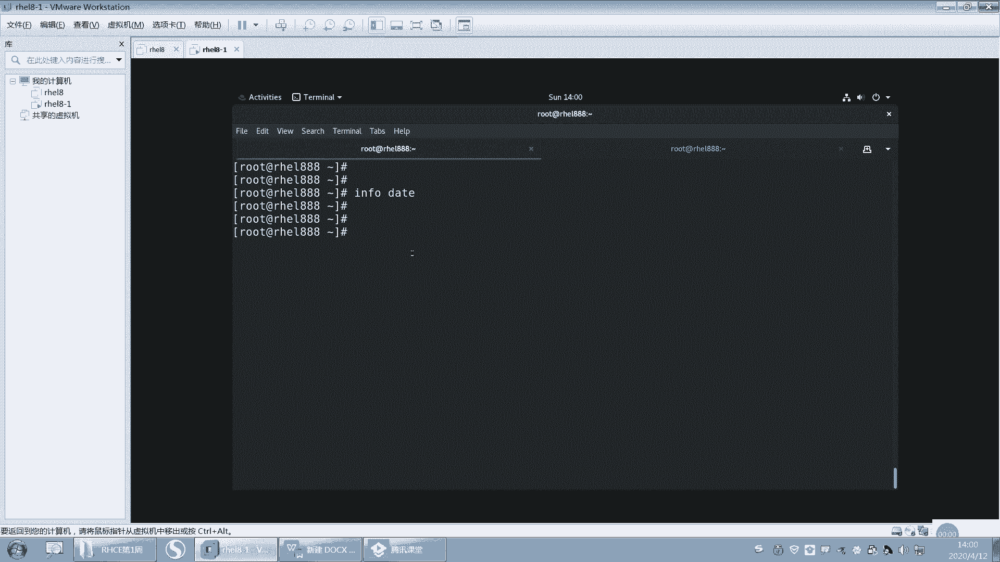

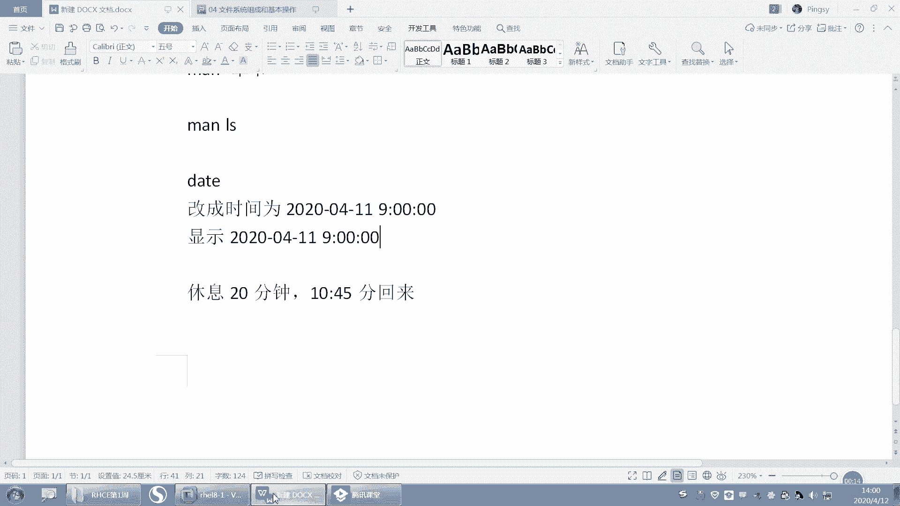

在本节课中，我们将要学习Linux文件系统的核心组成原理以及文件与目录的基本操作。理解文件系统的结构是掌握Linux操作的关键第一步。

## 文件系统组成原理

上一节我们介绍了命令的语法和帮助系统，本节中我们来看看Linux文件系统的组织方式。

Linux文件系统由**文件**和**目录**构成一个**单根的倒树状结构**。这与Windows的多根（如C盘、D盘）结构不同。整个系统的起点是根目录，用一个斜杠 `/` 表示。

需要区分几个易混淆的概念：
*   **`/` (根目录)**：这是文件系统的顶级目录，所有其他目录和文件都位于其下。
*   **`root` (根用户)**：这是系统超级管理员的用户名，与根目录 `/` 没有直接关系。
*   **`/boot` (启动目录)**：这是根目录下的一个子目录，存放系统启动时必需的核心文件。

在Linux中，文件和目录的名称是**区分大小写**的。例如，`File.txt` 和 `file.txt` 被视为两个不同的文件。路径中的斜杠 `/` 用作**父目录与子目录之间的分隔符**。

### 分区、格式化与挂载

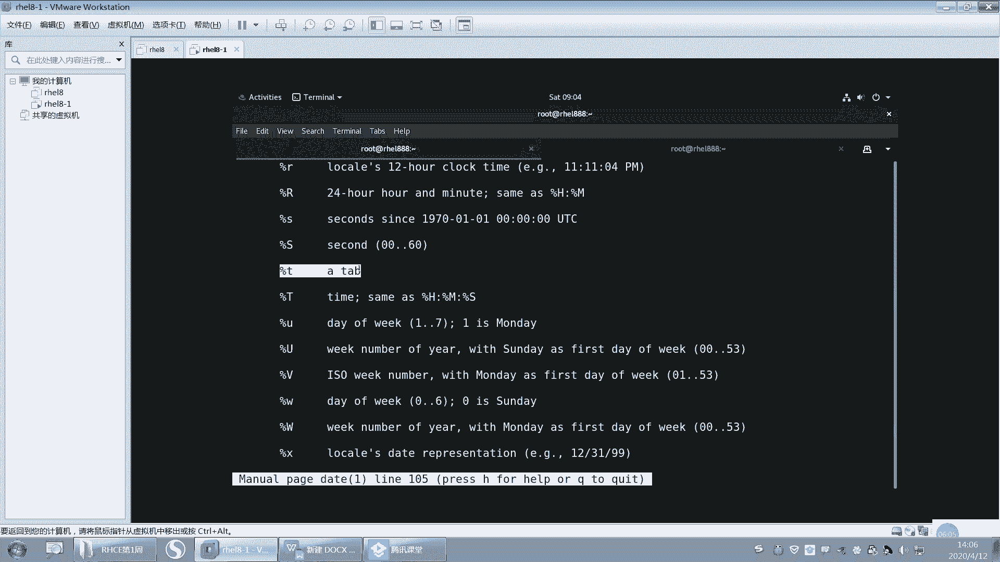

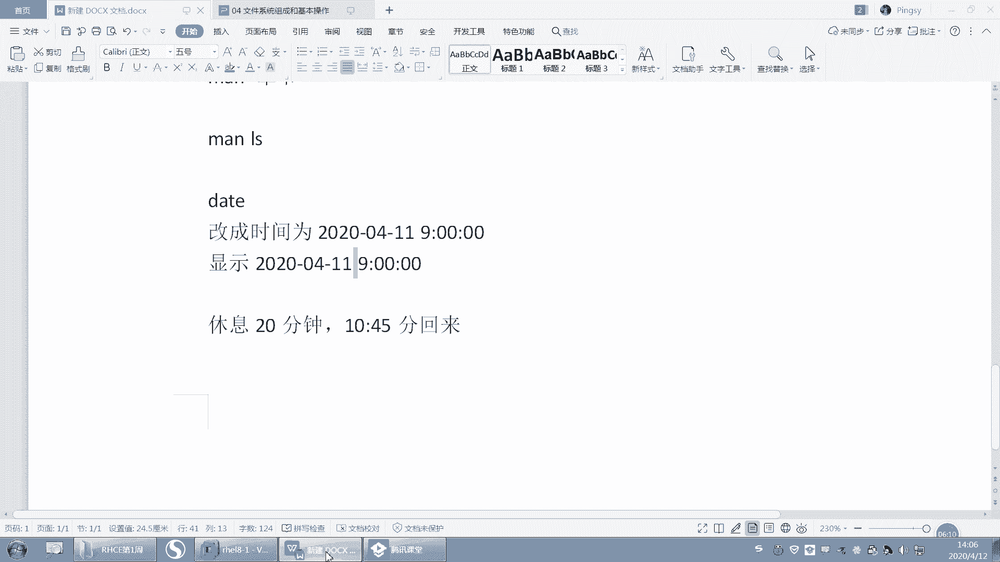

文件系统的物理基础是磁盘分区。一个分区只有经过**格式化**（创建文件系统）后，才能存储文件。为了让系统能够访问某个分区上的文件，需要将该分区**挂载**到一个已存在的目录上，这个目录就称为**挂载点**。

**核心概念**可以这样理解：
1.  必须为根目录 `/` 分配一个分区（根分区），系统才能安装和启动。
2.  其他分区（如 `/home`, `/data`）可以挂载到根目录下的空目录上。
3.  挂载后，访问该挂载点目录，实际上就是访问对应分区的内容。
4.  如果挂载点目录在挂载前非空，其原有内容会被暂时“隐藏”，直到分区被卸载后才会重新可见。

**公式**描述挂载关系：
`分区` --(挂载)--> `目录（挂载点）`

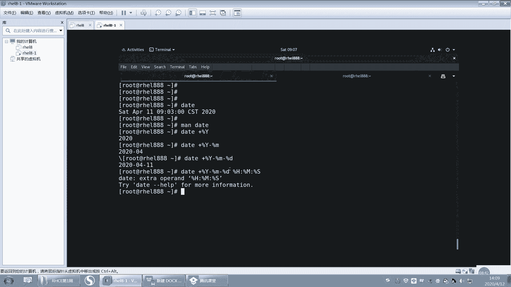

## 重要系统目录简介

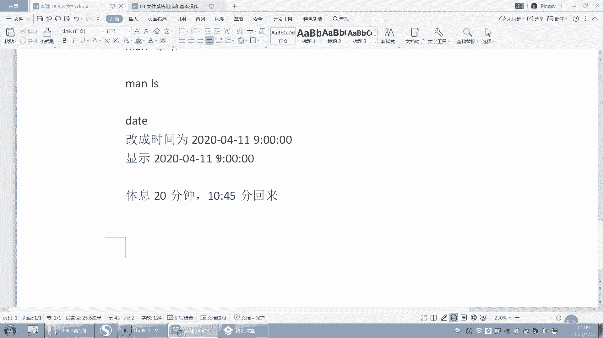

以下是Linux系统中一些标准且重要的目录及其用途简介：

*   **`/bin`**：存放所有用户都可使用的基本命令（如 `ls`, `cp`）。
*   **`/boot`**：存放系统启动所需的文件，如内核、引导程序。
*   **`/dev`**：存放设备文件，如硬盘、终端。
*   **`/etc`**：存放系统及应用程序的配置文件。
*   **`/home`**：普通用户的个人主目录所在地。
*   **`/lib`**：存放系统最基本的共享库和内核模块。
*   **`/media`**：系统自动挂载可移动设备（如U盘）的默认位置。
*   **`/mnt`**：管理员临时挂载文件系统的目录。
*   **`/opt`**：通常用于安装第三方可选应用程序。
*   **`/root`**：系统管理员（root）的主目录。
*   **`/sbin`**：存放系统管理命令，通常需要root权限执行。
*   **`/tmp`**：存放临时文件，所有用户都可读写。
*   **`/usr`**：存放用户安装的应用程序和只读数据，层次类似根目录。
*   **`/var`**：存放经常变化的文件，如日志、缓存、邮件。

## 文件与目录基本操作

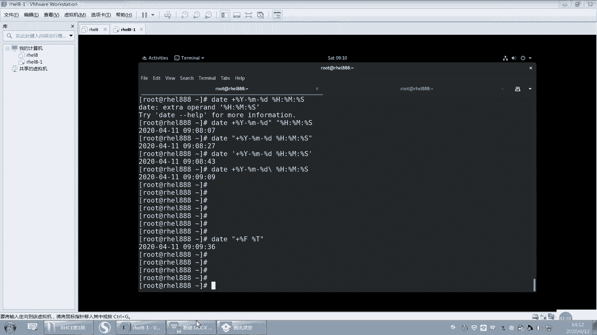

理解了文件系统的结构后，我们就可以开始学习如何操作其中的文件和目录了。

### 查看当前工作目录：`pwd`

`pwd` 命令用于显示当前所在目录的绝对路径。

**代码示例**：
```bash
pwd
```
输出可能为：`/home/username`

### 切换目录：`cd`

`cd` 命令用于改变当前工作目录。

**代码示例**：
```bash
cd /etc          # 切换到 /etc 目录
cd ..            # 切换到上一级目录
cd ~             # 切换到当前用户的主目录
cd -             # 切换回上一个所在的目录
```

### 列出目录内容：`ls`

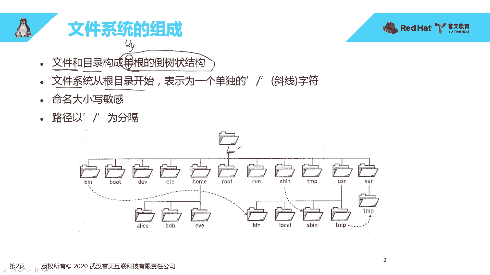

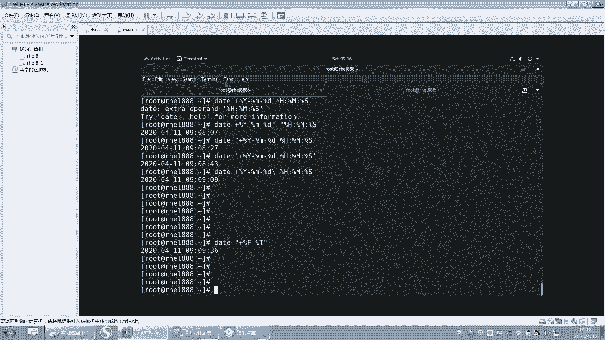

`ls` 命令用于列出指定目录下的文件和子目录。

以下是 `ls` 命令的一些常用选项：

*   **`-l`**：以长格式显示，包含权限、所有者、大小、修改时间等详细信息。
*   **`-a`**：显示所有文件，包括以点 `.` 开头的隐藏文件。
*   **`-h`**：与 `-l` 结合使用，以人类可读的格式（如K, M, G）显示文件大小。
*   **`-R`**：递归列出子目录的内容。
*   **`-t`**：按修改时间排序，最新的在前。

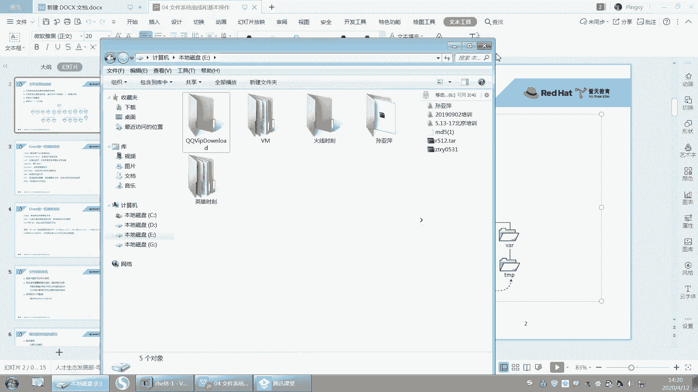

**代码示例**：
```bash
ls
ls -la /home
ls -lh
```

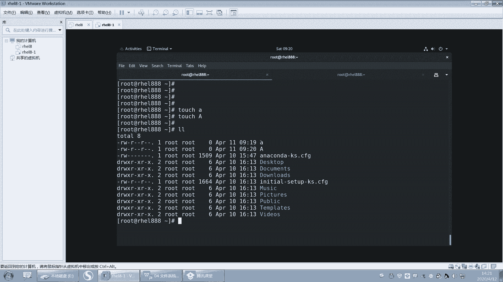

### 创建目录：`mkdir`

`mkdir` 命令用于创建新目录。

**代码示例**：
```bash
mkdir new_folder                     # 创建单个目录
mkdir -p path/to/nested/folder       # 创建多级目录（-p 确保父目录存在）
```

### 创建空文件与修改时间戳：`touch`

`touch` 命令主要有两个用途：
1.  如果文件不存在，则创建一个新的空文件。
2.  如果文件已存在，则更新该文件的访问和修改时间戳为当前时间。

**代码示例**：
```bash
touch new_file.txt          # 创建名为 new_file.txt 的空文件
touch existing_file.txt     # 更新 existing_file.txt 的时间戳
```

### 复制文件或目录：`cp`

`cp` 命令用于复制文件或目录。

**代码示例**：
```bash
cp file1.txt file2.txt               # 复制 file1.txt 为 file2.txt
cp file1.txt /tmp/                   # 复制 file1.txt 到 /tmp 目录下
cp -r source_dir/ dest_dir/          # 递归复制整个目录（-r 或 -R）
```

### 移动或重命名文件/目录：`mv`

`mv` 命令用于移动文件/目录或对其进行重命名。本质上是更改其路径。

**代码示例**：
```bash
mv old_name.txt new_name.txt         # 重命名文件
mv file.txt /home/user/Documents/    # 移动文件到另一个目录
mv dir1/ dir2/                       # 将 dir1 移动到 dir2 内（如果dir2存在），或重命名 dir1 为 dir2（如果dir2不存在）
```

### 删除文件或目录：`rm`

`rm` 命令用于删除文件或目录。**此操作不可逆，需谨慎使用。**

**代码示例**：
```bash
rm file.txt                          # 删除文件
rm -f file.txt                       # 强制删除，不提示（-f）
rm -r directory/                     # 递归删除目录及其内容（-r）
rm -rf directory/                    # 强制递归删除目录（非常危险！）
```

### 查看文件内容

以下是查看文件内容的几种常用命令：

*   **`cat`**：连接文件并打印到标准输出，适合查看短小文件。
    ```bash
    cat filename.txt
    ```
*   **`less`** / **`more`**：分页查看文件内容，适合查看长文件。`less` 功能更强大（支持上下翻页、搜索等）。
    ```bash
    less long_file.log
    ```
*   **`head`**：显示文件开头部分，默认10行。
    ```bash
    head -n 20 filename.txt  # 显示前20行
    ```
*   **`tail`**：显示文件末尾部分，默认10行。常用 `-f` 选项实时追踪文件新增内容（如查看日志）。
    ```bash
    tail -f application.log  # 实时追踪日志更新
    ```

## 时间戳概念

Linux系统中的每个文件都记录有三种主要的时间戳：
*   **访问时间 (Atime)**: 文件最后一次被读取的时间。
*   **修改时间 (Mtime)**: 文件**内容**最后一次被修改的时间。
*   **改变时间 (Ctime)**: 文件**元数据**（如权限、所有者）最后一次被改变的时间。

可以使用 `stat` 命令查看文件的详细时间戳信息。

**代码示例**：
```bash
stat filename.txt
```

## 总结

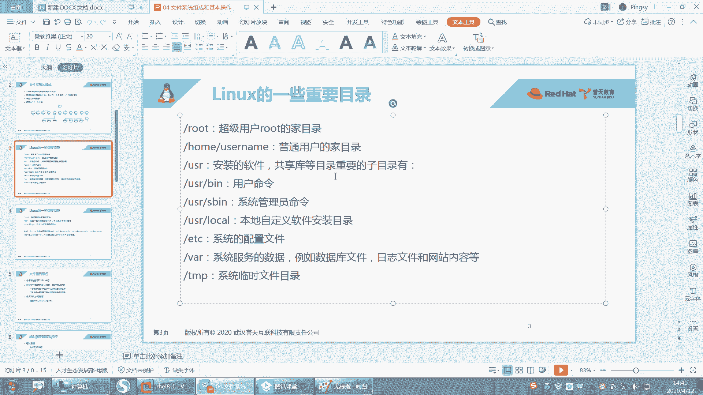

本节课中我们一起学习了Linux文件系统的核心知识。我们首先理解了其**单根倒树状**的层次结构，以及分区通过**挂载**到目录来使用的独特机制。接着，我们熟悉了系统的重要目录。最后，我们掌握了文件和目录的**创建 (`mkdir`, `touch`)、查看 (`ls`, `cat`, `less`)、复制 (`cp`)、移动/重命名 (`mv`)、删除 (`rm`)** 以及**切换目录 (`cd`)** 等基本操作命令，并了解了文件时间戳的概念。这些是进行日常Linux操作和管理的基础，请务必熟练掌握。