# Linux基础教程：P15：文件系统基本操作之mkdir创建和删除目录 📁

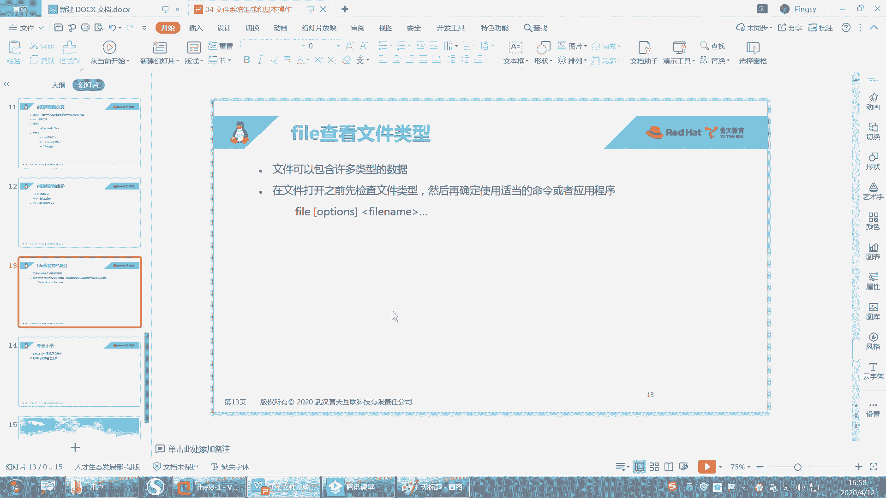

在本节课中，我们将学习Linux系统中关于目录创建与删除的核心操作，包括`mkdir`命令的进阶用法、`rmdir`与`rm`命令的区别，以及如何使用`file`命令判断文件类型。这些是管理Linux文件系统的基础技能。

---

## 创建目录：mkdir命令

`mkdir`命令用于创建新目录。其基本语法是：
```bash
mkdir 目录名
```

例如，创建一个名为`data`的目录：
```bash
mkdir data
```

### 创建多级目录

如果尝试创建一个路径中上级目录不存在的多级目录，命令会失败。
```bash
mkdir data/test/data
```
执行上述命令会报错，因为系统在创建最后一层目录`data`时，发现其父路径`data/test`不存在。

为了解决这个问题，需要使用`-p`参数。`-p`代表`parents`，其作用是：如果父目录不存在，则自动创建所需的父目录。

```bash
mkdir -p data/test/data
```

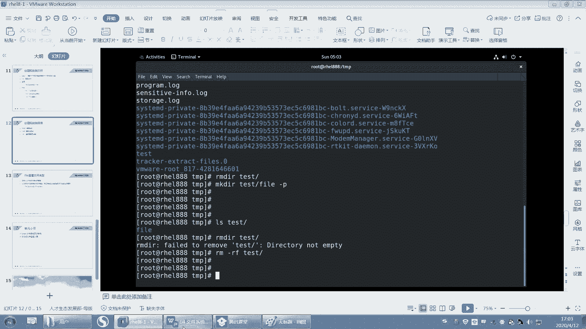

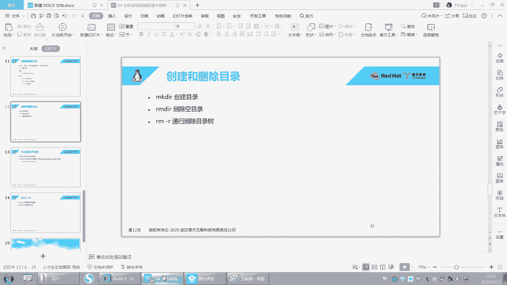

为了更清晰地查看创建过程，可以结合`-v`参数（verbose，显示详细信息）：
```bash
mkdir -pv data/test/data
```
系统会依次显示创建每一层目录的过程。

---

## 删除目录

Linux提供了两种删除目录的命令：`rmdir`和`rm`。

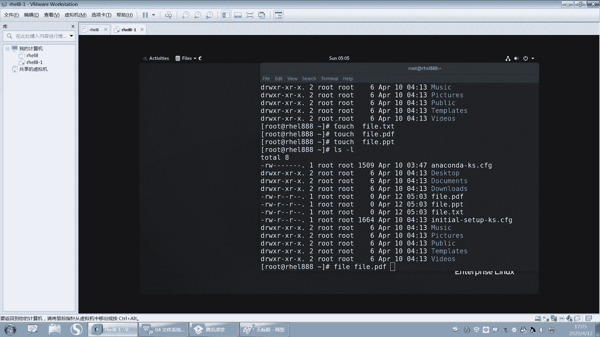

### 使用rmdir删除空目录

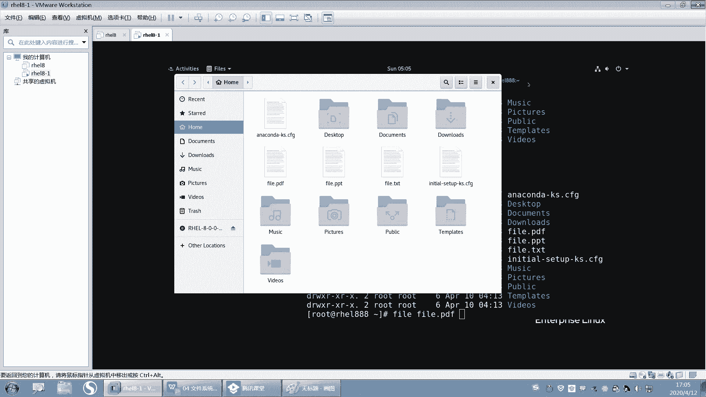

`rmdir`命令专门用于删除**空目录**。如果目录非空（包含文件或子目录），该命令将失败。

例如，删除一个空目录`emptydir`：
```bash
rmdir emptydir
```

如果尝试删除一个包含内容的目录`test`（其下有一个`file`文件），则会失败：
```bash
rmdir test
```

### 使用rm删除目录（及内容）

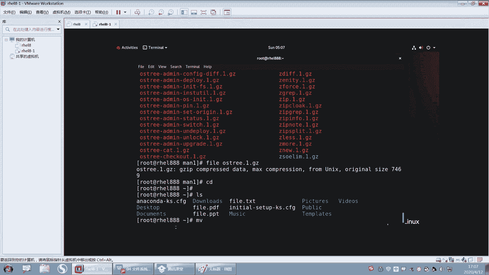

要删除非空目录，必须使用`rm`命令，并配合`-r`（递归删除）和`-f`（强制删除，不提示）参数。

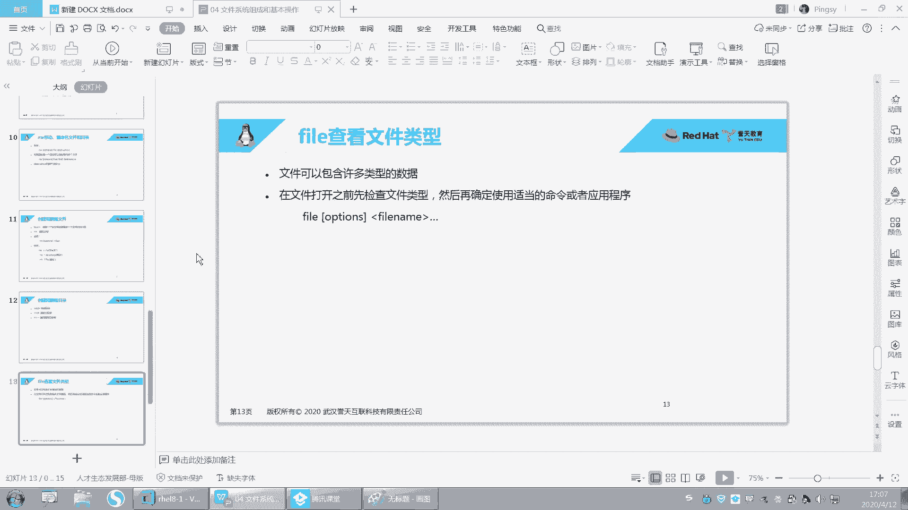

删除目录`test`及其所有内容：
```bash
rm -rf test
```
**警告**：`rm -rf`命令威力巨大且不可逆，请谨慎使用，尤其是在根目录或重要系统目录下。

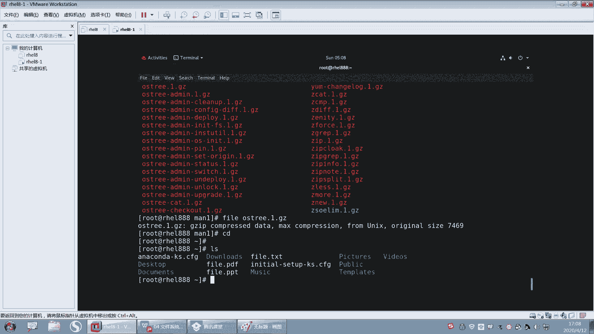

关于文件恢复：在Linux中，删除文件后通常难以恢复。如果误删重要文件，应立即停止对系统的写入操作，并尝试使用第三方数据恢复工具。系统本身不提供回收站机制。

---

## 判断文件类型：file命令

在Linux系统中，文件的后缀名（如`.txt`, `.pdf`）并不像Windows系统那样直接决定文件类型或关联打开程序。文件类型由文件的实际内容决定。

`file`命令用于检测文件的真实类型。

其基本语法是：
```bash
file 文件名
```

**示例**：
1.  查看一个空文件的类型：
    ```bash
    file myfile.txt
    ```
    输出可能显示为“empty”（空文件）。

2.  查看一个目录的类型：
    ```bash
    file /etc
    ```
    输出会显示为“directory”（目录）。

3.  查看一个符号链接文件的类型：
    ```bash
    file /etc/default
    ```
    输出会显示为“symbolic link”（符号链接）。

4.  查看一个压缩文件的真实类型：
    ```bash
    file /usr/share/man/man1/ls.1.gz
    ```
    输出会准确地显示为“gzip compressed data”（gzip压缩数据）。

使用`file`命令可以避免被文件后缀名误导，是系统管理和故障排查中非常实用的工具。

---

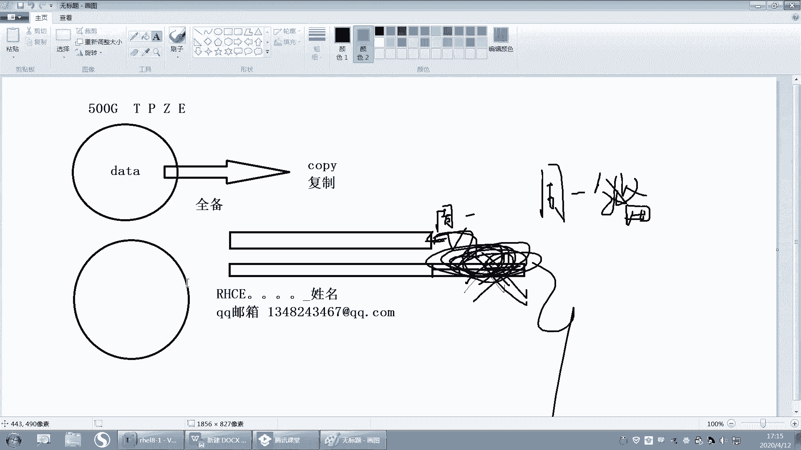

## 课程总结

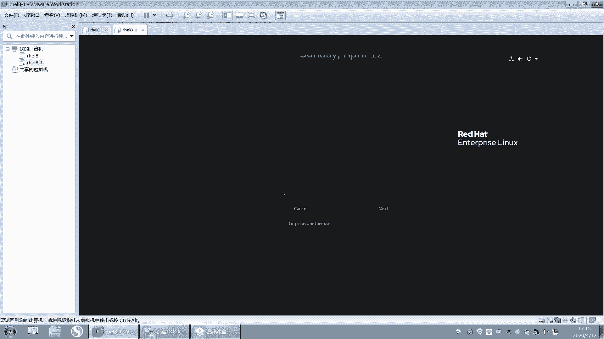

本节课我们一起学习了Linux文件系统的几个基本操作：
1.  **创建目录**：使用`mkdir`命令，通过`-p`参数可以递归创建多级目录，`-v`参数可以查看详细过程。
2.  **删除目录**：区分了`rmdir`（仅删除空目录）和`rm -rf`（递归强制删除目录及所有内容）的使用场景与风险。
3.  **判断文件类型**：掌握了`file`命令，它通过分析文件内容来报告其真实类型，而不依赖于文件扩展名。

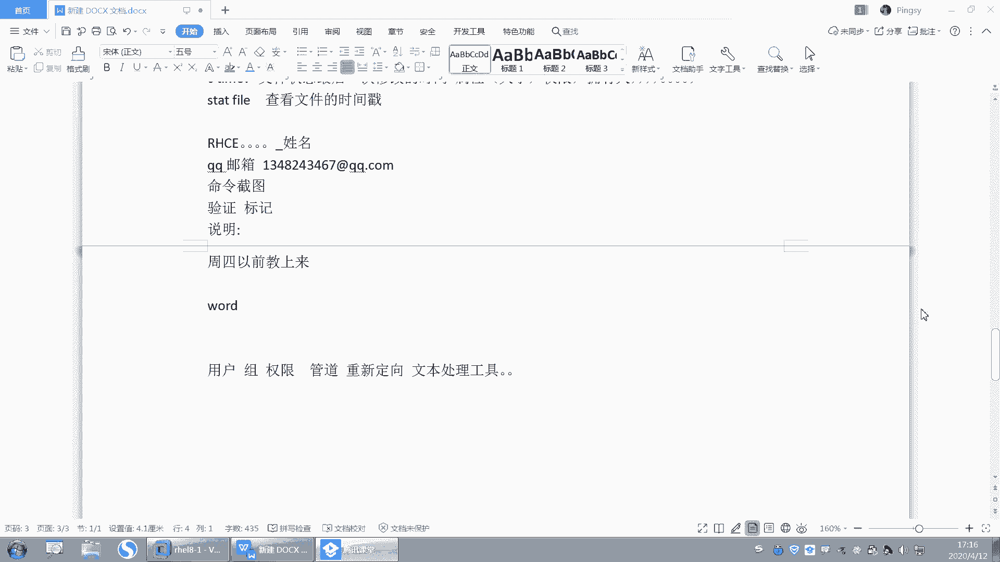

这些命令是日常使用和管理Linux系统不可或缺的基础，请务必熟练掌握。下一节课，我们将开始学习用户、组、权限管理以及管道和重定向等更深入的内容。