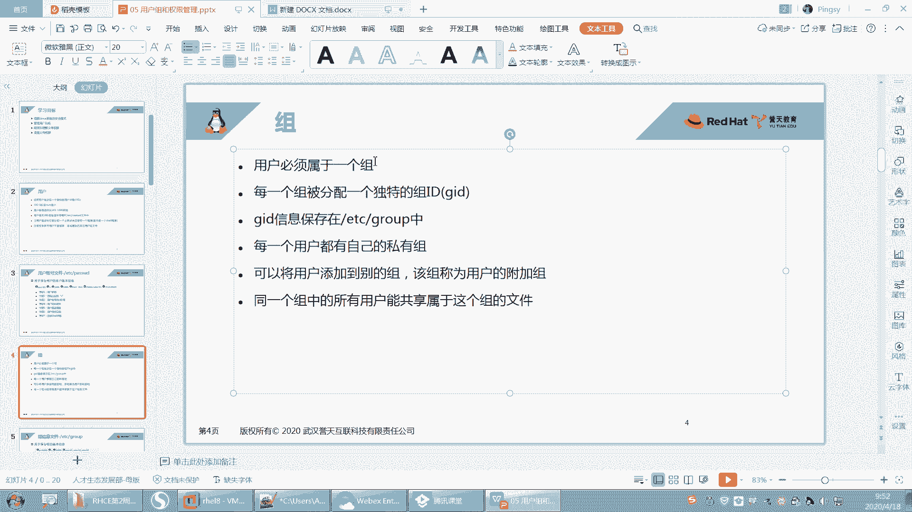
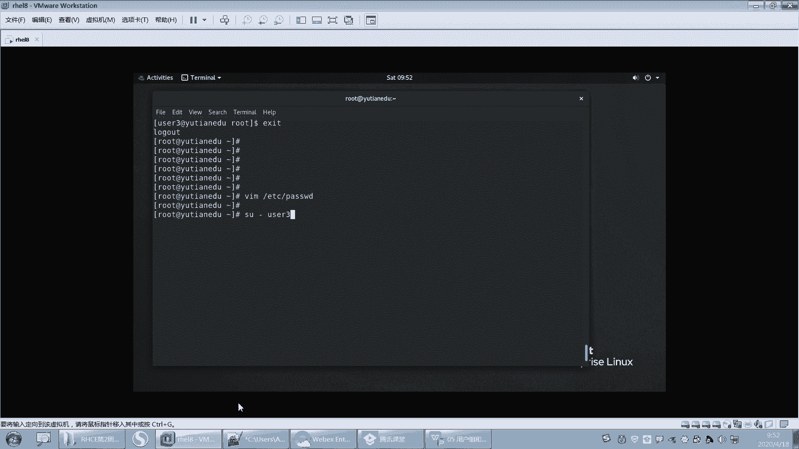
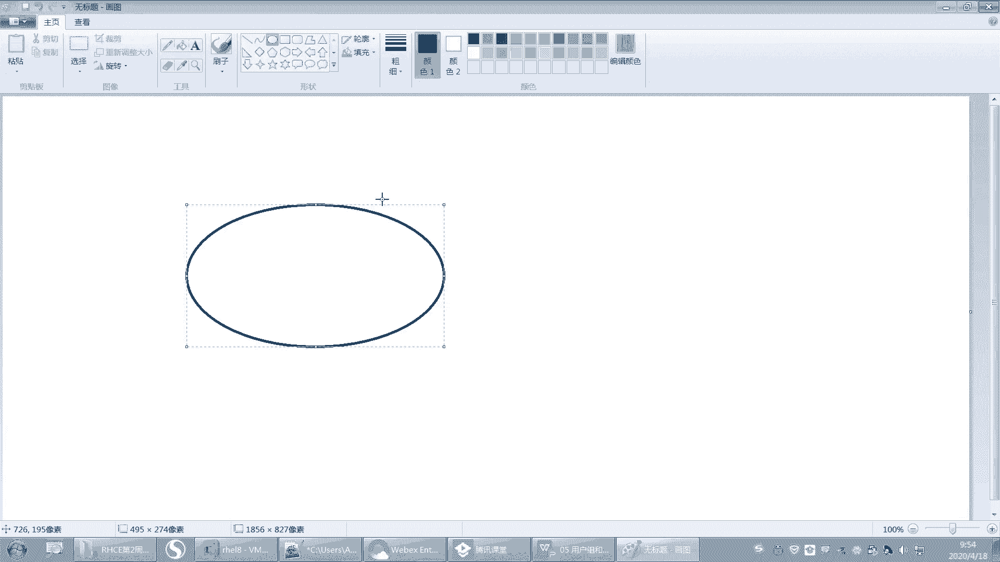
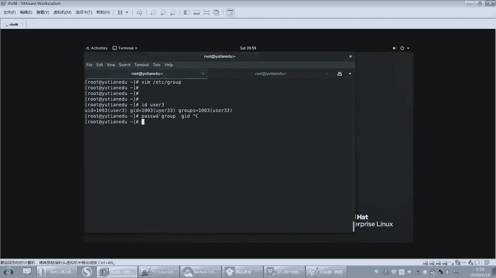
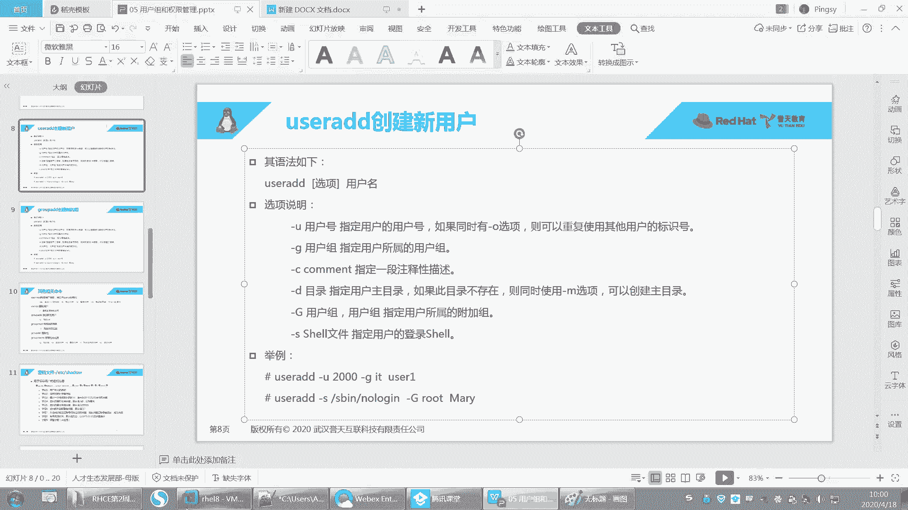
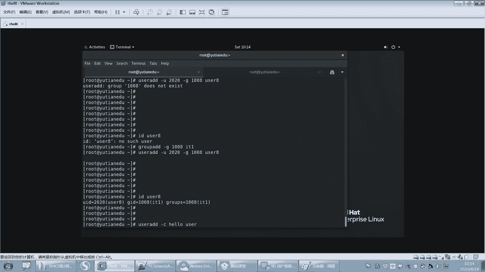
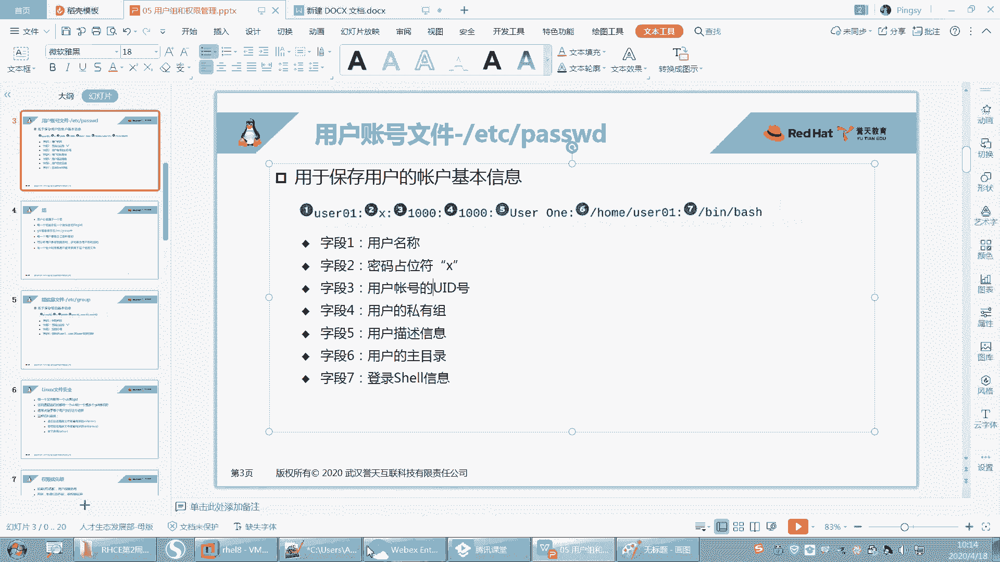
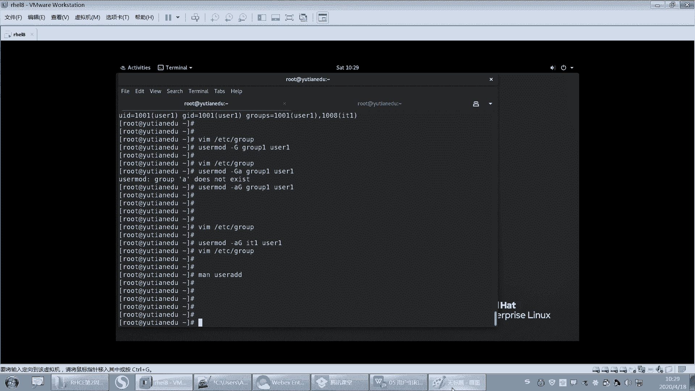
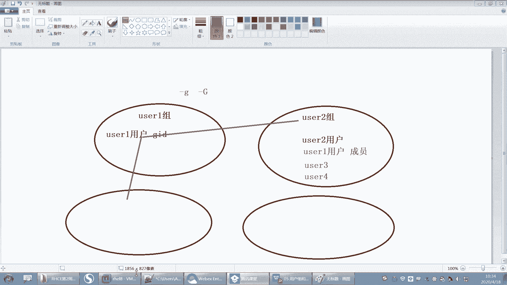

# Linux用户与组管理：P18：系统组GID和group文件详解





在本节课中，我们将要学习Linux系统中“组”的概念及其管理方式。我们将深入探讨组ID（GID）、`/etc/group`文件的结构，以及用户与组之间的关系。通过理解这些核心概念，你将能够有效地创建和管理用户与组，为后续学习文件权限打下坚实基础。

## 用户与组的基本关系



上一节我们介绍了用户和`/etc/passwd`文件，本节中我们来看看“组”的概念。在Linux系统中，每一个用户都必须属于至少一个组。我们可以用一个比喻来理解：一个“用户”好比一个人，而“组”则好比一个家庭。每个人在出生时（即用户创建时）都必须属于一个原生家庭（即私有组）。当然，一个人后来也可以认干亲，加入其他家庭，这些家庭就相当于“附加组”。

## 组ID（GID）与`/etc/group`文件

与用户拥有唯一的UID类似，每个组也会被分配一个独特的组ID，称为GID。组的所有信息都保存在`/etc/group`这个配置文件中。

### 解析`/etc/group`文件

让我们打开并查看`/etc/group`文件的内容。该文件每一行代表一个组，其格式如下：



```
group_name:password:GID:user_list
```



以下是各字段的含义：
*   **group_name**： 组的名称。
*   **password**： 组的密码（通常用`x`表示，密码实际存放在`/etc/gshadow`中）。组也可以设置密码并用于登录，但这在红帽8中不常用。
*   **GID**： 组的唯一数字ID。
*   **user_list**： 属于该组的**附加用户**列表，用户名之间用逗号分隔。注意，这里**不包含**以该组为**私有组**的用户。

例如，当我们使用`useradd`命令创建一个新用户（如`user1`）时，系统会自动执行多项操作，其中之一就是在`/etc/group`文件中创建一个与用户同名的组（如`group1`），并将该用户的GID指向这个新组。

### 手动关联用户与组

如果手动在`/etc/passwd`文件中添加了一个用户行（例如`user3`），但对应的GID（如1003）在`/etc/group`中不存在，那么这个用户的组信息将不完整。此时，我们需要手动在`/etc/group`文件中创建对应的组条目。

例如，为GID 1003创建组：
```
user33:x:1003:
```
保存文件后，使用`id user3`命令查看，就会发现该用户现在有了完整的组信息。用户和组正是通过**GID**这个字段关联起来的：`/etc/passwd`中用户的GID必须与`/etc/group`中某个组的GID一致。

## 私有组与附加组

理解私有组和附加组的区别至关重要：
*   **私有组（Primary Group）**： 每个用户有且只有一个私有组，通常在用户创建时自动生成，GID记录在`/etc/passwd`中。这相当于用户的“原生家庭”。
*   **附加组（Supplementary Group）**： 一个用户可以属于零个、一个或多个附加组。这相当于用户后来加入的“社团”或“干亲家庭”。附加组的成员关系记录在`/etc/group`文件每行的最后一个字段（`user_list`）中。

同一个组内的所有用户可以共享该组所拥有的文件权限。

## 使用命令管理用户和组

虽然可以直接编辑配置文件，但为了避免信息不一致，建议初学者优先使用命令行工具进行管理。

### 创建用户 (`useradd`)

`useradd`命令用于创建新用户。执行该命令时，系统会自动完成多项工作，包括在`/etc/passwd`和`/etc/group`中添加记录、创建家目录等。





基本语法：
```bash
useradd [选项] 用户名
```

以下是创建用户时可以指定的一些常用选项：
*   `-u UID`： 指定用户的UID。
*   `-g GID或组名`： 指定用户的私有组。**指定的组必须已存在**。
*   `-G GID或组名`： 指定用户的附加组列表。
*   `-c “注释”`： 添加用户描述信息。
*   `-d 家目录路径`： 指定用户的家目录。
*   `-s 登录shell路径`： 指定用户的登录shell（如`/bin/bash`或`/sbin/nologin`）。

**UID/GID分配规则**： 默认情况下，系统会从当前已分配的最大UID/GID加1开始分配。这是为了避免复用可能已被删除用户遗留文件的旧ID，从而造成权限和安全问题。

### 创建组 (`groupadd`)

`groupadd`命令用于创建新组。

基本语法：
```bash
groupadd [选项] 组名
```

常用选项：
*   `-g GID`： 指定组的GID。

### 修改用户属性 (`usermod`)

`usermod`命令用于修改已存在用户的属性，其选项与`useradd`类似。

基本语法：
```bash
usermod [选项] 用户名
```

关键选项示例：
*   `-u UID`： 修改用户UID。
*   `-g GID或组名`： 修改用户的私有组。
*   `-G GID或组名`： **设置**用户的附加组列表（会覆盖原有的附加组）。
*   `-aG GID或组名`： **追加**一个附加组到用户现有的附加组列表中（`-a`代表append，必须与`-G`连用，且顺序为`-aG`）。
*   `-s shell路径`： 修改登录shell。
*   `-d 新家目录`： 修改家目录（通常配合`-m`选项移动原家目录内容）。

**选项与参数的使用注意**： 命令行选项中，如果一个选项后面需要跟参数（如`-g 1001`），那么参数必须紧跟在选项之后。只有那些不需要参数的选项（如`-a`）才能与其他不需要参数的选项合并（如`-aG`）。顺序很重要，例如`-aG`正确，而`-Ga`则可能导致错误。



### 实践：为用户添加附加组

假设我们有一个组`IT1`，现在想将用户`user1`加入该组作为附加组。

1.  **查看当前状态**： `id user1` 显示其只有一个私有组。
2.  **添加附加组**： 使用`usermod -aG IT1 user1`命令。这里`-a`确保是追加，不会移除用户原有的其他附加组。
3.  **验证结果**：
    *   再次执行`id user1`，可以看到输出中多了`groups=1001(user1),1008(IT1)`。
    *   查看`/etc/group`文件中`IT1`所在的行，末尾会看到`user1`。

---



本节课中我们一起学习了Linux系统中组的核心概念。我们明确了每个用户都必须属于一个私有组，并可以加入多个附加组；掌握了组信息存储的文件`/etc/group`的结构和含义；重点练习了使用`useradd`、`groupadd`和`usermod`命令来创建和管理用户与组，特别是如何正确地为用户添加附加组。理解用户与组的关系是管理多用户系统环境和后续学习文件权限管理的基础。