# Linux用户与组管理：P19：系统用户和组的创建、删除和修改操作 🛠️

在本节课中，我们将学习如何在Linux系统中创建、修改和删除用户与组。这是系统管理的基础技能，理解这些操作对于维护系统安全和组织用户权限至关重要。

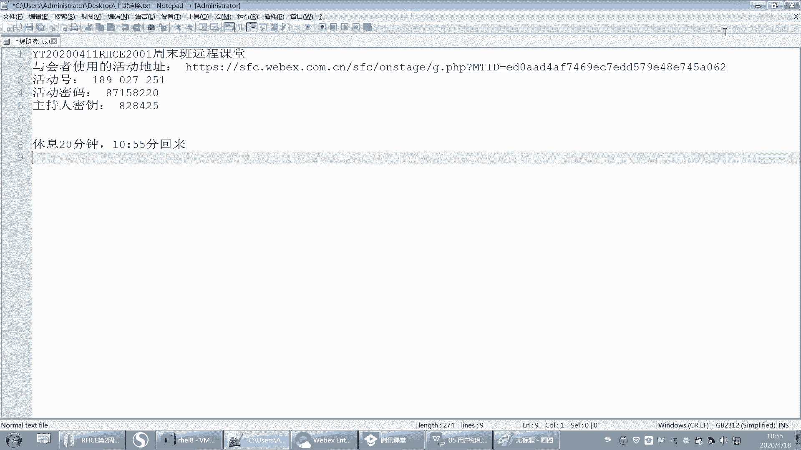

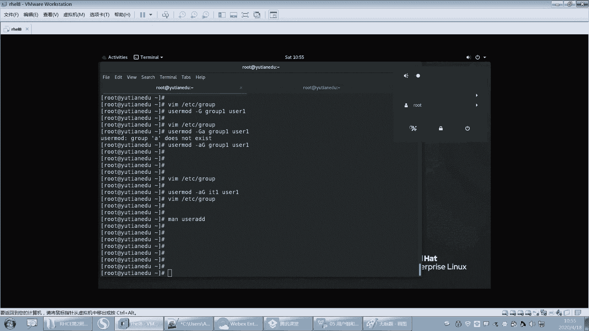

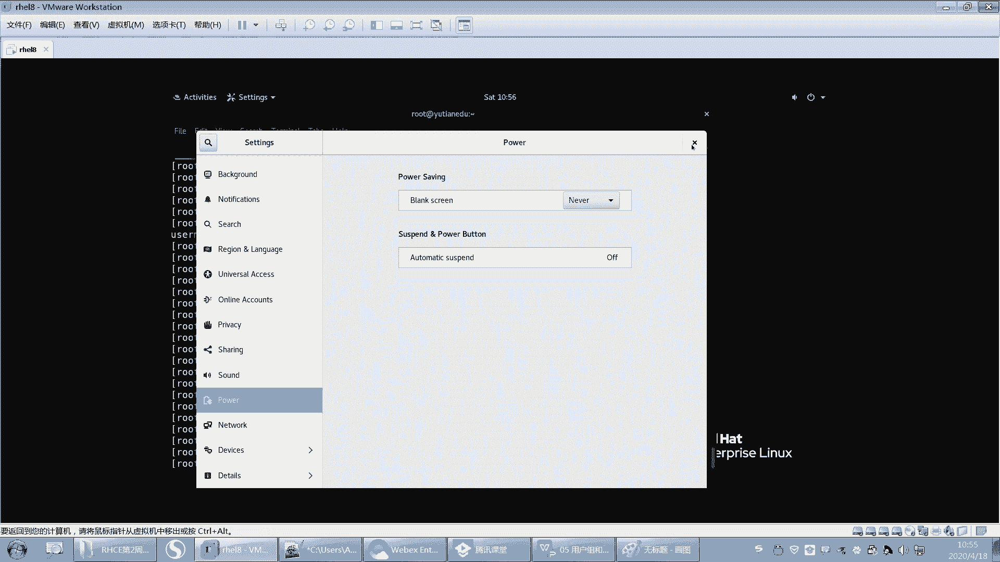

---

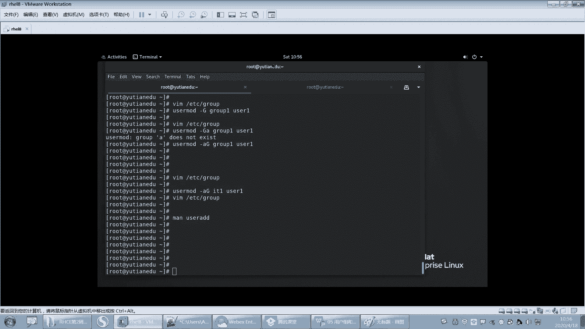

## 用户管理命令回顾

上一节我们介绍了用户和组的基本概念，本节中我们来看看具体的操作命令。

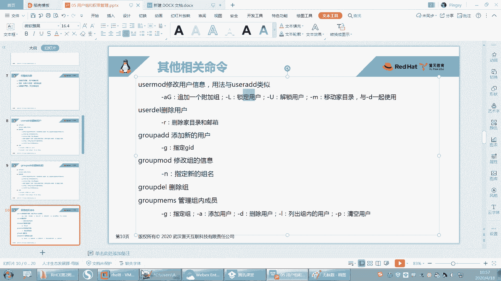

### 创建用户：`useradd`

`useradd` 命令用于创建新用户。其基本语法如下：

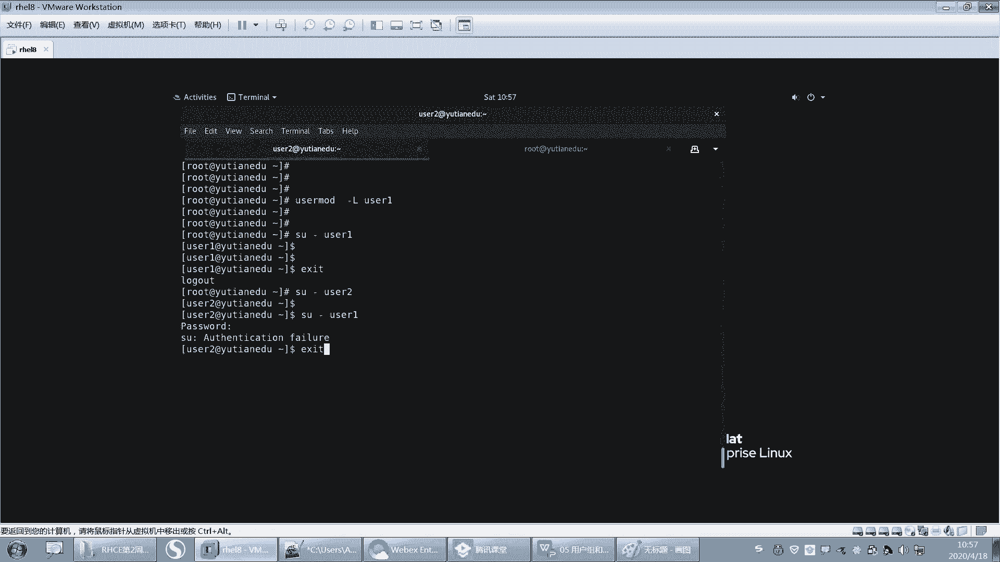

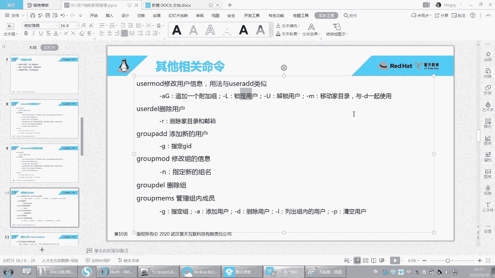

```bash
useradd [选项] 用户名
```

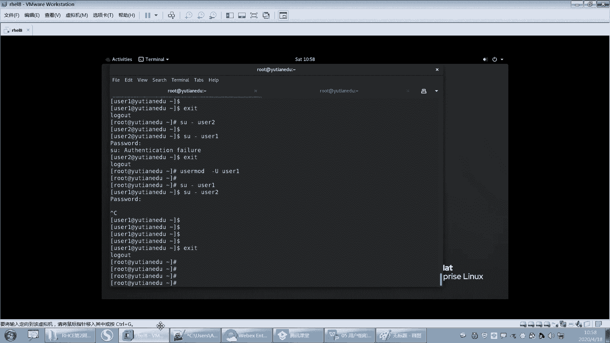

以下是 `useradd` 命令的一些常用选项：

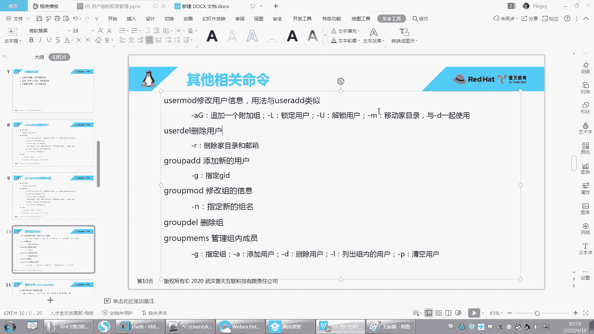

*   `-u`：指定用户的UID（用户ID）。
*   `-g`：指定用户的主组（私有组）。
*   `-G`：指定用户的附加组。
*   `-c`：添加用户的注释信息。
*   `-d`：指定用户的家目录路径。
*   `-s`：指定用户的默认Shell。

### 修改用户：`usermod`

`usermod` 命令用于修改现有用户的信息，其用法与 `useradd` 类似。

以下是 `usermod` 命令的一些常用操作：

*   **追加附加组**：使用 `-aG` 选项，后面接组名。
    ```bash
    usermod -aG 组名 用户名
    ```
*   **锁定用户**：使用 `-L` 选项可以锁定一个用户，使其无法登录。
    ```bash
    usermod -L 用户名
    ```
*   **解锁用户**：使用 `-U` 选项可以解锁一个被锁定的用户。
    ```bash
    usermod -U 用户名
    ```
*   **移动家目录**：使用 `-m` 和 `-d` 选项可以移动用户的家目录，操作时需注意权限问题。

---

## 删除用户：`userdel`

创建用户后，有时也需要删除用户。`userdel` 命令用于删除用户。

### 基本删除

直接使用 `userdel` 命令删除用户，但这种方式不会删除用户的家目录和邮箱文件。

```bash
userdel 用户名
```

执行此命令后，用户从 `/etc/passwd` 文件中被移除，其私有组（如果该组没有其他成员）也会被删除。然而，用户的家目录（如 `/home/用户名`）和邮箱文件（位于 `/var/spool/mail/` 目录下）会保留下来。此时，这些遗留文件的属主和属组会显示为原用户的UID和GID。

### 彻底删除

为了在删除用户的同时，一并删除其家目录和邮箱文件，需要使用 `-r` 选项。

```bash
userdel -r 用户名
```

**`-r` 选项的作用**：删除用户的家目录及其邮箱文件。

### 删除用户后的常见问题与解决

如果在删除用户时未使用 `-r` 选项，遗留的文件可能会导致问题。例如，之后创建一个同名的新用户，新用户的UID可能与旧用户不同。此时，新用户将无法访问遗留的、属主为旧UID的家目录，导致切换用户失败或权限错误。

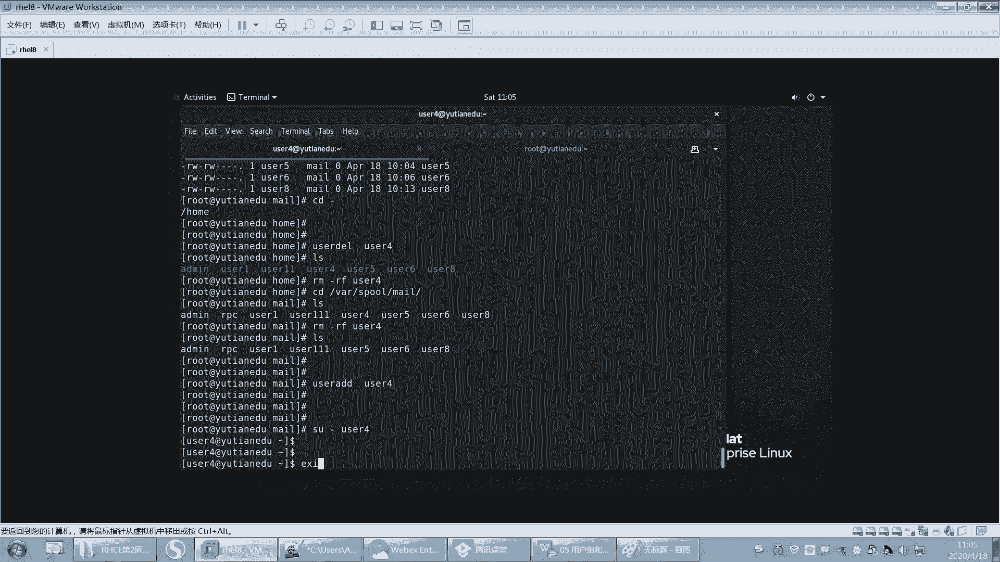

**解决方法**：手动删除遗留的家目录和邮箱文件。

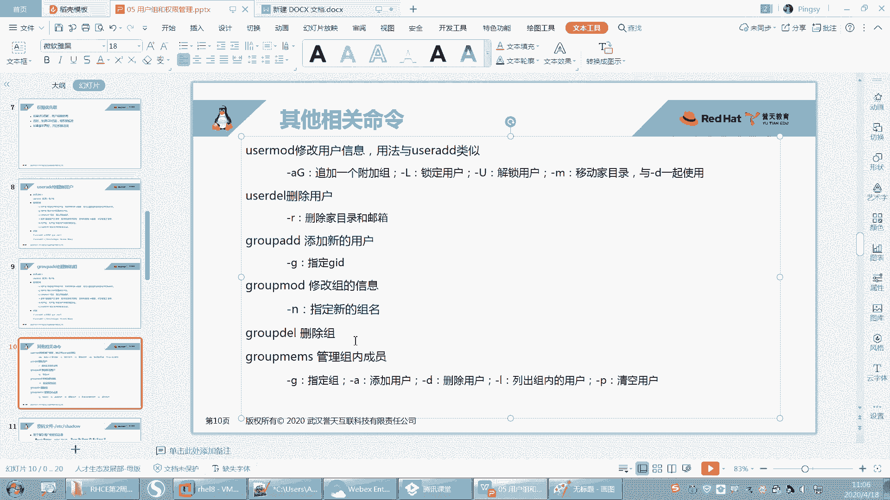

1.  删除遗留的家目录：
    ```bash
    rm -rf /home/旧用户名
    ```
2.  删除遗留的邮箱文件：
    ```bash
    rm -f /var/spool/mail/旧用户名
    ```

完成清理后，再创建同名用户就不会产生冲突。

---

## 组管理命令

### 创建与修改组

*   **创建组**：使用 `groupadd` 命令。
    ```bash
    groupadd 组名
    ```
*   **修改组名**：使用 `groupmod` 命令，例如 `-n` 选项可以修改组名。
    ```bash
    groupmod -n 新组名 旧组名
    ```

### 删除组：`groupdel`

`groupdel` 命令用于删除组。

```bash
groupdel 组名
```

**删除组的限制**：如果一个组是某个用户的**私有组（主组）**，则该组无法被删除。系统会提示该组是某用户的“primary group”。只有当一个组不是任何用户的私有组时，才能被成功删除，无论该组内是否有其他成员。

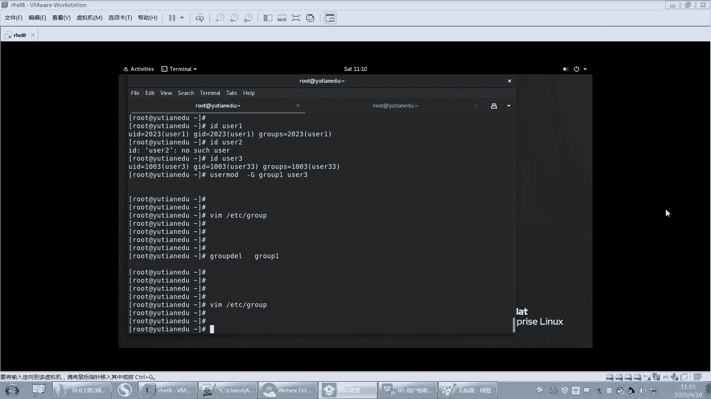

### 管理组成员

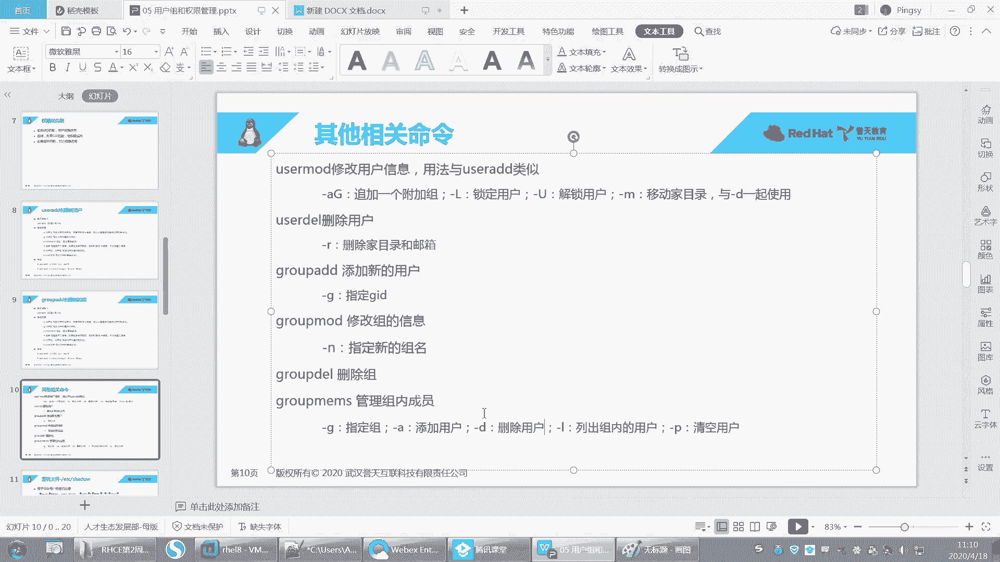

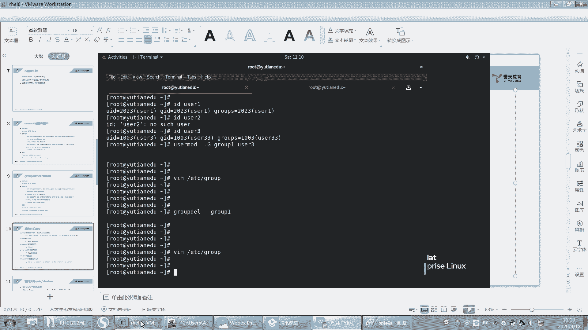

以下是管理组成员的两个常用命令。

**1. `groupmems` 命令**
此命令用于管理指定组内的成员。

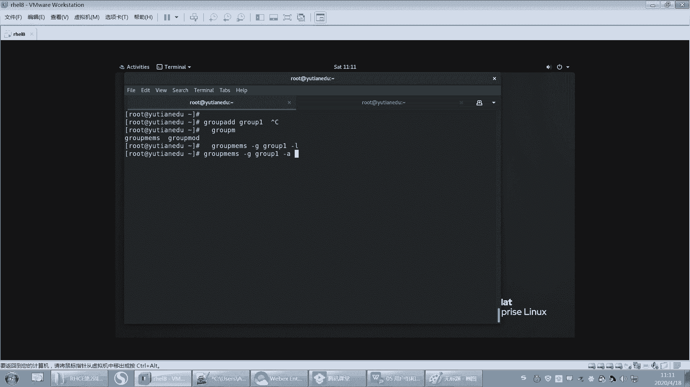

```bash
groupmems [选项] -g 组名
```

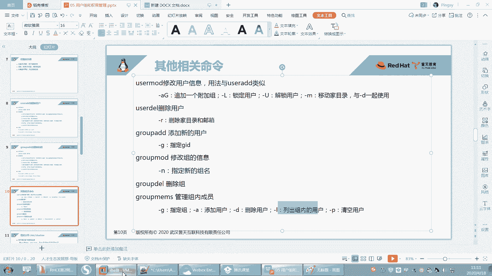

以下是 `groupmems` 命令的常用选项：

*   `-a 用户名`：将用户添加到组中。
*   `-d 用户名`：将用户从组中移除。
*   `-l`：列出组内的所有成员。
*   `-p`：清空组内的所有成员（不能清空私有组的成员）。

**2. `gpasswd` 命令**
此命令主要用于为组设置密码。

```bash
gpasswd 组名
```
执行后，会提示输入并确认该组的密码。

**组密码的用途**：用户可以使用 `newgrp` 命令临时切换到自己所在的某个附加组，或者通过输入组密码临时加入一个有密码的组，从而获得该组的权限。

```bash
newgrp 组名
```
输入正确的组密码后，用户的GID会临时变更为目标组的GID。这只是临时切换，退出当前Shell或使用 `exit` 命令后会恢复原状。

---

## 总结

本节课中我们一起学习了Linux系统用户和组的核心管理操作：

1.  **创建与修改**：使用 `useradd` 创建用户，使用 `usermod` 修改用户属性（如锁定、解锁、修改组）。
2.  **删除用户**：使用 `userdel` 删除用户，配合 `-r` 选项可彻底删除用户相关文件。需注意处理未彻底删除导致的遗留文件问题。
3.  **组管理**：使用 `groupadd`、`groupmod` 和 `groupdel` 进行组的增、改、删。特别注意无法删除作为用户私有组的组。
4.  **成员管理**：使用 `groupmems` 精细管理组内成员，使用 `gpasswd` 为组设置密码，并了解 `newgrp` 的临时切换组功能。

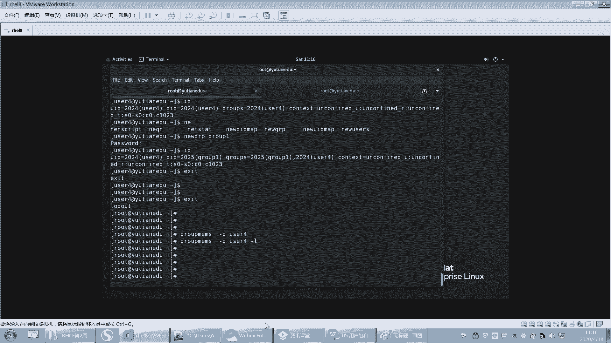

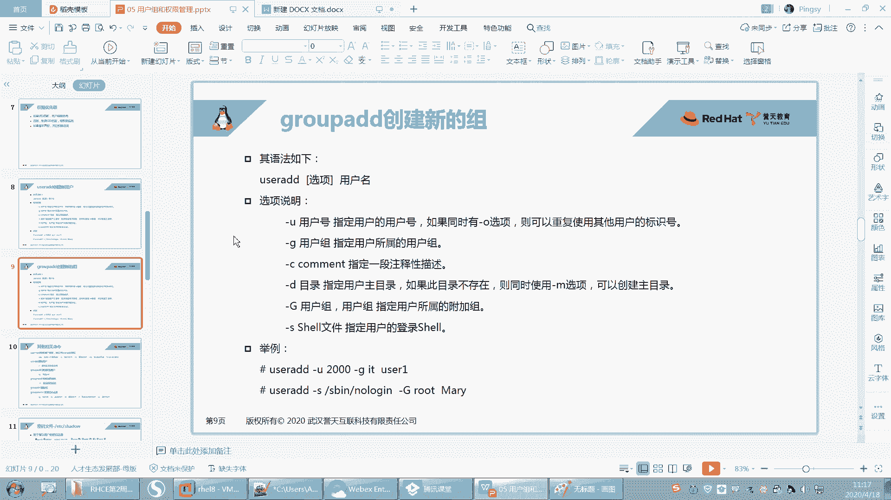

掌握这些命令是进行系统用户权限管理和维护的基础。