# Linux基础教程：01：开班介绍和红帽认证

在本节课中，我们将要学习课程的基本介绍、红帽认证体系、学习方法以及Linux系统的初步认识。课程将帮助你建立学习框架，明确学习目标。

## 课程要求与学习方法

在开始学习之前，我们先明确课程的要求和学习方法。以下是几点核心要求，希望大家能够遵守。

### 1. 空杯心态
无论你之前是否有基础，请以从零开始的心态学习。Linux课程建立在计算机基础、硬件等多方面知识之上，初学者需要课后主动补充相关知识。遇到困难时，请保持信心，坚持学习。

### 2. 保证出勤
请尽量保证每周按时上课。学习具有连续性，中断后很难找回状态。坚持跟完全程是最高效的学习方式。

### 3. 做好课堂笔记
所有学员都需要准备课堂笔记，可以选择电子版或纸质版。电子版便于永久保存和查阅。我会在课堂上留出时间，并定期抽查大家的笔记。

### 4. 完成课后作业
课后作业是巩固知识的关键。虽然不做强制要求，但不完成作业将难以跟上进度。作业需要按时提交，以便我和助教老师及时批改反馈。

### 5. 使用实名信息
请在腾讯课堂、微信群等学习平台使用实名。这有助于师生间相互认识，未来在技术圈内也能相互帮助，拓展人脉。

## 红帽认证体系介绍

上一节我们介绍了学习方法，本节中我们来看看红帽认证的具体体系。红帽认证是本次学习的核心目标之一。

### RHCSA（红帽认证系统管理员）
这是红帽的初级认证。学习内容包括两本教材：**RH124** 和 **RH134**。
*   **RH124**：涵盖用户、权限、基本命令操作、网络配置等基础内容。
*   **RH134**：涵盖磁盘管理、安全、存储管理、故障排错等进阶内容。
RHCSA是后续学习的重要基础，必须扎实掌握。

### RHCE（红帽认证工程师）
这是红帽的中级认证。在红帽8版本中，核心课程是 **RH294**，主要学习 **Ansible自动化运维**。
*   考试形式：均为上机实操，无理论题。需通过RHCSA和RHCE两门考试（通常在同一天进行）。
*   评分标准：每门满分300分，210分通过。

### RHCA（红帽认证架构师）
这是红帽的高级认证。它由多门课程组成，通过其中任意五门即可获得RHCA证书。
*   课程示例：虚拟化（KVM）、云计算（OpenStack）、性能调优、容器技术（OpenShift）等。
*   证书有效期：RHCA证书本身无有效期，但其前提RHCE证书有有效期（通常3年）。RHCE过期后，只需重考RHCE即可续期RHCA。

## Linux系统与职业发展

了解了认证体系，我们来看看为什么要学习Linux以及相关的职业前景。

### 为什么学习Linux？
Linux是一个操作系统（OS），位于硬件之上、应用程序之下，是IT基础设施的核心。
*   **行业趋势**：绝大多数服务器都运行Linux系统，国产化、云计算、大数据、物联网等领域都离不开Linux。
*   **技能价值**：掌握Linux是从事系统运维、云计算运维、DevOps等岗位的必备技能。命令行操作是核心，图形界面降低了入门门槛。

### 职业发展建议
学习Linux认证后，可以为你的职业发展打开通路。
*   **城市选择**：建议前往一线城市（如北京、深圳、上海）发展，机会更多，薪资水平更高。
*   **技能拓展**：在掌握Linux的基础上，建议进一步学习 **Shell脚本** 和 **Python编程**，这对自动化运维至关重要。
*   **发展方向**：可以结合热门方向深耕，如大数据运维、云计算运维等。跳槽是提升薪资的常见方式，但建议在运维领域内进行垂直发展。

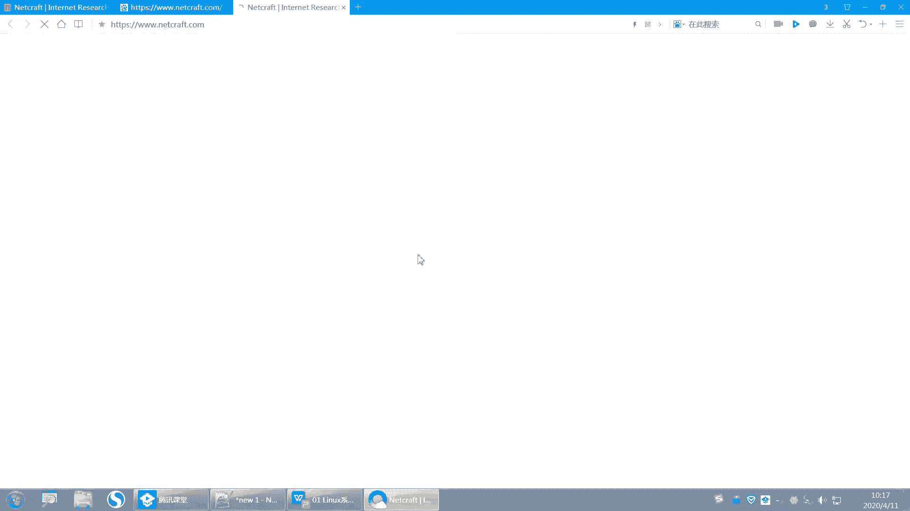

## 实验环境搭建：安装Linux系统

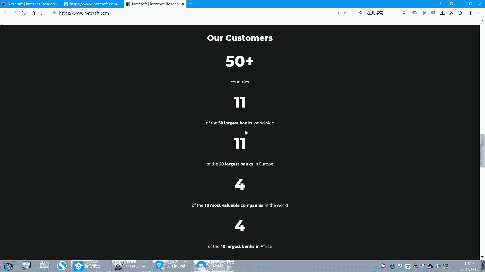

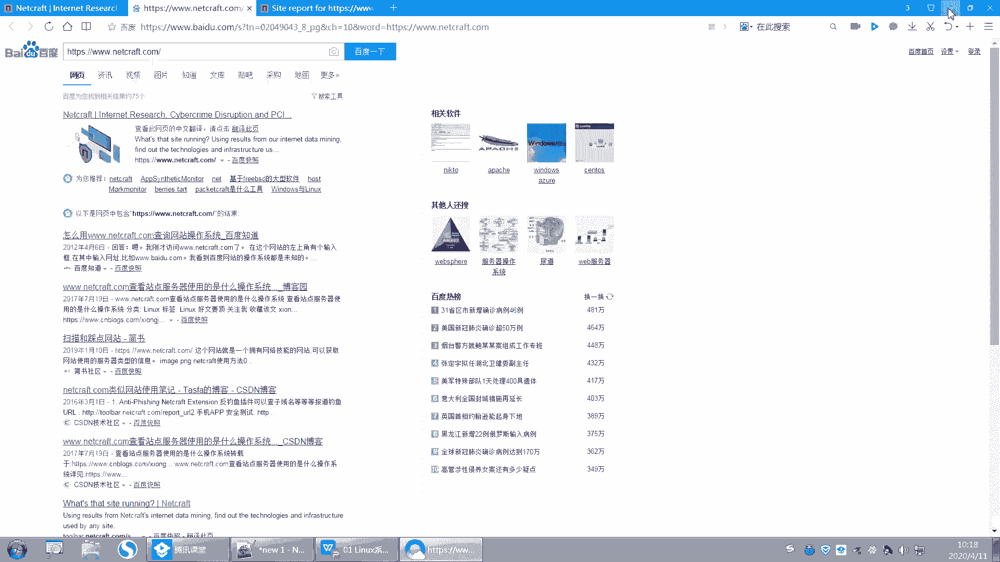

理论介绍完毕，现在我们来动手搭建实验环境。本节将指导你安装Linux系统。

### 所需软件准备
安装系统前，需要准备以下两个软件：
1.  **虚拟机软件**：推荐使用 **VMware Workstation**（版本15或更高）。也可使用开源的 **VirtualBox**。
2.  **系统镜像**：红帽企业版Linux 8.0（RHEL 8.0）的ISO镜像文件，大小约6.9GB。

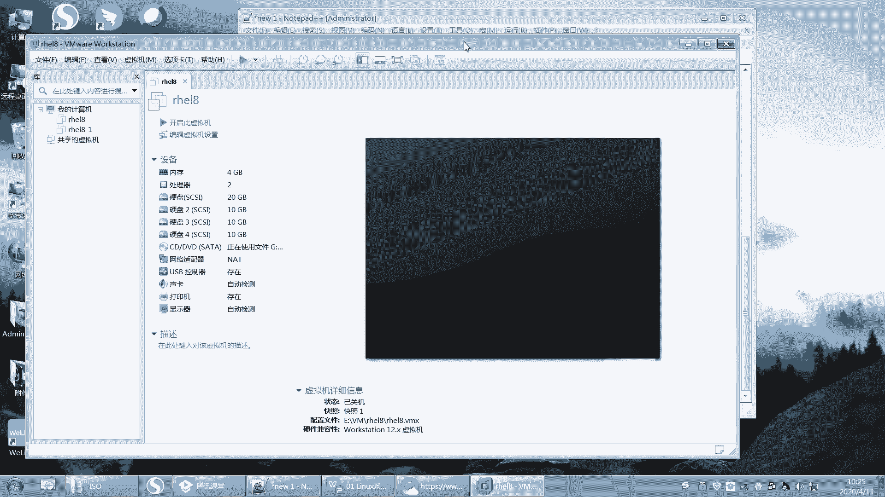

### 系统安装方式简介
常见的操作系统安装方式有以下几种：
*   **光盘安装**：最传统的方式，将ISO刻录到光盘进行安装。
*   **U盘安装**：将ISO制作成U盘启动盘进行安装。
*   **网络安装**：通过网络引导和获取安装文件，需要配置PXE等环境。
我们今天将在虚拟机中使用光盘（ISO镜像）安装方式，这是最便捷的学习方法。

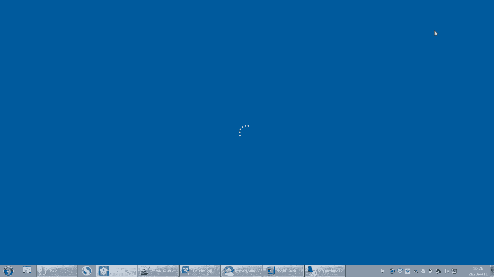

---

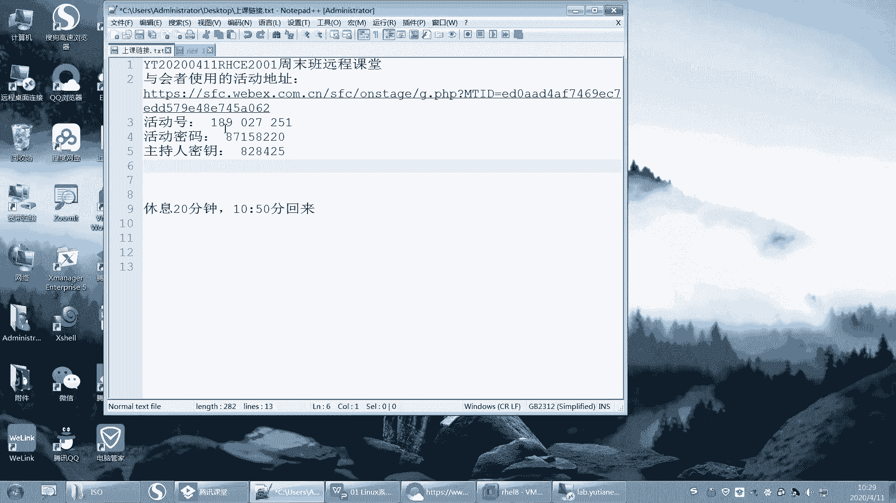

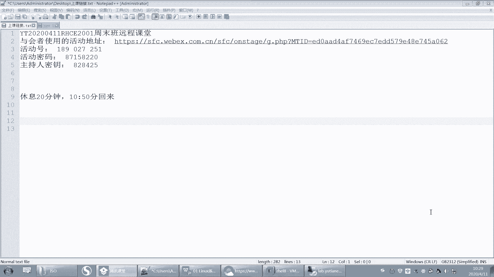

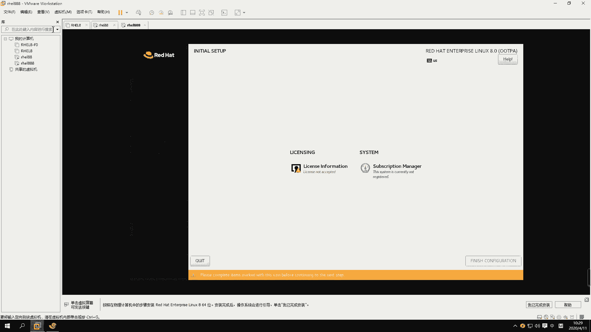

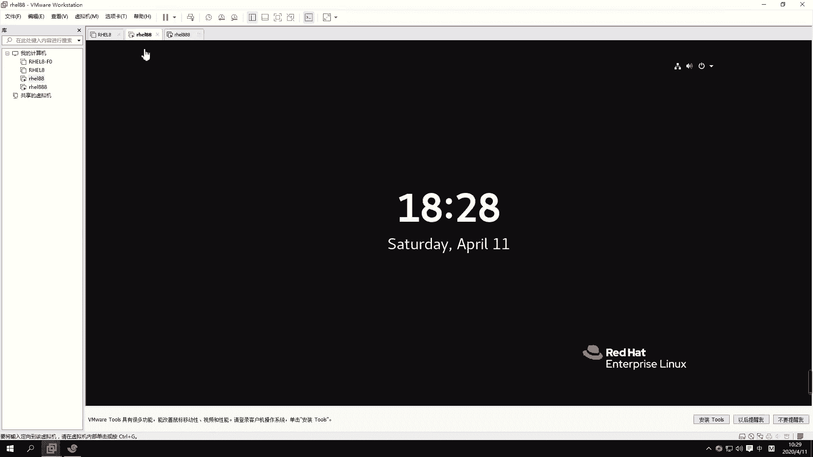

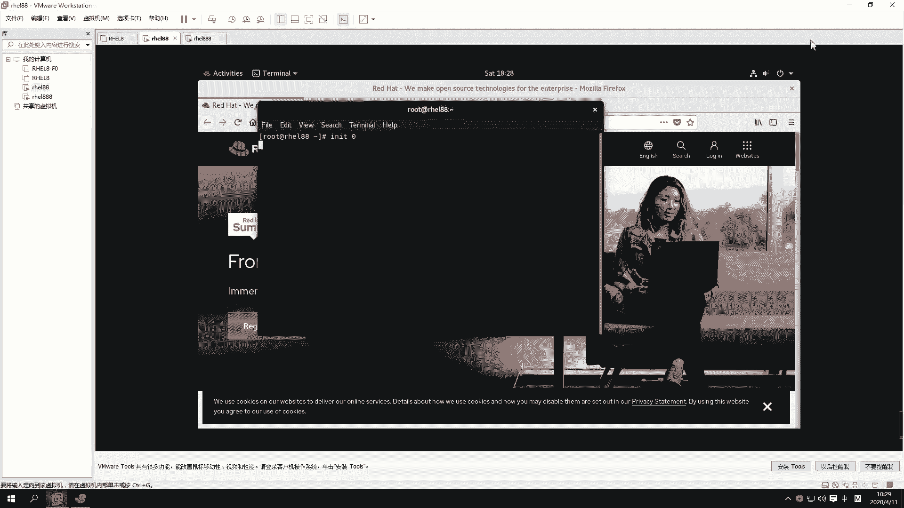

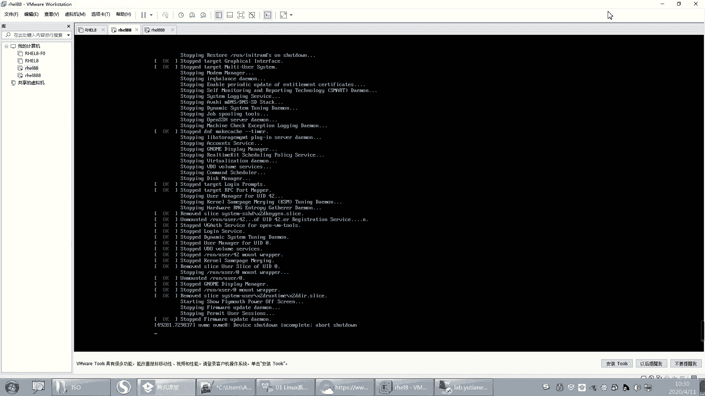

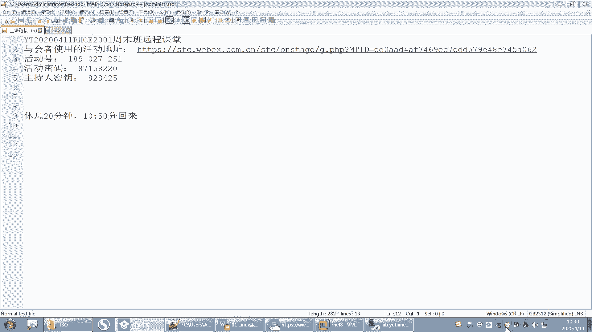

本节课中我们一起学习了课程的基本要求、红帽认证的完整体系、Linux系统的重要性以及职业发展建议。最后，我们开始了实验环境搭建的第一步——准备安装所需的软件。从下节课开始，我们将正式进入Linux的世界，进行系统安装和基础操作的学习。