# Linux基础教程：P21：文件拥有人和拥有组之chown和chgrp使用

## 概述
在本节课中，我们将要学习如何修改Linux系统中文件的拥有人和拥有组。这是管理文件权限的第一步，理解并掌握`chown`和`chgrp`命令的使用至关重要。


---

## 文件权限匹配机制
访问任何文件或目录时，系统会进行两步权限匹配。

第一步是**匹配身份**。系统会判断当前用户是文件的拥有人、拥有组成员，还是其他人。

第二步是**匹配权限**。根据匹配到的身份，系统会检查该身份对应的`rwx`权限。

因此，修改权限涉及两个核心操作：修改文件的拥有人/拥有组，以及修改对应身份的权限。本节我们先学习如何修改拥有人和拥有组。

---

## 修改拥有人和拥有组
修改文件的拥有人和拥有组，通常需要使用`root`用户权限，普通用户可能没有相应权限。

### 修改拥有人：`chown`命令
`chown`命令用于修改文件的拥有人。其基本语法为：
```bash
chown 新拥有人 文件名
```
例如，将文件`passwd`的拥有人修改为`user4`：
```bash
chown user4 passwd
```
执行后，文件的拥有人即变为`user4`。

### 修改拥有组：`chgrp`命令
`chgrp`命令用于修改文件的拥有组。其基本语法为：
```bash
chgrp 新拥有组 文件名
```
例如，将文件`passwd`的拥有组修改为`user5`：
```bash
chgrp user5 passwd
```

### 同时修改拥有人和拥有组
使用`chown`命令可以一步完成对拥有人和拥有组的修改。语法为：
```bash
chown 新拥有人:新拥有组 文件名
```
例如，将文件`passwd`的拥有人改为`user1`，拥有组改为`user4`：
```bash
chown user1:user4 passwd
```
**注意**：指定的组必须存在于系统中，否则会报错“无效的组”。

### 仅修改拥有组（使用`chown`）
`chown`命令也可以仅修改拥有组，此时需要在组名前加上冒号。这样就不必单独记忆`chgrp`命令。
```bash
chown :新拥有组 文件名
```
例如，将文件`passwd`的拥有组修改为`root`：
```bash
chown :root passwd
```

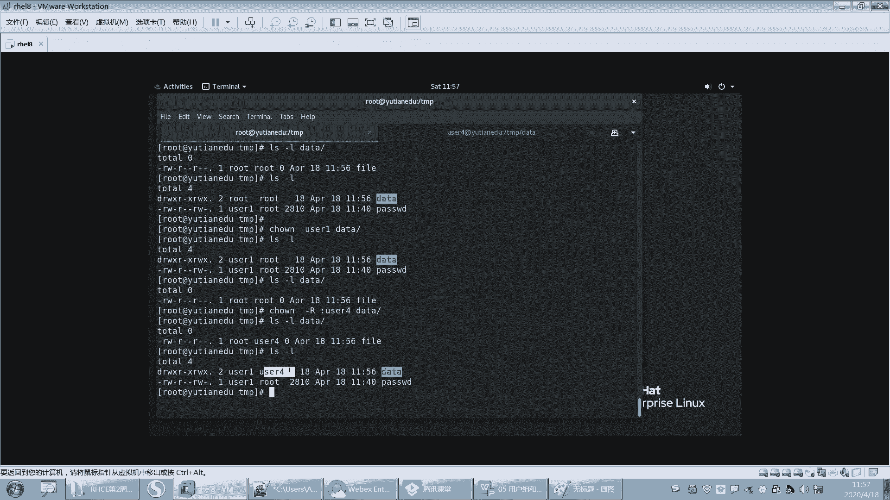

---

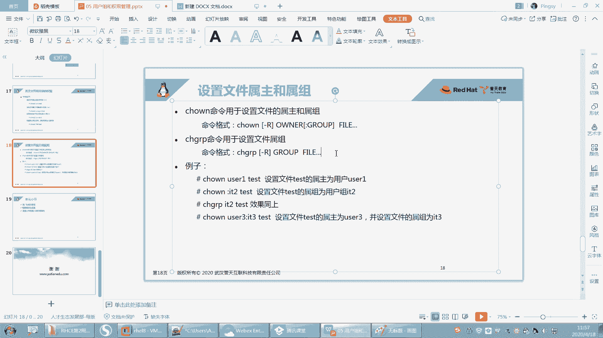

## 递归修改目录权限
当修改目录的拥有人或拥有组时，默认只影响目录本身，不影响目录内的文件和子目录。

例如，创建目录`/data`并在其中创建文件`file`。使用`chown user1 /data`命令后，目录`/data`的拥有人变为`user1`，但其内部文件`file`的拥有人仍为`root`。

如果需要同时修改目录及其内部所有内容的拥有人/拥有组，需要使用递归选项`-R`。

以下是递归修改的命令示例：
```bash
chown -R 新拥有人:新拥有组 目录名
```
例如，将`/data`目录及其下所有内容的拥有人和拥有组都改为`user4`：
```bash
chown -R user4:user4 /data
```
执行后，`/data`目录本身及其内部的`file`文件的拥有人和拥有组都会变为`user4`。

---

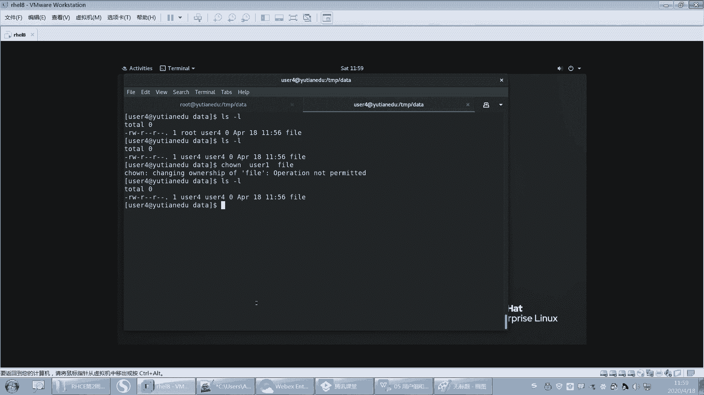

## 修改权限的约束条件
并非所有用户都能随意修改文件的拥有人和拥有组，存在以下约束：

1.  **修改文件拥有人**：只有`root`用户才有权限修改文件的拥有人。即使是文件当前的拥有人，也无法将自己拥有的文件转让给其他用户。
2.  **修改文件拥有组**：`root`用户和**文件的拥有人**可以修改文件的拥有组。但拥有人修改时有一个前提：**该拥有人必须是目标拥有组的成员**。

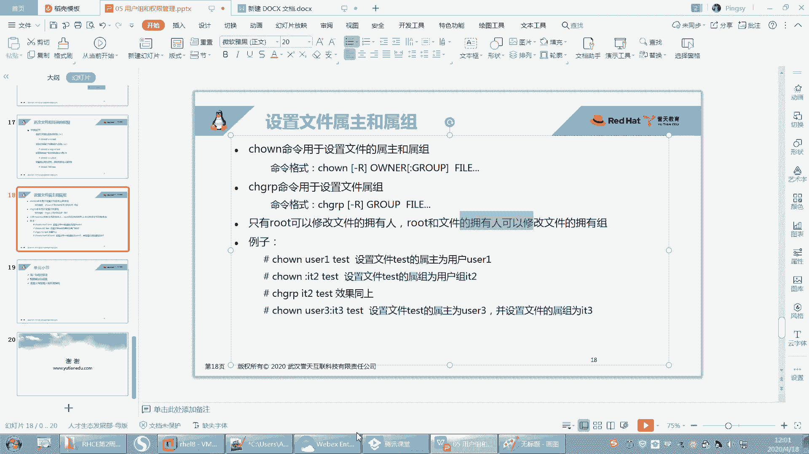

例如，用户`user4`是文件`file`的拥有人。如果`user4`想将文件的拥有组改为`group1`，那么`user4`自己必须先被加入到`group1`组中。可以使用`usermod`命令将用户加入附加组：
```bash
usermod -aG group1 user4
```
之后，`user4`才能成功执行`chown :group1 file`命令。

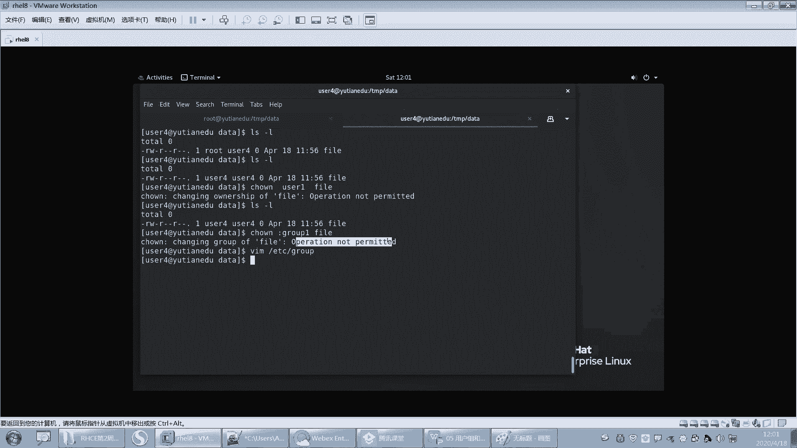

---

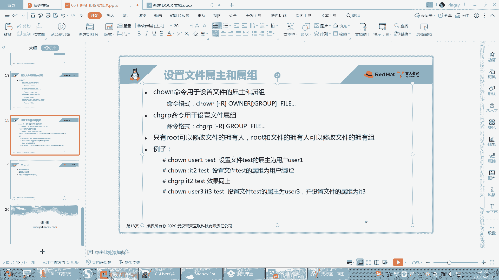

## 命令格式总结
以下是本节核心命令的格式总结：

*   **`chown`命令格式**：
    ```bash
    chown [选项] 新拥有人[:新拥有组] 文件或目录
    ```
    常用选项：`-R` 递归修改。

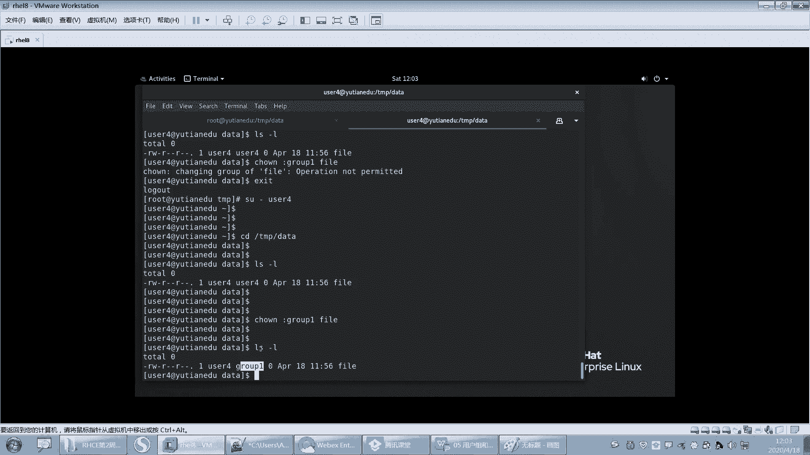

*   **`chgrp`命令格式**：
    ```bash
    chgrp [选项] 新拥有组 文件或目录
    ```
    常用选项：`-R` 递归修改。

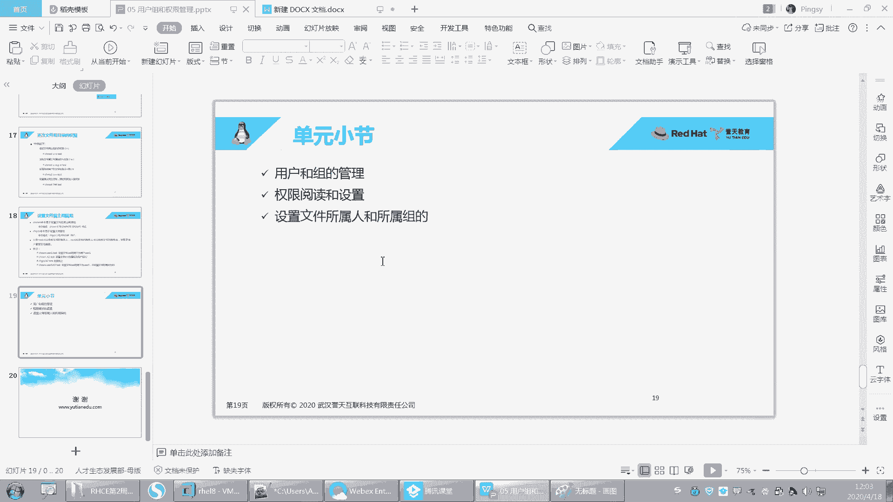

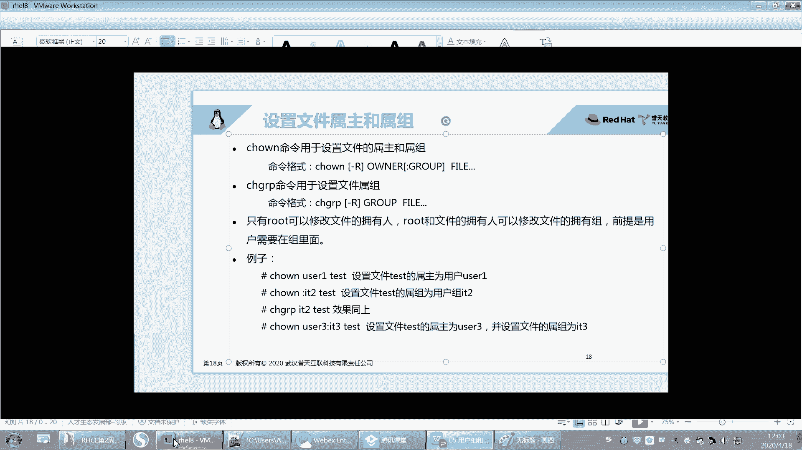

---

## 总结
本节课中我们一起学习了Linux文件权限管理的基础部分——修改文件的拥有人和拥有组。

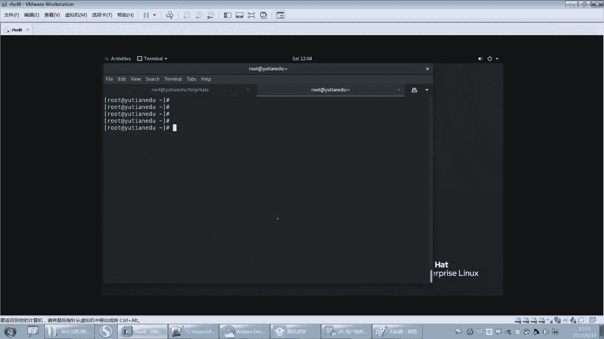

我们掌握了`chown`和`chgrp`命令的基本用法，包括如何单独或同时修改拥有人和拥有组，以及如何使用`-R`选项递归修改目录权限。

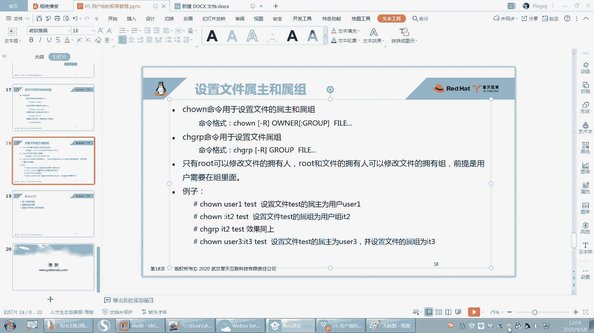

更重要的是，我们理解了修改这些属性的权限约束：只有`root`能修改拥有人；`root`和文件拥有人（需是目标组成员）能修改拥有组。这些规则是Linux系统安全性的重要体现，请务必牢记。