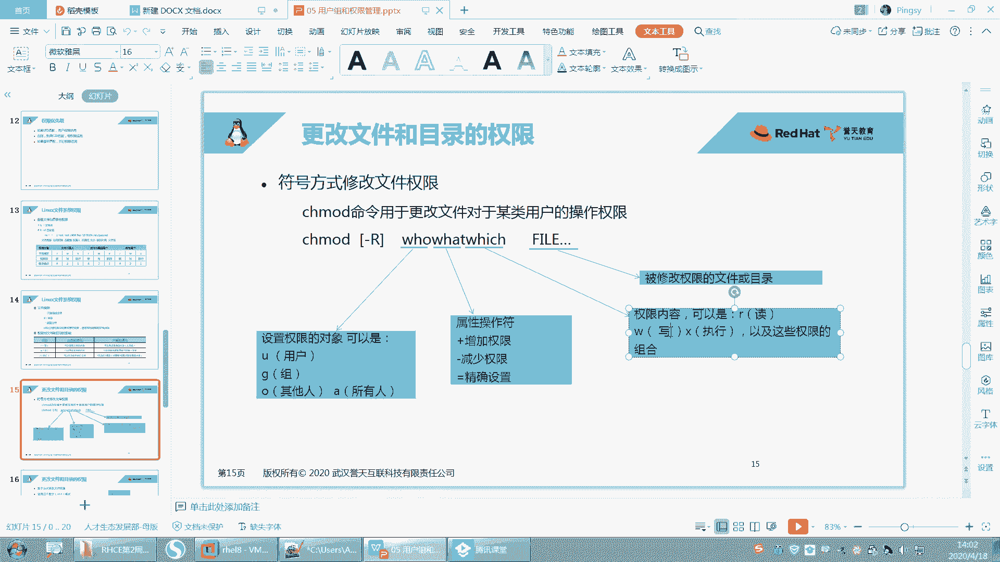
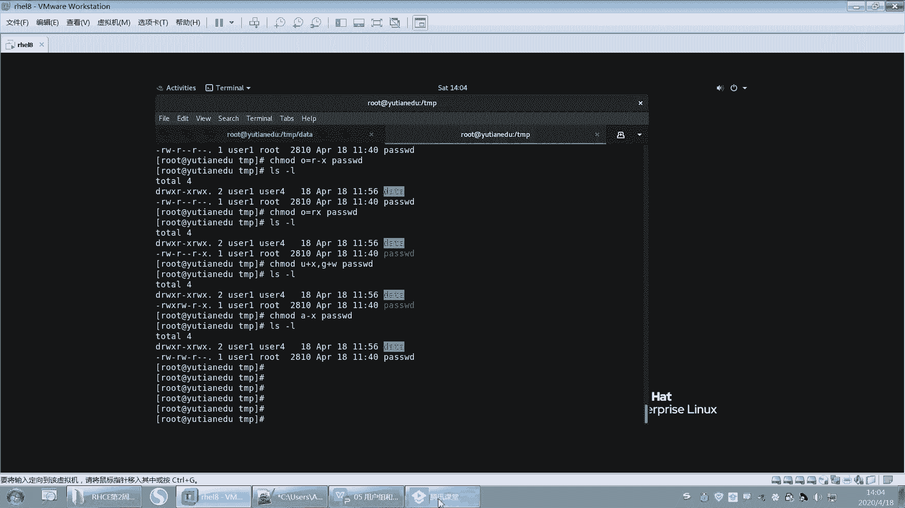
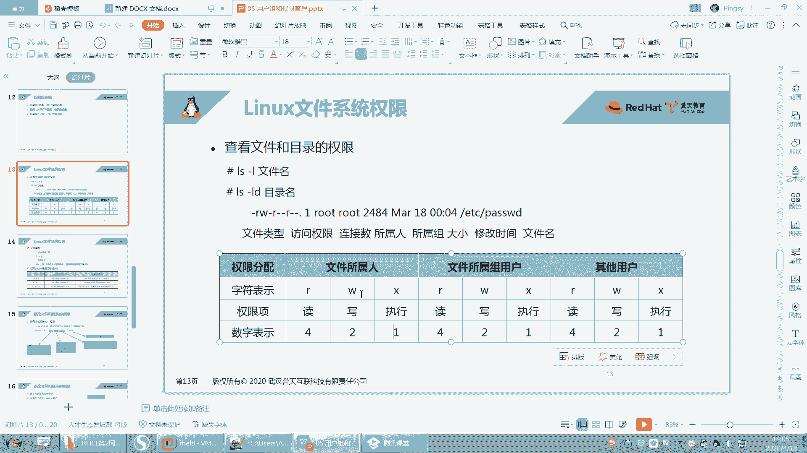
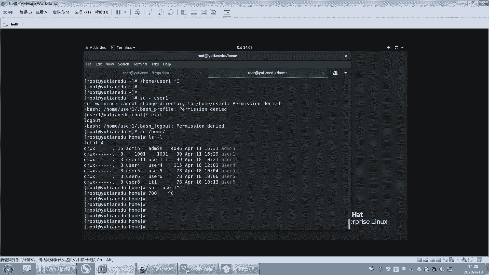
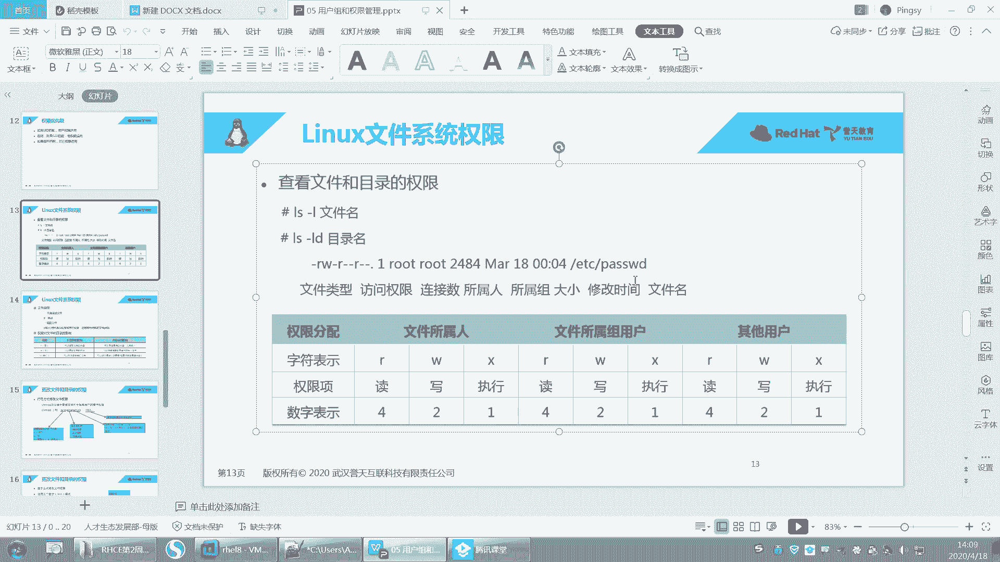
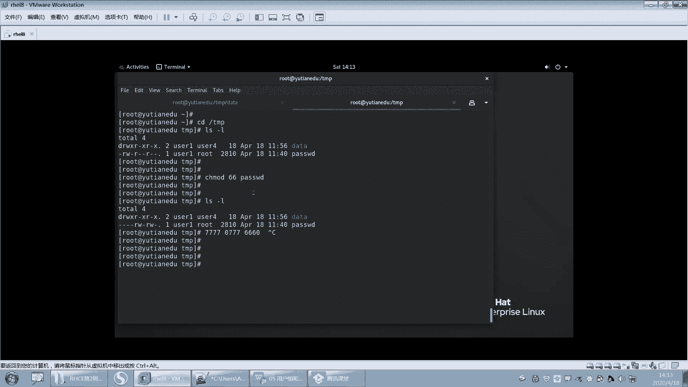
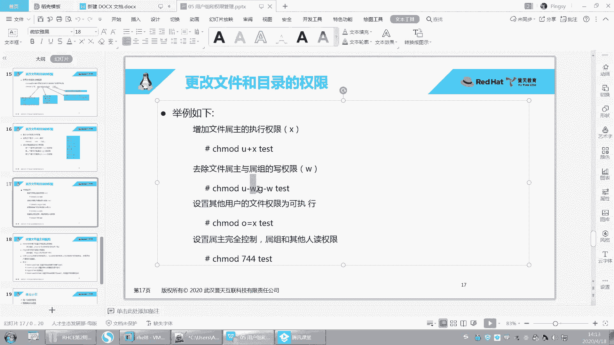
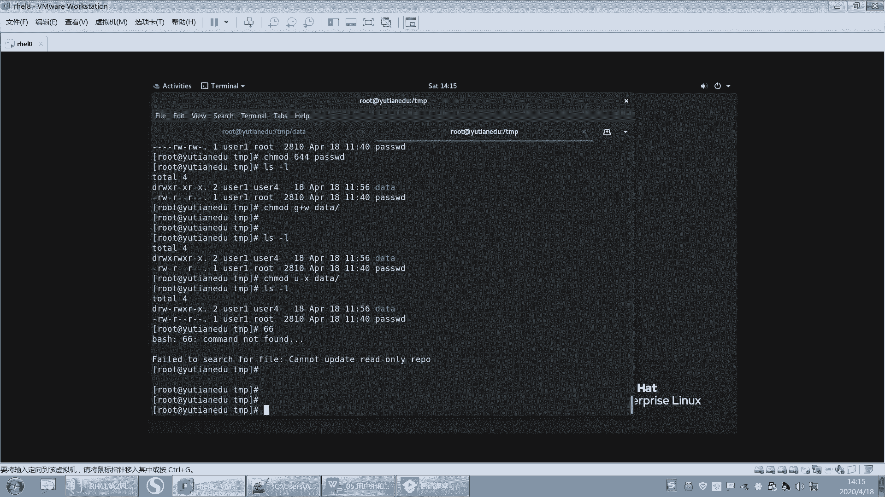
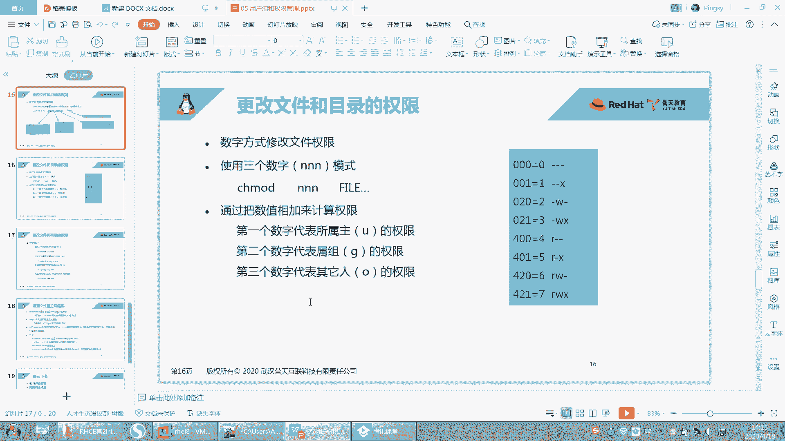
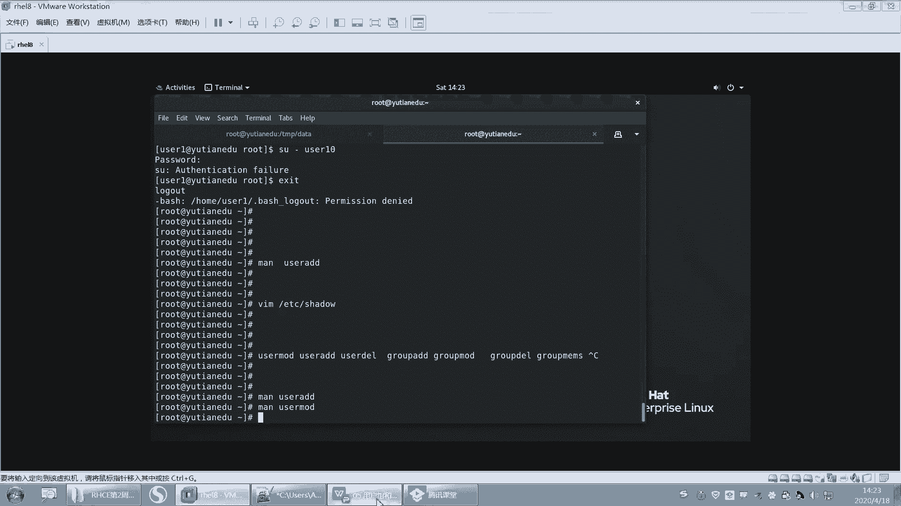

# Linux基础教程：P22：文件权限的修改之chmod使用及用户组权限补充 🔧

在本节课中，我们将要学习如何修改文件和目录的权限，这是Linux系统管理中非常核心的技能。我们将重点掌握`chmod`命令的两种使用方式，并深入理解用户、组和其他人权限的数字与字符表示法。

## 权限修改命令：chmod



上一节我们介绍了文件权限的基本概念和查看方法。本节中我们来看看如何使用`chmod`命令来修改这些权限。

`chmod`命令用于更改文件或目录对于某类用户的操作权限。其基本语法结构可以理解为：**给谁（who）执行什么操作（what）赋予何种权限（which）**。

以下是`chmod`命令字符表示法的核心参数：



*   **who（给谁修改）**：
    *   `u`：代表文件或目录的**拥有人**（user）。
    *   `g`：代表文件或目录的**拥有组**（group）。
    *   `o`：代表**其他人**（others）。
    *   `a`：代表**所有人**（all），即 u、g、o 的总和。

*   **what（执行什么操作）**：
    *   `+`：在现有权限基础上**增加**权限。
    *   `-`：在现有权限基础上**减少**权限。
    *   `=`：将权限**设置**为指定的值。



*   **which（赋予何种权限）**：
    *   `r`：读权限。
    *   `w`：写权限。
    *   `x`：执行权限。

## chmod 字符表示法示例

现在，我们通过一些具体的例子来演示如何使用字符表示法修改权限。

假设我们有一个文件 `passwd`，我们想让它的拥有组增加写（w）权限，可以执行以下命令：
```bash
chmod g+w passwd
```



如果我们想同时移除拥有组和其他人的写权限，可以组合使用参数：
```bash
chmod go-w passwd
```



我们还可以使用等号（=）直接设置权限。例如，将其他人的权限设置为只有读和执行（rx），没有写权限：
```bash
chmod o=rx passwd
```

`chmod`命令支持用逗号分隔，一次性为多类用户修改权限。例如，为拥有人增加执行权限，同时为拥有组增加写权限：
```bash
chmod u+x,g+w passwd
```

如果要为所有用户移除执行权限，可以使用：
```bash
chmod a-x passwd
```

如果需要递归修改一个目录及其内部所有文件的权限，需要加上 `-R` 选项，这与修改文件拥有人和拥有组的命令逻辑一致。

## chmod 数字表示法



除了字符表示法，我们还可以使用数字来代表权限，这种方式更为简洁。每个权限都有一个对应的数字：



*   `r`（读） = **4**
*   `w`（写） = **2**
*   `x`（执行） = **1**

没有任何权限则用 **0** 表示。我们将拥有人、拥有组和其他人三部分的权限数字相加，就得到了一个三位数。

例如，如果拥有人有 `rwx` 权限，那么计算方式是：4(r) + 2(w) + 1(x) = **7**。如果拥有组有 `r-x` 权限，则是：4(r) + 0(无w) + 1(x) = **5**。



因此，权限 `rwxr-xr--` 用数字表示就是 **754**。



使用数字表示法修改权限非常直接。例如，将文件权限设置为所有人都可读、写、执行：
```bash
chmod 777 passwd
```

将权限改为拥有人可读写，拥有组和其他人只可读：
```bash
chmod 644 passwd
```

## 数字表示法的注意事项

在使用数字表示法时，有一个重要的细节需要注意：权限数字应该是三位。如果少写了一位，系统会在**前面**自动补零，而不是在后面补。

例如，执行 `chmod 66 passwd`，系统会将其理解为 `066`。这意味着拥有人权限为0（无任何权限），拥有组和其他人权限为6（rw-）。

这是因为Linux文件权限实际上由四位数字组成，第一位用于设置特殊权限（后续课程会学到）。当我们只写三位时，默认第一位是0。所以 `chmod 777` 等价于 `chmod 0777`。

## 两种表示法的选用

字符表示法和数字表示法各有优势，应根据实际情况选择：

*   **数字表示法**适合在**已知目标权限**时进行设置。例如，明确要将权限改为 `755`，直接使用 `chmod 755 filename` 非常方便。
*   **字符表示法**适合**只修改部分权限**而保持其他权限不变时使用。例如，只想为拥有组增加写权限，使用 `chmod g+w filename` 比用数字计算后再修改更直观，也不容易出错。

原则是：用最简洁、最不易出错的方式达到目的。

## 课程回顾与总结

本节课中我们一起学习了文件权限管理的核心命令 `chmod`。我们来回顾一下本章涉及的重点：

1.  **关键文件**：我们学习了 `/etc/passwd`（存储用户信息）和 `/etc/group`（存储组信息）文件的结构和含义。**注意**：手动编辑这些系统文件极易出错，应优先使用专用命令（如 `usermod`, `groupmod`）进行修改。
2.  **用户管理命令**：包括创建用户 (`useradd`)、修改用户属性 (`usermod`)、删除用户 (`userdel`) 以及修改密码 (`passwd`)。
3.  **组管理命令**：包括创建组 (`groupadd`)、修改组 (`groupmod`)、删除组 (`groupdel`) 和管理组成员 (`gpasswd`)。
4.  **权限修改命令**：`chmod`，掌握其字符表示法 (`u/g/o/a`, `+/-/=`, `r/w/x`) 和数字表示法 (4,2,1)。理解数字表示法中“前补零”的规则。
5.  **一个重要概念**：用户家目录（如 `/home/user1`）的默认权限是 `700`（`drwx------`）。这意味着只有用户自己可以进入和读写，其他人没有任何权限。这就是为什么你无法直接进入其他用户家目录的原因。



通过本课的学习，你已经掌握了Linux中管理用户、组和文件权限的基础操作，这是构建系统安全和管理能力的重要一步。