# Linux基础教程：P24：管道符的使用详解 🚀

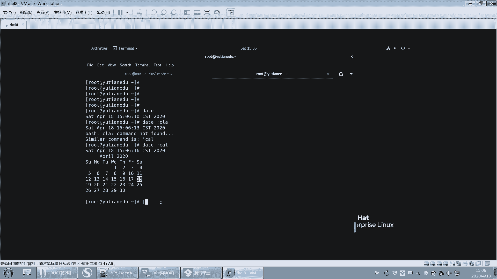

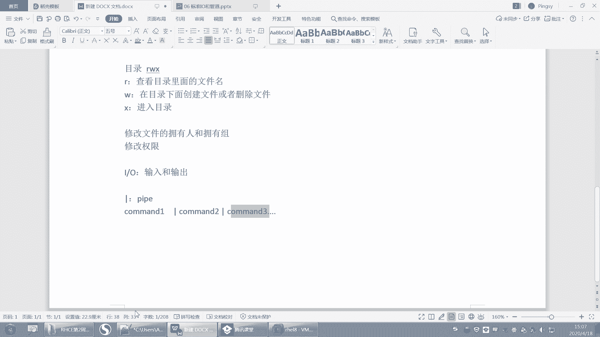

## 概述
在本节课中，我们将要学习Linux中一个非常强大且常用的符号——管道符（`|`）。管道符允许我们将多个命令连接起来，使前一个命令的输出作为后一个命令的输入，从而实现复杂的数据处理流程。掌握管道符是提升Linux命令行操作效率的关键。

## 管道符的基本概念
上一节我们介绍了使用分号（`;`）连接多个命令，但命令之间没有逻辑关系。本节中我们来看看管道符，它能在命令间建立数据流关系。

管道符的英文是“pipe”，其基本语法如下：
```bash
command1 | command2 | command3 ...
```
其含义是：`command1` 执行的结果作为 `command2` 的输入，`command2` 执行的结果又作为 `command3` 的输入，以此类推。只要后续命令能接收前一个命令的输出，管道就可以一直连接下去。

## 管道符的作用与示例
正是因为有了管道符，Linux命令才能以各种灵活的方式组合在一起，完成复杂的任务。

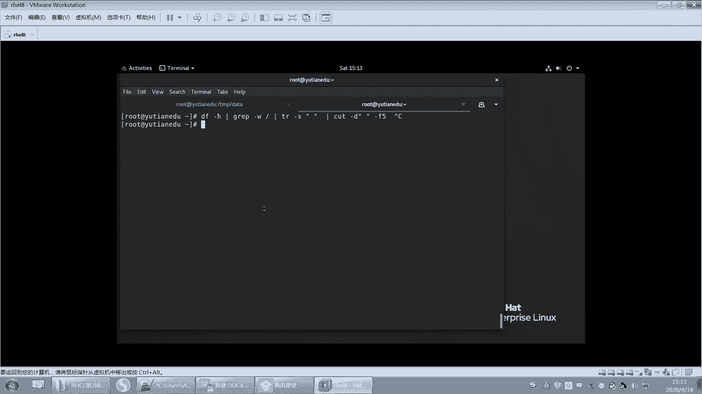

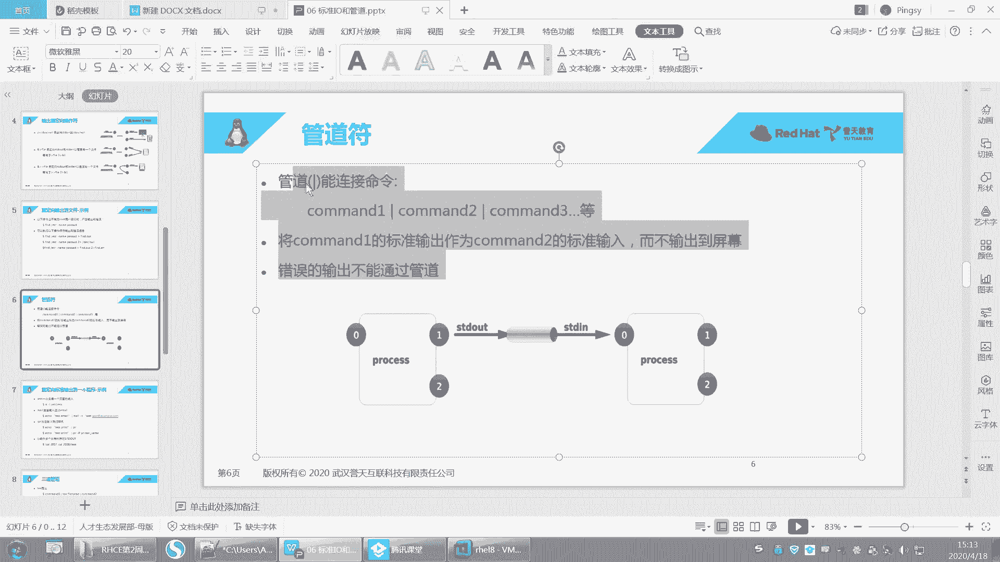

以下是几个核心作用点：
*   **组合命令**：将简单的命令串联，实现复杂功能。
*   **文本处理**：管道是文本处理流水线的核心，常用于筛选、统计、转换数据。
*   **避免中间文件**：无需将中间结果保存到临时文件，可以直接在内存中传递。

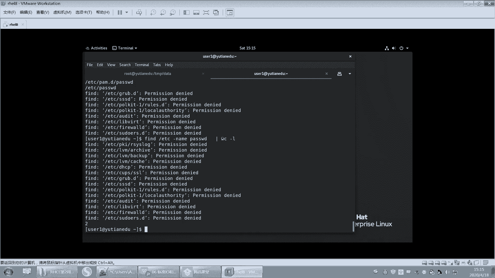

让我们通过一个具体例子来理解。假设我们想查找 `/etc` 目录下名为 `passwd` 的文件，并统计找到了多少行结果。

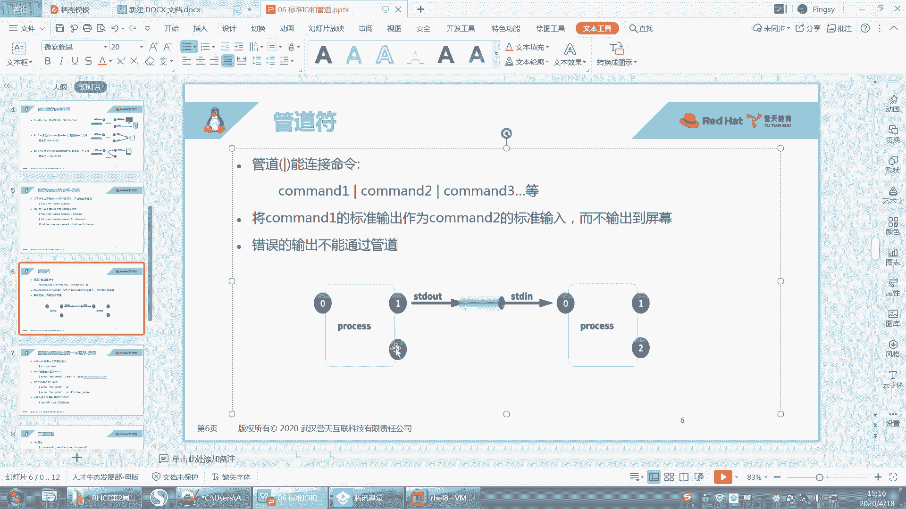

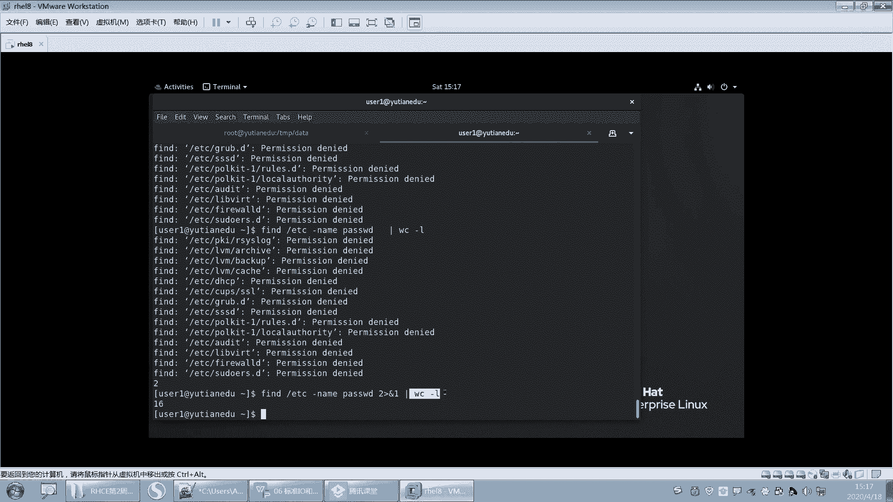

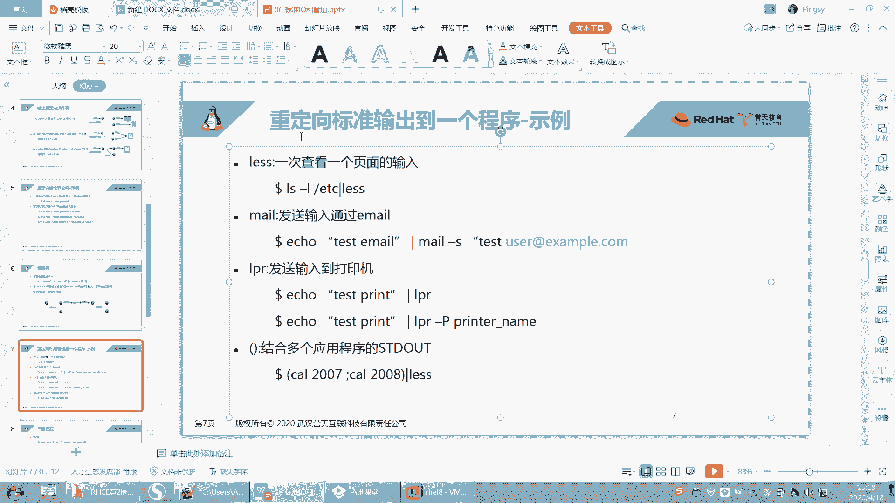

不使用管道，可能需要两步：
```bash
find /etc -name passwd > tempfile
wc -l tempfile
```

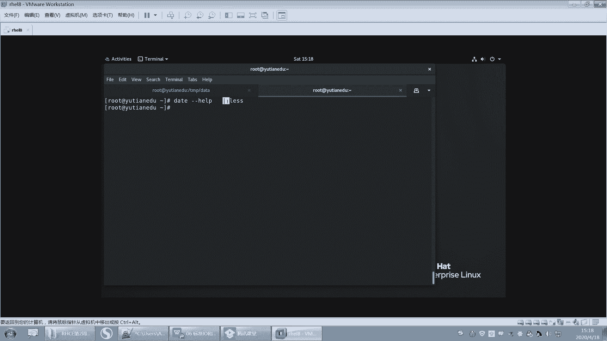

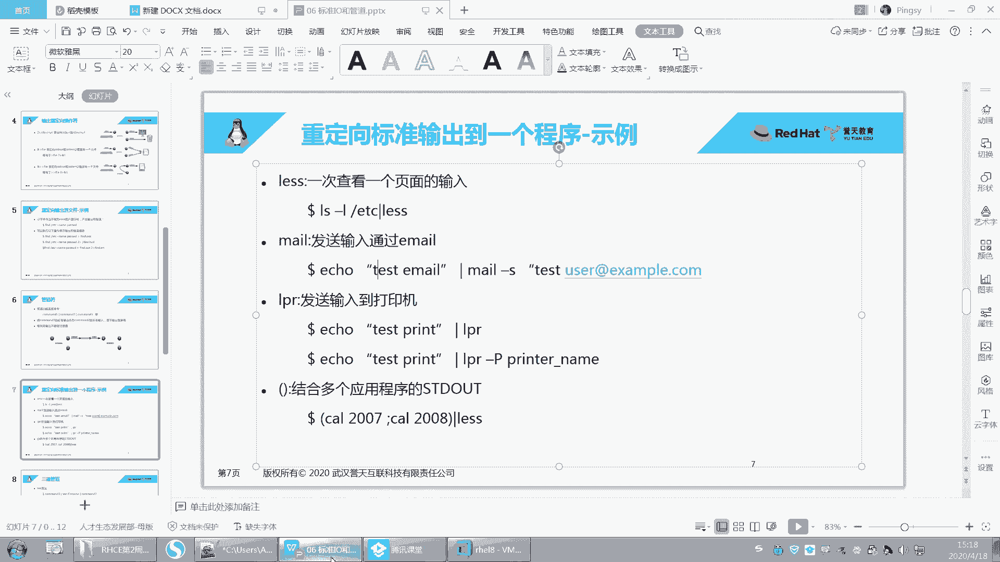

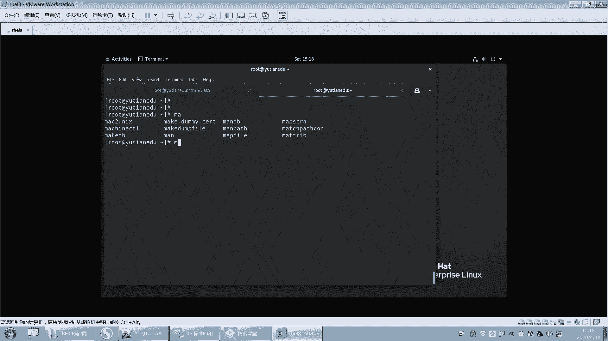

使用管道，则可以一步完成：
```bash
find /etc -name passwd | wc -l
```
在这个例子中，`find` 命令的输出（找到的文件路径列表）直接通过管道（`|`）传递给了 `wc -l` 命令，后者统计接收到的行数并输出结果。

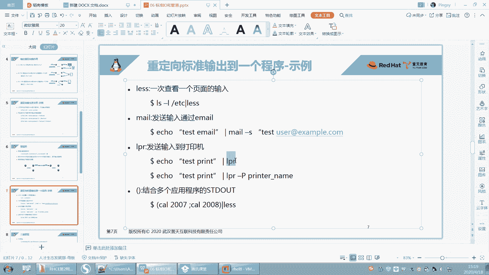

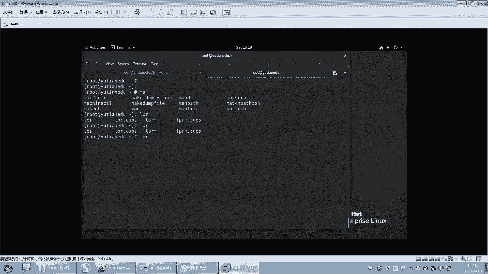


## 管道与错误输出
一个重要的特性是：**错误的输出默认不能通过管道**。

请看以下命令：
```bash
find /etc -name passwd 2>/dev/null | wc -l
```
如果 `find` 命令在执行过程中遇到权限错误（标准错误输出，文件描述符2），这些错误信息默认会直接显示在终端，而**不会**通过管道传递给 `wc -l` 命令。因此，`wc -l` 统计的只是正确的输出（标准输出，文件描述符1）的行数。

如果希望错误信息也能通过管道传递，需要将标准错误输出重定向到标准输出：
```bash
find /etc -name passwd 2>&1 | wc -l
```
这样，所有的输出（包括错误信息）都会通过管道传递给下一个命令。

## 管道的实用场景
管道符在Linux日常操作中应用广泛。

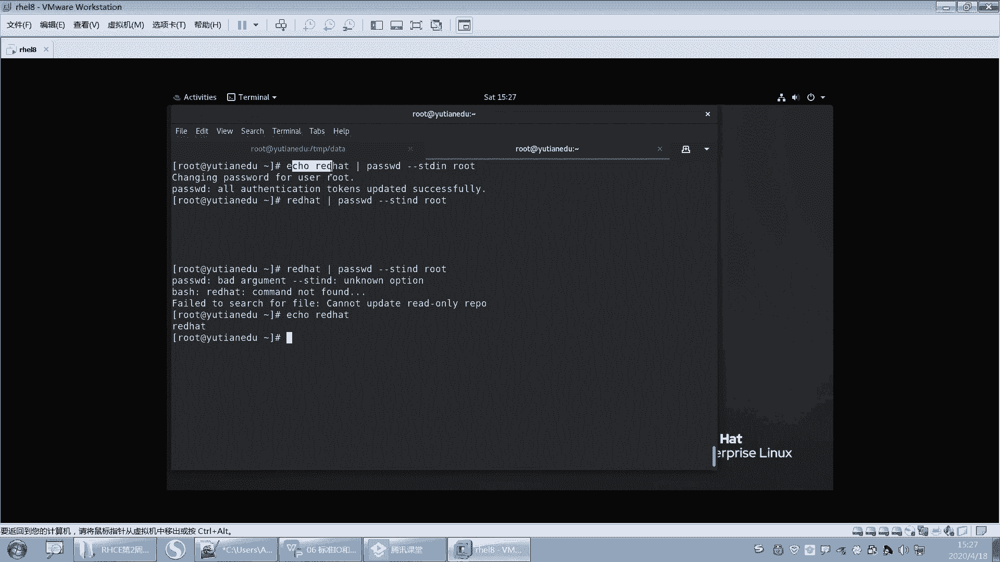

以下是几个典型的使用场景：
*   **分页查看长输出**：当命令输出内容很长时，可以将其传递给分页工具（如 `less`）方便浏览。
    ```bash
    dmesg | less
    ```
*   **组合文本处理工具**：这是管道最强大的用途之一。例如，要获取磁盘根分区（`/`）的使用率百分比数字：
    ```bash
    df -h | grep ‘/$’ | awk ‘{print $5}’ | cut -d‘%’ -f1
    ```
    这条命令通过多个管道连接：`df -h` 查看磁盘使用情况 -> `grep` 筛选出根分区所在行 -> `awk` 提取第五列（使用率） -> `cut` 去掉百分号，最终得到纯数字。
*   **非交互式执行命令**：有些命令通常需要交互式输入，但结合管道和特定选项可以自动化。例如，非交互式修改用户密码：
    ```bash
    echo “newpassword” | passwd --stdin username
    ```
    **注意**：`passwd` 命令需要 `--stdin` 选项来声明从标准输入（即管道）读取密码。

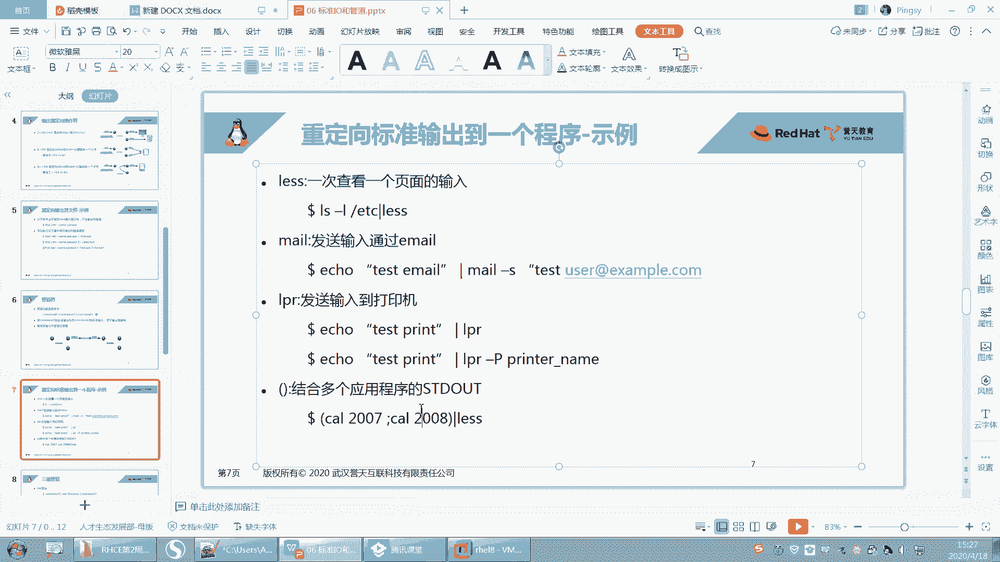

## 注意事项：命令的兼容性
**并非所有命令都可以接受来自管道的输入**。管道主要用于处理文本数据流。

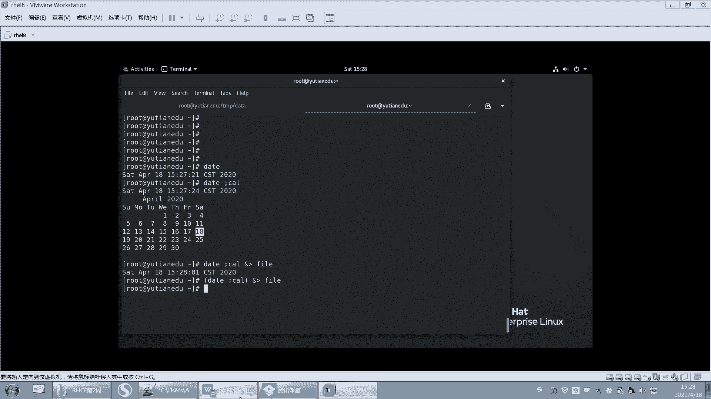

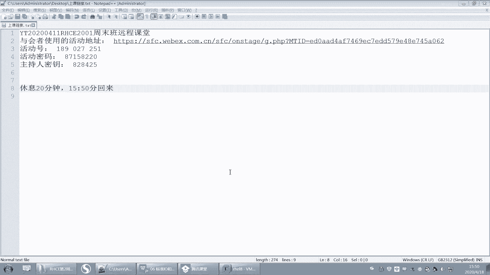

以下是使用管道时需要注意的几点：
*   **文本处理命令通常可以**：如 `grep`, `awk`, `sed`, `sort`, `wc`, `head`, `tail`, `less` 等。
*   **文件操作命令通常不行**：如 `cp`, `mv`, `rm`, `mkdir` 等命令的设计不是从标准输入读取操作参数，因此不能直接用在管道右侧。例如 `mkdir dirname | chmod 755 dirname` 这种写法是错误的，因为 `chmod` 不接收管道传来的“dirname”字符串作为参数。
*   **查看命令手册**：如果不确定一个命令是否能从标准输入读取数据，可以查阅其手册（`man command`），通常会说明是否支持 `--stdin` 或类似的选项。

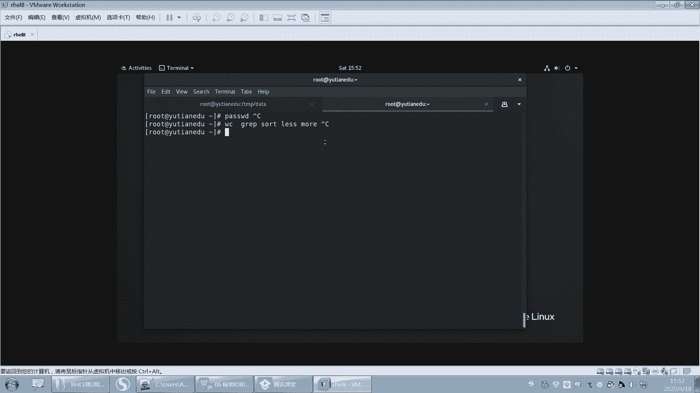

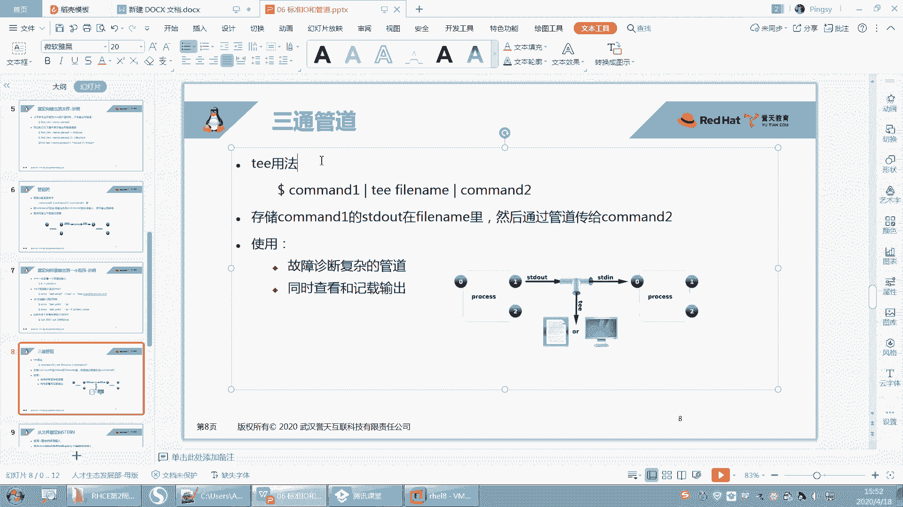

## 扩展知识：三通管道 (tee)
有时我们既想将命令的输出保存到文件，又想让它继续通过管道传递给下一个命令。这时可以使用 `tee` 命令。

`tee` 命令就像管道上的一个“三通”，它从标准输入读取数据，同时将数据写入文件和标准输出。

其基本用法如下：
```bash
command1 | tee file.txt | command2
```
例如，在调试一个复杂的管道命令时，我们可以用 `tee` 保存中间结果：
```bash
df -h | tee disk_usage.txt | grep ‘/$’ | tee root_line.txt | awk ‘{print $5}’
```
这样，`disk_usage.txt` 保存了 `df -h` 的完整输出，`root_line.txt` 保存了 `grep` 筛选后的行，最终还能看到 `awk` 处理后的结果。

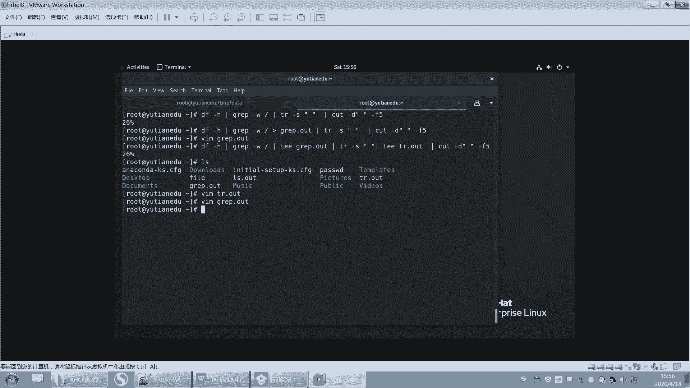

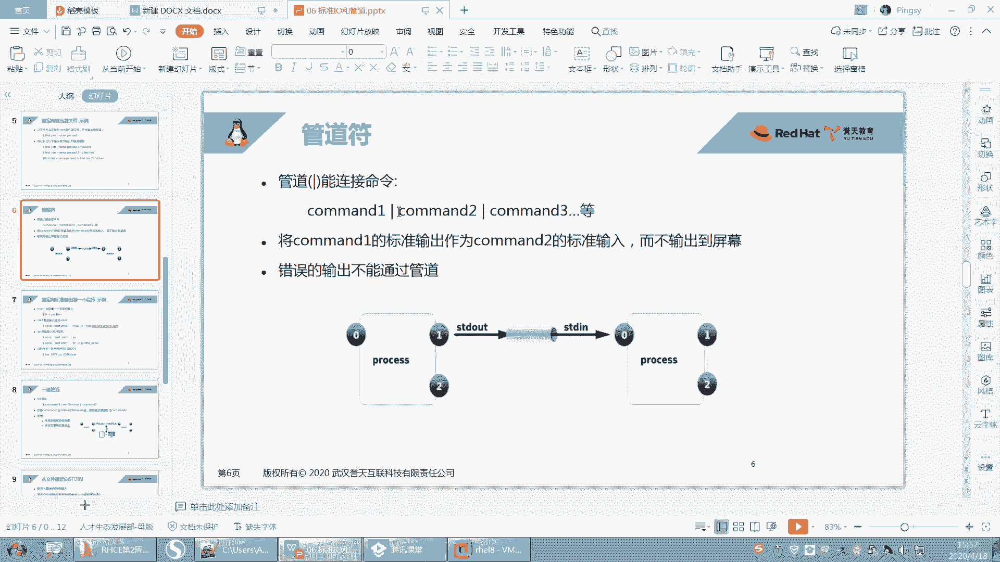

## 总结
本节课中我们一起学习了Linux管道符（`|`）的核心用法。我们了解了管道如何连接命令，将前一个命令的标准输出作为后一个命令的标准输入，从而构建强大的数据处理流水线。我们明确了错误输出默认不通过管道的特性，并学会了如何用 `2>&1` 进行重定向。我们还探讨了管道的典型应用场景、需要注意的命令兼容性问题，并介绍了用于分流输出的 `tee` 命令。熟练掌握管道是成为Linux高效用户的重要一步，它体现了Linux“组合小程序完成复杂任务”的设计哲学。