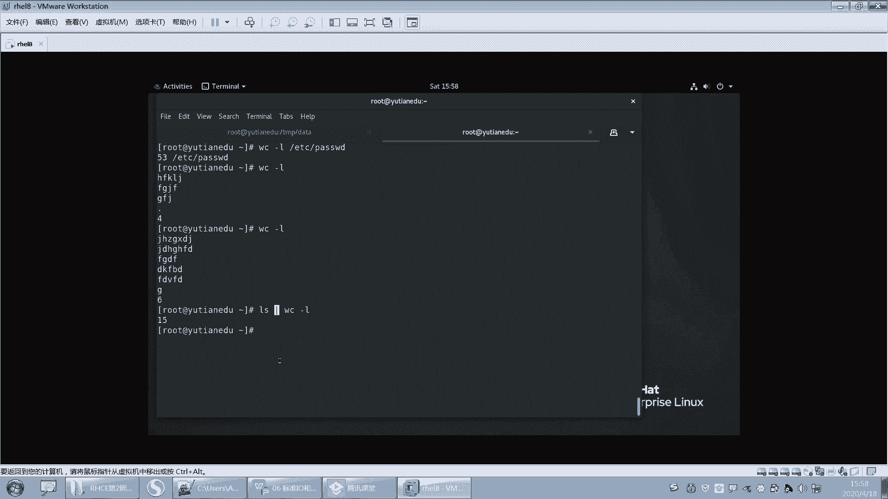
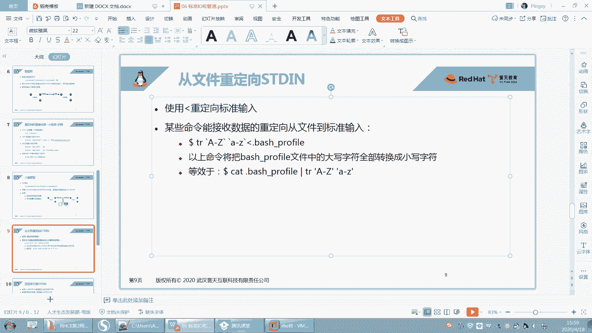
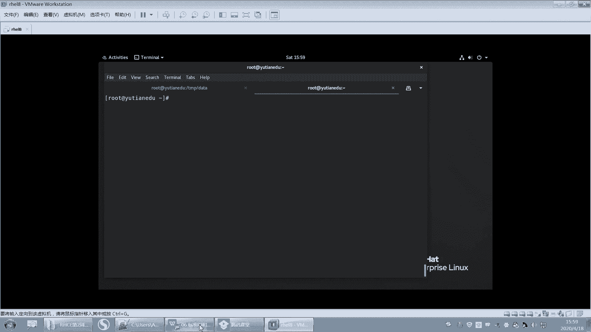
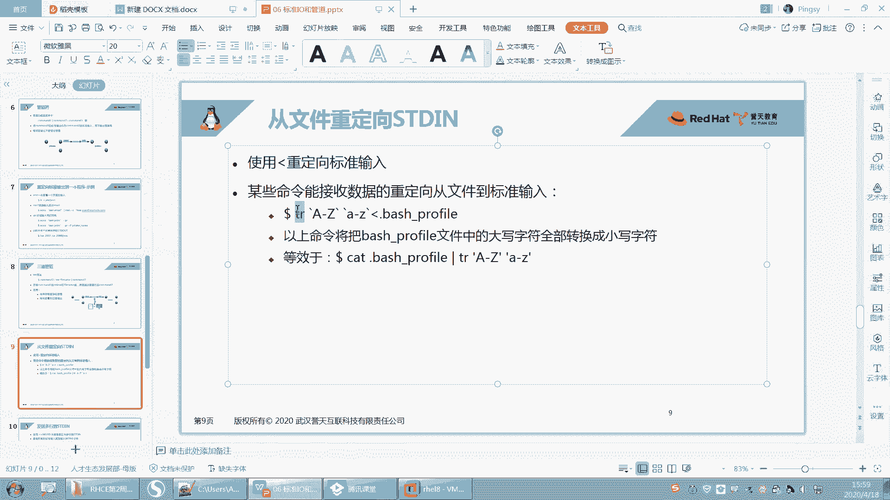
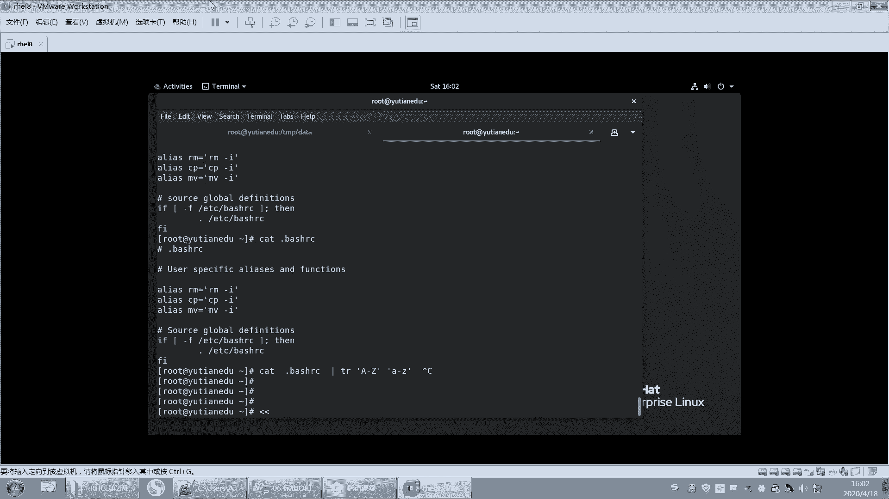
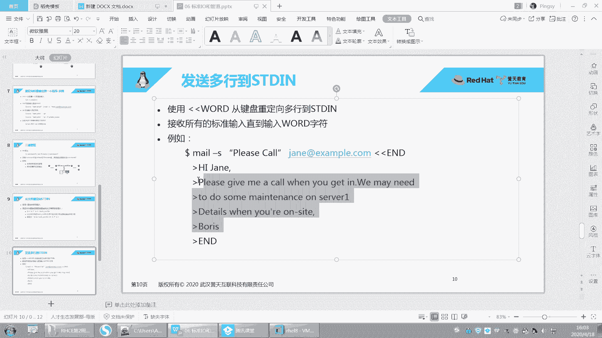
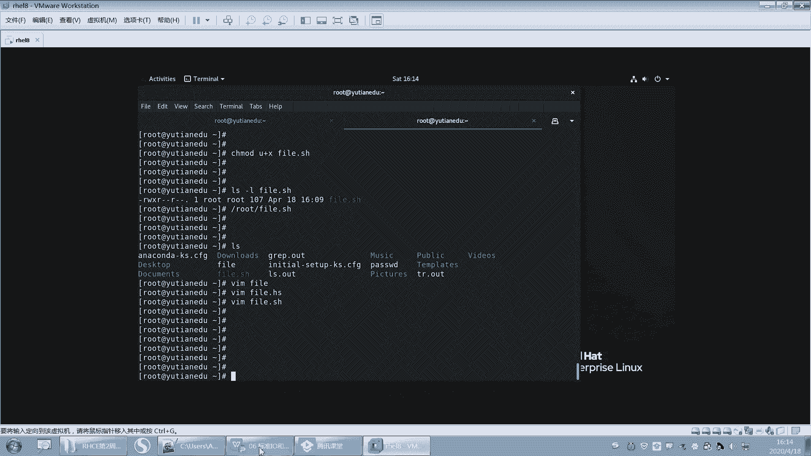
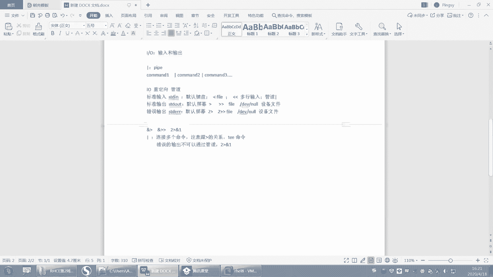

# Linux基础教程：P25：输入重定向的用法详解



在本节课中，我们将要学习Linux中一个重要的概念——输入重定向。我们将了解输入的不同来源，以及如何使用特定的符号来改变命令的输入源，特别是“多行输入”这一在脚本编写中非常实用的技巧。







## 输入的不同来源

上一节我们介绍了命令的基本输入输出。本节中我们来看看命令的输入具体可以来自哪里。

命令的输入通常有三种来源：

1.  **来自键盘**：这是最常见的交互式输入方式。例如，运行 `wc -l` 命令后，终端会等待你从键盘输入内容，按 `Ctrl+D` 结束输入，然后命令会统计你输入的行数。
2.  **来自文件**：许多命令可以直接将文件作为参数，从文件中读取输入。例如 `wc -l filename.txt` 会统计指定文件的行数。
3.  **来自管道**：管道符 `|` 可以将前一个命令的输出，作为后一个命令的输入。例如 `cat filename.txt | wc -l` 同样可以统计文件行数。

## 输入重定向符号 `<`





有些命令设计为默认从键盘接收输入。如果我们希望这些命令的输入来自文件，就需要用到输入重定向符号 `<`。

**公式**：`命令 < 文件名`

它的含义是：将“命令”原本从键盘（标准输入）获取数据，改为从“文件名”指定的文件中获取数据。

**示例**：`tr` 命令用于转换或删除字符。默认情况下，`tr ‘[A-Z]‘ ‘[a-z]‘` 会等待你从键盘输入，并将输入的大写字母转换为小写。

```
# 键盘输入示例（输入后按Ctrl+D结束）
tr ‘[A-Z]‘ ‘[a-z]‘
HELLO WORLD
hello world
```

如果我们想直接转换一个文件中的内容，可以使用输入重定向：

```
tr ‘[A-Z]‘ ‘[a-z]‘ < .bashrc
```

这条命令会将 `.bashrc` 文件中的所有大写字母转换为小写并输出。虽然这种用法可以用 `cat .bashrc | tr ‘[A-Z]‘ ‘[a-z]‘` 来替代，但了解 `<` 符号的机制是必要的。

## 多行输入符号 `<<`

“多行输入”是输入重定向中一个非常实用的功能，它使用两个小于号 `<<` 来实现。这个功能在编写Shell脚本时尤其常用。

**公式**：`命令 << 结束标记`

它的含义是：命令的输入来自紧随其后的多行文本，直到遇到单独一行的“结束标记”为止。

**示例**：我们可以用它来向一个文件写入多行内容，而无需多次使用 `echo` 命令。



以下是具体用法，它创建了一个简单的脚本，用于向文件追加多行文本：

```
cat >> /root/testfile.txt << EOF
This is line 1.
This is line 2.
This is line 3.
EOF
```

**代码解释**：
*   `cat >> /root/testfile.txt`：`cat` 命令将其接收到的内容**追加**（`>>`）到 `/root/testfile.txt` 文件中。
*   `<< EOF`：这表示接下来的所有行都是 `cat` 命令的输入，直到遇到单独一行的 `EOF`（End Of File，文件结束标记，可以是任何字符串，如`ABC`）为止。
*   中间的三行文本会被作为输入传递给 `cat`，并最终写入目标文件。
*   最后的 `EOF` 标记行本身不会被写入文件。

**脚本中的应用**：这个技巧在自动化脚本中极为有用。例如，你需要配置一个yum软件仓库，或者修改一个包含多行配置的文件，就可以将整个配置块通过 `<<` 一次性写入目标文件，使得脚本简洁且易于维护。

## 课程总结

本节课中我们一起学习了Linux中输入重定向的核心知识：

1.  **输入来源**：回顾了命令输入的三种主要来源——键盘、文件和管道。
2.  **输入重定向 `<`**：学习了如何使用 `<` 符号将命令的输入从默认的键盘重定向到指定的文件。
3.  **多行输入 `<<`**：重点掌握了 `<<` 符号的用法。它允许我们将一段多行文本直接作为命令的输入，并通过一个自定义的“结束标记”来界定输入范围。这是在Shell脚本中进行多行文本编辑和配置的利器。



理解并熟练运用输入重定向，尤其是多行输入，将极大地提升你在命令行操作和脚本编写时的效率和能力。