# Linux基础教程：P29：文本处理工具之grep高级文本过滤工具 🔍

在本节课中，我们将要学习一个非常强大的文本处理工具——`grep`。`grep`命令用于在文件中搜索指定的字符串模式，并以行为单位将匹配的行过滤出来。它是Linux系统管理和脚本编写中不可或缺的工具。

## 概述

`grep`命令的核心功能是文本过滤。它可以根据我们提供的关键词，在指定的文件或输入流中查找匹配的行。本节我们将详细介绍`grep`的各种常用选项，并通过实例演示其用法，帮助你掌握这个强大的工具。

## 基本用法

`grep`命令的基本语法是：`grep [选项] 关键词 文件名`。它会在指定的文件中搜索包含“关键词”的行。

例如，我们想在 `/etc/passwd` 文件中查找包含“root”的行，可以执行：
```bash
grep root /etc/passwd
```
这条命令会输出 `/etc/passwd` 文件中所有包含“root”字符串的行。

## 常用选项详解

`grep`命令的强大之处在于其丰富的选项，可以满足各种复杂的过滤需求。以下是`grep`的一些核心选项及其功能。

### 精确匹配单词 (`-w`)

默认情况下，`grep`会匹配行中任何包含关键词字符串的部分。但有时我们只想匹配一个完整的单词。

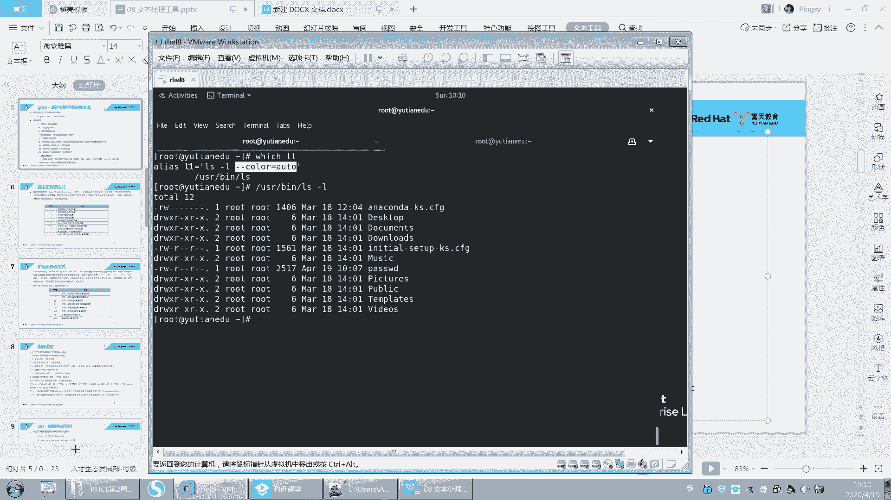


例如，使用 `df -h` 查看磁盘信息时，我们想精确过滤出挂载点为根目录“/”的那一行。如果只用 `grep /`，会匹配出所有包含斜杠的行。这时就需要使用 `-w` 选项进行精确单词匹配：
```bash
df -h | grep -w /
```
`-w` 选项确保只匹配作为一个独立单词的“/”。

### 忽略大小写 (`-i`)

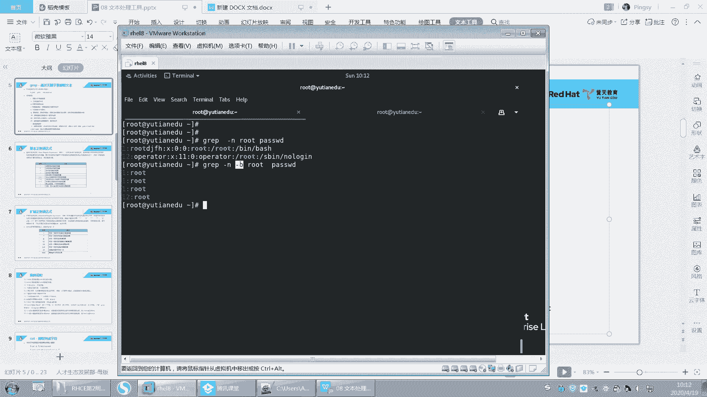

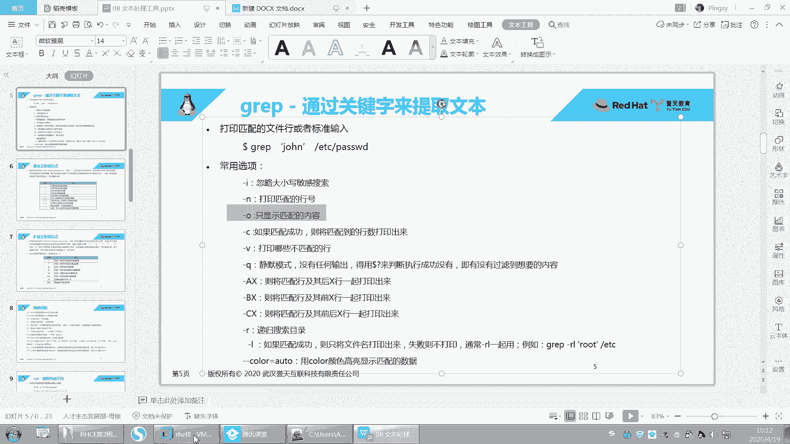

搜索时，我们可能不关心字母的大小写。`-i` 选项可以让 `grep` 在匹配时忽略大小写。

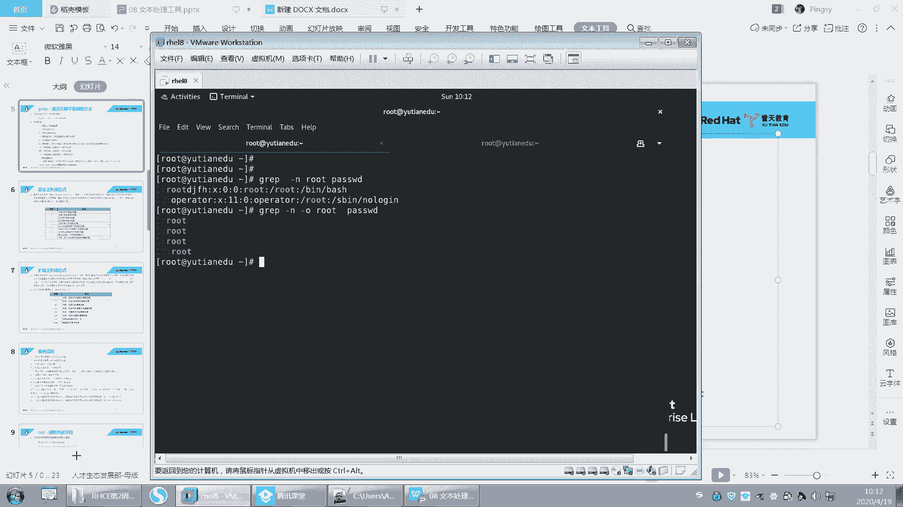

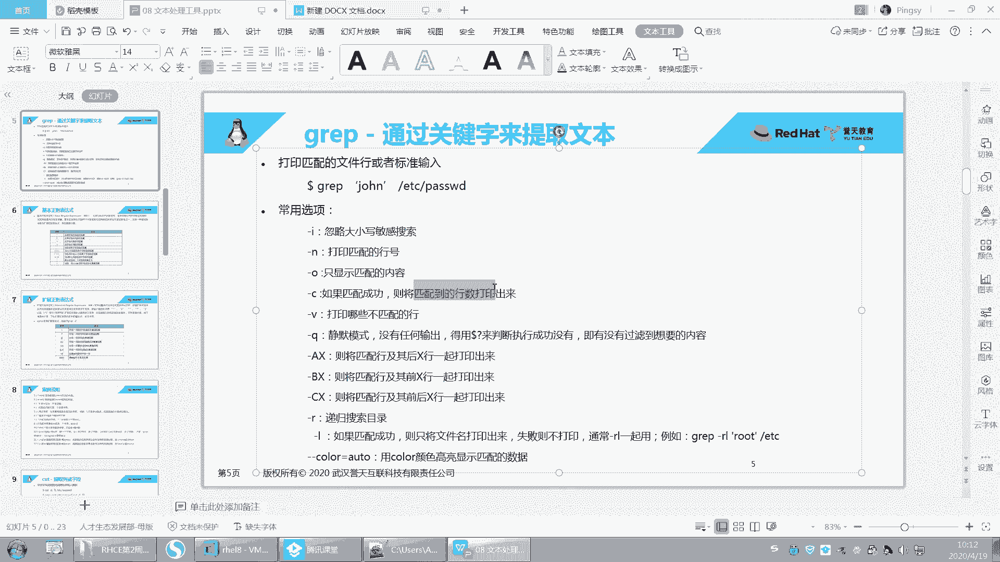

例如，以下命令会匹配“root”、“Root”、“ROOT”等所有形式：
```bash
grep -i root /etc/passwd
```

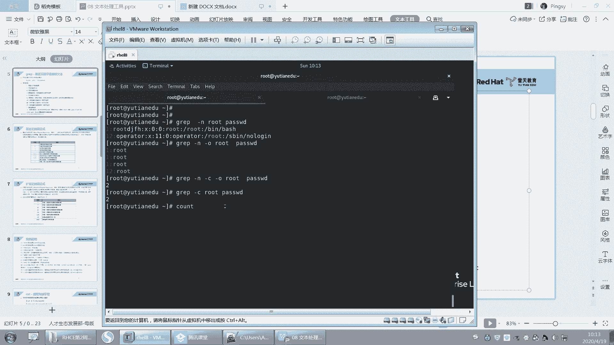


### 反向过滤 (`-v`)

`-v` 选项用于“反向”过滤，即显示**不包含**指定关键词的所有行。

例如，查看 `/etc/passwd` 中所有不是“root”用户的行：
```bash
grep -v root /etc/passwd
```

### 显示行号 (`-n`)

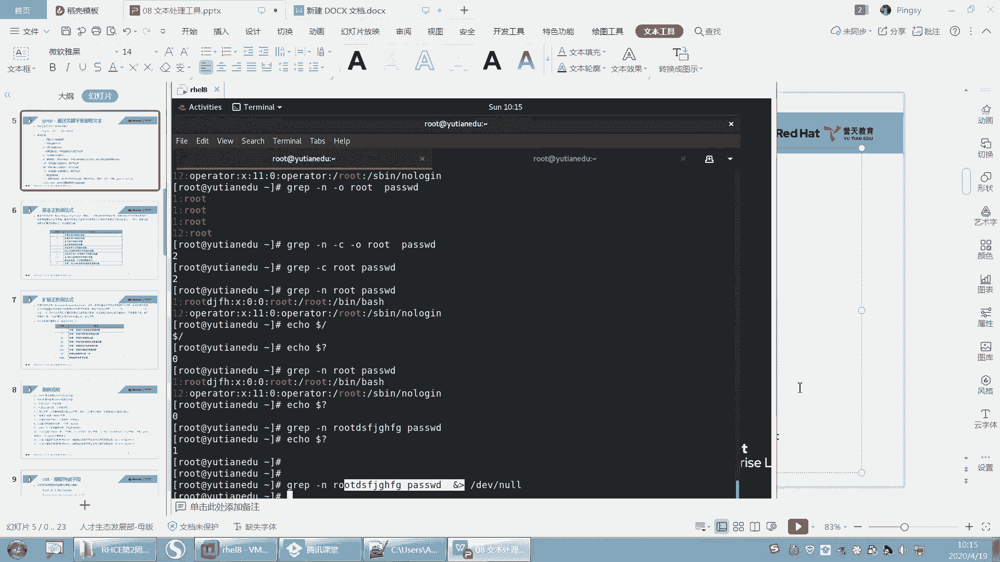

在分析文件，尤其是日志文件时，知道匹配内容所在的行号非常有用。`-n` 选项可以在输出中显示行号。
```bash
grep -n root /etc/passwd
```

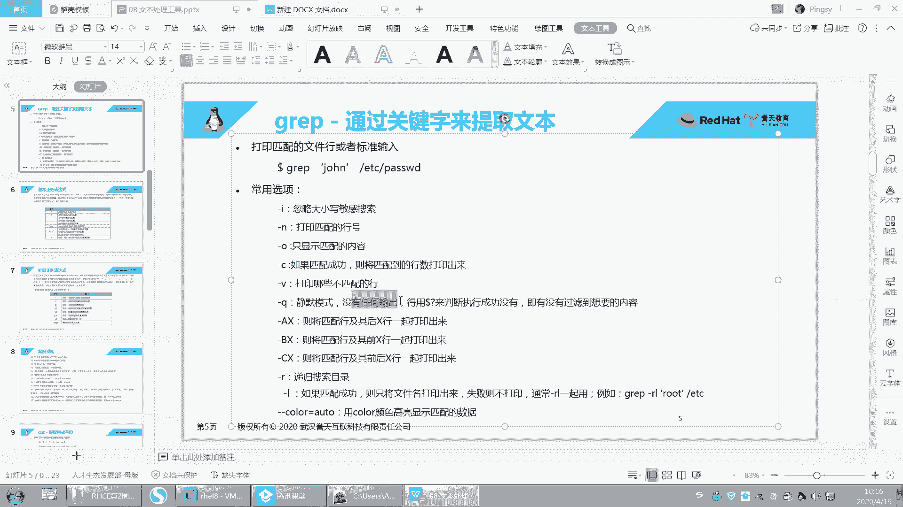

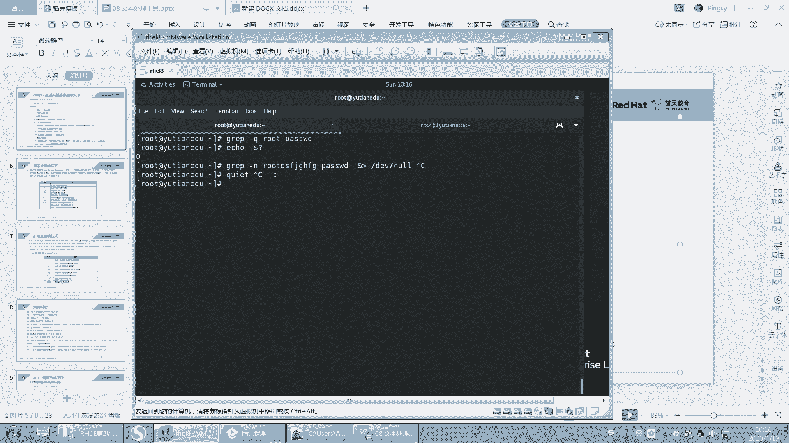

### 只显示匹配内容 (`-o`)


有时我们只关心匹配到的关键词本身，而不是整行内容。`-o` 选项可以只输出匹配到的部分。
```bash
grep -o root /etc/passwd
```
这在后续使用正则表达式进行复杂模式匹配时尤其有用。

### 统计匹配行数 (`-c`)

如果我们只想知道有多少行匹配了关键词，而不需要看到具体内容，可以使用 `-c` 选项进行计数。
```bash
grep -c root /etc/passwd
```

### 静默模式 (`-q`)

在脚本编程中，我们经常需要判断一个文件是否包含某个关键词，并根据结果执行不同操作。`-q` 选项让 `grep` 进入静默模式，不产生任何输出，只通过命令的“退出状态码”来表明是否匹配成功。
- 匹配成功，退出码为 `0`。
- 匹配失败，退出码为 `1`。
在脚本中可以这样使用：
```bash
if grep -q root /etc/passwd; then
    echo “找到root用户”
fi
```

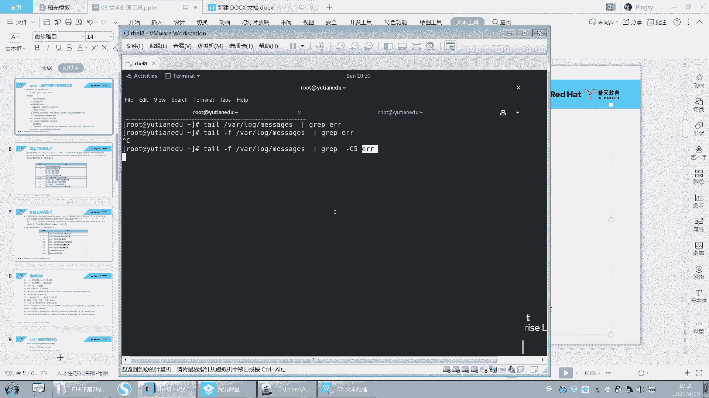

### 显示上下文 (`-A`, `-B`, `-C`)

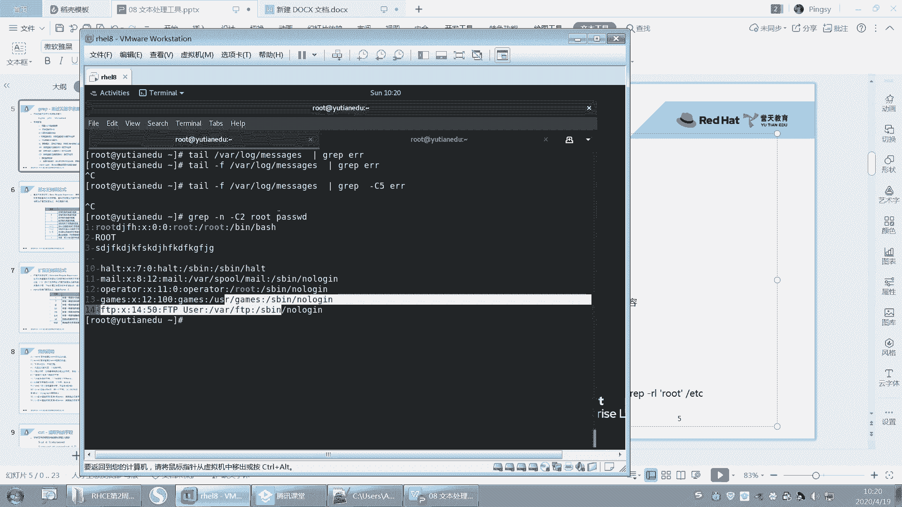

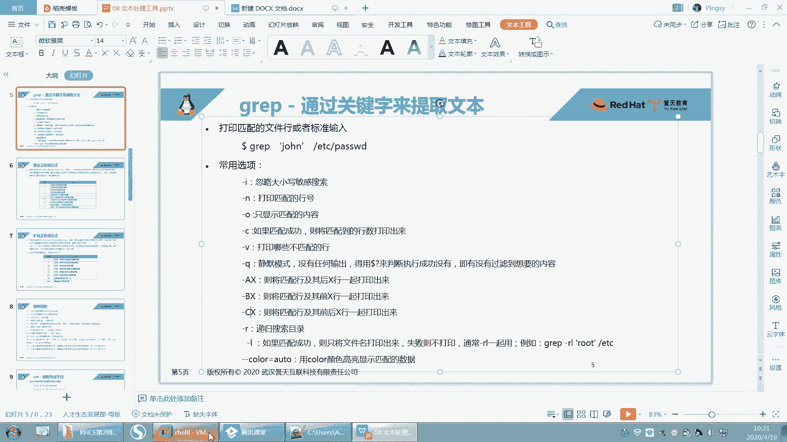

在查看日志等场景下，我们不仅需要看到错误行，还需要查看其上下文以了解错误发生的背景。
- `-A n`：显示匹配行及其后面的 `n` 行（After）。
- `-B n`：显示匹配行及其前面的 `n` 行（Before）。
- `-C n`：显示匹配行及其前后各 `n` 行（Context）。

例如，在系统日志中查找“error”关键词，并查看其前后各3行：
```bash
grep -C 3 error /var/log/messages
```

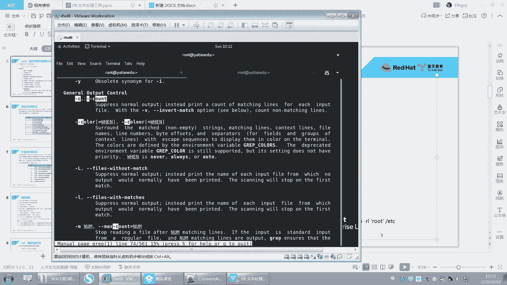

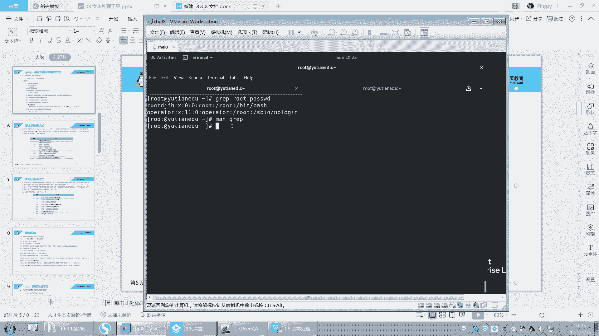

### 递归搜索 (`-r`)

这是 `grep` 一个极其强大的功能。`-r` 选项允许我们递归地搜索一个目录及其所有子目录下的文件，查找包含指定关键词的文件。

例如，我们忘记了一个叫 `hugepages` 的系统参数定义在哪个配置文件里，但知道它可能在 `/etc` 目录下：
```bash
grep -r hugepages /etc
```
这条命令会搜索 `/etc` 目录下所有文件，并打印出包含“hugepages”的行及其文件名。

如果只想知道哪些文件包含该关键词，而不显示具体内容，可以结合 `-l` 选项：
```bash
grep -rl hugepages /etc
```

### 高亮显示

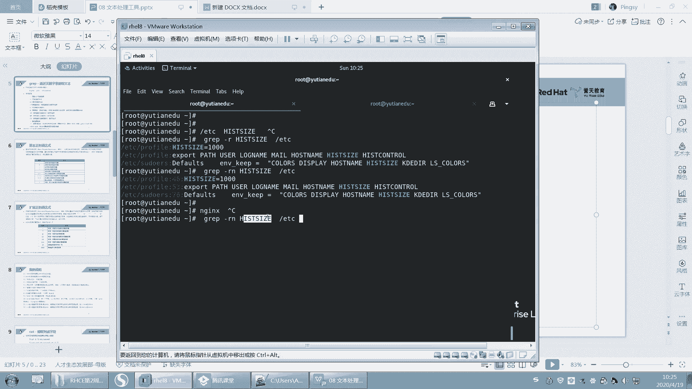


在某些Linux发行版（如RHEL）中，`grep` 命令被设置了别名，默认会高亮显示匹配到的关键词。其原理相当于自动添加了 `--color=auto` 选项。
如果你想在任何系统上都启用高亮，可以显式使用该选项：
```bash
grep --color=auto root /etc/passwd
```

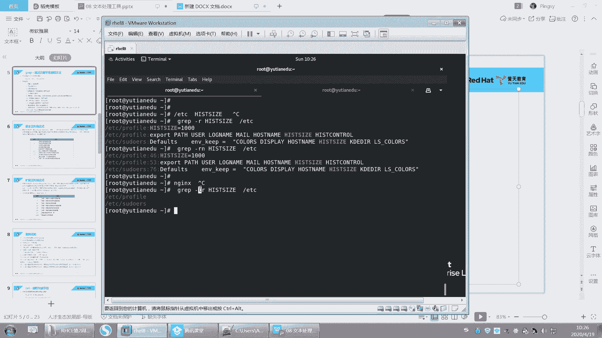

## 总结


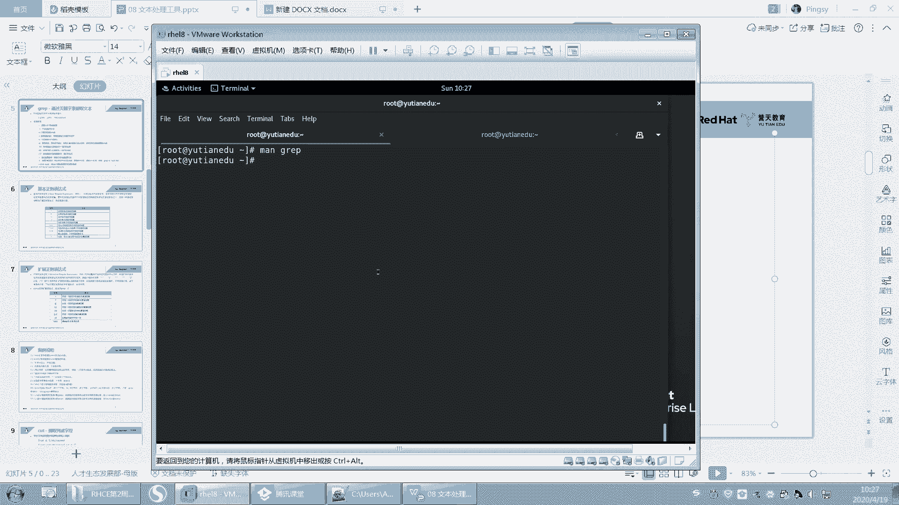

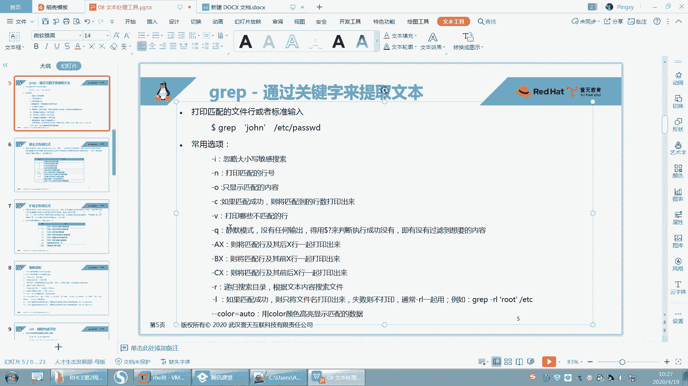

本节课我们一起学习了 `grep` 这个强大的文本过滤工具。我们了解了它的基本用法，并深入探讨了其核心选项：
- `-w` 用于精确单词匹配。
- `-i` 用于忽略大小写。
- `-v` 用于反向过滤。
- `-n` 用于显示行号。
- `-o` 用于只输出匹配部分。
- `-c` 用于统计匹配行数。
- `-q` 用于脚本中的静默判断。
- `-A`/`-B`/`-C` 用于查看匹配内容的上下文。
- `-r` 用于递归搜索目录。

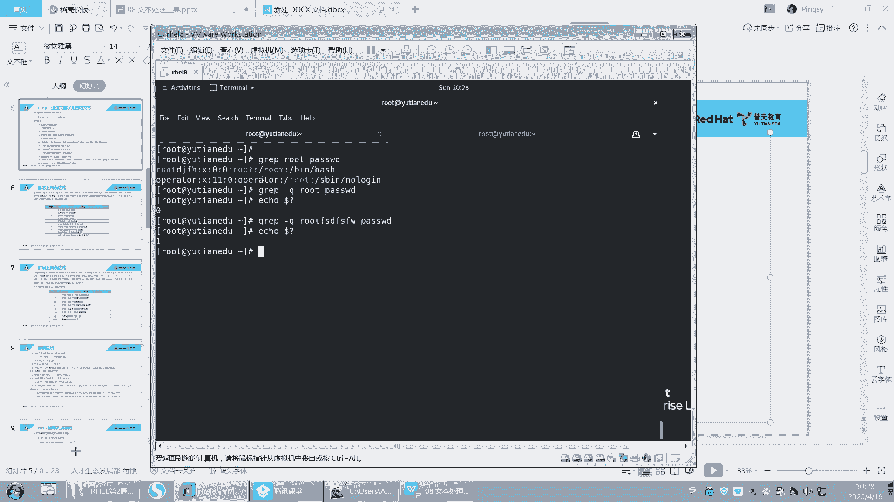

掌握 `grep` 的这些功能，将极大地提高你在Linux系统中处理文本、分析日志和编写脚本的效率。它是每个系统管理员和开发者工具箱中的必备利器。