# Linux文本处理：P33：sed命令地址与替换案例详解

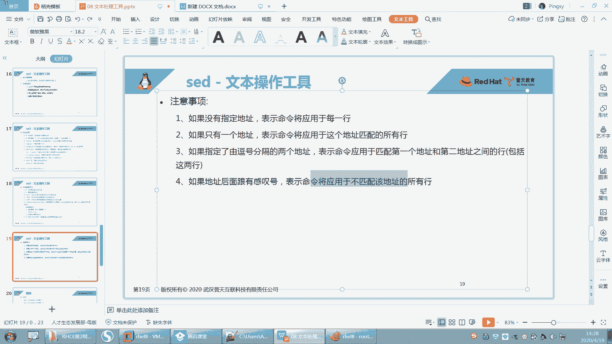

在本节课中，我们将深入学习`sed`命令中地址的指定方法，并通过一系列实际案例，掌握如何巧妙地运用查找替换功能来处理文本，例如删除特定字符、在行首添加注释等。这些技巧能极大提升文本处理的效率和灵活性。

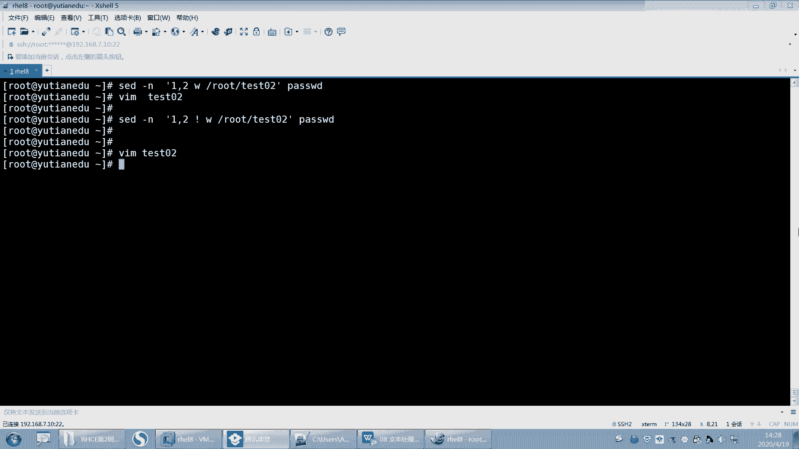

## 地址指定规则

上一节我们介绍了`sed`的基本命令和选项，本节中我们来看看如何精确指定命令作用的行，即地址的用法。

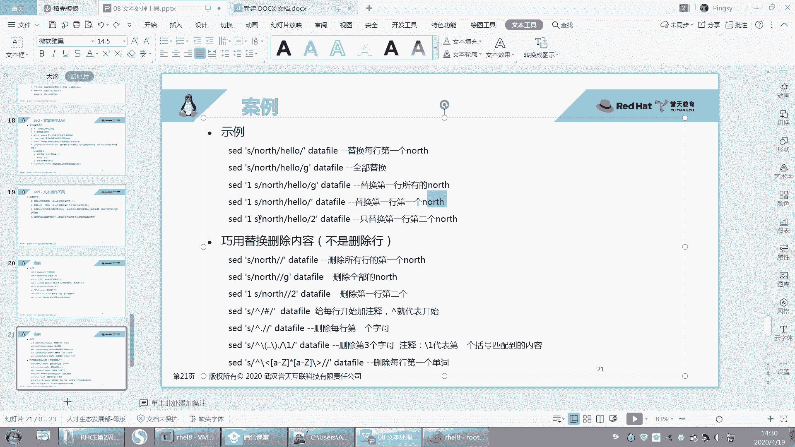

如果没有指定地址，命令将应用于输入文本的每一行。
```bash
sed 'p' file.txt
```

如果只指定一个地址，命令将仅应用于匹配该地址的行。
```bash
sed '5p' file.txt  # 仅打印第5行
```

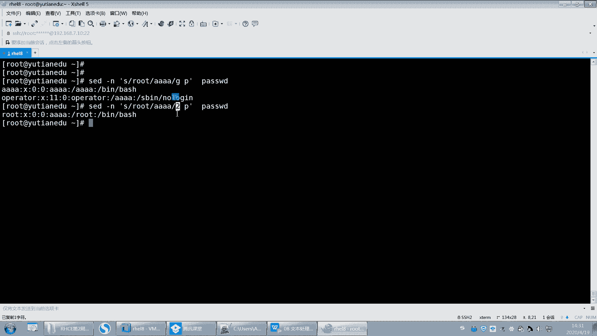

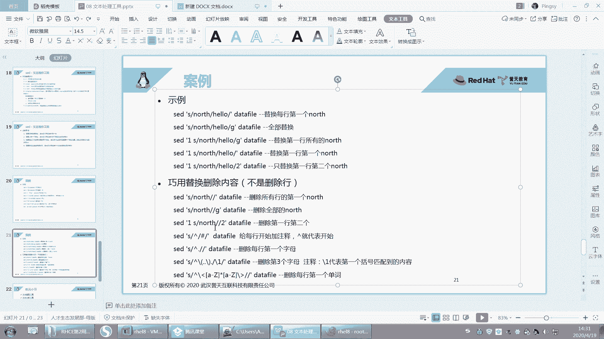

如果用逗号分隔两个地址，命令将应用于从第一个地址到第二个地址之间的所有行（包括这两行）。
```bash
sed '1,5p' file.txt  # 打印第1到第5行
```

如果在地址后添加感叹号 `!`，表示命令将应用于**不匹配**该地址的所有行（即反选）。
```bash
sed '1,2!p' file.txt  # 打印除了第1行和第2行之外的所有行
```

以下是地址用法的示例汇总：
*   `sed -n ‘5p’ file.txt`：打印第5行。
*   `sed -n ‘$p’ file.txt`：打印最后一行。
*   `sed -n ‘1,5p’ file.txt`：打印第1到第5行。
*   `sed -n ‘/root/p’ file.txt`：打印包含“root”的行。
*   `sed ‘1,5d’ file.txt`：删除第1到第5行。
*   `sed -i.bak ‘s/old/new/’ file.txt`：替换文件内容，并备份原文件为`file.txt.bak`。
*   `sed ‘2a\ABC’ file.txt`：在第2行之后插入“ABC”。

## 查找替换进阶应用

掌握了地址规则后，我们可以更精细地控制替换操作。以下是查找替换命令`s`的一些关键用法。

`s`命令默认只替换每一行中第一个匹配的字符串。
```bash
sed 's/nose/hello/' file.txt
```

在命令末尾添加`g`标志，可以替换行内所有匹配的字符串。
```bash
sed 's/nose/hello/g' file.txt
```

可以组合地址和`g`标志，例如只替换第一行中的所有匹配。
```bash
sed '1 s/nose/hello/g' file.txt
```

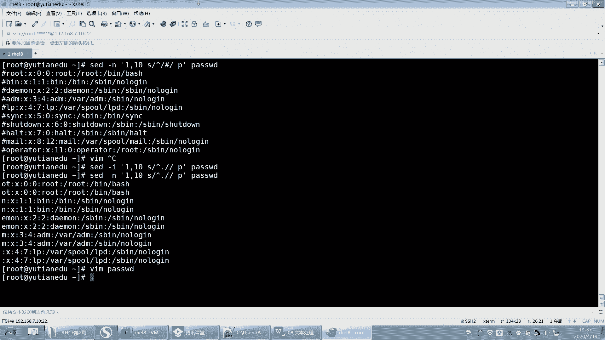

甚至可以指定替换行内第几个匹配项。例如，以下命令将每行中第二个“root”替换为“AAAA”。
```bash
sed 's/root/AAAA/2' file.txt
```

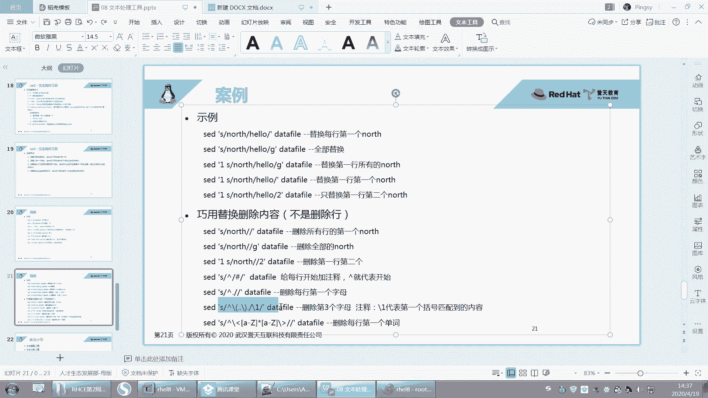

## 利用替换实现删除

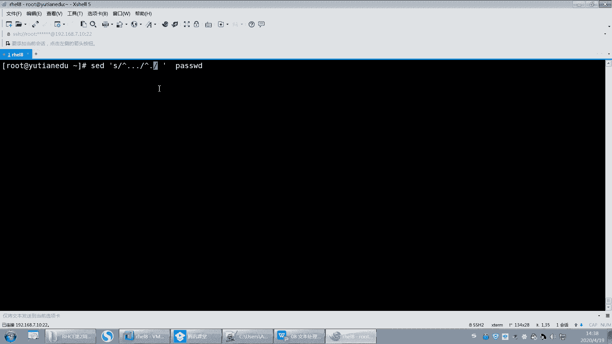

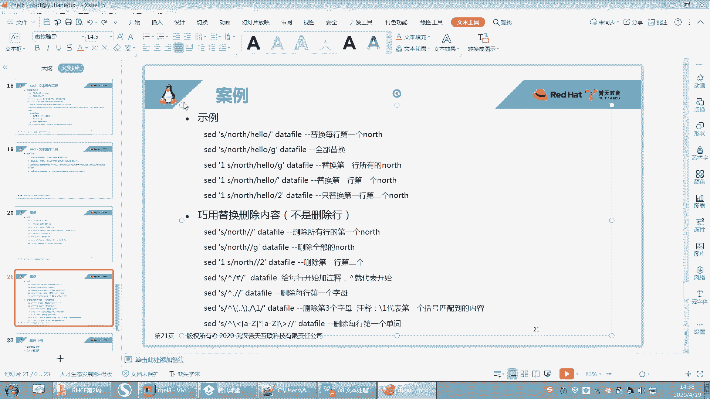

`sed`的`d`命令用于删除整行，但通过巧用`s`命令的替换功能，我们可以实现删除特定字符串而非整行。

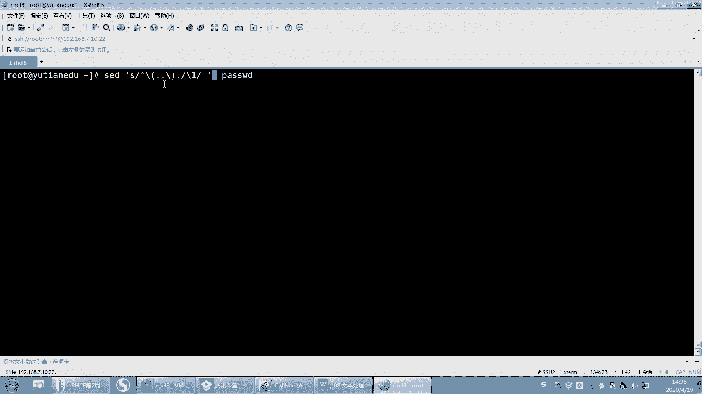

例如，使用`cut`命令可以截取`df -h`输出中利用率数值（如26%）的数字部分。
```bash
df -h | cut -d‘%’ -f1
```

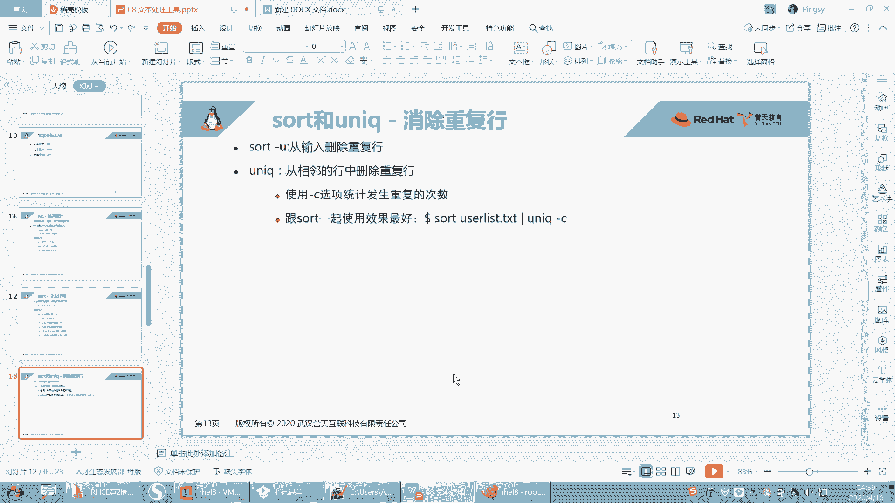

使用`sed`的替换功能也能达到同样效果，将百分号`%`替换为空即可删除它。
```bash
df -h | sed ‘s/%//’
```

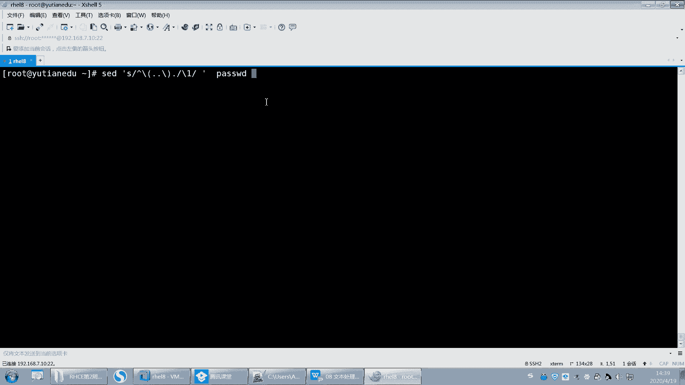

这种思路可以扩展至更复杂的场景。例如，删除每一行的第一个字符。
```bash
sed ‘s/^.//’ file.txt
```
这里`^`匹配行首，`.`匹配任意一个字符，将其替换为空即完成删除。

同理，可以在每一行的行首添加注释符号`#`。
```bash
sed ‘s/^/#/’ file.txt
```

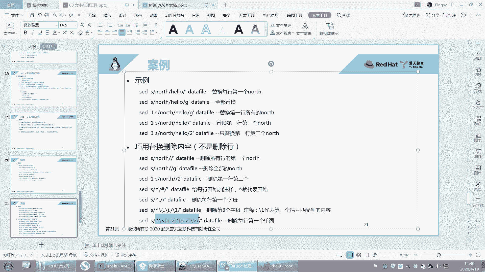

若要删除每一行的第一个单词（由字母组成），可以使用更精确的正则表达式。
```bash
sed ‘s/^[[:alpha:]]*//’ file.txt
```
`[[:alpha:]]*`匹配行首的0个或多个字母，将其替换为空。

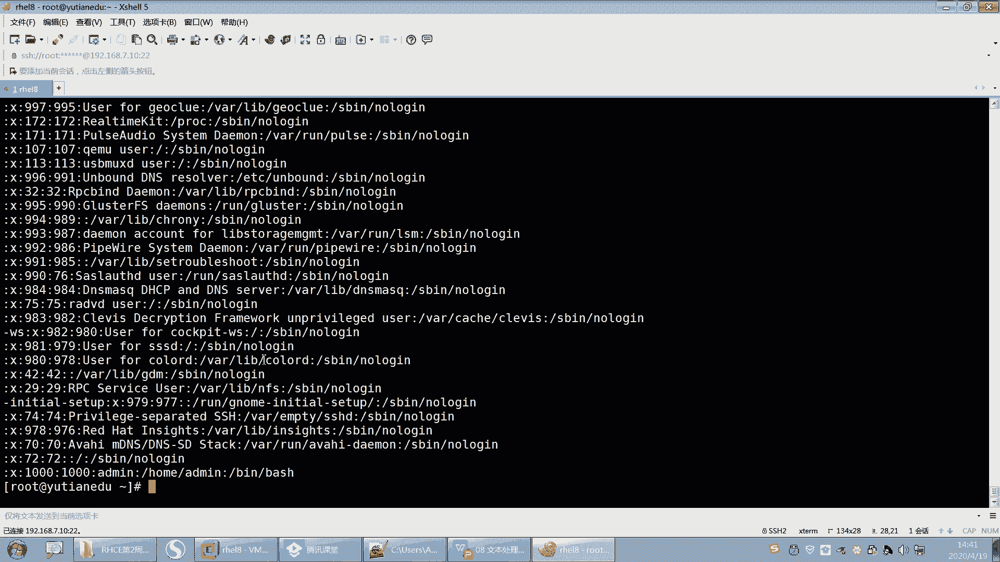

## 分组替换的妙用

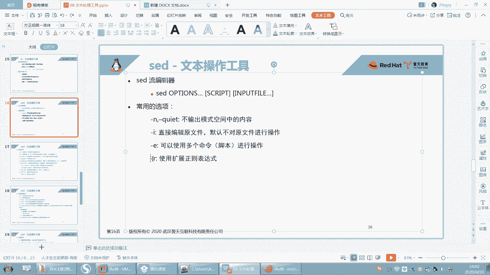

对于更复杂的删除需求，例如删除每一行的第三个字符，我们需要用到分组替换功能。

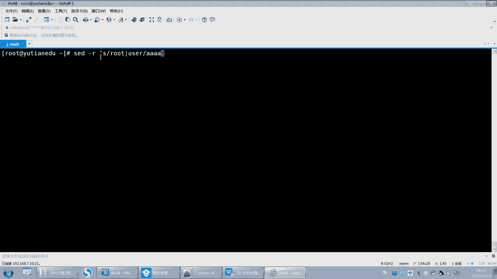

直接匹配并删除第三个字符是无效的，因为会破坏前两个字符。
```bash
sed ‘s/^..//’ file.txt  # 这会删除前两个字符，而非第三个
```

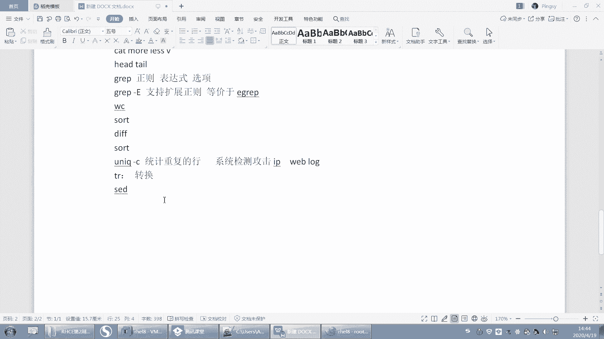

正确的做法是使用括号`()`将前两个字符分组，然后在替换部分用`\1`引用这个分组，从而保留前两个字符，只替换第三个。
```bash
sed ‘s/^\(..\)./\1/’ file.txt
```
*   `^\(..\)`：匹配行首的两个字符并将其作为第一组。
*   `.`：匹配第三个字符。
*   `\1`：在替换内容中引用第一组（即前两个字符），从而“覆盖”掉第三个字符。

## 命令选项回顾与总结

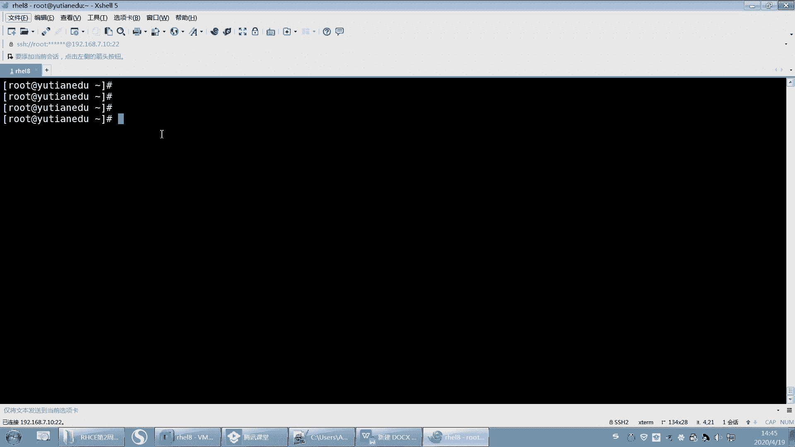

本节课我们一起学习了`sed`命令地址指定和高级替换的多种技巧。最后，回顾一下`sed`常用的几个选项：

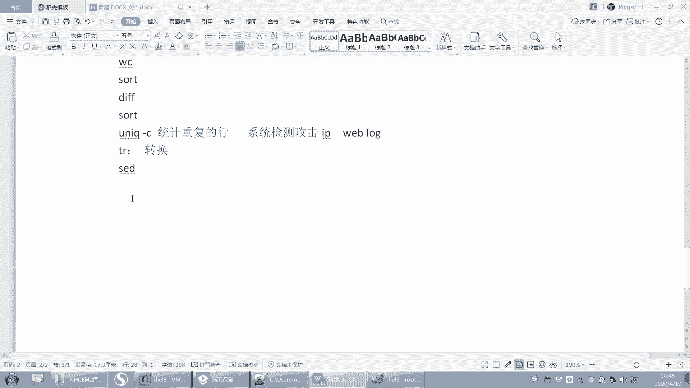

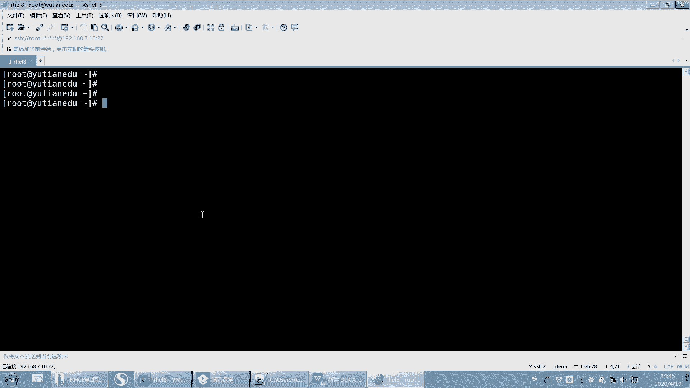

*   `-n`：抑制默认输出，常与`p`命令配合使用。
*   `-i`：直接修改源文件，可后接后缀名进行备份（如`-i.bak`）。
*   `-e`：连接多个编辑命令。
*   `-r`：启用扩展正则表达式，使`|`、`+`、`?`等符号无需转义。

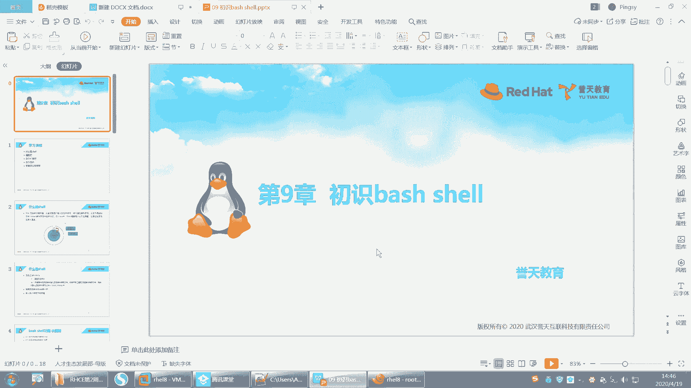

`sed`的功能非常强大，本课所介绍的只是其核心应用的一部分。关键在于理解地址匹配和正则表达式的结合使用。初学者无需死记硬背所有案例，但应理解其原理，并保存好示例笔记，在实际需要时可快速查阅和套用。通过不断练习，你将能越来越熟练地运用`sed`解决各种文本处理问题。