# Linux基础教程：P36：bash shell中命令扩展符号的使用 📚

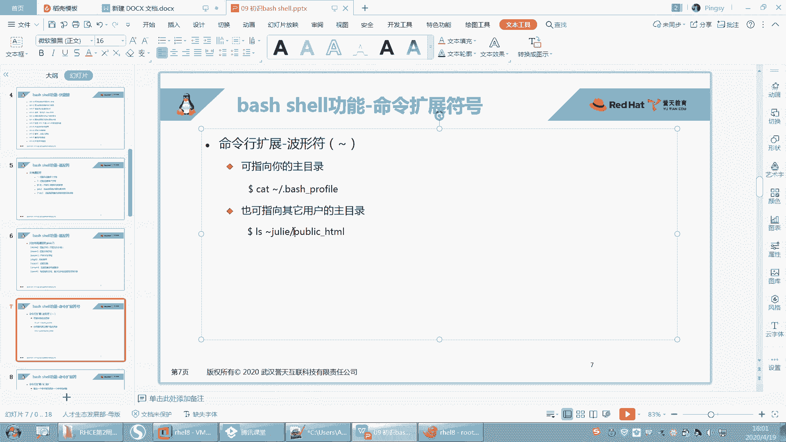

在本节课中，我们将要学习bash shell中几种重要的命令扩展符号。这些符号能帮助我们更高效地引用路径、执行命令、生成序列，是编写脚本和日常操作中不可或缺的工具。

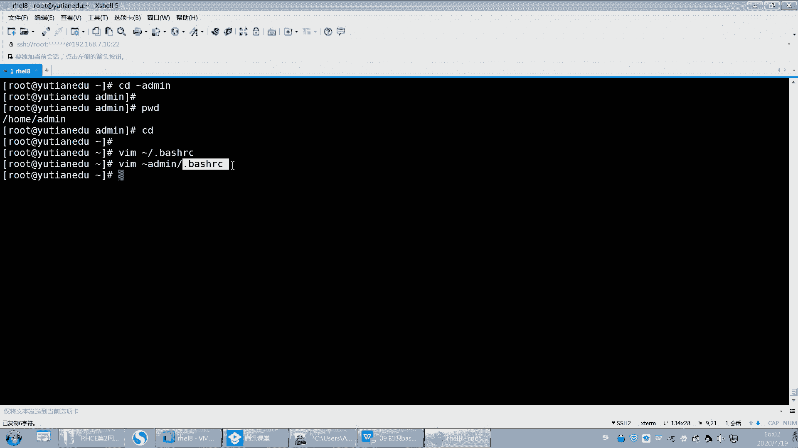

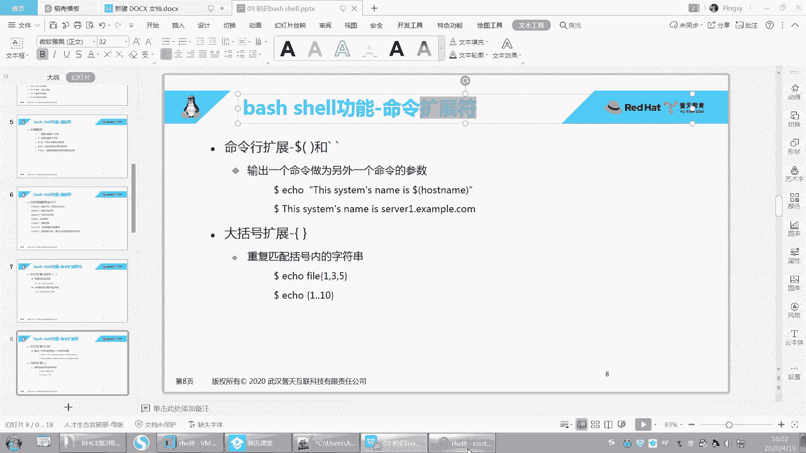

## 波浪号 `~`：用户家目录 🏠

上一节我们介绍了文件系统的基础知识，本节中我们来看看波浪号`~`的用法。波浪号是shell的一个功能，用于指代用户的家目录。

*   **`~`**：默认指代**当前用户**的家目录。
*   **`~用户名`**：指代**指定用户**的家目录。

以下是波浪号的具体应用示例：

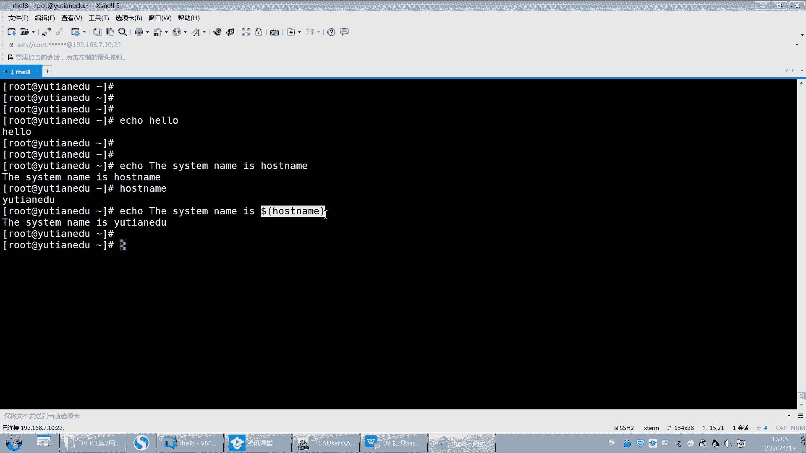

*   `cd ~admin`：切换到用户`admin`的家目录。
*   `vim ~/.bashrc`：用vim编辑器打开当前用户家目录下的`.bashrc`文件。
*   `vim ~admin/.bashrc`：用vim编辑器打开用户`admin`家目录下的`.bashrc`文件。

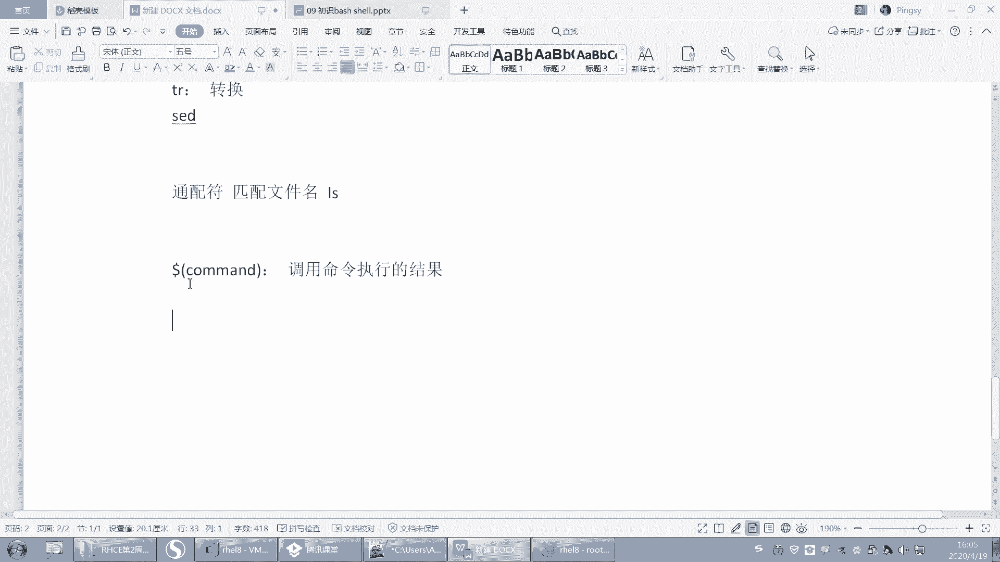

## 命令替换 `$(command)` 与反引号 `` `command` ``：获取命令输出 🔄

在命令行中，有时我们需要获取一个命令的执行结果，并将其作为另一个命令的输入或参数。直接输入命令名，shell会将其视为普通字符串。为了调用命令执行的结果，我们需要使用命令替换。

命令替换的核心概念是：**将命令的输出结果替换到当前命令行中**。

它有两种等价的语法形式：
*   **`$(command)`** （推荐，更清晰）
*   **`` `command` ``** （反引号，易与单引号混淆）

例如，我们想显示系统的主机名。如果直接写：
```bash
echo the system name is hostname
```
输出是：`the system name is hostname`。这里的`hostname`被当作字符串处理。

为了显示实际的主机名（例如`yutianEDU`），我们需要执行`hostname`命令并获取其输出：
```bash
echo the system name is $(hostname)
```
或
```bash
echo the system name is `hostname`
```
此时输出变为：`the system name is yutianEDU`。shell遇到`$(...)`或反引号时，会先执行其中的命令，然后用命令的**输出结果**替换掉整个结构。

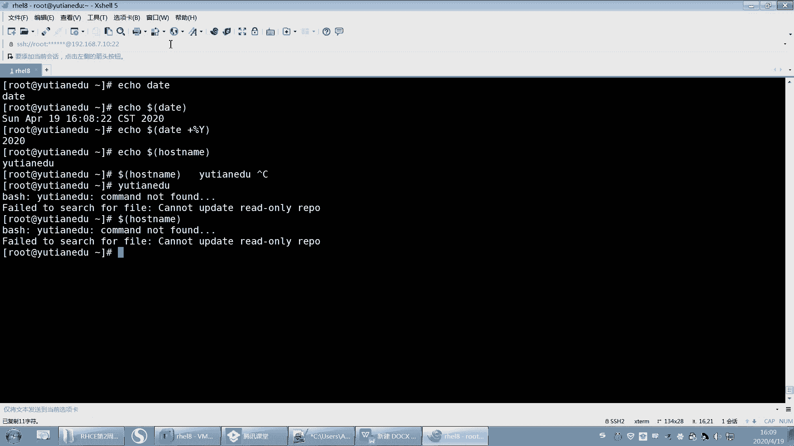

**重要提示**：被括号或反引号包裹的内容必须是一个有效的命令，否则会报错。例如`$(hello)`会提示命令未找到。

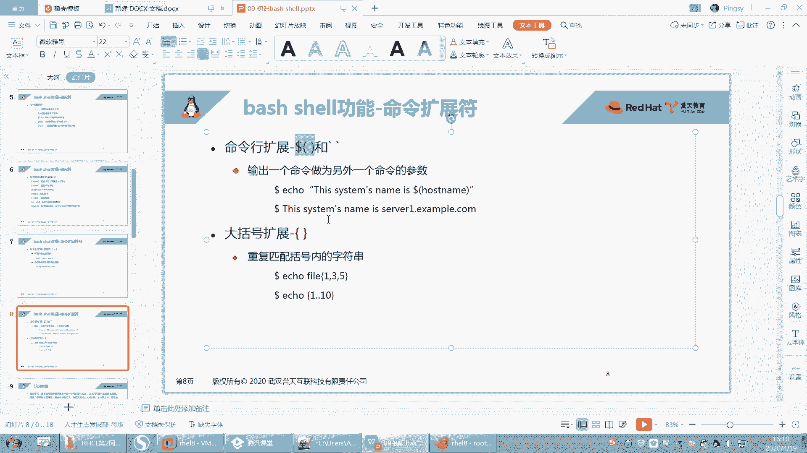

这个功能非常实用。例如，在备份文件时自动添加当前日期：
```bash
cp -r /etc /tmp/etc_$(date +%Y%m%d)
```
这样，每次执行该命令，都会生成一个如`etc_20231027`的带日期的备份目录，无需手动修改日期。

## 大括号扩展 `{}`：生成序列 🔢

大括号扩展`{}`用于生成一个字符串列表或序列，可以简化需要创建多个相似文件或目录的操作。

大括号扩展主要有两种形式：

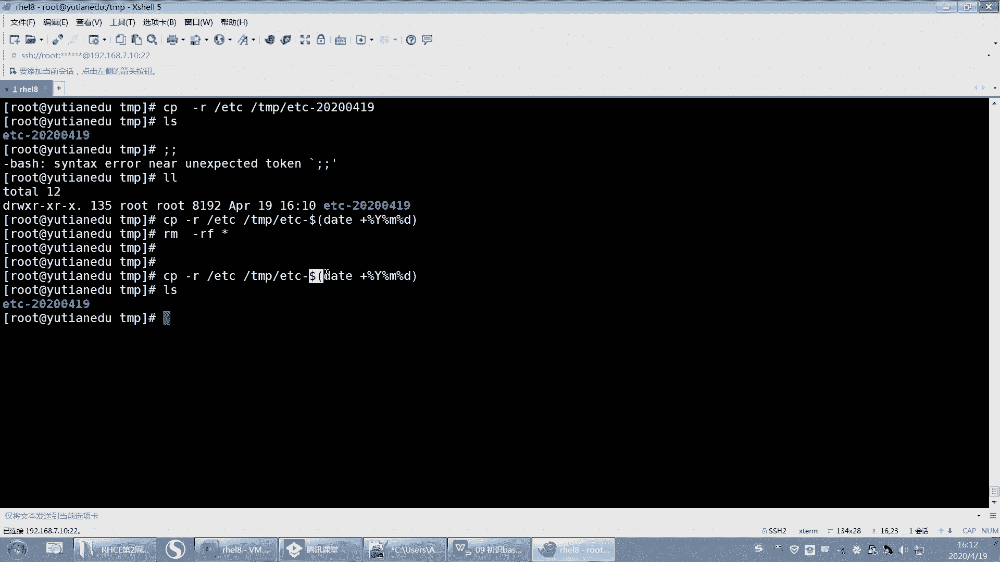

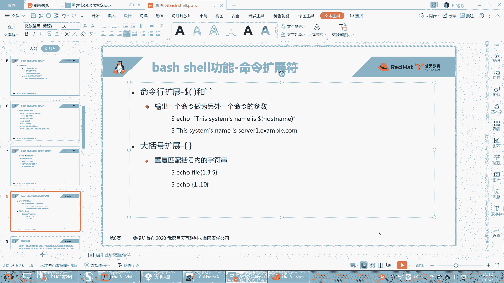

1.  **逗号分隔列表**：依次匹配大括号内的每一项。
    ```bash
    touch file{1,2,3}.txt
    ```
    这条命令会创建三个文件：`file1.txt`, `file2.txt`, `file3.txt`。

2.  **序列生成 `{start..end}`**：生成一个从`start`到`end`的连续序列（数字或字母）。
    ```bash
    touch file{4..9}.txt
    ```
    这条命令会创建六个文件：`file4.txt`, `file5.txt`, ..., `file9.txt`。

大括号扩展也支持嵌套，用于创建更复杂的组合：
```bash
mkdir -p dir{A,B,C}/{1,2,3}
```
这条命令会创建9个目录：`dirA/1`, `dirA/2`, `dirA/3`, `dirB/1`, ..., `dirC/3`。

## 总结 📝

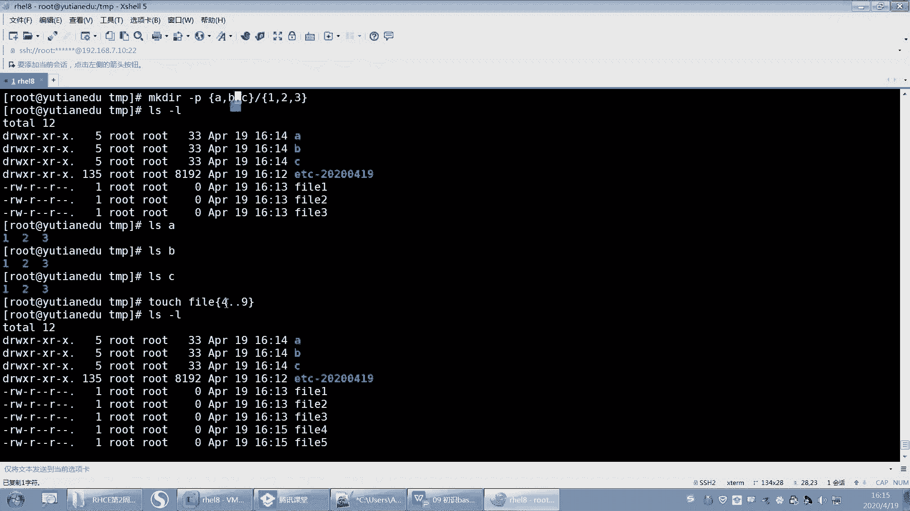


本节课中我们一起学习了bash shell中三个核心的扩展符号：
1.  **波浪号 `~`**：快速引用用户家目录。
2.  **命令替换 `$(command)`**：获取命令的执行结果，并将其嵌入到其他命令或字符串中。
3.  **大括号扩展 `{}`**：高效地生成文件或目录名序列。

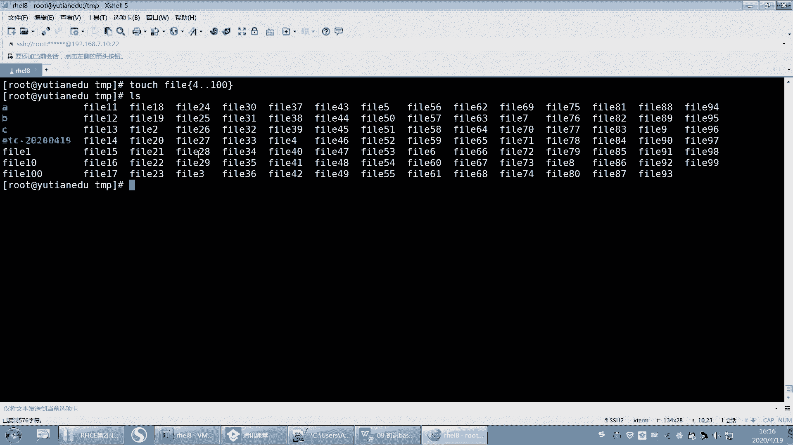

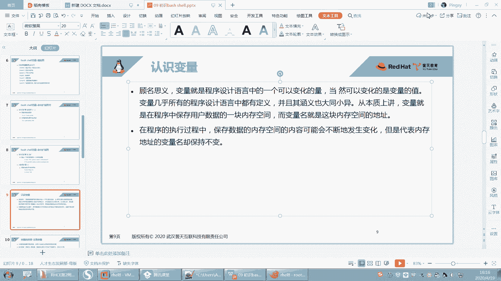

熟练掌握这些符号，能极大提升在Linux命令行下的操作效率和脚本编写能力。