# Linux基础教程：P38：系统环境变量案例讲解和别名使用 🐧

在本节课中，我们将要学习Linux系统中两个非常实用的概念：**环境变量**和**命令别名**。我们将通过具体的案例来理解它们的作用、如何查看、如何设置以及它们在实际操作中的重要性。

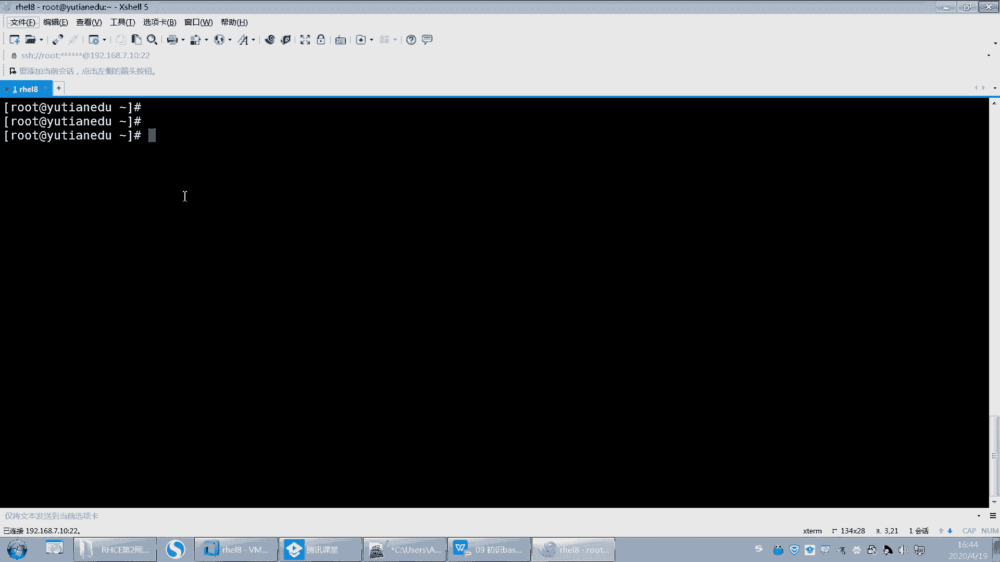

上一节我们介绍了变量的基本概念和分类，本节中我们来看看几个核心的系统环境变量，并学习如何创建和使用命令别名。

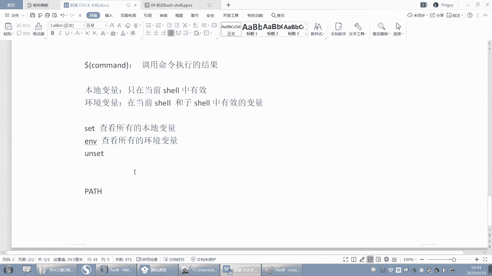

## 系统环境变量案例讲解

系统预定义了许多环境变量，它们影响着系统的行为和命令的执行方式。

### 提示符变量 PS1

首先，我们来看一个与用户界面密切相关的变量——**PS1**，它定义了命令行提示符的格式。

例如，常见的提示符 `[root@localhost ~]#` 就是由 PS1 变量控制的。我们可以通过 `echo $PS1` 命令查看其当前值。

PS1 变量使用一些特殊的转义序列来定义显示内容：
*   `\u` 代表当前用户名。
*   `\h` 代表主机名。
*   `\w` 代表当前工作目录的路径。
*   `\$` 对于普通用户显示为 `$`，对于 root 用户则显示为 `#`。

如果你想了解所有可用的转义序列，可以使用 `man bash` 命令，然后搜索 `PS1` 来查看详细说明。

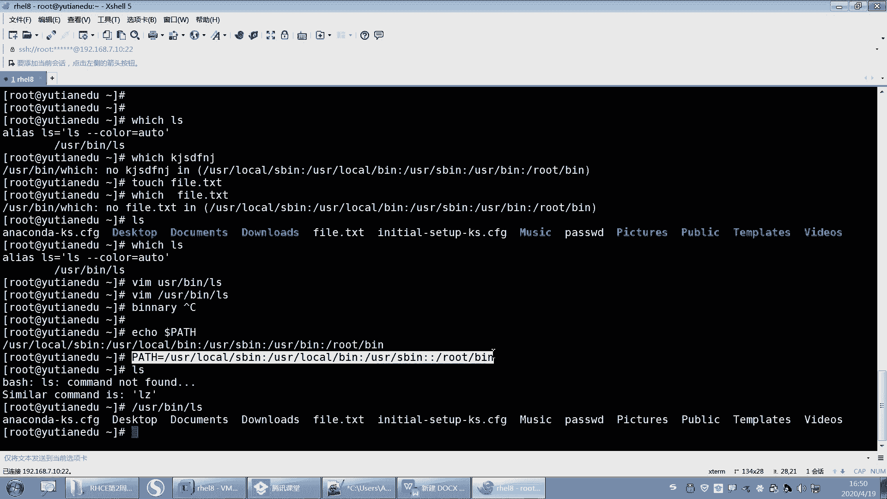

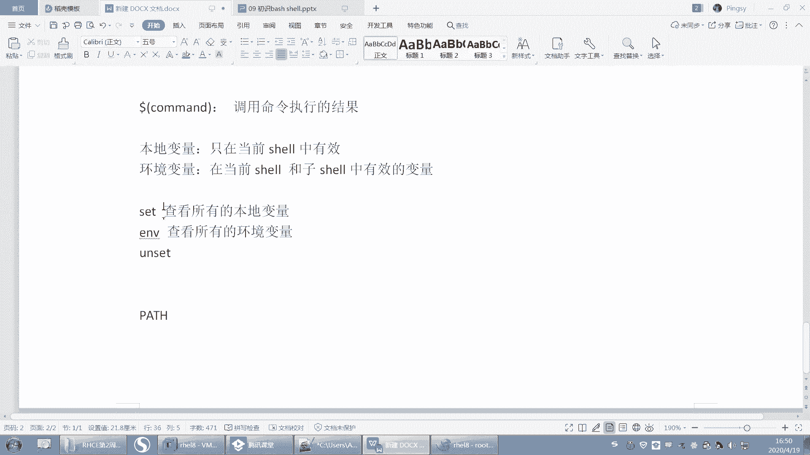

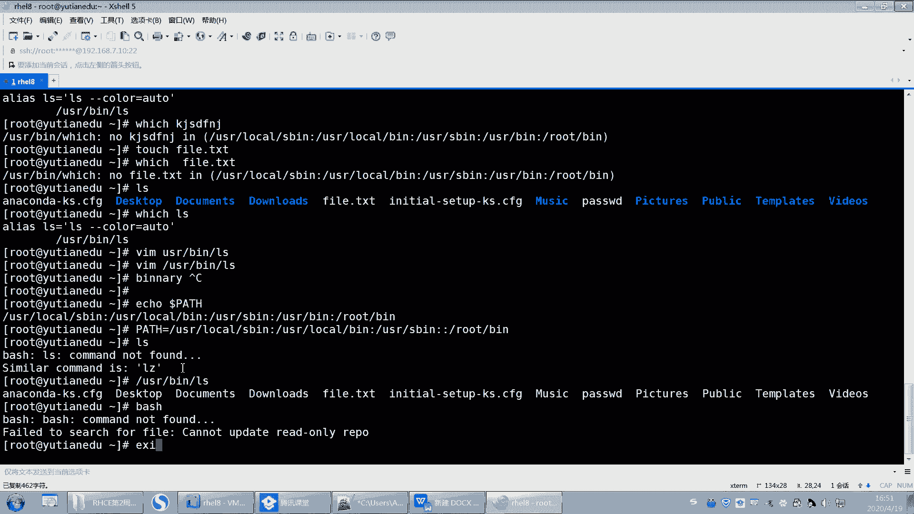

### 核心变量：PATH 🚀

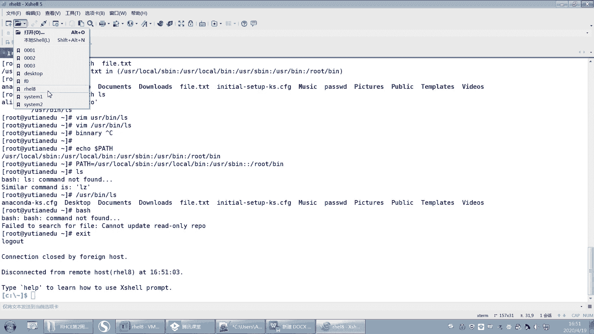

接下来，我们要讲解一个**极其重要**的变量——**PATH**。

PATH 变量决定了当用户输入一个命令时，系统去哪些目录中查找这个命令对应的可执行文件。

我们可以使用 `which` 命令来查看一个命令的具体位置，例如 `which ls` 会显示 `/usr/bin/ls`。系统之所以能在这里找到 `ls` 命令，正是因为 `/usr/bin` 目录包含在 PATH 变量的值中。

让我们通过一个实验来理解 PATH 的作用：
1.  在任意目录（例如家目录）创建一个脚本文件：`touch mytest.sh`
2.  尝试用 `which mytest.sh` 查找它，会发现系统提示找不到。因为 `mytest.sh` 所在的目录不在 PATH 变量包含的搜索路径中。

那么，系统默认去哪些目录查找命令呢？执行 `echo $PATH` 可以看到，它通常包含如 `/usr/local/bin`、`/usr/bin`、`/bin` 等目录。这些目录名中的 `bin` 是 **binary（二进制）** 的缩写，专门用来存放可执行文件。

**PATH 变量的工作机制是**：当输入一个非绝对路径的命令（如 `ls`）时，Shell 会依次遍历 PATH 变量中列出的每一个目录，寻找是否有与之同名的可执行文件。找到则执行，找不到则报错。

**修改 PATH 变量**：
PATH 本身是一个环境变量，我们可以修改它。但需要注意的是，在 Shell 中直接使用 `PATH=/new/path` 这样的赋值语句，创建的是一个**本地变量**，它只在当前 Shell 会话中有效。关闭终端或新建子 Shell 后，修改就会失效。

如果希望修改持久化或被子进程继承，需要将其定义为**环境变量**，使用 `export PATH=/new/path` 命令。不过，系统的 PATH 变量通常已在配置文件（如 `/etc/profile`）中被定义为环境变量。

**一个重要的警告**：**绝对不要**将 PATH 变量设置为根目录 `/`。因为系统只会搜索 PATH 中目录的**直接下级文件**，而不会递归搜索子目录。设置为 `/` 会导致系统在根目录下寻找命令，而命令实际存放在 `/bin`、`/usr/bin` 等子目录中，从而造成所有命令都无法找到，可能导致系统无法正常启动。

### 其他常用系统变量

除了 PS1 和 PATH，系统还有其他有用的变量：

*   **HISTSIZE**: 此变量定义了 Shell 历史命令记录保存的条数。默认通常是 1000 条。你可以修改它来增加或减少历史记录的数量。
*   **只读变量（用于查询）**: 系统还提供了一些主要用于查询而非修改的变量，在编写脚本时非常有用：
    *   `$UID`: 当前用户的数字用户ID。
    *   `$HOME`: 当前用户的家目录路径。
    *   `$PWD`: 当前工作目录的路径。

你可以使用 `env` 或 `printenv` 命令来查看当前所有的环境变量。

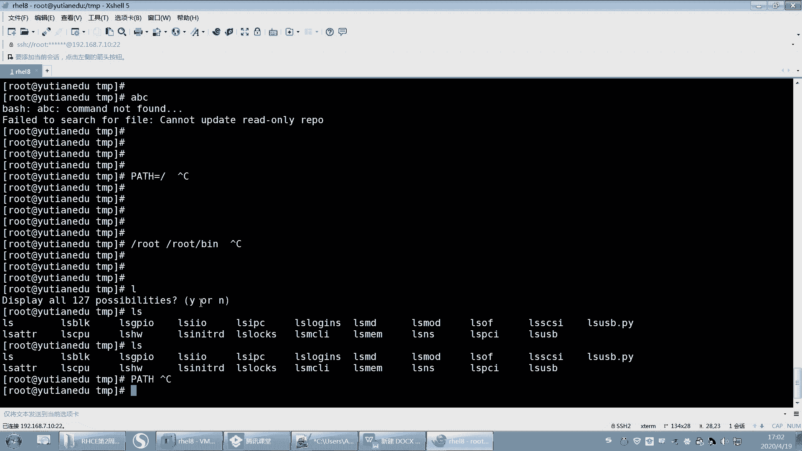

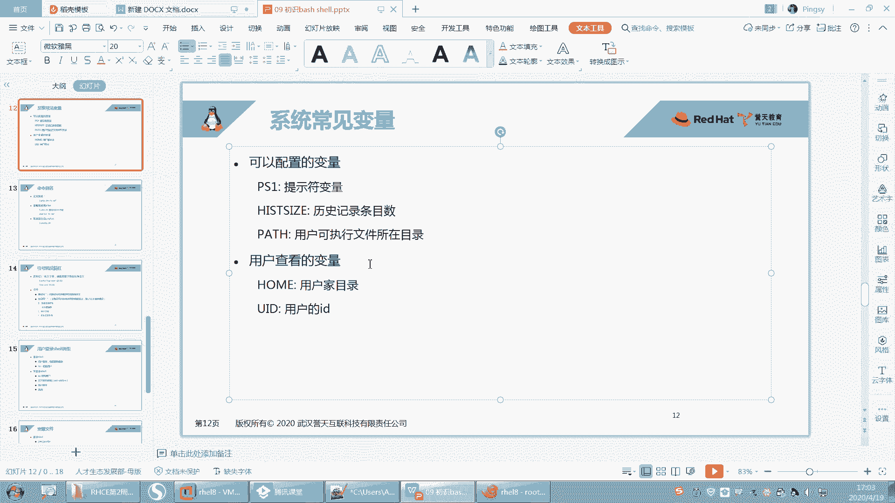

## 命令别名的使用

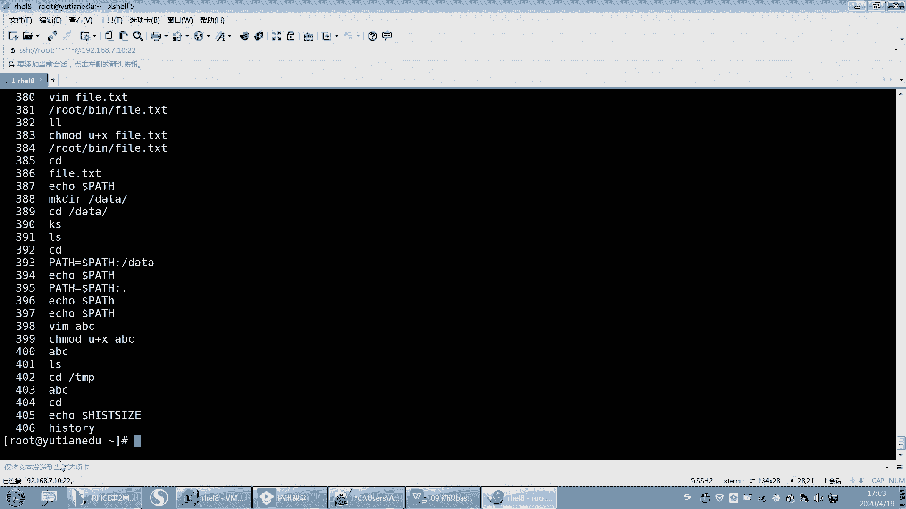

别名（Alias）可以让我们为常用的命令或命令组合创建一个简短的替代名称，从而提升操作效率。

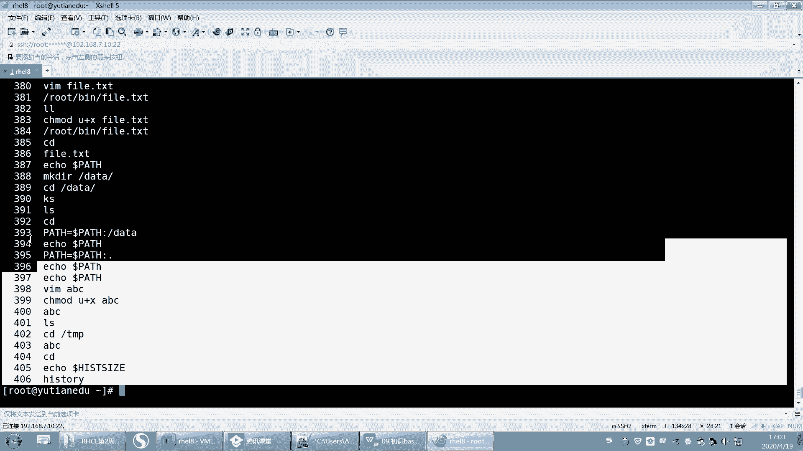

### 查看与定义别名

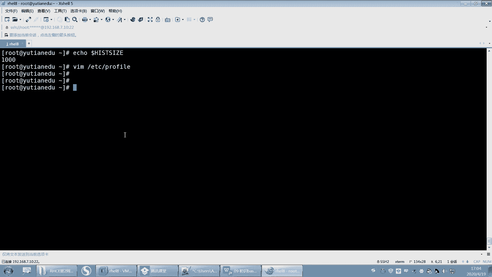

使用 `alias` 命令可以列出当前已定义的所有别名。你会发现，像 `ll`（通常等于 `ls -l`）和 `grep`（可能带有颜色显示选项）这样的常用命令本身就是别名。

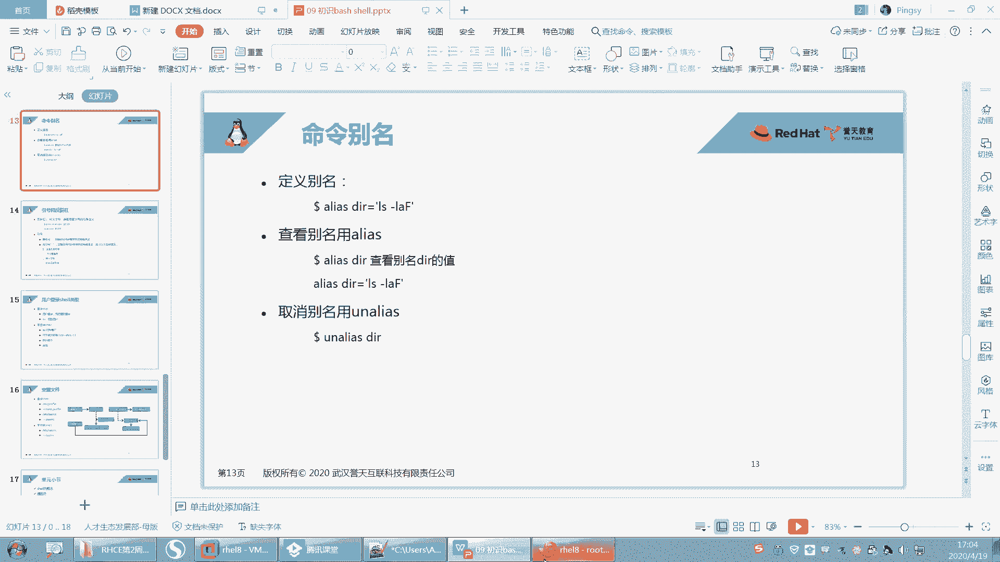

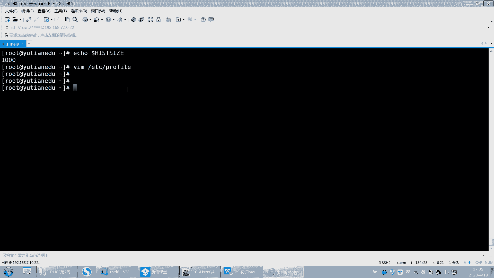

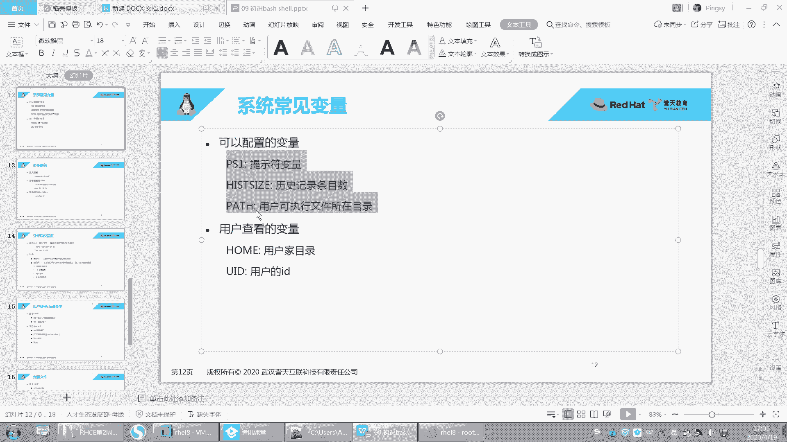

定义一个新别名的语法如下：
```bash
alias 新名称='原命令或命令组合'
```
**注意**：等号两边不能有空格，并且建议**用单引号**将原命令括起来。单引号可以确保其中的所有字符（如 `$`、`*` 等）保持字面含义，避免被 Shell 提前解析。

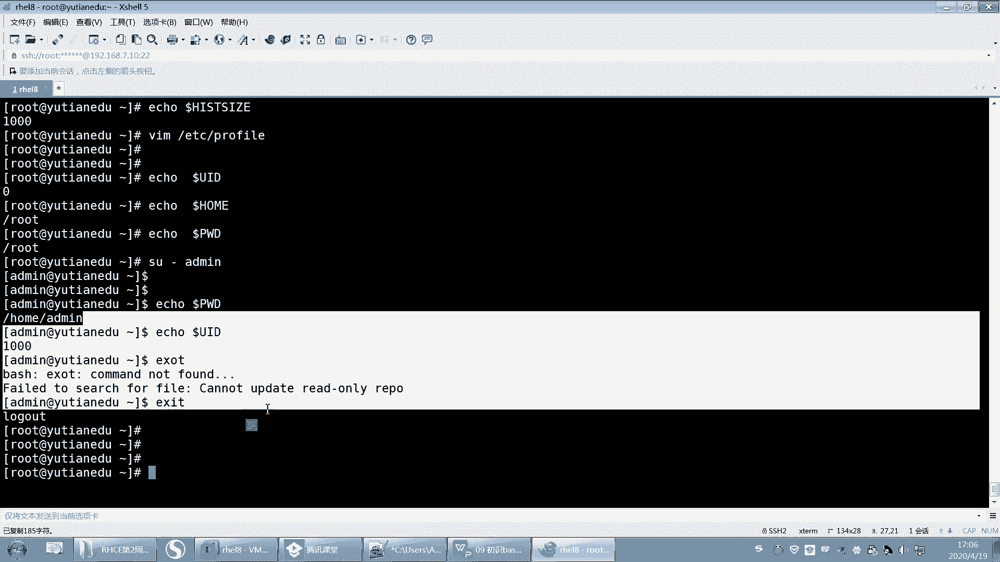

例如，我们定义一个将 `/etc` 目录备份到 `/tmp` 的别名：
```bash
alias mycopy='cp -a /etc /tmp/etc_backup'
```
定义后，直接输入 `mycopy` 即可执行备份操作。

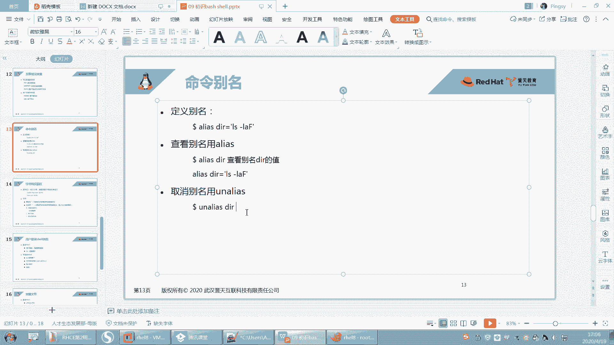

### 取消别名

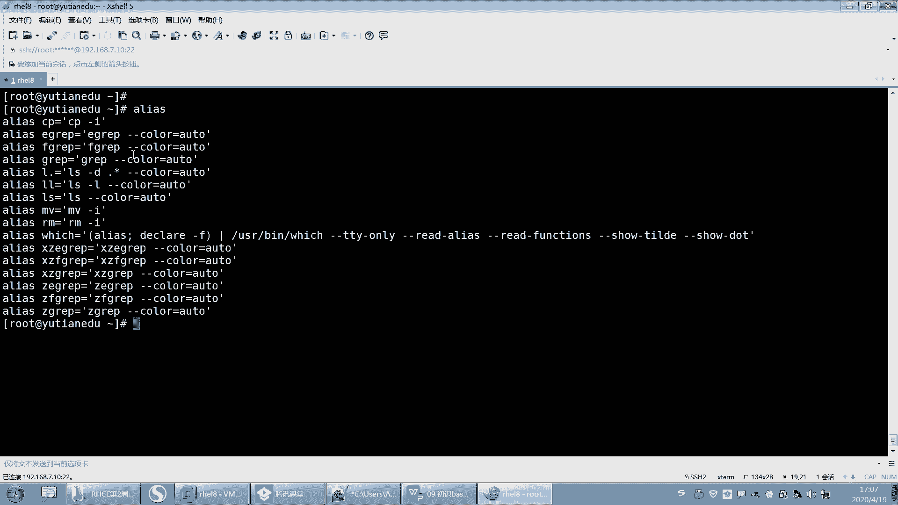

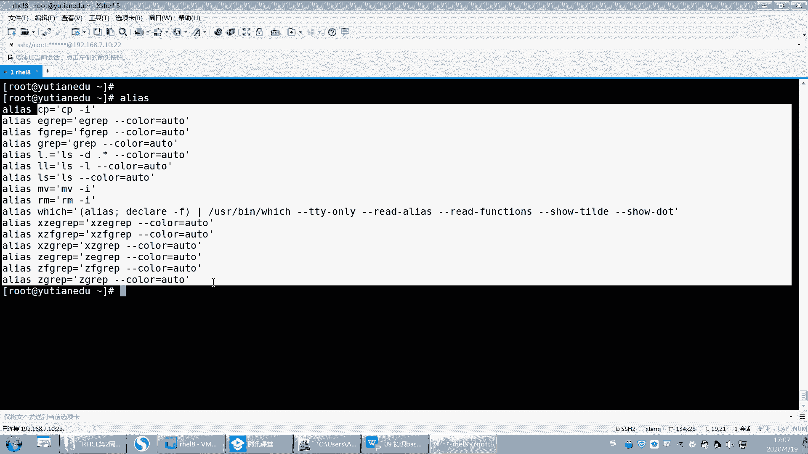

如果想要取消一个已定义的别名，可以使用 `unalias` 命令：
```bash
unalias mycopy
```

### 关于别名的持久化

在命令行中直接使用 `alias` 命令定义的别名是**临时的**，仅对当前 Shell 会话有效。一旦关闭终端，别名就会消失。

若想使别名永久生效，需要将 `alias` 定义语句写入用户的 Shell 配置文件中（例如 `~/.bashrc`）。我们将在后续课程中详细讲解配置文件。

---

本节课中我们一起学习了：
1.  **PS1 变量**：如何控制命令行提示符的显示格式。
2.  **PATH 变量**：其核心作用是定义命令的搜索路径。理解其工作原理对于解决“命令未找到”等问题至关重要，同时要警惕错误修改可能带来的系统风险。
3.  **其他系统变量**：如 HISTSIZE 和用于查询的 `$UID`、`$HOME` 等。
4.  **命令别名**：如何使用 `alias` 和 `unalias` 命令来创建、查看和删除临时别名，从而简化日常操作。

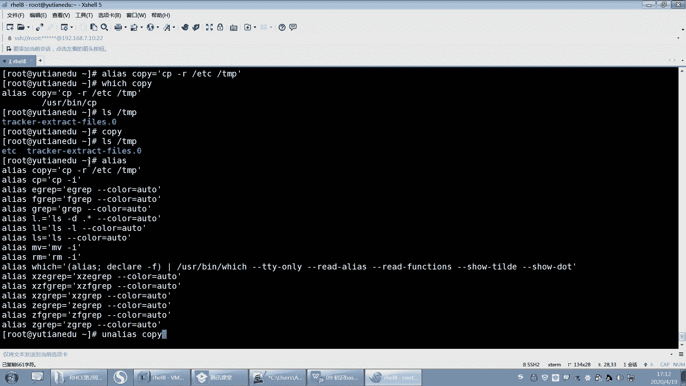

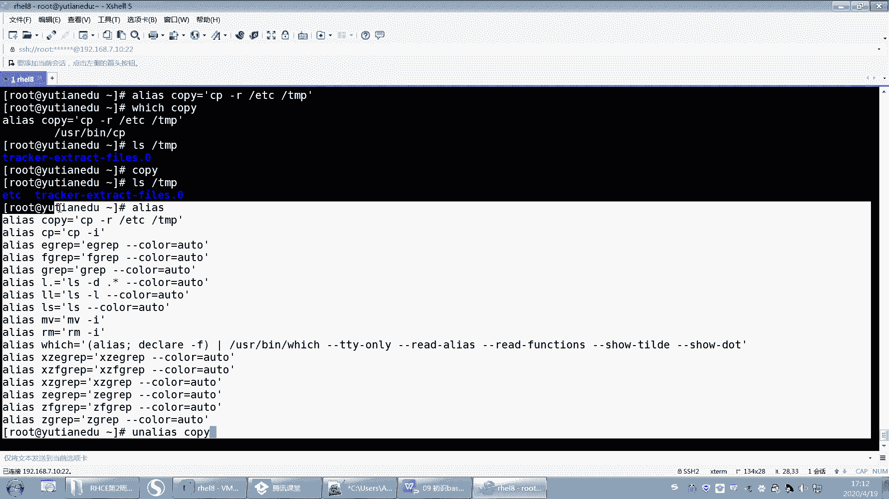

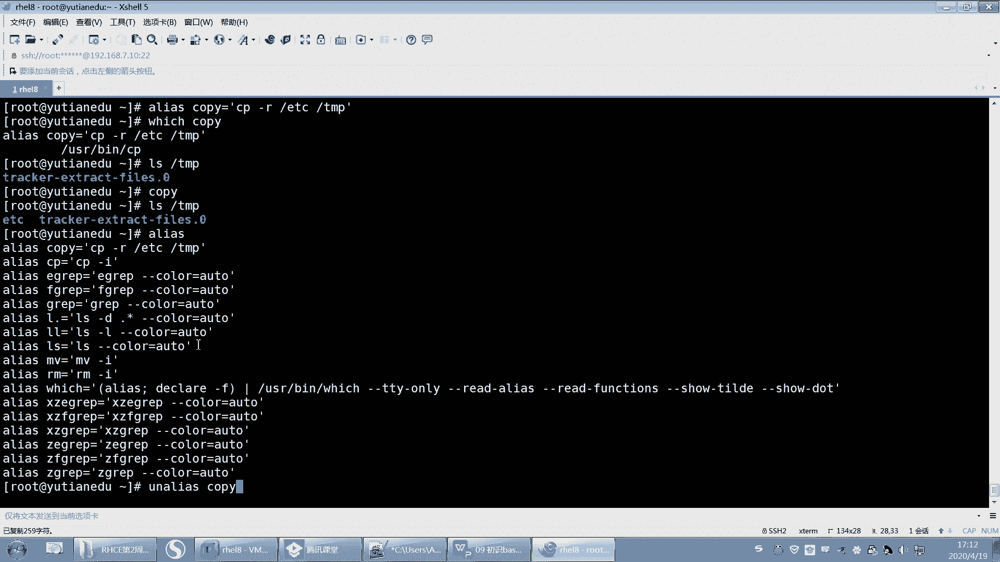

掌握环境变量和别名是高效使用 Linux 命令行的基础，它们能极大地提升你的工作效率和对系统的控制能力。