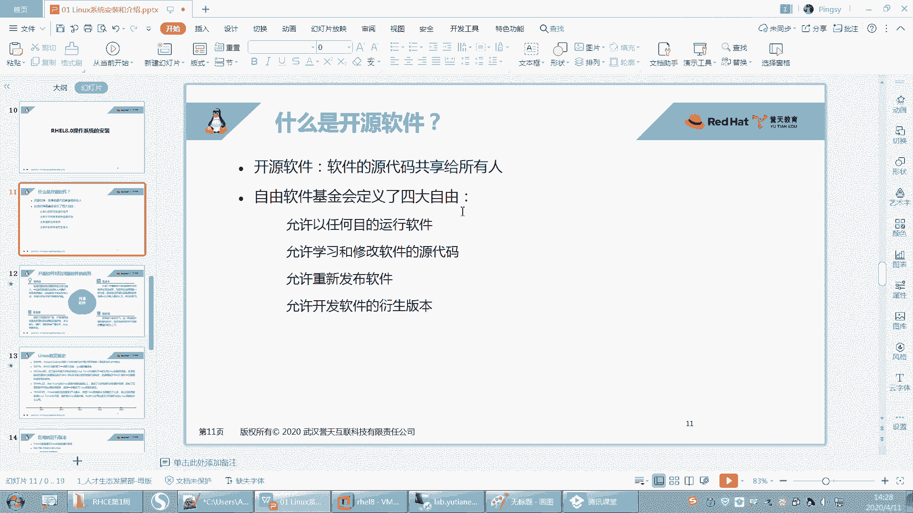
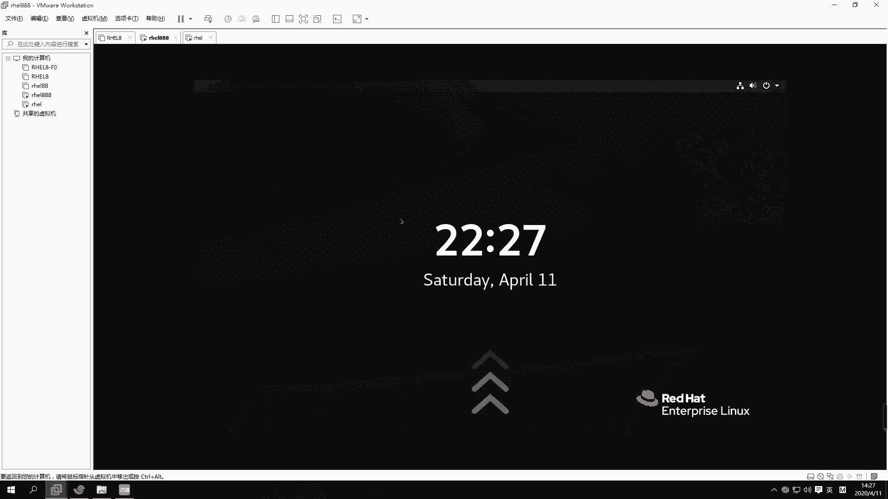
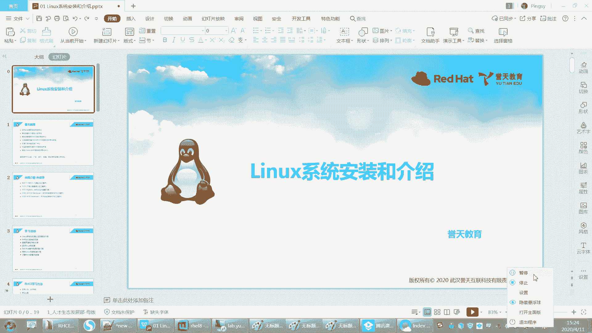

# Linux基础教程：第1章：Linux起源与开源理念

在本节课中，我们将要学习开源软件的基本概念、Linux操作系统的起源与发展史，以及Linux世界中的一些基本原则和主要发行版本。了解这些背景知识，将帮助我们更好地理解和使用Linux系统。

## 开源软件概述

上一节我们介绍了Linux系统的安装，本节中我们来看看支撑Linux发展的核心理念——开源。

开源是指软件的源代码可以被公开共享，允许任何人查看、使用、修改和重新发布。这与闭源软件（如常见的Windows商业软件）形成对比，闭源软件的源代码是保密的。

在自由软件基金会定义的开源理念中，用户拥有四大自由：
以下是用户可以行使的四大自由：
1.  **以任何目的运行软件的自由**：无论用途是商业、教育还是其他目的。
2.  **学习和修改软件源代码的自由**：用户可以研究程序如何工作，并按照自己的需求进行修改。
3.  **重新发布软件副本的自由**：可以帮助他人获取和使用软件。
4.  **发布软件修改版（衍生版本）的自由**：可以将修改后的版本贡献给社区，让所有人受益。

使用开源代码时，通常需要注明出处，以尊重原作者的贡献。

开源软件具有以下优点：
以下是开源软件的主要优势：
*   **低风险**：由社区而非单一公司维护，避免了公司倒闭导致软件无人维护的风险。
*   **低成本**：企业或个人可以基于现有开源项目进行二次开发，无需从零开始，节约成本。
*   **高品质**：由全球开发者社区共同维护，bug修复迅速，功能迭代快。
*   **更安全**：源代码公开，便于审查，恶意代码或后门难以隐藏。

## Linux发展史

了解了开源理念后，我们来看看Linux操作系统是如何诞生的。

Linux的发展与另一款著名的操作系统Unix密切相关。Unix诞生于1969年，并在1970年1月1日成为一个重要的时间戳起点。最初，Unix也是开源且免费的，但后来逐渐走向商业化，成为与特定硬件绑定的昂贵产品。

此时，一位名叫理查德·斯托曼的程序员发起了**GNU计划**，旨在创建一个完全自由、类Unix的操作系统。GNU开发了许多优秀的工具（如GCC编译器），但缺少一个核心部件——操作系统内核。

直到1991年，芬兰大学生林纳斯·托瓦兹编写了一个类Unix的操作系统内核，并将其开源，这就是**Linux内核**。内核是操作系统的核心，负责管理计算机的硬件资源（如CPU、内存、磁盘）。

**内核** + **GNU计划提供的操作系统工具和应用程序** = **完整的GNU/Linux操作系统**

现在通常简称为Linux系统。林纳斯开发的内核与GNU的工具集完美结合，共同构成了我们今天使用的开源、免费且功能强大的Linux操作系统。

## Linux发行版简介

有了内核和应用程序，不同的组织或个人将它们打包，并加入自己的管理工具或特色软件，就形成了不同的Linux发行版。

红帽公司是Linux领域的重要参与者，其旗下主要有三个发行版：
以下是红帽旗下的三个主要发行版：
1.  **Red Hat Enterprise Linux**：企业版Linux，以**稳定性和长期技术支持**著称。它更新周期长（约4年一个大版本），并提供付费的专业技术支持服务。这是我们课程主要学习的系统。
2.  **Fedora**：面向个人和桌面用户的前沿发行版。它集成了最新的技术和软件，是红帽企业版新功能的“试验田”。由社区支持，红帽不提供官方商业支持。
3.  **CentOS**：社区企业操作系统。它完全**兼容并重建自红帽企业版的源代码**，提供与RHEL几乎相同的功能和稳定性，但**不包含红帽的商业支持**。适合需要企业级稳定性但无需官方支持的用户。

除了红帽系列，Linux世界还有其他流行的发行版家族，例如基于Debian的Ubuntu，基于openSUSE的SUSE Linux Enterprise，以及专注于安全测试的Kali Linux等。

## Linux基本原则

最后，我们来了解Linux系统设计中的一些基本原则，这些原则深刻影响了其使用和管理方式。

Linux遵循以下核心准则：
以下是Linux系统的基本设计准则：
*   **一切皆文件**：在Linux中，几乎所有的资源（包括硬件设备、进程、配置等）都被抽象为文件，通过统一的文件接口进行操作和管理。
*   **由功能单一的小程序组成**：Linux系统由众多功能单一、目的明确的小程序集合而成。每个程序只做好一件事。复杂的任务通过组合多个小程序来完成。
*   **文本文件保存配置**：系统的配置信息通常保存在纯文本文件中。这使得配置易于查看、修改和备份，也便于通过脚本进行自动化管理。
*   **避免捕获用户接口**：程序的核心逻辑与用户界面（命令行或图形界面）分离，使得程序可以通过多种方式调用和交互。

---

本节课中我们一起学习了开源软件的概念与优势，追溯了Linux从Unix、GNU计划到内核诞生的历史脉络，认识了以红帽系列为代表的主要Linux发行版及其特点，并理解了Linux“一切皆文件”等核心设计原则。这些基础知识为我们后续深入学习和操作Linux系统奠定了重要的理论基础。