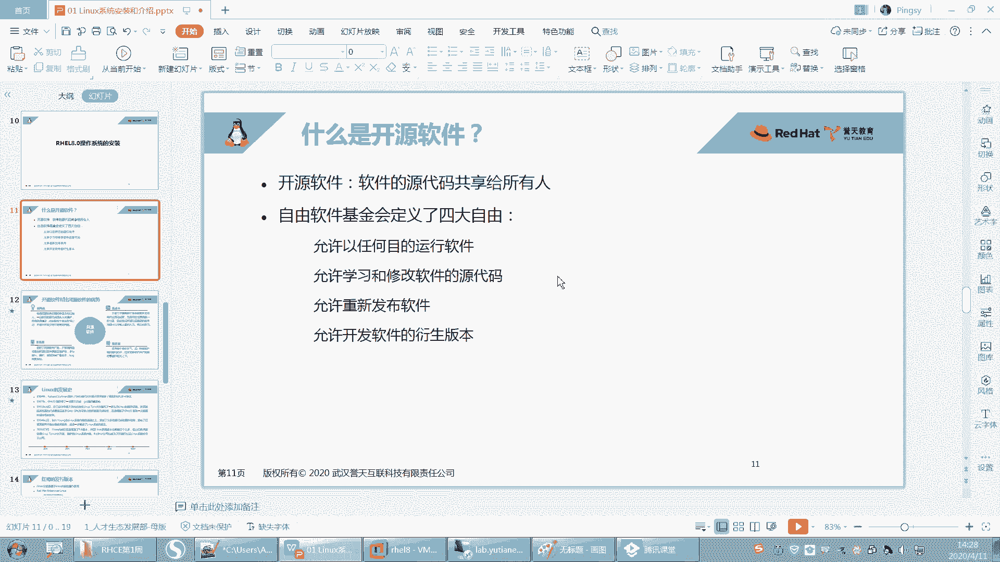
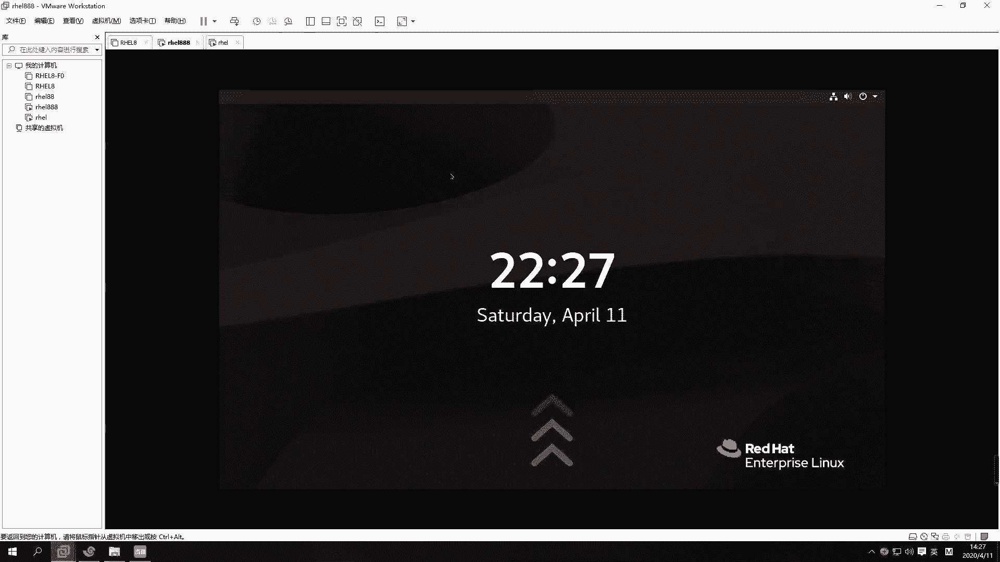
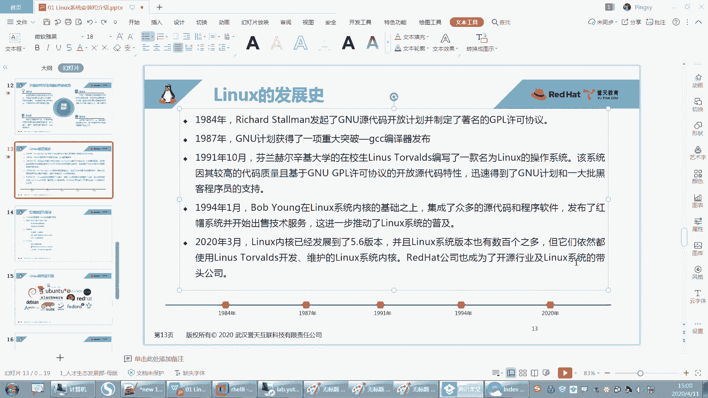

# Linux基础教程：P4：开源软件介绍与Linux发展史 📚





在本节课中，我们将要学习开源软件的核心概念以及Linux操作系统的发展历史。理解这些背景知识，有助于我们更好地认识Linux的生态和其重要性。

## 开源软件介绍 💡

上一节我们介绍了Linux的基本概念，本节中我们来看看什么是开源软件。开源软件是指其源代码可以被任何人自由获取、使用、修改和分发的软件。

### 开源与闭源的区别

闭源软件是指用户只能使用软件，但无法查看或修改其源代码。例如，常见的Windows操作系统及其上的大部分应用程序都是闭源的。而开源软件则将其源代码公开共享。

### 开源软件的四大自由

以下是自由软件基金会定义的，使用开源软件时用户拥有的四大自由：

1.  **以任何目的运行软件的自由**：用户可以出于任何目的（无论好坏）运行该软件。
2.  **学习和修改源代码的自由**：用户可以研究软件如何工作，并可以修改其源代码以满足自身需求。
3.  **重新分发软件的自由**：用户可以自由地重新分发软件的原始副本。
4.  **发布衍生版本的自由**：用户可以改进软件，并发布改进后的版本，使整个社区受益。

在使用他人源代码时，通常需要注明出处，以示对知识产权的尊重。

### 开源软件的优势

以下是开源软件的几个主要优点：

*   **低风险**：开源软件通常由社区维护，而非单一公司。即使某家公司停止支持，社区仍可继续维护，降低了用户因供应商倒闭而无法使用软件的风险。
*   **低成本**：企业或个人可以直接使用或基于现有开源项目进行二次开发，无需从零开始，显著节约了开发成本。
*   **高品质与快速迭代**：由于有全球广泛的开发者社区参与，开源软件的漏洞修复、功能更新和版本迭代通常非常迅速。
*   **高安全性**：源代码公开意味着任何潜在的后门或安全漏洞都可能在无数开发者的审查下被发现和修复，这通常被认为比闭源软件更透明、更安全。

## Linux发展史 🕰️

了解了开源软件后，本节我们来看看Linux操作系统是如何诞生和发展的。要理解Linux，必须先了解它的前身——Unix系统。

### Unix的诞生

Unix操作系统诞生于1969年，由AT&T公司贝尔实验室的肯·汤普森等人开发。它的诞生日期——1970年1月1日，被定义为计算机世界的“纪元时间”，许多系统的时间戳都从此开始计算。

最初，Unix是开源且免费的。但随着其商业价值被认识，AT&T开始将其转变为商业产品，源代码不再公开，并且与特定硬件高度绑定，导致其普及受到限制。

### GNU计划与自由软件运动

在Unix转向商业化的过程中，理查德·斯托曼发起了一项名为GNU的运动。GNU是“GNU‘s Not Unix”的递归缩写，其目标是创建一个完全自由、类Unix的操作系统。

斯托曼制定了著名的**GNU通用公共许可证**，并领导开发了许多关键的自由软件工具，例如GCC编译器。然而，GNU计划始终缺少一个核心部件——操作系统内核。

### Linux内核的诞生

转折点发生在1991年，芬兰大学生林纳斯·托瓦兹发布了他个人编写的操作系统内核——**Linux**。

需要明确的是，Linux内核的架构参考了Unix，但**没有一行代码是直接抄袭Unix的**。因此，Linux被称为“类Unix”系统，而非Unix的衍生版本。

最初，Linux只是一个内核。**内核**是操作系统的核心，负责管理硬件资源（如CPU、内存、磁盘、网络）。其核心功能可以抽象为：
```
内核 (Kernel) <-> 硬件 (Hardware)
```
但仅有内核，用户无法直接与计算机交互。需要一个外层的“操作系统”（包含各种应用程序和工具）来为用户提供接口（如图形界面或命令行）。

### GNU与Linux的结合

这时，GNU计划积累的大量自由软件工具正好弥补了Linux的不足。于是，**Linux内核** 与 **GNU操作系统的工具** 结合在一起，形成了一个完整的、可用的自由操作系统，即我们今天所说的 **GNU/Linux** 系统。

林纳斯将Linux内核以GPL协议开源，吸引了全球开发者共同完善。内核版本从最初的1.0发展到今天的5.x系列，而红帽RHEL 8则采用了4.18版本的内核。

### Linux发行版

基于Linux内核和GNU等开源软件，不同的组织或公司将它们打包，并加入自己的管理工具、软件包和配置，就形成了各种各样的 **Linux发行版**。

红帽公司是其中的佼佼者。其发展路径如下：
1.  早期版本称为 Red Hat Linux (如 Red Hat 9)。
2.  后分为两个方向：免费的社区版 **Fedora** 和商业的企业版 **Red Hat Enterprise Linux (RHEL)**。

红帽已成为开源领域和Linux企业级市场的领导者。

---



本节课中我们一起学习了开源软件的定义、优势及其倡导的“四大自由”，并梳理了从Unix到GNU，再到Linux内核诞生，最终形成完整GNU/Linux操作系统和众多发行版的历史脉络。理解这段历史，能帮助我们更好地认识Linux世界的协作精神与技术传承。