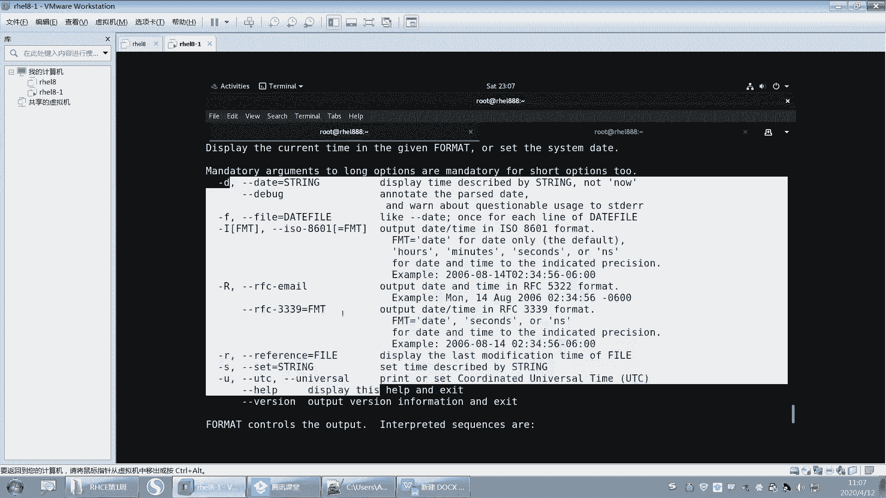
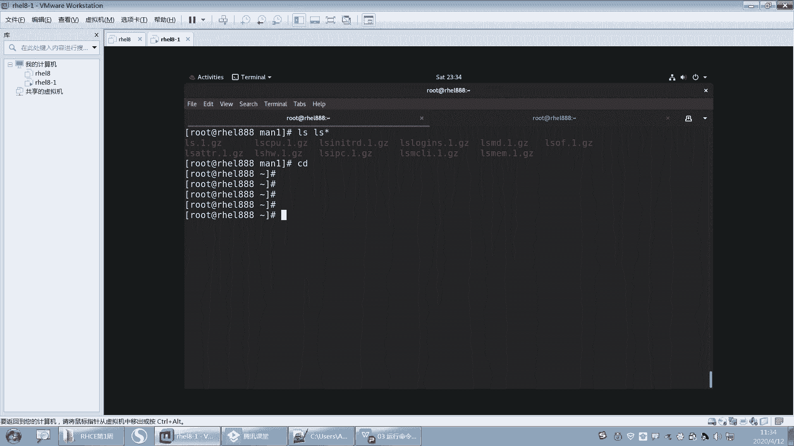
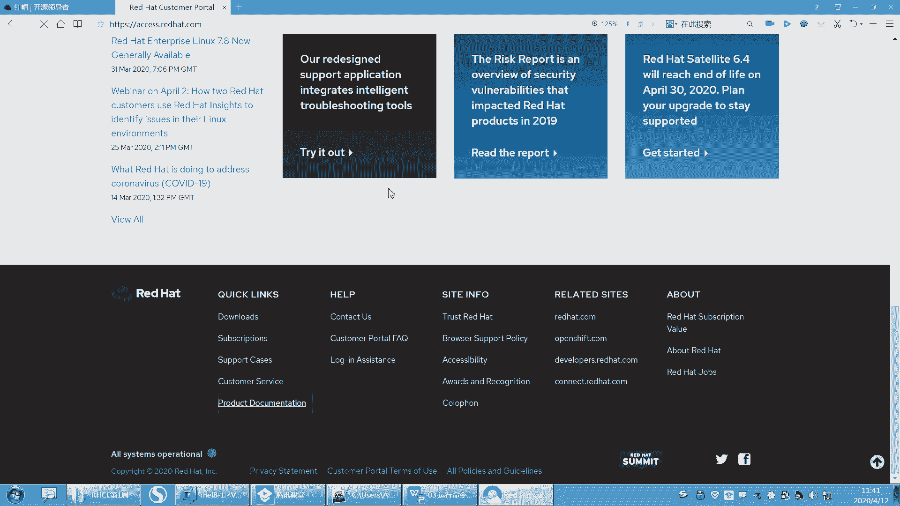

# 【重置详解版】孙老师讲红帽系列视频／RHEL 8.0 入门／红帽认证／RHCE／Linux基础教程 - P10：10 Linux如何获取帮助（which whatis --help man info等） - 誉天孙老师 - BV1aB4y1w7Wi

没有照片是吧？哎呀，很棒啊。哦，我之前有有的有的同学做的笔记非常棒，我觉得他都可以拿到做模板了。可惜我当时我没收留一份，应该收藏一份。你看这个同学大家可以展示一下自己的这个。给别人做一下借鉴啊。

别人有同学不知道怎么去做笔记。好。O。

那么我们之前学的这些命令啊，我们学的不论是LS啊。呃，还是date呀，还是CAL啊，还是pasword呀，对吧？那么这些命令都是由我对孙老师是吧？然后给大家告诉大家说怎么去用啊，唉，怎么去使用啊，啊。

怎么去使用这个选项啊，怎么是使用这个命令呀，后面参数应该接什么啊，对吧？好，那么如果让你自己碰到一个命令呢，对吧？你怎么去查，你怎么去看这个命令的语法是什么样子的，我怎么知道它有这些选项。

我知道它有哪些短选项，有哪些长选项，后面参数应该接什么，对吧？所以接下来我们就要去怎么学习一下这些命令之间啊，命令怎么去寻求帮助啊，寻求帮助。

好，那这地方有一句话啊，我们要记住对，怎么去获取帮助？呃，不要尝试去记住一切。呃，之前有很多同学，他他有他非常苦恼，不是一个两个啊，都跟我说。老师我这个脑子啊就是记不下来，这所有的秘密太多太多了。

我我太我太难了，对吧？我根本记不住，怎么办呢？你说我这还能学下去吗？我要崩溃了是吧？我说别呀别崩溃啊。他说老师，你怎么都全都记下来啊，你怎么那个练的这么熟啊，我说我要是记不下来，对吧？

我们白白敲这么多遍，对吧？就给大家上课，就你看我一年上上多少个班，然后我就敲几次啊，对吧？所以这个东西就是熟能生巧。对，这是第一点啊。啊，第二呢你不可能去记住所有的命令的。😡，你这也不现实，对吧？

所以你要会去找帮助，对，记个大概之后去找帮助，这个是非常重要的一个技能。好，这是其中一个，这是我待会儿给大家讲的。另外一个最后一点。就是什么笔记。最后一点就是笔记啊。笔记太重要了。

我不是说你上HHC1这个要去完成我的任务笔记，而是说你学完之后，你可能这比如说你4月份学学到6月份，7月份考完了，正常也考过了。好，ok是否你符合符合了，是否你永远都记住了，不是这样的。

因为你过一年之后或过一段时间的时候，你又回望了。那我你会回想去当初HHC1，对吧？上了什么内容，你的脑子是想不起来的。对你只有去翻译以前的笔记啊，哦，这些我上过哎，这些我知道对吧？我忘记了，回去看一下。

😡，对不对？这是不是就是你学过的东西，你你只有什么记下来，对，记下来啊。回去去查。而且比如说一些重要的步骤，比如说将来你搭一个服务啊，搭1个HTTP对吧？那搭个HTP服务，如果你的步骤对吧？

你是不是把笔记做好，记录下来，哪些配置标注注释注释上，那么这个时候你以后再用到的时候，你是不是就没有你不用去百度了呀，要不然你总要去怎么样去百度，而且百度的结果不一定是好的，不一定是正确的对吧？

这都是你的经验积累，这都是你之前做过的事情，把它记录下来。这个以后你再去翻非常非常的重要。对我们来说，听到了吗？对给大家经验啊。😊。

好，一定要去做这样一件事情啊，一定要去做笔记，一定要去整理自己的笔记。

好。OK所以这有一句话说，你不可能去记住一切东西的。因为你要不停的怎么样去接收新的知识，对，接受新的知识啊，你也不能记记你你脑容量也没有这么大，对吧？嗯。意议。啊。

OK下面我们来看一下这个我们系统当中自带的啊，有一些不同级别的一些帮助资源。对不同级别帮助资源。那么我们怎么去使用它啊？首先第一个我们要学一下一个叫word is啊，what is。

好呃。好了，那么下面啊嗯。我们我先教大家第一个啊，第一个其实我们执行的命令，第一个帮助啊，我们执行这个password或者执行LS这些命令。那这些命令是怎么判断它存在还是不存在呢？OK吧啊。

我们可以去查这个命令，其实命令都是文件。命令都是文件。那这个命令到底是哪个文件呢？我们可以去查啊，这样查叫which else。好，看这里啊，同学们看这里啊。对，只有写才不会犯困。对，是这样子的啊。

要不然就容易睡着了。像我声音这么好听，对吧？当催眠曲了。好，那么LS啊这个命令那。它是哪个文件呢？它是这个文件，看到没有？它是不是USR并LS啊，对吧？它是不是这个文件看到没有？那这个路径好。

那你看一下password啊。😡，那password这个命令是哪个文件呢？是不是这个文件啊？看到了吗？啊，那我随便敲一个哦，这个命令不存在，为什么不存在啊，你查一下呀，which啊，查一下。😡，有吗？

没有看到没有？没有这个文件。在这下面没有这个文件，好吧，好，那至于他怎么去找到这个文件的，注意啊，这个后面我会讲啊，你先知道就行了，你就知道什么which这个命令可以去查看后面这个命令怎么样啊。

它是哪个文件？对，是哪个文件，为什么报命令找不到，是因为这个文件根本不存在。对，找不到它找不到它执行不了，对就报命令找不到啊，所以这就是命令O吧。这是第一个大家记一下啊。

which是后面接命令可以去查命令是哪个文件，对，命令是哪个文件。如果这个文件不存在，那么就会报命令找不到，记下来了吗？如果这个文件不存在，那就会报命令找不到啊，这叫which which啊。

第一个帮助哦，第一个帮助啊，这我PPT上没写啊。

呃， which。还是查找是吧，查找命令是哪个文件啊。呃，如果查找不到这个这个这个这个是哪个文件，那么就说明什么，说明这个命令根本不存在，根本不存在。如果查到了，那么这个命令就存在啊就存在。

好，这就是为什么命令有时候为什么不存在呀？就这个原因啊。😡，啊，第一个这第一个。第二个。我想去看一下这个命令，那password对吧？我告诉大家说它是修改密码，那么它为什么是他他你告诉我修改密码，对吧？

那我想知道那你新新比如说CD啊，那CD是什么意思啊，对吧？那我不告诉你怎么知道呢？好，可以去简单的去查一下啊。😡，用 what what what。What is。用what is来查啊。嗯。唉。

这个查不了啊。等一下啊。等一下啊。分开呀，没有啊，他它这个命令是这样的，which what。what is它是一个命，看到没有？没有分开啊。呃，word有没有呢？word是没有这个命令的啊。等一下啊。

好，现在有了啊嗯。你的命令刚刚就报这个错啊。你们查能不能查到啊，是报这个错是吧？😡，nothing什么什么合适的是吧？啊，你们报这个错，为什么会报这个错呢？因为这个命令啊，你刚开始用的时候是嗯。

你刚开始比如说这个系统刚装了，刚装装好之后，这个命令是用不了的那什么时候能用呢？你第二天就可以用了，你放一天把这个系统放一天，第二天开机就可以用了。对，开机为什么是这样呢？

因为这个它需要它需要这个更新数据库啊，那你你想立即去使用它怎么办？你去执行这个命叫mandy B好吧。大家去执行这个命令叫manD B啊，这个后面会大家解释啊，这什么意，为什么会会出现这样的一个状况啊。

你先去执行好吧，先去执行才能有what is这个命令的使用啊。🤧嗯。对，放一天是吧？😊，嗯，对你放一天，第二天就好了。啊，为什么我这个也我这个系统装好了，为什么？因为我之前是恢恢复快照了。

我我装好之后立即就恢复快照了，所以嗯它就还没有放到一天。对，还没有放到一天啊，就你放一天啊，第二天就可以查了。好，如果你想立即查的话，你就manBB这样去查。好吧。😊，嗯，对他要自己熟悉一下是吧啊。😊。

OK这个是what is啊，what is呢还可以查看什么这个命令的一个简短的描述。嗯，它是用来更新数据库的啊，更新那个数据库的。呃，manDB啊manDB刚刚的upDB好不行，你要。呃。

执行 mainD别up低件up updateDP好像是那个locate的那个，好像是loccate的吧。是不记反了？是长那个loet的那个。loate那个命密的时候，用的是upBB吧。嗯。啊。

我可能也记反了，就是manDB啊，你有记住man帮助嘛，对吧？好，然后what is LS啊，这个是查看这个密的一个简短描述。那么LS呢是干嘛呢？它是列出目录的内容，列出目录的内容啊，看到没有？

它是不是简短的描述啊，然后我们可以看一下pasword。啊啊，当然这个pas错有点多是吧？好，我们看这个啊，看这个它有多有多个，待会儿我讲讲讲那个后面那个慢帮助的时候，会给大家说这是什么意思啊？啊。

那么看这个啊，这个是更新啊，但然第一个你也可以看嘛，这是不文件呃，密码文件对吧？pa做的文件哦，有可能它还是个文件，对吧？然后这个呢是更新怎么呀？更新用户的哦，这个是昨天学过的是么？

叫认证的tokens对吧？就是就更新用户的认证嗯口令，就是更新用户的什么密码，更新用户的密码啊。啊，这是这个呃what is啊好what is date呀，你都可以去查呀啊，what is CAL啊。

嗯，what is data就是打印和设置系统的时间、日期和时间，对吧？然后CL呢就是显示呃，canada Canadaada就是日历的，也就那个日历那个单词叫canada。呃，缩写CL对。

又认识个单词，对吧？canada就是那个日历那个单词啊。这个英语没过关的啊，这就不认识的这个这个这些单词不认识的啊，就是那个初中小学啊，你们应该是小学就学过英语吧。小学没过关的啊，小学初中肯定没学英语。

没好好学的。这小学初中英语啊。我估计高中应该都学过吧。嗯。高中的时候英语单词比这个要难的多了啊。啊，那这个是我们的这个what is啊，what is它其实作用就是简单的描述一下。对，简单的描述一下啊。

好。我的一直能你。哦，你厉害嗯，可以啊。嗯，哼。好，这是第一个啊这是第一个what is好吧？😊，啊，你可以看一下这边啊嗯这个word is呢它是显示这个命令的简短描述。

但是呢它是基于数据库的查询定时更新。对它是定时更新的啊，就有可能今天你新装了一个命令。那这个命令呢可能用word就查不到，它需要什么，第二天就查到了。但是没关系。

我们可以让它立即查到么是不是执行man手动更新数据库，手动更新数据库，它是基于数据库的查询啊，对，它是基它不是实时的查询，它是基于数据库的查询。你用man可以什么哎可以去这个更新这个数据库啊。

那安装后不能立马使用啊。好，然后这是一个例子啊一个例子，这个不是我们的重点啊，你知道就行了。哦。嗯，可以可以，但是更新数据库的时候，大家为什么你看为什么说放一天就好了，因为它会在凌晨的时候更新。

一般数据库这种更新的话，它不会说让你在大白天的更新。因为大白天你的业务一般都会比较忙。

能理解吗？就是你的比如说你在处理业务CPU内存等等就比较忙。那你更新数据库，你看我刚刚更新是不是更新了半天呀，对吧？呃，没开机不会更新，它这开机之后就会更新了。开机之后你放一天，开机之后就会更新。

没开机不会更新啊。没开机，它怎么更新啊？嗯，你看我更新更更新了半天，对吧？那这个是耗资源的啊，这个会靠耗资源。所以不要在你的系统繁忙的时候去更新。一般在。没有呃，不没有人使用的什么？夜夜夜黑风高的晚上。

对吧？你去更新它好吧。

嗯。好嗯。要不休息一会儿吧。对，因为这个word is这个命令说实话它不怎么重要，你不怎么重要，你有没有必要去更新它呢？为什么就一天更新一次呢？那重要的是不是就是很短的时间内才会更新。

那不重要的是不是一天更新或者是一个星期更新或者是一个月更新，对吧？所以就是。😡，嗯，这个就看他具体的业务情况，好吧。OK我们休息一下吧，休息一下，我们再回来啊。😊，休息一下觉。到了哦。

这20这20分钟内容很丰富啊。好。嗯嗯嗯。O。我们刚刚讲的这个what is是吧？好，下面我们来看一下第二个这个帮助啊，帮助资源。啊，第三个了是吧，你第一个是which。好，第一个是which。

第二个是what is。然后第三个是这个叫什么？哦，杠杠hap对吧？好。うんうん。

好，第三个是杠杠help，我们来看一下杠杠help。刚刚其实我们已经用了这个是吧，已经用了这个呃这个帮助了。O。好嗯。我们来看一个啊。我们看一个LS刚刚hab是吧？这是我们刚刚学过的是吧？好，回去了。

往上翻往上翻啊。嗯，往上翻。好，那么我们来看一下杠LS杠杠hab执行结果是什么？第一个第一行useage这个是指用法语法用法语法啊。好，它的语法是什么呢？LS后面是空格，看到没有？你你严格要看清楚啊。

这个参数这个语法，它中间有的有空格，有空格就一定要有空格，所以LS命令的后面就是选项option，看到没有？选项option啊，就叫选项啊，中括号括起来，我们把它用中括号括起来的选项。呃呃，记啊。

记啊呃语法规则当中，如果有中括号，那么这个中括号指的是可选项。也就是说这个命令可以不用加选项就可以执行。可以不用加米选项就可以执行啊。好，后面如果有3个点点点，三个点点点代表的是。可以有多个选项。

就是可以加多个选项，就这个地方可以有多个对多个啊，就是杠A啊，杠L啊，杠H啊，对吧？好，这个是选项，选项后面也有空格，后面就是参数。这个参数呢它指明了用什么fi就是文件。因为我们LS后面要么就接文件。

要么就接目录，对吧？就接文件或者是目录啊，然后这个地方也个中括号括起来了，说明什么，说明它是一个可选项，就是可以接，可以接，也可以不用接，后面这个三个点同样也是指什么？可以接多个这个这个文件，对吧？

其实这地方就是参数了啊，就是参数。好，这这个语法也比较简单了，是吧？😊，嗯，然后这还有一些什么list似什么什么一些描述信息描述信息啊。好，你再往下看。这个地方是什么？是不是就是选项啊，有哪些选项啊？

好，你看它的官方解释杠A是什么意思啊？杠A逗号杠杠沃指的是这两个选项指的是同一个意思。就是你用这个跟用这个两个是一样的效果啊。啊。

它指的是do not ignore什么entry starting with点是吧？它指的是什么？不要去忽略entr条目项目，就是我们展现出来的某这些记录，对吧？呃。

不要去忽略一点开头的这些什么这些呃这些记录信息啊。就是包括嘛就包括点是正常情况下，我们ALS去执行的时候，是忽略了什么？忽略了隐藏文件，忽略一点开头的文件了啊。好，还有什么杠大A呀，杠大A说什么。

他说不要去列出这个点和点点是吧？嗯，点和点点。因为我们在列的时候我们在列的时候会列出什么？哦，列的时候会列出点和点点，对吧？这也是这两个也是个目录啊，这个点呢就是嗯当前目录，这点点是上一层目录就是。

就是两个目录啊，你看是不是蓝色的呀，对吧？蓝色的啊。好，然后这里有很多呀，有很多选项，我们往下看一下啊，还有什么。B呀大B呀，小C大C小D大D是吧？还有一个杠H，我们刚刚执行的杠H是什么意思啊？呃。

杠H呢它是指什么？它是指hume呃你用这个human readable也可以达到杠H的效果。它指的是就什么，它翻译过来叫人类可读的对吧？啊，呃，它的意思是说，如果显示这个文件的大小，是自己。

我们就读不了了，是吧？不是我们人类可以读的啊啊，那么它就其实说白了就是什么换算单位的意思啊。换算成我们比较好识别的这个单位啊，超过了K呃超过了呃超过了K就换算了K，超过成了兆就换算成兆。

超过G就换算成G啊。好，那么他说什么？他说with字杠L和杠S或者杠S这两个选项，是吧？其实你杠H的基础之上需要加这两个选项，这个或这个都可以啊，然后打印什么，打印类似于大小是一K兆G等等，好吧。

这他的一些你们要会去看这些这里面的这个这个这个选项是什么意思啊，要会看。好，然后再往上翻，还有什么，还有还有R啊，还有呃size啊。对吧只显示大小哦杠S就是只显示大小是吧？然后还有L啊，对吧？嗯。

L就每一行就是一个文件，那pro pro就是每一行嘛，列出一个文件，对吧？列出详细信息等等啊。好，这就是杠杠hap啊杠杠hap啊，它的大概大概的内容啊，下面还有一些其他的信息。好。

那么我们再来看一个好不好？我们看一个呃。看1个CP吧，好吧，这个还没学吧。哎L刚刚学过的是吧？那CP的话，我们来看一下啊，CP杠刚ha。好，往上翻。啊，CP我们还没有学，但是它是什么意思呢？

我们其实可以用什么？可以用这个呃what is呃，what is来看一下CP是做什么用的。然后在CP杠杠hap，然后看查看一下它的语法规则。它的用法呢有3个1233个啊好。

第一个语法规则我们先可以看一下啊，我们先不管是什么意思啊，CP命令空格后面是可选项，可选项有3个点点点，三个点代表是有多个可选项啊。然后这里有一个中括号括起来，一个选项叫杠大T，杠大T这个选项呢。

它是什么？它是可选的，就是可以加，可以不用加OK吧，可以加可以不用干不用加啊啊，那么后面就有两个参数，看到没有？有两个项参数，一个sourcece，一个dest，一个source，一个dest啊。

那么这个参数呢嗯它是什么？一般是指这个语言，像sce嘛，你你我们中文翻译过来叫sce叫圆，对吧？这个叫目标对吧？原跟目标。其实我们在这个就是什么？就是我们在复制的时候呀，要接两个参数。

一个是要复制的文件，一个是复制到哪个地方去啊，这个是复制。啊，以及我们CP后面。对，来呃，就是对，就是你要复制谁，就像你。就像你就这个我们在windows里面复制是先复制再粘贴，对吧？

但是在linux当中，它是一条命令搞定的一条命令搞定啊，它不是说啊我先复制，然后再跑到某某一个地方去粘贴，对吧？它是一次性复制谁，复制到哪个地方就完了。好，那这个呢你看啊。

这个下面这个我们可以看一下它什么区别呢？这个s后面是不是加了三个点点点啊，说明什么说明这个圆可以有什么样啊，可以有多个呀，这个圆是不是可以有多个呀？你可以你去可以一次性复制多个文件，对吧？

后面是个directory。对，后面是个directory，是个目录，这个这个单词叫目录，单词叫目录，对，那么这个目录呢呃只有一个对吧？就是你你目录后面没有点点点吧，没有点点点说明什么。

说明我们只能借一个目的地，只能借一个目的地，就将多个文件可以复制到一个目录下面，但是不能怎么呀，不能将一个文件复制到多个目录下面啊。好，这就是第二个语法规则。好，第三个呢，你看一下CP。

然后加什么叫option点点可选项，然后加了一个选项叫杠T，这个杠T没有加中括号吧。说说明什么？如果你用这个这个语法规则的话，那么这个杠T一定要加一定要加啊？好，后面是directy。

directory是不是就目录啊，目录是不是放在前面了，看到没有？目录放在了前面啊。也就是说把圆跟木的位置是调换了一下。调换了对吧？本来是圆在前面目标在后面，但是这个地方什么把这个目标放在前面。

圆在后面了。所以后面这些圆指的是什么？你要复制的文件，这个是你要复制到哪个地方去，OK吧，这就是呢它的一个对一个语法。嗯，哦好，你是这么解释也可以啊。啊，你看这个是默认是不是有个杠大T啊。

这个默认的杠大T它没有加，没有加，其实就是圆在前，目标在后。那么加上一个小T就是指的什么？就是目标在前，圆在后啊，就是这个意思啊。好，呃，就是CP那再来看一会喽，再看一个啊，然后看个data好吧。

data刚刚ha。啊，看一下这个啊，这个待会儿我会出题目啊，在这儿大家认真听啊。哦，dta刚刚ha。那这个就有又有点复杂喽，又有点复杂了，是吧？好。用法是data加option。这个是可选项。

这个不用说了是吧？然后后面呢是一个中括号括起来的，这个中括号括起来呢，它是一个可选可选的东西，不然但是不知道是什么东西，对吧？反正就是可选的，然后前面加了个加号。

然后后面加了一个format format知道什么意思吗？啊，要认识啊。啊呃，这个fmed指的是格式。呃，你们知道格式化那个单词吗？格式化。哦，对对对，格式化就是这个单词。呃，英文的格式化就是这个单词。

然后它也是格式，就是格式嘛，它有很多意思嘛。呃，格式格式嘛？什么叫格式啊？就是你看啊我这样data这样一显示这个格式什么？这格式是不是就是什么呃星期六啊，4月11号啊，几时几分几秒啊，呃，哪一年啊。

对吧？哪一年它是这样的格式，但是我们中国人看起来不习惯，对我们习惯什么？看2020年对吧？然后4月12号等等，这样的格式，对吧？4月12啊，或者是这种斜杠，4月12，我们是不是喜欢看这种格式，对吧？啊。

所以这个叫格式的意思啊，那么。这句话的意思就是它可以怎么样？它可以加这个formmat去改变它的格式。你可以往下看，那你怎么知道是改变格式啊，你往下翻嘛。那这边有个粉 mat，还有一个什么那个解释啊。

它是来控制这个输出的。对，控制你的就是输出的格式啊。嗯，这下面就会有一些解释，对吧？有一些解释啊呃，比如说你想比如说你想显示。嗯，我们找一个随便找一个啊。嗯，比如说我想写示年，你看用年有什么解释。

是不是百分号Y呀，所以你可以这样写，对大概大概就是这样啊呃一。好d，然后什么。嗯，加是不是加呀，对吧？后面是不是formet？那formmed的话就是加百分号Y那formed可以是什么？

可以是这个百分号Y嘛。那这样的话是不是显示年O吧？我就举一个例子啊，就这个意思。好，就form嗯。好，再往下面这个啊，这是第一个这第一个啊，它可以控制这个输出，对吧？好，然后再往下呢。

这个是data杠U杠UUTC杠杠universal是吧？啊，这是有三个选项。好，记住啊。这三个选项中括括起来，说明这个选项是可选的，就可以加，可以不用加。那么这个三个选项用中由竖杠隔开。

说明这三个选项之间是或者的关系。记记啊记中括是可选项，对吧？点点点是多个，那么竖杠指的是么？竖杠指的是或or就是all的意思啊，or就是或者或者或者用杠U或者杠杠UTC或者杠杠univers。

那你说杠U杠UTC杠univers什么意思往下翻。这里有它会有，它应该会有解释，看到没有？嗯，他打印这个或设置这个时间是吧？用UDC时间就是coordinate universal time。

就是世界统一协调时间。统一协调的嘛，世界的时间对吧？啊，世界同一天和时间啊。好，这是UTC事件。啊，也就是说。它可以打印时间，看到没有？它可以打印时间，也可以怎么样设置时间也可以设置时间啊。好。

那么如果加上杠U就是打印和设置什么UTC时间对UTC时间啊。啊，那么后面这个是什么呢？现在还是要设置时间，对吧？那么设置时间可以怎么样可以去加，那设置什么样的时间呢？时间格式是什么样子呢？

在在后面给你标记出来了，看到没有？就后面这个中括号，这个中括号嵌套中括号看到吗？中括号嵌套中括号啊啊，我们可以大致去看一下。嗯，这个MM啊，比如说我这样去设置啊。data我去个data啊。嗯。嗯。

data，然后后面不是杠U什么什么，我可以不用加，对吧？然后后面呢我们可以去加一些时间格式，那时间的格式是MMDDHHMMMM好，那有人能告诉我说MMDDHMM是什么意思吗？好，在这里我们没有解释。

没有解释MMDDHHMM是什么意思，对吧？但是不慌啊，待会儿我会进大家去看啊，这个地方里面显示的内容比较少，就刚刚ha显示内容比较少啊。😊。

好。那么我先告诉大家啊，这个是指你这个是月天MM就是月嘛，为什么是两个MM呢？是因为那个时间是什么？时间是呃这个月，就是比如说今年是今今天是4月份，对吧？那就写04对，04的意思啊。

那你写一个4可不可以不可以啊，就写一个4不行？天也是一样，比如说4月1号，那你就写0401OK吗？就0401啊，这样去写，同理就是小时分钟，看到没有？小时分钟啊。OK吧？唉，小时分钟啊。

然后小时跟分钟是不是也是两位？然后CCYY呢CCYY指的是CCYY是指的年年，比如说2020年啊，不2019年啊，那么CC呢指的是前两位2020，然后YY指的是后两位19O吧，CCYY。

然后SS呢指的是苗。秒两位啊就是60秒50秒那么40秒，前面是不是加个点，是不是加点之后你才会怎么样才会表示是秒的意思啊。好，下面我开始来出题喽。嗯看好啊。呃，0401对吧？20。嗯，好，就这样。呃。

记住了吗？刚刚请告诉我，这个是。这个时间前面这几位数字指的是什么？请问04指的是什么？04看好啊。我写的是什么？我写的是040120这样子。呃，告诉我0呃。等一下等一下等一下等一下啊，还没写完。

还没写完啊。😊，嗯。嗯，12。06。1206。2。19吧。好，这个吧。好，大家知道为什么我刚刚说040120不对吗？我刚刚出了这么个问题是吧？040120不对是吧？怎么回事儿啊？

知不知道有没有同学能告诉我？20小时没有。哦，对，很好很好很棒啊，至少要有几位呀。不是6位吧，至少要量是吧？至少要有。8位对，至少要8位啊。就是你看啊后面这个整体用中括号括起来，对吧？

那么你要么有这个整体，要么没有这个整体。对，就是要么你有这个整体，要么没有。那么你既然写了。😡，从哪里开始，是不是从这儿开始，那你从这儿开始吗？从哪里开始那你从这开始啊。😡，是吧这是不是有先后顺序的呀？

MMDDHH对吧？嗯。啊，嗯，叫你数啊，12345678是吧？好，所以这个地方正好是不是有至少至少要有8位才可以。OK吧，对，至少至少要有8位才可以啊。所以我在这写，刚刚写的是不对的啊。

就0040120就不行。所以现在我加到了1234567890好，加10位啊。好，10位的话，前面前面123456。呀我也数不清楚了。啊，前面8位的话okK你可以区分吧，前面8位是不是就这8位啊。

MMDDHHMM对吧？没问题吧。啊，那谁能告诉我最后这这个19。是哪两位？你告诉我19是哪两位？嗯。只需要说19就可以了。嗯，前面的时间不用说，就说19。就说19是CCYY还是SS。好，有同学说是SS。

有同学说是CC有同学是YY是吧？哦，CC的没有人说，有就说YY啊S好YY的绝大多数啊啊YY的胜利哦。好OK看这儿啊，昨天不是讲过了吗？SS肯定要肯定不对呀，为什么呀没有点呀？没有点对吧？所以SS不对啊。

好，排除了一个啊。好，那么CC跟YY是取决于哪一个呢？你要看呢这个中括号是不是在YY的里面。这个中括号CC这个中国号是不是在YY的里面？所以如果这4个。只有两位的话，一定是什么？一定是YY。

如果是CC的话，那么YY一定要存在。也就是说CC是YY的可选项，看到没有？CC是YY的可选项。要想有有了YY之后才会有什么才会有CCOK吧。啊，这个就是CC跟YY这个好像没有同学弄混啊。好，来。

我再加两位20。请告诉我。请告诉我1920指的是什么？20指的是什么？我又加个20呢，1920。嗯。啊，一致一致通过是吧？好，很好啊，对它就是指的什么？指的是。这个现在这个19是不是变成了呀。

变成了CC了呀？然后20是不是变成YY了，因为这个两个都有了，对吧？这两个都有了，都有之后看什么，是不是看顺序啊，看谁在前，谁在后嘛，对不对？看谁在前啊，它在前，它在后，所以CC是19YY是20。对。

然后点S，所以这个格式看懂了吗？那中括号签到中括号这种方式啊，啊，记好哟，待会儿我去大家去用的啊，不要现在回说，待会一会忘记了啊。好，这个就是我们的data杠杠hap对，杠杠hap。好。

那么其实我们已经可以在data这个地方看到了我们的部分的语法规则，知道吗？是部分的语法规则呀，然后还有部分的选项，对吧？那部分的选项，但是这个这个这个刚刚hap，还有个有时候有的不好的地方。

就是你看啊我每次呀我每次什么，我每次都要去这样来回翻，对吧？要来回翻，而且有些时候。

啊，有的时候还是怎么样？我们在这种情况下，比如说对吧？我们要执行这个呃比如说data杠杠have。好，你看你来回翻是不是翻不了，对吧？来回翻翻不了。好，这是其中可能两个因素不太好用。最重要的因素是什么？

最重要的是刚刚ha呢它其实啊。

对，刚刚ha其实它内容是比较少，不多，就是只有部分的部分的内容。对，只有部分的内容啊。所以呃鉴于它的什么它的这个内容较少，然后使用起来不太方便。嗯，就在字符界面下使用起来不太方便啊，要来回这样去翻。

对吧？有时候还翻不了，所以呢我们就出现了唉。

后面这个啊。好，这个你们去看一下，好吧，这个我我稍微给大家解释一下吧，中括号代表是什么可选的。然后这个大写的这个参数，那大写的参数或者是中这个这个这个那这个间号的表示变量是吧？然后点点点代表是一个列表。

其实列表就是多个吧，可以有多个对吧？但是多个之间用空格隔开啊。然后这个是代表货的意思，就是X或Y或Z。date哦哦，date date date。然后杠ABC啊，我我但是我不我不会把data。

我不会把data敲成呃data。但是有同学会把data呃敲成data，是这个意思吧？哦，对。啊，然后这个杠ABC代表是杠A或杠B的这一组合，对吧？这个应该可以看懂吧。嗯，好。

这个就是这个杠杠hab的使用啊。好，往后哎我们就出现了这个东西啊，这个叫慢帮助。这个放在后面去。

好，那我们来看一下啊。呃，我们真正要学会的今天啊，重点啊就是这个man。对，就是之前上节课同学们说的这个男人和女人是吧？啊，为什么只能男人不能女人呢？好，所以告诉我man是什么意思啊。学过的同学。哦。

明白是什么意思啊？没有学过的，不知道是吧？对它是一个单词叫manu。嗯，叫man啊，这个单词拼错了啊。对，然后man you啊，它叫手册手册，就手册，你知道吧？就手册拿一个本本，然后再翻翻翻翻翻翻翻。

对吧？是不是方便去翻啊，对，方便去翻，然后所以呢这个叫手册的意思啊，手册取前面三个叫man嘛，叫man啊，所以为什么说不懂的时候就man一下对吧？man一下男人一下啊啊，男人不行，女人女人也没有是吧？

好，那么man怎么去用呢？我们来看一下啊，你不会什么，你就man什么就可以了，对吧？比如说man LS就后面接上命令就可以了。man LS我们可以man命令，后面可以接个命令啊，man LS回去了。😊。

好，这边就进来了，我来带大家游览一遍啊，游览一遍。看好啊，我上下键这样再翻好，上下键这样翻，我先教他怎么去用这个，你看它是不是相当于是一页一页的呀？😊，那一页还可以翻页，你看空格键还可以这样翻页。

那我教大家翻啊。好，现在你想去回到这个这个曼邦助的这个手册的第一页，第一页你就可以按下小G。啊，其实己可以记一下啊，慢帮助的使用方法。慢帮助的使用方法小记。是回到第一页。对，回到第一页啊，然后大G。

大G是回到最后一页。大G就是摁的shift加G嘛，就这个不用我说了吧，shift加G是最后一页啊。嗯嗯。好，你还可以问空格键往下翻页，上下键，这个我就不说了吧，上下键翻。

然后空格键回车键这样去翻上下翻啊。好，然后还有什么？Oh。还可以搜索关键词是吧？你可以搜索关键词啊。好，现在你在这个界面上输入一个斜杠，左下角就会出现一个斜杠。那左下角就会写出一个项，你说一说关关键词。

比如说搜一个呃list。回车，那他就会把这个list给标什么呃，标高亮，对，把这个list标高亮啊，然后你可以摁小N。小N在关键词之间向下移动。大N在关键词之间向上移动，记住了吗？好，那。输入一个斜杠。

搜索搜索fill。好，回车那它就变高亮了是吧？高亮，然后摁着小N在关键词之间向下移动加G啊，大N在关键词之间向上移动，小N大N啊，我自认为我的普通话应该还可以吧，大家应该能听懂啊。

听不清楚我说什么可以可以可以提出来啊。好，小N跟大N啊，如果你想取消高亮，你可以这样输入，随便输随便输，这样就取消高亮了那。输入一个不存在的回去了，就这样就取消高亮了。O吧，就把那个高亮给取消掉啊。

啊，摁Q退出来。对QQ退出啊。所以就这个呢。呃，空格键可以向下滚动一个屏幕，其实就是翻页翻页的意思啊。就向下翻页嘛，这个改一下。嗯，然后page up page down就是向上翻页。

向下翻页上上箭头下箭头空格键向上向下这样就滚动滚动啊。哦，这个是回车键啊，记错了。回车键。好，然后小G大G回到开头末尾，然后这是搜索关键词呃，小N大N是在关键词之间向下向上查找。

Q呢就是退出Q就是退出啊，你用的时候就是man，后面加上什么，加上你要执行的命令就可以了。

那man这样加执行的命令就可以了啊。可以吧。好。那我们再来说一下我们这个里面大概有哪些内容啊。嗯，首先它做一个解释，对吧？use a command它是一个。呃，取消高亮没什么就随便说。啊。

用户的命令啊，名字呢这个地方是名字对吧？名字是列出目录的内容。哎，这个list呃这个LS是做什么用的是吧？列出目录内容啊，然后这个单词叫语法，是语法单词啊。

就是我们会用刚刚刚刚ha里面是us age是吧？哎呦，敲错了，USAGE没有F啊。啊，这个单词也是语法的意思啊，那跟这个之前是一样的对吧？好，再往下翻再往下翻啊，你看description是描述描述啊。

它这个描述信息在这里，对不对？啊，然后下面呢这个地方是什么？是也是也是一些描述信息是吧？好，那再往下呢就是参数选，不选项选项选项啊，选项的解释。好，这里有好多选项。

它大概就是按照ABCDEFG这样这样去分的，这样去往下。嗯，这个选项是不是多？多一些是吧？好，然后下面还有一些什么说明，你可以看一下。下面有些说明啊。好，还有一些什么退出状态，这个后面再说啊。

还有这个什么作者是你看谁呀？richarman就不是我昨天学过的是吧，他写了他写的AOSO。嗯，然后还有它的一个这个版权印刷是吧，是符合什么什么GNU的GNU组织的。它的版权copyright。在这里。

它的licenseGPR准则符合这个准则是吧？它是个开源的工具啊，开源的工具。好，这个是大概就是我们这个一些分布啊，就是每每一部分，它相当于就是不归了个类啊，它更就是更嗯就是分小节了是吧？

这一小节这个小节做什么，这个小节做什么？好，这个地方我也给大家写了啊，大家可以看一下。

名字是指的什么？名称还有说明，然后这个是它的语法格式格式说明是吧？然后就讲描述描述信息option就是选项exam好，这个exam的话就是案例是吗？事例，对吧？就是有一些这个呃命令啊。

你不知道怎么去执行。它会给你自己去写一些呃就是这个事例，你可以照着去写，得照着去写，然后还有文件就是相关的文件，还有一些变量，对吧？还有一些什么s also好，这个我也带大家看一下啊。

比如说嗯。呃，我们去卖一个。不要问啊。呃，或者是卖一个卖一个什么东西嘞？For disk。我们后面会用到的一个命令是吧？分分区的一个命令。好，你往下翻往下翻啊，你前面都一样的嘛。

你看是不是都有这个小节是吧，这里都有。好，然后这个标题嗯往下翻往下翻。

哦，有还有device是吗？还有大小，这都会有解释，它可能绝大多数都是有这个的。啊，还有一些文件还有有一些命令它会特殊，比较特殊，它会有有一些单独的标题是吧？

好，然后往下翻翻翻翻翻翻。好，这是一些变量，看到没有？environment变量，然后往下翻好，这地方有OC also看到吗？ee also就是呃有些时候我们去查一个命令的时候，跟它相关的一些命令。

我们可以在C also里面看到。相关这个还不太明显，这只有几个是吧？我给你看这个啊。叫faair world。你往下翻，你看这是不是很多。啊，那这里是不是有很多很多的跟它相关的一些。嗯。

命令对相关的一些帮助，相关的一些呢。对不对？很多啊，所以大家可以去查一下关于Cal所，因为命令记不住嘛，那跟它相关的一些命令有哪些呢？你就可以在这看在这个地方看啊。哦，但应该还有。嗯，还有一些案例也有。

比如说我看data有没有啊。有没有examp？嗯。啊，你看data是不是有你看显示显示日期的时候，是不是有一些例子，对吧？会在这显示，比如说设置时区啊，对吧？那它就会在这显示出来，你可以去看，好吧。

你要会去用这些工具啊嗯。嗯，案例。这都是自带的，就是说我们linux系统自带的自带的一些工具。好，这个这个会不会用啊？虽然没怎么讲里面内容，但你慢慢后面接触了之后，你就知道怎么去查，要经常去用啊。

经常去用。🤧。嗯。好，那这就是慢帮助啊慢帮助。好，下面呢我们来看一下啊，在这个最前面最前面这个地方。嗯，这个其实跟go have是不是类似的，只是说它它更规范一些，对吧？像个手册一样。

可以来回这样去翻呃，来回去翻，很方便，还有查询啊等等。好，这里有一个叫daate，你看这个da旁边中括号小括号里面是不是有个一，对吧？有个一。而且我们在后面的时候，我们会看到C also里面哦。

刚刚刚大家看到那个C also里面有个什么？你看这个C里面这个这个命令的后面是不是会有什么，会有一些会一个小括号里面写个一，对吧？那这个是什么意思呢？那？这个这个呢这个一啊好，这个是指慢帮助的章节。

慢帮助的章节啊。

好，man章节。什么叫man章节呢？注意啊呃，我们刚刚一直在man什么？man命令，对吧？是这样吗？是man命令啊，但其实啊后面这个man可以接的，不是命令，对，可以接的不是命令。

而且有可能man后面还有可能是一个什么，还有可能是一些其他的，比如说可以man文件呢？可以man其他的是吧？好，所以它分了很多章节很多章节啊，好，它有哪些章节呢？我们现来看一下啊。

呃，哪些章节这里有是吧？但是我给以大家去看一下系统当中的解释啊。man man，你可 youmanman慢一下man是吧？好，manman回车好，往下翻往下翻翻翻。好，看这里。😊。

其实我们慢帮助一共有9个章节，123456789这9个章节你不需要都记住它9个章节是做什么的，你只需要记几个重要的就可以了啊。好，这个我们可以大概看一下啊，第一个章节主要是。

这个可执行的程序和什么什么命令对吧？可执行excutablepro就是可执行的程序啊。所以第一个章节一般情况下都是什么？都是命令，都是命令啊，就是卖一些命令可执行的命令。好，第二个呢就是主要什么？

主要是系统的一些调用库，由内核提供的一些函数是吧？functionctions函数提供的由内核提供的是吧？啊，第三个是一个一些也是一些系统的库文件。哦，这就比较少很少用了啊。然后还有第四个是一些特殊。

他会去卖一些特殊的文件是吧？呃，比如说将来会在DEV下面这个目录下面会有一些特殊的文件。这个我们后面会遇到啊，这一般是一些呃特殊文件。比如说我们的磁盘哪。嗯，这种。呃，就是磁盘型呃这个什么？

磁盘啊、键盘啊、鼠标啊等等，这些都会在D一V这些特殊的设备上面啊，在D一V下面。好，还有第五呢就是文件的格式和什么惯例传统是吧？好，就是说如果我们将来去写一个编辑一个配置文件。

那么这个配置文件它的格式是什么？我们可以去man。第五个章节对，查看第五个章节啊。还有什么？还有一些图就就就一什么。呃，曼七是吧。这个房子叫什么瓦什么之类的是吧嗯。啊。

这些慢一些特殊的这个一些有一些符号吧，好像是。也这个也很少去用，一般都是他提示我卖什么，我就卖什么。好，第八个呢一般就是什么？嗯。混杂的各种各样的是吧？嗯，各种其他混杂的东西都在这儿是吧，是这个意思吧？

哦，第八个就是这个系统的，你看系统的管理员命令，系统管理员命令啊，然后经常什么只是root，只有root才可以执行的。所以你看第一个跟第八个的区别在于啊，对，通常只是是吧？啊。

第一个跟第八个的区别在于什么？第八个这个命令只有root一般情况下只有root才可以执行。对，只有柱才可以执行的命令。和第八个啊。然后第九个呢就是关于内核的。

对，关于内核的好，那这么多你记哪几个，你记三个就可以了，你记三个重要的就可以了啊，就这三个。

第一个章节，第五个章节和第八个章节就可以了。第一第五第八好，我教大家怎么去用啊。我教你怎么去用。呃，我们有一个命令叫password。这个命令呢。这个命令啊它不仅是个命令，它还是个文件。

有一个文件也叫password。看到没有？有一个文件也叫pasword。所以如果我想去man一个man passwordword的时候，看你看进来啊，man password回车。

那么在这个地方是不是就是第一说明它是第几个章节呢，是第一个章节，一般第一个章节就是man命令对，man命令啊，好，那如果我现在想要去慢第五个章节，对吧？我想man这个文件。

那么前前面就加一个5man五password。那这个地方就变成什么？变成5，那么这里就是什么？就是man文件，man文件啊？好，那你说我想去manman8有没有8呢？呃，当然没有，他说没有是吧？

没有第八个章节，所以你要记住啊，并不是所有的这个命令，它都有什么1到9个章节，能理解吧？它不是所有的命令都有1到9个章节的啊，一般绝大多数情况下，就是第一个章节，对吧？第五个章节，第八个章节，对吧？

这种比较常用的，还有有的就是只有第七个章节，有的只有第五个章节，对吧？好，那我如果去卖的时候，我后面不加。那默认是曼迪几个章节呢？呃，默认慢的是。嗯，这个要看什么，要看它有哪几个章节啊。

比如说有一个命令只有15这两个章节，那么你这样去慢，什么都不加，默认卖的是第一个章节。啊，如果有一个它只有什么58对吧？那么你去卖。它默认慢的是第五个章节，也就是说从第一个有的章节开始慢取。

那如果你要慢指定章节，那么就需要在这什么这个中间地方加一个数字章节，然后去慢O这样说能听懂吗？就卖哪一个章节，你就去怎么样，你就去加个数字就可以了。啊，如果没有加，那就是什么卖他默认的第一个章节啊。

默认的第一个章节啊。

这是慢帮助的章节。慢帮助的章节啊。

嗯，然后第八个呢一般是系统管理员的对吧？那系统管理员的话就是这样的啊，你看比如说我们。我不知道曼菲沃是不是哦。嗯，看这个命令。哎，这个是第一个是吧？嗯，for this呢。哦，你看这个命令是不是就是。

第八个章节啊，那我这什么都没加，说明什么？说明这个命令只有第八个章节。😡，只有第八个讲解，所以你一下也慢是不慢第八个讲解。嗯就曼巴嘛，曼巴对吧？

好，这就是man帮助的这个章节怎么去使用啊？以后我再来问大家的时候，我说。呃，如果要去慢一个文件的格式，慢级，对吧？慢五你要知道啊，man5其实一个一般第一个跟第八个就不用慢，它自己就出来了。

一般这个命令要么就是普通用户都可以执行，要么就是什么，只有ro的用户才可以执行啊，所以一般很少有冲突，那用的比较多的呢，就是这个5第5个啊第5个。好，嗯，这个是我们这个常用的慢帮助章节啊。

好，我们来再看一下啊。嗯，那我想看这个me包书到底有哪些章节啊？😮，我们也可以这样去查啊，man杠K，比如说password。好，前面加个杠KK是什么意思呢？K是指K wordK word就是那个叫嗯。

关键词对吧？Kword嘛。关键词啊。嗯，对关键字关键词是吧？啊。嗯。有没同学不知道啊，因我经常因为我们经常会说一些这个。英语是吧？我怕大家有的同学。他的英语水平不行，然后就一说跟不上了啊。

不知道说什么是吧，也不好意思也不好意思提出来。啊，我尽量嗯都说清楚啊。好KK word，然后回车。好，那么你会看一下啊，它这个查询呢，其实它是一个模糊查询，它它就是说它查的没有那么精确。哦。

你看在这个地方这个命令这个命令啊，这个命令里面是不是带有一个password呀？带有一个password对吧？嗯，就是有这个有这个，它是个关键词嘛，就这个就是个字符串。

其实然后这个劝取password是更改组的密码批量的是吧？嗯，in batch batch批量模式吗？more就是模式，然后这个是更改什么？这个是更改密码，这个应批量模式，对吧？然后还有这个。

然后这个里面是并没有带password，但是在这里是不是有个password的单词，它也会给你去查找出来。嗯。然后这个呢第三个这第三个是吧，第三个章节，就是第这个这个括号里面是不是第三个章节啊。

然后这个是第一个章节，对吧？嗯，对他他只要带有这个，那大家知道这个是这个关键词，这个地方是怎么来的吗？知不知道啊？这个地方这个描述是怎么来的，知不知道啊？它其实是word is显示的。

就是what is吗？你看what is这边。这个描述信息就是这个。看到没有？就我的意思。就what is查出来的。所以这个man杠K是基于what is的查询结果。

来查的那只要这一行当中有什么有password，他就给你查出来。对，就给你查出来啊。好吧。嗯。好，这个就是这个章节怎么用啊。好，下次我问你，我说要去查一个与LS相关的对吧？

LS这个关键词相关的一些慢帮助章节有哪些？那你就什么man。杠K标S这样，但这个就比较多了。那你说但我这这这么多怎么看，对吧？那你后面就用一些过滤工具把它过滤出来啊啊可以用用一些过滤工具。嗯。

慢命令某个章节有什么用？你刚刚吃饭去了啊。

刚刚说完刚刚说完卖卖哪个章节有什么用啊？来给我解释一下。第一个章节是做什么的？啊，对。李小虎同学来帮我解释一下第一个章节是做什么的？人呢？谁能解释一下呀，第一个章节是做什么的？嗯。

吓得李小虎同学不敢出现了，嗯，不敢说话了，是吧？为什么要卖他那个章节啊？hu。为什么要卖他那？为什么要卖那个张杰啊？😡，啊，为什么要瞒这一个章节，对吧？为什么要慢第一个章节啊？

第一个章节是不是命的语法呀，对不对？命的语法，那为什么要慢第五个章节啊？😡，唉，为什么要慢第五个章节？因为五怎么样啊？因为五这个是文件的格式，就是将来我们想去修改一个文件。

这个文件它里面每一个栏位是什么意思，对吧？那我那我不知道怎么办，我是不是可以去man舞对，man舞嘛？还有一些参数的解释。对。就是去卖我就这个意思啊。嗯。好。

OK这个是man啊呃man呢它的所有的这个手册啊，它都是我们还记得我们第一章学的什么叫呃一切接文件，对吧？那么这个文件其实man帮助它也是文件。其实你在man的时候，它是打开某一个文件。那这些文件在哪。

在这个下面啊，在这个USR share man，就是后面我们学了怎么去操作文件系统的时候，你可以看一下USR share man下面。

你看就man一啊，man2啊，man3啊，man什么慢慢慢这么多是吧？好多，其实有很多我们用的其实也就那么几个嗯。啊，那就是慢，它所有的端man一，你进慢一进去看一下。那这是不是都是一些。

这这是红色的是吧？一般红色就是压缩包，它其实你慢它的时候，它就默认怎么样，他把这个。我看有没有LS啊。呃，有那嗯这个就是UL是不是就M一，它是个压缩包嘛，它每次卖的时候，他就把这个压缩包给解压缩出来了。

就这个意思嗯。好吧，这个后面这个不清楚就算了啊，不管它。后面我们学了文件系统之后就知道学了什么压缩包就知道了啊。

啊，这个是我们的这个man man手册啊，man手册。好，那么除了这个man以外呢，呃man就是你其他都不会，你就要会卖，好吧，你就会卖就行了啊。啊，那么还有一个呃还有一个这个帮助啊，叫info。

对info大家应该听过吧。info是吧？但是info的话，我相信绝大多数同学对它就都听过man，但是info可能听的比较少，对吧？info也可以，比如info L那你就可以这样去搜索。

但是info呢我跟大家说一下info跟 man的区别是什么啊。

你这样看看到没有？这里有个10。1，然后LS是不是列出目录的内容，对吧？好，你往下翻翻翻翻翻翻翻翻。好，翻着翻着翻着就10。1。1哦，往下翻10。1。2。然后再翻。10。1。3就说不定是吧。啊。

说明就有10。1。3。然后他他每他是做成什么？它做成小级，那为什么从十开始？其实你在慢的时候，你慢着慢着好，往上翻啊，你看它10。1。3。😡，是是排序这个输出，对输出进行排序。

它就是根据功能来对这个内容怎么样啊进行一个就是归纳。那它根据它的功能来的。而且你看10。1是不是LS对吧？10。1。1是也是LS10。1。210。1。3都是LS那么10。2是哪个小节呢。

就换成就可能换成另外一个命令了。所以你翻着翻着翻着翻着，你就不知道自己翻哪去了。嗯。能理解吧？所以它内容非常非常多，他是把所有的注意啊，它是把所有的命令。都做成一个像什么呢？做成一个一本书一样。

就做成一本书。然后你第一小节、第二小节、第三小节、第四小节，所以你迈进去的时候，你看到的是它的小节。😡，嗯，所以你翻着翻着对吧？就有可能翻不见了。呃，那他有什么好处呢？对吧？嗯。

它的好处是啊它的内容更详细了。它的内容更详细了啊，你看它根据它的什么，根据它的这个呃意图目标是吧？然后你看这个格式的这个这个这个什么这叫时间戳是吧？格式化时间戳。实间出呃。反正功能特别多，而内容特别多。

好，你往下啊。一般这个动慢其实就够了。你用的比较少。好，就是infer啊，那我直接infer进去，就是这样。那你看啊，不过这个infer呢还有个高级版本，还有个高级版本啊，叫什么呢？叫Pinfer。

这个Pinfer比infer看着要舒服，而且它它会高亮，你看啊，你直接你后面什么都不加哟，什么都不加，直接Pinfer进去就去了，它就是所有的。所有的看见没有？这个是这是一些命令归档的一些命令。

然后你往下翻，你还可以点哦，你看你还可以点这鼠标还可以点，看见没有？那你鼠标点点到这儿，它就它就在这个地方告亮，你回车就进去了。对一回收就进到那个里面去了。好，然后。再出来，然后往下翻。

你看你的往下翻的话，它是不是这个链在各个链接之间进行移动，然后移动到。比如说你你要你要找，比如说你你翻前面啊。按这个CPIO或者放到他这里，放到他这里啊，然后回去。然又进到这个里面了。

这就是什么他的一些什么这个语法规则，然后往下往翻往下翻。啊，往要翻，然后这里是不是分类了，看到没有？介绍，然后什么tutus什么这个这个这个。然后你再回车。

你再回车。哎我不知道翻哪里去了。好，这个用法我给大家总结了一下啊，因为我用的也不是太熟。那就是NB呃，摁D什么显示主目录是吧？NU显示什么副节点呀，上下箭头这样滚动啊，呃，你要想用你就用，好吧。

你要觉得不麻烦，你习惯了，你就用我就我还是比较喜欢用manman一般足够就可以满足我们的什么日常的查询了。呃，你想用P音付呃，也可以。你用in付还不如用P音付。因为P音付它更。

它更好，它比那个音付要更好用一些。好，比如说啊我们查一个P in four data。好，这样的话就进来了。你看它这个呀怎么就是。就跟麦一样啊。对用的跟跟man一样，对吧？

那这个不会去得打打开就是man吧。

我感觉这个是不是就是麦打开的？

P音符。这个好像就是慢吧。是吧。P音付这样才打开，它是这个。对，这个。这个我其实用的比较少，你知道就行了，有这个东西就行了啊。

好呃，那继续啊。这个是我们在线就是内置的一些文档啊，还有将来你还会遇到一些文档，就是后来你会装一些包，就是你会装一个包，装好之后，它就会在什么？在这个里面就会生成一些文档。就是可能现在没有。

但是装包之后就可能有了啊，这以后这以后的啊，就是后面再说，好吧，遇到再说。好，最后最重要的一个就是。比较重要的很重要的一个就是这个在线文档。好。

今天呢我带大家来浏览一下我们这个红帽的这个红帽的官方文官方呃官方网站。好吧，你们后后面以后要我要要会去用了啊。嗯。看这里啊。红帽的官方网站叫3W点rehead点com。就就官方网站啊嗯。

3W点rehead。就是这个网站，这它的官方网站。嗯，然后它官方网站里面有一些就是文档，就是下载的一些文件呀，资料啊，对吧？是在另外一个网站，这个网站叫access点。

Aess。点rehead点com，我把这个记住就行了。呃，这个网站以后你们要去访问的，为什么呢？因为将来你们考完考试的时候。你的成绩和成绩单都在这个网站，你注册一个都在这个网站上要去呃。

要去下载的。就在这个上面。

啊，这个是它的一个参考文档啊，你往下翻往下翻往下翻翻翻翻翻这里啊，最下角有一个快速链接是吧？你可点这个叫product product documentation。就叫产品文档，知道什么叫产品文档吗？

点一下。

鸿贸企业版linux，这就是它的一个产品，它有还哪有它有哪些产品呢？它有很多产品，看到没有？这是我们的操系统。操系统这个产品对吧？那基于这个产品之上的一些什么一些呃产品文档，比如说我们怎么去安装系统啊。

这里面都有你点进去啊，这是这是什么？这是关于虚拟化的是吧？这是关于什么？这是关于这个云的，还有这个open shift的容器的。还有关于存储的，你都可以点那safe glass集群的。这边都有。啊。

只不过这个里面是英文的，没办法。你就你只能凑着看啊。好，点进去这个关于红帽操系统的。好，然后这边呢你看啊我们现在是8。2的be版本是不是出来了？这个8。2的ba版本出来出来了是吧？好。然后点8。

88888。好，那么八呢这边啊会有一些。呃，呀这我看给大家能不能改成中文啊。要不要改中文啊，不用了吧。

啊，就这样吧好，这边这边有个中英文呢，这个有个简体中文，你改一下吧。

没有没有嗯。好，你看一下啊，这个中文。うんうん。好，然后这边是那这边是发行。你看这个有的翻译了，有的没翻译是吧？就是说你看8。0出来之后，它会有一些说明。你们想看8。0有什么新的这个特性，对吧？

你就可以去这面看啊，可以这面看啊，然后8。1跟8。0就8。1发布了之后，8。1跟8。0的区别是什么？这个也是可以去在这个这个叫发行诸暨发行说明对吧？他这个翻译的不好。机器翻译看哦，什机器翻译是吧？

那这都是机器翻译版本。所以他人为他一般很少有人会去做翻译这样的事情，因为翻译的不好。他可能会被你骂是吧？你就翻译的什么鬼东西，那那别人也不愿意去做这个事情。😡，好，那么这里有个比如说啊升级到红帽八是吧？

那比如说你是红包七或者是么升级，升级到红包八怎么做？那这里有你可以下载文档。这边。这里有个这里有什么有HD下面格式的是吧？有单页的，有多页的。嗯，还有什么PDF的。这是个什么格式，搞不清楚。好。

然后你可以去这样啊，我们找一个我们。我记得7版本好像有的还都是中文的，这个80版本他估计他还没有翻译。哎，你看昨天有同学不是说那个呃web界面怎么登录吗？

这里边有那管理系统用红包解版web console是吧？就是web界面嘛，web控web控制台怎么用的去下载，可以去看，好吧。然后还有桌面环境的怎么用？然后还有这就好多。还有关于什么关于安全的是吧？

还有关于存储的，比如说你管理文件。管理文件设备还有管理逻辑卷的，备逻辑卷吗？LVLV是吧？还有什么词完多路径，hagrasser集群的那这里都有，还有虚拟化的那。好，我们下载一个看一下，好吧。

呃，比如说我管一个逻辑卷子，好吧，点一下啊，点进去，或者你直接点右面这个点PDF点一下。

好，这边就会有一个。No。这里都可以都可以点，然后你去把它下载下来，下载的话就在右上角又可以去下载呢，这里有个下载。

呃，现在的桌面上保存。这个是免费的，不用登录，直接去下载就可以了。那这里都有。最小化安装默认不支持web登录。对你最小安装连图形界面呃连然后好像不支持。嗯，是这样的啊，你们刚开始的时候是这样的。

你们刚开始的时候，其实说实话不建议大家去看这个。因为看了这个呢，一看不懂，第二，打击自信心，对吧？看着看着不想看了，别再到时候HCE不想学了就完了啊。好，所以呢刚开始你们这个怎么办呢？对。

你们刚开始就不用去看，这个是在后来你有了一定基础之后，你工作了，对吧？然后你想去你你觉得你有一定的这个这个水平了，然后你再去看这些。因为一般啊你注意啊，一般你现在的困难遇到的困难。

通过一些。百度啊或者通过什么文档，其实都是可以解决的，通过一些书籍都是可以解决的。那如果有一些其他都解决不了了，那这个时候你是不是才去看产品文档，就所有人都解决不了，那怎么办？去看产品文档，对吧？

所以在那个时候你才需要去看到产品文档啊，所以一般情况下，你也蛮很少用到啊，所以当你有一定的基础之后，你就再去看这个产品的，而不是说我现在给你看，只是说有这个东西，但是不一定你要你要去看，能理解吧？

知要有就可以了啊。哎，你你有可能会成为一个什么你们公司的一个什么查找资料的小能手，对吧？😡，嗯。嗯嗯嗯好吧。呃，这是这个大家要知道这个地方有这样一个资源啊啊包括不仅仅是红茂友任何的。呃。对。

任何的这个产品它都会有产品文档，否则别人不知道怎么去对照去写是吧？所以要会看产品文档啊，只不过这是英文的嗯。O。呃，干嘛干嘛干嘛？呃，国外的产品楼产品文档。嗯，还好吧还好。😔，嗯。对。

就是你你你可以成为一个什么样的人呢？有些时候你就你就把一些你你你你会什么你会查找资料吗？我跟你说会查找资料，这个人会查找资料这个人。你说非常厉害，有些人你让他去查，他都查不明白，他也不知道在哪去查。对。

但是呢呃有些人就非常厉害。他就会他就各种渠道把资料给你找过来，这种人就非常厉害对，非常厉害啊。好，那么剩下还有10分钟左右啊，下面来布置两个小小的题目，来来做一下啊。嗯。

经常布置的两个题目给大家做一下啊。看一下大家今天学的怎么样啊。

呃，不难不难啊，现在呢我想去显示。显示什么呢？我刚刚还记得吗？刚刚说我在这个地方会出题目的，还记记得。Data。这个时间对吧？我感觉这个时间好像跟我这个系统也不太一样。呃，大家这样。

如果你的时间不一致的话，把你的时间改成改一下啊，改成。

把你的时间改一下啊，改成什么呢？嗯，改成。22020年。4月呃4月11号早上9点钟，好吧，这是我们昨天开班的时间。好吧啊，改成这个时间啊，就改成这个时间。好，这是第一点啊，感觉这个时间。第二。

这个时间改完之后。需要显示出来，就是你把这个时间显示给我看，显示的格式就是它。就是首先就是改成改成这个时间啊。对把你的系统时间改成这个，然后你改改完之后啊，你不是可以用data去看吗？

但是data看这个时间是不是感觉看不清看不清晰，对吧？好，那第二呢，你要怎么样，你要在显示这个时间的时候，这个时间的格式是这个样子的。OK10分钟给大家做，好吧。哦，先开始啊。

我题目要求已经呃已经过来了啊，命令就用哪个就用da塔。就用data啊就可以实现了。就用data好吧，现在开始做啊，做完之后发给我看一下。OKO吗？

嗯，好，现在。