# 【重置详解版】孙老师讲红帽系列视频／RHEL 8.0 入门／红帽认证／RHCE／Linux基础教程 - P11：11 Linux文件系统组成原理详解 - 誉天孙老师 - BV1aB4y1w7Wi

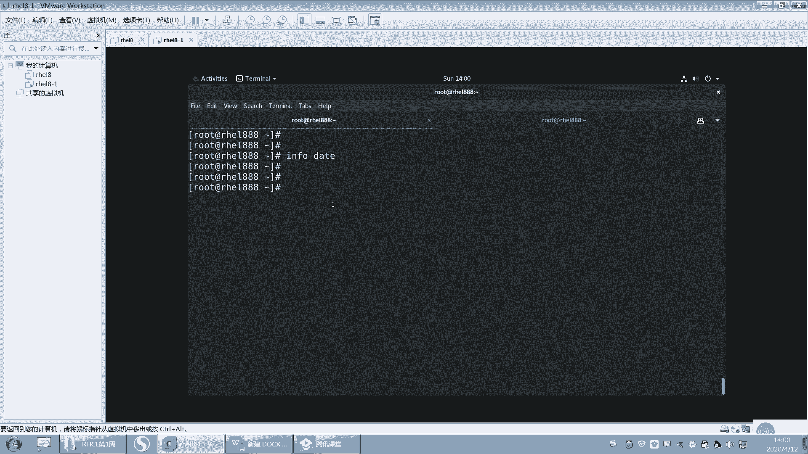

我们是要修改时间，对吧？然后显示这个显示时间，格式是这个。呃，应该是绝大多数同学都做出来了啊。

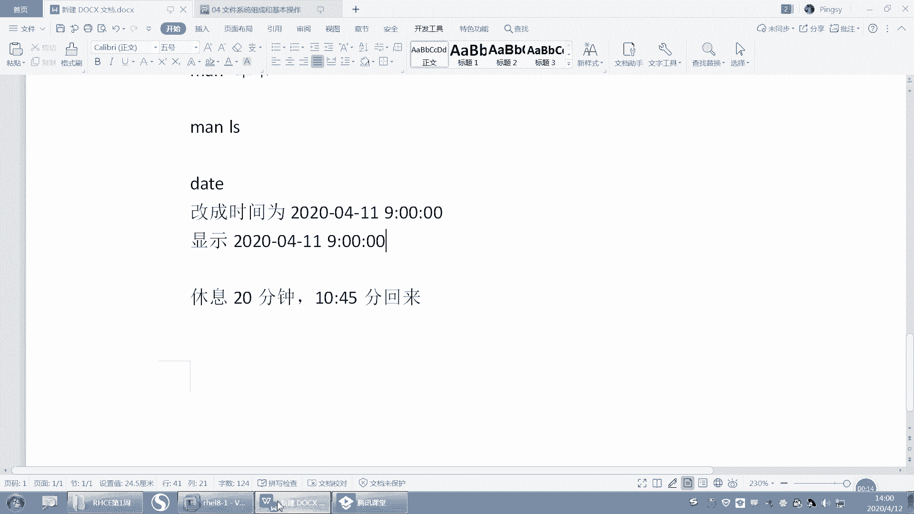

好，我们来看一下啊。呃，我现在的时间是。2020年这个。4月12号的2。2点钟啊，那如果改成时间的话，我们就可以一个dta。两改改的方式有两种，一个是杠S。你可以把这个直接写2020。可以这样去改啊。

比如说嗯。4月11号的9点。00。9点是吧。分两OK。好，这样的话时间就变成了这个这个时间点，看到了吗？好，那么呃还有一种方式就是data。这个这个好像可以不用加S哦。直接写上呃呃这个月呀，月几月几号。

对吧？4月。11号。嗯，几十几分对吧？9。00哦，9090900。还有什么年月是吧，2020。如果是2020年年月，其实可以不用写。不用写的话，就是这样子，对吧？秒的话就是00。描不写就是00。好。

这种方式也是可以的。呃，也是可以改到9这个9点钟啊，就这这两种方式data杠S设置设置时间啊，S呢是设置的意思啊，set设置时间的意思。呃，如果是这种方式，他可以不用加S。嗯。好。那这我怎么知道呢？

我是从这个info里面查到的啊，info大家可以也可以去查一下。这个有一个嗯，你们可以找一下啊，它里面有一个设置时间的这个标题。你可以去看一下。在那个man里面好像是没有的。man里面。

那你们没有说明是吧？还不这这里有好多案例，有好多例子，你可以去找，你看这里有个设置时间，看到吗？如果你用这种方式MMDDHHMM这种方式去设置的话，那么他要注意哦，那注意是吧？注意呃。

这个杠刚d杠刚杠刚set就是杠刚set其实就杠S嘛，这个选项可以不必用，对吧？嗯，如果你用上面这种格式的话，这个选项就可以不用加了。啊，当然如果你加杠U的话，我们之前说那个语法当中有个杠U杠U的话。

就是说它是指定这个UTC时间啊，而不是什么本地时间。啊，我们这个地方是本地时间啊，什么叫本地时间啊？本地时间就是。啊，门里面也有是吧？本地时间就是这个这个我说MMDDS那个那个没那个麦里面没有啊。

infer里面有。🤧嗯。好，那么嗯。这个大家应该会设了啊。第二个呢，我们来看一下啊，它的时间显示怎么去显示。嗯。哦，这里有是吧，他说显示这个当前的时间用给 in的格式或者是设置时间是吧？你说是这吗。好。

嗯。我看一下啊。在这里。其实说的不是很清楚，其实这个。哦，这里有啊，你看啊往上翻。比如说杠S。我不是设置时间吗？对吧？你可以去找呀。这有杠S吗？杠杠s是不是两个是一样的呀，后面就是加一个字符串，对吧？

那么这个字符串呢呃用描述的字符串，这个字符串可以是什么？在最下面有。在这儿啊那这个呃data的字符串，刚刚daate string是吧？它是可以是这样子，对吧？也可以是这样子。对，这个就是第一种方式啊。

好嗯。然后我们要去显示这个时间呢，它是以呃年月日1分秒这种方式去显示。那我们要去卖一下data里面。呃，这个主要是这个地方是吧，是这个吧，格式的输出控制格式输出啊。哦，你可以去找一下，那就format。

呃，我们之前找的同学找到的同学啊，就是年的话，先写是年年就是这个大Y嘛。嗯，你可以看你看好啊，小T跟大T小U大U什么小V什么小S大S那是不一样的啊。嗯。好，比如说小大Y是吧，是不是年呢？

那小Y呢就是什么？就是年的后两位看到吗？年的后两位啊。哦，还有什么？比如说这个。嗯。这里有we是吧，星期几你也可以写成星期几嘛？那星期几的话，那这个百分号小W就是这个零是星期天是吧？还有百分号大。呃。

大W这个是什么？这个也是星期，但是这个星期指的是年的。第几个星期就是一年有五十几个星期吧，对吧？而且是星期天作为这个星期的第一天那星期天作为星期第一天啊。好，然后还有一个啊。你看有同学用摆放号大T。

摆放号大T是格式，是不是就是摆放号HMS对吧？就是十分秒唉，十0分秒，所以用百放号大T来代替十分秒也可以。还有中间有的有一个什么？有一个空格，对吧？我们说十分秒，就这个地方有个空格。

这个空格我怎么去显示它呢？我们可以直接加空格，也可以加这个百分号T连接。百分号T是个table键，一般table键就是四个字符啊，差不多，对吧？

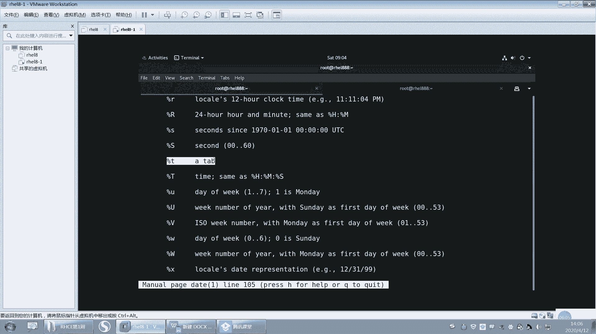

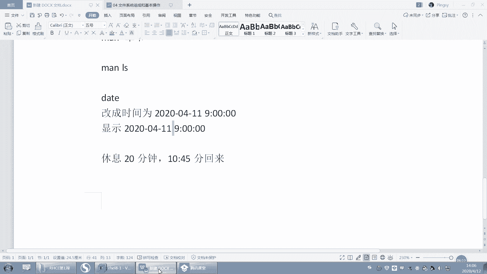

好，还有这个用百分号SS呢就是什么？呃，百分号大S是什么？是秒second秒0到60秒。然后小S呢小S是指也是指秒。但是这个小S你会看到它是从自从什么什么以来，对吧？sins是自从什么什么以来啊。

那就是1970年1月1号0时0分0秒，从这这个时间开始算起，到现在经过多少秒，所以你可以用data加百分号小S。指的是从1970年1月1号到现在经过多少秒啊，就这个好吧。啊，其他的我就不带大家找了啊。

你可以自己去翻译一下。嗯。这个是24小时制的是吧？还有这个第几季度等等。都有。这是分钟对吧？呃，这是月O。这是哪一天，这一年哪一天。这小时12小时制的这个是什么？24小时制的。嗯。

白帽带F就是什么年月日。好，这个。这个大D，你看刚刚有同学的大D是吧？大D后面是不是有个斜杠啊，然后这个是月日年嘛，年在后面显示了。然后这个是月的哪一天，其实就是几号嘛，对吧？几号呢。呃。

约的哪一天就几号？还可以显示星期几呢？这个是全称星期january1月JN1月缩写sunday星期几是吧？嗯，1月、2月、3月、4月这这单词都要知道啊。好，那我们就来看一下data加百分号，对吧？呃。

我们找到年是百分号Y。好，百分号Y，然后就加一个百分号是么？百分号M。啊，以及百分号B这三个找到了，对吧？哦，那年月日显示出来之后，这个这个杠是我自己加的啊。这个杠看到没有？这是我自己加的。

它会显示它会自动就是显示出来。好，然后呢后面你想显示什么就显就就加什么，但是这个不能乱加啊。好，那么空格的话就是十分秒，十0分秒，我同学也找出来的百分号大H啊。百分号大M啊。是什么百分号大S是吧？

但是这里有同学就报错了，因为是这样的啊。我们今天早上刚学过语法的时候，说过这个空格它是有特殊含义的。

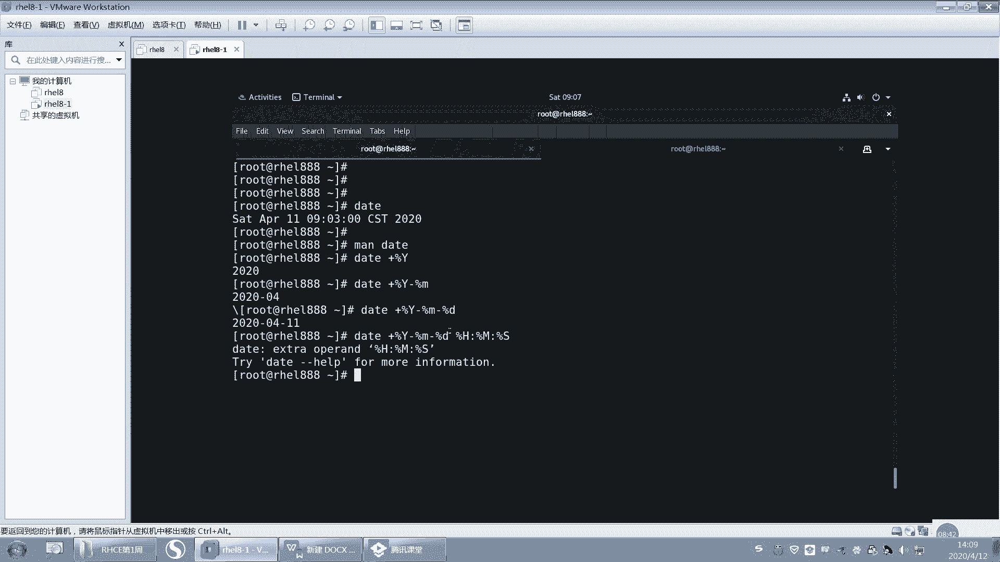

嗯，但其实我们在这个地方我的题目的要求，这个地方空格是不是就是要显示空格呀？但是这个地方它把这个空格怎么样啊？它没有显示出来，为什么呢？因为这个空格作为了参数与参数之间的一个分格符，能理解吗？

参数与参数的分格符。所以这个空格我们需要去特殊处理它，让它就是以空格的形式显示显示啊，那这个地方我们有处理方法有几种啊，比如说你用双引号引起来，你就用这个什么，你就用这个哎你就用双引号。

那把这引起来也是可以的，看到了吗？

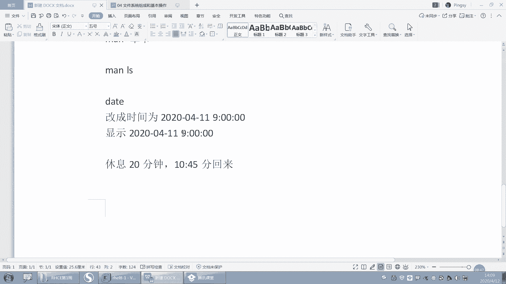

No。就双引号这个双引号呢，我们会让它以原样输出。这个后面我我们会学啊或者双引号或者单引号都可以，或者说是么你你你全部就这样。就这样全部引起来也可以啊，对，全部引起来也可以，好不好啊。

它扩在这个这个这个就这个空格在这个空这个引号的里面啊，只要在这个里面就可以了啊。啊，或者是单引号也行。嗯，有同学用单引号也可以是吧？还有一种方式啊，我们后面也会学到了。呃，这个大家学语言的应该都知道。

里面会有一个反斜杠。反斜杠就是去掉。对。去掉这个呃空格的特殊含义，对吧？空格是分开项与项参数与参数的一个特殊字符，让它以原样输出，那么就加一个反斜杠。对吧就这样也可以啊，所以这几种方式都是可以去实现的。

OK吧。嗯嗯。好。嗯，行，那还有同学这样是吧，data加百分号呃，引号引起来是吧？加百分号F啊，百分号T啊，这个也可以，因为百分号F就是什么，就是这一串啊，百分号T就是后面这一串啊。

所以也可以实现我们的最后的这个结果啊，所以我们在做这道题，我们在做题的时候啊，我们lin当中就是说你怎么去实现呃，我其实不在乎，对吧？我不在乎你怎么去实现。但是最后我要达到我想要的结果啊。OK吧。

这个点只要大家能实现就可以啊，方法不止一种啊。好了，这道题就说到这儿了，那我们就呃这章我们就结束了啊。呃这张我们就学我看看学了什么啊。😊。

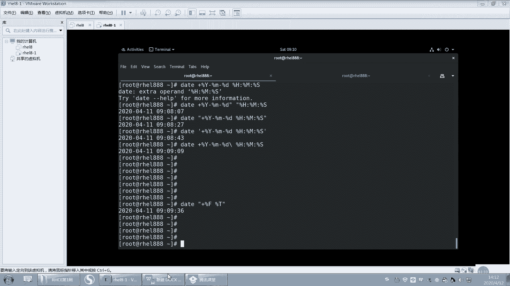

嗯，我们其实主要是学了。呃，命令的语法对吧？上面这个啊命的语法一定一定要记住啊，你每次去敲命令的时候，嗯，就是一定要去严格遵守它的语法规则啊，空格怎么去处理，对吧？空格是什么含义啊啊。

这个地方你们去加一个啊嗯在这方加一个命令语法，这个地方加一个哈，空格说明一下，说明是吧？空空格在这个我们命令行当中，它是有特殊含义的对吧？它是隔开什么什么什么什么与什么什么之间的一个什么，对吧？

你想要显示这个空格，就想显示空格，那你就要用特殊处理它，用引号啊，对吧？这种方式单引号双引号啊这种方式去让它去显示出来，OK吧。好，那这是命令的语法。语法规则当中选项要特别注视啊，咱长选项短选项。啊。

以及我们后面要学的一些帮助资源，which what is对吧？which查看命令是哪个文件，what is查看什么命令的简短描述。刚刚have呢其实是一个什么一个它其实就是什么一个命令的。呃。

命令的一个选项而已啊，这个选项比较特殊，它是来显示什么？这个命令的语法规则的啊，显示命令的语法规则。然后再往后呢，我们我们学了manman帮助，man帮助啊，man帮助重点啊。

重点因为我们又写了in for对吧？in full们你们也可以尝试去用一下。有些时候man好像不是很清楚的话，比如说例子，我看infer里面例子就很多，你可以去找一下。呃。

infer里面的例子要比man里面例子我看的要多一些啊，而且更详细一些。呃，如果你觉得我能看懂，你就去看一下，好吧。啊，那么如果现在面临的问题是啊大家最大的困扰是man帮助看不懂，因为是英文的。呃。

因为是英文的对吧？呃，现在也没办法，因为让你硬着头皮去看，确实也看不懂。嗯，你怎么办呢？呃，我记得网上有一些那种中文中英文的那种中文的是吧？中文的帮助手册吧。好像有。有个中文的，嗯。

但是我建议你是这样的啊。你看了中文之后，你两边对照着看，你不要说我呀有了中文之后，我再也不用看英文了了，不是这样啊。一定要对照两边，对照着看。嗯，本来你看英文的看不懂，对吧？你看中文哦，是这个解释。

这个单词是这个意思哦，这以后就就这么去解释。那将来你再去看英文的话，你就可以怎么样，你就可以抛开什么？中文了。对，这是一个过渡啊，不是说我要依赖英中中文，本来已经不是要依赖中文了啊。

要还最终还是要英文的，这个是帮助你过渡到英文。这个这个这个。😊，这个呃阅读能力啊。好吧。嗯，不要逃避啊不要逃避。硬着头皮学下来两三个月啊，大家这个因为选题啊，还有各个方面都会有所提升的啊。好。嗯。

那我们。看下一张啊。嗯。啊，第四章啊第四章我们呃第四章我们会讲这个关于文件系统的这个组成和基本操作。对文件文件系统的一个基本操作。比如说将来我们要学会一下怎么去复制文件呀，怎么去去看文件呀。

怎么去嗯创建文件夹呀，删除文件夹，删除文件呀等等啊，这些一般基本的操作，以及文件系统的组成。我们在第一节呃第一节课的时候，昨天讲的那个嗯讲了一下文件系统组成是吧？如果还不是很清楚的话。

我们今天还会再给大家讲啊，嗯，今天讲完之后应该会非常清楚了啊。好，然后这章内容啊，首先你要会去描述我们文件系统的组成，它是怎么组成的，它的结构是什么样子的对吧？它跟windows有什么有什么一样的地方。

有什么不区别？嗯，因为windows我们比较熟悉了啊，嗯其实在我们的lates当中啊，我们实有点它是有点抽象的，其实是有点抽象的。不像windows那么直接，对吧？直接点开就点一点，就这样很直接。好。

然后还要学会去复制移动删除文件啊，以及创建文件，创建文件夹，删除文件，删除文件夹啊，最后还要我们去了解一下时间戳的概念，什么是时间戳啊，这个很重要的一个时间。好。然后我们下面再来看一下这张图啊。嗯。

这张图呢。你把它放大啊。啊，文件系统的组成。啊，我们昨天描述的是啊文件。我换一个颜色。啊，文件呢和目录构成单根的倒数状结构。这个回想一下，昨天是不是说过了，对吧？啊，我们windows。是多根啊还多根。

但是我们lin呢还是单根啊，单根只有一个根，这是一个目录结构。注意啊，这是一个目录结构，它不能反映出它跟分区是什么关系，不能啊，不像windows，它就是C盘，就一个目录结构，就是C盘。

D盘就是一个D盘，E盘就是一个E盘，对吧？但是我从这个目录结构当中，我无法去看出我这个分区跟这个目录到底是什么关系，看不出来，对吧？啊，我们只看现在只看目录结构啊，那么文件系统是从根开始的。

就是从这个这个根这个斜杠开始。这个斜杠开始叫根啊叫根好。

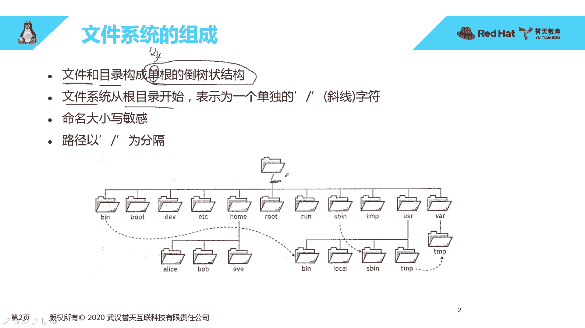

这个大家要区分一下啊呃区分几个概念就是。

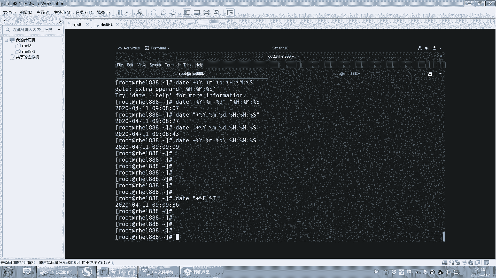

嗯。首先。斜杠。这个啊这是不是要跟目录？跟目录对吧？它是一个目录，是个这个斜杠叫跟啊叫跟啊，我们还有系统当中有一个用户叫root。这个root呢它是中文翻译过来也叫跟。对，中文翻译过来也叫根啊。

所以这两个有没有关系呢？没有关系啊，根是目录，这个是目录，这个是用户。明。注意啊，这个是用户名，所以他们两个是没有关系的。OK吧啊，当然目录当中还有一个叫bo的bo有没有关系呢？他们也没有关系啊。

boot呢它是一个目录，是跟下面的一个目录。这个目录呢比较特殊，它是启动的时候。会用到的啊。就是启动时需要的文件都放在什么？哎放在该目录下啊。启动的时候啊，需要的些文件都放在这个方。也就是说。

如果不得下面的文件丢失了，那系统是不是起不来了？嗯。这么说，大家应该能听清楚啊，bo它是一个特殊的目录啊，启动的时候会读这个目录下面的文件。好，这是几个区分的地方啊，要区分开。

他们都叫ro都叫root是吧？都叫跟，那它根是目录啊，还是用户名啊，还是什么bo呀，对吧？好。再回来看这张图啊。嗯，你看文件系统从根开始从根开始就是从这个斜杠开始，大家表示为一个斜杠，对吧？

表示为一个斜杠啊，然后在我们这个目录结构当中，我们的目录和文件的命名大小写是区分的，大小写是区分的啊。好。呃，为什么说大家血区分呢？因为在我们的这个。

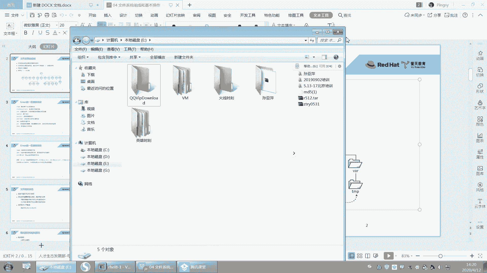

windows当中大游戏区不区分啊，有没有同学知道？windows当中这个目录文件这个大小写区不区分啊？Hello。睡醒了没有？嗯，对。对，在windows当中，这个大小也是不区分的啊。

对你创建一个呃创建一个大写的A和创建一个小写的A这个文件哎，对，文件名都叫A。不管你是大写还是小写，我同样都认为你是同一个文件啊。比如说我再创建一个叫小写的VM。他就为什么他就会报错，他说。同名了对吧？

同名了啊，但是呢在我们les当中啊，大写是大写，小写是小写。他是不他是区分的啊。小写。大写对吧？这两个文件那这两个文件大写小写是不是是两个不同的文件，对吧？好，这是要注意的啊。

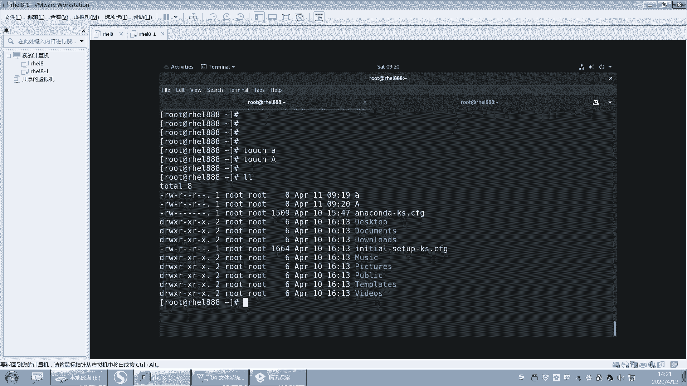

然后在我们的这个目录结构当中，我们的斜杠并不是都是根，对吧？呃，后面这个斜杠呢指的是什么？指的是我们这个嗯。分隔服务啊，父目录与子目录之间的分隔服务。副目录与子目录之间的分隔服务。这个图画的还是有点。

嗯，你往后面学，你才能很清楚它是什么意思，还有这种虚线是吧？你先不要管它啊，先不要管它，你就知道它是一个什么单根倒数状的结构的目录啊。好，我再来画一遍啊，待会我会提问啊。嗯，斜杠。跟跟目录是吧。跟目录。

好，然后呢往下走往下走往下走。小组我大概画一下啊。哦，就这样吧。然后这边写一个嗯。这边写一个，这是昨天我们画过的图啊。bot对吧？然后这个搞1个ETC。搞一个哇。好，再写一个对。好吧。O。呃。

像这些目录啊，比如说home目录不的目录EC目录外目录，这些目录都是系统怎么样啊？系统已经就是你只要装好系统，它就会自动生成的一些目录，自动生成的一些目录啊，就本身就已经存在的一些目录啊。好。

像data这个目录，它本身其实是不存在的对吧？我们将来可以在它可以去创建它，这个是我们可以去创建的啊。好，那在home下面呢，我们还有可以有一些目有一些目录和文件。比如说有一个fi。好。

ETC下面有ETC是吗？ETCpas等等啊，这些文件啊文件。好，这样的话就形成一个倒数状的倒数状的结构啊，倒数状的结构。啊，叫单根倒数状。那么我们昨天讲了一个叫东西叫挂载点，对吧？叫挂载点叫挂载点啊啊。

那么我们一定要给什么？一定要给这个根给一个分区，给他一个分区，否则的话根是不是没有地方放。你想一下啊，你把home给分区了，根没有给分区，请问根放哪里，对吧？根是不是没地方放。

所以我们最终第一个要给的分区就是这个根分区啊，就是这根分区回忆一下啊，昨天这昨天讲过的？啊，那我们把这个根分区呢第一个分区啊，第一个分区。第一个分区我们给到根，不过你在分的时候，你在装系统的时候啊。

你你第一个给谁其实无所谓啊，其实无所谓啊，先分谁后分谁都无所谓啊。好。OK这个是给根了。好，那么给更了之后，我们所有的文件跟下面所有的文件和目录怎么样都是在存放在第一个分区上啊。好，同学老师说。

那分区跟文件系统都有什么关系呢？注意啊。分区的话其实应该啊分区应该比较好理解。分区实际是就是这样一块盘怎么样啊，分成几个逻辑的区域就分开嘛，对吧？分开。那么如果我分成两个两个区域的话，比如说分两个区。

那么这两个区域是不是可以不同，可以进行各自的格式化，是吧？可以在第一个分区上格式化，也可以在第二个分区上格式化。那么只要格式化了之后，在这个格式化这个分区上就可以去存什么呀文件了。

因为它有一个文件系统了啊，有一个文件系统了。好，那么。第二个注意啊第二个分区，如果我我想去访问他，对吧？我想去往里面存文件，我必须给他一个挂载点，就是让他跟一个目录去对接。那昨天有同学问到啊。

他说现在啊我要给他一个挂载点，但前提是这个挂载点，我们说挂载点本质上是不是目录啊，那我要给它挂载点的话，那这个目录是不是首先要存在，所以注意啊，我这个时候就会创建一个目录叫data。

创建一个目录叫data啊，那么这个data呢下面有一个文件。注意啊，这个data下面有个文件叫。Data file。比如说有一个文件叫data file啊，那么这个data file。

在data创建出来的时候，data file也创建出来了，对吧？那么这个fi呢，请问是放在哪个分区上面啊，放在哪个分区啊，目前为止。目前的话我是放在哪个分区啊？第几个一。2。放在哪个分区上？这个文件。

好，注意啊，我我这样指这个文件。这个文件具体指的是不是fill，注意啊，是fill啊。那前面这个前面这个路径注意前面这个路径是什么？这个路径这前面这一段是它的一个路径啊。

后面真正指的文件是不是指fa这个文件，我写这个我写这个我写的这个datafi真正的是不是指这个文件而已。那前面这段指的是在什么？是它的路径OK吧？对好，O现在还没有挂载啊。

我那我这个文件呢就放在第一个分区上了，也就是说现在这个文件在第一个分区上，对吧？第一个分区上，这个没有问题吧。😊，好，那现在我想怎么样给它挂载一个分区了。好，那这个时候呢。我偏偏给它挂载在什么？

data上。对，就让第二个分区。挂载在什么呀？data上，这样的话。我以后再去访问什么？再去访问这个dta的时候。那么。就是什么？是不是访问的第二个分区啊，那么我data上面就写一个文件啊。

比如说我再写一个第二在第二次啊，再写一个文件叫data这个fi02。那么这个文件就会放在什么呀？这个文件就会放在第二个分区上了，能理解吗？这个文件就会放在第二个分区上了啊。好，问题来了啊。对。

第二个上面请问。非要去哪里了？非要在哪？没有。这个文件。去哪里了？他在哪儿还在不在？还能不能访问到他？好，第一个问题在哪？在哪儿？这个文件请问在哪？在哪儿呢？还在。

请问是在第一个分区还是在第二个分区上啊？嗯。YY是同学。陈飞翔。哦，对，OK。呵。所以它现在是在哪个分区上啊，是不是还在第一个分区上啊？他还在这里哦还在这里啊还在这里。好，那能不能访问到呢？访问不到了。

对，访问不到了啊，因为你的入口被挡住了，你的入口现在是data变成访问第二个分区了啊，能理解吗？就是你在访问data的时候，是不是访问到第二个分区上了？但是这个文件是不是还在什么？第一个分区上。那。

这个fill这个文件还在第一个分区上，所以它就访问不到了，它并不是说没有了，也不是删了，对吧？也没有移动过去，还在这儿。那我怎么才能访问到它呢？只有一种方法，那就是怎么样把它给卸载下来，能理解吗？

就是把它把这个第二个分区和data之间关系怎么样去掉，就是卸载卸载，没有这一层关系了。那这个文件怎么才会暴露出来，对，才会暴露出来，才会去访问这个文件所以我们再去给它分区的时候，给它目录的时候。

那么这个目录怎么样啊？嗯嗯。这个目录一定要是一个空目录才可以啊。就是你说不是空的也可以。但是如果不是空的，下面这个文件是不是就放不到了？嗯，最好是个空的对吧？最好是个空的啊。好。能不能理解我说的意思？

就是这个data注意啊和文件这就这在挂载跟挂载前，挂载后，它是不是都在那儿啊？对吧是不是都在这个地方？但是你挂载了之后，你给它挂载分区了之后，那么你再去访问这个目录。

它是不是就变成了访问到第二个分区上面去了？它直接什么对接到第二个分区上了，它不能通过什么呀，不能再访问到以前那个文件了，就就是。😡，呃，这个怎么说呢？能够能够意会能够意会吗？就把以前那条路封死了是吧？

直接又开了开开了一个门，这个门直接通向是吗？哎，对，此路不通，直接通向第二个分区了。对，直接通向第二个分区了啊。那么你去修改data，其实修改是什么？第二个分区对，OK吗？你去修改data啊。

其实修改是第二个分区啊，除非你把它卸载下来。😊，卸载下来，那么。第二个分区访问不到了，访问不到之后怎么样，它就。再去访问以前那个fill那个文件了啊。目录注意目录没有分过去，能不能理解？😡。

目录不是分过去了，就是你去再去访问这个目录的时候，这个目录表现的。比如说啊这个目录的一些权限，其实都是第二个文件系统的权限了。它只是变成一个什么挂载点了。对，就变成一个入口了。对，关上了这个门，对吧？

关上了以前的门，然后打开这扇门，然后让它通往是吗？第二个。不是说目录分过去了啊，它只是成为一个入口，成为一个入口，能不能理解啊，潘崇旺。这样能不能理解这个文件系统的它们之间的关系了？嗯。好呃，不慌啊。

现在你目前只需要了解到什么，了解到它成为挂载点之后，它就访问到第二个分区了。如果我们还想进一步，我帮你去验证它到底是什么，它跟这个到底什么关系，对吧？我们在分区的时候，我会给大家讲。在分区的时候。

我给大家讲这个目录，唉，成为挂载了之后，对吧？那挂载完之后挂载分区之后，那么它又表现的是是什么样的性质呢？对吧？表现的是谁是谁的表现呢？其实他只要挂载了这个挂载了分区之后。

它这个目录表现的形式都是第二个第二个分区。第二个文件系统的第二个文系统的性质。O吧，好O所以我们整个文件系统它的组成啊。就是由分区对吧？或者说分区吧，就分区吧，分区和目录对接。啊，分区跟目录对接啊。

无论你这个我可以挂很多个分区啊，我可以在这个目录下面是不是有很多很多个分区啊，对不对？很多很多个分区啊。好，那么它的目录结构注意它永远都是从根开始。也就是说我访问这个。只要是这个能挂载上去的这些那文件。

对吧？它都是从根开始的。也就是说我从根开始都可以访问到什么，都可以访问到这个文件。无论你这个文件是在哪个分区上。能不能理解？就是无论你这个文件是在哪个分区上啊，比如说ETC。呃，下面的data。好。

fiil，你这样能不能看出你你能不能看出来你这个文件在哪个分区上啊，你这样是看不到的对吧？但是我永远都可以通过这样一个路径去访问到它。对，从那从根开始，然后某一个目录下面的某一个东西。

某一个下面的某一个文件，下面的某一个目录下面的什么某一个文件等等啊。好，文件系统。这次OK了吗？因为上次还有同学问我啊，说他们到底是什么关系嗯。还有没有问题？没问题，我就过了啊。好，不慌啊，慢慢体会它。

慢慢体会它啊。所以对，所以就是之前有同学说我就删根嘛，嗯然就是把这个根下面所有的文件都删掉。听清楚啊，把跟下面所有的文件都删掉。哦，好，那么我问大家一个问题啊，注意。😊，问大家一个问题啊。

我突然想起来一个感觉还比较好玩的一个问题啊。🤧好。现在呢。我把它给卸载了，注意哦。我把它给卸载了，对不对？那我把它给卸载了这个fill2这个文件还在不在第二个分区上啊，还在不在？请问。还在不在啊？对。

在对吧？在只是我暂时访问不到它了。哎，我在了。在啊我只是把它卸载了。但是这个文件是不是还在这儿？对，就是没有入口进来了，对吧？就是没有办法进来了，但是我还怎么样还在那吗？就像你U盘，你拔下来之后哦。

没有盘符了，我往U盘里面写一个数据，然后没有盘符了，那个文件就不见了。不是吧，你只是说没有这个盘符，没有办法进去了，对吧？是这样吧？没有办法进去了，OK。😡，好。那么再来。我现在呢把它卸载注哦，卸载了。

卸载之后呢，我想把根下面所有的文件都删掉，请问能把这个fi2删掉吗？😊，哎有。能不能删掉啊？可以呀。可以呀。就是说我现在卸载了哟，卸载了，我把根下面所有的文件全部都删掉。请问fa2能不能删掉啊？😡。

再给大家一次机会，能不能删掉啊？对，删不掉了，你访问都访问不到，请问你怎么去翻删到它呀？啊，OK吧。你访问都访不了，怎么删掉它？嗯。对，就这个意思啊。OK吧，那请问这个能删掉吗？这有点抽象啊。

这个文件能不能删掉啊？可以啊。因为你可以访问到它呀，它是不是在跟下面呀？对，就这个意思啊。好，我再举个例子啊，我现在又。又创建一个目录，叫test目录。然后呢。

我又把这个test把这个第二个分区挂载在了test目录上。我把第二个分区挂载在了test目录上面啊，注意啊。啊，我再把跟下面所有的文件都删掉。请问这个这个f2fa2的路径是什么？fa2的路径是什么？😊。

B2的路径该怎么写？B2有点为难大家了啊。😊，啊，请把fi2的路径写出来，能不能写会不会写啊？这个确实有点为难大家了啊。😊，啊，我看有没有同学写对啊，张这个张这个字儿怎么念啊？王佳良同学不对啊。

孟丽康同学是对的啊。对，还跟data有没有关系啊？你加data的同学还跟data还写错了啊，data看到没有？data啊，还dta有没有关系啊，它只是一个入口而已，跟它完全没有关系，听到吗？

跟它完全没有关系啊。😡，是有点抽象啊，所以test它如果将来这个这个分区挂载在这个目录上面，那么它就是什么？它就是这样写的，就是test下面的4102。对，就是这样的啊。好。

那么我再去把根下面所有的文件都删掉，那它是不是就可以匹配到了呀？就可以把这个文件是不是它是不是在根下面啊，对吧？它是在根下面嘛，它只不过是在test下面test删了，那它不就删了吗？对不对？嗯。

所以它这个文件就会删掉啊，就删掉。好。他就是跟下面的某一个文件了。呃，这个没把它弄晕吧。呃，那个潘从旺同学还在吗？晕了没有？张张这个张是什么同学？还在吗？这个没办法实操啊，因为实操的话就太多了。

你就把这个概念先了解一下就可以了。实操要分区格式化呀就麻烦了，好吧。就是入口不一样了。对，入口不一样了啊。嗯嗯。好。其实这个是有点难，因为它毕竟跟windows是不一样的对，跟windows不一样。

它很抽有点抽象啊，有点抽象。嗯嗯。好，不慌啊不慌。嗯，如果还不清楚的同学，你目前了解到哪个地方呢？了解到我们分区跟目录之间的关系就可以了，好吧。好，下面我教大一些实操的啊，后面好吧，实操复制文件呀等等。

好了，这个地方过了啊，不说了。😊，好，下面我们来个介绍一下关于linkux的一些这个重要的目录啊重要目录嗯。

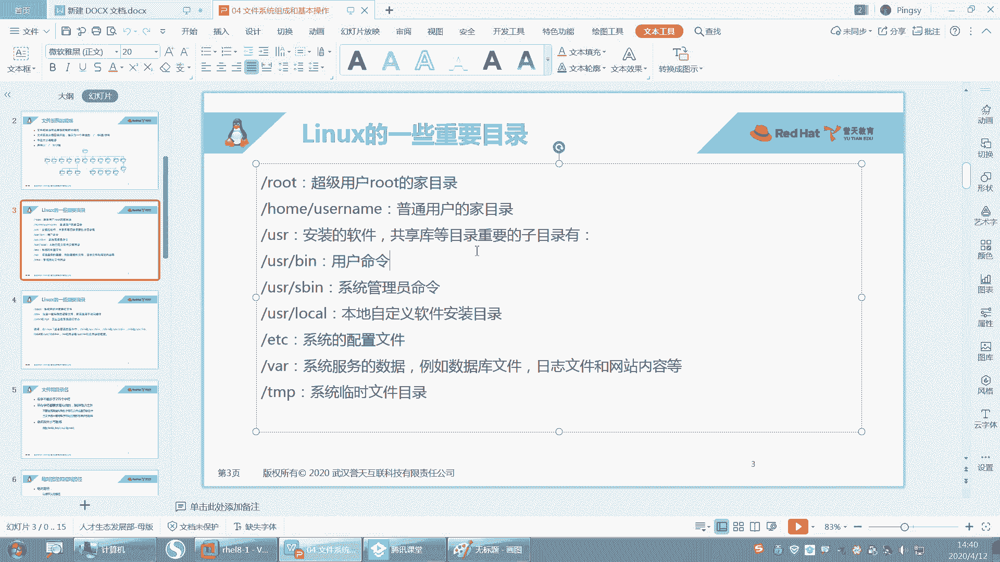