# 【重置详解版】孙老师讲红帽系列视频／RHEL 8.0 入门／红帽认证／RHCE／Linux基础教程 - P13：13 文件系统基本操作命令之ls，cp mv文件操作 - 誉天孙老师 - BV1aB4y1w7Wi

讲过了吗？呃，讲过了还要再讲一遍啊，之前没有讲的太。

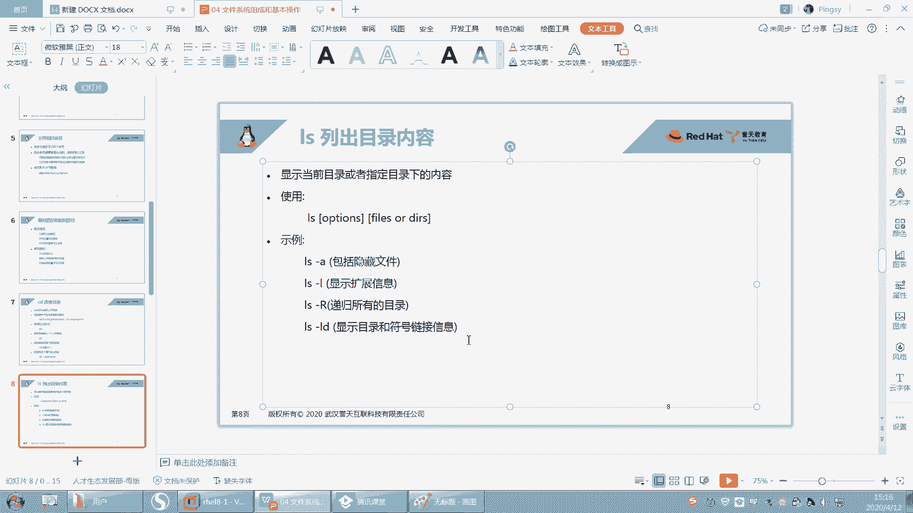

太仔细啊。好，LS啊。啊，G开始记啊LS这个命令是显示什么目录的内容。就是查看目录和文件，查看目录和文件啊。好，我们来一个一个一个来看一下它的一个选项啊。杠L选项这个之前讲过啊呃。

杠L这个选项指的是什么？查看这个文件的这个详细信息，对吧？好，开始记了啊，这样子啊。

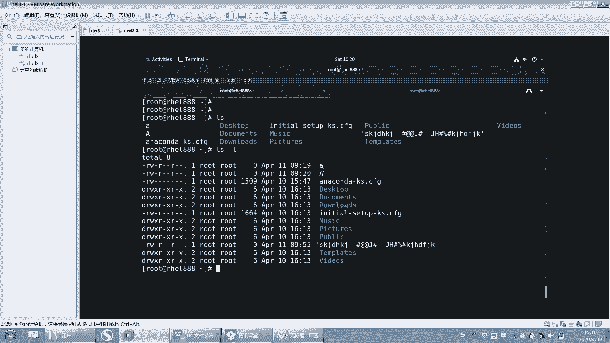

呃，不知道能不能复制出来。好，我们开始记啊，第一个这个地方。这个地方第一个这个地方杠这个杠这个杠啊杠指的是文件。我PPT里面没有啊，你们自己记啊。杠指的是文件的类这个文第一个就是指的文件的类型。

杠指的是文件。这这个地方指的是文件类型啊，杠指的是文件。那么D呢指的是目录。D指的是目录啊。好，然后L呢指的是链接文件。就是链接文件啊。好吧，嗯，先目前先记着几个吧，还有还有很多其他的。好，这样吧。

你先把这个记了就行。B。就是快设备，就是就是说白了就是磁盘。磁盘文件这些就是B就是B。还有C就是字符。字符设备是吧？好，就这啊。记着5个记着5个啊，就是我将来有一块磁盘，你看啊。😊。

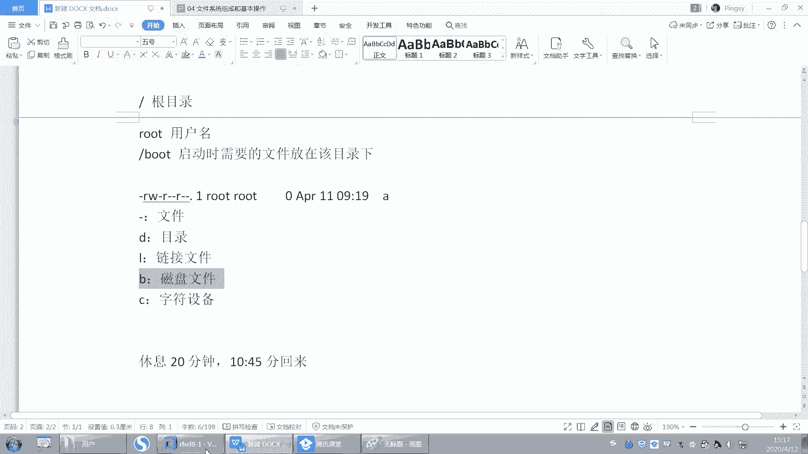

我给大家看一下啊，LS杠LDV下面的SDA。你看这个文件是不是B开头啊？😡，B呢叫block，叫快，叫快设备。我们。唉，这个快呢是指这个单词翻译过来的，叫block，叫快设备。呃。

所以这种能够存数据的这种设备，我们叫快设备。呃，能够存数据的这些设备，我们叫存叫快设备啊。好，这个下面还有很多哎。啊，你看这个下面还有这种以C开头的，看到没有？以C开头的。这种就是字符型的设备。

像这种就是我们的终端，就叫TTYI是吧？嗯，这个我们后面遇到了再说吧，好吧，现在一时半会儿解释不清楚。就既是字符型的设备。字符型的设备啊，比如说像我们的控制台，我们说呢控制台那种设备就是字符型。

它只只是起到一个显示的作用。像我们的鼠标这种都是字符型的设备，它存不了数据，存不了数据，还有键盘这种它都是字符型的设备啊。

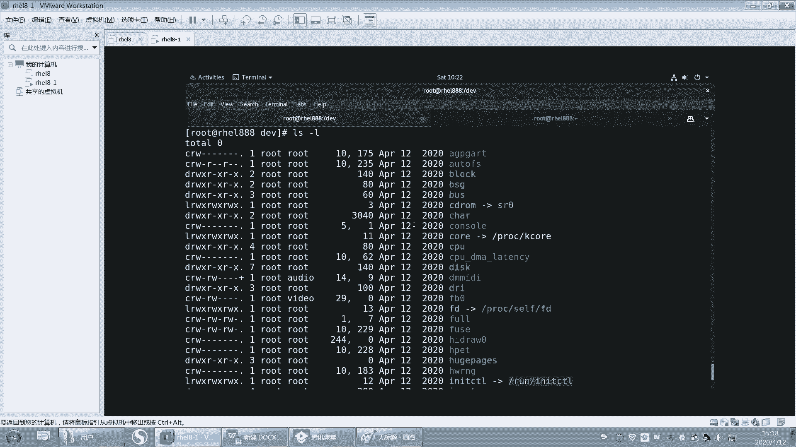

好，然后。目录不用说了吧，链接文件就是快捷方式嘛。😡。

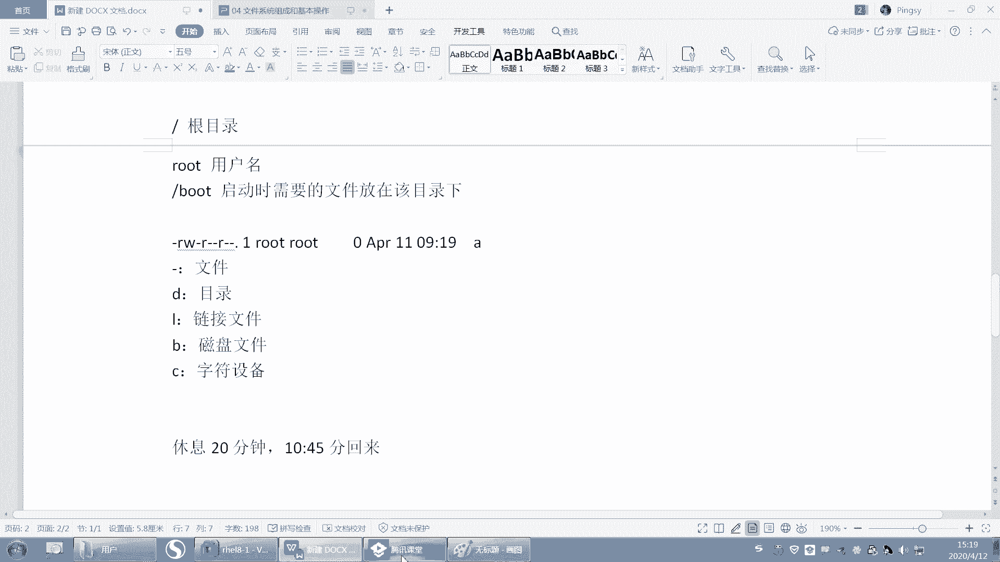

是吧。好，你看。呃，你再看啊LSLS杠LB。这个文件是比以L开头的。是不是就是链接文件链接文件啊。然后再就是什么，再就没有了。这就是D嘛，D就是目录。因为你有时候去用颜色去区分，对吧？

万一有的没有颜色呢？对吧万一有的他那个文件它没有全部是这一个颜色，那你就没办法去区分了。万一我是色盲的是吧？我都不说大家了啊，说我我看不清楚颜色呢，分不清楚是吧？😡，那我怎么去区分呢？通过前面这个。哎。

通过前面这个来去区分啊。

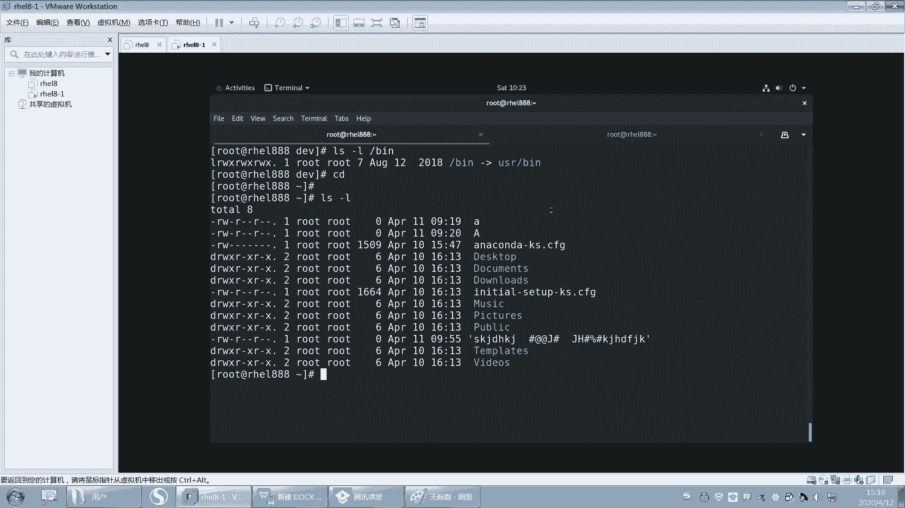

好吧嗯。好，再往后啊再往后。后面自己记啊，我就不写了，这个地方到这个地方是指权限，权限就写两个字就可以了。权限啊。权限。第一个栏位是文件类型，后面从这儿到这儿加上这个点是指权限。权限啊。好。

后面这个一记了吗？后面这个一啊。这个一呢。啊，这个一要分开说啊，如果是文件的话，这个一指的是这个文件的链接数。你就记就行了，不管它啊，我现解释不了。嗯，如果对于文件而言。这个数字指的是什么？

指的是链接数。就也就是说比如说这方是2，那这个文件呢它就可以被删两次，就删一次唉。死不了是吧？好，再删一次，这就死掉了，就删掉了啊，就是这个文件的链接数嗯。好，三那就有三条命是吧？三条命啊。啊。

如果是目录的话。那这个位置指的是什么呢？好，我们来看一下啊。

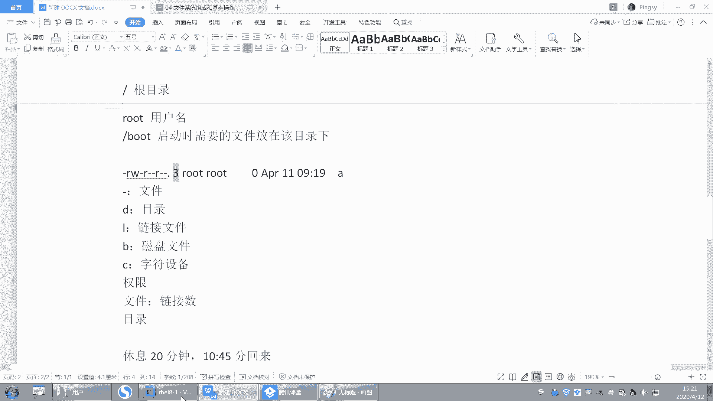

如果是目录的话，你发现这个地方至少都是二，看到吗？至少都是2。那么这个二代表的是什么？😡，代表是这个目录下面有多少子目录。代表这个目录下面有多少个子目录啊。好，你可以进入到thattop下面。看一下。

这有没有目录啊？没有，为什么呢？因为它隐藏起来了，一个是点，一个是点点。所以在每一个目录下面，它都会有两个隐藏的目录，一个叫点，一个叫点点。所以目录这个地方至少都是2。至少都是2啊。好。

这个地方我假如我再创建一个创建一个目录叫data。啊，我我先创建一个啊。然后你再回来看。哎呀。你再过来看这个destop，这个地方是变成三了呀。😡，是不是变成三了，因为destop下面多了一个目录了。

看到没有？多了一个目录了啊。所以它指的是什么？指的是目录下面有多少个子目录。

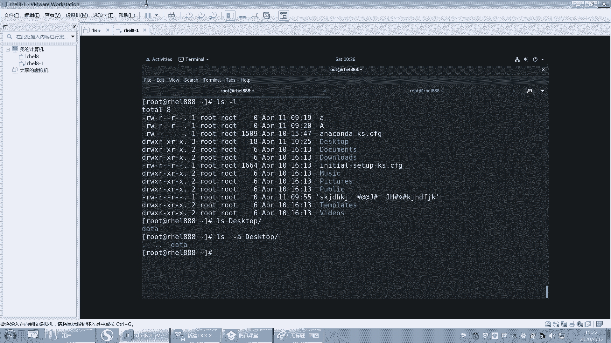

OK吧，那三个子目录啊三个子目录。记好啊。好，就目录下面有多个子目录，这个是这个三的作用啊。好，再往后第一个这个地方指的是文件的拥有人，文件的拥有人文件的拥有人啊。这是文件的拥用组。

拥用人拥用组我们下一周会讲啊。拥有组。我做的笔记比较丑啊，你们自己去做，好吧。用人拥祖。好，这个地方这个这个数字指的是文件的大小。这个地方这个这个地方指的是文件的大小。好。

这个地方这个时间指的是文件最后一次修改时间。文件最后一次修改的时间。这个地方这个时间。再后面不用说了吧，就是文件名。记完了吗？记完了。记完了给我示意一下啊。好。哎呀，妈。哎呀，妈呀。你不能换行线吗？

嗯嗯。我我只是没有我只是想笑而已。嗯。

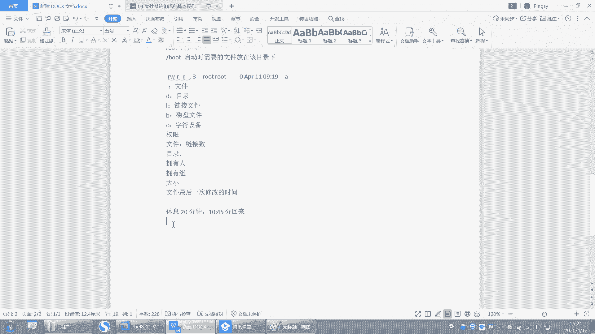

好。好，那么我们继续啊继续。这LS杠L啊LS杠L好，杠A都记下来了吧，杠A。杠A是这个呃。

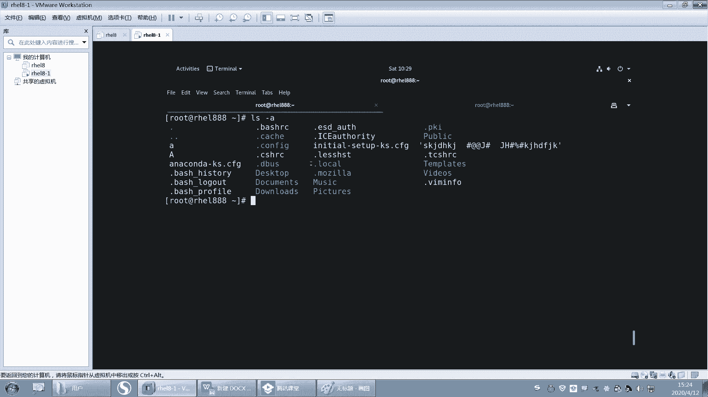

就隐藏文件是吧，隐藏文件啊。

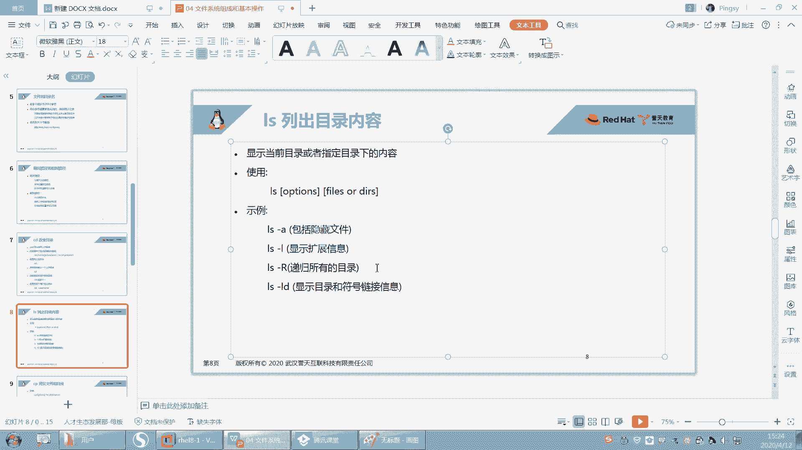

好，嗯，这个地方有一个杠R看到没有？有个杠R啊，杠R是什么意思呢？就是我们这样去看的话，是不是只能看当前目录下面有哪些文件。但是有些时候呢，我们这个目录下面是不是还有目录，还有文件。

所以我就可以加一个杠R。这样这样去看看到没？那LS杠R首先这个有个点点是不是指当前目录啊？那当前目录下面是不是有这些文件，对不对？好，那么。这个地方有一个点desstop，是不是也可以看一下这个目录啊。

这个目录下面有哪些文件呢？是不是有date啊？看到没有？有data啊。好，他还把data又看了一下，data下面有没有文件呢？没有空的，所以它会一层一层的往下看，就一级一级一层一层的往下看啊。

我们给这个一层一层往下，这个叫什么呢？叫递归。

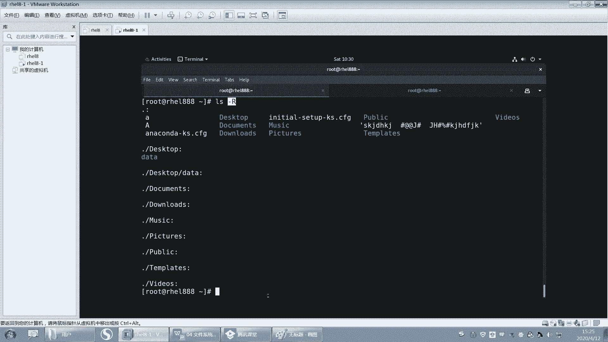

呃，递递递递归会不会啊？叫递归。就递归查看所有目录递归啊。以后再说递归的话，就是一层一层一层往下看。对。一层一层往下看啊。你可以这样，你可以就是你把这个框框缩小一点嘛，然后左边看，然后右边记笔记这样子。

嗯。

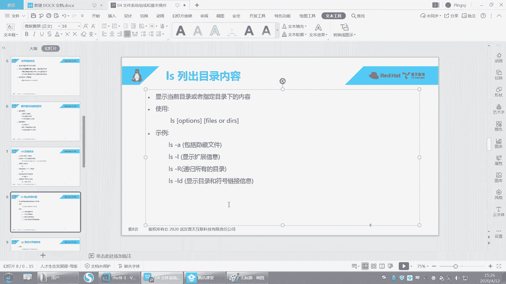

啊，然后还有一种啊，比如说。呃，下面我来问一下大家啊，嗯我想去看。这个文件的权限。请问我怎么看，我想看这个文件的详细信息吧。我想去看这个文件的详细信息怎么看啊？嗯。我想去看这个文件的详细信息是怎么看啊？

😊，还cat刚学过的。是不这样看？对，就这样看对吧？LS杠L。LS杠LOK很棒啊，这样就可以看到这个文件的详细信息了。😊，好，那我想看ETC的。我想看ETC这个目录的详细信息，请问怎么看？

我想看这个目录的详细信息，请问怎么看？哦，LSETC是吧？好，有同学说LS杠LETC。那你看我这样一回车就看的什么？还有。唉，这样一看是不是就是看这个目录下面所有的文件和目录。所以你看啊。

如果你接的是文件，就看这个文件本身。如果你接的是目录，那么就看这个目录下面所有的文件和目录，这个没问题吧。好，那么然后再再来啊，我想只看只看ETC看ETC对吧？那我就可以给啊看它的上一层目录啊。

看根看根就可以看到这个什么看到ETC了。😊，看到没有啊，所以后面接目录的话，是看这个目录下面有多少，看目录下面的文件和目录啊。OK吧。好，那我再来啊。我只想看这一个目录，对吧？怎么看，那就是LS杠LD。

加一个D，就是指看目录本身的意思啊，看目录本身的意思。好吧，加一个D，所以D是指查看目录本身嗯。所以你看目录的权限的话，就通过什么加个D加个D啊，不加D的话就会显示什么就会去看这个目录下面的文件和目录。

我这样说够清楚了啊。

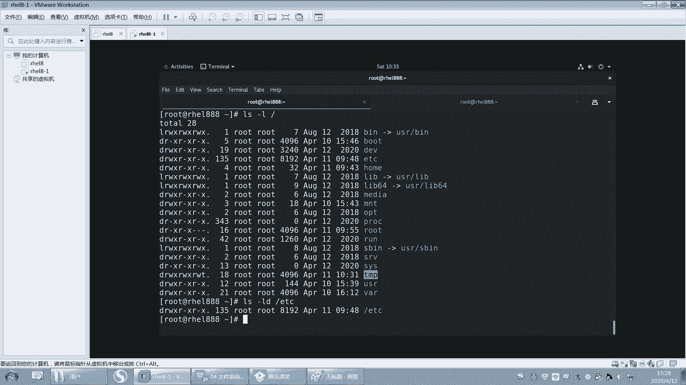

好。就刚刚哎呀这个。没了吧，可以过了吧，就这就这么两个命令讲了半天啊。嗯。好，下面我们还有一些 meaning令，我们待会儿讲吧。我们今天下午就把这个文件系统讲完就可以了。我们嗯前面我们慢一点。

宁愿慢一点，把基础打好。OK我们下课休息一下吧，休息一下回来啊。你们去下课可以操作一下。五一我是这样的，我们这边。嗯，讲完肯定有作业的，你们放心好了啊。嗯，五一的话，我们是国家节假日。

就是国家的这个节假日的话。嗯，都是正常休息的。就比如说。51是12345休息，对吧？那我们在休呃他休息的这个规定时间休息，我们也休息。国家法定节假日我们都是要休息的。

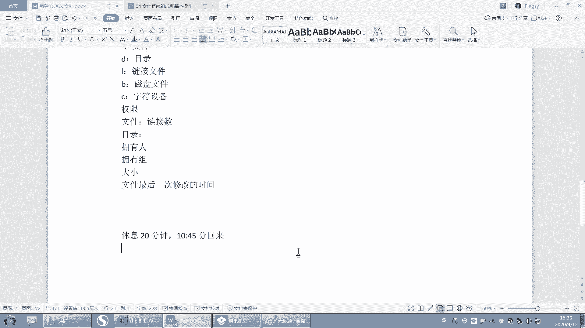

我我把这个背景改成黑色的感觉。

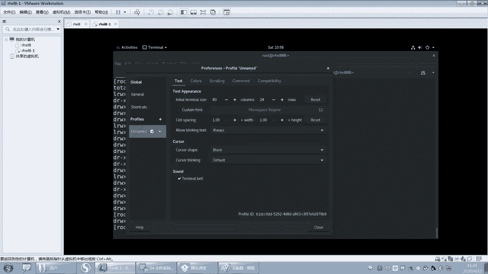

黑色跟白色哪个看着。更舒服一些。我改成亮色吧。你觉白色跟黑色哪个舒服一下？黑色。用黑色出复印件是吧？那我就黑色吧，反正我我是无所谓。

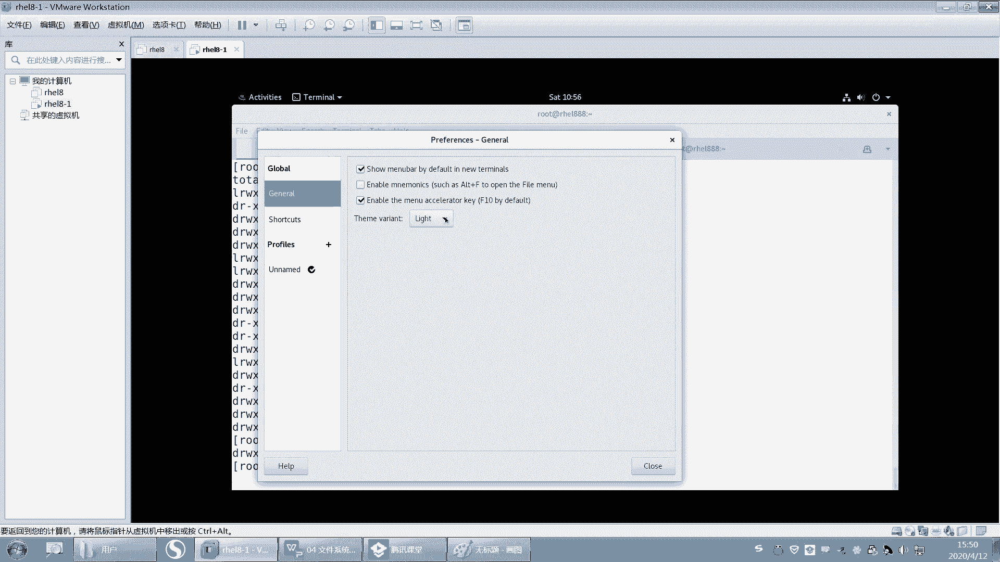

好，那就黑色。好，我怕黑色，有时候你们看不清。うんうん。好嗯。就是喜欢。神秘的感觉是吧？好，嗯，我们来看一下关于这个复制复制文呃，复制啊就复制文件的这个。

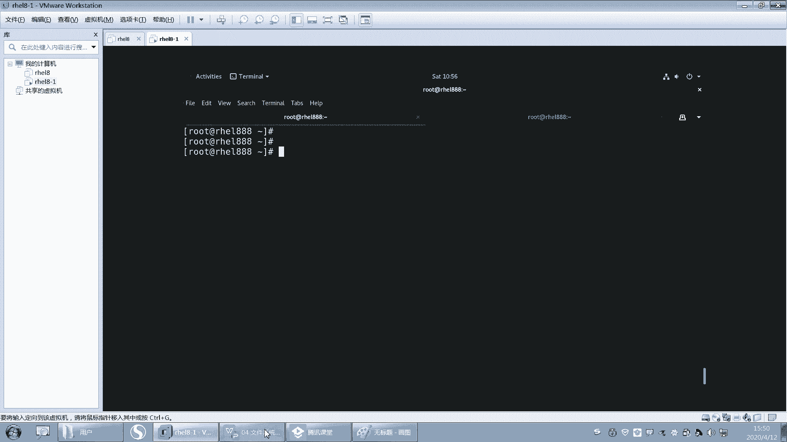

复制文件啊。嗯，这个复制呢。嗯。啊，这个。这个写错了啊。怎么写成这个样子？Opttion啊options，option啊。好。呃，回来啊嗯。

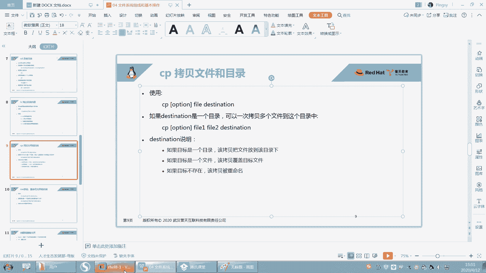

呃，CP我们来man一下，好不好？man一下啊，man一下CP。好，这个我们早上m过了吧，我就不用再解释了吧。啊所以。复制的话，后面可以加选项，还可以加什么，还可以加这个原和目标，对吧？

我们来复制一个啊。嗯，复置这样吧，我把tamp下面清空一下啊。好，复制CP后直接在time下面吧。复制CPETCpassword是吧？然后注意哦前面这是一个绝对路径，对吧？

然后最后复制的文件名字叫password，然后复制到。好，比如说你复制到t目录下面。那么这个tamp。嗯。就是我现在是不是在参谋下面，对吧？那么这个时候你可以用点，哎，这不是我们之前学过点吗？

因为点也是个目录呀，点是不是当前目录，所以就是把password这个文件复制到当前目录下面。啊，你可以用点表示，这个就可以用到点嘛，对吧？好。那我们就不先不用点啊，先用这个t，这样看的清楚一些啊。好。

CPpassword呃复制到temple下面回车，这样的话呢就复制过来了，就叫复制啊，是不是很简单，对吧？嗯，所以它是一步完成的。好，你还可以怎么样CP呃profi，比如说。嗯，再复制复制一个啊EDC。

呃group啊，复制到t下面啊，这样的话我是不是接了多个呀，多个这个参数，对吧？那哪个是原始，哪个是目标呢？我们去看man的时候是sourcece，前面或后面有三个点点点。

所以应该是source可以有多个，但是目标只能有一个，也就是说只有这两个文件复制到目录下面。复制到一个目录下面啊，而不能复制到多个目录下面。好，这样就复制多个文件了，看到吗？好。

那么下面我来说几种情况啊，说几种情况嗯。我们针对这个嗯。针对这个目标啊针对这个目标，我们来说一下啊，目标的几种情况。

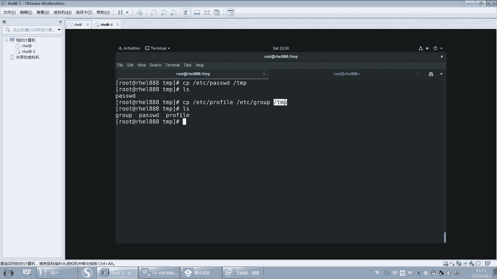

就这个啊在这里。就是你看复制文件到目标是吧？那这个目标呢有几种情况啊，有几种情况。好，如果目标是一个目录，注意，如果目标是一个目录，那么这个文件就会复复制到该目录下面。

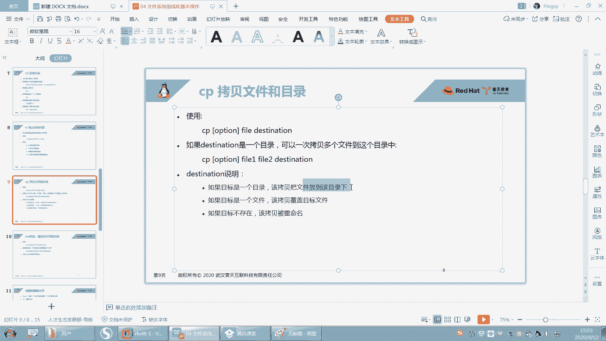

这就是我刚刚怎么呀。刚刚演示的这个吧，这个是不是不用我多说了。如果目标是一个目录，那么就会复制到这个目录下面。

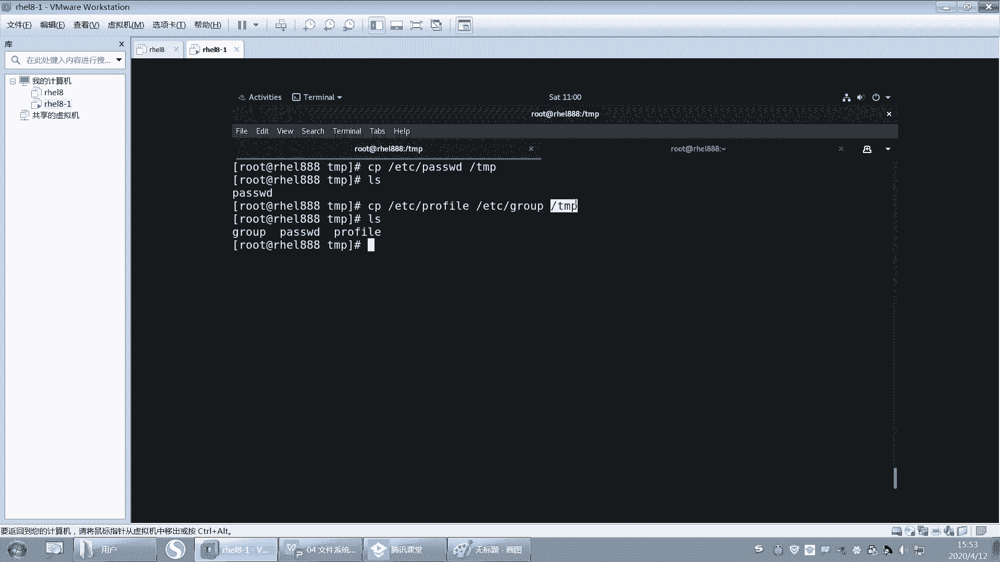

这是第一种情况。第二种情况。

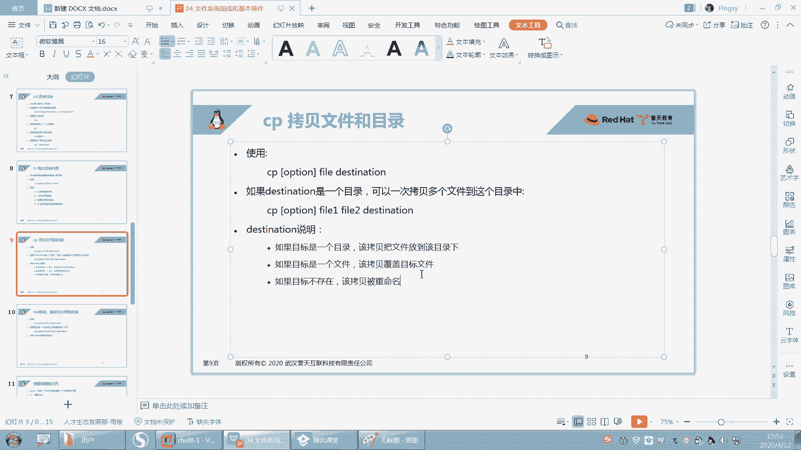

如果目标是一个文件，那么该文件就会覆盖目标文件。好，那这样啊，我复制1个ATC。下面的。嗯，这样吧，我删这个文件啊。好，CP啊CPETC下面的group，然后复制到tamp下面的pasword。

那么如果这个时候这个文件是存在，这个文件是不是存在呀？刚刚复制的对吧？好，如果将一个文件复制呃，目标是一个已存在的文件的话，那么就会覆盖这个文件回撤。他就会问你over right要不要覆盖这个文件。

好。你如果no，那就不复制。啊，如果yes就复制了。对吧就复制了啊。好，那这个时候请问。😊，最后复制的这个文件。叫什么呢？你看它是不是叫password呀？好。

那么这个pass word是原来那个password还是还是group啊？啊。这个password是原来那个pasword吗？😡，这个pass word已经怎么样？对它已经不是原来那个pas5。

它是什么？它其实是group。对它其实是group，但是group呢。是不是复制过来之后改名字了呀，对吧？其实这句话的意思是什么？指的是啊，如果后面是一个文件，不管它存不存在，那么这个文件。

就会复制过来，并且改名成pasword的。对吧，但是改名的时候，我们改成password，因为password这个文件已经存在了，所以他就会问你要不要覆盖这个文件，其实就是把以前这个文件给删了。对。

把以前这个文件给删了。嗯。复制的文件名跟这个文件名同名了是吧？跟文件夹同名吗。没有这回事啊。跟文件夹同名这有什么关系吗？我们现在考虑你只要考虑有三种情况，第一种情况就目录嘛，是不是目录啊，你后面是目录。

就复制到这个目录下面，就跟它同不同名有有没有关系啊，没有关系啊。😡，好，第二种情况就是这个文件存不存在。对吧如果这个文件存在。😡，那么就会覆盖这个文件。第三种情况就是。对吧。

这个文件第三种情况就是这个文件啊，怎么样啊？这个文件存不存在啊，这个文件不存在，只有password对吧？所以如果不存在，直接复制过来怎么样改名成pass，改名成fi。改名成fa啊，就这个意思。O吧。

你不需要判断它重不重名，这个不需要你只需要判断目标，它是一个目录啊。😡，还是一个文件呢，是个目录。直接复制到目录下面，目录跟目录跟目录下面的文件同名了，这有关系吗？没有关系啊。😡，好，第二。

如果目录是一个已存在的文件，那么就会覆盖这个文件。懂吗？第三，如果目录如果目标哦说错了啊，如果目标是一个不存在的文件。那么直接改名过来叫这个文件，对，改名成叫它。这三种情况有没有问题？啊。

方明你这个问题解决了没有？你们要给点力啊。当然不能了。嗯，等一下啊。啊，你的意思是说哦，这个文件有一个目录叫这个什么什么呃password，目录叫这个password是吧？

然后你复制的原文件也叫password，那这样的话是复制不过来的啊，不能存在同名的。对，不能存在同名的啊。嗯。

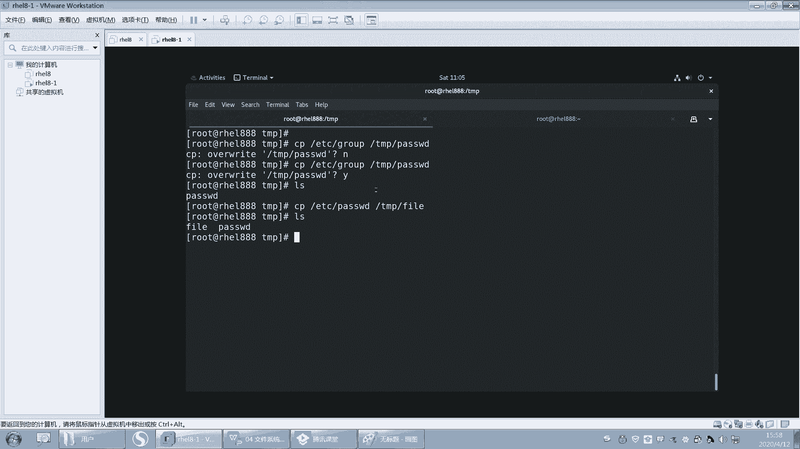

好。好，这是三种情况啊，目标的三种情况记好哦。123啊。好，那么这三种情况呢，我们其实是针对什么？针对是让你复制文件的时候是这样子，对吧？好，我快速的把这个地方如果是复制目录的哈啊。

我们说如果复制目录的话，比如说复制EPC到参阳模像。

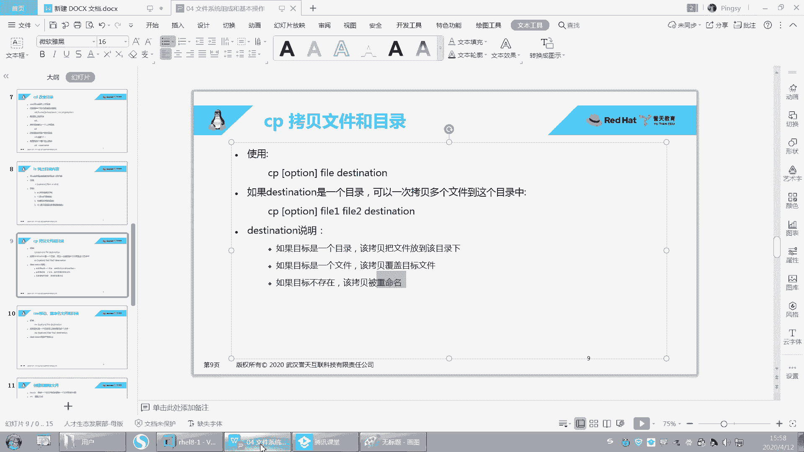

好，这样的话是复制不了的，因为它需要加一个什么，需要加一个杠R。杠R是一个选项，当你要复制目录的时候，需要加一个杠R呃，就杠R一般叫递归是吧？就是当你复制目录的时候，需要加杠R才能复制目录啊。好。

这样的话就复制过来了，叫ETC叫ETC啊。好，所以针对第一种情况，如果复制目录的话，目标是一个已存在的哦，不目标是一个目录，是不是直接复制过来啊？这跟我们复制文件的时候是不是一样的情况。对吧。好。

第二种情况，CP杠2。ETC。复制过来，t叫pas错。好。是一个已存在的文件。这样能不能复制呢？你复制过来是吧，它要覆盖它能不能覆盖，不能，因为它怎么样？他说你不能overr一个非目录。

也就是说目标是一个已存在的文件，能不能复制，不能复制。😡，不能复制过来啊。这样是不可以不可以覆盖的，只有文件覆盖文件，没有目录覆盖目录的啊，不不是没有目录覆盖这个这个这个文件的啊。好，第三种情况。

改过来叫对头。这个文件是不存在。贝塔不存在对吧？不存在怎么办？😡，改名。不存在就改名改名成data。ETC改名成da塔，对吧？这个就是。复制目录的时候跟复制文件的区别啊。好，区分了吗？会了吗？

就复制跟目录跟复制文件的这个。目标的三种情况啊要区分一下，区别就在于第二种情况，复制目录的时候是无法覆盖目标文件的。

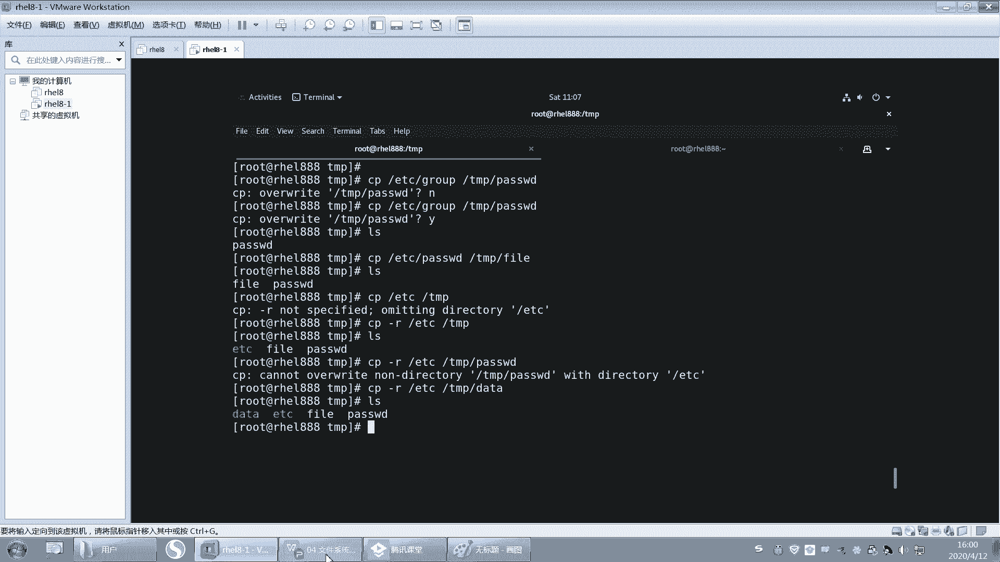

是无法覆盖目标文件的啊。好。

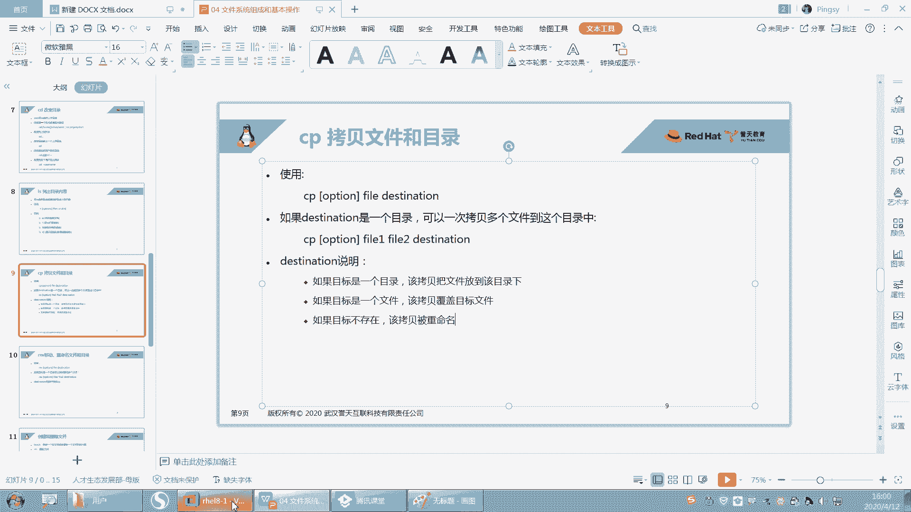

这个是复制啊复制。好，那个什么相对路径，绝对路径我就不演示了吧，你们自己嗯就是用引用相对路径啊还是绝对路径啊，这些都不需要我说了啊。就什么CP好，我演示一个啊CPETC下面的group。然。

后面加上一个后面一个叫嗯test呃test啊。这样的话后面是不是相对路径啊，对不对？那这个相对路径也就是说从当前目录下面有没有有没有test呀？没有的话，是不是直接改名称test呀？

那是不是改名成test呀，这就是相对路径嘛，对吧？这个不用我说了吧，就相对路径跟绝对路径啊，注意一定要怎么样？一定要注意。虽然我刚才给大家讲相对路径和绝对路径的时候，你感觉听得很清楚，但是呢。嗯。嗯。

你在用的时候你一定要注意啊一要注意。好，那么这个是CP啊，这个是CP等一下啊。好，然后我们来看一下关于MV啊MV。

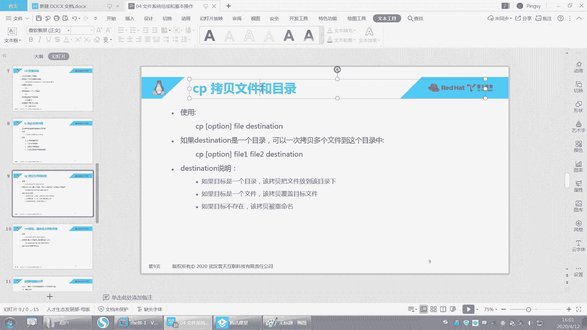

啊，MV呢呃CP是复制拷贝文件跟目录，对吧？你们记下来了吗？记下来没有？

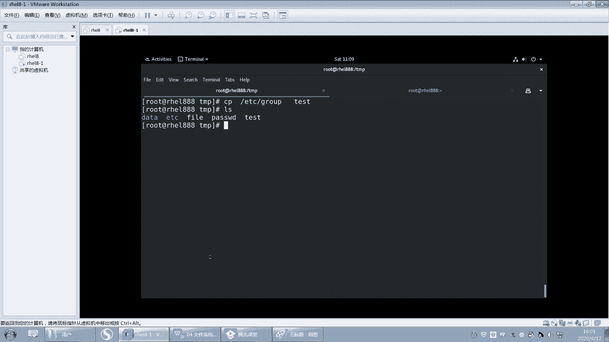

好，你简单这样记一下啊。呃。CP啊。CP就是复制嘛，对吧？你写一下的语法，它其实就是原嘛。😊，呃，跟目标就这样写。然后杠R呢就是复制。目录对吧？不加就就复置目录要加杠R。然后呢，目标呢目标有四种情况。

是吧？四种情况。嗯，四种情况。那四种情况如果是文件的话，对吧？那呃第一种情况，如果目标是一个目录，对吧？直接复制过来。对，那第二种情况，如果目标是一个什么呃一个什么就就这样去记啊，就分开这样去记。嗯。

以后你们呃再这样这种的话就不用去记，呃，有些时候就不用记了，或者记也可以。就是嗯卷记下来吧。好吧，因为刚开始刚刚入门嘛，你要慢慢的去尽量我们去选择正确的方法。因为呃刚开始入门，如果你困难重重的话。

你很容易放弃了啊，所以尽量不要给自己去制造一些障碍，把正确的记记录下来啊，记录下来。

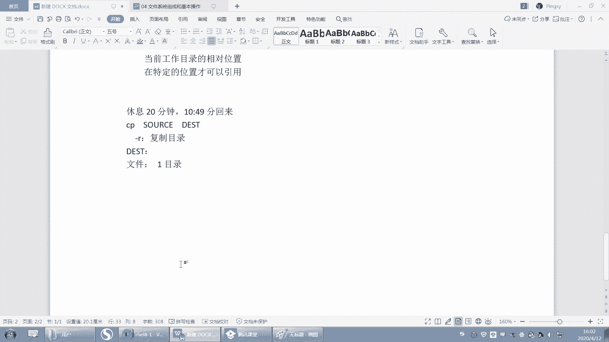

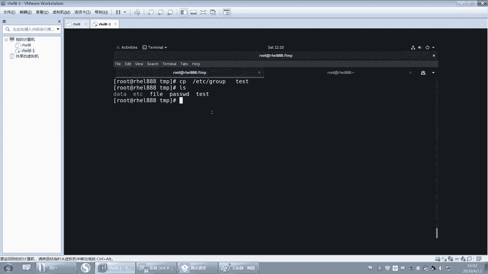

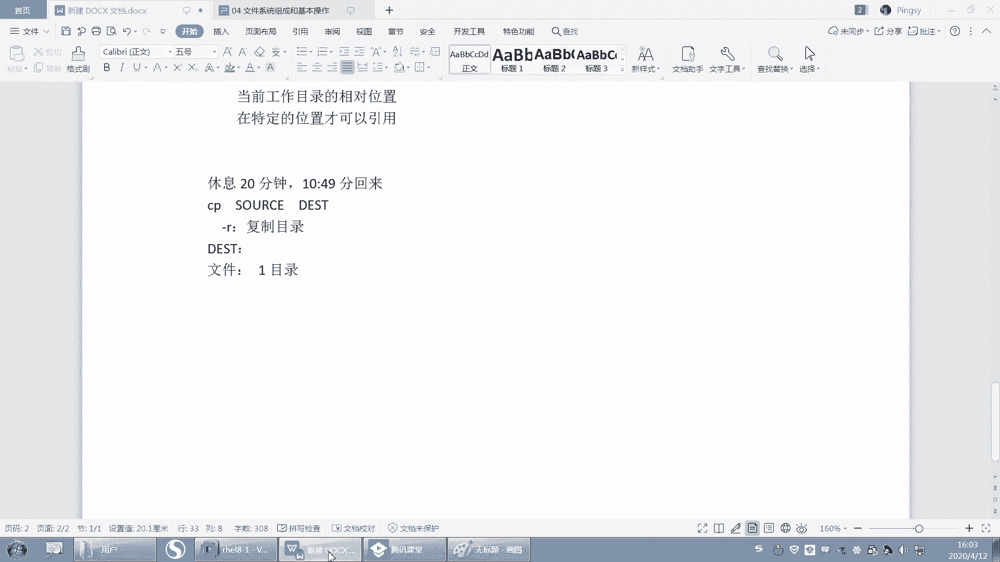

好。第二种情况叫MVMV呢第二个命令叫MV啊，MV叫移动。呃，MV呢其实就叫move。move的意思对吧？移动好，那么MV这样子啊，我移动一个。MV password移动到root下面，哎。

我可以去因是不是也可以用波浪号啊，波浪号是不是我加木啊，这样也可以啊啊，或者是这样写，是不是也可以，不就是觉得路径嘛。对不对？好，移过去，那移过去之后，是不是就这里就没有了？这个地方是就没有了。

没有这个这个pasword是吧？那它在哪里呢？在root下面。在root下面啊，在这里嗯。日下面有个pasword，这个叫移动，移动跟复制的区别就是。呃，移动呢就移过去之后，目原文件会被删掉。

原文件会被删掉啊，当是复制不会复制原文件还在，原文件还在啊。啊，那么复移动的话，那是移动文件，移动目录呢？移动目录叫MVETCA对吧？一样的啊。好，另外还要跟大家说一下啊，这个后面有有目录的时候。

你每次一推我，我这个斜杠就出来了，是吧？呃，这样啊，你们目前为止的话，这个斜杠加不加，其实无所谓。反正能加不加无所谓，好吧，你加也行，不加也行。O。不过嗯。有的时候加跟不加是有区别的啊。

后面我们遇到了会给大家讲。嗯，平时如果你说你加了不操作了，你就快照恢复，好吧。或者你踩坑了，你记记一下啊，记一下。好。嗯，然后再来啊移动到moote下。就是移动到root下，这样的话root。

下面的ETC就来了，对吧？所以移动目录的话不需要加任何选项，不像CPCP需要加杠号R是吧？嗯，然后移动目录不需要加移动目录不需要加啊。好，那么下面我们目录移动移动的时候也会有什么，也会有三种情况。

OK吧？移动的时候也会有三种情况啊。😊，好，第一个。我们移动如果目标是一个什么，你不要乱移啊，你不要把ETC给我移走了啊，我移动的是t下面的ETC啊，你不要把各个跟下面的ETC给我移走了，你移移走了。

我跟你说，你这系统就起不来了。😡，你不要乱移啊，所以快照打好，移错了，快照回复啊，快照回复。好，然后如果对吧你也可以这样。呃，一到这个。呃，root下面这样也可以，对吧？就一多个也行。

那目标就是一个目录，对吧？好，这是第一种情况，目标是个目录啊，那目标是一个已存在的文件呢，我们看一下啊。呃，我MV个什么东西嘞？嗯，这样吧，touch个fi。好。

MV rootot下面的password移过来叫fill。嗯，移动root下面的password，移动到当前目录下面叫fill，这个是不是已存在的文件？好，移动过来是不是就会覆盖，这跟CP是不一样的呀。

OK吧，跟CP是不是一样的呀？没有。啊，移动过来是不是改名叫fill，跟CP一模一样。跟CP1模一样啊。好，这是第二种情况。然后再来MV。root下面的。呃，root下面的fill呃移过来叫什么呢？

叫叫叫叫test。呃，或者叫非要点TST好吧，那这个文件是不是不存在？这个文件不存在，是不是叫重命名啊？😡，okK吧，这个文件不存在，是不是会重命名？这个CP第三种情况，目标的三第三种情况是不一样的。

啊，看到没有？就非要点TST啊。好，那这就是MVMV是不是很简单呦。MV很简单啊。好。会了吧。啊，然后呢嗯它跟那个是一样的啊，你移动目录也是一样的，对于目录而言，也是跟CP是一样的。

区别就在于语言文件在不在了啊，区别就在语言文件在不在了啊。那MV呢还有一个作用。还有一个作用啊，它可以重命名。什么叫重命名啊？看这儿。哎，嗯大家很好啊，知道送花的，别较主动啊，就喜欢主动的人。好，MV。

我要把这个da塔。重命名一下好不好？把data重命名一下啊，那么你直接接上这个data。然后去接上一个。test好吧。回去了，那这个是不是叫重命名？啊，这是要重命名啊。

那我如果要重命名root下面的这个。A，我把这个root下面的A这个文件重命名一下。如果我这样写了。写个。A点。Baker。好，请问。这个是重命名吗？这个是重命名吗？这是不是？这是不是什么秘密啊？

这是不是聪命名啊，这不是重命名吧，这是不是移走了呀，移走了，是不是改名成ABC啊？😡，对，这不叫重命名，所以一定要加上什么绝对路径路径不要忘记了啊，你把移走了，亲对吧？把移走了啊。

所以要ABC这样子或者A点baer。OK吧，就这样子啊，哦A点test。啊，然后它才在还在root下面，你你重命名不是移走啊，所以MV有两个作用。对，它在相同的目录下面。所以后面你要接路径的话。

如果这个是绝对路径引用的，那么最好前面后面也要有绝对路径，如果你相对路径，你就要注意了，你有可能会把它移走。千万不要这样啊，你会把移走。好，那么这个A就变成了什么？A点TST对，变成A点TST啊。

所以注意哦。

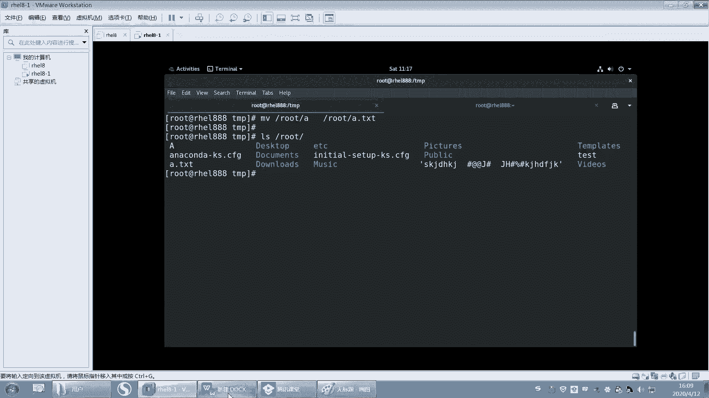

嗯，这里啊。这个我好像没有写是吧？那你记一下呗。它是移动和重命名是吧？移动和重命名啊，那么重命名的时候，目呃这个这个那个文件。就是不能被移走啊，这个叫什么命名？啊。

MV用法跟什么跟CP是类似的那目标的几种情况跟CP是一样的。嗯，它不需要加杠R啊，复制不需要加复制目录，不需要加杠R。

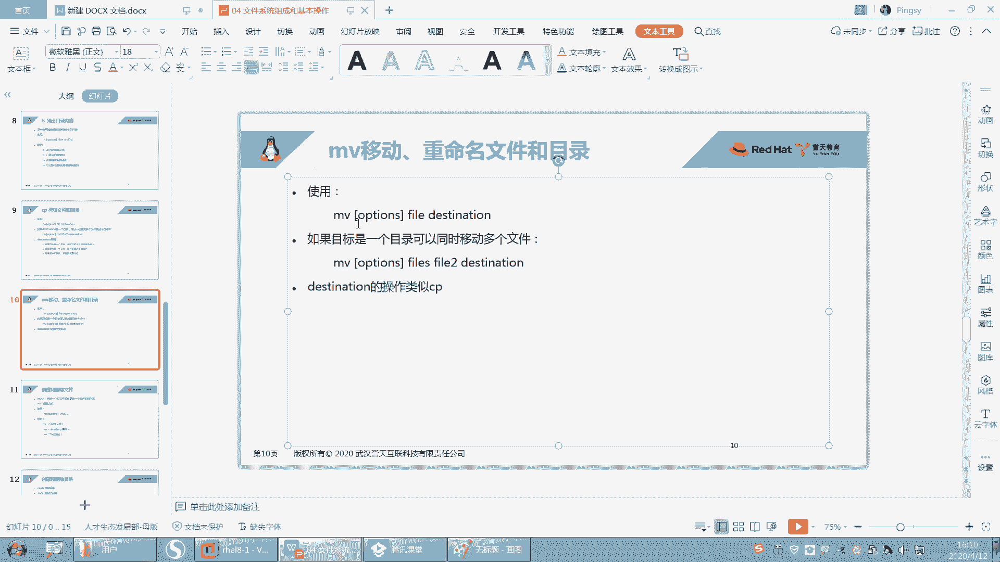

呃，实在不懂，你就卖一下。对吧你看这个语法是不是跟CPE1模一样啊？OK吧，是不是一模一样。那mo就移动嘛，rename就重重命名嘛。对不对？好，相信大家这个能力应该是有的啊。嗯。好好好。

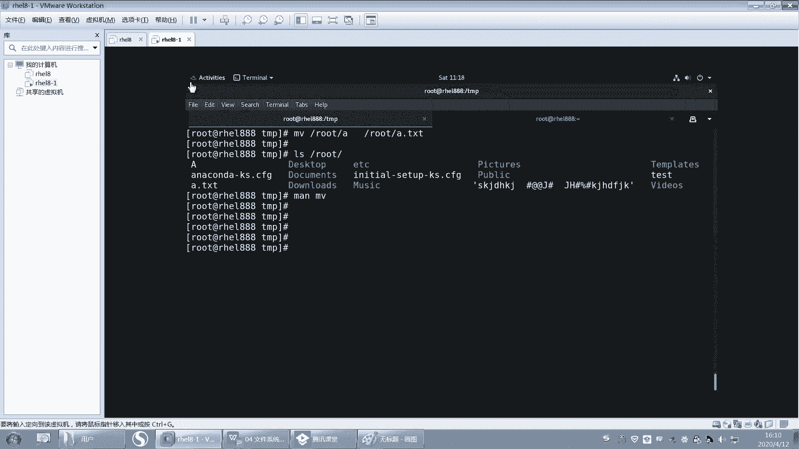

记好了吗？都记好了没有？我没有叹气啊嗯。深吸一口气。讲的我要断气了，不是叹气。下午上课有点困是吧？嗯，这个怎么办呢？要不你站起来。差一会儿。😊，嗯。嗯，MV不需要用参数改名字，移动文件和目录。对。

就移动文件的时候，移动文件目录的时候不需要加那个参数。好，另外再跟大家说一下啊嗯。

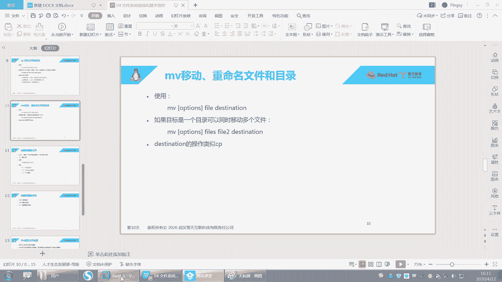

我给大家讲一个讲一个知识啊，讲一个知识点。就是在复制的时候会遇到有一个问题就是。我找一个。找一个文件。嗯。好，大家看这里啊。呃，我跟你说啊，讲简单的内容呢呃一般不会困，讲难的内容才容易困，懂吗？

讲简单内容困了，是因为你觉得这个太简单了，我这这个这哎算了，不想听，这事你困了，讲难的内容听跟不上就容易困，是这样的吧，我说的有道理吧。好，那看这里啊。大家困了，就肯定是我的问题啊，就是只要怪我这个。

我这个真的我我我这是很惭愧啊，为什么呢？因为我没有办法做到像左老师，对吧？啊，像杨本老师讲课的时候那么的有激情啊。我这个。对，就是我我就是声音实在是喊不大了，就是也没办法，就是那个。嗯，就是嗯。

喊喊不了那么大声，很难一直保持非常亢奋的那种状态。声音就是我声音不太好不太那个嗯。嗯。ふ。啊，你们如果有什么好的方法就是就是。就是不容易睡着的话。你们就。就是方法可以告诉我一下，好吧。嗯。

我尽量满足大家。嗯。好。嗯，我们看这个地方啊，这地方有一个文件，这个文件的类型是L，看到没有？这个文件是LL开头的啊L开头的，那么它是一个链接文件，对吧？链接文件好，那么现在我在复制这个文件的时候。

我们会有一个问题啊，比如说复制defat。好，那么这个文件会链接到哪个哪个地方呢？到 label system D唉链接到这个文件看到了吗？链接到这里，就这个文件会链接到这个地方，链接到这个地方啊。好。

那么链到这个地方，如果我要复制这个文件的话，大家觉得我复制的是这个文件呢，还是复制的是这个文件呢？嗯。嗯，有些学说前面这个是吧？好，最要我这段题的是deult点t的是吧？然后是复制这个文件了，这个文件。

啊，因为这个文件不是链接到这个文件嘛，对不对？所以我在复制的时候，我复制到tab下面。但对你就复制的是这个文件呢，还是这个文件呢，对吧？😊，🤧好。怎么去判断是前面这个文件还是后面这个文件？😡。

我复制完之后，那你总得判断出来吧，难道是通过文件名来判断吗？这个文件是链接文件，后面这个文件是什么？后面这个文件。😡，好，我们看一下好不好？后面这个文件是不是链接文件？你看后面这个文件不是链接文件吧。

是不是是不是一个普通文件呀？所以我复制过去之后，它到底是原文是default data呢？还是这个文件呢，是不是只要看文件的类型就可以了，对吧？所以啊我们来复制一下default。哎，我试试。好。

复制tab下面啊好，复制过去了哟。啊，这里有个叫deerult target是吧，看一下它的文件类型是什么呀。是杠啊，说明是哪个文件啊？说明是前面这个文件还是后面这个文件。嗯。

对因为它是它是后面这个文件啊，它是后面这个文件。对，所以。呃，我们在复制的时候，它其实并不是复制的源文件吧。不是复制的链接文件吧，如果是链接文件，那这地方应该是L吧，是不是L啊？

所以你想复制链接文件怎么办呢？也很简单啊。😊，CP杠P。CP杠P。好，这个。他有一个这样吧，我先把这个文件给删掉啊。好，因为它是不同类型的文件，所以它就报错了。看这里啊，然后CP杠P回车。呃呃哦。

sorry sorry sorry sorry sorry我复制这个路径用错了啊，CP杠P。好，这样的啊，路径用错了。好吧，好，这样子啊，然后再来看一下。诶。还是A呀。看一下啊。这个还。不行吗？哦。

这样才行是吧？这CP杠A啊。好。那CP杠A可以啊，CP杠A可以啊，那杠A是什么意思呢？那为什么杠P是这个不行呢？对吧？我们可以去卖一下啊。好，你看这个地是是不是就是复制的链接文件，然后还是链接到这里。

对吧？还是链接到这个地方啊。好，因为这个地方我需要给大家出一道题，你们回去自己去试，好不好？😊，啊，你们自己去看一下杠A是什么意思啊，杠A是指杠什么DR杠杠什么什么保留所有是吧？那么那保留所有是什么呢？

D呢是指目就是目录啊目录。好，你看杠D呢就是什么。哦，刚D是什么，R是复制目录是吧？D呢D是。links链接对链接文件。好，还有一个杠P。还有杠P啊好杠P呢，你看这这在这个地方啊啊杠P呢是保留什么？

保留这个modode mode是权限ownership，用人有组时间戳对时间戳等等这些信息啊，就杠P。好，因为在复制的时候。在复制的时候啊，比如说我们进入到addmin加目录取。呃。

addmin加目录啊。

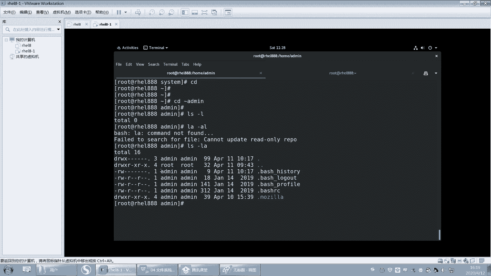

哎。好，这边文件的拥有人跟应用组是不是addmin啊？OK吧。