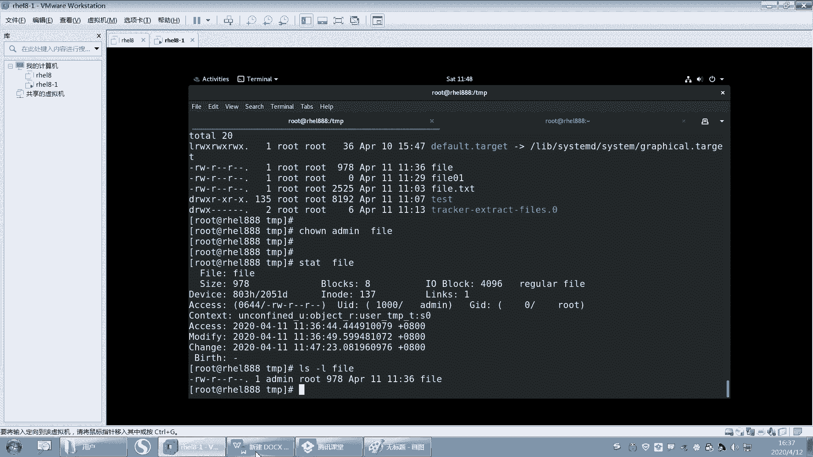

# 【重置详解版】孙老师讲红帽系列视频／RHEL 8.0 入门／红帽认证／RHCE／Linux基础教程 - P14：14 文件系统基本操作之touch创建文件，文件时间戳和rm删除 - 誉天孙老师 - BV1aB4y1w7Wi

OK下面我们再来看一下啊，关于一些创呃复制啊，移动啊都会了。我们看一下关于创建文件和删除文件啊，创建文件和删除文件。

好，创建文件呢就这样。Touch。fi1啊fill01就创建文件叫touch。touch嘛touch就是那个触触摸的是吧？触摸的意思touch。呃，fi01touch fell01啊。

那这个文件创建出来了。那么这个文件呢它是一个空文件，看到吗？这是零，大小是0，所以touch是指创建一个空文件，创建一个空文件，OK吧。好，就这么简单，就是touch嘛。嗯。啊。

那么touch除了创建文件以外，还有另外一个作用开始记啊touch。

是更新时间戳。就我PPT上没有啊，自己记啊。动等touch。好，第一个就是创建文件嘛，这个比较简单，我就不多说了啊，这个更新怎么样啊？时间戳。

啊，更新这个时间戳。那时间戳是什么呢？怎么看时间戳呢？好。我们有一个命叫tage。State fell。好，看这儿啊。呃，sate后面加一个文件名。那么就可以看这个文件的详细信息了，对吧？好。

在后面这个地方有三个时间看到这里吗？有三个时间，这三个时间呢一个是excise time，一个是modify time，一个是呃change time。

我们分别把它叫做A timeM time和C time。好。记第一个啊a time。A time我们叫access time啊，指的是文件最后一次被访问的时间。

记吗？记下来啊。文件最后一次被访问的时间at time。

文件最后一次被访问的就是文件这个文件，你看一眼，唉，它这个什么呀，这个时间就会变了。它最后一次看什么时候看呢？是这个什么呃4月11号这个时间看的是吧？所以我可以打开它看一眼。比如说看一下fill好。

什么都没干，退出去了，注意哦，不要WQW下面你写了啊，我只是要看就Q退出就行了。看好啊，Q退出，不要WQ啊，W就保存了。好，再来看。这个时间。哎。哦，我这个时间哦跟这个是对的吧，那11点31是不是变了？

变成11点31了，对吧？好，那么就是看一下唉，这个文件的时间戳就会变了，叫at time，就时间最后一次被访问的时间就是at time啊，那这个at time有什么用呢？它是记录你文件只要被访问了。

它就会什么，它就会更新就会更新啊。那么这个时间更新有什么用？为什么要记录。第一记录它的用处是什么啊？如果一个文件对你来说很重要，那么你防止别人看了，对吧？

那么这个时候你可以把这个文件的at time记录一下。下次你再去看attime的时候，如果变了，说明这个文件怎么样，被别人看过了。就这个意思被别人阅读过了。OK这就是A time。好，它的作用啊。好。

那他他有时候啊需要把它关了，就不需要这个attime。因为你想一下这个文件如果是一个网页文件，就是你就是怎么样供别人来访问的。那么。你这个at time是会频繁的。你比如说你的访问量比较大的话。

比如像那种微博微博是吧？呃。就是今年比较火的一些新闻，对吧？那么他们这些新闻会被经常被人访问。那。嗯，我觉得啊。就这个这个这个娱乐圈的是吧一些呃这个这个重大事件。我觉得他们这个太恐怖了是吧？

就只要只要只要是有哪一个。明星结婚啦，离婚啦，分手啦，谈恋爱了是吧？还有我们呢他们你们之类的是吧？然后就唉。他就新闻那个那个访问量特别特别大啊特别特别大。好，那么访问那个新闻呢。

如果记录at time的话，它会频繁的去更新更新更新更新访问次更新一次，访问次更新一次。对吧好，当时其实微博啊当时嗯你访问的话，它服务器的压力比较大是吧？好，本身压力就很大了。呃。

当时微博好像声声声称说是呃它可以支撑什么两个。两个明星啊呃呃结婚离婚是吧？对两个明星。啊，对，一个以前一个嘛，一个到第二个的话就崩嘛，受不了了是吧？那现在可以至少接受两个以上是吧？两个。对。

所以这个服务器压力抗压能力增加了啊。😊，啊。O。那么服务器的压力已经很大了。你这个attime还频繁的去更新。😡。

那么更新最后这个时间会写到哪里去，它会写到什么磁盘上面呀？它会写到这个磁盘上面，对吧？那磁盘也是有寿命的呀。你想一下，磁盘也是一个耗材呀。如果你的磁盘不停的去更新更新更新更新的话，那么它的寿命会降低。

而且寿命降低了之后，你那个生命周期是不是变寿命变就变短了，对吧？那你就要频繁的去换是吧？换磁盘。那换磁盘的话，你成本就会增加呀？

对吧所以有些时候把这个ATM关掉是有好处的啊。对他可以去什么呃，不去更新，对，不去更新。在这种情况下可以不要去更新了啊。好吧嗯。O。这个是有明显的作用的啊明显作用的。

好，下面这个叫modify time。好，modify time叫什么呢？记啊，modify time。M time。M time呢是指什么文件最后文件内容。最后一次。修改的时间。

文件内后文件内容最后注意哦，是内容最后一次修改的时间啊。那这个时候如果我打开这个文件叫fill，对吧？然后我开始嘚写了一堆是吧？然后EC冒号WQ保存了。那么你再来看。

这个时间是不是就变了变成当前这个时间了？就变成11点36，对吧？这个是只要你文件内容变了。它就会变。注意啊，文件内容变了就会变。好，那么这个是这个文件内容啊。那你说我就没有文件内容没有变，我就怎么样。

我就WQ，我就保存。😡，那这个时候你发现怎么呀？它也变了，我记得那种候没有变啊。文件内容没有变。但是我WQ出来了，时间之后会不会变啊，也会变，M time也会变啊，注意。M time也会变，所以没事儿。

不要WQ没有修改，不要WQ，因为这会影响它的时间戳，它不会去判断你真的内容修改了，而是根据什么，你只要保存了一次，只要保存了。他的时间戳就会变。呃，时间戳就会变啊。

就会是M time文件内容最后一次被修改时间。好，那么请告诉我这个这个有什么用呢？有没同学知道啊，这个M time有什么用啊？嗯。防止别人修改文件，这个你防不了啊。看有没有被篡改是吧？😊。

看有没有动你文件。嗯，啊，好好，OK okK啊，当然你时间变了，肯定就是别人会看到你这个文这个内容有没有被修改是吧？啊，这个啊呃在我们做增量备份的时候，会用到增量备份。😊。

有没有想起来增量备份？嗯，对不对？好，这个在我们存储里面做备份的时候会有用处。大家用过那种备份软件吗？有没有用过呀？你买一个西部数据的那个。呃，西部数据的那个移动硬盘。呃，包括现在百度网盘好像也有。

百度网盘也可以吧，嗯就是百度网盘可以去链接你的某个目录，然后去看一下你的目录有没有更新。更新的话，就帮你去呃去去去怎么呀，去去备份，用过没有啊？hello，用过没有啊？没有是吧。不不。

这个跟你学没学过lininux没关系啊，这个跟你学过学没学过lininux没有关系。这个是我们日常的一些工具。对，就是那个西部数据好像自带一个备份软件。😊，就是你想一下啊。对，就是我们的自动备份嘛。

对吧？😡，这个跟技术没有关系，只是说你有没有平时有没有用过这种这种啊，没关系没关系，没用过就算了啊。我其实也我就用过几次。好。🤧嗯，别哭别哭啊，你这个把你整哭了的。好，然后我们来看一下啊。我们的。

就是企业当中的数据啊，企业当中的数据。那么企业当中数据是不是经常要进行备份，这个是好语文的，包括我们自己现在的数据是不是也要备份。我们现在数据虽然不多，对吧？但是好歹那也是数据啊，那也是重要的数据。

对吧？我们也要去备份它。好，那我们自己的数据可能比较小啊，当然你的数据可能几百G这个样子，就算比较多的了，是吧？好，你要去备份它的话，比如说你要去备份。那你怎么背呢？你怎么去备份这个数据啊？

你是不是copy一下呀，我们所说的备份是不是就是copy复制吗？😡，复制是不是要备份啊？对吧。啊，复制啊复制过来呀，复制到另外一个地方啊，就备份了嘛，对吧？啊，这个是我们的数据列条啊。好，但是你想一下。

如果你的数据你们你们去备份过，不知道也不知道有没有备份过啊。比如说你备份1个500G的词，500G的这个数据，它备份需要多长时间？呃就是移动硬盘，它备份需要多长时间？我估计是需要是需要一段时间的。

我估计两个小时得有有没有啊。这个要看你的磁盘的速率了啊。嗯，这个你备份的这个速度速率。哦，它500G其实都需要一段时间才可以备份完的那你企业账户数据肯定不是G级别的呀，你肯定在网上什么TB级T级别啊。

甚至还是什么。还有PB级别啊。上上上那个呃前段时间不是说naSA把这个多少P级别的是吧，你你你你算过没有啊，P级别的。嗯，数据。然后传到那个什么亚马逊语音上面去了，是吧？这个数数据量很大的。

还有ZB级别啊，还有EB级别啊，对吧？它们之间都相差1024。对，相差1024啊，所以我们的企业当中的数据其实都可以达到什么？PB级别甚至ZB级别。对你如果你要去备份的话，其实是很难的。

这种备份其实是很难的啊。你你这种全部备份一次，你怎么样叫全备呀？是不是叫全倍？全。备啊叫全备，全部复制一遍，叫全备。好，这边刚复制完那边怎么样，嗯，这这边又产生新的数据了，又要备份，对吧？全备好。

所以全备呢优点是什么？优点？可以保存保存保存一份完整的数据，对吧？对，这个数据可以完整的备份一次，每次选备，每次选备就有一份一份一份完整的数据。但是优缺点是时间长。哦，占空间大对，时间长，占用空间多。

每次备份，每次备份是不是都要什么500G的，每次都要500G啊，甚至更多，对吧？好，这是全备。嗯，然后呢。那全备的话有这个缺点是吧？那我们就什么做增量备份啊。那增量嘛，比如说增量怎么增量呢？

周一先做个全备。周一先做个前备，周一嘛，周一的先先做前备。然后周二周二的话，你的数据比如说数据呃周一是一个G是吧？周二是2G，那么周二只需要备份是么？只需要备份那份那部分增长的数据。

就是说你只需要备份什么呀这一部分数据。但是周二的备份是不是要在周一的基础之上去备份？周二备份的是不是在周一的基础上，周三在周二的基础上，周周周四在周一的周周周三的基础之上。好，那这样的备份优点是什么？

快只需要备份什么？只需要备份我增加的那部分数据。对吧缺点是什么？😡，缺点缺点是什么呀？只要你有一部一个备份数据丢失了。就有一个数据丢失了，那么就有可能导致什么后面的一备份都没有用了，都没有用了啊。

那只能这个全被，这个没坏，那只能回到什么周一的数据。哎，只能回到周一的数据啊。好。那么这样备份那每次增量就也不太好，所以我们就是一周做一次全备，你下周一唉再做个全备。是这样吧。好，就是这样备份策略。

这个呃大概是这样子啊。好，那么这个增量的，我们在考虑这个增量这部分，我们怎么去判断它增量呢？对吧怎么去判断唉，它就是去去增加的那部分数据呢，就像一个文件一样，这个文件。

他如果没有修改，我下次在备份的时候，是不是就不不需要去备份它了？😡，那他修改了我要不备份啊，修改了，我肯定是不是要要去备份呀？😡，对不对？所以一旦修改之后，那你说at time变了要不要背呢？

at time背了，其实我不需不需要去背。那M它们变了，我要背，那肯定要背呀，对吧？肯定是要背的。😡，啊，所以这个地方我们你要知道啊，虽然你现在没就是没办法用到它，但是你要知道它们增量。

其实各种备份原理，其实原理都是一样的。

对，原理都是一样的。就看它有没有一些高级功能是吧，怎么去实现的等等啊，用什么技术去实现的。嗯，好吧。然后这个是M time啊，记好啊，文件内容最后一次被修改时间。第三。

第三叫劝拒他。叫C time。好，s time呢记一下啊，s time。C time是文件状态发生变化的。呃，就是文件状态最后一次变化的时间。什么叫状态呀？嗯嗯。好，状态就是一般啊这个我们在这个。嗯。

有个专业数叫原数据，对吧？但是现在就是其实就是文件的属性。什么叫文件的属性啊？我觉得大小啊。变了呀。文件的这个这个这个呃什么。权限变了呀。文件的又人又组变了呀。这是不是叫文件的这个什么？😡，对，是的啊。

就是描述这个文件的一些相关的信息。呃，我们叫C time叫叫叫属性，叫属性啊。

嗯，等等，好吧，点点点。嗯。好，这叫文件状态，对吧？好，你看现在。看好哦。我现在呢。把这个文件的，你看这个文件的时间说，现在是11点36分，对吧？我把这个文件的用人改一下。我可以把应用人先改一下啊。

你先不管什么改的。然后再来看。变了没有，是不是变了？我什么都没有没有动它的内容哦，我只是把这个文件的什么拥有人改了，拥有人现在变成了是么？😡，幼儿人现在变成了admin了。对。

这个时候它的状态就发生变化了，状态发生变化了，C time就变了。但是A time跟M time有没有变啊，没有变。哎，没有变，我没有看过这个文件内容，也没有修改文件内容。

所以这个叫C time文件状态发生变化了啊。

好。记下来了吗？记下来没有？那么这两个之间有什么区别呢？M time的C time，你发现只要你M time变了。😡，所以它明定会变。因为你修改内容了。它一定会发生变化，注意啊，M time变了。

C time一定会变，但是Ctime变了，M time不一定会变。C time变了，Mtime不一定会变。记住啊。C time变了，M time不一定会变。M time变了，C time一定会变。对。

就这个意思嗯。好，那么touch跟这是什么关系呢？我们state是不是查看文件啊？查看文件的时间戳是吧？好，请告诉我LS杠L。

S杠L那个时间是指M time A time还是C time？

知不知道吧？L杠也要看到那个时间是哪个time啊？其他同学呢hello hello起来了，该紧睡睡着了起来了啊。只有这个。这个这个这个。嗯，孟令康同学一直醒着是吧？你觉得睡觉这个问题。我这怎么解决呢？

要不给你们唱首歌吧。うんふふ。啊。唉，我看你们都醒了，醒了就算了吧。OKAS杠1。😊，嗯，L杠也要查看的是什么？查看是文件这个M time啊对M timeO吧嗯。😊，它始文件最这个最后一次修改的时间啊。

嗯嗯，好。嗯。哦，做笔记没时间理我是吧？😊，哦，好好好OK。😊，嗯。

O。嗯嗯。嗯。唉，我下面讲什么啊？😊，好，继续啊，那我想更新时间戳呢，更新时间呢就用touch来更新fill。然后stateate。嗯，那这个时间戳是不是更新了，更新到当前这个时间了。好呃。

我们我下面会布置一些作业，大家回去做啊，你慢一下touchman一下touch好吧，你们自己去man，呃，这个是什么？这个是改变文件的时间戳，然后嗯。怎么去改变，对吧？比如说我只想修改M time。

那就杠M，我只想修改这个。呃，这个。C time啊，不 a time就杠A，还有我还可以修比如说我touch是不是呃直接修改到当前的时间了，这个时间戳对吧？好，那我为什么要更新时间戳呢？

如果有一个文件非常重要，但是只有备份只备份了一次，你是不是很担心啊？所以这个时候你可以怎么样啊把备份多次，那怎么把备背上呢，你可以更新一下文件的时间戳，对，更新一下文件的时间戳叫touch啊。好。

自嗯这个大家自己去慢一下啊，你你不会慢的，就百度，你不会想办法把慢出来。好，到时候更据题目要求去改变这个文件的时间戳就可以了啊？对，我们可以手动去更新啊，然后让他去备份。对，让他去备份啊。

因为有些文件你比较重要的文件，你备份一次的话，你是还是很担心，万一丢了就没有了，就一个备份。所以你要备份多次，那你就更新一下文件的时间戳，就下次就会备上。嗯。

嗯。好。再来啊。对，其实我们嗯我们系统的话跟存储关系很很密切。对，关系很密切啊。所以我们有些时候也会讲到呃关于磁盘呢存储的一些原理嗯。

我会吧。你们学完linux的人再去学存储跟你计算。或者是大数据，对吧？这个呃都是有非常大的优势。嗯，我不是说吹牛对吧？就觉得自己特厉害，但是这个是事实，这个是事实啊，你们可以去找。其他的这个学生去问嗯。

好。嗯，那再往下啊。好，下面我们来看一下。

这个RM啊RM。呃，RM呢是删除文件对吧？是删除文件啊。删除文件吗？可。哦，删除文件很简单，比如说fill回车要不要删啊，你删的时候，他会问你对吧？要不要删？😡，我说Y要删，那N就不删，对吧？

Y就删掉了，所以它会提示你一下。它会提示一下这个fill要不要删，对吧？就RM嘛，RM叫remove。RM们叫remove啊。好，呃，那我删除目录的话，比如说我删除目录叫RM呃test。

你这样删除目录呢呃删不了，对吧？所以现出目录需要加什么杠A呃杠R。对，删除目录需要加杠R啊。哦，回去了。那么这句话是什么意思啊？他说要进入，看到没有啊？其实删除目录的本质是什么？😡。

删除目录的本质是删除文件，去到这个目录下面，把文件删掉。好吧，然后他就进入这个目录进入吗？进入啊yes。好，要进入这个目录吗？哎呦要。啊，以。好，你看这一行是不是就删除开删文件了呀？他先删的是什么？

是不是这个目录下面的这个文件啊，所以它第一步删除文删除目录的本质是先进入到目录下面，然后再把这个文件怎么样给删了，再把这个文件给删了啊。然后hy这样啊，比如说你不删那。你就过下一个呃N呃YNYNY呃呃。

你这样一直弄下去，对吧？我估计要翘多少下呢？呃，这个这个好像是我之前复制的ETCETC下面有多少个文件的，大概有几千个文件。😊，几千个文件啊，所以你要摁多少下呢，比如说200个文件呢就是乘以2。

你还摁回车吗？还摁个Y回车就4000是吧？好，那这样的话，你这个。从早上开始是吧，删个目录，然后上到下班哦，好下班哦，我今天做了好多事情呀，我手都摁断了，是吧？😊，好。开个玩笑啊。啊，所以删除目录的话。

对，删除目录的话啊，我们还是呃如果因为它会提示嘛，我不想让它提示怎么办？RM杠RF对吧？终于来了，RM杠RF。啊呃R呢是删除目录，F呢是强制删除，就不要去提示我。对，不要提示我啊。

直接删掉false强制删除OK回车。啊，这个时候test就没有了，就删掉了啊，O吧，删掉了啊。

嗯嗯嗯。所以删除文件删除目录的本质其实是什么呀？就是去删除这个文目录下面的文件啊，目录下面的文件。

好，这三个记住啊。呃，这个RM注意啊，嗯我们在用了这么多的。这个文件这个这个这个操作的命令CP啊MV啊，还有RM啊。是不是都会提示你啊，它是不是都会提示你要不要删啊？😡，但是注意啊。这些操作都非常危险。

都非常危险，比如CPP还好，对吧？MV也比较危险吧。RM那更别提了，很危险，对吧？所以它都会提示你，但是呢你注意啊，我们用的是鸿贸企业版lininux哦。😡，哎，鸿贸企业版8。0，如果你换一个系统的话。

你比如说你用其他的这个版本的系统，那它会不会提示你呢？注意不一定。它不一定会提示你啊。所以万一你删就删了，唉，怎么没有提示我呀，对吧？你还等着人家提示，结果人家没有提示你。😡，没有提示你啊。

所以这个时候怎么办？一定要注意了啊一定要注意了。好，其实本质上RM这个命令它也不会提示的。因为RM是哪个命令呢？不是RM是哪个文件呢？是不是USR并下面RM啊。好，你用这个命令来删你用它来。

你可以直接接上这个文件的绝对路径。然后你看我删一个文件啊，比如说。😊，删一个default。好，删这个文件可以直接用这个路径呢，可以用这个文件的这个路径去引用这个命令呢，然后加上这个文件名回车。

提示你了没有啊？没有提示，对吧？它怎么没有提示啊，怎么我执行RM的时候就提示我呀。好，注意。😡，RM你在执行的时候，其实它是一个什么它是一个别名。对，是一个别名。

它其实给你加上一个什么加上了一个杠I的选项。杠I是有交互过程的。就是我跟你之间，你要问一下我，对吧？你要问一下我交互嘛，对吧？得直接交互。所以你在删的时候，比如说如果你接的是什么，你接的是加一个杠I。

Fil。01对。这样的话是不是会提示你，所以它就相当于RM就等于什么RM等于RM杠M嘛。😡，这个RM是原来本身这个RM是这个路径。然后这个呢是我们的别名，理解吗？好。

这个别名并不是所有的系统都会给你帮你去做这个别名。注意这个别名是指我红贸企业版，他帮我做的。那你换一个系统，它有可能注意是有可能没有帮我去怎么样帮我去做。而且CP其实也很危险，为什么？

因为CP它会遇到同名的文件会覆盖，是这样吧？默认到默认覆盖时候是不是加杠I的选项啊，你看嘛which。😡，CP它是不是加杠A了，然后未取。MV是不是加杠癌了，是不是都会提示我？对吧都会去提示我啊。

所以一定一定要注意啊。啊，那你说老师怎么办呀？万一人家没有帮我去没有帮我去加杠癌，那我每次执行RM不是要很谨慎吗？别人又不会提示我，对吧？啊，怎么办？以后教你怎么去做啊，怎么去做这个别名啊。

怎么去做这个别名。😡，好呃，更恐怖的是，哎，做个别名LS等于RM是吧？好哦，对，老的同学说老师RM杠RF斜杠行回到我们今天今天说这个问题啊，从山库到跑路，对吧？😊，嗯，今天学完就会就就可以跑了啊。好。

早上还记不记得我们早上讲过，我说把根下面所有的文件。嗯。好，看这里啊，如果我想把这个文件RM把这个下面的文件清空，我可以用一个命令叫RM杠RF新。那星号就会匹配这上面所有的文件。回去了。

这样的话是不是就空了，对吧？星号嘛，所以那如果执行这样的一个命令的话，是不是就会将跟下面所有的文件都会匹配到？能不能理解跟下面所有的文件都可以匹配到，那么跟下面所有文件都会删掉啊。好。

那么我们之前讲了一个什么data嘛，我说创建一个data目录，假如说啊创建一个data目录，然后我给这个data目录挂载了一个什么，唉，挂载了一个这个这个这个嗯分区，挂载一个分区啊。

然后我还往这个data下面注意要挂载一个分区，我还往这个data下面怎么样啊啊，创建了一个文件。😊，呃，创建了一个文件啊，叫fill。好，那请问我在RM杠RMRF呃RRF新的时候。

会不会匹标这个会不会匹标这个文件呢？这个跟我挂没挂在分区有没有，这个你看啊看好啊，现在这个da下面有一个文件叫fill，对吧？那我这样一去匹配，能不能匹配这个文件啊？😡，不能。不会吧。嗯嗯。

不会匹配是吧？怎么不会匹配呢？😡，肯定会匹配呀。data上面有没有玩件，有对有fi啊。对吧商目全部匹配。所以。现在你这个fill，我管你是在哪个分区啊？😡，我管你是在哪个分区下面。怎么样啊？

你只要是在根下面。注意哦，你只要是在根下面，在不在根下面啊？再跟下面吧，这个路径是不是可以用星号匹配啊？对，全部删掉。全部删掉啊。就这个意思。

看看有没有快照啊。呃，快照快照是有的啊。

好，那今天我们就。看一下啊。嗯，应该差不多了，我可以删一把了啊，删一把赶紧就跑吧。好，反正这个还好，刚装的系统啊，快照也有。M杠F啊呃。嗯。这个。有没有人有有有吧，我记得最近。呃。

杨峰最近好像之前有很多案例是这样吧。他不知道是不是伤根哦，我就我就不说我遇到的，我是嗯我朋友他同事对，是这个是真实的事件。我朋友他同事。然后他是他在执行的时候。嗯，每年都反正很多这样的事情。

他在执行的时候，他好像不想不不小心把一个东西删了。不过那个好像是挂载了一个磁盘。😮，一般这样的数据是比较重要的那这样的数据是比较重要的，OK吧。他真的把他删了，他是误操作了。这个不是说那个不可能的事情。

真的有。😡，呃呃，不是杨哥的同事啊。嗯。刚好那个那个服务器刚测刚上市没多久吧。好。你说老师，你把这个你说删了吗？你说RM杠RM斜杠C删掉之后。😡，系统挂了有没有关系呢？系统挂了有没有关系啊？😮。

系统关了没有关系。对，系统关了没有关系，关键是什么？关键是什么呀？关键是什么？我的数据。对，关键是我的数业务的数据在这里。对，关键是我业务数据在这里，我系统恢复了又怎么样？有可能我恢复了我的系统。

我数据丢了，还是一样找不回来。所以你系统崩了，其实没关系，我服务我可以重建。说实话，但是更重要是什么？更重要的是数据，更重要的是数据啊。所以大家以后啊。😡，你只要走上这条道路。

你就可能会面临着这样的问题。如果有一哪一天跑路了。你就不要说在玉天上过课了，好吧。😊，嗯哼。OK那你也不要说是我教的了啊。😊，嗯。哦，提前给大家说一声说一声啊嗯嗯。😊，对，其实修系统呢还是有可能的。

但是数据恢复，除非你有备份，你备份，你备份的话，你备份的周期比较频呃频繁。那你丢的数据少一些。但是你备份的周期比较那个的话，呃，你呃比较间隔时间比较长，那你丢的数据比较多，丢的数据就比就比较多啊。好。

那我们试一下啊，之前也是这样，也也也是这样删，他其实有些时候你知道他是你你以为他傻吗？你以为他就是星吗？你以为他知道他就哦斜杠星就把文件都删掉了。他其实不是这样的呀，它有些时候是什么原因导致的呢？

它是有些时候是它中间有可能会匹配一些变量啊，或者是特殊字符啊，它在匹配的时候不小心怎么样啊，匹配到了跟下面的文件。😊，所以特别是那种写脚本哇，那脚本老厉害了啊。😡，所以不正常这样去执行的人几乎没有吧。

对吧？除非像我这样的啊。😡，呃，几乎没有，所以大家一定要注意啊。你不要觉得一些好的一些脚本的一些命令，一定要测试测试再测试，对吧？不要让这个地方有可能它是一个什么，比如说一个是个变量。

结果这个变量为一空了，那么就是不是是不是就匹配到根了呀，对吧？那这样的话。😡，跟这没什么区别了，但是你这样删好像删不掉，对吧？因为他做了保护的，他做了保护的啊，那做了保护的，还需要加这个才能删掉啊。

但是这个新呃这个就可以删了那。好，但是你删的时候，你看。这个地方。对，这个地方就是说报不能移除，对吧？好，我发现删半天还没有删掉啊，怎么样长住Cct住C哦。😡，啊，结束了哎，没结束。Yeah看 see。

 see， see， see。🤧嗯嗯。呀怎么没有ctl C啊，C不掉了。啊，你看这儿啊这个地方是pro，对吧？这里报错了，为什么这里删不掉呢？因为这个地方是内存里面的数据，还记得吗？我们讲的时候。

pro跟smo加面是内存里面数据，内存里面数据是没有权限去删的。😡，但其实已经删掉的文件，你加的什么R杠R会提示你吗？它不会提示。😡，对他不会提示你啊，OK吧，他不会提示你。好，不提示你就删掉了呀。

没提示就删掉了呀。那这个怎么样系统就挂了挂了啊，那这个我就ctr C不掉了啊，怎么。算了，重启吧。试一下啊。看来没有重启。哎，我我这个嗯。这个是因为我没有装Qs，好像。就是这样重启也重启不了。

无法这样发送指令，是因为我没有装tes。嗯。嗯，IIT0与IIT0就命令都没有了，看到没有？命运都没有留。Reboot。命令也没有了。

我跟你说，呃都不安全啊，对，都不安全。所以。隔壁有个控制台，这跟控制台有关系吗？嗯，做什么都是有风险的。只要你谨慎操作，其实。

案例还是个别嘛，对吧？只要你喝酒不上岗，上岗不喝酒，对吧？好，关机啊。

网络也很那个网络如果是网络瘫痪，也很严重的。

嗯，因为业务就停掉了嘛，你的损失也很大。好吧。OK哦，这个是RM啊RM。所以大家呃就是做IT这一行还是要谨慎一些啊，嗯不要太。

