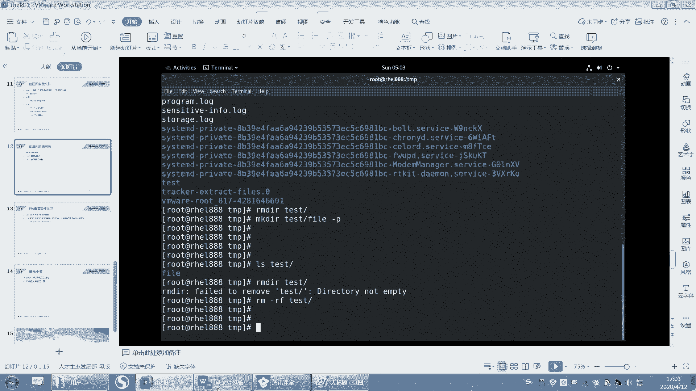

# 【重置详解版】孙老师讲红帽系列视频／RHEL 8.0 入门／红帽认证／RHCE／Linux基础教程 - P15：15 文件系统基本操作之mkdir创建和删除目录 - 誉天孙老师 - BV1aB4y1w7Wi

深一些啊嗯不要太。太那个了，太粗心大意了啊。

好，后面还有两个命令，我们讲完啊讲完。嗯，还有什么创建文件，我们讲过了吧。还有创建什么创建目录。就叫data是吧，就创建目录，这个没什么好说的啊。好，比如说我想创建一个目录。

叫data下面的test下面的。data下面的data是吧，句一直叫data也可以嘛。但是这样创建的话，就创建失败。嗯，你看创建失败对吧？啊，为什么呢？是因为我在创建这个目录的时候。

他最终会认为我创建的是这个目录，能理解吗？他最终认为我创建的是这个模，最后一层这个前面都是什么？前面都是它的这个路径，前面都是它的路径啊。啊，那么创建这个目录的时候，前面这个路径。怎么样不存在。

所以就报错了。对，不存在，所以就报错了啊。好，那这个地方怎么办？我们加一个参数就可以了，加一个杠杠什么杠P吧。啊，对，杠P对你还可以加一个V，可以看一下它的过程，看到没有？V是查看详细信息回撤。

它怎么样先帮你创建这个，再帮你创建这个，再帮你创建这个是吧？你看一层一层的帮你去创建。😊，嗯。啊，最终是创建这个。对吧。嗯。删了之后，我跟你说啊，一般删系统的话，呃，删了之后你怎么恢复对吧？

我们说系统一切系统就是文件，我们是我们就就以这个原理，就系统一切接文件。你只能说进就业模式，然后通过一些其他的方式把一些文件给就是复制过来，然后让系统恢复。嗯，让系统回复能理解吧？嗯。

但是业务的数据除非你有备份，一般很难恢复。但是如果就是说你去删掉一个文件，那比如说你删掉一个文件。嗯，这个文件我们有一些开源的工具，好像是可以恢复的。但是这个时候你一定要如果文件丢失了。

那这个时候千万不要去动系统啊，不要去动它，也不要关机，也不要干嘛，反正呃还是有可能会恢复，只要你删的不太多。有一些工具可以帮我们去恢复，但是系统不是不不在啊，系统不自带这种工具，OK吧。

我们的意思本身它是不自带的。这个要看，比如说你将来装一个其他的这个呃呃组件。比如说我像像我们这样用hado的时候，hidtopop里面它防止误操作，它就删的时候。

它每次都会将那个文件移到那个垃圾桶里面去。然后你误删了，可以把它恢复过来，但是我们这个地方是没有的，这里面是没有的啊。好，这个是创建目录啊，杠P是递归的去创建目录啊，不是其实P不是不是说递归的意思。

P是指parent，它是指副目录。parent咋写来着？你去问一下。他去杠P嘛，parents是吧，parents啊啊parents。他说就如果父目录怎么样啊存在就不会报错。如果父目录不存在。

那就怎么样去创建。对，去创建啊，就这个意思，parents啊。好吧。呃，我我们作业当中，如果你有的就是可能需求跟你上课我没讲过，你就要去慢去啊，就要去慢。好，然后我们删除目录录，删除目录啊。

删除目录刚才我们讲过了吧。删除目录我们讲过了是吧？好，那这个空目录怎么删呢？还有一个叫RMDIR，它是专门删除空目录的那。删除空目录的，但是一旦怎么样啊？一旦这个空目下面有文件。嗯。

那这个时候比如说test下面是不是有一个文件，有一个目录叫fill，那你再闪RMDRRtest。它就删不掉，那看到没有？就删不掉。所以这个命令只能删除一个空目录，好吧，那种空目录你可以用它。

那真正删除目录还要用什么？还要用RM杠R。R是删除目录，F是删除什么t这样子。O吧。对，其实这个比较少用，这个还是用的比较多。我这个一般都很少用，一般空目录很少有空的是吧？

好，删除。好。

O。呃，最后一个命令啊最后一个命令讲完下课啊。呃，最后一个命令是什么呢？我们系我们link当中啊。呃，有个特点，就是说我们的文件呢。我们的文件后面会有个后缀名，就是比如说我创建一个文件叫。

我创建一个文件叫fi点CIT对吧？那我创建一个文件叫非要点PDF我创一个文件叫非要点PPT。😡，好，那么这三个文件实际上文件类型是一模一样的。虽然后缀名不一样，但是文件类型是一样的。

因为我们lins当中啊，这个后缀名实际上是没有什么含义的。唉，没有什么含义的啊，但是在windows当中，你点PDF结尾的文件，是不是叫PDF打开呀？你点PPT结尾的文件啊，PDPPT打开对吧？

就文本文件对吧？是这样吧啊，在lin当中没有没有啊没有这样一说。😊，好，那么嗯。有些时候我们想去看一个文件，呃，万一你从windows里面复制一个文件过来，对吧？复制一个文件过来。

还是PDPDF那你可能有一些工特殊的工具把它打开。但是你怎么看呢？你难道根据它的后缀名来判断吗？你没办法根据后缀名来判断呀。所以这个时候我们提供了一个工具。提供了一个工具啊。这个工具呢叫fill。

叫fill。好呃，你可以这样。哎，我看这样能不能复制文件进来啊？我没有装ts，我不知道能不能复制唉。我看一下啊。呃，把这个复制一下。重复一下1个PPT。没装确。这咋复制啊，它就就复制不了啊。

就复制不了是吧？

他这个好像。

就复制不了。没装 Tuesday那算了吧。好，那么我可以用fi来去看啊，看它到底是一个什么样的类型的文件。回去了。那他这个空的是吧，他什么都没写。是个空的。好，那这样吧，我们来看一个看一个目录，好吧。

它显示个目录啊，我们再这样吧，我们去看一个嗯我可看一个这个啊。嗯。System。你都可以用fi要去看嘛。而且如果它是PDF。

它可以显示它是真正的1个PDF如果是PPTX如果你下课就是你们后面做作业的时候，能把它拖进来的话，你就用它来看，好吧，以及它是什么样的压缩文件，它也可以看，都可以看。比如fi。呃，default。

它是不是一个链接文件啊，看到没有？symic叫链接文件符号链接。还有比如说我们之前看到压缩文件在哪里，在这里在USS share。a man是吧。man这里，然后有个man一man一这里。好。

像那种红色的都是什么压缩文件。那什么类型的压缩文件呢？😡，Fel。呃，写1个OS tree点1哦这个。嗯，看到没有那。你看加上这个文件就可以写着它是一个GZ部格式的压缩文件。看到没有？

就是如果你用这个windows里面复制的文件，复制过来之后，到这个里面，它也是可以看的。fill也是可以看的啊。所以以后我们看文件类型，我们就用fill来去看你看文件的后缀没用的啊。

文件的后缀不代表什么？可以吧。文件的后缀不代表什么？我还可以把它改成什么啊可以改成什么以点什么GZ结尾那那它就是压缩包了吗？不一定啊，对吧？😡。

好，这就是我们的这个命令啊命令这个fill这个命令啊。呃，哦，它显示什么哦，很好啊，这地方显示了一个什么呃，它这个。呃，word是吧啊，word你看这个都可以显示的，这是可以显示的啊。好嗯。

这张我们就差不多了啊，我们这张大概讲了什么啊，文件系统的结构，文件系统的结构一定要清楚啊，以及我们后来其实也没说什么，就讲了一些各个命令怎么用的啊，各个命令怎么用的。

好，我说一下这个。嗯。嗯。这个。

我们的这个课户作业做作业啊。嗯。我想一下啊。嗯。大家嗯。作业怎么交呢？嗯，好，我来说一下作业怎么写啊。我等会儿呢，我今天最迟明天啊，然后我会发一份作业到群里，到群里面啊。然后发一份作业。

比如说我命名叫HCEHCE啊，什么什么什么对吧？然后写个姓名。那么你们就以这种格式去命名啊，就是什么什么什么姓名，谁谁谁，对吧？把这个名字改成你自己的名字，千万不要忘记改名字啊，改名字没改。

就你自己没交啊。呃，大家在发的时候啊，嗯你们统一发我QQ邮箱。因为你们发微信的时候，有时候我手机收到了。呃，这个。就发来翻去，我有时候没看到没下载啊，就就就就很难去收。所以同一QQ邮箱啊。

QQ邮箱是134。我们好像没加群里是吧？这是我的QQ邮箱，13482434692的QQ点comM。对，这是我的私人邮箱啊，这是我的QQ号。你们可以加我QQ号，我觉得QQ传文件比较方便一些。

所以统一发我邮箱里面啊。嗯。好，然后作业要求作业要求。好。最要求是什么呢？这个我要重点说一下啊，因为同学交作业不规范啊。好，作业要求呢，比如说啊我让你创建一个文件。那么你需要怎么办呢？

你需要把你的文你的这个命令截图。命令截需要截图啊。啊，命令截图完之后就是命令执行完之后要有什么验证。OK吧，要有验证啊啊，最好你还能标记出来啊，因为我们之前有很多很多的同学。他呢。嗯。

对他就把这个这个这个他做的非常棒，到时候你们你们做出来肯定会有做的非常好的学生啊，同学，然后我可以把它发出来给大家看一下。呃，验证就标记，比如标上啊，这个呃如果你能做到什么呃选项步骤，这个是最好的。

因为呃这个你自己看好吧，有时间你就做一下，有时间你就弄一下，没时间你就截命令截图验证就可以了。好，如果自己没有做出来，就是你没有做出来，你写个说明好不好？你让我火眼金睛去看是吧？我每次都火眼金睛看啊。

你其实你没有做出来，但是你又骗我是吧？😡，之前还有同学把别人的作业拿过来，直接交了。我说你是当我是中学生，小学老师还是幼儿园老师啊？还是初中老师、高中老师是吧，就没必要啊。好。

说明一下你这个地方没做出来，我知道就行了。好吧，那下次我在上课的时候会重点去讲。对，这就是你要说明一下，就不是不是说说明什么，说明这题，比如说你没做出来，对吧？你随便敲一下那个命令放在那儿。

实际上你是没有做出来的。但是我这样一看是不是看的很清楚。😡，对我就看看的很清楚啊。哦，就是方便你我他是吧？好，还有什么呢嗯。啊，命令截图截图啊，然后验证啊标记一下，所以说明一下啊。嗯，其他的话。

其他就其他就应该没有什么。然后作业最好在周四以前。周四以前啊交过来。交上来哦。我这出作业我太难了。嗯。我尽量好吧。啊，周四以前呃就是交上来啊。就你不要这个搞到周五晚上大半夜，还有能给我交，周六交。

这个我就没时间看了，好吧。嗯。嗯，这周四以前交交作业，还有其他什么？其他还有什么？嗯，这个就是要练就是要练啊。嗯，其他的话看大家有什么问题吗？呃，PPT的资料我都会发群里的啊。因为资料都发群里。

还有我跟大家说一下啊。多少多少算多呀，我的妈呀。😡，好嗯。大家后面啊最好。怎么说呢？他不要缺课啊，因为你缺课的话，我很难受。因为每次讲了，我我在上课的时候，我能尽量把自己讲的东西都给他讲了。但是呢嗯。

你们如果不上课的话，这个不上课那个不上课。然后都来问我之前讲过的，说了一大堆讲过的那我再给你讲一遍，我真的不知道该怎么一句话，两句话讲不清楚啊啊，让你怎么办呢？你要你实在落课了。

你就把上一节课的视频补一下，上一节课的视频把它补一下啊，然后然后再看一下有什么问题。然后如果是没听懂还是怎么样，你可以问这个没问题啊。嗯。然后你就用word吧，我我会发word，我会发word。

你就把word复制上去就可以了。呃，作业的话没有那么多啊，我想作业我头脑袋也疼。嗯，如果你实在是想去做作业的话，你可以把我们的书上那个练习题也先拿出来做一下。我尽量给大家多布置一点，好吧，我尽量啊。嗯。

其他看看同学们还有什么问题吗？下周我们下周大概上什么内容呢？我们下周要上用嗯。上用户啊、组啊、权限啊。呃，还有管道啊。管道是吧。啊，重立项啊。还有一些工具的使用，就是文本文本处理工具啊。嗯。就是这些。

其实一周一周下来内容还是蛮多的啊这等等这些。这些内容。嗯。这是下周下周啊。嗯嗯。嗯。记下来没有QQ邮箱。嗯。想一下啊，还有什么还有什么。好好。O O。到时候我把PPT打包放群里，大家去自己去下载啊。

其他就没有什么问题了。如果有问题的话，我在群里再跟大家说，好吧。

嗯，加个群再大家发发好吧。OK吧。行了，那我们这周就到这儿吧。嗯，第一周大家辛苦了，这是个开头啊，这只是个开始。后面坚持啊一定要坚持，这周能看到大家，下周不知道还能看到大家看到多少人啊。

呃这周大概是70人左右是吧？那下周的话多少人你就不知道了啊。大家进来尽量都来上课，OK吧。嗯。对，大家记嗯。

哦，可以可以溜了可以溜了，嗯，可以下课了。😊。