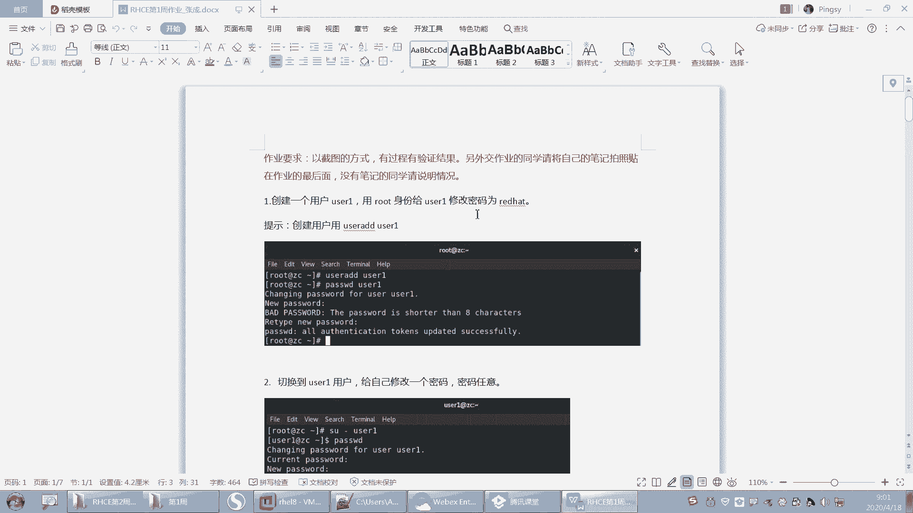
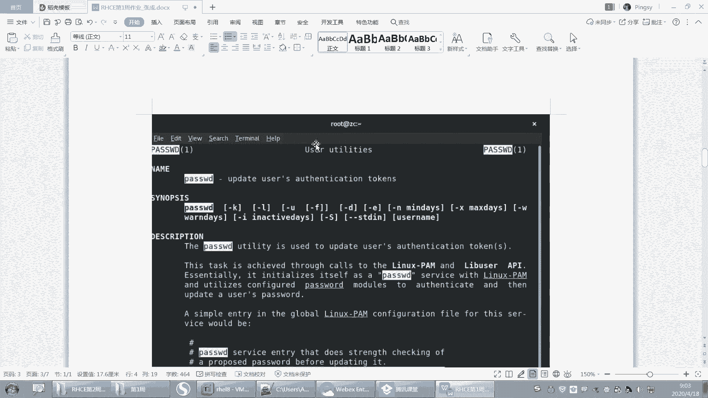
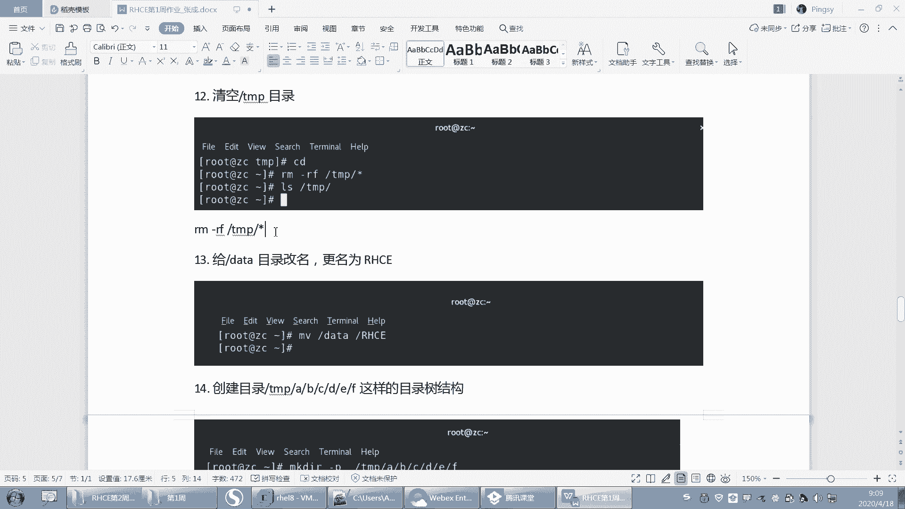
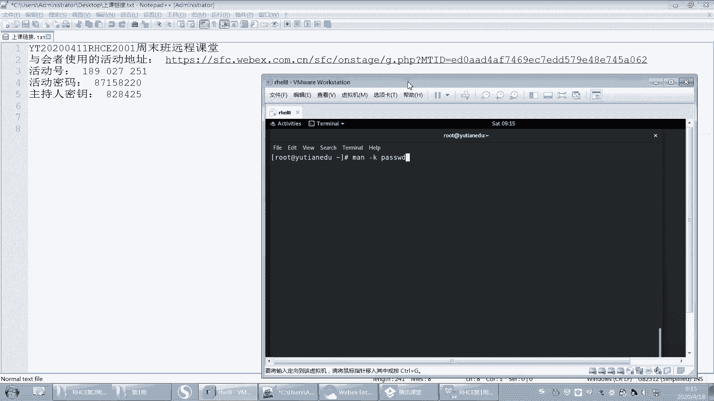

# 【重置详解版】孙老师讲红帽系列视频／RHEL 8.0 入门／红帽认证／RHCE／Linux基础教程 - P16：16 RHCE第一部分内容作业讲解 - 誉天孙老师 - BV1aB4y1w7Wi

看一下上周作业啊，我上周的嗯我数了一下，大概我收到的作业有将近60，应该是60份。呃，所以大家第一周完成的还是很不错的啊。呃，希望大家后面能够继续保持。然后后面昨天晚上发给我的，我就没有来得及看了。

大家尽量就是尽量早一点啊。好，我们来看一下上周作业啊。

呃，绝大多数同学其实完成的都很好。呃，还有个别少数同学，他这个呃基础可能不是很扎实啊，所以大家还是要注意啊。呃，就是说要多练呃，我题目可能还好，也不算多，也不算少，不过基本上够大家练了。呃。

如果你觉得还不够的话，你可以自己去嗯找一些相关的网上的题目啊去做一下。

好，我们来看一下第一题啊。创建一个用户啊，这个用户的身份哦，用用户用root身份给user一修改密码rehead啊。

然后这个一般都没什么问题，用root来给大家修改的话，我们直接输入新的密码就可以了啊。在这个地方好，然后还有的同学在这个地方呢，他其实是报错了的啊，他没有看出来，所以一定要把这个单词看会啊。第二。

切到root呃切到Uer一用户给自己修改一个密码，密码是任意的。

啊，那你需要切到什么us则一，然后执行pasword。那么你需要在这个地方呃输入当前的密码，然后再输入新的密码。那这个地方可能就是报错的，看到吗？这就是报错的啊，所以下面这个才是正确的。

OK重新输入一次啊，因为密码不符合要求。

好，然后第三个的话就是这个VI编辑器的使用啊，这个就没没什么好说了。

啊，第四题查找啊查找系统当中所有与pasword的关键词相关的慢帮助章节。这题其实是呃怎么样呢？它是呃所有与pass word的关键词相关的慢帮助章节是吧？呃。

其实这个地方啊我们呃这题的目的其实也不是说考导大家，就是大家大家知道有哪些章节，慢帮助怎么用的。

有的同学他用不同的方法去做的啊。比如说呃有这样做的，有用what is做的。

呃，what is password？那么这样查出来的话，就是什么呀？就是这个里面是带有password这个关键词的对吧？这个方法也可以啊，呃，这个也是可以的呢。

这个就是它第五章节第一章节或者用man杠K呃杠K password。这个也行，这个的话就是你的描述信息里面有pass word，他也给你打印出来了。嗯，还有的同学是用杠大K杠大K的话，你有一点点问题啊。

我们这地方是杠小K，所以没有查出来，后来同学问我的同学后来看了呃，别的同学有好像是大K吧。你就小K好吧，大K好像每一个都打开看了一眼，然后退出退出退出退出这样子。

啊，这是这个啊就是。

然后第五个这个要牢记啊，这个我出了一个这个嗯。

不是操作题是吧？然后因为这个非常重要啊，特别是第五个章节。

第六个创建目录，这个目录的路径有同学弄错了，目录的路径。嗯，其他都没什么问题，其他都很好。然后复制将ETC目录拷贝到data，并且重命名为config啊。呃，从现在开始，大家要养成仔就是仔细看题啊。

嗯，可能是我的这个题目出的有歧义，对吧？或者是你理解的嗯，跟我出题的。这个嗯想的不一样，所以有同学把这个ETC拷过去了之后。

对吧，然后把这个data命名成config了，所以导致后面的路径都是错的啊。所以大家要看清楚，包括大家考试也是这样，如果前后之间是有关关联的，那么一定要注意了啊。

好，这个复制我就不多说了吧。保留权限的话，其实这个地方权限你复制它也不会改变，对吧？

嗯，你就加杠P啊，或者知道杠P或者杠A什么意思，看一下那个帮助啊，这个是就让大去看一下。

还有这个这个路径错的，我没有跟大家说啊，因为可能他题目看错了或者是理解错误，这个我就没有提出来，我就没有给大家把这个问题揪出来。这个其实应该是你语文过关的话，能看清楚了，这题就能做对啊。

然后还有这个啊。这个你看这个题目，它就是什么呀？它就是有问题的啊。你看config下的shareow文件更名为password，这个是肯定是你的语文有问题吧。那MV是吧，就是这个地方啊。

然后这个重命名你这里啊password，你看这地方有问题啊。😊。

然后嗯还有后面头同学不带路径的。这个地方是不带路径的啊，那这里它直接加了一个pasword，所以这个地方不带路径也是错的。因为我们需要重命名，并不是要把它怎么样，把它给这个这个呃移走啊。

上课的时候是不是说过了？如果你要比如说我说要把data下面的。呃，这个ETC重命名对吧？那你如果是这样写的话，重命名为config，那这样的话是不是就有问题了，对吧？把有可能把它移走了啊。

所以重命名的时候千万不要移走，特别是系统的一些文件的时候，系统目录的时候啊，千万不要把别人移走了啊。这个路径主要是路径的问题。然后第十题的话就是ETCM录下面所有的文件的时间戳更新。

啊，这个的话呃是这样的。

嗯，这个新号呢上课其实我只是提了一下，呃，我说是新号匹配的是所有文件，对吧？所以如果你是这样写ETC。斜杠星，那么这个代表是ETC下面所有的文件啊，不包括ETC本身啊。那如果你是这样的话。

你有可你就把什么ETC这个目录它的这个。嗯，时间戳更新了啊，所以你要加个星号。这个星号今天我们会给大家讲，因为这个是我们的通配符，其中一个通配符啊，它其实指的是匹配0到多个字符的意思啊。啊。

就包括你伤根对吧？我们举个例子，是不是上根呢，上根的时候是不是说到这个呃这个这个新对不对？这个新代表是这个根下面所有的文件啊。但是不包括根本身OK吧。啊，新不包括目录下目录的是吧，那可能这个要递归了。

他可能是不是要有有没有递归修改的？

看一下目录里面的目录是吧，目录子目录里面的文件是吧？

好，然后创建一个空文件。嗯，对，这个我们可以通过其他的方法。比如说后面我学了find之后，有同学用的是fd，对吧？把所有的文件都找出来，然后touch这个也很好啊。不过目前为止我们只学了星号。

所以你用星号去做也可以啊。但是后面你慢慢学了之后，你就会发现，其实每一步操作，它不同操作之间肯定是有区别的。有的是有区别的啊。

好，然后在这个tab下面创建一个空文键叫test，通过文本编辑器来验证时间戳的更改。通过文本编辑器是吧？

好，这个你就是VI看一下啊，有同学说老师VI为为什么我修改之后呃，at time没有变，对吧？呃，是因为这个嗯你保存对出之后，at time呢，它是它有时候不是实它不是实时更新的。

就是at time默认它不是实时更新的。所以你呃如果你保存了后面时间没有没有更新的话，可能过一段时间再更更再更新这样子啊。所以就是at time。

呃，就是流同学保存的时候，对吧？没有at没有更新新啊。

啊，这个用VI验证一下就可以了。

看哪种情况下，A time会变是吧？然后M time我说M time变了，C time是一定会变的，这个一定要注意啊，M time变了，C time一定会变OK。

好，清空tamp目录R杠Ft斜杠新，有同学把tamp目录给删了啊，还有同学把ETC目录也删了，就就差删根了啊，把这个tamp目录直接给删掉了，就是它是这样删的。嗯。注意啊，你清空一个目录。

我觉得我说的应该比较清楚吧。我不是说删除这个目录，对吧？清空这个目录。😡，那应该把目录，比是说把回收站清空，那你把回收站呃清空一下，你不是把回收站给删了，对吧？所以这个你删的话，你会把这个目录给删掉。

能理解吧？不要去这样去删啊，这样会把这个目录给删掉了。你要这样怎么样加一个星号，这样去匹配tab下面所有的文件。😡。

OK吧。啊，然后给data目录改名为HCE呃，这个没问题啊。这个有同学没有加这个斜杠，后面这个HCE这个根没有加啊，一定要一定要记住。

你的每一步操作其实都很危险啊，特别是重命名的呀，删除的呀，复制的呀，其实复制也很危险。😡。

复制如果遇到同名的文件，对吧？它就会直接呃有的会直接覆盖。如果你呃强制对吧？强制默，而且CP默认它是什么呀？默认它是直接覆盖，不会提示的啊。

啊，第十四题创建一个这样的目录结构。呃，这个杠P我们指的是什么？指的是如果这个副目录不存在，那么就将它的副目录一并创建出来。其实我们最终创建的目录应该是这样子的，对不对？创建是F这个文件夹。

但是我们其中的什么？这上面这几层中间是不存在的，所以你要加一个杠PP就是parent副目录副目录啊把副目录一并创建出来，然后再怎么样，就要加个F。

所以你看这边就可以怎么样ABCD这样子啊啊，有同学是一步一步创建的呃，创建A创建B创建C创建D呃，这样的话你就不用这么麻烦了，直接加杠P就行了啊。

好。就我搞了两个平台。我有时候看不到大家聊天这个。嗯，我我待会儿再看啊。

嗯，好。然后这个第十五题将ziep下面所有的文件嗯拷贝到过来，保证权限不变是吧？其接加杠A就行了啊，复制的时候。嗯，目录的话就杠R对吧？目录加杠R啊。

啊，这个十六题查看时间之后，并尝试用哈哈奇修改A timeMM time呃，有的同学是直接杠A，这个是修改到当前时间呃杠M修改到当前时间，或者也有同学修改到某一个特定的时间是吧？加杠T。

它可以修改到某个特定的时间。嗯，这样子。啊，这个我你们怎么做的，我就没我都没有说大家有问题啊，因为这个也没有确切说我要修改at time到什么时间是吧嗯。

好，然后第十七题的话，这个这个没有把文件拖上来是吧？没关系，后面我们学了网络之后，把网络配好之后，我们再用其他的工具把它拖上来啊。好，这个是。嗯，我们上周的作业。

另外我还需要再给大家呃提那么一点点需求啊。

嗯，周作业的话，大家尽量在周四的时候。对，周四嗯。之前这样交上来啊，就是说你不要拖到周五周五晚上，这样的话我可能也没有时间。因为我不可能坐在这里等着你把作业交上来，我就给你看，交上来就给你看啊。

因为我可能会统一在某一个时间，然后去批改作业这样子啊，因为作业很多呃。呃，你看我这周收到了60份作业啊，我每一份都会去都会去看。呃，所以大家有什么问题的话，我应该都是知道他做了做了情况。嗯。

这样就交作业的时间啊，然后大家统一都交QQ邮箱。因为呃我上次把微信的就落下了，然后。我的QQ邮箱就在我Q我在QQ群里面，QQ邮箱就直接那个嘛。我是在QQ群里面，你直在QQ群里面找我就行了。然后我是忘了。

因为我知道微信上面交了，后来我就忙忙忙就忘记了。其实我也保存了，就是后来忘了直接去到那个QQ邮箱里面去那个了。嗯，但是嗯然后这个是交作业时间啊，然后还是希望大家能够坚持去做啊。

因为自从我其实嗯我也在坚持做这样一件事情。嗯，包括其他哦我不知道其他老师怎么做啊，就是自从我带这个C1班。嗯，然后我觉得我给大家布置作业了，我应该帮大家去看。因为如果我不去看的话。

你可能你自己就不就不知道自己错在哪里，对吧？或者是呃做了这也没人帮我看，我我我我感觉我自己感觉啊，也不是哪个人说老板强迫我说让我去改作业，或者必须给我的什么任务，让去改。其实我也可以不用改。我就看一下。

我我我我随便怎么处理，我都可以。但是我是我自己选择要帮他去改作业。所以我希望大家也能够去坚持，包括我自从带HC班之后，我也在坚持做这样一，我做了几年了。😡，对我也我平时上除了上课以外。

我也要去做其他的事情。我不是说除了上课，我就没事做了。😡，哦，我们也有很多事情去做，大家也是这样，大家工作对吧？上课也有很多事情去做。所以我希望大家你们坚持两三个月就过了，对吧？

但是我一直是要坚持好几年，对，以后还还要去坚持，所以我希望大家也能够去坚持把作业给完成啊，就是不要觉得就我忙啊，其实大家都忙，有很多工作了的同学。他工作很忙，但是他他的作业完成的非常好嗯。

但是反而有一些学生对吧？他实践其实是很。是很多的，但是他没有去坚持去完成。所以大家一定一定要坚持啊，而且你坚持做下来之后，你整个班结束了，你才会有一些收获。就是因为提因为这个东西就实践。你听再多。

你不练就跟没上过是一样的，就跟没学过是一样的。所以大家一定要坚持去做这个作业啊，然后我坚持批改，大家坚持做好吧，我们都一起来坚持啊。我们一起把这个事情做好啊。😊。

张杰的话。😔。

哪个啊就这个吗？你这样去查一下就好了，这就是哪个章节嘛，前面是它这个只不过是这个是个关键词，对吧？它不是一个它不是一个它不是它不是它是一个字符串，其实它不是关键，它就呢就是这里面含有这个字符串的。

嗯，哪一天？我刚刚讲的时候，你怎么没有说？

哪一题啊这题啊这题吗？这个有什么好说的？这个。这第一个章节就是用户的命令嘛。

那一般第一个章节，你看这种第一个章节的这种是不就是都是命令，对吧？第八个章节也是命令嘛。然后还有你看第五个章节，这个地方应该是什么？它是一个什么？它应该是一个文件等等之类的。文件的格式书写方法呢。

它是三把的一个加密的文件。它一般都是个文件，就这样啊，这用的比较多的3个。

三个这个这个这个三个帮助嘛，每个帮助每个章节是做什么的？这第一个章节就是命令。第8个章节，系统管理员命令只有root可以执行的对吧？然后这个是指文件的格式啊。

对，括号里面的是章节的意思啊。

好，那我们。不说了啊，我们就开始这周的内容了啊。呃，这周呢大家呃也也不用觉得这个作业没得做了啊。我我这周呢特地嗯给大家准备了很多练习题，呃，大概有几十道题这样子。所以大家这周上完课就有的练了啊。

嗯。啊，你像我每次给大家出题，对吧？我还要去想，还要去能够实现的，大家能做到的对吧？嗯嗯，好。嗯，我们大概回顾一下啊，上周我们嗯讲了哪些内容。其实上周内容其实不多的，只是一个入门，对吧？嗯。

有很同学其实有基础的，然后觉得呃进度有点慢，不过大家不用慌啊，后面慢慢慢慢我们就呃这个这个要一步步来啊，不要那个不要慌。嗯，上周我们其实主要学了系统的安装，对吧？系统安装还有什么，还有基本的命令的使用。

啊，基本命令的使用啊，然后还有一些帮助。帮助的章节对吧？呃，帮助就是帮助命令呃命令语法帮助资源命令语法呃，然后还有就是我们的文件系统。呃，大概是这些内容啊呃系统安装目前还是有同学还是有点问题。

你多装几遍啊。然后基本命令的使用呢其实在帮助语法里面，我们后来又复习了语法当中最重要的命令选项参数这些啊。这些一定一定要注意，我目前为止还没有发现哪一个同学哦，有一个同学。

他把这个呃选项跟参呃这个呃杠跟选项之间加了一个空格啊，这个可能误操操错了或者怎么样。中间是没有空格的啊，你空开了，他们两个就分开了啊，就不是一起的了。还有中间没有空格啊啊，命令选项参数等等啊。呃。

基本上是没有同学把这个语法弄错的啊，所以一定要注意这它的语法以及帮助怎么去查，一定要看看帮助啊，看帮助。然后最后是我们学的文件系统，文件系统里面我们讲了一些比较重要的。

其实我觉得非常非常重要的一个东西叫路径。就是这个路径相对路径跟绝对路径啊，因为这个我们不像windows里面我去点，对吧？但是linux当中你引用任何的文件，注意我们再去引用文件和目录的时候。

我们都要去用什么，都要去用路径，前面都要去加它的路径啊啊，比如说我们有一个文件叫ETC那么我只引用这个那其实这个根是不是也是它的路径，对吧？这是它绝对路径啊，那其实我真正匹配的那个目录文件是ETC对吧？

是ETC本身啊，所以然后你对这个文件或目录进行操作的时候，一定一定要注意它的路径，否则你就有可能把你的这个系统的文件移动了呀，删除了呀，或者是无操作了啊。啊，千万千万要注意啊，平时你做实验怎么来都行。

但是你你你去做实验的这个环境，不要去到生产环境去做啊，一定要有自己的实验环境虚拟机来做啊。好，以及这个呃什么哦路径是吧？路径非常重点重点啊，然后以及里面我们呃CP啊MV啊，其实这些都简单。

只要你把路径搞清楚了，这些都没有什么问题的啊，包括RM啊。

