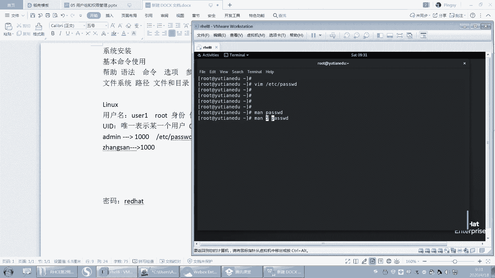
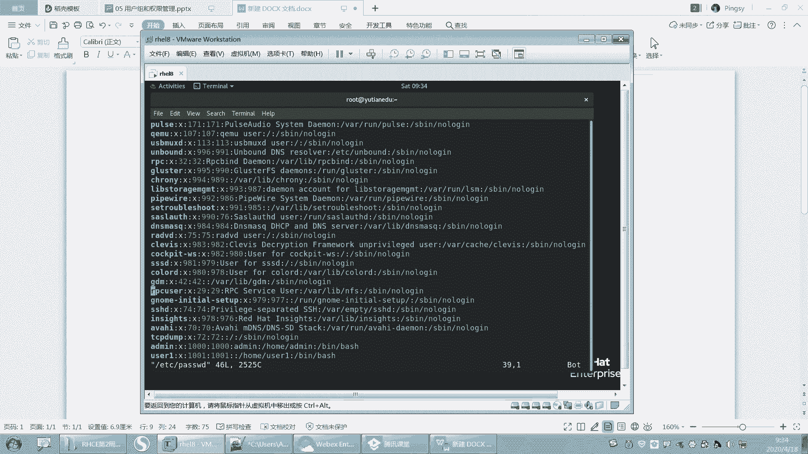

# 【重置详解版】孙老师讲红帽系列视频／RHEL 8.0 入门／红帽认证／RHCE／Linux基础教程 - P17：17 系统用户uid和passwd文件讲解 - 誉天孙老师 - BV1aB4y1w7Wi

啊，第五章呢就是用户组，还有权限。嗯，从这一张开始，我们开始接触到用户了，用户是什么概念，怎么管理用户组是什么概念，对吧？怎么去管理组以及我们文件的权限是如何的，怎么去查看怎么去修改，怎么去设置权限啊。

好，这张就是我们呢这是我们的内容啊。呃，理解lin系统的安全模式，它是怎么去做的？这个安全。每一个权限是意思是什么，对吧？比如读啊、写呀、执行啊，呃，它分别对文件还有目录都是呃都是什么区别，对吧？

以及管理我们的用户和组啊，以及阅读和理解文件的权限和设置文件权限啊，这是我们这周内容。好，下面我们来看一下呃这个用户啊。嗯，其实我们linux呢。我们lininux当中啊。嗯，非常重要的。

我们叫多用户的操作系统，对吧？呃，多用户操作系统其实嗯这个windows它它也可以怎么样，它也可以多用户嘛，还也可以用多个用户去登录去使用。其实也可以呃，但是这个我们在lin上其实提现的尤为就是突出。

对吧？啊，多用户的操系统。那用户的概念大家已经不陌生了啊，我们登录任何的这个APP，对吧？或者是系统啊，我们都需要怎么样，都需要用到用户啊，就需要用到用户啊，那么用户呢有一个东西叫用户名。

用户有一个对吧？就是有一个东西是吧？叫用户名啊，这个用户名它是一个字符串啊，比如说一般我们就是user呃user一对吧？这就是用户的用户名啊啊，包入管理员名权限，就管理员对吧？

administrator或者是我们的root用户，这种都是叫他的这个呃用户名啊，用户名啊，那么呃。唉，我们登录系统的时候需要用到什么啊？用户名是不是跟密码呀？😡，啊，用户名跟密码。

比如说密码是rehead，那么用户跟用户名跟密码的区别是什么？我们用户名呢通常是指你的身份。😡，你是谁对吧？你以什么身份来去访问你是user一，那你就是youer一的身份，你是root。

就是root的身份，对吧？就标明你是谁，其实标明就是什么，就是你是谁。😡，就花 you是吧。啊，那么第二个密码呢，密码其实跟用户用户名跟密码确实是分开的对吧？我知道了你是谁，那么啊你说你是谁。

你是user一，你说你是root对吧？那你怎么证明你是，你怎么证明你是root呢？那么这个时候我们就需要什么就需要密码啊，哎你输入了user的密码，我可以证明你是user对吧？你输入的root密码。

我可以证明你是你是root身份啊，所以用户名密码啊，当然有的呃有的好像是这个登录身份，它统一，比如指纹呢，对吧？这种还有红膜解锁呀，还有人脸识别，那这种其实用户名跟密码就是什么呃。

它已经就是从为一体了啊，但是我们绝大多数的这个呃登录信息还是离不开用户名跟密码啊啊，今年我们先学用户啊，先学用户密码，我们后面再说啊，啊，用户呢这个是用户名，那我们每一个用户呢都会有一个唯一标识号。

叫UID。叫用户唯一标识号，用户ID嘛，对吧？就身份证那个叫ID啊，那么这个ID呢唯一标识了什么？唯一标识某一个用户。啊，那么在我们系统当中呢，我们这个用户名是给谁看的呢？用户名注意是给我们使用者。

使用者来看的啊。我们使用者是通过什么是通过user一哎，比如说登录系统，通过root来登录系统。但是系统来识别这个用户的时候，它通过的是UID来识别的。系统识别用户通过UID来识别啊。

那么UID为多少呢？一般情况下我们root的UID都是0root的 uID都是0啊啊也就是说你看到哦rootUID为几啊？0ID为0啊，那么普通用户说只有除了root以外。

我们其他的用户都是普通用户对吧？啊，那么一呢我们的这个用户U一的UID呢一般情况下是从1000开始啊，就从红帽七开始我们的UID都是从1000开始了，红包好像从500开始啊，不过这个是可以修改的啊。

所以我们系统当中的第一个普通用户它的UID呢是1000啊，UID是1000啊，那么那这样的话，系统为什么不能去识别这个什么，这个这个这个用户名呢为什么要非要去识别这个UID对吧？其实一方面呢是由于什么？

由于我们的系统对数字的话其实是比较敏感的对吧？它其实识别字符串难度比较高啊，第二呢。怎么样啊，我们系统当中啊，比如说有没有可能我拿一个问题啊，有没有可能有一个用户呢叫root。它的UID为0对吧？呃。

就先举个举的简单例子吧啊，有一个用户叫dmin，他的UID为1000。然后还有一个用户叫张三。啊，他的UID也为100，大家觉得可不可能呢？大家觉得这种情况。可能吗？不可能，对不对？哦，同学说不可能啊。

好，也就是说大家认为的是我们的用户名跟什么跟这个UID是一一对应的关系，是这样吧？唉，用户名跟UID之间啊，它是一一对应的。对用户名跟UID一一对应的。那么这个信息呢放在我们的其中某一个文件当中。

这个文件呢其实我们已经比较熟了啊，就是这个文件叫ATTC passwordword啊呃，目前为止，你们先这样认为好吧，就是用户名跟UID是一一对应的对吧？但其实我刚刚问大家那个问题啊，其实是可能的。

也就说两个可能他们之间呃存在他们的UID是一样的。这个到时候我们呃学了这个这个用户管理之后，你就可以去看它的帮帮助里面啊，其实是有一个选项的。我们学了之后再说，好吧啊。OK再来啊。😊，也就是说。

其实admin呢，我们人来识别什么？addmin它就对应的是1000。那张三假如说他也是1000，对吧？那我识别张三，我用张三登录数候，那我最终是不是也是1000啊，那这两个人。😡。

他们之间是同一个人吗？其实我可以认为什么呀？他们是同一个人，因为他们的什么，他们的UID是一样的，他们的UID都是1000O吧，都是1000。啊。好，这个例子可能大家觉得呃这个有点反常，对吧？

就不太可能啊，跟我们之前学的，但其实是可以存在的啊。好，那字么说吧，现在呢唉我将这个什么将这个用户。😡，呃，比如说。嗯。好，算了，这个我到后面再说吧，可能。就就就举这个例子好吧啊，当两个用户呢。

他的UID如果是一样的话，那么他其实是指同一个用户啊。好，这个就是通过什么？通过这个UID来识别啊，通过UID来识别。其实跟用户名没有什么关系。我最终系统就识别你的UID是多少，你是多少，对吧？

UID怎么怎么样啊。好，后面我们经常会用到这个UID的啊。好，那系统的这个用户名跟UID之间放在pasword里面。那下面我们来看一下这个paword啊。

OK我们打开这个password文件啊。好，这个就是我们的什么，这就是我们的password文件里面存放的全部都是什么，全部都是用户的信。注意是用户的信息啊。然后在这个里面我们每一行看好啊。

每一行它都是一个用户。比如说第一行就是root，第二行是bin，第三行是demon是吧？然后最后一行你看是不是usermin啊，对吧？这是这两普通用户啊，所以一行为一个用户，那么。

第一个地方为什么为用户名？那第二个位置为什么？第三个位置是什么？第四个位置是什么，对吧？所以我可能不太清楚每一个位置栏位指的是什么含义。

所以这个时候我有可能就要去慢什么去查帮帮助帮助这个什么这个password它里面这个文件的格式是什么样子的，所以我们就要去慢什么？man五怎么样啊？password，这就是呢如果你慢。

如果我直接去慢的话，是不是慢的第一个第一个章节啊，第一个章节是不是命令怎么去用啊，对不对？还不懂的同学啊，所以如果我要去慢的话，我就要去慢第五个章节，如果默认慢的话，就慢到第一个章节去了啊。

因为password有两个章节，一个是一章节，一个是5章节啊。😡，好，那么你要指定的这张节就要去man，那就manpassword，这个时候漫出来的才是什么才是这个文件啊，这里写的是密码文件，对吧？

但其实现在它已经呃密码没有放在这个文件里面啊，这是以前它密码确实是放在那里面，但是现在不是的啊，所以这个它虽然写的密码文件，但是它不是不是这个呃放的密码啊，你看这里描描述写了嘛，这个文件呢。

它是一个文本文件，那他去描述什么。

呃，描述这个用户登录账号，那否这个系统，对吧？也就是在这个系统中登录账号的一些信息，其实就有账号信息啊账号信息。往下翻往下翻，你看这里啊，那它是每一行each line对吧？

每一行都是描述一个啊sing user嘛一个单独的用户啊，那么他们之间用coon separate是吧？这个叫就什么，这是封号是吧？封号的意思啊，就7个封号嘛隔开的，然后呢那name是吧？

第一个是名字密码，第二个写的是密码UIDGID什么什么directy什么he是吧，什么之类的。😊，啊，那么每一个栏位的呢这个栏位是如下是吧？每一个栏位都有解释啊，比如说第一个栏位name。

他说这个用户的登录名。呃，怎么样，还不应该包含什么呃，capital应该是大写的意思吧。呃，对，这个之前我们好像呃用户名区不区分大小写呀？这个问一下大家。😮，这个用户名区不区分，大要写大家知道吗？

知不知道啊？啊。好了。不取分是吧，还是不知道啊。OK呃，其实大家在用这个大小写的时候啊，要注意它是不区分大小写的。呃，所以呃。大家统一用小写。统一用小写啊。好吧。就是你如果写一个大写的addmin。呃。

它是识别不出来的，就是你最后发的话，他会发给那个小写的的命。对，不区分啊不区分OK吧。所以大家在创建用的时候，不要用大写啊，要用小写，OK吧，这capital应该是大写的意思吧，首字母呃应该是大写啊。

letter字符嘛。你查一下好吧，我是这样呃，我我没记错的，应该这样。好，然后第二个X对吧？什么意思？然后UID什么意思？GID什么意思啊等等这些。うん。你创建是可以创建成功，但是你在用这个用户的时候。

不能用大写。创建是可以创建成功的。好，那么嗯。我们man里面啊其实已经有说明了，对吧？但是这个我来给大家解释吧。好吧，我来给大家解释啊，每一个栏位什么意思啊？好，大家把笔记拿出来记一下啊。呃。

password文件的格式描述啊。

啊呃，第一个栏位指的是用户名啊。第一个栏位指的是用户名，其实用户名就是就是什么？就是我们系统登录的时候那个名字啊，这个不用多说了吧，就是登录的名字，登录系统的那个名字啊，叫用户名，好吧，用户名啊。

好，把这个栏拿过来啊。好，第二个栏位啊第二个栏位这个X。X这个栏位啊，它虽然写的是密码，但是密码现在已经不在这个文件里面了。密码在另外一个文件里面啊，在ETCsha里面。在这个文件。呃。

在这个文件里面啊，这个是放的是密码信息，这个放的是什么用户信息啊。那么这个X指的是什么意思呢？这个X指的是登录该用户时。登录该用户时啊。呃，需要。

密码哎，登录该用户的时候是需要密码的啊。哎其实我。

我看一下啊。我这个地方其实都有说是吧？这个我有我有做笔记啊。好。再再写一遍。啊，X代表登录这个用户的时候，需要密码，我来给它验证一下啊。😡。

嗯，因为很多同学容易搞混，他说老师那个X指的是有密码还是没密码，还是什么意思是吧？还以为有X呢，就是有密码，没X就没密码是吧？好，创建一个用户啊，叫us2。好，那么这个用户创建出来之后。

你再来看这个地方是不是有个X。也就是说这个用户默认它创建出来，这个地方就是X，对吧？好，那么这个时候呢，我们切到user一啊，比如说切到user一，我们来登录一下这个user2啊。

注意不要用root来去切啊，你用root来切到user2，它就直接怎么样啊，直接登录过去了啊，不需要密码呀。好，所以这个时候我们用user一的身份来切到user2。😊，啊，然后输入密码密码是什么呢？

密码没有密码，我没有设置密码啊，这个地方我是没有设置密码，所以当一个用户。😡，如果没有给他设置密码的话，它是无法进行登录的啊。你这边随便数，你输什么都不对，输什么都不对啊，因为你没有设置密码，对吧？

还有一点提醒一下大家啊，大家在做作业的时候，在切换用户的时候，他他这样切OK吧。😡，他也这样学。不要偷懒啊，我就觉得有的他就是哎呀不加杠好像也能切呀，对吧？😡，不要偷懒，中间要加个杠，听到没有？

中间加个杠啊，因为现在我也没办法给你解释清楚，加杠不加杠的区别，但是加杠一定不会有什么问题。你不加杠的话，可能就会出问题啊。所以大家一定要记住，要加个杠，切换用户的时候啊。好，然后现在我来切U子2。

没有切不过去，对吧？因为如果这个用户没有设置密码，他就无法登录。好，那为什么没有设置密码就无法登录呢？是因为什么？在这个password里面，这个X栏位它有一个X栏位。比如说我把这个X栏位给去掉。😡。

看好哦，把这个X栏位给去掉啊。然后我们再来切到右侧一。对吧然后再来切到右侧2。咦。等一下啊。你不会红帽八遍了吧。这个谁？这红包漆是这样子哦。user2。密码。这好不行啊。这个把X去掉也不行了，是吧？

那这个X两回默认好像。😊，所有的用户都需要用密码，即使把X栏位去掉，好像也是这样啊。哦，这个我还之前没有测，因为我以为它不会有变化的啊。所以这个X栏位之前学的学过的同学，这个要注意啊。

这个X栏位呢把它去掉了，好你们也可以测一下啊，我去掉之后还是需要密码，对吧？登录界面的话。登录界面。看一下啊。我试一下啊。嗯。洪帽七是这样子的，因为我每次去红帽区的时候都可以成功。这个不行，对吧？

这好像也不行，都需要密码。

嗯嗯。登录界面试一下啊。登录界面应该。应该也不行。呃，登录界面的话是这样的。你看啊，如果你从其他用户登录，对吧？呃，这个用户如果没有密码的话，你这个地方。它都不会显示这个用户的用户名，看到没有？看到吗？

好，我先测一下啊，root。U则一。你的密码说什么嘞？😡，不行啊，在那个地方不行，在这里肯定不行的。😡，好，等一下啊。再来我给U者一设置一个密码。

啊，嗯你这个用户给他设置密码了之后，你再来锁定一下，你看一下啊。

那这个柚子一它就会出现在这个地方。其实我们嗯。当这个图形界面它有这它就是这一点，其实这一点也不太好。呃，当这个用户有密码的时候，这地方就会列在这个地方。就是如果这个用户没有密码，他就他就不会列在这里。

比如user2，它就没有列在这个地方。😡，对吧。

我看一下我的PPT啊。嗯，这是他官方的官方说密码占位符是吧，官方解释他也没说清楚OK。

好吧，那个这个X我下去再看一下到底有什么用啊。在这个地方，你如果你是红帽七的系统，这个就是这个意思啊。红帽八的话还要再测一下。嗯。应该不行啊。😔，没有转嗯。不行，还是需要密码还是需要密码啊。

那还是需要密码，那这个X没什么用了，现在。这个X没什么用了，有跟它有它跟没它没什么区别了哦。好，就这个X蓝位啊，但是红帽七的系统，这个X蓝位是有有意义的啊。就像我跟大家给大家说的。

如果你是红包七的系统，那么有了X，你就登录这个用户是需要密码的。把X去掉，登录这个用户就不需要密码了，OK吧。嗯ん。好，然后这个大家自己记一下啊，标注一下。默认密码默认密码这个不清楚。后没。这个。

不清楚啊。好，然后下面下面啊这个地方呃第三个栏位123啊，1001这个栏位这个栏位呢是我们用户的UID。用户的UID啊，那么这个栏位你看这个栏位啊，就是用户的GID。好，这个UID呢。

我们刚刚说的它是什么用户的唯一标识，对吧？用户的唯一标识号啊。那么GID呢就是组的ID。那么这个组呢每一个用户在被创建出来的时候都必须要属于一个组啊。所以组的ID待会我们来讲啊，我们就先把用户的讲完。

然后再来讲组再讲组啊，这是这个组的ID他们之间其实没有绝对的关系啊。比如说UID为1001，那组ID一定是1001吗？不一定啊不一定好吧。啊，后面这个栏位啊后面这个栏位这个空格这个栏位啊呃它是空的是吧？

这个是指用户的。描述信息。这个地方是指用户的描述信息啊，那么这个描述信息有什么用呢？

我再测一下啊，看这个描述信息啊。好，这个user一这个地方我写上一个test user。😡，他是一个测试的用户啊，看好哦，test user好保存。下面我们再注销一下啊。好。

你看这里它就会变成了test user，其实这是这个用户的描述信息。它这个地方并不是指用户的真实的用户名，而是那个描述信息啊，就是那个第几个栏位啊，第第那个GID后面那个栏位啊。

就是test user这个跟红毛器是一样的啊，没什么区别。

好，所以那为什么要把那个地方直接怎么样改成描述信息呢？因为你在登录图形界面，它其实嗯说实话，你在工作当中，图形界面其实比较少用的对吧？还是用那种嗯字符界面，对吧？但是图形界面它不好地方。

就是它会把所有的用户名都会列在那个界面上，那这样的话，别人一看就可以看到这个用这个系统当中有哪些用户了，对吧？所以这个时候你把它改成t user之后，它只会显示什么，只会显示描述信息。

而不是真实的用户名啊，这样的话，防止别人知道我系统当中所有的用户名了。OK这是用户的描述信息啊。好，下面这个地方。这个栏位啊是指用户的加目录。这个栏位是指用户的加目录啊，用户的加目录。

什么叫用户的加目录呢？呃，这个我在第一天的时候上课也跟大家说过吧，就是。

嗯，你看啊。我们每次。切到一个用户的时候。我就会默认怎么样啊，进入到这个用户的加目录下面，看到了吗？home下面的user一进入到这个home下面的user一啊，或者是我切到user2。😡。

我就进入到什么啊，我就进入到home下面U子2，这就是这个用户的加目录，用户的加目录啊。好，这个用户加目录默认会在home下面以用户名命名的一个什么一个目录作为这个用户的加目录啊。

当然这个地方我也可以自己去指定指定这个加目录在哪里。😡。

好，再往后面啊再往后面，这个是登录he。这个是登录谢尔啊，这加木哦。这个加目录再说一嘴啊，嗯加目录里面其实是有很多文件的。比如说啊LS杠A，你可以看到很多隐藏文件，对吧？呃。

这些隐藏的文件大家不要去动它，就放在这，不要去动它啊，这些隐藏文件。我默认呢呃这些隐藏文件就是针对这个用户所设置的一些文件啊，比如说它是一些个性化的。

呃，个性，比如说一些变量啊呃都会放在这些。加目录下面啊都会放在加目录下面，每个用户下面都有啊，每个用户下面都有。啊，你也可以往自己用户下面存一些自己的私人文件，对吧？

那别人是无法进入到你的加目录下面的啊，就别人只能进自己的。😡。

加木路，但是进不了别人的加木路。啊，最后一个就是登录here。登录hear呢是指这个hear呢，我们后面会讲我们接下来就会讲这个什么叫hear啊。

嗯，谢尔呢其实大家就可以这样认为呃，我每次怎么样啊？我每次登录到一个用户的时候，他就会给我分配一个here，看到没有？😡，那分配一个here，这个hear就是在这里可以敲命令行，就给我一个提示符。

让我去在这地方敲命令行，这就是一个here，就是一个here，O吧。😊。

啊，这个具体是什么东西，我们后面会讲啊，啊，这个就是我们pass word里面每一个栏位的含义啊，每个栏位的含义。好，那么这个地方再来啊。

其实我想创这个用户很简单。这样啊，你看我直接。把这一行啊，那我把这一行复制一下。好，你看我复制到下面一行，对吧？这个地方就是有把它改一下，比如说我可以改吗？😊，改成3。改成3。改成三是吧。

然后这样改成3。好，那你看这个地方我就创建了一个新的用户叫user3了啊，保存。好，那么这个用户其实就已经存在了，我不需要做任何其他的这个修改。那我们来看一下，我怎么证明这个用户存在呢？

我们之前学过一个命令叫ID对吧？比如说ID userer一，唉，存在了ID userer2存在了ID userer什么3，那user3看到没有也存在了，只不过。只要显示这个就代表这个用户已经存在了啊啊。

他的UID是么？1003GID是1003，还有什么组1003是吧？好，那这个用户其实我就可以怎么样切过去了嘛？比如说切到us的3。我就可以切切过去了是吧？但是他说没有这个用户切不过去那。

但是这地方看是不是我已经过来了。看到吗？那。我ID一看我是谁呀？我是youer3。其实这个用户就已经存在了，我就可以登录了，对吧？只不过这里报错了，说没有办法切换到这个用户。😡，home下面user3。

因为这个目录目前为止我没有把它创建出来，所以你要进入到这个用户的加目录，是不是会报错呀？但是为什么我会知道home下面user3是我的加目录呢？因为我在什么password里面定义了。😡。

home下面的us3是我的什么加目录。所以我每次切换到这个用户的时候，他就会进入到这个目录。但是这个目录又不存在怎么样啊，然后就报错了，而且还报了一个错什么错。

还报了一个什么找不到什么名字符group ID1003是吧？啊，这个是因为什么？这个组目前也不存在。唉，其实组1003必须要存在才可以，就像us一的组是1001对吧？us2的组1002。

那么这些都是存在的，但是组这个是不存在，所以它也报错了但是我只要证明的是什么？这个用户存在就可以了，这就us3好吧，所以这就是什么pasword的作用啊。😡，这就是pass word的它的作用啊。

它就是。😡，证明这个系统当中有什么这个用户就可以了，就这样就通过这些信息，我就可以把这个用户创建出来了，是不是很简单，对吧？那我复制一行就可以放创建一个用户了啊。至于这些后面存不存在，那跟我没关系。

我是不是还给他分配了一个什么 share啊，所以为什么我能切换到这个用户，是因为我给他分配了一个sha叫b，叫binb这个 share啊。好，所以才会给我一个命令行啊，我切到这个用户才会给我一个命令行。

O好，password文件就讲完了啊？😡，这个这个地方有没有听不懂的，这地方有没有什么问题的呀？这个pass word文件。😡。

好。OK这个地上改一下啊，从1000开始，用户账号通常UYD从1000开始啊，那个500是是红猫六的，红猫六的是500啊。啊，这个是账号信息啊，然后我给大家把这个地方写在这里了。你如果没记下来。

你就看我PPT就可以了啊。呃，再来啊呃，我们刚刚讲了什么，我们刚刚讲了这个呃password文件，对吧？讲了用户。

