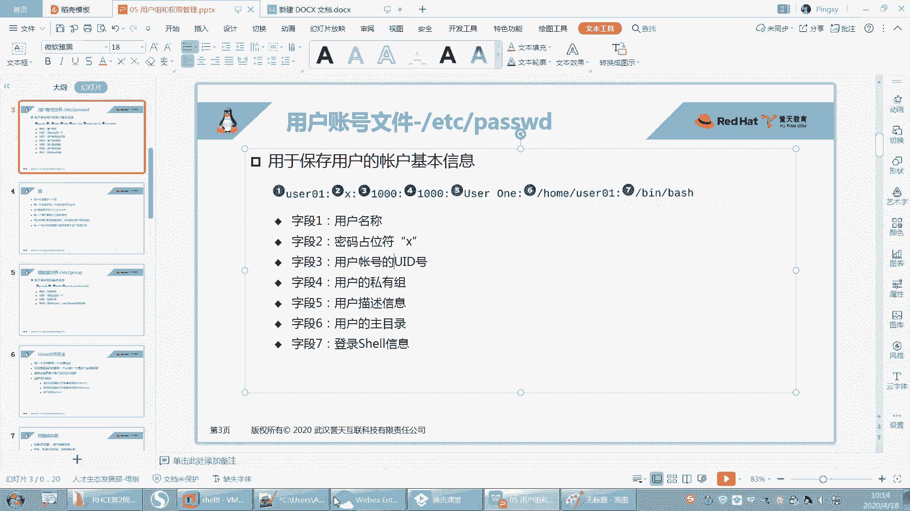

# 【重置详解版】孙老师讲红帽系列视频／RHEL 8.0 入门／红帽认证／RHCE／Linux基础教程 - P18：18 系统组gid和group文件讲解 - 誉天孙老师 - BV1aB4y1w7Wi

户啊讲用户下面呢我们来看一下组，看一下组啊，看一下组。好，我们每一个用户呢注意啊，看这里必须要属于一个组。其实这个呃大家可以理解成什么呢？就是说我们人呢我们人本身注意啊。呃，记记好这个例子啊。

因为后面还会再再再再再提到我们人其实就是一个用户。那么我的祖是我的家庭，能理解吗？呃，当然这个孙猴子不算啊，他是从石头缝里蹦出来，还没有爹娘，是吧？😡，所以你的家庭就是类似于就是你的组。

那你个人就是一个用户，那你就是这个家庭囊组的什么？就是一员嘛，就这个意思啊，所以我们用户必须要属于一个组，他在出生的那一瞬间，他必须要属一个组，对吧？就必须要属于一个组啊。

你看我刚刚他没有他组我虽然给他分配了，但是这个组他说这个组不存在是吧？所以你这个组是不是也要事先要存在才可以啊。那我待会儿就去把这个组给创建出来就可以了。对，把这个组创建出来就可以了啊。😡。

好，那么我们每一个组呢也会被也会被分配一个独特的组呃组ID叫GID叫group IDD叫group ID啊。那么组的信息保存在什么？group当中，唉，组的信息保存在group当中啊。这个没研究过啊。

每一个用户都有自己的一个私有组对，私有组啊，这个私有组我先给大也给大家解释一下啊啊，记好我刚刚举的例子啊，就是你的亲生爸妈是不是只有一个对吧？你的原生家庭是不是只有一个，这个叫你的私有组，OK吧？

这个叫你的私有组，因为很多同学搞不清楚啊，那么将来有可能你还会去认什么，认干爸干妈，对吧？能不能理解，那么你认的这个干爸干妈。😡，他们那个组就是什么？就是你的附加组OK吧。😡，那么你的。

你认的是那一个家庭，对吧？可能他有你可以认很多个嘛，比如说这个这个。😡，这个怎么形容呢？你可以任很多个家庭呃，作为自己的这个干爸干妈，对吧？所以你可以有很多的什么附加族。

但是你的每一个用户只有一个什么呀私有组。记好啊，每一个用户只有一个私有组，但是你可以有很多这个这个附加组，对你可以有很多干爸，你可以有很多干妈，对吧？对，好。😊，呃，另外那么要组有什么用呢？

同一个组当中的所有用户啊能够共享属于这个组的文件。也就是说这个组有什么权限，你就有什么权限。这个组用有什么样的文件，你这个组内的用户就用什么样的文件啊，用有什么样文件好，我可以画张图给大家描述一下啊。

待会描述一下组用户跟组之间的关系啊，用户个组之间关系。好，在这之前我们先把这个group文件来看一下啊。

打开这个group啊。啊，打开这个EPC下面的group这个文件，打开它啊，好回去了。这个里面呢是不是也有什么也是一行一个用户啊，不一行一个组啊，一行一个组啊。

你发现这个用户这个组名跟用户名是不是一样的呀？也就是有一个组叫root，有一个用户也叫什么root，对吧？但是嗯有同学就会问的啊，嗯。😊，用呼叫root。那这个用户就是管理员，那组叫root。

那这个组组是不是就是就是管理组是吧？就是就是很厉害的，有权限比较高的一个组呢，注意啊。😡，用户是用户组是组所有的组。默认情况下都是普通的组，那你把组就是一个普通组。OK吧，组就是一个普通组啊。

我root再怎么大的权限，对吧？跟我这个组没有关系。我虽然在rootroot用户在root组里面，但是root组。😡，还是一个普通的组啊普通的组。啊，我们去到最下面，我们来看一下啊。

那叫里个admin组对吧？那这三个组是怎么回事呢？怎么就把这三个组创建出来呢？其实我们在创建这个用户的时候。😡，默认就会把这个组给创建出来了。那我怎么创建的，我什么时候创建了是吧？

是在你执行user a的时候，注意在我们执行usered的时候，其实它做了很多事情。第一，帮我在password里面对吧？哎，起码在我帮我把password里面是不是创建了一行啊，哎。

在group当中是不是创建了一个组啊，对吧？而且还有很多啊，比如说还把我加目录给创建出来了呀。哎，home加目录是不是创建出来等等，它做了很多事情，所以一条命令其实做了很多。

包括我刚刚在password里面复制了一行。😡，对，创建了一行。好，那么这个组就是我在执行user at的时候自动创建的对吧？好，其实我们可以怎么样，我们可以手动创建，我们可以手动创建。

刚刚啊我们有一个用户叫user3，它好像没有组是吧？它虽然有组哦，1003，但是1003的这个组存不存在呢？我们去找一下啊。好，你看这一行为一个组，对吧？那么第一列为组名。第二列这个X。呃。

默认情况下啊，之前红包七也是指登录这个组需不需要密码。呃，其实说组也可以登录啊，对，组也可以登录，注意啊，组也是可以登录的组也可以怎么样设置密码。对，组也可以设置密码啊。所以X。

但是红宝八这个我不太确定的啊，还要测还要测一下啊。啊，这个1001呢是这个组的ID是这个组的ID啊，user一的组好。OK那么现在我是不是插1个1003的什么，插1个1003的组啊，看到没有？

插1个1003的组啊，所以呢这个时候我需要把这个1003的组给创建出来，来，我们来把它创建出来啊。好，那么这个地方我组名必须要就user3吗？不是的啊，组名叫什么无所谓，我随便Uer333333。

随便随便叫什么，想叫什么叫什么，对吧？啊，比如说user33。😡，好，那么这个。GI力为多少呢？我们说呃给什么给user3添加一个组嘛，所以你GID肯定为什么1003呢？😡，对吧哎，1003啊。

所以这个是组名，哎，这个是GID后面这个地方啊，那后面其实它是也是有东西的。这个冒号的后面待会我就让你看到啊，这个冒号的后面指的是如果有其他的用户加入到这个组。如果有其他的用户加入到这个组里面啊。

他就会在这个地方显示出来。在这个冒号的后面啊。好，待会儿我们去加一下啊。好了，现在保存。保存了啊，然后再来看一下IDus3。看到没有？现在还是不是有组了呀，而且组名是不是也出来了？刚刚我ID的时候。

它是不是这方只有1个GID啊，连那个组的名字是不是都没有，对吧？那现在是不是有了？😡，那哎GID100319933啊，这是它的一个组。对吧这是它组啊，O吧。这就是用户跟组之间的关系啊，注意。

用户跟组是通过一个东西连接起来的。就是这两个文件其实是通过一个一个属性连接起来啊，那就是GID。那就是通过GID来连接起来的啊。

password当中那个GID这个用户的GID和group当中GID对应起来，那么就是它这个组就是它的组啊。🤧用户的权限优于组的权限是吧？呃，这个我们后面讲权限的时候再说，好吧，默认情况下是这样子。😊。

嗯。就是一个用户呃，他的权限。先匹配嘛嗯先匹配嗯。好，group还有没有问题？我手动给大家把这个group和用户创建出来了啊，对组跟用户创建出来了。

应该清楚组跟用户是什么关系的吧。🤧好。那这个是组的啊这是组的几个栏位，我也给大家解释了。最后一个栏位待会儿说啊，这个是该组是什么user一user2user3的附加组。

也就是user一加入到这个group01这个组了。那么group01听好啊，user一加入到这个组了。那么这个组就是user一的什么哎。

附加组user一呃user01就是group01的什么唉成员那那你01进来作为什么group01的成员。也就是说group01有三个成员，一个是010203哎，010203啊。好，这就是组啊，这就是组。

OK吧。嗯。再来啊。这样吧，我们先我们先不讲权限，我们先把这个关于用户跟组的这个呃创建管理，我们先来说一下，好不好，先来说一下啊。

好，嗯，下面我们来看一下如何去创建一个用户，如何去创建组啊，创建用户和创建组。刚刚我是手动去编辑的对吧？呃，如果我说如果啊你对这个组和用户他们之间的关系。非常清楚，非常明白，对吧？你可以用手动编辑。呃。

去编辑这个文件。但是呢如果你不是很清楚，最好最好不要去手动去编辑它。因为你编辑的话，你改一个位置，你可能你手动去编辑这一个位置，对吧？那你接下来可能要去改很多位置才能让它一致，否则他们的信息就会不一致。

嗯，因为很多地方，比如说home你在在这改了，那别的地方没有改，那就有可能导致这个用户的信息不一致啊。所以大家要注意啊，我们先用命令行改，好吧，先用命令行改啊，你非常熟悉了之后，你再手动编辑也可以。

好吧，我们说了linux当中一些些文件。所有的配置文件都在文本文件那里面都可以去修改，对吧？手动去修改的啊。😊，好呃，创建用户的命令叫user add。对user add啊，user4这样子是吧？

这个用户就创建出来了，很简单对吧？很简单啊。然后在创建user4的同时，我们怎么样啊，它首先在password里面。这一行是不是加了一行对吧？而且你看给我分配了一个什么分配了1个UID啊。

分配了1个GID好，那么这个UID跟GID是怎么分配的呢？我们说它是从1000开始，比如说我们第一个普通用户是从1000开始，然后依次什么，依次增大。比如说第二个用户的UID就是11001。

第三个用户的就是10021003，那我自己创建将来指定呃，我说下一个应该是1005了，对吧？我就不让他1005，对吧？那也可以，你想指定多少就指定多少。

但是默认情况下是依次从这个最大的注意最大的UID里面加一最大的UID里面加一是这样子的啊。😊，好，那么组呢？对吧1004这个组它是怎么给我创建出来呢？好，它其实创建组的时候，它是这样的，它是它是。

去到group当中啊。它是去到group当中，其实它也是找什么group当中那个最大的那个GID，然后加一作为这个组的什么组的GID啊，那么这个组的6536啊，最大的是6536，但是默认是6万6万啊。

6万。嗯。默认是6万啊。呃，这里有。我看一下啊。那这个UID maxax是6万是吧，你看1000嘛，这里有设置嘛，然后GID的话就是1000，最大是6万嘛。但是这个我说过是不是可以改？对吧是不是可以改？

好，然后看这儿啊，那么这个组的组名我怎么去命名呢？这个组名其实默认的情况下跟用户名是一样的啊，就默认情况下跟用户名是一样的。啊，但是可不可以一样不一样呢？当然可以不一样了，对吧？组名没什么关系。

主要是这个什么主要是这个GID要呃跟那个password里面要对应起来啊，GID跟pasword里面对应起来。好，这是这个呃用户跟组执行这一条命令啊。好，下面我们来看一下，如果我想去修改它的一些属性。

比如说我想在创建的时候，就指定它的UID呃，GID啊呃等等去指定它就是password里面这7个栏位，对吧？我都可以去指定它啊，都可以去指定它啊，比如说我们先指1个UID啊。

比如说我指个UID就会2000。哎，就让这个UID为2000啊为2000。好，下面呢user呃。优则5OK吧，回去了。好，现在我把这个用户给创建出来了啊，我们ID看一下us。好。嗯。

那我问大家一个问题啊，我为什么ID这个user5它就可以出来呢？请问ID是读了哪个文件呀？😡，ID显示的信息是组哪个文件啊？还记得吗？刚刚说过的。ID1个用户ID1个用户对吧？然后他是读的哪个文件啊啊。

对他读的是password这个文件读的是password这个文件啊，对他只要你ID什么东西，他就读这个文件啊，所以你ID出来了，就说明这个文件里面有有这个用户O好，那么这个用户的UID是么？

2000用户名为什么？us5GID是2000用户名UZ5。你发现GID怎么样啊？GID它默认情况下，它会跟什么跟UID一致哦。对吧是不是默认情况下会跟UID是一致的呀。嗯，看到没有？😊，那对不对？好。

那那假如说这个这个这个2000对吧？被占用了，它重新它被占这个GID被占用了之后。😡，他也会另外再去找一个，比如说2001啊，哎，作为这个用户的什么GID。它默就是这个2000呢。

它会默认跟什么UUID是一致，就是默认跟它一致。但如果实在是2000，如果被另外一个组给占用了，对吧？那它就会比如说两就会变成2001。😡，哎，这样啊变成2001OK吧。好。

那现在啊看一下UID是2000了是吧？所以我们来验证一下啊，如果再创建个UZ6。😊，啊，那柚柚子6的是吗？它的是不是2001呀？唉，你看其实我们在user4的时候，应该是10多少了？

其实中间有很多是不是都没有用啊？😡，就是在这个地方下，中间呃1004跟202000之间是不是有很多的UID都没有用，对吧？那为什呢怎么就2001去了呢？😡，啊，那就跑了2001。

我说过它是不是在最大的上面去加一啊？😡，在最大的上面去加一啊，那但是为什么说我在最大的上面去加一，这个是有原因的啊，有原因的。呃，因为我举个例子啊。如果说我把这个用户给删了。

比如说啊我把这个user4这个用户给删掉了。😡，那么user4这用户删掉之后，有没有可能user4会遗留下一些文件？那这些文件。😡，他的。它就属于什么1004，因为U的4已经不存在了呀。

它就会属于1004这个UID。所以他为了防止什么？他觉得这个2000和1004之间怎么样，有可能会有一些用户是之前已经创建过了，所以他默认怎么样，不会在某个之间去创建。

因为如果你创建的用户是这个地方是1005的话，那么有没有可能？其中之前有个1005的用户，其之前存在，但是后来被删了。但是那个1005呢，他留了一些文件，留下来了。那么你再创建个用户是1005。😡。

那么之前的文件就自动属于这个用户了。我这么说，大家可能有点就是有点模糊啊，你可以这样看。比如说啊。你看这个地方我们之前讲这是属于文件的拥有人呢，这个是文件的拥有人。那这个文件的拥有人。

这个地方是要1user一，对吧？那假如说你把这个文件怎么样，把这个用户删了，那这个文件没有删，那这个地方它就会变，它就不会显示user一了，它就会显示1001。😡，对它就会显示1001。

那将来你最爱创这个用户是1001的用户，那么这个文件就自动属于新的用户了。😡，对，就自动属于新的用户了。嗯，所以它刚创建出来，就继承了很多什么文件啊，所以我们在分配这个UID的时候。

它就会默认认为怎么样？这中间的这些这个UID默认之前已经被分配过了。😡，呃，他就会在最高的上面去加以，他认为他他后面的是没有被分配过的。😡，啊，这就是为什么要在最高的下面去加一啊，高上去加一。

待会儿我给大家验证一下啊，验证一下。好，呃，这个是UID同样GID它默认跟它一样，对吧？但是如果你单独创建一个组，比如说我就要创建一个组叫group add。😡，好。

单独创建个组叫group addgroup，比如说group0啊，group一好吧。😊，然后创建一个组。那你看足是不是也是这样的呀，足也是在最大的上面，什么是不是加一啊，去组也是一样的呀。你用那个文件。

😡，这个文件是不是有用用人呢，是不是也有用组啊，那这个组没了，是不是也一样的道理，对吧？也是一样的道理，组被删了。好。OK这就是组啊组。那组呢我可以因为中间的都没有备用，对吧？我可以指定它属于哪个组啊。

比如说group app指定它的GID呃，指定时候杠G好吧。杠G啊，然后比如说10。06。然后group2。好，那么这个组哎它就是106，这是我可以指指定的啊，我可以指定的，好吧，好，再来啊。这样啊。

嗯，我创建一个这个。用户。是2001呃2004。然2020吧。创建一个组，我在创建这个用户的时候，指定组哦，注意哦，你看这个group是不是有杠机啊，us a是不是有个杠机啊。

那么这个杠机是不是都是指定GID啊？是的，但是注意啊，这只是说他用这个方便一些，刚好都是这巧合，对吧？刚好都是杠基。这个要看这个这个这个作者是怎么去给他指定这个选项怎么写的哪些选项啊。

所以不一定所有的杠基都是什么？不一定所有命令的杠机都是指定GID啊，所以一定要注意啊，只不过是刚好哦。😊，U add指定组的时候也是这样啊。好，那1呃2020啊2指个组叫。1008好吧。

OK大家觉得这样我能我创建出来，可以创建成功吗？😊，这样我创建可不可以创建成成功啊？😡，呃，创建个U子吧吧。这样可不可以创建成功啊？😡，大家觉得我这样可不可以创建成功？没事猜一下嘛。我说可以说可以是吧？

啊，我也不知道，我试一下啊。😊，好，回去了。怎么样啊？啊，user a杠U2020唉失败了对吧？是不是失败了呀？好，我不失不失败，不管它，我就验证一下就知道了呢。没有这个用户。

说明这个用户没有被创建出来，什么问题啊？怎么样啊？主不存在。注意如果你手动去指一个组的话，那么这个组必须要事先被创建出来才可以。注意啊，就你手动去指定这个组，必须组要创建出来。如果组没有创建出来的话。

它就会报错就会报错。所是命令行它就会提示你。啊，会提示你啊，所以组一个用户必须要什么组，这个组必须要存在。好，那你说我没有指令组，怎么反而还成功了呢，对吧？你不指令组，你创建是可以成功的啊。

因为它会自动帮你去创建这个组，他先创建组的，先创建的组又创建的用户啊，OK吧，你这样你回去了就可以成功。😡，好，所以我要先怎么样，我先先去创建怎么样，先创建一个组叫IT1，比如说IT1杠G呃。

11008啊，然后再怎么样嗯。等一下啊。好，最好这样啊，你可以I个杠G1008ITE是吧？好，这样组创建出来了，然后再执行这条命令。然后杠G好，你杠G的时候，你可以指定IT1或者是1008都可以。

就指定组的名字，或者是指定组的ID都可以去创建出来回车啊。好。这个系统怎么老是卡呀？😔，好。然后这样就可以了啊，就创建成功了。O吧，这就是用户跟组啊，用户跟组，所以组必须要存在。所以我们发现。

如果是人为去干预它，对吧？组跟什么组跟UID跟GID其实没有什么关系。对不对？UID跟GID是没有什么关系的啊。那大我说大小没有什么关系啊。看到吗？这个用户是2020，然后GID是1008。好吧，嗯。

好，那继继续啊，我们再创建一个用户，我可以去怎么样呃指定UID我指过了，GID也指过了就不指了。然后杠还有什么杠S可以指定它的登录here好，杠C先来啊杠C可以指定它的是呃比如说它是一个hello是吧？

就是描述信息啊，hellous好，描述信息杠C就是那个描述信息嘛。😊。

嗯，哪个单位啊？这个栏位是吧，是不是这个描述信息，这个栏位啊，然后我home我也可以指嘛，然后be我也都可以指啊。好，我一次性把它全指了啊。😡。

啊，指个描述信息杠C杠C指定描述信息啊，然后杠呃杠D指定加目录。比如说我想加目录叫home下面的呃随便指啊，叫个。啊，我想创建的用户名叫user。111吧，那我就。Uer我可不我随便指嘛。

我可不可以叫Uer要要，我随便我随便叫嘛，我想指哪里就指哪里。但是一般情况下就指home，对吧？如果指ETC行不行，当然也可以是吧？😡，啊，那你随便指O。啊。

这个用户注意这个地方这个目录有没有被创建出来呢？我现在没有把它给创建出来，也就是说这个user一是不存在的。😡，那我直接这样指会不会报错呢？注意啊，我就不跟大家演示了，直接指就不会报错。不会报错。

而且不需要你去手动创建，听到没有？不需要你去手动创建啊，你反而自己手动创建的还会出现各种权限错误，所以不需要指就不需要去自首先创建出来，自动去指指出来的这个目录，它的权限全都是OK的对，全都没有问题啊。

好，再指一个啊叫S bin呃，比如说指一个B，就是默认的对吧？你可以指一个，比如说。😡，这一个SB。No log个 in。啊，那可以指一个这个这个hear啊，这个hear是另外一种shar啊。

另外一种hear。好，后面我们全部指了哟，回去了。哪里报错了？看一下啊。嗯，Use the add杠 C common。哦，这个地方哦这个地方是吧，这个地方啊，然后你看这地方中间是不是有空格呀？

我们说空格之间是不是会有怎么样？它是一个空格，它是一个特殊字符是吧？所以我们要要要把要怎么样引起来啊。好。这样就成功了，OK吧。好，然后我们来看一下啊。打开。password。你看。这是不约的111呃。

自动分配的对吧？然后这个是描述信息，这个是我的加目录，这个是我指定的登录 share。哎，对，指定的登录 share啊。好，全部都要绘纸啊，全部都要绘制。好像这个登录需的话，看能不能登录啊。你看。呃。

如果你给这个用户指定一个叫SB no log in的登录hear，他就你切过去就切不过去，看到没有？那你就切不过去，看到吗？他说怎么有没有分配，就是不分配，登录here，不分配啊，就切不过去。好。

那我现在想让他登录，我想把这个地方给改一下，你手动去改。😡，手动去改也可以，但是我想用命令行改，我想用命令行改啊。好，这个时候use the mode。然啊user add是添加user mode修改。

修改用户的信息啊。好，其实这些你要不要去你根本根本不用记，你看啊，我在抽这个用这个用户的语法，其实很简单。😊，us add中间看好哦，你看啊是不是一个选项对应一个参数，一个选项对应一个参数。

我没有乱指吧，我不会指杠C指定这个，然后杠D指定这个吧，我是不是指的你看啊。杠C这个选项是不是跟了一个参数，杠D这个选项跟一个参数，杠S这个选项跟一个参数啊。😊，对吧所以选项跟参数之间是成对出现的。

成对出现的这样子啊，那看到没有？成对出现的啊，那你说我杠CDS能不能合并啊，你怎么合并？你是不是合并不了杠C，那你是杠CD，你你你你这个参数放哪？😡，比如说啊我这个意思。usus add是吧？

然后你杠CD好，你参数放哪？你那是hello，然后user。😊，哦，它自动识别说哦，第一个参数是它的，第二个参数是它的不可能啊，这样识别不到的。所以一定要怎么样？一定要如果我说的是。

如果这个参这个选项后面有参数的话，你必须要紧接着这个选项。注意啊，紧接着这个选项。当然还有一种情况是可以合并的。比如说啊。😡，我前面是一个C，是个D啊。这个C呢。这个C它后面可以不接参数，能理解吧？

就是这个C啊，它有的时候这个选项，比如说像LS，它后面是不是可以不用接某个特定的参数，对吧？随便接哪一哪些选项都可以。所以这个C如果不接选不接参数的话，那么它这样可以合并，但是D是不是要接参数啊。

那你后面就接一个杠D的参数，对不对？😡，好，那如果。按照这种情况来说的话。那如果D要接参数，C不接参数，那我DC可不可以啊？C不接参数，D要接参数，那DC这样合并行不行啊？😡，这样合并就不可以。注意啊。

它会识别什么，你这个参数是杠C的。所以如果你是这个参数是杠D的那这样就不能合并，你就什么杠CD能理解我说意思吗？能能不能理解我说的意思？😡，好，这个大家可能有有点有点混乱啊，这样。好。

你看这个这个是不是D的参数啊，这个是不是D的参数，对吧？那C不带参数，那这样合并是可以的。但是如果你是DC的话，这样就不行。因为你要紧接着这个参数要紧接着这个参数后这个选项后面因为它不是C的什么？

不是C的参数O不OK好，待会儿我就举个例子给大家看啊。😡，待会我就举个例子给大家看，好吧。好，先说到这儿啊，先说到这儿，待会儿我给大家指定好吧，来演示啊。😊，好，那下面我想把这个给改了，把它改成并。呃。

beanbsh可以登录的he啊。好us a啊，不你就不要use a了啊，因为us a是添加叫user mode，然后杠Sbebsh。OK吧啊，然后已有子111这样的话就改了，而且修改的这个参数。

修改这个修改这个命令，它杠S也是指定登录需要OK回去了。好，改过来了哟，我试一下111回去了，可以登录吧。是不是改过来了就可以登录了。O这个就是修改。好吧。好，以此类推啊，比如说我修改加目录，就杠D。

我修改这个这个这个这个这个什么这个就杠C对吧？那你说老师我怎么知道是杠C杠D啊？好man吗man。😊，user modeOK吧。啊，你看杠C，它是不是跟us add选项是类似的对吧？杠D是指定加目录。

但是你要看这句话哟，下面有句话啊，你自你去翻译一下，好不好？😊，啊，当然还可以指定这个是它的一些密码的信息啊。嗯，还你是不是还你GID都可以修改哟。😡，哦，大还觉得UID能不能修改啊。

那GID都可以修改，它就它有个杠G的选项嘛，它GID都是组ID都可以修改。但是这个组注意指的是私有组啊指的是私有组。😡，好。我们待会儿要给这个用户添加一个附加组，杠大G是添加附加组。记好哦。

待会要用的啊。好，还可以指定什么？呃，你看杠O哟，你看我我我之前问大家，我说能不能两个用户同1个UID。你看非唯一。当你用了这个什么，当你用了杠O这个选项。

你就可以什么呃修改这个用户的ID to一个非唯一的值。也就是说这个值可能已经被占用了。对，就用杠O。有可能用，对吧？啊，杠P什么指定密码是吗？这个不要这样指啊。😡，这个后面这个选项我会讲。呃，还有杠S。

Shere啊，你看UID都可以修改。😡，用户的UID都可以修改，因为新的那新的数字嘛，作为这个用户的UID。所以你你看到有这选项，你大概能猜到哦，好像可以改，对吧？那至于你能不能改，你还要去测。😡。

你还去测啊。啊，那我们来改一个好吧，改1个UID试试啊，user mode。杠U呃。呃，改个这个吧，它的UID是多少啊？他UID我看一下啊。I user11。把，2020那改成2022，好吧。

那就是us the mode。我就举一些例子啊，大家剩下的大家自己去改啊。杠U2022user。的。111OK好，那这样看UID都改了，看到没有？GID没变就UID都可以改哦，GID也可以改，都可以改。

好吧。好，我们再来啊呃再说一个没有讲过的啊。呃，现在这个现在啊我们来看一下组。呃，这些应该比较好理解吧，不会就是修改参数嘛，用哪个选项来修改是吧？好，呃，现在呢我就针对这个IT1这个组吧，好不好？

我想把user一user2啊这些用户啊呃加入到IT1这个组里面。也就是说我把user一加入到这个组里面，那么user一是不是多了一个组啊，user2加进来是不是user一user2多了个组啊？嗯。啊。

不不，这是组这是组名字啊，我我说错了，我不应该指这里是吧？好，来现在加啊。注意哦，现在。U则一有几个组，现U则一只有一个组叫U则一，对吧？好，我现在给他多加一个组啊。😡，好。

那么user一是这个组是是user一组是user一用户的私有组，对吧？我们这讲私有组，私有组只有一个对吧？那user我现在是不是要修改它信息啊。

所以我就要用user mode来去修改user mode啊。好，指定什么杠小G是指定私有组，但是我不需要修改它的私有组，我需要给它再添加一个组，所以杠大G。杠大G啊啊杠大GITE嘛。

我说你可以指定它它的什么，指定它的GID也可以指定它的什么它的这个组的ID。都可以指啊。好，然后user。1U子一是吧，回收。好，它就多了一个组，怎么看呢？你看这边是不是多了一个组1008的组啊。😊。

是不是多了1个1008的组，对不对？😡，啊，那你可以怎么样啊？你可以打开这个group看一下。那在这个地方是不是多了一这个组里面是不是多了一个成员？😡，O吧，这个组里面是多了一个成员啊，对不对？好。

再来哟。😊，我再给Uer一再添加一个附加组啊。我想给他添加一个这个嗯。group一吧，好吧。再给大家添加一个附加组，看好啊，再给大家添加一个附加组回车。😊，好，再来你看这儿。这是不是多了一个UZ一？😡。

但是ITE这个地方是不是就没有了？那。IT这里是不是就没有了？😡，这地方空了呀，哎，怎么附物实际上什么多一个附加组，结果这个地方就没有了是吧？所以杠大G是给它设置附加组。😡，而不是添加一个附加组。

如果想添加一个附加组，我们需要加一个选项叫A。好，这两个选项我合并了，我是A小AA小A大G，对吧？我也可以怎么样？😡，呃，我也可是大G小A，那大G小A可不可以？大G小A这样。按照我们刚刚讲的对吧？

这样就不可以，为什么呢？因为A后面我们这个这个参数是不是大G的参数是不是大G的指定组的对吧？所以你这样指怎么样，就报错了。他说你看他是不是认为这个A是这个大G的参数了，对不对？所以那他说组不存在嘛。

所以你要怎么样啊？你要把这两个位置给换一下啊，A大G，因为A是指追加的意思，A后面没有具体的参数，不是没有具体的参数啊。😡，A是指append居加。它没有具体的参数。

所以大G是有具体的参数的那你要把A放前面，大G放后面啊，然后再这样合并。OK吧，这样的话你看。嗯。Yeah。这个怎么鬼？user modeuser一哦。哦，这地方改成ITE啊。IT1好。

OK这样是不是就能？就有两个了，那这叫追加啊叫追加。好吧。OK这个如果你在创建的时候，对吧？也要指定附加组，那你就杠大G直接指定就行了，就就就OK吧。这个我就不说了吧。呃，如果你想实现什么样的功能。

那你就。去man对应的命令，有没有这个参数就可以了啊。呃，不是说删除就不加A，它是设置新的附加组。但是之前的附加组全部都要去掉。对，之前的附加组全部都要被去除掉。对，去除掉了，好吧。

所以你要追加一个附加组，它是多了一个之前的就会保留。如果你不加A的话，之前就会全部被删掉，这就是附加组。😡。

嗯，OK吧。啊，有没有附加组跟私又组分不清楚的？私有组跟附加组有没有这两个分分不清楚的？什么是私有组？什么是附加组？有分不清楚的是吧？哦，好。嗯。我之前举一个例子嘛。我觉得那例子挺挺挺什么呃。挺合适的。

对吧？你干嘛干嘛那个。ふふ。O。好，这里啊。比如说啊现在有个我我这是一个组，好吧，这个圆圈就是一个组，私有组可以换。对我刚刚是不是改过了？好，U着一。祖。这是个组吧。这里面是不是有个用户叫优子怡啊？

又这一用户啊。好，他们两个是什么关系？他们俩是不是亲生关系啊，对吧？啊，当然这个我是不是亲身关系，这个要看什么，唉，要看这个这个这个。😡，还跟着还真可以换，刚刚不是换了吗？

user mode杠Uuser mode杠G。啊，那他们两个之间对吧？他们两个之间啊就是这这这这个是呃是私有组的关系，对吧？呃，为什么呢？因为这个是我我用户的GID。是不是等于这个组的加力OK吧。

他们两个，那user一组是不是就Uer一用户的私有组？这个有没有问题啊？是不又这一组的四又组，这个没问题吧。😡，嗯。啊，同理。U这二组。是不是也有一个儿子啊，叫U子2啊。这是不是一个组啊？

是不是有个useruser2啊，假设我们说用户名跟组名是一样的啊，这样的话我们好区分一些。好，那有一天呢。怎么样啊？user一这个用户啊，他想加入到user2这个组。他想加入到这个组里面，对吧？那么。

这个地方是不是多了一个用户叫U子一啊？😡，对不对？那user一。是不是Uer二组的亲生的呀？不是吧，我们说不要轻生的是吧？那么user一这个用户只是Uer2的一个Uer二组的一个成员了。

他就是作为成为这个组的一个成员了。😊，对不对？那么user二组就是user一用户的什么？附加组优子二组就是优子一用户的附加组嗯。不是这个地方不是改GID啊，它只是加入这个组，它还属不属于UZ一这个组啊。

😡，它还属于这个UZE这个组吗？😡，对呀，它还属于这个组嘛，我只是说让他加入到这个存，加入到UZR这个组里面，对吧？多了一个附加组。但是如果你你你你加的时候，你改的时候是杠G改。😡。

是不是就是把原来的私有度就改了。但是如果你杠大G。😡，是不是就添加一个附加组，但是原来这个私有组还在。😡，对吧。对。是这个意思啊。不是改私有组，我这是加入加入一个附加组，这就是附加组跟什么？

我这个里面是不是可以有很多呀？比如说user3啊啊user4啊，是不是有很多？😡，对吧这个这个里面是不是可以有很多的用户啊？对不对？可以有很多的用户啊，那么这些134都是这个组的是么？都是这个组的成员。

唉，这个组是这三个用户的附加组哎。就这样啊。OK吧。那我这个Uer一这个组是不是还U用是不是还得加再加一个组啊？😡，可以。啊了。张建。可以。好像是可以的。嗯。多个用户可以把同一个组当私有组，可以。

可以啊。用户的私有组必须要有附加组可以有也可以没有。对，是的啊。嗯，就是按理来说，一个用户对吧？这这这个这个这个这个U子一就张建同学说两个用户能不能有一个私有组是吧？属于同一个私有组，可以可以。

你可以试一下，你只要在创建这个用户的时候指定对吧？指定一下呃。指定一下这个杠G这个杠G后面是ITE这个ITE已经是其他的这个用户的私有组了。那你看行不行，对吧？你试一下就知道。O。

好，这是可以的啊嗯。