# 【重置详解版】孙老师讲红帽系列视频／RHEL 8.0 入门／红帽认证／RHCE／Linux基础教程 - P19：19 系统用户和组的创建删除和修改操作 - 誉天孙老师 - BV1aB4y1w7Wi

和组是吧？呃，在这里呢我也特地给大家都写出来了，看到没有？你笔记没记好你呢。我都给大家做好了啊，你可以回去再补充一下，把你的笔记补充一下。嗯，上课我就PPT里面没有的，你们就要自己去记啊。

PPT里面没有人们就要自己去记啊。😡，好，我们先休息一会儿，回来一下，我把剩下补充的一些这个命令没有讲到的，我再跟大家说一下。我们先休息一下吧，好不好？嗯。好，你休息一下啊。好了，那我们回来了啊。

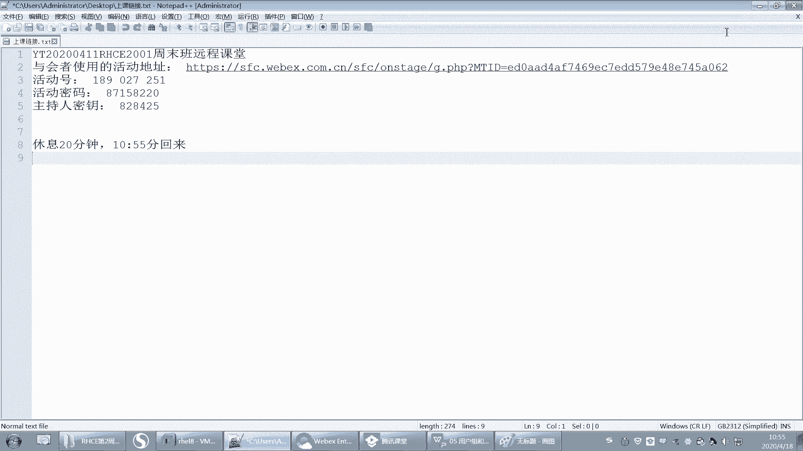

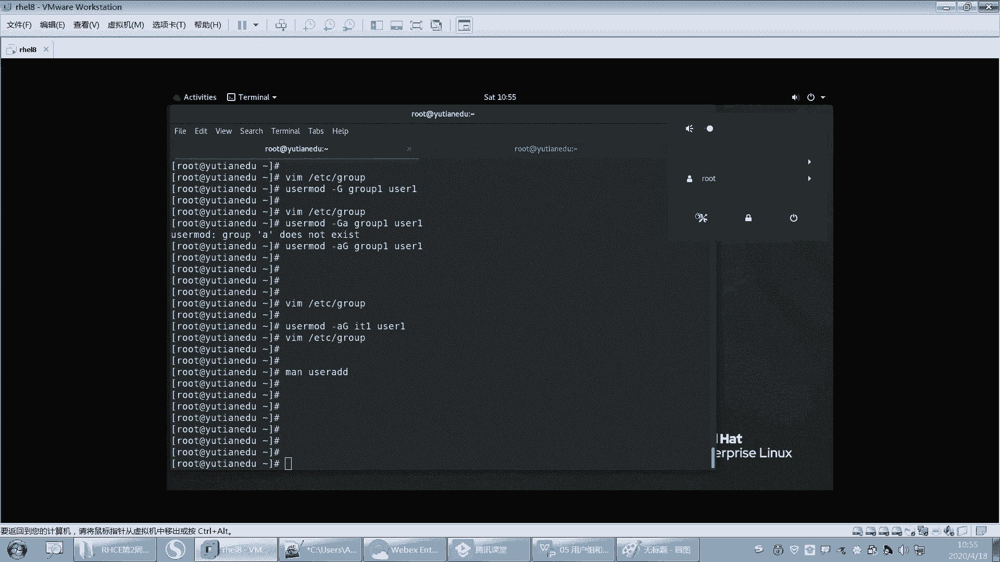

对。嗯嗯嗯。

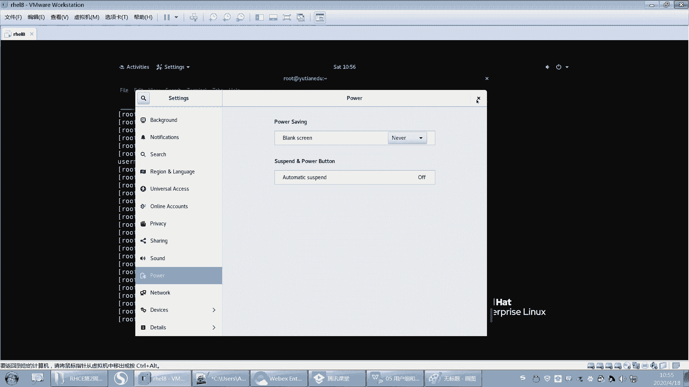

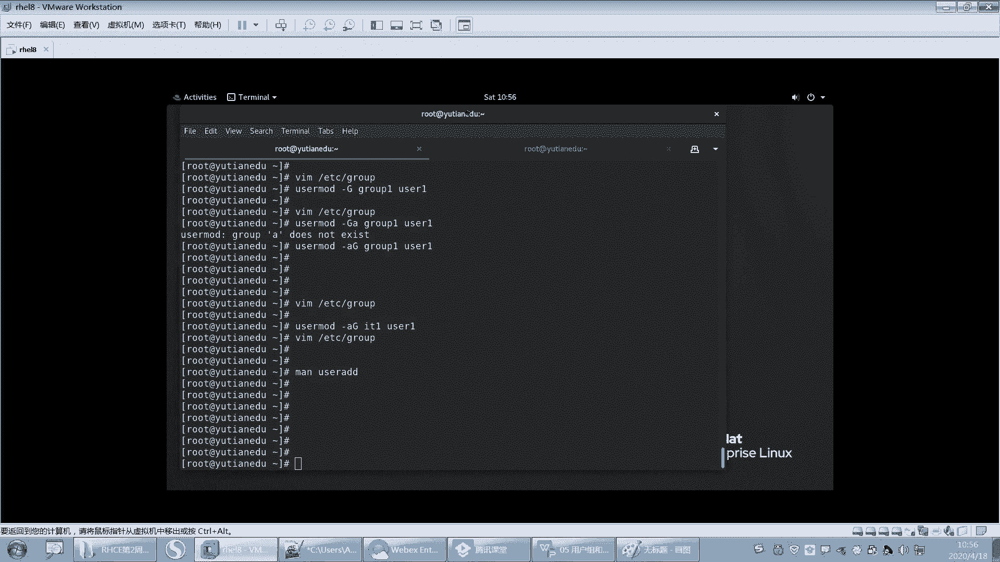

好，我们刚刚讲了，其实讲了用户还有组是吧，怎么修创建用户创建组，修改用户修改组。然后这个地方我呢呃把选项放在这儿，但是有很多例子呢，大家可以自己去记一下啊。然后我就就列两个例子不多。

大家嗯回去再根据你的这个麦帮助，还有根据我这个选项的描述来相互对照着看一下。然后组的话。呃，组的话这些参数我也给大家测过是吧？这个U啊G啊C呀。然后创建这些再创建组。

然后还有一些其他的其他的这个相关的命令，比如说user mode修改用户信息，对吧？啊，用法与这个user add类似的啊，然后追加一个附加组杠AG看到没有？后面你要接主的名字啊。啊，你还可以锁定用户。

那更大L可以锁定一个用户。什么叫锁定一个用户呢？比如说。

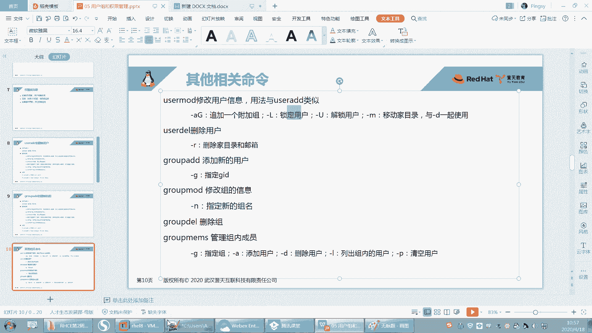

嗯。哦嗯嗯。摁错了。啊，锁定一个用户啊，比如说user mode就不想让这个用户登录了，让大Luser一是吧？这样的话就锁定这个用户了。比如说你还切到Uer一，那你这样切不行。

还是要用普通用户去切过去啊，然后切到user一。然后这样就登不进去了啊，这个用户就被锁定了。然后你要解锁。

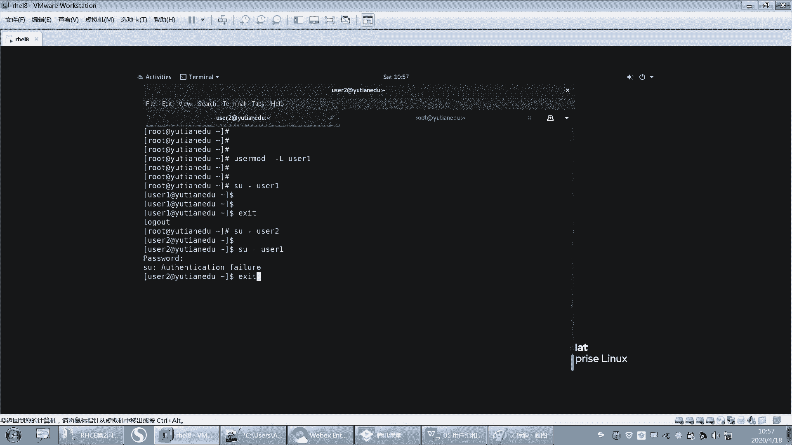

解锁你就可以杠。

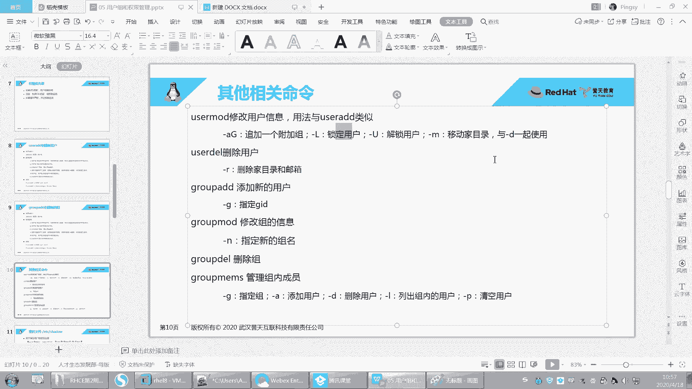

解锁是刚什么来着？哦杠大U是吧。这样解锁。切到柚子一，哎，柚子2有没有密码呀？我刚刚没有给user上设置密码是吧？好，这个你自己测一下去吧，呃，就是解锁，还有呃锁定，还是解锁啊。

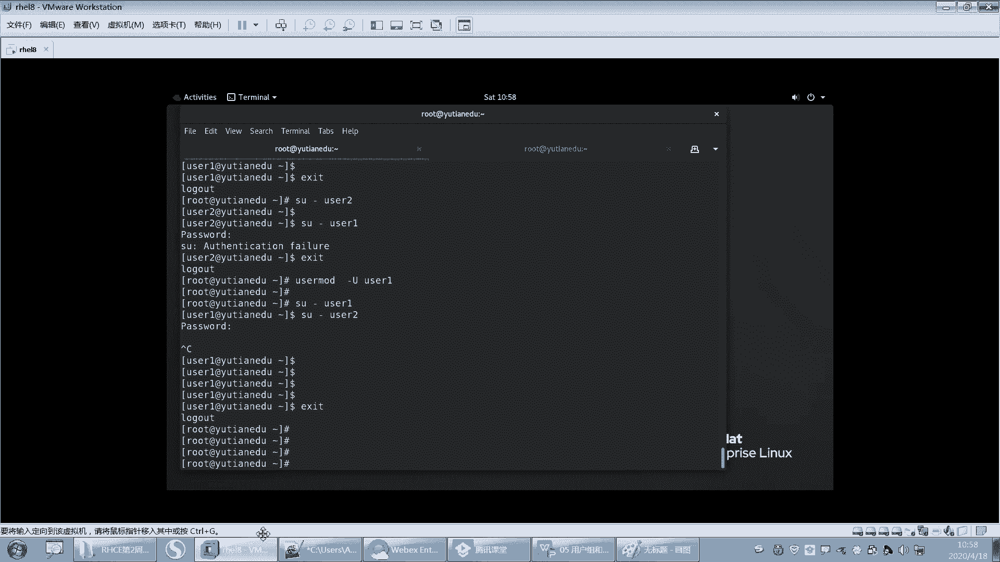

我就不测了，好吧。然后还有移动加目，这个到时候我会出一道题啊，这个你要看好呃，修改加目的时候要注意哪些啊？

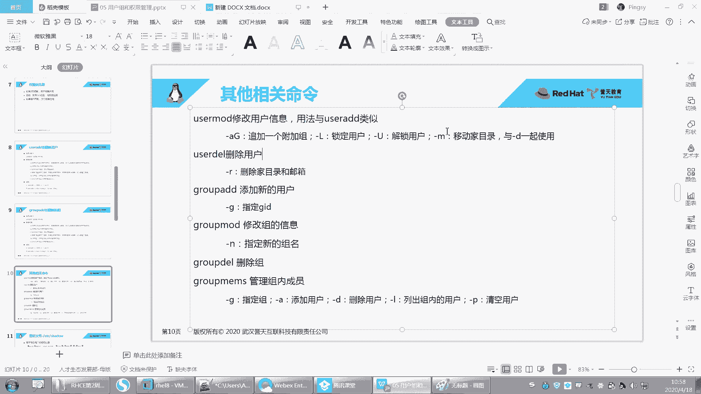

啊，第二个就是删除用户啊，这个我来跟大家说一下，删除用户。嗯，创建用户我们已经会了是吧？然后删除用户呢就us thedell。us theele来删除这个用户啊，我发现这还可以tableable键呢。

这用户名都tableable出来是吧那。好，那我删除一个用户叫user一。签了啊。足去。啊，这柚柚子一用户删掉了，我们来看一下啊，首先去到发索里面。Uer一看一下有没有了，Uer一没有了是吧？好。

然后组呢组还在不在呢？我们来看一下。足。有没有组是不是就没有了？对吧Uer一组也被删掉了，user一用户也被删掉了。好，那我们还知道有哪些是不是有还有用Uer一的加目录啊，对不对？啊。

U一的加目你发现怎么样了？没有删掉，U子一的加目是没有删掉的啊。然后我们来看一下。嗯。user一的加目录这个地方是没有删掉了，没有删掉之后，你会发现怎么样？呃，本来这个地方这个用户的拥有人和拥有组。

这里这里本来显示的是吧，是不是用户名跟组名啊，但是你把这个用户给删掉之后，这个地方是不是变成了UID和GID了，对不对？呃，因为你再写user一系统已经没有这个用户了。但是这个时候这个加目录留下来了。

那留下来总得这个地方显示个什么东西，对吧？所以显示的就是那个用户之前的UID和GID好，那么如果是这样的话啊，假如说我又创建了一个用户叫Uer一。那这个user一还是这个是原来这个user一吗？😡。

这个时候啊注意。这个user一还是不是原来这个userE？它就不一定了啊，只能说不一定啊，呃，为什么说不一定呢？因为要看这个user一是不是原来那个user一，要看什么。

要看你新创建的这个userE的UID是否等于1001，能理解吗？是否等于1001。如果等于1001，那么。怎么样啊？那这个这个这个这个新的用户就会继承这个文件了，就会成为这个文件的什么没有人了。啊。

如果不是的话，比如说你看我现在创建，我不指定吗？啊，新的user一多少？2023看到没有？新的U子一2023啊，它是不是原来那个U子一啊，不是啊，所以你再来看。这个地方是不是还是显示1111001。

还是显示的1001啊。看到没有？然后还会出现一系列的麻烦。那一系列的麻烦啊，你看啊我切到这个Uuser一好，就会报错。看到没有？就报错。他说他无法切换到这个用户权限拒绝啊。

permission叫权限deny叫拒绝的意思。好，怎么切到这个嗯什么权限拒绝了呢？啊，其实。就是因为啊。我本来是不是要进入到自己的加目，我加目在哪？user一的加目录在哪？我们可以看什么？

可以看这个pasword里面啊，你看它是不是要进入到home下面user一啊？但是home下的Uer移这个目录目前是不是我当前Uer机的目录？😡，已经不是了，因为它是什么2003。

而这个user一是什么？是上一个用户留下来的，他的拥有人，他的什么，他是UID是1001，你对他是没有权限的，你不能进入到别人的什么加目。所以这个时候。用户名虽然是同一个用户名，但是UID不一样。啊。

这是UID用UID来进行区分的啊，注意啊。好，那你再用这个用户就会一系列的报错。除非你把这个什么，除非你把这个user一的拥有人改成现在的user一拥有组改成现在user一的组。才才okK啊。好。

这就是删除目录的时候，为什么会把之前的。文件留下来呢，是因你在删的时候没有删干净。没有删干净啊，user de杠Ruser2，你看好啊，我把user2删掉，加杠R杠R是删除什么？注意还会删两个东西。

删删两个东西啊。第一个就是这个用户的加目录，加目录在这里，在user2在这个地方，对吧？还会删什么呢？还会删除这个用户的邮箱。这个用户的邮箱啊，那时候邮箱文件在哪？待会儿我带你去看啊。好，删了哟。好。

下在就后你再看有没有UZR了。没有usZR了，对吧？usZR这个用户被删掉了。好，邮箱在哪里？邮箱在was ball下面mail。看这里。啊，user一的邮箱为什么留下来了？是因为什么呀？

这是他的邮箱文件啊，就是到时候呃这个用户收邮件的时候，他的邮件都放在这个文件里面。啊，这是自默认就已经有的啊。好。那这个用户的，你看这个地方是变成1001，为什么？是因为这个拥有人没有了是吧？

拥有人被删掉了。10没有一个用户的UID是1001，所以显示的是之前遗留下来那个呃之前那个用户的UID啊。好，U子2的邮箱没有了，不见了，是因为我加了什么杠R。所以大家在今天学了用户组的时候。

你们在删用户处理用户的时候会出现各种各样的错误，会出现各种各样的问题。所以一定一定要清楚啊。好，大家把可以把这个杠R记一下啊啊，指的是删除加目录和邮箱好，那你说老师我每次怎么样？那这样的话。

我柚子一是没有权限去访问我这个这个文件了，对吧？因为它是之前的，那怎么办呢？那你说我手动，我就是忘记什么呀？我就是忘记删了。比如说啊。我user there，我就是忘记删了，对吧？然后杠呃没有加杠R。

就user4。就删了嘛，就忘了怎么办呢？怎么办？那你再创建一个用户叫user4，是不是就会报错了，对吧？就会出现各种问题。因为你在创建这个用户的时候。他就怎么样啊？他就会。创建加目录。

但是加目录是不是之前的加目录还因为会创建邮箱，邮箱是不是之前的邮箱那之前的邮箱都没有被删掉，因为你没有加杠R，所以这个时候怎么办了，只能怎么样手动去删。手动去删啊删删掉，这样的话就不会报错了啊。

那手动把它删掉，然后进入到这个one。Sll。啊，s下面mail下面啊，然后手动把这个文件给删掉就可以了。us4。好，这样就没有什么问题了。你再创建user斯。OK就不会报任何错误啊。会了吗？嗯。

再遇到这个问题怎么去解决啊？😊，啊，邮箱在哪里记下来啊，加目录在哪里记下来，以免你们后面。碰到了对吧？重复的去创建，删除一个用户，你就会出现这样的问题啊。好，此时我在创我在什么。

我在这个再切过去就不会报任何错误了，看到没有？

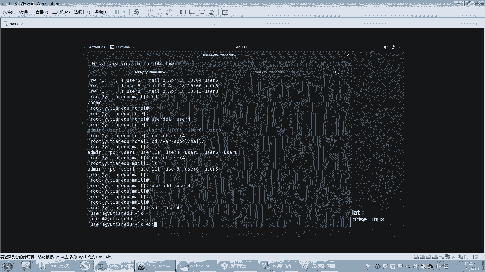

好了呃，那就是删除用户啊。然后这个。呃，这个group add这个这个讲过了是吧？哦，这个这个就讲过了，然后g mode唉组的名字也可以修改哟。呃，组的名字也可以修改啊，这个我就不不演示了啊。

作业里面布置啊，因为我不可能把所有选项给大它讲完。

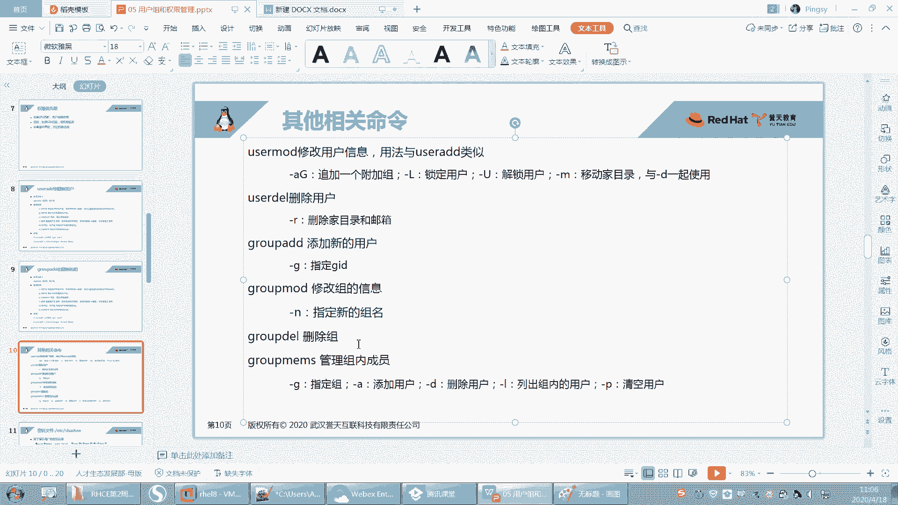

好，下面我们再来看一下，我们可删除用户了，我们还要会删除组。我们还要会去删除组啊，看好哦嗯删一个组呢。😊，这样吧，我们看一下有哪些组啊。好，先有这些组是吧，这些组。Ok。啊，我要删其中一个组。

比如说我要删group。呃，group style。呃，一则一组，你这样删我删不删掉呢？那。你看啊我我group there去删除这个user一组，它就报错，因为它不能去移除一个主组。

呃 ofuser一是吧？也就是说这个user一组是这个user一用户的primary叫主要的，其实就是主组，其实就是私有组。哎，primary就是私有组啊私有组的意思。啊。

因为这个组里面是不是有一个什么有一个用户叫U子一，而且这个用户呢。他这个组是这个用户的什么私有组，那你删了这个什么组之后，这个用户他就没有私有组了。所以其实不允许删的。如果里面有一个用嗯。

有一个用户是他的私呃那个呃有一个用户在这个组里面是吧？而且这个组是这个用户的私有组，那么这个组就删不标。😡，就删不掉啊。好，那我可以删什么组呢？比如说我删1个ITE组。啊，也删不掉哦，group一组。

哎，你看group一我是不是就可以删掉了？因为group一呢这个组里面没有任何用户，它不是任何用户的什么？呃，呃，不是哪一个用户的私有组，所以他可以删他可以删啊。OK。啊，那我再出一个题目考一考大家啊。

group bad。group add还是group一，好吧。然后我想把这个IT加入到谷一里面。就ITE这个用户，我不知道有没有ITE这个用户。IDuser一好，把user一加到group一里面啊。

或者把us二加的股数里面。好来加啊。嗯，于63。哦，U3U3吧啊，useer mode。us呃user mode是吧。

然后杠大GI呃group一注意group一里面是没有group一不是任何用户的这个私有组啊。那我只是单独去创建这个股主一，对吧？它里面没是现在没有任何用户啊，然后我又给他指了一个什么一个成员。

这个成员叫er3。也就是说user3呢怎么样啊，是在这个组里面了。看到没有？在这个组里面啊。好，那么请问现在这个组我能把它删掉吗？大家觉得我能不能把它删掉？直这样，我叫删呃group一。哎，这样是吧。

有同学说可以，有同学说不行，对吧？好，我刚我们刚刚试的是我删除这个组就删不掉。因为这个组里面有私有，他是别人的私有组，对吧？好，但是我不确定这个能不能删掉，我们删一下试试啊。好，删掉了没有啊？删掉了吧。

删掉了吧。所以怎么样啊，我这个组解散了，对不对？因为你的这个user3是不是有自己的私有组啊，那我这个组解散，你还不让我解散了？因为我我不是任何组了是吗？我不是任何用户的，说错了啊。

我不是任何用户的私有组。对，这个是可以解散的。但是我一旦是某一个用户的私有组了，那么就不能去删。😡，OK吧，因为我删了会对这个用户有有有影响。嗯，对，就这个意思啊。好，会上会会删了吧。

你说我们怎么删标啊，对吧？那就这个原因啊。😊。

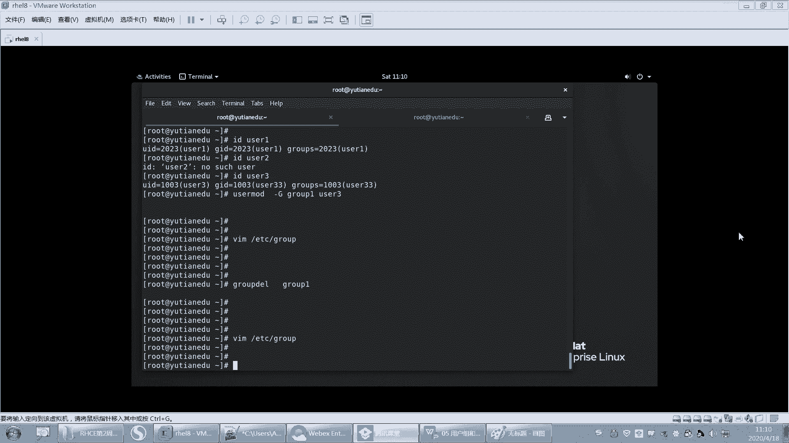

嗯，好。呃，这是删除组的时候啊啊，我们还有一个专门管理组成员的一个秘密叫group members，就管理这个组内的成员。啊，看好啊。

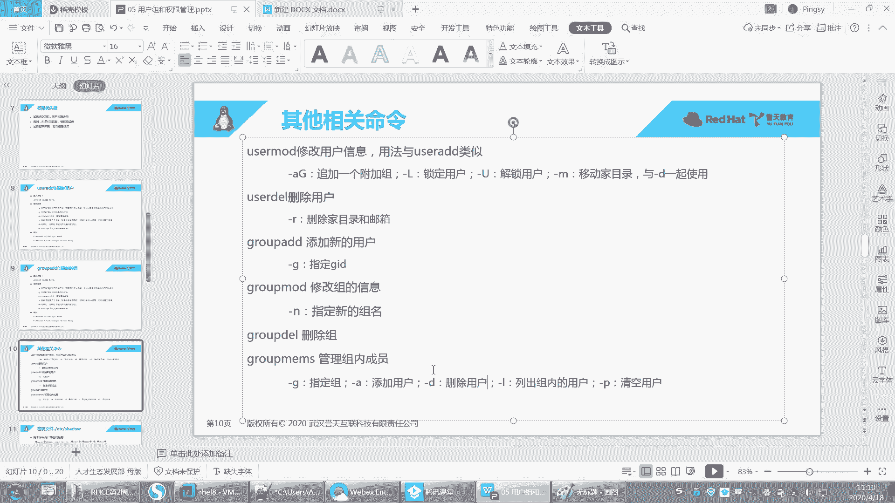

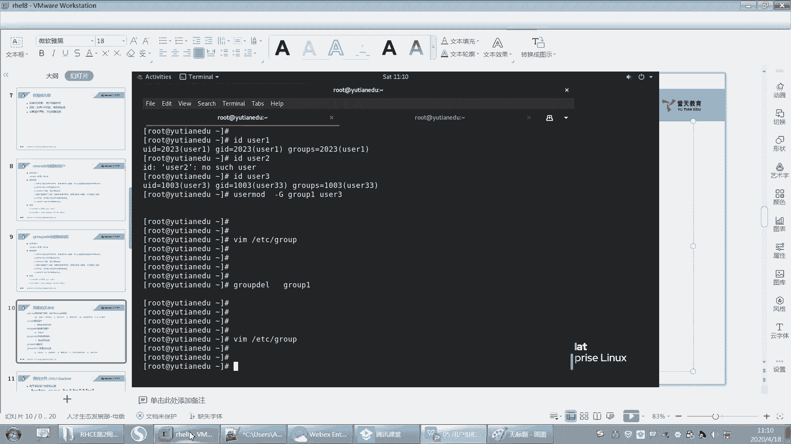

呃，我把这个组再创建出来啊。好。呃，现在有个组叫group一group一啊，然后我们用group。😊，呃，就专门管这个组的group members。你啊group members。

然后杠呃杠呃G指定哪个组指定指定user一呃指定group一这个组杠L可以列出这个组内有哪些成员，对吧？好，现在是没有是吧？那加呗，给他加一个啊。groupro members，然后杠G。

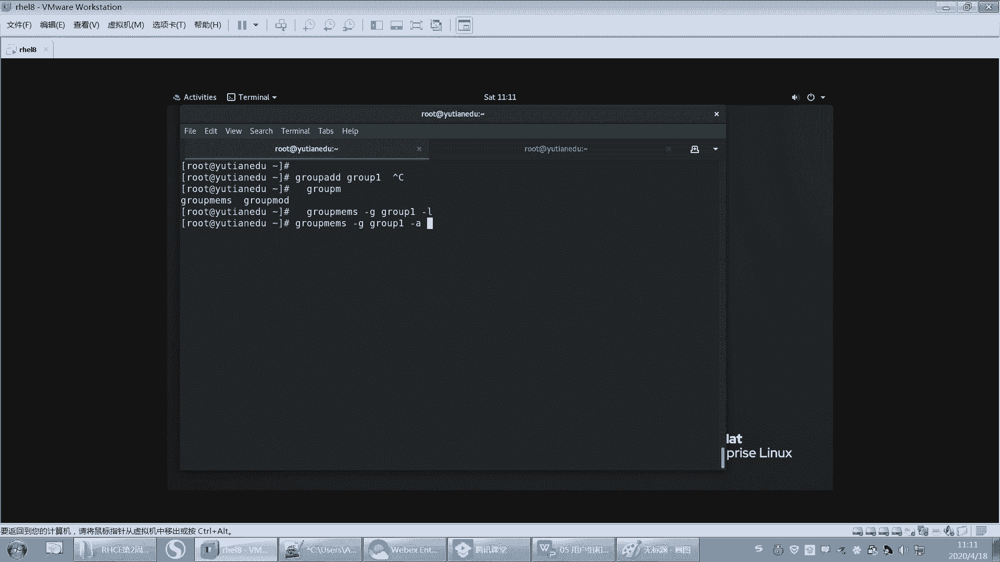

group一好，杠A呃杠U啊，杠A还是杠U啊。杠A吧。添加用户杠D删除用户杠L列出组内用户是吧？

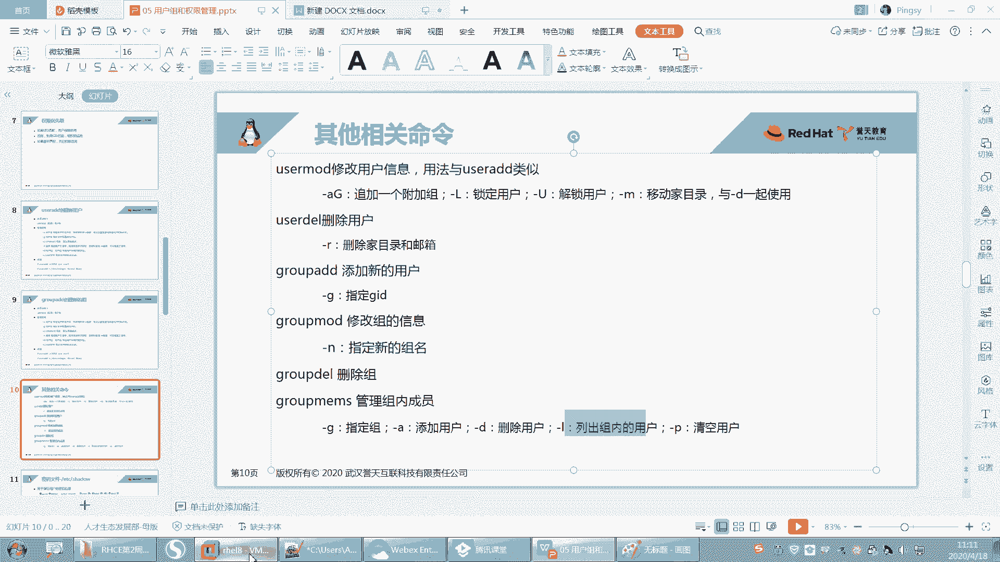

好，杠A添加个ususer3。呃，回去了这样U则3就加进来了。然后还有比如说U4啊。user5啊，好吧，就加进来了。好，那么这个时候我们列一下这个用这个组里面是不是有三个用户？

这个组里面就有三个用户了是吧？三个成员了啊，那就删除一个，嗯应该也会删吧。杠Duser5。这样是不是就删掉了，对吧？然后清空这个组，那你就。呃，把这个。杠P呃杠P。杠G股1杠P。清空。这样的话。

这个组里面就没有什么就没有呃成员了啊。哦，好，谢谢。我就刚刚本来穿多了有点热，讲课有点热，然后我就脱掉了。You。好，然后这个地方就是这个group members啊，这个命来管理组内的成员的啊。

组内成员的。呃，好像还有一个管组内成员的叫Gpaword吧，好像是这。我我记得好像。😔，那看到没有？🤧是吧然后添加删除。然后他可以指定。呃。这个组内的这个一系列的用户是吧？

呃设置一个什么什么list的列表。组的成员是吧，这个也是管组内成员的啊。他也可以管。嗯，对好呃，Gpassword是给组设置密码的一个命令。就是你看啊嗯Gpassword。然后user group1吧。

groupby。你看给组也可以设置密码。你看主线有密码了是吧？嗯，呢G password错给组设置密码。然后主现在有密码了的话。我们怎么用这个组呢？切到Uer一。换一个切到U423。唉，怎么都坏了？啊。

去待优则4。然后我想看啊，我当前我当前是哪个组啊，我当前是不是2004这个组啊，然后我的UID是2024，GID是2024。然后我想登录一个新的组，那我就new。第二批。扭机。嗯。

那这里有个叫newGIP的，看到没有？newGRP然后group一。回车输入密码。好，这样我就进来了，看到吗？我就你看我登录这个组，然后ID看一下。营养组都变了，它临时就是临时登录这个组，看到没有？

它就改变了我的什么。😡，成我我的GID都变了是吧，就把我的GID都变了，就临时登录这个组，临时登录这个组啊。啊，这叫newGIPPPT上没写啊，那自己记一下，就是给阻设密码叫G password的。

注意啊，给阻设密码叫Gpaword。然后登录组叫newGRP登录组叫newGRP啊。啊，如果组内有一个成员的私有组的股宾，那不能清空，我说清空这个成员吗清不掉。如果私有组清不掉啊，只有成员才可以清掉。

嗯。你清掉的话，他就没有那个用户就没有私U组吧。OK吧。啊，就像我这样说的话，呃，如果你是group嗯group members是吧？然后你杠G。就是就是临时成为这个组，其实有什么用呢？

好像就是呃这个你想临时加入到这个组里面，就是说呃因为组会有组的权限嘛，如果你就别人不想让你一直待在这个组里面。那也不想把你加进来，对吧？只是临时让你去加入，那你就可以给可以让他临时加进来。然后。

因为你加进来之后，你发现你的GID都变了。看到没有？对吧它只是临时的，你你进来之后，那你就有这个组织权限了，就这样就这个登录组。你看U的4。对吧你看它列不出那个user4组里面。

就列不出user4这个用户嘛，所以他管理的并不是这个什么，它管理的它不包括user4啊。可以把前前一同学。它不包括有的是。嗯。

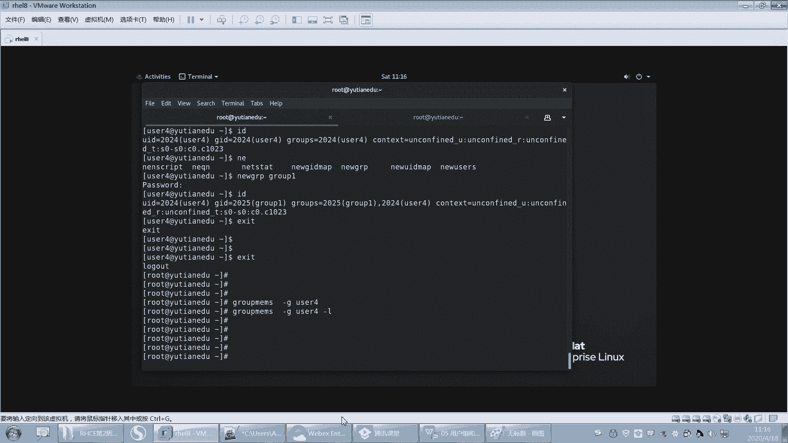

嗯，好。

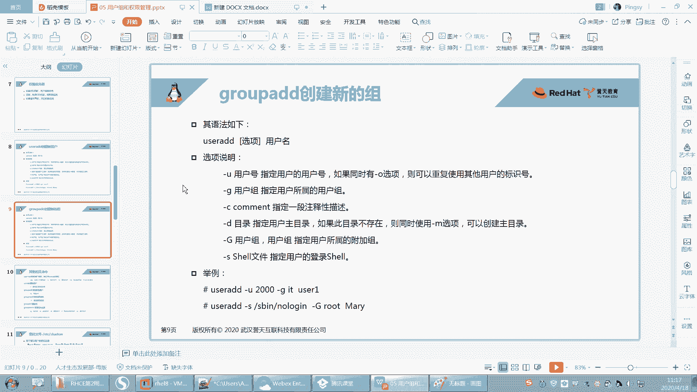

O呃，那这个就是我们关于用户组的一些相关的命令。