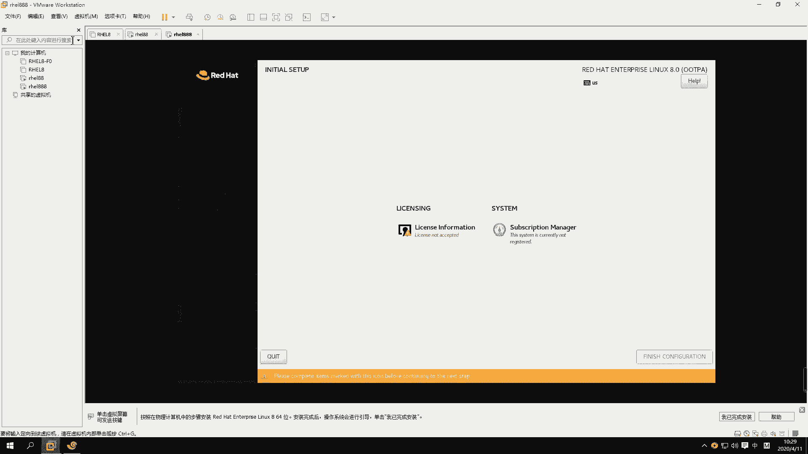

# 【重置详解版】孙老师讲红帽系列视频／RHEL 8.0 入门／红帽认证／RHCE／Linux基础教程 - P1：01 开班介绍和红帽认证 - 誉天孙老师 - BV1aB4y1w7Wi

这个这个马赛克的话，他可能是因为网不好什么之类的，它就显示不掉对，然后我把它放在一边去，好吧嗯我没我没办法去掉它，这个，好那我们开始上课啊，在开始上课之前呢，我还是来做一个这个这样的自我介绍啊。

嗯首先是誉天的介绍，誉天介绍我就不多说了，因为这个大家应该也之前报了班的话，应该也是听过的嗯，然后我们各个校区哦，我们各个校区都是有招人的，就是说咱们学生可能呃不全是五湖北的对吧，那可能是北京的。

广东的，浙江的，湖南的，这边都都有可能有哦，学生那到时候嗯关于考试的话，你们可以自己去选，比如说我在湖北考，在武汉考的话，那么在武汉考的好处是什么呢，就是说我们每次结班了就会考考试，接班了啊。

就会安排考试，那在其他的校区呢，呃如果去考试的话，呃，要听这个当地的这个教务的安排，他们给大家安排考场，这个大家也可以去联系这个孙老师，自己要主动一点啊，跟孙老师去联系一下，你说我要在我想在哪里。

哪里考，什么时间可以考，有哪个考场啊，先开放对吧等等啊，这些大家可以去联系我们教务老师啊，可以直接找小老师啊，所以我们呃咱班同学呢我看了一下呃，加上重庆的应该有100多人啊，嗯也是第一个红包8。

0的这个班呃，我们也是比较有缘分来聚在这个地方，所以我刚刚一直在群里给大家再去说，大家改备注改备注啊，为什么呢，因为我发现啊，从我上一个呃，因为我我们去上这个腾讯腾讯课堂，腾讯课堂第一次是上个班。

上个班是第一次，全部都是在腾讯课堂上，我发现我上完这个班之后，绝大多数同学我都不知道谁是谁，也不知道叫什么，我就我就只能记住那么几个，所以呃我我在后面啊，大家进来聊天或者怎么样，我都会去检查啊。

嗯这个一定要去把自己的备注改成自己的名字，这里有三个同学啊，WIFX同学我可以直接驱逐的，看到没有，那直接驱逐啊，看看不到你的名字，我就直接驱逐掉了，还有这里还有拼音的名字进来的。

这些我都可以直接去除掉啊，好WIFX同学把它改过来，然后腾讯课堂的同学呢改的话，就在那个呃下课去找一下啊，在网页那个备注上面，还有app都可以改，这个大家相信大家对，相信大家可以做得到的啊。

O所以我希望啊不仅仅是我来认识大家，而是大家商会也要认识嗯，这个班结束了之后对吧，你谁都不认识你，你偷偷的来学，这有什么好偷偷来学呢对吧，这就是光明正大的来学习啊，那光明正大的交朋友对。

所以呢我们要正大光明一些啊，嗯下面的是我一个这样的自我介绍啊，呃我我叫孙亚萍啊，呃相信已经有一部分同学已经知道我叫什么了，对吧，已经对我比较熟悉了，还有一部分同学可能之前也是没有接触过，第一次。

可能第一次上午的课，嗯那就是我之前获得一些证书，这个证书不能说明什么，但是嗯它主要显示我现在呢可以，现在从事我们誉天两个方向的啊，主要是两个方向，一个纯红帽的啊，红帽方向的嗯。

然后现在这个C1般呢一直是我来我我在带啊，以及大数据方向的话，大家如果有需求的话，也可以跟我这边联系啊，嗯我可以啊，如果我解决不了，我可以去联系相关的老师，来帮大家去解决这个问题，好嗯。

啊今天呢我们差不多09：30了对吧，我们今天呢嗯主要是先相互认识一下呃，也没办法自我介绍了，我只能自己自己介绍了，那大家大家相互之间可能也没办法去认识，大家可以去多以后聊天呢，嗯感觉自己的名字啊对吧。

这样就认识了啊，好，我们今天上午主要是要把这个，大家这个情况介绍清楚啊，比如说我们学这个LINUX系统，我们学的是什么对吧，以及我们考这个红帽认证嗯的一些基本介绍，因为学过就是很多同学可能报名了。

可能还不太清楚嗯这个认证是怎么回事，LINUX系统是怎么回事，对吧好，剩下有时间的话，我们把这个系统装起来，大家可以，现在如果还没有，就是呃把那个温more workstation装好的同学。

把那个one more workstation装好，就是那个昨天发到群里那个软件装好就可以了，ISO的话当然很大，六点几个G，这个你们提前要去下好啊，所以有的同学上午跟我一起把系统装好，把系统装好啊。

呃因为很多同学呃后面连系统都不还不会装，这个我就有点那个了啊，好O那么我们来看一下啊，我们LINUX是什么啊，LINUX是什么呃，LINUX呢它是一个你，好这样吧，我们我先提一下我的要求啊。

我在这里我先提一下我的上课要求啊，好，我在这里放给大家写了几点要求嗯，希望大家都能够去遵守啊，希望大家可以去遵守啊，第一个呢就是要空杯心态啊，空杯心态，因为我这个把它放在第一个了，给我把它放在了第一点。

为什么呢，因为咱们班嗯有很多同学是有一点点基础的，就是之前我学过LINUX，但是呢他觉得哎呀这个简这个简单的哦，不去练对吧，嗯那个哎呀瞧不上这个瞧不上你的，你来这里来学习对吧。

你就要抱着你之前诶我完全没有学过的心态，否则你就会眼高手低，最终你可能比那些什么呀，他之前没有基础的人，还没有他们学的好，所以一定一定要把自己的心态放低啊，我们一切从零开始啊，一切从零开始。

其实我们从这里，我们班有很多从零开始的那个从零，真的就是真的是从零啊，不仅仅是从零，而且还是从负的开始，为什么是重复的，因为它是转行过来的，很多学呃，有有一些学员是转行过来的。

比如说呃我们班以前有很多那种，还有搞健身的，还有学那个什么财务的呃，还要学什么编导专业就搞搞就做导演，导演对吧，做导演那种，还有呃反正很很多，真的很多还学什么其他的很什么对，还是学文学的。

文艺的完了非常多，所以呢嗯这些学同学啊，你们也不要灰心啊，也不要灰心，嗯其实这个我们说实说实在的啊，我们LINUX这门课它并不是一个基础课程了，其实他真的不是一个基础课程，为什么这么说呢。

它其实是建立在很多的基础之上，为什么要建立的很多很多基础之上呢，比如说啊嗯我我去呃，就是你可能要具备相应的计算机基础知识，计算机基础知识啊，然后还有一些要具备硬件知识呃，硬件知识。

还有一些就是呃算法知识，或者是数据库知识等等啊，可能都要去具备啊，特别是硬件知识跟计算机基础知识这两个啊，呃我后面会发一些相关，可能发一些相关的资料，大家可以去看一下，其实就是大学的一些书本。

你们如果没有学过计算机的啊，一定要去补补充一下计算机基础知识，所以如果你在这个学习当中，尽管只有两到三个月的基础而时间，但是如果你真的认认真去学习，认真去扩展了的话，那么你这个几个月的收获将是非常大的。

所以我希望大家即使你不懂没关系啊，你可能我上课的地方听懂，因为我没有接触过对吧，但是我们也不可能把计算机基础知识，给大家讲一遍，所以一定要回去补充，补充完了回来再来看，再来看我们的视频，再来去做题。

不懂的再去问，我们今天特地找了一个老师呃，杨峰老师啊，和我一起来帮助大家去学习，所以大家根本不用担心啊，只要你肯去学，我们就愿意去帮助大家，所以你一定要相信自己啊，相信自己。

因为有很多同学他学到一半他就学崩溃了，他说老师太难了，我真的学不下去了，我说不可以，你要坚持，可能我现在做不出来对吧，因为我的心态可能崩了，那可能诶改天我去吃一顿好的对吧，休息一下，放松一下。

第二天思路就清晰了对吧，这个东西吧你理顺了你就学会了，所以他是慢慢的要给自己增加信心啊，所以刚开始时，大家一定要抱着一个空杯的心态啊，空杯心态，然后从零开始一定一定要这样啊，包括重庆的同学也是这样。

既然你在重听了对吧，那我可能要学到更好的知识，可能之前重复的同学我只学过一遍，但是这一遍往往是不够的，能理解吗，你学一遍其实是不够，你可能要学个两遍三遍对吧啊，既然你来学了，那你就认真去学。

认真再去把它从头到尾梳理一遍，这样的话你会有不同的认识，叫温故而知新啊，温故而知心好，你再去补充一下相关的知识点啊，那么第二点呢就是保证出勤啊，我的这个，啊这个，这个两个上课就是不方便啊。

好第二个就是保证出勤嗯，这个出勤的话我特地给大家强调，你可以重听，你可以去回去看录播，但是你知道人它是有惰性的人，一旦中断了之后，他很难再去找到那种感觉，然后回归到我们每周来上课的那种状态。

所以一定一定要记住我今天说的话，每周能来上课就来上课，不要因为说我今天要去陪女朋友，我第二我这天要去什么，坐火车，去哪个地方玩对吧，那你如果三天两头两三天，什么什么什么什么打那个晒网是吧。

那什么来着那句话，所以你一旦中断了之后，你很难再回归到这个这个这个这个这个上面，所以大家一定要，而且你们要相互之间啊，三天打鱼两天晒网，谢谢谢谢啊，所以你们一定要坚持啊。

坚持你不坚持的后果是你要学习的时间会更长，比如说这个班你跟到一半没有跟下去，你下个班再怎么样再来跟的话，你又要从头开始，这个是说实在，因为我带了这么多学生，一个班从头到尾每天都在学习，跟完的。

他这个班跟完就去学下一个知识点了，去学另外的技术去了，但是有一些学生他特别熟的，我对他就觉得啊老师你的声音好听对吧，我就想跟着你，结果他跟了我好几个班，对跟了我好几个班，跟了我将近快一年了是吧。

我说你是真的舍不得我呀，所以你花费的时间是更长的啊，所以你要忍痛割爱对吧，学完这个班赶紧去找别的老师去学，真的有更新严真的有啊，他就是不停的反复的跟她，就是我我我我过段时间他又回来。

就前年或者是什么又回来，又要跟着上班，又要跟着上课啊，所以呢大家一定一定要啊，好像就是说的WIFX是吧，呵呵对，所以你就一次性坚持到底，学完就好了，对学完就好了啊，大家一定要坚持视频，陶陶同学啊。

你这个兼职你这个时间有点太长了，陶同学我批评啊，就是从去年的，是从去年还是什么时候开始跟的啊，一直跟到我今年对吧，我就知道你舍不得我，所以天天OK所以大家一定要保证输出勤啊，保证出勤啊。

每个每周呃都来上课啊，每周都来上课呃，如果你们不来上课，第一你们自己的损失，第二我的心情也很失落，因为我呢感觉自己哎没把你们带好对吧，没让你们跟着我去上课啊，所以我自己心情也很失落好，然后保证出勤。

第三课堂笔记啊，对大家的这个要求是要做课堂笔记，所以呃微信号可以去微信群里去找我啊，嗯你认识我的名字，你就可以找到我课堂笔记所有人的嗯，这个嗯所有人的，这个这个这个课堂笔记都要有呃，呃提两点要求啊。

要么是电子版的，要么是纸质版的，电子版和纸质版，你二选一，OK电子版的好处是它可以永久保存啊，可以随时翻出来看，我建议大家去用电子版，但是老是呃我我就喜欢用纸质版的对吧，可以你可以用去用纸质版的嗯。

这个也可以啊，因为之前有同学他就是喜欢用写对，基本就喜欢写写下来嘛，对吧啊，这个你自己去选好不好，你自己去选啊，所以后面的话我会随时去抽查，大家的这个笔记对，所以去抽查大家的笔记啊，一定要有。

而且上课的话我会给大家去做这样的呃，今年啊这个班我准备改变策略了啊，因为我对大家太好，反而是害了你们啊，你们就那个，但是我会做好我自己的工作，我们我们会有PPT，我们会有实验手册。

但是大家上课最好能去随时去做笔记，我会给大家时间去做，所以大家这个大家不用担心，OK啊，你自己去选择一个有的有有道云笔记啊，或者是one note呀，或者是这些都可以啊，画思维导图用charm都可以。

我们之前有个同学画了个思维导图，把三本书画了个思维导图呃，非常棒，然后他就把这个关系全部理顺了，这个需要大家自己去做，我没办法帮大家做啊，然后课堂笔记一定要有，所有的同学啊都要去准备，OK吧。

呃你今天没有，那你今天晚上买或者是一定要买啊，下周绝对要有啊，呃再就是第四点要做，要做这个课后作业啊，课后作业，课后作业，是这样的，我不是小学老师，我也不是那个幼儿园的呃，初中高中老师啊。

我布置这个作业，你自己想做就做，不想做就算了，我不勉强大家，我还是那句话啊，我把话说在前面嗯，你不要觉得是我天天逼着你去做的啊，我没有逼着你啊，愿意做的同学就去做，不愿意做就算了啊，我没有逼着你啊。

你不做的，你不做的后果是什么啊，第一如果你不做作业的话，你的你就跟不上进度，你基本上是跟不上进度的，能理解吗，我们这周学了之后，你光听没有用，听完之后左耳朵听右耳朵就就就就就出去了啊，就相当于没有学。

相当于没有学啊，所以比呃这个作业一定要做啊，作业一定要做，而且要按时交作业啊，大家不要去偷懒，每次就到有些同学每次就到那个上课的前一天，或者上课的那个晚上，然后给我发作业，呃，当然你可以给我发。

你没有时间做对吧，嗯但是我希望你能提前一点，因为这样的话我有时间去帮大家看哦，我跟杨峰老师可以帮大家去看，如果你教的太晚，我就可能没有时间顾不上你了，因为我我们也有其他的事情，我不是天天围绕着你转。

对吧啊这个发邮件，这个这个这个要求，我明天布置作业的时候，我会给大家说啊，怎么去交这个作业，OK吧，所以我希望能够我们我们我跟杨帆老师一起，来协助大家啊，把这个课后作业做好，嗯大家尽量多去练，多去实践。

就是下面这句话啊，叫理论加实践，我比较注重理论来注重理论啊，理论可以指导实践对吧，你如果只有实践，那你可以完全不用去报这个班，你可以直接去上网上去搜索一些那个呃，一些步骤去操作一下就行了。

呃理论不清楚的哦，我给大家解释，如果还是不清楚或者欠欠缺一些的话，去补相关的知识点，补相关的知识点补什么，你们要去找啊，我跟大家去做一个指引，你们要去会会去找啊，所以就是这个理论加这个实践。

然后后面呢最后就是啊跟大家说的这个，嗯实名的这个信息啊，呃今天呢很多很多这个同学，都把这个腾讯课堂的这个呃已经失明了，非常棒啊，呃我就喜欢这样的学生啊，嗯要说那种呃天天让你改改备注的。

他就是死活就不愿改，对死活就不哦，sorry写错了啊，腾讯课堂好，y bx上面也要实名啊，y bx上面也要实名，OK吧，还是那句话啊，不要偷偷的学，要光明正大的学啊，还有QQ跟微信，最好也要实名。

QQ和微信，因为这是我们聊天的一个工具，嗯之前有个同学一直用昵称，我到现在为止我都不知道叫什么哦，真的到现在为止不知道它叫什么，跟了我学习了很久啊，嗯他叫什么名字我不知道，嗯可能孙老师知道。

反正我是不知道，而且同学之间也不知道他叫什么，从到尾学到晚，学完之后哦，我跟你说实名有什么好处啊，实名有什么好处，第一呢大家以后都在一个圈子里，你你确实是在一个圈子里啊，你在一个圈子里。

你以后要去找工作，比如说啊嗯找工作，你可能就是呃呃比如说啊，或者是以后碰到了对吧，那么哎我们之前我好像知道你的名字哦对吧，你的名字诶，你是不是那个我们2020年4月11号，那个班的呀。

嗯是不是那个那那几个月那个班的呀，对吧，对我们是一起学过HC1的呀，对吧哦曾经同今年同也没有同窗过啊，同窗过呀，没有同桌过是吧，所以这种对大家都是有益处的，并不是害处啊，你这个你要清楚呃。

有很多同学其他都很神秘，他都很很很自觉，但是有些同学从头到尾都是一个什么备注，那个看着很头疼啊，很头疼，你是有多见不得人啊，对也是有多见不得人，所以呢大家一定要把自己的微信跟QQ。

腾讯课堂WEBX全部实名以后，要是被我看到了啊，我会一直爱着你啊，可爱得到你，这个不好意思啊，啊除非你说老师我就不来上课，我就不我就不那个怎么样对吧，那我也管不了你了，那没办法啊。

OK所以我希望我们能够相互配合啊，如果你们不配合我，那就我也会不开心对吧，然后我们我们之后的这个日子也不好过啊，OK啊所以你看你对吧，你你们之间都会找到这个，你们都是以后都是一个圈子里的人。

都会相互帮忙的啊，相互帮助的，谁也分不开谁对，谁也离不开谁对吧，说不定以后对吧，一个工作介绍过去哇，这个这就是什么，这就是这个嗯你的圈子啊，人际关系呃，在做技术这一行，其实人际也是非常重要的。

嗯你技术再好，你没有这个人际关系对吧，你搞不好，那你可能将来对吧，你有没有更多的机会啊，好这个我就不多废话了啊，我花了大概这么长时间来跟大家说这个，因为我不想再在后面不停的给大家去重复，重复重复嗯。

不想再去说这些废话了啊，因为我们后面时间很宝贵，所以大家要自觉啊，要自觉，OK吧好嗯，这个是我们这个C1的学习方法啊，跟大家稍微做了一个这样的介绍，希望我们后面能够合作愉快啊，好嗯。

另外呢我再跟大家说一下啊，大家来学习的话呃有部分同学是需要考证的，嗯是需要考证的，我需要把这个考证的这个第一节课，我会跟大家说啊，就是第一节课我会给大家每次都介绍一下，这个考证。

另外呃在上课中中途我就不会说了，直到最后一次集训，我才会跟大家说这个考试这个需求啊，所以中间你也不需要去问我了，嗯然后我也不会上课说的啊，呃呃我们报名的我们是RHC，一是这个中级课程。

我们叫红帽认证工程师，嗯红帽认证工程师啊，然后呢他还有一个带一个初级课程，叫rh cs a rh cs a啊，叫红帽系统管理员，红帽系统管理员啊，嗯你报了HC1其实就包含了HCC。

所以我们是从HCC开始上课，然后到HC1啊，到HC1好，那我们HCC和HC都学什么呢，rh cs a啊，它里面大家会拿到两本教材，一个是UR4，它叫RHER4和一个RH134。

这两本教材我们注意我们现在是八啊，红毛八，这两本教材呢就是这个是就是两本初级的教材，对两本初级的教材啊，呃主要是第一本书主要是实验什么啊，就这这里啊呃什么用户啊，权限啊啊管理啊，基本操作呀。

基本命令的操作使用啊，网络配置啊等等啊，第二本书主要是关于磁盘啊，管理啊，安全啊，存储啊等等啊，就是排错呀，故障排错呀等等都是在第二本书，第二本书里面，所以你第一本书第二本书太重要了，非常重要啊。

你不要忽略，觉得哎呀我上来直接就学这个初级不重视是吧，初级没学好，我跟你说，在后面你要干别的事情，你这个嗯你要去再去学习其他的，这个你就学不好的啊，基础没打牢，所以前面的课程非常重要啊，不要看它简单。

但是它也不简单，入门还是有点难的啊，好这是我们这个HCC要学的内容，HC要学什么呢，HC有一本书叫RH294，呃呃RH294呃，RH294跟红帽七呃，发这是最区别最大的地方啊。

呃红毛七呢第三本书是RH254，是这本书R区叫红帽吗，哦红帽所有的基础课程都是什么，RH开头的是个编号，是个编号啊，嗯然后这个R曲叫红帽二，254是红帽七的课程叫254，那红帽八叫什么呢。

红帽加叫红帽八，叫294，254，主要是学各种服务呃，服务的搭建，比如说之前有同学学过问过就三吧，什么NS啊，还有什么HTTP啊，就是一些这样的服务的配置啊，嗯然后但是红王八改版了改版了啊。

改成了这个294，294主要是学ANSIBLE叫自动化运维，自动化运维啊，呃300NMS我们可能不会重点去讲，但是相对于HTP常用的服务，我们还是会讲，嗯可能还是会讲啊，但是不会讲那么深入。

因为时间可能有限，但是如果时间长的话，我会给大家补充一下这样的知识点啊，那么294学习ANSIBLE，这个ANSIBLE叫什么叫自动化运维啊，对自动化运维呃，我们294学自动化。

以为所294的考试就是我们考试也是考两门，一个是RHCCA，一个是RHC1这两门啊，那RHC1呢就全部就考angel，全部考ANGEABLE，用ANCIBLE来去实现啊，DNS跟band估计讲不了了啊。

嗯看时间好吧，嗯这是红毛期的内容好，那么安吉宝他是怎么，他是怎么考的呢，他就是在一台有一台机器，这台机器呢嗯所有的秘密都在这台机器上面，然后他嗯可以控制其他的N多台机器对吧。

然后嗯考试就在这一台机器上面做，然后把其他的机器呢，就是到时候你在这个上面去实现，然后其他的机器上面去部署一些服务啊，等等都可以用的angel去实验啊，大概是这样子啊，那rh cs a他要考两门吗。

一个是两门都要考啊，就两门都要考啊，你考了HCC再考HC，这个一般是上午考，这个一般是下午考对，就会考一天，这样子啊，考一天哦，满分都是300分吗，满分都是300分，你要考210分，210分过对。

210分过啊，考过一门哪一个证书对，都是实验，都是实操，没有理论啊，也没有面试，都是实操呃，呃大概是这样子啊，这是我们的考试啊，这是我们的考试，其他的话看大家这块还有什么问题吗。

这个基本上就是我们考试考试的话，你一般两门都是我们这边两门都是一起考的，没有分开考，就是你说我只想考RHCC，我们不提供这样的啊，我们两个都是一起考的啊，你rh cs你说我没考过对吧。

你说呃另外哈还有这个重考的，比如说有同学说老师我期考过了是吧，然后我来考八嗯，只需要考HC就可以了，不需要考HCC呃，你要只考八的话，那八就要考rh cs和HC两个都要考，两个都要考。

而且两门都要通过才可以拿到HC1的证书，有一门挂了，比如说我们RHCC挂了，RHC1的证书是拿不到的，但是RHC的成绩可以保留，也就是说你下次再把它重考一遍，他们就可以拿到HC1的证书了啊。

就是这个意思啊好吧，所以而且考试费也不便宜啊，这个反正我觉得我觉得是不便宜，大家觉得3000多3000多吧，好像3400块钱是吧，上午是1000多，下午是2000多对，上午1000多，下午2000多啊。

嗯所以1000多就够吃几个大餐了是吧，所以大家要既然决定考就好好学啊，呃HCHC是吧，HC呢是红帽认证架构师，嗯叫红帽认证架构师啊，A呢叫架构的意思啊，架构师，那红帽认证架构师呢它是这样的呃。

红帽呢它出了一系列的课程，对出了一系列的课程，他那个课程有很多十多门十多门课程啊，啊关于HCA的呃，但是他考试如果你想拿到HCA的证书，你只需要考五门就可以了，五门就是你考通过其中的任何五门。

你就可以拿到RHCA的证书了啊，比如说我们誉天挑选的五门，比如说啊你报誉天跟报其他的这个机构，它可能是五门课程是不一样的啊，那我们一天的五门课程呢，呃就是呃是是哪五门来着，呃什么虚拟化的对吧。

对虚拟化的还有云的open stg是吧，虚拟化就是KBM嘛对吧，然后还有云的，还有什么调优的性能调优的，还有这个嗯还有什么还有一些OPENSHIFT呀，反正大概是五门这样子哦，哦对还有分布式存储存储。

分布式存储嗯，还有我们好像有个ENSABLE的高级运维，就高级运维，当然还有一个open shift，就是容器的嗯，还可以送，还就我们还送多口跟KEBAK8S嘛对吧，我们是这个是送的。

所以呃我们如果誉天开了，比如说开了六门课程对吧，或者开了七门课程这样子，那大家都可以来去学习，也就是说嗯你可以选择其中五门考，但是你都是可以学习的啊，就是学习都是可以学习的，但是你你就说你可以选五门考。

你说老师我就想考七门，可不可以，就想考全部考了，可以你可以考对，那么你每考一门呢，它就有一个证书，就是说哦你考个虚拟化，就有个虚拟化的证书，你考个云，你就有个云的证书，你考个性能调优。

就有个性能调优的证书，也就是说它每门都有一个证书对，就是你考了五门就拿，可以拿到，集齐五门就可以拿到一个rh ca的证书，对你再加一门，你就是RHC1级，再加一门就是RHC2级对，就是你可以对吧。

一直往上加呃，所以这个你最终拿不到RHC的证书也没关系，就其中拿到其中的什么啊，几个证书，这也是有价值的啊，也是有价值的，这就是我们rh ca对啊，不是最高，没有上限，你把他所有的课程对。

你把所有的课程都学完啊，没有上限啊，没有上线，对没有上限，他的课程是没有上限的，就是你有多少有多少就学，你能学，你能去就有多少，你能考多少啊，但是你考五门就可以拿到一个，r h ca的证书了啊。

就这样子还有什么考试费，当然你考一门就要交一门的，这个就是你考一门就要交一门的，这个这个这个呃钱嗯，考一门就交一门的钱啊，就这个样子，考五门就交五门的钱，考六门就交六门的钱，你可以一门一门的教。

这个也嗯这个看你自己好吧，一门一门现在多少钱啊，因为我我不记，我不记得，我记不太清了，这个你可以跟你的那个咨询老师问一下，我估计应该是3000块钱左右吧，对你可以找你的这个肖老师或者咨询老师，问一下。

这个他们知道价钱应该是大概是3000左右，大概啊我只是说大概，好吧嗯看大家还这个还有什么问题吗，哦证书有效期对吧，呃C是没有有效期的，ca是没有有效期的啊，就是RHC是没有有效期的。

那RHC1是有效期的，RHC的有效期是是是是两年还是3年，就是你HC你为你考了RHC1，才能拿到rh ca的证书，对就是你你考了RHC1才能拿到RHC的证书，那你说老师我不考HC1，能不能去考HC呢。

可以去考，但是拿不到RHC的证书，就是HC的证书是拿不到的，所以你的RHC没有过有效期，那RHC如果过期了，那么RHC自动就就过期了，所以如果你过期了的话，你只需要把HC1重新考一下。

你的证书就自动续了，而且C证书就自动续了，嗯就这个意思，嗯能理解吗，对就是ca不需要重考，你如果就是说考就是C就是C1过期了，那你就把C1重考一下，C不需要重考啊，因为C重考代价太大了，这个五门五门啊。

对你就是没有考C1，我可以考CA，但是我拿不到ca的证书，但是证书我这种每一门的证书我是可以拿到的，就这个意思好吧，啊大家如果还有什么问题可以私下问啊，或者问一下这个肖老师，问一下肖老师。

我们上课就不多说了啊，好这是关于考试部分啊，考试部分中途我就不再说了，直到最后一节课，我现在给大家讲这个关于考试部分的内容好吧，那这就过了啊，所以大概就是这样一个呢，这样一个金字塔的形状啊。

每一门课需要每一个就是认证，它需要就是达到什么样的这个叫标准，得达到什么样的标准，好了吧，都明白了吧，嗯那我们就继续啊，我们开始正式上课了啊，嗯那么呃上课之前呢，还要再跟大家说一件事情啊。

嗯就是这个以后大家学完之后呃，找工作的事情，找工作的事情啊，因为这个我有我觉得有必要说在前面说，在前面啊，嗯学完之后再说，感觉效果不是很好，嗯大家看到我之前发了一张图。

丹老师那个还有各个老师那个联系方式，大家呃收收到了吗，嗯联系方式一定要去加啊，比如说涂丹老师的就是关于就业的，因为咱们有很多这个有很多是学生啊，要面临找工作，这是我最近找我们同学。

老师要的一些这个求职需求啊，求职需求，所以是有求职需求的，大家如果想要去换工作的话，嗯跟涂丹老师去，因为他这边的信息要肯定比我多这么多，因为他毕竟做了很多年，这个嗯毕竟做了很多年。

这个这个这个我们就是按顺序上的啊，就按顺序上的，就是先上HCC就按顺序嘛，HCCHC就这样按顺序上，最后就算ANSIBLE吧，这个对吧，中级初级就是这个你大纲你可以拿着看一下，没有大纲的。

可以找那个孙老师要一下啊，就按照这个顺序上，OK吧，你们就看那个大纲就可以了，我们我就是按照那个顺序上的，呃大家一定要去加一下，因为他可能会不定时的去发一些这样的这个，招聘信息。

嗯这个有这个这个你们可以关注一下哦，你们有时候找我，可能我这边的信息也不是很全，嗯然后找肖老师要啊，找肖老师要呃，肖老师是我们的生活管理员是吧，嗯可以找他要啊啊，所以嗯另外就是大家相互可以。

比如说啊你们你中间有公司想要去招人的话，你可以你这边不方便发的话，你可以发给我，可以发给我，然后我来帮大家去找，因为呃这个帮大家去去问啊，这个我可以做，所以如果你们这边有招聘需求的话，也可以发给我。

我也可以发给JY老师啊，我也可以去帮大家去问一下嗯，这个相互之间我们就就就渠道就打通了啊，所以我们就一起来合合作啊，一起来合作做这些事情好，这就是我们这个关于就业的啊，关于就业的。

另外的话大家就是这边我有一张图，关于就业的这个工资水平，有很多同学就是就是眼高手低啊，就是他觉得就我学完之后，我学RGC1，我就能达到一个什么样的水平，其实不是这样的啊，因为你你刚开始进去的话。

你可能还是要从基础做起，所以你要能耐耐住，就是就是要有耐性啊，呃我们之前有个学员，我我给大家举个例子啊，这有个学员嗯，他是学了HC，他是好好好多年以前了吧，嗯去学了HC1。

然后需要她就是我妈去C1的学员，后来她去了呃，深圳还是去了哪个地方，然后最后呢，后来他的他的那个虽然就是他的那个嗯，他的那个什么他的学历也不是很高，他也有可能就是一个那种呃专科或者什么样嗯。

但是后来他就去出去出去闯，所以大家如果学运维，学it运维系统方向的话，最好还是出去对，出去到一线城市去做，一线城市工资会高一些，而且机会会更多一些，不要窝在武汉这个地方。

或者窝在小城市里面没有什么前途的啊，所以一定要出去，然后有机会就进一些大大型的公司，比如说像腾讯啊，百度啊这些大型的互联网公司嗯，一定一定就是有机会一定要进去呃，你的身价那就不是翻一翻两番了啊。

对你在那里面无论你做什么，反正你先进去再说对吧啊，然后嗯你出来之后对吧，或者是你干了多长时间，那你再去跳槽的话，你的身价就会就会又会翻翻，对你就是不停的再去呃跳槽，然后对，然后跳槽对吧，然后去身价翻番。

其实我们最终是通过跳槽来增加自己的身价，对吧，所以跳槽这件事情也不是很大不了的，我们一般就是说嗯一几年的吧，就是几年可能跳一次，三到5年对吧，跳一次槽其实很正常的嗯，所以呃自己的公司感觉没有发展前途。

可以去跳，可以去跳啊啊这个不用犹豫对，只要有好机会就可以去跳，而且要方向找准，就大家要有这个感知物这个发展潮流的趋势啊，就是比如说现在什么火，比如说大数据火对吧，那你就去做大数据相关的，因为云计算火。

那你就去做云计算相关的，因为那什么什么火，你就去做什么什么方向的运维，因为运维的话它不是纯运维对吧，你就光光运维就就完了，对你就那你要结合某一个方向啊，对结合某一个方向，所以另外对大家再提点要求啊。

除了把这个RGC1的基础知识补完以后，还需要再学一下Python和shell脚本，就是你重点就是Python shell脚本，你可以做了解，然后去学习，但这必须要懂，就sh脚本必须要懂呃。

然后Python的话要去学习，就说对大家的要求啊，要把Python这块就是因为它是我们在运维当中呃，用到了一个很重要的工具嗯，很重要的工具啊，就是这个Python大家想办法要去学一下啊，来学一下嗯。

如果你自学也好，还是怎么办也好，对是的，所以呃大家从今天开始就要有信心啊，就是呃如果你觉得老师我怎么还是没有长进呢，那就是你自己一学习规划没有做好，第二呢就是说你的方向没有找对嗯。

你总窝在自己的这个角落里，没有把自己的眼界放宽啊，对一定要出去闯才有出息嗯，才会有出路啊，没办法，我们我们既然走到这一步了对吧，我们不能再重头来一遍，我们只能什么为了明天而去奋斗，做好今天对。

做好今天啊，对今天说了很多废话啊，我我不知道大家能不能听进去，但是我就硬着头皮在这里跟大家说了啊，因为这个对大家非常重要，你们无论你们爱不爱听，因为年龄是这样的啊，其实你想去做也可以做。

就是说超过35岁，你去跳槽的话，其实不太跳跳，但是你说我继续在这个岗位去去做的话，其实也是可以做的，也没人管你对吧，那就看你自己对，看你自己，我们班好像也有一些30多岁了，有对吧，他也在学习HC1是吧。

是谁名字我就不提了，这个学有还有40多岁来学的，40多岁快50岁了，来学的真的有，有的嗯，我我带过对嗯，所以就是嗯另外还有一点跟大家说啊，呃你们在跳槽的时候不要去跳的太，就是又跳专业，又跳公司。

不要这样又跳行业，跳公司，不要这样啊去跳，就是你运维跳运维，这样的话跳好呃，要方就是转过去要要要要那个一些，就是要好一些，别人才会要你，比如说你运维去跳开发啊，又愿意去跳管理。

那这种就不太好跳得不太好跳，而且在公司内部如果转岗的话，其实不方便比较转岗，这个到时候我结课的时候会给大家再讲一下，关于这个就业方面怎么去呃，方向在哪个地方啊，这个等我们结课的时候再跟大家说啊，好吧好。

这个呃这个我是调查过的，这个我问过嗯，如果你是在呃做大数据，因为现在比较火的是大数据运维对吧，嗯在深圳的话，那边嗯平均的话呃这个你做的稍微好一点的啊，是在六七十万左右对，是677 100000。

这还算是中等的对，算是中等的，但是武汉就比较低了呃，在北京的话也是也是很高的，但是那个北京我之前认识的，他不是做大数据运维的，可能做其他方向，可能工资要稍微低一点点，得低一点点嗯，所以大家要有信心啊。

有信心好，这个是偏低的啊，就是平均嘛，你就算上什么呃，二线三线的城市啊，那么我们来看一下啊，我们既然选择了LINUX来学习RHCE是吧，嗯因为呃你像陈静静同学对吧，他是学一计算的，后来又学了。

要想学一下这个HC1，我们为什么要去学HT1，就是说为什么要去学LINUX是吧，那肯定是对大家有帮助的啊，以及LINUX是什么LINUX呢，它是一个什么，它是一个呃我们知道它是一个操作系统对吧。

他一个OS操作系统，学操作系统的话，它其实是位于硬件之上，比如说你是一个硬件工程师，一般我们之前也有硬件公司专门做硬件的，就只懂硬件，就懂一些什么，天天搬服务器是吧，真的搬砖的那种啊。

搬砖那硬件套他要他要去怎么样转，再去转行的话，他可能要学系统对，当然你学了硬件的话，你可能是对学系统肯定是有好处的对吧，你可以理解的比别人更深刻一些啊，但是硬件的话这个工资确实不高对。

除非你是做架构的那种是吧，嗯做开发的那种啊，硬件开发好，那么我们就是一个什么操作系统，那我们就是什么系统工程师，系统工程师啊，啊那么系统工程师再往上走就是什么应用程序，应用程序。

那么应用程序呢它就是一些什么，它就是一些做，比如说你可以你可以做开发呀对吧，当然你有了系统的这个知识知识的话啊，对系统的知识比较基础很扎实的话，那你做上层应用其实对你来说也是有好处的。

嗯对对对你来说也是有好处的啊，所以我们处于中间这个层面，这个而且还是非常重要的啊，我们现在大家知道我们所有的服务器，现在都是上LINUX啊，你个人的家用电脑可能还是windows。

但是现在windows也不好混啊，也不好混呃，现在国内外打贸易战对吧，那么最终呃那种你像windows的话，这个还说不好，对不对，那国内的服务器的话，我们只讲服务器啊，只讲服务器嗯。

一般现在都要说国产化对吧，国产化的话就是国产的话，LINUX你要会还有国产的数据库，国产的数据库啊，嗯你要会对吧，现在不是流行那个，现在不是以前有X86架构的是吧，现在还有arm架构的对。

还有arm架构的呃，这两个一个是X86架构的，它其实就是那种呃就是CPU的指令集不一样对吧，但是现在呢服务器很多就用YARM架构的，所以你学这个是绝对没有错的啊，对绝对没有错的。

嗯嗯嗯绝对不会说学完之后嗯我后悔了对吧，或者说是白学了啊，绝对不会这样子啊，所以这是一种趋势，以后个人的电脑啊可能都要能用LINUX，个人电脑都用LINUX，你知道红帽八呃，现在是一种什么趋势吗。

红魔八出来的时候啊，8。0刚出来的时候就是红帽，他们就是他就是定义啊，嗯就是说将来图形界面是吧，就是现在越来越多的去用图形界面，但是啊图形界面的话点点点的话，那么还是没有命令行效率高。

所以命令行是一定要去学的，但是为什么大家要现在去做这个图形界面呢，因为啊LINUX的入门比较难，就是入门起点要高一些，但是windows的入门还要低一点，因为windows它是图形界面，你点没有人教。

你是不是也可以去点，但是如果是命令行的话，那你是不是很难去呃，不教你是不是根本没办法去下手，对吧好，那是红毛八呢，就是不仅仅是红毛吧，还是其他的系统啊，都是面向图形化了，开始为什么呢。

他是让什么小白也可以操作使用，对让我们的小白也可以去很快速的入门，什么使用LINUX对降低这个门槛，降低这个门槛，当然这些小白它是可能啊，它就是一个使用者，他可能还是没有办法用命令行对吧。

但是是不是降低了他使用LINUX的门槛，它可以去用图形界面去点去实现，对，所以这是一种趋势啊，这是一种趋势，将来可能我们的电脑，说不定有可能将来都是LINUX的，而且现在LINUX图形化做的非常棒。

对图形画像，比如说很多版本乌班图啊，或者是fedora这些版本，他们都什么都图形化做的非常炫，而且比windows组还炫，我之前有个学生，它它都没有windows，它就是装的LINUX。

对就是装LINUX，然后很多应用程序也是可以装的呃，也是可以装的啊，所以你早学早有好处啊，对还是早有好处的啊，但命令行还是王道啊，图形界面不是我们最终目的啊，它只是降低了我们的这个操作的这个难度啊。

啊当然命最终还是要通过命令行对，最终还是要通过命令行要去操作啊，好所以它是一种趋势了啊，将来说不定有可能，我们的就会替代这个windows了是吧，对很多游戏是不支持的，但是这个要慢慢来。

因为他本来最终的最早的定位，它就不是什么，它就不是呃就是玩游戏的，他是跑各种服务的对吧嗯，现在乌班图好像有很多游戏都可以用了，因为它对显卡支持度要高一些，对要高一些啊，它定位是不一样。

好这就是LINUX为什么要去学啊，那么现在所有的LINUX能做什么，所有的这个架构，大型的架构都会用LINUX，比如说我刚刚给大家说大数据运维对吧，那大数据平台也是搭载LINUX之上的。

那如果你将来有机会接触了，比如说呃转到大数据部门，那你就趁早转对趁早转，还有现在的云计算也比较火对吧，它会让它需要你去用LINUX，那你用于LINUX云计算运维的话，当然你说我在那些图形界面做好的云。

公有云上面图形界面点的话，那你可能呃不需要知道底层，但是如果出现问题了，你还是去到底层对吧，去解决这个问题啊，所以最终你还是要会LINUX，还有一些物联网设备，还有一些应用程序，人工智能。

物联网设备的话，你像网络方面好像也有很多人，就是现在学网络的人也来学习这个LINUX是吧，因为他们很多就是一个嵌入式的LINUX，它是一个嵌入式的LINUX啊，嗯其实都是由LINUX修改。

就是之后的一个呃小的操作系统啊，小的操作系统，比如说你录那个呃那个网络设备是吧，只做转发呀等等，转发数据包啊对吧，好防火墙硬件防火墙只做防火墙呃，这一个功能对吧，它其实都是LINUX，就是就是二次开发。

然后去去去玩去去实现的啊，还有现在我们这个国内的这个鲲鹏，今年华为大力在推是吧，那鲲鹏生态它就是服务器，那用的都是什么用的，都是LINUX啊，对LINUX，所以这就是我们这个LINUX的一些用途。

然后这个这个呃这有一张这个这个网址，大家可以去看一下，这个网址呢他可以去看我们大型的架构，底层用的都是什么操作系统，以及它比如说你上面web服务用的是什么，用的是什么呃，这个软件它都可以去查到的。

这个大家可以去看一下嗯，就说明这个LINUX对吧。

是一种未来的，也不是未来，现在将来的趋势是吧。

好这个单词可以自己去查一下，你可以搜索一下吗，来具体你搜一个网站，比如说搜百度这个网站，他可以去找啊，这个，你们可以去搜一下啊，嗯他可以看到底层的OS，底层的操作系统用的是什么，那还有网络对吧。

网络信息，还有地址的信息，SCL证书信息，呃，这边下面啊，这有一个呢，这边操作系统OS用的都是LINUX，对大型的并发场景用的都是LINUX啊，好吧，这就是为什么我们要去学习LINUX好。

这样的话以后你跟别人说，别人说你学的是什么呀，对吧，你这个学完之后能出来做什么呀，那你就可以告诉别人呀，好了呃，我们介绍就说到这儿啊，说到这下面呢，我们先啊我们上午的任务先把这个系统装好。

然后呃下午我们再去讲一些概念，然后入门的一些这个呃基本操作使用啊，我们先把操作系统准备好啊，好我这里已经准备了一个，我看一下啊，大家文墨都装好了吗。

哦装系统嘛对吧，大家装过系统没有啊，啊装过系统的敲一没有装过系统的，敲二来我看一下，无论是什么系统啊，windows也算好不好，嗯哦还有二的是吧，哦二的同学就是是没有是没有装过的是吧，哦还真有啊。

还真有是吧哦你们都用什么装啊，你们一般绝大多数都是用什么，都是用U盘装的吧，啊对绝大多数都是用U盘装的啊，然后还有还有用什么，还有用光盘是吧，光盘呃，光盘光盘也有，还有还有什么。

还有一种叫网络网络安装VM自行安装嗯，你那个你那个应该是他那个模板已经部署好了，就是部部署好的模板一键部署吧，是这个吧啊啊，那么装系统一般就是从U盘装光盘网络安装啊，那么光盘呢其实是最早用的比较多。

早早些时候都是用光盘对，都是用光盘去装，那光盘的话，你需要在那个呃主板上有一个那个呃去装，就是放光盘的地方对吧，放光盘的地方啊，但是现在一般服务器很少去有，但是我们如果你的服务器是带那个卡。

那个卡就是BMC卡是吧，呃他就可以去远程去连连连接一个光盘，对连接一个光盘，然后去装，就是远程装，就远程给服务器，什么给服务器去装系统，就是你服务器买回来之后远程连上去，因为你的服务器买回来之后。

它就会有一个那个它会有一个IP地址，你可以去连呃，连上去之后，然后去把你的光盘连在这个服务器上面，这个是在云计算里面会教大家怎么去装，就用光盘，最直接就是光盘插在那个主板上，对吧啊，这这是一种啊。

好那么其实呃他们本质上都是从光盘装的，本质上都是从光盘装的啊，你的U盘也是光盘做的，对不对，网络装你也是光盘里面的文件对吧，也是光盘里面的啊，所以本质都是从光盘里面装啊，只有如果第一个比较直接对吧。

直接连光盘啊，第二呢是U盘装U盘的话，一般就是但是你需要把U盘做成启动盘，从U盘启动，从U盘去装啊，好第三呢就是从网络上，网络的话，它就需要用到一些其他的技术了，比如说呃PPTE的是吧。

PPTRE的这个这技术从网络上就是，所以你在你在你的系统，在你的这个就是主板的BIOS里面啊，就boss里面他可以去选择从哪里启动，就从光盘启动，从U盘启动，从网络启动对吧。

所以这是几种常见的安装方式啊，好我们先不搞那么复杂，可能有同学都不知道你在说什么是吧，我也没装过系统啊，咱也不知道啊是吧，呃那今天呢我们就用光盘装啊，慢慢来好吧，慢慢来啊。

呃今天我们给大家准备了一个光盘，光盘呢大家去下载一下啊，这个光盘呃有点大，是将近七个G了，将近七个G啊，嗯那就这个光盘，这个是8。0的光盘，我们用的是这个啊，那8。0的这个光盘，6。9个G，但是6。

9个G你去下载下来保存下来，呃我这里也有很多，其实我的我的这个我可以给大家分享，就是从红帽5678都有是吧，都有这个这个这个光盘啊，呃大家去下载，因为这个是红帽的光盘，你去网上去下载的话。

呃很难找到下载途径，呃而且现在去红帽官网去下载的话，它呃需要账号才去才能去下载，一般的账号还没有权限啊，所以他获取的话就很难去下，所以我们还是给大家提供了啊，大家直接去下载，从这个大家应该都有了吧。

然后还有一个需要一个虚拟机软件，还需要一个虚拟机软件啊，这个虚拟机软件呢我们用的是one mod，One more，是这家公司，它提供了一个workstation版本，啊workstation啊。

啊TIO是吧，嗯它提供了一个one more workstation，就是这个软件就这个软件啊，呃我的我的这个PC机上装的是这个哦，对一下要lessons是吧，那肯定是要因为他是收费软件还是收费的啊。

他是收费软件，所以你要去购买，但是现在我们有破解吧，我给大家的序列号在那个昨天发群里了，大家可以去下载，呃你们自己我我已经给大家提供了啊，你可以用我的或者你自己，你最好你用我的好吧。

或者是你如果要lessons的话，你去网上找一个找一个那个序列号，把它加在序列号就可以了，就不要去用一些其他的那种乱去下啊，我出问题了的那样输出用出问题了啊，好现在版本呢一般是最高版本是15版本的。

对15版本的15版本的话，就是其实十二十四都可以用，就说老师我装的是12版本的，14版本的能不能用，可以用啊，啊最高就15万了，可能功能呃，兼容性什么的要好一些，15啊啊因为我的笔记本的原因。

所以我PCB原因我装的是12版本的，对我装的是12版本的，然后你们去装15的好吧，你们都去装15的啊，好然后这是一个叫wework station的软件，就是java装虚拟机。

因为我不可能把我的PC机装成LINUX是吧，所以我用这个软件，它可以上面装很多虚拟机，它可以装很多虚拟机啊，那我装了这个地方装了两个，对它可以装很多虚拟机啊，这个我们比较方便做实验，做实验用啊。

做实验用好。

然后你还可以用visual box，visual box是吧，这个也可以用啊，对也可以用，这个是oracle公司的呃，oracle公司就是开源的一个开源的一个产品，它是不收费的，它是不收费的啊。

所以一般有很多他们做实验的时候，他们喜欢用virtual box，因为virtual box它是不涉及到就是版权问题呃，可以随便去用，因为它本来就是开源的嘛，所以咱们愿意去用这个WASHBOX啊。

那这种的话可能涉及到版权问题，有时候你去写实验手册或者是要发布出来，可能就会有就是有一些就是有一些版权啊，所以你可以用virtual box这两个你自己去选好吧，我用的是real ox嗯。

大家都用这个好吧，都用这个啊，你说老师我就想用watch box，我不勉强啊，你只要会用，你也可以用这个工具呢，它有点有一点点难，就是你操作起来有点可能没那么方便，好这是两款软件啊，两款虚拟机软件好了。

有了这两款软件之后，你就可以去装系统了，就可以装系统了啊，好啊，这样的话我用我看看我这个远程还能不能用啊，这样吧，我们下课休息一下，回来我们去找装好吧，我们先下课休息一下啊。

是这样的，我们的休息时间是这样安排的啊，嗯我们的休息时间是这样安排的啊，呃这个我们每个老师的休息时间可能不太一样，就包括我可能上课啊，我们上午比如说我们上午是九点，我跟大家说清楚啊。

因为之前出现过一个事件，就是有个学生嗯，他呢他要求我必须立刻不是也不是必须立刻，就是必须要在10：30下课，必须要在就是12。12点钟整下课，就是拖一分钟都不行，嗯就是然后刚刚好在10：

30这个时候要下课，所以我很头痛啊，为什么呢，因为我有时候讲着讲着我没看时间，或者是讲着讲着就差那么一点点没讲完了是吧，我想讲完，所以就呃就就就就这个时间没有把控好呃，他就非要上课啊，我就没办法啊。

然后这是我们上午的上课时间，我大概会在10：30左右休息，就是说会在10：30左右休息，一般我们远程，现在远程啊，我们大概休息20分钟，大家可以多休息一会儿，对休息要休息20分钟的样子啊。

嗯然后下午呢下午是这样的，下午是14点啊，14。14点到17点，就是这个时间，我尽量在五点钟到的时候就下课啊，如果有一点点没讲完，我会拖一点点糖啊，这个提前跟大家说一下，如果你们觉得时间上有问题的话。

可以跟我私聊，OK时间上有问题可以跟我私聊啊，好好那下午呢就会在15点呃，15。30左右啊，就是大概就是这个时间去休息，当然我不能控制，刚刚好在这个时间啊，所以大家听我安排，我们中间只休息一次啊。

对中间只休息一次呃，所以大家在休息的时候就去上厕所啊，你不要一半去上厕所呀，我就拉肚子呀什么之类的，一堆回来就不知道贴到哪里去了啊，所以你自己把控好好吧，我对就是大家早上早一点起来。

不要刚刚好九点我九点钟准时开始啊，我不会等大家任何人的嗯，对九点钟准时开始啊，好吧，OK那今天我们上午先休息20分钟啊，好20分钟之后回来啊。

呃我的这个问more在群里面，微信群我昨天发了一下，我我待会再发一下吧。

