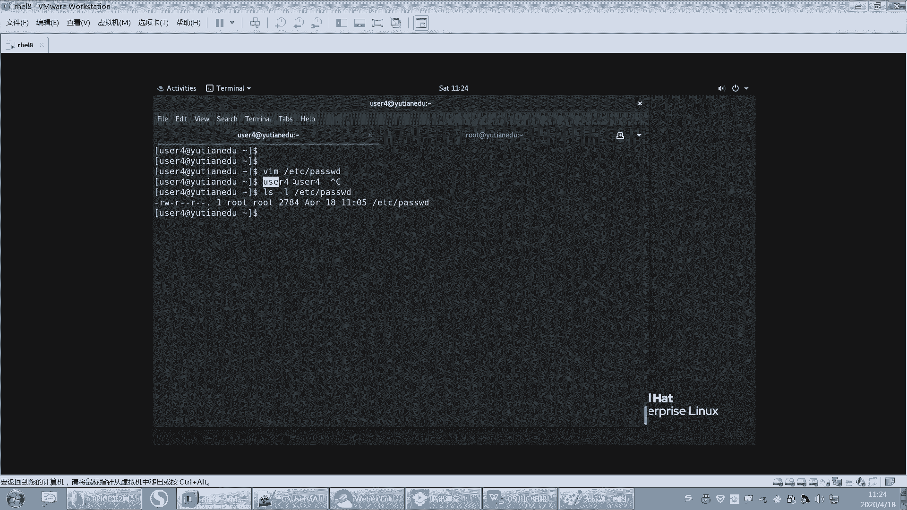

# 【重置详解版】孙老师讲红帽系列视频／RHEL 8.0 入门／红帽认证／RHCE／Linux基础教程 - P20：20 文件和目录的rwx读写执行权限讲解 - 誉天孙老师 - BV1aB4y1w7Wi

密码的话。🤧密码的话，我先放在后面讲，因为这个PPT我当时做的时候，呃，我就在这一并做了，所以密码我想放在后面再讲，好吧，密码先不慌啊。好，下面我们来讲一下权限部分啊。下面来讲一下权限部分啊。好。

刚好哦。呃，linux文件安全这个就涉及到安全了啊。我们把用户分组基本的讲完之后，我们看一下文文件了，其实我们lininux它安全对吧？它安全体现在什么地方，它是怎么去实现这个安全的？

那一般就是通过什么？其实所谓的安全就是说别人透过别人通过一些其他的方式。然后去访问到你这个系统的里面的某一些文件。某一些信息是这样吧。所以那如果你进来的时候，你。你访问这个文件，你对它没有权限。

那么这个时候我是不是就可以阻挡你不让你访问，对不对？所以我们下面就要慢慢的去了解我们的文件的权限是如何去做的。它怎么去实现的？它每一个权限指的是什么意思，对吧？这就是接下来我们的这个呃这个这个。

呃，内容啊好，我们先了解最基本的啊哎最基本的这个权限，慢慢再深入。好，我们来看一下啊。我们稳健我们其实说白了，最后都归结于什么？在稳健的稳健的权限上啊，归结于在稳健的权限上。

好，每一个文件呢都有1个UID和1个GID这个毫无疑问。我们之前在看文件的时候，在这儿是不是就可以看到文件的UID和GID也就是这个文件的拥有人和这个文件的拥有组。

这个组我可以改，对吧？拥有人我也可以改，拥有组都可以改。好，那么。Yeah。再来啊。第二句话叫任何进程运行时都带有1个UID和一个或多个的GID。

好，这句话有一点抽象，我来给大家演示一下啊。什么叫进程，大家能能能明能能清楚什么叫进程吗？就是你看啊呃比如说我这里有个任务管理器是吧？不知道大家在装的装的时候，装系统或者用这个系统的时候，嗯。

比如说我这上有个嗯有个这个note pad的一个这个软件，对吧？那我想往里面去写数据，或者是往里面去创建一个文件，那我这个文件创建在哪个地方，那我需要对那个地方是不是要有权限才可以。

也需要对这东方要有权限啊。那我这个这个这个进程。怎么有了进程？它是有权限的，有进程是没有权限的呢，这要看什么这个进程它的。😡，看到没有？这边有个拥有人。有个用户名，这个用户名其实就是这个竞权的一个。

其实说白了在我们类似当中就叫UID哎，就是它的拥有人，就进程也有拥有人的拥有人呢。好，这这是我们windows里面。好，我们看一下lininux里面啊。PS我们有个命令叫PSAOX就是我们后面要学的。

好，我们来看这边啊，这里有好多进程是吧，这样吧。我。好，我打开一个文件。我打开一个文件啊。我打开一个password文件。好，我打开这个pas软件，那么这个VIM这个它就是一个应用程序。

它就是个应用程序。你用它的时候，它就会开启一个进程。就会开启。因为这个VM呃，这个我这么说，大家能听懂吗？就是比如说我QQ对吧？它是一个应用程序，那我QQ我是不是要把它加载到内存当中。

把它的程序它本来在硬盘当中，我是不是要加载到内存当中。那么这个时候它就会成为一个进程，在内存当中就是一段运行的代码。同样我用VM那VIM的它的它的代码在哪里呢？是不是在本来在硬盘当中。

但这个时候我用它的时候，它是会加载到内存当中，这就是VM的进程。那我执行了VM。😡，那VIM它的代码就会加载到内内存当中形成一个进程。

形成一个进程进程就是我刚给大家看的在windows里面这个地方我运行的这个应用程序，它就会形成一个进程，OK吧。好。那么我运行了VIM，它就是个进程。😡，那么他要访问的是哪个文件呢？

访问的是这个文件OK吧。好，那我运行它了，那竞权人怎么看呢？在这边啊，我们可以用PSAX这个。可能有同学接触过啊，然后我们来过滤一下，这个还没学，没关系啊，我们先看一下结果。这边有个进程看到吗？

这个进程啊，这个进程的拥有人是你看我我进进程的这个名字是不是叫VMETC passwordword。那么这个进程的拥有人是不是叫root，进程的拥有人叫root。也就是说这个进程它携带了个UID的信息。

OK吧，这个进程是不是携带了1个UID的进信息？那么这个进程通常它的UID是多少呢？注意通常是谁来运行这个进程，那么它的UID就是多少？比如说我是我这边是谁来运行的，我这边是不是root。😡，嗯。

我这边是不是root来运行的，所以这个进程的用这个这个用人是不是root。好，那么换一个用户，比如说啊。我切到U子一。现在有的是。好，那么我用user4的身份来去打开这个文件，又运行了一个进程。

那么这个时候我们再来看一下这个进程的拥有人就变成谁了，是不是变成user4了。对不对？所以这个进程的。拥有人一般取决于谁来运行这个进程。好，所以UID是不是继承这个用户的UID也就是个用户的UID好吧。

好，这是第一句话啊。第二句话，那么这个进程除了有UID信息，还会有GID的信息，还会有GID的信息。它GID是多少呢？GID要看什么？要看这个用户的GID是多少。

这个用户的GIDus则是用户GID是不是2024，对不对？好，那我们再回来看这句话，任何一个进程在运行的时候就会带1个UID和1个GID好，UID我可以理解GID我也可以理解。

但是有多个GID我怎么理解？

有多个GID的信息。这个地方是什么？我们刚刚学过的一个用户可以怎么样，可以数个属于多个组。注意一个用户可以属于多个对附加组。所以为什么附加组也有意义？因为你带上了什么附加组的信息。

那么附加组可能有什么权限，你就有什么权限，那就有可能是这样子的啊，所以一个进程有一个到多个的GID标示符OK吧。好。那么有了进程，有了文件，其实我们最终都是通过进程来访问文件的。

都是通过进程来访问文件的啊。那也就是说现在。

🤧嗯。我这个用户。我这个用户us则4来访问执行这条命令的时候。呃，这个禁止的UID是吗？UID是user4。唉，UID是Euser4GID也是user4，对吧？好，那么这个文件的。

注意这个文件的拥有人是谁呢？拥有人是不是root，拥有组是不是root，对吧？好，下面我们来开始啊，从这儿然后开始匹配了，开始匹配它的权限了啊。好，下面我们来看啊。

所以我们用户再来访问这个文件的时候，有三种访问类别。有三种访问类别啊。进程的权限和应用程序本身的。啊，进程的权限和应用程序。本身什么意思？进程应用程序文件本身这个文件是吧？啊。

这个文件要看这个用户对这个应用程序文件有没有权限去执行它。

对我们先不考虑应用程序本身的权限。好吧，我们现在也就是说你看有同学说老师，我有的是万一没有权限去运行这个VM应用程序，是吧，是不是有可能对吧？这个。啊，也有可能会有关系，跟应用程序本身有可能会设置。

就是说我这个应用程序本来设置的是什么？嗯，这个我没办法给你解释啊这个。先不管它，好吧，我们先不管应用程序本身的权限，好不好？😊，好。呃，我们来看一下啊，这个VM。😊，嗯。

用户调用应用和应用户文件也是两个东西吧。对对对对对，是的，就是你进程跟访问文件和用户来调用应用程序，这是两这是不同的这是要分开，对吧？其实是两步，其实是两步。所以我告诉我刚刚为什么说。

通常怎么样啊，这个应用程序通常它的UID是什么？是谁来运行这个用户。当然有可能。我说有可能啊有可能root来的运行，但是这个进程的UID有可能是user usererE，这个说不定这个是不一定的啊。

这个是要看设置，好吧，这个要看设置啊。所以通常情况下，取决于哪个用户来执行这个竞程。

好。OK。啊，现在这个文件啊现在这个用户来访问这个文件有三种访问类别。首先第一种第一种我要看。这个这个。呃，这个叫什么？呃，这个文件。

这个地方跟它的什么UID那这个进程的UID跟这个文件的UID是否一一对应的？好，你看是不是对应的U4是不是是不是这个文件的应用人呢？U的4是不是这个文件佣人的？啊，不是不是吧，不是这个文件拥人，对吧？

好，那我们看一下是它的文件用人的话，我们这种情况下来访问是不是。那我这种情况下来去访问这个文件，是不是就是文件的用人？这个VM对吧？携带的是不是UID就是root。root好，先听我说可能有点绕啊。好。

你先把这个了了解清楚，后来给你家总结一下。好，那么这个进程携带UI是不是UID是rootGID也是root好，那么这个进程的UID是这个文件的什么拥有人吗？是不是是的吧，看到没有？

那root rootot是的吧，所以这个UID跟它匹配上了吧好，匹配上了就怎么样呢？也就是说匹配上了，那么这里在访问这个文件的时候，你这个用户有什么权限呢？是拥有人的权限，拥有人是什么权限就是什么权限。

OK吧，用人是什么权限就是什么权限啊。好，那此时你看组是不是也匹配了，先匹配用人，先匹配用人啊，先看他是不是他的用人。😡，是的话就匹配上了。好，再看有组。唉，这个镜止的这个GID跟它的组匹不匹不匹配啊？

😡，匹配了是不是也匹配啊，那到底是拥有人的权限，那到底是拥有人的身份来访问呢，还是拥用组的身份来访问的呢？😡，注意啊，它有个优先优先级，先匹配拥有人再匹配拥有组。所以当拥有人匹配上了。

那就是拥有人的拥有人的身份。好，拥有人没有匹配上，再看拥有组是不是对应的。那么又有组势的。那么就怎么样就匹配上了。哎，好，这是第二种情况，对吧？好，第三种情况，我既不是他的用人，就要这种情况。那。😡。

是不是这个既不是它的用人，哎，组也不对应。那us则4。这个地方来访问的时候是什么身份呢？就是叫其他人的身份。好，我这地方说有点复杂了啊，听我再说一遍，听我再说一遍啊，怎么去匹配身份。看好啊。

你只需要你不需要管进城的拥有人拥有组了。好吧，现在你不管他进城的拥有人拥有组是谁了，你只需要管你是谁，你当前是谁。你当前是谁？你当前是不是root，你的组是不是。😡，这个什么组是什么零呃。

UID也是0组也是0。好，你来访问谁，你来访问ETC passwordword。啊，你来访问ETC password。好，来，你来访问这个那你这个用户来访问这个文件的时候，我用VIM来访问，对吧？

用VIM来访问啊。好，那我访问这个文件的时候，我我是什么身份来访问的呢？我只需要看什么？我这个用户是这个文件的拥有人吗？是不是啊？是的，我是这个文件用人。那么我就是以文件用人的身份来访问的。

那我是这个文件的优组吗？😡，是不是啊，我也是，但是怎么样，我第一遍第一遍匹配就结束了。因为我先匹配什么，拥有人。拥有人不是了再匹配拥有组，那我就是以拥有组的身份来搞的。最后一种情况就是什么？

就是我既不是他的佣人，也跟他的组也匹配不上。那么这个时候就是其他人的权限。也就是说我们说所说的有者似这种情况。🤧这样是不是就很好理解理解了一点。那这样是不是就很好理解一点呢？呃。

再来再来去LS杠01ETC他错了。但是你说老师，你为什么要跟我讲刚刚那个呀？😡，其实刚刚那个是本质上是通过进程的权限来匹配的。但是如果我每次让你去看哦，进程用人是谁，文件的用人是谁？

你是不是感觉很麻烦是吧？所以不用看了，先不看进程了，看什么，看你用户是谁。你当前是哪个用户，我当前是us则4，我来访问这个文件。我是这个文件的用有人吗？

也就是说Uode4打开的进程用人是不是都有都是Uer4啊？😡，组是不是都是us组是不是都是U4的组？😡，所以我还要不要看进程，我不需要看进程了，都是优则4。😡，OK吧，但是我说过啊，现在。

绝大多数是这样，但是也有少数部分不是这样，我们后面慢慢学就会体会到啊。好。也就是说，有可能我Uode4打开，但是这个进程的拥有人不是Uode4，有可能是这种情况。😡，好，但是我们先不考虑那种情况。

我们先考虑一般情况啊。usode4来访问这个文件，我看是不是它用人，不是是不是他用组，不是，那就是什么其他人这个地方会了吗？会匹配身份了吗？为什么要匹配身份呢？😡，注意为什么要匹配身份呢？因为什么呀？

因为不同的身份有不同的怎么呀权限，用人的用人的身份有任用人的权限，拥有组的身份有拥有组的权限，其他人的身份有其他人的权限。😡，所以我要去首先弄清楚我是什么身份。😡。

再去看我有什么样这个身份有什么样的权限。好吧，OK嗯。好，说半天啊，三种访问类别哎，运行的。其实这个地方你看它是不是运行的进程跟文件有着同同样的UID这是不是我刚刚来解释的运行的进程。

第一种情况不满足运行的进程跟文件有了相同的GID这是不是第二种情况，我是他的应用组。第三种就是既不是他的用人，又不是它的应用组，就是什么其他人对，就是其他人啊好。下面看优先级权限的优先级匹配。

如果UID匹配上了，那么用户的权限也就是优人的权限。匹配有用人的权限，否则就是组的权限都不匹配都不匹配，那就是其他人的权限，对吧？就是其他人的权限啊。好，那用人用组和其他人到底有什么样的权限呢？

我这个PPT的顺序我。我把它改一下啊。嗯。这样把那个权限放后面。好。再往后看啊，那么权限怎么去看，对吧？右人什么权限，右左什么权限，其他人什么权限，我这边给大列了一个啊，好，来听我讲啊。

一定不要去忽视啊，就是有些时候你如果本质上不了解什么情况，也可能只是浮在表面上，对吧？还是搞不清楚啊，所以一定要从本质上了解它它这个权限到底是怎么回事，要会去看的啊。好。那么在这个地方看这里啊。

看这里没有？我们直前讲前面这个栏位指的是这个文件的类型，对吧？你是文件还是目录？还是。链接文件还有什么什么其他的啊，后面这个地方这9个栏位，加上这个点，我们说是权限。但这个点呢我们先不学。

我们先看这9个栏位啊，这9个栏位。好，这9个栏位呢分别是三个三个一组，三个三个一组，三个三个一组。那么第一组就是拥有人的权限。第二组是拥有组的权限，第三组是其他人的权限。okK吧，是不是很简单？

所以拥人有什么权限呀？有这个权限是吧？哦，有有有这个权限啊，优组有这个权限，哎，其他人有这个权限。也就是说，root用户有RW权限。😊，哎，root组有R权限。唉，其他人有R权限，对吧？好。

这样okK这样可以区分啊。

好。那么接下来我们要了解的是。这个我这也给大家写了，看到没有？好，那么拥有人。这三个栏位这三个地方这三个栏位啊，本来就是RWX这三个栏位。如果这个栏位是杠，说明这个地方这个相应的这个栏位。

那比如说这个地方就是X，它这个地方就没有，就没有X权限。那U组的就是只有R权限，没有W和X权限，同理其他人也是这样，这样会看吧。好，所以你看我们这个地方啊，这个字符表示是这样子是吧？

权限呢我们又是读写执行，读写执行啊，读写执行读写执行，对吧？好，下面是数字，我们数字待会儿说啊，我们先看这个。好，我们知道文件的用人的权限了，用左权限和其他人的权限了。那至于读写执行分别代表什么意思。

我们来看一下这个读写执行啊。好，下面你们需要自己去记一下。我可能这个地方呃，我也写了呃，你你你我我在。测的时候你可以做一下标注，好吧。好，下面我要讲的是啊。我们要分开两部分，第一个是文件的读写执行。

第二个是目录的读写执行，你说还不一样啊，对它就是不一样。它就是不一样的啊，对文件的读写执行和目录的读写执行它是不一样的。其实文件的比较好理解，就是目录有一点难理解是吧？好，不过没关系，文件的读。

其实很好理解，就是查看某一些内容。

其实我都不用演示，大家都应该能知道，对吧？就能不能看这个文件内容啊？😡，好，下面我来给大家看一个啊，我现在我切到柚子4。我现在要去访问一个文件。这个文件呢是ETC下面的shadow。好，哎，你看啊。

注意我现在来访问这个文件，请问我是以什么身份来访问的？啊，我是以什么身份来访问的呀？好。我当然知道我是优的斯的身份了，对吧？我是以诱人用组和其他人，对吧？对，是其他人的身份来访问。那其他人是什么权限呀？

😡，现在有没有权限啊？其在是没有任何权限，看到没有？在这个地方。三个3个一栏位嘛，对吧？其他人是没有任何权限的，就是读写执行的权限都没有都没有啊。所以你看我如果对他没有任何权限，我打开它看一下能看到吗？

是不是什么都看不到。对吧所以这就是你没有R权限，就看不到文件内容，这个okK吧，这个其实很好理解啊。

好，这个R选就是查看文件内容。第二个W权限。

修改文件内容。对，修改文件内容好，大家还是不要去动这个文件了，因为这个文件比较重要，它是一个密码文件啊。嗯，这样吧，我来弄几个文件啊。给大家测一下好不好。这个讯拟机怎么感觉红帽吧就很卡呀？要不能空格下。

啊，复制一个文件过来啊。去的有就4。进来看一下。好，现在你看啊我是U则斯的身份，那我来访问这个文件，我是其他人的权限，我有R权限，对吧？好，我打开这个文件，你看。好。

你看我打开这个文件是不是看到内容了呀？但是你看。右左下角有一个什么叫read only，看到没有？叫read only，就是说它是只读的，能不能修改啊？你让我去修改一下。我想保存。

你看是不是保存保存不上，保存是不是保存不上，对吧？这就没有办法保存啊。好，所以因为我对他没有什么没有写权限，所以没有办法保存，对，没有办法保存。但是我可以给他一个什么写权限。比如说我先给他一个写权限啊。

好，再来看现在我对这个文件是不是有写权限了，那我再进去看。我左下角就不会报错了吧，其实你看左下角你就知道我能不能写，没有说read only了，我再去写它对吧，这样你看。保存是不是保存了，对不对？

好，这就是写权限嘛，其实这都比较好理解吧。啊，这个不说了啊，不多说X权限。X权限是什么呢？是执行权限，是否可以执行该文件。

好，因为这个要涉及到这个当然执行可执行文件了啊。好，这样我我给大家这样说吧嗯。嗯，我们后面会学脚本是吧，但是还没学。好，你看我们看LS啊。LS它是个应用程序，OK吧。L它是个应用程序。

那么这个应用程序对应的是哪个文件呢？对应的是USRBL这个之前讲过了。好，那么这个文件放在这里可不可以执行？你看我这一回车就执行了，这叫执行，直接接上这个文件的文件路径，绝对路径。

我就可以执行这个文件了。这个叫执行权限。所以将来如果我们自己去。因为它就是一个应用程序，那应用程序就是那个呃大家那个点什么set upESE那种文件，它只有执行权限的。啊，好，他为什么能执行呢？😡。

这个叫一回车为什么能执行呢？是因为他什么呀？它有执行权限，它的执行权限在哪里呢？是在这里。看到没有？那这里有个X权限，如果你把这个文件的X权限都去掉了，那么它就不带有执行权限了。

也就是说你看我我普通用户，我是不是也能执行LS啊？对吧普通用户也能执行LS普通用户也能执行什么呀？USRB下面的LS。为什么呢？是因为怎么样啊？是因为这个文件。其他人位上是不是也有执行权限？

如果你把这个X去掉了。那么我就不能执行这个文件了。唉，这个是我们后面学脚本的时候会涉及到啊，所以这个不多说了啊，嗯这个我们到时候学学脚本其实很好理解很好理解。如果他没有执行权，他就会报错。

报权限拒绝的错误，你就不能这样去执行它啊，不能这样去执行这个文件。

好，这个后面再说吧。OK这就是文件的读写执行啊。好，下面来看一下目录的读。

写执行。好，我来给大家一个个测啊。我我我测完之后，我后面再问同学们，我估计还是有人会答不上来啊，可能会答不上来。我创建一个目录叫对。嗯。嗯。嗯。那么说如果就算某个病毒文件已经进入了A4系统。

但是没有获得。对，是这个意思啊。嗯，好，然后那么这个时候啊。这个文件那这是个目录，对吧？这个目录呢我们待会儿用这个user4的身份来测吧。就是看。有的40。好，那么U子四对它有独何执行的权限，对吧？

我们先把它独和执行的权全部去掉啊。好，现在看。他现在是没有任何权限的，对不对啊，我们先来进入到data。我们说进进去，我看能不能进去啊，进不进去啊。😡，报错了，看到没有？权限拒绝进不去进不去啊。好。

能不能看呢？我想看看一下这个目录下面。能不能看呢？看不了，对吧？那看也看不了。好，因为对目录的操作，大家想一下，对目录的操作无非就是进入这个目录。看这个目录里面内容。

并且在这个目录下面创建一个文件叫fill，创建在目录下面创建文件。对吧或者是删除这个目录下面的文件。所以你对目录的操作无非就是这些无非就是这些啊。好，那我们测了都不行，因为没有任何权限，对吧？好。

我们来一个个再加上啊。😡，O加X吧哦，加R吧，好吧，da塔。好，现在我对他有读权限了。那我对它有读权限，那看一下读能做什么呢？来一步步测啊。😡，CD data。能进来吗？能进来吗？进不来对吧？搞错了。

所以读不能让他进来。看一下。唉，好像没有报错了耶，但是这个下面什么都没有是吧？好，我们来创建一个文件啊。呃，这条下面的。好，再来看。诶。看到没有？报错了吧，但是看到没有看到了吧，但是报错了对吧？

包括全句，但是我看到了哈，为什么报错呢？因为你看它的详细信息。就会报错，只能看到文件名。详细信息就看不了，看前面全是问号，看到没有？所以你对这个目录其实还是有一些权限没有的。只能看这个文件名。

看不了什么详细信息。好，这就是什么R权限，能不能创建文件呀，更更不用说了是吧？你创建。😡，怎么可能有权限呢？创建也没有权限。好，再来啊，我们把R权限去掉。把R权限去掉。然后加上X选限。好。

现在我对它只有X权限哟，只有X权限啊。好，只有X权限能做什么呢？进入到这个目录。进来了，看到没有？说明什么？我只需要对这个目录有X权限，我就可以进来。就可以进来，能不能看呢？报错了吧，因为没有读权限。

能不能看详细信息呢？更别说了，看不了，能不能创建文件呢？也创建不了，所以怎么样啊？有了X权限，我就只能进来，什么都做不了。对，什么都做不了。所以你会发现。😡，我们对目录一般都会有R跟X权限。

所以你看我们来测一下R跟X权限组合在一起能做什么事情啊？啊，进入这个目录进来了吧，能不能看呢能看能不能看详细信息啊，能看能不能创建文件啊？😮，啊，创进不了。所以。我们对一个目录。

一般情况下有R跟X权限才会有意义才会有意义吗？你才能进入到这个目录，然后并且查看这个目录内容，并呃怎么没了是吧，就就只能这样。

对，所以对于目录的权限要记一下啊，目录R权限仅仅就仅仅是啊只能查看目录里面。文件的名文件名。哎，文件名，然后X权限呢，我们测了它是什么能进入目录。对吧然后我们RR选项跟X文件放在一起。

我们就可以什么又进入这个目录，又查看目录里面的文件，还可以查看什么呀？详细信息。对，详细信息好，你你就写RX能做什么，对吧？😊，啊，RX能做什么，你做什你这样自己写啊，自己写。好，W权限。W权限啊。好。

W圈能做什么呢？我先写啊。如果你对一个目录有W权限，注意啊，嗯有了R跟X权限，W权才有意义啊。你如果没有你R权限X权限的话，你又进不去，这RW权限没什么意义了。好，有了W权限呢，你就可以怎么样在目录。

下面创建文件。

或者怎么样删除文件。对，在目录下面创建文件和删除文件和删除文件啊。好，那现在我能创建文件吗？你看啊我刚刚测了不能是吧，我能删除文件吗？删不掉，没有权限，看到没有？删不掉，没有权限啊。好，来给它加上R。

呃，O加W。好，现在看好啊。我us着四对它是不是有RWX权限了？RWX选项都有了，对吧？那我可以进入目录啊，我可以看呢，我可以创建文件呢。第一呀。创建文件了是吧？啊，成功了吧。好，我删除文件。

我这样删咯，我新号是不是删除这两个文件啊？那请问这两个文件哪个能被我删掉呢？嗯。哪个能被我删掉啊？这个第一个还是第二个。第一个能删掉还是第二个能删掉，还是两个都能删掉，还是两个都删不掉。😊，都能是吧？

有同学说都能，有同学说fill杠1。好。这个地方我们来删一下啊删一下。嗯，回去了。删掉了吧，是不都删掉了？

都没了是不都没了，对吧？好，所以你看。我刚刚这个地方没有界没有没有限没有修饰词，对吧？我说你只要对这个目录有WW权限，你就可以在这个目录下面创建文件。

和将这个目录下面的文件删掉，不管这个文件的用人是不是，因为有同学考虑到是么？哎要这个文件的这个这个这个不是我的呀，我怎么也能删掉啊，唉，这就是W权限。对，W选就可以删掉。但是呃这个是目前为止是这样子啊。

如果再碰到其他的权限，我可以做限制，这不是我的文件，我就删不掉。对，这就是我们后面要学的一些高级权项啊。好，但是我们知道现在的话，你对一个目录要RWX权限，那么你能进入到这个目录，查看目录内容。

删除这个目录下面所有的文件，并且创建文件，对吧？会了吗？这就是RWX。

好。听懂了吗？这个听懂了吗？

啊，Y同学这这个没声音了。