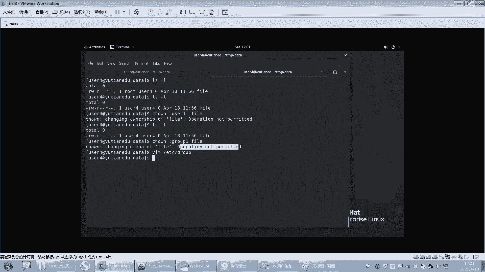

# 【重置详解版】孙老师讲红帽系列视频／RHEL 8.0 入门／红帽认证／RHCE／Linux基础教程 - P21：21 文件拥有人和拥有组之chown和chgrp使用 - 誉天孙老师 - BV1aB4y1w7Wi

🤧好。嗯，OK。这个我我在这列了一些文件类型啊，给大家标了一下，这个你看一下就行。好吧，你就目前就知道这三个就行了。下面两个我们后面会学的啊。OK这个是文件的权限啊，文件的权限。呃。

下面呢我们来看一下啊，这在这儿我也给大家呃列了怎么去修改这个权限呃，文件和目录的权限啊。呃。这样吧，我看一下啊，我看过我看看这个PPT耶，我怎么没有写哦，写了哎。嗯。我没有写，我记得英人又说。好好。

我们来学一下怎么去修改，好不好？来学一下怎么去修改啊。😊，哎那张PPT怎么没了？哦，在这里啊。

我先学这个吧，好吧，我们对目录的权限啊，对目录的权限注意啊。我们对一个目录或者是文件的权限。我们其实在匹配的时候，我们是经过两步才匹配成功的。经过两步才匹配成功的啊。第一步我来访问这个文件了。

其实LS是不是也是一种应用程序，对吧？我在执行LS这一瞬间是不是也加载了LS的应用程序，也会生成一些什么啊进程。只不过我执行完这个进程就结束了是吧？它短暂的很快就结束了。

所以我在访问的时候也会涉及到什么权限的问题。好，那么我来访问这个文任何文件和目录的时候，😊，怎么样啊，他都会。呃呃，匹配一定的权限。那这个权限最终是什么？要取决于两步啊，第一步匹配身份。匹配身份啊。

我是这个文件的用有人呢，拥组啊，还是其他人呢？这是匹配，这是这是第一步，对吧？匹配身份。第二，匹配拥用人的权拥有人的话，那用人什么权限啊？拥用人是不是RWX权限。所以我们在修改权限这个过程当中。

我们要会两个啊，第一个要会修改这个文件的拥有人和拥组要会修改这个对应身份的权限。对应身份的权限啊。好，第一，我们先学修改拥有人拥组啊。呃，修改文件的用人和优组的话。嗯，我们最好用root来做啊。

普通用户有的时候是没有权限的，普通用户是没有权限的啊，来看一下修改这个文件的用人，嗯，修改这个吧，好吧，叫change on。change own啊change own叫change owner嘛。

就CH叫changeowner叫拥有人是吧？好，又修改成user4呃password。这样的话就修改了，很简单。这个文件应用人就变成user4了。文件应用人就变成user4了啊。

文件拥用组我也可以修改叫change GRPchange GRP啊，比如说拥有组修改成user5，它是我的。好，唉，你看拥有人拥有组分别被我修改了这个GRP修改组的这个迁期owner修改拥有人的，好吧。

好，那我一并想去修改拥用有人应用组呢，那我就可以这样叫change on。悠人user一悠悠组冒号，悠悠组user2password。你看我用这个chan牛on一步完成，前面是拥有人。

后面是拥有组加文件名回车。好，他说你看啊报错了。什么样啊？他说这个组不存在，无效的组，也就是user2这个组是不存在的那我看一下啊user二不存在，user3啊，user3也不存在user4吧。好。

这样就成成功了啊，就是组不存在，你也没有办法去修改啊，你不要硬塞给人家，没有人家这个组不存在啊。😡，好，那么user一userus4修改好了，那就比较简单是吧？而且change on还可以只修改拥有组。

就是说你不用记这个什么change GRP了，就记一个change win就行了。好，怎么修改呢？如果是组的话，前面要带个冒号，你说冒号。You呃 rootot。派错的回去了这样子那。

加个冒号就知道哦是修改组，哎，修改应用人就不需要加冒号了，就是change onchange O啊，changeGRP就直接修改组，不需要加冒号，直接修改组，OK吧。好，再来啊。呃。下面创建个文件。就。

这样。没S data。还能跟上吧呃，这个。觉得快了可以说啊。好，然后这个地方LS杠Lda这个文件里面是不是有个文件叫fill，对吧？好，我修改data的应用人啊。Change on user E。

然后是data。好，这样的话。主那个文目录的用人变了，UZ一。那么目录下面这个da塔呢？是不是还是文件的拥有人，还是root，对吧？也就是说只改变了这一层目录，目录里面的文件和目录都没有变。对。

文件对这是这个这个这个是没有变的是吧？如果你想一并去修改这个下面的文件。对，这个时候就要去加递归啊，叫change on。杠大R注意哦，有时候杠小R杠大R啊，我们修改一个嗯。这个you则4吧，好吧。

对它。好，这叫递归修改，把这个目录下面所有文件的拥有人啊，不拥有组都改成 user4回车。No。改了吧，然后data本身是不是也改了？

对它本身也改了啊，O吧，这个没问题没有这个没问题吧。这就比较简单了。就就这个。OK吧，那命令格式就这个然，这个是前GRP的命令格式是吧？

好。还有一句话，大家加上啊，这个PD我没写，还有一句话加上啊。好，看这里，刚刚我们说我你最好用root去修改，是不是用root去修改啊？那如果我用普通用户去修改呢？嗯，这边这个好吧。嗯。这样吧。

我把这个文件的应用人也改一下。Change。你你看我这样去修改，我用user4的身份去修改这个文件的是么这个文件文件的拥有人，大家觉得能修改成功吗？你这一看对吧？你这个修改别人的文件的拥有人。

你肯你肯定修改不了是吧？但是我想把它的拥有人。😊，改成。好，再来看。这样的话，我是不是这个文件的拥有人了，对吧？我现在是这个文件的拥有人呢，我再去修改这个文件的什么？😡，用人就是我是他用人。

我要修改他用人为其他人是吧？😡，大家觉得可以修改吗？就是这样你user。一表。我就这样去修改。我是这个文件拥有人，对吧？我想把这个文件的应有人改成user一好，这样去修改它啊。

就我问的问题里面都有坑是吧？你们要慎就要慎重回答是吧？啊，不过没关系啊，随便怎么回答啊。😊，你觉得可以就可以，你觉得不可以就不行。😡，啊，但是你觉得的不一定，你是对的是吧？好，看这儿啊。😊。

有没有修改呢？没有修改，看到没有？好，其实你用呃，我们用这个。生活常识来想一下啊，就是现在这个东西啊它是我的。但是呢我想把塞给别人，塞给谁呢？塞给柚子一要么塞呢？😡，肯定不让塞呀，对吧？

你让给user一肯定不让给呀。如果能这样的给的话，我把我的文件都给你是吧？😡，这样子这样不可以啊，所以我不可以改这个文件的拥有人，那到底谁可以改这个文件的拥有人呢？只有root。

权限啊，对。大家把这个记下来啊。有一句话。有一句话叫只有root。才可以修改文件应用人。哎，我把这个。你们写了吧？只有root才可以修改修改文件用人。😡，好吧，那谁可以修改这个文件的应用组呢？

谁可以修改这个文件的应用组呢？这个组可不可以修改呢？嗯嗯。对，有什么呃root和文件的拥有人。可以。修改。文件的拥有。没有组好，我们来测一下啊，root和文件的拥有人可以修改为拥有组是吧？

啊，这是我写在这儿的。那现在我是这个文件的拥有人吧，我想修改还拥有组。欠举我us呃冒号group一吧。我不知道有没有这个组啊。嗯，看报的是看报的是这个组不存在，还是说这个呃这个这个这个权限拒绝是吧？好。

回去了。可不可以啊？嗯，哎，group不一组有吗？😮，但是报的什么？是不是不允许操作呀？

所以你能不能改这个文件的拥有组啊，好像目前为止改不了哦。是不改不了？对吧那我这句话是不是有问题？这句话有问题啊，所以后面有句话，还有一个前提啊，前提是。

需要怎么才能改呢？好，这样子啊就可以改了。我把这个user4加入到加入到group一这个组里面好哦，叫user mode。杠大G。group一us4。加了吧，加进去了吧。打开group。哦。

加加进去了是吧？好，看能不能改啊。这个这个。限计one，然后再就把这个再执行一遍呗，回去。好，退出来重新登录一下啊。嗯，t data。好，再来改一下啊。改不了打脸了是吧？改了吧。

刚刚可能没有读到那个组啊。

好，改了吧。所以前提是什么？前提是这个用户要在这个组里面。对。是的，加这句话啊。前提是什么？前提是。呃，用户。需要在是吧？组里面啊。好吧，这个我演示了，你们自己去体会一下啊。

嗯。好，下面我举一些例子放在这儿嗯。O。

哦，还还没说完，我们下面在这个还有很多权限啊嗯。对，所以这个因为你是root来执行的话，这个你你你root的权限太高了，它你就算没有权限，它root好像也能执行，是吧？

但是我们作为一个普通用户的角色来看，因为我们将来肯定要普通用户，那你就很多权限都是没有的，很多权限都是没有的啊，所以你一定要记记好啊，记好。好，那我们今天上午先到这儿吧。嗯，大家中午好好休息一下啊。

下下午。这个精神要精神要提起来啊。嗯嗯你可以准备点零食是吧？放在旁边，这个饿了吃一口是吧？能体那个这个呃精神能够好一点。

🤧嗯。好吧，那个呃。只要不要吃那种太响的，就是那个吧唧吧唧，你都看听不到我在说什么是吧？😡，其实种。算了，不说了，别吃了。

啊，掐自己一下O。好，那没事了，大家可以下课了啊。😊。