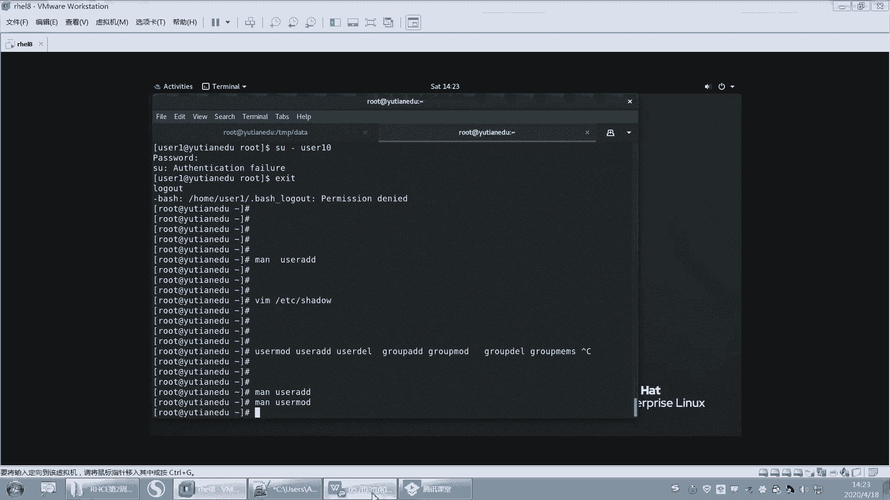

# 【重置详解版】孙老师讲红帽系列视频／RHEL 8.0 入门／红帽认证／RHCE／Linux基础教程 - P22：22 文件权限的修改之chmod使用及用户组权限补充 - 誉天孙老师 - BV1aB4y1w7Wi

嗯。好，上课啊。嗯，今天上午我们把这个用户组还有权限部分讲完了，我们接着啊接着上午的来。呃，上我们讲到了这个文件的权限和目录的权限RWX和目录的RWX啊。好，嗯，还而且还讲修改文件的。佣人和庸祖。

这个比较简单了。呃，用人和拥有组是吧？好，然后呃再来啊，接下来呢我们要去修改对应身份的这个权限了啊。呃，修改对应身份的权限呢就比较简单了。我们可以去用另外一个命令。叫change。

change mode change mode啊，这个命令呃用于更改文件。对于某类用户的操作权限是吧？好，我们这个地方呢嗯你看啊。呃，我们用changechange mode杠大R。

这个大R呢其实其实也是指递归的意思，就跟我们修改那个文件应用人应用组是一样的。然后后面是一个文件的这个呃权具体的权限是吧？然后再后面呢是这个对象，某个对象就是参数，就是我们文件。啊，这地方有三个单词。

那叫who what which对吧？啊，我们可以那我们不是要修改权限吗？但是你具体是不是要去修改哪一部分的权限？我们有三部分嘛，用人用组和其他人对吧？啊，三部分的权限。

所以我们用ho第一个表示给谁修改U代表用人哎，既代表组O代表其他人。你也可以用A代表所有人啊，对吧？呃，然后再就是什么？再就是what你要做什么呢？你要是增加权限呢，还是减少权限呢。

还是等于具体的某个权限呢？对不对？啊，那你是对应的是什么权限呢？是R啊，还是W啊，还是X啊，好吧，那我们来试一下啊。

嗯。现在呢我们来看一下这个password啊，我们想让它的这个拥有人的位置要有呃或者是组，应该组没有W权限是吧？我们想让组有W权限啊，那么就change mode。GG代表组对吧？G代表组就是ho嘛。

对吧？然后你是加上对不对？加上某个权限，然后加上WW就是写权限，然后呃password。好，这个就比较简单了啊，或者是我们可以怎么样，我们也可以比如说拥有人和不或者是组合，其他人都去掉W权限。

那就是GO它可以组合减去W passwordword。哎，这样去去掉某个权限，OK吧。呃，还可以怎么样？还可以O等于比如说O等于R杠Xword。这样也可以用等于的方式啊。呃，这个不能这样写哦。

他他应该是等一下啊R。X。哦，这样它不能写个杠啊，它杠好像设置不了，还要RX啊，就是没有写W，它就没有W权限，只有RX权限。好，你还可以这样，比如说应用人。呃，加上X选限逗号。

逗号中间逗号拥有组加上W权限，这样子写也可以。那它就一次性操作两个拥有人怎么怎么样，拥有组怎么怎么样，对吧？中间用逗号隔开啊。嗯，逗号隔开。啊，还可以这样呃，所有的全部去掉。对吧X权限那就是A减Xpa。

嗯，就是A嘛，就代表呃UGO代表所有对吧？啊，减去X。啊，会了吗？就随意你你随意去组合啊，随意去组合。好，这个也比较简单啊。好。嗯。

呃，杠R就不说了吧，就递归啊递归修改针对目录的。呃，如果想要目录里面的文件也一密修改，那么就加杠R啊，杠R。好，然后我们再回来看一下啊，我们我们写这个权限里面。

我们用的是R呃RWX来表示这个字符来表示读写执形是吧？但是我们还可以用什么呀？用数字来表示，看到吗？用数字来表示四呢就是R权限。啊，二呢就是W一呢就是X权限啊，也就X权限。

所以我们可以用数字的方式来去给它这个设置权限啊。嗯。这个地方啊拥有人比如说你拥有人有RWX权限，那么就将拥有人的三个权限加起来就是4加2加1啊，就是7，对吧？那拥有人就是7，你你给拥用人7的权限。

那么拥有人就有读写执行的权限。

呃，我们可以给他所有权限，它是777是吧？他是我的。那圈击modode77，这个是用人的位置，用组的位置，其他人的位置。嗯。然后拥有人切的权限，那就是RWX对吧？还可以把它改成，比如说改成644。对吧。

嗯。啊，644，那就是呢就是这个这个。嗯，644，你这样去算嘛，对吧？或者改成755等等啊，这个你们自己去改好吧，比如755。对塔。这个就是你小学数学。呃，过关了呃，基本上就能算出来啊。

7以内的加减法啊，你这个权限弄错了，你小学这个7以内的要重重新用手指头掰一下啊，要不然算不明白的啊。🤧好。呃，这75对吧？75所以一般情况下，你看嗯我们来举个例子啊，我们今天上午不是讲了那个。讲了什么。

讲这个权限部分，对吧？讲这个呃不是讲权限，讲用户跟主部分。然后呢，我们当时是怎么样啊？嗯，看一下，我们当时有一个用户叫user一。然后这个用户呢，他加目录是home下面的user一。对不对？

然后我们说切到这个home下面的U呃，切到 userer一的时候，就会进入到这个home下面的 userer移，对不对？那这个目录存不存在呢？我们看一下啊。这个目录是不是存在的？但是这个目录怎么样啊？

我们进去的时候被拒绝了。你看啊。我切到Uer一的时候被拒绝了，你看它的权限是多少啊，我们可以用数字来表示的话，那就是700，对不对？700啊。那么我如果用Uer一的身份来进入到这个目录的话，那。

我需要对这个目录有什么权限才能进来。O快回快速的回答我啊。我需要对这个目录需要有什么权限才能进到这个目录里面来呢？😡，就是SUuser一这样进去，对吧？我是不报错，我需要有什么权限呢？对我需要有X权限。

对我需要有X群才可以进来。但是。我们用户腰子一。对，这个目录是什么权限呀？没有任何权限，看到没有？因为它是其他人的权限，怎么看？哎，user一是什么？user一是2003，它的用用人是2003。对吧。

他既不是他的佣人，也不是他的拥有组，那就是其他人嘛。其他人什么权限呢？没有任何权限。所以啊为什么你不能进入到别人的加目录？是因为你对别人的加目录是没有权限的。我们所有加目录默认权限都是700的。😡。

所有嗯用户的加目录权限默认都是700OK吧，这就是他没有进入的权限啊。好。

呃，这个。应该也没什么问题吧，这个也不难啊也不难。好，这是权限部分的修改啊，权限部分修改。

好，那我再给大家出一道题啊。什么root都没有什么root没有。😡，你就要你你说这没有root是吧，是这意思吧？你说root对其他用户没有权限是吧？入的你挡得住吗？啊，我就问你入的能不能入啊？OK好。

我这想说啥的，被你给打断了。😊，嗯嗯。嗯。好，来这样啊。啊，你看这儿啊，我现在如果我这样去改啊，比如说改成我们不是呃比如说改成666呃，这样是不是改666，那么拥有人拥组，其他人是不是都是66，对吧？

好，那如果。我有些时候少写了一个6，就写个66。嗯，写个66啊，然后我这样修改了，看是不是也成功了呀，对吧？好，大家来猜一下，用三位数字来告诉我，请问password现在权限是多少？

password这个文件的权限现在是多少？我现在你可以猜啊，对你可以随便猜。呃，有时是66660660是吧？好，还有没有其他意见？可以猜嘛，随便。没有其他意见了。哦，有些是066是吧？😊，还有吗？

好像也没有什么其就要么就是066，要么就是660是吧？啊，1比1平哦啊，这边还有一个啊066。2比3是吧，还有606哦，这又出来第三个是吧，1比2比3好。😊，Okay。这个地方啊。哪个对了呢？066对。

是066啊。还有664的哦，664是考虑到这个地方是吧？好，所以啊如果你少写了一位，那么它是在前面自动补零，也就是说它是066OK吧。在前面自动补零啊前面自动补零。OK吧。好，没问题。

那你那你要写一个6，那是不是006对吧？006就这样子啊。好吧。啊，那为什么会这样呢？其实啊我们的权限是由四位组成的，四位数字应该说比如说啊呃7777对吧？假如说啊它是应该由四位组成的那我平时写的时候。

我是不是写的777啊？我其实第一位并没有写，对吧？因为第一位我们后面会学到有一位权限，特殊的权限在第一位上面，所以第一位没有写，默认就补零。也就是说它是这样的，0777O吧？

所以我们每次设置权限的时候啊，自动将第一位怎么样啊，你写了三位，666，其实前面是带了一个0的，但是它不会在后面补零，注意啊，它不是66。60不是这样，ok吧？在前面补灵啊，在前面补灵。好。

我写两位的话，那前面就是00对吧？0066对？0066啊。好啊，那我们现在只学了三位吧，只学了三位，对吧？第一位就是呃其实就后面三位嘛，然后这一位就拥人就拥组。啊，这这这是拥拥有组，这个是其他人，对吧？

最后一位是其他人啊，记好啊。好，第一位我们后面选好吧，嗯，O这个就是这个权限啊。如果你们后面少写了，对吧？你应该知道啊，它是前面不灵啊，前面不灵。

嗯。好了，那我们权限这部分大概就嗯。大概就到这儿了啊。然后那这两种方式就是说你数字的方式跟这个呃嗯跟这个用字符来表示RWX和这个数字来表示两哪种方法，对吧？更方便一些？

其实如果说啊你说我就知道这个文件的权限，我就想给它改成644，那么就是644，这样的话是不是方便一些，对不对？

啊，你知道这个文件的具体权限了，你就方便一些呃，全部的权限啊，644。但是如果说我只想把这个文件的优组加上一个W权限，那如果你还用数字的方式去。去算的话，对吧？哦，7内的加减法我就算错了。😡。

那么这个时候你的权限你还要反正就是多一步嘛，你还算。😡，所以。这两种方法不是说哪个就数字就简单，它也不一定啊，就是看情况。对不对？看情况，那这样的话就J加W就完成了嘛，那其他的权限是不要需求改了。

我只是说如果将它的拥有人去掉X权限，那如果你还要算的话，那就就太麻烦了。OK吗？听懂了吗？就这两种方式啊。😡，自己看情况用哪一种，不要说我习惯用数字，我就经常去用数字。因为数字的方法。

你还要把三位都写全，每一位是不是都要算出来，你少写了一位。他并不代表说默认这一位不修改，而是默认天0没有权限。OK吧，默人天领没有权限啊，所以。两种方法都有自己各自的优势啊，你。

随便就是说你觉得哪种方法呃，就是这个方便就用哪一种啊，不容易出错。就哪一种。我们最终在linux里面啊，我们要求你可以达到你的目的，以任何方式去达到。呃，但是越简便越好，也就是说我可以通过一步就能完成。

对吧？那我干嘛要去弄两步，因为你的步骤步骤越多算的越多。你最后出错的可能性越大，而且我不要求你是怎么去完成的，只要你完成就可以。

好吧嗯。OK那我们这张就讲完了啊嗯权限我们这我们这张我们再来回顾一下啊，这张都讲了什么。

嗯。回顾一下啊，花个几分钟时间回顾一下。我们今天讲了两个文件，一个文件是password的文件，对吧？然后这个文件里面每一行代表一个用户。呃，每那每一个用户呢，每一个栏位是指什么含义？我们也讲了，对吧？

啊，然后用户名这个X我们现在还没有测出来是什么含义啊，这个还要下去研究一下这个X位。啊，UIDGID对吧？描述位加目录，还有登录sha登录share啊。

那么这么说这个里面每一个栏位其实我可以去手动去修改它。比如说啊我一天布置个题目，我说你要把这个文件的。加目路修改成。呃，user下面的home下面，Uer下面的user44，对吧？那你这样修改行不行啊？

你这样修改不行？听到没有？你如果修改了这个地方，那么相对应的在home下面，你是不是要创建一个文件叫user44，创建一个目录叫us则44，并且us则44这个文件的拥有人拥组是不是都要是us4。

而且它权限是不是要是700，所以你看是不是很麻烦，对不对？所以这个地方你干怎么样，你最好你如果不嫌麻烦，而且你比较清楚的话，你在这里修改。你你不要过在这里修改完之后。

其他地方就不要就那个真正的home下面加目录就不动了，那不行啊，那就前后不一致了。😡，OK吧，所以如果你要修改某一个位置，最好用什么用命令行去修改。最好用命令行去修改，对吧？

但是命令行user mode，你也要去找对应的这个选项和参数啊，然后让它修改成功，OK吧。好，然后又学了一个文件，叫group。这个文件是组的信息，呃，每行是一个组，啊，组名X位对吧？

然后还有这个GID，后面是它的成员，唉，是他的成员啊，那么user4就是这个group一的一个成员。group一就是user4的什么附加组啊，这边注意啊。

在这个里面我们只可能看到用户和附成员跟附加组之间的关系。主组的信息不会在password里面看到，啊不会在group里面看到说错了啊。就是私有组和组组的信息只会在password里面看到。

而在group里面是看不到的。group里面只能看什么，只能看附加组和全员的信息啊。也就是说你看我user一对应的这个这个这个是谁的私有组啊，我怎么知道我不知道对吧？从这里看不出来啊，从哪里看呢？

从我们这个password里面去看啊，pasword，而且password里面那个栏位，这个地方是不是就是私有组，对不对？私有组啊，不就这里啊，写错了，这里是私有组啊。

然后你再去到group里面找对应的2000那个那个组名是谁，找对应的那个组名是谁啊。😊，好，这是两个文件对吧？两个文件。然后我们还学习了一些命令，比如说创建用户的命令，修改用户的命令，对吧？

他们两个的参数基本上都差不多的啊呃，但是你也不要想，当然说。感觉哦这个对吧？然后这个所有的参数都是一样的，而且还有同学这样感觉啊，之前这个是之前做做作业的时候出现的一些错误。呃，我我让他怎么样呢？

创建个用户，并且这个给这个用户修改密码。然后修改密码的命令，我们之前是不是学过叫pass word user一这样去修改，对不对？这是我们之前学的命令。然后后来呢呃他呢很聪明。

然后在man里面呢找到了一个找到了一个这个这个。😊，找到了一个选项，哇，他老高兴了是吧？他说能不能在创建用户的时候，把命密，把这个密码一并给指定了呢？😊，好，他找到了一个参数啊，找到一个选项叫什么呢？

叫P看到没有？什么叫P呀？哎哇，password呀。看到没有？我是那这不就简单了吗？对吧？来us add就这样杠P啊，user mode里面好像也有这个杠P好，然后rehead嗯us。呃。

11呃10好吧。好，哇，你说还要password干嘛呀，对吧？还修改密码干嘛，这样一步印不就完成了吗？结果他就不管了，对吧？密码设置完之后好，我开始切到切到user10啊。好，其到右的时。

我输入rehead密码，我没输错啊，我可以再输一次嗯，登不上去，不可能登上去的，注意啊，不可能登上去的。因为你只看到了第一句话。呃，你只看到了第一句话叫password是加密的密码。能理解吗？

它是加密的密码。好，但是下面有句话呢，note注意哦，他说这个选项不推荐。因为如果这个密码用在的呃这个这个呃会会什么这个这个密码会怎么样啊，会被呃visible就可见的是吧？被用户看到。怎么怎么样。

他说你应该什么呃。保证这个密码尊重什么它的密码策略是吧？其实说白了啊，它其实是这个地方，你设置的是这里。因为我们的密码rehead，按理来说，在系统当中存在的，它肯定不是以reha这个字符串存在的。

它是一段乱码。呃，加密的字符串存在的。那么其实你指定的是这个地方。看到了吗？那人家的有密码的都是这一串，而你呢是这一串。对你是这一串，人家是这一串。对不对？我同样都是rehead。

所以你说这个对应的是哪个密码，我不知道，所以这个不是设置密码的啊，注意啊。其实你用了这个。密码rehead的话呃，基本上你是没有办法登录这个系统的，user时是登不进来的啊。好，然后再来啊呃我们还选。

哎，刚刚学哦user关于用户的对吧？user modeus add。好，还有关于组的group。group add group mode哎，group mode没有讲，对不对？

group mode没有讲。😡，呃，你自己去做好吧，自己去修改，我就不讲了，因为不能把所有的名都讲完了啊。啊，还有什么哦，删除用户用。user dialll对吧？删除用户user dial。

然后删除用户的时候要注意加目录要不要加杠R，删除目录，删除邮箱，对吧？啊，然后删除组呢用group de，删除组的时候，什么组才能被删掉，对吧？啊，如果这个组是别人的私有组就删不掉啊。

如果这个组里面有成员，那可以删掉，对吧？好，还有还有group members。啊，管理组内成员的等等啊这一系列的对吧？如果你还想知道他还有跟哪一些命令有关啊，对吧？跟这个这个用户组相关的命令怎么办？

去man一下us add翻到最下面看这里。是不是有一些跟它相关的一些。命令啊。看到没有？你看group a谁能创建组啊，它是不是8呀？第八个章节这个这个地方是不是八是不是指第八个章节。

是不是只有一般情况下只有ro的才可以执行，对吧？呃，group de也是8嘛，group mode8，然后对对对是8。嗯那user mode，user dial，对吧？啊，这就是跟它相关的一些命令啊。

基本上就在这里。啊，你去man嘛，mmo相关的的都在这是吧？啊，都差不多的，因为它都是都是跟用户跟组相关的啊。好了吧嗯。OK那我们这个就到这儿了啊，权限部分。

权限不。