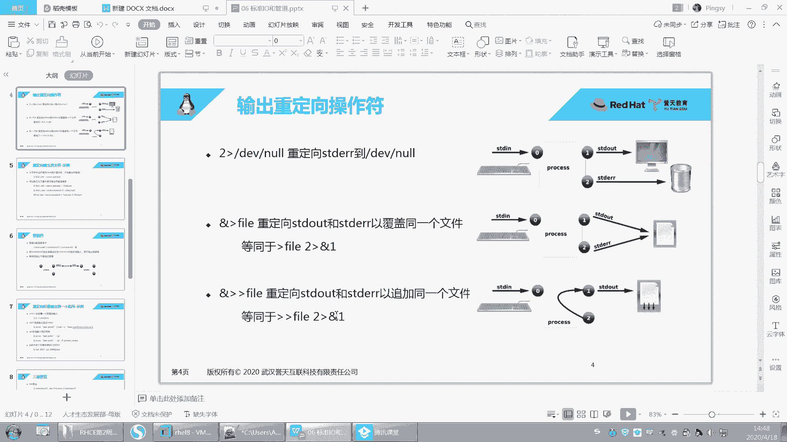
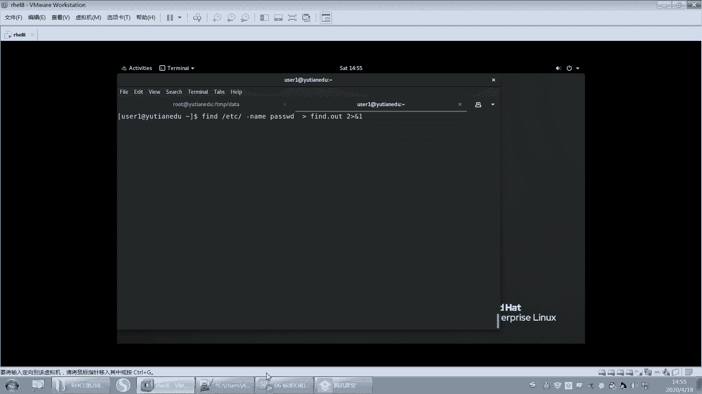

# 【重置详解版】孙老师讲红帽系列视频／RHEL 8.0 入门／红帽认证／RHCE／Linux基础教程 - P23：23 IO输入和输出以及输入输出重定向 - 誉天孙老师 - BV1aB4y1w7Wi

好，呃，我们下一章内容呢是关于这个IO和管道的啊，就是呃之前有同学听过的什么重定向啊啊，管道啊，IO啊，对吧？这个就慢慢慢慢的接触到一些高级的这个操作部分了啊。啊，呃。

这张我们需要了解什么是IO什么是IO，然后以及IO从立向到文件，对吧？从立向，还有管道连接服啊，管道连接服。好。呃，IO的话大家应该也不陌生啊，不陌应该不陌生，对吧？IO嘛I。呃，O对吧？你这样写啊。

然后它是指这个输入和输出啊。哦，IO呃是指输入和输出啊输入和输出。好，那么我们的IO呢呃分有几种类型的IO啊，几种类型的IO呃，这样我先给大家演示啊。

比如说我现在执行了一个命令。我执行了一个命令啊，那么这个命令呢是在我我在键盘里面是不是输入了LS。那这个键盘是不是可以作为一个输入设备？对不对？键盘其实可以做一个输入设备，然后我一回车就执行了。

执行完之后它就会有输出。那么这个输出就显示在我当前终端上了，呃，默认就是我们的屏幕嘛，显示出来对吧？显示在我们终端上给我们看到，那这个呢就是输出，对吧？这个就是输出啊啊，我在这敲这些敲。

其实这也是算是输入，对吧？也算是输入啊。好，那就是输出了。其实呃我们输入输出都是相对而言的啊，都是相对。我在这个呢给这个提示符里面输入，对吧？还在提示符这边这边呃终端上给我输出，其实包括磁盘呃。

还是还是文件啊，都有输入输出，对磁盘有写磁盘，对吧？读磁盘，对吧？这有输入输出，所以处处都是输入，都是输出啊。好，那么我们这个地方其实就相对于在这个地方呃在个在这个命令呃输出到终端这个地方相对而言啊。

我们讲的是这个I哎，这个输入和数理输出啊。

好，那我们输入输出包括几种。啊，包括几种啊，第一个叫标准输入。你看啊这个输入这个输入呢一般是从键盘上输入，对吧？那我在敲键盘，敲键盘，键盘就有个输入设备。其实我们的鼠标也是一种输入设备。

比如说我鼠标在点还是点对吧？这是不是也是一种输入设备，对不对？啊，我也可以用键盘来替代。啊，还有就输出嘛，输出呢就是我刚刚给大家演示的那个输出啊，默认是我们的显示器，就是屏幕嘛，终端嘛。

这种类似终端屏幕啊啊这种是输出。当然输出的话它有两种输出有两种啊，一种是正确的输出，一种是错误的输出。那什么是错误的输出，待会儿我给大家演示啊。所以我们输入输出一般有三种呃。

就是呃这个这个输入输出和错误输出啊错误输出。好，那么大家可以看到这几个单词啊呃一个叫STDL这几个单词要认识啊，因为你看到这几个单词的时候，你应该知道呃。

它代表是输入对STD呢代表standard就是标准的EIN叫input叫输入啊，这个叫standard output对吧？啊，标准输出啊，standard的标准错误输出这个叫arrowarrow啊。

要认识啊，要认识。

呃，比如说你看我给大家看一个我们password啊。呃，在password当中。在pass货当中有一个嗯。有一个选项叫杠杠。哎哎哎。嗯，看在哪。哦，有个选项在这在这里呢叫杠杠 thing是吧？

这个选项是不是就是标准输入，对吧？要标准输入啊，这个我们后面会学到呃，他说这个读密码的时候读新的密码，对吧？然后从标准输入，你看到没有？从标准输入里面。然后这个标准输入可以是一个pile。

就是我们管道就是我们后面要学到一个管道的管道符啊，管道符。好，所以这些单词要认识啊，在有一些地方它会以这个单词缩写显示出来啊，显示出来。

好，那么我们再给这个呃这个这个。呃，标准输入输出输呃，这个Q输出的时候，它有一个标识符务，就是一个描述服务。呃，一般错正确的就是输入的话，我们用零表示输出用一输错误输出用用2是吧，这是什么意思呢？

待会儿我我给大家演示一下啊。好，你看你看下面有张图。你看下面有一张图啊。呃，我觉得这张图还是蛮清楚的。你看这边这是键盘。对吧，然后这个键盘输入的东西，它这样标是否有个零，所以输入一般都是0。那这边输入。

然后作为这个输入作为一个进程来执行对吧？来执行啊，执行了一个进程。然后呢输出的话呢呃一呢就是这个正确的输出，然后输出到屏幕。那错误的输出可能也输出到屏幕，对吧？那就是二这样出来。

当然还有很多其他的标识符这个文件描述符啊，比如34567吧。那这个就是我们可能要写入文件读入文件等等，用的一些其他的标识符。但是我们先掌握前面三个就可以了啊，就012。好。

估计还是有同学不知道我们在说什么啊，好，下面我们来开始演示啊。

嗯。找个找个什么例，找个例子啊给大。嗯。好，这样啊现在呢呃我执行了一个命令，对吧？这个命令有输出，对吧？有输出好，那这个输出呢我们一次性就看完了，对吧？我们想把它保存下来。

因为我们默认输出是不是输出到当当前终端。当前当前屏幕对吧？当前屏幕，但是我把它这个输出给怎么样保存在一个文件里面。这个时候我们就需要用到一个东西叫重定向。

哎，叫重定向，就是说现在我我输出本来是什么？本来是这个屏幕。但是我想把这个输出怎么样，把它改变一下输出的方输出到输出的地方。呢，比如说输出我们想把这个输出怎么样改改成一个文件那哎变成输出到文件啊。

所以我们用一个重定向符号LS重定向符号叫大于号，重定向符号叫大于号啊，然后输出到文件，比如说LS out。

啊，后面接了一个文件，这个文件事线不存在，然后回撤。好，当前终端就不会有任何输出了，当前终端不会有任何输出。那输出去哪里呢？去到这个LS点out这个文件里面了啊啊输出的这个叫重定向，叫输出重定向。

叫重定向啊好，打开这个LS。点二次。那这就是什么？这就是我LS点out的结果。L点out的结果啊。好，这个OK吧。嗯。好，这个文件事先不存在，还是不是先帮我去创建这个文件？😡。

然后再去把这个结果输出到这个文件里面。对，所以文件可以不存在。好，那现在如果我想去。呃，这样啊，我再把这个结果怎么样呢嗯。我再再执行一遍，那么这个文件是不是就已经存在了？那按理来说。

在这个文件里面已经有一遍输出的结果。那我再输出一次，是不是应该有两次输出结果？好，那我们来看一下它会不会有两次啊。在这个里面依然还是只有一次，那是不是只有一次啊，一次输出对吧？所以。这个输出。

它会将这个文件如果这个文件存在，你们可以记一下啊，输出重定向大于号，输出重定向大于号。如果这个文件是空呃，这个这个文件不存在，那么就将这个文件创建出来，并把输出重定向到文件里面，对吧？这是第一种情况。

第二种情况是。如果这个文件存在。那么就将这个文件的内容以前内容全部覆盖啊，全部覆盖OK吧，这是不是就很危险？对吧就很危险啊。好。呃，之前有同学问我说老师那怎么清历史记录，对吧？是这样吧。嗯。

我们的历史记录在一个文件里面叫点bush history，看到没有？那。点bush historyory，然后点bush。呃， historytory。是这样吧，那这是我之前执行过的一些命令。

都在这个里面，对不对？啊，所以你看我我如果执行一个嗯，好，在这个我们再学一个命令啊，叫Eco。嗯，叫eco啊，eco就是呃ecohello就显示hello就是eco就是将后面的内容。呃。

输出到当前终端对吧？那eal什么就显示什么。好，那么我可以eco。我想怎么样啊？我想清空这个历史记录，那么我是不是要进去，然后一行一行的这样去把它删掉啊，对吧？所以那你如果这个文件很大，一个G。

你删的话就很麻烦，所以一招搞定一口。hello是吧。然后到点bsh historyistory。好，那么这样的话，我是不是先将这个文件以前内容全部清空，然后将这个什么hello写到这个里面。好。

我想清空，不想写hello也可以，所以你可以怎么样，前面什么都不讲。一口空。因为一颗空就显示空，那一颗空就显示空什么呢？就显示个空，看到没有？

所以你一颗空到什么到这个点bush historyistory回车唉。加一个重定项啊。啊，然后你再打开这个文件，这个文件是不是就空了，你看就把历史记录全部清略，全部清掉了，把历史记录呢全部清掉了，对吧？

你怕别人看到清，无论这个文件有多大，你就可以将这个文件无论它有多大，一并全部清空。对，一并全部清空啊。好，你觉得这个。这个这个重定量符号太厉害了，对吧？呃，正是因为它很厉害，所以它的杀伤力也是很大的。

能理解吗？你想一下啊，如果这个文件是一个很重要的文件。你执行了什么，不小心执行了重定向符号，那么你就将会将这个文件之前的内容全部覆盖掉。这个是呃这个有一个事也也也有一个事情也反正也发生过吧。

但是可能损失不是很大。呃，是因为之前有一个同学，他他是他在我上我的班，然后他说老师这个命令特别危险啊，我有一次就差点吃吃了他的亏，对吧？啊，因为他误操作了。有一次其实我有时候上课的时候啊。

不小心敲的手候，也有可能误操作，然后不小心我本来是要重钉向这个文件了，把它清空了，结果一下子不小心敲另外一个文件了，然后把那个文件一下子全部清空了。完了就这个时候你就你就要哭了是吧？如果这个文件有备份。

OK你可以恢复。如果这个文件没有备份，那么配置全部清空。对，没有回没有没没有没有任何备份，没有办法恢复。对，没有办法进行恢复啊，所以大家要一定要慎用这条命令，听到没有？啊。

它只是在特定你要清空这个文件的时候才会用。如果不是要清空这个文件，那不要用重定向符号，听到吗？不要用重定向符号啊。好，那么这个文件这个这个重定向符号很危险，对吧？好，那我能不能去保留之前的文件呢？

能不能保留之前的，对不对？哦，这个文件里面已经有什么有一些内容了，我想去保留之前的不要去覆盖，所以我就加一个什么。这样子。L点out。啊，LS然后将输入结果叫加两个大于号，两个大于号。

然后接上这个文件名回车，这样的话就叫什么叫追加，叫追加啊。你看这是不是有两遍记录，那之前内容就会被保留，之前内容就会被保留啊，好吧。好了，这个叫输出重定向。嗯，这个叫追加符号，两个大于号是追加符号啊。

呃，那这这这这个跟这个是吧，这个跟这个啊。

OK吧。好了，那下面再来啊。大家下午的精神是不是有点不太好？我这边讲的老嗨了，不知道你们那边听的嗨不嗨。嗯。好。嗯。因为我看不到大家这个这个这个这个状态啊。呃，大家这个。远程同学对吧？然后坐好。

然后抬头挺胸对吧？然后坐直嗯，然后这个最好拿电脑，不要拿手机啊，手机这个太小了。然后还要。嗯，手机太小，然后也不要躺在床上。要做起来啊。对你你就就写日就写笔记，就把我讲的，你就写下来。呃。

这样的话你就其实不太容易犯困的。如果你不写呃，你就容易犯困，而且容易睡着。嗯。对，就很好啊，就要写笔记啊。O。好呃，我们这样吧，我学我们学习一个命令啊。嗯。user杠啊，把这个user仪给删了。😔。

删了啊。习惯性用U着E来测。好，你看删的时候，你看你看啊我正好给大家看一下啊，呃，删的时候是不是很明显？😊，us杠R删这个用户的时候好，他想去删谁，他想去删。你看删除这个邮箱。

但是这个这个这个邮箱文件是我们上午做测试的时候，这个邮箱是之前用户留下来了，所以他不是us的，所以他删的时候是以的身份来删的对吧？所以删不掉好，然后第二又删加目录删加木录也删不掉。因为加木录是谁呀？

加目录是这个之前的那个1001的是吧？所以都删不掉。O那怎么办？手动把它删掉。啊，手动把它删掉啊，然后RM杠RF3啊wa bowl。没有。呃，一有这一。OK这样就OK了，手动把它删掉啊。好。

如果其实删掉的话，就不会报错了，他就不会报那样的错了。好，现在我们切到user一啊，切到user一，我们学一个命令叫fd啊，叫fd。呃，fd的这个命令还没有学，后面我们单会单独会讲啊。

我现在先简单的看一下。😊，犯案的这条命令，这句话啊看好啊嗯。呃，这句话的意思是指fend是查找文件，查找文件啊，然后ETC呢是查找哪呃查找哪个目录下面的文件。呃，查找ETC目录下面的文件。

那我在查找的时候是以什么？方式去查找，查找的是是以名字来查的。杠 name ofpasword就是这个文件的文件名叫password。好，当然我们也可以根据大小来查，根据什么其他的权限来查啊。好。

这个一个杠。呃，其实我们之前刚学过是吧，一个杠代表的是短选项，但是这个是个单词作为选项，我反而用了一个杠啊，因为这条命令呃很早就有了，在unix那时候就已经用了。呃，所以当时的命令呢。

它有很多古老的命令啊，它没有严格的遵循这个短选项长选项。所以你在后面会碰到有一些命令，它没有严格的用杠杠加长长一个单词作为选项。所以要注意啊，包括我们后面要学PS。其实它它不加杠，它也能呃它也能执行。

嗯，就不加杠，它也是选项，所以这个就只要碰到特殊对叫特殊对待啊。好，那现在呢我们去查找ETC下面名字叫password的文件名。好，那这条命令呢，如果作为一个root用户来执行，我们来看一下。

是不是可以查到两个结果，一个文件是他一个文件是他，但是作为一个普通用户来查，我回车就会怎么样报错，那查到这两个，这是不是就报错了呀，对不对？报了一些权限拒绝啊？好。

那么现在呢我想把这个结果给重定向到一个文件里面，那我就怎么样大于号fin。翻点 out。好，那么你看啊，我重定向之后，当前终端按理来说应该不会有任何输出了。但是是不是还有输出？对吧还会有一些输出。

那这个文件里面什么东西写进来了呢？两条正确的结果写进来了，两条正确的结果写进来了。呃，错误的结果像这种报错的结果没有写进来。所以这条命令。这个大于号指的是将正确的输出重定向。

而错误的输出依旧保留在当前终端显示出来。对，依旧保留在当前终端显示出来。好。那这个时候如果我们的需求是。我只想看正确的结果，错误的结果不想看，那我是不是要把错误的结果给重定向了。

然后把正确的结果输出到终端。😡，对吧这是我我想达到达到的这个目的啊。好，只看正确的结果，不要看错误的，把错误的给重定向到文件里面。

好，哎，我们之前讲的是。正确的我们用几来表示啊正确的用用用一来表示，对吧？那个stand out啊，错误的用二来表示，对吧？那刚刚你怎么没有用一啊，其实在我这个地方我用应该是个有个一的。

但是我们没有用一，因为默认就是一。

能理解吧？默认这个地方就是一啊，一就是正确的，一就是正确的啊。好，所以如果我想让二也就是错误的输出重定项，那么我就再这样哎，就加个二大于号，二大于号回车。啊，那么正确的就会输出到当前终端。

错误的呢就会重定向到fd error这个文件里面啊，fd error这个文件里面我们可以打开看一下啊。看到没有？这就是错误的，对不对？好，那么我们按照上午来说的，为什么会报错呀？怎么就报错了。

怎么我就没有权限。😡，去因为这个命令它是去到这个目录下面去查。😡，但是怎么就报错了呢？大家猜一下是什么原因导致报错了呀。啊。这个我们应该应该可以猜到的啊嗯。好，有同学说进不去目录是吧？看到没有？对。

没有X权限。而且。你光有唉呃这个这个X权限还不够，还得要R权限吧，你是不是得能看到啊？对不对？所以你光有R权，你进不去，这是一个方面，对吧？你光有这个这个这个呃呃X权限看不到也不行。

所以你对它没有什么RWRX权限，对，没有RX权限啊。好，很好，很棒啊。O。呃，所以就报错了。对，所以就报错了啊，就是报错了原因对吧？报错了原因啊。好，那么这个就叫错误的输出重定向。唉。

我们的输出正确的呢就标识为一对吧？错误的就标识为2。那么写个二大于号呢，就是把错误的重定向到文件里面啊，错误的重定向到这个文件里面啊。好，同理可得，如果我再执行一遍。那么在这个文件里面同样的。

它只有几遍记录呢，只有一遍所以这个命令这个二大于号，只要是大于号，它都是会覆盖之前的内容，它都会覆盖之前的内容，所以其实错误的输出的话，这个看情况好吧，看你需不需要把它保留啊，它需不需要把它保留啊。啊。

那么如果你想追加，那你就二怎么样啊，你跟它学嘛，大于号大于号和车这是不是就是追加了。那这就追加，就两遍记录，对吧？就两遍记叫追加啊。好。嗯，我们再来啊，我想把正确的输出到一个文件。

把错误的输出到另外一个文件。那我就可以这样做fd ETC杠 name。他是我的。好，正确的呢就是大于号，对吧？然后叫find out。好，错误的呢就是二大于号叫finarrow。好，那这样的话。

正确的输出到这个文件，错误的输出到这个文件。那当前终端就不会有任何输出了，因为正确的错误都全都输出了呀，当前终端就不会有任何输出了啊。好。呃，那如果我想我什么都不想看。😡，我只想去。我不想看结果。

不管错误的还是正确的，我都不想看，对吧？我就把它保存到一个文件里面，那你可以这样。😡，全部输出。全部输出啊，就是and。大于号。and是这个单词。and大于号叫find all。啊，这个叫全部输出。

不管你是正确的还是错误的。全部输出到这个文件里面，那正确的错误全部在里面啊，这个叫end end啊，同理你再执行一遍，怎么样会覆盖之前的内容，会覆盖之前的内容啊。然后你要怎么样啊，你要呃这个叫追加，哎。

这个叫追加啊，这个叫追加。好吧，三个以此类推啊以此类推都是这样子的。嗯。

OK吧。好，我们来看一下啊。啊，12我们都学了是吧，1二都学了，我们输入后面再学啊。呃，那这个是重定向输出重定向对吧？这个是错误的输出重定向啊。然后这个呃好，这里有几个例子啊，这个这个是不是讲过了。

这个啊看下面这个啊，这个是刚刚讲过了吧。这个是and大于号，大于号加文件是重定向错呃，正确的和错误的到一个文件里面。呃，它也等同于。哦，等同于这个东西是吧？😮，所以我们还要看这个东西是是个什么东西啊。

呃，就是一个我看后面有没有写啊。

我还没写好，我来解释一下啊。嗯，你你有时候会看到有一个符号叫这个。呃，叫。叫什么呢？叫。2大于号and。一是2月号大于号按的1吧。哦，是的啊。叫二大于号and一这个符号。啊，你看啊这个二大于号and一。

它是指将错误的当正确的输出。OK再说一遍啊，你们拿笔记啊啊，我这个PPT好像没有做注释是吧？啊，二大于号N一指的是将错误的输出重并呃作为正确的输出，就将错误的作为正确的输出。

我看我这张图，你看这里有一张图。等一下等一下等一下等一下，我点错了，好像。还能听到我声音吗？诶。我怎么点到摄像头去了？还好没有摄像头，咱们就开开开了。我这是怎么回去啊？哦，看不到了，我点退出了。

我不小心点到摄像头这个。哦，在这里在这里。啊，我刚刚不小心点到这儿了哦，这哦，摄像头在这里是吧？我还得我之前还没注意哦。😊，这里是播放视频，这里是PPT也是PPT。好。还好没有摄像头，这面就露馅了。

Mh。H。因因因为我的电脑没有摄像头。啊，等我的等我的电脑拿回来之后。嗯。到时候我再买个。买个呃把把那个化妆品拿回来之后化个妆啊，然后再咱们再来那个一下啊。😊，真的，我用的是台式机，因为我回来的时候。

连我电脑都没拿回来，然后导致我现在一直没有回武汉。我电脑还在武汉。然后我还是借着借着我们亲戚家的这个这个这个电脑再给大家上课。等咱们咱们这个我看好多老师都露脸了，是吧？关键你我露脸，你们没办法露脸呢。

我让你们看只看我，我看不到你们。😡，嗯。好，上课啊。呃，这样吧，到时候我们呃我们我们来个我们可以约一下啊，然后这个咱们结课的时候。结课的时候好吧。我们可以来讲啊，或者是。这个。V link。

V link。还有什么？还有这个。😊，还有一个什么？还有这个还有抖音是吧？哦，抖音旁你们也不能漏哦，那就视频V link可以可以。😊，我跟你说，好多好多人就说机摄像头，但也没看到摄像头是谁。

不是也没没没收到摄像头。😊，嗯，OK好，废话不说了啊，废话不说了。😊，好。呃，这个是这个是曾老师。对，这个是曾老师啊，你看这颜值杠杠的。嗯。颜值很高啊。好。呃，这边啊这边看这儿啊看这儿。

你们这这个发出来就看美女去了，不听我讲课了。看这儿啊。啊，你看啊这个这个这个二大于号N的一就是将这个什么错误的输出呢，A从作为正确的输出，然后这个地方就会从一这地方输出出来。

所以就就就会这作为这个正确的输出啊，输出到文件里面了。对，作为错误的叙据啊。ふ。我都被他被你们弄混搞。😔，等一下啊，我喝口水试喝口水啊。😊，嗯。🤧。啊，亲收回来收回来啊。😊，呃，上课上课上课啊。呃，呃。

看到看到时候吧，看到时候我这个嗯。这个。就结课的时候对吧？然后这个状态怎么样啊？如果状态还可以的话，咱们就来个视频，好吧，咱们也见一面啊，毕竟。呃，这个班上一个班应该是有之前有见过一面一面哦。

这个班好像一面都没见过是吧？是这样吧，一面都没见过，还是要见一面的啊。啊，那你到时候你那你就别进来啊。啊，那么这个是二大于号N的一啊，那么我们来看一下这个地方啊。因为网上有很多这个符号。

有同学搞不清楚它二大于号N一是什么意思。😡。

啊。fend，然后。ETC。一嗯。然后杠 name。这如花是你们云聚散老师啊。嗯。啊，password。OK然后我们如果从定向到find out是吧？啊，从新上翻到out啊。

那么这个时候我们只会正确的输出到这个find out里面。那如果说我们想把错误的也一并输出到这个find out里面呢，我们就加一个二大于号。end一，而且这个位置。

呃，位置不能就是说。你的位置不能反着放啊。就他要放在后面看到吗？就文件在这儿，你不能把二大于号按在一放前面好放前面也不行，放前面好像不是不可以的啊。😡。

你要注意啊，把二代回号2。1放后面哦，这样的话，那么正确的就会输出到呃，就这个错误的就会输出到finend out里面。好，我们打开翻套的看一下。我怀疑你们来上课的就是。垂涎曾老师的颜值来上课的是吧？

嗯。好。啊，同理这个地方也是一样的啊，就可以加这个这个呃这个这个大于号大于号，这个是大于号，对吧？一个是重定项，一个是追加，一个是覆盖，一个是追加啊。OK吧，这个这个没问题吧。这个没问题了吧。好吧。啊。

下面我们来看一下这个啊，下面还有这个这个是我之前我给大家写的一个例子，是我上课演示这个例子啊，这个大家就回去照着做一下就行了，好吧。ETC。

好，下面我们再来讲一个设备文件啊，讲一个设备文件。嗯。好，因为有些时候呀。呃，我们并不想。大家。呃，回来好吧，心回来，孙老师在给大家上课，大家就不要提其他老师了啊，要不然我会吃醋吃醋的呀。😊，嗯。

你看还是小虎同学这个。有眼色是吧？😊，好。要不然这下午就就就就就。嗯，就上不下去了，我上不下去了，已经。好。嗯，现在呢我们刚刚是把错误的输出给怎么样？给重定向到这个错误的输出重定向一个文件里面是吧？

其实所有错误的话，我们没必要去保留下，保留下来啊，就是直接丢了算了，对吧？丢了算了，也不想看到也不想看到。所以这个时候我们会把会去会会去这样写啊。然后finend ETC password。然后。

下面呢我们要加一个这个二的，因为错误的不想要嘛，是吧？错你正确的还是要输出，所以二大于号叫DVn。DV none啊，好看这里。f查找ETC下面名字叫password这个文件呃。

2代于号就是错误的重定向到一个文件里面叫DVn里面回去。好，那这样的话，我是不是只看到正确的错误的，我不想看对吧？错误的我是不想看的啊。好，那在这个地方呢呃这个DV none是什么？😡，它是一个文件。

而且是在DV下面。看到了吗？这是不是在D一V下面有一个文件叫n啊？这个文件是一个什么类型的文件呢？它是一个C，它是一个字符文件，字符文件啊。呃，字符类型的文件。我们除了字符类型的文件，还有什么？

还有我们的不是DVSDA。这个文件它是一个快设备，叫B，是B开头的。这个文件是C开头的是吧？那么这个文件是我们的磁盘文件，叫DVSDA是我们的磁盘文件啊。那这是我们的什么？它是一个空设备。

这个设备大家可以把当做是一个什么？当做是一个。可以接收任何的。输出的也就是说你们可以把任何的输出丢到这个设备里面，而且这个设备它不它不会去占空间，也就是说它不会占空间。😡，他就像一个。

对它就像一个黑洞一样，对吧？它也不是回收站，而且它不会保留下来。对它不会保留下来，它直接就。😡，你你把什么东西，只要是输出的东西都丢到这里。😡，嗯，它一并接收对，一并接收啊，OK吧。

叫DV none这个文件记好啊，它经常会在我们的这个脚本当中会用到好，我举个例子啊，它为什么会用到这个这个脚脚本里面会用到啊。啊呃，假如说我现在我现在去拼一个东西，比如说拼一下3W点百度点com。

很貔貅是吧？好。哎呀。哦，拼不通是吧？嗯。我今天这个网络有问题。

啊。

这被我。算了，他修改不了。算了，好吧，算了，不平他了。我看一下我的IP地址啊，怎么变成这个地址了？你给我修改。哦。等一下啊。好，现拼通了吧，先拼同了啊，那你看。像拼拼3W点百度点com是不是拼铜了。

对吧？好，那我想去判断一个主机，我去拼一个主机。呃，拼不拼得通，我们怎么去看，对不对？我们是不是看这个输出，看这里对吧？有没有这个这个TTL值，还有这个time这个这个值是不是看到这里啊，对吧？啊。

如果拼不通的话，比如说这样呃就这个pin好，随便拼一个啊。嗯，111点呃，那个172172025点。254。100好吧，好，拼不通的话，它可能就会显示什么主机不可达，或者是。😡，甚至是没有输出。

而且卡来这个地方你说通啊还是不同了，对吧？有时候你是无法判断的。你看这个地方我们的判断哦，确实是同了，对吧？好。😡，其实在脚本当中，如果你把这句话写到一个脚本当中，我们后面会学脚本。对，会学脚本啊。

那么到底拼通了还是没拼通啊，我们其实根本不需要我们人为去判断，我们不需要去看什么，不需要去看这个内容，对吧？不需要看输出的结果，那不看不看怎么办呢？不看就把它怎么样啊，给重进项目。它给丢了好。

后面加一个呃and。DV now。就是说你把这个输出全部丢到第一位那里面，不要。而且你你在写脚本的时候好，拼的话，我们拼几个包呢，我们拼两个包结束，好吧。啊，而且你放在脚本当中，你一看哇。

你一执行脚本这个好堆一堆输出，对吧？那你怎么样？你你这一堆输出我只不想看，不想看这一堆输出。因为这个你我我只想让这个脚本显示它该显示的东西，对吧？我想让它显示什么就显示什么，所以不想看内容全部丢掉。

全部丢掉，丢到第一位里面好，那到底拼没拼拼通呢，我又没办法去判断，对吧？所以这个时候我们后面脚脚本的时候哈，会讲到一个叫一个一个命令执行完之后，它会有个退出码，会有一个退出码啊，怎么去看这个退出码呢？

可以用eal dollar问号。😡，去查看叫一口多了问号，多了问号是指的上一条命令，上一条命令。他的。执行的退出码就是每一条命令之后都会有个退出码。零呢多了问号指的是这条命令的退出码是多少？😡。

显示是零显示是零，那么零代表是成功，零代表是成功啊。好，拼一个失败的拼一个失败的。刚刚这个是拼失败了，对吧？我们拼两个包结束啊。好，拼两个包结束。好，第一位呢好，他拼是他拼成功了还是失败了呢？对吧？

我们啊这个拼两个包还不行。我给他一个超时时间，好吧。给一个超时时间，给个。超时间是大W吧。还有小W。这个单位默认是什么来着？好，就结束了，看到没有？结束了啊，可能这个地方单位10秒钟啊，就结束了。好。

那拼成功了没有呢？看一下一口多了问号。怎么样是不是非啊，是不是一呀，对吧？那我将来可以写个if语句，哎，写个判断语句，判断说它怎么样啊，它成功了还是失败了呀。哎，然后怎么样，然后再去判断这条命令呃。

是是零啊还是非零啊，然后再去判断这条命令是指定成功了，还是失败了。所以这个这个dV none啊，要记住，它后面会经常用到啊，会经常用到这DV none啊。啊，提前给大家讲了一点点这个内容。

后面我会给大家仔细讲这个退出码，还有这个脚本怎么去写啊。

嗯，好了，那就记住了，这个叫d一位n啊，好吧，第一位n啊叫叫叫这个呃一个特殊的字符文件。好，这就我们输入输呃输出是吧，只讲输出吧，只讲了错误输出和正确输出好，怎么去重定项，怎么重呃重定项符号。

错误重定项，正确重定项全部重定项。2大于号and一都记好了吧。好。

再来啊。