# 【重置详解版】孙老师讲红帽系列视频／RHEL 8.0 入门／红帽认证／RHCE／Linux基础教程 - P24：24 管道符的使用详解 - 誉天孙老师 - BV1aB4y1w7Wi

呃，我们下面要学一下管道了。对，下面要学习下管道了啊。嗯，这样子啊。嗯。我们之前还记得吗？我们之前学过一个叫data的命令，对吧？然后还学了1个CAL。我们当时讲说要两想让在一条在这一个命令行当中。呃。

去执行两个命令，我们中间是用分号来隔开的，用分号来隔开，对吧？那么就先执行第一个再执行第二个，对不对？那这是一种连接方式。我们之前讲的一种连接方式。那么。这两个命令之间呢是没有任何的逻辑关系。

这是我们之前说的对吧？那今天呢我们就要学一个学一个符号，这个符号呢就是用来连接两个命令的，而且这两个命令之间会有一定的怎么样啊？

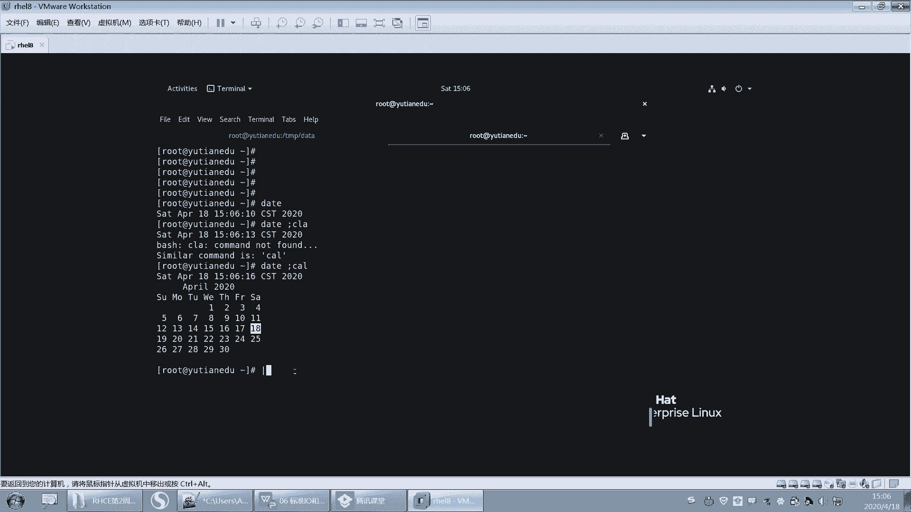

哎，关系对，会有一定关系。这个叫管道辅管道符啊。好，管道辅怎么用呢？管道嘛英文单词叫pple。呃，英文单词叫pal啊，叫ple，就是就就是那个地下管道管道那个管道是吧？就是。排水的那个管道是吧。

就就就那就那个嘛，对吧？就那个排布啊，叫呃呃叫叫这个好，那么我们可以用这样啊comd。你们可以写一下啊，commond一。哦，然后呢，管道。然后commond2。呃，然后管道commode3。啊。

点点点其实我可以怎么样，我可以加多个，我可以一直这样去加下去。只要怎么样，只要你有还有东西可以加是吧？那这是什么意思呢？好，这个指的是啊command一执行的结果作为command2的输入。

commond2执行的结果作为commond3的输入。好，我举个例子啊。

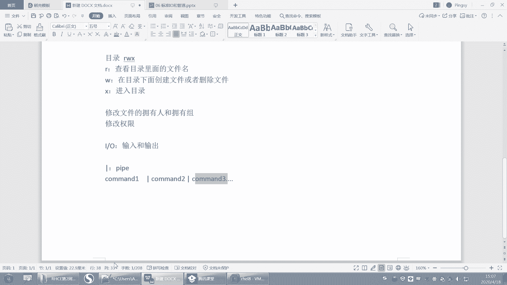

嗯。我们刚刚不是。这样去查了吗？对吧？这样去查杠name，然后password。好，这样去查会有两个结果，会有两个结果啊。那么这个结果呢，我想统计一下它的行数，我们后面会学一个命令叫WC。呃。

不是上厕所那WC啊叫what count。AL呢是指列出行有几行啊，回去。好，这地方就是2，看到没有？对，就是2。好，那么这个地方这个管道符起到一个什么作用？本来我是可以这样统计的，比如WC杠L。

比如说啊统计一下这个文件里面。哎，有多少行啊？哦，这个文件里面有多少行啊，有53行，对吧？那这个这句话的意思是。这个WC杠1。他所给这个命令输入的一些这个我这个内容是不是来自于password。

来自于文件，对吧？那文件的内容是不是给到这个WC杠L去处理。但是呢我们怎么样啊，在这个地方我们是将什么？将第一个命令的执行结果，也就是这两行将这个内容作为什么WC杠L的输入，让它来处理，统计一下行数。

对，统计一下行数啊。好，那你其实我像我我我这样去，我是不是可以再继续WC杠L啊，这样是不是只有一啊？那它这个WC杠LL统计的是什么呢？统计的是不是这个地方的输出有几行，能理解吗？

那统计的这个地方的输出有几行，这个二是不是只有一行啊，所以最后是不是只有一，那你再加是不是可以一直加呀，那你再加没有什么意义的嘛？因为这个一永远是一，永远是一，所以这个管道符我可以一直这样加下去。

只要后面的这个命令可以接收来自于前面这条min的输出。也就是说这条命令的输出可以作为下一条命令的输入，那么这样就可以一直管道下去，对一直管道下去。所以。这条命令这个管道符号，我们linux当中啊。

正是因为有了这个管道符，所以我们的这个什么。呃，我们的这个命令才可以各种以各种各样的方式，然后把它融合在一起去处理。好，你比如说啊。嗯。我看看举个什么例子啊，给大家用管道服是吧？好。呃。

我我我我就我就随便举一个吧哈，你看一下就行了。你你看不懂看不懂就算了啊。这个后面会讲嗯。好，我现在要做什么呢？呃。啊，要做一个杠F。嗯。请1234。5。好。然后看这里啊。我先把它给行给截取出来。好。

看这儿啊看这儿。嗯。你看啊。呃，我想去截什么呢？我想去截，你看啊DF杠H就是我们后面要学一个命令叫DF杠H它可以查根的使用百分比在这里看到没有？根的使用百分比是26%。26%啊好，那这个地方是根嘛。

这是根空间啊，然后这是我对应的分区啊，分区的名字叫DVSDAE对吧？好，那么这是根。好，那么我想截这个数字叫26%。哎，想截这个数字叫26%啊。好，那我我用这样一条命令把它截出来了，看到没有？哇。

截出来了26%。看到吗？然后你可以你看啊，我第一步先做什么，我第一步怎么样，先把这一行给截出来。那么第一行先截截出来之后，然后再去截什么，再竖着截嘛，是不是要竖着截啊，那我用下面这两个。啊。

实现了怎么样，竖着把它截出来。所以你看啊我要把它截出来这个事情。😡，最终这个结果是不是说我可能没有办法用一个工具让它去实现。但是我可以通过什么通过很多个工具，然后结合在一起，然后通过管道连接起来。

然后怎么样，最后得到我想要的结果，而且我还可以再继续怎么样加管道。😡，只要输出嘛，我还可以做我想做的事情，我还可以把这个26解出来，我可以把这个二解出来，我可以把6解出来，我把百分号解出来。

怎么解都可以。😊，啊，OK吧，所以这就是管道的作用啊，就是因为有了管道。但是你想一下，如果没有管道的话，那么这个是这个linux里面你怎么去玩玩转它？好，截一遍来先把这个输出输出到文件里面。

然后再用这个命令，然后去把这个行截取出来，然后再重叠一下到文件里面，然后再用这个命令怎么样呃，再去做进一步的处理，再去重叠一下文件里面，再用这个文件里，那你就你就太累了吧，对吧？所以怎么样，一步搞定对。

一步搞定啊，这就管道啊，所以他一定要会去用这个管道，这就用是管道。我们的我们的我们的这个命令才可以就是多种多样的去把它结合在一起啊，结合在一起。😊，好，我们后面把这些这些这些我都会讲啊。

这个这个什么这些命令都会讲啊，都会讲。只要你学会之后，这条命令就看能看懂了，好吧。😊，好，这个是管道辅啊管道斧。可能因为我们现在学的东西不多啊，因为命令不多，所以呃要玩出什么花样，这个有点难是吧？

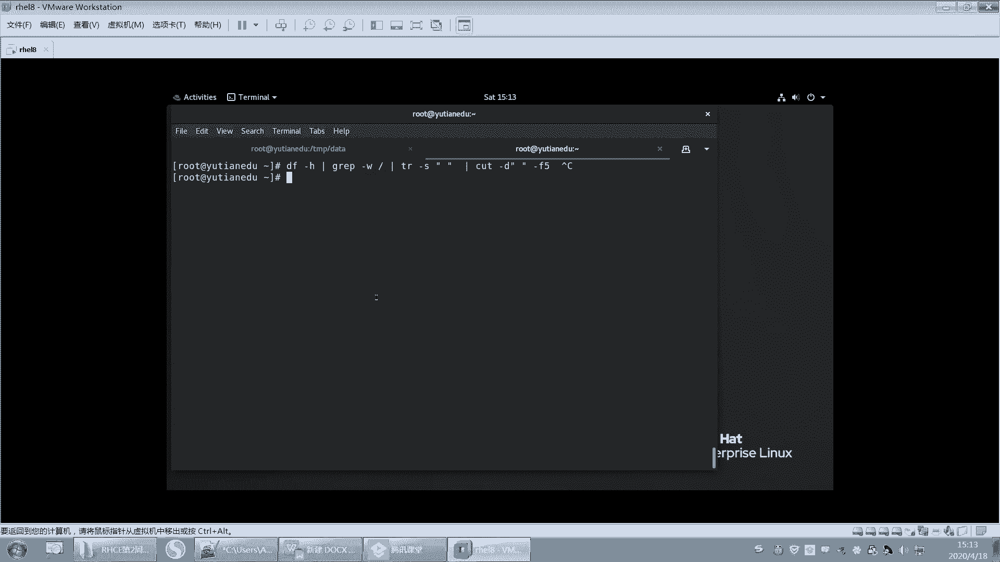

好，这里我举几个例子好不好？举几个例子啊。😊，呃，这地方有一个有一个一张图呃，这张图其实还是呃比较清晰的啊。但是有一句话。

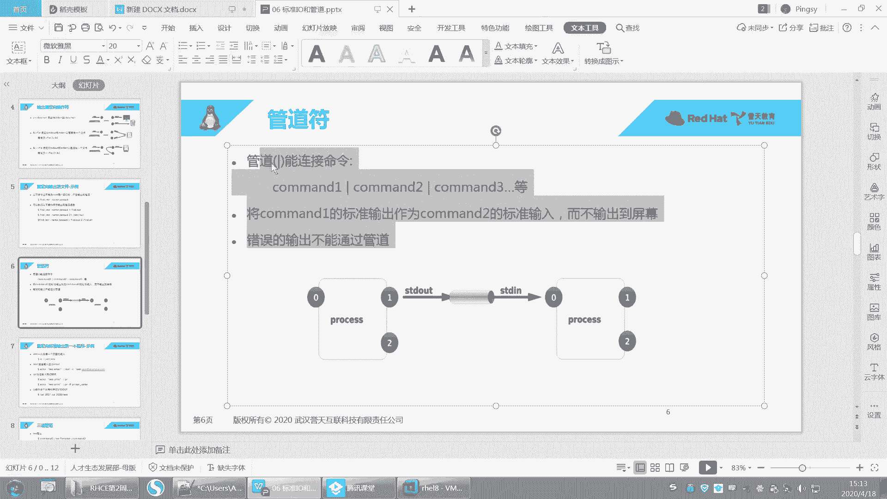

是这样的。切到U则一又有个坑啊，又有个问题就是。啊，什么意思？可以理解为fin的就是对这个这个。哦，对，是。呃，是的，是这个意思啊。呃，沈野同学嗯对嗯。好。

fendETC呃下面的杠name password。啊，那么你看啊现在呢我想怎么样，我想对这个输出进行一下这个嗯进行这样一个统计有多少行，对吧？想统计有多少行啊，那么。这样我统计的话会有几行呢？嗯。

我有几行呢有点数是吧？1234699好，不用数回车直接回车了。唉，几行呢只有两行看到没有？这个地方是不是只有两行啊，那前面这些是不是都没有统计啊？是不是直接输出到终端了，而且只输出了这个2对吧？

只输这个2，那说明什么呀？说明WC杠L有没有统计这些内容啊，只统计了什么，是不是只统计了这两行正确的输出。OK吧，它只统计了这两行正确的输出啊，它没有统计这些错误的输出。所以我们可以得出一个结论啊。

叫什么呢？哦，好这个结论下的有点早是吧？😡，好，你可以再去测啊，错误的输出。是不可以通过管道的。因为你想一下，如果它通过管道了，一定会被WC杠L统计，是这样吗？那没有统计是为什么呢？

是因为根本没有通过管道，这个输出根本就没有到达什么，没有到达这个WC杠L，没有让WC杠L统过统计。其实我不嫌它输出的是什么，对吧？你输出错误的，我也给你统计，正确的我也给你统计，但是没有通过管道。

所以没有统计啊，记住有句话哟，叫错误的输出，怎么样，不可以通过管道，不能通过管道，OK吧。😡。

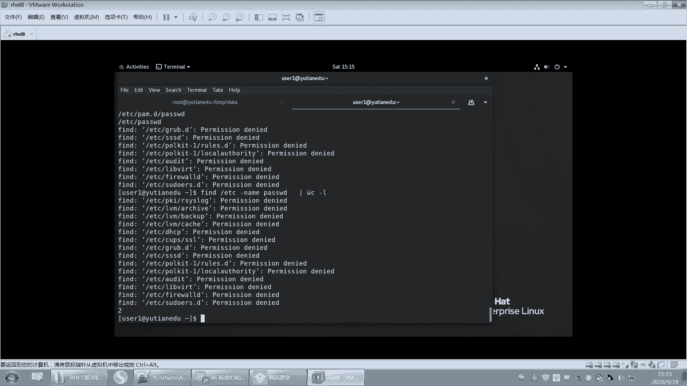

好。但是我现在就想让他通过管道，对吧？怎么办？怎么办让他就通过管道啊。😡，有没有同学能帮我实现？到目前为止，我已经讲过了怎么实现呢？怎么让他就通过管道啊？呃，好好很好啊，很棒，大家都听了啊。

大家都听了是吧，怎么样啊？😊，错误的是不是从这儿出来的呀？😡，那让他怎么样啊，作为正确的从这儿出来，是不是就可以通过管道，你看管道哇，真的画了一个管道哎。😡，是不换了个管道啊。你看。这图还是蛮形象的哦。

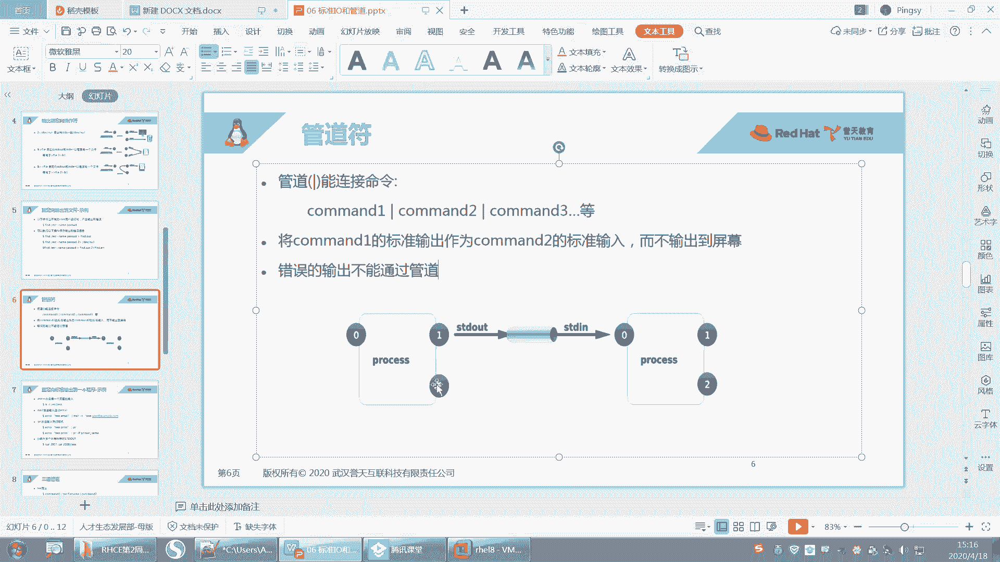

是吧。所以。二大于号and一O。而且二大于号N一是在哪个地方呢？嗯。UTC杠 name。在哪里啊？是不是放在后面放在后面，对吧？哦，怕错了哦，就直接二大于号。and呃呃end一是吧，然后再来怎么样。

WC杠要回去。统计了吧，对吧？16行啊。啊，都统计了。如果没有统计的话，没有经过管道，在这一部分没有没有没有它统计，它就会输出了，它就会输出了啊，O吧，那二大于号and一2大于号and1啊。哦。

我是说你哪个地方这个敲的感觉有点不对劲啊。

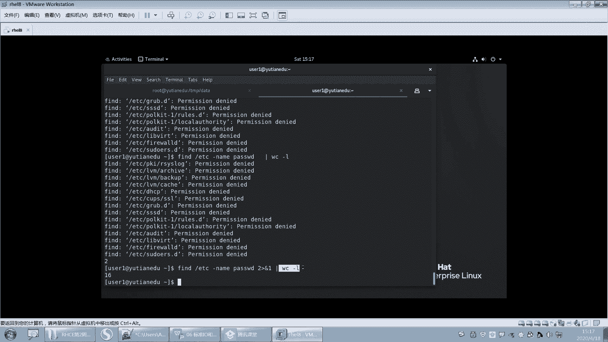

好，这就是二大于号N的一的作用啊。啊，错误的输出不能通过管道。但是如果让它作为正确的输出，它就可以通过管道了啊啊通过管道了。呃。这就是管道啊。好，下面有几个例子，我们来看一下啊。

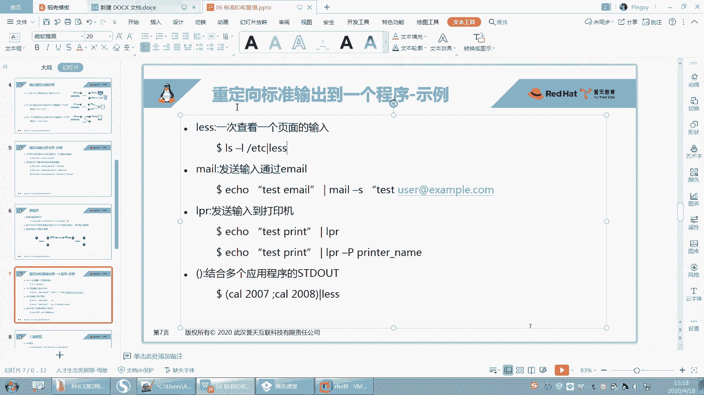

嗯，我们lesss后面也会学呃，比如说我们之前学到的这个呃这个。啊，比如说的data刚刚ha对吧？我们说这个命令啊太长了，要上下翻上下翻，对吧？那我就可以通过管道，然后将这个结果丢给另外一个命令。

让它分页去显示，这是我们后面要学一个命令啊，就分页去显示，这样你一页一的查看，而且可以上下这样去翻，对吧？这是不是就就是管道的唉管道的作用，对吧？管道的作用啊，嗯。

这是一个命令的结果丢给另外一个命令来执行啊，这是管道啊。

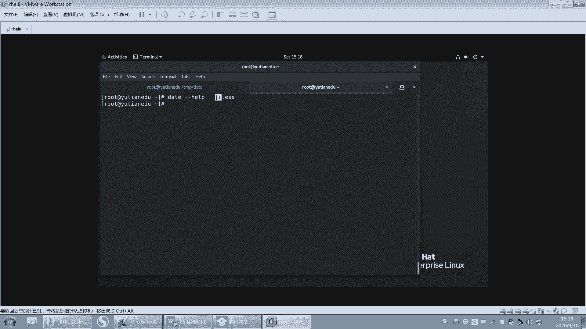

好，还有呃我们还可以去发一封邮件啊，这个邮件呢我们给大家讲一下啊。

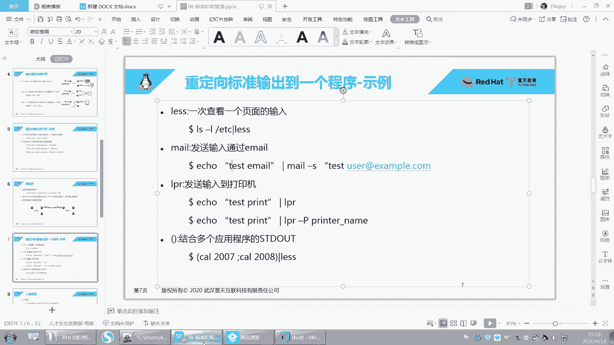

嗯，比如说。我要去。哦，不好意思啊，这个这个邮件好像他这个工具还没有装，那就算了吧，到时候装了再说吧，好吧。

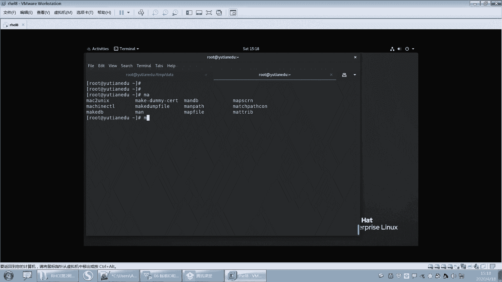

呃，这个命令好像没有装红帽七是装的，红帽八这个这个这个没有装是吧？好，没有装就算了吧，这个就不看了啊。呃，还有就是嗯比如说你可以eco什么，对吧？eco什么东西，然后。呃，这个是打印机吧。

这就是你连了个打印机，有打印机的命令叫IPR，不知道现在有没有了啊，IPR。

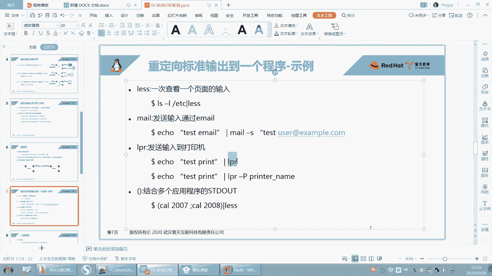

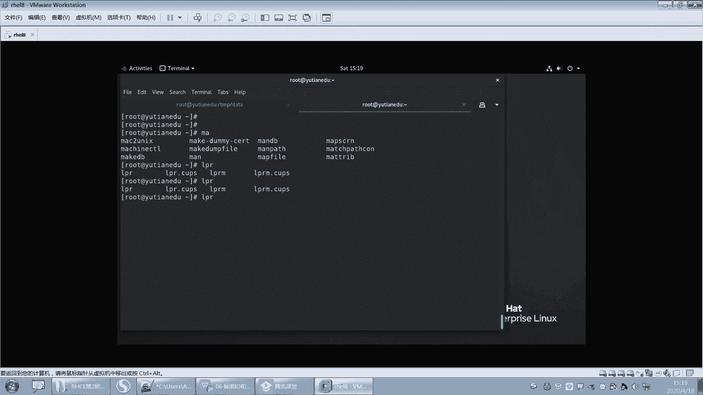

那还真有还有是吧，说命力还是有的IPR。他是说就是呃eal test free你就交交给打印机，然后呃打印机会把这个内容打印出来，然后这个是指定打印机的名字啊，就是管道的作用，好吧。

将内容丢给这个命令的输入。啊，这边的输出输入好吧。

呃，还有我我再举个例子啊，是这个例这个例子是有问题的，好吧。嗯，我之前有有布置一些作业，是这样，我是这样布置的。我说要创建一个目录，叫data下面的。当然sintoS哦，比如说HE好吧。好。

然后创建完这个目录之后，并且要给这个目录呃去修改这个。权限好，我我写几种啊，大家觉得哪个对的答错的啊。change O755吧嗯。77吧。然后data下面的HEL好，这是一种啊。啊，然后第二种。

MKDRdta下面的HEL。呃，管管道服千就问。77data下面的HEL。哦，好，这这是第二种是吧？呃，当然还有第三种可能就大家就没有学过了啊。呃，HEL啊，然后and符号。

这个是我们后面要学的一个and符号，然后迁就on。呃，七7就对他讲这样子啊。2，去要。反正我我反正很多同学就是大概做就是这三种呃，他就不要分开，他就其实你分开做这样是不是也是对的，对吧？

先先创建目录再再修改权限。啊，那这你第三种看不懂就算了。好吧，那前两种你觉得哪个是正确的，哪个是错误的。好，就说呃哪个正确，哪个是错误的吧。第一个对不对啊？第一个可不可以？第一个可不可以？啊。

一是正确的是吧？那第二个呢第二个是什么鬼啊？第二个。这是什么东西啊？你看一下啊，左边是创建目录，右边是修改权限，他们两个有关系吗？没有任何关系，而且左边这个管道左边的这个命令输出的结果有结果吗？

你结果传递给第二个了吗？😡，我。好像还有同学哇，他真的成功了真的成功了。对，真的成功了，但是不能这样用，听到没有？不能这样用啊，它是空的，不能这样用。就是你不是说所有的命令。

他们两个都可以用管道来连接起来。而且你这样用有意义吗？没有意义啊。对吧。没有意义啊，所以管道不能乱用啊，你不能说任何注意，不是任何的命令都可以接受来自于管道的输入。😡，能能能记记住啊，不是后面。😡。

如果这个千就问这个命令是吧，它不能接收来自于管道的输入，那么这句话就是错的，这个就错的，不能执行。不能执行啊，所以要注意啊，不是这样用的，就是还果真不止一个两个同学这样去做啊，我不知道为什么这样去弄啊。

没有意义，好吧。好，下面我教大家来去用一个啊呃。这个这个这个。他还真成功了是吧？哇。嗯，你看是成功了没有啊？没成功哎。哦哦，sos sorry啊，这边改成迁就O了是吧？哦，成功了的。哦，你千金mo是吧。

写错了啊。😮，啊，那成功了是吧嗯。哦。这个我们这个好算了，翻篇吧。好，翻篇啊。好，那下面啊我们想去修改密码。呃，修改密码啊。啊，修改密码呢，我们这样回车是不是这样看不到啊，是不是看不到这个密码，对吧？

所以我们在想啊唉。你你你们之间还有交互，你看不修改密修改密码，还有交互，对吧？还要来回敲两遍，所以很麻烦怎么办？我们就怎么样？我们就呃给他这个这个能不能说哎password这个能不能通过一条命令搞定啊。

而且不要交互啊，对吧？所以这个时候我们想能不能通过管道的形式把这个密码传递给什么password呀，对吧？能通过管道的形式啊。😊，好，那这个时候我们就去卖呀。啊，刚刚卖过了啊。对。

刚刚我们是卖过一个参数嘛？啊，卖过一个选项是吧？这个选项叫杠杠sing杠杠t啊，你再回来阅读一下。好，你看啊，还有这个选项啊是用自于用的indicate是吧？呃，暗就是显示还是暗示什么还是怎么样呃。

password读新的密码从哪里从标准输入，但这个标准输入可以是什么？可以是管道哦。其实说白了管道也是一种输入也是一种标准输入。管道也是一种标准输入哦。对，管道也是一种标准输入啊。好了。

那么这个时候我就可以怎么样。你看啊那密码怎么传递给他呢？你看啊eal我可以这样啊，eal redhead，然后管道password。你要给谁修改密码是吧？你说你是不是要指定给谁修改密码呀，那这样还不行。

😡，因为你要告诉他。你的密码来自于标准输入。所以。怎么样加一个杠杠s。O吧，加一个杠杠t啊。好。前面会显示rehead这个rehead的结果呢会作为password的输入。

而且这个密码是不是来自于你看我怎么知道是来自于管输入了那个密码来自于管道啊，是不是我加了一个杠杠s，有同学不加杠杠。然后给谁修改密码呀，给root修改密码，这样OK。这样是不是就成功了？😡。

对吧一条命令搞定，而且有同学还在疑问说能不能这样rehead。他做的为什么要加个依扣啊？这样行不行啊？啊他说d ahead嘛，你干嘛加个eal呢？这不多词一举吗？对吧？

还加个ealeal什么什么什么什么，我加个eal是吧？😡，好，你这样会怎么样啊，会报错吧。😡，对rehead不是命令啊，那左边应该是个命令啊，你左边的命令是什么呢？rehead吗？

rehead不是个命令，所以报错怎么样？这个命令不存在那这个命令不存在，所以你要让左边的个输出是不是是rehead就可以了嘛？左边的是输出是rehead那。😡。

这样的话这个输出是不是可以作为什么pasword的输入了？对，就这个左边的输出就是一堆报错啊，就是一堆报错，就这个样子啊。这已经报错了。嗯，已经报错了啊。好。呃。呃，这个就是你你别看这些小问题啊。

有同学很纠结，因为他不懂啊，就很纠结。他说你你加个E口干什么是吧？

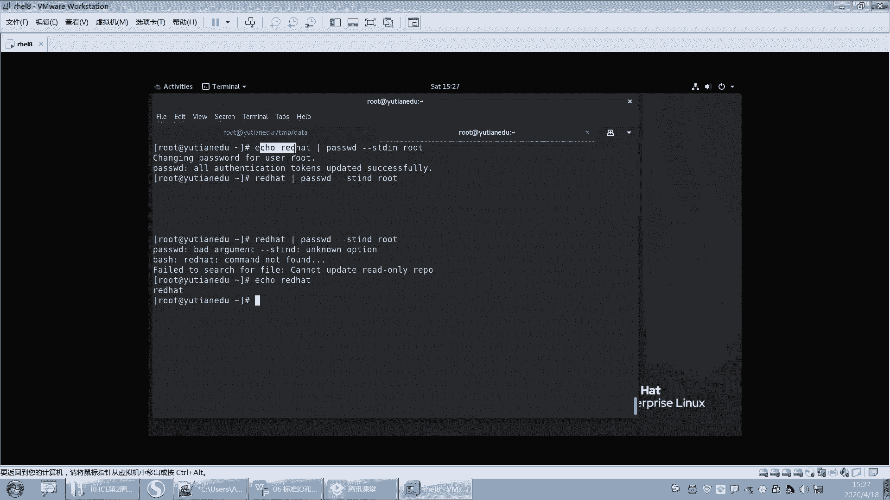

咱一口做什。好了，那这个就是管道啊，管道的作用是吧？好，下面还有一个符号叫大于号哦，不是叫叫叫大括呃，小括号啊，小括号呃，这个小括号有什么用呢？嗯来看一下啊。

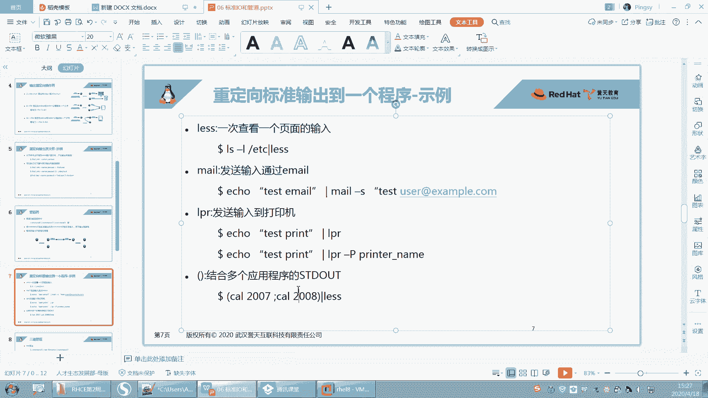

嗯，小括号，比如说da塔。还有这个例子啊，CAL。呃，这个小括号假如说我这样呃大于号，然后到C呃的到呃Fll好，我我这样的话啊，如果中间用分号。用分号来隔开的话。左边这个命令和右边这个命令是吧？😡。

那这样的话，请问当前还会有输出吗？哦，全部好不好？我们全部吧。其实全部全部都一样的，都是正确的。那就当当前终端还会不会有输出呢？唉，当前终端它是怎么样啊，它会有输出哦。对不对？输出的什么呀？

输出的是不是da呀？😡，因为我们这个分号啊。它将怎么样，是不是以分号为分分分界线，左边是左左边是一条，左边是命令，右边也是对吧？所以。如果你想让。这个地方完全全部输出的话，那就像个小括号。

一起作为一个整体小括号作为一个整体。那么这个时候怎么样就全部输出到fill里面了。哎，全部设置到fi里面了啊。啊，那这个。这个就就就没什么啊，这个就是这个小括号的作用，小括号的作用啊。

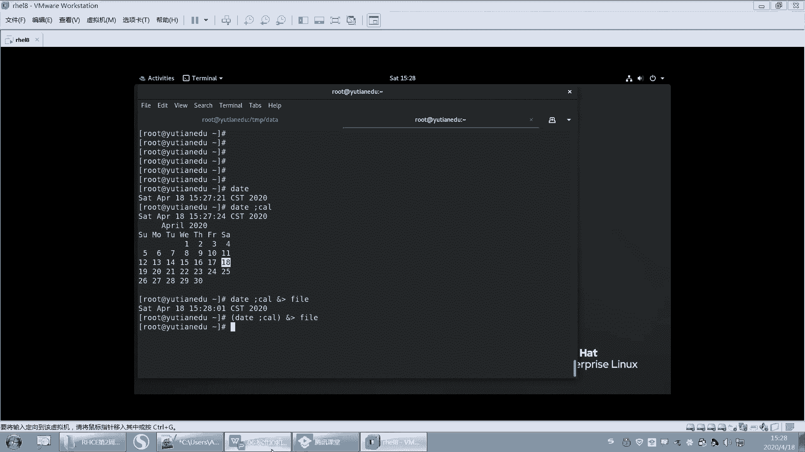

好，这就合并输出嘛，合并输出的意思啊，将多个应用程序输入到标准输出。好，这是分号跟这个这个分号跟管道的之间的这个关系啊。你后面会经常用到管道的。🤧嗯嗯。这个。这个要看这个命令的。呃，他的解释啊。

要看这个命令的解释，好吧，一般这个命都会有解释的。OK吧。

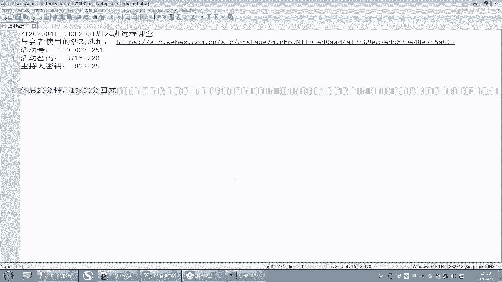

我来了啊。回来了啊。嗯，我看了这嗯这么多命令啊，一般呃什么样的命令能接受来自于管道的这个。管道的输入是吧？一般文本处理的文本处理的这种都可以，基本上都可以。

就是文本处理处理文本内容的一般都可以接受来自于管道的。其他就不一定了。比如说CP啊，可不可以，那不行。RM啊也不行。嗯，像这种都不行。呃。大概是这样。除非这个命令有特殊说明，就像password。

这种password这种它有特殊说明说它可以来自于管道，那它加选项是可以来自于管道，否则一般一般的命令啊。因为我们管道它对于处理什么处理文本。是有必要的对吧？我们在处理文本的时候。

我们可以要通过通过管管道，然后呃将多个命令对这个文本内容进行处理，对吧？处理处理多次之后然后得来一个结果。所以一般。处理文本的文件这个这个命令都可以。你像WC啊，我们WC对吧？这种它是统计文本的。

对不对？我们后面还会学什么gra啊。呃。salt呀等等这些命令NS啊。猫呀，这些都可以。啊，就是处理文本的一般都可以。

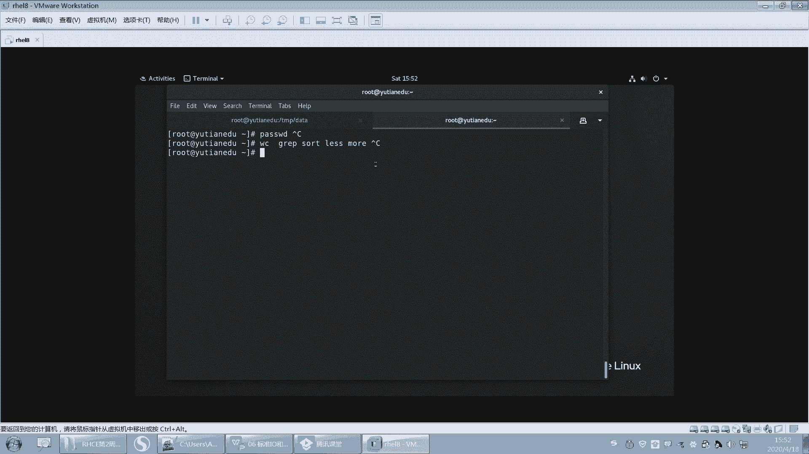

O。好，嗯，下面呢我们来看一下啊。继续。呃，我们有一个还有一个这个啊，这个根不是很重要。但是呢呃既然有的话，我们就跟大家说一下啊，这个叫三通管道，叫T是吧？

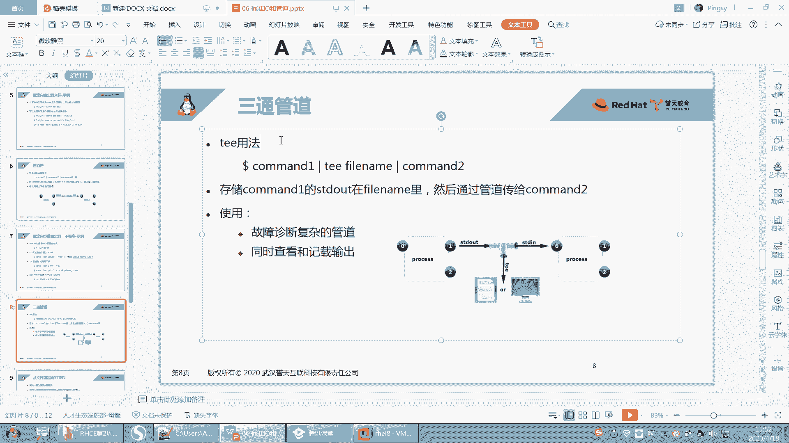

好，我们先来看一下还有什么用啊。我记得之前执行过一个命令是这条命令是吧？比如说这条命令啊，511这条命令。好，那么这条命令呢，如果它管道用的比较多是吧？那一管道管道管道管道用了三个管道。

那么如果我一执行耶错误了，你们有可能做过错误了，对吧？不是我想要的结果，那到底是哪个环节出现了问题呢？是这个环节还这个环节这个环节，那是不是要一个个试啊？然我第一个啊执行一遍，第二个执行一遍。

第三个执行一遍，或者是我第一个怎么样啊，能不能说把它保存到一个文件里面啊啊，第二个也保存到一个文件里面啊，第三个也保存到一个文件里面，对吧？最后得到的结果。

这样的话我就可以分别去看第一个第二个第三个执行的结果。😊，好。但是这种。比较麻烦。但是还有一个问题就是如果你将这个结果保存到文件里面了，或者将这个结果保存到文件里面，那看会发生什么事情啊。啊。

保存到文件怎么保存呢？我们无非就用重定向嘛，对吧？😡，呃，用重定向符号。好，假如说我们用一个。从定向符号啊从定向到这个。grave点 out。啊，那么我用了重定项之后。在后面的话，我们看一下啊。

在后面就没有任何输出了，对吧？没有26%了。好，我们来看一下grab里面啊。gra里面是不是就这个这行保存内容是吧？啊，那么我们发现如果一旦这个内容保存到重定向了，它还会不会通过管道呢？注意啊。

如果一旦重定向了，它就不会再通过管道了。那么TR它没有接触到任何输入，所以在后面没有任何输出。所以你一定要记住。管道跟重定向之间，它们不能同时存在。也就是说你通过了重定向，重定向了就不能通过管道了。

能理解吗？好，那怎么办呢？我想达到这个什么，又要保存到文件里面，又想让它通过管道。所以这个时候我们就可以用第三，就用我们我们现在要学这个命令叫T。叫T啊，好，怎么用了呢？管道。

T后面接上一个gra点out。啊，group点 out。好，TR也想保存吗？对吧？那你就加一个管道T。呃，TR点out。No。TR点O。对吧好，最后要不要保存？最后你可以重定向了嘛。

因为最后没有管道了是吧？最后你可以重定向到什么cut点out是吧？呃，或者你不重一下也可以把它保存一下。呃，就直接输出输出到当前终端也可以看是不是输出了，对吧？同时呢生成了什么gra点out。

TR点out，而且TR点outt里面呢。是不是有这一行？然后groupip连out里面是吧？是不是有这一行对吧？这就叫三通管道，三通管道，既它其实就类似于是重定向的作用，类似于重定向的作用啊。

只不过它可以重定向，把这个输出先重定向到文件里面。然后这个内容呢还可以通过管道。对，还可以通过管道啊，就是这地方这张图，那你可以看这张图啊，本来我们管道就是这样一个就是直一个横杠，但是它多出了一条是吧？

叫三通管道，然后它的输出。那左边这个输出通过管道之后啊，通过管道可以T是吧？T输出到这个输出到输到终端也可以输出到这个文件里面也可以，对吧？然后再怎么样作为下一个进程的输入啊，作为下一个进程的输入啊。

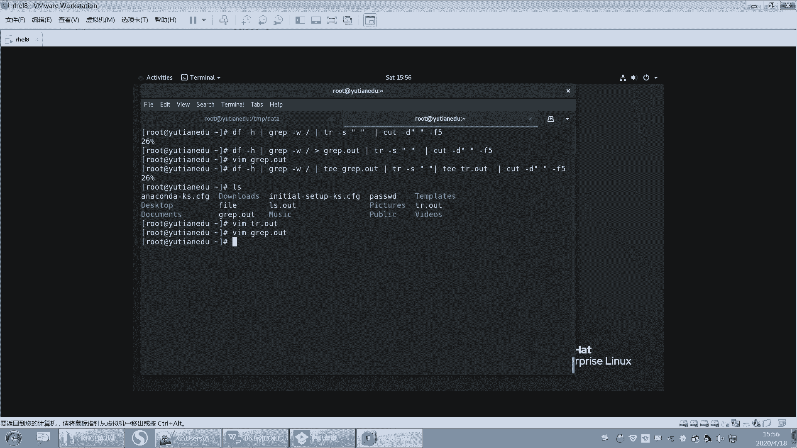

啊，这个它有什么用呢？呃，就这么用的，它用法是这样用的，呃，主要是用在什么？呃，这个用于比较复杂的管道连接的时候，中间用它来去连接，对吧？然后把把那个每一个管每一个管道的输出输出到一个文件里面。

然后怎么样把它记录下来，然后回去查看结果等等啊，就这个样。呃，但是平常嗯用的比较少，但是知道就行了。好吧，有这个有这个东西啊，有这个T这个这个这个用法。嗯，好，这个是这个T的用法啊，T的用法叫三通管道。

好，下面我们再来看一下啊，我们之前学了这个。一般我们是现在都在学什么，都在学输出，对吧？呃，唯一学了一个输入，就是标准输入，就是管道呃，可以作为标准输入。好，下面来看一下输入啊输入。

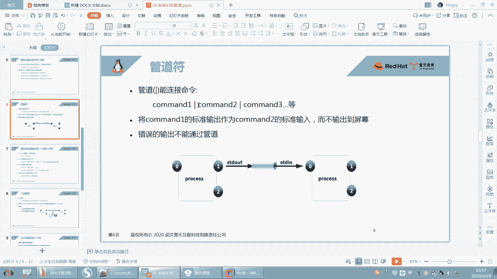