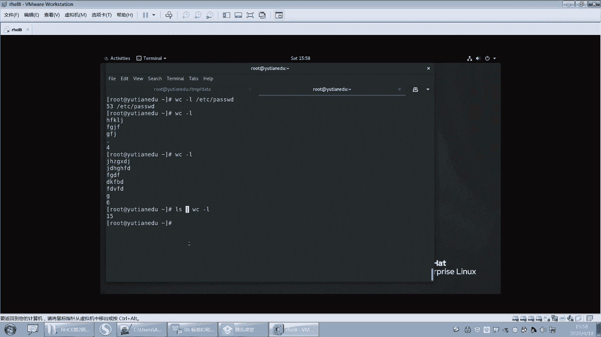
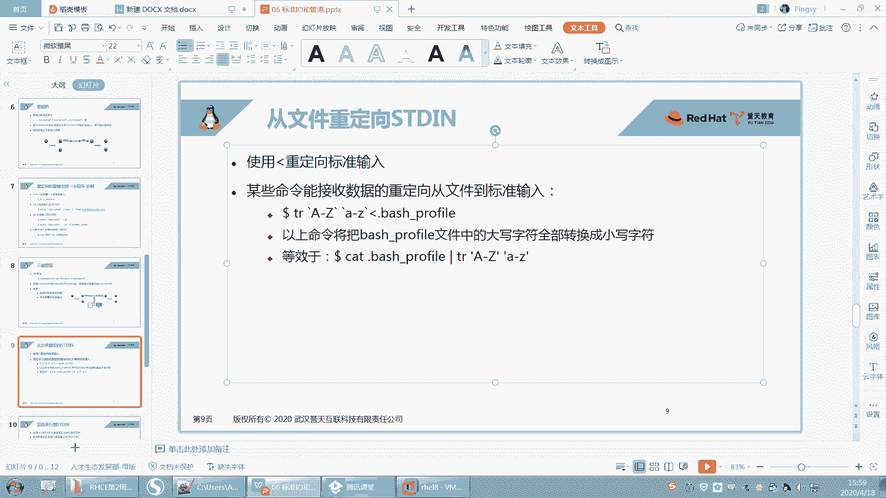
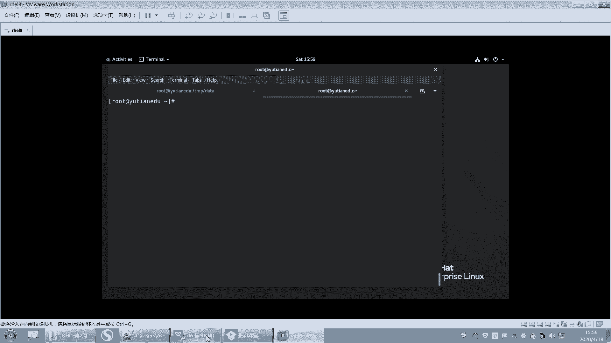
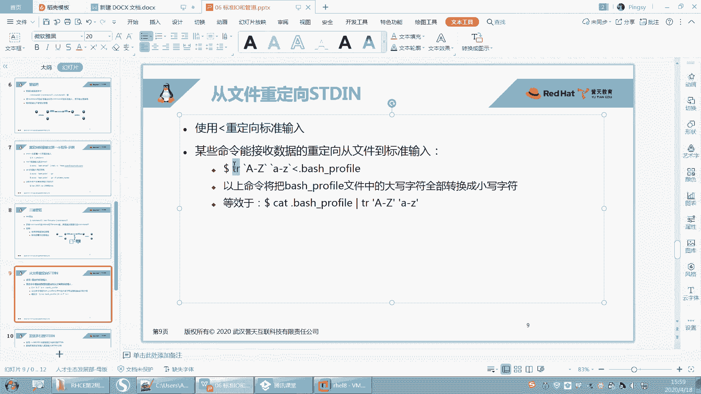
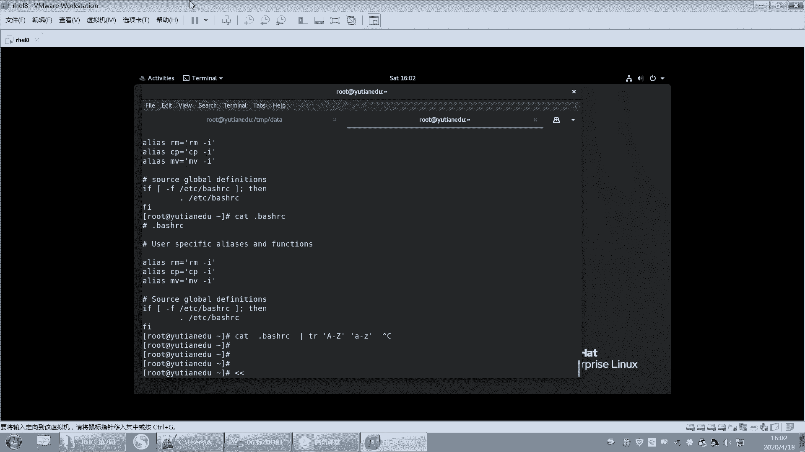
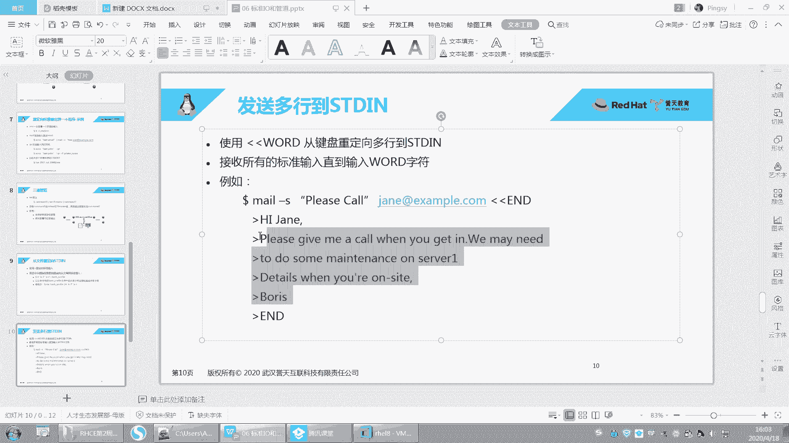
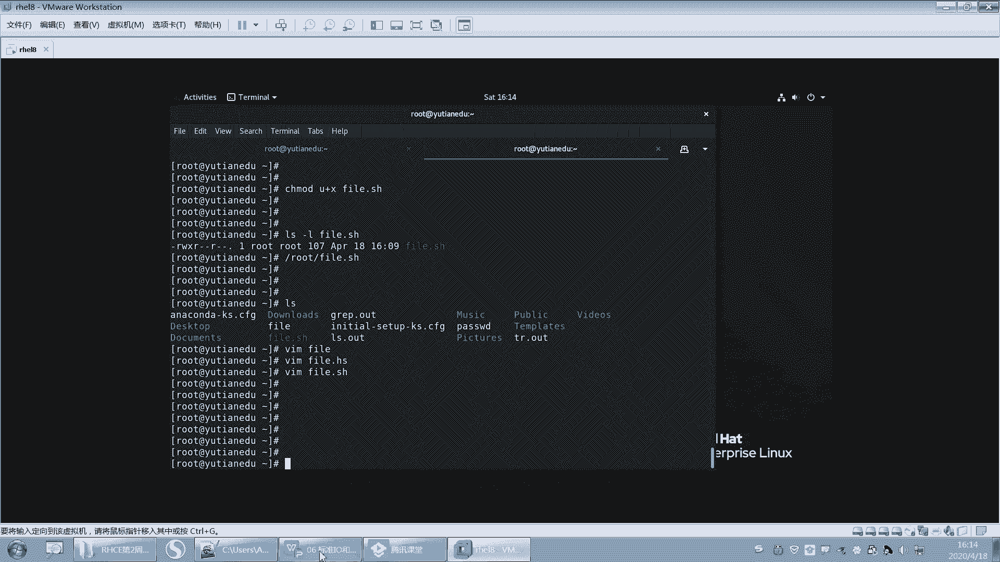

# 【重置详解版】孙老师讲红帽系列视频／RHEL 8.0 入门／红帽认证／RHCE／Linux基础教程 - P25：25 输入重定向的用法详解 - 誉天孙老师 - BV1aB4y1w7Wi

来看一下输入啊输入。呃，一般我们输入是来自于哪？一般我们的输入啊，它是来自于呃，比如说你看啊我刚刚不是讲WC吗，对吧？啊，你看我们这个输入可以来自于文件，是不是可以来自于文件啊？啊。

也可以来自于我手动去输嘛。我不知道这个WC杠11可不可以这样。好像唉也可以，这个不知道怎么结束啊哦，这样可以结束，看到没有？你看啊我现在是不是要统计，但是统计什么没告诉他，对吧？😡。

它就会等待你输入okK吧，等待你输入。那我的输入是不是来自于键盘，看到没有？来自于键盘这样敲，对吧？好，结束怎么办？ctrl D结束好，几行呢？统计了123456是不是六行啊？啊。

那我演示的这一种是不是。输入来自于键盘OK吧，输入来自于键盘啊，那么这种呢输入是不是来自于文件？对吧这种输入可以来自于文件好，输入还可以来自于什么，还可以来自于管道嘛，是不是管管道啊，那这样。😊。

这样是不是可以来自于管道，对吧？

啊，这都是这都是的啊，这都是好，下面我们再来看一下啊这个输入嗯。我们有一种叫输入重定向。

输入重定向啊，因为这个呢命令它很它很特殊，它怎么样啊，它也不是说特殊吧，它就直接可以接，它本来就是接文件的对吧？它可以来接文件。但是你看啊如果我们。

这样啊。我们就有个例子。

呃，这个例子叫TR，它是转换的意思。好，TR这个命令呢，你看我们来用一下啊TR。把大写转换成小写。好。它指的是将一种类型的字符转换成另外一种类型的字符。那A到Z指的是大写，小A到小Z指的是小写。好。

那我这样回车的话，是不是等待我输入ok吧？等待我的输入啊？好，那我写个大写喽，回车。是变成小写，我写个大写啊，是不写小写，我写个大写啊，它是变成小写，对吧？它就它就会帮我怎么样帮我去这样做这样的转换啊。

那我的输入同样是来自于键盘，对吧？😊，好。那我想让他输入来自于什么？来自于稳健，可不可以，对吧？我们。😡，让它来自于文件啊。好，来自于文件，这个呢我们不就不能直接接这个文件了啊，它怎么办呢？

还得用一个叫输入重立项。也就是说输入本来来自于键盘，但是我这个首项输入来自于什么？来自于文件，就叫输入重立项。输入重立项啊。好，比如说点b选C。一个隐藏文件啊。好，我们让输入是来自于什么？

来自于这个文件啊，那么这个输入作为什么？作为TR的输入对吧？那作为TR的输入啊，跑回去了。啊，这个文件里面呢其实本来是应该有大写的，我们可以打开看一下啊。呃，起码这个U是大写吧，对吧？S是大写。

但但是我们在这个地方。的输出有没有大写呢？没有对，这个地方是没有大写的啊，全部转换成了小写。所以这个叫输入重定项，OK吧。这个用的比较少，为什么呢？因为我们通常这条命令呢。

我们都会用另外一条命令来替代了。这条命令是我们后面要学的叫。这个。我们一般用它来代替了是吧，用这个catch呃，cat是我们后面要学了一个命令，叫呃cat的话就是直接你看cat。

点8小C我们每次看文件就是我我每次都要VIM进去是吧？但这次不用了，直接cat这个文件，就可以直接打印到当前终端。好，那么这个有输出了，这个命令是不是有输出了？那么有了输出之后，我是不是可以通过管道。

因为管道也是一种什么，是不是也是一种输入啊，也是TR的一种输入，对吧？那通过管道嘛，所以你你建这种方式建的比较少，那这种方式你用的比较少，是因为呃我们通常就用这个来代替了。那用这个ca什么什么。

通过管道来代替了啊，但是这个要知道好吧，这个标准输入要知道啊，好，那虽然这个小于号用的比较少，但是我们有一个符号用的还是比较多的。哎，这个符号叫两个小于号。嗯，叫两个小于号，那一个小于号叫输入。

那两个小于号叫什么东西啊？啊，猜一下两个小于号叫什么？我们之前一个大于号是什么？一个大于号是输出，对吧？两个大于号叫追加追加呃，然后现在是一个小于号，是输入两个小于号呢。

好，两个小于号呢指的是多行输入。啊，这个。这个就是我刚刚举的例子啊，大家可以这样看一下。呃，两个小于号啊叫多行。发送多行导输入。好，哎呀，这个地方。😔，看一下啊，这个mail又不能发邮件。

我用什么来给它测呢？

嗯。用什么来给它凑想一下啊。多行输入。😔，我看这个我没试过啊，我看这个行不行。A我刚刚用的是这个例子是吧？嗯。这个可不可以多行输入啊ABC。好像也可以是吧？嗯。刚刚我们是什么？刚刚我们是一行一个输出。

一行一个输出是吧？那我看一下这个行不行啊。嗯。好，我试一下啊，写个大写的对对对。好，但是你看什么时候结束呢？怎么办？遇到ABC就结束。ABC回去了呀，可以是吧？你看。你看啊看这里。刚刚我们是什么？

刚刚我们是。一个输一个输入就一个输出，一个输入，一个输出是吧？但是我现在不想让一个输入一个输出，我想什么？我想它。😡，多行再输出。那给它传递多行对吧？传递多行啊，那传递多行的时候，我用两个小于号。

两个小于号表示啊有两个小于号表示。好，那么两个小于号后面接了1个ABC唉，其实你不接ABC也可以。但是为什么要接ABC呢？唉，如果你不接ABC，你下面所有的内容都会被大写转换成小写。

那么接了ABC代表示它会有个结束符，就是到哪个地方截止到碰到这个ABC就截止，后面这个随便写随便写啊，我我们一般是写一一呃这个这个你看啊我们一般是写这个。一般是这样写是吧。

写EOFEOF叫N of file。呃，end of of file是吧？end of file啊，这是文件的结尾啊，代表是文件的结尾啊，呃，这个随便写好吧，嗯，要写要写啊。😊，好。

那这个地方在脚本当中会经常用到在脚本当中会经常用到啊。好，我。这个脚本还没学是吧？嗯。脚本没学怎么办嘞？好，我我要不我给大家演示一下吧。好吧，没学就算了啊，我给他演示一下，看一下效看一下结。

看一下效果啊。啊，我我们其实脚本说白了啊，就是往一个文件里面堆命令就是样。呃，往一个文件里面去对命令，就就这样啊，没别的没别的啊。好，我我在里面我把命令全部对到这个里面。😡，好嗯，假如说啊。

我们想去修改一个文件，而且往一个文件里面去写。😡，呃，写很多好。你往一个文件里面去写很多行，你在命行你怎么写，你是不是这样写？😡，一al比如说写个hello，然后重进向到文文这个追加到文件，对吧？好。

然后先写个word。呃，word。然后这一到文件，就是你写多行嘛，你是不是可有可能会这样写？😡，对吧但是你想一下，你写脚本，你是不是也可以这样写？😡，你脚本就这样写嘛，ic hello啊。

到这个呃呃root写个绝对路径啊。写个绝择路径啊。Root。呃，然后eal word。呃，到是吧，root下面的。啊，fi要这样，但你可以这样去写，一直下去，但是这样是不是写的很low，对吧？

而且很多行你怎么写？😡，好，那这个时候我们就可以用多行输入啊，多行输入。好，这个还没学是吧？catch不管它先用了再说。好，cat rootot它是一个特殊的用法啊。两个小于号EOF。哦，cat。

这个写个重立项，好吧，这个是追加吧，是不是追加呀？好，那看一下这句话啊，看一下这一行。这个这一行指的是。cat什么东西，然后从追加到这个root下面的fill，对吧？😡，好，那么这个是多航输入。

这个是遇到UF就结束。好，然后后面呢写上，比如说ABC呃，刘的。好，EOF结束。好了，那么开的什么东西呢？开的这一堆东西，然后到这个文件里面。😡，么ca这一堆可能大家很难理解是，为为什么用ca是吧？

就ca这一堆东西，那到这个地方啊。😡，好。遇到ABC就结束，这个比较适合一写脚本。呃，就是比如说啊你将来我们要配亚么仓库，比如说你要配个亚么仓库，就是我们要装包啊，配一个亚么仓库是吧？大家应该听过啊。

没有听过也没关系啊，你配个亚么仓库，你每次怎么样啊，每次都要手动去配，那你怎么办？而且还有比如说我要修改IP地址啊，每次都要去修改。那如果每次都一样的话，你要做同样的操作吗？

这个时候干脆怎么样写一个脚本，把命令全部对到这个里面。啊，那你往写亚么3公交文文件里面去写追加一些内容，对吧？那这个时候你就可以通过这种方式，你这个随便写中间你就这个文件想怎么写就怎么写。

然后最后这一行跟最后一行固定就可以了。好，那我下面如果再写的话，这些内容是不会追加到这个文件里面的。这就是多行输入的作用。这个会经常用到啊。这样吧，我们试一下好不好？我们试一下啊，你看啊。

看会不会最终写到这个文件里面，上面我是不是先写的这个这个叫hello和word是吧？然后最后又写把这这三行，这四行写到这个文件里面了。好，呃，这样这个文件本来要执行的对吧？我是不是给他一个执行权限。

我们是要执行它嘛，对吧？给他一个执行权限。好，那用人就有执行权限了呀。我这不是刚好我们上午学的吗？我要要执行这个文件，是不是要给他一个执行权限？😡，啊，那么怎么执行它呢？

是不是用root下面fill去执行啊，这样去执行呢？直接回车就执行了。回车。好，那我们验证一下最后我的这个文件到底有没有写进去啊。打开这个文件看一下。你看我真的写进去了。写了个hello。

这是我之前写的是吧？好，脚本里面是写个hello，写了个word，然后把ABC这四行是不是都都添加进来了？😊，对，都添加进来了。OK吧。那这四行都添加进来了，所以这个就是什么多行输入的作用。

它可以用来编辑什么？也可以用来编辑文件，多行编辑文件啊，多行编辑文件。救助作用。就是这个作用啊，就来编多行去。一次性多行编辑啊。一个文件的多行就这样。呃，用法其实呃就这么就这么简，就这么简单啊。

这个不知道我说大家有没有听懂啊，就是你可能现在没不会写，对吧？没关系，你只要知道这个两个小于号是干什么的，它就是在下面它可以加入多行。然后遇到这个后面就是结束符号，遇到UF就结束了。

下面内容就如果还有就不要再。不要再写到这个文件里面。前面你就固定去用这个用法就可以了。这个是追加的意思。哦，cat是看一下什么什么内容。看一下这个内容。呃。这个听懂了没有啊？这个。

这个这个地方能不能听懂啊，这个两个两个小于号。我再说一遍啊。这两个小于号用用在什么地方？它就是用在我们在编辑一个文件的时候。编辑一个文件的时候，我想去输入多行，其实输入一行。

你看我直接eco是不是同一项就可以了呀。但是如果我要输入多行，我说要一口一口要写很多行啊。😡，但是有了这个小于号之后，我们就可以怎么样啊，我们就可以。把多行一次都放在这个地方，你想写多少就写多少。啊。

那么这下面的内容都会被追加到这个文件里面，为什么是追加？因为这个地方我写的是小于小啊，呃这个大于大于。如果我写一个大于，是不是就是重一项就覆盖了，写两个，是不是就是追加？好。

那么既然下面的内容都会被追加到这个文件里面。那如果这个脚本下面还有内容呢，比如说eco。对对对对，是吧呃，随便这个下面我随便写的啊。啊，道反正是不是命令也无所谓，你随便写一段字符串。啊。

如果没有这个UF，你可以不写，也可以执行通。但是如果你不写的话，下面所有的内容都会被追加到这个文件里面。所以你一定要给他一个结束符号啊，对吧？遇到什么就结束了呀，遇到EOF就结束。

也就是说他像读读读读读读到哦，读到EOF了，知道哦这个结束了。就中间这个内容就追加到这个文件里面。我这么说大家能听懂吗？就下面就不下面就是其他的了。嗯。啊，这这能不能听懂？其小于两个小于号就是多行输入。

就给他多行完了。写到文件里面，我目前为止，反正我见到最多的用法就是这样，我嗯没有见过其他的用法。如果大家如果大家见过的话，可以分享一下。我是我是目前就只见过这种用法，这种小于号的。OK吧。好，没关系啊。

我脚本里面用的很多，脚本里面用的很多。😡，OK吧，脚本里面用的很还是很多的啊。嗯。一般用在脚本里面写脚本的时候。其实我就已经写了个脚，其实脚本没什么高大上的。😡，就是把一堆命令放在文件里面。

然后一起执行，记是叫脚本给他一个执行权限就。就脚本了，这个后面我会给大家总结脚本怎么写，以及脚本，还有一些其他的语法，我也给大家讲，在后面单独会给大家找找一个时间给大家讲的啊。

嗯，好啦，那这个就是这个这个命令好像没有是吧？没有的话就算了，没有，就就就红包期，这个命令是默认就是有的。脚本语法跟命令没有什么区别，基本上是一样的。你在你的脚本其实说白了啊呃你把你放在脚本里面的命令。

在命令行里面也是可以执行的。你在命令行里面执行的命令放在脚本里面也可以执行。嗯。其实执行脚本就是执行命令嘛。好了。呃。那这张就讲完了。这张其实。呃，内容不多是吧，内容不多啊。好。

我们大概的花2分钟时间回顾一下啊回顾一下。嗯。看这里啊。好，这张我们学了什么？我们学了。IO。管道。其实说白了就是这两个。对吧I有管道。好，IO呢我们有三种类型的IO啊，第一种叫标准输入。标准输入啊。

第二个叫标准输出。对，标准输出。第二个叫错误输出。第三个叫第三个叫错误输出啊。啊，他们所对应的这个描述这个这个这个要记住STDLN是吧？STD是么？STD out这个要记住啊。呃。

还有这个STSTDarrow。呃，这三个标准输入输出错误输出。然后我们输入的话，默认是什么？默认是键盘。我们默认是从键盘输入的是吧？默认是键盘啊，其实鼠标也是一种输入是吧？点一点嘛啊。

然后呢我们可以用输入呢，我们可以用这个这个小于号。小于号。这个输入对吧？这个一般是后面接的是文件。就接的是文件，就小于号嘛，就是输入来自于文件是吧？还有一种呢我们叫多行输入。那后面接的就是一个。

叫多行输入，这个用在脚本里面用的比较多。就就我刚刚给大家讲的叫多行输入，这个是标准输入啊。但是标准输入还有一种我们讲讲嗯。键盘一种这种这种还有一种是吧？是我们刚刚讲的什么？叫管道啊。是不是叫管道啊。

这是不是还有一种？也就是说我们学了4种。今天我们学了四种输入啊，四种都可以作为输入键盘文件多行输入，还有这个管道，管道也可以作为一种输入，是吧？好，标准输出呢。我们默认是什么默认是屏幕啊。唉。

默认是中端，默认是屏幕啊，那么输出呢我们有有什么？哎有大于号，这个是正确的输出，还有追加对吧？追加，这个是正确的追加。后面呢你可以接什么，可以接文件呢，也可以接设备啊，注意哦。它不仅仅可以是DVn。

它还可以是别的。比如说还可以是。其他的一些设备文件叫设备文件啊，可以是文件，也可以是设备文件。OK这个叫输输出输出啊。啊，还有一种错误的输出，我们叫什么？呃，是默认也是屏幕啊，默认也是屏幕。

然后我们可以二大于号，就二大于号，就是错误输出。错误的追加呢叫二大于号大于号，对吧？追加，同样这个也是一样的，对不对？这就是这这这是错误的啊。好，正确跟错，我们还学了两种，一个是什么？

一个是2呃N的符号，N的符号大于对吧？还有N符号大于大于这个是全部追加，全部重立项，全全部重定项覆盖，然后全部追加是吧？还有一个二大于号N的一。这个是把错误的。当正确的输出。

因为我们说二它标识就是错误的输出是吧？然后正确的我们标识为一啊，输出输入呢我们标识为0就012嘛，对吧？012，所以二大于后N的一就是将二转换成一对吧？将二变成一，就把错误的这种作为正确的。好。

那这个是。就我们的呃这个。哦，管道呃，不IO是吧，其实也把重定项也说了一下。呃，也把重新项也说了一下啊。好，然后再来呢我们就讲了管道啊，管道就是这个竖杠。管道呢其实就是连接什么多个命令。

它就连接多个命令的。呃，连接多个命令的啊，那管道呢要注意。跟什么呃，注意跟这个。这个符号的什么他们两个之间会有冲突，就有的时候如果通过了重立，又或重定向了，就不能通过管道了，对吧？

就重定向之后就不能通过管道了啊。之间的呃的关系啊，他们俩之间关系要弄清楚。重定向了就不能通过管道了。另外还有一种是。错误的输出。不可以通过通通过管道就要记住啊。错误的输出是不可以通过管道的。

但是我们可以将它变成正确的，用个什么2大于号N1。对，这样子啊就会就可就可以通过管道了。啊，就可以通过管道了啊，这个是管道，然后管道的话就是呃。其他没什么好说的是吧？我大概是这样子。对。

这就是我们今天下午讲内容，内容其实不是很多，主要你要你要理解。OK吧。嗯。啊，权限这一块。你怎么。😔，还在这里啊。哦，还有一个是吧，还有一个T命令是吧，三通管道。T。哦，T命令是吧？

这个就是用来解决呃哦用来解决这个的。那用来解决这个的是吧？就管道呃，注意跟它之间关系是吧？然后有什么重定向了，就不能通过管道。但是我们可以怎么样？用T命令，既可以重定向，又可以通过管道。

T命令既可以通重定向，又可以通过管道。好吧，这是我们还有没有别的，还没漏掉别的。OK那就TR是吧？PR这个命令。哦，这是个命令是吧？哦，后面再说好吧，后面还会单独讲单独讲。嗯嗯。好呃。

剩下我们还有点时间啊呃我们把这个讲一下，把这个。TR就是translate。对转换的意思。

translate转换的意思啊。