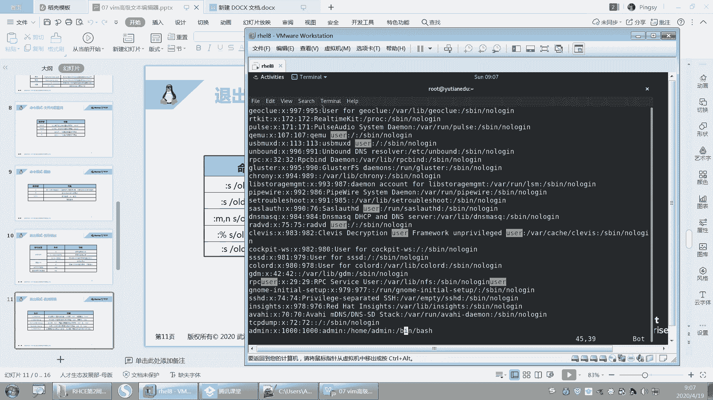
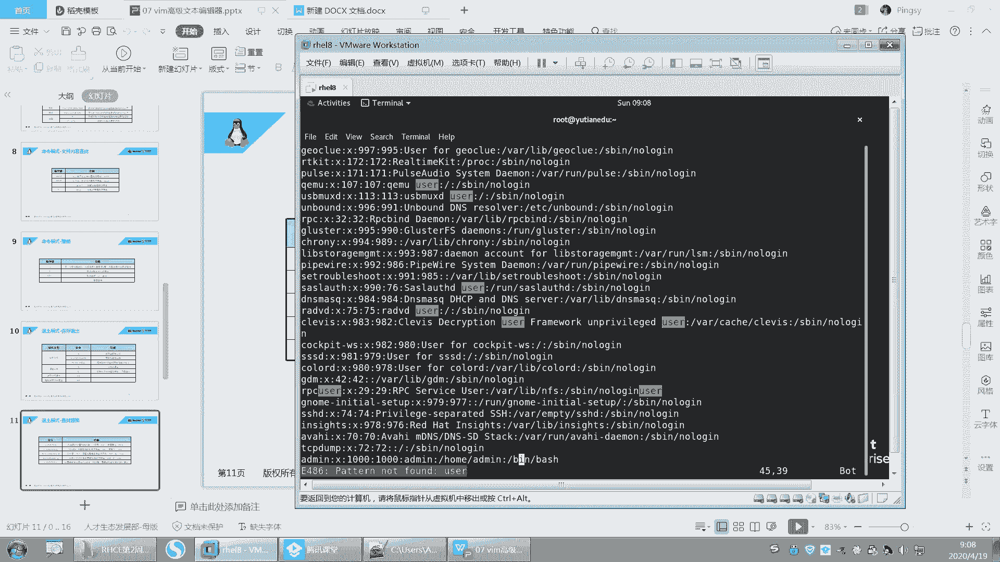
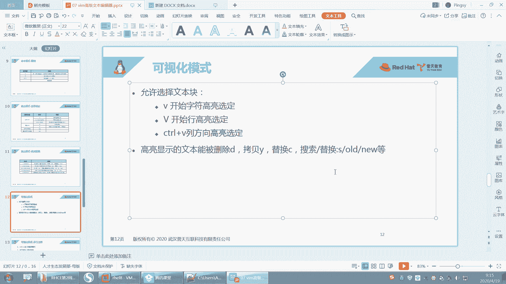
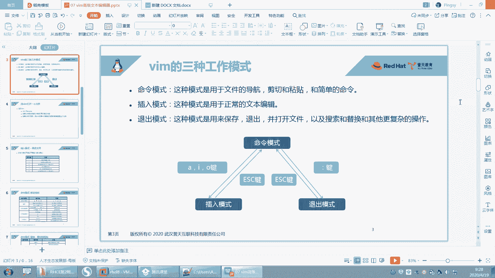

# 【重置详解版】孙老师讲红帽系列视频／RHEL 8.0 入门／红帽认证／RHCE／Linux基础教程 - P27：27 vim高级使用方法之快速提高文本操作效率 - 誉天孙老师 - BV1aB4y1w7Wi

呃，我们昨天把这个VI讲了一部分是吧？我们接着昨天这个VIVM的这个继续讲啊。嗯。回顾一下啊，我们昨天其实有同学感觉这个VI这个呃有点复杂是吧？其实还好。

只要你把这几个呃工作模式在哪个工作模式下能做什么，呃，了解清楚就可以了。然后剩下就是你用你就去呃多敲几遍多用，这样就慢慢就记住了。呃，不行，你就再过来查一下，看一下这个上面有哪些可以帮助你快速操作的啊。

好。VM的三种工作模式呢，包括命令模式插入模式，还有这个退出模式。命令模式下我们。

怎么去进入到mini模式，对吧？其实我们直接比如说啊。

哎哎哎。我们直接打开这个文件，那么这个文件我们我们当前这个模式就在命令模式下啊，反正你不管在哪种模式下，你只要摁了什么EC就能回到命令模式啊，回到命令模式。在命令模式下呢，我们可以用于文件的导航啊。

比如说你可以快速移动光标剪切粘贴还可以执行一些简单的这个呃简短的命令。

啊，还有这个插入模式，对吧？这种模式呢就是正常编辑，这种其实没什么好说的。你只要能进入到插入模式，你就正常去插入文本就可以了。然后最后一种就是退出模式，退出模式呢是用来保存文件的啊。

保存文件退出打开呃或者打开其他的文件，对吧？好，这个还没讲完啊，还有及以及我们的搜索替换，以及更多复杂的操作。在推出模式下都可以去做啊。我们昨天仅仅是把这个命令模式其实讲了一下，对吧？啊。

正在讲这个推出模式啊。2。呃，命令模式跟插入模式之间，它们之间可以用AIO是吧？大A大I大O对吧？然后EC回到命令模式，ESC回到命令模式，只要按冒号键，你就会在退出模式下。那退出模式下能做什么。

你就可以按冒号键就可以了啊。好。然后前面的话我们就不仔细说了啊，就过一遍吧。VM打开文件啊。嗯，特别是当当如果啊你这个文件你不想保存的话，你就不要摁W，因为W的话它就会保存下来。好。呃。

然后插入模式怎么进，对吧？呃，移动光标怎么去移动，你记几个重要的，我用的比较多，就这个。啊，然后home键end键对吧？配件，pa downp down翻页啊等等，这样子用的比较多。还有这个显示行号。

其实这个显示行号这里应该是在退出模式下做的对吧？那退出模式下做的啊，但是为了让你去看到第几行，所以我把它放在这个地方了，你可以用这个来看一下。然后命令模式下的复制剪切粘贴啊，DDYYCC对吧？

然后D只要你看到D，它就是剪切的意思啊。好，YY的复制对吧？啊，这种是以行为单位进行操作的啊，以行为单位X呢它是以字符为单位，就是删除一个字符。当前光标处的字符复制。从哪一行到哪一行复制到哪一行去。

对吧？移动。还有粘贴P小P呃大P啊。啊，然后在mini模式下还可以进行搜索关键词。这个类似于就man帮助里面，你去搜索是一样的啊，可以输入斜杠。这个问号呢是指。呃，跟它相反，就因为呃这个斜注入斜杠对吧？

你这个word这个关键词，你摁N呢小N大N是不是上下这样移动啊？那如果你说的是问号，也可以去加一个关键词啊。那么这个时候你摁小N，它就是向上搜索了，就反过来了，N大N就是向下搜索了。啊。

其实你就记这一个就可以了，嗯，没必要再去记这个啊，你就知道这个有就行了啊。好。然后再呢就是撤销呃，如果做错了，对吧？你就撤销U撤销一次啊，摁多次U就撤销多次。但是请注意这个U一定是在命令模式下。

就是你无论是按这些字母啊，还是那按这些，是不是都在命令模式下，对吧？你不可能在插入模式下吧，对吧？啊，NU那么然后大U如果你在某一行操作多次，对吧？你想一次性恢复，那么就大U撤销光标所在行的更改啊大U。

好，然后cttrorl加R呢就是取消撤销，其实就是左上角这个word这个PPP呃PPT这个左上角这个撤销和反撤销，取消撤销这两个键啊。ctrol加R就取消最后一次撤销，对吧？点呢就重复你上面的操作。嗯。

你比如说你滴滴一直摁，那你就可以摁点点点点，它就重复你之前的操作。好，这个你不用记了啊，这个点不用管它。啊，这是撤销啊，然后保存保存我们可以呃，我们学过了WQQ感叹号，WQWQ感叹号，对吧？

这种是我们之前学过的，然后我们昨天又学了两个新的，就是它可以另存为就是我不想修改当前文件，我想把另存为另成另外一个文件，那么就可以怎么样W加文件名。然后后面下面呢就是。某一行到某一行啊另存为成一个文件。

好，某一行到某一行啊。啊，这是保存保存了，现在已经在退出模式了啊，只要你看到冒号，你就是在退出模式下。好，然后再来啊，我们今天呃继续昨天的昨天讲到这儿了，是吧？😊，呃，在退出模式下。

我们还可以进行查找替换。好，我们来试一下啊。

嗯，现在呢我们打开这个文件啊，比如说我是搜索一个user。我搜索了一个U则，看到没有？这个是我在命令模式下搜索的啊搜索的那我现在干什么呢？我要在退出模式下，把它给替换一下。😡。

看好啊，在退出模式下把它替换一下啊。嗯。

这个。我看看啊。我再加一个吧，好吧，我再加一个啊。嗯。我在后面再加一个。U侧。然后。嗯。Use着。对吧好，你只要加上它就会被高亮了啊，这是我搜索关键词。

好，然后现在ES回到命令模式了啊，现在我要干什么呢？我要把这个U则替换成替换成另外一个啊。

呃，然后在退出模式下做啊，然后输入冒号，左下角就会有个冒号，对吧？S。

S是指替换的意思啊，查找search，查找替换查找替换啊。

好，然后呢回车不不呃，空格空格键或者是不要空格键啊，直接呃这个这个输两个斜杠。两个斜杠在第一个斜杠后面呢输入你要替换的词叫user。在后面这个斜杠后面的题换，你你要替换的词，比如说替换成AAAA。哦。

看好啊，AAAA就这么简单啊，回车。

好，他说这个没有匹配到是吧？啊，它还是要有空格哎。

等一下啊。嗯。等一下啊，试一下。输入语法写错了。呃，user。呃，userAAAA是吧。S。嗯见。Yeah。哦，我的光标看好是跟我的光标有关系啊，等一下啊，S。呃。userAAAA是吧。好，他说没找到。

等一下啊。S。U则。😔，诶。好，是这样的啊。呃，这个地方它有点特殊，它是指。我的光标所在处的对所在行，因为所在行没有所在行没有，你看这个地方是不是替换了，对吧？所在行没有啊。

所以它指的是我所在行光标所在行的替换。那我们想替换全部的话，我们就这样啊嗯这个这个冒号百分号。

百分号，然后S这样子啊。好，再来一遍啊。好，再来啊。嗯，百分号。S是指百分号指的是全部替换啊，就是全部替换，整篇文章全整全部全部替换，然后user。A哎哎哎。对吧好，这样的话就替换了。

但是我们发现还有两个没有替换，对吧？因为它只会替换这一行的第一个user，那这个是会被替换的，但这个没有被替换，那这个这个也被替换了，对吧？呃，但是这个没有被替换，而且你发现这个地方哦。

还有一个大写的user是吧？跟查都没查到啊。好，所以我们这样啊，百分号加一遍啊。改分号。嗯，Uer。唉，然后后面加一个G叫global全局，就是这一行当中的所有都替换。那这个跟这个都替换。OK吧。

然后你加个I，这个I呢是指忽略大小写。忽略大小写的意思啊。好，回去了。哦，忘记输入了S。然后GI是吧，这样的话，你看这样是不是就是把它给替换了。那这个地方这个大写的user好像也替换了吧。

大写的U子也替换了啊，然后呢就都替换了，OK吧。

啊，所以就是这个。呃，这个没有写I是吧，那你不再加一个吧。嗯，你加一个I好吧，I就只忽略大家写。啊，忽略的还要写的意思啊。好。嗯，你们自己记一下吧，这个地方哎忽略他还要写。啊。

这个地方有这个地方加不加空格应该还好。然后这里呢就是M到N的话，M呃它是限定行范围啊，就是M到N行，只替换M到N行。如果是S的话，它只替换什么呃，当前行光标所在的行啊，然后这个呢就是G指的什么？

指G指的是这一行的第一个。呃，本来默认是这一行的第一个替换，但G呢会替换这一行的所有所有匹配的单词啊。好，还有一个C哦，这方还有一个C啊，这个C呢指的是什么呢？呃，C指的是，如果你在替换的时候。

它会提示你每一步都会提示你。比如说替换第一个问你yes or no是吧？

啊，比如说这样啊呃百分号S，然后user。A。这样那他问你这个要替换吗？你就摁yes，它就替换。好，到下一个又问你，你就输入no就不替换，然后就跑这个就是yes替换，就是yes yes yes。

对吧这个就是它会提示你啊，提示你要不要替换啊，要不要替换，确认是否确认一下啊。

好，这个是查找替换啊查找替换。嗯，好。O。嗯，再来啊嗯我们学什么，我们三种模式差不多。其实其实这种模式下还有很多功能，非常多的功能啊。然后我们再来看一下啊，第四种模式啊，刚刚不是说三种嘛。

但是那三种是常用的啊。

第四种模式呢叫可视化模式。可视化模式啊。好，来一遍啊。

嗯，就是可视化模式是做什么呢？就是大家就这样啊，比如说你打开一个文件。我们刚刚进来的时候，对吧？我们只是比如说我滴滴呀、YY啊，这些是不是都是对行进行操作？都是对行进行操作，对吧？我们能不能这样。

呢用鼠像鼠标一样，那我只想选择这一行啊，我只想选择这一行，而且我还只想选择某一列啊，就是S第一个字母这一列这样这样去划那这种用作鼠标去选择这个我要。

去修改的这个内容对吧？就当做鼠标的作用了啊，好，右键呢复制对吧？然后你就可以右键粘贴这样子啊，所以这这种模式呢叫可视化模式。那这个可视化的模式怎么用呢？好。

看这里啊。呃，我们摁一下VV可视化吗？waher可视化。

就这个单词可视化叫V嘛，这个单词英文单词叫V是吧？

好，你可以摁一下V小V。看我的看我的光标在这里啊。好，上下移动看到了吗？那。左右这样是不是可以就就像我刚刚这样去这样去划单，划这个这个这个什么这个划这个选中的这个区域，对吧？选中的这个区域是一样的啊。

好后再来一遍啊。还有我的光标在这里啊，然后摁一下小V，那这样是不是就可以这样左右去选，它是选这种连续的区域啊。那选这种连续的区域。好，那选上之后能做什么呢？选上之后你想做什么就做什么。

比如说我可以在选中的区域里面去查找替换，或者我在选中的区域里面去。比如说第。就删了。还记得吗？第一是不是就是那个呃剪切呀？对不对？剪切，那就D嘛，你就直接摁D就行了。但是只摁一次就可以了啊。

就是这个里面的可视化这个地方呃，高量显示的文本呃能被删除D拷贝Y替换C搜索替换，就是搜索替换，就是你直接输入什么冒号SO的原就是在你选中的区域里面去做操作啊等等等等啊。之前的都可以去做这样的操作。

好。然后U返回啊。好，V这样去选中它啊，好Y摁1次Y就复制了，然后怎么样，然后跑到下面P，你看是不是就粘贴了，对不对？粘贴到这个地方了啊，这是我选中的粘贴OK吧，所以就就比较灵活啊，你想去选。

V左右权那。对吧左右这样去选，然后D选了。就这样子啊。好，这是小V啊小V。然后再来啊还有一个大V。大V啊啊摁上你的这个呃这个这个。Sve为。shift的V嘛就是大V嘛，对吧？好，它是什么？

它是不是这样去选择这个这个行以行为单位，对吧？刚刚那个是以字符连续的字符，但是这个呢是以行为单位这样去选好，同样操作是一模一样的。比如说D就删掉了。啊，操作是一样的啊，就是选的方式不一样。

它是以行为单位。那只能选航，你不能左右滑动，看到没有？只能这样去选航啊，那选成特定的区域。OK吧。好，然后呃。呃，Y然后就复制P就粘贴。OK吧？好，这个就是可视化模式啊。好，还有一种模式。还有一种啊。

啊，不是，他说还有一种模式，可视化模式下还有一种操作叫conttrol v啊，刚刚是小V对吧？然后大V，然后再来control v啊，看好啊，conttrol v啊，它能做什么呢？它可以对列进行操作。

我们刚刚是对行和字符，对吧？好，你看向下选，看到没有？那向下，然后向右选向右看到没有？向右选这样选中字符，然后好你有你向上那。这样看到没有？就这样去选择，它是以列为单位进行选的啊。

那我选上之后能做什么呢？一样的一样的啊，比如说D。

哇，前面全删了，看到没有？对，前面全部删掉了啊。特别是针对那种注视行的，比如说你第一列对吧？一般有井号，比如说你这这都是井号，对吧？井号井号唉。啊，你想把这两个字母注释行，就比如说这样注释行把它删掉。

这种比较实用。比如说ctl v往下D唉，这样是不是就删掉了，对吧？好。O。或者那种连续的字符的，连续的空格，你可以用这种方式把它选上。啊，这个叫control v啊control v。

好，三种啊三种。第一个V就是以字符高量选定，对吧？然后大V是以行为单位进行高量选定啊，conttrol v呢是以列为列，在列方向进行高量选选定它啊。好，你可以在高亮的部分进行这样的操作啊。

进行这样的操作啊。就是之前的操作都是适用的。好。呃。呃，下面呢我教大家一个这个。一个这个这个好用的这个。案例啊我给大家写了一个案例，在这个地方。

呃，我现在做什么呢？我现在要做批量注释，就是大家知道注释吗？注释就是。我是不是要在这儿把它注释啊？等一下啊。好，你看这样是吧，加个井号。一般我们文件里面井号开头的行就是注释行。井号开头行就是注释行啊。

那我是不是要进入插入模式，这样去注释它呀，这样是不是很麻烦？你看。这也太麻烦了吧，一行一行要去注释对吧？好，下面我就教你一种批量注释的方法啊，看哦。啊，到时候写安伯的时候，到时学那个安伯的时候。

这个我们要写那个。playbook是吧？大家要会用啊，就可以快速帮大家去操作。比如说空格呀，连续呃去掉或者加注释等等啊。好，来开始啊control V。cttrol V啊，那可视化ctrorl V。

然后往下挪挪挪，你要注释哪几行，你把它选上就可以了。啊，选上啊选上好，选上之后摁上。按着大I就是插入嘛，插入那个大I就shift加I。shift加I啊，然后你是不是变成插入模式了，看到了没有？

那插入模式，然后输入井号。输入不井号那，然后EA就完了，看懂了吗？好，再来一遍啊，那全部注释了。好吧，删掉啊，conrl v删掉了。B将删掉是吧？好，再来一遍啊。按着什么按住ctrl V对吧？

那光标在这里往下挪，你要注释哪些行，就把选上就可以了，这样选上。好，选项之后摁着大I，摁一下大I插入嘛，对吧？啊，它就回回到第一行了，回到第一行，然后输入你想输入的字符。比如说你输入两个井号也行啊。

输入你想输入的字符啊，然后摁一下E。

看到吗？对，他就注释了，就在前面加两个井。

就你想在前面加什么都可以啊。啊，就按这个来就行了啊，我给大家把步骤写在这个地方了啊。🤧嗯。嗯。好。那这个是多行注释啊，这个就靠你们自己练了啊，我就帮不了你们什么了，只能帮到这儿了啊。啊。

下面还有呃可视化模式完了之后呢，我们还有一种叫多窗口模式，多窗口模式啊，就是说嗯像这儿啊。

嗯，我在一个窗口在一个窗口呢，在这一个窗口上，我想在这一个窗口上打开多个窗口。就是说在这个上面我想打开多个窗口怎么办呢？我就control啊cttrol。WV唉，你看我就开了两个窗口，看到了没有？

开了两个窗口啊，然后这两个窗口呢它是怎么样？它是分开的，它不一样。你像左边是左边这个也就是说我在这个什么在这个窗口上，我开了两个窗口去编辑这个文件。

好，你比如说我对左边这个文件进行编辑啊，比如说。The啊。啊，右边是不是也会显示。看到吗？它这种比较适合于什么呢？比较适合于我看对照着对吧？对照着这一行，然后去编辑另外一个文件。对，编对照这一行。

编辑另外一个文件。好，然后你可以怎么样保存嘛那。哎呀，我退出了。好，那个窗口就退了啊，退出了。好，再来啊controrl W摁一下S就在水平方向上哦，在竖直方向上或者水平上哦。

这个怎么水平数就是上上上下嘛，上下开两个。

就这个啊crl W摁一下S，它就横向分割屏幕是吧？哦，摁一下V，就是在纵向分割两个。呃，然后你你想在各个窗口之间进行移动，那你就按ctrl W。

比如说，你看我的光标现在在上面这个窗口是吧？然后我想把光标移动到下面这个窗口，那我就摁ctrorl W向下。看到吗？这样我就跑到下面这个窗口了，然后再来啊control WV。你看又开一个窗口。

你可以无限这样去开control W向上contrl W呃S那就又开一个窗口，看到了吗？你可以开多个，然后我对每每一个窗口操作，比如说我现在光标在哪个窗口，我就对哪个窗口操作，我可以退出它。

现在我光标在这个窗口，那我就怎么样，我就冒号Q这样退出，看到没有？光标在这个窗口，那就冒号Q退出这样子啊。

啊，就是在开多个窗口，以及在多个窗口之间进行这样一个移动。摁ctrl W方向键上下左右这样去移动啊。

以及我们这个退出模式下，我们的指令就是我我们光标在哪个窗口上里面，对吧？我们的指令就发送到哪个哪个窗口里面。光标在哪个窗口啊，你这指令就发送到哪个窗口。

好吧。好，最后再给大家补充一个啊，这个之前呃。

就特意给大家加了一条啊，刚刚呢我是怎么样在这个。这个窗口上对吧？显示多个虽然显示多个窗口，但是呢我显的显示的都是同一个文件。

但是我想怎么样在这个窗口上显示多个文件，开多个窗口显示多个文件啊，它这样啊。

好，在退出模式下冒号看到没有？在退出模式下啊，SPE。然后打开ETC下面的profile，打开这个文件。就SP打开这个文件啊，回车。好，你看。上面这个是一个文件，下面这是另外一个文件。

下面这个是password，上面这个ETC profile。然后这两个窗口是要多窗多窗口适用我们刚刚的是一样的啊。比如说在这个窗口之间进行切换，control W向下，切换到下面这个窗口，看到了没有？

controrl W向上切换到上面这个窗口。啊，就是你在你只有一个窗口的情况下，你可以你可以你可以这样去开。OK吧，可以这样去开啊，然后上下这样对照着去写。啊。好吧。OK嗯，这个。

就讲这么多吧。应该是够大家用了啊。呃，这张呢我你要会的啊，嗯基本上像我列在这个地方的。内容你都要会。最后一个就是这个嘛，冒号SP加上一个文件，就在同一个窗口边打开其他文件嘛，就也是其实它也是多窗口。

也是多窗口，就这个。然后如果你想去显示更多的窗口命令的话，你就hap windows。

哦。have windows是吧，好像还可以hap。比如说。呃，输入ha。呃，它这里面就有很多这种帮助，不过你能看懂的话，你就看看不懂就你就百度去是吧？那就是在退出模式下，其实是有很多很多的功能的。

我讲的也只是其中的一部分啊，可能我们比较常用的一部分。你就去查帮助就可以了。VM的功能太多了太多了啊。

比如说什么还有什么，我看同学之前总结的。什么呃默认一个table键就几个空格，反正很多，这个你们可以自己去再去扩展。呃，我告诉你可以这样做，你就可以自己去扩展在VIM里面，对吧？VIM里面。

因为每次table键呢它就。不知道几个空格是吧，你可以自己去设置啊，或者是设置高亮啊，设置显示行啊，默认就显示行啊，这都特别多特别多啊。好。嗯。这张VM就到这吧啊，呃回顾一下啊。VM的三种模式。

后来我们又是不是又加了两种模式？呃，命令模式。呃，编辑模式退出模式，还有我们后面加的两种可视化模式以及多窗口模式，对吧？这几种五种了吧。有5种模式，对吧？啊，那编辑模式mini模式推出个可程。

那就就就这5种模式。那这种5种模式下面能做什么？呃，这个是你要知道的，而且我们在每一种模式下都给大家举例常用的一些这个案例都给大家举了，你就拿来用就可以了。嗯，主要是熟练啊熟练。好。

那这张我们就到这儿吧。

