# 【重置详解版】孙老师讲红帽系列视频／RHEL 8.0 入门／红帽认证／RHCE／Linux基础教程 - P28：28 文本处理工具之cat，head，tail使用方法 - 誉天孙老师 - BV1aB4y1w7Wi

好，那下面呢我们开始第八章内容啊，第八章内容呃，文本处理工具呃，这张的话。呃，内容还是比较多的啊，因为。将来你写脚本。呃，还是做什么？基本上啊你的这个。嗯，都要靠这一张都要靠这一张啊。

就是你玩的转不转了，对吧？呃，这张是能够体现你的功力的一张啊。呃，当是我们这张会给大家列举出比较常用的还是那句话啊，不可能把所有内容给大家讲。但是你要把常用的这些都能用下来记下来啊。

这个是我们只是上课给大家做一个引导啊，好，然后文本处理工具呢，说白了其实就是怎么去处理这个文本内容，比如说我查看文本内容啊，呃，过滤文本内容啊然后过滤一些关键词啊，对我本内容进行处理啊呃。

文本内容修改啊，查找啊、替换呢，对吧？等等统计啊，排序啊，那这都是对文本的内容进行啊，包括你们以后如果要处理日志，比如说处理一些日志文件对吧？那这些的话那都要用到这一章的文本内容，一些要写脚本啊。

也要用到这张的内容啊，所以这章非常非常重要啊。嗯。好呃，虽然前期再说一句废话啊呃，但也不是废话。呃，虽然前期的内容比较枯燥，呃，就感觉没有什么高级的这些呃比较炫酷的功能，对吧？

但是我觉得这是才是你体现你功力的时候啊，你的基础一定要打好，你才能去，对吧？你扎马步练功要加马布，对吧？要加好，要不然你怎么去。去去去。练一些更高级的功能，对吧？啊，然后这张我们分三个部分啊。

就是文本的提取，就是查看文件内容，然后分析文件内容统计分析对吧？然后可以对文本进行操作，文本内容进行操作。比如说可以用呃，我们后面会加1个SED，对吧？对它进行这样一个文本编辑啊好。

然后第一个文本提取的部分啊，我们会学习这些工具。嗯，文件内容包括cat啊、more呀、less啊，那这些可能大家之前也已经也已经接触过了啊，比如说关键词提取gra啊，还有这个列。

还有字段cut这个这个这个这个呃。也都是提取是吧？啊，这个是行提取，这个是列提取，列提取啊。好。哎呀，这两张重复了，我删掉。好，那我们看一下第一呃第一部分啊，cat more和 less啊。

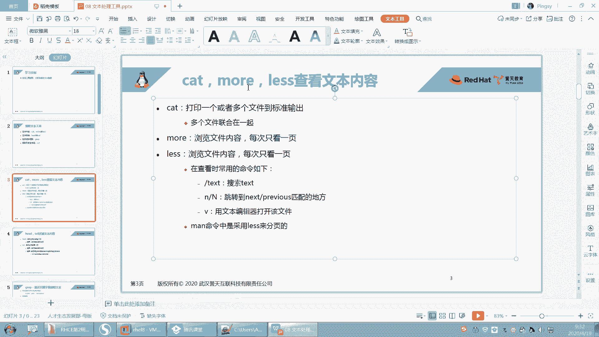

呃，大家可以自己拿出来去记啊，因为我每一个每一个这个呃工具我都会给大家介绍，所以你是完全有时间自己去记下来，我边讲，你可以边记的啊。好。

第一个工具catch记啊第一个工具cat它就呢就是查看最简单的就是查看什么查看文件内容啊。比如说啊我们之前每次去查看文件的时候，是不是都用这个是吧？我还唉不敢用cad是吧？我就用ca话现有同学看不懂。

所以我就一直用VIM去看，那VIM的问题是你每次去看你还要退出来，万一你不小心误操作了这个文件。😊，那么还可能导致什么把文件损坏了呀，对吧？有可能我记得之前有一位同学是这样的。他VM可能没有用好。

那VM没有用好，然后他给我怎么样啊，他给我在这儿root这里加了一堆的这个字符串，或者在哪个地方加了，反正不小心修改了一个地方，结果后后果就是什么，后果就是连系统都进不去了，系统都进不去了哟。😡。

就一个文件，就这个pasword文件被它搞坏了。呃，误插误插入了一些字符，然后导致系统都进不去了。然后我还是进行就业模式，然后给他给他呃这个这个改过来之后，他才能进去。呃。

其实你看linux它就是这么脆弱啊，所以。你要懂他啊，你要懂他，你才能玩好他，否则你就被他玩是吧？好，那么呃VM它会有交互，但是我只想看一遍，不想什么重复的这样去看，还有交互很麻烦。

所以catch就帮助我们去打打印，将这个文件的内容打印到当前终端回车。好，上下去翻看到没有？上下去翻啊，那下去翻，对吧？好，但是我们说这样向下去翻的话嗯。对，这上下翻在我们那个呃那个那个控制台。

那个虚拟控制台不能上下翻是吧？那一看看一遍就完了。所以我们后面会学一些分页的工具啊，加上我们昨天学的管道啊，那么这个K呢比较常用的一个工常用的一个选项叫杠N。😊，哦，cat杠N。嗯。

前面就会打印这个行号，看到没有？前会前面就会打印这个行号啊，行号啊，OK吧，这个是我们比较常用的一个呃常用的一个选项，常用的一个选项啊。

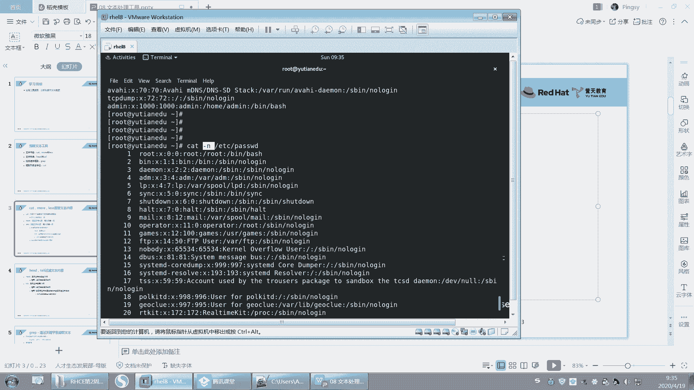

好，那cat呢它还可以打印，它除了打印一个文件以外，它还可以打印多个文件。

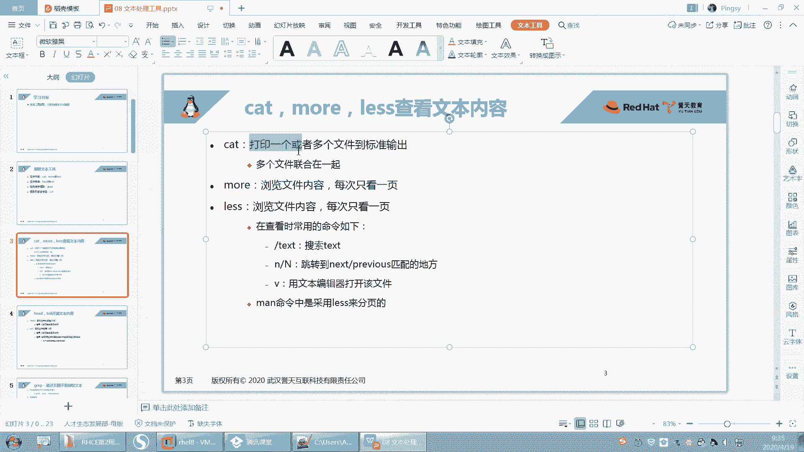

啊，打印一个文件就加一个文件名喽。那打印多个文件呢，那我就cat呃ETC password ETC profile。啊，回车好，你你你看啊它就什么，你看打印完这个。

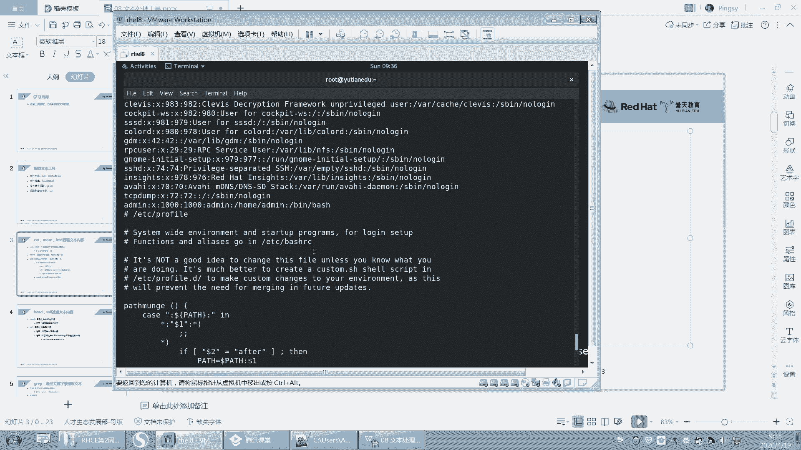

打印完这个这个这个这个什么。

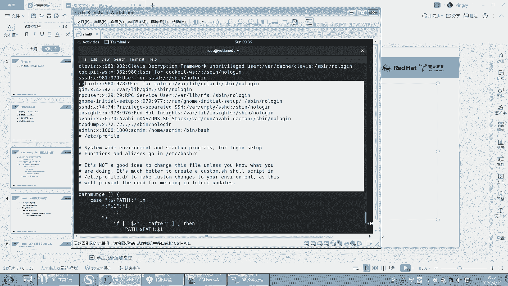

这个password完之后是吧，然后再什么再去看这个啊，可以看这个。No。用ca是不是比VM打开速度要快一些？这个应该差不多了吧。你看了跟VM应该差不多的吧。一般如果是嗯一般如果文比较大的话。

我们不会说全部都看吧，很少。嗯。反正都要从头到尾这样读一遍，你ca要读一遍，然后你这个这个VM也要读一遍，反正都是要读一遍。好，然后你我不知道这地方可以不以加杠N喏，他应该应该也可以加杠N吧那。

对吧两个合并打印啊合并打印。而且我们打印出来之后，我们是可以把它重定向到某一个文件里面，对吧？把这个结果给重定向到一个文件里面，这样就把两个文件内容全部合并成一个文件。啊，就这样子做啊。

这边tab下面的。呃，time们下面fi是吧？好，这个是ca啊ca嗯，记住啊，就是一个杠N，还有打印多个文件这样子啊。到当当前终端好吧啊，那么cat呢它在不在一些虚拟控台下，我们说它不能上下这样去翻。

对吧？上下这样我们这个呃上面这个滚动滚轮是不能用的那怎么办呢？我们只能叫分页显示分页啊，那第一个分页工具呢，比如说啊我们cat一个文件。啊，通过管道的形式。嗯，这样吧，我们直接学more。

就是more啊。直进行了分页。cad就一次性全部显示完，对吧？😡，默呢就可以将这个文件进行这样分页的显示。那这显了显示了53%是吧？你往下。哎呦。好，你可以你可以回车键，还上下键还不能用是吧？

你空格键就是翻页。哦，我结束了是吧？啊，你的回这个呃回车键就向下翻滚动，看到没有？向下滚动啊。好，从头到尾滚动到最后的话，结束就结束了就没了，OK吧，就没有了啊那。啊，从到尾结束就没了。好。

那么你空格键它是翻页，空格键是翻页啊，记下啊，more这个键空格键是翻页，然后这个回车键是上下这样去呃滚呃。上下这样去翻滚动是吧？这要滚动啊。好，这个墨仅仅只只能看一次，从头到尾看一次就结束了那。

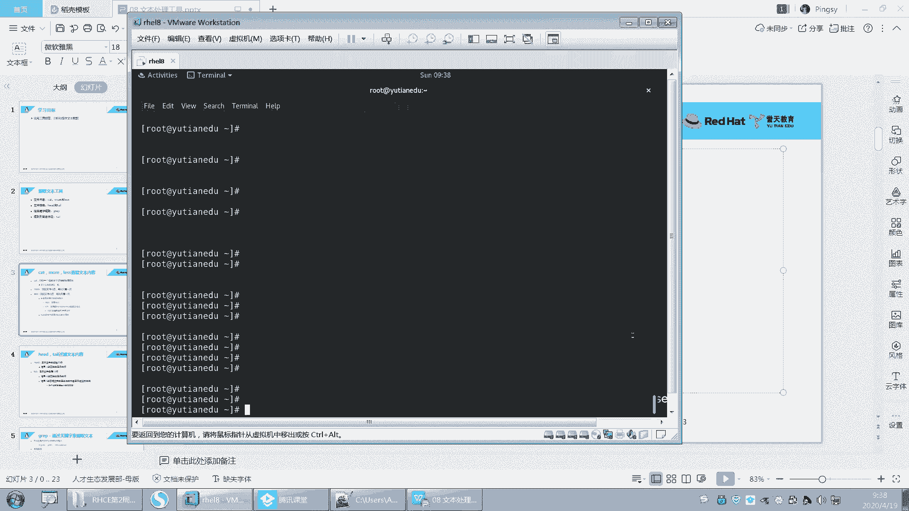

他只看一次啊。每次只看一页。

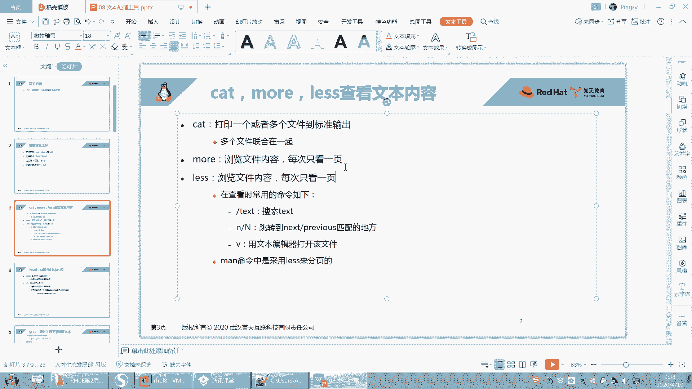

对从头到尾看一次。好，那如果你想来回这样去看的话，我们就只能用lessss这个工具了。less这个工具啊。好，再来啊less password刚刚是more是吧？现在是less啊。

less呢它也是一个分页工具。那么这个分页工具呢，它可以来回多次查看那。上下见翻。然后回车键空格键翻页，上下键这样翻。对不对？然后下一键就要去翻啊。好，在less下我们还有很多功呃。

还有很多其他的一些功能啊。比如说我们可以搜索关键词，比如说在下面左下角。方你看光标在这里，对吧？我可以输入一个斜杠。User。回车。那就把一个字给高亮了，对吧？然后摁小N在这个高亮的这个词之间向下移动。

摁大N在这高亮的词之间向上移动。这样去移动它啊，移动这个。那移动对吧？好，这个让大家想起什么没有啊？然后。然后Q退出看到没有？然后lesssq退出。MVM啊。あ呵。我们质前好一个东西。

就是应用的这个lesss这个这个这个工具。嗯。啊，跟VM有点像是吧？啊，是有点像啊，然后这个呢是其实啊呃大家应该。应该我说大家知道啊，man man帮助你会用吧。man帮助你会用吧。man的话。

M password。然后你看是不是可以上下翻，然后输入user对吧？然后N。呃，上下N，然后Q退出。记起来了吗？所以man呢它用的它man它也是一种分页，它也是分页，对吧？它也是把这个章节分页了。

那么这个分页工具用的就是less。呃，分页工具用的就是less啊。好，再来一遍啊，lets pass。好，上下这样翻关键词应该会了啊，只要你慢会，你这个less就会，你这个地方就不用记了，你就直接什么。

用法跟man帮助是一样的对吧？man帮助的那个使用是一样啊。好，它还有一个功能。比如说啊我现在看着看着对吧？上下翻翻翻翻翻翻翻好，翻完之后我想怎么样，我想去修改了，比如说哎这个地方想去修改这个文件。

对吧？那你就可以摁一下V。😊，呃，摁一下VV叫VM。

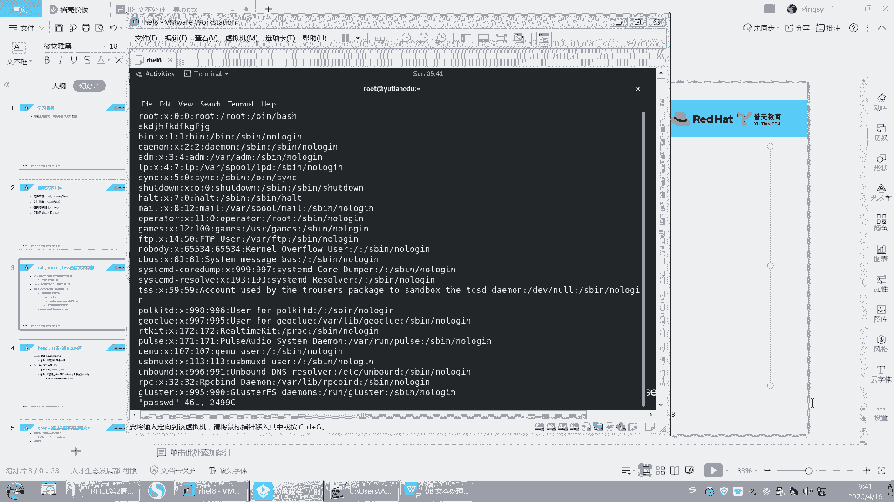

所以你知道了吧？啊，摁一下V，你就进入到VI编辑模式。

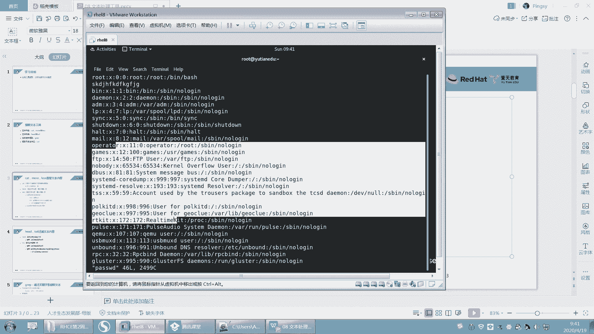

然后你还可以上下这样去怎么样呃，这样去学摁一下I是不是进入插入模式嘚哒哒你VM能做什么，在这儿就能做什么，你摁一下V就调用了VM变辑器直接。直接可以编辑文件了，然后你想退出就EC冒号W。啊。

ES冒号WQ是吧？啊，WQ就又回到什么，就又回到这个什么。😡，这个less这种模式下啊。啊，会吗？你又回到这个lesss这个模式下，摁一下V啊，摁一下V就进入到VI编辑模式。

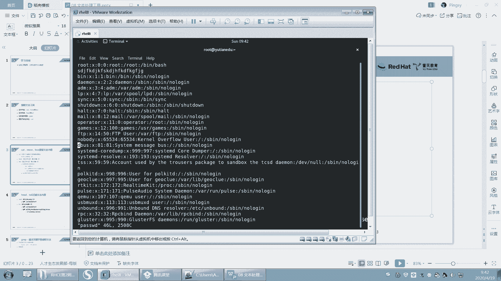

好，总结一下啊。嗯。嗯。搜索关键词对吧？然后N小N大N在关键词之间向上向下这样去移动，摁一下V就可以么。呃，进入VI编辑模式对吧？进入VI编辑模式，那摁一下I就可以进入编辑模式了等等啊。好。

那慢帮助呢其实就是lesss来分页的啊。

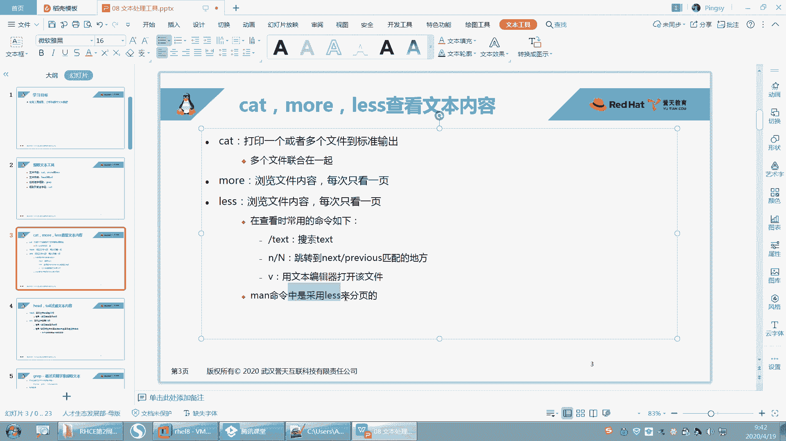

好了，那么再来啊，我们其实这个工具啊。我们是直接用这个命令，比如说more呀加password啊以及less。加password对吧？就这样去看好，那么。我们还用了一种就是cat这种这种方式。

这种我们是不是昨天刚学过的？就你可以用cat一下，然后再进行分页，对吧？OK吧呃ca一下进行分页。好，我说一下这个啊。呃，这个其实跟这个是不是结果是差不多的对吧？我们先打印一下，然后再去进行分页。

但是这两种方式呢，哪一种更好呢？呃。你看啊这种方式比较灵活，就是我可以先看，然后后面怎么去打印啊，我只需要修改后面这种对吧？我可以去灵活的去修改gs啊等等。啊，但是这两个呢就像刚刚有同学说的。

那两种效率是不是会不一样呢？对，两种效率会不一样啊。就是说如果你这个文件比较大，那么你就用more就行了，你就不要再cat了，然后再less，对吧？或者再more，这种方式就处理了两处理了两次。

而且还用了一次管道，能理解我说的意思吗？就是下面这种方式，其实它是它效率其实相对来说是比较低的。但是这种方式我们平时还在用。因为当你文件很小，就是没有什么那个呃没有什么太大差别，系统一般般。还好，对吧？

就是也没有呃，就是想嗯快速去提高效率，对吧？或者是就是你自己人人的效率啊，那我可以再这样ca一下，然后less。因为在后面的话，我们还会加一些很多管道一直往后面加，对吧？那你修改的话。

你只需要去修改后面的就看你自己，好吧。🤧看你自己啊。不可以ca之后，你再ETCpassword，然后less对吧？然后你按V不行，好到没有？这个是不可以的啊，因为你这个cat完之后。

是这个内容是输出到终端的，并并不是一个文件了。你只有在直接这样的话。他才可以NV。OK吧，它才可以NV啊。对。嗯。

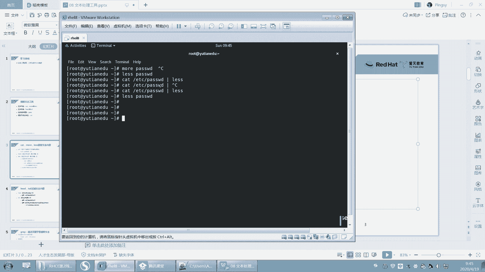

好呃，这个是more cat less啊嗯这几个。

好。呃，再往下啊再往下。

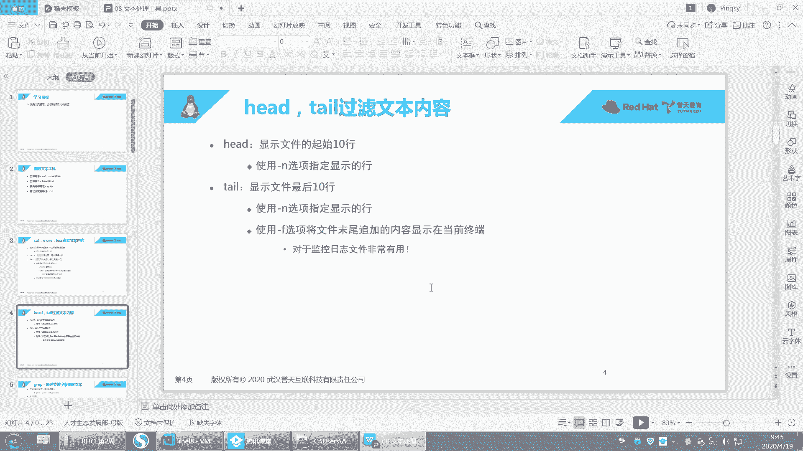

呃，我们这个刚刚呢就是学习了怎么去看这个文本内容全部的哟，从头到尾去看对吧？从头到尾去看这个文本内容，但是有些时候我们并不想看完，对吧？我们想看这个文件的某某一行或者是某个特定的行或者是某几行，对吧？

或者前面几行，后面几行，那我们就可以进行过滤啊，进行过滤。

好，第一个。第一个啊，我们看这个文件的。前前多少行就head。Head。好。headd password。那么这样的话就看的这个文件的什么啊，这个文件的123456899十0行对吧？十行。但是在这儿呢。

我就怎么知道它其是前十行呢？好，这个你可以加一个工具啊，这个head我查了一下这个head好像没办法去显示这个行号，就显示哪一行到哪一行，对吧？但是你可以怎么样，你可以这样catch它说的。

然后再什么head。嗯，这样一般这种处理文本的这种工具，它都可以同接受来自于管道的输入啊。好，回去了。因为cat呢它可以加什么，它可以加行号。那加行号。然后再来这样的是十行显示十行啊。啊。

那么为什么是显示十行呢？因为head默认就会显示这个文件的前十行，默认就是前十行啊。但是我想显示前五行，那就杠N5就显示的前五行杠N6就显示的前六行OK吧，杠N6就显示的前六行啊。呃，它还有一种。

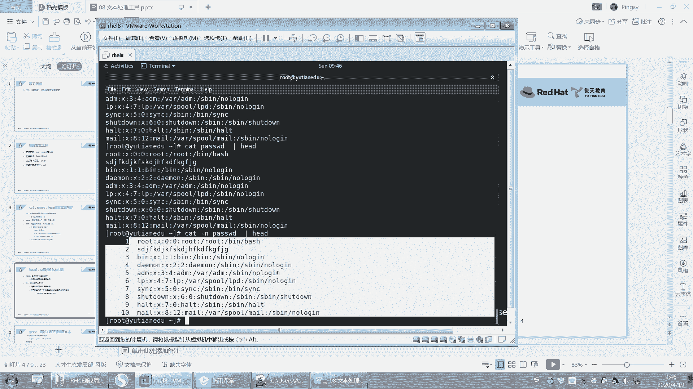

呃，用法。它还有一种用法啊。好，你把这些案例可以自己记下来啊，比如杠N5就显示前前五行就完了，是吧？好，然后再来。它可以这样啊，前面加一个减号，我不知道是是减号还是加号啊，我试一下啊。回车。哎。

你看看啊。它这显示多少行呢？好，我们看一下这个文件总共有多少行啊。总共有46行，对不对？是不是总共有46行啊，那我写一个减号就代表什么样啊？后面六行是没有看到。好。它指的是除掉后面六行以外。

前面的都看前面都看。所以这个减6减6就-6的意思啊。杠6就除了后面六行，前面都看OK吧。

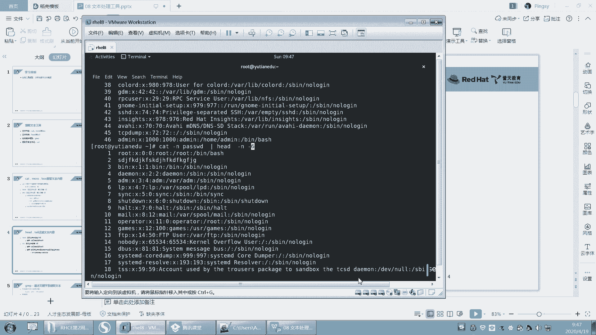

这我没有写啊，你要自己写一下啊，我都没呃。没有把所有例子说以你还是要记笔记嗯。好呃，就是显示除了后面六行以外都显示啊，你只要记住它显示哪几行，对吧？怎么是后面六行去掉，因为head永远是看前面。

所以它减六肯定去掉后面六行啊，对吧？呃，因为还有一个叫tell嘛，还有一个叫tell是吧？那跳嘛。tell叫他看尾巴是吧，是不是尾巴呀，telll就是看末尾。末尾十行末尾十行啊啊。

我只想看末尾这个五行或者四行，那就杠N4。好，杠N4啊。哦，tell的话。它跟那个head是一样的，比如说它可以加个减，但是这个地方好像不是加减，是加加号。假似。加4的意思指的是什么呢？

加四指的是你看啊，因为tailll是不是永远都看末尾啊，那也就是说它是不是可能会从第四行开始看。我猜的啊，我因为。因为我也有时候记不清楚那。所以我就根据这种方法，因为天上就记住它看尾巴，看末尾是吧啊。

但是你不能用减，你用减的方法没有用。😡，试一下啊。用减其实它默认就是减是吧？默认就是看四末尾四行啊，所以看加从第四行开始看呢，就这样子啊。看到没有？从第四行开始看啊，记啊从第四行开始看加4。啊。

看前面看后面对掐头去尾，就是这样OK很好啊，你这个总结的。好，呃，这个选项呢杠N呢是我们最常用的ca呃呃那个head，因为head是头嘛，它要是尾巴，对吧？啊。

那tell呢它用的最多的其实是这样子的啊嗯。我们后面。有可能。会去经常会看一些日志，日志文件，就日志文件是什么呢？日志嘛，日志就是它会记录你这个系统的什么呃运行状况。呃。

或者比如说啊你这个系统来收发的邮件，他都会记录下来，或者是记录你这个系统当中嗯这个安全的。比如说创建用户啊，创建什么什么，他都会给你们记录下来啊。好，我看一下看一下看一下啊。嗯。唉，这个是空的是吧？

message看一下啊。好，你看这个我们有一个日志文件。呃，叫哇 log下面的message messagesage这个日志文件啊，这个日志文件是我们经常会去看的。

我们系统当系统当中绝大多数的这个什么呃日志都会记录在这个文件。什么叫记录日志啊，就是。呃，日志呢我也给大家说一下啊。嗯。呀我那个word怎么关掉？好，我们日志其实是有几种。2。

记录方式的啊日志其实说白了就是。系统做了什么事情？他会记录下来。对后他就它会记录下来啊。哦，那一种也是要实时的记录日志，实时的啊。什么叫实时的呢？就是呃比如说你今天呃，你你今天这个一天的比如上课，对吧？

呃，我我我边写我边讲你边辑我边讲你边辑边讲，你编辑。那这种是不是叫实时的？对吧叫实时的啊。啊，那我们系统这个message呢，它就是实时的，它默认就是它就是实时去记记录的啊，就是你做了一件事情。

我就记录下来，做一件事情我就给你记录下来，是吧？😡，好，当然呢。还有一种日志。他是先记录的。呃，先记录的一种日志就是先记录这个日志是什么意思呢？呃。

先记录的日志啊嗯这个先记录志一般它是它作用就是防止什么？防止。我防止数据丢失的。哦，相信大家学过数据库的应该都知道。哦。叫先记录日志，对吧？

就是比如说我今天要去我今天要去上HC一的什么第二周的第二天课程是吧？然后我今天要上什么内容，什么内容，什么内容，对吧？好，那你比如说你记笔记的话，呃，这个这个例子好像不太好是吧？啊。

比如说你今天陪女朋友去玩好，这个例子啊，你你今天约好了，陪女朋友去这个游乐园去玩是吧？不要去看电影好，但是呢你女朋友呢对吧？每次都觉得你这个说话不算话，对吧？每次说好了，周六陪我去怎么样。

陪我去游乐园玩完之后就要去看电影，那你就你你又报了HC一班，对吧？你这回又要食言了，是不是这样啊。😊，好，但是呢他说怎么办？他为了你做到这些事情，对吧？来，你给我先写下来。😡，你会先写下来啊。

写下来之后写在纸上对吧？啊，今天几点出门对吧？然后哎到哪个游乐园做什么，然后几点钟买电影票买好，然后到哪个地方去去去看电影，对吧？全部要先写好，对不对？好，写好了之后，你按照这个去做。😊，好。

你说你今天没有做怎么办？😡，因为你去上HC一班了是吧，上课去了，把女朋友抛弃了啊，然后他就第二天又拿这个什么，又拿这个数这个这个这个这个这个你写的小纸条是吧，来，你再怎么样，今天一定要做了。

反正我不管你今天你你写好，你只要写好了，你一定要给我做，对吧？你不管哪一天做，反正你后面哪一天，你必须要给我做了。😡，呃，虽然这个例子呃感觉还不错是吧？因为我们数据库里面就是这样的，数据库就是这样。

你不是说好了，你要写一个数据吗？你不是要做一件事情吗？😡，怎么样？如果我没有先记录下来，那你没做是不是就没做了？😡，但是我是不是要先做先记录下来？😡，先记录记录之后，我就每次去找你，你有没有做呀。

你有没有做呀，你没做怎么样，我给你我我就怎么样，我就让你去做。对你就不断的提醒你，不断提醒你啊。终于有一天你把它做了。所以这就可以保证我们所比如说我执行条思口语句，对吧？😡。

那么我写了往里面写了一个条数据，那我先记录下来，那可能没写进去，因为有一些延迟网络或者是等等一些故障问题，对吧？没有写进去，所以这个时候怎么样，他就会先记录下来。然后每次去读日志。

看日志里面有有没有记录，如果有记录，就每次让你去写，每次让你写写成功了之后，这条记录，对吧？就呃，就算你完成了，就标记你完成了。😡，OK吧，这就是这个这个先记录的啊，所以有有两种有两种啊。啊。

那我们系统里面呢一般就是这个实时记录的OK吧。

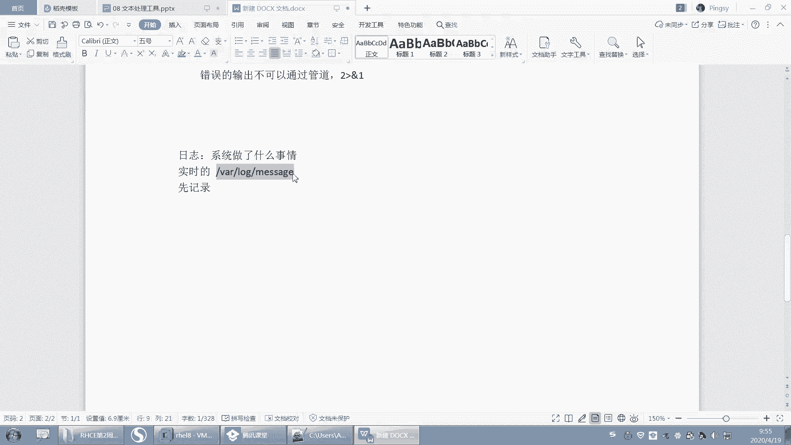

好，那实时记录的日志有什么好处呢？😡。

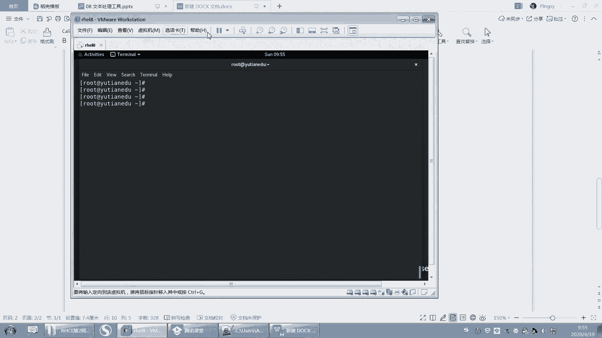

实时记录的日志就是我做了什么事情，他就给我记录下来，做了什么事情给我记录下来。那这样的话将来对于我们什么啊进行排错是有非常大的好处的啊，进行排错。呃，排错的话嗯，比如说啊将来你搭一个服务。

搭1个HTTPP服务，搭1个web服务，对吧？或者搭1个DNS的服务等等。那么如果出现了错误，或者或者是哎正确了还是错误啊，怎么样，他都会在记录在日志里面。😊，都会记录在日志里面啊，那么记录日志的时候。

我可能要怎么样实时的去看日志哦，到底发生什么发生了什么事情，对吧？所以你看啊，如果用t去看的话。😡。

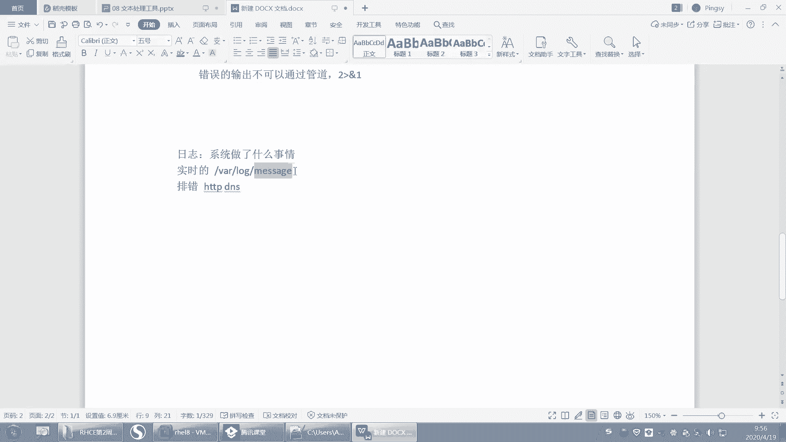

Tll。好，tell去看，那么它只能看几行呢，我们来看一下啊，它只能看十行，因为默认都是十行嘛，对吧？好，但是这样一看是不是看完了，你每次都这样去这样这样去翻，是不是很感觉很累，对吧？

所以呢你可以加一个叫tell杠F。😊，T杠F啊。叫what哇 log message。唉，对它可以实时的去监控你的这个日志文件，它永远都显示末尾几行。本来它显示末尾十行，对吧？假如这个日志文件。

而且这个日志文件它有它一个特点就是。他是怎么样，他是往后面去追加的，因为。对它是往后面去追加的。你看它是不是一直往后面去加，按照时间，你看按照时间的话，它是往后面去追加，所以我是要每次都要看末尾几行。

对吧？末尾几行啊啊，那或者比如说我今天。😊，呃，我看一下取取下网络符，看会不会有日志产生啊。好，现在是。好，这样啊，因为日志一刷刷刷很多，对吧？你不知道什么时候产生的，你可以这样，你可以把它拉一条横线。

😡，哎呀，这已经产日志了是吧？看到没有？拉一条粉线。嗯，这个是我。他在这儿输入它还会有什么。它还会有这个输出啊啊，算了就是拉短一点吧。

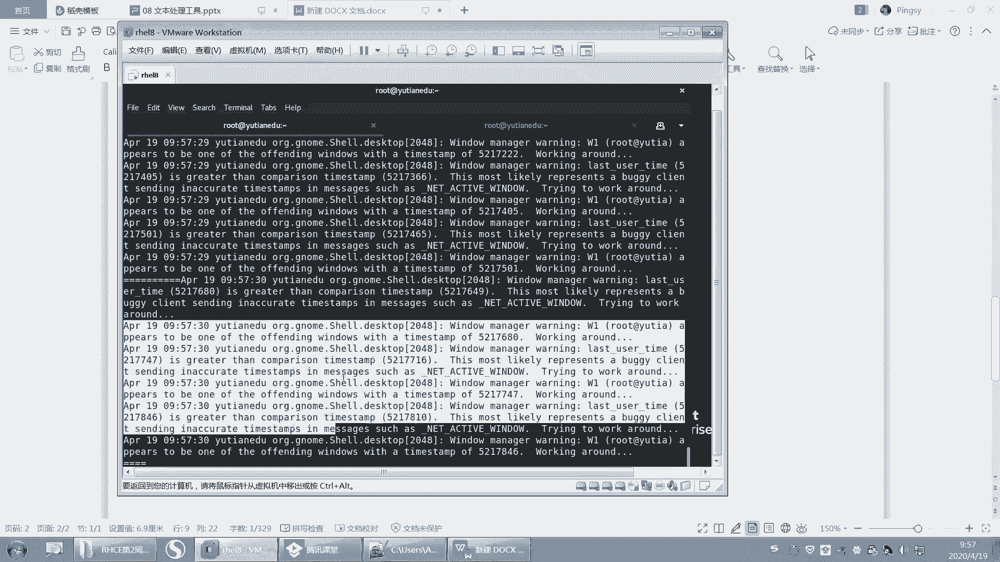

好，就这样啊。好，然后右边呢你就怎么样，你就重启一下。比如说比如说我们将来会重启一个服务，对吧？啊，它就会有日志，看到没有？特别刷刷刷刷刷，所就会有有有很多日志。OK吧。好，这就是我们将来要用的啊。好。

然后那我们的日志文件都在哪里呢？😡，我们的日志文件呀。一般情况下都在这个哇log下面。不要在这个walog下面是吧？哦，但是有些日志太多了，我又不知道是哪个日志文件。

又不知道我的日志到底是生在在哪个文件里面生成，对吧？所以这个时候你可以怎么样，你可以去监控所有的日志文件，我们可以有一个这样的。😡，就tell。tell啊杠F吗？不是实时监控嘛？然后加个什么星号。

信号只能匹配所有文件。啊，匹配所有文件，然后回去了。好，他会把每一个文件的末尾十行都给你列出来，每一个文件的末尾十行。然后你可以怎么样，你可以在这儿来再来一遍回车。好，然后左边你看往上翻。

是哪个日志文件生成的？是哪个日志文件生成的文生成的啊？哇，这个太多了。我应该拉一条线的。要不然不知道现在是9点50。你看啊看到没有？是不是mess啊？那。入mesage啊往上翻的嘛，下面都是日志。😡。

它一下子生成很多日志。在这个地方是不是就是message？😡，所以它就是在message里面生成的啊，你可以这样去监控，OK吧。啊，讲这个telll的时候，顺顺便给大家把这个监控日志也给大家讲了一下啊。

因为这个tll经常用来监控日志啊，监控日志好吧。

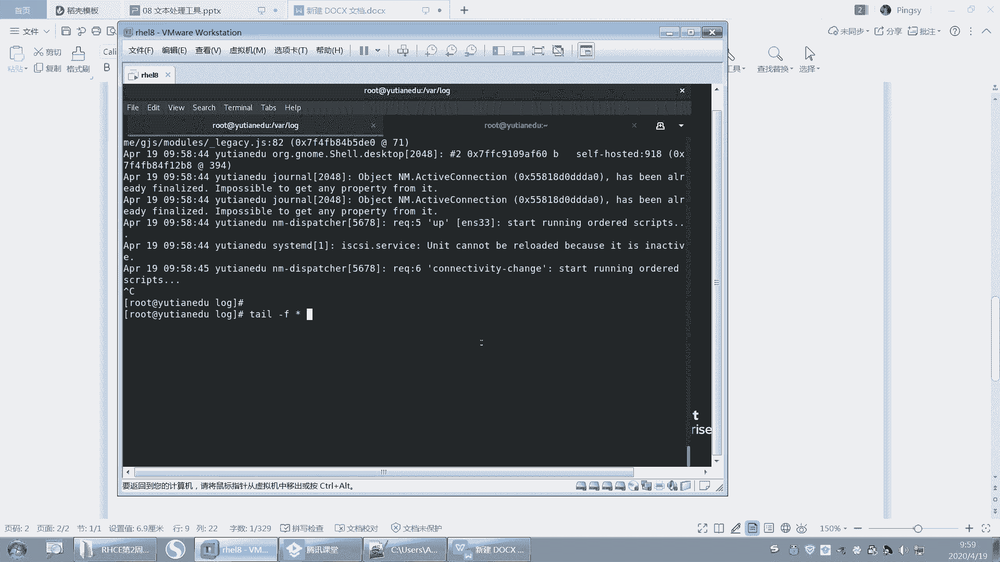

嗯。这个因为没有实际的案例，也没法给他演示啊，所以到时候我们。

嗯，用的时候我再跟大家说，好吧，你只要有个印象，这个地方tell杠F是查看日志日志的，它还有它可以这样，它家可以tellF这个命令现在没有了是吧？以前还有一个红包区，有个跳llF这样的。

它跟跳杠F是一样的。但现在没有这个命密了，是吧？啊，没有这个命令了。红帽七就有一个这样的命令，它就是等于。就包括大家现在去如果去工作环境里面有这个那个。生产环境里面，你们的系统我估计啊应该还是红包区。

还是红包漆，不会这么快就上拔的啊。嗯，OK吧。

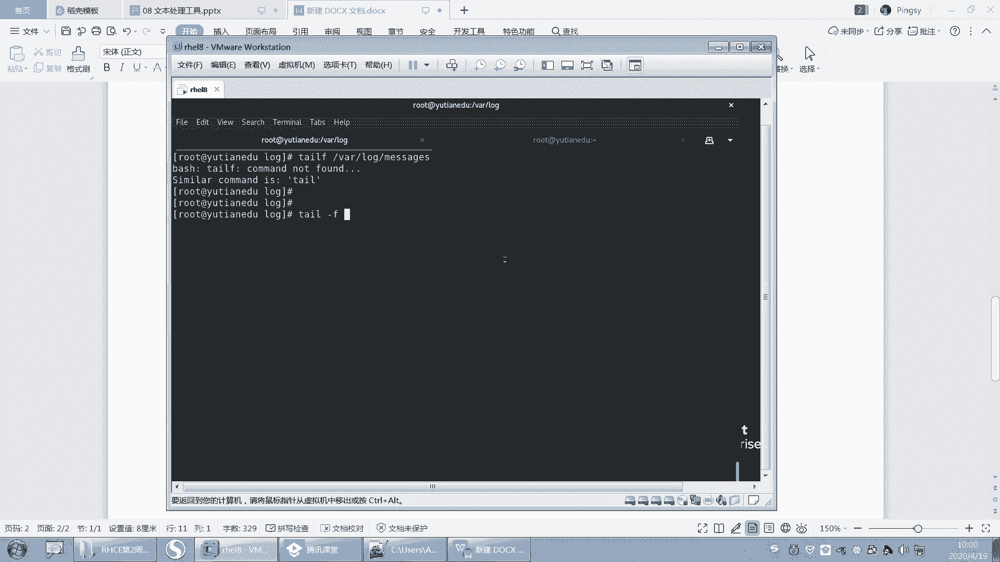

好。呃，你别说六还有了，五还有呢。这有个同学，他他公司用的是5用的是5。我七现在慢，现在现在很多了，七，现在很多了。好。呃，这个是head跟p啊，head跟 pale说完了啊，往下继续啊。呃。

下面我们来看一下grive啊，这个重点重点啊嗯。

记啊每个都要记啊。啊，呃，我们查看这个文件的时候，对吧？呃，我们刚刚学了查看整个文件，还查看其中前面几个前面几行，后面几行，对吧？哎，tell，比如说啊tell它还可以怎么样。

就是head tell它可以联合在一起使用bu准，对吧？比如说呃ca password。比如说我想查看第十行到20行，对吧？第十行到20行的话，那我们就可以head。是呃杠N20对吧？10行到20行。

你可以将样结合在一起吗？然后是呃。怎么样tell。杠F10。哦，T2杠N10。呃，这样哦跳杠N11，那这样的话就是第十0行到20行，对不对？就是你可以把它呃结合在一起去使用啊，结合在一起使用。好。

这个就看你自己。因为这个结合的方法太多了啊，你你你用到你就想办法，好吧，你你知道这些命令之后，你就要想办法结合在一起，通过管道啊，通过管道，因为你只能通过管道了嘛，对吧？多次去处理它啊。

