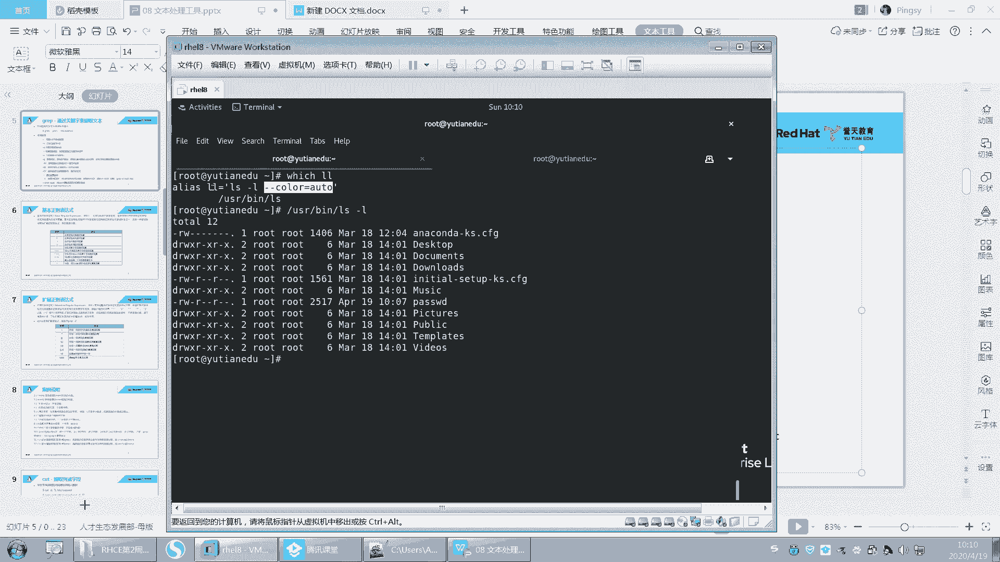
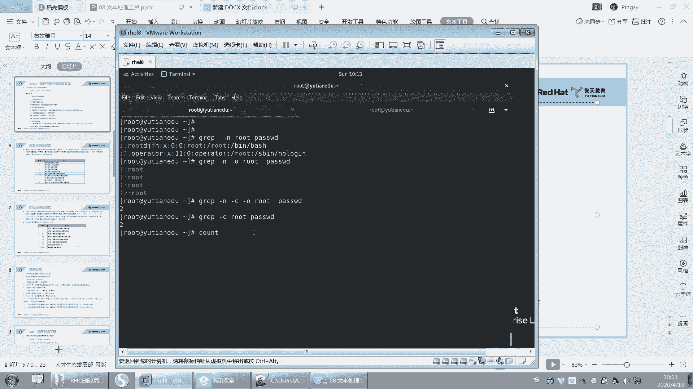

# 【重置详解版】孙老师讲红帽系列视频／RHEL 8.0 入门／红帽认证／RHCE／Linux基础教程 - P29：29 文本处理工具之grep高级文本过滤工具 - 誉天孙老师 - BV1aB4y1w7Wi

面的我们要去。过滤了啊还是要过滤。那这次过滤呢，我们是要过滤某个关键词所在的行，也是以行行为单位啊，也是以行为单位。啊，grab呢。嗯。好，看好啊，这个命字叫grape。ca password，我想去。

去搜索或者直接用gra吧gra去搜索这个词的。呃，有root的这一行，有root的这一行啊。啊，那只要带有root，它就可以把它过滤出来。group rootot password把它过滤出来啊。

这个地方是它的关键词，这个是一个关键词啊，gri加paswordO吧。好嗯，那这样啊，我们来过滤一个这个。过滤一个这个啊DF杠H这个是我昨天跟大家说到的DF杠H它可以去查看这个系统里面呃就是。

比如说文件系统它是查看文件系统的使用情况的啊，比如说这个文件系统叫。DVSDAE是吧，这是不是我们的根呢？我们的这个分区呃，之前没有给大家讲这个分区的名字，对不对？呃，你不管它叫什么吧。

反正它有可能叫SDA1，有可能叫SDA2，有可能叫SDA3，这个都有可能，对吧？或者叫其他的名字也有可能。但是呢我只需要看这个地方就知道。因为这是它的挂载点，那这是不是就是根我的根文件系统呃。

大小是16G对吧？用了4。2G，然后可用12G啊，然后使用百分26%啊，那我想去过滤这一行根分区的使用情况，根分区的使用情况，我应该过滤哪一个关键词呢。那DF杠H对吧？我是不是要过滤啊。

通过管道的形式把这个输出进行以行为单位进行过滤。所以那我们在过滤的时候，过滤哪个关键词才能把这一行给过滤出来呢？我同于说是SDAE是吧？啊，也是SDAE那这个是肯定可以过滤出来的啊。但是呢会有一个问题。

因为我刚刚有说到说，如果你这个这句话啊，你会放在某个特定的脚本里面。比如说呃我每次都要去过滤根本区的使用情况。那不同这个脚本放在不同的系统上。有没有可能这个名字是不一样的，对不对？

也就是说我现在不无法去确定是吧，这个名字固定就就是DVSDAE固定就是SDAE，那我怎么办呢？那我去过滤什么呢？因为这个名字有可能会变的，不同的系统，这个名字是不一样的呀，有可能还是逻辑变的。对不对？

所以我该过滤什么？来告诉我，所以我该过滤什么？OK有同学说是挂载点很好，有学是挂载点，对吧？因为你。你只能去过在过滤什么挂载点，因为根分区的使用情况就只有跟它相关。你过滤这个吗？你过滤数字啊。😡。

你不可能过滤数字啊，你只能过滤什么挂载点，但是过滤挂载点还有个问题，对吧？他把所有的这个斜杠都给过滤出来了，对，把所有斜杠都给过滤出来了啊。那么把所有斜杠都过滤出来，其实我只想过滤这个对吧？好。

那这个时候很简单，你只要加一个选项就可以了。W。简单吗？啊，其实你看啊那个root，我们刚刚过滤root的时候，这个地方。😡，它其实只要这个字符串里面包含入的，它就可以过滤出来。

但是我想要的是这个单词就是什么，就是斜杠，就这个这个这个那。😡，就是它是作为一个整体作为一个整体，OK吧，所以加个WW是指关键词word啊。好，你可以这样，比如说password。你可以在这儿加个。

比如说资的啊保存。你看啊这个入的后面是不是加了很多这个字符串？O， group。呃，gra。root对吧？paword那这样是不是可以过滤出来了，对吧？但是我不想过滤这个我想过滤个单词。

那么就加一个什么杠W。😡，哎，看到了吗？这个标亮的这个地方啊，标亮的这方才是我过滤出来的。为什么这一行也出来，是因为后面还有rootO吧，这叫过滤关键词，这个只是一个字符串，后面是一个关键词啊。

杠W精确匹配。对，类似就是这样精确匹配很好啊。好，记好了啊，杠W第一个选项啊，第一个选项。😊，好，我再写一行啊，我写个大写的root。啊，那我们再来过滤一下啊。现在我要过滤一下。

这个嗯gra rootot是吧？那这个地方呢，我好像写了一个大写的root是吧？那如果我想去过滤这个呃大写的root，就大写小写都过滤的话，那么叫杠I忽略大小写。呃，一样的啊。

叫杠I忽略杠I忽略的条写啊。嗯，gra的杠I是忽略大小写杠W是精确匹配某个单词。然后杠A是湖理大学。好，这是两个了啊两个了。好，下面再来。嗯，我呢想去嗯。干什么呢？好，我们想去去去去去去。

比如说啊除掉这个就是就是去除掉。就是我想要的这一行，我不想要，对吧？就是说。😡，嗯，我想过滤出来带root的好都不要都不要看，那我就可要反向过滤了是吧？就是把就去掉啊，那就杠。呃，V杠V啊。呃。

杠V是指过滤掉带root的行，过滤掉过滤掉就不要了嘛，就不显示了。OK吧，那。呃，杠V就是去除掉什么什么以外，去除掉带root的行。注意group是以行为单位进行的啊。你这一行匹配了，他就给你打印出来。

这一行。符合要求就可以打出打印出来啊。而且grib呢。你发现它会带有颜色，看到没有？那是不是带有颜色呀？注意啊，grave带有颜色，在其在其他的系统里面不一定带有颜色。因为grave是一个什么？

grave是一个关键词，不是它是一个别名。还记得别名吗？还记不记得别名啊，那它其实是grive等于杠杠 coloror是吧？其实你用这个啊。那你用这个地方去过滤pa。哎。呃，过滤root。

它是不是没有颜色呀，对不对？没有高亮，那带有颜色就加一个什么呃，加一个选项叫杠杠color。呃，等于aler是吧？好，这样就带有颜色了啊。好，如果。呃，别的系统里面没有。

因为红贸企红贸企业吧他给你做的就是嗯就是有一些都给你这别名都给你做出来了是吧？但是不一定其他系统里面都有啊，像以前的版本里面，grab就是没有的，grab就没有高亮的，但是我们可以自己去加。

它有个选项叫杠杠color等于这个。然后可以去加它高亮啊，让它高亮好吧。好，这是颜色的选择啊，颜色选择。好，其实LL也是个别名。哦每次想想想敲这个LL是吧？LL其实就是LS杠L。呃，LS杠L怎么看呢？

whichLL那它是不是就是LS杠L，而且还带有颜色呀，对不对？其实本来本来这个它是不带有颜色的那。人家设计的时候，人家就是不带颜色的。😡，但是人家给你什么，有个选项，你自己嗯去加上去就可以了。

但是我们系统给你加好了，是吧，直接LL就是了啊。

好呃。这个是最后这个高亮，还有这个呃杠I奖了是吧？然后杠我呃不不杠呃杠I讲了，然后杠唉杠W我没有写是吧？你记好了吗？你记好啊。

好，然后还有啊啊第二个我们来一个个讲啊，杠杠N。杠N啊gra。嗯，杠N，然后rootpassword，它自带行号，看到没有？它自带行号啊，然后12ok吧，杠N显示行号不用多说啊，杠N显示行号。好了。

那么。呃，还有一个啊，比如说我们group呃root。它一个比如说杠N显示行号，它一个杠O。杠O是什么意思呢？你看杠O呢，它就是只显示这个过滤出来的关键词。看到了吗？杠O是只显示过滤出来的关键词。

有用的啊，记好只显示匹配的行，只显示匹配的内容。为什么说你你这不就过滤过root吗？这就是root呀，因为将来有可能我们会用政则表示它是一个模糊匹配，所以它会将我们匹配内容打印出来。

记住杠or是只显示匹配的内容。😡。

这一行内容其他部分全部去掉，不要了，只显示匹配的内容，OK吧。嗯。

只显示匹配内容啊。而且你看这是不是第一行第一行第一行啊。呃，他还就第上有3个是吧？好。杠5写好了吗？杠5啊。然后再来呃gri还有什么杠C是吧？他说如果匹配成功，则将匹配的行行数打印出来是吧？好，你看啊。

因为C呢。

它可以怎么样啊，杠C。哇。匹配两行是吧，它只它只统计是么？他只统计这个行呃，这样的啊。我先把它就去掉。呃，杠C root它是word的。两行对吧？这个C是不是只匹配几行，然后打印行号啊。

两行有两行是匹配的，C就是count。呃，count计数统计的意思啊，计术统计。对，行数有几行。

有几行啊。好，杠C记下啊。杠C。然后杠V刚刚讲过了是吧？

杠V是不是讲过了？好。再来啊。呃，现在呢。我想做一个判断。对，反向匹配嘛，刚刚不讲过了吗？刚威刚讲过了吧。好，我现在想做一个判断，就是。😡，嗯，我想过滤出这个文件，我想去做什么呢？将来我去写脚本，对吧？

我想去看这个文件里面有没有root，带不带root这个关键词，如果带我就怎么怎么样，如果不带，我就怎么怎怎么样。所以我是不是要去判断。😡，我能过滤出这个关键词吗？如果能过滤出。

对吧那我怎么去判断能过滤出呢？好。gra啊，其实我杠Nroot password能不能过滤出root呢？能呢？但是我怎么去判断呢？我怎么去判断我就过滤出来呢？因为你你这是人为去看，对吧？如果写脚本的话。

你怎么去看呢？你没办法去看。因为我们之前有学过一个，我昨天刚讲过了。对，我们昨天刚讲过了一个叫东叫什么东西呢？😡，也不要好，不管它嗯。昨天讲过叫每执行一个命令，是不是会有个退出码啊？没有异议。好。

对你看啊，你一定要这个多了问号一定是上一次执行的命令。你看我在这儿执行了这个地方是不是显示的是它的它的退出码，对吧？那看到没有？显示它的退出码。所以你看退出码是0。好，那我如果过滤一个，比如说我随便嘟。

😡，哎，这样是不是就是一啊？你看这个是不是代表没有过滤出来呀？没有过滤出来，是这样吧，没有过滤出来，这地方是不是退出码是非零啊啊，非零O吧。好，那就代表那我将来是不是要判断哦，多了问号是等于零吗？

等于零的话，是不是就过滤出来了，等于不等于零是不是就是没有过滤出来，对吧？这个我们写脚本的时候，我们可以用衣ve语句来判断的啊。😊，好，那既然我可以怎么样啊？我可以通过这种方式来判断我有没有过滤成功。

我还需不需要看我这一行内容，我还需不需要让它打印出来？不需要让打印出来，对吧？其实不让打印出来，我们今天也学过什么呀，也学过一个，是不是就是把它重定向到第一V档里面。😡，这是我们之前学的吧，对不对？啊。

但是这个地方它呢还给我提供了一个选项叫杠Q啊，那杠Q叫静默模式，没有任何输出。😊。

呃，gra。杠Q。呃，gra呃杠Q是吧，就就就就就这就杠Q就这个意思啊。要不要判我怎么判断呢？就直接怎么样do了问号就可以。嗯，你用这个方式，别人一看就能看出来是什么意思，对吧？

但是你用这个别人不一定能看出来啊，因为寂寞模式叫quite quiet。😊，啊，叫静默是吧，安静的是吧？静默很多那个Q都是指静默的意思啊。

好。

呃，杠Q是吧？好，再来啊，下面还有什么杠ABC是吧，那这是什么呢？😊，嗯，比如说啊我过滤出来了这个。这个root。啊，那这个root呢有可能我过滤出来的这个呃它只过滤出当前这一行是吧，匹配的行。

那我还想去看它上下上下两上下几行。比如说想看匹配的行，上面两行匹配的行，下面两行是吧？那怎么看呢？我们可以这样叫前面会加一个。杠AX。A呃A叫after，就是after，就是呃它的后面两行。

后面两行看到吗？那匹配的旁后面两行A叫after嘛？呃，B呢是不是叫befo？哦，CC啥C没有是吧？啊，A就是after B就是before，就是前面两行是吧？那前面两行的话就是加一个什么加一个B。

那你说老师这有啥用啊？对吧你这是有什么用啊？你其实我看这里说实话确实没有什么用，对吧？没有什么意义，对吧？但是注意当你去看这个日志文件的时候，就有可能会有作用了。日志文件啊。好。

你说怎么说又说到日志文件了呢？你打开这个日志文件，比如说啊我们te。呃，票啊。有些时候我们这样去看啊，你发现这个日志文件刷刷刷刷刷刷刷是不是刷的非常快啊。

有时候你是不是根本都看不清里面到底有哪些什么哪些错误的。因为我们当时下在排错嘛，出现错误了，我可能要去看日志，对吧？要不然我看什么呢？😡，对吧报错了，那我看什么，那能百度吗？百度你百度不出来。

所以你只能看日志。但是看日志它刷的时候，因为如果你实时看，有时候看看我刚刚是不是刷的非常快呀。😡，对吧发生的非常快，那升量非常快的话，那你怎么去找到那个错误的地方呢？啊。

这样的话我们就可以去过一些关键词，我们可以这样去过滤啊。😡，呃，比如说。我们可以gri，比如说arrow。哎，过滤这些呢arrow一般就是错误的意思，对吧？错误的意思或者是什么呃warning啊。

就提示啊，这些词可以过滤。好，但是这个时候我们这样的时候是不是不会是实时的那我可以这样tell杠F。然后实时的去过滤哦。啊，比如说过滤arrow。好，你看它这个地方是不是会等待，只要有arrow蹦出来。

只要有arrow出现，它就会蹦出来就会蹦那蹦蹦蹦蹦出来是吧？好，但是arrow有些时候我们错误的行。😡，提示的错误有可能并不在L那一行，因为它有可能在上下行跟它相关的。因为这样我可以看到它为什么去错了。

哪个地方错了是吧？😡，好，那么就可以看上下嘛，那我就可以加一个什么呃杠A就是后面嘛，哎杠B就是前面嘛，对吧？那还有个杠C就是前后都要看，比如前后看都看五行，关于错误的这一行匹配是吧？然后前后五行都要看。

那就是杠C。OK吧，虽然这个地方它没有错误啊，因为没有错误。这样的话我就可以哎怎么样？就是过滤这个关键词，然后前面行五行，后面五行全部都看。

🤧对。对你可以呀，你可以导出来看啊，但是呃你导出来干嘛，你其实也没必要导出来，你本来就在日志文件里面嘛，一导也行。本来就在日志文件里面，只是说。对，然后你可以把这些错误的导出来也可以。嗯，好吧。

这个看你怎么去处理，这个方便，你就怎么去处理啊，这然后这只是一种方法，好吧，前后这样相关的五行啊。好。呃。杠C吧，杠C就是什么前后五行吧。呃，前后C。那。呃。

你看这个root前面两行和后面两行是不是都看，这叫C杠杠C啊。

嗯，杠C。好。再来记住啊，下面这个选项非常重要，一定要记一定要记啊，这个选项叫杠R。这喜要杠R哦。杠R啊。啊。什么杠C。好，就选上个杠R啊，那这个杠R是干什么呢？非常重要，而且你有时候会用经常会用到它。

而且关键时候你你不知道它对吧？你就很难去办啊。😡，我们。我们在搜索的时候，我们都知道，比如说我就是要从什么password里面去搜索root，我就是要在password文件都告诉我了。😡。

就是要在pasal里面搜索root，对吧？但是有些时候。😡，什么C是哪个单词？count嘛？刚不是说过了吗？统计数吗？多少个？你去卖吧。对，反正我是这么记的，不知道他是不是。我一般都是这样去记。

就大C是吧？你搜，反正你就记count吧，我一般都记道就count。是吧。

count着吗。看的就是数嘛。统计吗？对吧。好。然后嗯呀我想说啥哈，呃，我们知道这个文件了，然后我们也去知道我们要过滤的词了是吧？但是有些时候有没有可能你。😊。

比如说啊我们将来会学一些变量，它一些变量呢都会放在这个文件里面。但是变量呢放在哪个文件里，因为文件太多了，对吧？文件太多了。所以这个时候呢，你不知道你要找那个单词，找那个变量在哪个地方。

或者是这个不是变量，是个参数，就是个参数。好，那这个参数呢，你不知道在这个系统当中哪个文件里面。但是你大概知道它有可能会在ETC下面。😡，在ETC下面的某一个文件里面会有一个单词叫黑色黑色啊，黑色。

haste呃呃hste size啊，比如说啊有个有个单词叫hast size，但是你不记得在哪个文件里面了，那我是不是要去查O吧，去查啊，好，grave杠R就用上了。😊，来搜索一下。

gra杠R它可以去递归的。去指定搜索哪个目录，将这个目录下面所有的文件全部搜索一遍。对，全部搜索一遍，看哪个文件里面有黑色size这个单词，有的话就给我打印出来，没有就不打印。好，找一遍不去了。

看到没有？在ETCpro里面有个黑色size于千。在什么什么这个文件里面有个黑色色，在这个文件有个有个这个，而且我再加一个什么，再加一个N嗯。😊，怎么样我打印行号，在这个文件里面第46行。

这还不够清楚吗？是不是非常清楚啊？所以当你有一个参数不记得了，因为我们将来会写配置，我们会写，比如说我搭一个Ng，对吧？那我搭一个Ng。😡，这个意思有很多参数，那那个参数不记得了。

不记得在哪个文件里面了。但是你如说老师我怎不能查根去吧，你说不记得这个文件太多了，那我我查根，你最好不要去查根，因为根文件太多了。😡，因为定位一下嘛，大概定位一下哦，配置文件是不是在ETC下面，对吧？

那你就接ETC，你不要去动不动就跟跟跟那啊，把跟管坏了，这个你后果自负啊。而且你查根的话，文件太多，而且你如果你文件太多，查消耗性能太多。那你系统如果比较繁忙的话，你这样去查其实是很耗性能。

很耗性能的啊。所以尽量不要去做这样的事情，尽量稍微定位的稍微准确一点啊，就ETC虽然它也能去找根也能去找，但是尽量把定准准确一点啊，记记住啊，杠R杠R是这样的意思啊。根据。呃，这个。

这个关键词去查找文件。注意啊是根据。关键词就是文本内容啊，就就说文本内容去查找是是哪个文件。

就杠R意思。我这只是写了递归搜索目录是吧，你再补充一下啊，就是根据是吧。文本内容。搜索。搜索文件。搜索文件后面可以跟什么？后面可以跟这个目录啊，后面可以跟目录。好吧，后面可以跟目录啊。

好，这个杠L呢跟杠R一般是一起在用，就是我只想看是哪个文件，不想看这个文件里面内容，那我就加一个。呃。加1个RLL。那L就这个意思，它是只只打印文件名，而不要去打印这个文件内容。

就是L的意思就列出文件名。L就是呃列出文件名与杠R一起使用，就这样记啊。

呃，如果匹配成功，就将文件名打印出来，失败则不打印是吧？一般是这样去用啊，这样去用啊。通常这样去用OK吧？啊，这个选项呢基本上跟大家都呃讲了一些，就是经常用到的啊，其他的其实还有很多。

这个我就不跟大家讲了。然后你你呢就去看这个里面，好吧，这个还有。

还有一些。里面的这个这个这个。这个你用到了，你就去找，好吧。刚Q。不是你们是。

你们是没听到还是没听懂啊？

就是不输出嘛。就是我内容我刚刚。就是Q嘛，就是。不输出你啊。root，然后password。就现在他不是有输出吗？那Q就不输出，就这个意思。就不输出，不管找不找到都不输出。

那我怎么知道它找到了还是没找到呢？我们是不是可以根据这个多了问号去判断，对吧？这样子。对呀。然后多了问号去判断，对吧？就是不显示这个输出。嗯。

对。