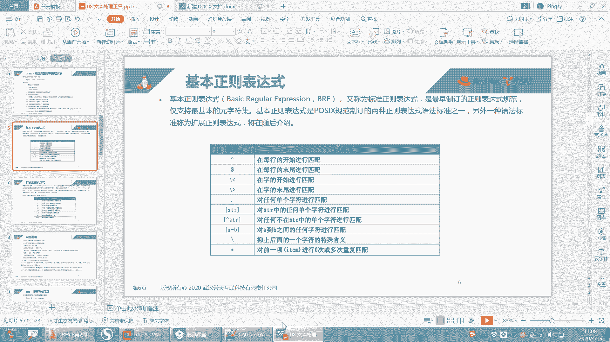

# 【重置详解版】孙老师讲红帽系列视频／RHEL 8.0 入门／红帽认证／RHCE／Linux基础教程 - P30：30 文本处理工具之正则表达式详解 - 誉天孙老师 - BV1aB4y1w7Wi

好。嗯，下面我们会讲这个关于真策表示的啊，这个其实我们嗯我们就是粗略的把选项讲了一下，是吧？呃，但是这个具体的匹配字符串，我们还要用正则表达式去匹配。所以我们待会儿休息一下。

回来之后我们来讲一下这个正则表式啊。因为这个对大家这个将来处理文本的话非常有用的。所以我就。在这地方给大家说一下OK我们先下课休息一下吧，回来再讲，好吧，休息休息。😊，嗯嗯嗯。好。嗯。我来了啊。

OK我们来看一下关于正则表示这块啊。嗯。这个政策表是能做什么的，其实它就是主要来。呃，来来去匹配这个字符串的是吧？比为文本内容的啊。那么基本政策表示呢称为标准政策表示。呃，我们通常用这个。呃。

什么regularex是吧，REBRE。啊，是最早制定的这个政策表示呃，只支持这些啊支持这些。那么嗯还有一种叫扩扩展的政策表示，就是后面这个。那gra嘛gra本身啊。

它现在就是gra本身现在只支持那个叫。呃，它可以支持什么？支持政则表示基本的正则表示。嗯，但是你如果想支持一些扩展的，扩展的话，它可能会有一些。呃。

扩展扩展扩展这个表达式呢还会有一些多余的字多了一些字符啊，也为支持啊，这个时候你需要用这个gra杠E来后面，就是你想用这些字段表示。

你需要加个group杠E所以E呢就就是扩展的继续扩展的然Egra呢还有一个命令其实gra家族里面有很多gra家族中有很多这个跟它类似的这个命令啊，比如说gra啊 egra啊P grape啊什么gra啊。

对吧？嗯，那这些它都是这一大家族的啊，gra命令。好，所以你用Egra就相当于用什么？gra杠一是一样的啊。OK吧。好，我们先从这边开始啊，我们先大概跟他家介绍一下。呃，然后我再来举例。嗯。

在grab这个正呃正字表示当中呢，它有一个它有这些字符啊，一个间号，间号是指每行的开头开始部分doll呢是指每行的末尾。然后还有一个这个这两个这个小呃斜杠小于号指就是一个词的开始，还有词的末尾，对吧？

这个点是指对任意字符进行匹配啊，就表示一个任意字符。这个是这个字符串，但是这个字符串当中它可能会有很多字符。所以中括号括起来的话，只代表一个字符。然后还有这种间号，对吧？它是不匹配。

就除了这个括号里面的内容。都其他的以外都匹配，还有和A到B之间。🤧A到B之间对吧？然后还有反斜杠啊等等，还有很多。好，没关系啊，我会个一个个给大家举例的啊。好呃，那我们先。先来第一个好吧。

这个啊间号。嗯。嗯，打开pasword啊。这个password里面呢，我们可以去找啊，比如说把这行删掉。嗯，我们找一下啊gra。root他说我的。啊，带有root的行其实是有两行的。

但是这个时候我只想看以及root开头的行，注意是以root开头的行。那么这一行是不是以这一行不是root开头吧，是不是只有第一行是满足要求的。所以我可以这样grave加号root啊，password。

这样的话是不是就可以满足我所需需要的这个什么？而且这两个是没有高量啊，而且只高亮了这个对吧？说明是这这个是我查找到的吧，这个调代表是以什么什么开头间号代表是以什么什么开头啊，记好啊。

还记得我们昨天用VM的时候，我说间号是不是就是回到这个行首啊。是什么开头啊，然后dollar符号就是末尾啊，所以在这个地方，dollar符号指的是以什么什么结尾，注意啊，以什么什么结尾哈group。哦。

比如说以呃。呃，buush结尾，那就多了符号。多的符号。啊，以什么什么结尾看到了吗？就是什么什么开头，什么什么结尾，这个是代表以什么什么结尾记啊。

第一个间号代表是以什么什么开头doll符号指的是以什么什么结尾啊，以什么什么结尾。好嗯。记了。再来啊。嗯，看一下，我举个例子啊。啊，现在这个文件当中是有一个空行，看到没有？是有一个空行，对不对？

所以你看啊我可以我可以这样group。然后。呃，间号doll of号它是word。这样的话代表是过滤空行记下来啊。间号多了符号匹配的是空行。匹配的是空行啊。那我可以这样gra是吧？然后呃root。

但是这个本来就。他本来就已经不包括孔行了，是吧？啊，gra杠V root。他说的。哦，你看这个地方是包括这个空行的，对不对？你看把带有root行去掉之后，是包括有个空行的。但是这个空行我不想要。

注意空行我不想要对吧？所以我就把空行也过滤掉，那我就再继续gra杠V。然后间号多了符号是不是代表空行OK吧？那这样的话，这个空行是不是就没有了？所以间号多了符号代表是空行啊，间号是以什么时候开头？

多了符号是以什么什么结尾。YP时有没有没有在记啊？嗯。邵阳、陈飞翔、迪剑、黄泽坤。王子维都在不在？没有回答，就是挂机的，邵阳是在挂机啊。哦。回来就。啊，要记啊要记O。😊。

好，这个就是我们的这个呃过滤空行啊，然后继续往下看看看这里啊，这个间号小于号，间号小于号啊，我跟你说，你这。

你就不上课听我讲啊，你下面你下面要自己去总结的话，你就看别人的不一定能看到你下面自己自己总结。很难啊，自己总结的话，这个这个。花的时间更多，而且不一定还能总结对啊。好呃，gra呃。

这样啊gra root。再来看一个啊。password，你看这个单词啊，就这个单词呃，这个它过滤出来的。呃，这这四个是不是都过滤出来的？但是有些时候。我想要去这样啊，我再把它给改一下。我把改一下啊。嗯。

那个operator那一行啊，opoperoper这一行是吧？我想把这个地方改成登这。然后。就这样子啊。好，看啊看这个地方跟这个地方的区别在于什么？这个root。是不是是其中一个字符串呢？

刚刚我们说可以加大W是吧？啊，加W是可以过滤出什么，只有带这个的对吧？但是现在我想过滤什么呢？我想过滤是这个单词当中是以root开头的。😊，或者说是以这个单词当中以root结尾的，能理解我说意思吗？

就是这个单词啊，而不是这一行能理解吗？不是这一行啊，是这个单词当中以root开头的。好。

那么我们来看一下，我过滤一下啊，过滤一下呃，grave我可以用这个符号叫呃这个符号叫什么？叫小于号，斜杠小于号斜杠小于号，然后以root单词当中以root开头的这个字符串开头的行。好。

把这个地方我们用引号，因为以后你们只要用这段表是最好用引号引起来啊。好，那这个单词是不是就过滤到了，而且这个也过滤到这个也过滤到了，对吧？好，注意这些啊，像这种除了字符串以外的对数单词。

它本来就是隔开的。😊，就是。就这个冒号跟这个斜杠，它本来就不属于这个字符串里面的。所以这个字符串当中已root开头的，是不是这个过滤到了，这个过滤到了这个过滤到了，那么这个是没有过滤到，这个没有过滤到。

为什么？因为这个单这个字符串它不是以root开头的对吧？它是以root结尾的，所以如果想以root结尾的话，那么我们就可以这样。呃，是斜杠小于号是这样吧，这个是不是就过滤到了？

这个也过滤到了这个也过滤到了，但是这个没有过滤到。因为这个它不是什么，它是不是已root这个。😡，🤧这个字符串结尾的啊，所以就是这个符号OK吧。好，他好像也可以这样嗯。那这样就是什么。

这样是不是G这个单词其实就是什么杠W嘛。这个地方是不是其实就是这个单词，就是root呀，就是杠W吧。啊，已入的开头引入的结尾嘛。嗯，就这个符号。记下来了吗？

就是单词当中斜杠角于号是以单词当中移柱的开头的。单词当中一柱的什么什么结尾的啊，就这两个。还有点的话就是匹配任意字符了，这个这个就这个。

这个到后面我举例的时候，我后面有一些例子会用到这个点的啊，点就是任意一个字符嘛，随便你这个字符是什么？随便你这个字符是什么啊？点呃点。你看它就前面匹配这个了是吧？这个就不好匹配了啊。嗯，然后这样点。

你看它这个地方可以匹配任意的任意的一个字符，这个点指的是任意个字符，可以是O，对吧？可以呢？O是不是也匹配到了任意一个字符啊，这个点是指任意一个字符。😊，我可以把这个地方改一下嘛，比如说我改成A。嗯。

改成呃改成A是吧啊。你再来看。这样这个是不是也也匹配到了，所以这个地方就点代表示任意字符。

点代表是任意字符啊。啊，然后还来。

再来啊。呃，我还想去匹配啊，比如说。嗯，我想去匹配以ABC开头的行。注意哦，是以ABC开头的行啊。好。来gra。呃，我们讲以什么什么开头是不是间号引号引起来哦，然后pas错中间写你的正的表示。好。

以什么什么开头是不是间号，以什么什么开头叫间号是吧？好，以ABC开头，那以A开头就是A以B开头就是B以C开头是不是以C啊？好，那ABC怎么办？中括号括起来ABC看好啊，回去了。😊，那前面是ABC的。

是不是都匹配的？那这个中括号注意标记一下，中括号只是匹配一个字母，一个字符啊，中括号匹配是一个字符，无论你中括号里面有多少个单词，只是匹配一个字符啊。它是A或者是B或者是C啊A或者B或者C。好。

这是以什么什么开头的对吧？还有一种。😡，在中括号里面加上一个也加上一个间号，这两个间号要区分开来。好。看好啊，这两个间号要区分开来啊，这个间号在中括号外面是不是指以什么什么开头？那么在中考里面。

这个键号指的是除了什么什么以外。所以这个这一行指的是。除了ABC。开头的行都匹配。再说一遍啊，除了ABC开头的行都匹配回车。那。ABC的是不是都没有匹配？那匹配了什么呃，B除了ABC以外的啊。

所以中括号中间中括号里面这个键号指的是除了什么什么以外。中括外面这个键号指的是以什么什么开头。

嗯，就这两个啊。嗯。

好了吧。好。下面这个啊就是A到B，它是指连续的字符串啊，比如说呃我可以匹配。AABC就写A杠C这样也行，就这样子啊，A杠C就是A连续的。那小写字母的话是不是就是A杠Z呀，这样的话是不是代表小写字母？

然后A到大Z是不是代表代表大写字母，这样连续的，它只连续的字符串啊。呃，连续的组产。嗯，连续的走上。我还可以这样小写大写，我可以写在一起。比如说AABC，然后A到啊B啊A到C这样子。那看到没有？

这样也可以写。这就是大写，但是没有大写的是吧？嗯，然后你还可以写什么？你还可以写数字，比如说呃123。这是不是以123开头的，但是没有是吧，你看就123，然后嗯。好，我不加间号的话。

就匹配带有数字的行是吧？那这是匹配带有数字的行吗？不不加间号，那匹配带有数字的行。嗯，看到没有？啊，那么123就匹配123嘛，除了123以外，这些都是是不是不匹配不匹配吧，对吧？不匹配啊。

那123你你也可以这样呃，1到1到9。呃，0到9是不是就匹配什么所有的数字嘛？你看0到9是不是匹配所有的数字啊。

对不对？好，这个就是中括号啊中括号。呃，还有这个呃斜杠，这个斜杠之前。

有讲过吧。这个斜杠呃反斜杠嘛，反斜杠就是一直和后面那一位的这个。呃，就是嗯这样子啊，我来举个例子啊。

嗯。

嗯，举个什么例子呢？嗯。比如说这个地方中间有个空格。就中间有个空格是吧？呃，grave。然后比如说我们是过滤空格，看能不能过滤啊。啊，这个不行，这个他必须以什么开头的。嗯，这样行不行？举个什么例子。好。

这个。这个之前好像用过吧，这个反斜杠呃，记得我们用data的时候，就跟那是一样的啊。用data时候不是中间要显示那个空格嘛，然后我们用一个反斜杠空格，这个我们经常会用的啊，后面再举例子吧，好吧。

啊，然后这个地方这个星号星号是指我的前一项进行0到多次的匹配，0到多次的重复匹配啊，你看啊。

比如说root。呃， gr。嗯。ROT是吧，root。RO。啊，你可以加个星号，星号是不是指匹前面这个零这个O匹配0到多次，对吧？好。那么0次是不是也可以，你看这种R的R的这种O是不是匹配一个？

一个O吗？那如果说我写多个O的话。比如这个地方我写三个O是吧，看能不能匹配到啊。呃，三个O是不是也可以匹配到，看到没有？就是前面的匹配零次。那么这个O匹配零次零次是不是就没有，然后匹配一次就一个我嘛。

两次就两个哦，三个三次就三个我嘛，就这样子。

啊，就星号对前面的内容匹配零次或多次。名次或多次啊。对他前一项啊。

就他前面一定要加个东西。😡，一定要加个东西，OK吧。就是对这个哦，但是你看零次的话，你这个写不是写哦吗？它其其实就是不是作为一个整体，哦下星号作为一个整体。那么这个零哦零星号就是呃零个哦一个哦，两个哦。

三个四个窝，对吧？就这样啊。

好。都记好了吧。呃，这个是我们的基本政则，我基本上每个大家都给大家演示了一下啊。你你你用这个的话，注意你在用的时候，我们gra就可以了。然后你用引号引起来，把你的正则表示放在中间。

然后后面写上什么文件名，把你的正则表示放在中间啊。因为有一些字符，它是有特殊含义的，所以用单引号引起来，这样子就防止有一些特殊字符有特殊含义。

🤧嗯。

啊，这个是grib的基准政则啊，那再往下看啊。😊，呃，关于group的一些这个。什么还有一些。扩展的正则是吧？呃，在扩展正则当中，你看啊它依旧保留了什么呃，间号多勒号点星号、中括号这些。

以及这个符号在扩展正则当中，其实也都可以用，OK吧？都可以用啊啊，其意义和用法完全一样的。我们不再介绍了。那下面呢是新增的一些呃扩展正则啊，扩展正则啊，如果你用扩展正则的话。

请用gra杠1或者是Egra。好，我来举个例子啊。

比如说我想去查找这个呃gri。呃，查找带有root的行，以及或者啊或者带有或者带有user的行，那我怎么过滤呢？或者呀他们俩之间或者关系，对吧？那如果用或者，我们中间用竖杠将它隔开。

竖杠代表是或者的意思，那我前面加个引号，把引号引起来啊，我们最好用引号引起来。好，那你这样去用的话，它是无法匹配了。看到没有？它识别不到，所以你要用什么gra杠大一。这样是不是就可以匹配到了？

这个就代表扩展正则啊，就因为这个这个竖杠在扩展正则里面有，所以我们用egroup。Egroup，然后引号引起来，然后root。Useer。然后password。

这两个是一模一样的。我中专就这么大，你放大。那就这样子。这样子。

这样可以吧。这可以吗？那就用Egra是吧？我们就是一股不啊。啊，E group呃。Root。U着。然后你还用手机看的哦。啊。就这个啊。

好，然后。嗯，那继续喽。啊，那在这个我刚刚演示的是这个啊，S竖杠T，这个是匹配S项或者是T项中中的任意一项任意一项啊，然后加号呢是对前面对前一项进行一次到多次，它分开了。比如说0次到一次的话是用问号。

然后加号是指一次到多多次，所以前面如果依次到多次的话，比如说gra rootRO是吧？我们刚刚不是举个例子吗？然后如果你用加号的话，是匹配什么？一到多次啊。

那是不是后面那带R的是不是就没有匹配到ok吧？就是没有O的，是不是没有匹配到之前是新号嘛，星号是不是零到多次？那么这个地方至少就出要去要出现一次啊，因为它是加号嘛，至少出现一次。

所以它加号OK如果出现0到多次的话，那么这个地方就是0到1次，就是什么就是呃问号是不问号。

那是问号0到1次，就是问号。没有是吧。哦，Egra敲错了。啊，Egroup啊，它它你看它没有识别到，它没有group没有识别到这个问号。啊，E group啊E group。好，Egra的话。

这个地方问号是不是0到00到1次，那么0次的跟一次的是不是都匹配了，两次的没有匹配吧，两次的是没有匹配的啊好，Egra。嗯。刚刚是加号是吧？嗯，加号是1到多次，就匹配一次、两次、三次都匹配。好。

比是说你你想匹配几次吧，比如说那你就用什么括号把括起来。呃，比如说匹配2到3次。好，那就2逗号3。2、逗号3，这样就是2到3次，这个O匹配2到3次。那就是2到3是吧？如果你只想匹配两次，那么就写2哎。

就是匹配两次。好吧。就是M到J次是吧，1到3次。好，会了吧，那1到3次啊，就是刚刚那个加号呃，问号星号是不是用具体的数字来表示了，用1到3嘛。

嗯，就这个，然后这个J呢呃J逗号后面什么都不加，就是JJ到更多次，然后什么都不加K，就是0到K。呃，最最多匹配case看到没有？这个我就不演示了啊，这个J到就无限词呃，零到K次这样J到K次。好吧。

这个匹配多少次的啊。然后S到T就是匹配S项或者是T项S项或者T项啊。然后这个我在后面再举例吧，这个啊这个后面再举例啊，这个就是你用小框括起来的话，就是做一个整体。但是在现在做一些整体没有什么意义。

来做一个整体的意思啊。嗯。好呃，这就是扩展扩展政策啊，这这听懂了没有啊，听懂了吗？啊，周建祥OK吧。邵阳OK吧。太多了是吧？你。我记得好像有谁说老师尽管来是吧？尽管那个轰炸我是吧？好。嗯。

这这个就是我刚刚的一些解释。对，这个就是间号多了福这个多勒佛就刚刚演示过了是吧？然后间号多勒佛号表示空行不是空格，是空行点代表一个字符。然后它这个转移字符有着特殊的含义是吧？然后星号这都有个解释啊。

我这个其实刚才已经解释过了，我都已经讲过了，我就不再说了啊。嗯，任意的字符作为单词，那这个也讲过了是吧，这个也讲过了。好。这个。就过了啊。呃，这个其实你正则其实差不多就这些。嗯，也还好。

这个主要就是要练。嗯，我告诉你需求，对吧？你把它做出来，就这样。嗯。太有用了是吧？没背心，这次。重新应该对吧？应该是有收获的是吧？好呃，grab啊gra的话我们就讲到这儿，然后结合一些就正则。正则的话。

我们将来有一些其他的工具嗯。😊，呃，上次不是我讲的，是这样吧，上次前面几周不是我讲，上次是左老师讲的吧。好。嗯。这些正则你要记住，因为有很多其他的工具，它其实也用到这些重则，就是一样的啊一样的。

所以你你不仅仅是在group里面，在其他的有一些工具里面也可以用到啊，OK吧。

