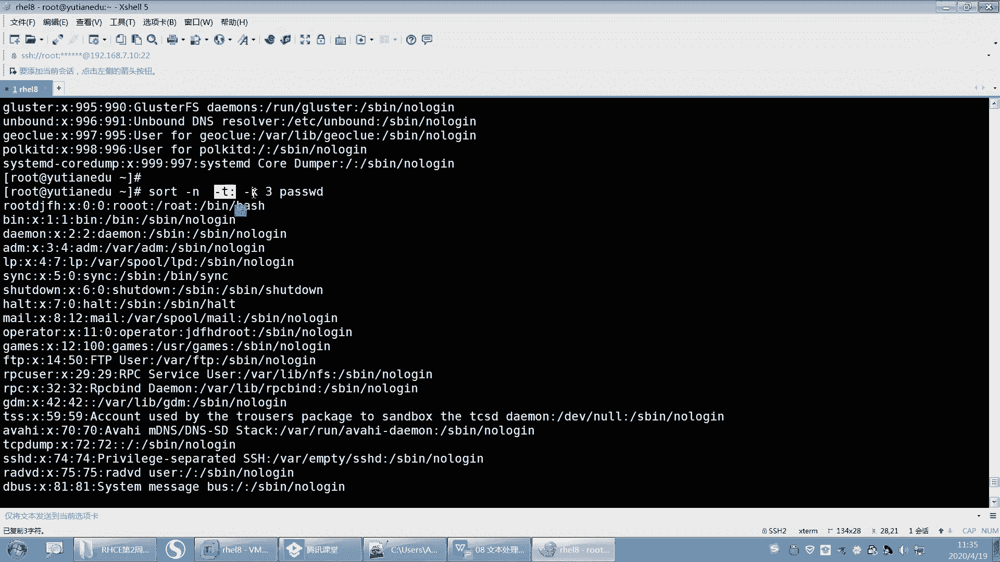

# 【重置详解版】孙老师讲红帽系列视频／RHEL 8.0 入门／红帽认证／RHCE／Linux基础教程 - P31：31 文本处理工具之cut，sort，tr，sed等使用详解 - 誉天孙老师 - BV1aB4y1w7Wi

O吧。好，下面我们再来讲另外一个工具啊，这个工具叫cut。

讲cut之前。嗯。看一下啊，昨天讲1个TR是吧？

好，先讲下cut吧。讲一个cutt啊。嗯，cut的话，gra我们说以行为单位进行什么？以行为单位进行这个过滤，以行为单位啊。下面我要学一下cut是以列为单位，以列过滤列的啊，过滤列的。好。

然后ca password打开。打开这个文件啊，这个文件呢我们想去过滤什么呢？嗯，我想去过滤这个第几列呢？这样我把它给有的给删掉，先不要了啊。保存。好，这样啊，我们看这个文件它比较特殊，对吧？

这个文件呢它有严格的区分，就是每一个栏位，第一个栏位吧，第二个栏位，第三个栏位，每个栏位中间是有这个。分号分隔开的对吧？用分号分隔开的那现在我想去过滤第几列呢？我想去过滤这个第一列okK第一列啊。

是不是过滤用户名啊，那我怎么知道是第一列，是不是我们知道要告诉他是以分号为分隔符的第一列。所以在过滤列的时候，我们要告诉分隔符啊，分隔符是分号。第几列第一列好吧，所以你至少要有两两个选项啊。

两个选项cut。啊，指定分隔符指定分隔符用杠D来指定杠D来指定分隔符啊。好，那杠低分隔符是什么？是不是分这个这个呃分号啊啊，杠F是指定第几列，比如说第一列password回去。

这样的话就把第一列给截取出来了，看到吗？第一列给截出来card杠D啊，然后分号杠F1password这样把第一列给截取出来了，好吧。

比较简单吧。啊，那下面。我出一道题给你们做好不好？😡，嗯。这道题啊。然后给大家两分钟时间，你们做一下，好不好？请把这个26%帮我剪举出来，用grape跟cut。让对。这。OK吧，2分钟啊。

21下23分我来公布答案啊。😊，啊，你们也动手练一下，好不好？DF杠H请把这个26%帮我截取出来，26%用D呃用gracut，看能不能做到啊。我看有没有同学能做到的啊。你可以试一下尝试一下。对。呃。

以空格为风格符。但是以空格为风格服的话。做一下去试一下，做不出来估计我估计学他同学应该做出来。因为我这里挖了个坑是吧？😊，ふ。你要能做出来，我就。我就这这这这个。就厉害了。好了呃。我估计搞不出来啊。哦。

第二部杠H去，你这。你发一个完整的给我呀，你这还让我自己瞧啊。呃，graveSDAE是吧，又用SADAE啊，刚刚不是说了，不要用SDAE吗？这家伙S呃AWKSED都用上了是吧？

仅限于用gra和cut啊好。OK好，那这个地方会有个问题啊，就是我们在过滤的时候，比如说杠W写杠是吧？你这样过滤的时候，把这一行过滤出来了。过滤出来之后呢，我们要过滤列，那我们只能以空格为分格符了。呃。

空格。杠D是吧，空格为风格符就是。呃。你看个这个空格。怎么办？那这个空格你怎么表示空格呢？你空一格吗？这样不行啊，对吧？你再空一格好，那这个你要用引号把它引起来，引号把它引起来。

这个代表空格或者是用反斜杠。反斜杠是指。去掉它后面那个特殊含义，因为空格是有特殊含义的，它指的是。风格。是吧选项选项参数与参数选项与参数之间的一个分割符是吧？所以你空一格行不行？你空一格肯定不行。

你要空两格，至少要空两格。至少要空两格，因为它会把后面这个作为空格，就是空格。那后面这个空格呢就作为什么分格符了，就两个空格啊。好，那杠F关键是第几列是吧？第一列OK我可以截取出DVSDAE。

但是我要解的是26%，那我就要是第几列，12345，比如说有可能第五列。但是第五列就截不出来是吧？第十列好，这个地方就会有一个问题了呃，就是。这个地方空格太多了。空格太多了，以一个空格。

你到底几个空格为风格符，对吧？所以这个地方就有个坑啊，就截不出来。啊，截不出来怎么办呢？你就只能猜了，我不知道截到多少1吧。19、你这猜猜不了是吧啊，11啊。呀快了是吧，14。哎15。16是吧。哎呀。

16。你们没猜对啊，我猜对了，十6截出来了。对，截出来26%啊26%OK吧。好。嗯，这个节的话还这个这个这个确实有点为难大家了啊。呃不过我教大家一个更好的呃，还有一个方法啊，它可以这样。我们还可以。

我待会儿还可以交大个命令，因为呃。这个命令叫TR。这个命名叫TR啊。哦，TR它有个功能，它可以。呃，它有个选项是杠S，它可以把一个变成把多个变成一个，就是说。把多个空格变成一个空格。

压缩就变成唯一的杠S，把空格变成一个啊，所以。看这儿。回车看这儿中间是不是只有一个空格了？然后再来。Cuch。港B。然后呃以空格为什么，分格符第几列啊，数嘛？12345第五列。是不是就出来了，对吧？

那这个这个这个功能叫TS啊TR杠S啊。TR叫translate。translate呃，杠S的意思是。杠S是压榨重复的是吧？crease叫压榨的意思，其实就是把重复的去掉，把空格重复的去掉。就这样啊。好。

那那咱就就就过了啊过了啊。啊，不对，有同学还用了AWK是吧？AWK就这样的，嗯，DF杠H。然后gpe。嗯，grave杠W斜杠是吧，然后再来。AWK呃AWK呢嗯它可以。杠F指定分隔符，但是它可以不指定。

它默认就是中间无论有多少个，它就是空格，然后它可以打印是吗？呃，打印这个比如说。呃，打印第几列，比如说第几列呢？多了5是吧，那这样子。它又更简单一些是吧？打印你想打印，比如说打印D。呃，第一列。

第五列啊就这样打印打印出来，这就不用考虑说中间有多少个空格了，是吧？啊，用AWK也可以处理啊。

好，呃，就是cut，然后再来啊cut呃，cut呢指定分隔符务是吧，指定第几列。他还可以去截取。

就是某一个长度的字符串。呃，这样啊cach杠C字符串嘛，1到3个字符，然后怕s的。它就会截取这个文件当中，第一个字符到第三个字符，那这个有什么用呢？其实这个是比较少用的。

但是它有些时候可以去截取特定的字串。就是呃比如说啊你你想去截取一些随机的。随机的数字呃随机的这个字字符串对吧？那你就可以。怎么样？你可以用用这种方式，比如说你可以生成一个随机字符串，然后截取其中某一段。

就就用这个啊用cut杠 C。好，你记住啊，cut杠 C指的就是什么？指的就是截取第几到第几个字符啊，第几到第几个字符就cut。

好。过了啊。呃，下面呢我们来看一下文本分析工具啊，文本分析工具。呃，文本分析的话，这个地方主要是做统计排序用的，统计排序用的啊。

哦，那个WC之前我们学过了是吧？我们再来看一下啊。WC password。他可以统计是吗？呃，WCwork word word count大呃就是第有多少行，多少个字符呃，多呃多少字节，多少字符等等啊。

多少个单词，多少字符。嗯，然后你可以WC杠L。统计有多少行WC杠W。然后WC杠C。对，这样子。他就这个是这个是行这行嘛，多少单词，都少都要字节是吧？这样。哪个没有学过？刚刚同学发的那个。

你不要看那个看我听我讲就行了。你你你。

给我讲就行了啊。好，这WC这个没什么好说的啊。😊，啊，第二个啊叫排序啊叫排序。第二个叫排序啊。

呃，文本排序st对吧？st啊。好，来排一下序啊。呃， thoughtt password就是我们经常上学的时候，对吧？老师经常让我们排成绩嘛，成绩从大到小排是吧？啊，你们排在第几名啊，对吧？😊，啊。

然后这个st加password，它就会进行排排序。那么排的时候就按照这个什么，按照这个这个呃这个A呀这个D啊这样这样这样进行排序啊，这样去排序。啊，A呢一般就是排在最前面，它所以它它是一个申序。

它默认情况都是申序啊啊，那它排的时候，它是按照什么规则来进行排呢？嗯，大家知道有个阿斯科玛值阿斯科玛值啊。就A它给 man。S。CI哦C这个这个啊。就是你键盘上的那些字符，包括ABCD12345678。

它都会有对应的这个呃十进制呃什么十进制、八进制、1六进制的一个数值。好，你去卖一下啊那。你键盘上的。嗯。你看啊。像你基本上的这个。这些是吧，这些是不是都是一些特殊字符，小括号啊、小括号啊。

然后加号减号啊，然后012345的区吧这样子啊，然后这个嗯这个封号在这里，然后这个封号冒号在这里是吧？然后我们的是我们的字母呢是在右边是吧，字母就在右边。呃，字母在这里，比如说ABCD这样子啊。

ABCD这样啊，所以它是按照这个数值大小进行排序的那数值大小进行排序的啊。看到没有？好，所以你你如果排这个什么呃，排这个。就数字跟字母，那肯定数字小一些，对不对？好呃。

就是按照这个阿斯克玛值进行排排序的啊。那我们来看一下还有哪些选项啊，排。那么在默认排的时候，它是生序，什么叫申序啊？从小到大啊就是ABCDEFG一直到从小到大进行排的啊，从小到大进行排的。好。

如果你想让它降序的话，那么就加一个杠R，从大到小进行排。加一个杠R。所以第一个选项记啊st只排序。加杠R是从。这个。从大到小金牌啊。

好，从那进一排。呃，那现在呢我们我这样我想这样去排序啊。这个文件里面我想用通过这个UID进行排序，通过UID进行排序啊。UID呢一般就是0123这样这样这样这样去排是吧？然后这个是不是应该排最后。

我按照它的UID进行排序啊，看到吗？UID进行排序。嗯，好吧。啊，那么既然按照UID进行排序的话，那我是不是要指定这个UID在哪一列呀？是在哪一列？所以你在缩word的排序的时候，你要指定什么？

这个UYD在第几列。那么在第几列是用什么来分割符的，用分号来做分割符。所以分号做分割符第几列O要指定啊。

啊，他也有source。啊，一什么为分格符在第几列杠T杠K啊，杠T杠K好吧。

杠T是指定以分号为分隔符，杠K是指定第几列，我们是123第三列，对吧？哦，回去了。看这儿啊。好，杠T。呃，分号有分个呃第三列。那么这地方你看它其实是实际上是排了的对吧？看到没有？0。

本来1000是在最后的，但是排到前面，说明它是不是排过了，但是排的正不正确呢？排的不是我们想要的对吧？它是这样排的啊，它是零啊这样一啊呃这样这样这样样这样先比较第一个字符，然后再比较第二个字符。

再比较第三个字符这样去排的。所以它并不是按照什么数字的大小进行排序，而是按照字符串。组织安排的啊。好，那么如果想要按照数字大小进行排序的话，还需要再加一个选项叫杠N。叫杠N啊。那那这样的话。

我就可以把它当做数字排来了。那零肯定是小于一的是吧？一小于2这样子啊，看到吗？所以记这个选项啊，杠N指的是把它按照数字大小进行排序，而不是字符串。而不是字符串啊。按照数值大小数值大小吧。

杠T是指定分隔符，杠K是指定是么，指定第几列就这个啊。

啊，我刚刚讲的是N。呃，T和K对吧？NTK啊。呃，还有这个什么忽略它要写呀，对吧？😮，还有什么。

呃，删除重复行，对吧？福大家删除重复。好，删除重复行，我也来演示一下啊。嗯。这样我打开这个文件。然后呢。我把第一行多复制一个。YY。PPPPP呃PPPP啊好这样子。这样的话是不是有很多重复行，对吧？

很多重复行那很多重复行啊啊保存。

Soarch。如果你只是错的排的话，那么这个重复行是不是也会排，重复行也会排进去，对吧？所以如果你想去求重复行再排序的话，就相当于你你你考多少分啊？你说你考呃你考第几名啊，你说我考第二名。呃。

为什么第二名呢？是因为100分，你考99分，对吧？你考第二名，但是哪知道对吧？你们班同学哇，有30呃这个几十个都考100分是吧？那如果算上这些重复行，你可能要你你可能什么，你可能排几十名，对不对？

所以去除重复行啊，去除重复行啊，那么杠U。

哎。刚一U就是去除重复行再进行排序啊。嗯。杠EU去除重复行再进行排序。

好。呃，这st salt啊。好。嗯。呃，下次我会布置一个题目啊，就布置一个题目。这个虽然我们没有学过是吧？PSAUX这个是显示这个进程的啊。呃，这个进程呢，它会你看这这这一列有个CPU看到没有？

有个CPU看到吗？然后我需要你按照这个CPU的这个这个使用百分比，因为这个地方0。0就是使用0%0%，按照这个CPU的使用百分比，然后进行一个排序。啊，进行一个排序，从大到小进行排序。

然后排的我要取前面。前面前5名或者前10名这样子。嗯，那。那这样的话，你是不是要选你要选什么？你要选这个。这个有有点难了是吧？这个到时候我们学完进程之后再排吧。好吧，学完进程之后我们再排啊。好。

这都所以排序用到很多地方，st也可以排。st啊嗯排序用在很多地方啊。

好嗯。他还你看这个地方我我这个语法当中是不是加了一个S啊？😡。

语把当中加个S，那这个地方它好像可以对多个文件呢，就是你可以加再加一个文件。比如说啊这样。st他说的。St ETC profile。当对多个文件也可以进行排序的。那看到没有？它多个文件也可以进行排。

两个文件一起排也可以啊，就加两个文件就可以了。加这两个文件，然后两个文件就一起拍。

嗯嗯。好呃，那这个unicor啊跟st呢就我们要放在一起说啊。呃，ununor。这个。呃，Us刚U刚刚是不是讲过了，叫删除重复行，对吧？删除重复放行好，看好哦，看这里啊。

呃， sort。呃， thought杠you password这种是不是叫删除重复行？对吧重复好像没有了。好，那么我有一个unicor，它也可以去重啊。这个我这个这个这个这那这个命令它也可以去重，O吧。

它也可以去重啊。好，回车。那么它去虫的时候，我们来看一下啊。刚刚我是要我是把这个唉。我把那个root是不是复制了好几行啊？哦，看到没有你啊。这个unique这一行看到没有和这一行。这一行。这两行。

是不是一样的呀？看到了吗？好，再看一遍啊。你打开这个文件。我这个地方是重数重复行，这里有几几行重复的，这里这里有几行，这里有几行，对吧？但是我刚刚用unicor去去重的时候，它仅仅是把这些是不是去掉了。

然后把这些是不是去掉了，然后这个地方是不是留了一个，这里留了一个，然后这里留了一个，就有3个是有3个吧。嗯，我记得是有3个嘛。啊，你看数一。呃。2对吧。下面应该还有一个我现在哦三那三个对吧？好。

那这种去虫这种去虫unic块它叫做什么？把相邻的G啊。

把相邻的重复行删除掉。就是它没有排序，它只能识别相邻的重复行，两行相邻才能把它去重。

呃，相邻才能去重啊。好，那如果我想让它全部去虫的话，我是不是要去排一下去啊？所以。unicique，我们先怎么样？先st加password，然后再来什么，是不是unic哦unic这样的话。是不是驱虫？

呃，先排序再去重。那这样的话是不是只剩一个了？

呃，root你找一下。

以那个root开头的。过滤一下不就行了吗？

过滤一下啊。啊，现在是只有只有这呃只有这一行了是吧，只有这一行了吧。好。那再来一遍啊。刚刚不是unicor吗？他是我的。对吧这个是不是有很多行啊，那我先排一下序，然后再过滤，是不是只剩一行了，对吧？好。

那么。这个。unic款呢，那你说讲有什么用呢？其他就等于什么？就等于st杠Us杠U等于什么？你你可以记一下，st杠U等于st呃，st passwordword，然后再怎么样在un。2。呃，就这样子啊。

就前面这一行等于后面这个。但是。这个unicq它还有个好处是它可以统计行数。就可以统计有哪些重复行。好，这个意思啊，un看好啊，unic，然后杠Cpa。C叫统计嘛，统计行有几行重复的。

然后前面这个地方你看是不是就这在这个地方出现了5次，出现了5次，对不对？出现5次啊。好，那么你可以讲sourcet。然后。password un。杠C。回去了，那这个地方是不是出现11次？对不对？

出现11次，所以就杠C，那你说老师杠C有什么用呢？这杠C可以统计重复的行的个数，以及将来我们会统计一些。比如说统计这个呃呃关键词呃，统计这个呃统计什么，统计word就是统计词屏啊，这些我们都可以。啊。

统计持平的时候持平嘛，就这个。我们都可以用到这个unicor，就用heer这个命令行可以统计哦。

嗯。我记得当时我好像出过一道题，把一个文件里面，把这个文件里面所有单词进行统计，出现次数。比如说label出现多少次，一个我一个统计出来。

然后NX出现多少次，你给我统计出来。呃，你们会吗？用今天学的内容。用今天学的内容，然后把给统计出来。啊。对吧所以呃你要把每一个工具它的功能。都了解了，然后再组合在一起，想办法去实现我们所要的功能。

统计词频对吧？统计哇出现了多少次。

想想就头疼是吧？

好。呃，这个到时候我把作我发我我我想一下那个作业，我我记得我当时怎么出的啊，到时候我把它放在作业里面，然后你去统计出来告诉我就可以了。而且我在统计完之后，我还要求是这样，你统计完之后。

你要这样给我显示呃，哇，比如说出现了10次。啊，统计出来完之后啊，然后输出到文件当中。比如说libel出现了两次，对吧？然后这个呃b出现了20次啊，那就这样依次帮我列出来。这个单词出现了多少次？

在后面它的它的这个那个次数在后面中间用空格隔开，OK吧嗯。嗯。

好。呃。再来呀。继续啊。啊，还有一个叫differ啊differ。

啊，deer这个文件呢呃不deer这个命令，它是用来比较文件的。就像我对这个文件做了修改，对吧？比如说我对这个password文件做了修改，那原文件是ETCpasword。

那这两个文件我到底做了哪些修改呢？我可以用deefer来看一下。differ passwordword呃，加上ETC下面的password，将这两个文件进行一个对比。回去了。好，它就会显示出来。

比如说第一行这边的第一行跟这边第一行是有问题的，是吧？这边第五行跟这边的9到这个多少行，后面的多少行啊，它中间是么？后面四行就是不一样的等等。它就会这样做一个什么哪一行跟哪一行不一样。

它可以用第er来进行一个对比。对，就修改了一些地方。啊，比如说你两个配两个配置文件，一个配置文件修改了，一个配置文件是备份的对吧？那你这个文文件哪个地方修改了呢？

你就可以什么用deffer defffer一下，跟原文件有什么不一样啊，用deefffer好吧，我记得在windows里面有一些这个工具，好像呃它可以去比较。😊，对我当时我我我记得。我当时学英语吗？

你知道学英语的时候呃，这个说个题外话啊。对我当时学英语的时候呃，就练听力，你知道吧？练听力啊。那个听力我天哪，你就。呃，就是你要。听他讲出来，然后并且还要把它写出来，就是你用软件，就是你你听他讲。

然后他讲完之后，你要能能把他这句话写出来。但是你可以怎么样，你可以去呃，你可以停顿一下，我当时特别痛苦，我完全听不懂他在讲什么，对吧？然后你写完之后他就有个正确答案跟错误答案。

你正确答案不是你的不是错误答案，是你正确答案和你写答案，然后进行一个对比，对吧？哪些是不一样的，就就这样子，我练我练了好像练了一段时间之后。😊。

我太痛苦了，我就没坚持下去，放弃了。😊，这个听力还是不行哦。嗯。好。呃，这还有图形化的，这个这还要装装包啊，装包，这个就到时候你需要的话再去装一下啊，它是个图形化的一个工具。好，TR刚刚是不是讲过了？

TR刚刚讲讲了这个TR是吧，把一种类型的字符串呃替换成另外一种类型。呃，比如说我们可以这样替换啊，呃，TR呃TR将冒号替换成。

呃。替换成。这个。这个一般是指换行换行符是吧？嗯。或者把。看一下啊，它不能这样，它要这样子，它要catch passwordword，然后再来TR，然后把它比如说把冒号替换成。呃，换行符出去了，你看。

看到没有？那你要统计什么？你要统计这个单词，你还要继续替换吗？比如说你还要把呃这个斜杠。呃，斜杠替换成换行符。啊，对吧嗯。斜杠。你也要替换，反正你得想办法。把这个给替换了。哦，是这个斜杠是吧，写反了啊。

好，那这样的话是不是就没有了？然后你要把这个空空空空的要要去掉，这样统计其实没必要去，就直接我都快讲完了，是吧？Sot。呃，你不能用st了，要要要st一下。然后呃你还要怎么样？哇，算了，不讲了。

不说了啊，你们自己就叫你们自己去做了啊。😊。

🤧没看到吧没看到啊，过了啊。😊，好，这。好，所以这个TR呢它是说将一种类型的字符转换成另外一种类型。嗯，然后这个后面是不是要要用这个是我们之前学校输入重定向，对吧？输入重定项或者ca一下。

然后呃通过管道也行，等价于啊cat管道啊，然后T2。好嗯。TR了啊TR下面我们来看一下s啊，sSEDSED啊。

呃，SED是一个流编辑器，就是它跟这个它比较适合于SED其实。嗯。graip我们先讲gra，我们讲的是这个过滤行是吧？过滤这个呃以行为单位去过滤。那SED呢？它的功能也比较多，也很多啊。

它是一个流编辑器，它可以对文本进行呃输出。比如说啊。呃。我们想去查看这个文件的第五行到第十行。那用我们之前学的知识，我们是怎么看，是不是可以用。第五行到第十行吗？十。然后。tell哦，等一下啊。

然后tell。呃，杠呃跳ll杠N6是吧？呃，这样的话是不是就是D。呃，这样还不确定是吧？你要ca一下，pas我刚显示一下行号。然后再来。Head。pa杠N10。然后Pll是吧，这是我们之前学的吧。

跳杠N6。这样是不是就第五行第十行，第五行到第十行对吧？但是用SED来处理的话，就非常方便了。SED来处理的话啊，比如说SED。第五行无逗号10。P。哦，他是我的太去。好，然后你前面加一个杠N。嗯。好。

你看第五行的第十行就出来了，所以它就就很方便，这个工具就很方便。然后你还可以对这个文本进行一个呃处理修改。好，呃，目前为止注意我们学到现在。这么多工具啊，都没有说。怎么样啊？对这个文本内容进行修改。

你想吗？我学过gri啊，你这怎么修改呢？你只是过滤呀。你觉得什么s，你排序了吗？你文原文件动了没有啊？😡，还有你后面学的什么什么这个替换原文件替换了没有啊？😡，没有啊，原文件是不是都没有动啊。

你只是是不是输出到当前终端的内容是发生了变化，但是原文件是没有变的，O吧，原文件是没有变的啊。那这个SED呢，它可以修改原文件。对它可以修改原文件。比如说你要对这个它也可以进行查找替换呢，查找替换吗？

你VIM怎么查找替换，我SED也可以去做，它还可以怎么样替换的话，直接杠I就替换了，原文件就替换了。所以如果你在这随便做什么操作，SED的话，它都不会去改变原文件。

但是除非你加一个杠I它原文件就立马会修改。OK吧，所以我们学这么多工具，只有这个文只有这个工具，我们是对文卷文件是可以修改的，好吧。

啊，所以它是一个什么流编辑器，它功能非常强大功能非常强大啊。它会将你的。比如说你用这个工具的时候，比如说啊你可以SEDP，然后它做的把这个原文件是不是打印出来了，对吧？那打印出来之后，它会这个内容啊。

它会显示在它其实是有一部分它的它的原理有点复杂啊，它会把这个。呃，比如说你打印它会将这个内容打印到内存当中。为什么我们原文件没有发生修改？是因为你每次修改这个内容是内存里面的数据。

也就缓存里面的缓存里面的啊，就数据先加了在缓存里面，然后对缓存里面的数据进行修改，进行打印进行删除进行替换。那实际原文件是没有变的那你加了杠I之后。

它就会把原文把这个缓存写到你的写到你的什么原文件里面啊，它就这大概是这这么一个原理啊。啊，所以刚才你看我SCDP password，为什么你看输入两遍呢？是因为原文件打印没变，内存里面也有一遍。

所以有两遍O吧。你看我可以加一个呃杠轮。

它就只有一遍了，因为它就是呃有那个呃原文件就不要显示呃，原文件就不要显示ok吧，只显示内存里面的就显示内存里面的啊。所以杠N在打印的时候，我们一般会加一个杠N杠NO吧，它其实叫静默嗯。

就这个呢N等于杠qui不输出模式空间的内容，对吧？好，所以这个工具非常非常强大啊，还可以查找替换。在文本流上是吧，不改变原文件内容，但是你可以加个杠I，就备份和修改原文件。这个我后面会说的啊。呃。

你如果修改原文件，那你原文件如果修改错了，那我们可以进行备份，加个点BAK就可以进行备份。

好吧。

哎呀，我这个。这一会儿是半会儿，5分钟也说不完了。要不我们这个下午再讲吧，好不好？还有5分钟5分钟的话，我们大概回顾一下前面内容。下午我们再把这个SED给大家，这中间我又不想断，再给大家这个这个。

把SED讲了，好吧。好吧。O。呃，花一点点时间啊，把之前我们学校内容我先回顾一下，回顾一下啊，大家有什么问题再说一下啊。好，呃，因为有问题是吧，斜杠这个小于号是什么意思是吧？呃。

先号小于号我们指的是什么？

指的是这字的末尾进行匹配。就是说。嗯，b rootot。你看啊。嗯。这这两个我想过虑的是。只想过一说这个这个有什么特点呢？就是这个单词里面。它是以root结尾的，理解吗？

是以root结尾的那在这个单词里面，它是以root开头的。但是我只是想什么去过滤root结尾的，所以我就怎么样gra。银行引起来，然后root，然后加上你所说的那个这个。啊，然后他说的。你写反了吧。

你敲错了吧。应该是这样的吧那。这样的话，是不是这个单词当中是以入的结尾的？OK吧。然后还有一个是。这样子这样就是以什么什么开头嘛。就单词里面以什么开头，如果是行以什么什么开头，是不是间号。

行以什么什么结尾是不是多了符号？😡。

有没有问题？行义什么这么结尾？

嗯。好。我们今天大概学了哪些啊，我们我我就简单的跟大家回顾一下啊。

好，我们今天学了。查看的工具看啊，cat查看的工具，还有什么more。是吧就是看完呢从头到尾看完，只不过more呃呃less它是可以分页的对吧？而且它可以进行查询，而且慢帮助用的是less。

而且它可以用V进入编辑模式。嗯微进行编辑模式VI编辑模式对吧？这是不是看系列的，然后还可以过滤系列的，比如说hat。然后还有什么，还有te。啊，就是前十行末尾十行，然后呃呃这个是啊，然后学的什么。

还学的gra。呃，gra就是以行为单位进行过滤嘛，那这个里面我们就学了正个表示。呃，郑泽。表达式啊这个表达式就学了有基本中的表示，还有这个扩展中的表示，对吧？好，那你在记的时候。

grab里面有一个选项叫杠大一。杠大一它是指它支持什么？支持扩展政则。支持扩展政则SED也有SED是加一个杠杆，支持扩展政则。呃，ICD也有啊。啊，它相当于等于什么等价于。E grip。

等驾于egr啊这个那正的表示你要会，然后它的一些选项，这个里面它有很多选项，这个都是我们要用的。嗯，经常处理文本的时候要用的这个选项啊，杠V啊、杠A啊、杠杠杠杠杠很多东西是吧？好，然后我们还写了。呃。

还学的什么？还有WC呀，统计的是吧？还有salt呀，统计的。还有这个这个低粉。呃，这个比较文件的不同的，还有salt排序的呃，排序里面呃，我们又加了一个这个叫unicor。

这个unicor呢它就是什么去虫的。呃，做的是排序，unic是去虫。unicer里面有个重要的选项叫杠C杠C，它可以统计。重复的行。所以。他其实。是统计重复的行，如果一个单词作为行。

那是不是可以统计什么？统计这个词出现了多少次啊？对吧所以它unicor也是比较有用的啊，unicor。然后st就大家去排序。就是如果将来啊就我举个例子。呃。

你们有没有那种就是呃你的系统就是检测就是攻击的IP呀。就那种攻击IP它就会比如说你有一个搭了个web服务是吧？然后你个web服务里面会有个日志日志文件。因为我们有有一些服务，它会有单独的日志文件。

你把日志文件，然后放在它会放在一个文件里面，对吧？日志单独放一个文件里面，它里面会显示这个攻击者的IP就访问者的IP访问者的IP你统计一下这个IP出现了多少次。如果出现次数比较多。

或者是出现一个什么样的这个数量比较比较多，次数比较多，平比较频繁。那么你就可以认为这个IPIP呢，有可能是作为攻击者啊，O吧，这个就可以通过什么un杠C唉，把它给么截取出来，然后再统计一下，O吧。

这都是有应用的啊，所以我我讲这并不是说啊你讲这个就没了，它有很多应用应用的应用的地方啊，你要用的时候，你就你又想不起来了。啊，呃还有什么TR啊。TR是不是转换？嗯，TR转换嘛。

然后转换里面我又学了一个就是把一种类型的字符转换成另外一种类型，对吧？

嗯。还有就是我们。