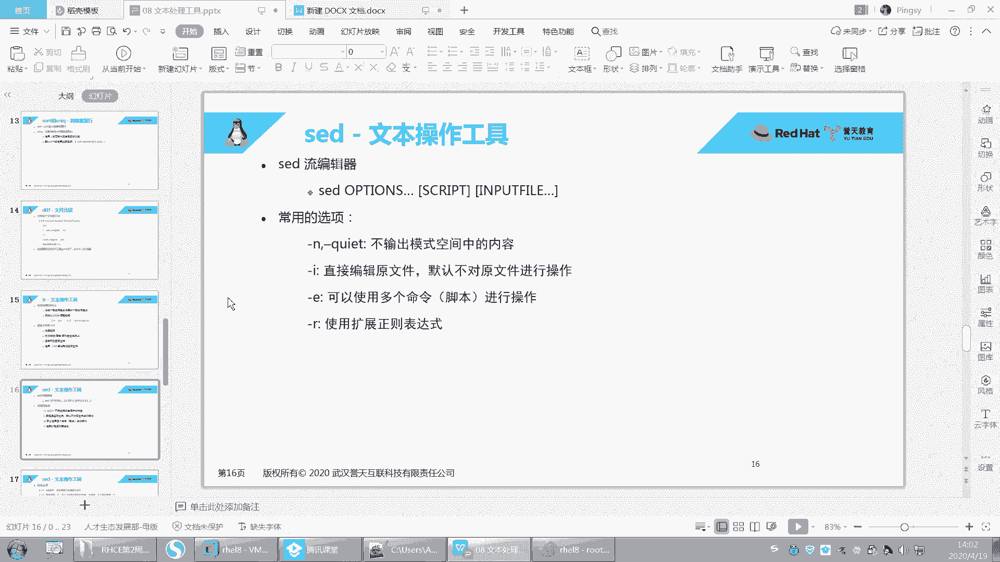
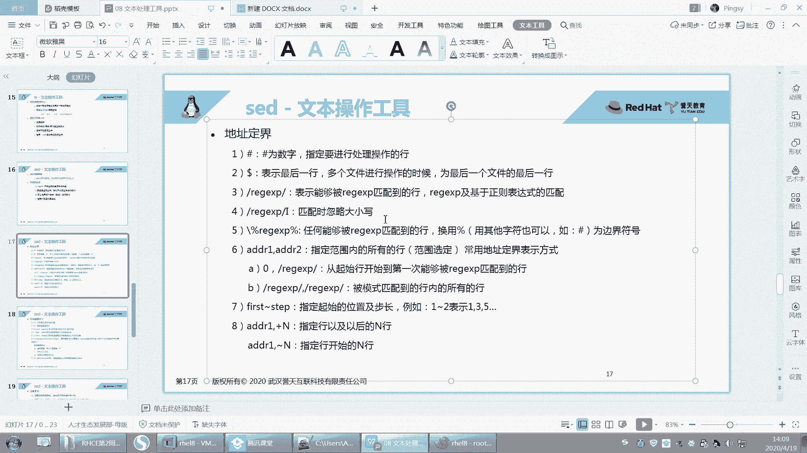
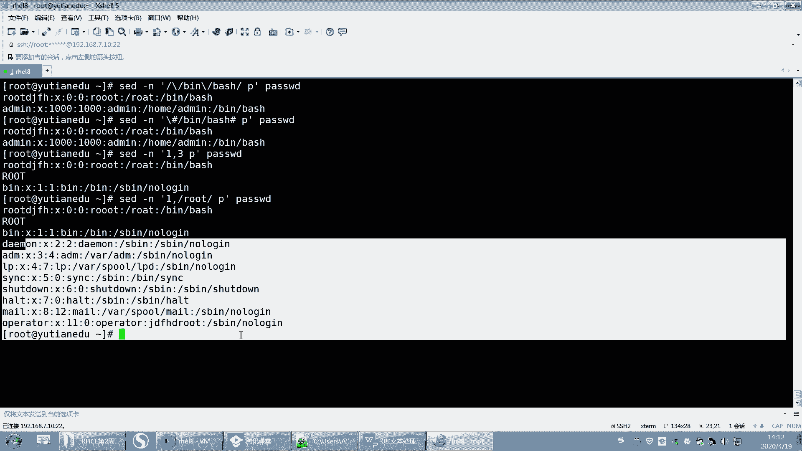

# 【重置详解版】孙老师讲红帽系列视频／RHEL 8.0 入门／红帽认证／RHCE／Linux基础教程 - P32：32 文本处理工具之sed高级使用方法 - 誉天孙老师 - BV1aB4y1w7Wi

好，王家良第一个。好，嗯，那时间到了，我们就开始了。还有一些同学还没上来啊，我我不等人的啊，你到时间点我们就开始啊。你们自己看着办。错过了，没听没没没没听上，不要让我再说讲一遍了啊，我讲过了。

这个自己时间把握好，好吧。嗯，O那我们继续啊，上午我们大概把这些命令呃给大家。讲了一下是吧？这张主要是文本处理工具啊。重点是吧，我们每一节课基本上都是重点啊，当然这张也比较重要。

它对于我们去处理文本内容啊，写脚本呢。都是有非常大的帮助的。好，呃，我们讲到SED了是吧？然后前面都讲完了啊，SED我们从SED开始啊。好，再说一遍啊，再说一下这个SED啊。

SCD呢它是一种这个流编辑器，呃，它其实呃功能非常强大啊，它的原理呢大概是这样子跟大家说一下啊，早上其实说过了是吧？它的原理呢就是他它每次就是读一个文件的时候，它会将这个文件读到缓存里面。

然后你所做的更改都在缓存里面。

因为这个命令它是可以修改文本内容的。之前我们学的命令都仅仅是在输出里面输出的时候，输出终端的内容是吧？然后做了一些呃修改。那这个文件它是可以修改原文件的对吧？那它也不修改原文件的话。

就是对内存里面数据进行修改，然后将内存里面的数据打印出来啊，大概是这样子啊。

啊，那如果你对这个原文件修改要加个杠I啊，就直接提修改了原文件啊。

啊，它可以查到替换对吧？然后不改变原文件哦，原文件，但是你可以加杠I去修改原文件。

好，后面是这个SED的一些这个选项啊，选项。好，我们来看一下啊，那我举个简单的例子，比如说我想去打印第五行，那我就打印第五行嗯5P。啊，第五批。这样子。哎，就打印了，对吧？但是你看我们打印的出来内容。

哎，怎么这么多呀，对不对？我们说过了，你打印的时候，它会将怎么样，它会将我们的这个呃。

文本原文本内容也会输出呃，这样缓存里面也会输出，所以输出了两次啊，你要加一个杠N。哎，这样的话只是将缓存里面的第五行打印出来了。所以加P的时候，一般情况下也要加个杠N啊，这样才能看到我们打印的效果。好。

呃，杠恩呢就静默的意思，不输出模式空间里面内容，对吧？

啊，杠I呢是呃直接编辑文件，默认是不对原文件进行操作的。就比如说你想去删除第五行。

删除第五行对吧？那。如果你不加这个杠I的话，它就不会删，它只是在输出的时候删了。那修改原文件就就就就什么杠I就修改了啊，后面我们会讲到啊。

哎杠一，如果你有多个条件，它们中间呢用杠一连接起来。比如说我又想去打印，又想去删除，又想去做这个，又想去做那个对吧？那么他们之间就可以用杠一来连接，它可以连接多个多个命令啊，多个命令。好。

然后呢还有杠R杠R它是扩展正则表达式啊，记得上午学的呃gra吗？gra上午学的Egra对吧？gra杠E那这个都是支持扩展政则的啊，SED同样也是支持的那SED呃前面的内容那个政则表示支不支持呢？

也是支持的OK吧。好，所以我们之前学正在表示在gra这里都可以适用啊，都可以适用。好。嗯。这里有有一些例子是吧？嗯，好，我先看一下啊。好，这样吧，我们来看一下啊，对这个文本进行操作。

但是这个呢这一页指的是这个对地址进行对地址选选择地址的啊。好，我们用这个打印来举例啊，用打印这个来举例啊。

啊，你看啊第一个呢。嗯嗯。

第一个这个地方是一个井号，井号代表是数字指定要处理的行。所以这个地方这个数字这个五就是井号的位置啊，就是井号这个地方啊，当然这个地方你也可以空一个，这这都都可以啊，就空空格也可以，不空格也可以，O吧。

好，这个是地址地址范围内啊。如果不指定制地址的话，那么就打印整篇文章，打印整篇文章啊。

好，然后你看啊你要打印do了符号，do了符号指的是这个呃表示最后一行那。SED还可以是吗？后面可以接多个文件。

呃，如果是多个文件的话，那么它为一什么？为最后一个文件的最后一行啊，所以我们可以用多了，你看多了符号。你看多了符号指的是最后一行，看到没有？多了P指的是最后一行啊。

我们这个文件的最后一行应该就是这个又就是admin，看到没有？就是admin啊。

好。呃，然后还有什么？还有这个地方，你可以接正则表示。接正则表达式啊，那能够表示能够被这是叫正则表达式REGregularex。啊，匹配到的行对吧？基于政则表示的匹配啊。

好，我们举个例子啊，SEB杠N然后你把它引号引起来，你这样啊，你这样养成习惯。啊，你看这边就是打印对吧？然后这边是这个这个这个嗯呃打要要要要查看的文件。然后那我们如果是正格表示，中间有两个斜杠。

中间就用正格表示。那右边这个就是PP就是打印，对吧？好，比如说打印root带root的行，那你看。嗯。带有root的好像是不是打印出来了，对吧？这个太多了，我修改一下啊。我的声。好。这样子看到啊。呃。

SED杠N是吧，然后呢打印出了这个root。嗯，然后P是吧，root这段匹配正在表示式就这一行当中有root的就给你打印出来。那这里有个root，这里有个root对吧？打印出来了啊。好。

就是你还可以这样嘛，你看我们之前学的正在表式不有间号嘛，以root开头的行，那么是不是就是已root开头行，你还可以呃与什么什么结尾嘛，这都可以用，O吧，都可以用啊，还可以用什么，还可以用中括号。

中括号是之前学过了吧？啊，中国好比如说ABC。嗯。唉，之前是这样子是吧，以ABC开头的那。这是不是跟gra是一样的呀，对不对？跟gra是一样的啊，所以在这个地方它也是适用的，O吧，这是匹配特定的行啊。

匹配特定的行。😊。

好，然后你还可以在前面呃那。匹配到的打印出来啊，这个呢就是这个表达式政则表达式我就不多说了。好吧，就之前学过的，还有之前还学过什么，还学过什么基本政则这种是吧？

嗯，还有学过这种。呃，这种都都学过都是学过的啊。好。嗯，这个后面要加个杠I杠I那是指PP的时候，忽略带有写。呃，如果我写一个大写的。比如说我在这儿写一个。嗯。我写一个大写的root是吧？

然后SED这样去打印的话。他会不会把大大写的打印出来呢？没有是吧？然后我们就可以加一个I。哎，这样的话就大写就出来了，看到没有？那就大写看了吗？

匹配大小写就是忽略大小写的意思啊。

好，嗯，还有一种情况就是呃比如说啊我想去匹配什么呢？我想去匹配这个呃bush share，就是这一行里面是不带bush share的。呃，它的登录信为冰bsh，就是带这个的可以吧？呃。

它的这一行当中是带有这个bebsh这个关键词的，就这一行。哦，但是这个文件当中呢，比如说我是这样去打印它的话，那你斜杠斜杠这样子是吧，是不是写的bin呃，bush？是这样吧。然后。你再把它引起来。

那你这样写的话。P。然后password，你这样写是不是会有问题啊，对不对？哦，是因为这个斜杠，你看这有个斜杠，这有斜杠，这个斜杠本来是指你看这外面这个跟这个是不是要中间要匹配一个关键词，对吧？

匹配一个正态表示，但是这个里面是不是也带斜杠啊？那我们用什么呀？我们可以用这个呢反斜杠。反斜杠反斜杠指的是什么意思？反斜杠指的是去除这个后面这个字符的特殊含义。后面这个斜杠字符是什么特殊含义呢？

是不是指匹配正的表示式外面跟它是一样的对吧？所以我要想让这个斜杠原样输出的话，那么我就在它的前面加上一个反斜杠O吧？反斜杠指的是去除这个斜杠的特殊含义，让它以斜杠原样去匹配呃，就匹配斜杠啊。回去了。

那这样是不是就可以匹配到了啊，匹配到bebush跟bebsh，对吧？好，但是这样写是不是感觉哇，这看着很乱，对吧？所以它还有一种方式，它还可以这样写啊。也就是说在这个地方我可以怎么样啊，我可以随便写那。

这也是这个地方这个这个这个这两个摆分号你可以随便写嘛，你也可以写at艾呃，井号井号你都可以写。啊，然后再写上beanbsh。这个也可以达到效果，这个就是避免为了什么避免你的关键词当中是有这个斜杠的。

看到没有？有斜杠ok吧，这个就可以用井号来代替，但是前面要加一个这个啊，前面加一个这个反斜杠，O吧，加个反斜杠啊，就这个。

那这个反斜杠，然后中间加正在表示。好，用这种符号去代替啊。好。呃，括号应该不行啊，它括号不是这个意思。然后另外这个这个这个版分号可以用别的来代替是吧？

好，这个是第五个啊第五个，然后再来还有第六个，第六个就是介着呃界定这个地址的范围。地址范围的话就是第一行到第三行，那就是第一行到第三行这样子啊。第一行到第三行。好，然后还有比如说嗯你还可以这样。

第一行到。嗯，到匹配有root的行。

嗯，这样也可以。

那这样也可以啊，匹配到有root的行，这也可以，好吧。或者是这个你可以嗯。呃，user是吧，到root。呃，这样也可以，好吧，就是这个关键词出现的行到这个关键词出现的行。

啊，就这样都可以啊都可以。或者是呢就下面这个一个匹配的行到另外一个关键词匹配的行啊，中间的行都打印出来。呃，好，这个是这个地址范围啊。啊，还有一种这个叫一啊，这个波浪号啊。

呃，波浪号的话就是这样的，如果是一。呃，逗号啊，不一波浪号2。一波浪号2这个一波浪号二指的是什么呢？指的是呃，从第一行开始呃，隔一行打印一次。就是步长是2这样子，步长是2啊，隔一行打印词，这样步长是2。

OK吧。那那就打印的就是第一行、第三行、第五行点点点第七行这样子啊。呃，还有这个还有这个地址到这个地址的范围是吧？加恩就是指定行以及。呃，以后的N行。呃，这个是指定行开始的DN行。

这个就简单说一下吧，好吧。嗯，这逗号对吧？加5指的是。第一行。呃，然后再数往下数12345，从这一行算起，从这一行算起。那如果是一。呃。🤢，去减吧。啊，拨浪号是吧？拨了号5。

12345。呃，从指定行开始的N行是吧？

这两个没啥区别。哦，这里是12345是吧，数错了啊。😊，这里是六行，那就是说这第一行下面数五行，那这个是第一行，下面这一行算了是吧，这五行包括这这第一行啊。

好。呃，这就是选地址范围啊，地址范围。呃，在哪个范围内做什么操作，好吧，这就是。基本上包括了所有的这个地址范围啊。好，那么我选上地址范围之后，我能做什么呢？我可以打印，对吧？我刚是不是打印啊。

一直在打印，对吧？那我还可以怎么样啊，我还可以删除删除啊。

好，SED那删除的话就不要杠N了，不用杠N了，OK吧。删除的话就不用杠恩了啊。好，然后这样啊引号引起来中间是不是你要做做什么事情，对吧？password。好，那么删除第几行呢？删除第二行。空格D。

这样就删除了OK吧，第二行删掉了，那一行有大体字母，那一行我就得删掉了，对吧？

那剩下内容是不是输出OK吧，剩下内容是输出的啊，看到没有？剩下内容是输出的。

好，或者你删除比如说。一到第五行。那。1到5前面就没有了。我记得前面是什么root呀，addmin啊什么之类的，是吧？那1到5就没有了啊，删除啊，删除的时候不要加杠嗯，听到没有？

因为它默认只是输出这个这个这个这个这个呃模式空间，就是那个缓存里面的啊，缓存里面的。啊，这个是删除啊删除，那原文件有没有变呢？注意原文件是没有改变的，你怎么原文件才能变呢？杠I原文件就变了，OK吧。

杠I原文件就变了啊，杠I回去了。好，前五行没有了，看到没有？呃，root那一行没有了，O吧。好。

嗯，再来啊。嗯，这个DD会了吧，删除哪一行的哪一行啊。

不能撤不了啊啊，有同学说老师，那你这个删了怎么办啊？能撤销吗？撤不了怎么办？因为你怕删掉之后就没了，是吧？好，那就这样，NPC passwordsword到这儿覆盖一下啊。好，那么你怕他删错，你删错了。

对吧？那你最好是不是保留一个副本呢？保留一个副本，对吧？稍等一下啊。好，保留副本，我怎么保留呢？保留呢？我就SED。SED哦。杠I点BAK看到没有？然后。嗯，一逗号5D。然后password啊。

那么杠I我们说是修改原文件，对吧？那么点BAK是什么意思呢？指的是啊当你去修改原文件的时候，这个是不是真的要修改了？因为杠I嘛，那么。呃，修改完之后，password就第一到第五行删了。

而且它会帮你保保存一个副本。这个副本的名字叫password点BAKOK吧。好，那我们试一下啊。这个下面就会生成一个password点BAK看到没有？然后打开这个pasword点BAK看。是不是原文件？

没有变的那个文件啊，就是原文件，它就给你保留一个副本。就是如果你怕真的做错了，对吧？你还有一个备份的一个文件。如果你真的修改原文件了，原文件是没有办法撤销的，OK吧，撤不了啊。

好，这是D啊D。呃，下面第三个AA后面加一个斜杠test，指的是A是指追加追加呃表示在匹配的行。呃，匹配到了行之后，这家内容是吧？好，那我们来看一下啊。

呃，我想在第二行。我想在第二行追加一个这个。嗯，直加1个ABC好吧好。那就第二行2。然后A是吧，然后反斜杠ABC。回去了。有没有有吧，看到没有？第二行的。下面追加1个ABC就追加进去了。然后你写个杠I。

它就写进去了，它就写进去了啊。啊，我就不写了，好吧，我只是让它输出一下，看一下。啊，这个是怎么呀？这个是这个追加啊，追加看到没有？先写地址，注意你先写地址，然后。怎么样？写完地址之后写个A啊。

这样这个你写空格也这个空格，就你加不加空格其实也还好。因为地址范围嘛，你要么你就是用数字，要么就是两个斜杠，对吧？啊，所以这个你空也可以，不空也可以啊。好，那你还可以写个杠II呢就是插入。

那就是在第二行，也就是第二行的前面，那就它就会变成ABC就会变成第二行，对吧？回去了。啊，那它就变成第二行了，I就是插入插入啊。

怎么了？一直给我送花。哦，就是一一前一后啊，行前行后。啊，还有第呃第五个第五个就是。呃，C是吧，C是指替换改变改变了啊，就是说嗯我想。

我真的想把第二行换掉，把第二行换掉。第二行本来是什么呢？你看一下啊，第二行是不是就叫呃这个叫下下down的，是吧？下当的是吧？好，把第二行换掉啊，那就是C。回去了。好，那第二行下档那一行就没有了。

就替换掉了，OK吧，就替换掉了啊，把第二行给替换掉了。

啊，这是C啊这是C。好，再来啊。呃，第六个第6个啊SS呢是指替换查找替换吧，记得吗？我们之前学VM的时候S查找替换的啊，然后这个是我们要。呃，替换的内容。这个是什么替换成什么内容？

其实你这个地方就写上什么old new就行了。对吧说白了就是old new嘛。但是我觉得他这个写的更规范一些，为什么呢？因为他这是一个正策表示。正字表达式嘛，就是你可以写具体的某一个单词，某一个字符串。

也可以写一个正字表达式，能理解吗？嗯，写个正字表把这个正字表达式就给替换掉啊，然后这个是替换成什么？然后后面可以加一些加一个，比如说可以加个什么啊，比如说全局替换回回顾一下VIM里面是吧？

然后如果全局替换的话，这一行全部替换，是不是加个G啊，唉SED也是这样，默认只替换这一行的第一个。啊，OI呢I也是这样，I是指不区分它要写就是。你只要想起VM怎么用用怎么用的SED这个地方就怎么用。嗯。

然后P呢就是指如果成功替换则打印。呃，如果成功的话就字打印出来啊，打印出来。好，我们来试一下啊。

嗯。SEB。嗯，然后password是吧，然后中间是这个我要做的操作。好，我要S呃查找替换是吧？查找root。呃，替换成。呃，AAA好吧，好，然后呃这个这个后面也要写个斜杠啊。

就是这个地方你后面不加东西，你也要写斜杠，这个地方也要写啊，也要写。

啊，回去了。呃，这个地方本来就没有root了，是吧？看一下啊。哦，原文件被我给替换了，所以这个地方是没有root的。好，再来啊。哦，这样这样的话，你看root就替换成了AAAA，对吧？

那root就替换成了AAAA啊。好，那么这个地方这个root是没有替换呀，对不对？所以我们这边加一个什么加一个Ggbal嘛，这一行的所有都替换。那这一行的所有都替换啊，A好吧。

然后呃I的话我就不举例了吧，I就是忽略大家写嘛，大写也替换，小写也替换都替换。好吧，这个是忽略大小写啊。🤧嗯。啊，什么意思啊？嗯。对对，就或略大家写啊。好，你这个地方是不是可以是一个正则表达式，对不对？

是一个正则表达式啊，然后替换成某个具体的这个这个这个组符串啊。好，所以我就用root来表示的啊。

啊，GIP是吧？好，这个记住哦，后面我会很多例子，然后呃很经典的例子啊，然后让大家去学会这个查找替换的呃用法。嗯，好，先先先放这儿啊，先放这儿，后面我再说，好吧。

嗯，我看这个P是干什么的啊？P。哦，P1好像打印了两次是吧？P打印两次哦，这样啊。好，你这样你加个杠N。哦，你看。

看这儿啊，我刚刚如果批的话，他是不是又把原模式空间那边又打印了一遍？

所以。我就加杠根，然后只输出什么，只输出替换的那一行。你看这样是不是更清晰清晰一些，只显示替换的那一行嘛，对不对？嗯，它跟它合并，就是你只要要打印了，注意啊，你只要打印了，那么你请前面加个杠N。

否则你就会打印两遍啊，对，匹配对匹配替换的那种打印啊。就加P一定要加什么，一定要杠加杠N啊，否则你看全部都有，这有一遍。只有两边对吧？有两遍啊。好。

嗯。还有啊还有第七个第7个啊。第七个是W，后面加上一个文件名，它可以将匹配到内容指定到某个文件里面。

好，比如说我想把这个嗯。我想一下啊。这样吧，我把这两行。呃。好，这样啊。我先搞简单一点啊，一逗号2，像第第一行跟第二行呃，W就保存第一行1到2第一行跟第二行，然后W是保存保存到root下面的呃这个。呃。

word下面的test呃。test01好吧，保存下这个文件啊。就是W就是另存文嘛，对回车。啊，然后你打开。这应该有一个test。异议。😔，怎么哦，这sorry，这东西我加了一个空格啊。那保存过来了吧。

我为什么这地方有个斜杠呢？那为什么这个地方是因为我这个后面加了个空格啊，他把这个空格也打印进来了。那他把这个空格也算成这个文件的文件名了，所以这样把它去掉2这样啊这样回程。😊，好。然后你你你可以怎么样。

你可以加个杠N嘛。我看杠N是不是可以不用输出，看到没有？要不然它全部就输出一次，OK吧，全部输出一次啊。好，那么这个文件test02里面就是第一行跟第二行OK吧。好，这个是把什么什么另存为哪里哪里啊？

好。嗯。

OK了吧，这张过了啊。😊。