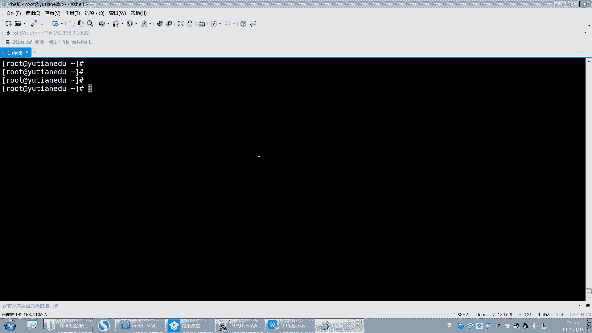

# 【重置详解版】孙老师讲红帽系列视频／RHEL 8.0 入门／红帽认证／RHCE／Linux基础教程 - P35：35 bash shell通配符原理和使用 - 誉天孙老师 - BV1aB4y1w7Wi

通配符啊通配符好，又来了啊。这些我其实之前是不是在那个正则表式里面都讲过了，是不是啊？那那这些又来是什么意思呢？好，刚刚我们在正则表示里面学过了很多符号，比如星号啊。

中括号啊，那你把刚刚都忘记好不好？把刚刚都忘记啊，就是因为刚刚那些是匹配文本内容的，能理解吧？就匹配文本内容的时候，我们一般用正则表示。对，一般用正子的表达式啊。啊，然后这正子表示主要用在gra呀啊。

不不呃gra呀SED呀等等这些文本处理器文本处理工具里面啊。那么下面这个通配符是什么鬼呢？通配符一般匹配的是文件啊，文件名。

它一般是匹配这个文件名的啊，就是在我们的shaar当中，我们去匹配这个文件的文件名。我们一般用这个同配符来表示，比如说LS啊。

对不对？后面呃比如说啊举个例子啊，呃我们之前。呃，RM。杠RFtamp下面的星，对吧？这个是不是就是一个通配符啊，对不对？那么这个是不是指的匹配文件呀？time下面所有文件啊，那这就是通配符啊。

还用来匹主要是用来匹配文件的。所以你要区分开来，一定要区分开来啊，通配符和正策表式区分开来啊，因为我我之前好像是确实没有讲过正策表示。但这次给大家讲了。呃，讲的话大家就会弄混就会混掉啊。😊，哦，OK吧。

不要弄混了啊。那你说不能说这是正的表式吧，那RM怎么支持正的表式呢？对，没办法支持啊，它只支持什么，它只匹配文件，所以它用的通配符啊，通配符。

好，在这个通配符里面，我们会学几个通配符，大家可以记一下啊。好。呃，第一个通配符叫星号，这就是最常用的一个是星号，它匹配是0到多个字符，其实它指的是匹配0到多个字符的意思啊。

好，呃，什么叫匹配领到多个字符呢？我们现在不先不用删除了啊。嗯，我们这样吧，我们我们可以这样啊，比如说。嗯，我先清空一下吧。嗯。然后复制一些文件。寄一些文件过来好不好？这些文件过来，然后创建一些。嗯。

诶。B。对。然后A对对。嗯，B的。好，先这样先这些吧，好吧，随便创建了一些文件啊。好，嗯，现在呢我想去匹配这些文件文就这些文件的文件名，对不对？那我们可以用星号嘛，比如说ASLL啊。

呃我可以用星号是不匹配这个里面所有的文件啊，那它是怎么匹配的呢？它是这样的啊。它是一个一个去匹配。比如说。他就看A。A是几个字符啊？A是一个字符，那星号是不是0到多个字符呀，匹配吗？A匹配好。

B是呢B是别匹配，那这个是不是也满足要求啊，因为这是4个字符，那星号是0到4个字符，满不满足要求啊，满足。所以这所有文件是不是都满足要求啊？所以这就是星号的作用，那0到多个字符。

所以他会把所有文件怎么样全部打印出来。对，全部匹配上啊，全部匹配上。好，那么这个时候我们再来啊，如果我想去匹配A开呃B啊，比如说这个P开头的是吧？啊，P开头的那我就P星号。OK吧，回车。

那这样的话是把P开头都匹配到了呀。那么这个地方比如说我再创建一个P。😡，比如说P啊好，再来看啊，那LLP星号。那么这个P是不是有可能会匹配上啊，因为你看啊我回车这个P是不是也匹配上了，为什么呢？

因为这个P第一个你看这个P跟这个P是不是匹配，那么星号指的是什么？零到多个字符，那P的后面是不是零个字符啊，那零个字符是不是也也满足要求啊？O吧？所以那这就是星号啊，星号指的是匹配零到多个字符啊。

注意正则表示当中不是这样的，正则表示当中它指的是匹配它前一个字母，比如说点心，这个是匹配，是吧？这是任个任意一个字符，然后星号指的是它前面这个字符出现零到多次，所以它跟正则表示里面是不一样的啊。

所以要区分开了啊。😊，好呃，这个是星号OK吧，星号啊，然后再来第二个。

第二个啊，问号问号呢匹配是。呃，一个字符单个字符。但是这个字符呢，我不管你这个字符是什么，反正就一个字符。这个是不是相当于正格表示的里面点。

正策表示里面的点对不对？好，那么就LL比如说问号回车，那么我输入一个问号，那这个问号是不是指一个字符啊，是不是指一个字符？那么这一个字符是不是有一个字符的是哪个满足要求啊。

是不是这个A啊ABCP这这只就一个的满足要求，对吧？好，那如果说我输入一个什么？比如说呃C开头。😊，呃，那么问号，那么这个问号后面这个问号是不是就一个字母？那也就是说这样我匹配下来的话。

CC问号是不是有两个字符啊，两个字符对不对？然后第一个字符是C，第二个字符是不是任意呀？那第二字符是不是任意啊？对吧所以这样我匹配下来的话，是不是没有任何呀？没有一个是C开头的，并且后面带有一个呃问号。

对吧？或者你可以这样。LALA问号有没有啊，没有没有，对吧？没有以A开头，并且后面带一个字母，也就是说起码它是。它限制条件就是两个字符。对，两个字符啊。好，这个就是问号啊，这个就是问号。那LL问号星。

那这个是不是指前面第一个开头是一个字符，这个字符无论是什么，对吧？无论是什么吧，随便你是什么。那后面是0到多个字符，也就是说其实你至少要匹配一个字符吧，那就这就这个意思。😡，好。所以所以我告诉你。

如果前面没听懂，你就把它放，你就先放着，先放着，先不管它，先不管它，你就听我现在讲什么，你就听什么就可以了啊。好嗯。

通配符OK吧，通呃这个通配服务啊。好，那剩下的这三个跟我刚刚讲正则表示里面的。是一样的，用法一模一样。对，刚刚你听懂了，那这你也能听懂，刚刚没听懂，你再听一遍，好吧，再听一遍啊。

好，我们刚刚说这个问号啊，是不是匹配一个字符啊，但是这个字符是不是不界定是什么，不管它是什么，我都匹配，就一个字符。但是我想匹配什么，这个地方它有可能是ABC看到了吗？

就是第一个字母是A或者是B或者是COK吧？A或者是B或者是C啊，后面是一个星号，那么这个星号呢指的是0到多个字符，对吧？所以第一个字母是A是B是C后面不管了。回去。那满足要求的是不是这些？啊，看懂了吗？

你一定要记住中括号括起来的一定是一个什么一个字母，不是三个啊，不是三个ok吧，不是三个再说一遍啊，重要事情说三遍。因为有很多同学他在匹配的时候，他把当这三个字母匹配了。啊，当ABC对吧？嗯。

对任何一个它只匹配一个啊。好，反过来我可以怎么样。好，那你说。那这样啊。那你们来告诉我。呃。下面这两个怎么匹配？呃，就是呃怎么说废话嘛？嗯。好，这样吧。我们还可以加一个什么间号，对吧？是不是加个间号啊？

😊，啊，加个间号的话就是。第一个字母不是ABC是吧，而是其他的任何一个就匹配，那就匹配到P是吧？嗯，没有是吧。好，那我如果按照这种方式再去匹配下去的话，那我怎么把这两个匹配到呢？你想一下。

如果按照这种方式去匹配的话，那我怎么就把这两个匹配到，是吧？好，你就可以加一个什么加一个。问号对不对？回去。那为什么加个问号呢？因为这个字母不较，它说只有一个，对不对？

那么问号就是说后面你在后面至少有什么，这个地方有个字母字符，这个地方有个字符，那这个地方是不是至少有两个字符，两个及两个以上的字符，是不是就是它呀？对，就这这两个嘛。对吧那这个P不满足不满足要求。

OK吧。啊，没问题吧，再来啊再来啊。No。我发现这个。

红。8这系统还是我电脑的问题啊。下次重新换一个文墨试一下。

老是卡住啊。呃，还有你看啊，如果你time清空的话，有个什么问题啊？你time清空，你RM杠RF新是这样吧，但是是不是会还会有一些隐藏文件，这些隐藏文件是默认是不会被匹配匹配到的。

所以如果我想清空这些隐藏文件，我我怎么办啊？我要去匹配他，对不对？我就要这样去啊点心看到没有？嗯。RM杠RF点心啊。好，这两个文件它不会被清掉，因为这个是呃点和点点。点和点点啊。

因为我它其实为什么不能不清掉，其实按理来说它也能匹配到，它也匹配到了是吧？那这两个也匹配到了，为什么不没清掉呢？是因为我在这个目录下面，所以它没有没有清掉。如果不在这个目录下面有可能就清掉了。

有可能就清掉了啊，所以要注意OK吧，注意啊，点是指当前目录点点是指上一层目录啊。好，这样的话就没了。好，我来复制一些。嗯。这样啊，我我再再再再再来一个啊ABC点T。诶。好，那出题啊出题啊。嗯。

我想去保留ABC点贴T，其他全部删掉，不要了。嗯。把这个文件保留，其他文件全部删掉，不要。好，给大家两分钟时间做一下啊。2分钟。坐一下啊。就这个。把这个文件保留下来，我再说一遍啊。

把这个文件保留下就不要了。😡，其他都不要了啊，OK吧，用到我们刚刚所学的这些。

对，原来我们刚刚是所学的这些啊。

Okay。不对。你这样明显就把它删掉了呀。你试一下嘛，你自己你试一下，你看。我我刚刚是把root下面的文件复制过来，并且创建了1个ABCD电器。你可以你可以你可以试一下。你你这样匹配哦，问号问号。

你就不刚好把它。PP到了吗？

你这个不行，因为你这个不够特殊，你要得看我这个。

嗯，你这个也不行。不能满足要求，你这个是除了A以外的图删调。第一个除了A以外都删掉。那我第二个有可能就删不掉哦。就没有同学想出来吗？季节松，你这个也不行。没有。就是刚刚。你们写这个的同学啊。

就写ABC的这个同学的。叫匹配，只要是匹配ABC这个同。呃，这个这个这样匹配的同学呃，都是刚刚。就是忘记了啊，中狂是匹配几个单几个字母啊。章程是RM，这个也不行。张纯，你这个也你这个。

你这个是第一个字母，除了X以外都删掉。

你就全删掉了。也不行。其实这个很简单，真的。这个很简单。还没有同学做出来吗？

我这个地方通配服不多吧，就这就这几个啊星号问号那虽然学起来感觉很轻松，对吧？但是以实际应用哎，就就不知道怎么去用了。

真想说是RM。你这个是。什么意思啊？除了点ABC以外都删掉。除了点ABC以外，都删掉。哦，不对是吧。除了AB以外都删掉也不行。那第二个删不掉啊，反正你匹配第一个的话。也删掉。那高伟同学。

你看你第一个字母是除了A以外，第二个字母是B，那你不是把它删掉了吗？你是不是要这样执行啊，注意你大家不要去匹配什么啊，不要去匹配这个B啊你。你匹配B，你那不是把它匹配上了吗？而且你这个是匹配什么？

你这个是匹配的是这个两个字母。两个字母。好，算了，不为难大家了啊。还没有同学做出来，之前都有同学。😡，做出来的。之前是有同学做出来的。不行啊，季节送你这个不行。呃，江道龙这个就是有点像对吧？

但是你试一下也不行。好，来看我这里啊。其实这题很简单，你只需要找出这个文件跟别人的不同点就可以了。对吧你去说匹配第一个。有很多同学是把第一个给匹配上了，你看像这个同学呢。😊，呃，你这个。你这个。不行啊。

大哥。不能不能你不能把这个东西都写在这个里面啊，你这是这是这是中括号括起来是一个字符，OK吧。😡，它不是匹配这个字符串的不是匹配这个字符串的，OK吧。还有你看冯亚男同学是这样的啊。

他是呃最后你是TSE啊，你这样是不是就把它给匹配上了呀？如果前面我算你没有这没有错误的话，你就把它给删掉了呀。我是除了他以外的保留它呀。你要把匹配其他的，你的目的是匹配其他的文件，而不是把它给删掉啊。

而不是给他把删掉。好好好，这个没想到啊，大家没做出来哦。好。😊，这样啊你只需要看这个文件跟其他文件有什么不同点。有同学发现了哦，它是以点TT结尾的对吧？它以什么怎么结尾。

但是我们有没有讲过以什么什么结尾呢？好像也没讲过是吧？那你说匹配哦，它有几个字符，你不能匹配它呀，你匹配是这些，你是保留它，对不对？好，这个文这个地方其实很简单，你没匹配第二个跟匹配第三个都一样。

因为因为。😊，只有第一个文件的第二个字母是B。只有第一个文件的第三个字母是C。想起来了吗？会了吧。好。第一个字母的。第一个字母的，你看啊第第二个字母，第一个字母管不管呢？第二第一个字母是不管。

第二个字母是B，那是不是就这样啊？😡，啊，OK吧，是不是这样B嘛，这是把第一个这样匹配上了呀，但是我不要它嘛，我不要把它删掉，把它去掉。所以中括要括起来。然后第二个字母除了什么B以外的都匹配。

而且这个地方你要怎么样啊，你不能加点切T啊，你加点切T，你是想把它匹配上吗？你不是要把它匹配上，对不对？所以应该怎么样？😡，第一个字母无论是什么，但是第二个字母不能是B。呃，第二个字母不能是B。

看到没有？啊，你要根据它特点呢，然后再星号啊，而且第二个字母都是B，后面我管不管它是什么，我不管它是什么，反正你第二个字母不能是B。😡。

OK吧，就针对这一题啊，你要根据具体情况来去做嘛，它可能不能适用于所有的这个文件。但是你要根据具体情况去来匹配。好，那后面就要星啊，你不能不加星啊，不加星息号，这样的话是不是只有两个字母啊。

你想哪哪个是两个字母的呀，没有啊，这些都不止两个字母吧，所以后面加星号回车来。

留了。看到了吗？啊，看到没有？啊，你怎么去回去练啊？你这样我是把root下面所有的文件复制过来了，你可以这样，你可以自己去试O你可以自己去试啊。那我执行了这个，然后创建了1个ABC点TIT。😊，好。

我们下课休息一下，你你你你下课再去练一下。啊，把我刚刚那个那个那个那个那个消化一下，好不好？

就讲了这三个啊，不就讲了这些，就讲这些通配服务。

哎，正好是吧，我这下课还蛮准时的。

这一看就是个麦霸。对不对？好。呃，同学们回来了啊，呃我下课呢突然想到一件事情啊。😊，就是下课的时候，我都一在想一件事情，想什么事情呢？嗯。是不是我对大家太凶了，感觉我突然想到这么一件事情啊。😊。

应该还好吧。嗯。啊，就是呃如果我有有那个对你可能就是凶了一点或者怎么样啊，就是呃你们不要不要介意啊，就是我对你没有什么恶意，就是没有什么恶意啊，就只是可能在学习这方面呢，有时候比较较真。

就有有有时候比较认真了。一认真起来就就就就有点那个了，知道吧？就是。嗯，对，就是就有点有点那个了。所以所以大家就是呃可能我上课怼你了是吧？但是怼你不是不是说那个啊，就是你千万不要因为这个事情。

然后对我心里记恨，对吧？说完了我就下再不想看到这个老师了，他怼我。😊，ふふ。希望大家不要不要这样想啊。这是。嗯。因为我下课突然就就感觉是不是那个。是不是那个对大家太要求太太那个了，太太循环是吧？

因为我本来性子。又有点也比较直，就是有有什么话就说说什么话，有点直，这是。藏不住话是吧？啊，希望大家能够见谅啊，我们就我们谈来谈来学习的啊来学习啊。好。嗯，所以大家就是也不要。

因为我我就怕我哪方面可能言语上啊或者是方式方法呀，对家可能哪个地方做的不是很好。嗯，但是呢。呃，我的出发点是好，出发点是那个也希望大家。嗯，对。うふ。好。嗯，那大家能够达成共识更好啊。

我们能达成共识更好。所以我是帮大家呃把大家当做这样的朋友，或者怎么样一起来学习，我们相互学习啊。然后你们也有可以当做我的老师，对吧？我的或者是我都没有接触过的。对吧那你们接触了，那你们就是我的老师。

那在这课堂上，我是你们的老师，对吧？然后学生要听老师的话，是不是这样？好。OK嗯，那我们继续啊。😊。

刚刚其实我们就把这个通配符这个地方呢呃跟大家呃就是。呃，稍微讲了一下啊，其实也还好，这几个用起来其实还好。但是真正的时候根据需求来去回顾来去用这些知识点的时候，你可能就想不到这个其实也正常。

因为你要多练多遇到，对吧？嗯，然后才能去实现呃，就是啊一下子就能想到，因为这个东西确实就是经验，有时候就是经验用多了，就就就这样啊，当然也要看你们对这个掌握的知识点牢不牢固，就是我知不知道对吧？

像有同学用的是匹配ABC的这种，那一看就是什么，他就不知道这个中括号匹配是一个字母啊。

对吧中高括起来就是一个字母，所以你要先理解它的含义，然后再去用它。

对不对？嗯。好，嗯，这个是通配符啊，就说到这儿了就说到这儿啊，通配符。呃，这一周的内容还是工还是这个量还是比较大的啊，因为很多很多特殊特很多符号出来了。呃，后面我们还在学谢的时候，还会学到一些符号呃。

就比较多啊。啊，除了通配符，除了我们学的这几个通配符以外，我们还有这些通配符。😊，还有这些通配服务啊嗯。

这通背幅呢是比较常用的，我列了几个在这儿，当然还有很多其他的，比如说man一下man一下7globe嗯。glove是吧，就这个啊。

这个下面它会有一些这个。呃，在这儿看到吗？但是他这个地方好像没有解释。

没有解释说这个是什么意思，对吧？不过这个也难不到大家吧，你就直接。实在不行，你百度去，对吧？反正这个工作了嘛，又不像学小学生非要。

呃，非要记下来或怎么样，你就去查就行了，好吧。

啊，然后去用它，那这也是一种通配服务。那它怎么用呢？看这儿啊看怎么用啊。嗯，我想匹配首字母是小写字母的。啊，首字母是小写字母的啊。好，看哦L。首字母是小写字母，那首字母第一个字母是小写字母。

那第一个字母我怎么表示是不是用中括号括起来，是不是第一个字母啊？😡，对不对？那后面是什么管不管啊，不管对不对？那也就是说我现在要去匹配小野怎么要小写字么是不是A到Z啊？😡，是不是A到Z这样去匹配啊？有。

这个大写是BPP。唉，这个大写等一下啊。嗯嗯。LL。啊，其实这个是没哦，这个是这样的啊。它这个上面没有，这些不是匹配到的，这个指的是什么呢？指的是他看目录里面有没有。对，目录里面有没有啊。

这个是没有匹配到了啊，匹配这这几个呢这小写字母OK吧？好，那这是一种对吧？那我们今天又学了一种新的同位符，就是这个啊它可以。😊。

用你看啊是这个消息字母就这个就lower lower。好，呃，这个地方的话，我这样吧，我们把这个中括号去掉啊，不加这个中括号，这个中括号不是加在这个外面的。

不是加在这个外面的啊。等一下啊。问7。Glo。

呃，它就只有单纯的一层中括号啊，只有这一层。好吧，我把这个改一下嘛，PP样改一下啊。没有，只只有一个啊。好，这这一个整体就作为什么？这一个整体就是一个小写字母。那不是啊，不是说这一整体就是小写字母。

就是这个这个地方就代表是小写字母。😡，好哦，我知道为什么当时加这个中括号了啊哦，我知道为什么加中括号了。好，我先还回去啊，因为你看。我有。嗯好，先不看PPT吧，我把它拿过来看这里啊。😡。

看这儿啊。哦，LL我们说匹配一个字母对吧？后面是无论是什么，然后这个是小写字母，那小写字母怎么表示A到Z是不是这样，但是我不像我不像这样去表表示，那我就可以用那它整体就是这样的。就就这样看到没有？

回去了，那那这个地方是不是就小写字母，看到了吗？那这个整体代表是小写字母，其实是不是它相当于是。ABCDE这样所AA到Z啊，是不是相当于A到Z。O吧？能听懂我什么意思什么意思吗？这个地方指的是小写字母。

但是外面又加了一个中括号，指的是不是就是匹配一个字母？😡，这个字母可以是所有小写字母当中的任何一个小写字母。能理解吗？就这个lower啊，或者说匹配代写字母。😡，代写字母的呢就是upper嘛。

upper。对吧那这这是不是就大写字母啊？大写字母刚刚那个LLL杠A到Z好像有点问题是吧？匹配的有点问题。好，这样我加个D。好，你看这样就出来了。因为我们看目录本身的话，看目录本身是不是要加D呀，对吧？

因为刚好这个大写字母都是目录嘛，大写字幕都是目录，所以加个D加个D啊，加个D好，看文件也可以加D嘛。你看文件也可以加D吗？那看文件也可以加，所以就加D加D啊。好。

那这样的话就是大写和首字母大写和首字母小写。

好，还有比如说匹配数字啊，数字呢，数字的话就是什么？数字就是digital，对吧？所以在这个地方我外面又加一个中括号，是因为什么？是因为什么嗯，这样吧。

呃，我我给大家把这个PPT改一下，免大家误会啊。我还是把这个去掉，还是把这个去掉啊，然后我把后面的注释改一下。这样。那然后匹配呃匹配一个字母匹配字母就是所有字母啊，这这是就是什么所有代表所有字母。

然后这个是匹配小写字母，匹配大写字母匹配数字，匹配空格，匹配呃任意字母和数字，然后呃就啊就这样啊，所以那你外面你怎么去用，你是不是看你你加中括号也好，对吧？或者加怎么好，那你就自己去外加就可以了啊。

其实这个整体指的是小呃小写大写好，我要给大家列了一些用法，大家直接去用就可以了。好吧。

嗯，OK好匹配空格呀，那你怎么匹配空格呀，你就这样去匹配空格。

比备空格啊。