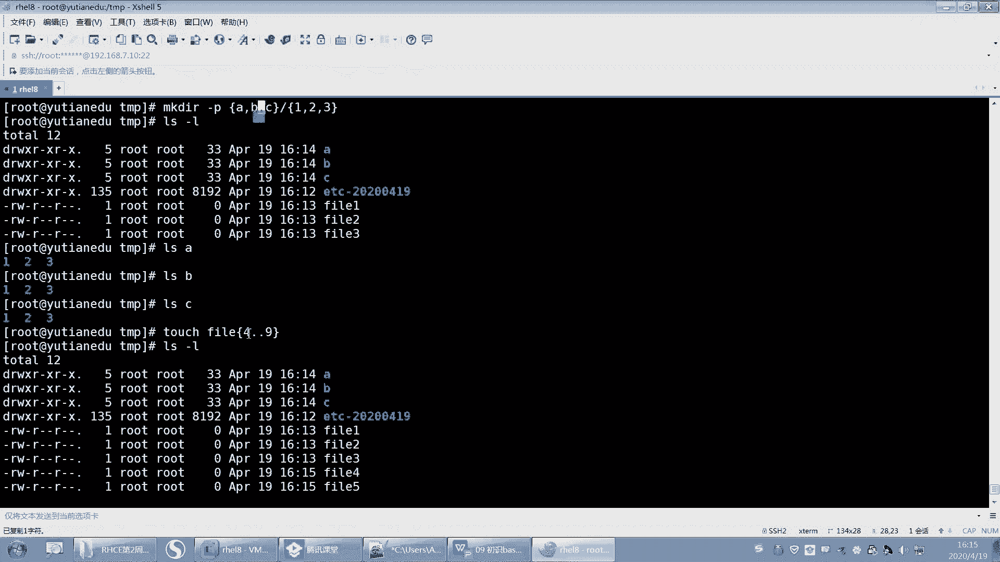

# 【重置详解版】孙老师讲红帽系列视频／RHEL 8.0 入门／红帽认证／RHCE／Linux基础教程 - P36：36 bash shell中命令扩展符号的使用 - 誉天孙老师 - BV1aB4y1w7Wi

波浪号之前也讲过了呃，它也是我们share的功能，所以我都写在了这个PPT里面。然后波浪号是指用户的加目录，波浪号是指用户的加目录啊，默认是指当前用户的加目录啊，如果是指某一个用户的加目录。

那么就波浪号加上用户名，这个是第一天第一周的第一周课程讲的啊，第一周的课讲的。讲那个文件系统啊，第第二天下午是吧？

啊，这个还要不要说呀，你不用说了吧。比如说CD到波浪号admin，就进入到addmin夹是吧？然后呃然后波浪呃VM波浪号点buush。RC那就是打开什么当前加目录下面的一个点8是RC。

然后我还可以打开addmin下面的。呃，点把小C这样子啊，OK吧。

好的命下面点B小C。好，这是波浪号啊。好，下面呢我们来再看一下关于命令的扩展服啊，命令的扩展服。

好呃。我们之前学过一个命令，这个命令呢是我之前提到过，但是我没有单独说就e口 e口helo。看到了吗？那eal什么东西就显示什么东西，对吧？好，我想显示一个嗯，比如说我想显示一个。嗯。

选这个东西选这个eal the呃 the system。呃，name啊这个语法可能不太正确啊，stems name。呃I。嗯。postst name是吧？好。看这儿啊。

我ecle后面这一段内容是不把后面这段内容打印出来了，对不对？好。那么其实我想显示的是这个系统的名字是主机名。

这个主机名呢是叫玉天EDU就是我系统的主机名叫玉天EDU但是在这儿它是不是就显示叫ho name？那我想让它显示什么呢？我想让它显示天EDU那同学说你想让显天EDU，你不就写天天EDU不就行了吗？

但是你写天EDU，你是不是这句话只能用在这个系统里面啊，那你又换一个系统，那你这句话就不能用了，对不对？所以有些时候你不知道你的系你的，而且你的主机名有有可能是不会变。好。

那因为我们系统当中有一个有一个命令叫ho name。对不对？那有一个命令叫hosse name。好，那么这个命令在这个地方，我们系统有没有把这个host name当做是一个命令在执行呢？其实显而易见。

我们是没有把它当做命令来执行的，只是把这个字符串是不是原样给输出了，它是什么就输出的是什么。没有把它当命令。好，但其实我想让他怎么样，就让它作为一个命令来执行。之前我们讲说一行当中是不可以有多个命令的。

对不对？不可以有多个命令的好，eco那他又让它把它当命令执行，我们就得用把它特殊符号把它给怎么样括起来，让它。执行对，让它执行啊。好，怎么让它括起来呢？我想去调用这条命令执行的结果。

调用这条命令执行的结果啊。好了，就这样。只需要在前面加一个多了符号，加小括号就可以了。看到了吗？那eal啊，the system名字is host name啊，你们可以记这个特殊符号啊，叫多了加小括号。

多了加小括号啊。

多了加小括号是指什么意思？中间是command，是命令哦，中间是命令啊，它指的是调用命令执行的结果。记啊，它指的是调用命令执行的结果。好。

也就是说。当我在后面碰到多了加小括号的时候。他就会把这个里面是不是当做是命令，然后把它给执行啊，执行完之后是不是引用了这个命令执行的结果OK吗？是这样吧，好。那如果我写的不是一个命令呢。

我写的是一个随便写一个，比如说hello，这个hello好像不是个命令，对吧？那我写了一个不是命令，它是不是就。😡，识别就就就能判断它不是命令，然后显示hello呢。

或者说就把它当hello命令来使那个执行呢。好，看一下啊。我们执行完之后，它就会报错，因为它只要碰到了在后面这个里面碰到多了加小括号，它就要把这个小括号里面的当做命令把它执行了。但是在这执行的时候。

这个命令是不是？不存在呀不存在是不是叫报命令找不到，看到没有？啊，只要你用多落加小括号括起来，它就会当命令，所以中间一定是命令，中间一定是命令，OK吧？好。所以这就是多了加小括号的作用啊。😡，哦。

所以说这样也可以是吧？啊呃，这样是可以啊这样。就是这个。啊，这个这个符号啊这个符号呃看着很像单引号，对吧？但其实它不是单引号，它指的是你的这个键盘的。呃，哪个键啊，就是你table键上面那个键。

table键上面那个不是波浪号吗，波浪号波浪跟波浪号同一个键的那个那那个那个键呃，是那个啊返单引号是这个。😊，反撇号。对，反撇号啊，不是单引号，注意啊，它不是单引号。

但是这个呢呃我们自己用的话我们很少用，因为它很容易跟这个单引号搞混。有时候你分不清楚，你看不清对吧？还他以为是单引号啊，但是有很多脚本里面它确实用的是这个符号，你也要能看懂，okK吧，你不用。

但是你能看懂啊，你用也行，只要你能看清，好吧，这两个符号是一样的啊。这两个符号是一样的，OK吧。好，所以就多了加小括号啊多了加小括号。好，你比如说我eal data是吧，这样是不是显示时间呀？

但是这个我本来想让它显示时间，结果呢他把这个字符串打印出来了是吧？所以我想让它显示时间，我就加一个什么多了加小括号嘛。😡，对不对？多少加小括，而且我还可以往里面加一些什么，就是说加百分号呃，百分号Y。

这是我之前学过的，是2020对吧？就一口什么什么东西啊。好，那大家觉得这样我可以执行吗？就多了加，然后host the name。这样可以执行吗？那我就直接多了，我不加E扣嘛，你本来E扣是什么？

E扣就会显示预天EDU，对吧？那所以说你干嘛多此一举啊，你直接这样不就行了吗？你加个E扣干嘛呀，对吧？😡，啊，如果是直接这样执行的话，他会报什么错呢？好，你们可以去想一下啊。我们说遇到多了加小括号。

是不是就会加括号里面的内容开始执行。然后这个时候就会执行hosse name。hosse name执行完之后是不是叫预天EDU？好，那么在这个命令行当中，是不是相当于就引用了一天EDU。

那在命令行当中相当于就执行了一天EDU。就会报这样的错。你看你把它拿过来，它报错应该是一样的。看到了吗？啊，所以你只要碰到了什么多少加小括号，就会把小括号里面当做命令的，把执行，然后把执行的结果调用。

啊，把把结果调用啊。

好，懂了吗？多了加小括号。嗯，好，然后这个呢多了加小国跟这个这个他们两个是一样的用法啊是一样的用法。这个经常经常用啊，这个非常重要啊，非常非常重要。呃，他去引用一些命令执行的结果非常非常重要啊。

呃，比如说啊我举个例子。我们想复制。仿复制啊复制ETC。呃，复制ETC到tamp下面呃叫ETC。而且。嗯。好，而且呢我想给大加一个时间，比如说我想加1个20200419加个时间，对吧？

那这样你复制可以可以这样去复制，对吧？嗯。老是卡。嗯，没复制过来吗？嗯，GP杠RTCtime30。好，这样就复制过来了啊。啊，这样复制过来了啊。那么这个时间是不是我自己指定的呀？

假如说我每天都要都想去复制一遍，今天复制一遍，明天复制一遍，而且这个时间要加上是当前的时间，当也就是今天复制的时候，是今天的时间，明天复制的时候，明天的时间，后天复制是后天的时间，对吧？

那这个是不是是相当于是一个它变化的值啊，那你这样是不是写死了，是不是写死了，明天写就写0420，对吧？好，这个时候我就可以叫什么，我就可以去用这个哎用什么？😊，是不是可以用一个时间来表示啊。

这个时间是不是也可以用do了 data啊？那么do了 date的结果，do了 data的结果是不是那串呃没有，就是很难看的什么那个星期几啊，那串是吧？所以我要改变它的输出啊，那就加什么呀。

百分号Y然后百分号M百分号D是不是这样啊？嗯。OK吧。嗯，但是我们之前已经复制过一次了，是吧？我靠，这反应真该。好，再来一遍啊，回车。你看是不是就复制过来了，那明天我是不是还可以就就还是这条命令啊。

明天还是这条命令，后天也是这条命令。所以这个就是遇到多了加小括号就调用这个变量执行的是吧？啊吧，就调用这个命令执行的结果，OK吧，这就是经常会用到的一个多了加小括号啊。😊。

嗯，OK。好，多少加小括号记好了啊。然后下面呢我们来看一下，还有一个叫大括号。大括号。大括号指的是啊这样啊嗯我们想创建一个文件，比如说创建一个文件，那你说我创建A创两个文件，BC这样行不行啊？哇。

这还还真可以。哦，这样是可以的是吧？我记得之前好像好像不行哦，这样是可以的。好，或者是我创建什么，我创建fill一呃，fill2啊，fill3这样是不是是不是很麻烦，对吧？所以它可以合并，就这样啊。

fill因为前面都一样嘛，后面就是一。23这样子回车。看到了吗？就非要123，所以大括号它指的是G啊，大括号指的是依次匹配大括号里面的内容，就依次呢外面的内容依次去匹配大括号，那这样去匹配。

这样去可这样去匹用括号里面的内容。好，再来一个啊。好，你看啊我创建一个目录。创建一个目录啊，然后这个目录呢是A括号ABC然后。123，反正就是目录嘛，管叫什么名字呢？好，这大括号括起来了，对不对？

然后这个是指这个分格符目录与目录之间的分隔符复目录与子目录之间的分隔符。那么这个我们创建下来之后，它就会创建多少个目录出来呀？你看。6个。你这数学没学好啊。嗯。9个是吧。好。

所以啊你啊它是不是这样去匹配啊，这样去匹配，这样去匹配，然后这样这样这样这样这样这样是吧？所以它至少应该有9个吧。啊，至少最终会创建9个啊会创建9个，所以ASA下面有3个SB下面有3个ASC下面有3个。

所以大括号会了没有啊，大括号会了吧。啊，大括号还我觉得还可以这样用。呃，比如说嗯。呃，连续的啊，比如说fill。比如说我是一段连续的那比如说。4。点点9。就是连续的连续的部分点点。O吧点点回车。

就连续的那就是4到9，看到了吗？就连续的一段。呃，数字或怎么样，它就可以中间用点点表示。点点，所以选两个啊，一个是逗号隔开的，还有一个是点点啊点点。

那这两种啊这两种。逗号隔开就依次去匹配1211135，然后这个就是14别12345678910。

或者是你看1到100都可以。你看100个是吧，它就些匹配啊。

好了吧，呃，那那继续啊。好，大括号讲完了呃。大括号是吧，呃，这个多了符号，然后再来啊，下面我们看一下变量啊，看一下变量。

