# 【重置详解版】孙老师讲红帽系列视频／RHEL 8.0 入门／红帽认证／RHCE／Linux基础教程 - P38：38 系统环境变量案例讲解和别名使用 - 誉天孙老师 - BV1aB4y1w7Wi

系统的一些变量啊。啊，刚刚不是说到那个提呃那个提示符吗？说这个提示符对吧？啊，我们来看一下提示符既然是个变量，那提示符是哪个变量呢？这个变量叫PS one。叫PS one啊，这个变量叫PS one。好。

呃，你看这个地方它其实是有一些系统自已经定义好的变量啊，哦反斜杠U就是指的是么？指的就是这个呃。当前用户是谁？哦，反西杠H指的是我的主机名，反西杠W指的是我这个这是一个相对路径，就是我当前的目录。

然后这是多了符号，对吧？为什么这是多了呢？因为。所有的用户都是多了啊，但是唯独只有root是井号，所以你可以写个判断呢啊判断如果是root，那么就等于井。如果是呃普通用户不写了，就不用其他的不用写。

就默认就等于井呃，多了嘛。然后如果是root就是井啊，这就是一个提示符的提示符的一个变量啊，变量。嗯，他还可我可以跟你可以慢一下啊，你说我怎么我怎么知道这个这个这个百分号优是这个就那个用户名是吧？

你可以搜一下啊，我觉得可以搜一下PS one嗯PSone那你看PS one这个值就是什么什么。提示符的值还PSwo是吧，还re。好，这里有啊。嗯，你看这个地方是不是有啊？要反斜杠。反斜杠W就是什么？

是当前的工作目录是吧？你看这是不是有说明啊，反斜杠doll了，他说如果有效的UID是0，那么就是什么？A呃，除此以外都是doll了符号。啊，玩具刚U是指这个吧当前用户的这个什么用户名。好吧。

这里都有都有说明啊，就是那个man巴啊。好，下面我要讲一个非常非常重要的变量。人证厅啊，非常非常重要。

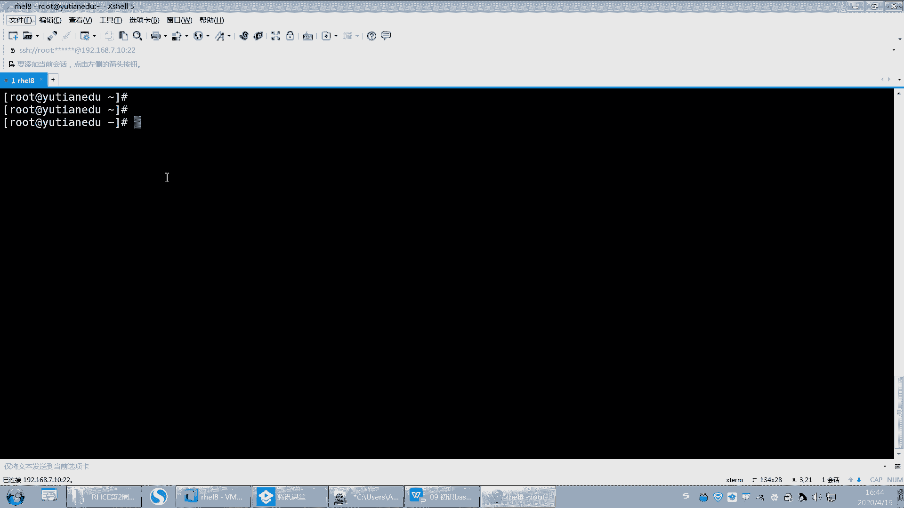

特别重要老重要了。好，这个变量叫什么呢？嗯。这个变量叫pass变量。

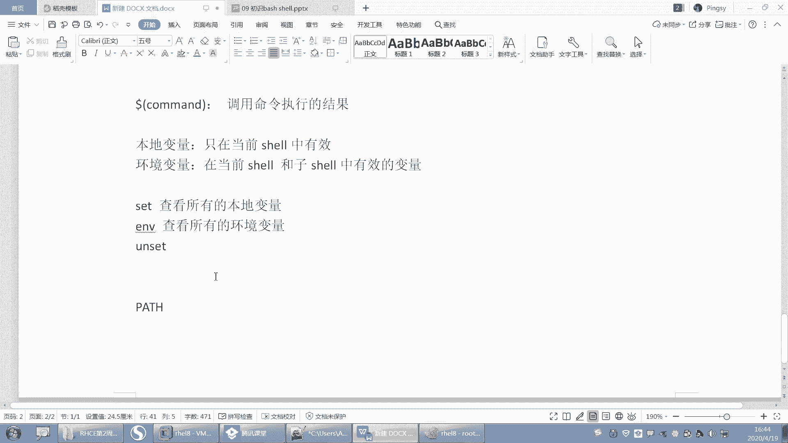

呃，很多同学应该听过是吧？pass别也用过啊。好。呃，看这儿啊。还记不记得L这个which命令啊，还记不记得which它可以查看这个命令是哪个文件。查看这个命令是哪个文件，对吧？

我用which可以查看哦，是USR并下面的L对吧？那我which这唉。怎么没有转到啊？啊。对吧好，你看我再创建一个啊，touch一个fi点CIT。😊，然后再来位置。呃。我就我就为其怎么了。

我就为其非要电TT，你给我找去啊。😡，你能找到吗？找不到呀。但是我的非料检天机在哪里啊？是不是在这里啊？😊，所以并不是系统当中所有的文件我都能给你未去找到啊。那他去哪里找了呢？他去这里找了，看到没有？

去到什么USRlocal SBUSloc binUSSBUSB又是就不是去这儿找的呀，对吧？他说在这里没有找到哟，那他为什么去这里找呢？😡，因为这些目录都是我们放命令的目录，还记得吗？

我们之前讲一些呃呃那个操作系统的一些重要目录的时候，是不是讲过BSBUSSB什么USRlocal什么什么病的，是吧？啊。对不对？所以你知道为什么这个地方是病吗？你知道病是什么意思吗？😡，有没有同学知道？

为什么命令都放在病下面啊，我就不放病下面，我就放别的是吧，是不是也可以。但是因为为什么系统当中所有的病所有的命令都是放在病下面，对吧？😡，啊，这次前意知不知道啊？Yeah。哦，不知道是吧啊。

因为因为因为什么呢？因为。因为LS这个文件它是一个二进制的文件，你打开它。嗯，我其实不想打开它。你看你是看不到这个什么，你是看不到这个内容。😡，这个文件。哦，写错了啊。你看它是一个二进制的文件。

你是看它不是文本文件，能不能理解它不是文本文件，它是一个二进制的文件，恰巧二进制那个单词叫banary。知道吧？啊，120G的文件是不是可以执行啊？我们那个set up点ESE是不是二进制的文件啊？

那个文件就是二进制的文件，所以呃二进制的。文件叫binary，所以叫B，O吧？是不是又学到了嗯，叫Bing啊，以后你考编人说为什么都放在B下面啊？B是什么意思啊？对吧？好。

你发现所有的命它都会放到Bing下面，包括你们装了一些第三方的软件，装上来，它都放到B下面。😡，好，那么。放在并下面对吧？那我怎么知道我怎么就知道去到这里去找呢？😡，对吧我怎么知道说你这里。

他为什么不去到readot下面，为什么不去跟下面找啊，对吧？好，这个就要依赖于什么？pass变量。😡，就是pass频量，你可以eal。多了。pass看一下。pass变量的值是不是就是它呀？

所以你知道为什么？你为取一个命运的时候。他要去到这里找吗？是不是因为就是pass变量的作用，就是pass变量的作用啊。好，那么有了pass变量，我每次去找命令的时候，我都会去到pass变量对应的这些值。

的目录下面去找有没有这个命令，是这样吧？好，那你比如说啊。嗯，我现在whichL是吧，它在USR并下面的L那我可以把这个passpass变量给改一下。比如说我把这个USR bin。给改掉。好。

我把它给去掉，好吧，USRB给去掉。我，估计去这一个试一下先啊。好，LS哎。密就没有了哟。那就报命令找不到了呀。是不是命令真的没有了呀，是不是命令呃，我我我我我把它删了呀，还是怎么样啊，没有吧。

我是不是仅仅只是修改了这个pass变量啊，把pass变量值是不是给。😡，改了，所以他还去那个USRB下面去找吗？不再去USRB下面去找了，对不对？不再去USRB下面去找了。那么。

刚好L在这个下面不再去这找，是不是就找不到啊，找不到就报错，就报命令找不到。所以有些时候你命令找不到，并不是说什么，并不说这个命令真的不存在，不在那儿，是因为你的pass变量的pass变量设置的有问题。

O吧，是你pass变量设置的问题啊，那我可不可以这样执行。😡，这样是不是OK的？😡，这是不是O啊？那我这样去执行的话，有没有依赖于pass变量啊，这个是没有依赖于pass变量的O吧？

对我没有去找这个pass变量，因为我用的是绝对路径来执行的。😡，要的绝对路进去执行的啊。啊，所以一旦用什么就敲一个什么什么什么不是绝对路径，非绝对路径。

那我就会去找pass变量所在的什么pass变量所在的这个这个这个这个这个这个这个呃值下面有没有这个命令，有没有这个文件啊，有没有这个文件。好，那么我去修改这个pass变量。你看啊。

我在这定义的pass变量，这个变量请告诉我是什么变量，什么类型的变量。我们刚刚学了两种，一个是本地变量，一个是环境变量。我刚刚这样一设置这什么变量啊？

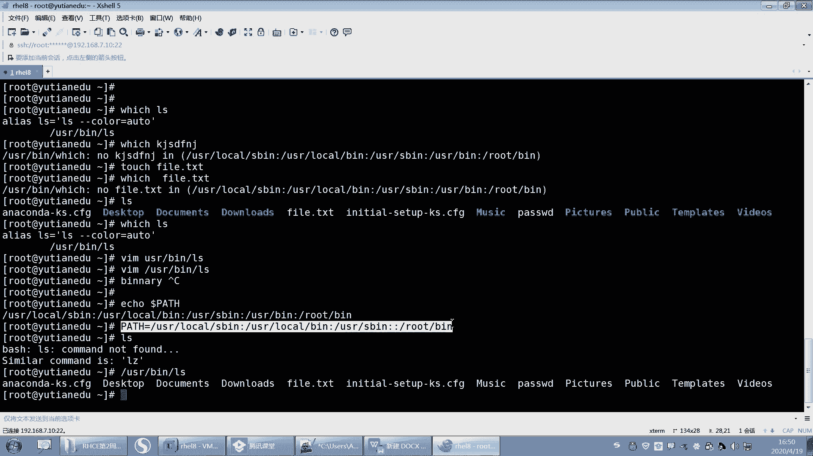

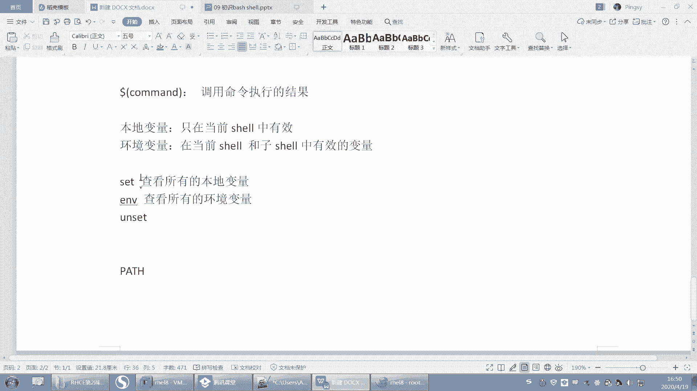

啊，环境面料。我这样去设置的是什么变量啊？😡，我就叫pass等于就是本地变量啊。😡，OK吧，本地变量，所以怎么样？有这切不了是吧？本地变量是不是在只账当前系列中有效，OK吧。

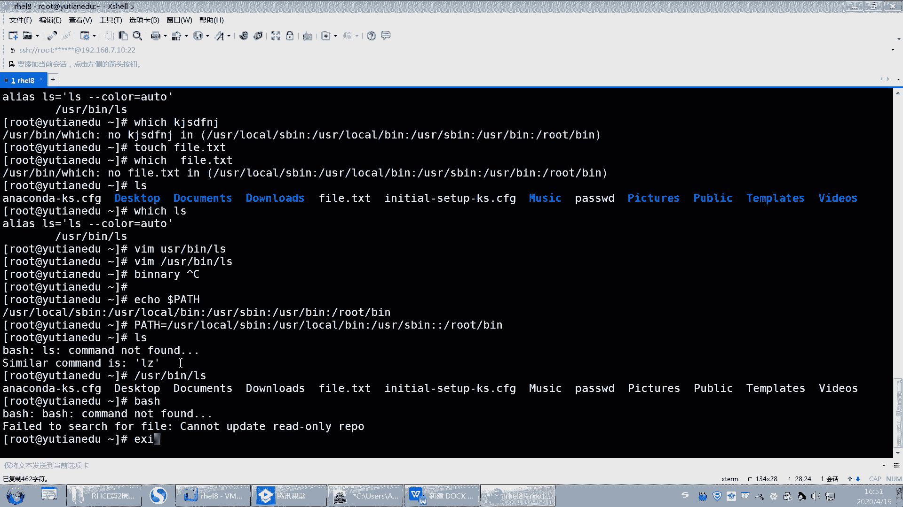

退了这个信关了，你再来，你再登进去它有没有效了？😡。

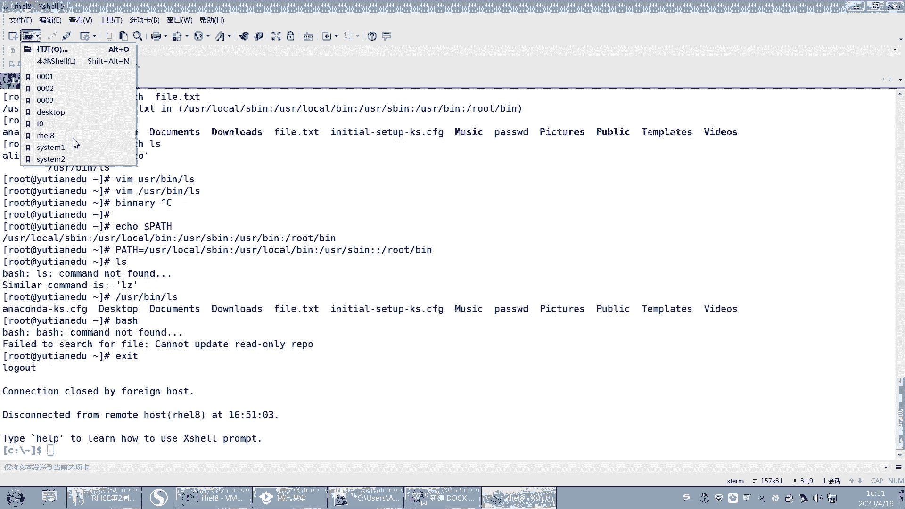

那就没了。就回来了。对不对？你看就回来了嘛，LS也回来了。所以我刚刚那个变量它只是一个本地变量，如果要环境变量是不是export呀，就变成环境变量。但其实本身pass变量它本身在系统当中是一个环境变量。

OK吧？它在系统当中是一个环境变量，我怎么知道呢？ENV嘛，你查一下你就知道了。😊，那看到没有？EV是不啥环境变量啊，而且它是定义在这个文件里面的。就是说。你可以找一下，你看这里是不是export了呀。

看了没有？啊，在文件里面加export了啊，所以你看啊我每次读到这个文件，我就会把这个文件的里面的内容加载到内存当中。那么这个pass就有值了，对，就有值了啊，而且是环境面量，而且我再怎么切buush。

你看是不是都有啊，这个黄金面量。是不是继承了呀？它为什么环境变量啊？因为我切上bupass变量是不是还在值还在啊，是不是继承了呀？那bu了一下是不是继承，因为它是环境变量嘛，看到没有？它是环境变量。

所以这种如果想让它继承，你最好让它变成什么变成环境变量。那你说老师干脆所有都变成环境变量不就行了吗？搞什么本地变量啊，因为你继承的话，你要不要资源呢？😡，你想一下，你所有的哦都继承了。

有些没必要去继承的，你让他继承，你你就占资源不，你肯定是占资源的啊。而且继承你这个进这个这个这个这个继承的越多，呃，这个子细儿越多，他肯定是越耗资源的啊，越耗资源的啊。好，这就是我们的pass别量。

而且你看如果啊看好啊。我想自己去定义。好，我想自己去定义啊。嗯，你看root有个bin是吧，那root下面有个bin呢？😮，热下面是不是没有病啊，那我可以创建个病不。😡。

我可以创建一个并不创一个目录B是吧？那是不是有病了，有病了吧，然后我要去到B下面，我自己创建一个命令。比如说我就创建一个文件叫fill点TSE。唉，就创建个文件叫fill点TST啊。

然后这个文件里面什么都不写，就写e口hel喽。😡，行不行啊，也行啊，我说过文件里面。你要把当他要让他执行的话，你就把命令放在这个文件里面不就行了吗？但是现在你也想让他执行，你是不是这样执行啊，fi。呃。

呃不不呃B。呃，fi点TSE是这样啊，但是这样执行。会怎么样是不会报错呀？为什么权限拒绝？因为你这样执行文件，它是没有执行权限的。对不对？没有执行权限怎么样，加上执行权限呗。对。好，有了啊有了执行权限。

有了执行权限，然后再执行OK执行了。对吧执行了呀。那我可不可以这样执行啊，大家觉得我可不可以这样执行？😡，我现要回车可不可以？这样可不可以啊？我感觉像像在像在说废话一样是吧？😊，好，来啊。Fil。

点CIT，请问可不可以执行成功啊？这为回车可不可以啊？没人回答我。不可以不可以。不能都说不能啊。需要pass定义是吧？好，不可以。你们就。没有同学认真观察吗？😡，没有同学认真观察吗？啊。

我把文件丢在这里了唉。😡，你看啊。我是不是在root下面进了一个病啊？然后把这个B下面是不是有fi点切切啊？而且我刚刚都推爆出来了，你看见没有？😡，那。我这个table出来了耶。回车。

我没有我就我这题绝对没有挖坑，是你我这题绝对没有挖坑啊。😊，我刚刚说了嘛，我说哦这不是有个root bin嘛，然后我说创建一个B，然后把这个文件呃这个写一个fi点fi点test是吧？😊，Mhh。嗯。

好好。啊，所以啊没关系啊，这个多跳几次坑。😊，这个印象深刻嘛，是吧？好，这那如果我把这个值给去掉了，那是不是就找不到了呀，那就怎么样就执行不了了嘛，对吧？是不是？😡，嗯。嗯。啊。

没有你们说不能的同学肯定是听进去了，绝对听进去了的啊啊，只是说没有注意我刚刚的操作，对不对？啊，我给你们找台阶了啊。😊，好，这就是pass变量pass变量啊，而且你的pass变量嗯。一般啊。

我们会写在我一般你你这样去定义的话，比如说我将来自己去定一个目录哦，定一个这个嗯。da塔是吧。呃，然后去到data下面，然后往data下面去放一些呃，就放一些文件什么的。那么我将来定义的时候。

我是不是叫pass，我还可以这样定义呢？看好哦，pass等于dollar pass，它可以重复这样的去调用，然后这样dataok吧。这样也可以啊，看到没有？然后回去了。好，一口这样子。好。

你看是不是有有有这个值了，有这个值了吧。对吧嗯。哦没问题吧。嗯。好。呃，还有一种更绝的，我跟你说啊，真的这个这个这个特别绝啊，再来啊呃有有有有一些工程师他喜欢这样玩，他这样子的。😮。

pass等于dollar pass冒号点呢点呢，看到没有？点呀。然后再来一口。呃呃，依co dollarll pass。可以。好，你看这里说的多个点呀。好，那这个时候看哦。

打开一个文件叫叫叫叫叫叫随便叫什么吧，叫ABC随便啊。文件叫ABC。好，回车写个嗯。eal就写个data吧，显示显示的这个时间好吧，呃，data，然后百分号呃大Y。加百分号大Y。好，保存。好。

那么这个文件我还给他一个执行权限，因为需要执行它嘛，然后U加AAU加XABC。那你说ABC可不可以执行啊？你看我是不是我都tableable出来了。

我只要能注意我只要能tableable出来的这个命令一定一定可以执行。对，一定可以执行。好，为什么可以执行，对吧？😡，因为。他把当前目录是不是加入到poss变量里面去了？😡。

而且你的ABC是不是在当前目录下面啊？看到吗？ABC是不是在当前目录下面，但是如果我换了一个目录，比如说换了t下目，我能执行ABC吗？😡，是不是就不可以了？那换一个模式就不可以了，就是点啊。

有些人喜欢这么弄啊，但是这个看自己一般我们很少很少这样，不不能这样啊，这样很危险，好吧，只是说这样也可以O。哦，对呃，这个这个同同学们我还是要再给大家说一下啊。呃，老鼠有同学肯定会想。

那既然你的秘密都放在这儿，对吧？😡，第一啊第一个问题是。干嘛不都放在一个文件里面？不就完了吗？啊，什么东西？你说ABCtable一下是吧，table不出来啊。😡，好，干嘛不放在一个我建里不就完了吗？

你还搞这么多目录是吧？😡，放在一个目录下面啊，为什么要放在为什么要放在这么多目录下面呢？因为将来啊我们可以不同的目录下面。比如说你像这种是不是普通用户都可以执行。

为什么这个带S是因为系统管理员才能执行的，对不对？像一个普通用户如果执行的时候，他他就报命令找不到。因为在他的pass频量里面，在这个普通用户的pass频量里面是没有这个USRB的。

但是在root里面就有有USB，所以普通用户不能执行的命令不代表root用户不能执行。这是第一点啊，就是将来为了方便去管理，O吧？接下来啊方便去管理，所以要放在不同的目录下面把命令进行分类。

命令进行分类啊。😊，好，还有一点就是那既然命令都在跟下面。那直接pass等于根不就完了吗？😡，对吧pas给你跟不就行了吗？好，我跟你说啊，你只要pas点根，并且把这个pas点根写在文件里面。

那么下次启动系统你就起不来了，就这么脆弱。就这么就这么。😡，骄傲是吧？对，就这么这个这个这个这个嗯，所以你你写到文件里面，你只要启动你就起不来。为什么？因为你写到文件里面了，它就永久生效了好。

下次读也读到了。那么它就去找根，下面有没有命令，没有一个都找不到。而且我们系统在启动的时候会用到一些命令。😡，O吧，会用到一些命令。那命令如果一个都找不到，那就系统就起不来。😡，那为什么都在跟下面？😡。

对吧那跟单下面怎么找不到呢？是因为它只找只找当前目录，能理能理解我说的意思吗？😡，他只找当前目，也就是说他只找跟下面那一层目录有没有命令？😡，能不能理解？啊。就是如果你pas别量里面写了root。

但是你的命令在root下面的并能不能找找不到？😡，他只能找root，找这一层。对，不会去找root下面的病，只找一层。你想一下啊。只找一层，不会去递归去找，OK吧。😡，而且他为什么要这样这样去设计？

你想一下啊，如果我真的写了个根。😡，那我用table键的时候，比如说LStable键的时候。那我一table是不是会将所有的文件全部table一件，table一遍。😡，那如果你真的是放在根下面哦。

递归去找。😡，那我跟你说table一下，你你你可能文件越多，你你一两秒钟可能都得不到结果。能理解我说意思吗？嗯。那你这样是不是太效率会非常高啊？😡，就找这一层目录，不要再去什么呀，找子目录。

等等往下去找，就找这一层效率又高，对吧？😡，然后放在不同的目录下面，又可以进行分类。啊，能不能理解我说意思？所以不能递归去找啊，不不找子目录，只找当前目录。听懂了吗？对，就这个pass频量。

在windows里面。你们也会经常去设置这个pass频量，有设置过吗？

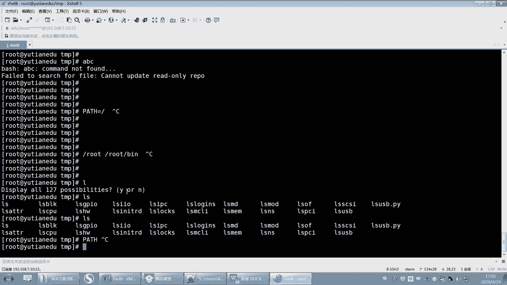

windows里面经常会设置。OK吧。嗯，下面还有一些内容。好，我我把这个把这个说完啊，把这个说完。好，PS one提示符刚刚说过了，pass变量记下来吗？嗯，记下来啊。

这个pass变量就是用户可执行文件所在的目录，就pas在pa变量定义在pass变量里面，它就可以去直接去执行这个命令了啊。

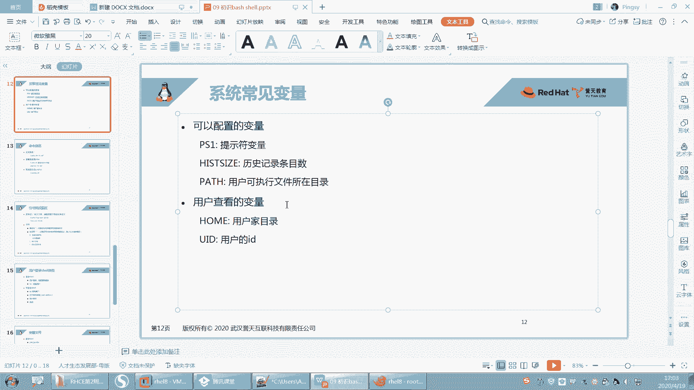

而且他只搜当前目录，不会去找子目录。所以要注意啊。好，还有一个叫黑色size ，黑色size就是我们有一个就是叫历史条目数。好，这个黑色size的大小是1000，看到没有？是1000。那我们的历史记录。

你看这400多了是吧？呃，你还可以再继续执行吗？它可以只它最多就是1000个1000个okK吧，它它会保留1000个。为什么是因为这个变量定义了，它只能保留1000个ok吧。

只能保留1000条历史记录啊，1000条历史记录？

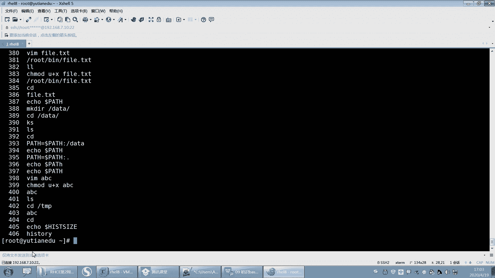

啊，你想改大的话，那你想改成零，它就不保留嘛。你改大的话，它就会保留更多这样子啊，face色 sizeize所以这个变量太多了，一般我们环境变量会定义在ATTC profile里面。啊。

环境变你看这个是不是有一个叫黑色size等于100啊，而且黑色size是不是也。呃，变成环境变量了，就子需里面是可以继承的。呃，还有这个hosse name，像这种大写的是不是都是。变量一看就很清楚嘛。

对吧？大写这种都是变量。

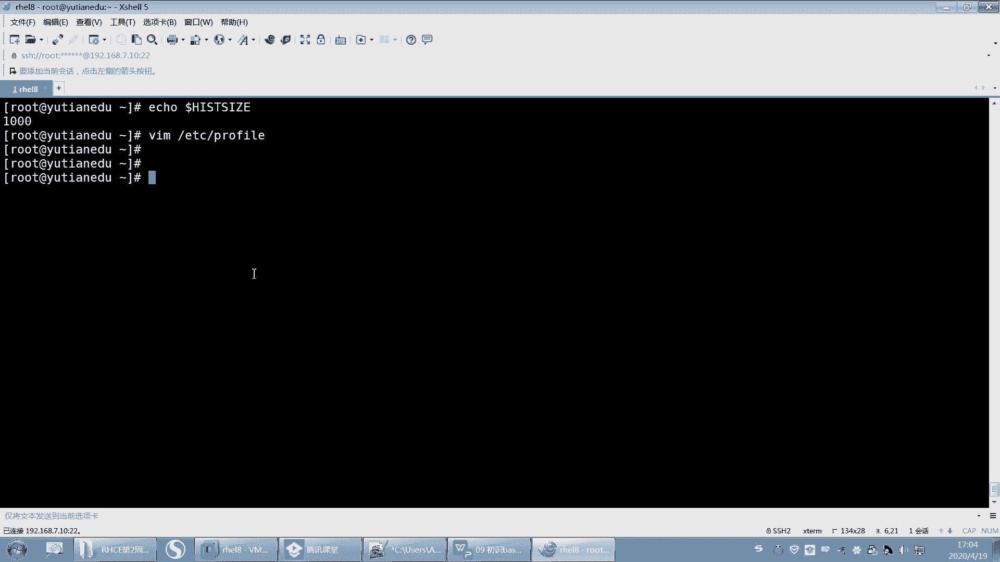

嗯。然后嗯下周我们会讲四个文件。下周我们会讲四个文件啊就是。呃会讲到这四这这这四个文件，他们之间都是因为我们到目前为止我们所说的变量呃，这个hear关了，这个shaar关了，是不是就变量没了呀？

那我想让他把永久保存下来，呃，每次开机都能读到，那我最好就写到文件里面，那我们写文件的一般就会有有几个文件都去放那个变量，那这些文件有什么区别？他们之间怎么怎么样，对吧？

还有sar登录he尔飞登录sha尔等等啊，结果我们后面还会再讲，还会再讲啊。

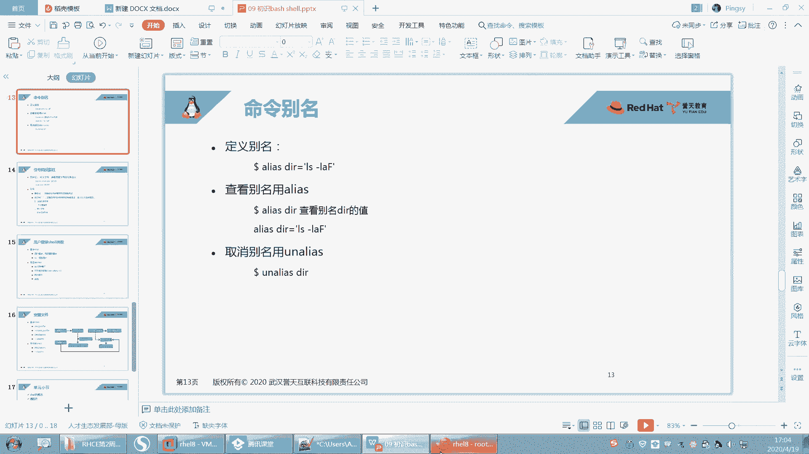

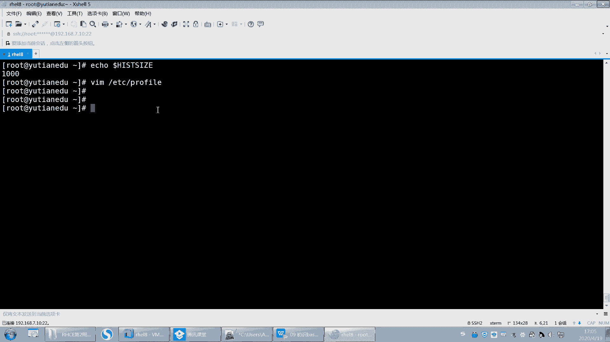

呃，还有呃还有还有啊，这个是我们系统一般可以修改的一些变量啊，但是系统还有一些什么，还有一些用查询的。比如说我可以调用当前用户的UID当前用户的UID我们可以用doll了 uID对吧？

然后doll了 home呃，doll了呃PWD呃，这些什么是不是都是我们。

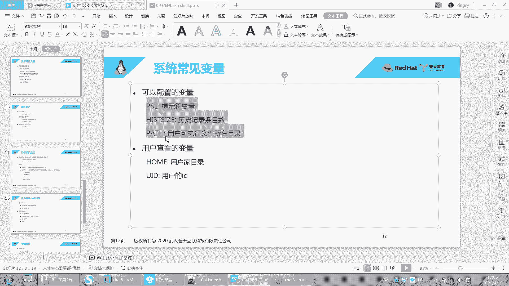

经我们可以去调用的一些变量。这些一般我们不要去修改它，我们修改的就是那个什么pass变量啊，黑色size啊，这种我们系统变量可以修改。但是这种用于查看和调用的这些变量，就要不要去修改它。

这个我们系统去引用它的啊，而且切到不同的用户。其到不同的用户，我们看到的结果是不一样啊，你看看到结果是不一样的。然后UID啊。看到吗？我们可以去调用它好吧，那这个变量有什么用？将来我们写脚本的时候。

我们是不是可以调用哦，当前用户的UID等于谁谁谁就怎么怎么样，对吧？这是不是就可以写判断了，O吧？😊，好。

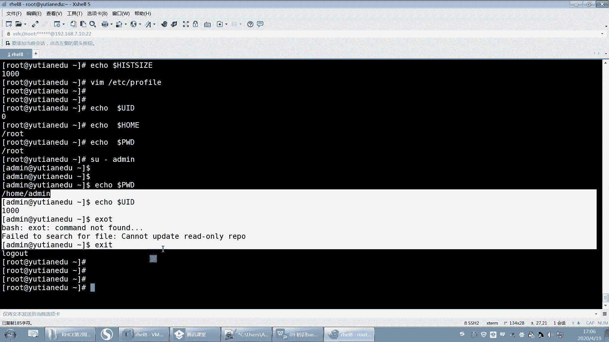

呃。这是变量啊。系统很多这种变量啊，用ENV去查看一下，对不对？好，还有。我再讲一个吧，讲一个我们就下课，好吧，讲一个就下课啊。

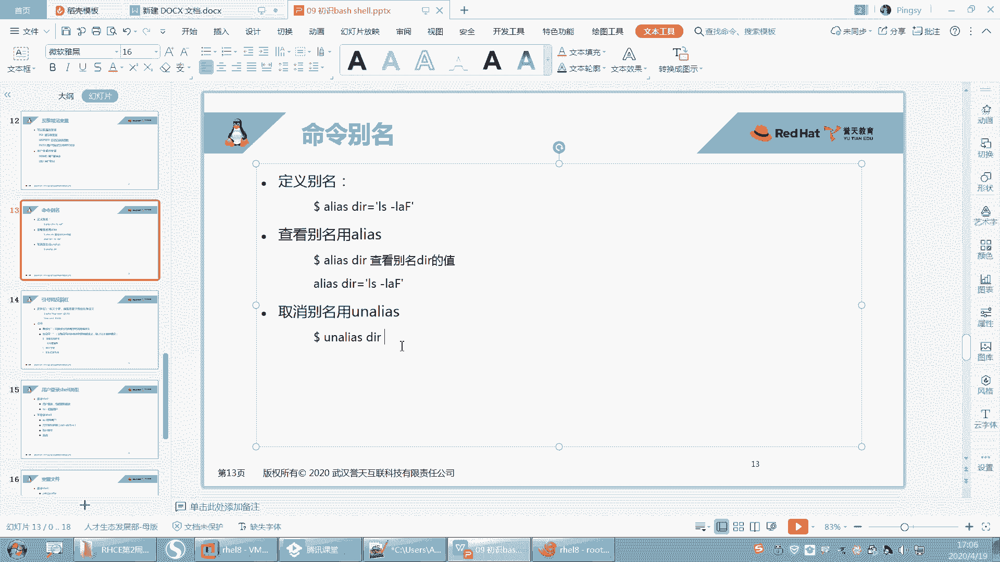

呃，再坚持一下，好吧。呃，下面我们看一下这个别名啊，我们之前讲了很多别名哇，LSLL这种都是别名，对吧？那这个别名怎么去定义的？呃，包括grab，这些都是别名。我们需要学会怎么去定义别名啊。好。

怎么去查看系统当中所有别名呢？爱ice爱ice。

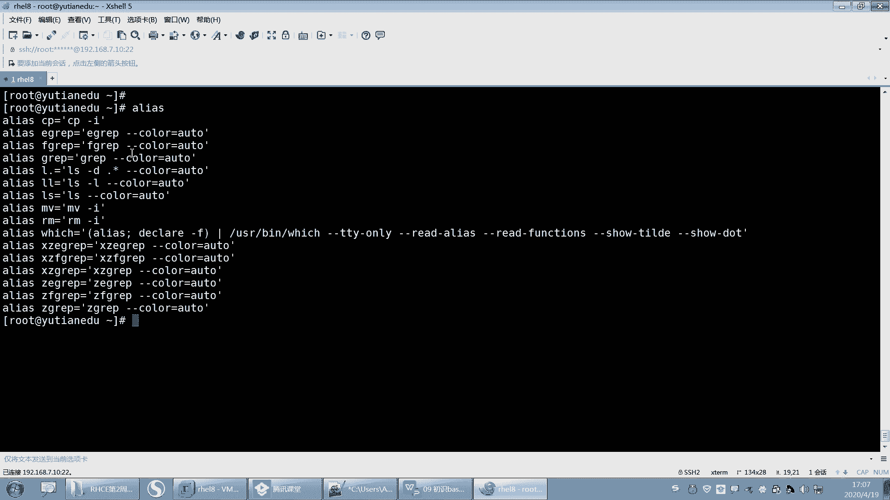

看到没有？

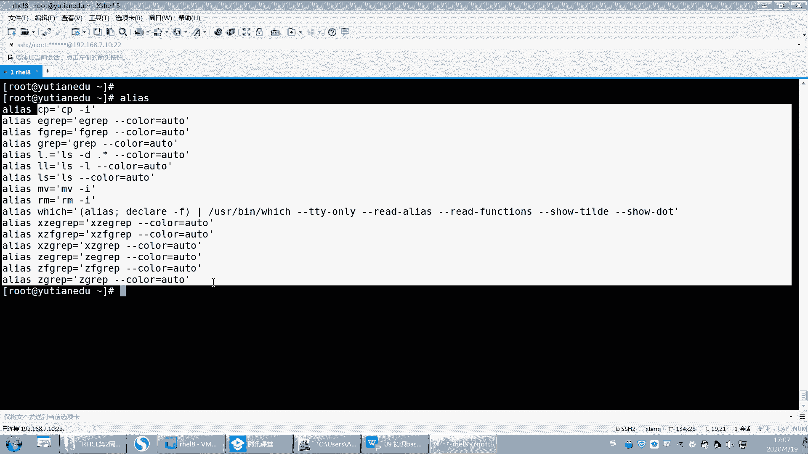

爱丽丝。这个就是我们当前看到的所有便业名。好，这里有个CPCP是不是杠I是个别名啊？Egr到它是个别名，它也是个别名，都是个别名是吧？好，那这些别名我们也可以自己去定义它呀。😊，对不对？好。

那怎么去定义呢？哎，就像有同学说LS就等于什么RM杠RF是吧？这个你想害别人是吧？呃，RM杠F新呃，斜杠这个新是吧？只要一出现L哇。😊，怎么样啊，就相根是吧？好，就开玩笑啊，这个也可以定义啊，对吧？

也是可以定义的啊，你要搞死别人，对吧？你就这样搞，你就这样弄。😊，好，但是我们不要那么坏呀我们不要那么坏呀，好不好。啊，呃，我跟你说，你不坏，别人坏。我跟你说啊。

有的他那个他故意在你的系统里面植入一个脚本。😡，只入脚本呃，只要你呃把那个应用成一装，你一卸载，还有执行RM，只要你卸载触罚，还有执行RM杠RF这样。真的有我我之前见过一个脚本，他就这样害你。对。

害你怎么防把RM怎么样啊？那第一个别名呢，你只能这样子了，你卸载你怎么卸那个有病毒的应用程序，对吧？😡，你就想办法。对。所以这个坑还是蛮多的啊，你只能把RM这个是不是变一下啊，变成LS啊，对吧？

RM等于LS上让它暂时变成LS是吧？好，那我教大家去写一个这样的别名啊，写一个这样的别名。呃，对呃，但是你删掉可以，就是说呃你把你你你要把那个真正的那个文件删打快账号有什么用啊？嗯。嗯。

把RM删掉也行啊，也行。如果是别人用的是你能看到别人的脚本，别人如果用的是这个命令，而不是用的绝对路径，那么你可以把那个pass别量改一下，是不是也可以，对吧？呃，如果别人用的是这个绝对路径。

比如说B下面的B下面的LM，那你就等什么，你就你就得把这个RM这个。命令给删了，要不然你就真的执行了，对吧？好，说了半天教大家怎么去定义这个变量啊，我们定义一个变量，哦，不定义一个别名。

我们就叫copy。啊，我们就定一个无公害的啊，叫copy好，copy我每次去执行copy的时候，帮我执行CP呃CP呃杠RADC呃ADC呃ETC到tamp下。呃，这样就搞个简单的啊，随便。

就每次执行copy就执行这个OK吧啊，每次执行copy执行这个啊。好，那我能不能这样直接等于呢？啊，肯定是不可以的啊。那你这样去等于的话。😡，老师，我直接这样去点等于。没。就搞个中文嘛。2。

你这样等于肯定不行啊。不可以这样啊，你这样等于是不是变量了呀？你是不是要变量啊？没问题吧。你有见过直接执行变量吗？哦，你这意思就是A等于100，然后呃执行A。你没见过这样的吧，是吧？

所以不能这样直接等于那怎么办呢？要加个alice。再加个alice啊，把后告诉哦，它是一个别名，它是可以执行的，然后再来。要用单引号引起来注意。为什么要用单银行引起来？这个是因为啊。

因为有可能在这个里面你会有一些特殊字符。所以我们只是想把这个字符串赋予给什么copy，所以我们用单引号引起来。这个是我们后面要学的，它是可以去掉这个里面所有就相当于是个反斜杠。

只不过反斜杠它只能去它后面那个，那单引号可以去除这个括号里面所有的特殊字符的特殊含义。所以一定要用单引号用单引号引起来啊，以免出错。好吧。好，回车这样的话，这个别名就定义好了。好。

我就可以执行copy了呀，而且我还可以看which copypy。有了吧，是不是有了呀？啊。嗯，OK吧。好，那copy然后回车。好，ASt啊。好，copy。好，复制了没有呢？看一下有了吧。

是不是有ETC了啊，这叫别名啊，叫别名啊。好，当然这个别名呢嗯你看啊你也可以在这里看到alice这里是不是有已定义的，这里不都是语法吗？你如果不记得怎么定义的，这里是不是有。对不对？这里是不是有？啊。

然后这个别名想取消掉怎么办？an爱丽丝。copy它就取消了。叫an al copy就取消了。不过你在这儿所做的操作都只是临时的。也就是说这个here退出了就没有了。

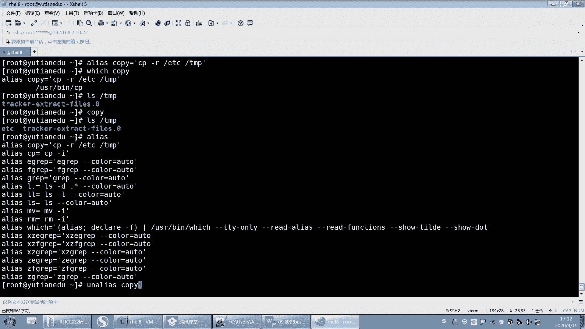

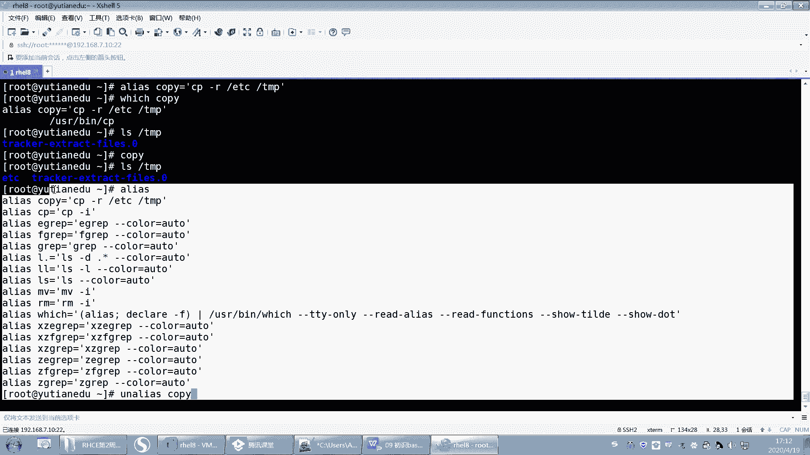

O吧，就只是临时的那怎么让它永久生效呢？下周我们给大家讲，因为后面会讲一些文件结合一起来说啊。

好，会定义别名了吗？是不是很简单呀？