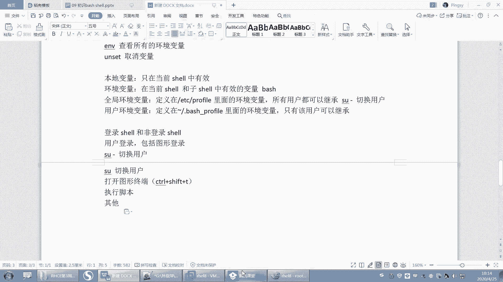

# 【重置详解版】孙老师讲红帽系列视频／RHEL 8.0 入门／红帽认证／RHCE／Linux基础教程 - P40：40 在bashrc和profile等文件中定义变量永久生效 - 誉天孙老师 - BV1aB4y1w7Wi

这个变量就消失了啊，好，什么意思呢？比如说啊我现在。开启了，你看这样是不是开启了一个share啊？那是不是有两个he，这个hear跟这个hear对吧？好，那么这个需要里面我定一个变量。定一个变量啊。

还或者将export又怎么样呢？对吧？啊，将变量环境变量又怎么样呢？但是这个时候如果当我这个shaar退出了，比如说把它退出了ESE退出了，那么这个。A。A是不是就没有了呀，对吧？就没有了。

所以定义变量的那个屑关了，它就没有了，哎，就没有了。但是有些时候我们的变量你会发现它会永久存在。比如说像PS one呢，这个这个提示符啊，或者是我们的pass变量啊，你发现它永远都在，对吧？

它怎么回事呢？它在哪定义的呢？所以如果你想让一些变量永久生效的话，唉，我们就需要把它写在我们的什么写在我们的文件里面。写在我们的文件里面，OK吧。好，今天我们先选第一个文件啊。

第这个文件呢叫profile。这个文件叫profile啊，叫ATTC下面的profile。我们就会发现这个文件里面很多的都是都是一些这个变量啊。你看像这种大写字母。它是个变量对吧？啊。

是代字母带字母的这个字符串一般都是变量啊，而且还加在export了，看到没有？😊，这些变量都export了。对，这是我们系统经常会用到的一些系统变量。比如说pass变量。啊，所以说如果我想去定一个变量。

哎，想去定一个变量啊。想去定一个变量A。好，那么第一个变量A等于100。那么这个时候。你看我定义在文件里面了哟。我把保存下来了是吧，保存下来了啊。😊，好，看好啊。那么这个时候这个A有吗？

但觉这个A有没有啊，我定义在文件里面了，对吧？那按理来说，这个A是不是应该要A就会生效了，对不对？好，但是反而没有生效。对这个变量它是没这个这个这个变量它是没有生效的啊。那么没有生效的话。

我们想让它生效，你必须怎么样？因为这个文件已经写上来了，我们说变量是。😡，在内存当中的一段地址空间，然后给它个地址空间付一个值，对吧？那么它既然写在文件里面呢，我们只是写在磁盘上了。

但是并没有加载到内存当中。所以我们需要把这个文件重新读一遍，读到内存里面啊，读一遍，读到内存里面啊。好，怎么让它读到内存里面呢？我们有一个命令叫sourcece。ss可以将这个文件重新的读一遍。好。

s一下它，是将这个文件重新读一遍啊，然后读到内存当中。那么这个时候我们再来看这个A就有了，看到没有？哎，A就有了啊。那么请问这个变量，这个A变量。它是什么变量呢？他是本地变量还是？

这个A变量是本地变量还是环境变量呢？这个A定义在这个地方，是本地变量还是环境变量啊？呃，这该是环境变量是吧？啊呃，如果是环境面的话，你你你可能是应该有之前有学过的，是吧？好。

那么呃定义它是一个环境变量是吧？啊，不对啊，它不是一个环境变量，它只是一个本地变量。呃，环境变量条件是什么呀？是是不是需要把它给了export一下？这样是不是就变成环金变量了？😡，环境变量有什么特点？

再说一遍啊，环境变量的特点是它的子穴是不是可以读到？它的子序可以读到啊。好，我来说一下，有很多同学。😊，他其实知道source指的是什么，source指的是将这个ATTC profile读到内存当中。

对吧？但是它可能不太理解，你看啊。还是不太理解sourcece的含义啊，我再说一遍，你们可以记一下啊，source加一个文件名，它可以将这个文件的内容读到内存当中，在哪个地方生效呢？

在当前sha尔生效O吧，记住啊，sourcece是将这个文件读一遍，在当前这个sha里面生效了，注意。是不是在这个需要里面生效了呀？好，那假如说我bush一下呢？😊，来A有没有啊？没有了。

我切换到子 share里面，A是不是就没有了呀？说明我刚刚source了一下，是不是只在它所在的这个sha生效了。但是在子 share里面是没有生效的。为什么没有生效呢？是因为你那个A是一个本地变量。

本地变量不能继承到子 share里面。😡，OK吗？这个能不能听懂？这是上周讲过的啊，只不过是我们现在换了一个换了一个什么，换了一个这个文件啊，换成一个文件了。啊，这这个地方能不能理解？好，我退出去了。

然后这个地这个地方你再来看是不是就有了呀？其实我source了一下，是不是相当于我在当前sha直接A等于100这样子啊，OK吧。啊。是不是这样啊？好，那为什么子需要里面没有呢？是因为什么？

是因为我没有将它export啊，没有将它export。对，所以如果我想让它仔细里面生效，那就export a好，你看为什么。😡，这个里面。他们都是不是都export了呀？

因为这个文件里面我们通常放的都是环境变量。所以刚刚有同学说哦，环境变量，因为他可能知道哦profi里面经常放的环环境变量，对吧？但并不是说你把这个变量放到这个文件里面，它就是环境变量。

你要叫它什么export exportport好保存。好，保存之后，我们再来sourcece一下啊。sourcece。啊，s一下之后，这个时候它那个A是不是就变成环境变量了呀？

那么在当前shaar生效了嘛，在当前shaar里面是不是就是就是一个环境变量啊？那这个时候我们来bu一下export dollarA，这个时候是不是就有了，没问题吧。😊，啊，有没有问题啊？

这个地方就有了啊，就是因为我将它export了，在这个sha的子 share里面，哎bush里面bush一下子 share里面它是有的啊。什么叫子 share，记不记得啊？那我是在这个线里面定义的对吧？

然后在这这个线ar里面source的，然后切到这个he里面一执行又有了，对吧？因为A继承到了子线里面啊，A继承到了子线里面。😡，啊，外卖同学有没有问题啊？能不能听懂？这地方一定要听懂啊，呃听不懂的话。

继续不下去了啊。唉。😔，绝大多数同学处于挂机状态。大家把自己的名字改成中文啊，这个中文有什么见不得人吗？好。O。好，这是我们第一个文件啊，叫ETC profile。😊，加ETC profile啊。2。

O。那么这个文件它是一个全局全局的配置文件。注意你看啊，现在如果我切到的命。你看啊我切到addmin，那么我切到d命的时候，它能不能读到A这个变量呢？同样是不是可以读到啊？啊，然后我切到。

比如说我us and userE。好，切到。😔，呃，切到UZ一。好，柚子一有没有呢？注意U则一也有，对吧？所以你定义的这个变量啊。😊，所有的用户都可以读到，注意所有的用户都可以读到，这叫全局环境变量。

叫全局。注意啊叫全局环境变量。所以我们有一句话叫。

啊，叫一个全局环境变量啊，这个我的PPT上没有啊。啊，是定义在。ETC profile里面ETC profile里面啊。一般情况下，我们定义在ETCpro里面啊。对。

我们定义在ETC profilefi里面的环金变量，我们叫全局环金变量。所有用户所有用户。都可以都可以继承啊。对，所有用户登进去都可以什么都可以读到这个里面的变量。所有的用户登进去都可以读到这个变量。

但是前提是你要用SU杠注意。SU杠切换用户啊。

因为在SU杠的时候，它会读到这个文件。嗯，大家都发现我为什么SU杠切到这个用户的时候，没有sources这个文件，反而都有这个值呢？是因为你在SU杠那一瞬间它读了这个文件。

因为相当于这个用户是不是登录了一次，他就会读到这个文件啊，这个所有的用户都可以读到。好，这个先不用管它。好吧，后面会给大家总结哪些读到，哪些读到啊。

好，然后再来啊。呃，那这个叫全局的环境变量，对吧？全局的环境变量啊，那我如果说我us一或者admin都不想等于100。因为就是说。

其他用户都等于100，但是呢我不想等于100，我的命不想等于100。这个时候你就可以切到我的命。😡，在admin的加目录下面。在addmin加目下面有一个文件叫跟它很类似的文件。

叫点bu profile。点bush profile啊，你打开这个点bush profile。呃。哎，点。点80。profill打开这个文件啊。啊，这个文件呢。它指的是用户的用户的一个文件。

因为在用户的加目录下面，对吧？所以如果我定一个A等于200的话，我等于200，你们都等于100，对吧？好，那么同样这个文件也是这样啊，比如说A等于100是本地变量export一下就变成环境变量。

这个我就不演示了，我就不export了啊，就直接A等于100了，所以讲它变量环境变量就export a呀，这是不是一样的呀，对吧？好，那就export吧。去掉啊好，保存。好。

那么这个时候我们说A还是等于100，对吧？因为这个文件一样还没有生效啊，那怎么办呢？s一下。好，sourcece一下sourcece一下这个文件啊，它就生效了。到了A。啊，就等于200了，对不对？

等于200了啊。好了，那这个时候呢，如果我切到userE。哎，user一是不是一样还是等于100呀？因为在user一的加目录下面也是不是也有一个这样的点bush profile啊。

那这个点bu profile里没有没有定义，那么就读的什么读的全局的啊。没问题吧，是不是读了全局的呀？

哦。读的全局的啊读的全局的。好了，那这个叫用户环境变量，我们定义在哪里啊？哎，用户环境变量。一般定义在什么？定义在加目录下面，这个用户的加目录啊。嗯，好。

定义在这个用户的加墨下面有个点bush profile。里面的什么环境变量，一般我们注意啊，你说那我能不能在这里定义本地变量呢？当然也可以了啊，但是我们不建议因为本地变量有本地变量定义的地方，呃。

环境变量最好都定义在就是profile。你就记住哦，它是定义环境变量的那你最好将export一下，对吧？好的环境变量叫用户环境变量啊。哎，就只有什么。该用户可以继承。就只有这个用户可以继承。

但是其他的用户是继承不了的啊，其他用户读不知到，好吧。这个叫用户环境变量。

好，那也就是说其实啊我们这些变量其实都是定义在文件里面的。啊。优先级谁最高？你说呢？刚刚我不就已经测了吗？全局是不是有个A呀？全局有个A，加目录下面有一个呃，全局有个A等于100。

加目下面有A等于200，你说写的高？对吧这个地方是不是用户的维先？嗯。啊，这是用户为先啊，用户为先。OK吧好，呃，那也就是说我们把变量定义在这些文件里面，只要读到了这些文件，我们就可以让这个变量生效了。

对不对？就让这个变量给生效了啊。所以如果你想让这些变量哎，它永远都都在那儿，对吧？不会消失，那你就怎么样定义在文件里面，然后读到读一下这个文件就生效了。对读一下这个文件就会生效了啊。

那你说老师那不是每次都要读这个文件很麻烦吗？好，不慌，慢慢解释啊。😊，啊，你说定义在这里是吧？每次都要读每次都要读才能生效，那这个对吧？就很麻烦。

所以我们后面会有一些叫登录 share和非登录 share的一些呃。😊，这个这个这个设置啊，以免我每次都要去读一下它才能生效，是吧？

好。呃，那这就是我讲的第四个变量啊，本地变量环境变量用户环境变量和呃全局环境变量和用户环境变量啊，用户环境变量记好了吗？下面呢我们要讲两两种surear。两种sh啊。

注意这段是否有点柔一点绕大家认真听啊。你不认真听，记记力不集中的话，这个讲过就嗯讲过就就讲过就没听懂啊。好。看啊，你不要走神儿啊。好，下面呢我们来看一下。登录线和非登录线。嗯，为什么会讲这两个he儿呢？

啊，就是我刚刚说的问题，因为我我每次啊都去读一下这个文件层的生效，那这样不是很麻烦吗？对吧？好，那下面我们用这个方法来解决它啊。😊，什么叫登录线呢？嗯，登录shift啊。

我给大家总结了几种情况是登录线。

一般这两种情况下，你先不管登录线能做什么，你就记住这两种情况下登录线。😡，好，什么登录信，当用户登录的时候，包括图形登录。也就是说呃，你们在登录的时候，比如系统开机了，开机之后，那我在这个地方输入呃。

这是不图形登录，对吧？输入用户名个密码，那这种这是一种信，这叫登录信OK吧，这叫登录信啊。好，还有一种字符界面，字符界面的话，直接就是什么？直接就是这种情况下。

嗯，这种情况下输入用户的一个密码，这种也是什么？也是登录线啊也是登录线，反正就是登录了，就登录线。

啊，包括字符界面和图形界面啊。好，那么还有一种情况下是登录he尔。这种情况下SU杠。注意SU杠是登录he啊。SU杠式登录线注意记住好啊，记好啊，SU杠式登录线。那SU是什么呢？

那反过来SU就是非登录 shareSU是非登录线啊，所以非登录线呢，我也给大家总结了几种情况啊。啊，什么是非登录sha呢？啊，第一种情况啊第一种情况，这下面是非登陆穴啊，嗯有的经常分不清，然后这样。

对吧这是一种登录。好，还有一种登录叫sme，他说老师这样也登过来了呀。😊，你发现这样登过来怎么样啊？加木都没有变的。那这个加木路是不是就是它的一个变量啊，变量决定的，那变量都没有变过来啊。

所以这两种线要是不一样的，这种线要跟这种线要是不一样的啊。所以我们建议哪种推荐哪种呢？推荐这种SU杠minSU杠min啊。好，先记住。😊，这个呢下面这个叫非登录here。非登录share啊。好。

那么这两个的区别在于，注意SU杠dmin。我今前会经常会举个例子啊，呃这个呢是。完完全全的变成这样一个人，就说你本来是root，对吧？然后你变身嘛啊完完全全的变成了一个addmin。啊。

就是你从一个人变成妖怪是吧，或者变成一个神仙啊。啊，那就变身嘛。好，那么第二种情况是你是不是要切换呢？你从root变成addmin，对吧？那第二种情况就是你你变呢，你变到一半怎么样，你只变身一半。

也就是说你。😡，是一半addmin，还有一半的什么root的身份。哎，就是你人嘛，你变成妖，对吧？那你变成人妖啊。😡，啊，人变的神仙，那就什么东西啊，不知道。😡，所以这两种是有区别的啊。

这个是完完整整的变成这个人。而这种情况是你还留有root的一些属性，能不能理解？嗯，这两种好。

啊，等于说什么属性呢？我们后面讲啊。好。

那还有一种叫非登录线。注意啊，看在这里啊，就是说我在这儿不是经常会这root。这样子是吧，然后登录了啊，注意哦我在这样登录的时候，是不是登录信儿啊？😡，我在登录时候是登录线啊。

然后登进来了登进来啊没登进来是吧？😊，等一下啊。好，这样登进来之后，我在地方是不是打开一个终端啊，我打开终端。😊，这个终端是不是开启了一个share啊？😡，那么这个here叫什么here呢？

叫非等物he。能理解吗？叫非登录share。因为我在这儿其实并没有登录，只是打开一个终端，这个终端叫非登录share啊，记好啊，第二种情况。

啊，将来我们学脚本的时候我们学脚本的时候啊，我们。那个here叫非登录here。叫非登录 share，还有其他的很多很多情况都是非登录 share。那你怎么去区分，你只需要去区分它是登录线吗？不是。

基本上就是非登录信。登录信就两种情况吧，一个是用户登录和保护图形，对吧？然SU杠。那么下面这4种呢呃基本上都是非登录 share啊，非登录信。好，那么登录here跟非登录hehere我们说了。

登录he是完完整整这个变成这个人，就是变身人。我刚刚举那个例子能理解吗？就完完整整的变成这个人了。

你看啊我如果在这注销一下，对吧？换一个用户登录，那是不是完完整整变成另外一个人啊，对不对？或者我在这儿SU杠。😡，这样是不是完完整整的变成一个admin了呀？

我我这个需是不是就是就是admin share，对吧？😡。

好。那下面这种情况呢？😡，你说我说过它带有什么，带有你的富 share的一些，就是可能带有一些这个这个这个前一个用户的一些属性啊。好，那具体是什么区别？在于变量的区别。其实就是变量的区别。

就是变量的区别啊。好，那么我们刚刚讲了四呃两个文件，一个是DTC上面profile，还有一个是点bush profilefi，对吧？好，现在我们再加两个文件啊，再加两个文件。好，加两个文件。这样吧。😔。

啊，这不是有你看啊这四个文件把它列出来啊，再加两个文件，一个文件是ETC下面的。霸喜而C。还有。加目录下面的点8小2RC。加这4个文件啊。好。而登登录线呢，它只能读到这两个文件。好，再说一遍啊。登录序。

在你执行登录C的时候，它会读到这四个文件。因为这四个文件通常是我们在放变量的，嗯，通常我们变量都会放在这四个文件里面。而非登录呢是读不到这两个文件的，是读不到这两个文件的，看好没有？

是读不到这两个文件的啊呃，它只能读到什么，只能读到ETC下面的把小RC和什么呃加目录下面的把斜RC。

，下面我举个例子啊，我举个例子。嗯嗯。嗯，我先把之前的那个哦，算了，我重新定一个变量啊。或者把之前的这个先给删了啊。我们重新来好吧，重新来啊。看好啊。我先把之前的环境清一下啊，把这个删了。好。

我们把在隔壁打开一个在隔壁打开一个he啊。好，你看我这样打开一个here，这个hirre叫什么？这个here是不是叫非登录here啊，是不是叫非登录here，对不对？😊，好，把这个关掉啊。好。

然后再打家看一看。OK好，像这样清空了啊，然后A是没有了，然后反正都没有了嘛，呃，切到addmin。然后。是不是也没有对吧？好，先清空了啊。好，现在我定一个定一个变量。😊。

注意我现在全部定义的本地变量啊，叫A等于100。😊，好，待会儿要回答我先这地方先不用记啊。嗯，待会儿要回答我的问题啊。好，然后是这个我第一个的min吧，我在的命的加目下面。Profi。哦。

点b profile。好，在addmin加目下面点第一个B等于200。B等于200啊，然后在。ETC8小C。霸2C下面第一个C等于300。好，然后。在aldmin加目录下面。

点把小C下面第一个D等于400。

好，也就是说我在这四个文件里面依次定义了A。啊，定义了B。呃，定义了C。呃，定义了D是这样吧，OK吧。啊，在这个文件定义A这个文件定一B这个文件定义C这个文件D一D好，下面来开始回答我的问题啊。😊。

注意，现在我们SU杠注意哦。SU杠这样吧，我再创建一个用户啊，叫U2。呃，悠着3吧。好，切到U的3啊。嗯，或者。嗯。慢慢来吧，好，祈祷我的命。看好啊，祈祷的命。好，请问A有没有啊？A好。A有没有啊。

这样吧，我祈祷的命之后，大家只需要回答哪几个有，你写ABCD就可以了啊。

2。我如果切到A的话，我切到dmin的话，那ABCD哪个有呢？ABCD哪个有呢？有同学说必有是吧？我祈祷的命。啊。你思考一下，我切到的命。那么这个波浪号我是在addmin啊。

这个波浪号我是admin吧啊admin就这样是吧？是这样吧。有D啊。那这个都没有吗？这个没有吗？这个没有吗？😡。

O。很好啊，ABCD啊ABCDO都有好A。A是不是有啊，B是不是有啊，然后是C是不是有啊，D是不是都有啊，为什么都有啊？首先第一个。

addmin，这是不是全局的呀？这是不是全局的，而且关键是我这是什么，我这是登录谢尔啊，我这是不是登录he尔啊，那登录谢尔，所以这四个文件是不是都可以读到四个文件都可以读到，你说有没有？😡。

肯定有啊。而且。这个用户的这个用户的是不是admin啊，我就去他addmin嘛。😡，嗯，addmin我在addmin加目中是不是定义的这个B呀？addmin加目中定义的D啊，CBC都有啊。

又又它有还有什么，又是登录线O吧。好，那再来啊。😊。

退出来退出来了哟。退出来之后，你看我SU杠那一瞬间是不会读4个文件呀？SU杠那一瞬间会读四个文件啊。好。OK那我现在退出来了哟，推出来之后我们再来啊切到。😊，我看切到谁啊。好，去到U是柚子3。

啊，请告诉我Uer3。哪个有？Uer3，我记到user3哪个有啊？还是ABCD啊。okAC对AC啊AC因为user3这个跟user3没有关吧，这个跟user3没有关吧。因为这是admin嘛。

所以user3可以读到这个跟这个注意我都是登录线，所以我考虑是这个这行，所以AC有啊，AC有对O。

好，A。B。Sa。😔，D好了，OK吧。好，那再退出来S注意哦，退出来了哦，SU amin。

非登录he，请告诉我哪个有。是不是这个呀？是不是这个CABCD啊，没有ABCD了啊。没有AB了，AB是登录sure，我现在是非登录sure哎。

我现在是非登录信儿啊，所以A有没有呢？没有B，有没有呢？没有。好，C。有吧，D是不是有啊？啊，C有D有啊，因为C是全局的，全局的D是用户的，用户，刚好是admin好。

SUU的3，请告诉我哪个有。SUU的3，请告诉我哪个有。

ううん。好，很好啊，C对吧？是不是只有C有啊，现在能理解了吗？现在能不能理解这四个文件了呀？😊，那。啊，没有是什么意思？没有理解。那C是不是有了，C是300对吧？C300其他都没有啊，其他都没有。

因为首先我是什么非登录 share，那非登录 share只能读到什么两个文件对吧？只能读到两个文件。那么这个文件是不是任何用户都可以读到，所以C一定会有注意C一定会有。

那么这个呢波浪号加点是不是只有呃的命有啊，其他用户都没有啊，us3是不是也没有。

对吧user3也没有啊，所以其实很好判断。很好判断，你只要看你是登录线还是非登录线儿。登录需要4个文件可以读到那四个文件首先。那个那个那个那个那个那个变量是定义在我的什么呀？反正A跟C肯定会有对吧？

在登录里面，X肯定会有。那看B跟D有没有要看什么，是不是要看它是不是我的加目啊，是不是在我的加目下定义的，对不对啊，那这个就是登录嘛，如果是非登录sha的话，怎么办？非登录share的话，那我就怎么样？

我们就看这两个那就看这个是不是一定会读到那这么这个能不能读到，是不是要看是不是在我加目下面定义的。如果不是，那就读不到啊，其实很好很好区别啊，很好区别。😊。

好，那你看我这样啊，我每次怎么样啊，我我这里我看我在当前这个hear里面是不是都没有啊？😡，你要我到当前这个 share里面是不是什么都没有啊，什么都没有什么都没有，对吧？

因为我当前这个 share是没有读没有读到这四个文件的那你说老师啊，那你这样每次要读到这四个文件呃，是不是都要切换一个用户才可以读啊，哎，确实是这样那。😡，对吧你要切到一个用户。

是不是才可以读到那四个文件，是不是这样啊？啊，那你这在不是很麻烦吗？那怎么办呢？我跟你说啊。😊，那我每次都要去读一下那个文件才能那个那个呀。你重启了之后，注意你重启之后，你重启是什么事儿啊？

你重启之后登录进来，是不是叫登录信？所以当你重启之后。你当你登录那一瞬间，你四个文件都读到了啊，当然你这个你要看什么，就要看是哪个用户了，就会你会读到四个文件。😡，啊，那你再开启hear。

是就非登录hear？嗯，开启share就非登录share对吧？好，那我在开启share的时候，非登录share。那么这个非登录share会读到哪两个文件呢？是不是会读到这两个文件呀？😊。

所以在开启he里面。在开启的序里面会读到这两个文件，对吧？那么这个文件跟这个文件是不是读不到，这两个文件是不是读不到？就是你重启之后K吧？开启一个打开一个终端，是不是只有读到这两个文件啊。

这两个文件是不读不到啊？那意思就是说我这样打开一个终端，那打开这样一个终端。那这个终端里面，这个终端是没有办法去继承这两个文件里面的变量啊？😊。

那我怎么让他去继承啊？😡，我那为什么我我这个地方我打开这个终端，这个pass频量我确实继承了呢？😡，啊。这个是由什么来做到的呀？😡，这个变量明明定义在profi里面呀。那我这样打开一个终端。

怎么就读到了呢？怎么就会有这个变量呢？😡，啊，怎么会有的呀？我再打开这个终端，有没有读到ETC profile啊？😡，没有吧啊，不是因为它是全局的，是因为它是什么？是因为他是。环境变量是。

我这个开启个here，这个here是不是相当一个子here啊？😊，其实我们所有的surear都是子 share。😡，嗯，你终端开启那个shift。他是富信儿，你有了富泻儿是不是才会有这样子信儿啊？😊。

对，是因为子虚而继承了啊。那这我开这个终端什么呀，是不是都是因为ETC profileETC profile。😊，是不是定义的环境变量啊？对吧你在登录的时候，这个文件是不是就读到了呀？

那你后面再开启其他的share的时候，那么这些share是不是会继承这里面的环境变量啊？😡，是不会继承呢？能理解我说的意思吗？所以为什么我开启终端的时候，其实并没有读到ETC profile。

但是它也有那个pass频量啊，是因为怎么样？是因为pass变量继成了，它的子序里面都可以有。😡，哦，OK吧。嗯。而且我bu一下，注意，其实我在bush的时候，这个它就是一个非动物 share。

在这个非动芯里面，为什么也有什么？也有pass别量啊，因为它怎么样继沉了。对，这样依次往下记沉了啊。

好了吧，这四个这个能不能理解了，可以理解了吧。这两个是不是登录shaar的时候啊，呃就所有share都可以读到，对吧？呃，这两个是什么？登录shaar的时候才可以读到啊，登录here才可以读到。😊，好。

有有一点点复杂啊。其实呃这个为什么给大他家讲这个呢？就是因为将来你定定义变量的时候，一般我们都定义在哪个地方啊？比如说你要定义环金变量了。😊。

如果是全局的对吧？是不是定义在ETC profile里面啊？啊，如果是如果是什么？如果是用户的那就定义在什么点b是什么profi里面啊，是不是这样啊？好，那么你像我们啊定义别名，别名其实也是一种变量。

只不过这个别名比较特殊。一般你像我们别名它会定义在哪里呢？它会定义在呃，你看你的加目下面啊。在你的加目下面。咦。在你的加目录下面会有一个点buRC的，你看这里是不是会有别名啊，对吧？别名啊。

我们考试就一道这样的题目，还要求你定一个别名。就像我刚刚呃刚刚给大家出题那个那个作业里面有一道题，我说定一个别名好，但是我要求如果说所有的用户都可以读到。一般我们别名啊。

如果是用户的就定义在这个文件里面。如果是全局的就定义在ATTCbu2C里面啊。😊，嗯，也就寄存在ETC小2C里面啊。O吧，就定义在这个地方。呃，定义在这个文件里面都是都是OK的。所以。呃。

因为如果你定义在ETC profile里面的话。嗯，那么有些时候他的信有的信读不到的。嗯，能理解吧？因为那个变量啊。不是那个那个那个别名啊，你怎么让别名变成环境变量呢？所以这个变变不了啊。

所以呢呃我们一定把定义在这个pro呃把小C里面，这个所有用户都可以读到。如果是某个用户都读到，就加目下面的点把小C。嗯嗯，好。

所以你只要记住定义全局的别名在ETCbRC定义用户的别名在点buC记住就好了啊。

啊。嗯，好了，我们来看一下这张图啊，我给大家画了，我给大家画了一张图。在这里看到没有？嗯，然后这里有个登录sha可以读到这四个文件，对吧？然后非登录sha尔是读到这两个文件，而且它们之间是读是有顺序的。

嗯，你你知道为什么刚刚那个用户的变量比那个呀。这怎么少了一个？嗯，用户的变量为什么比那个呃用户的环境变量，为什么比全局的环境变量要要那个要。这个怎么搞？啊，看这里啊，你如果你是登录he的时候。

它有个顺序，就是你登录he会读到什么？ETC呃ETC profile，然后再读到是不是加目下面的点呃，加目点 profile。所以如果你在这地方定一个A等于什么？你看如果你定一个A等于100。😊，嗯。

那么这个地方也定一个A等于200。那你说它最后的值等于哪一个呀？最后值是不是肯定等于A等于200呀？因为这个是不是相当于覆盖了呀？这个没问题吧，因为是先读的这个再读的这个啊，然后再开始操作bush对吧？

而且读到这个呃波浪号下面的点bu为什么会读到这两个文件，是因为这样这样这样这样就连过来的。啊，它有个读读取顺序，这样读取顺序啊，所以才会有这样的优先级。呃，然后读这个文件就会读到这个文件跟这个文件是吧？

然后非登录线呢，它就直接读到什么加目下面点把小C，而且这两个是先读这个再读这个，所以这两个就反过来了，还先读加目下面点把小C，然后再读什么ETC下面的点把小C。所以当你去定义。😊，呃，这个。

这个这个点把小C和ETC下面8小C的时候，你就要你就要注意了，他们两个不一定定义在加木下面的就优先级高，不一定定义在这个下面就优先级低。所以这个要看读取顺序的啊，要看这个读取顺序。OK吧。啊。

这张图怎么偏了？